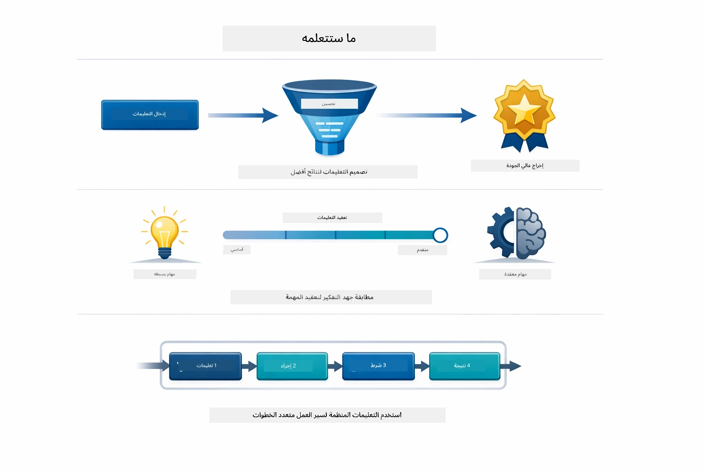
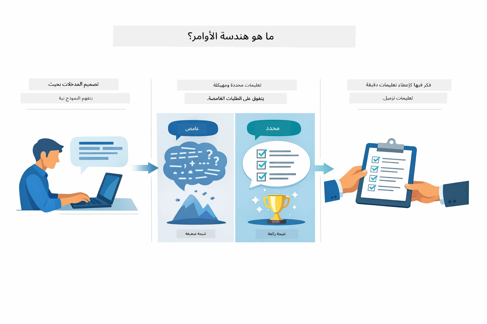
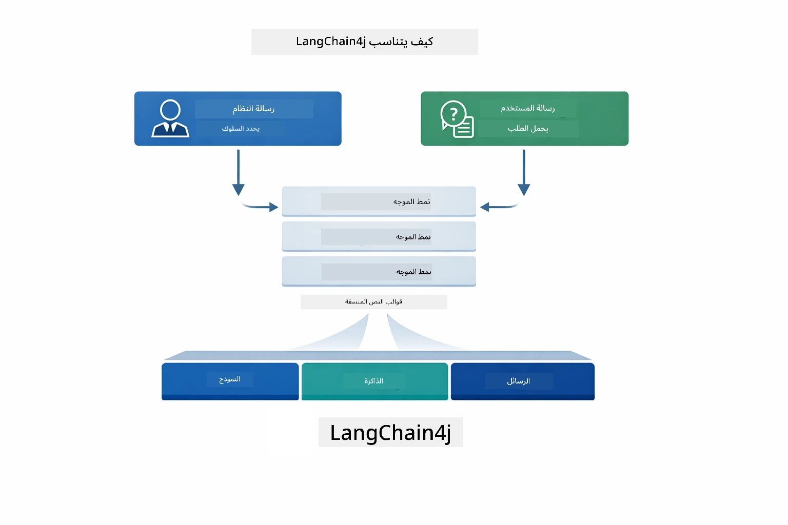
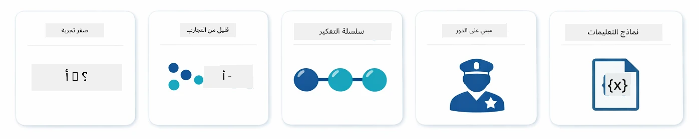
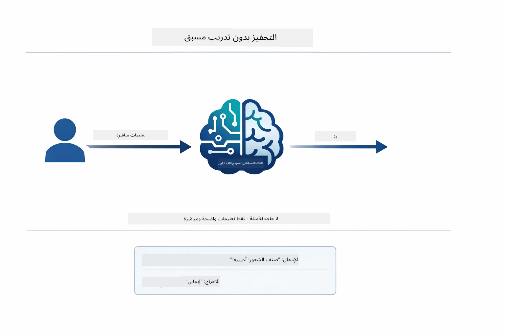
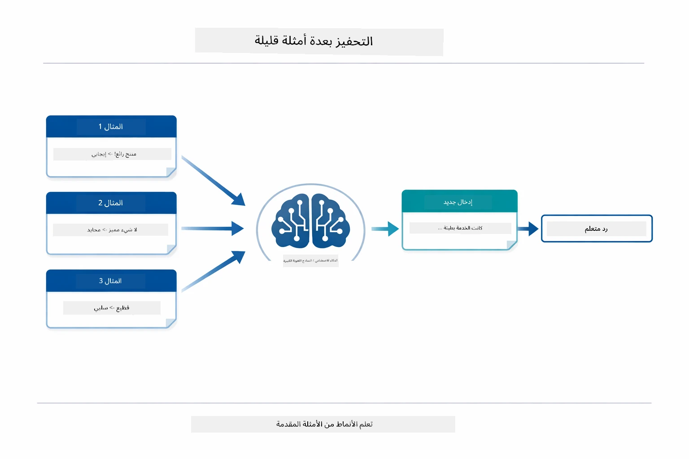
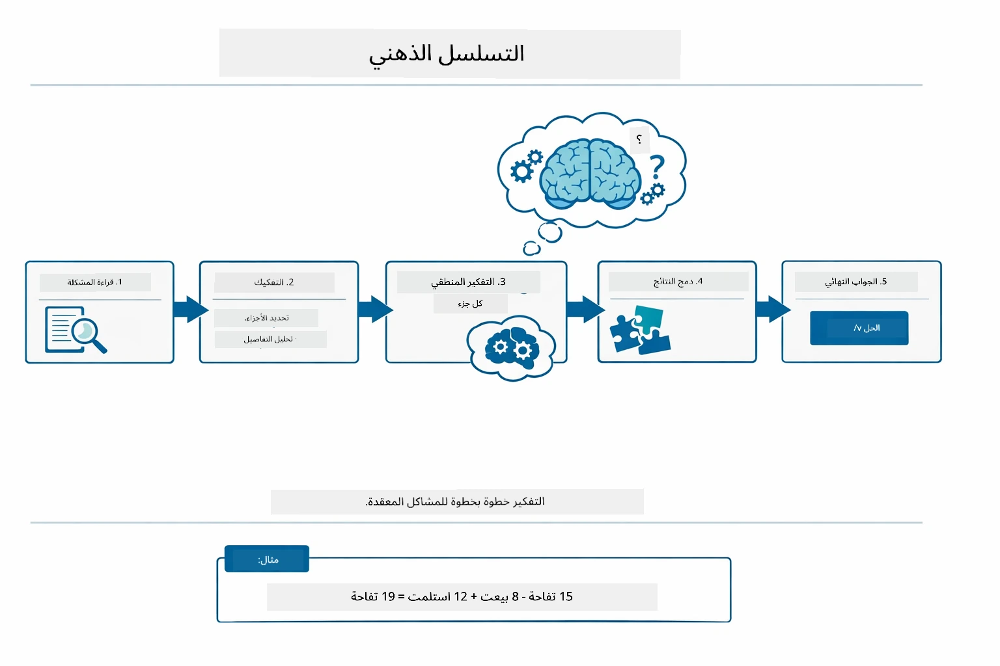
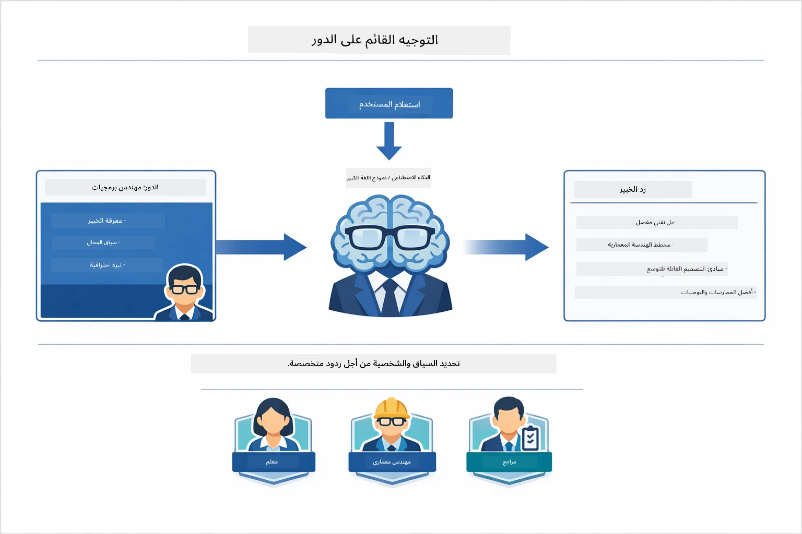
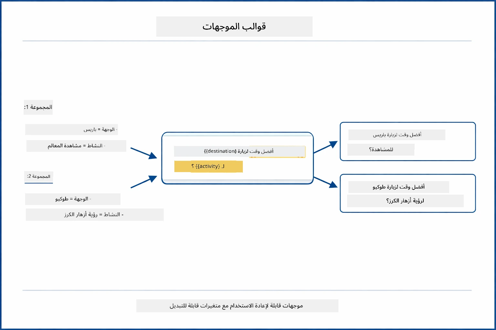
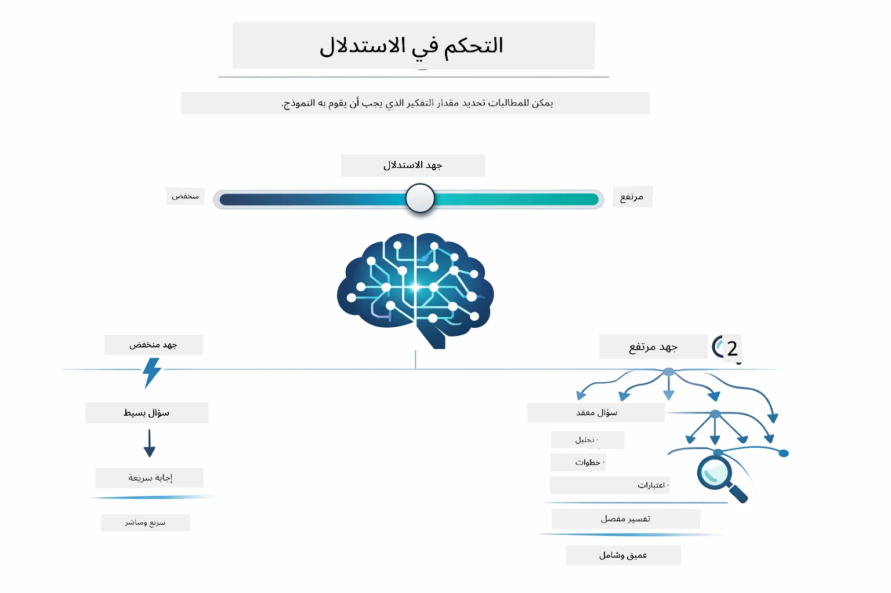

# الوحدة 02: هندسة المطالبات مع GPT-5.2

## جدول المحتويات

- [جولة الفيديو](../../../02-prompt-engineering)
- [ما الذي ستتعلمه](../../../02-prompt-engineering)
- [المتطلبات المسبقة](../../../02-prompt-engineering)
- [فهم هندسة المطالبات](../../../02-prompt-engineering)
- [أساسيات هندسة المطالبات](../../../02-prompt-engineering)
  - [المطالبة بدون أمثلة](../../../02-prompt-engineering)
  - [المطالبة مع بعض الأمثلة](../../../02-prompt-engineering)
  - [سلسلة التفكير](../../../02-prompt-engineering)
  - [المطالبة المعتمدة على الدور](../../../02-prompt-engineering)
  - [قوالب المطالبات](../../../02-prompt-engineering)
- [الأنماط المتقدمة](../../../02-prompt-engineering)
- [تشغيل التطبيق](../../../02-prompt-engineering)
- [لقطات شاشة للتطبيق](../../../02-prompt-engineering)
- [استكشاف الأنماط](../../../02-prompt-engineering)
  - [حماس منخفض مقابل حماس مرتفع](../../../02-prompt-engineering)
  - [تنفيذ المهمات (مقدمات الأدوات)](../../../02-prompt-engineering)
  - [كود التأمل الذاتي](../../../02-prompt-engineering)
  - [التحليل المنظم](../../../02-prompt-engineering)
  - [الدردشة متعددة الأدوار](../../../02-prompt-engineering)
  - [التفكير خطوة بخطوة](../../../02-prompt-engineering)
  - [الإخراج المقيد](../../../02-prompt-engineering)
- [ما الذي تتعلمه حقًا](../../../02-prompt-engineering)
- [الخطوات التالية](../../../02-prompt-engineering)

## جولة الفيديو

شاهد هذه الجلسة الحية التي تشرح كيفية البدء مع هذه الوحدة:

<a href="https://www.youtube.com/live/PJ6aBaE6bog?si=LDshyBrTRodP-wke"></a>

## ما الذي ستتعلمه

يوفر الرسم البياني التالي نظرة عامة على الموضوعات والمهارات الرئيسية التي ستطورها في هذه الوحدة — من تقنيات تحسين المطالبات إلى سير العمل خطوة بخطوة الذي ستتبعه.



في الوحدات السابقة، استكشفت التفاعلات الأساسية مع LangChain4j باستخدام نماذج GitHub ورأيت كيف تُمكّن الذاكرة الذكاء الاصطناعي المحادثي مع Azure OpenAI. الآن سنركز على كيفية طرح الأسئلة — أي المطالبات نفسها — باستخدام GPT-5.2 من Azure OpenAI. الطريقة التي تبني بها مطالباتك تؤثر بشكل كبير على جودة الإجابات التي تحصل عليها. نبدأ بمراجعة تقنيات المطالبة الأساسية، ثم ننتقل إلى ثمانية أنماط متقدمة تستفيد بالكامل من قدرات GPT-5.2.

نستخدم GPT-5.2 لأنه يقدم تحكمًا في التفكير - يمكنك إخبار النموذج بكمية التفكير المطلوبة قبل الإجابة. هذا يجعل استراتيجيات المطالبة المختلفة أكثر وضوحًا ويساعدك على فهم متى تستخدم كل طريقة. سنستفيد أيضًا من حدود المعدل الأقل لـ GPT-5.2 في Azure مقارنة بنماذج GitHub.

## المتطلبات المسبقة

- إكمال الوحدة 01 (نشر موارد Azure OpenAI)
- ملف `.env` في الدليل الجذري يحتوي على بيانات اعتماد Azure (تم إنشاؤه بواسطة `azd up` في الوحدة 01)

> **ملاحظة:** إذا لم تكمل الوحدة 01، اتبع تعليمات النشر هناك أولاً.

## فهم هندسة المطالبات

في جوهرها، هندسة المطالبات هي الفرق بين التعليمات الغامضة والتعليمات الدقيقة، كما يوضح المقارنة أدناه.



هندسة المطالبات تتعلق بتصميم نص الإدخال الذي يعطيك النتائج التي تحتاجها بشكل مستمر. الأمر لا يقتصر على طرح الأسئلة فقط - بل يتعلق بهيكلة الطلبات بحيث يفهم النموذج بالضبط ما تريد وكيفية تقديمه.

فكر في الأمر كما لو كنت تعطي تعليمات لزميل. "أصلح الخطأ" غامض. "أصلح استثناء المؤشر الخالي في UserService.java السطر 45 بإضافة فحص للقيمة null" محدد. نماذج اللغة تعمل بنفس الطريقة — الدقة والهيكل مهمان.

يوضح الرسم البياني أدناه كيف يندمج LangChain4j في هذه الصورة — حيث يربط أنماط مطالباتك بالنموذج من خلال الوحدات الأساسية SystemMessage و UserMessage.



يجلب LangChain4j البنية التحتية — اتصالات النموذج، الذاكرة، وأنواع الرسائل — في حين أن أنماط المطالبات هي مجرد نص منظم بعناية ترسله عبر هذه البنية التحتية. الوحدات الأساسية الرئيسية هي `SystemMessage` (التي تحدد سلوك وال دور الذكاء الاصطناعي) و`UserMessage` (التي تحمل طلبك الفعلي).

## أساسيات هندسة المطالبات

تشكل التقنيات الأساسية الخمسة الموضحة أدناه أساس هندسة المطالبات الفعالة. كل واحدة تعالج جانبًا مختلفًا من كيفية تواصلك مع نماذج اللغة.



قبل أن نغوص في الأنماط المتقدمة في هذه الوحدة، دعنا نراجع خمس تقنيات أساسية في المطالبة. إنها اللبنات الأساسية التي يجب أن يعرفها كل مهندس مطالبات. إذا كنت قد عملت بالفعل عبر [وحدة البداية السريعة](../00-quick-start/README.md#2-prompt-patterns)، فقد رأيت هذه التقنيات تعمل — وإليك الإطار المفهومي وراءها.

### المطالبة بدون أمثلة

النهج الأبسط: تعطي النموذج تعليمات مباشرة بدون أمثلة. يعتمد النموذج كليًا على تدريبه لفهم وتنفيذ المهمة. يعمل هذا جيدًا للطلبات المباشرة حيث السلوك المتوقع واضح.



*تعليمات مباشرة بدون أمثلة — يستنتج النموذج المهمة من التعليمات فقط*

```java
String prompt = "Classify this sentiment: 'I absolutely loved the movie!'";
String response = model.chat(prompt);
// الاستجابة: "إيجابي"
```
  
**متى تستخدم:** التصنيفات البسيطة، الأسئلة المباشرة، الترجمات، أو أي مهمة يمكن للنموذج التعامل معها بدون توجيه إضافي.

### المطالبة مع بعض الأمثلة

قدّم أمثلة توضح النمط الذي تريد أن يتبعه النموذج. يتعلم النموذج شكل الإدخال-الإخراج المتوقع من أمثلتك ويطبقه على مدخلات جديدة. هذا يحسن الاتساق بشكل كبير للمهام التي لا يكون فيها النمط أو السلوك المرغوب واضحًا.



*التعلم من الأمثلة — يتعرف النموذج على النمط ويطبقه على مدخلات جديدة*

```java
String prompt = """
    Classify the sentiment as positive, negative, or neutral.
    
    Examples:
    Text: "This product exceeded my expectations!" → Positive
    Text: "It's okay, nothing special." → Neutral
    Text: "Waste of money, very disappointed." → Negative
    
    Now classify this:
    Text: "Best purchase I've made all year!"
    """;
String response = model.chat(prompt);
```
  
**متى تستخدم:** التصنيفات المخصصة، التنسيق المتسق، المهام الخاصة بالمجال، أو عندما تكون نتائج المطالبة بدون أمثلة غير متسقة.

### سلسلة التفكير

اطلب من النموذج عرض تفكيره خطوة بخطوة. بدلاً من الانتقال مباشرة إلى إجابة، يقسم النموذج المشكلة ويعمل على كل جزء بشكل صريح. هذا يحسن الدقة في مسائل الرياضيات والمنطق والتفكير متعدد الخطوات.



*التفكير خطوة بخطوة — تقسيم المشاكل المعقدة إلى خطوات منطقية صريحة*

```java
String prompt = """
    Problem: A store has 15 apples. They sell 8 apples and then 
    receive a shipment of 12 more apples. How many apples do they have now?
    
    Let's solve this step-by-step:
    """;
String response = model.chat(prompt);
// يوضح النموذج: ١٥ - ٨ = ٧، ثم ٧ + ١٢ = ١٩ تفاحة
```
  
**متى تستخدم:** مشاكل الرياضيات، الألغاز المنطقية، تصحيح الأخطاء، أو أي مهمة تحسين فيها عرض عملية التفكير دقة وثقة.

### المطالبة المعتمدة على الدور

حدد شخصية أو دور للذكاء الاصطناعي قبل طرح سؤالك. يوفر هذا سياقًا يشكل نبرة وعمق وتركيز الرد. "مهندس برمجيات" يعطي نصائح مختلفة عن "مطور مبتدئ" أو "مدقق أمني".



*تحديد السياق والشخصية — نفس السؤال قد يحصل على رد مختلف بناءً على الدور المعين*

```java
String prompt = """
    You are an experienced software architect reviewing code.
    Provide a brief code review for this function:
    
    def calculate_total(items):
        total = 0
        for item in items:
            total = total + item['price']
        return total
    """;
String response = model.chat(prompt);
```
  
**متى تستخدم:** مراجعة الكود، التعليم، التحليل الخاص بالمجال، أو عندما تحتاج ردودًا مصممة لمستوى خبرة أو منظور معين.

### قوالب المطالبات

أنشئ مطالبات قابلة لإعادة الاستخدام مع متغيرات مكانها. بدلاً من كتابة مطالبة جديدة في كل مرة، عرّف قالبًا مرة واحدة واملأه بقيم مختلفة. يسهل LangChain4j باستخدام صنف `PromptTemplate` مع الصياغة `{{variable}}`.



*مطالبات قابلة لإعادة الاستخدام مع متغيرات مكانها — قالب واحد، استخدامات كثيرة*

```java
PromptTemplate template = PromptTemplate.from(
    "What's the best time to visit {{destination}} for {{activity}}?"
);

Prompt prompt = template.apply(Map.of(
    "destination", "Paris",
    "activity", "sightseeing"
));

String response = model.chat(prompt.text());
```
  
**متى تستخدم:** استفسارات متكررة مع مدخلات مختلفة، معالجة مجموعات، بناء سير عمل ذكاء اصطناعي قابل لإعادة الاستخدام، أو أي سيناريو تبقى فيه هيكلية المطالبة نفسها لكن البيانات تتغير.

---

تعطيك هذه الأساسيات الخمسة مجموعة أدوات متينة لمعظم مهام المطالبة. يبني بقية هذه الوحدة عليها مع **ثمانية أنماط متقدمة** تستغل تحكم التفكير في GPT-5.2، والتقييم الذاتي، وإمكانيات الإخراج المنظم.

## الأنماط المتقدمة

بعد تغطية الأساسيات، دعنا ننتقل إلى الثمانية أنماط المتقدمة التي تجعل هذه الوحدة فريدة. ليست كل المشاكل تحتاج نفس النهج. بعض الأسئلة تحتاج إجابات سريعة، والبعض الآخر يحتاج تفكيرًا عميقًا. بعض تحتاج تفكيرًا مرئيًا، والبعض يحتاج فقط النتائج. كل نمط أدناه مُحسّن لسيناريو مختلف — وتحكم التفكير في GPT-5.2 يجعل الفروقات أكثر وضوحًا.


*نظرة عامة على ثمانية أنماط في هندسة المطالبات وحالات استخدامها*

يضيف GPT-5.2 بُعدًا آخر لهذه الأنماط: *التحكم في التفكير*. الشريط المنزلق أدناه يظهر كيف يمكنك ضبط جهد التفكير للنموذج — من إجابات سريعة ومباشرة إلى تحليل عميق وشامل.



*يتيح تحكم التفكير في GPT-5.2 لك تحديد مقدار التفكير الذي يجب أن يقوم به النموذج — من إجابات مباشرة سريعة إلى استكشاف عميق*

**حماس منخفض (سريع ومركز)** - للأسئلة البسيطة حيث تريد إجابات سريعة ومباشرة. يقوم النموذج بأقل قدر من التفكير - بحد أقصى خطوتين. استخدم هذا للحسابات، عمليات البحث، أو الأسئلة المباشرة.

```java
String prompt = """
    <context_gathering>
    - Search depth: very low
    - Bias strongly towards providing a correct answer as quickly as possible
    - Usually, this means an absolute maximum of 2 reasoning steps
    - If you think you need more time, state what you know and what's uncertain
    </context_gathering>
    
    Problem: What is 15% of 200?
    
    Provide your answer:
    """;

String response = chatModel.chat(prompt);
```
  
> 💡 **استكشف مع GitHub Copilot:** افتح [`Gpt5PromptService.java`](../../../02-prompt-engineering/src/main/java/com/example/langchain4j/prompts/service/Gpt5PromptService.java) واطرح:
> - "ما الفرق بين نمطي المطالبة ذات الحماس المنخفض والحماس العالي؟"
> - "كيف تساعد علامات XML في المطالبات على هيكلة استجابة الذكاء الاصطناعي؟"
> - "متى يجب أن أستخدم أنماط التأمل الذاتي مقابل التعليم المباشر؟"

**حماس مرتفع (عميق وشامل)** - للمشاكل المعقدة حيث تريد تحليلًا شاملاً. يستكشف النموذج بالتفصيل ويعرض تفكيرًا مفصلًا. استخدم هذا لتصميم الأنظمة، قرارات الهندسة المعمارية، أو الأبحاث المعقدة.

```java
String prompt = """
    Analyze this problem thoroughly and provide a comprehensive solution.
    Consider multiple approaches, trade-offs, and important details.
    Show your analysis and reasoning in your response.
    
    Problem: Design a caching strategy for a high-traffic REST API.
    """;

String response = chatModel.chat(prompt);
```
  
**تنفيذ المهمة (التقدم خطوة بخطوة)** - لسير العمل متعدد الخطوات. يقدم النموذج خطة مسبقة، يروي كل خطوة أثناء التنفيذ، ثم يعطي ملخصًا. استخدم هذا للهجرات، التطبيقات، أو أي عمليات متعددة الخطوات.

```java
String prompt = """
    <task_execution>
    1. First, briefly restate the user's goal in a friendly way
    
    2. Create a step-by-step plan:
       - List all steps needed
       - Identify potential challenges
       - Outline success criteria
    
    3. Execute each step:
       - Narrate what you're doing
       - Show progress clearly
       - Handle any issues that arise
    
    4. Summarize:
       - What was completed
       - Any important notes
       - Next steps if applicable
    </task_execution>
    
    <tool_preambles>
    - Always begin by rephrasing the user's goal clearly
    - Outline your plan before executing
    - Narrate each step as you go
    - Finish with a distinct summary
    </tool_preambles>
    
    Task: Create a REST endpoint for user registration
    
    Begin execution:
    """;

String response = chatModel.chat(prompt);
```
  
مطالبة سلسلة التفكير تطلب بوضوح من النموذج عرض عملية تفكيره، مما يحسن الدقة للمهام المعقدة. يساعد التقسيم خطوة بخطوة البشر والذكاء الاصطناعي على فهم المنطق.

> **🤖 جرب مع دردشة [GitHub Copilot](https://github.com/features/copilot):** اسأل عن هذا النمط:
> - "كيف يمكنني تعديل نمط تنفيذ المهمة للعمليات طويلة الأمد؟"
> - "ما هي أفضل الممارسات لهياكل مقدمات الأدوات في التطبيقات الإنتاجية؟"
> - "كيف يمكنني تسجيل وعرض تحديثات التقدم المرحلي في واجهة المستخدم؟"

يوضح الرسم البياني أدناه هذا سير العمل خطة → تنفيذ → تلخيص.


*سير العمل خطة → تنفيذ → تلخيص للمهام متعددة الخطوات*

**كود التأمل الذاتي** - لإنشاء كود بجودة الإنتاج. ينتج النموذج الكود وفقًا لمعايير الإنتاج مع معالجة مناسبة للأخطاء. استخدم هذا عند بناء ميزات أو خدمات جديدة.

```java
String prompt = """
    Generate Java code with production-quality standards: Create an email validation service
    Keep it simple and include basic error handling.
    """;

String response = chatModel.chat(prompt);
```
  
يوضح الرسم البياني التالي هذه الحلقة التكرارية للتحسين — إنشاء، تقييم، تحديد نقاط الضعف، وتحسين حتى يحقق الكود معايير الإنتاج.


*حلقة تحسين تكرارية - إنشاء، تقييم، تحديد المشكلات، تحسين، تكرار*

**التحليل المنظم** - لتقييم متسق. يراجع النموذج الكود باستخدام إطار ثابت (الصحة، الممارسات، الأداء، الأمان، القابلية للصيانة). استخدم هذا لمراجعات الكود أو تقييمات الجودة.

```java
String prompt = """
    <analysis_framework>
    You are an expert code reviewer. Analyze the code for:
    
    1. Correctness
       - Does it work as intended?
       - Are there logical errors?
    
    2. Best Practices
       - Follows language conventions?
       - Appropriate design patterns?
    
    3. Performance
       - Any inefficiencies?
       - Scalability concerns?
    
    4. Security
       - Potential vulnerabilities?
       - Input validation?
    
    5. Maintainability
       - Code clarity?
       - Documentation?
    
    <output_format>
    Provide your analysis in this structure:
    - Summary: One-sentence overall assessment
    - Strengths: 2-3 positive points
    - Issues: List any problems found with severity (High/Medium/Low)
    - Recommendations: Specific improvements
    </output_format>
    </analysis_framework>
    
    Code to analyze:
    ```
    public List getUsers() {
        return database.query("SELECT * FROM users");
    }
    ```
    Provide your structured analysis:
    """;

String response = chatModel.chat(prompt);
```
  
> **🤖 جرب مع دردشة [GitHub Copilot](https://github.com/features/copilot):** اسأل عن التحليل المنظم:
> - "كيف يمكنني تخصيص إطار التحليل لأنواع مراجعات الكود المختلفة؟"
> - "ما الطريقة المثلى لتحليل ومعالجة الإخراج المنظم برمجيًا؟"
> - "كيف أضمن مستويات شدة متسقة عبر جلسات مراجعة مختلفة؟"

يُظهر الرسم البياني التالي كيف ينظم هذا الإطار المراجعة إلى فئات ثابتة مع مستويات شدة.


*إطار لمراجعات كود متسقة مع مستويات الشدة*

**الدردشة متعددة الأدوار** - للمحادثات التي تحتاج إلى سياق. يتذكر النموذج الرسائل السابقة ويبني عليها. استخدم هذا لجلسات المساعدة التفاعلية أو الأسئلة المعقدة.

```java
ChatMemory memory = MessageWindowChatMemory.withMaxMessages(10);

memory.add(UserMessage.from("What is Spring Boot?"));
AiMessage aiMessage1 = chatModel.chat(memory.messages()).aiMessage();
memory.add(aiMessage1);

memory.add(UserMessage.from("Show me an example"));
AiMessage aiMessage2 = chatModel.chat(memory.messages()).aiMessage();
memory.add(aiMessage2);
```
  
يوضح الرسم البياني أدناه كيف يتراكم سياق المحادثة مع كل جولة وكيف يرتبط بحد رموز النموذج.


*كيف يتراكم سياق المحادثة عبر عدة جولات حتى الوصول إلى حد الرموز*
**الشرح خطوة بخطوة** - للمشاكل التي تتطلب منطقًا مرئيًا. يعرض النموذج تبريرًا صريحًا لكل خطوة. استخدم هذا للمسائل الرياضية، وألغاز المنطق، أو عندما تحتاج إلى فهم عملية التفكير.

```java
String prompt = """
    <instruction>Show your reasoning step-by-step</instruction>
    
    If a train travels 120 km in 2 hours, then stops for 30 minutes,
    then travels another 90 km in 1.5 hours, what is the average speed
    for the entire journey including the stop?
    """;

String response = chatModel.chat(prompt);
```

يوضح الشكل أدناه كيف يقوم النموذج بتقسيم المشاكل إلى خطوات منطقية مرقمة وصريحة.


*تقسيم المشاكل إلى خطوات منطقية صريحة*

**الإخراج المقيد** - للردود التي تتطلب تنسيقًا معينًا. يتبع النموذج قواعد التنسيق والطول بدقة. استخدم هذا للملخصات أو عندما تحتاج إلى هيكل إخراج دقيق.

```java
String prompt = """
    <constraints>
    - Exactly 100 words
    - Bullet point format
    - Technical terms only
    </constraints>
    
    Summarize the key concepts of machine learning.
    """;

String response = chatModel.chat(prompt);
```

يوضح الشكل التالي كيف توجه القيود النموذج لإنتاج إخراج يلتزم بدقة بقواعد التنسيق والطول الخاصة بك.


*فرض متطلبات تنسيق وطول وبنية محددة*

## تشغيل التطبيق

**التحقق من النشر:**

تأكد من وجود ملف `.env` في الدليل الجذري يحتوي على بيانات اعتماد Azure (تم إنشاؤه خلال الوحدة 01). شغّل هذا من دليل الوحدة (`02-prompt-engineering/`):

**باش:**
```bash
cat ../.env  # يجب أن يعرض AZURE_OPENAI_ENDPOINT و API_KEY و DEPLOYMENT
```

**PowerShell:**
```powershell
Get-Content ..\.env  # يجب عرض AZURE_OPENAI_ENDPOINT و API_KEY و DEPLOYMENT
```

**بدء التطبيق:**

> **ملاحظة:** إذا كنت قد بدأت بالفعل جميع التطبيقات باستخدام `./start-all.sh` من الدليل الجذري (كما هو موضح في الوحدة 01)، فإن هذه الوحدة تعمل بالفعل على المنفذ 8083. يمكنك تخطي أوامر البدء أدناه والذهاب مباشرة إلى http://localhost:8083.

**الخيار 1: استخدام Spring Boot Dashboard (مفضل لمستخدمي VS Code)**

يتضمن حاوية التطوير إضافة Spring Boot Dashboard التي توفر واجهة بصرية لإدارة جميع تطبيقات Spring Boot. يمكنك العثور عليها في شريط النشاط على الجانب الأيسر من VS Code (ابحث عن أيقونة Spring Boot).

من Spring Boot Dashboard، يمكنك:
- رؤية جميع تطبيقات Spring Boot المتاحة في مساحة العمل
- بدء/إيقاف التطبيقات بنقرة واحدة
- عرض سجلات التطبيق في الوقت الحقيقي
- مراقبة حالة التطبيق

ما عليك سوى النقر على زر التشغيل بجانب "prompt-engineering" لبدء هذه الوحدة، أو بدء جميع الوحدات دفعة واحدة.


*لوحة تحكم Spring Boot في VS Code — بدء، إيقاف، ومراقبة جميع الوحدات من مكان واحد*

**الخيار 2: استخدام سكربتات الشل**

ابدأ جميع تطبيقات الويب (الوحدات 01-04):

**باش:**
```bash
cd ..  # من الدليل الجذري
./start-all.sh
```

**PowerShell:**
```powershell
cd ..  # من الدليل الجذر
.\start-all.ps1
```

أو ابدأ هذه الوحدة فقط:

**باش:**
```bash
cd 02-prompt-engineering
./start.sh
```

**PowerShell:**
```powershell
cd 02-prompt-engineering
.\start.ps1
```

كلا السكربتين يقومان تلقائيًا بتحميل متغيرات البيئة من ملف `.env` الجذري وسيبنيان ملفات JAR إذا لم تكن موجودة.

> **ملاحظة:** إذا أردت بناء جميع الوحدات يدويًا قبل البدء:
>
> **باش:**
> ```bash
> cd ..  # Go to root directory
> mvn clean package -DskipTests
> ```
>
> **PowerShell:**
> ```powershell
> cd ..  # Go to root directory
> mvn clean package -DskipTests
> ```

افتح http://localhost:8083 في متصفحك.

**لإيقاف التشغيل:**

**باش:**
```bash
./stop.sh  # هذا الموديول فقط
# أو
cd .. && ./stop-all.sh  # جميع الموديولات
```

**PowerShell:**
```powershell
.\stop.ps1  # هذا الموديول فقط
# أو
cd ..; .\stop-all.ps1  # جميع الموديولات
```

## لقطات شاشة للتطبيق

هنا الواجهة الرئيسية لوحدة هندسة المطالبات، حيث يمكنك تجربة جميع الأنماط الثمانية جنبًا إلى جنب.


*لوحة التحكم الرئيسية تعرض جميع أنماط هندسة المطالبات الثمانية مع خصائصها وحالات استخدامها*

## استكشاف الأنماط

تتيح لك واجهة الويب تجربة استراتيجيات مطالبة مختلفة. كل نمط يحل مشاكل مختلفة - جربها لترى متى يبرز كل نهج.

> **ملاحظة: البث مقابل غير البث** — تقدم كل صفحة نمط زرين: **🔴 بث الاستجابة (مباشر)** وخيار **غير البث**. يستخدم البث أحداث Server-Sent Events (SSE) لعرض الرموز المميزة في الوقت الحقيقي أثناء توليد النموذج لها، لذلك ترى التقدم فورًا. الخيار غير البث ينتظر الاستجابة كاملة قبل العرض. للمطالبات التي تتطلب تفكيرًا عميقًا (مثل حسين الحماس العالي، أو كود التفكير الذاتي)، قد يستغرق الاتصال غير البث وقتًا طويلاً جدًا - أحيانًا دقائق - دون تغذية راجعة مرئية. **استخدم البث عند تجربة المطالبات المعقدة** حتى ترى النموذج يعمل وتتجنب الانطباع بأن الطلب انتهت صلاحيته.
>
> **ملاحظة: متطلبات المتصفح** — تستخدم ميزة البث واجهة Fetch Streams API (`response.body.getReader()`) التي تتطلب متصفحًا كاملاً (Chrome, Edge, Firefox, Safari). لا تعمل في متصفح VS Code المدمج (Simple Browser)، إذ لا يدعم واجهة ReadableStream API. إذا استخدمت Simple Browser، ستعمل أزرار غير البث بشكل طبيعي — فقط أزرار البث تتأثر. افتح `http://localhost:8083` في متصفح خارجي لتجربة كاملة.

### الحماس المنخفض مقابل الحماس العالي

اطرح سؤالًا بسيطًا مثل "ما هو 15% من 200؟" باستخدام الحماس المنخفض. ستحصل على إجابة فورية ومباشرة. الآن اسأل شيئًا معقدًا مثل "صمّم استراتيجية تخزين مؤقت لواجهة برمجية ذات حركة مرور عالية" باستخدام الحماس العالي. انقر **🔴 بث الاستجابة (مباشر)** وشاهد تفكير النموذج التفصيلي يظهر رمزًا برمز. نفس النموذج، نفس هيكل السؤال - لكن المطالبة تخبره بكمية التفكير المطلوب.

### تنفيذ المهمة (مقدمات الأدوات)

تستفيد سير العمل متعددة الخطوات من التخطيط المسبق وسرد التقدم. يحدد النموذج ما سيفعله، ويروي كل خطوة، ثم يلخص النتائج.

### كود التفكير الذاتي

جرّب "إنشئ خدمة تحقق من البريد الإلكتروني". بدلاً من توليد الكود والتوقف، يولد النموذج، ويقيّم وفقًا لمعايير الجودة، ويحدد نقاط الضعف، ويحسن. سترى تكرارًا حتى يحقق الكود معايير الإنتاج.

### التحليل المنظم

مراجعات الكود تحتاج أطر تقييم ثابتة. يحلل النموذج الكود باستخدام فئات محددة (الصحة، الممارسات، الأداء، الأمان) مع مستويات شدة.

### المحادثة متعددة الجولات

اسأل "ما هو Spring Boot؟" ثم تابع فورًا بـ "أرني مثالاً". يتذكر النموذج سؤالك الأول ويعطيك مثالًا محددًا لـ Spring Boot. بدون الذاكرة، سيكون السؤال الثاني غامضًا.

### الشرح خطوة بخطوة

اختر مسألة رياضية وجربها باستخدام كل من الشرح خطوة بخطوة والحماس المنخفض. الحماس المنخفض يعطيك الإجابة فقط - سريع لكنه غير واضح. الشرح خطوة بخطوة يظهر كل عملية حساب وقرار.

### الإخراج المقيد

عندما تحتاج إلى تنسيقات محددة أو عدد كلمات معين، يفرض هذا النمط الالتزام الصارم. جرب إنشاء ملخص بمائة كلمة بالضبط في صيغة نقاط.

## ما الذي تتعلمه حقًا

**جهد التفكير يغير كل شيء**

يتيح لك GPT-5.2 التحكم في الجهد الحاسوبي من خلال مطالباتك. الجهد المنخفض يعني ردود سريعة مع استكشاف محدود. الجهد العالي يعني أن النموذج يأخذ وقتًا للتفكير بعمق. أنت تتعلم مطابقة الجهد مع تعقيد المهمة - لا تضيع الوقت على أسئلة بسيطة، ولا تتسرع في القرارات المعقدة.

**البنية توجه السلوك**

هل لاحظت علامات XML في المطالبات؟ ليست زخرفية. تتبع النماذج التعليمات المنظمة بشكل أكثر موثوقية من النص الحر. عندما تحتاج إلى عمليات متعددة الخطوات أو منطق معقد، تساعد البنية النموذج على تتبع موقعه وما هو التالي. يوضح الرسم أدناه تحليل مطالبة منظمة جيدًا، يبيّن كيف تنظم العلامات مثل `<system>`, `<instructions>`, `<context>`, `<user-input>`, و `<constraints>` تعليماتك إلى أقسام واضحة.


*تشريح مطالبة منظمة جيدًا مع أقسام واضحة وتنظيم بأسلوب XML*

**الجودة من خلال التقييم الذاتي**

تعمل أنماط التفكير الذاتي من خلال جعل معايير الجودة صريحة. بدلًا من الأمل بأن النموذج "يفعلها بشكل صحيح"، تخبره بالضبط ما يعنيه "الصحيح": المنطق السليم، التعامل مع الأخطاء، الأداء، الأمان. يمكن للنموذج بعد ذلك تقييم مخرجاته وتحسينها. يحول هذا توليد الكود من نوع يانصيب إلى عملية.

**السياق محدود**

تعمل المحادثات متعددة الجولات عبر تضمين تاريخ الرسائل مع كل طلب. لكن هناك حدًا - لكل نموذج حد أقصى لعدد الرموز. مع نمو المحادثات، ستحتاج إلى استراتيجيات للحفاظ على السياق ذي الصلة دون تجاوز الحد. توضح هذه الوحدة كيف تعمل الذاكرة؛ ستتعلم لاحقًا متى تلخص، متى تنسى، ومتى تسترجع.

## الخطوات القادمة

**الوحدة التالية:** [03-rag - التوليد المعزز بالاسترجاع (RAG)](../03-rag/README.md)

---

**التنقل:** [← السابق: الوحدة 01 - المقدمة](../01-introduction/README.md) | [العودة إلى الرئيسي](../README.md) | [التالي: الوحدة 03 - RAG →](../03-rag/README.md)

---

<!-- CO-OP TRANSLATOR DISCLAIMER START -->
**إخلاء مسؤولية**:  
تمت ترجمة هذا المستند باستخدام خدمة الترجمة الآلية [Co-op Translator](https://github.com/Azure/co-op-translator). بينما نسعى جاهدين للدقة، نرجو الانتباه إلى أن الترجمات الآلية قد تحتوي على أخطاء أو عدم دقة. يجب اعتبار المستند الأصلي بلغته الأصلية المصدر الرسمي والمعتمد. بالنسبة للمعلومات الهامة، يُنصح بالاستعانة بالترجمة البشرية المهنية. نحن غير مسؤولين عن أي سوء فهم أو تفسير خاطئ ناتج عن استخدام هذه الترجمة.
<!-- CO-OP TRANSLATOR DISCLAIMER END -->