# الوحدة 03: RAG (التوليد المعزز بالاسترجاع)

## جدول المحتويات

- [استعراض الفيديو](../../../03-rag)
- [ما ستتعلمه](../../../03-rag)
- [المتطلبات المسبقة](../../../03-rag)
- [فهم RAG](../../../03-rag)
  - [أي نهج RAG يستخدم هذا الدليل؟](../../../03-rag)
- [كيف يعمل](../../../03-rag)
  - [معالجة المستندات](../../../03-rag)
  - [إنشاء التضمينات](../../../03-rag)
  - [البحث الدلالي](../../../03-rag)
  - [توليد الإجابة](../../../03-rag)
- [تشغيل التطبيق](../../../03-rag)
- [استخدام التطبيق](../../../03-rag)
  - [تحميل مستند](../../../03-rag)
  - [طرح الأسئلة](../../../03-rag)
  - [التحقق من مراجع المصدر](../../../03-rag)
  - [التجربة مع الأسئلة](../../../03-rag)
- [المفاهيم الرئيسية](../../../03-rag)
  - [استراتيجية التجزئة](../../../03-rag)
  - [درجات التشابه](../../../03-rag)
  - [التخزين في الذاكرة](../../../03-rag)
  - [إدارة نافذة السياق](../../../03-rag)
- [متى يكون RAG مهمًا](../../../03-rag)
- [الخطوات التالية](../../../03-rag)

## استعراض الفيديو

شاهد هذه الجلسة المباشرة التي تشرح كيفية البدء بهذه الوحدة:

<a href="https://www.youtube.com/watch?v=_olq75ZH_eY"></a>

## ما ستتعلمه

في الوحدات السابقة، تعلمت كيفية إجراء محادثات مع الذكاء الاصطناعي وتنظيم مطالباتك بفعالية. ولكن هناك قيد أساسي: نماذج اللغة تعرف فقط ما تعلمته أثناء التدريب. لا يمكنها الإجابة عن أسئلة حول سياسات شركتك، وثائق مشروعك، أو أي معلومات لم يتم تدريبها عليها.

تحل RAG (التوليد المعزز بالاسترجاع) هذه المشكلة. بدلاً من محاولة تعليم النموذج معلوماتك (وهو أمر مكلف وغير عملي)، تعطيه القدرة على البحث في مستنداتك. عندما يطرح شخص ما سؤالاً، يجد النظام المعلومات ذات الصلة ويضمنها في المطالبة. ثم يجيب النموذج بناءً على هذا السياق المسترجع.

فكر في RAG كأنه يعطي النموذج مكتبة مرجعية. عندما تطرح سؤالًا، يقوم النظام بـ:

1. **استعلام المستخدم** - تسأل سؤالًا
2. **التضمين** - يحول سؤالك إلى متجه
3. **البحث في المتجهات** - يعثر على قطع وثائق مشابهة
4. **تجميع السياق** - يضيف القطع ذات الصلة إلى المطالبة
5. **الرد** - يولد نموذج اللغة الكبير إجابة بناءً على السياق

هذا يؤسس ردود النموذج على بياناتك الفعلية بدلاً من الاعتماد على معلومات تدريبه أو اختلاق الأجوبة.

## المتطلبات المسبقة

- إكمال [الوحدة 00 - البداية السريعة](../00-quick-start/README.md) (للمثال السهل لـ RAG المذكور أعلاه)
- إكمال [الوحدة 01 - المقدمة](../01-introduction/README.md) (موارد Azure OpenAI منشورة، بما في ذلك نموذج التضمين `text-embedding-3-small`)
- ملف `.env` في الدليل الجذري مع بيانات اعتماد Azure (تم إنشاؤه عبر `azd up` في الوحدة 01)

> **ملاحظة:** إذا لم تكمل الوحدة 01، فاتبع تعليمات النشر هناك أولاً. أمر `azd up` ينشر كل من نموذج المحادثة GPT ونموذج التضمين المستخدم في هذه الوحدة.

## فهم RAG

الرسم البياني أدناه يوضح المفهوم الأساسي: بدلاً من الاعتماد فقط على بيانات تدريب النموذج، تعطي RAG له مكتبة مرجعية من مستنداتك ليشاورها قبل توليد كل إجابة.

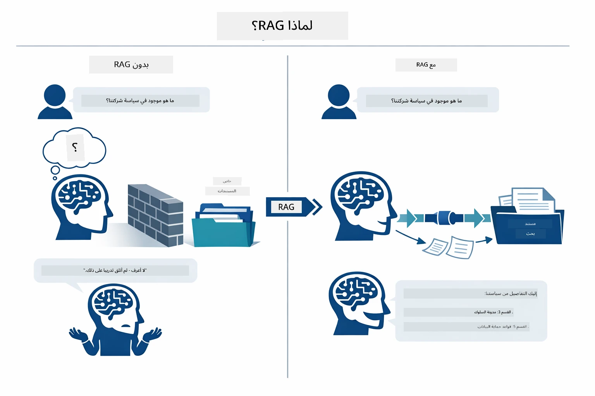

*يوضح هذا المخطط الفرق بين نموذج لغة كبير تقليدي (يخمن استنادًا إلى بيانات التدريب) ونموذج معزز بـ RAG (يشاور مستنداتك أولًا).*

إليك كيف تتصل الأجزاء من البداية إلى النهاية. يمر سؤال المستخدم عبر أربع مراحل — التضمين، البحث في المتجهات، تجميع السياق، وتوليد الإجابة — كل واحدة تبنى على التي قبلها:


*يبين هذا المخطط خط أنابيب RAG من البداية إلى النهاية — يمر استعلام المستخدم بالتضمين، والبحث في المتجهات، وتجميع السياق، وتوليد الإجابة.*

يشرح باقي هذه الوحدة كل مرحلة بالتفصيل، مع código يمكنك تشغيله وتعديله.

### أي نهج RAG يستخدم هذا الدليل؟

تقدم LangChain4j ثلاث طرق لتطبيق RAG، كل منها بمستوى مختلف من التجريد. المخطط أدناه يقارن بينها جنبًا إلى جنب:

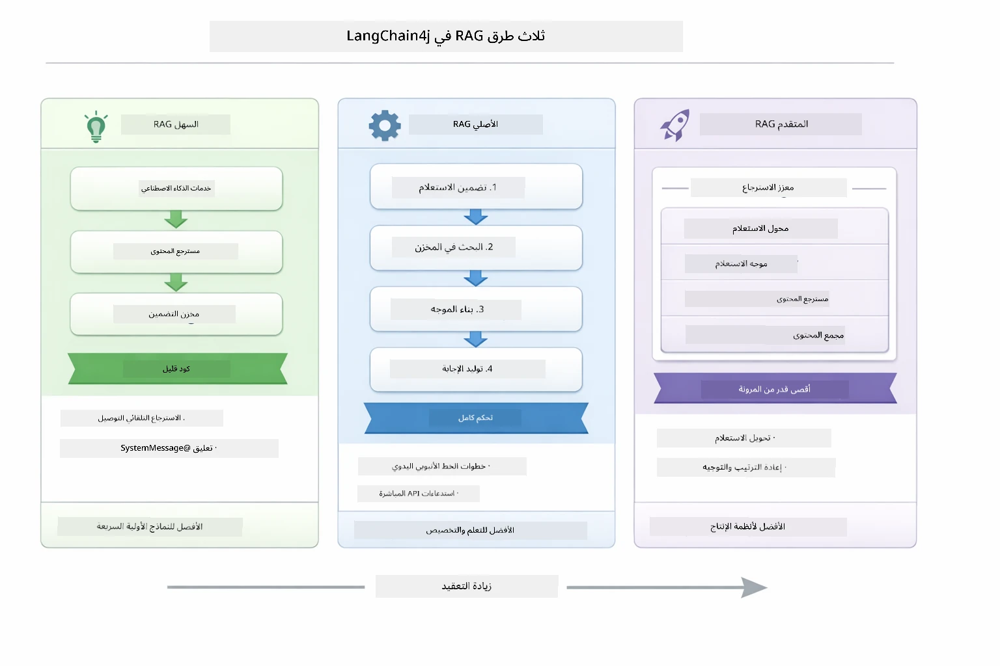

*يقارن هذا الرسم البياني بين ثلاث نهج RAG في LangChain4j — السهل، الأصلي، والمتقدم — ويظهر مكوناتهم الرئيسية ومتى تستخدم كل منها.*

| النهج | ما يفعله | المقايضة |
|---|---|---|
| **RAG السهل** | يربط كل شيء تلقائيًا من خلال `AiServices` و `ContentRetriever`. تقوم بتعليق واجهة، إرفاق مسترجع، وتتولى LangChain4j التضمين والبحث وتجميع المطالبة خلف الكواليس. | كود قليل، لكن لا ترى ما يحدث في كل خطوة. |
| **RAG الأصلي** | تستدعي نموذج التضمين، وتبحث في المخزن، وتبني المطالبة، وتولد الإجابة بنفسك — خطوة صريحة واحدة في كل مرة. | كود أكثر، لكن كل مرحلة مرئية وقابلة للتعديل. |
| **RAG المتقدم** | يستخدم إطار `RetrievalAugmentor` مع محولات الاستعلام القابلة للتوصيل، وموجهات، ومعيدات الترتيب، وحقن المحتوى لأنابيب الإنتاج. | أقصى مرونة، لكن تعقيد أكبر بكثير. |

**هذا الدليل يستخدم النهج الأصلي.** كل خطوة من خط أنابيب RAG — تضمين الاستعلام، البحث في المخزن المتجه، تجميع السياق، وتوليد الإجابة — مكتوبة بشكل صريح في [`RagService.java`](../../../03-rag/src/main/java/com/example/langchain4j/rag/service/RagService.java). هذا عن قصد: كمورد تعليمي، من الأهم أن ترى وتفهم كل مرحلة أكثر من تقليل الكود. بمجرد أن تتقن كيف تتصل الأجزاء، يمكنك الانتقال إلى RAG السهل للنماذج الأولية السريعة أو RAG المتقدم لأنظمة الإنتاج.

> **💡 هل رأيت RAG السهل قيد العمل بالفعل؟** تتضمن [وحدة البداية السريعة](../00-quick-start/README.md) مثال أسئلة وأجوبة على المستند ([`SimpleReaderDemo.java`](../../../00-quick-start/src/main/java/com/example/langchain4j/quickstart/SimpleReaderDemo.java)) يستخدم نهج RAG السهل — تتولى LangChain4j التضمين، والبحث، وتجميع المطالبة تلقائيًا. تأخذ هذه الوحدة الخطوة التالية عن طريق فك خط الأنابيب هذا حتى تتمكن من رؤية والتحكم في كل مرحلة بنفسك.

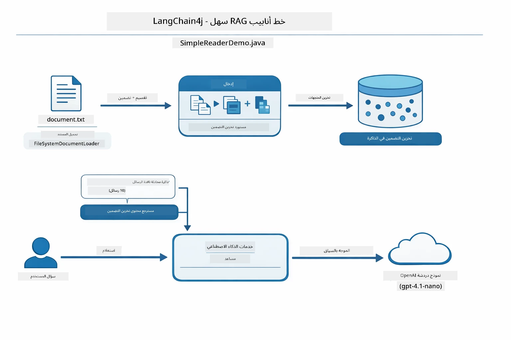

*يبين هذا المخطط خط أنابيب RAG السهل من `SimpleReaderDemo.java`. قارن هذا مع النهج الأصلي المستخدم في هذه الوحدة: يخفي RAG السهل التضمين، والاسترجاع، وتجميع المطالبة خلف `AiServices` و `ContentRetriever` — تقوم بتحميل مستند، إضافة مسترجع، وتحصل على الإجابات. يفتح النهج الأصلي في هذه الوحدة هذا الخط بحيث تستدعي كل مرحلة (التضمين، البحث، تجميع السياق، التوليد) بنفسك، مما يمنحك رؤية وتحكم كاملين.*

## كيف يعمل

يقسم خط أنابيب RAG في هذه الوحدة إلى أربع مراحل يتم تنفيذها بالتتابع في كل مرة يطرح فيها المستخدم سؤالًا. أولًا، يتم **تحليل وتقسيم** المستند المحمّل إلى قطع قابلة للإدارة. ثم تتحول هذه القطع إلى **تضمينات متجهية** وتُخزن لتُقارن رياضيًا. عند وصول استعلام، يقوم النظام بعملية **بحث دلالي** للعثور على القطع الأكثر ملاءمة، وأخيرًا يمررها كسياق إلى نموذج اللغة الكبير لـ **توليد الإجابة**. تشرح الأقسام أدناه كل مرحلة مع الكود والرسوم البيانية الفعلية. لننظر في الخطوة الأولى.

### معالجة المستندات

[DocumentService.java](../../../03-rag/src/main/java/com/example/langchain4j/rag/service/DocumentService.java)

عندما تقوم بتحميل مستند، يقوم النظام بتحليله (PDF أو نص عادي)، ويضيف بيانات وصفية مثل اسم الملف، ثم يقسمه إلى قطع — أجزاء أصغر تتناسب بشكل مريح مع نافذة سياق النموذج. تتداخل هذه القطع قليلاً حتى لا تفقد السياق عند الحدود.

```java
// تحليل الملف المرفوع وتغليفه داخل مستند LangChain4j
Document document = Document.from(content, metadata);

// تقسيم إلى أجزاء كل منها 300 رمز مع تداخل 30 رمز
DocumentSplitter splitter = DocumentSplitters
    .recursive(300, 30);

List<TextSegment> segments = splitter.split(document);
```


يوضح المخطط أدناه كيف يحدث هذا بصريًا. لاحظ كيف تشترك كل قطعة ببعض الرموز مع جيرانها — التداخل بـ 30 رمزًا يضمن عدم فقدان سياق مهم بين القطع:

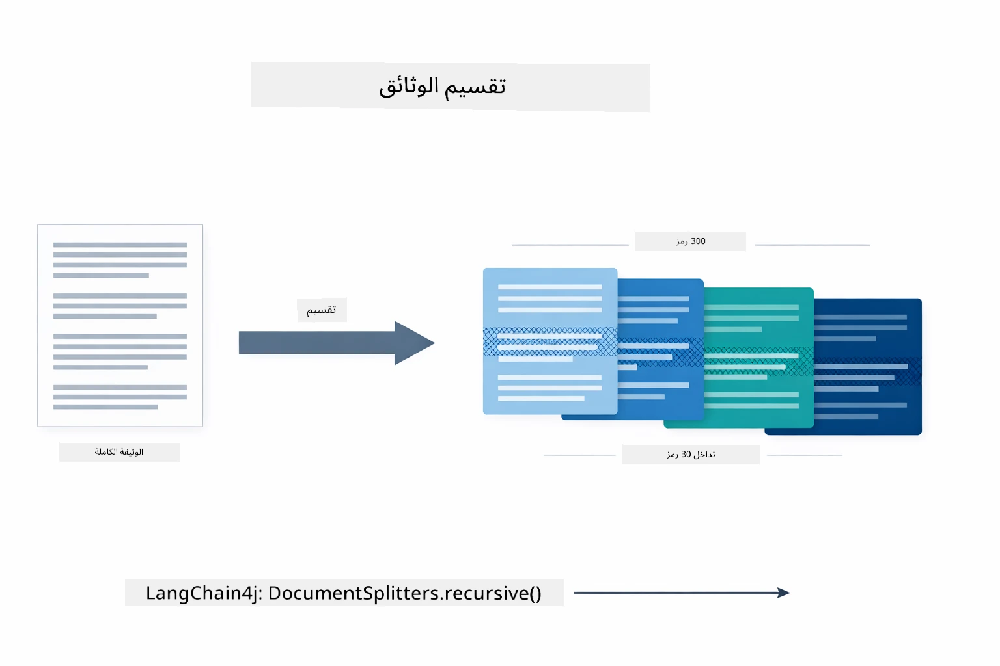

*يبين هذا المخطط تقسيم مستند إلى قطع مكونة من 300 رمز مع تداخل 30 رمزًا، محافظًا على السياق عند حدود القطع.*

> **🤖 جرب مع محادثة [GitHub Copilot](https://github.com/features/copilot):** افتح [`DocumentService.java`](../../../03-rag/src/main/java/com/example/langchain4j/rag/service/DocumentService.java) واسأل:
> - "كيف يقسم LangChain4j المستندات إلى قطع ولماذا التداخل مهم؟"
> - "ما هو حجم القطعة الأمثل لأنواع المستندات المختلفة ولماذا؟"
> - "كيف أتعامل مع المستندات بلغات متعددة أو تنسيق خاص؟"

### إنشاء التضمينات

[LangChainRagConfig.java](../../../03-rag/src/main/java/com/example/langchain4j/rag/config/LangChainRagConfig.java)

كل قطعة تُحوّل إلى تمثيل رقمي يسمى تضمين — بمعنى آخر محول المعنى إلى أرقام. نموذج التضمين ليس "ذكيًا" مثل نموذج المحادثة؛ لا يمكنه اتباع التعليمات، أو التفكير، أو الإجابة على الأسئلة. ما يمكنه فعله هو رسم النص في فضاء رياضي حيث تتجمع المعاني المتشابهة بالقرب من بعضها — مثل "سيارة" بالقرب من "عربة"، و"سياسة الاسترداد" بالقرب من "إرجاع أموالي". فكر في نموذج المحادثة كشخص تتحدث إليه؛ أما نموذج التضمين فهو نظام أرشفة فائق الجودة.

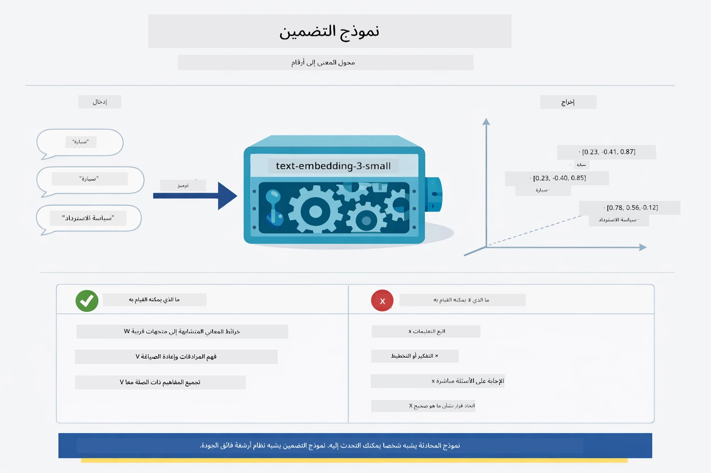

*يبين هذا المخطط كيفية تحويل نموذج التضمين للنص إلى متجهات رقمية، مما يضع المعاني المتشابهة — مثل "سيارة" و"عربة" — بالقرب من بعضها في فضاء المتجهات.*

```java
@Bean
public EmbeddingModel embeddingModel() {
    return OpenAiOfficialEmbeddingModel.builder()
        .baseUrl(azureOpenAiEndpoint)
        .apiKey(azureOpenAiKey)
        .modelName(azureEmbeddingDeploymentName)
        .build();
}

EmbeddingStore<TextSegment> embeddingStore = 
    new InMemoryEmbeddingStore<>();
```


يوضح مخطط الفئات أدناه تدفقين منفصلين في خط أنابيب RAG وفئات LangChain4j التي تنفذها. تدفق **الإدخال** (يعمل مرة واحدة عند التحميل) يقسم المستند، يضمّن القطع، ويخزنها عبر `.addAll()`. تدفق **الاستعلام** (يعمل في كل مرة يُطرح فيها سؤال) يضمّن السؤال، يبحث في المخزن عبر `.search()`, ويمرر السياق المطابق إلى نموذج المحادثة. يلتقي كلا التدفقين في واجهة `EmbeddingStore<TextSegment>` المشتركة:

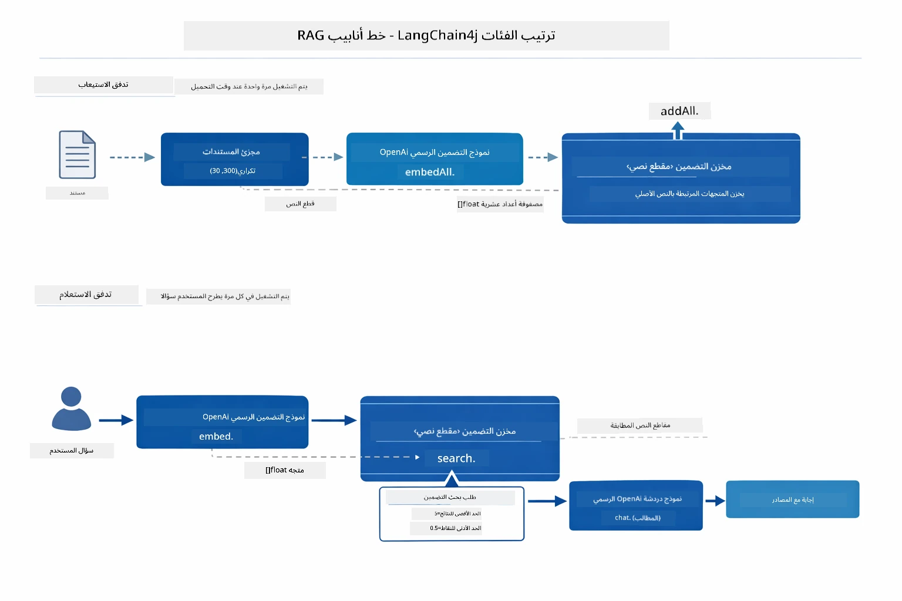

*يبين هذا المخطط التدفقين في خط أنابيب RAG — الإدخال والاستعلام — وكيف يرتبطان عبر EmbeddingStore المشترك.*

بمجرد تخزين التضمينات، تتجمع المحتويات المتشابهة بشكل طبيعي في فضاء المتجهات. تُظهر صورة التمثيل أدناه كيف تنتهي المستندات المتعلقة بمواضيع قريبة كنقاط مجاورة، مما يجعل البحث الدلالي ممكنًا:


*تُظهر هذه الصورة كيف تتجمع المستندات المتعلقة بمواضيع متقاربة في فضاء متجه ثلاثي الأبعاد، حيث تشكل مواضيع مثل المستندات التقنية، قواعد العمل، والأسئلة الشائعة مجموعات مميزة.*

عند البحث، يتبع النظام أربع خطوات: تضمين المستندات مرة واحدة، تضمين الاستعلام عند كل بحث، مقارنة متجه الاستعلام بجميع المتجهات المخزنة باستخدام تشابه جيب التمام، وإرجاع أعلى K قطع ذات الدرجات. يشرح المخطط أدناه كل خطوة وفئات LangChain4j المعنية:

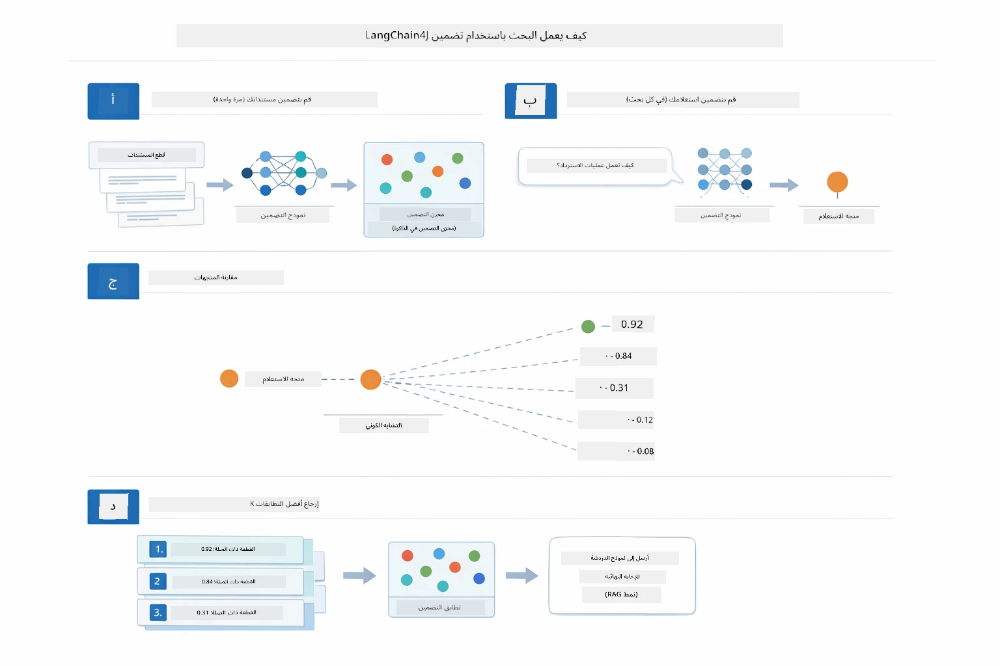

*يبين هذا المخطط عملية البحث بالتضمين ذات الأربع خطوات: تضمين المستندات، تضمين الاستعلام، مقارنة المتجهات باستخدام تشابه جيب التمام، وإرجاع أفضل نتائج K.*

### البحث الدلالي

[RagService.java](../../../03-rag/src/main/java/com/example/langchain4j/rag/service/RagService.java)

عندما تطرح سؤالًا، يتحول سؤالك أيضًا إلى تضمين. يقارن النظام تضمين سؤالك مع كل تضمينات قطع المستندات. يجد القطع ذات المعاني الأكثر تشابهًا — ليس فقط تطابق الكلمات المفتاحية، بل التشابه الدلالي الفعلي.

```java
Embedding queryEmbedding = embeddingModel.embed(question).content();

EmbeddingSearchRequest searchRequest = EmbeddingSearchRequest.builder()
    .queryEmbedding(queryEmbedding)
    .maxResults(5)
    .minScore(0.5)
    .build();

EmbeddingSearchResult<TextSegment> searchResult = embeddingStore.search(searchRequest);
List<EmbeddingMatch<TextSegment>> matches = searchResult.matches();

for (EmbeddingMatch<TextSegment> match : matches) {
    String relevantText = match.embedded().text();
    double score = match.score();
}
```


المخطط التالي يوضح الفرق بين البحث الدلالي والبحث التقليدي بالكلمات المفتاحية. بحث بالكلمة المفتاحية "مركبة" يفوّت قطعة عن "السيارات والشاحنات"، لكن البحث الدلالي يفهم أنهما يعنيان الشيء نفسه ويرجعها كنتيجة عالية التقييم:

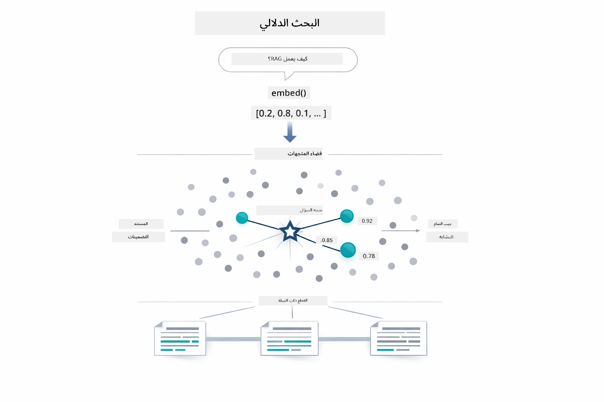

*يقارن هذا المخطط بين البحث بالكلمات المفتاحية والبحث الدلالي، مبيّنًا كيف يسترجع البحث الدلالي محتوى مرتبطًا مفهومياً حتى عندما تختلف الكلمات المفتاحية الدقيقة.*

تقاس التشابهات باستخدام تشابه جيب التمام — وهو في الأساس سؤال "هل يشير السهمان في نفس الاتجاه؟" يمكن لقطعتين استخدام كلمات مختلفة تمامًا، لكن إذا كانتا تعنيان نفس الشيء، فإن متجهاتهما تشير في نفس الاتجاه وتحصل على درجة قرب 1.0:

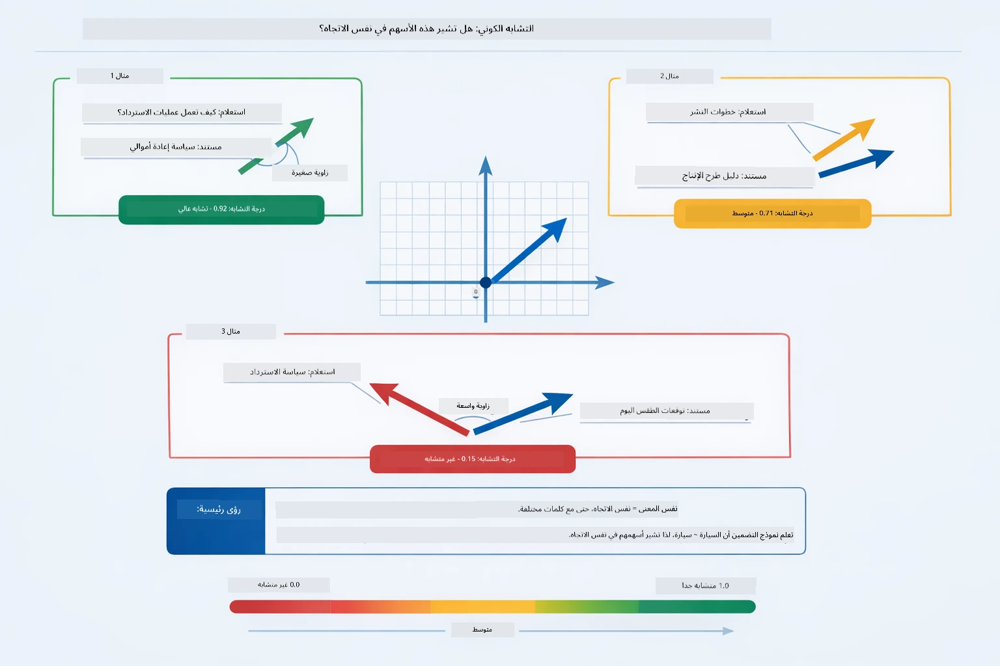
*يوضح هذا المخطط تشابه جيب تمام الزاوية كزاوية بين متجهات التضمين — حيث تسجل المتجهات المتراصفة أقرب إلى 1.0، مما يشير إلى تشابه دلالي أعلى.*

> **🤖 جرب مع [GitHub Copilot](https://github.com/features/copilot) Chat:** افتح [`RagService.java`](../../../03-rag/src/main/java/com/example/langchain4j/rag/service/RagService.java) واطرح:
> - "كيف يعمل البحث بالتشابه باستخدام التضمينات وما الذي يحدد النتيجة؟"
> - "ما هو عتبة التشابه التي يجب أن أستخدمها وكيف تؤثر على النتائج؟"
> - "كيف أتعامل مع الحالات التي لا يتم فيها العثور على مستندات ذات صلة؟"

### توليد الإجابة

[RagService.java](../../../03-rag/src/main/java/com/example/langchain4j/rag/service/RagService.java)

يتم تجميع الأجزاء الأكثر صلة في موجه منظم يتضمن تعليمات صريحة، والسياق المسترجع، وسؤال المستخدم. يقرأ النموذج تلك الأجزاء المحددة ويجيب بناءً على هذه المعلومات — يمكنه فقط استخدام ما هو أمامه، مما يمنع التخيّل.

```java
String context = matches.stream()
    .map(match -> match.embedded().text())
    .collect(Collectors.joining("\n\n"));

String prompt = String.format("""
    Answer the question based on the following context.
    If the answer cannot be found in the context, say so.

    Context:
    %s

    Question: %s

    Answer:""", context, request.question());

String answer = chatModel.chat(prompt);
```

يُظهر المخطط أدناه هذا التجميع أثناء العمل — يتم حقن الأجزاء ذات أعلى الدرجات من خطوة البحث في قالب الموجه، وينشئ `OpenAiOfficialChatModel` إجابة مستندة إلى الواقع:

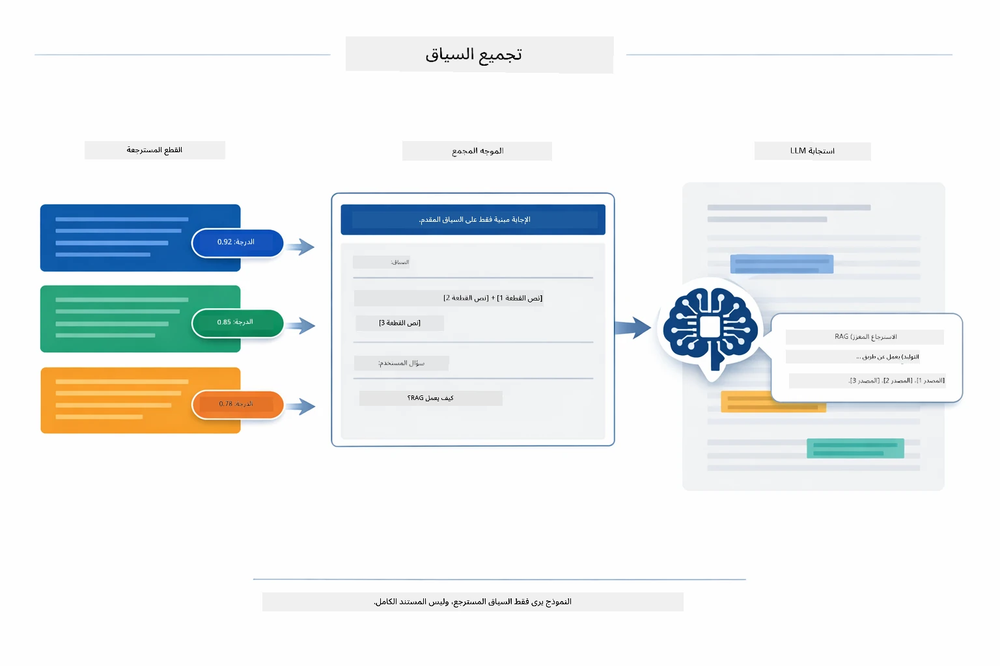

*يوضح هذا المخطط كيف يتم تجميع الأجزاء ذات أعلى الدرجات في موجه منظم، مما يسمح للنموذج بتوليد إجابة مستندة إلى بياناتك.*

## تشغيل التطبيق

**تحقق من النشر:**

تأكد من وجود ملف `.env` في الدليل الجذر مع بيانات اعتماد Azure (تم إنشاؤه خلال الوحدة 01):

**Bash:**
```bash
cat ../.env  # يجب أن يعرض AZURE_OPENAI_ENDPOINT، API_KEY، DEPLOYMENT
```

**PowerShell:**
```powershell
Get-Content ..\.env  # يجب أن يعرض AZURE_OPENAI_ENDPOINT و API_KEY و DEPLOYMENT
```

**ابدأ التطبيق:**

> **ملاحظة:** إذا كنت قد بدأت كل التطبيقات بالفعل باستخدام `./start-all.sh` من الوحدة 01، فإن هذه الوحدة تعمل بالفعل على المنفذ 8081. يمكنك تخطي أوامر بدء التشغيل أدناه والذهاب مباشرة إلى http://localhost:8081.

**الخيار 1: استخدام لوحة تحكم Spring Boot (موصى به لمستخدمي VS Code)**

تتضمن حاوية التطوير إضافة Spring Boot Dashboard التي توفر واجهة بصرية لإدارة جميع تطبيقات Spring Boot. يمكنك العثور عليها في شريط النشاط على الجانب الأيسر من VS Code (ابحث عن رمز Spring Boot).

من لوحة تحكم Spring Boot، يمكنك:
- رؤية جميع تطبيقات Spring Boot المتاحة في مساحة العمل
- بدء/إيقاف التطبيقات بنقرة واحدة
- عرض سجلات التطبيق في الوقت الحقيقي
- مراقبة حالة التطبيق

ما عليك سوى النقر على زر التشغيل بجانب "rag" لبدء هذه الوحدة، أو بدء كل الوحدات مرة واحدة.


*تُظهر هذه اللقطة شاشة لوحة تحكم Spring Boot في VS Code، حيث يمكنك بدء، إيقاف، ومراقبة التطبيقات بشكل بصري.*

**الخيار 2: استخدام سكربتات الشل**

ابدأ كل تطبيقات الويب (الوحدات 01-04):

**Bash:**
```bash
cd ..  # من الدليل الجذري
./start-all.sh
```

**PowerShell:**
```powershell
cd ..  # من الدليل الجذري
.\start-all.ps1
```

أو ابدأ هذه الوحدة فقط:

**Bash:**
```bash
cd 03-rag
./start.sh
```

**PowerShell:**
```powershell
cd 03-rag
.\start.ps1
```

يحمل كلا السكربتين تلقائيًا متغيرات البيئة من ملف `.env` الجذر وسيتم بناء ملفات JAR إذا لم تكن موجودة.

> **ملاحظة:** إذا كنت تفضل بناء كل الوحدات يدويًا قبل البدء:
>
> **Bash:**
> ```bash
> cd ..  # Go to root directory
> mvn clean package -DskipTests
> ```
>
> **PowerShell:**
> ```powershell
> cd ..  # Go to root directory
> mvn clean package -DskipTests
> ```

افتح http://localhost:8081 في متصفحك.

**لإيقاف التشغيل:**

**Bash:**
```bash
./stop.sh  # هذا الموديول فقط
# أو
cd .. && ./stop-all.sh  # كل الموديولات
```

**PowerShell:**
```powershell
.\stop.ps1  # هذا الموديل فقط
# أو
cd ..; .\stop-all.ps1  # جميع الموديلات
```

## استخدام التطبيق

يقدم التطبيق واجهة ويب لتحميل المستندات وطرح الأسئلة.

<a href="images/rag-homepage.png"></a>

*توفر هذه اللقطة شاشة لواجهة تطبيق RAG حيث يمكنك تحميل المستندات وطرح الأسئلة.*

### رفع مستند

ابدأ بتحميل مستند — ملفات TXT هي الأفضل للاختبار. يتوفر ملف `sample-document.txt` في هذا الدليل يحتوي على معلومات حول ميزات LangChain4j وتنفيذ RAG وأفضل الممارسات — مثالي لاختبار النظام.

يعالج النظام مستندك، يقسمه إلى أجزاء، وينشئ تضمينات لكل جزء. يحدث هذا تلقائيًا عند التحميل.

### طرح الأسئلة

اطرح الآن أسئلة محددة حول محتوى المستند. جرب شيئًا واقعيًا واضحًا في المستند. يبحث النظام عن الأجزاء ذات الصلة، يدرجها في الموجه، وينشئ إجابة.

### تحقق من مراجع المصادر

تلاحظ أن كل إجابة تتضمن مراجع للمصادر مع درجات تشابه. تُظهر هذه الدرجات (من 0 إلى 1) مدى صلة كل جزء بسؤالك. الدرجات الأعلى تعني تطابقًا أفضل. هذا يسمح لك بالتحقق من الإجابة مقابل المادة المصدرية.

<a href="images/rag-query-results.png"></a>

*تعرض هذه اللقطة شاشة نتائج الاستعلام مع الإجابة المولدة، مراجع المصادر، ودرجات الصلة لكل جزء مسترجع.*

### جرب مع الأسئلة

جرّب أنواعًا مختلفة من الأسئلة:
- حقائق محددة: "ما الموضوع الرئيسي؟"
- مقارنات: "ما الفرق بين X و Y؟"
- ملخصات: "لخص النقاط الرئيسية حول Z"

راقب كيف تتغير درجات الصلة بناءً على مدى تطابق سؤالك مع محتوى المستند.

## المفاهيم الرئيسية

### استراتيجية التجزيء

يتم تقسيم المستندات إلى أجزاء تحتوي على 300 رمز مع تداخل 30 رمزًا. هذا التوازن يضمن أن يحتوي كل جزء على سياق كافٍ ليكون ذا معنى مع البقاء صغيرًا بما يكفي لتضمين عدة أجزاء في الموجه.

### درجات التشابه

كل جزء مسترجع يأتي مع درجة تشابه بين 0 و 1 تشير إلى مدى تطابقه مع سؤال المستخدم. يظهر المخطط أدناه نطاقات الدرجات وكيف يستخدمها النظام لتصفية النتائج:

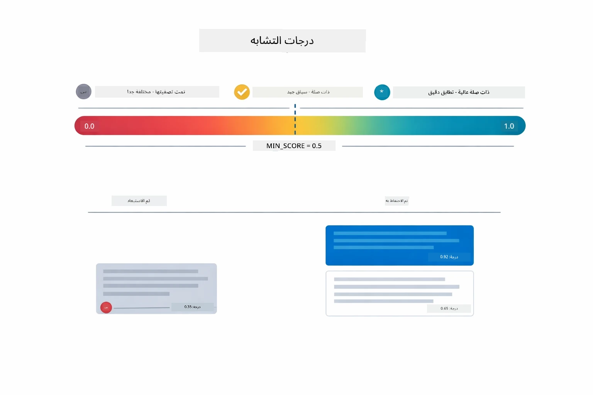

*يوضح هذا المخطط نطاقات الدرجات من 0 إلى 1، مع حد أدنى 0.5 الذي يفلتر الأجزاء غير ذات الصلة.*

تتراوح الدرجات بين 0 و 1:
- 0.7-1.0: ذات صلة عالية، تطابق دقيق
- 0.5-0.7: ذات صلة، سياق جيد
- أقل من 0.5: مُفلتر، غير مشابه جدًا

يسترجع النظام فقط الأجزاء التي تفوق الحد الأدنى لضمان الجودة.

تعمل التضمينات بشكل جيد عندما تتجمع المعاني بوضوح، لكنها لها نقاط ضعف. يوضح المخطط أدناه أوضاع فشل شائعة — الأجزاء الكبيرة جدًا تنتج متجهات غير واضحة، الأجزاء الصغيرة جدًا تفتقر للسياق، المصطلحات الغامضة تشير إلى عدة تجمعات، وعمليات البحث عن تطابق دقيق (مثل المعرفات، أرقام الأجزاء) لا تعمل مع التضمينات على الإطلاق:

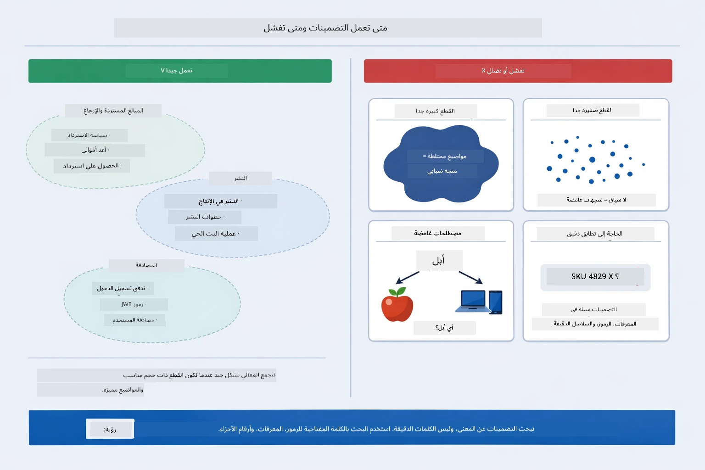

*يوضح هذا المخطط أوضاع فشل التضمين الشائعة: أجزاء كبيرة جدًا، أجزاء صغيرة جدًا، مصطلحات غامضة تشير إلى عدة تجمعات، وعمليات بحث تطابق دقيق مثل المعرفات.*

### التخزين في الذاكرة

تستخدم هذه الوحدة التخزين في الذاكرة للبساطة. عند إعادة تشغيل التطبيق، تُفقد المستندات المحملة. تستخدم الأنظمة الإنتاجية قواعد بيانات متجهات دائمة مثل Qdrant أو Azure AI Search.

### إدارة نافذة السياق

لكل نموذج حد أقصى لنافذة السياق. لا يمكنك تضمين كل جزء من مستند كبير. يسترجع النظام أهم N أجزاء ذات الصلة (افتراضي 5) ليبقى ضمن الحدود مع توفير سياق كاف للإجابات الدقيقة.

## متى يكون RAG مهمًا

ليس RAG دائمًا النهج المناسب. يساعدك دليل القرار أدناه على تحديد متى يضيف RAG قيمة مقابل متى تكون الطرق الأبسط — مثل تضمين المحتوى مباشرة في الموجه أو الاعتماد على معرفة النموذج المدمجة — كافية:

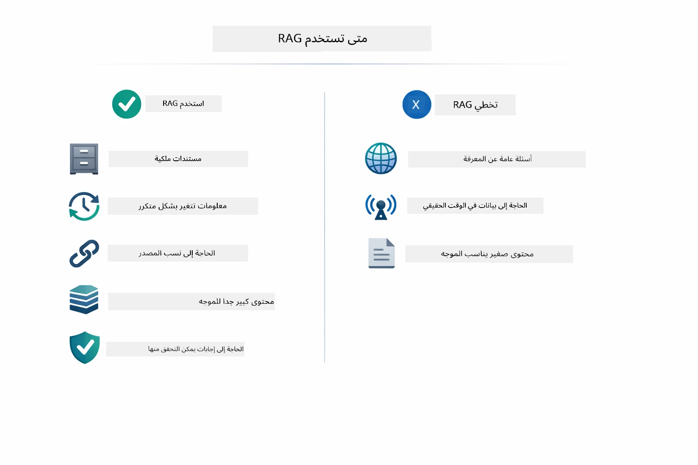

*يوضح هذا المخطط دليل قرار لمتى يضيف RAG قيمة مقابل متى تكون الطرق الأبسط كافية.*

**استخدم RAG عندما:**
- الإجابة على أسئلة حول مستندات مملوكة
- تغير المعلومات بشكل متكرر (السياسات، الأسعار، المواصفات)
- تتطلب الدقة نسب المصادر
- المحتوى كبير جدًا ليتم تضمينه في موجه واحد
- تحتاج إلى إجابات يمكن التحقق منها ومستنِدة

**لا تستخدم RAG عندما:**
- تتطلب الأسئلة معرفة عامة يمتلكها النموذج بالفعل
- هناك حاجة إلى بيانات في الزمن الفعلي (يعمل RAG على المستندات المحملة)
- المحتوى صغير بما يكفي ليتم تضمينه مباشرة في الموجهات

## الخطوات التالية

**الوحدة التالية:** [04-tools - وكلاء الذكاء الاصطناعي مع الأدوات](../04-tools/README.md)

---

**التنقل:** [← السابق: الوحدة 02 - هندسة الموجه](../02-prompt-engineering/README.md) | [عودة إلى الرئيسي](../README.md) | [التالي: الوحدة 04 - الأدوات →](../04-tools/README.md)

---

<!-- CO-OP TRANSLATOR DISCLAIMER START -->
**إخلاء المسؤولية**:  
تمت ترجمة هذا المستند باستخدام خدمة الترجمة الآلية [Co-op Translator](https://github.com/Azure/co-op-translator). بينما نسعى جاهدين للدقة، يرجى العلم أن الترجمات الآلية قد تحتوي على أخطاء أو عدم دقة. يجب اعتبار المستند الأصلي بلغته الأصلية المصدر الرسمي والمعتمد. بالنسبة للمعلومات الهامة، يُنصح بالاستعانة بترجمة بشرية محترفة. نحن لسنا مسؤولين عن أي سوء فهم أو تفسير خاطئ ناتج عن استخدام هذه الترجمة.
<!-- CO-OP TRANSLATOR DISCLAIMER END -->