# الوحدة 04: وكلاء الذكاء الاصطناعي مع الأدوات

## جدول المحتويات

- [ما ستتعلمه](../../../04-tools)
- [المتطلبات السابقة](../../../04-tools)
- [فهم وكلاء الذكاء الاصطناعي مع الأدوات](../../../04-tools)
- [كيفية عمل استدعاء الأدوات](../../../04-tools)
  - [تعريفات الأدوات](../../../04-tools)
  - [اتخاذ القرار](../../../04-tools)
  - [التنفيذ](../../../04-tools)
  - [توليد الاستجابة](../../../04-tools)
  - [الهيكلية: الربط التلقائي في Spring Boot](../../../04-tools)
- [سلسلة الأدوات](../../../04-tools)
- [تشغيل التطبيق](../../../04-tools)
- [استخدام التطبيق](../../../04-tools)
  - [تجربة استخدام أداة بسيطة](../../../04-tools)
  - [اختبار سلسلة الأدوات](../../../04-tools)
  - [رؤية تدفق المحادثة](../../../04-tools)
  - [التجربة مع طلبات مختلفة](../../../04-tools)
- [المفاهيم الأساسية](../../../04-tools)
  - [نمط ReAct (الاستدلال والعمل)](../../../04-tools)
  - [أهمية أوصاف الأدوات](../../../04-tools)
  - [إدارة الجلسات](../../../04-tools)
  - [معالجة الأخطاء](../../../04-tools)
- [الأدوات المتاحة](../../../04-tools)
- [متى تستخدم الوكلاء المستندين إلى الأدوات](../../../04-tools)
- [الأدوات مقابل RAG](../../../04-tools)
- [الخطوات التالية](../../../04-tools)

## ما ستتعلمه

حتى الآن، تعلمت كيفية إجراء محادثات مع الذكاء الاصطناعي، تنظيم المطالبات بفعالية، وربط الردود بوثائقك. لكن هناك قيد أساسي: نماذج اللغة يمكنها فقط توليد النصوص. لا يمكنها التحقق من الطقس، إجراء الحسابات، الاستعلام من قواعد البيانات، أو التفاعل مع الأنظمة الخارجية.

الأدوات تغير هذا. من خلال إعطاء النموذج إمكانية الوصول إلى وظائف يمكنه استدعاؤها، تحول النموذج من مجرد مولد نصوص إلى وكيل يمكنه اتخاذ إجراءات. النموذج يقرر متى يحتاج إلى أداة، وأي أداة يستخدم، وما المعاملات التي يمررها. ينفذ كودك الوظيفة ويرجع النتيجة. النموذج يدمج تلك النتيجة في رده.

## المتطلبات السابقة

- إكمال الوحدة 01 (تم نشر موارد Azure OpenAI)
- ملف `.env` في الدليل الجذري مع بيانات اعتماد Azure (تم إنشاؤه بواسطة `azd up` في الوحدة 01)

> **ملاحظة:** إذا لم تكمل الوحدة 01، اتبع تعليمات النشر هناك أولاً.

## فهم وكلاء الذكاء الاصطناعي مع الأدوات

> **📝 ملاحظة:** مصطلح "الوكلاء" في هذه الوحدة يشير إلى مساعدي الذكاء الاصطناعي المحسنين بقدرات استدعاء الأدوات. هذا يختلف عن أنماط **Agentic AI** (الوكلاء المستقلين مع التخطيط، الذاكرة، والاستدلال متعدد الخطوات) التي سنغطيها في [الوحدة 05: MCP](../05-mcp/README.md).

بدون أدوات، يمكن لنموذج اللغة فقط توليد نص من بيانات تدريبه. اسأله عن الطقس الحالي، وسيضطر إلى التخمين. اعطه أدوات، ويمكنه استدعاء واجهة برمجة تطبيقات الطقس، إجراء الحسابات، أو الاستعلام من قاعدة بيانات — ثم يدمج هذه النتائج الحقيقية في رده.

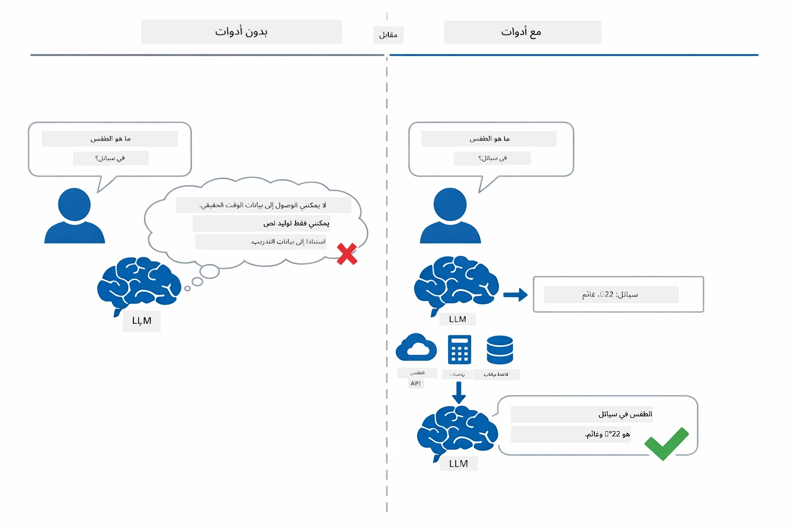

*بدون أدوات، النموذج يمكنه فقط التخمين — مع الأدوات يمكنه استدعاء الـ APIs، إجراء الحسابات، وإرجاع بيانات الوقت الحقيقي.*

وكيل الذكاء الاصطناعي مع الأدوات يتبع نمط **الاستدلال والعمل (ReAct)**. النموذج لا يكتفي بالرد — بل يفكر فيما يحتاجه، يتصرف باستدعاء أداة، يلاحظ النتيجة، ثم يقرر ما إذا كان يتصرف مجددًا أو يسلم الإجابة النهائية:

1. **الاستدلال** — يحلل الوكيل سؤال المستخدم ويحدد المعلومات التي يحتاجها  
2. **التصرف** — يختار الوكيل الأداة الصحيحة، يولد المعاملات الملائمة، ويستدعيها  
3. **الملاحظة** — يتلقى الوكيل ناتج الأداة ويقيم النتيجة  
4. **التكرار أو الرد** — إذا كانت هناك حاجة لمزيد من البيانات، يعود الوكيل للحلقة؛ وإلا يؤلف إجابة بلغة طبيعية  

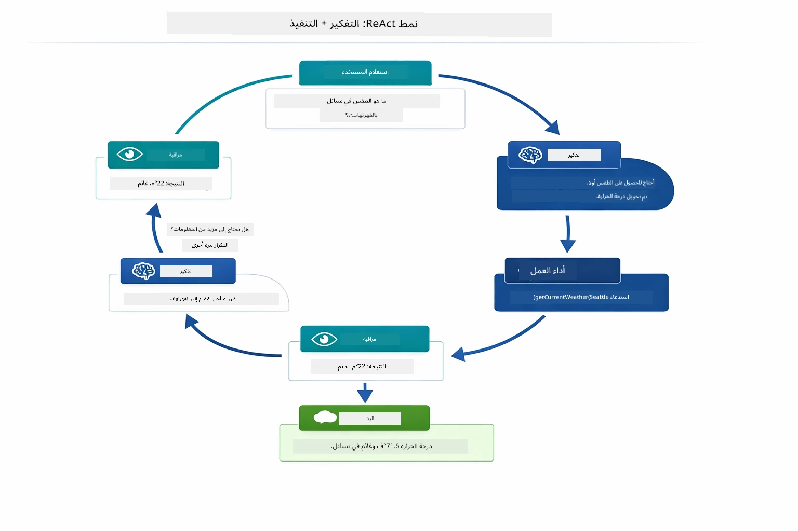

*دورة ReAct — الوكيل يستدل على ما يجب فعله، يتصرف باستدعاء أداة، يلاحظ النتيجة، ويتكرر حتى يمكنه تقديم الإجابة النهائية.*

يحدث هذا تلقائيًا. أنت تعرف الأدوات وأوصافها. النموذج يتعامل مع اتخاذ القرار حول متى وكيف يستخدمها.

## كيفية عمل استدعاء الأدوات

### تعريفات الأدوات

[WeatherTool.java](../../../04-tools/src/main/java/com/example/langchain4j/agents/tools/WeatherTool.java) | [TemperatureTool.java](../../../04-tools/src/main/java/com/example/langchain4j/agents/tools/TemperatureTool.java)

تعرف دوالًا مع أوصاف واضحة ومواصفات للمعاملات. النموذج يرى هذه الأوصاف في مطالبه النظامية ويفهم ما تقوم به كل أداة.

```java
@Component
public class WeatherTool {
    
    @Tool("Get the current weather for a location")
    public String getCurrentWeather(@P("Location name") String location) {
        // منطق البحث عن حالة الطقس الخاصة بك
        return "Weather in " + location + ": 22°C, cloudy";
    }
}

@AiService
public interface Assistant {
    String chat(@MemoryId String sessionId, @UserMessage String message);
}

// يتم توصيل المساعد تلقائيًا بواسطة Spring Boot مع:
// - مكون ChatModel
// - جميع طرق @Tool من فئات @Component
// - مزود ChatMemory لإدارة الجلسة
```

يشرح الرسم التوضيحي أدناه كل تعليق ويوضح كيف تساعد كل قطعة الذكاء الاصطناعي على فهم متى يستدعي الأداة وأي وسيطات يمرر:

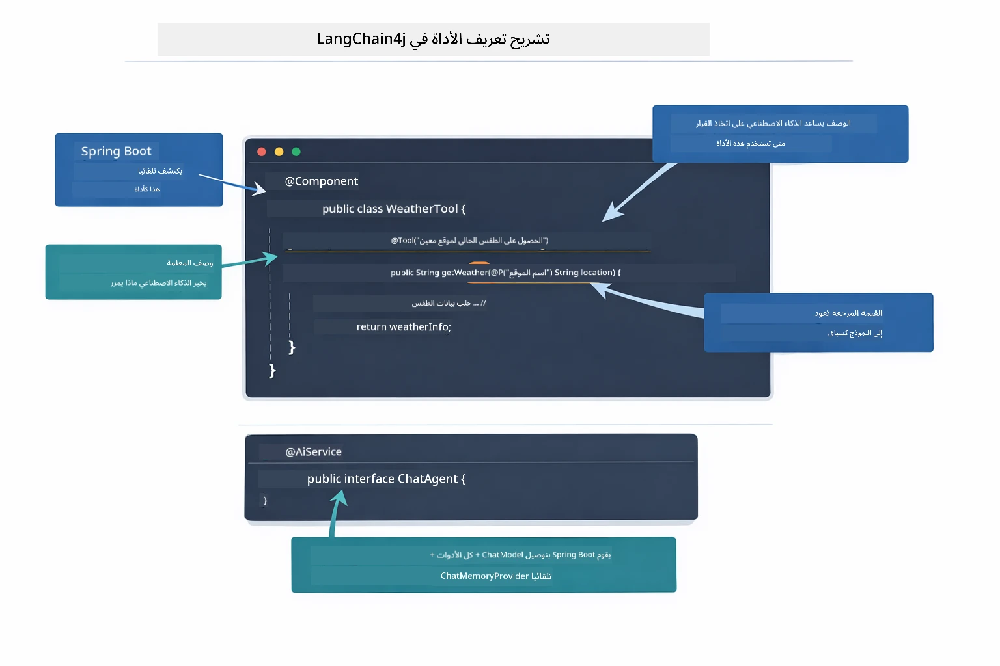

*بنية تعريف الأداة — @Tool تخبر الذكاء الاصطناعي متى يستخدمها، @P يصف كل معلمة، و@AiService يربط كل شيء معًا عند بدء التشغيل.*

> **🤖 جرب مع [GitHub Copilot](https://github.com/features/copilot) Chat:** افتح [`WeatherTool.java`](../../../04-tools/src/main/java/com/example/langchain4j/agents/tools/WeatherTool.java) واسأل:
> - "كيف أدمج API طقس حقيقي مثل OpenWeatherMap بدلًا من بيانات وهمية؟"
> - "ما الذي يجعل وصف الأداة جيدًا ليساعد الذكاء الاصطناعي على استخدامها بشكل صحيح؟"
> - "كيف أتعامل مع أخطاء الـ API وحدود المعدل في تطبيقات الأدوات؟"

### اتخاذ القرار

عندما يسأل المستخدم "ما حالة الطقس في سياتل؟"، لا يختار النموذج أداة عشوائيًا. يقارن نية المستخدم مع كل وصف أداة لديه حق الوصول إليه، يقيم كل منها من حيث الصلة، ويختار الأنسب. ثم يولد نداء دالة منظم بالمعاملات الصحيحة — في هذه الحالة، يضع `location` على `"Seattle"`.

إذا لم تطابق أي أداة طلب المستخدم، يعود النموذج للإجابة من معرفته الخاصة. إذا تطابقت أدوات متعددة، يختار الأدق.

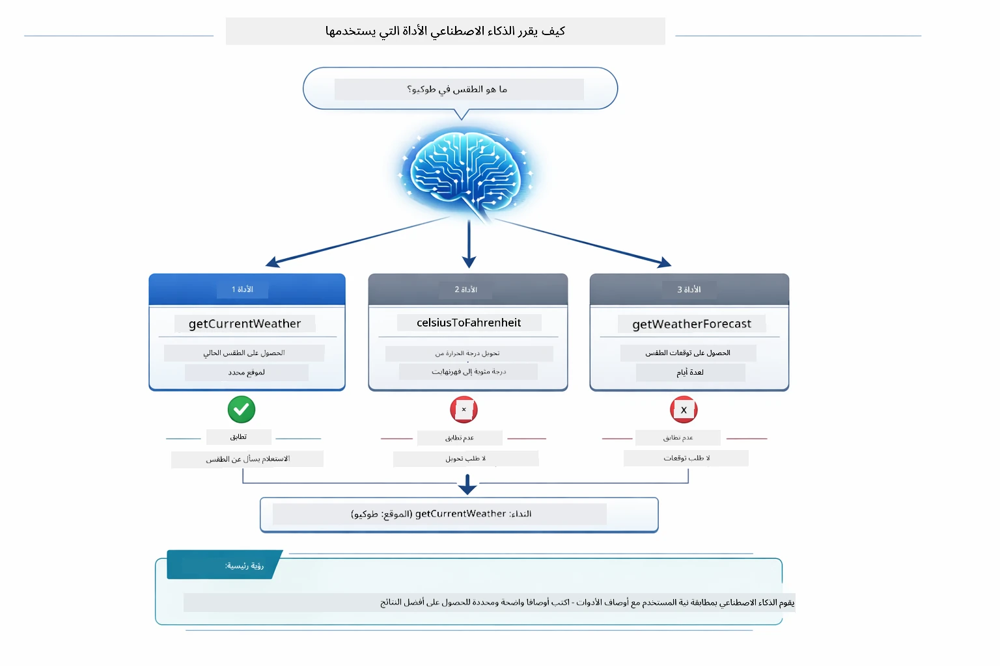

*النموذج يقيم كل أداة متاحة مقابل نية المستخدم ويختار الأنسب — لهذا السبب كتابة أوصاف أدوات واضحة ومحددة مهمة.*

### التنفيذ

[AgentService.java](../../../04-tools/src/main/java/com/example/langchain4j/agents/service/AgentService.java)

Spring Boot يربط تلقائيًا الواجهة الإعلانية `@AiService` بكل الأدوات المسجلة، وLangChain4j ينفذ مكالمات الأدوات تلقائيًا. خلف الكواليس، تدفق مكاملة الأدوات الكامل يمر بست مراحل — من سؤال المستخدم بلغة طبيعية حتى العودة بإجابة طبيعية:

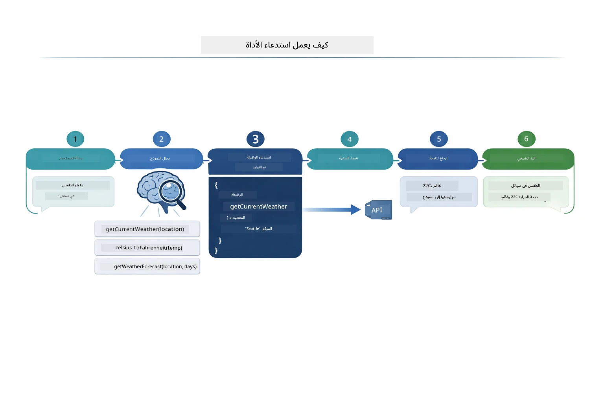

*التدفق الكامل — المستخدم يطرح سؤالًا، النموذج يحدد الأداة، LangChain4j ينفذها، والنموذج ينسج النتيجة في رد طبيعي.*

> **🤖 جرب مع [GitHub Copilot](https://github.com/features/copilot) Chat:** افتح [`AgentService.java`](../../../04-tools/src/main/java/com/example/langchain4j/agents/service/AgentService.java) واسأل:
> - "كيف يعمل نمط ReAct ولماذا هو فعال لوكلاء الذكاء الاصطناعي؟"
> - "كيف يقرر الوكيل الأداة التي يستخدمها وبأي ترتيب؟"
> - "ماذا يحدث إذا فشل تنفيذ أداة - كيف أتعامل مع الأخطاء بطريقة قوية؟"

### توليد الاستجابة

النموذج يستقبل بيانات الطقس وينسقها في رد بلغة طبيعية للمستخدم.

### الهيكلية: الربط التلقائي في Spring Boot

تستخدم هذه الوحدة تكامل LangChain4j مع Spring Boot باستخدام واجهات `@AiService` الإعلانية. عند بدء التشغيل، يكتشف Spring Boot كل `@Component` الذي يحتوي على طرق `@Tool`، ومكون `ChatModel` الخاص بك، و`ChatMemoryProvider` — ثم يربطهم جميعًا في واجهة `Assistant` واحدة بدون كود روتيني.

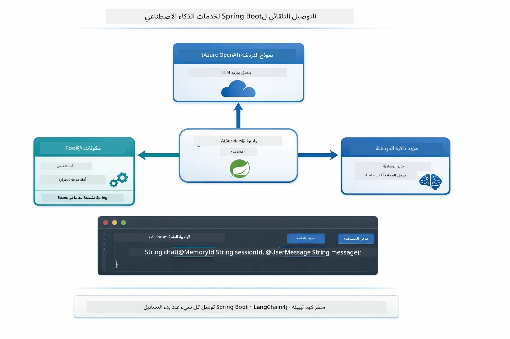

*واجهة @AiService تربط معًا ChatModel، مكونات الأدوات، ومزود الذاكرة — Spring Boot يتولى كل الربط تلقائيًا.*

الفوائد الرئيسية لهذا النهج:

- **الربط التلقائي في Spring Boot** — حقن ChatModel والأدوات تلقائيًا  
- **نمط @MemoryId** — إدارة الذاكرة القائمة على الجلسات تلقائيًا  
- **مثيل واحد** — إنشاء Assistant مرة واحدة وإعادة استخدامه لأداء أفضل  
- **تنفيذ آمن نوعيًا** — استدعاء أساليب Java مباشرة مع تحويل النوع  
- **تنسيق متعدد الأدوار** — يدير سلسلة الأدوات تلقائيًا  
- **بدون كود روتيني** — بدون استدعاءات يدوية لـ `AiServices.builder()` أو HashMap الذاكرة  

النهج البديلة (اليدوي `AiServices.builder()`) تتطلب المزيد من الكود وتفقد فوائد تكامل Spring Boot.

## سلسلة الأدوات

**سلسلة الأدوات** — القوة الحقيقية لوكلاء الأدوات تظهر عندما يحتاج سؤال واحد إلى عدة أدوات. اسأل "ما حالة الطقس في سياتل بالفهرنهايت؟" والوكيل يربط تلقائيًا أداتين: أولاً يستدعي `getCurrentWeather` للحصول على درجة الحرارة بالسلسيوس، ثم يمرر هذه القيمة إلى `celsiusToFahrenheit` للتحويل — كل ذلك في جولة محادثة واحدة.

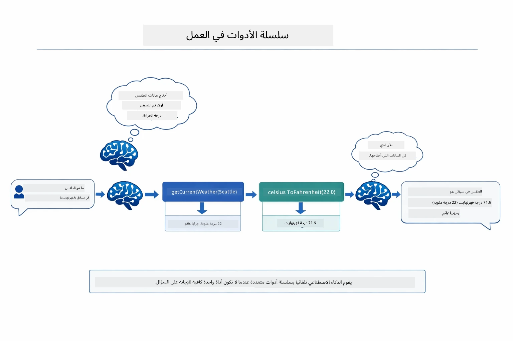

*سلسلة الأدوات في العمل — الوكيل يستدعي getCurrentWeather أولًا، ثم يمرر النتيجة بالسلسيوس إلى celsiusToFahrenheit، ويقدم إجابة مجمعة.*

هكذا تبدو في التطبيق الجاري — الوكيل يربط مكالمتين للأدوات في جولة محادثة واحدة:

<a href="images/tool-chaining.png"></a>

*مخرجات التطبيق الفعلي — الوكيل يربط تلقائيًا getCurrentWeather → celsiusToFahrenheit في جولة واحدة.*

**الفشل بأناقة** — اطلب الطقس في مدينة غير موجودة في بيانات النموذج الوهمية. تُعيد الأداة رسالة خطأ، والذكاء الاصطناعي يشرح أنه لا يمكنه المساعدة بدلاً من التعطل. الأدوات تفشل بأمان.

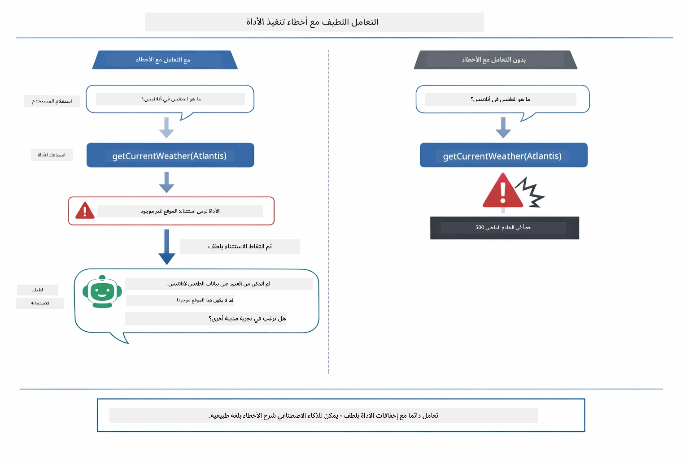

*عندما تفشل أداة، يلتقط الوكيل الخطأ ويرد بتفسير مساعد بدلاً من التعطل.*

هذا يحدث في جولة محادثة واحدة. الوكيل يدير مكالمات أدوات متعددة بشكل مستقل.

## تشغيل التطبيق

**تحقق من النشر:**

تأكد من وجود ملف `.env` في الدليل الجذري مع بيانات اعتماد Azure (تم إنشاؤه أثناء الوحدة 01):
```bash
cat ../.env  # يجب أن يُظهر AZURE_OPENAI_ENDPOINT، API_KEY، DEPLOYMENT
```

**ابدأ التطبيق:**

> **ملاحظة:** إذا كنت قد بدأت جميع التطبيقات مسبقًا باستخدام `./start-all.sh` من الوحدة 01، هذه الوحدة تعمل بالفعل على المنفذ 8084. يمكنك تخطي أوامر البدء أدناه والذهاب مباشرة إلى http://localhost:8084.

**الخيار 1: استخدام Spring Boot Dashboard (مستحسن لمستخدمي VS Code)**

حاوية التطوير تتضمن امتداد Spring Boot Dashboard، الذي يوفر واجهة بصرية لإدارة جميع تطبيقات Spring Boot. يمكنك العثور عليه في شريط النشاط على الجانب الأيسر من VS Code (ابحث عن رمز Spring Boot).

من Spring Boot Dashboard، يمكنك:
- رؤية كل تطبيقات Spring Boot المتاحة في مساحة العمل  
- بدء/إيقاف التطبيقات بنقرة واحدة  
- عرض سجلات التطبيق في الوقت الحقيقي  
- مراقبة حالة التطبيق  

فقط انقر زر التشغيل بجانب "tools" لبدء هذه الوحدة، أو ابدأ جميع الوحدات مرة واحدة.


**الخيار 2: استخدام سكربتات shell**

ابدأ جميع تطبيقات الويب (الوحدات 01-04):

**Bash:**
```bash
cd ..  # من الدليل الجذري
./start-all.sh
```

**PowerShell:**
```powershell
cd ..  # من الدليل الجذري
.\start-all.ps1
```

أو ابدأ هذه الوحدة فقط:

**Bash:**
```bash
cd 04-tools
./start.sh
```

**PowerShell:**
```powershell
cd 04-tools
.\start.ps1
```

كلا السكربتين يحملان تلقائيًا متغيرات البيئة من ملف `.env` الجذري وسيبنيان ملفات JAR إذا لم تكن موجودة.

> **ملاحظة:** إذا فضلت بناء كل الوحدات يدويًا قبل البدء:
>
> **Bash:**
> ```bash
> cd ..  # Go to root directory
> mvn clean package -DskipTests
> ```
>
> **PowerShell:**
> ```powershell
> cd ..  # Go to root directory
> mvn clean package -DskipTests
> ```

افتح http://localhost:8084 في متصفحك.

**للتوقف:**

**Bash:**
```bash
./stop.sh  # هذا الموديل فقط
# أو
cd .. && ./stop-all.sh  # كل الموديلات
```

**PowerShell:**
```powershell
.\stop.ps1  # هذا الوحدة فقط
# أو
cd ..; .\stop-all.ps1  # جميع الوحدات
```

## استخدام التطبيق

يوفر التطبيق واجهة ويب حيث يمكنك التفاعل مع وكيل ذكاء اصطناعي لديه وصول إلى أدوات الطقس والتحويل بين درجات الحرارة.

<a href="images/tools-homepage.png"></a>

*واجهة أدوات وكيل الذكاء الاصطناعي - أمثلة سريعة وواجهة محادثة للتفاعل مع الأدوات*

### جرب استخدام أداة بسيطة
ابدأ بطلب بسيط ومباشر: "حوّل 100 درجة فهرنهايت إلى سلسيوس". يميز الوكيل أنه يحتاج إلى أداة تحويل درجات الحرارة، يستدعيها بالمعاملات الصحيحة، ويعيد النتيجة. لاحظ كم يبدو هذا طبيعيًا - لم تحدد أي أداة تستخدم أو كيف تستدعيها.

### اختبار تتابع الأدوات

الآن جرب شيئًا أكثر تعقيدًا: "ما هو الطقس في سياتل وحوّله إلى فهرنهايت؟" راقب كيف يعمل الوكيل على هذا بخطوات. يحصل أولاً على الطقس (الذي يعيد بالسلسيوس)، يميز أنه يحتاج إلى التحويل إلى فهرنهايت، يستدعي أداة التحويل، ويدمج كلا النتيجتين في رد واحد.

### شاهد تدفق المحادثة

يحافظ واجهة الدردشة على سجل المحادثة، مما يتيح لك إجراء تفاعلات متعددة الخطوات. يمكنك رؤية كل الاستفسارات والردود السابقة، مما يسهل تتبع المحادثة وفهم كيف يبني الوكيل السياق عبر تبادلات متعددة.

<a href="images/tools-conversation-demo.png"></a>

*محادثة متعددة الخطوات تعرض تحويلات بسيطة، بحث الطقس، وتتابع أدوات*

### جرّب طلبات مختلفة

جرّب مجموعات متنوعة:
- بحث الطقس: "ما هو الطقس في طوكيو؟"
- تحويل درجات الحرارة: "كم تساوي 25°س بالكلفن؟"
- الاستفسارات المجمعة: "تحقق من الطقس في باريس وأخبرني إذا كان فوق 20°س"

لاحظ كيف يفسر الوكيل اللغة الطبيعية ويربطها باستدعاءات الأدوات المناسبة.

## المفاهيم الرئيسية

### نمط ReAct (التفكير والفعل)

يتناوب الوكيل بين التفكير (تقرير ما ينبغي فعله) والفعل (استخدام الأدوات). يمكّن هذا النمط من حل المشكلات بشكل مستقل بدلاً من مجرد الرد على التعليمات.

### أهمية وصف الأدوات

جودة أوصاف الأدوات تؤثر مباشرة على مدى حسن استخدام الوكيل لها. الأوصاف الواضحة والمحددة تساعد النموذج على فهم متى وكيف يستدعي كل أداة.

### إدارة الجلسة

يوفر التعليق `@MemoryId` إدارة ذاكرة المعاملات المبنية على الجلسة تلقائيًا. تحصل كل معرف جلسة على كائن `ChatMemory` خاص تُديره مكوّن `ChatMemoryProvider`، مما يتيح لمستخدمين متعددين التفاعل مع الوكيل في نفس الوقت دون خلط محادثاتهم معًا.

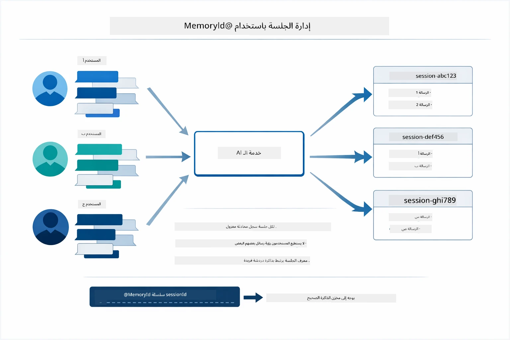

*كل معرف جلسة يرتبط بتاريخ محادثة معزول — المستخدمون لا يرون رسائل بعضهم البعض أبداً.*

### التعامل مع الأخطاء

قد تفشل الأدوات — انتهاء مهلة واجهات البرمجة، معاملات غير صالحة، تعطل خدمات خارجية. يحتاج الوكلاء الإنتاجيون إلى التعامل مع الأخطاء ليشرح النموذج المشاكل أو يجرب بدائل بدلاً من تعطيل التطبيق بالكامل. عندما ترمي أداة استثناءً، يلتقط LangChain4j الخطأ ويرسله مجددًا إلى النموذج، الذي يمكنه بعد ذلك شرح المشكلة بلغة طبيعية.

## الأدوات المتوفرة

يوضح الرسم البياني أدناه النظام البيئي الواسع للأدوات التي يمكنك بناؤها. تعرض هذه الوحدة أدوات الطقس ودرجات الحرارة، لكن نفس نمط `@Tool` يعمل مع أي دالة جافا — من استعلامات قواعد البيانات إلى معالجة المدفوعات.

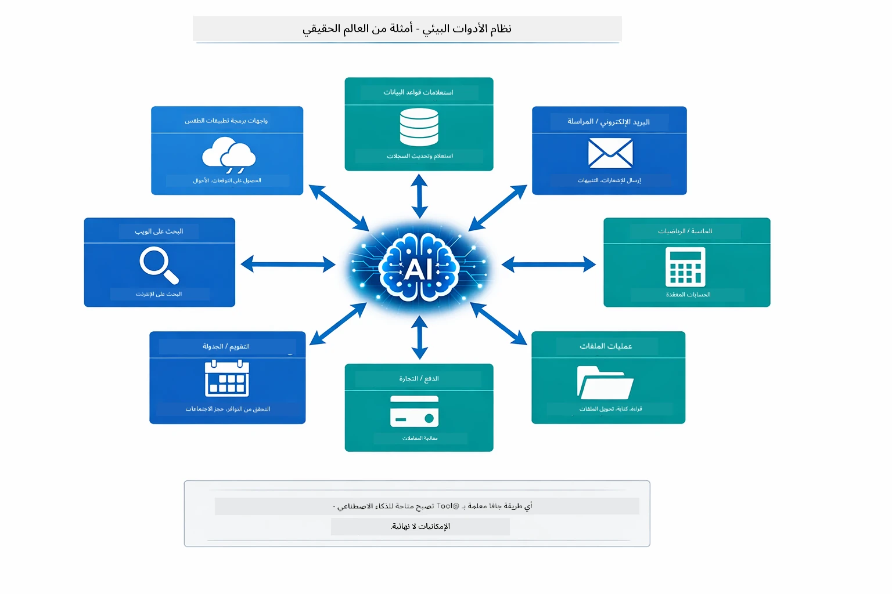

*أي دالة جافا معنونة بـ @Tool تصبح متاحة للذكاء الاصطناعي — يمتد النمط إلى قواعد البيانات، واجهات البرمجة، البريد الإلكتروني، عمليات الملفات، وأكثر.*

## متى تستخدم وكلاء الأدوات


*دليل قرار سريع — الأدوات للبيانات اللحظية، الحسابات، والإجراءات؛ المعرفة العامة والمهام الإبداعية لا تحتاجها.*

**استخدم الأدوات عندما:**
- تتطلب الإجابة بيانات لحظية (الطقس، أسعار الأسهم، المخزون)
- تحتاج إجراء حسابات تتجاوز الرياضيات البسيطة
- الوصول لقواعد بيانات أو واجهات برمجة التطبيقات
- اتخاذ إجراءات (إرسال رسائل، إنشاء تذاكر، تحديث سجلات)
- دمج مصادر بيانات متعددة

**لا تستخدم الأدوات عندما:**
- يمكن الإجابة عن الأسئلة من المعرفة العامة
- الرد يكون محادثة بحتة
- بطء الأدوات سيؤثر سلبًا على التجربة

## الأدوات مقابل RAG

توسع الوحدتان 03 و04 إمكانيات الذكاء الاصطناعي، لكن بطرق جوهرية مختلفة. يتيح RAG للنموذج الوصول إلى **المعرفة** عن طريق استرجاع الوثائق. تمنح الأدوات النموذج القدرة على اتخاذ **إجراءات** عن طريق استدعاء الوظائف.

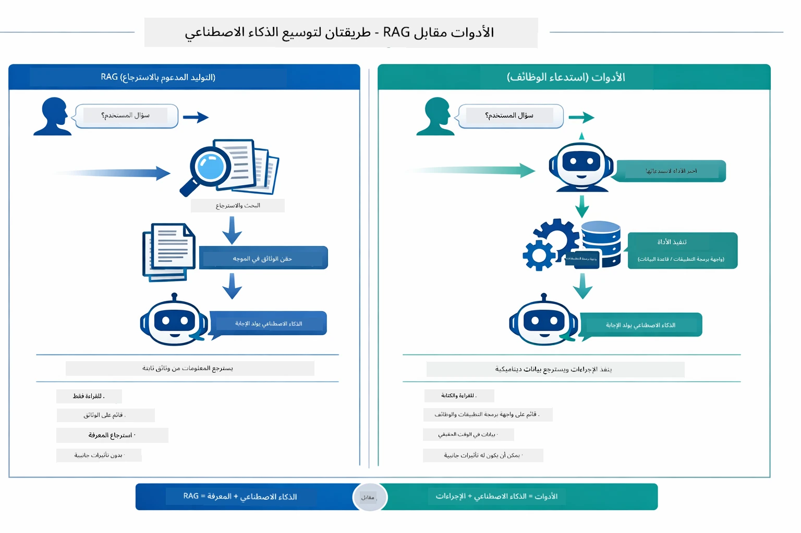

*RAG يسترجع المعلومات من الوثائق الثابتة — الأدوات تنفذ إجراءات وتجلب بيانات لحظية وديناميكية. كثير من أنظمة الإنتاج تجمع بين الطريقتين.*

عمليًا، تجمع العديد من أنظمة الإنتاج كلا الطريقتين: RAG لترسيخ الإجابات في توثيقاتك، والأدوات لجلب البيانات الحية أو تنفيذ العمليات.

## الخطوات التالية

**الوحدة التالية:** [05-mcp - بروتوكول سياق النموذج (MCP)](../05-mcp/README.md)

---

**التنقل:** [← السابق: الوحدة 03 - RAG](../03-rag/README.md) | [العودة للرئيسية](../README.md) | [التالي: الوحدة 05 - MCP →](../05-mcp/README.md)

---

<!-- CO-OP TRANSLATOR DISCLAIMER START -->
**إخلاء المسؤولية**:
تمت ترجمة هذا المستند باستخدام خدمة الترجمة الذكية [Co-op Translator](https://github.com/Azure/co-op-translator). بينما نسعى للدقة، يُرجى العلم أن الترجمات الآلية قد تحتوي على أخطاء أو عدم دقة. يجب اعتبار المستند الأصلي بلغته الأصلية المصدر المعتمد. للحصول على معلومات هامة، يُنصح بالاستعانة بترجمة بشرية محترفة. نحن غير مسؤولين عن أية سوء فهم أو تفسيرات خاطئة ناتجة عن استخدام هذه الترجمة.
<!-- CO-OP TRANSLATOR DISCLAIMER END -->