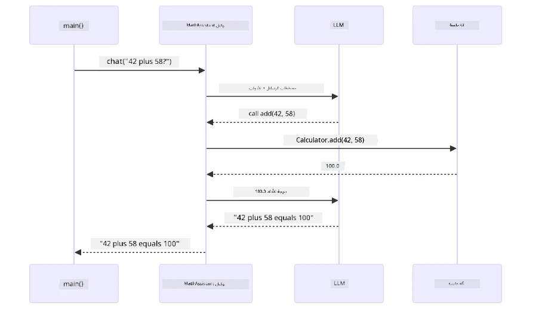
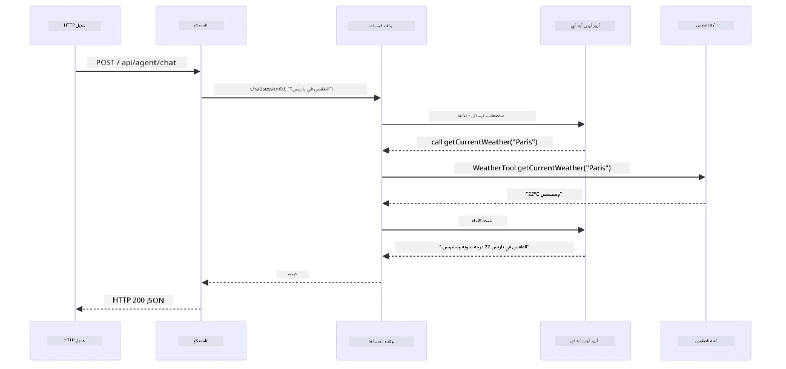

# الوحدة 04: وكلاء الذكاء الاصطناعي مع الأدوات

## جدول المحتويات

- [ماذا ستتعلم](../../../04-tools)
- [المتطلبات الأساسية](../../../04-tools)
- [فهم وكلاء الذكاء الاصطناعي مع الأدوات](../../../04-tools)
- [كيفية عمل استدعاء الأدوات](../../../04-tools)
  - [تعريفات الأدوات](../../../04-tools)
  - [اتخاذ القرار](../../../04-tools)
  - [التنفيذ](../../../04-tools)
  - [توليد الاستجابة](../../../04-tools)
  - [الهندسة المعمارية: التوصيل التلقائي في Spring Boot](../../../04-tools)
- [سلسلة الأدوات](../../../04-tools)
- [تشغيل التطبيق](../../../04-tools)
- [استخدام التطبيق](../../../04-tools)
  - [جرب استخدام أداة بسيطة](../../../04-tools)
  - [اختبر سلسلة الأدوات](../../../04-tools)
  - [شاهد تدفق المحادثة](../../../04-tools)
  - [جرّب طلبات مختلفة](../../../04-tools)
- [المفاهيم الأساسية](../../../04-tools)
  - [نمط ReAct (التفكير والفعل)](../../../04-tools)
  - [أهمية أوصاف الأدوات](../../../04-tools)
  - [إدارة الجلسات](../../../04-tools)
  - [معالجة الأخطاء](../../../04-tools)
- [الأدوات المتاحة](../../../04-tools)
- [متى تستخدم وكلاء قائمين على الأدوات](../../../04-tools)
- [الأدوات مقابل RAG](../../../04-tools)
- [الخطوات التالية](../../../04-tools)

## ماذا ستتعلم

حتى الآن، تعلمت كيفية إجراء محادثات مع الذكاء الاصطناعي، وتنظيم المُحفّزات بشكل فعال، وربط الردود بوثائقك. ولكن لا يزال هناك قيد أساسي: نماذج اللغة يمكنها فقط توليد النصوص. لا يمكنها التحقق من الطقس، إجراء العمليات الحسابية، الاستعلام من قواعد البيانات، أو التفاعل مع الأنظمة الخارجية.

الأدوات تغير هذا. بإعطاء النموذج إمكانية الوصول إلى وظائف يمكن استدعاؤها، تحوله من مولد نص إلى وكيل يمكنه اتخاذ إجراءات. يقرر النموذج متى يحتاج لأداة، وأي أداة يستخدم، وما هي المعاملات التي يرسلها. ينفذ الكود الخاص بك الوظيفة ويعيد النتيجة. يدمج النموذج تلك النتيجة في رده.

## المتطلبات الأساسية

- إكمال [الوحدة 01 - المقدمة](../01-introduction/README.md) (تم نشر موارد Azure OpenAI)
- يُوصى بإكمال الوحدات السابقة (تُشير هذه الوحدة إلى [مفاهيم RAG من الوحدة 03](../03-rag/README.md) في مقارنة الأدوات مقابل RAG)
- ملف `.env` في الدليل الجذري يحتوي على بيانات اعتماد Azure (تم إنشاؤه بواسطة `azd up` في الوحدة 01)

> **ملاحظة:** إذا لم تكمل الوحدة 01، اتبع تعليمات النشر هناك أولاً.

## فهم وكلاء الذكاء الاصطناعي مع الأدوات

> **📝 ملاحظة:** مصطلح "وكلاء" في هذه الوحدة يشير إلى مساعدين ذكيين معززين بقدرات استدعاء الأدوات. هذا يختلف عن أنماط **الذكاء الاصطناعي الوكلي** (وكلاء مستقلون مع التخطيط، الذاكرة، والتفكير متعدد الخطوات) التي سنغطيها في [الوحدة 05: MCP](../05-mcp/README.md).

بدون أدوات، يمكن لنموذج اللغة فقط توليد نص من بيانات تدريبه. اسأله عن حالة الطقس الحالية، وسيتعين عليه التخمين. زوده بالأدوات، فيمكنه استدعاء واجهة API للطقس، إجراء حسابات، أو الاستعلام من قاعدة بيانات — ثم يدمج تلك النتائج الحقيقية في رده.


*بدون أدوات، النموذج يستطيع فقط التخمين — مع الأدوات يمكنه استدعاء واجهات برمجة التطبيقات، إجراء عمليات حسابية، وإرجاع بيانات الوقت الحقيقي.*

وكيل الذكاء الاصطناعي مع الأدوات يتبع نمط **التفكير والفعل (ReAct)**. النموذج لا يرد فقط — بل يفكر فيما يحتاجه، يتصرف باستدعاء أداة، يلاحظ النتيجة، ثم يقرر ما إذا كان سيتصرف مجددًا أو يقدم الجواب النهائي:

1. **يفكر** — يحلل الوكيل سؤال المستخدم ويحدد المعلومات التي يحتاجها
2. **يتصرف** — يختار الوكيل الأداة الصحيحة، ينشئ المعاملات المناسبة، ويستدعيها
3. **يراقب** — يتلقى الوكيل مخرج الأداة ويقيّم النتيجة
4. **يكرر أو يرد** — إذا كان يلزم المزيد من البيانات، يعود للخطوة الأولى؛ وإلا يُكوّن إجابة طبيعية


*دورة ReAct — الوكيل يفكر فيما يجب فعله، يتصرف باستدعاء أداة، يلاحظ النتيجة، ويكرر حتى يتمكن من تقديم الجواب النهائي.*

يحدث هذا تلقائيًا. تقوم بتعريف الأدوات ووصفها. يتولى النموذج اتخاذ القرار حول متى وكيف يستخدمها.

## كيفية عمل استدعاء الأدوات

### تعريفات الأدوات

[WeatherTool.java](../../../04-tools/src/main/java/com/example/langchain4j/agents/tools/WeatherTool.java) | [TemperatureTool.java](../../../04-tools/src/main/java/com/example/langchain4j/agents/tools/TemperatureTool.java)

تعرّف الدوال مع وصف واضح ومواصفات المعاملات. يرى النموذج هذه الأوصاف في مُحفّز النظام ويفهم ما تفعله كل أداة.

```java
@Component
public class WeatherTool {
    
    @Tool("Get the current weather for a location")
    public String getCurrentWeather(@P("Location name") String location) {
        // منطق البحث عن الطقس الخاص بك
        return "Weather in " + location + ": 22°C, cloudy";
    }
}

@AiService
public interface Assistant {
    String chat(@MemoryId String sessionId, @UserMessage String message);
}

// يتم توصيل المساعد تلقائيًا بواسطة Spring Boot مع:
// - مكون ChatModel
// - جميع طرق @Tool من فصول @Component
// - موفر ChatMemory لإدارة الجلسة
```

الرسم البياني أدناه يشرح كل تعليق ويوضح كيف يساعد كل جزء الذكاء الاصطناعي على فهم متى يستدعي الأداة وما هي المعطيات التي يمررها:


*تشريح تعريف الأداة — @Tool تخبر الذكاء الاصطناعي متى يستخدمها، @P تصف كل معامل، و @AiService توصل كل شيء معًا عند بدء التشغيل.*

> **🤖 جرب مع [GitHub Copilot](https://github.com/features/copilot) دردشة:** افتح [`WeatherTool.java`](../../../04-tools/src/main/java/com/example/langchain4j/agents/tools/WeatherTool.java) واسأل:
> - "كيف أدمج واجهة API حقيقية للطقس مثل OpenWeatherMap بدلًا من البيانات الوهمية؟"
> - "ما الذي يجعل وصف الأداة جيدًا ويساعد الذكاء الاصطناعي على استخدامها بشكل صحيح؟"
> - "كيف أتعامل مع أخطاء الواجهة البرمجية وحدود المعدل في تنفيذ الأدوات؟"

### اتخاذ القرار

عندما يسأل المستخدم "ما حالة الطقس في سياتل؟"، لا يختار النموذج أداة بشكل عشوائي. يقارن نية المستخدم مع كل وصف أداة متاح له، ويُقيّم كل واحدة من حيث الصلة، ثم يختار الأنسب. ثم يولد استدعاء دالة مُنظم مع المعاملات الصحيحة — في هذه الحالة، يعين `location` إلى `"Seattle"`.

إذا لم تتطابق أي أداة مع طلب المستخدم، يعود النموذج للإجابة بناءً على معرفته الخاصة. إذا تطابقت عدة أدوات، يختار الأكثر تحديدًا.


*يقيم النموذج كل أداة متاحة مقابل نية المستخدم ويختار الأنسب — لهذا السبب كتابة أوصاف أدوات واضحة ومحددة مهمة.*

### التنفيذ

[AgentService.java](../../../04-tools/src/main/java/com/example/langchain4j/agents/service/AgentService.java)

Spring Boot يقوم بتوصيل واجهة `@AiService` التقريرية تلقائيًا مع جميع الأدوات المسجلة، وLangChain4j ينفذ استدعاءات الأدوات تلقائيًا. خلف الكواليس، تمر استدعاءات الأدوات عبر ست مراحل — من سؤال المستخدم بلغة طبيعية وحتى إجابة بلغة طبيعية:


*التدفق الشامل — المستخدم يطرح سؤالًا، النموذج يختار أداة، LangChain4j ينفذها، والنموذج يدمج النتيجة في رد طبيعي.*

إذا شغلت [ToolIntegrationDemo](../../../00-quick-start/src/main/java/com/example/langchain4j/quickstart/ToolIntegrationDemo.java) في الوحدة 00، فقد رأيت هذا النمط أثناء التنفيذ — كانت أدوات `Calculator` تُستدعى بنفس الطريقة. يوضح مخطط التتابع أدناه بالضبط ما حدث تحت الغطاء أثناء العرض التجريبي:



*حلقة استدعاء الأداة من العرض التوضيحي للبداية السريعة — `AiServices` ترسل رسالتك ومخططات الأدوات إلى LLM، والLLM يرد باستدعاء دالة مثل `add(42, 58)`, LangChain4j ينفذ طريقة `Calculator` محليًا، ويرجع النتيجة للرد النهائي.*

> **🤖 جرب مع [GitHub Copilot](https://github.com/features/copilot) دردشة:** افتح [`AgentService.java`](../../../04-tools/src/main/java/com/example/langchain4j/agents/service/AgentService.java) واسأل:
> - "كيف يعمل نمط ReAct ولماذا هو فعال لوكلاء الذكاء الاصطناعي؟"
> - "كيف يقرر الوكيل أي أداة يستخدم وبأي ترتيب؟"
> - "ماذا يحدث إذا فشل تنفيذ أداة - كيف أعالج الأخطاء بطريقة قوية؟"

### توليد الاستجابة

يتلقى النموذج بيانات الطقس وينسقها في رد بلغة طبيعية للمستخدم.

### الهندسة المعمارية: التوصيل التلقائي في Spring Boot

تستخدم هذه الوحدة تكامل LangChain4j مع Spring Boot عبر واجهات `@AiService` التقريرية. عند بدء التشغيل، يكتشف Spring Boot كل `@Component` يحتوي على طرق `@Tool`، ومجسم `ChatModel`، وموفر الذاكرة `ChatMemoryProvider` — ثم يربطهم جميعًا في واجهة `Assistant` واحدة دون أي كود روتيني.


*واجهة @AiService تربط معًا ChatModel، مكونات الأدوات، وموفر الذاكرة — Spring Boot يتولى كل التوصيلات تلقائيًا.*

إليك دورة حياة الطلب كاملة كمخطط تسلسل — من طلب HTTP عبر المتحكم، الخدمة، والوكيل الموصول تلقائيًا، وصولًا لتنفيذ الأداة والعودة:



*دورة حياة طلب Spring Boot كاملة — طلب HTTP يمر عبر المتحكم والخدمة إلى وكيل Assistant الموصول تلقائيًا، الذي ينفذ LLM واستدعاءات الأدوات تلقائيًا.*

الفوائد الرئيسية لهذا الأسلوب:

- **توصيل تلقائي في Spring Boot** — حقن تلقائي لـ ChatModel والأدوات
- **نمط @MemoryId** — إدارة ذاكرة قائمة على الجلسة تلقائية
- **مثيل واحد** — تم إنشاء Assistant مرة واحدة وإعادة استخدامه لأداء أفضل
- **تنفيذ آمن من حيث النوع** — استدعاء دوال Java مباشرة مع تحويل الأنواع
- **تنسيق متعدد الأدوار** — يتعامل تلقائيًا مع سلسلة الأدوات
- **بدون أكواد روتينية** — لا حاجة لاستدعاءات `AiServices.builder()` يدوية أو خرائط تجزئة للذاكرة

الطرق البديلة (مع استدعاءات يدوية لـ `AiServices.builder()`) تتطلب المزيد من الأكواد وتفتقد فوائد تكامل Spring Boot.

## سلسلة الأدوات

**سلسلة الأدوات** — القوة الحقيقية لوكلاء الأدوات تُظهر عندما يتطلب سؤال واحد أدوات متعددة. اسأل "ما حالة الطقس في سياتل بالفهرنهايت؟" والوكيل يربط تلقائيًا أداتين: أولًا يستدعي `getCurrentWeather` للحصول على درجة الحرارة بالدرجة المئوية، ثم يمرر تلك القيمة إلى `celsiusToFahrenheit` للتحويل — كل ذلك في دورة محادثة واحدة.


*سلسلة الأدوات أثناء العمل — الوكيل يستدعي getCurrentWeather أولًا، ثم يوجه النتيجة بالمئوية إلى celsiusToFahrenheit، ويقدم إجابة موحدة.*

**إخفاقات أنيقة** — اطلب الطقس في مدينة غير موجودة في البيانات الوهمية. تعيد الأداة رسالة خطأ، ويشرح الذكاء أنه لا يمكنه المساعدة بدلاً من التعطل. الأدوات تفشل بأمان. الرسم البياني أدناه يقارن الطريقتين — مع المعالجة المناسبة للأخطاء، يلتقط الوكيل الاستثناء ويرد بمساعدة، بينما دونها ينهار التطبيق بالكامل:


*عندما تفشل أداة، يلتقط الوكيل الخطأ ويرد بشرح مفيد بدلاً من تعطل التطبيق.*

يحدث هذا في دورة محادثة واحدة. ينظم الوكيل استدعاءات متعددة للأدوات بشكل مستقل.

## تشغيل التطبيق

**تحقق من النشر:**

تأكد من وجود ملف `.env` في الدليل الجذري يحتوي على بيانات اعتماد Azure (تم إنشاؤه أثناء الوحدة 01). شغّل هذا من مجلد الوحدة (`04-tools/`):

**Bash:**
```bash
cat ../.env  # يجب أن يعرض AZURE_OPENAI_ENDPOINT و API_KEY و DEPLOYMENT
```

**PowerShell:**
```powershell
Get-Content ..\.env  # يجب أن يعرض AZURE_OPENAI_ENDPOINT و API_KEY و DEPLOYMENT
```

**ابدأ التطبيق:**

> **ملاحظة:** إذا بدأت جميع التطبيقات سابقًا باستخدام `./start-all.sh` من الدليل الجذري (كما هو موصوف في الوحدة 01)، فهذه الوحدة تعمل بالفعل على المنفذ 8084. يمكنك تخطي أوامر البدء أدناه والانتقال مباشرة إلى http://localhost:8084.

**الخيار 1: استخدام لوحة تحكم Spring Boot (موصى به لمستخدمي VS Code)**

تتضمن الحاوية التطويرية إضافة لوحة تحكم Spring Boot، التي توفر واجهة بصرية لإدارة جميع تطبيقات Spring Boot. يمكنك العثور عليها في شريط النشاط على الجانب الأيسر من VS Code (ابحث عن أيقونة Spring Boot).

من لوحة تحكم Spring Boot، يمكنك:
- رؤية جميع تطبيقات Spring Boot المتاحة في مساحة العمل
- بدء/إيقاف التطبيقات بنقرة واحدة
- عرض سجلات التطبيق في الوقت الحقيقي
- مراقبة حالة التطبيق

ببساطة اضغط زر التشغيل بجوار "tools" لبدء هذه الوحدة، أو ابدأ كل الوحدات معًا.

إليك شكل لوحة تحكم Spring Boot في VS Code:


*لوحة تحكم Spring Boot في VS Code — ابدأ، أوقف، وراقب جميع الوحدات من مكان واحد*

**الخيار 2: استخدام سكربتات الشل**

ابدأ جميع تطبيقات الويب (الوحدات 01-04):

**Bash:**
```bash
cd ..  # من الدليل الجذري
./start-all.sh
```

**PowerShell:**
```powershell
cd ..  # من الدليل الجذر
.\start-all.ps1
```

أو ابدأ فقط بهذا الوحدة:

**Bash:**
```bash
cd 04-tools
./start.sh
```

**PowerShell:**
```powershell
cd 04-tools
.\start.ps1
```

يقوم كلا السكريبتين بتحميل متغيرات البيئة تلقائيًا من ملف `.env` الجذر وسيبني ملفات JAR إذا لم تكن موجودة.

> **ملاحظة:** إذا كنت تفضل بناء جميع الوحدات يدويًا قبل البدء:
>
> **Bash:**
> ```bash
> cd ..  # Go to root directory
> mvn clean package -DskipTests
> ```
>
> **PowerShell:**
> ```powershell
> cd ..  # Go to root directory
> mvn clean package -DskipTests
> ```

افتح http://localhost:8084 في متصفحك.

**لإيقاف:**

**Bash:**
```bash
./stop.sh  # هذا الوحدة فقط
# أو
cd .. && ./stop-all.sh  # كل الوحدات
```

**PowerShell:**
```powershell
.\stop.ps1  # هذا المكون فقط
# أو
cd ..; .\stop-all.ps1  # جميع المكونات
```

## استخدام التطبيق

يوفر التطبيق واجهة ويب حيث يمكنك التفاعل مع وكيل ذكاء اصطناعي لديه إمكانية الوصول إلى أدوات الطقس وتحويل درجات الحرارة. هكذا تبدو الواجهة — تشمل أمثلة بداية سريعة ولوحة دردشة لإرسال الطلبات:

<a href="images/tools-homepage.png"></a>

*واجهة أدوات الوكيل الذكي - أمثلة سريعة ولوحة دردشة للتفاعل مع الأدوات*

### جرب استخدام أداة بسيطة

ابدأ بطلب بسيط: "حوّل 100 درجة فهرنهايت إلى سلسيوس". يتعرف الوكيل على أنه يحتاج لأداة تحويل درجات الحرارة، ويناديها بالمعلمات الصحيحة، ويعيد النتيجة. لاحظ مدى طبيعيّة هذا الشعور - لم تحدد أي أداة تستخدم أو كيف تناديها.

### اختبر تسلسل الأدوات

جرّب الآن شيئًا أكثر تعقيدًا: "ما هو الطقس في سياتل وحوّله إلى فهرنهايت؟" شاهد الوكيل يعالج ذلك خطوة بخطوة. أولاً يحصل على الطقس (الذي يعيد بالدرجة المئوية)، ثم يتعرف على حاجته للتحويل إلى فهرنهايت، وينادي أداة التحويل، ويجمع كلا النتيجتين في رد واحد.

### شاهد تدفق المحادثة

تحافظ واجهة الدردشة على تاريخ المحادثة، مما يسمح لك بإجراء تفاعلات متعددة الأدوار. يمكنك رؤية كل الاستفسارات والردود السابقة، مما يجعل من السهل تتبع المحادثة وفهم كيف يبني الوكيل السياق عبر التبادلات المتعددة.

<a href="images/tools-conversation-demo.png"></a>

*محادثة متعددة الأدوار تُظهر تحويلات بسيطة، واستعلامات الطقس، وتسلسل الأدوات*

### جرب طلبات مختلفة

جرّب مجموعات متنوعة:
- استعلامات الطقس: "ما هو الطقس في طوكيو؟"
- تحويلات درجات الحرارة: "ما هي درجة 25°C بالكلفن؟"
- استعلامات مركبة: "تحقق من الطقس في باريس وأخبرني إذا كان فوق 20°C"

لاحظ كيف يفسر الوكيل اللغة الطبيعية ويربطها باستدعاءات الأدوات المناسبة.

## المفاهيم الرئيسية

### نمط ReAct (التفكير والفعل)

يتناوب الوكيل بين التفكير (اتخاذ قرار ما يجب القيام به) والفعل (استخدام الأدوات). هذا النمط يمكنه من حل المشكلات بشكل مستقل بدلاً من مجرد الرد على التعليمات.

### وصف الأدوات مهم

جودة وصف الأدوات تؤثر بشكل مباشر على مدى استخدام الوكيل لها. تساعد الأوصاف الواضحة والمحددة النموذج على فهم متى وكيف يستدعي كل أداة.

### إدارة الجلسة

تمكّن التعليمة `@MemoryId` إدارة الذاكرة القائمة على الجلسة تلقائيًا. حيث يحصل كل معرف جلسة على نسخة `ChatMemory` تُدار بواسطة مكون `ChatMemoryProvider`، بحيث يمكن لعدة مستخدمين التفاعل مع الوكيل في نفس الوقت دون أن تختلط محادثاتهم. يوضح المخطط التالي كيف يتم توجيه المستخدمين المتعددين إلى مخازن ذاكرة معزولة بناءً على معرفات الجلسة الخاصة بهم:


*كل معرف جلسة يربط بتاريخ محادثة معزول — لا يرى المستخدمون رسائل بعضهم البعض.*

### التعامل مع الأخطاء

قد تفشل الأدوات — تنتهي مهلة واجهات برمجة التطبيقات، قد تكون المعلمات غير صحيحة، قد تتوقف الخدمات الخارجية. يحتاج الوكلاء في بيئة الإنتاج إلى معالجة الأخطاء حتى يستطيع النموذج شرح المشاكل أو تجربة بدائل بدلاً من تعطل التطبيق بأكمله. عند طرح أداة خطأ، تقوم LangChain4j بالتقاطه وتمرير رسالة الخطأ إلى النموذج، الذي يمكنه بعد ذلك شرح المشكلة بلغة طبيعية.

## الأدوات المتاحة

يوضح المخطط أدناه النظام البيئي الواسع للأدوات التي يمكنك بناؤها. توضح هذه الوحدة أدوات الطقس ودرجة الحرارة، لكن نفس نمط `@Tool` يعمل لأي دالة جافا — من استعلامات قواعد البيانات إلى معالجة المدفوعات.


*أي دالة جافا موسومة بـ @Tool تصبح متاحة للذكاء الاصطناعي — يمتد النمط إلى قواعد البيانات، وواجهات البرمجة، والبريد الإلكتروني، وعمليات الملفات، وأكثر.*

## متى تستخدم وكلاء الأدوات

ليس كل طلب يحتاج أدوات. القرار يعتمد على ما إذا كان الذكاء الاصطناعي بحاجة للتفاعل مع أنظمة خارجية أو يمكنه الإجابة من معرفته الخاصة. يوضح الدليل التالي متى تضيف الأدوات قيمة ومتى تكون غير ضرورية:


*دليل قرار سريع — الأدوات للبيانات الحية، الحسابات، والإجراءات؛ المعارف العامة والمهام الإبداعية لا تحتاجها.*

## الأدوات مقابل RAG

توسّع الوحدات 03 و04 ما يمكن أن يفعله الذكاء الاصطناعي، لكن بطرق جوهرية مختلفة. تمنح RAG النموذج وصولًا إلى **المعرفة** عبر استرجاع الوثائق. تمنح الأدوات النموذج القدرة على اتخاذ **إجراءات** عبر استدعاء الدوال. يقارن المخطط أدناه هذين النهجين جنبًا إلى جنب — من كيفية عمل كل منهما إلى مقارنة المزايا والعيوب:


*تسترجع RAG المعلومات من مستندات ثابتة — تنفذ الأدوات إجراءات وتجلب بيانات حية وديناميكية. العديد من أنظمة الإنتاج تجمع بينهما.*

عمليًا، تجمع العديد من أنظمة الإنتاج بين كلا النهجين: RAG لتأسيس الإجابات بناءً على توثيقاتك، والأدوات لجلب البيانات الحية أو تنفيذ العمليات.

## الخطوات التالية

**الوحدة التالية:** [05-mcp - بروتوكول سياق النموذج (MCP)](../05-mcp/README.md)

---

**التنقل:** [← السابق: الوحدة 03 - RAG](../03-rag/README.md) | [العودة إلى الرئيسي](../README.md) | [التالي: الوحدة 05 - MCP →](../05-mcp/README.md)

---

<!-- CO-OP TRANSLATOR DISCLAIMER START -->
**إخلاء المسؤولية**:
تمت ترجمة هذا المستند باستخدام خدمة الترجمة الآلية [Co-op Translator](https://github.com/Azure/co-op-translator). بينما نسعى للدقة، يرجى العلم أن الترجمات الآلية قد تحتوي على أخطاء أو عدم دقة. يجب اعتبار المستند الأصلي بلغته الأصلية المصدر الرسمي والموثوق. بالنسبة للمعلومات الهامة، يُنصح بالاستعانة بترجمة بشرية محترفة. نحن غير مسؤولين عن أي سوء فهم أو تحريف ناتج عن استخدام هذه الترجمة.
<!-- CO-OP TRANSLATOR DISCLAIMER END -->