# الوحدة 05: بروتوكول سياق النموذج (MCP)

## جدول المحتويات

- [ما الذي ستتعلمه](../../../05-mcp)
- [ما هو MCP؟](../../../05-mcp)
- [كيف يعمل MCP](../../../05-mcp)
- [وحدة الوكيل](../../../05-mcp)
- [تشغيل الأمثلة](../../../05-mcp)
  - [المتطلبات الأساسية](../../../05-mcp)
- [البدء السريع](../../../05-mcp)
  - [عمليات الملفات (Stdio)](../../../05-mcp)
  - [وكيل المشرف](../../../05-mcp)
    - [تشغيل العرض التوضيحي](../../../05-mcp)
    - [كيف يعمل المشرف](../../../05-mcp)
    - [استراتيجيات الاستجابة](../../../05-mcp)
    - [فهم الناتج](../../../05-mcp)
    - [شرح ميزات وحدة الوكيل](../../../05-mcp)
- [المفاهيم الأساسية](../../../05-mcp)
- [تهانينا!](../../../05-mcp)
  - [ما التالي؟](../../../05-mcp)

## ما الذي ستتعلمه

لقد بنيت ذكاءً اصطناعياً محادثياً، واتقنت المطالبات، وأثبت استجابات في المستندات، وأنشأت وكلاء مزودين بالأدوات. لكن كل تلك الأدوات كانت مخصصة لتطبيقك المحدد. ماذا لو كان بإمكانك إعطاء ذكاءك الاصطناعي وصولاً إلى نظام بيئي موحد من الأدوات التي يمكن لأي شخص إنشاؤها ومشاركتها؟ في هذه الوحدة، ستتعلم كيفية القيام بذلك باستخدام بروتوكول سياق النموذج (MCP) ووحدة الوكلاء في LangChain4j. نعرض أولاً قارئ ملفات بسيط يعمل بـ MCP، ثم نوضح كيف يتكامل بسهولة في سير عمل وكلاء متقدمين باستخدام نمط وكيل المشرف.

## ما هو MCP؟

يوفر بروتوكول سياق النموذج (MCP) بالضبط ذلك — طريقة معيارية لتطبيقات الذكاء الاصطناعي لاكتشاف واستخدام الأدوات الخارجية. بدلاً من كتابة تكاملات مخصصة لكل مصدر بيانات أو خدمة، تتصل بخوادم MCP التي تعرض قدراتها بتنسيق ثابت. يمكن لوكيل الذكاء الاصطناعي الخاص بك اكتشاف هذه الأدوات واستخدامها تلقائياً.

يوضح المخطط أدناه الفرق — بدون MCP، كل تكامل يتطلب توصيل مخصص من نقطة إلى نقطة؛ مع MCP، بروتوكول واحد يربط تطبيقك بأي أداة:


*قبل MCP: تكاملات معقدة نقطة إلى نقطة. بعد MCP: بروتوكول واحد، إمكانيات لا نهائية.*

يُحل MCP مشكلة أساسية في تطوير الذكاء الاصطناعي: كل تكامل مخصص. هل تريد الوصول إلى GitHub؟ رمز مخصص. هل تريد قراءة الملفات؟ رمز مخصص. هل تريد استعلام قاعدة بيانات؟ رمز مخصص. ولا يعمل أي من هذه التكاملات مع تطبيقات الذكاء الاصطناعي الأخرى.

MCP يوحد هذا. يكشف خادم MCP عن الأدوات مع أوصاف ونماذج واضحة. يمكن لأي عميل MCP الاتصال، واكتشاف الأدوات المتاحة، واستخدامها. يبنى مرة واحدة، يستخدم في كل مكان.

يوضح المخطط أدناه هذه البنية — عميل MCP واحد (تطبيق الذكاء الاصطناعي الخاص بك) يتصل بعدة خوادم MCP، كل منها يكشف مجموعته الخاصة من الأدوات من خلال البروتوكول المعياري:


*بنية بروتوكول سياق النموذج - اكتشاف الأدوات وتنفيذها المعياري*

## كيف يعمل MCP

تحت الغطاء، يستخدم MCP بنية طبقية. يكتشف تطبيق الجافا الخاص بك (عميل MCP) الأدوات المتاحة، يرسل طلبات JSON-RPC عبر طبقة النقل (Stdio أو HTTP)، ويقوم خادم MCP بتنفيذ العمليات وإرجاع النتائج. يوضح المخطط التالي تفصيل كل طبقة من هذا البروتوكول:

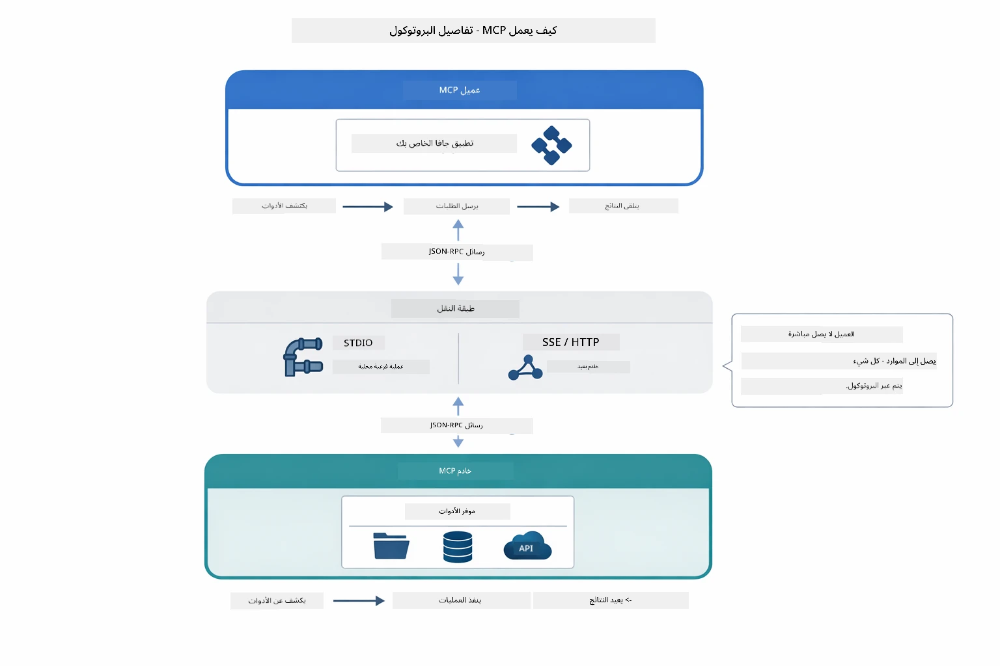

*كيف يعمل MCP تحت الغطاء — يكتشف العملاء الأدوات، يتبادلون رسائل JSON-RPC، وينفذون العمليات عبر طبقة نقل.*

**بنية الخادم-العميل**

يستخدم MCP نموذج العميل-الخادم. يقدم الخادم الأدوات - قراءة الملفات، استعلام قواعد البيانات، استدعاء واجهات برمجة التطبيقات. يتصل العملاء (تطبيق الذكاء الاصطناعي الخاص بك) بالخوادم ويستخدمون أدواتها.

للاستخدام مع LangChain4j، أضف هذا الاعتماد في Maven:

```xml
<dependency>
    <groupId>dev.langchain4j</groupId>
    <artifactId>langchain4j-mcp</artifactId>
    <version>${langchain4j.version}</version>
</dependency>
```
  
**اكتشاف الأدوات**

عندما يتصل عميلك بخادم MCP، يسأل "ما الأدوات التي تملكها؟" يرد الخادم بقائمة الأدوات المتاحة، كل منها مزود بوصف ونماذج للمعلمات. يمكن لوكيل الذكاء الاصطناعي تحديد الأدوات التي يجب استخدامها بناءً على طلبات المستخدم. يوضح المخطط أدناه هذه المصافحة — يرسل العميل طلب `tools/list` ويرد الخادم بأدواته المتاحة مع الأوصاف ونماذج المعلمات:

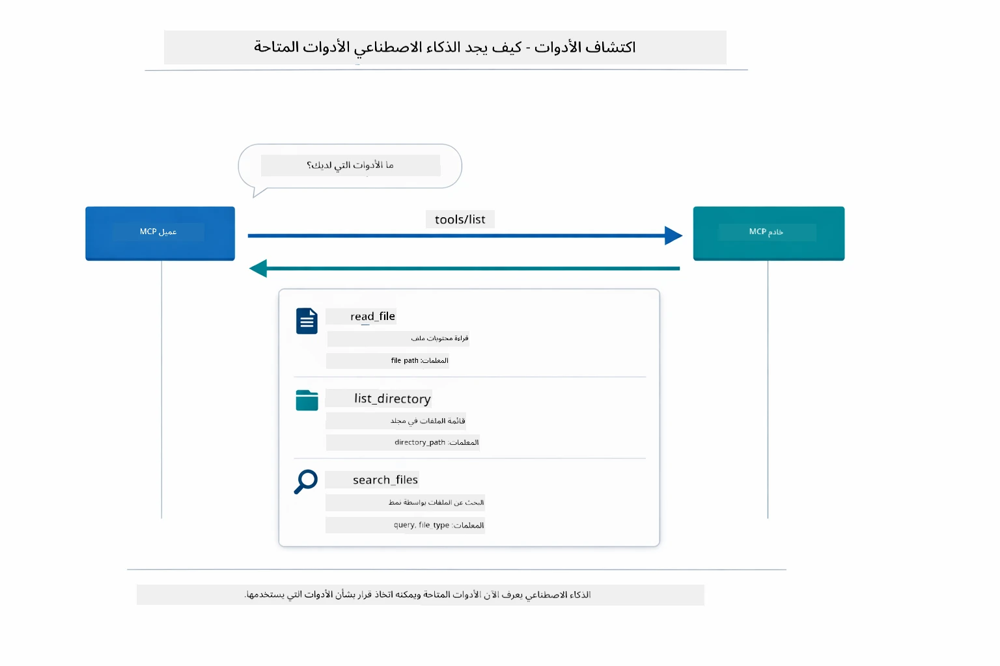

*يكتشف الذكاء الاصطناعي الأدوات المتاحة عند بدء التشغيل — يعرف الآن القدرات المتاحة ويستطيع تحديد الأدوات المناسبة للاستخدام.*

**آليات النقل**

يدعم MCP آليات نقل مختلفة. الخياران هما Stdio (للاتصال مع عمليات فرعية محلية) وHTTP القابل للبث (لخوادم بعيدة). تعرض هذه الوحدة النقل عبر Stdio:


*آليات نقل MCP: HTTP للخوادم البعيدة، وStdio للعمليات المحلية*

**Stdio** - [StdioTransportDemo.java](../../../05-mcp/src/main/java/com/example/langchain4j/mcp/StdioTransportDemo.java)

للعمليات المحلية. ينشئ تطبيقك خادمًا كعملية فرعية ويتواصل عبر الإدخال/الإخراج القياسي. مفيد للوصول إلى نظام الملفات أو أدوات سطر الأوامر.

```java
McpTransport stdioTransport = new StdioMcpTransport.Builder()
    .command(List.of(
        npmCmd, "exec",
        "@modelcontextprotocol/server-filesystem@2025.12.18",
        resourcesDir
    ))
    .logEvents(false)
    .build();
```
  
يكشف خادم `@modelcontextprotocol/server-filesystem` عن الأدوات التالية، كلها مقيدة بالمجلدات التي تحددها:

| الأداة | الوصف |
|------|-------------|
| `read_file` | قراءة محتويات ملف واحد |
| `read_multiple_files` | قراءة عدة ملفات في مكالمة واحدة |
| `write_file` | إنشاء ملف أو الكتابة فوقه |
| `edit_file` | إجراء تعديلات محددة للبحث والاستبدال |
| `list_directory` | سرد الملفات والمجلدات في مسار معين |
| `search_files` | البحث التكراري عن ملفات تطابق نمط معين |
| `get_file_info` | الحصول على بيانات وصفية عن الملف (الحجم، الطوابع الزمنية، الأذونات) |
| `create_directory` | إنشاء مجلد (بما في ذلك المجلدات الأصلية) |
| `move_file` | نقل أو إعادة تسمية ملف أو مجلد |

يوضح المخطط التالي كيفية عمل نقل Stdio أثناء التشغيل — يطلق تطبيق الجافا الخاص بك خادم MCP كعملية فرعية ويتواصلان عبر أنابيب stdin/stdout، بدون شبكة أو HTTP معنية:

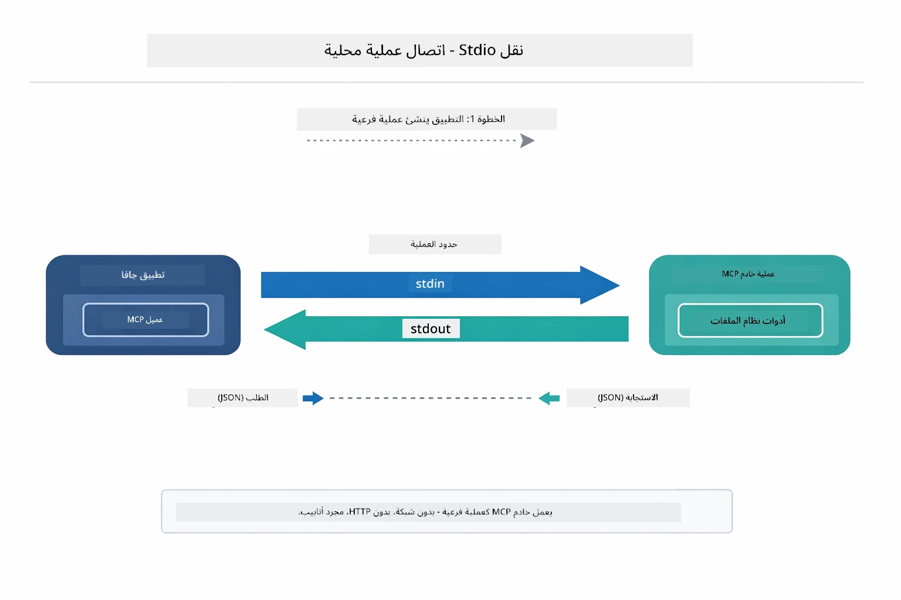

*نقل Stdio أثناء العمل — يطلق تطبيقك خادم MCP كعملية فرعية ويتواصلون عبر أنابيب stdin/stdout.*

> **🤖 جرب مع [GitHub Copilot](https://github.com/features/copilot) Chat:** افتح [`StdioTransportDemo.java`](../../../05-mcp/src/main/java/com/example/langchain4j/mcp/StdioTransportDemo.java) واطرح الأسئلة:
> - "كيف يعمل نقل Stdio ومتى يجب استخدامه مقارنة بـ HTTP؟"
> - "كيف يدير LangChain4j دورة حياة عمليات خادم MCP المشغلة؟"
> - "ما هي تداعيات الأمان لمنح الذكاء الاصطناعي وصولاً إلى نظام الملفات؟"

## وحدة الوكيل

بينما يوفر MCP أدوات موحدة، توفر وحدة الوكيل في LangChain4j طريقة إعلانية لبناء وكلاء ينظمون تلك الأدوات. تسمح التعليمة `@Agent` و`AgenticServices` بتعريف سلوك الوكيل من خلال واجهات بدلاً من التعليمات البرمجية الإجرائية.

في هذه الوحدة، ستستكشف نمط **وكيل المشرف** — نهج متقدم للذكاء الاصطناعي الوكلي حيث يقرر وكيل "المشرف" ديناميكياً أي الوكلاء الفرعيين يجب استدعاؤهم بناءً على طلبات المستخدم. سنجمع بين كلا المفهومين بإعطاء واحد من وكلائنا الفرعيين قدرات وصول للملفات مدعومة بـ MCP.

لاستخدام وحدة الوكيل، أضف هذا الاعتماد في Maven:

```xml
<dependency>
    <groupId>dev.langchain4j</groupId>
    <artifactId>langchain4j-agentic</artifactId>
    <version>${langchain4j.mcp.version}</version>
</dependency>
```

> **ملاحظة:** يستخدم وحدة `langchain4j-agentic` خاصية إصدار منفصلة (`langchain4j.mcp.version`) لأنها تصدر على جدول زمني مختلف عن مكتبات LangChain4j الأساسية.

> **⚠️ تجريبي:** وحدة `langchain4j-agentic` **تجريبية** وقابلة للتغيير. الطريقة المستقرة لبناء مساعدين ذكاء اصطناعي تظل `langchain4j-core` مع أدوات مخصصة (الوحدة 04).

## تشغيل الأمثلة

### المتطلبات الأساسية

- إكمال [الوحدة 04 - الأدوات](../04-tools/README.md) (هذه الوحدة تبني على مفاهيم الأدوات المخصصة وتقارنها مع أدوات MCP)
- ملف `.env` في الدليل الجذري مع بيانات اعتماد Azure (تم إنشاؤه بواسطة `azd up` في الوحدة 01)
- جافا 21+، مافن 3.9+
- Node.js 16+ و npm (لخوادم MCP)

> **ملاحظة:** إذا لم تقم بإعداد متغيرات البيئة بعد، راجع [الوحدة 01 - المقدمة](../01-introduction/README.md) لتعليمات النشر (`azd up` ينشئ ملف `.env` تلقائياً)، أو انسخ `.env.example` إلى `.env` في الدليل الجذري واملأ القيم.

## البدء السريع

**باستخدام VS Code:** فقط انقر بزر الماوس الأيمن على أي ملف عرض توضيحي في المستعرض واختر **"تشغيل جافا"**، أو استخدم تكوينات الإطلاق من لوحة التشغيل والتصحيح (تأكد أولاً من تكوين ملف `.env` ببيانات اعتماد Azure).

**باستخدام Maven:** بدلاً من ذلك، يمكنك التشغيل من سطر الأوامر بالأمثلة أدناه.

### عمليات الملفات (Stdio)

يبين هذا أمثلة أدوات تعتمد على عمليات فرعية محلية.

**✅ لا حاجة لمتطلبات سابقة** - يتم تشغيل خادم MCP تلقائياً.

**باستخدام سكريبتات التشغيل (مستحسن):**

تقوم سكريبتات التشغيل بتحميل متغيرات البيئة تلقائياً من ملف `.env` الجذري:

**Bash:**
```bash
cd 05-mcp
chmod +x start-stdio.sh
./start-stdio.sh
```

**PowerShell:**
```powershell
cd 05-mcp
.\start-stdio.ps1
```

**باستخدام VS Code:** انقر بزر الماوس الأيمن على `StdioTransportDemo.java` واختر **"تشغيل جافا"** (تأكد من تكوين ملف `.env`).

يقوم التطبيق بتشغيل خادم MCP لنظام الملفات تلقائياً ويقرأ ملفاً محلياً. لاحظ كيف تُدار العمليات الفرعية لك.

**الناتج المتوقع:**
```
Assistant response: The file provides an overview of LangChain4j, an open-source Java library
for integrating Large Language Models (LLMs) into Java applications...
```

### وكيل المشرف

نمط **وكيل المشرف** هو شكل **مرن** من الذكاء الاصطناعي الوكلي. يستخدم المشرف نموذج لغوي كبير ليقرر بشكل مستقل أي الوكلاء يجب استدعاؤهم بناءً على طلب المستخدم. في المثال التالي، ندمج وصول للملفات مدعوم بـ MCP مع وكيل LLM لإنشاء سير عمل قراءة ملف → تقرير بإشراف.

في العرض التوضيحي، يقرأ `FileAgent` ملفاً باستخدام أدوات نظام الملفات MCP، و`ReportAgent` ينشئ تقريراً منظمًا مع ملخص تنفيذي (جملة واحدة)، 3 نقاط رئيسية، وتوصيات. يشرف المشرف على هذا التدفق تلقائياً:

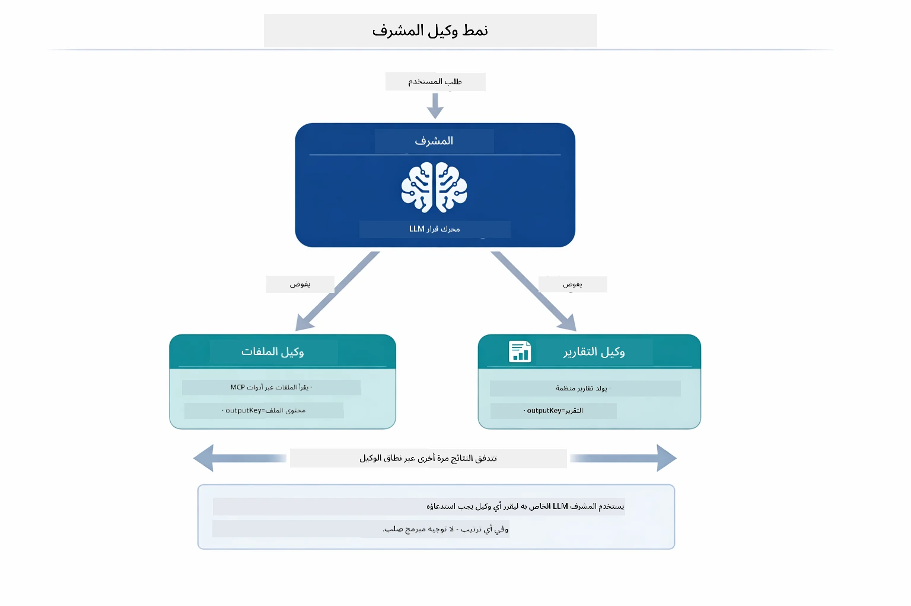

*يستخدم المشرف نموذج اللغة الخاص به ليقرر الوكلاء الذين يجب استدعاؤهم وبأي ترتيب — بدون توجيه مشفر مسبقاً.*

هذا ما يبدو عليه سير العمل الملموس لأنبوب ملف إلى تقرير:

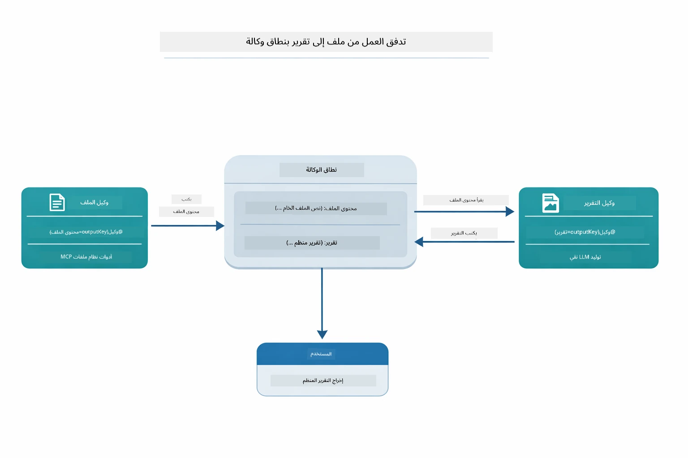

*يقرأ FileAgent الملف عبر أدوات MCP، ثم يحول ReportAgent المحتوى الخام إلى تقرير منظم.*

يخزن كل وكيل ناتجه في **نطاق الوكيل** (ذاكرة مشتركة)، مما يسمح للوكلاء التاليين بالوصول إلى النتائج السابقة. يوضح هذا كيف تندمج أدوات MCP بسلاسة في سير العمل الوكلي — لا يحتاج المشرف لمعرفة *كيفية* قراءة الملفات، فقط أن `FileAgent` يستطيع القيام بذلك.

#### تشغيل العرض التوضيحي

تقوم سكريبتات التشغيل بتحميل متغيرات البيئة تلقائياً من ملف `.env` الجذري:

**Bash:**
```bash
cd 05-mcp
chmod +x start-supervisor.sh
./start-supervisor.sh
```

**PowerShell:**
```powershell
cd 05-mcp
.\start-supervisor.ps1
```

**باستخدام VS Code:** انقر بزر الماوس الأيمن على `SupervisorAgentDemo.java` واختر **"تشغيل جافا"** (تأكد من تكوين ملف `.env`).

#### كيف يعمل المشرف

قبل بناء الوكلاء، تحتاج إلى ربط نقل MCP بعميل وتغليفه كـ `ToolProvider`. هكذا تصبح أدوات خادم MCP متاحة لوكلائك:

```java
// إنشاء عميل MCP من الناقل
McpClient mcpClient = new DefaultMcpClient.Builder()
        .transport(stdioTransport)
        .build();

// لف العميل كمزود أداة — هذا يربط أدوات MCP بـ LangChain4j
ToolProvider mcpToolProvider = McpToolProvider.builder()
        .mcpClients(List.of(mcpClient))
        .build();
```

الآن يمكنك حقن `mcpToolProvider` في أي وكيل يحتاج أدوات MCP:

```java
// الخطوة 1: يقرأ FileAgent الملفات باستخدام أدوات MCP
FileAgent fileAgent = AgenticServices.agentBuilder(FileAgent.class)
        .chatModel(model)
        .toolProvider(mcpToolProvider)  // يحتوي على أدوات MCP لعمليات الملفات
        .build();

// الخطوة 2: يقوم ReportAgent بإنشاء تقارير منظمة
ReportAgent reportAgent = AgenticServices.agentBuilder(ReportAgent.class)
        .chatModel(model)
        .build();

// المشرف يدير تدفق العمل من الملف إلى التقرير
SupervisorAgent supervisor = AgenticServices.supervisorBuilder()
        .chatModel(model)
        .subAgents(fileAgent, reportAgent)
        .responseStrategy(SupervisorResponseStrategy.LAST)  // إرجاع التقرير النهائي
        .build();

// يقرر المشرف الوكلاء الذين يتم استدعاؤهم بناءً على الطلب
String response = supervisor.invoke("Read the file at /path/file.txt and generate a report");
```

#### استراتيجيات الاستجابة

عند تكوين `SupervisorAgent`، تحدد كيف يجب أن يصيغ إجابته النهائية للمستخدم بعد أن يكمل الوكلاء الفرعيون مهامهم. يوضح المخطط أدناه الاستراتيجيات الثلاث المتاحة — LAST تعيد ناتج آخر وكيل مباشرة، SUMMARY تلخص جميع النواتج عبر نموذج لغوي، وSCORED تختار الأعلى تقييمًا مقابل الطلب الأصلي:

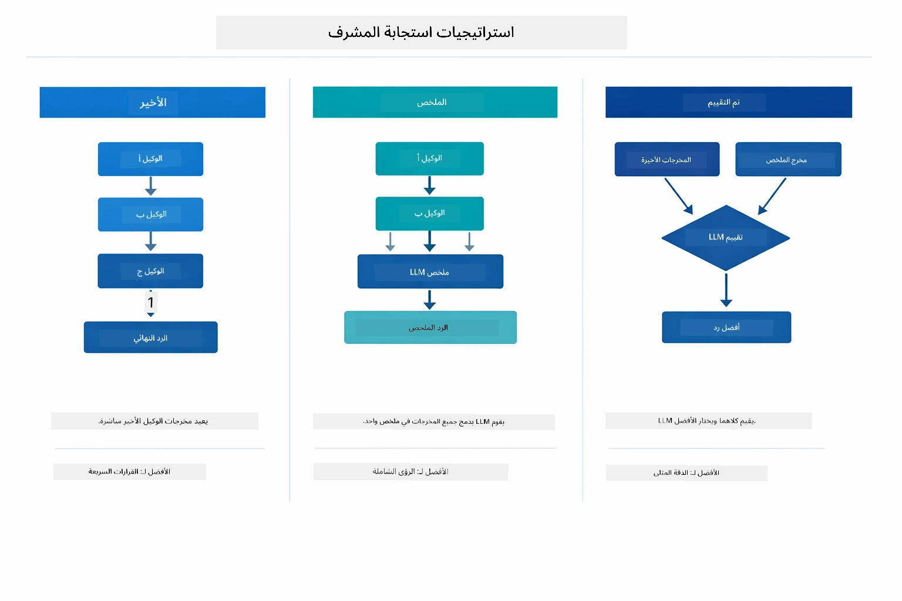

*ثلاث استراتيجيات لكيفية صياغة المشرف لإجابته النهائية — اختر حسب ما إذا كنت تريد ناتج آخر وكيل، ملخص مركب، أو الخيار الأعلى تقييماً.*

الاستراتيجيات المتاحة هي:

| الاستراتيجية | الوصف |
|----------|-------------|
| **LAST** | يعيد المشرف ناتج آخر وكيل فرعي أو أداة تم استدعاؤها. هذا مفيد عندما يكون الوكيل النهائي في سير العمل مصممًا خصيصًا لإنتاج الجواب النهائي الكامل (مثل "وكيل الملخص" في أنبوب البحث). |
| **SUMMARY** | يستخدم المشرف نموذج اللغة الداخلي الخاص به لتلخيص تفاعلات وأداء جميع الوكلاء الفرعيين، ثم يعيد ذلك الملخص كاستجابة نهائية. يوفر هذا إجابة منظمة ومجمعة للمستخدم. |
| **SCORED** | يستخدم النظام نموذج لغة داخلي ليقيّم كل من استجابة LAST وملخص SUMMARY مقابل طلب المستخدم الأصلي، ويعيد الناتج الذي حصل على التقييم الأعلى. |
راجع [SupervisorAgentDemo.java](../../../05-mcp/src/main/java/com/example/langchain4j/mcp/SupervisorAgentDemo.java) للتنفيذ الكامل.

> **🤖 جرب مع دردشة [GitHub Copilot](https://github.com/features/copilot):** افتح [`SupervisorAgentDemo.java`](../../../05-mcp/src/main/java/com/example/langchain4j/mcp/SupervisorAgentDemo.java) واسأل:
> - "كيف يقرر المشرف الوكلاء الذين يجب استدعاؤهم؟"
> - "ما الفرق بين أنماط المشرف والتسلسل في سير العمل؟"
> - "كيف يمكنني تخصيص سلوك التخطيط الخاص بالمشرف؟"

#### فهم المخرجات

عند تشغيل العرض التجريبي، سترى شرحًا منظمًا لكيفية تنسيق المشرف لعدة وكلاء. إليك معنى كل قسم:

```
======================================================================
  FILE → REPORT WORKFLOW DEMO
======================================================================

This demo shows a clear 2-step workflow: read a file, then generate a report.
The Supervisor orchestrates the agents automatically based on the request.
```

**العنوان** يقدم مفهوم سير العمل: خط أنابيب مركز من قراءة الملف إلى توليد التقرير.

```
--- WORKFLOW ---------------------------------------------------------
  ┌─────────────┐      ┌──────────────┐
  │  FileAgent  │ ───▶ │ ReportAgent  │
  │ (MCP tools) │      │  (pure LLM)  │
  └─────────────┘      └──────────────┘
   outputKey:           outputKey:
   'fileContent'        'report'

--- AVAILABLE AGENTS -------------------------------------------------
  [FILE]   FileAgent   - Reads files via MCP → stores in 'fileContent'
  [REPORT] ReportAgent - Generates structured report → stores in 'report'
```

**مخطط سير العمل** يعرض تدفق البيانات بين الوكلاء. لكل وكيل دور محدد:
- **FileAgent** يقرأ الملفات باستخدام أدوات MCP ويخزن المحتوى الخام في `fileContent`
- **ReportAgent** يستهلك ذلك المحتوى وينتج تقريرًا منظمًا في `report`

```
--- USER REQUEST -----------------------------------------------------
  "Read the file at .../file.txt and generate a report on its contents"
```

**طلب المستخدم** يعرض المهمة. يقوم المشرف بتحليلها ويقرر استدعاء FileAgent → ReportAgent.

```
--- SUPERVISOR ORCHESTRATION -----------------------------------------
  The Supervisor decides which agents to invoke and passes data between them...

  +-- STEP 1: Supervisor chose -> FileAgent (reading file via MCP)
  |
  |   Input: .../file.txt
  |
  |   Result: LangChain4j is an open-source, provider-agnostic Java framework for building LLM...
  +-- [OK] FileAgent (reading file via MCP) completed

  +-- STEP 2: Supervisor chose -> ReportAgent (generating structured report)
  |
  |   Input: LangChain4j is an open-source, provider-agnostic Java framew...
  |
  |   Result: Executive Summary...
  +-- [OK] ReportAgent (generating structured report) completed
```

**تنسيق المشرف** يعرض سير العملية ذات الخطوتين في العمل:
1. **FileAgent** يقرأ الملف عبر MCP ويخزن المحتوى
2. **ReportAgent** يستلم المحتوى وينتج تقريرًا منظمًا

المشرف اتخذ هذه القرارات **بشكل مستقل** بناءً على طلب المستخدم.

```
--- FINAL RESPONSE ---------------------------------------------------
Executive Summary
...

Key Points
...

Recommendations
...

--- AGENTIC SCOPE (Data Flow) ----------------------------------------
  Each agent stores its output for downstream agents to consume:
  * fileContent: LangChain4j is an open-source, provider-agnostic Java framework...
  * report: Executive Summary...
```

#### شرح ميزات وحدة الوكلاء

يعرض المثال عدة ميزات متقدمة لوحدة الوكلاء. لنلق نظرة أقرب على نطاق الوكلاء ومستمعي الوكلاء.

**نطاق الوكلاء** يعرض الذاكرة المشتركة حيث خزن الوكلاء نتائجهم باستخدام `@Agent(outputKey="...")`. هذا يسمح بـ:
- وصول الوكلاء اللاحقين إلى مخرجات الوكلاء السابقين
- للمشرف بتركيب رد نهائي
- لك بفحص ما أنتجه كل وكيل

المخطط أدناه يوضح كيف يعمل نطاق الوكلاء كذاكرة مشتركة في سير العمل من ملف إلى تقرير — FileAgent يكتب مخرجاته تحت المفتاح `fileContent`، ReportAgent يقرأ ذلك ويكتب مخرجاته تحت `report`:

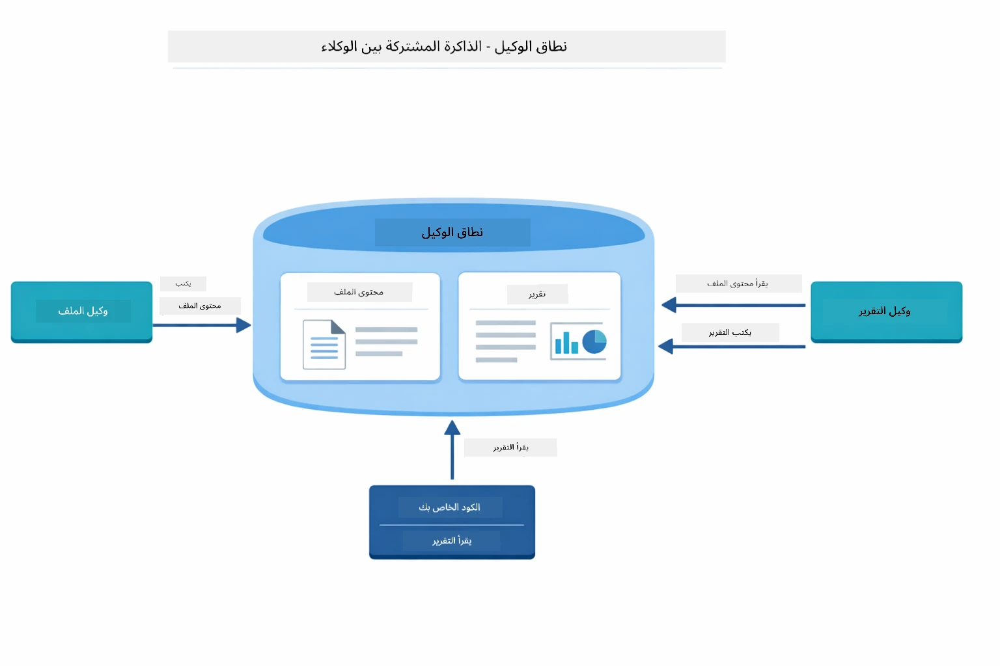

*نطاق الوكلاء يعمل كذاكرة مشتركة — FileAgent يكتب `fileContent`، ReportAgent يقرأه ويكتب `report`، وكودك يقرأ النتيجة النهائية.*

```java
ResultWithAgenticScope<String> result = supervisor.invokeWithAgenticScope(request);
AgenticScope scope = result.agenticScope();
String fileContent = scope.readState("fileContent");  // بيانات الملف الخام من FileAgent
String report = scope.readState("report");            // تقرير منظم من ReportAgent
```

**مستمعو الوكلاء** يمكنون من مراقبة وتصحيح تنفيذ الوكلاء. المخرجات خطوة بخطوة التي تراها في العرض تأتي من مستمع وكيل يتصل بكل استدعاء وكيل:
- **beforeAgentInvocation** - يُستدعى عند اختيار المشرف لوكيل، مما يتيح لك رؤية الوكيل المختار والسبب
- **afterAgentInvocation** - يُستدعى عندما ينهي الوكيل عمله، مع عرض نتيجته
- **inheritedBySubagents** - عند تفعيله، يراقب المستمع جميع الوكلاء في التسلسل الهرمي

يوضح المخطط التالي دورة حياة مستمع الوكلاء كاملة، بما في ذلك كيف يتعامل `onError` مع الأخطاء أثناء تنفيذ الوكيل:

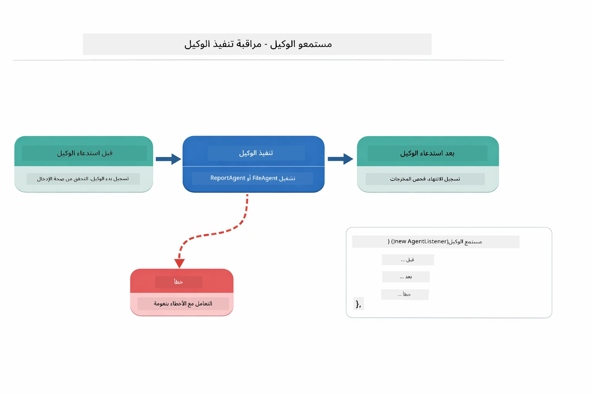

*يتم توصيل مستمعي الوكلاء بدورة حياة التنفيذ — يراقبون بدء الوكلاء وإكمالهم أو مواجهة أخطاء.*

```java
AgentListener monitor = new AgentListener() {
    private int step = 0;
    
    @Override
    public void beforeAgentInvocation(AgentRequest request) {
        step++;
        System.out.println("  +-- STEP " + step + ": " + request.agentName());
    }
    
    @Override
    public void afterAgentInvocation(AgentResponse response) {
        System.out.println("  +-- [OK] " + response.agentName() + " completed");
    }
    
    @Override
    public boolean inheritedBySubagents() {
        return true; // النشر إلى جميع العملاء الفرعيين
    }
};
```

بعيدًا عن نمط المشرف، توفر وحدة `langchain4j-agentic` عدة أنماط سير عمل قوية. يوضح المخطط أدناه الخمس أنماط — من خطوط أنابيب خطية بسيطة إلى سير عمل الموافقة البشرية:

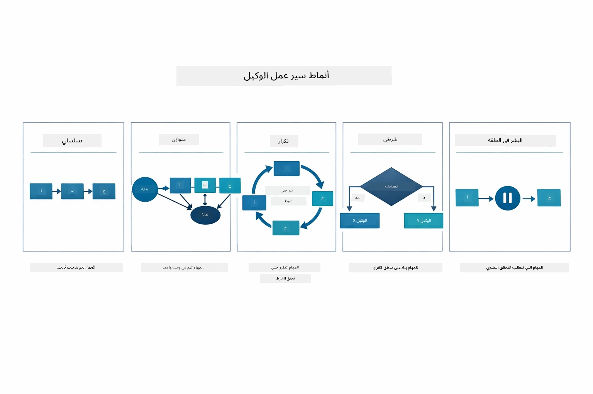

*خمسة أنماط سير عمل لتنظيم الوكلاء — من خطوط أنابيب خطية بسيطة إلى سير عمل الموافقة البشرية.*

| النمط | الوصف | حالة الاستخدام |
|---------|-------------|----------|
| **تسلسلي** | تنفيذ الوكلاء بالترتيب، يتدفق المخرج إلى التالي | خطوط أنابيب: بحث → تحليل → تقرير |
| **متوازي** | تشغيل الوكلاء في نفس الوقت | مهام مستقلة: الطقس + الأخبار + الأسهم |
| **تكراري** | التكرار حتى تحقق شرط | تقييم الجودة: تحسين حتى يكون التقييم ≥ 0.8 |
| **شرطي** | التوجيه بناءً على الشروط | التصنيف → التوجيه إلى وكيل متخصص |
| **البشر في الحلقة** | إضافة نقاط تحقق بشرية | سير عمل الموافقة، مراجعة المحتوى |

## المفاهيم الرئيسية

الآن بعد أن استكشفت MCP ووحدة الوكلاء بشكل عملي، لنلخص متى تستخدم كل نهج.

واحدة من أكبر مزايا MCP هي بيئتها المتنامية. يوضح المخطط أدناه كيف يربط بروتوكول عالمي تطبيق الذكاء الاصطناعي الخاص بك بمجموعة واسعة من خوادم MCP — من الوصول إلى نظام الملفات وقواعد البيانات إلى GitHub والبريد الإلكتروني وتسحب الويب والمزيد:

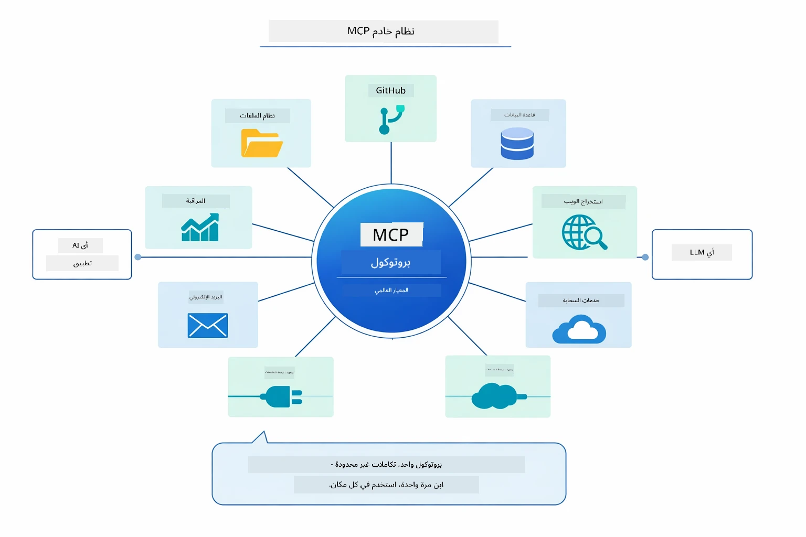

*MCP ينشئ نظام بروتوكول عالمي — أي خادم متوافق مع MCP يعمل مع أي عميل متوافق، مما يمكن مشاركة الأدوات عبر التطبيقات.*

**MCP** مثالي عندما ترغب في الاستفادة من أنظمة أدوات موجودة، بناء أدوات يمكن لعدة تطبيقات مشاركتها، دمج خدمات الطرف الثالث باستخدام بروتوكولات قياسية، أو تبديل تنفيذ الأدوات دون تغيير الكود.

**وحدة الوكلاء** تعمل بشكل أفضل عندما تريد تعريف وكلاء بطريقة إعلانية باستخدام تعليقات `@Agent`، تحتاج إلى تنظيم سير العمل (تسلسلي، حلقي، متوازي)، تفضل تصميم الوكلاء المعتمد على الواجهات بدلاً من الكود الإجرائي، أو تجمع عدة وكلاء يشاركون المخرجات عبر `outputKey`.

**نمط وكيل المشرف** يبرز عندما لا يمكن التنبؤ بسير العمل مسبقًا وتريد أن يقرر النموذج اللغوي الكبير (LLM)، عندما لديك وكلاء متخصصين متعددين يحتاجون إلى تنظيم ديناميكي، عند بناء أنظمة حوارية توجه لقدرات مختلفة، أو عندما تريد سلوك وكيل أكثر مرونة وتكيفًا.

لمساعدتك في الاختيار بين طرق `@Tool` المخصصة من الوحدة 04 وأدوات MCP من هذه الوحدة، يبرز الجدول التالي أهم المقارنات — الأدوات المخصصة توفر ترابطًا وثيقًا وأمان نوع كامل للمنطق الخاص بالتطبيق، بينما أدوات MCP تقدم تكاملات قياسية وقابلة لإعادة الاستخدام:

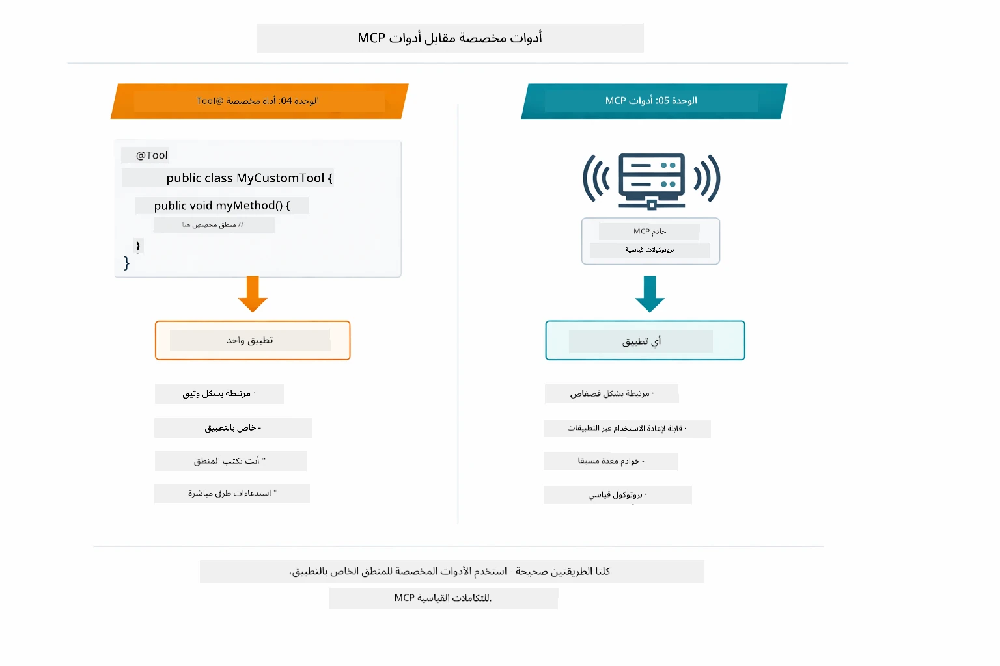

*متى تستخدم طرق @Tool المخصصة مقابل أدوات MCP — الأدوات المخصصة للمنطق الخاص بالتطبيق مع أمان نوع كامل، أدوات MCP للتكاملات القياسية التي تعمل عبر التطبيقات.*

## تهانينا!

لقد أكملت جميع الوحدات الخمسة لدورة LangChain4j للمبتدئين! إليك لمحة عن رحلة التعلم الكاملة التي أنجزتها — من دردشة أساسية إلى أنظمة الوكلاء المدعومة بـ MCP:

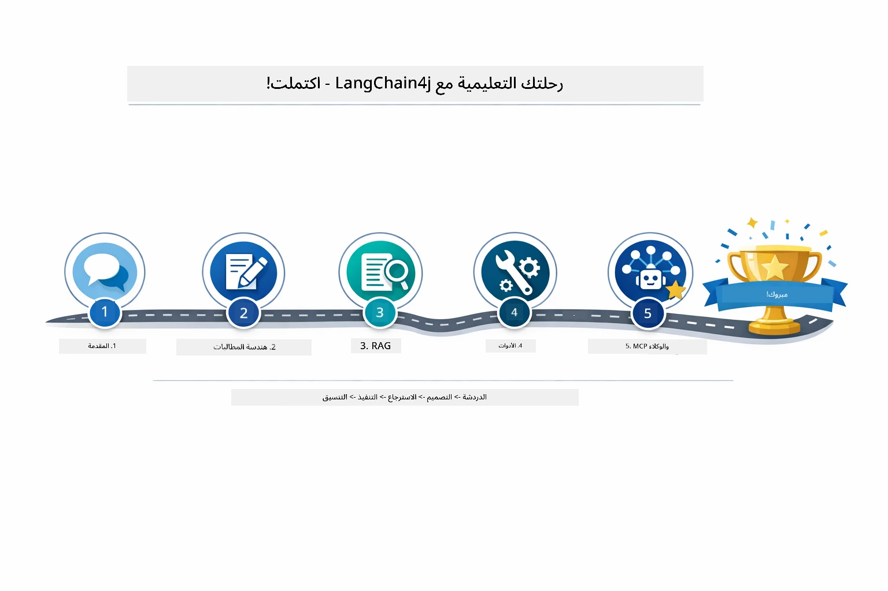

*رحلة تعلمك عبر كل الوحدات الخمسة — من الدردشة الأساسية إلى أنظمة الوكلاء المدعومة بـ MCP.*

لقد أكملت دورة LangChain4j للمبتدئين. لقد تعلمت:

- كيفية بناء ذكاء اصطناعي حواري مع ذاكرة (الوحدة 01)
- أنماط تصميم الإرشادات لمهام مختلفة (الوحدة 02)
- توطيد الردود في مستنداتك باستخدام RAG (الوحدة 03)
- إنشاء وكلاء ذكاء اصطناعي أساسيين (مساعدين) باستخدام أدوات مخصصة (الوحدة 04)
- دمج أدوات قياسية مع LangChain4j MCP ووحدات الوكلاء (الوحدة 05)

### ما القادم؟

بعد إكمال الوحدات، استكشف [دليل الاختبار](../docs/TESTING.md) لترى مفاهيم اختبار LangChain4j قيد التنفيذ.

**الموارد الرسمية:**
- [توثيق LangChain4j](https://docs.langchain4j.dev/) - أدلة شاملة ومرجع API
- [LangChain4j على GitHub](https://github.com/langchain4j/langchain4j) - الكود المصدري والأمثلة
- [دروس LangChain4j](https://docs.langchain4j.dev/tutorials/) - دروس خطوة بخطوة لحالات الاستخدام المختلفة

شكرًا لإكمالك هذه الدورة!

---

**التنقل:** [← السابق: الوحدة 04 - الأدوات](../04-tools/README.md) | [العودة إلى الرئيسية](../README.md)

---

<!-- CO-OP TRANSLATOR DISCLAIMER START -->
**تنويه**:
تمت ترجمة هذا المستند باستخدام خدمة الترجمة الآلية [Co-op Translator](https://github.com/Azure/co-op-translator). بينما نسعى للدقة، يرجى العلم أن الترجمات الآلية قد تحتوي على أخطاء أو عدم دقة. يجب اعتبار المستند الأصلي بلغته الأصلية المصدر الرسمي والمعتمد. للمعلومات الحساسة، يُنصح بالترجمة البشرية الاحترافية. لا نتحمل أي مسؤولية عن أي سوء فهم أو تفسير ناتج عن استخدام هذه الترجمة.
<!-- CO-OP TRANSLATOR DISCLAIMER END -->