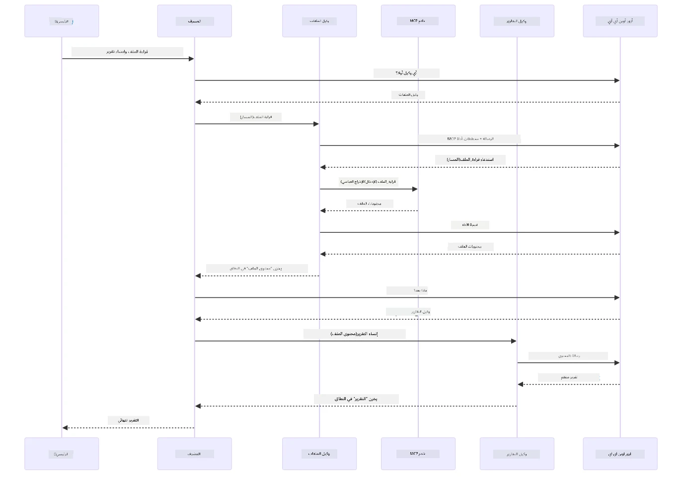

# الوحدة 05: بروتوكول سياق النموذج (MCP)

## جدول المحتويات

- [الجولة المصورة بالفيديو](../../../05-mcp)
- [ما الذي ستتعلمه](../../../05-mcp)
- [ما هو MCP؟](../../../05-mcp)
- [كيف يعمل MCP](../../../05-mcp)
- [الوحدة الوكيلية](../../../05-mcp)
- [تشغيل الأمثلة](../../../05-mcp)
  - [المتطلبات المسبقة](../../../05-mcp)
- [البدء السريع](../../../05-mcp)
  - [عمليات الملفات (Stdio)](../../../05-mcp)
  - [وكيل المشرف](../../../05-mcp)
    - [تشغيل العرض التوضيحي](../../../05-mcp)
    - [كيف يعمل المشرف](../../../05-mcp)
    - [كيف يكتشف FileAgent أدوات MCP في وقت التشغيل](../../../05-mcp)
    - [استراتيجيات الرد](../../../05-mcp)
    - [فهم النتيجة](../../../05-mcp)
    - [شرح ميزات الوحدة الوكيلية](../../../05-mcp)
- [المفاهيم الأساسية](../../../05-mcp)
- [تهانينا!](../../../05-mcp)
  - [ما الخطوة التالية؟](../../../05-mcp)

## الجولة المصورة بالفيديو

شاهد هذه الجلسة المباشرة التي تشرح كيفية البدء مع هذه الوحدة:

<a href="https://www.youtube.com/watch?v=O_J30kZc0rw"></a>

## ما الذي ستتعلمه

لقد قمت ببناء ذكاء اصطناعي حواري، وأتقنت التحفيزات، وجعلت الردود مستندة إلى المستندات، وأنشأت وكلاء مزودين بأدوات. لكن كل تلك الأدوات كانت مخصصة لتطبيقك الخاص. ماذا لو استطعت إعطاء ذكاءك الاصطناعي وصولاً إلى نظام بيئي موحد من الأدوات يمكن لأي شخص إنشاؤها ومشاركتها؟ في هذه الوحدة، ستتعلم كيفية القيام بذلك باستخدام بروتوكول سياق النموذج (MCP) ووحدة الوكيل لـ LangChain4j. نعرض أولاً قارئ ملفات MCP بسيط ثم نوضح كيف يتم دمجه بسهولة في سير العمل الوكيلي المتقدم باستخدام نمط وكيل المشرف.

## ما هو MCP؟

يوفر بروتوكول سياق النموذج (MCP) ذلك بالضبط - وسيلة معيارية لتطبيقات الذكاء الاصطناعي لاكتشاف واستخدام الأدوات الخارجية. بدلاً من كتابة تكاملات مخصصة لكل مصدر بيانات أو خدمة، تتصل بخوادم MCP التي تعرض قدراتها بشكل تنسيقي موحد. يمكن لوكيل الذكاء الاصطناعي الخاص بك بعد ذلك اكتشاف هذه الأدوات واستخدامها تلقائيًا.

يوضح المخطط أدناه الفرق - بدون MCP، كل تكامل يحتاج لربط مخصص نقطة بنقطة؛ مع MCP، بروتوكول واحد يربط تطبيقك بأي أداة:


*قبل MCP: تكاملات معقدة نقطة بنقطة. بعد MCP: بروتوكول واحد، إمكانيات لا حصر لها.*

يحل MCP مشكلة أساسية في تطوير الذكاء الاصطناعي: كل تكامل مخصص. تريد الوصول إلى GitHub؟ كود مخصص. تريد قراءة ملفات؟ كود مخصص. تريد استعلام قاعدة بيانات؟ كود مخصص. ولا تعمل أي من هذه التكاملات مع تطبيقات الذكاء الاصطناعي الأخرى.

يعمل MCP على توحيد هذا. يعرض خادم MCP أدوات مع أوصاف واضحة ومخططات. يمكن لأي عميل MCP الاتصال، واكتشاف الأدوات المتاحة، واستخدامها. تبني مرة واحدة، تستخدم في كل مكان.

يوضح المخطط أدناه هذه البنية - عميل MCP واحد (تطبيق الذكاء الاصطناعي الخاص بك) يتصل بعدة خوادم MCP، كل منها يعرض مجموعته الخاصة من الأدوات من خلال البروتوكول القياسي:


*بنية بروتوكول سياق النموذج - اكتشاف الأدوات الموحد وتنفيذها*

## كيف يعمل MCP

تستخدم MCP تحت الغطاء بنية متعددة الطبقات. يكتشف تطبيق Java الخاص بك (عميل MCP) الأدوات المتاحة ويرسل طلبات JSON-RPC عبر طبقة النقل (Stdio أو HTTP)، وينفذ خادم MCP العمليات ويعيد النتائج. يوضح المخطط التالي كل طبقة من هذا البروتوكول:


*كيف يعمل MCP تحت الغطاء — يكتشف العملاء الأدوات، ويتبادلون رسائل JSON-RPC، وينفذون العمليات عبر طبقة نقل.*

**بنية خادم-عميل**

يستخدم MCP نموذج خادم-عميل. يوفر الخوادم الأدوات - قراءة الملفات، استعلام قواعد البيانات، استدعاء واجهات برمجة التطبيقات. يتصل العملاء (تطبيق الذكاء الاصطناعي الخاص بك) بالخوادم ويستخدمون أدواتها.

لاستخدام MCP مع LangChain4j، أضف هذا الاعتماد في Maven:

```xml
<dependency>
    <groupId>dev.langchain4j</groupId>
    <artifactId>langchain4j-mcp</artifactId>
    <version>${langchain4j.version}</version>
</dependency>
```

**اكتشاف الأدوات**

عندما يتصل عميلك بخادم MCP، يسأل "ما الأدوات التي لديك؟" يرد الخادم بقائمة الأدوات المتاحة، كل منها مع الوصف ومخططات المعلمات. يمكن لوكيل الذكاء الاصطناعي بعد ذلك تقرير أي الأدوات يستخدم بناءً على طلبات المستخدم. يظهر المخطط أدناه هذه المصافحة — يرسل العميل طلب `tools/list` ويرجع الخادم أدواته المتاحة مع الوصف ومخططات المعلمات:


*يكتشف الذكاء الاصطناعي الأدوات المتاحة عند بدء التشغيل — الآن يعرف القدرات المتاحة ويمكنه تقرير أيها يستخدم.*

**آليات النقل**

يدعم MCP آليات نقل مختلفة. الخياران هما Stdio (لتواصل العمليات الفرعية المحلية) وHTTP القابل للتدفق (للخوادم البعيدة). توضح هذه الوحدة النقل عبر Stdio:


*آليات نقل MCP: HTTP للخوادم البعيدة، Stdio للعمليات المحلية*

**Stdio** - [StdioTransportDemo.java](../../../05-mcp/src/main/java/com/example/langchain4j/mcp/StdioTransportDemo.java)

لعمليات محلية. ينشئ تطبيقك خادمًا كعملية فرعية ويتواصل عبر الإدخال/الإخراج القياسي. مفيد للوصول إلى نظام الملفات أو أدوات سطر الأوامر.

```java
McpTransport stdioTransport = new StdioMcpTransport.Builder()
    .command(List.of(
        npmCmd, "exec",
        "@modelcontextprotocol/server-filesystem@2025.12.18",
        resourcesDir
    ))
    .logEvents(false)
    .build();
```

يكشف خادم `@modelcontextprotocol/server-filesystem` عن الأدوات التالية، جميعها مقيدة بالمجلدات التي تحددها:

| الأداة | الوصف |
|------|-------------|
| `read_file` | قراءة محتويات ملف واحد |
| `read_multiple_files` | قراءة عدة ملفات في مكالمة واحدة |
| `write_file` | إنشاء ملف أو استبداله |
| `edit_file` | إجراء تعديلات محددة للعثور والاستبدال |
| `list_directory` | سرد الملفات والمجلدات في مسار محدد |
| `search_files` | بحث متكرر عن ملفات تطابق نمط معين |
| `get_file_info` | الحصول على بيانات وصفية للملف (الحجم، الطوابع الزمنية، الأذونات) |
| `create_directory` | إنشاء مجلد (بما في ذلك المجلدات الرئيسية) |
| `move_file` | نقل أو إعادة تسمية ملف أو مجلد |

يوضح المخطط التالي كيفية عمل نقل Stdio في وقت التشغيل — ينشئ تطبيق Java الخاص بك خادم MCP كعملية فرعية ويتواصلان عبر أنابيب stdin/stdout بدون أي شبكة أو HTTP:


*نقل Stdio أثناء العمل — ينشئ تطبيقك خادم MCP كعملية فرعية ويتواصلان عبر أنابيب stdin/stdout.*

> **🤖 جرب مع [GitHub Copilot](https://github.com/features/copilot) Chat:** افتح [`StdioTransportDemo.java`](../../../05-mcp/src/main/java/com/example/langchain4j/mcp/StdioTransportDemo.java) واسأل:
> - "كيف يعمل نقل Stdio ومتى يجب أن أستخدمه بدلاً من HTTP؟"
> - "كيف يدير LangChain4j دورة حياة عمليات خادم MCP المنشأة؟"
> - "ما هي تداعيات الأمان عند منح الذكاء الاصطناعي الوصول إلى نظام الملفات؟"

## الوحدة الوكيلية

بينما يوفر MCP أدوات موحدة، توفر وحدة **agentic** في LangChain4j طريقة إعلانية لبناء وكلاء ينظمون تلك الأدوات. تسمح لك التعليمة `@Agent` و `AgenticServices` بتعريف سلوك الوكيل عبر الواجهات بدلاً من الكود الإجرائي.

في هذه الوحدة، ستستكشف نمط **وكيل المشرف** — نهج وكيلي متقدم للذكاء الاصطناعي حيث يقرر وكيل "المشرف" ديناميكيًا أي الوكلاء الفرعيين يجب استدعاؤهم بناءً على طلبات المستخدم. سندمج كلا المفهومين بمنح أحد وكلائنا الفرعيين قدرات وصول للملفات مدعومة بـ MCP.

لاستخدام الوحدة الوكيلية، أضف هذا الاعتماد في Maven:

```xml
<dependency>
    <groupId>dev.langchain4j</groupId>
    <artifactId>langchain4j-agentic</artifactId>
    <version>${langchain4j.mcp.version}</version>
</dependency>
```
> **ملاحظة:** تستخدم وحدة `langchain4j-agentic` خاصية إصدار منفصلة (`langchain4j.mcp.version`) لأنها تصدر بجدول مختلف عن مكتبات LangChain4j الأساسية.

> **⚠️ تجريبي:** وحدة `langchain4j-agentic` **تجريبية** وقابلة للتغيير. الطريقة المستقرة لبناء مساعدي الذكاء الاصطناعي تظل عبر `langchain4j-core` مع أدوات مخصصة (الوحدة 04).

## تشغيل الأمثلة

### المتطلبات المسبقة

- إتمام [الوحدة 04 - الأدوات](../04-tools/README.md) (تقوم هذه الوحدة على مفاهيم الأدوات المخصصة وتقارنها بأدوات MCP)
- وجود ملف `.env` في الدليل الجذري مع بيانات اعتماد Azure (تم إنشاؤه بواسطة `azd up` في الوحدة 01)
- Java 21 أو أحدث، Maven 3.9 أو أحدث
- Node.js 16 أو أحدث وnpm (لسيرفرات MCP)

> **ملاحظة:** إذا لم تقم بعد بإعداد متغيرات البيئة، راجع [الوحدة 01 - المقدمة](../01-introduction/README.md) لتعليمات النشر (`azd up` ينشئ ملف `.env` تلقائيًا)، أو انسخ `.env.example` إلى `.env` في الدليل الجذري واملأ القيم الخاصة بك.

## البدء السريع

**استخدام VS Code:** ببساطة انقر بزر الفأرة الأيمن على أي ملف عرض توضيحي في المستعرض واختر **"تشغيل Java"**، أو استخدم تكوينات التشغيل من لوحة التشغيل وتصحيح الأخطاء (تأكد من إعداد ملف `.env` مع بيانات اعتماد Azure أولاً).

**استخدام Maven:** بدلاً من ذلك، يمكنك التشغيل من سطر الأوامر مع الأمثلة أدناه.

### عمليات الملفات (Stdio)

يعرض هذا الأدوات المبنية على العمليات الفرعية المحلية.

**✅ لا توجد متطلبات مسبقة** - يتم إنشاء خادم MCP تلقائيًا.

**باستخدام سكربتات البدء (موصى بها):**

تحمّل سكربتات البدء متغيرات البيئة تلقائيًا من ملف `.env` الجذري:

**باش:**
```bash
cd 05-mcp
chmod +x start-stdio.sh
./start-stdio.sh
```

**PowerShell:**
```powershell
cd 05-mcp
.\start-stdio.ps1
```

**استخدام VS Code:** انقر بزر الماوس الأيمن على `StdioTransportDemo.java` واختر **"تشغيل Java"** (تأكد من إعداد ملف `.env`).

ينشئ التطبيق خادم MCP لنظام الملفات تلقائيًا ويقرأ ملفًا محليًا. لاحظ كيف يتم التعامل مع إدارة العملية الفرعية لك.

**الناتج المتوقع:**
```
Assistant response: The file provides an overview of LangChain4j, an open-source Java library
for integrating Large Language Models (LLMs) into Java applications...
```

### وكيل المشرف

نمط **وكيل المشرف** هو شكل **مرن** من الذكاء الاصطناعي الوكيلي. يستخدم المشرف نموذج لغة كبير (LLM) ليقرر بشكل مستقل أي الوكلاء يستدعى بناءً على طلب المستخدم. في المثال التالي، ندمج وصول ملفات مدعوم بـ MCP مع وكيل LLM لإنشاء سير عمل اقرأ الملف → تقرير تحت إشراف.

في العرض التوضيحي، يقرأ `FileAgent` ملفًا باستخدام أدوات نظام الملفات MCP، وينشئ `ReportAgent` تقريرًا منظمًا مع ملخص تنفيذي (جملة واحدة)، 3 نقاط رئيسية، وتوصيات. يدير المشرف هذا التدفق تلقائيًا:


*يستخدم المشرف نموذج اللغة الكبير الخاص به ليقرر أي الوكلاء يستدعى وبأي ترتيب — دون الحاجة لتوجيه مكود.*

هنا كيف يبدو سير العمل الملموس لخط أنابيب الملف إلى التقرير لدينا:


*يقرأ FileAgent الملف عبر أدوات MCP، ثم يحول ReportAgent المحتوى الخام إلى تقرير منظم.*

يُظهر مخطط التسلسل التالي التنسيق الكامل للمشرف — من إنشاء خادم MCP، مرورًا بالاختيار المستقل للوكلاء من قبل المشرف، حتى استدعاءات الأدوات عبر stdio والتقرير النهائي:



*يدعو المشرف بشكل مستقل FileAgent (الذي يستدعي خادم MCP عبر stdio لقراءة الملف)، ثم يستدعي ReportAgent لإنتاج تقرير منظم — يخزن كل وكيل ناتجه في النطاق الوكيلي المشترك.*

يخزن كل وكيل الناتج الخاص به في **النطاق الوكيلي** (ذاكرة مشتركة)، مما يسمح للوكلاء التابعين بالوصول إلى النتائج السابقة. يوضح هذا كيف تندمج أدوات MCP بسلاسة في سير العمل الوكيلي — لا يحتاج المشرف إلى معرفة *كيفية* قراءة الملفات، فقط أن `FileAgent` يمكنه ذلك.

#### تشغيل العرض التوضيحي

تحمّل سكربتات البدء متغيرات البيئة تلقائيًا من ملف `.env` الجذري:

**باش:**
```bash
cd 05-mcp
chmod +x start-supervisor.sh
./start-supervisor.sh
```

**PowerShell:**
```powershell
cd 05-mcp
.\start-supervisor.ps1
```

**استخدام VS Code:** انقر بزر الماوس الأيمن على `SupervisorAgentDemo.java` واختر **"تشغيل Java"** (تأكد من إعداد ملف `.env`).

#### كيف يعمل المشرف

قبل بناء الوكلاء، تحتاج إلى ربط نقل MCP بعميل ولفه كـ `ToolProvider`. هكذا تصبح أدوات خادم MCP متاحة لوكلائك:

```java
// إنشاء عميل MCP من النقل
McpClient mcpClient = new DefaultMcpClient.Builder()
        .transport(stdioTransport)
        .build();

// لف العميل كمزود أداة — هذا يربط أدوات MCP بـ LangChain4j
ToolProvider mcpToolProvider = McpToolProvider.builder()
        .mcpClients(List.of(mcpClient))
        .build();
```

الآن يمكنك حقن `mcpToolProvider` في أي وكيل يحتاج أدوات MCP:

```java
// الخطوة 1: يقوم FileAgent بقراءة الملفات باستخدام أدوات MCP
FileAgent fileAgent = AgenticServices.agentBuilder(FileAgent.class)
        .chatModel(model)
        .toolProvider(mcpToolProvider)  // يحتوي على أدوات MCP لعمليات الملفات
        .build();

// الخطوة 2: يقوم ReportAgent بإنشاء تقارير منظمة
ReportAgent reportAgent = AgenticServices.agentBuilder(ReportAgent.class)
        .chatModel(model)
        .build();

// يقوم المشرف بتنظيم سير العمل من الملف إلى التقرير
SupervisorAgent supervisor = AgenticServices.supervisorBuilder()
        .chatModel(model)
        .subAgents(fileAgent, reportAgent)
        .responseStrategy(SupervisorResponseStrategy.LAST)  // إعادة التقرير النهائي
        .build();

// يقرر المشرف أي الوكلاء يجب استدعاؤهم بناءً على الطلب
String response = supervisor.invoke("Read the file at /path/file.txt and generate a report");
```

#### كيف يكتشف FileAgent أدوات MCP في وقت التشغيل

قد تتساءل: **كيف يعرف `FileAgent` كيفية استخدام أدوات نظام الملفات npm؟** الإجابة أنه لا يعرف — يقوم **نموذج اللغة الكبير** باكتشاف ذلك في وقت التشغيل من خلال مخططات الأدوات.
واجهة `FileAgent` مجرد **تعريف مطالبة**. ليس لديها معرفة مدمجة مسبقًا بـ `read_file`، `list_directory`، أو أي أداة MCP أخرى. إليك ما يحدث من البداية إلى النهاية:

1. **تشغيل الخادم:** يبدأ `StdioMcpTransport` حزمة npm الخاصة بـ `@modelcontextprotocol/server-filesystem` كعملية فرعية
2. **اكتشاف الأداة:** يرسل `McpClient` طلب JSON-RPC بعنوان `tools/list` إلى الخادم، الذي يرد بأسماء الأدوات، الأوصاف، ومخططات المعلمات (مثلًا، `read_file` — *"قراءة المحتويات الكاملة لملف"* — `{ path: string }`)
3. **حقن المخطط:** يلف `McpToolProvider` هذه المخططات المكتشفة ويجعلها متاحة لـ LangChain4j
4. **قرار LLM:** عندما يتم استدعاء `FileAgent.readFile(path)`، يرسل LangChain4j رسالة النظام، رسالة المستخدم، **وقائمة مخططات الأدوات** إلى النموذج اللغوي الكبير. يقرأ النموذج أوصاف الأدوات وينشئ استدعاء أداة (مثلًا، `read_file(path="/some/file.txt")`)
5. **التنفيذ:** يعترض LangChain4j استدعاء الأداة، ويقوم بتوجيهها عبر عميل MCP مرة أخرى إلى العملية الفرعية Node.js، يحصل على النتيجة، ويُرجعها إلى النموذج اللغوي الكبير

هذه هي نفس آلية [اكتشاف الأدوات](../../../05-mcp) الموصوفة أعلاه، ولكنها تُطبق خصيصًا على سير عمل الوكيل. توجه تعليقات `@SystemMessage` و`@UserMessage` سلوك النموذج اللغوي الكبير، في حين يوفر `ToolProvider` المحقون **الإمكانات** — يقوم النموذج اللغوي الكبير بربط الاثنين عند وقت التشغيل.

> **🤖 جرب مع دردشة [GitHub Copilot](https://github.com/features/copilot):** افتح [`FileAgent.java`](../../../05-mcp/src/main/java/com/example/langchain4j/mcp/agents/FileAgent.java) واسأل:
> - "كيف يعرف هذا الوكيل أي أداة MCP يستدعي؟"
> - "ماذا يحدث إذا أزلت ToolProvider من منشئ الوكيل؟"
> - "كيف يتم تمرير مخططات الأدوات إلى النموذج اللغوي الكبير؟"

#### استراتيجيات الاستجابة

عند تكوين `SupervisorAgent`، تحدد كيف يجب أن يصيغ جوابه النهائي للمستخدم بعد أن يكمل الوكلاء الفرعيون مهامهم. يوضح الرسم البياني أدناه الاستراتيجيات الثلاث المتاحة — LAST تُرجع مخرجات الوكيل النهائي مباشرة، SUMMARY تلخص كل المخرجات عبر نموذج لغوي كبير، وSCORED تختار النتيجة الأعلى تقييمًا بناءً على الطلب الأصلي:


*ثلاث استراتيجيات لكيفية صياغة المشرف استجابته النهائية — اختر حسب ما إذا كنت تريد ناتج الوكيل الأخير، ملخصًا مركبًا، أو الخيار الأعلى تقييمًا.*

الاستراتيجيات المتاحة هي:

| الاستراتيجية | الوصف |
|--------------|--------|
| **LAST** | يعيد المشرف مخرجات آخر وكيل فرعي أو أداة تم استدعاؤها. هذا مفيد عندما يكون الوكيل النهائي في سير العمل مصممًا خصيصًا لإنتاج الإجابة النهائية الكاملة (مثل "وكيل الملخص" في خط أنابيب البحث). |
| **SUMMARY** | يستخدم المشرف نموذج اللغة الداخلي الخاص به لتوليف ملخص للتفاعل بالكامل وجميع مخرجات الوكلاء الفرعيين، ثم يعيد هذا الملخص كرد نهائي. هذا يوفر إجابة نظيفة ومجمعة للمستخدم. |
| **SCORED** | يستخدم النظام نموذجًا لغويًا داخليًا لتقييم رد LAST وملخص التفاعل مقابل طلب المستخدم الأصلي، ويرجع المخرجات التي حصلت على الدرجة الأعلى. |

راجع [SupervisorAgentDemo.java](../../../05-mcp/src/main/java/com/example/langchain4j/mcp/SupervisorAgentDemo.java) للتنفيذ الكامل.

> **🤖 جرب مع دردشة [GitHub Copilot](https://github.com/features/copilot):** افتح [`SupervisorAgentDemo.java`](../../../05-mcp/src/main/java/com/example/langchain4j/mcp/SupervisorAgentDemo.java) واسأل:
> - "كيف يقرر المشرف أي وكلاء يستدعي؟"
> - "ما الفرق بين نمط المشرف ونمط سير العمل المتسلسل؟"
> - "كيف يمكنني تخصيص سلوك التخطيط للمشرف؟"

#### فهم الناتج

عند تشغيل العرض التوضيحي، سترى استعراضًا منظمًا لكيفية تنظيم المشرف لعدة وكلاء. هذا ما يعنيه كل قسم:

```
======================================================================
  FILE → REPORT WORKFLOW DEMO
======================================================================

This demo shows a clear 2-step workflow: read a file, then generate a report.
The Supervisor orchestrates the agents automatically based on the request.
```

**العنوان الرئيسي** يقدم مفهوم سير العمل: خط أنابيب مركز من قراءة الملف إلى توليد التقرير.

```
--- WORKFLOW ---------------------------------------------------------
  ┌─────────────┐      ┌──────────────┐
  │  FileAgent  │ ───▶ │ ReportAgent  │
  │ (MCP tools) │      │  (pure LLM)  │
  └─────────────┘      └──────────────┘
   outputKey:           outputKey:
   'fileContent'        'report'

--- AVAILABLE AGENTS -------------------------------------------------
  [FILE]   FileAgent   - Reads files via MCP → stores in 'fileContent'
  [REPORT] ReportAgent - Generates structured report → stores in 'report'
```

**رسم تخطيطي لسير العمل** يُظهر تدفق البيانات بين الوكلاء. لكل وكيل دور محدد:
- **FileAgent** يقرأ الملفات باستخدام أدوات MCP ويخزن المحتوى الخام في `fileContent`
- **ReportAgent** يستهلك هذا المحتوى وينتج تقريرًا منظمًا في `report`

```
--- USER REQUEST -----------------------------------------------------
  "Read the file at .../file.txt and generate a report on its contents"
```

**طلب المستخدم** يعرض المهمة. يحلل المشرف هذا ويقرر استدعاء FileAgent → ReportAgent.

```
--- SUPERVISOR ORCHESTRATION -----------------------------------------
  The Supervisor decides which agents to invoke and passes data between them...

  +-- STEP 1: Supervisor chose -> FileAgent (reading file via MCP)
  |
  |   Input: .../file.txt
  |
  |   Result: LangChain4j is an open-source, provider-agnostic Java framework for building LLM...
  +-- [OK] FileAgent (reading file via MCP) completed

  +-- STEP 2: Supervisor chose -> ReportAgent (generating structured report)
  |
  |   Input: LangChain4j is an open-source, provider-agnostic Java framew...
  |
  |   Result: Executive Summary...
  +-- [OK] ReportAgent (generating structured report) completed
```

**تنسيق المشرف** يُظهر تدفق الخطوتين عمليًا:
1. **FileAgent** يقرأ الملف عبر MCP ويخزن المحتوى
2. **ReportAgent** يستلم المحتوى وينشئ تقريرًا منظمًا

قام المشرف بهذه القرارات **بشكل مستقل** بناءً على طلب المستخدم.

```
--- FINAL RESPONSE ---------------------------------------------------
Executive Summary
...

Key Points
...

Recommendations
...

--- AGENTIC SCOPE (Data Flow) ----------------------------------------
  Each agent stores its output for downstream agents to consume:
  * fileContent: LangChain4j is an open-source, provider-agnostic Java framework...
  * report: Executive Summary...
```

#### شرح ميزات وحدة الوكالة

تُظهر الأمثلة عدة ميزات متقدمة لوحدة الوكالة. دعنا نلقي نظرة أقرب على نطاق الوكلاء ومستمعي الوكلاء.

**نطاق الوكلاء** يعرض الذاكرة المشتركة حيث خزن الوكلاء نتائجهم باستخدام `@Agent(outputKey="...")`. هذا يسمح بـ:
- وصول الوكلاء اللاحقين لمخرجات الوكلاء الأسبقين
- المشرف لتوليف استجابة نهائية
- أنت لفحص ما أخرجه كل وكيل

يُظهر الرسم البياني أدناه كيف يعمل نطاق الوكلاء كذاكرة مشتركة في سير العمل من الملف إلى التقرير — يكتب FileAgent مخرجاته تحت المفتاح `fileContent`، يقرأ ReportAgent ذلك ويكتب مخرجاته تحت `report`:


*يعمل نطاق الوكلاء كذاكرة مشتركة — يكتب FileAgent `fileContent`، يقرأ ReportAgent المحتوى ويكتب `report`، ويقرأ كودك النتيجة النهائية.*

```java
ResultWithAgenticScope<String> result = supervisor.invokeWithAgenticScope(request);
AgenticScope scope = result.agenticScope();
String fileContent = scope.readState("fileContent");  // بيانات ملف خام من FileAgent
String report = scope.readState("report");            // تقرير منظم من ReportAgent
```

**مستمعو الوكلاء** يمكِّنون من مراقبة وتصحيح تنفيذ الوكلاء. المخرجات خطوة بخطوة التي تراها في العرض تأتي من مستمع وكيل يرتبط بكل استدعاء وكيل:
- **beforeAgentInvocation** - يُستدعى عند اختيار المشرف لوكيل، ويتيح لك رؤية الوكيل المختار والسبب
- **afterAgentInvocation** - يُستدعى عند اكتمال الوكيل، ويعرض نتيجته
- **inheritedBySubagents** - عند تفعيله، يراقب المستمع جميع الوكلاء في الهيكلية

يُظهر الرسم البياني التالي دورة حياة مستمع الوكيل الكاملة، بما في ذلك كيفية تعامل `onError` مع الإخفاقات أثناء التنفيذ:


*يرتبط مستمعو الوكلاء بدورة حياة التنفيذ — راقب متى يبدأ الوكلاء، يكملون، أو يواجهون أخطاءً.*

```java
AgentListener monitor = new AgentListener() {
    private int step = 0;
    
    @Override
    public void beforeAgentInvocation(AgentRequest request) {
        step++;
        System.out.println("  +-- STEP " + step + ": " + request.agentName());
    }
    
    @Override
    public void afterAgentInvocation(AgentResponse response) {
        System.out.println("  +-- [OK] " + response.agentName() + " completed");
    }
    
    @Override
    public boolean inheritedBySubagents() {
        return true; // نشر إلى جميع الوكلاء الفرعيين
    }
};
```

إلى جانب نمط المشرف، يوفر `langchain4j-agentic` عدة أنماط سير عمل قوية. يظهر الرسم البياني أدناه جميع الأنماط الخمسة — من خطوط الأنابيب المتسلسلة البسيطة إلى سير عمل الموافقة بالتواجد البشري:


*خمسة أنماط سير عمل لتنظيم الوكلاء — من خطوط الأنابيب المتسلسلة البسيطة إلى سير عمل الموافقة بالتواجد البشري.*

| النمط       | الوصف                         | حالة الاستخدام              |
|-------------|------------------------------|-----------------------------|
| **متسلسل** | تنفيذ الوكلاء بالتتابع، تتدفق المخرجات إلى التالي | خطوط أنابيب: بحث → تحليل → تقرير |
| **متوازي** | تشغيل الوكلاء في نفس الوقت   | مهام مستقلة: الطقس + الأخبار + الأسهم |
| **حلقي**   | التكرار حتى تتحقق حالة       | تقييم الجودة: تحسين حتى الدرجة ≥ 0.8 |
| **شرطي**  | التوجيه بناءً على الشروط     | التصنيف → التوجيه لوكيل متخصص    |
| **بشري في الحلقة** | إضافة نقاط تحقق بشرية        | سير عمل الموافقة، مراجعة المحتوى  |

## المفاهيم الرئيسية

بعد أن استكشفت MCP ووحدة الوكالة عمليًا، لنلخص متى تستخدم كل منهما.

أحد أكبر مزايا MCP هو نظامه البيئي المتنامي. يوضح الرسم البياني أدناه كيف يربط بروتوكول عالمي واحد تطبيق الذكاء الصناعي الخاص بك بمجموعة واسعة من خوادم MCP — من الوصول إلى نظام الملفات وقواعد البيانات إلى GitHub، البريد الإلكتروني، تجريف الويب، والمزيد:


*يخلق MCP نظامًا بيئيًا لبروتوكول عالمي — أي خادم متوافق مع MCP يعمل مع أي عميل متوافق مع MCP، مما يمكّن مشاركة الأدوات عبر التطبيقات.*

**MCP** مثالي عندما تريد الاستفادة من نظم الأدوات القائمة، بناء أدوات يمكن للعديد من التطبيقات مشاركتها، دمج خدمات الطرف الثالث عبر بروتوكولات معيارية، أو تبديل تنفيذ الأدوات دون تغيير الكود.

**وحدة الوكالة** تعمل بشكل أفضل عندما تريد تعريف وكلاء إعلانيين باستخدام تعليقات `@Agent`، تحتاج إلى تنظيم سير العمل (متسلسل، حلقي، متوازٍ)، تفضل تصميم الوكيل المعتمد على الواجهات بدل الكود الإجرائي، أو تجمع عدة وكلاء يشاركون المخرجات عبر `outputKey`.

**نمط وكيل المشرف** يتفوق عندما لا يمكن التنبؤ بسير العمل مسبقًا وتريد للنموذج اللغوي الكبير أن يقرر، عندما يكون لديك العديد من الوكلاء المتخصصين الذين يحتاجون تنظيمًا ديناميكيًا، عند بناء أنظمة محادثة توجه للقدرات المختلفة، أو عندما تريد أكثر سلوك وكيل مرن وتكيفًا.

لمساعدتك في الاختيار بين الطرق المخصصة `@Tool` من الوحدة 04 وأدوات MCP من هذه الوحدة، يبرز المقارنة التالية المزايا الرئيسية — توفر الأدوات المخصصة ارتباطًا وثيقًا وأمان نوع كامل للمنطق الخاص بالتطبيق، بينما تقدم أدوات MCP تكاملات موحدة وقابلة لإعادة الاستخدام:


*متى تستخدم الطرق المخصصة @Tool مقابل أدوات MCP — أدوات مخصصة للمنطق الخاص بالتطبيق مع أمان نوع كامل، أدوات MCP لتكاملات موحدة تعمل عبر التطبيقات.*

## تهانينا!

لقد أتممت جميع الوحدات الخمس من دورة LangChain4j للمبتدئين! إليك نظرة على رحلة التعلم الكاملة التي أكملتها — من المحادثة الأساسية إلى أنظمة الوكلاء المدعومة بـ MCP:


*رحلة تعلمك عبر جميع الوحدات الخمس — من المحادثة الأساسية إلى أنظمة الوكلاء المدعومة بـ MCP.*

لقد أكملت دورة LangChain4j للمبتدئين. تعلمت:

- كيفية بناء ذكاء اصطناعي محادثي مع ذاكرة (الوحدة 01)
- أنماط هندسة المطالبات لمهام مختلفة (الوحدة 02)
- تأصيل الردود في مستنداتك باستخدام RAG (الوحدة 03)
- إنشاء وكلاء ذكاء اصطناعي أساسيين (مساعدين) بأدوات مخصصة (الوحدة 04)
- دمج أدوات موحدة مع وحدات LangChain4j MCP والوكلاء (الوحدة 05)

### ما التالي؟

بعد إكمال الوحدات، استكشف [دليل الاختبار](../docs/TESTING.md) لرؤية مفاهيم اختبار LangChain4j عمليًا.

**الموارد الرسمية:**
- [توثيق LangChain4j](https://docs.langchain4j.dev/) - أدلة شاملة ومرجع API
- [GitHub الخاص بـ LangChain4j](https://github.com/langchain4j/langchain4j) - الشيفرة المصدرية والأمثلة
- [دروس LangChain4j](https://docs.langchain4j.dev/tutorials/) - دروس خطوة بخطوة لحالات استخدام متنوعة

شكرًا لإكمالك هذه الدورة!

---

**التنقل:** [← السابق: الوحدة 04 - الأدوات](../04-tools/README.md) | [العودة إلى الرئيسي](../README.md)

---

<!-- CO-OP TRANSLATOR DISCLAIMER START -->
**تنويه**:  
تمت ترجمة هذا المستند باستخدام خدمة الترجمة الآلية [Co-op Translator](https://github.com/Azure/co-op-translator). بينما نسعى جاهدين لتحقيق الدقة، يُرجى الانتباه إلى أن الترجمات الآلية قد تحتوي على أخطاء أو عدم دقة. يجب اعتبار المستند الأصلي بلغته الأصلية المصدر الموثوق والموثوق به. بالنسبة للمعلومات الحساسة أو الحرجة، يُنصح بالاستعانة بترجمة بشرية محترفة. نحن غير مسؤولين عن أي سوء فهم أو تفسير ناتج عن استخدام هذه الترجمة.
<!-- CO-OP TRANSLATOR DISCLAIMER END -->