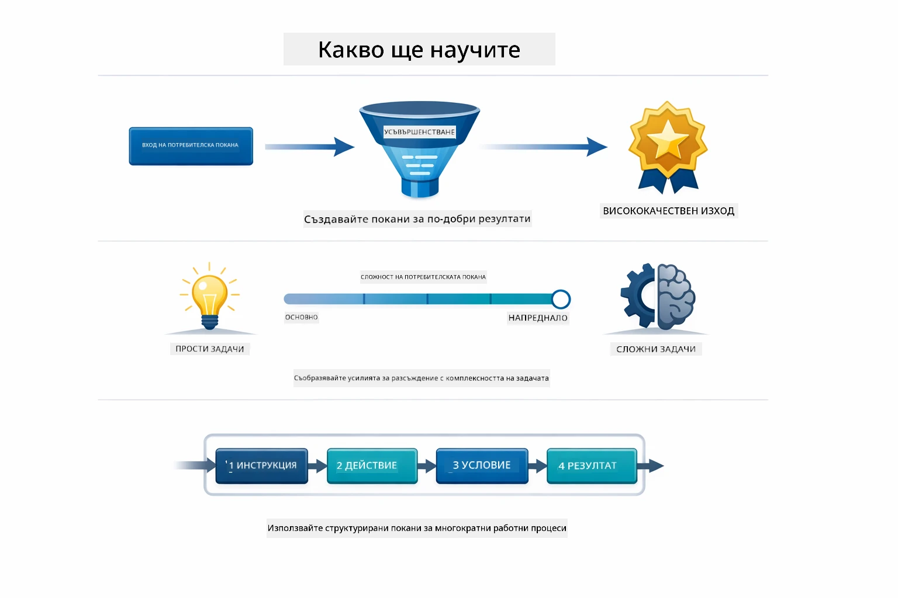
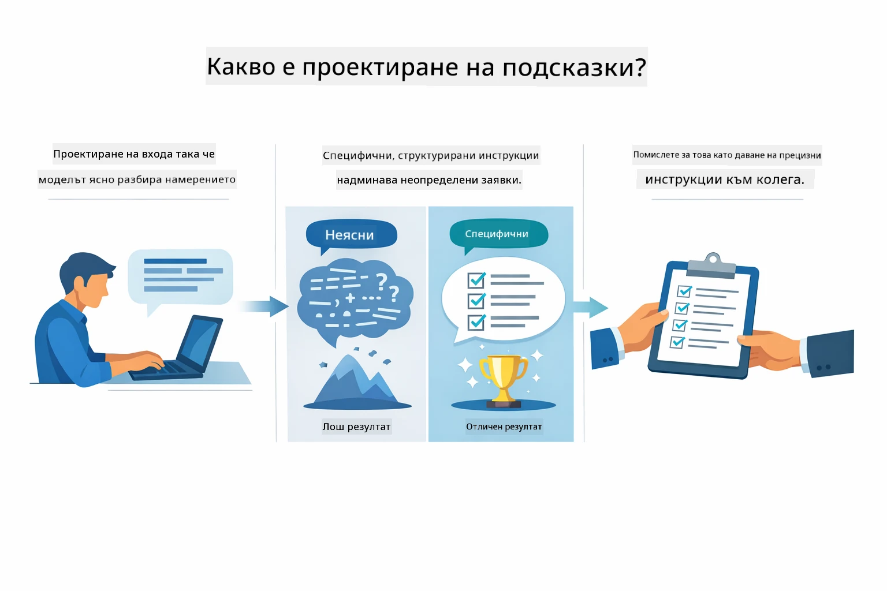
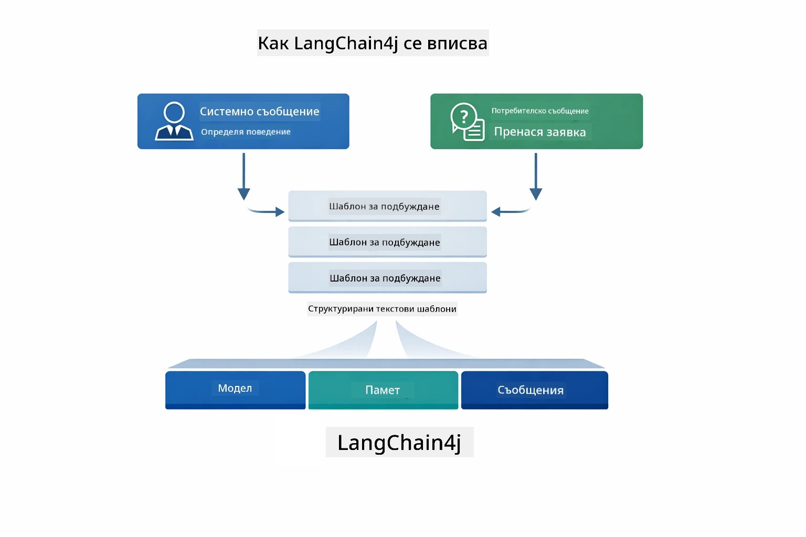
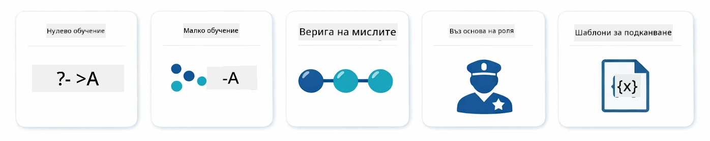
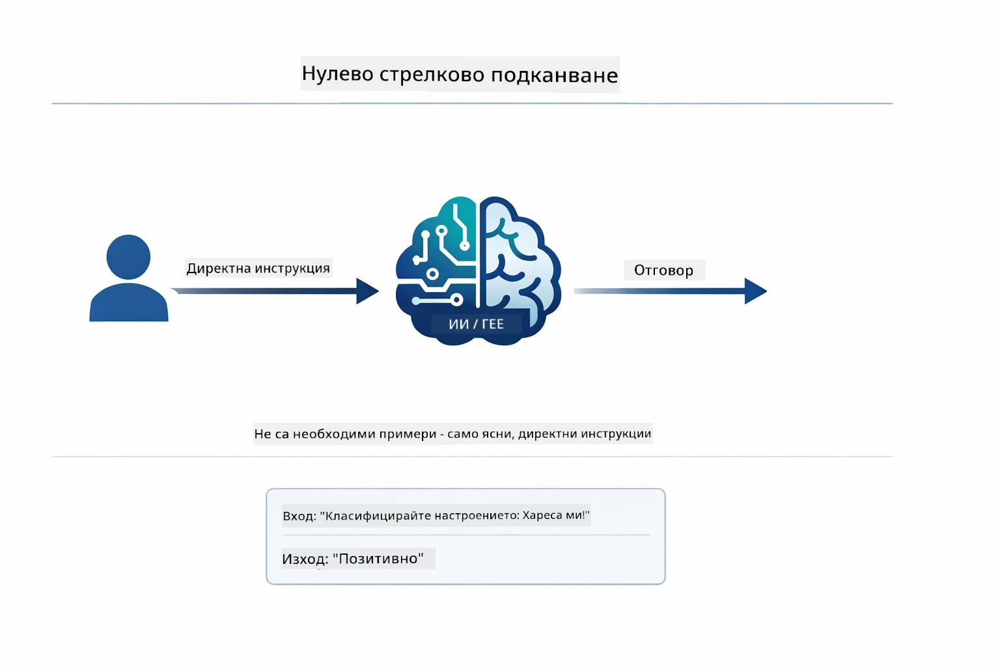
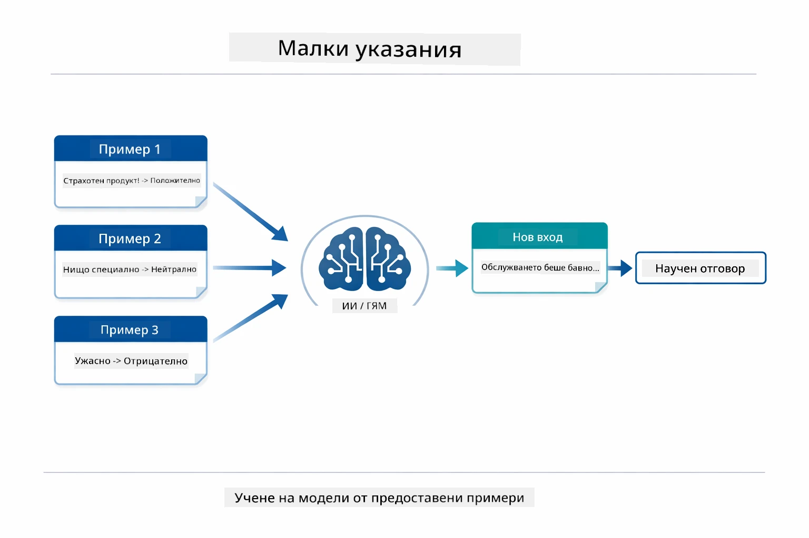
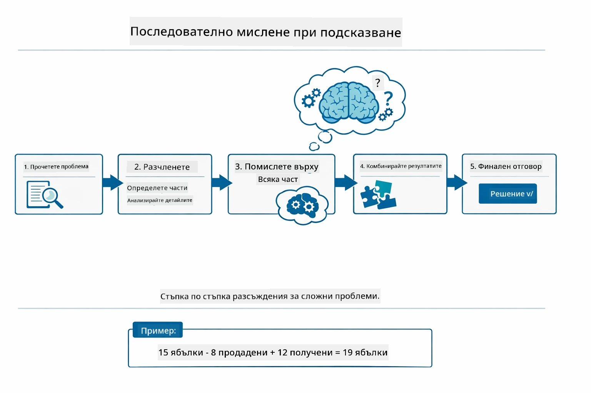
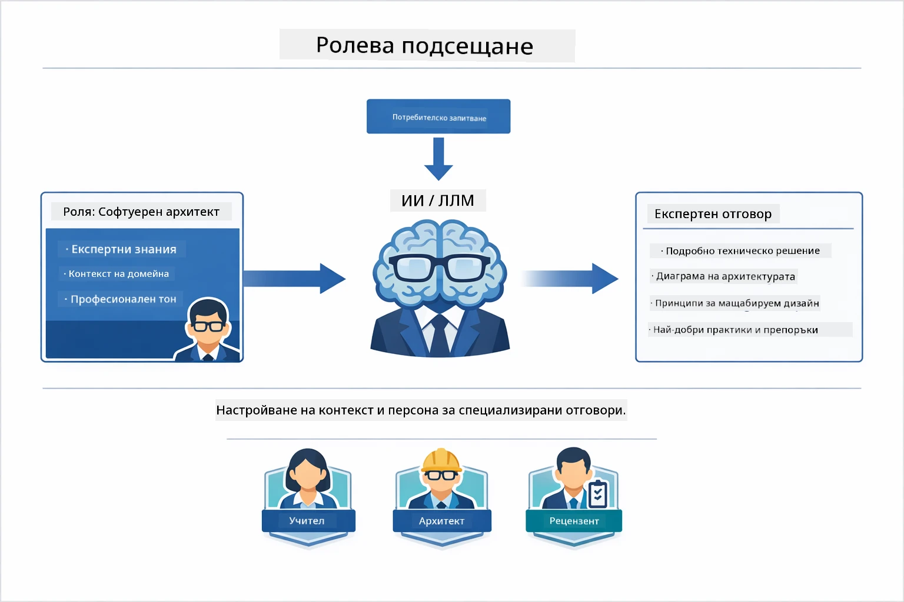
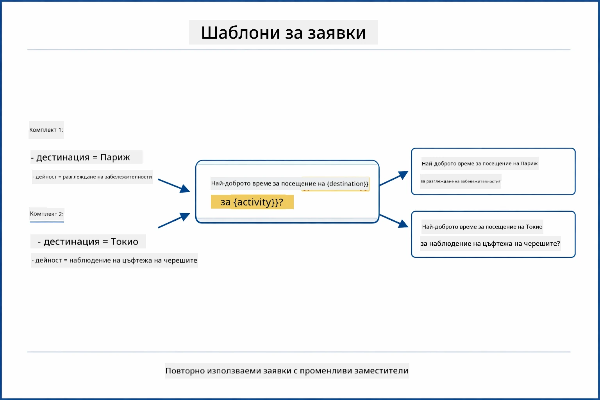
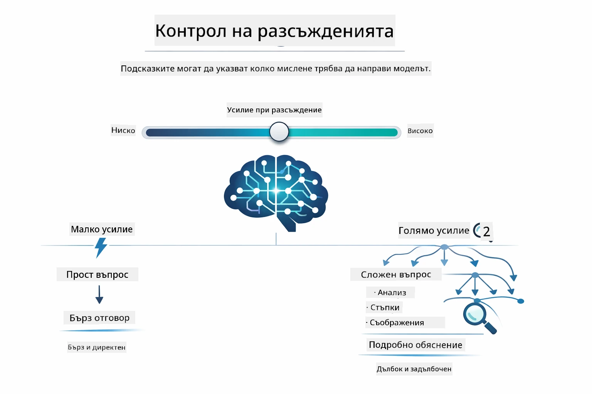

# Module 02: Инженерство на подсказки с GPT-5.2

## Съдържание

- [Видео преглед](../../../02-prompt-engineering)
- [Какво ще научите](../../../02-prompt-engineering)
- [Предварителни условия](../../../02-prompt-engineering)
- [Разбиране на инженерството на подсказки](../../../02-prompt-engineering)
- [Основи на инженерството на подсказки](../../../02-prompt-engineering)
  - [Подсказване без примери (Zero-Shot)](../../../02-prompt-engineering)
  - [Подсказване с малко примери (Few-Shot)](../../../02-prompt-engineering)
  - [Веригата на мисълта (Chain of Thought)](../../../02-prompt-engineering)
  - [Подсказване с роля (Role-Based Prompting)](../../../02-prompt-engineering)
  - [Шаблони за подсказки (Prompt Templates)](../../../02-prompt-engineering)
- [Разширени модели](../../../02-prompt-engineering)
- [Използване на съществуващи Azure ресурси](../../../02-prompt-engineering)
- [Екранни снимки на приложението](../../../02-prompt-engineering)
- [Изследване на моделите](../../../02-prompt-engineering)
  - [Ниска срещу висока амбициозност](../../../02-prompt-engineering)
  - [Изпълнение на задача (интро към инструменти)](../../../02-prompt-engineering)
  - [Саморефлективен код](../../../02-prompt-engineering)
  - [Структуриран анализ](../../../02-prompt-engineering)
  - [Многоходов чат](../../../02-prompt-engineering)
  - [Стъпка по стъпка разсъждаване](../../../02-prompt-engineering)
  - [Ограничен изход](../../../02-prompt-engineering)
- [Какво наистина учите](../../../02-prompt-engineering)
- [Следващи стъпки](../../../02-prompt-engineering)

## Видео преглед

Гледайте тази сесия на живо, която обяснява как да започнете с този модул: [Инженерство на подсказки с LangChain4j - сесия на живо](https://www.youtube.com/live/PJ6aBaE6bog?si=LDshyBrTRodP-wke)

## Какво ще научите



В предишния модул видяхте как паметта позволява разговорен изкуствен интелект и използвахте GitHub модели за основни взаимодействия. Сега ще се фокусираме върху това как задавате въпроси — самите подсказки — използвайки GPT-5.2 на Azure OpenAI. Начинът, по който структурирате подсказките, драстично влияе върху качеството на получените отговори. Започваме с преглед на основните техники за подсказване, след което преминаваме към осем разширени модела, които използват пълноценно възможностите на GPT-5.2.

Ще използваме GPT-5.2, защото той въвежда контрол над разсъжденията – можете да кажете на модела колко мислене да ползва преди да отговори. Това прави различните стратегии за подсказване по-отчетливи и ви помага да разберете кога да използвате кой подход. Също така ще се възползваме от по-малко ограничения за използване при GPT-5.2 в Azure в сравнение с GitHub моделите.

## Предварителни условия

- Приключен Модул 01 (разположени Azure OpenAI ресурси)
- Файл `.env` в главната директория с Azure идентификационни данни (създаден от `azd up` в Модул 01)

> **Бележка:** Ако не сте приключили Модул 01, първо следвайте инструкциите за разполагане там.

## Разбиране на инженерството на подсказки



Инженерството на подсказки означава проектиране на входен текст, който последователно ви дава нужните резултати. Не става въпрос просто за задаване на въпроси – става въпрос за структуриране на заявки така, че моделът да разбере точно какво искате и как да го достави.

Представете си го като даване на инструкции на колега. "Поправи бъга" е неясно. "Поправи null pointer изключението в UserService.java на ред 45 като добавиш проверка за null" е конкретно. Езиковите модели работят по същия начин – специфичността и структурата имат значение.



LangChain4j предоставя инфраструктурата — връзки с модели, памет и типове съобщения — докато моделите за подсказки са просто внимателно структурирани текстове, които изпращате през тази инфраструктура. Ключовите градивни елементи са `SystemMessage` (който задава поведението и ролята на ИИ) и `UserMessage` (който носи вашата реална заявка).

## Основи на инженерството на подсказки



Преди да навлезем в разширените модели в този модул, да преговорим пет основни техники за подсказване. Те са градивните блокове, които всеки инженер на подсказки трябва да знае. Ако вече сте работили по [Quick Start модула](../00-quick-start/README.md#2-prompt-patterns), сигурно сте ги видели в действие — ето концептуалната рамка зад тях.

### Подсказване без примери (Zero-Shot Prompting)

Най-простият подход: дайте на модела директна инструкция без примери. Моделът се осланя изцяло на своето обучение, за да разбере и изпълни задачата. Това работи добре при простички заявки, където очакваното поведение е очевидно.



*Директна инструкция без примери — моделът само по инструкцията извежда задачата*

```java
String prompt = "Classify this sentiment: 'I absolutely loved the movie!'";
String response = model.chat(prompt);
// Отговор: "Положителен"
```

**Кога да се използва:** Прости класификации, директни въпроси, преводи или каквато и да е задача, която моделът може да обработи без допълнително ръководство.

### Подсказване с малко примери (Few-Shot Prompting)

Предоставете примери, които показват модела какъв модел трябва да следва. Моделът научава очаквания формат вход-изход от вашите примери и го прилага към нови входни данни. Това драстично подобрява консистентността за задачи, при които желаната форма или поведение не са очевидни.



*Научаване от примери — моделът разпознава модела и го прилага към нови входове*

```java
String prompt = """
    Classify the sentiment as positive, negative, or neutral.
    
    Examples:
    Text: "This product exceeded my expectations!" → Positive
    Text: "It's okay, nothing special." → Neutral
    Text: "Waste of money, very disappointed." → Negative
    
    Now classify this:
    Text: "Best purchase I've made all year!"
    """;
String response = model.chat(prompt);
```

**Кога да се използва:** Персонализирани класификации, последователно форматиране, домейно-специфични задачи или когато резултатите от zero-shot са непоследователни.

### Веригата на мисълта (Chain of Thought)

Поискайте от модела да покаже своето разсъждение стъпка по стъпка. Вместо да отговаря веднага, моделът разбива задачата и работи през всяка част експлицитно. Това повишава точността при задачи с математика, логика и многостъпково разсъждение.



*Стъпка по стъпка разсъждаване — разбиване на сложни проблеми на експлицитни логически стъпки*

```java
String prompt = """
    Problem: A store has 15 apples. They sell 8 apples and then 
    receive a shipment of 12 more apples. How many apples do they have now?
    
    Let's solve this step-by-step:
    """;
String response = model.chat(prompt);
// Моделът показва: 15 - 8 = 7, след това 7 + 12 = 19 ябълки
```

**Кога да се използва:** Математически задачи, логически пъзели, отстраняване на грешки или всяка задача, при която показването на процеса на разсъждение подобрява точността и доверието.

### Подсказване с роля (Role-Based Prompting)

Задайте персона или роля на ИИ преди да зададете своя въпрос. Това осигурява контекст, който формира тона, дълбочината и фокуса на отговора. "Софтуерен архитект" дава различен съвет от "младши разработчик" или "одитор по сигурността".



*Задаване на контекст и персона — един и същ въпрос получава различен отговор в зависимост от зададената роля*

```java
String prompt = """
    You are an experienced software architect reviewing code.
    Provide a brief code review for this function:
    
    def calculate_total(items):
        total = 0
        for item in items:
            total = total + item['price']
        return total
    """;
String response = model.chat(prompt);
```

**Кога да се използва:** Прегледи на код, обучение, домейно-специфичен анализ или когато имате нужда от отговори, съобразени с определено ниво на експертиза или перспектива.

### Шаблони за подсказки (Prompt Templates)

Създавайте многократно използваеми подсказки с променливи места. Вместо да пишете нова подсказка всеки път, дефинирате шаблон веднъж и попълвате различни стойности. Класът `PromptTemplate` на LangChain4j улеснява това с синтаксис `{{variable}}`.



*Многократно използваеми подсказки с променливи места — един шаблон, много употреби*

```java
PromptTemplate template = PromptTemplate.from(
    "What's the best time to visit {{destination}} for {{activity}}?"
);

Prompt prompt = template.apply(Map.of(
    "destination", "Paris",
    "activity", "sightseeing"
));

String response = model.chat(prompt.text());
```

**Кога да се използва:** Повтарящи се заявки с различни входни данни, пакетна обработка, изграждане на многократни AI работни потоци или всякакъв сценарий, при който структурата на подсказката остава същата, но данните се променят.

---

Тези пет основни техники ви осигуряват солиден набор от инструменти за повечето задачи с подсказки. Останалата част от този модул се надгражда върху тях с **осем разширени модела**, които използват контрола на разсъжденията, самооценка и структуриране на изхода на GPT-5.2.

## Разширени модели

След като основите са покрити, да преминем към осемте разширени модела, които правят този модул уникален. Не всички проблеми изискват един и същ подход. Някои въпроси се нуждаят от бързи отговори, други от дълбоко мислене. Някои изискват видима логика, други просто резултати. Всеки модел по-долу е оптимизиран за различен сценарий — а контролът върху разсъжденията на GPT-5.2 прави разликите още по-отчетливи.


*Обзор на осемте модела за инженерство на подсказки и техните случаи на употреба*



*Контролът на разсъжденията на GPT-5.2 ви позволява да зададете колко мислене трябва да направи моделът — от бързи директни отговори до дълбоки изследвания*

**Ниска амбициозност (Бързо и фокусирано)** - За прости въпроси, където искате бързи, директни отговори. Моделът прави минимално разсъждение - максимум 2 стъпки. Използвайте това за изчисления, справки или ясни въпроси.

```java
String prompt = """
    <context_gathering>
    - Search depth: very low
    - Bias strongly towards providing a correct answer as quickly as possible
    - Usually, this means an absolute maximum of 2 reasoning steps
    - If you think you need more time, state what you know and what's uncertain
    </context_gathering>
    
    Problem: What is 15% of 200?
    
    Provide your answer:
    """;

String response = chatModel.chat(prompt);
```

> 💡 **Разгледайте с GitHub Copilot:** Отворете [`Gpt5PromptService.java`](../../../02-prompt-engineering/src/main/java/com/example/langchain4j/prompts/service/Gpt5PromptService.java) и попитайте:
> - "Коя е разликата между моделите за подсказване с ниска и висока амбициозност?"
> - "Как XML таговете в подсказките помагат да се структурира отговора на ИИ?"
> - "Кога да използвам модели с саморефлексия срещу директна инструкция?"

**Висока амбициозност (Дълбоко и задълбочено)** - За сложни проблеми, където искате обстойно анализиране. Моделът проучва в детайли и показва подробно разсъждение. Използвайте това за системен дизайн, архитектурни решения или сложни изследвания.

```java
String prompt = """
    Analyze this problem thoroughly and provide a comprehensive solution.
    Consider multiple approaches, trade-offs, and important details.
    Show your analysis and reasoning in your response.
    
    Problem: Design a caching strategy for a high-traffic REST API.
    """;

String response = chatModel.chat(prompt);
```

**Изпълнение на задача (Напредък стъпка по стъпка)** - За многостепенни работни процеси. Моделът осигурява предварителен план, разказва всяка стъпка докато работи, след това дава резюме. Използвайте това за миграции, реализации или всеки многостъпков процес.

```java
String prompt = """
    <task_execution>
    1. First, briefly restate the user's goal in a friendly way
    
    2. Create a step-by-step plan:
       - List all steps needed
       - Identify potential challenges
       - Outline success criteria
    
    3. Execute each step:
       - Narrate what you're doing
       - Show progress clearly
       - Handle any issues that arise
    
    4. Summarize:
       - What was completed
       - Any important notes
       - Next steps if applicable
    </task_execution>
    
    <tool_preambles>
    - Always begin by rephrasing the user's goal clearly
    - Outline your plan before executing
    - Narrate each step as you go
    - Finish with a distinct summary
    </tool_preambles>
    
    Task: Create a REST endpoint for user registration
    
    Begin execution:
    """;

String response = chatModel.chat(prompt);
```

Подсказването "Chain-of-Thought" изрично иска от модела да покаже процеса на разсъждение, което подобрява точността при сложни задачи. Разбивката стъпка по стъпка помага както на хора, така и на ИИ да разберат логиката.

> **🤖 Опитайте с [GitHub Copilot](https://github.com/features/copilot) Chat:** Задайте въпроси за този модел:
> - "Как бих адаптирал модела за изпълнение на задачата за дълготрайни операции?"
> - "Кои са най-добрите практики за структуриране на интрота към инструменти в производствени приложения?"
> - "Как мога да улавям и показвам междинни обновления за прогреса в UI?"


*Работен процес Планиране → Изпълнение → Резюмиране за многостъпкови задачи*

**Саморефлективен код** - За генериране на код с качество за продукция. Моделът генерира код, следвайки стандарти за продукция с подходяща обработка на грешки. Използвайте това при изграждането на нови функции или услуги.

```java
String prompt = """
    Generate Java code with production-quality standards: Create an email validation service
    Keep it simple and include basic error handling.
    """;

String response = chatModel.chat(prompt);
```


*Итеративен цикъл за подобрение - генериране, оценяване, идентифициране на проблеми, подобрение, повторение*

**Структуриран анализ** - За последователна оценка. Моделът преглежда кода с фиксирана рамка (коректност, практики, производителност, сигурност, поддръжка). Използвайте това за прегледи на код или оценки на качеството.

```java
String prompt = """
    <analysis_framework>
    You are an expert code reviewer. Analyze the code for:
    
    1. Correctness
       - Does it work as intended?
       - Are there logical errors?
    
    2. Best Practices
       - Follows language conventions?
       - Appropriate design patterns?
    
    3. Performance
       - Any inefficiencies?
       - Scalability concerns?
    
    4. Security
       - Potential vulnerabilities?
       - Input validation?
    
    5. Maintainability
       - Code clarity?
       - Documentation?
    
    <output_format>
    Provide your analysis in this structure:
    - Summary: One-sentence overall assessment
    - Strengths: 2-3 positive points
    - Issues: List any problems found with severity (High/Medium/Low)
    - Recommendations: Specific improvements
    </output_format>
    </analysis_framework>
    
    Code to analyze:
    ```
    public List getUsers() {
        return database.query("SELECT * FROM users");
    }
    ```
    Provide your structured analysis:
    """;

String response = chatModel.chat(prompt);
```

> **🤖 Опитайте с [GitHub Copilot](https://github.com/features/copilot) Chat:** Задайте въпроси за структурирания анализ:
> - "Как мога да персонализирам рамката за анализ за различни видове преглед на код?"
> - "Кой е най-добрият начин за парсване и програмен анализ на структуриран изход?"
> - "Как да осигуря последователни нива на тежест в различни прегледни сесии?"


*Рамка за последователни прегледи на код с нива на тежест*

**Многоходов чат** - За разговори, които се нуждаят от контекст. Моделът помни предишни съобщения и надгражда върху тях. Използвайте това за интерактивни сесии за помощ или сложни въпроси и отговори.

```java
ChatMemory memory = MessageWindowChatMemory.withMaxMessages(10);

memory.add(UserMessage.from("What is Spring Boot?"));
AiMessage aiMessage1 = chatModel.chat(memory.messages()).aiMessage();
memory.add(aiMessage1);

memory.add(UserMessage.from("Show me an example"));
AiMessage aiMessage2 = chatModel.chat(memory.messages()).aiMessage();
memory.add(aiMessage2);
```


*Как се натрупва контекстът на разговора през няколко рунда до достигане на лимита от токени*

**Стъпка по стъпка разсъждаване** - За проблеми, които изискват видима логика. Моделът показва експлицитно разсъждение за всяка стъпка. Използвайте това за математически задачи, логически пъзели или когато трябва да разберете процеса на мислене.

```java
String prompt = """
    <instruction>Show your reasoning step-by-step</instruction>
    
    If a train travels 120 km in 2 hours, then stops for 30 minutes,
    then travels another 90 km in 1.5 hours, what is the average speed
    for the entire journey including the stop?
    """;

String response = chatModel.chat(prompt);
```


*Разбиване на проблемите на експлицитни логически стъпки*

**Ограничен изход** - За отговори с конкретни изисквания за формат. Моделът стриктно следва правилата за формат и дължина. Използвайте това за резюмета или когато ви е нужен прецизен изход по структура.

```java
String prompt = """
    <constraints>
    - Exactly 100 words
    - Bullet point format
    - Technical terms only
    </constraints>
    
    Summarize the key concepts of machine learning.
    """;

String response = chatModel.chat(prompt);
```


*Спазване на конкретни изисквания за формат, дължина и структура*

## Използване на съществуващи Azure ресурси

**Проверете разполагането:**

Уверете се, че файлът `.env` съществува в главната директория с Azure идентификационни данни (създаден по време на Модул 01):
```bash
cat ../.env  # Трябва да покаже AZURE_OPENAI_ENDPOINT, API_KEY, DEPLOYMENT
```

**Стартирайте приложението:**

> **Бележка:** Ако вече сте стартирали всички приложения с `./start-all.sh` от Модул 01, този модул вече работи на порт 8083. Можете да пропуснете командите за стартиране по-долу и директно да посетите http://localhost:8083.

**Опция 1: Използване на Spring Boot Dashboard (Препоръчано за потребители на VS Code)**
Развойната контейнер включва разширението Spring Boot Dashboard, което предоставя визуален интерфейс за управление на всички Spring Boot приложения. Можете да го намерите в лентата с активности от лявата страна на VS Code (потърсете иконата на Spring Boot).

От Spring Boot Dashboard можете:
- Да видите всички налични Spring Boot приложения в работната среда
- Да стартирате/спирате приложения с един клик
- Да преглеждате логовете на приложението в реално време
- Да наблюдавате състоянието на приложението

Просто кликнете върху бутона за пускане до „prompt-engineering“, за да стартирате този модул, или стартирайте всички модули наведнъж.


**Опция 2: Използване на shell скриптове**

Стартиране на всички уеб приложения (модули 01-04):

**Bash:**
```bash
cd ..  # От главната директория
./start-all.sh
```

**PowerShell:**
```powershell
cd ..  # От коренната директория
.\start-all.ps1
```

Или стартирайте само този модул:

**Bash:**
```bash
cd 02-prompt-engineering
./start.sh
```

**PowerShell:**
```powershell
cd 02-prompt-engineering
.\start.ps1
```

Двата скрипта автоматично зареждат променливите на средата от основния `.env` файл и ще компилират JAR файловете, ако не съществуват.

> **Забележка:** Ако предпочитате да компилирате всички модули ръчно преди стартиране:
>
> **Bash:**
> ```bash
> cd ..  # Go to root directory
> mvn clean package -DskipTests
> ```
>
> **PowerShell:**
> ```powershell
> cd ..  # Go to root directory
> mvn clean package -DskipTests
> ```

Отворете http://localhost:8083 в своя браузър.

**За спиране:**

**Bash:**
```bash
./stop.sh  # Само този модул
# Или
cd .. && ./stop-all.sh  # Всички модули
```

**PowerShell:**
```powershell
.\stop.ps1  # Само този модул
# Или
cd ..; .\stop-all.ps1  # Всички модули
```

## Скриншоти на приложението


*Главното табло, показващо всичките 8 шаблона за prompt инженеринг с техните характеристики и случаи на използване*

## Изследване на Шаблоните

Уеб интерфейсът ви позволява да експериментирате с различни стратегии за подканване. Всеки шаблон решава различни проблеми – опитайте ги, за да видите кога кой подход работи най-добре.

> **Забележка: Поточно (Streaming) срещу непоточно (Non-Streaming)** — Всяка страница на шаблона предлага два бутона: **🔴 Поточно отговаряне (в реално време)** и опция **Непоточно**. Поточното използва Server-Sent Events (SSE), за да показва токени в реално време, докато моделът ги генерира, така че виждате напредъка веднага. Опцията непоточно изчаква цялата отговор преди да я покаже. За подканки, които изискват дълбоко разсъждение (например High Eagerness, Self-Reflecting Code), непоточното извикване може да отнеме много време — понякога минути — без видима обратна връзка. **Използвайте поточното при експерименти с комплексни подканки**, за да виждате как моделът работи и да избегнете впечатлението, че заявката е изтекла.
>
> **Забележка: Изискване за браузър** — Функцията за поточно предаване използва Fetch Streams API (`response.body.getReader()`), който изисква пълен браузър (Chrome, Edge, Firefox, Safari). Той **не** работи във вградения Simple Browser на VS Code, тъй като неговият webview не поддържа ReadableStream API. Ако използвате Simple Browser, бутоните за непоточно ще работят нормално — само бутоните за поточно предаване са засегнати. Отворете `http://localhost:8083` в външен браузър за пълния опит.

### Ниско срещу високо желание (Low vs High Eagerness)

Задайте прост въпрос като „Колко е 15% от 200?“ с ниско желание. Ще получите незабавен, директен отговор. Сега задайте нещо сложно като „Проектирайте стратегия за кеширане на API с висок трафик“ с високо желание. Кликнете **🔴 Поточно отговаряне (в реално време)** и наблюдавайте как детайлното разсъждение на модела се появява токен по токен. Същият модел, същата структура на въпроса – но подканата му казва колко много мислене да направи.

### Изпълнение на задачи (въведение към инструменти)

Многократните работни потоци се възползват от предварително планиране и описване на напредъка. Моделът очертава какво ще направи, описва всяка стъпка и после обобщава резултатите.

### Саморефлектиращ код

Опитайте „Създаване на услуга за валидация на имейли“. Вместо само да генерира код и да спре, моделът генерира, оценява по критерии за качество, идентифицира слабости и подобрява. Ще видите как продължава итерации докато кодът отговаря на стандарти за продукция.

### Структуриран анализ

Код ревюта имат нужда от последователни рамки за оценка. Моделът анализира кода по фиксирани категории (коректност, практики, производителност, сигурност) с нива на сериозност.

### Многоетапен чат

Попитайте „Какво е Spring Boot?“, след което веднага задайте „Покажи ми пример“. Моделът помни първия ви въпрос и ви дава конкретен пример за Spring Boot. Без памет този втори въпрос би бил твърде общ.

### Разсъждаване стъпка по стъпка

Изберете математическа задача и я опитайте както с Разсъждаване стъпка по стъпка, така и с Ниско желание. Ниското желание дава само отговора – бързо, но неясно. Разсъждаването стъпка по стъпка ви показва всяко изчисление и решение.

### Ограничен изход

Когато имате нужда от специфични формати или брой думи, този шаблон налага строги изисквания. Опитайте да генерирате резюме с точно 100 думи в булетиран формат.

## Какво наистина научавате

**Усилието за разсъждение променя всичко**

GPT-5.2 ви позволява да контролирате изчислителното усилие чрез подканите си. Ниско усилие означава бързи отговори с минимално изследване. Високото усилие означава, че моделът отделя време за дълбоко мислене. Научавате как да съобразявате усилието с комплексността на задачата – не губете време с прости въпроси, но не бързайте и при сложните решения.

**Структурата насочва поведението**

Забелязали ли сте XML таговете в подканите? Те не са само украса. Моделите следват структурирани инструкции по-надеждно от свободен текст. Когато имате нужда от многоетапни процеси или сложна логика, структурата помага на модела да следи къде се намира и какво следва.


*Анатомия на добре структурирана подканваща инструкция с ясни раздели и организация в стил XML*

**Качество чрез самооценка**

Саморефлектиращите шаблони работят като правят критериите за качество явни. Вместо да се надявате моделът „да го направи правилно“, вие му казвате точно какво означава „правилно“: коректна логика, обработка на грешки, производителност, сигурност. Моделът след това може да оцени собственото си съдържание и да го подобри. Това превръща генерирането на код от лотария в процес.

**Контекстът е ограничен**

Многоетапните разговори работят чрез включване на историята на съобщенията с всяка заявка. Но има лимит – всеки модел има максимален брой токени. С разрастване на разговорите ще се нуждаете от стратегии да поддържате релевантен контекст без да достигате максимума. Този модул ви показва как работи паметта; по-късно ще научите кога да обобщавате, кога да забравяте и кога да извличате.

## Следващи стъпки

**Следващ модул:** [03-rag - RAG (Retrieval-Augmented Generation)](../03-rag/README.md)

---

**Навигация:** [← Предишен: Модул 01 - Въведение](../01-introduction/README.md) | [Обратно в началото](../README.md) | [Следващ: Модул 03 - RAG →](../03-rag/README.md)

---

<!-- CO-OP TRANSLATOR DISCLAIMER START -->
**Отказ от отговорност**:
Този документ е преведен с помощта на AI услуга за превод [Co-op Translator](https://github.com/Azure/co-op-translator). Въпреки че се стремим към точност, моля, имайте предвид, че автоматизираните преводи могат да съдържат грешки или неточности. Оригиналният документ на неговия роден език трябва да се счита за авторитетен източник. За критична информация се препоръчва професионален човешки превод. Ние не носим отговорност за каквито и да е недоразумения или неправилни тълкувания, произтичащи от използването на този превод.
<!-- CO-OP TRANSLATOR DISCLAIMER END -->