# Модул 03: RAG (Retrieval-Augmented Generation)

## Съдържание

- [Видеопреглед](../../../03-rag)
- [Какво ще научите](../../../03-rag)
- [Предварителни изисквания](../../../03-rag)
- [Разбиране на RAG](../../../03-rag)
  - [Кой RAG подход използва този урок?](../../../03-rag)
- [Как работи](../../../03-rag)
  - [Обработка на документи](../../../03-rag)
  - [Създаване на вграждания](../../../03-rag)
  - [Семантично търсене](../../../03-rag)
  - [Генериране на отговор](../../../03-rag)
- [Стартирайте приложението](../../../03-rag)
- [Използване на приложението](../../../03-rag)
  - [Качване на документ](../../../03-rag)
  - [Задаване на въпроси](../../../03-rag)
  - [Проверка на източникови препратки](../../../03-rag)
  - [Експериментиране с въпроси](../../../03-rag)
- [Ключови понятия](../../../03-rag)
  - [Стратегия за разчленяване](../../../03-rag)
  - [Оценки за сходство](../../../03-rag)
  - [Паметно съхранение](../../../03-rag)
  - [Управление на прозореца на контекста](../../../03-rag)
- [Кога RAG има значение](../../../03-rag)
- [Следващи стъпки](../../../03-rag)

## Видеопреглед

Гледайте тази сесия на живо, която обяснява как да започнете с този модул: [RAG с LangChain4j - сесия на живо](https://www.youtube.com/watch?v=_olq75ZH_eY)

## Какво ще научите

В предишните модули научихте как да водите разговори с AI и да структурирате ефективно своите заявки. Но има основно ограничение: езиковите модели знаят само онова, което са научили по време на обучението. Те не могат да отговарят на въпроси относно политиките на вашата компания, документацията по проекта ви или каквато и да е информация, която не е била част от тяхното обучение.

RAG (Retrieval-Augmented Generation) решава този проблем. Вместо да се опитвате да учите модела на вашата информация (което е скъпо и непрактично), вие му давате възможност да търси през вашите документи. Когато някой зададе въпрос, системата намира релевантна информация и я включва в заявката. След това моделът отговаря въз основа на този извлечен контекст.

Представете си RAG като референтна библиотека за модела. Когато зададете въпрос, системата:

1. **Потребителски въпрос** – вие задавате въпрос  
2. **Вграждане** – въпросът ви се преобразува във вектор  
3. **Векторно търсене** – намират се подобни парчета от документи  
4. **Сглобяване на контекста** – релевантните парчета се добавят към заявката  
5. **Отговор** – LLM генерира отговор на базата на контекста  

Това дава възможност моделът да базира своите отговори на вашите реални данни, вместо да разчита само на обучителната си информация или да измисля отговори.

## Предварителни изисквания

- Завършен [Модул 00 - Бързо стартиране](../00-quick-start/README.md) (за лесния RAG пример, споменат по-горе)  
- Завършен [Модул 01 - Въведение](../01-introduction/README.md) (разположени Azure OpenAI ресурси, включително модел за вграждане `text-embedding-3-small`)  
- Файл `.env` в коренова директория със сертификати за Azure (създаден от `azd up` в Модул 01)  

> **Забележка:** Ако не сте завършили Модул 01, първо следвайте инструкциите за разполагане там. Командата `azd up` разполага както GPT чат модела, така и вграждащия модел, използвани в този модул.

## Разбиране на RAG

Диаграмата по-долу илюстрира основната концепция: вместо да разчита само на обучителните данни на модела, RAG му дава референтна библиотека от вашите документи, които може да провери преди да генерира всеки отговор.

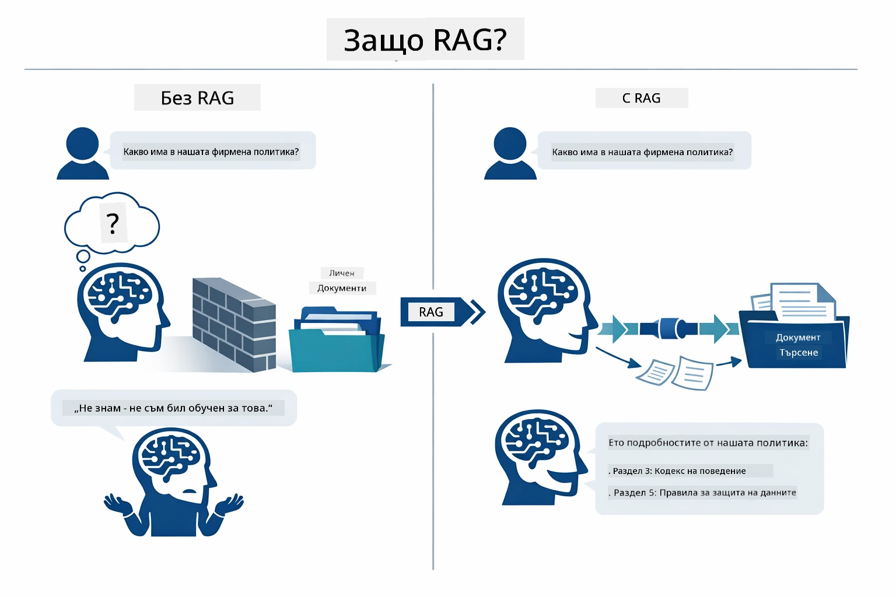

*Тази диаграма показва разликата между стандартен LLM (който гадае от обучителни данни) и LLM с RAG подобрение (който първо проверява вашите документи).*

Ето как частите се свързват в края. Въпросът на потребителя преминава през четири етапа — вграждане, векторно търсене, сглобяване на контекст и генериране на отговор — като всеки се изгражда върху предишния:


*Тази диаграма показва RAG процеса от край до край — въпросът преминава през вграждане, векторно търсене, сглобяване на контекст и генериране на отговор.*

Останалата част от този модул преминава подробно през всеки етап с код, който може да стартирате и модифицирате.

### Кой RAG подход използва този урок?

LangChain4j предлага три начина за реализиране на RAG, всеки със различно ниво на абстракция. Диаграмата по-долу ги сравнява един до друг:

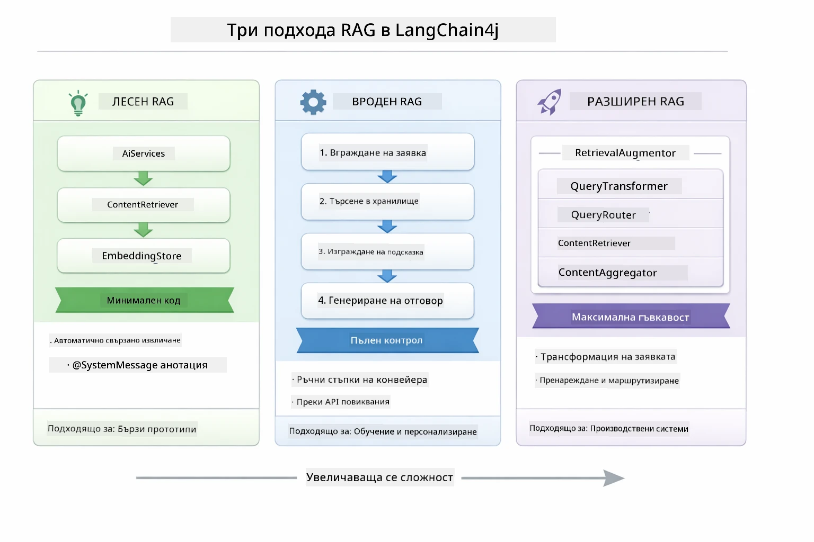

*Тази диаграма сравнява трите RAG подхода на LangChain4j — Easy, Native и Advanced — като показва техните ключови компоненти и кога да използвате всеки.*

| Подход | Какво прави | Компромис |
|---|---|---|
| **Easy RAG** | Свързва всичко автоматично чрез `AiServices` и `ContentRetriever`. Аннотирате интерфейс, прикачвате извличач и LangChain4j се грижи за вграждането, търсенето и сглобяването на заявката зад кулисите. | Минимален код, но не виждате какво се случва на всеки етап. |
| **Native RAG** | Вие сами извиквате модела за вграждане, търсите в хранилището, изграждате заявката и генерирате отговора — по една явна стъпка наведнъж. | Повече код, но всеки етап е видим и модифицируем. |
| **Advanced RAG** | Използва `RetrievalAugmentor` рамка с интегрируеми трансформъри на запитвания, маршрутизатори, преподреждачи и инжектори на съдържание за производствени конвейери. | Максимална гъвкавост, но значително по-сложно. |

**Този урок използва Native подхода.** Всяка стъпка от RAG процеса — вграждането на заявката, търсенето в векторното хранилище, сглобяването на контекста и генерирането на отговора — е изписана изрично в [`RagService.java`](../../../03-rag/src/main/java/com/example/langchain4j/rag/service/RagService.java). Това е умишлено: като учебен ресурс, по-важно е да видите и разберете всеки етап, отколкото кодът да бъде максимално свит. След като се почувствате уверени как частите се свързват, можете да преминете към Easy RAG за бързи прототипи или Advanced RAG за производствени системи.

> **💡 Вече виждали Easy RAG в действие?** Модулът [Бързо стартиране](../00-quick-start/README.md) включва пример за Въпроси и отговори с документ ([`SimpleReaderDemo.java`](../../../00-quick-start/src/main/java/com/example/langchain4j/quickstart/SimpleReaderDemo.java)), който използва Easy RAG подход — LangChain4j автоматично се грижи за вграждането, търсенето и сглобяването на заявката. Този модул прави стъпка напред като разбива тази тръбопроводна линия, за да можете сами да виждате и контролирате всеки етап.

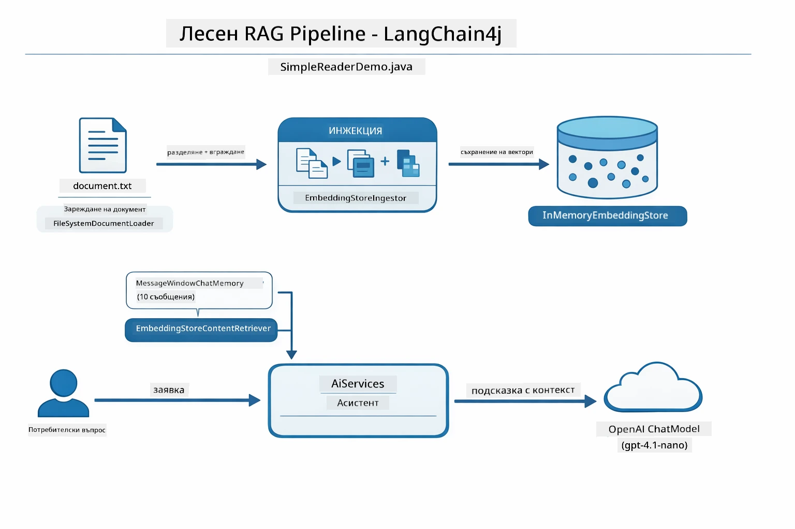

*Тази диаграма показва Easy RAG процеса от `SimpleReaderDemo.java`. Сравнете го с Native подхода, използван в този модул: Easy RAG крие вграждането, извличането и сглобяването зад `AiServices` и `ContentRetriever` — вие зареждате документ, прикачвате извличач и получавате отговори. Native подходът в този модул разбива тази линия, така че вие извиквате всеки етап (вграждане, търсене, сглобяване на контекст, генериране) сами, като имате пълна видимост и контрол.*

## Как работи

RAG процесът в този модул се разделя на четири етапа, които се изпълняват последователно всеки път, когато потребител зададе въпрос. Първо, каченият документ се **парсира и разчленява** на управлявани парчета. Тези парчета се преобразуват в **векторни вграждания** и се съхраняват, за да могат да се сравняват математически. Когато пристигне запитване, системата извършва **семантично търсене**, за да намери най-релевантните парчета, и накрая ги предава като контекст на LLM за **генериране на отговор**. По-долу разделите разглеждат всеки етап с реалния код и диаграми. Нека започнем с първата стъпка.

### Обработка на документи

[DocumentService.java](../../../03-rag/src/main/java/com/example/langchain4j/rag/service/DocumentService.java)

Когато качвате документ, системата го парсира (PDF или обикновен текст), прикачва метаданни като името на файла и след това го разделя на парчета — по-малки части, които се побират удобно в прозореца на контекста на модела. Тези парчета леко се припокриват, за да не се загуби контекст на границите им.

```java
// Анализирайте качения файл и го опакуйте в LangChain4j Document
Document document = Document.from(content, metadata);

// Разделете на блокове от 300 токена с припокриване от 30 токена
DocumentSplitter splitter = DocumentSplitters
    .recursive(300, 30);

List<TextSegment> segments = splitter.split(document);
```
  
Диаграмата по-долу показва визуално как става това. Забележете как всяко парче споделя някои токени със съседите си — припокриването от 30 токена гарантира, че няма важен контекст, който да се изгуби между границите:

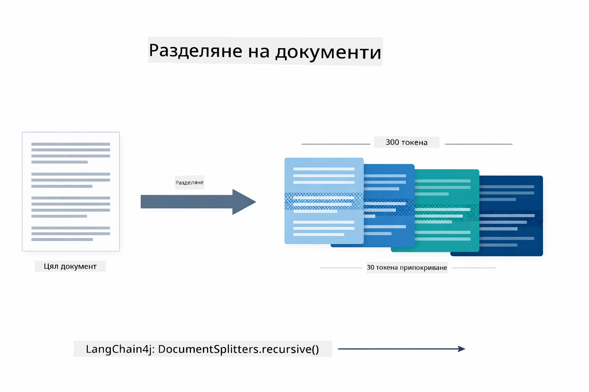

*Тази диаграма показва документ, разделен на парчета от 300 токена с 30 токена припокриване, което запазва контекста на границите между парчетата.*

> **🤖 Опитайте с [GitHub Copilot](https://github.com/features/copilot) Chat:** Отворете [`DocumentService.java`](../../../03-rag/src/main/java/com/example/langchain4j/rag/service/DocumentService.java) и попитайте:  
> - "Как LangChain4j разделя документи на парчета и защо припокриването е важно?"  
> - "Какъв е оптималният размер на парчетата за различни типове документи и защо?"  
> - "Как да обработвам документи на няколко езика или със специално форматиране?"

### Създаване на вграждания

[LangChainRagConfig.java](../../../03-rag/src/main/java/com/example/langchain4j/rag/config/LangChainRagConfig.java)

Всяко парче се преобразува в числова репрезентация, наречена вграждане — същностно конвертор от смисъл към числа. Моделът за вграждане не е "умен" като чат модела; той не може да следва инструкции, да разсъждава или да отговаря на въпроси. Това, което може да прави, е да мапира текст в математическо пространство, където подобните значения са близо едно до друго — "кола" до "автомобил", "политика за възстановяване" до "върнете ми парите". Може да си представите чат модела като човек, с когото говорите; моделът за вграждане е ултра-добра система за класиране на файлове.

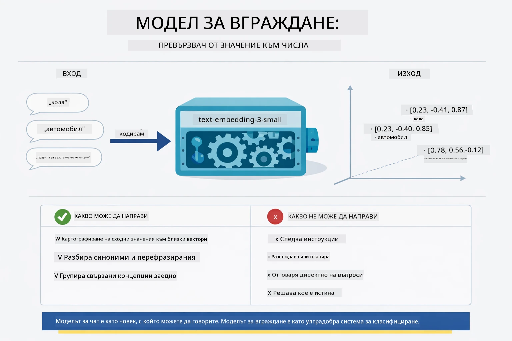

*Тази диаграма показва как модел за вграждане преобразува текст в числови вектори, които поставят подобни значения — като "кола" и "автомобил" — близо един до друг в векторното пространство.*

```java
@Bean
public EmbeddingModel embeddingModel() {
    return OpenAiOfficialEmbeddingModel.builder()
        .baseUrl(azureOpenAiEndpoint)
        .apiKey(azureOpenAiKey)
        .modelName(azureEmbeddingDeploymentName)
        .build();
}

EmbeddingStore<TextSegment> embeddingStore = 
    new InMemoryEmbeddingStore<>();
```
  
Диаграмата на класове по-долу показва двата отделни потока в RAG процеса и LangChain4j класовете, които ги реализират. **Потокът за приемане (ingestion flow)** (изпълнява се веднъж при качване) разбива документа, вгражда парчетата и ги съхранява чрез `.addAll()`. **Потокът за запитвания (query flow)** (изпълнява се при всяко запитване от потребител) вгражда въпроса, търси в хранилището чрез `.search()` и предава съвпадналия контекст на чат модела. И двата потока се свързват чрез споделения интерфейс `EmbeddingStore<TextSegment>`:

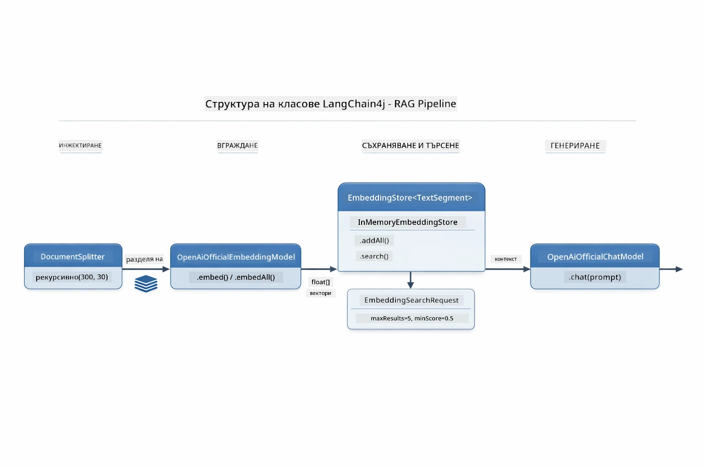

*Тази диаграма показва двата потока в RAG процеса — приемане и запитване — и как се свързват чрез споделеното EmbeddingStore.*

Веднъж щом вгражданията са съхранени, сходното съдържание естествено се клъстерира заедно във векторното пространство. Визуализацията по-долу показва как документи за свързани теми се групират като близки точки, което прави възможно семантичното търсене:


*Тази визуализация показва как свързаните документи се групират в 3D векторното пространство, с теми като Техническа документация, Бизнес правила и Често задавани въпроси, формиращи отделни групи.*

Когато потребител извършва търсене, системата следва четири стъпки: вгражда документите веднъж, вгражда заявката при всяко търсене, сравнява вектора на заявката с всички съхранени вектори чрез косинусна прилика и връща топ-K парчета с най-високи оценки. Диаграмата по-долу преминава през всяка стъпка и съответните LangChain4j класове:

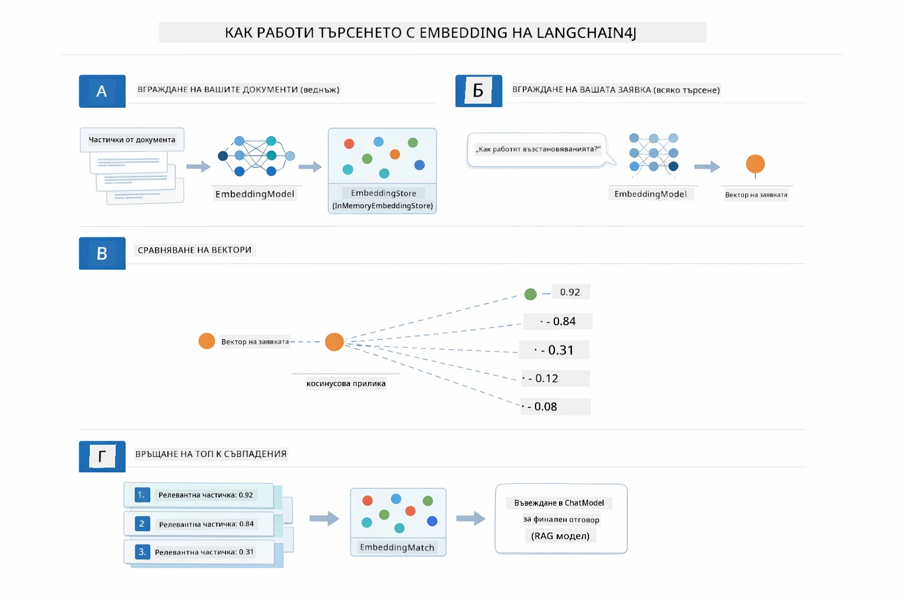

*Тази диаграма показва четиристепенния процес за търсене чрез вграждания: вграждане на документи, вграждане на заявката, сравняване на вектори с косинусна прилика и връщане на топ-К резултати.*

### Семантично търсене

[RagService.java](../../../03-rag/src/main/java/com/example/langchain4j/rag/service/RagService.java)

Когато зададете въпрос, той също се преобразува във вграждане. Системата сравнява вграждането на вашия въпрос с всички вграждания на парченца от документите. Тя намира парчетата с най-сходен смисъл - не само съвпадащи ключови думи, а истинска семантична прилика.

```java
Embedding queryEmbedding = embeddingModel.embed(question).content();

EmbeddingSearchRequest searchRequest = EmbeddingSearchRequest.builder()
    .queryEmbedding(queryEmbedding)
    .maxResults(5)
    .minScore(0.5)
    .build();

EmbeddingSearchResult<TextSegment> searchResult = embeddingStore.search(searchRequest);
List<EmbeddingMatch<TextSegment>> matches = searchResult.matches();

for (EmbeddingMatch<TextSegment> match : matches) {
    String relevantText = match.embedded().text();
    double score = match.score();
}
```
  
Диаграмата по-долу сравнява семантичното търсене с традиционното търсене по ключова дума. Търсене за "превозно средство" пропуска парче за "коли и камиони", но семантичното търсене разбира, че те означават едно и също нещо и го връща като високорелевантен резултат:

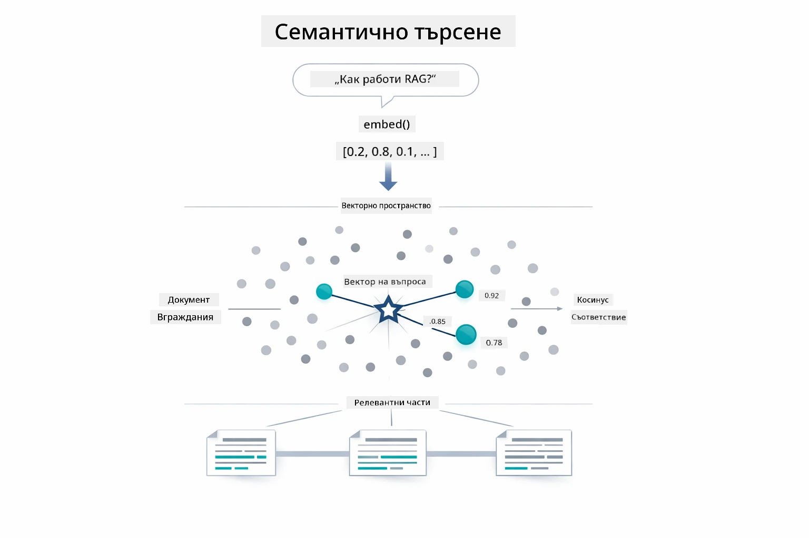

*Тази диаграма сравнява търсене на базата на ключови думи с семантично търсене, показвайки как семантичното търсене извлича концептуално свързано съдържание дори когато точните ключови думи са различни.*

На практика мерителят за сходство е косинусната прилика — което по същество пита "дали тези две стрелки сочат в една и съща посока?" Два парчета могат да използват напълно различни думи, но ако значението им е едно и също, техните вектори сочат в една и съща посока и оценката им е близка до 1.0:

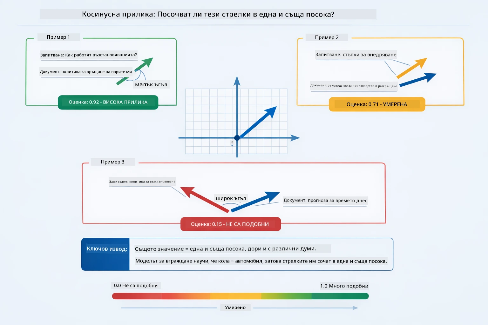

*Тази диаграма илюстрира косинусната прилика като ъгъл между векторите за вграждане — колкото по-насочени са векторите еднакво, толкова по-близка е оценката до 1.0, което показва по-висока семантична прилика.*
> **🤖 Опитайте с [GitHub Copilot](https://github.com/features/copilot) Chat:** Отворете [`RagService.java`](../../../03-rag/src/main/java/com/example/langchain4j/rag/service/RagService.java) и попитайте:
> - "Как работи търсенето по сходство с embeddings и как се определя оценката?"
> - "Какъв праг на сходство трябва да използвам и как това влияе на резултатите?"
> - "Как да постъпя в случаи, когато не са намерени релевантни документи?"

### Генериране на отговор

[RagService.java](../../../03-rag/src/main/java/com/example/langchain4j/rag/service/RagService.java)

Най-релевантните части се събират в структурирана подсказка, която включва явни инструкции, изтеглен контекст и въпроса на потребителя. Моделът чете тези конкретни части и отговаря въз основа на тази информация — той може да използва само това, което е пред него, което предотвратява халюцинации.

```java
String context = matches.stream()
    .map(match -> match.embedded().text())
    .collect(Collectors.joining("\n\n"));

String prompt = String.format("""
    Answer the question based on the following context.
    If the answer cannot be found in the context, say so.

    Context:
    %s

    Question: %s

    Answer:""", context, request.question());

String answer = chatModel.chat(prompt);
```

Диаграмата по-долу показва тази сборка в действие — частите с най-висок резултат от стъпката на търсене се вмъкват в шаблона на подсказката, а `OpenAiOfficialChatModel` генерира обоснован отговор:

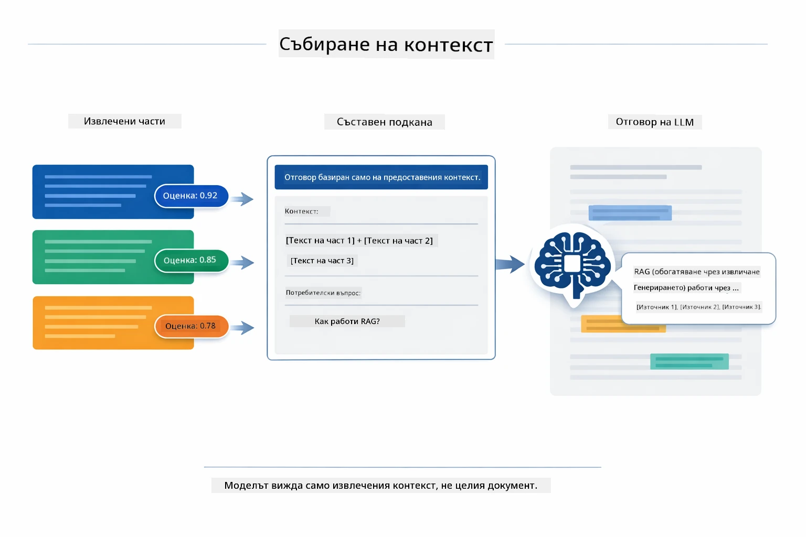

*Тази диаграма показва как частите с най-висок резултат се сглобяват в структурирана подсказка, позволявайки на модела да генерира обоснован отговор от вашите данни.*

## Стартиране на приложението

**Проверете разгръщането:**

Уверете се, че файлът `.env` съществува в главната директория с Azure креденшъли (създаден по време на Модул 01):

**Bash:**
```bash
cat ../.env  # Трябва да показва AZURE_OPENAI_ENDPOINT, API_KEY, DEPLOYMENT
```

**PowerShell:**
```powershell
Get-Content ..\.env  # Трябва да показва AZURE_OPENAI_ENDPOINT, API_KEY, DEPLOYMENT
```

**Стартирайте приложението:**

> **Забележка:** Ако вече сте стартирали всички приложения с `./start-all.sh` от Модул 01, този модул вече работи на порт 8081. Можете да прескочите командите за стартиране по-долу и да отидете директно на http://localhost:8081.

**Опция 1: Използване на Spring Boot Dashboard (Препоръчително за потребители на VS Code)**

Dev контейнерът включва разширението Spring Boot Dashboard, което предоставя визуален интерфейс за управление на всички Spring Boot приложения. Можете да го намерите в лентата с дейности от лявата страна на VS Code (потърсете иконата на Spring Boot).

От Spring Boot Dashboard можете:
- Да видите всички налични Spring Boot приложения в работната папка
- Да стартирате/спирате приложения с един клик
- Да преглеждате логове на приложението в реално време
- Да наблюдавате статуса на приложението

Просто натиснете бутона за пускане до "rag", за да стартирате този модул, или стартирайте всички модули наведнъж.


*Този екран показва Spring Boot Dashboard във VS Code, където можете визуално да стартирате, спирате и следите приложения.*

**Опция 2: Използване на shell скриптове**

Стартирайте всички уеб приложения (модули 01-04):

**Bash:**
```bash
cd ..  # От коренната директория
./start-all.sh
```

**PowerShell:**
```powershell
cd ..  # От коренната директория
.\start-all.ps1
```

Или стартирайте само този модул:

**Bash:**
```bash
cd 03-rag
./start.sh
```

**PowerShell:**
```powershell
cd 03-rag
.\start.ps1
```

Двата скрипта автоматично зареждат променливите на околната среда от главния `.env` файл и ще компилират JAR файловете, ако не съществуват.

> **Забележка:** Ако предпочитате да компилирате всички модули ръчно преди стартиране:
>
> **Bash:**
> ```bash
> cd ..  # Go to root directory
> mvn clean package -DskipTests
> ```

> **PowerShell:**
> ```powershell
> cd ..  # Go to root directory
> mvn clean package -DskipTests
> ```

Отворете http://localhost:8081 в браузъра си.

**За спиране:**

**Bash:**
```bash
./stop.sh  # Само този модул
# Или
cd .. && ./stop-all.sh  # Всички модули
```

**PowerShell:**
```powershell
.\stop.ps1  # Само този модул
# Или
cd ..; .\stop-all.ps1  # Всички модули
```

## Използване на приложението

Приложението предоставя уеб интерфейс за качване на документи и задаване на въпроси.

<a href="images/rag-homepage.png"></a>

*Тази снимка показва интерфейса на RAG приложението, където качвате документи и задавате въпроси.*

### Качване на документ

Започнете с качване на документ - TXT файловете са най-подходящи за тестване. В тази директория е предоставен `sample-document.txt`, който съдържа информация за функциите на LangChain4j, имплементацията на RAG и добри практики - перфектен за тестване на системата.

Системата обработва вашия документ, разделя го на части и създава embeddings за всяка част. Това се случва автоматично при качване.

### Задаване на въпроси

Сега задайте конкретни въпроси относно съдържанието на документа. Опитайте нещо фактологично, което е ясно посочено в документа. Системата търси релевантни части, включва ги в подсказката и генерира отговор.

### Проверете източниците

Забележете, че всеки отговор включва препратки към източници с оценки за сходство. Тези оценки (от 0 до 1) показват колко релевантна е била всяка част спрямо вашия въпрос. По-високите оценки означават по-добри съвпадения. Това ви позволява да проверите отговора спрямо изходния материал.

<a href="images/rag-query-results.png"></a>

*Тази снимка показва резултати от заявка с генерирания отговор, източници и оценки за релевантност за всяка изтеглена част.*

### Експериментирайте с въпроси

Опитайте различни видове въпроси:
- Конкретни факти: "Каква е основната тема?"
- Сравнения: "Каква е разликата между X и Y?"
- Резюмета: "Обобщете ключовите точки за Z"

Наблюдавайте как се променят оценките за релевантност в зависимост от това колко добре въпросът съвпада със съдържанието.

## Основни концепции

### Стратегия за разделяне на части

Документите се разделят на части от 300 токена с 30 токена припокриване. Този баланс гарантира, че всяка част разполага с достатъчен контекст, за да е смислена, като същевременно е достатъчно малка, за да се включат няколко части в подсказката.

### Оценки за сходство

Всяка изтеглена част има оценка за сходство между 0 и 1, която показва колко точно съвпада с въпроса на потребителя. Диаграмата по-долу визуализира диапазоните на оценките и как системата ги използва за филтриране на резултатите:

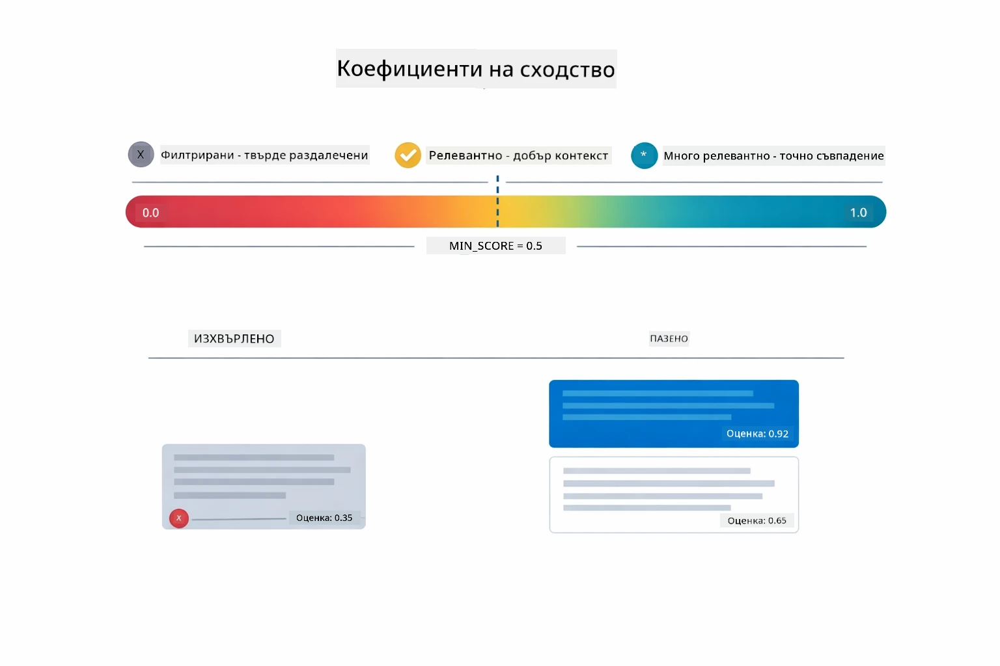

*Тази диаграма показва диапазоните на оценките от 0 до 1 с минимален праг 0.5, който филтрира нерелевантните части.*

Оценките варират от 0 до 1:
- 0.7-1.0: Много релевантни, точно съвпадение
- 0.5-0.7: Релевантни, добър контекст
- Под 0.5: Филтрирани, твърде различни

Системата изтегля само части над минималния праг, за да осигури качество.

Embeddings работят добре, когато смисълът се групира чисто, но имат слаби места. Диаграмата по-долу показва чести режими на неуспех — твърде големите части произвеждат неясни вектори, прекалено малките части нямат контекст, двусмислените термини сочат към няколко клъстера, а директните търсения по ID или серийни номера изобщо не работят с embeddings:

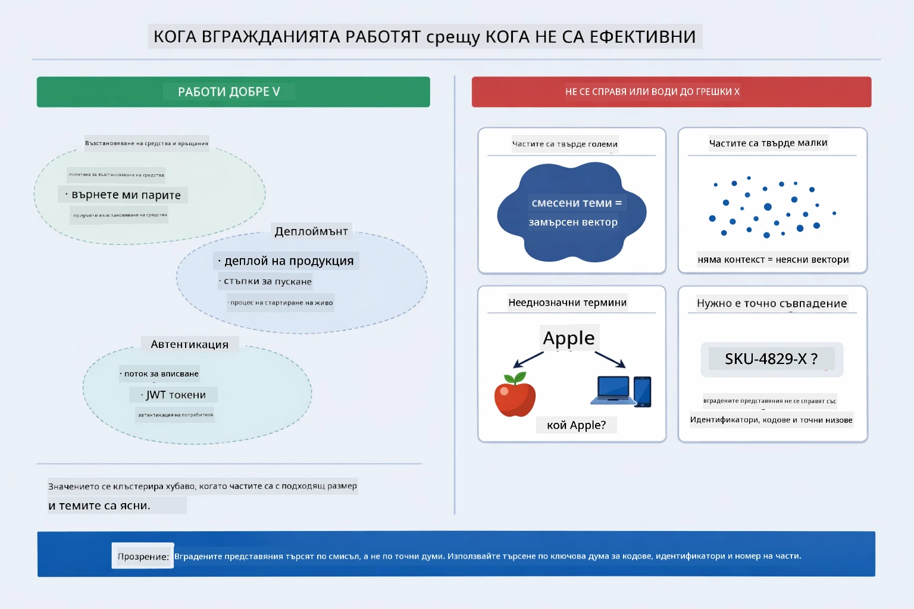

*Тази диаграма показва чести режими на неуспех при embeddings: твърде големи части, твърде малки части, двусмислени термини сочещи към няколко клъстера и директни търсения като по ID.*

### Паметно съхранение

Този модул използва паметно съхранение за простота. Когато рестартирате приложението, качените документи се губят. В продукционни системи се използват постоянни векторни бази данни като Qdrant или Azure AI Search.

### Управление на контекстното поле

Всеки модел има максимален размер на контекстното поле. Не можете да включите всяка част от голям документ. Системата извлича топ N най-релевантни части (по подразбиране 5), за да остане в лимитите и същевременно да осигури достатъчно контекст за точни отговори.

## Кога RAG има значение

RAG не винаги е правилният подход. Гидът за решение по-долу ви помага да определите кога RAG добавя стойност и кога по-простите подходи — като включване на съдържание директно в подсказката или разчитане на вградените знания на модела — са достатъчни:

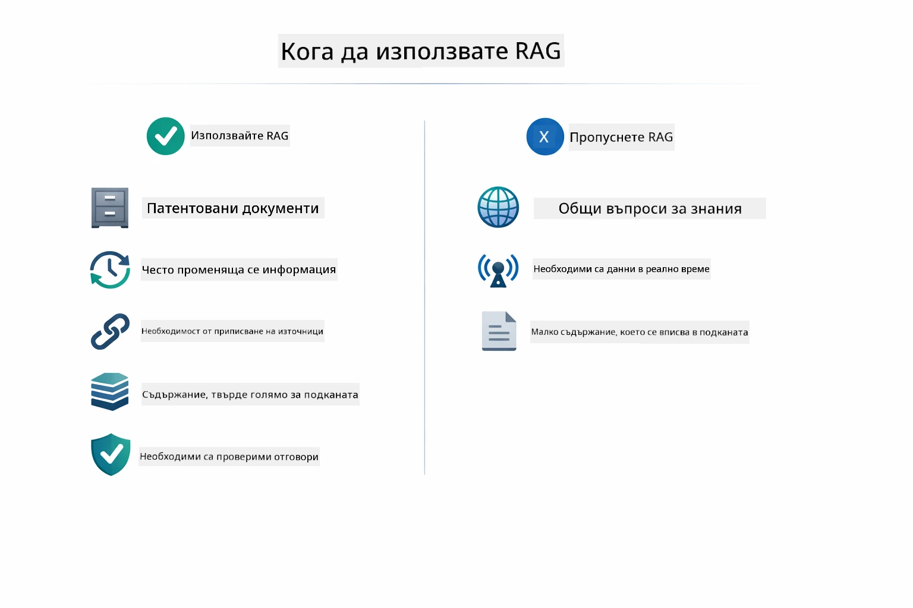

*Тази диаграма показва решение кога RAG добавя стойност и кога са достатъчни по-прости подходи.*

**Използвайте RAG когато:**
- Отговаряте на въпроси относно собственически документи
- Информацията се променя често (политики, цени, спецификации)
- Точността изисква приписване на източник
- Съдържанието е твърде голямо, за да се вмести в една подсказка
- Трябват ви проверими, обосновани отговори

**Не използвайте RAG когато:**
- Въпросите изискват общи знания, които моделът вече има
- Нужни са данни в реално време (RAG работи с качени документи)
- Съдържанието е достатъчно малко, за да се включи директно в подсказките

## Следващи стъпки

**Следващ модул:** [04-tools - AI агенти с инструменти](../04-tools/README.md)

---

**Навигация:** [← Предишен: Модул 02 - Инженеринг на подсказки](../02-prompt-engineering/README.md) | [Обратно към Основно](../README.md) | [Напред: Модул 04 - Инструменти →](../04-tools/README.md)

---

<!-- CO-OP TRANSLATOR DISCLAIMER START -->
**Декларация за отказ от отговорност**:  
Този документ е преведен с помощта на AI преводаческа услуга [Co-op Translator](https://github.com/Azure/co-op-translator). Въпреки че се стремим към точност, моля имайте предвид, че автоматичните преводи могат да съдържат грешки или неточности. Оригиналният документ на неговия роден език трябва да се счита за авторитетен източник. За критична информация се препоръчва професионален превод от човек. Не носим отговорност за никакви недоразумения или неправилни тълкувания, възникнали при използването на този превод.
<!-- CO-OP TRANSLATOR DISCLAIMER END -->