# Модул 04: AI агенти с инструменти

## Съдържание

- [Какво ще научите](../../../04-tools)
- [Предварителни изисквания](../../../04-tools)
- [Разбиране на AI агенти с инструменти](../../../04-tools)
- [Как работи извикването на инструменти](../../../04-tools)
  - [Определения на инструментите](../../../04-tools)
  - [Вземане на решения](../../../04-tools)
  - [Изпълнение](../../../04-tools)
  - [Генериране на отговор](../../../04-tools)
  - [Архитектура: Автоматично свързване в Spring Boot](../../../04-tools)
- [Вериги от инструменти](../../../04-tools)
- [Стартиране на приложението](../../../04-tools)
- [Използване на приложението](../../../04-tools)
  - [Опитайте простото използване на инструменти](../../../04-tools)
  - [Тествайте веригите от инструменти](../../../04-tools)
  - [Вижте потока на разговора](../../../04-tools)
  - [Експериментирайте с различни заявки](../../../04-tools)
- [Основни концепции](../../../04-tools)
  - [ReAct модел (Разсъждение и Действие)](../../../04-tools)
  - [Значение на описанията на инструментите](../../../04-tools)
  - [Управление на сесии](../../../04-tools)
  - [Управление на грешки](../../../04-tools)
- [Налични инструменти](../../../04-tools)
- [Кога да използвате агенти, базирани на инструменти](../../../04-tools)
- [Инструменти срещу RAG](../../../04-tools)
- [Следващи стъпки](../../../04-tools)

## Какво ще научите

Досега сте научили как да водите разговори с AI, как да структурирате промпти ефективно и как да основавате отговорите си на документи. Но все още има фундаментално ограничение: езиковите модели могат да генерират само текст. Те не могат да проверяват времето, да извършват изчисления, да правят заявки към бази данни или да взаимодействат с външни системи.

Инструментите променят това. Като предоставят на модела достъп до функции, които може да извиква, вие го превръщате от текстов генератор в агент, който може да предприема действия. Моделът решава кога му трябва инструмент, кой инструмент да използва и какви параметри да подаде. Вашият код изпълнява функцията и връща резултата. Моделът включва този резултат в отговора си.

## Предварителни изисквания

- Завършен [Модул 01 - Въведение](../01-introduction/README.md) (разположени Azure OpenAI ресурси)
- Препоръчително завършени предишни модули (този модул препраща към [RAG концепции от Модул 03](../03-rag/README.md) в сравнение Инструменти срещу RAG)
- Файл `.env` в главната директория с Azure идентификационни данни (създаден с `azd up` в Модул 01)

> **Забележка:** Ако не сте завършили Модул 01, първо следвайте инструкциите за разполагане там.

## Разбиране на AI агенти с инструменти

> **📝 Забележка:** Терминът „агенти“ в този модул се отнася до AI асистенти, подобрени с възможности за извикване на инструменти. Това е различно от модела на **Agentic AI** (автономни агенти с планиране, памет и многостъпково разсъждение), който ще разгледаме в [Модул 05: MCP](../05-mcp/README.md).

Без инструменти езиков модел може само да генерира текст от своя тренировъчен корпус. Попитайте го за текущото време и той трябва да гадае. Дайте му инструменти и той може да извика API за времето, да извърши изчисления или да направи заявка към база данни — след това да вплете тези реални резултати в отговора си.

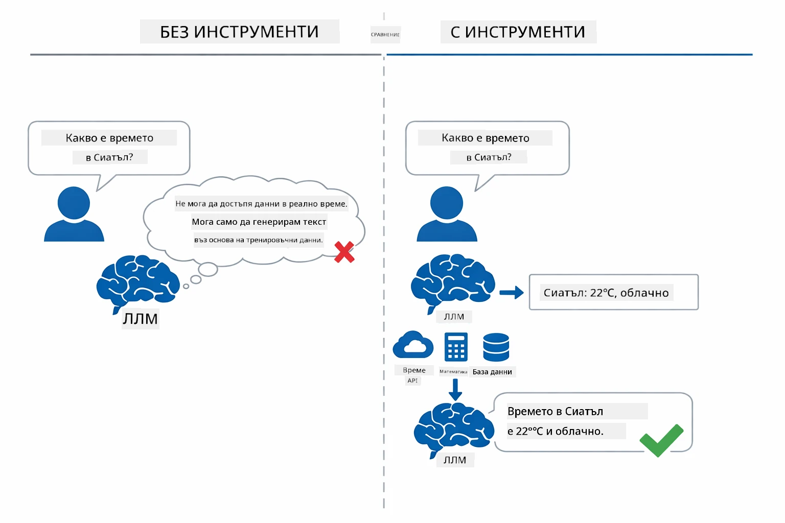

*Без инструменти моделът само гадае — с инструменти може да извиква API, да прави изчисления и да връща данни в реално време.*

AI агент с инструменти следва модел **Reasoning and Acting (ReAct)**. Моделът не просто отговаря — той мисли какво му трябва, действа чрез извикване на инструмент, наблюдава резултата и после решава дали да действа отново или да даде окончателен отговор:

1. **Разсъждава** — агентът анализира въпроса на потребителя и определя каква информация му е необходима
2. **Действа** — агентът избира правилния инструмент, генерира правилните параметри и го извиква
3. **Наблюдава** — агентът получава изхода на инструмента и оценява резултата
4. **Повтаря или Отговаря** — ако са нужни още данни, агентът се връща обратно; в противен случай съставя отговор на естествен език

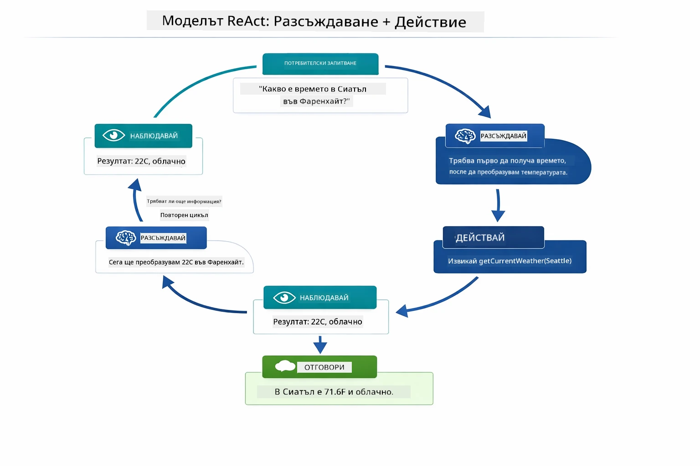

*Цикълът ReAct — агентът разсъждава какво да направи, действа чрез извикване на инструмент, наблюдава резултата и повтаря до подаване на окончателния отговор.*

Това се случва автоматично. Вие дефинирате инструментите и техните описания. Моделът се грижи за вземането на решения кога и как да ги използва.

## Как работи извикването на инструменти

### Определения на инструментите

[WeatherTool.java](../../../04-tools/src/main/java/com/example/langchain4j/agents/tools/WeatherTool.java) | [TemperatureTool.java](../../../04-tools/src/main/java/com/example/langchain4j/agents/tools/TemperatureTool.java)

Вие дефинирате функции със ясни описания и спецификации на параметрите. Моделът вижда тези описания в своята системна промпт и разбира какво прави всеки инструмент.

```java
@Component
public class WeatherTool {
    
    @Tool("Get the current weather for a location")
    public String getCurrentWeather(@P("Location name") String location) {
        // Вашата логика за търсене на времето
        return "Weather in " + location + ": 22°C, cloudy";
    }
}

@AiService
public interface Assistant {
    String chat(@MemoryId String sessionId, @UserMessage String message);
}

// Асистентът е автоматично свързан от Spring Boot с:
// - ChatModel bean
// - Всички @Tool методи от @Component класове
// - ChatMemoryProvider за управление на сесии
```

Диаграмата по-долу разчленява всяка анотация и показва как всяка част помага на AI да разбере кога да извика инструмента и какви аргументи да подаде:

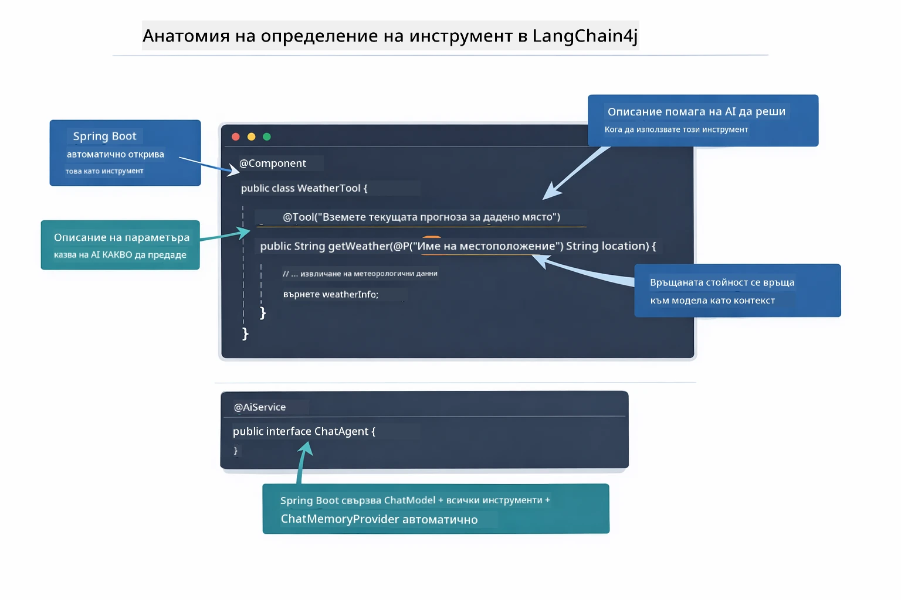

*Анатомия на дефиниция на инструмент — @Tool казва на AI кога да го използва, @P описва всеки параметър, а @AiService свързва всичко при стартиране.*

> **🤖 Опитайте с [GitHub Copilot](https://github.com/features/copilot) Чат:** Отворете [`WeatherTool.java`](../../../04-tools/src/main/java/com/example/langchain4j/agents/tools/WeatherTool.java) и задайте въпроси:
> - "Как бих интегрирал реално API за времето като OpenWeatherMap вместо тестовите данни?"
> - "Какво прави едно добро описание на инструмент, което помага на AI да го използва правилно?"
> - "Как да обработвам грешки от API и ограничения на честотата в имплементациите на инструменти?"

### Вземане на решения

Когато потребител попита „Какво е времето в Сиатъл?“, моделът не избира инструмент на произволен принцип. Той сравнява намерението на потребителя с всяко описание на инструмент, до което има достъп, оценява всеки за релевантност и избира най-подходящия. След това генерира структурирано извикване на функция с правилните параметри — в този случай задава `location` на `"Seattle"`.

Ако няма инструмент, който да съвпада с искането на потребителя, моделът отговаря от собствените си знания. Ако няколко инструмента отговарят, избира най-конкретния.

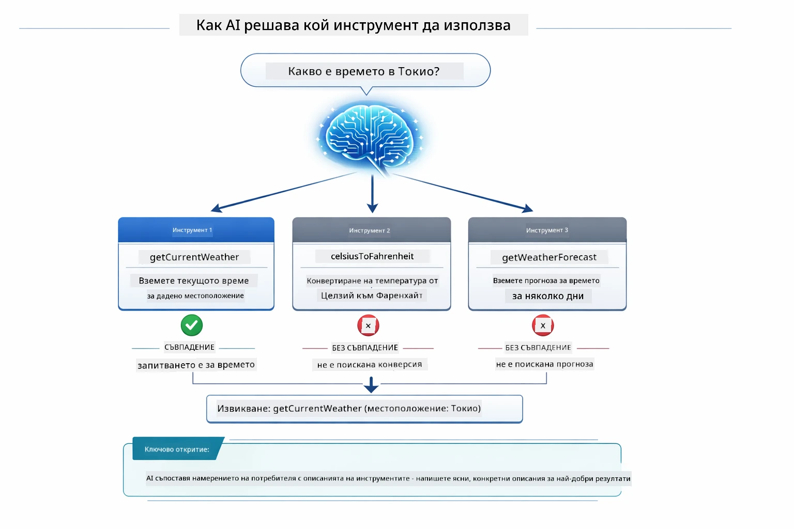

*Моделът оценява всеки наличен инструмент спрямо намерението на потребителя и избира най-подходящия — затова е важно да се пишат ясни, конкретни описания на инструментите.*

### Изпълнение

[AgentService.java](../../../04-tools/src/main/java/com/example/langchain4j/agents/service/AgentService.java)

Spring Boot автоматично свързва декларативния интерфейс `@AiService` със всички регистрирани инструменти, а LangChain4j изпълнява извикванията към инструменти автоматично. Зад кулисите едно пълно извикване на инструмент преминава през шест етапа — от въпроса на потребителя на естествен език до отговора също на естествен език:

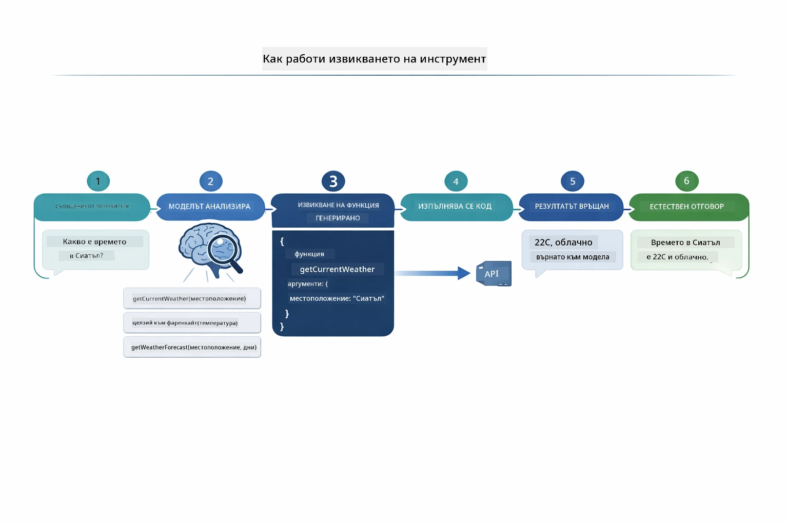

*Цялостният поток — потребителят задава въпрос, моделът избира инструмент, LangChain4j го изпълнява и моделът вплита резултата в естествен отговор.*

> **🤖 Опитайте с [GitHub Copilot](https://github.com/features/copilot) Чат:** Отворете [`AgentService.java`](../../../04-tools/src/main/java/com/example/langchain4j/agents/service/AgentService.java) и попитайте:
> - "Как работи ReAct модела и защо е ефективен за AI агенти?"
> - "Как агентът решава кой инструмент да използва и в какъв ред?"
> - "Какво се случва, ако изпълнението на инструмент се провали – как да обработвам грешки надеждно?"

### Генериране на отговор

Моделът получава данните за времето и ги форматира в отговор на естествен език за потребителя.

### Архитектура: Автоматично свързване в Spring Boot

Този модул използва интеграцията на LangChain4j със Spring Boot и декларативните интерфейси `@AiService`. При стартиране Spring Boot открива всеки `@Component`, съдържащ методи с `@Tool`, вашата обвивка `ChatModel` и `ChatMemoryProvider` — след което ги свързва в един интерфейс `Assistant` без нужда от допълнителен код.

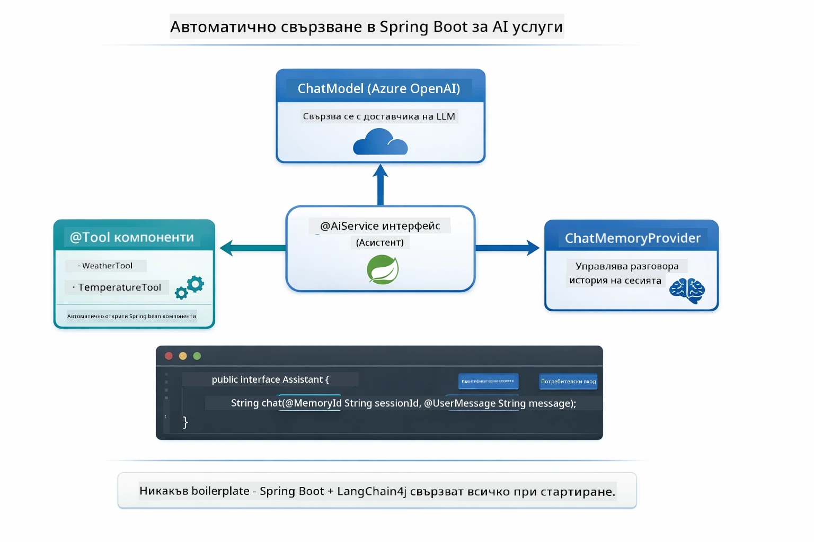

*Интерфейсът @AiService свързва заедно ChatModel, компонентите с инструменти и доставчика на памет — Spring Boot автоматично се грижи за всички връзки.*

Основни предимства на този подход:

- **Автоматично свързване в Spring Boot** — ChatModel и инструментите се инжектират автоматично
- **Патерн @MemoryId** — Автоматично управление на паметта по сесии
- **Единствен инстанс** — Assistant се създава веднъж и се преизползва за по-добра производителност
- **Изпълнение със защита на типовете** — Java методи се извикват директно с преобразуване на типове
- **Оркестрация за много ходове** — Автоматично управлява вериги от инструменти
- **Нулев шаблонен код** — Без ръчни извиквания `AiServices.builder()` или управление на памет с HashMap

Алтернативни подходи (ръчно използване на `AiServices.builder()`) изискват повече код и нямат ползите от интеграцията със Spring Boot.

## Вериги от инструменти

**Вериги от инструменти** — Истинската сила на агентите с инструменти се проявява, когато един въпрос изисква множество инструменти. Попитайте „Какво е времето в Сиатъл във фаренхейт?“ и агентът автоматично свързва два инструмента: първо извиква `getCurrentWeather` за температура в Целзий, след това предава тази стойност на `celsiusToFahrenheit` за преобразуване — всичко в един ход на разговора.

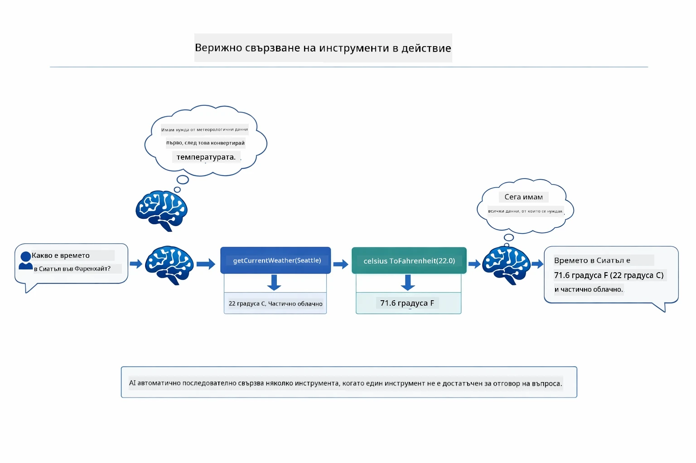

*Веригата от инструменти в действие — агентът първо извиква getCurrentWeather, после подава резултата в Целзий на celsiusToFahrenheit и доставя комбиниран отговор.*

**Грациозни провали** — Попитайте за времето в град, който не съществува в тестовите данни. Инструментът връща съобщение за грешка и AI обяснява, че не може да помогне, вместо да се срине. Инструментите се провалят безопасно. Диаграмата по-долу сравнява двата подхода — с правилно обработване на грешки агентът улавя изключението и отговаря с полезно пояснение, а без това цялото приложение спира работа:

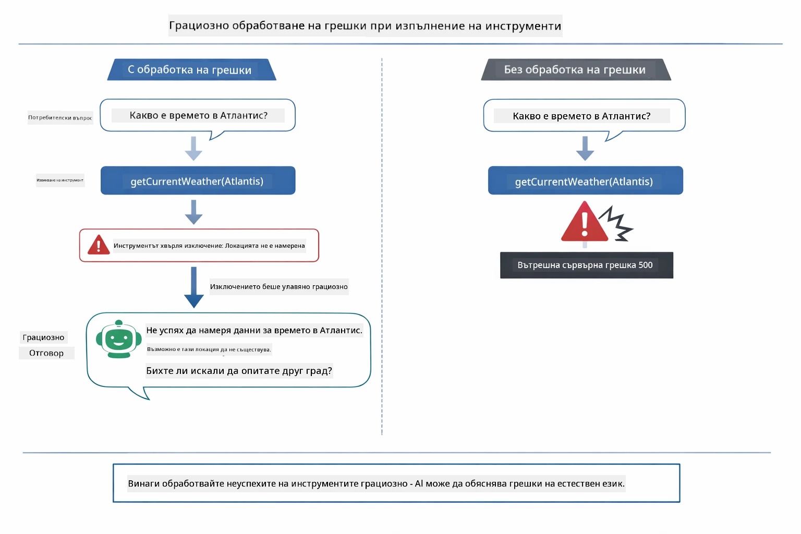

*Когато инструментът се провали, агентът улавя грешката и отговаря с обяснение, вместо да срине приложението.*

Това се случва в един ход на разговора. Агентът автономно управлява множество извиквания на инструменти.

## Стартиране на приложението

**Проверете разполагането:**

Уверете се, че файлът `.env` съществува в главната директория с Azure идентификационни данни (създаден по време на Модул 01). Стартирайте това от директорията на модула (`04-tools/`):

**Bash:**
```bash
cat ../.env  # Трябва да покаже AZURE_OPENAI_ENDPOINT, API_KEY, DEPLOYMENT
```

**PowerShell:**
```powershell
Get-Content ..\.env  # Трябва да показва AZURE_OPENAI_ENDPOINT, API_KEY, DEPLOYMENT
```

**Стартирайте приложението:**

> **Забележка:** Ако вече сте стартирали всички приложения чрез `./start-all.sh` от главната директория (както е описано в Модул 01), този модул вече работи на порт 8084. Можете да пропуснете командите за стартиране по-долу и да отидете директно на http://localhost:8084.

**Опция 1: Използване на Spring Boot Dashboard (Препоръчително за потребители на VS Code)**

В контейнера за разработка е включено разширението Spring Boot Dashboard, което осигурява визуален интерфейс за управление на всички Spring Boot приложения. Можете да го намерите в Activity Bar отляво на VS Code (потърсете иконата на Spring Boot).

От Spring Boot Dashboard можете:
- Да видите всички налични Spring Boot приложения в работното пространство
- Да стартирате/спирате приложения с един клик
- Да наблюдавате логовете на приложенията в реално време
- Да следите статуса на приложенията

Просто натиснете бутона за пускане до „tools“, за да стартирате този модул, или стартирайте всички модули едновременно.

Ето как изглежда Spring Boot Dashboard в VS Code:


*Spring Boot Dashboard във VS Code — стартирайте, спирайте и наблюдавайте всички модули от едно място*

**Опция 2: Използване на shell скриптове**

Стартирайте всички уеб приложения (модули 01-04):

**Bash:**
```bash
cd ..  # От коренната директория
./start-all.sh
```

**PowerShell:**
```powershell
cd ..  # От главната директория
.\start-all.ps1
```

Или стартирайте само този модул:

**Bash:**
```bash
cd 04-tools
./start.sh
```

**PowerShell:**
```powershell
cd 04-tools
.\start.ps1
```

И двата скрипта автоматично зареждат променливи на околната среда от главния файл `.env` и ще компилират JAR файловете, ако не съществуват.

> **Забележка:** Ако предпочитате да компилирате всички модули ръчно преди стартиране:
>
> **Bash:**
> ```bash
> cd ..  # Go to root directory
> mvn clean package -DskipTests
> ```
>
> **PowerShell:**
> ```powershell
> cd ..  # Go to root directory
> mvn clean package -DskipTests
> ```

Отворете http://localhost:8084 в браузъра си.

**За спиране:**

**Bash:**
```bash
./stop.sh  # Само този модул
# Или
cd .. && ./stop-all.sh  # Всички модули
```

**PowerShell:**
```powershell
.\stop.ps1  # Само този модул
# Или
cd ..; .\stop-all.ps1  # Всички модули
```

## Използване на приложението

Приложението предоставя уеб интерфейс, където можете да взаимодействате с AI агент, който има достъп до инструменти за прогнозиране на времето и конверсия на температура. Ето как изглежда интерфейсът — включва примери за бърз старт и чат панел за изпращане на заявки:
<a href="images/tools-homepage.png"></a>

*Интерфейсът на AI агент за инструменти - бързи примери и чат интерфейс за взаимодействие с инструменти*

### Изпробвайте просто използване на инструмент

Започнете с прост въпрос: "Конвертирай 100 градуса по Фаренхайт в Целзий". Агентът разпознава, че трябва да използва инструмента за преобразуване на температура, извиква го с правилните параметри и връща резултата. Обърнете внимание колко естествено изглежда това – не сте посочвали кой инструмент да се използва или как да се извика.

### Тествайте свързване на инструменти

Сега опитайте нещо по-сложно: "Какво е времето в Сиатъл и го конвертирай във Фаренхайт?" Наблюдавайте как агентът работи по стъпки. Първо получава информация за времето (която е в Целзий), разпознава, че трябва да конвертира във Фаренхайт, извиква инструмента за преобразуване и комбинира двата резултата в един отговор.

### Вижте течението на разговора

Чат интерфейсът запазва историята на разговора, позволявайки ви да водите многостепенни взаимодействия. Можете да видите всички предишни заявки и отговори, което улеснява проследяването на разговора и разбирането как агентът изгражда контекст през множество обменни цикли.

<a href="images/tools-conversation-demo.png"></a>

*Многостепенен разговор, показващ прости конверсии, проверка на времето и свързване на инструменти*

### Експериментирайте с различни заявки

Опитайте различни комбинации:
- Проверки на времето: "Какво е времето в Токио?"
- Преобразуване на температури: "Колко е 25°C в Келвин?"
- Комбинирани заявки: "Провери времето в Париж и ми кажи дали е над 20°C"

Обърнете внимание как агентът интерпретира естествения език и го преобразува в подходящи извиквания на инструменти.

## Основни концепции

### Модел ReAct (Разсъждение и действие)

Агентът редува между разсъждение (решава какво да прави) и действие (използва инструменти). Този модел позволява автономно решаване на проблеми, а не просто отговаряне на инструкции.

### Описанията на инструменти са важни

Качеството на описанията на инструментите директно влияе върху това колко добре агентът ги използва. Ясните, конкретни описания помагат на модела да разбере кога и как да извика всеки инструмент.

### Управление на сесии

Анотацията `@MemoryId` позволява автоматично управление на паметта на база сесия. Всеки идентификатор на сесия получава собствен екземпляр на `ChatMemory`, управляван от `ChatMemoryProvider` та, така че множество потребители могат да взаимодействат с агента едновременно без да се смесват разговорите им. Следната диаграма показва как множество потребители се насочват към изолирани хранилища на памет въз основа на техните идентификатори на сесия:

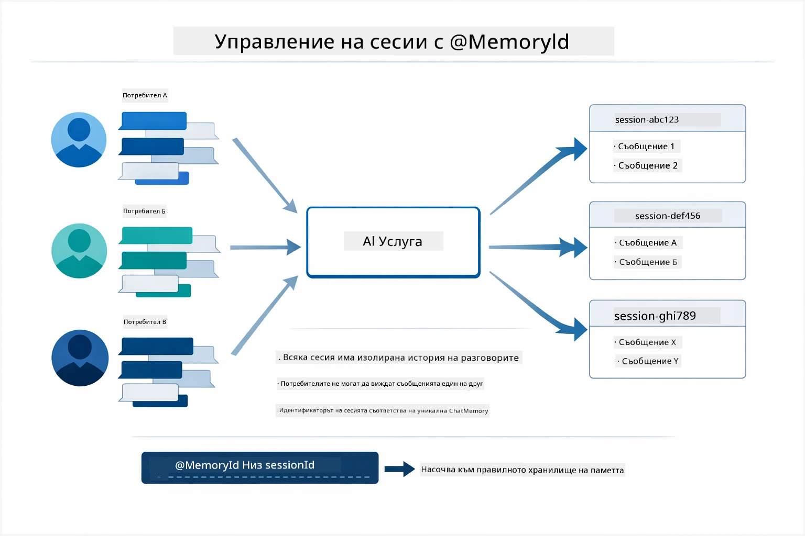

*Всеки идентификатор на сесия съответства на изолирана история на разговори — потребителите никога не виждат съобщенията на други.*

### Обработка на грешки

Инструментите могат да се провалят — API-та могат да изтекат, параметрите може да са невалидни, външни услуги може да спрат да работят. Продукционните агенти се нуждаят от обработка на грешки, така че моделът да може да обясни проблемите или да опита алтернативи, вместо да срива цялото приложение. Когато инструмент хвърли изключение, LangChain4j го улавя и предава съобщението за грешка обратно на модела, който после може да обясни проблема на естествен език.

## Налични инструменти

Диаграмата по-долу показва широката екосистема от инструменти, които можете да изградите. Този модул демонстрира инструменти за времето и температурата, но същият `@Tool` модел работи с всеки Java метод — от заявки към бази данни до обработка на плащания.

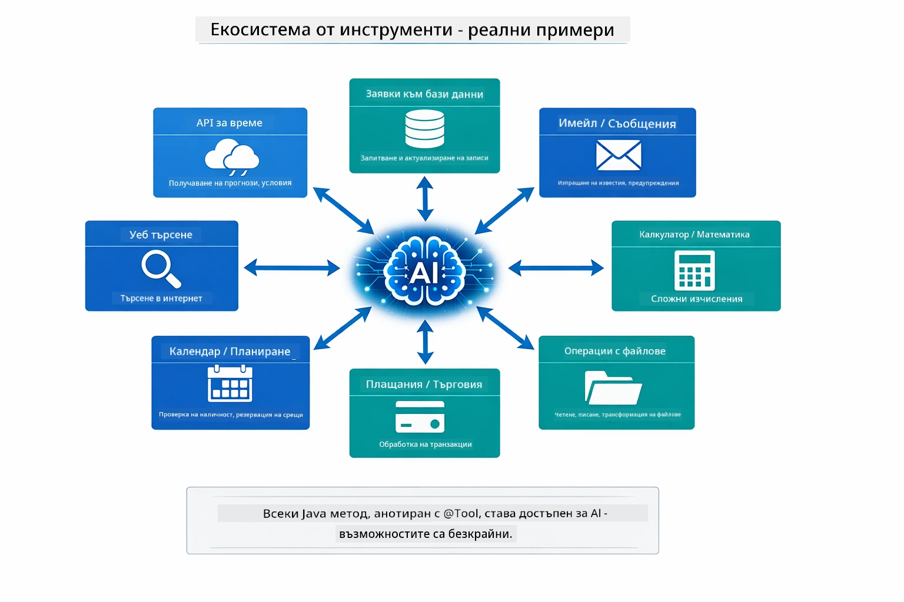

*Всеки Java метод анотиран с @Tool става достъпен за AI — моделът се разпростира до бази данни, API-та, имейли, файлови операции и други.*

## Кога да използвате агенти с инструменти

Не всяка заявка изисква използване на инструменти. Решението зависи от това дали AI трябва да взаимодейства с външни системи или може да отговори въз основа на собствените си знания. Следното ръководство обобщава кога инструментите добавят стойност и кога не са необходими:

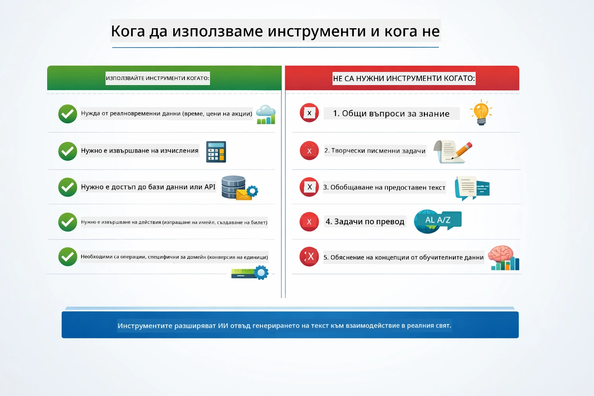

*Бързо ръководство за решение — инструментите са за реални данни, изчисления и действия; общите познания и креативните задачи не ги изискват.*

## Инструменти срещу RAG

Модули 03 и 04 разширяват способностите на AI по съществени различни начини. RAG дава на модела достъп до **знания**, като извлича документи. Инструментите дават на модела възможността да извършва **действия** чрез извикване на функции. Диаграмата по-долу сравнява двата подхода — от начина, по който всяка работна последователност функционира, до компромисите между тях:

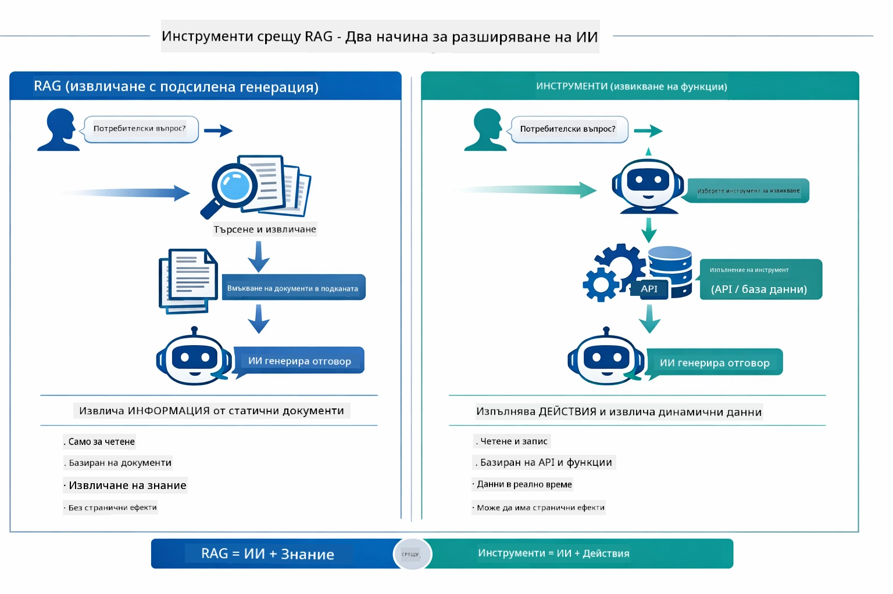

*RAG извлича информация от статични документи — инструментите изпълняват действия и доставят динамични, актуални данни. Много продукционни системи използват и двата.*

На практика много продукционни системи съчетават двата подхода: RAG за обосноваване на отговорите в документацията ви и Инструменти за вземане на живи данни или изпълнение на операции.

## Следващи стъпки

**Следващ модул:** [05-mcp - Протокол за контекст на модел (MCP)](../05-mcp/README.md)

---

**Навигация:** [← Предишен: Модул 03 - RAG](../03-rag/README.md) | [Обратно към Основната страница](../README.md) | [Следващ: Модул 05 - MCP →](../05-mcp/README.md)

---

<!-- CO-OP TRANSLATOR DISCLAIMER START -->
**Отказ от отговорност**:
Този документ е преведен с помощта на AI услуга за превод [Co-op Translator](https://github.com/Azure/co-op-translator). Въпреки че се стремим към точност, моля, имайте предвид, че автоматизираните преводи могат да съдържат грешки или неточности. Оригиналният документ на неговия език трябва да се счита за авторитетен източник. За критична информация се препоръчва професионален човешки превод. Не носим отговорност за каквито и да е недоразумения или неправилни тълкувания, произтичащи от използването на този превод.
<!-- CO-OP TRANSLATOR DISCLAIMER END -->