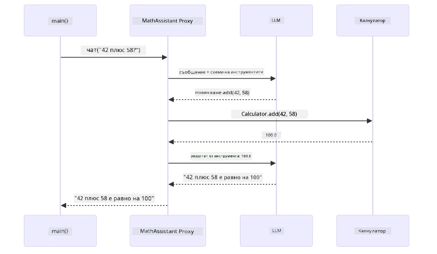
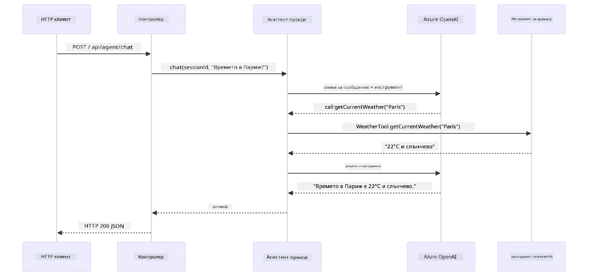

# Модул 04: AI Агенти с Инструменти

## Съдържание

- [Какво ще научите](../../../04-tools)
- [Предварителни изисквания](../../../04-tools)
- [Разбиране на AI агенти с инструменти](../../../04-tools)
- [Как работи повикването на инструмент](../../../04-tools)
  - [Дефиниции на инструменти](../../../04-tools)
  - [Вземане на решения](../../../04-tools)
  - [Изпълнение](../../../04-tools)
  - [Генериране на отговор](../../../04-tools)
  - [Архитектура: Spring Boot автоматично свързване](../../../04-tools)
- [Свързване на инструменти](../../../04-tools)
- [Стартиране на приложението](../../../04-tools)
- [Използване на приложението](../../../04-tools)
  - [Опитай прост инструмент](../../../04-tools)
  - [Тествай свързване на инструменти](../../../04-tools)
  - [Виж потока на разговора](../../../04-tools)
  - [Експериментирай с различни заявки](../../../04-tools)
- [Ключови концепции](../../../04-tools)
  - [ReAct модел (Разсъждение и Действие)](../../../04-tools)
  - [Значение на описанията на инструментите](../../../04-tools)
  - [Управление на сесии](../../../04-tools)
  - [Обработка на грешки](../../../04-tools)
- [Налични инструменти](../../../04-tools)
- [Кога да използваме агенти с инструменти](../../../04-tools)
- [Инструменти срещу RAG](../../../04-tools)
- [Следващи стъпки](../../../04-tools)

## Какво ще научите

Досега научихте как да водите разговори с AI, ефективно да структурирате подбудителите и да осигурявате отговори, базирани на вашите документи. Но има основно ограничение: езиковите модели могат само да генерират текст. Те не могат да проверят времето, да извършват изчисления, да правят заявки към бази данни или да взаимодействат с външни системи.

Инструментите променят това. Чрез предоставяне на модела достъп до функции, които може да извиква, го превръщате от текстогенератор в агент, който може да предприема действия. Моделът решава кога му трябва инструмент, кой инструмент да използва и какви параметри да подаде. Вашият код изпълнява функцията и връща резултата. Моделът включва този резултат в отговора си.

## Предварителни изисквания

- Завършен [Модул 01 - Въведение](../01-introduction/README.md) (пълно разгръщане на Azure OpenAI ресурсите)
- Препоръчително е да са готови предишни модули (този модул прави справки към [RAG концепции от Модул 03](../03-rag/README.md) в сравнение Инструменти срещу RAG)
- Файл `.env` в главната директория с Azure креденшъли (създаден от `azd up` в Модул 01)

> **Забележка:** Ако не сте завършили Модул 01, първо следвайте инструкциите за разгръщане там.

## Разбиране на AI агенти с инструменти

> **📝 Забележка:** Терминът "агенти" в този модул се отнася до AI асистенти, разширени с възможности за повикване на инструменти. Това е различно от **Agentic AI** патърните (автономни агенти с планиране, памет и многостъпково разсъждение), които ще разгледаме в [Модул 05: MCP](../05-mcp/README.md).

Без инструменти езиков модел може само да генерира текст от обучителните си данни. Попитайте го за настоящото време и той ще трябва да гадае. Дайте му инструменти, и той може да извика API за времето, да извърши изчисления или да направи заявка към база данни — след което да вплете тези реални резултати в отговора си.


*Без инструменти моделът само гадае — с инструменти може да извиква API, да прави изчисления и да връща актуални данни.*

AI агент с инструменти следва **модел Разсъждение и Действие (ReAct)**. Моделът не само отговаря — той мисли какво му трябва, действа като извиква инструмент, наблюдава резултата и решава дали да действа отново или да даде окончателния отговор:

1. **Разсъждава** — агентът анализира въпроса на потребителя и определя каква информация му е нужна
2. **Действа** — агентът избира правилния инструмент, генерира правилните параметри и го извиква
3. **Наблюдава** — агентът получава резултата от инструмента и го оценява
4. **Повтаря или Отговаря** — ако са нужни още данни, агентът се връща в цикъла; иначе съставя отговор на естествен език


*Цикълът на ReAct — агентът разсъждава какво да направи, действа чрез извикване на инструмент, наблюдава резултата и повтаря, докато не даде окончателния отговор.*

Това се случва автоматично. Вие дефинирате инструментите и техните описания. Моделът взема решения кога и как да ги използва.

## Как работи повикването на инструмент

### Дефиниции на инструменти

[WeatherTool.java](../../../04-tools/src/main/java/com/example/langchain4j/agents/tools/WeatherTool.java) | [TemperatureTool.java](../../../04-tools/src/main/java/com/example/langchain4j/agents/tools/TemperatureTool.java)

Дефинирате функции с ясни описания и спецификации на параметрите. Моделът вижда тези описания в системното си подсещане и разбира какво прави всеки инструмент.

```java
@Component
public class WeatherTool {
    
    @Tool("Get the current weather for a location")
    public String getCurrentWeather(@P("Location name") String location) {
        // Вашата логика за търсене на времето
        return "Weather in " + location + ": 22°C, cloudy";
    }
}

@AiService
public interface Assistant {
    String chat(@MemoryId String sessionId, @UserMessage String message);
}

// Асистентът е автоматично свързан от Spring Boot с:
// - бийн ChatModel
// - Всички @Tool методи от @Component класове
// - ChatMemoryProvider за управление на сесии
```
  
Диаграмата по-долу разбива всяка анотация и показва как всяка част помага на AI да разбере кога да извика инструмента и какви аргументи да подаде:


*Анатомия на дефиниция на инструмент — @Tool казва на AI кога да го използва, @P описва всеки параметър, а @AiService свързва всичко при стартиране.*

> **🤖 Опитайте с [GitHub Copilot](https://github.com/features/copilot) Chat:** Отворете [`WeatherTool.java`](../../../04-tools/src/main/java/com/example/langchain4j/agents/tools/WeatherTool.java) и попитайте:
> - "Как да интегрирам реален API за времето като OpenWeatherMap вместо фиктивни данни?"
> - "Какво прави едно описание на инструмент добро, така че AI да го използва правилно?"
> - "Как се обработват грешки от API и лимити на заявки в реализацията на инструментите?"

### Вземане на решения

Когато потребител пита "Какво е времето в Сиатъл?", моделът не избира случайно инструмент. Той сравнява намерението на потребителя с всяко описание на инструмент, до което има достъп, оценява всеки по релевантност и избира най-подходящия. След това генерира структурирано извикване на функция с правилните параметри — в случая задава `location` на `"Seattle"`.

Ако нито един инструмент не съответства на заявката, моделът се връща към отговор от собствените си знания. Ако няколко инструмента съвпадат, избира най-специфичния.


*Моделът оценява всеки наличен инструмент спрямо намерението на потребителя и избира най-подходящия — затова е важно да са ясни и конкретни описанията на инструментите.*

### Изпълнение

[AgentService.java](../../../04-tools/src/main/java/com/example/langchain4j/agents/service/AgentService.java)

Spring Boot автоматично свързва декларативния `@AiService` интерфейс с всички регистрирани инструменти, а LangChain4j изпълнява повикванията към инструментите автоматично. Зад кулисите пълен инструментален поток преминава през шест етапа — от въпроса на потребителя на естествен език донов обратно до отговор на естествен език:


*Цялостният поток — потребителят задава въпрос, моделът избира инструмент, LangChain4j го изпълнява, и моделът вплита резултата в естествен отговор.*

Ако сте стартирали [ToolIntegrationDemo](../../../00-quick-start/src/main/java/com/example/langchain4j/quickstart/ToolIntegrationDemo.java) в Модул 00, вече сте видели този модел в действие — инструментите `Calculator` се извикват по същия начин. Диаграмата по-долу показва какво точно се случва зад сцената по време на това демо:



*Цикълът на повикване на инструмент от демото за бързо пускане — `AiServices` изпраща вашето съобщение и схеми на инструменти към LLM, LLM отговаря с извикване на функция като `add(42, 58)`, LangChain4j изпълнява локално метода `Calculator` и връща резултата за окончателния отговор.*

> **🤖 Опитайте с [GitHub Copilot](https://github.com/features/copilot) Chat:** Отворете [`AgentService.java`](../../../04-tools/src/main/java/com/example/langchain4j/agents/service/AgentService.java) и попитайте:
> - "Как работи ReAct моделът и защо е ефективен за AI агенти?"
> - "Как агентът решава кой инструмент да използва и в какъв ред?"
> - "Какво се случва ако изпълнението на инструмент се провали - как да обработвам грешки устойчиво?"

### Генериране на отговор

Моделът получава данните за времето и ги форматира в отговор на естествен език за потребителя.

### Архитектура: Spring Boot автоматично свързване

Този модул използва интеграцията на LangChain4j със Spring Boot с декларативни `@AiService` интерфейси. При стартиране Spring Boot открива всеки `@Component`, съдържащ методи с `@Tool`, вашия `ChatModel` бин и `ChatMemoryProvider` — след което ги свързва всички в един интерфейс `Assistant` без излишен код.


*Интерфейсът @AiService обединява ChatModel, компонентите инструменти и провайдъра на памет — Spring Boot автоматично се грижи за свързването.*

Ето целия жизнен цикъл на заявката като диаграма на последователността — от HTTP заявката през контролера, сервиза и автоматично свързания прокси, до изпълнението на инструмента и обратно:



*Цялостният животен цикъл на заявката в Spring Boot — HTTP заявката преминава през контролера и сервиза към проксито Assistant, което управлява LLM и повикванията на инструменти автоматично.*

Ключови предимства на този подход:

- **Spring Boot автоматично свързване** — ChatModel и инструментите се инжектира автоматично
- **@MemoryId модел** — Автоматично управление на сесийна памет
- **Единен екземпляр** — Assistant се създава веднъж и се използва отново за по-добра производителност
- **Изпълнение с типова безопасност** — Java методи се извикват директно с конверсия на типове
- **Оркестрация с много ходове** — Автоматично свързване на инструменти
- **Нулев код-бойлерплейт** — Без ръчни `AiServices.builder()` повиквания или памет с HashMap

Алтернативните подходи (ръчни `AiServices.builder()`) изискват повече код и пропускат ползите от Spring Boot интеграцията.

## Свързване на инструменти

**Свързване на инструменти** — Реалната сила на базираните на инструменти агенти се проявява, когато един въпрос изисква множество инструменти. Попитайте "Какво е времето в Сиатъл във Фаренхайт?" и агентът автоматично свързва два инструмента: първо извиква `getCurrentWeather`, за да получи температурата в Целзий, после подава тази стойност на `celsiusToFahrenheit` за конверсия — всичко това в един разговорен ход.


*Свързване на инструменти в действие — агентът първо извиква getCurrentWeather, после подава резултата в Целзий на celsiusToFahrenheit и дава комбиниран отговор.*

**Грациозни провали** — Попитайте за времето в град, който не е в фиктивните данни. Инструментът връща съобщение за грешка, а AI обяснява, че не може да помогне, вместо да се счупи. Инструментите се провалят безопасно. Диаграмата по-долу сравнява двата подхода — с правилна обработка на грешки агентът хваща изключението и отговаря полезно, докато без нея цялото приложение се срива:


*Когато инструмент се провали, агентът хваща грешката и отговаря с полезно обяснение, вместо да се срути.*

Това се случва в един цикъл на разговора. Агентът автоматично управлява многократни повиквания на инструменти.

## Стартиране на приложението

**Проверете разгръщането:**

Уверете се, че файлът `.env` съществува в главната директория с Azure креденшъли (създаден по време на Модул 01). Стартирайте това от директорията на модула (`04-tools/`):

**Bash:**  
```bash
cat ../.env  # Трябва да показва AZURE_OPENAI_ENDPOINT, API_KEY, DEPLOYMENT
```
  
**PowerShell:**  
```powershell
Get-Content ..\.env  # Трябва да показва AZURE_OPENAI_ENDPOINT, API_KEY, DEPLOYMENT
```
  
**Стартирайте приложението:**

> **Забележка:** Ако вече сте стартирали всички приложения с `./start-all.sh` от главната директория (както е описано в Модул 01), този модул вече работи на порт 8084. Можете да пропуснете командите за стартиране по-долу и да отидете директно на http://localhost:8084.

**Опция 1: Използване на Spring Boot Dashboard (Препоръчва се за потребители на VS Code)**

Дев контейнерът включва разширението Spring Boot Dashboard, което осигурява визуален интерфейс за управление на всички Spring Boot приложения. Можете да го намерите в лентата с дейности вляво в VS Code (потърсете иконата на Spring Boot).

От Spring Boot Dashboard можете:  
- Да видите всички налични Spring Boot приложения в работното пространство  
- Да стартирате/спирате приложения с един клик  
- Да преглеждате логовете на приложенията в реално време  
- Да наблюдавате статуса на приложенията  

Просто кликнете бутона Play до "tools" за да стартирате този модул, или стартирайте всички модули наведнъж.

Ето как изглежда Spring Boot Dashboard във VS Code:


*Spring Boot Dashboard във VS Code — стартиране, спиране и мониторинг на всички модули от едно място*

**Опция 2: Използване на shell скриптове**

Стартирайте всички уеб приложения (модули 01-04):

**Bash:**
```bash
cd ..  # От главната директория
./start-all.sh
```

**PowerShell:**
```powershell
cd ..  # От коренната директория
.\start-all.ps1
```

Или стартирайте само този модул:

**Bash:**
```bash
cd 04-tools
./start.sh
```

**PowerShell:**
```powershell
cd 04-tools
.\start.ps1
```

Двата скрипта автоматично зареждат променливите на средата от коренния `.env` файл и ще компилират JAR файловете, ако те не съществуват.

> **Забележка:** Ако предпочитате да компилирате всички модули ръчно преди стартиране:
>
> **Bash:**
> ```bash
> cd ..  # Go to root directory
> mvn clean package -DskipTests
> ```
>
> **PowerShell:**
> ```powershell
> cd ..  # Go to root directory
> mvn clean package -DskipTests
> ```

Отворете http://localhost:8084 в своя браузър.

**За спиране:**

**Bash:**
```bash
./stop.sh  # Само този модул
# Или
cd .. && ./stop-all.sh  # Всички модули
```

**PowerShell:**
```powershell
.\stop.ps1  # Само този модул
# Или
cd ..; .\stop-all.ps1  # Всички модули
```

## Използване на приложението

Приложението предоставя уеб интерфейс, чрез който можете да взаимодействате с AI агент, който има достъп до инструменти за прогноза за времето и конвертиране на температура. Ето как изглежда интерфейсът — включва бързи стартови примери и чат панел за изпращане на заявки:

<a href="images/tools-homepage.png"></a>

*Интерфейсът на AI Agent Tools - бързи примери и чат интерфейс за взаимодействие с инструментите*

### Пробвайте просто използване на инструмента

Започнете с проста заявка: "Конвертирай 100 градуса по Фаренхайт в Целзий". Агентът разпознава, че му е необходим инструмент за конвертиране на температура, извиква го с правилните параметри и връща резултата. Забележете колко естествено изглежда - не указахте кой инструмент да използва или как да го извика.

### Тествайте верижно използване на инструменти

Сега опитайте нещо по-сложно: "Какво е времето в Сиатъл и го конвертирай във Фаренхайт?" Наблюдавайте как агентът работи стъпка по стъпка. Първо получава прогнозата за времето (която е в Целзий), разпознава необходимостта да конвертира във Фаренхайт, извиква инструмента за конвертиране и комбинира двата резултата в един отговор.

### Вижте поток на разговора

Чат интерфейсът запазва история на разговора, позволявайки ви мултистъпкови взаимодействия. Можете да видите всички предишни въпроси и отговори, което улеснява проследяването на разговора и разбирането как агентът изгражда контекст през няколко обмени.

<a href="images/tools-conversation-demo.png"></a>

*Многостъпков разговор, показващ прости конверсии, справки за времето и верижно ползване на инструменти*

### Експериментирайте с различни заявки

Опитайте различни комбинации:
- Справки за времето: "Какво е времето в Токио?"
- Конверсии на температура: "Колко е 25°C в Келвин?"
- Комбинирани заявки: "Провери времето в Париж и ми кажи дали е над 20°C"

Забележете как агентът интерпретира естествен език и го свързва с подходящи извиквания на инструменти.

## Основни концепции

### ReAct модел (Разсъждение и действие)

Агентът редува между разсъждение (решава какво да прави) и действие (използва инструменти). Този модел позволява автономно решаване на проблеми, а не просто отговаряне на инструкции.

### Описанията на инструментите са важни

Качеството на описанията на инструментите директно влияе върху това колко добре агентът ги използва. Ясните, конкретни описания помагат на модела да разбере кога и как да извика всеки инструмент.

### Управление на сесиите

Анотацията `@MemoryId` позволява автоматично управление на паметта за базирани на сесия разговори. Всяко ID на сесия получава собствена инстанция `ChatMemory`, управлявана от `ChatMemoryProvider` бийн, така че множество потребители могат да взаимодействат с агента едновременно без техните разговори да се преплитат. Следната диаграма показва как множество потребители се насочват към изолирани паметни хранилища, базирани на техните ID на сесия:


*Всяко ID на сесия се свързва с изолирана история на разговора — потребителите никога не виждат съобщенията един на друг.*

### Обработка на грешки

Инструментите могат да се провалят — API-та изчакват твърде дълго, параметрите може да са невалидни, външни услуги спират. Продукционните агенти се нуждаят от обработка на грешки, така че моделът да може да обяснява проблемите или да опитва алтернативи, вместо приложението да се срива. Когато инструмент хвърли изключение, LangChain4j го прихваща и връща съобщението за грешка на модела, който след това може да обясни проблема на естествен език.

## Налични инструменти

Диаграмата по-долу показва широката екосистема от инструменти, които можете да изградите. Този модул демонстрира инструменти за времето и температурата, но същият `@Tool` модел работи с всеки Java метод — от заявки към бази данни до обработка на плащания.


*Всеки Java метод, анотиран с @Tool, става достъпен за AI — моделът се разширява към бази данни, API-та, имейли, файлови операции и други.*

## Кога да използвате агенти с инструменти

Не всяка заявка изисква инструменти. Решението се свежда до това дали AI трябва да взаимодейства с външни системи или може да отговори на база собственото си знание. Следното ръководство обобщава кога инструментите добавят стойност и кога са излишни:


*Бързо решение — инструментите са за данни в реално време, изчисления и действия; общите знания и креативните задачи не се нуждаят от тях.*

## Инструменти срещу RAG

Модулите 03 и 04 разширяват възможностите на AI, но по фундаментално различни начини. RAG предоставя на модела достъп до **знания** чрез извличане на документи. Инструментите дават на модела възможност да предприема **действия** чрез повикване на функции. Диаграмата по-долу сравнява двата подхода — от това как работи всеки работен процес до компромисите между тях:


*RAG извлича информация от статични документи — Инструментите изпълняват действия и взимат динамични, в реално време, данни. Много продукционни системи комбинират и двата подхода.*

На практика много системи в продукция съчетават двата подхода: RAG за обосноваване на отговори с документация и Инструменти за извличане на живи данни или изпълнение на операции.

## Следващи стъпки

**Следващ модул:** [05-mcp - Model Context Protocol (MCP)](../05-mcp/README.md)

---

**Навигация:** [← Предишен: Модул 03 - RAG](../03-rag/README.md) | [Обратно към основното](../README.md) | [Следващ: Модул 05 - MCP →](../05-mcp/README.md)

---

<!-- CO-OP TRANSLATOR DISCLAIMER START -->
**Отказ от отговорност**:  
Този документ е преведен с помощта на AI преводаческа услуга [Co-op Translator](https://github.com/Azure/co-op-translator). Въпреки че се стремим към точност, моля, имайте предвид, че автоматичните преводи може да съдържат грешки или неточности. Оригиналният документ на неговия роден език трябва да се счита за авторитетен източник. За критична информация се препоръчва професионален човешки превод. Не носим отговорност за каквито и да е недоразумения или погрешни тълкувания, произтичащи от използването на този превод.
<!-- CO-OP TRANSLATOR DISCLAIMER END -->