# Модул 05: Протокол за контекст на модела (MCP)

## Съдържание

- [Какво ще научите](../../../05-mcp)
- [Какво е MCP?](../../../05-mcp)
- [Как работи MCP](../../../05-mcp)
- [Агенетичният модул](../../../05-mcp)
- [Стартиране на примерите](../../../05-mcp)
  - [Изисквания](../../../05-mcp)
- [Бърз старт](../../../05-mcp)
  - [Операции с файлове (Stdio)](../../../05-mcp)
  - [Supervisor Agent](../../../05-mcp)
    - [Стартиране на демо](../../../05-mcp)
    - [Как работи Supervisor](../../../05-mcp)
    - [Как FileAgent открива MCP инструменти по време на работа](../../../05-mcp)
    - [Стратегии за отговор](../../../05-mcp)
    - [Разбиране на изхода](../../../05-mcp)
    - [Обяснение на функциите на агенетичния модул](../../../05-mcp)
- [Ключови понятия](../../../05-mcp)
- [Поздравления!](../../../05-mcp)
  - [Какво следва?](../../../05-mcp)

## Какво ще научите

Вие сте създали разговорен ИИ, овладяли сте подканите, базирали сте отговорите в документи и сте създали агенти с инструменти. Но всички тези инструменти бяха специално направени за вашето конкретно приложение. Какво ако можете да предоставите на вашия ИИ достъп до стандартизирана екосистема от инструменти, които всеки може да създава и споделя? В този модул ще научите как да направите точно това с протокола за контекст на модела (MCP) и агенетичния модул на LangChain4j. Първо показваме прост MCP четец на файлове, а след това как лесно се интегрира в по-сложни агенетични работни потоци използвайки модела Supervisor Agent.

## Какво е MCP?

Протоколът за контекст на модела (MCP) предоставя точно това – стандартизиран начин за ИИ приложения да откриват и използват външни инструменти. Вместо да пишете специални интеграции за всеки източник на данни или услуга, вие се свързвате със MCP сървъри, които предлагат своите възможности в последователен формат. Вашият ИИ агент автоматично може да открива и използва тези инструменти.

Диаграмата по-долу показва разликата – без MCP всяка интеграция изисква специални връзки „точка към точка“; с MCP един протокол свързва вашето приложение с всеки инструмент:


*Преди MCP: Сложни интеграции точка към точка. След MCP: Един протокол, безкрайни възможности.*

MCP решава фундаментален проблем в разработката на ИИ: всяка интеграция е специална. Искате достъп до GitHub? Специален код. Искате да четете файлове? Специален код. Искате да правите заявки към база данни? Специален код. И никоя от тези интеграции не работи с други ИИ приложения.

MCP стандартизира това. MCP сървърът излага инструменти с ясни описания и схеми. Всеки MCP клиент може да се свърже, да открие наличните инструменти и да ги използва. Направете веднъж, използвайте навсякъде.

Диаграмата по-долу илюстрира тази архитектура – един MCP клиент (вашето ИИ приложение) се свързва с множество MCP сървъри, всеки от които предоставя своя набор от инструменти чрез стандартизирания протокол:


*Архитектура на Протокола за контекст на модела - стандартизирано откриване и изпълнение на инструменти*

## Как работи MCP

Под капака MCP използва слоеста архитектура. Вашето Java приложение (MCP клиент) открива налични инструменти, изпраща JSON-RPC заявки през транспортен слой (Stdio или HTTP), а MCP сървърът изпълнява операциите и връща резултати. Следващата диаграма разглежда всеки слой на този протокол:

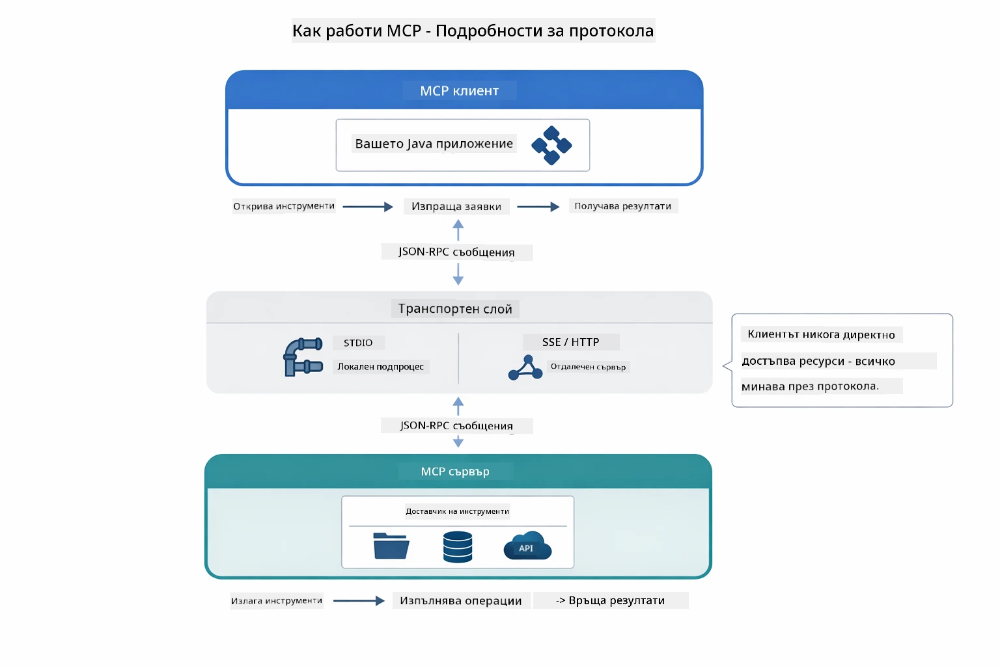

*Как MCP работи под капака — клиентите откриват инструменти, обменят JSON-RPC съобщения и изпълняват операции през транспортен слой.*

**Архитектура сървър-клиент**

MCP използва модел сървър-клиент. Сървърите осигуряват инструменти - четене на файлове, заявки към бази данни, повиквания на API. Клиентите (вашето ИИ приложение) се свързват със сървърите и използват техните инструменти.

За да използвате MCP с LangChain4j добавете тази Maven зависимост:

```xml
<dependency>
    <groupId>dev.langchain4j</groupId>
    <artifactId>langchain4j-mcp</artifactId>
    <version>${langchain4j.version}</version>
</dependency>
```
  
**Откриване на инструменти**

Когато вашият клиент се свързва с MCP сървър, той пита "Какви инструменти имате?" Сървърът отговаря със списък на наличните инструменти, всеки с описание и схеми на параметрите. Вашият ИИ агент може да реши кои инструменти да използва въз основа на заявки от потребителите. Диаграмата по-долу показва този ръкостискане – клиентът изпраща заявка `tools/list` и сървърът връща своите налични инструменти с описания и схеми на параметрите:

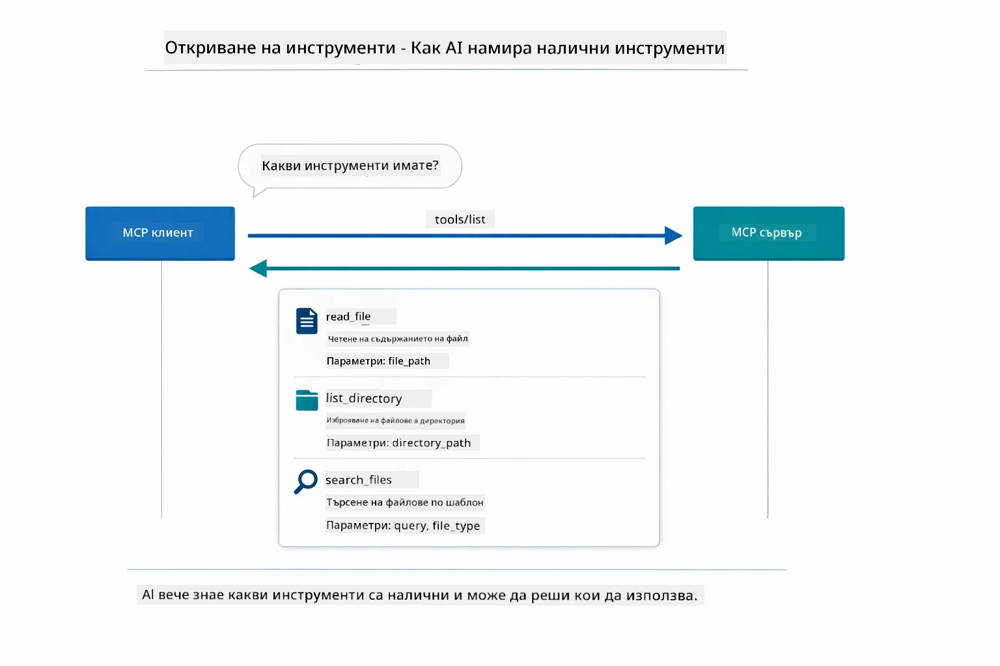

*ИИ открива наличните инструменти при стартиране – сега знае какви възможности са достъпни и може да реши кои да използва.*

**Транспортни механизми**

MCP поддържа различни транспортни механизми. Двата варианта са Stdio (за комуникация с локални подпроцеси) и Streamable HTTP (за отдалечени сървъри). Този модул демонстрира транспорта Stdio:


*MCP транспортни механизми: HTTP за отдалечени сървъри, Stdio за локални процеси*

**Stdio** - [StdioTransportDemo.java](../../../05-mcp/src/main/java/com/example/langchain4j/mcp/StdioTransportDemo.java)

За локални процеси. Вашето приложение стартира сървър като подпроцес и комуникира чрез стандартен вход/изход. Полезно за достъп до файловата система или командни инструменти.

```java
McpTransport stdioTransport = new StdioMcpTransport.Builder()
    .command(List.of(
        npmCmd, "exec",
        "@modelcontextprotocol/server-filesystem@2025.12.18",
        resourcesDir
    ))
    .logEvents(false)
    .build();
```
  
Сървърът `@modelcontextprotocol/server-filesystem` предоставя следните инструменти, всички с ограничен достъп до зададените от вас директории:

| Инструмент | Описание |
|------|-------------|
| `read_file` | Чете съдържанието на един файл |
| `read_multiple_files` | Чете няколко файла в едно повикване |
| `write_file` | Създава или презаписва файл |
| `edit_file` | Извършва целенасочени операции намиране и замяна |
| `list_directory` | Изброява файлове и директории в път |
| `search_files` | Рекурсивно търси файлове, съответстващи на шаблон |
| `get_file_info` | Връща метаданни на файл (големина, времеви отметки, разрешения) |
| `create_directory` | Създава директория (включително родителските директории) |
| `move_file` | Премества или преименува файл или директория |

Следващата диаграма показва как работи Stdio транспортът по време на изпълнение — вашето Java приложение стартира MCP сървъра като дъщерен процес и те комуникират чрез stdin/stdout комуникационни канали, без използване на мрежа или HTTP:

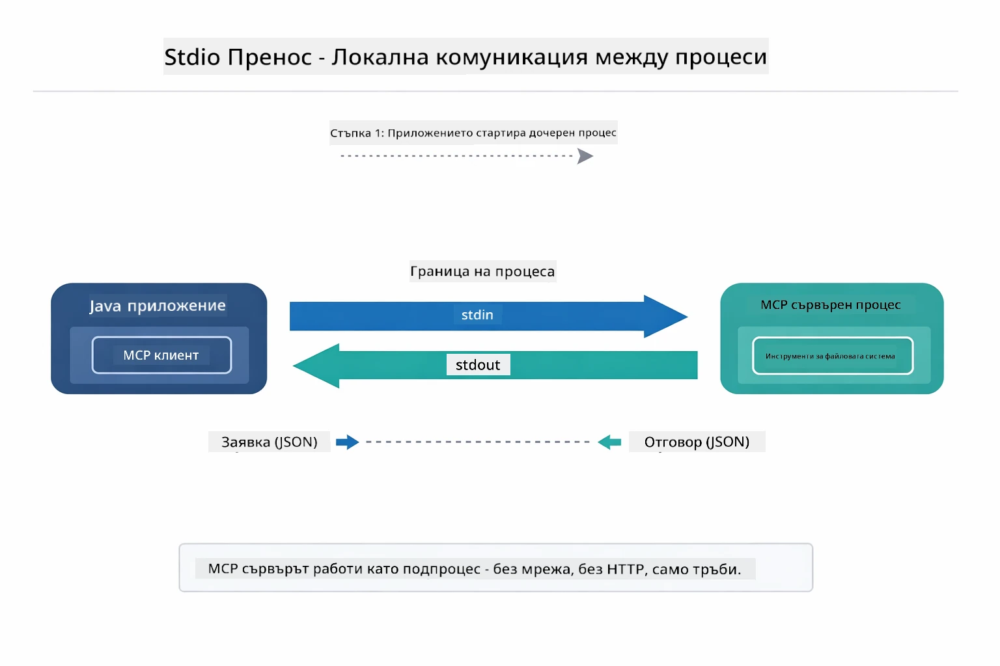

*Stdio транспорт в действие — вашето приложение стартира MCP сървъра като дъщерен процес и комуникира през stdin/stdout канали.*

> **🤖 Опитайте с Chat на [GitHub Copilot](https://github.com/features/copilot):** Отворете [`StdioTransportDemo.java`](../../../05-mcp/src/main/java/com/example/langchain4j/mcp/StdioTransportDemo.java) и попитайте:
> - "Как работи Stdio транспортът и кога да го използвам вместо HTTP?"
> - "Как LangChain4j управлява жизнения цикъл на стартираните MCP сървърни процеси?"
> - "Какви са рисковете за сигурността при даване на ИИ достъп до файловата система?"

## Агенетичният модул

Докато MCP осигурява стандартизирани инструменти, агентният модул на LangChain4j предлага декларативен начин за изграждане на агенти, които оркeстрират тези инструменти. Анотацията `@Agent` и `AgenticServices` ви позволяват да дефинирате поведението на агентите чрез интерфейси, а не чрез императивен код.

В този модул ще проучите модела "Supervisor Agent" — напреднал агентен ИИ подход, където "супервайзор" агент динамично решава кои подагенти да задейства въз основа на потребителските заявки. Ще комбинираме и двете концепции, като предоставим на един от подагентите възможности за достъп до файлове чрез MCP.

За да използвате агентния модул, добавете тази Maven зависимост:

```xml
<dependency>
    <groupId>dev.langchain4j</groupId>
    <artifactId>langchain4j-agentic</artifactId>
    <version>${langchain4j.mcp.version}</version>
</dependency>
```
> **Забележка:** Модулът `langchain4j-agentic` използва отделно свойство за версията (`langchain4j.mcp.version`), защото излиза по различен график от основните библиотеки LangChain4j.

> **⚠️ Експериментално:** Модулът `langchain4j-agentic` е **експериментален** и може да се променя. Стабилният начин за изграждане на ИИ асистенти остава `langchain4j-core` с персонализирани инструменти (Модул 04).

## Стартиране на примерите

### Изисквания

- Да сте завършили [Модул 04 - Инструменти](../04-tools/README.md) (този модул се базира на концепциите за потребителски инструменти и ги сравнява с MCP)
- Файл `.env` в корена на проекта с Azure креденшъли (създаден от `azd up` в Модул 01)
- Java 21+, Maven 3.9+
- Node.js 16+ и npm (за MCP сървъри)

> **Забележка:** Ако още не сте конфигурирали променливите на средата, вижте [Модул 01 - Въведение](../01-introduction/README.md) за инструкции за деплоймент ( `azd up` създава файла `.env` автоматично), или копирайте `.env.example` във `.env` в корена и попълнете вашите стойности.

## Бърз старт

**Използване на VS Code:** Просто кликнете с десния бутон върху някой файл за демонстрация в Explorer и изберете **"Run Java"**, или използвайте конфигурациите за стартиране от панела Run and Debug (преди това уверете се, че файлът `.env` е конфигуриран с Azure креденшъли).

**Използване на Maven:** Алтернативно, можете да стартирате от командния ред със следните примери.

### Операции с файлове (Stdio)

Тук се демонстрират инструменти, базирани на локални подпроцеси.

**✅ Няма нужда от предварителни изисквания** - MCP сървърът се стартира автоматично.

**Използване на стартови скриптове (Препоръчително):**

Стартовите скриптове автоматично зареждат променливите на средата от коренния `.env` файл:

**Bash:**
```bash
cd 05-mcp
chmod +x start-stdio.sh
./start-stdio.sh
```
  
**PowerShell:**
```powershell
cd 05-mcp
.\start-stdio.ps1
```
  
**Използване на VS Code:** Кликнете с десния бутон върху `StdioTransportDemo.java` и изберете **"Run Java"** (уверете се, че файлът `.env` е конфигуриран).

Приложението стартира MCP сървър за файловата система автоматично и чете локален файл. Обърнете внимание как управлението на подпроцеса е автоматизирано.

**Очакван изход:**
```
Assistant response: The file provides an overview of LangChain4j, an open-source Java library
for integrating Large Language Models (LLMs) into Java applications...
```
  
### Supervisor Agent

Моделът **Supervisor Agent** е **гъвкава** форма на агентен ИИ. Супервайзор използва LLM, за да решава автономно кои агенти да задейства въз основа на заявката на потребителя. В следващия пример комбинираме MCP базирания достъп до файлове с LLM агент за създаване на работен процес четене на файл → доклад с надзор.

В демонстрацията, `FileAgent` чете файл използвайки MCP инструменти за файлова система, а `ReportAgent` генерира структуриран доклад с изпълнително резюме (1 изречение), 3 ключови точки и препоръки. Supervisor оркестрира целия поток автоматично:

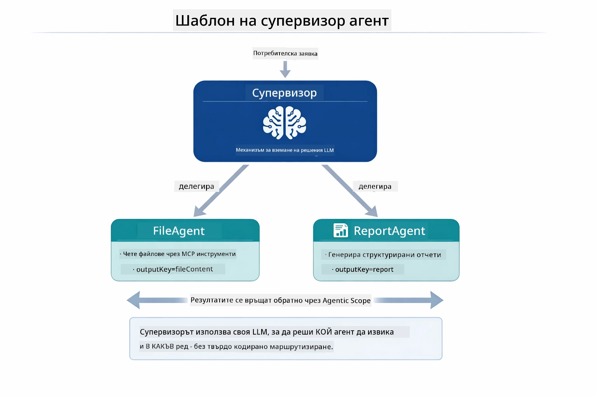

*Supervisor използва своя LLM, за да реши кои агенти да задейства и в какъв ред — без нужда от твърдо кодирано разпределение.*

Ето как изглежда конкретният работен поток за нашата верига файл към доклад:

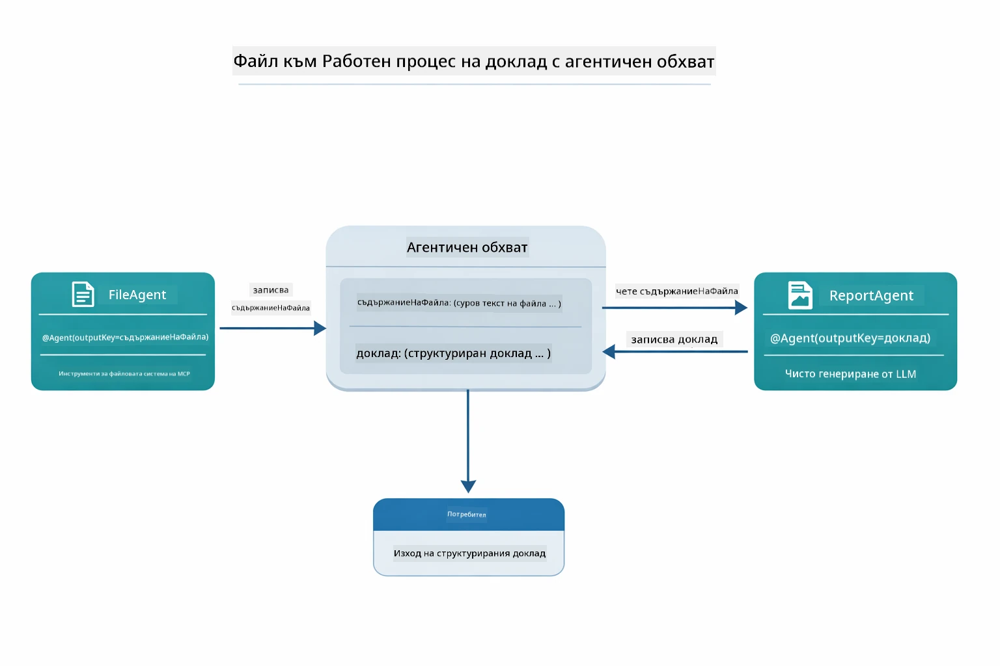

*FileAgent чете файла през MCP инструментите, след което ReportAgent преобразува суровото съдържание в структуриран доклад.*

Следващата диаграма последователно проследява пълната оркестрация на Supervisor — от стартирането на MCP сървъра, през автономния избор на агенти от Supervisor, до повикванията на инструменти през stdio и финалния доклад:

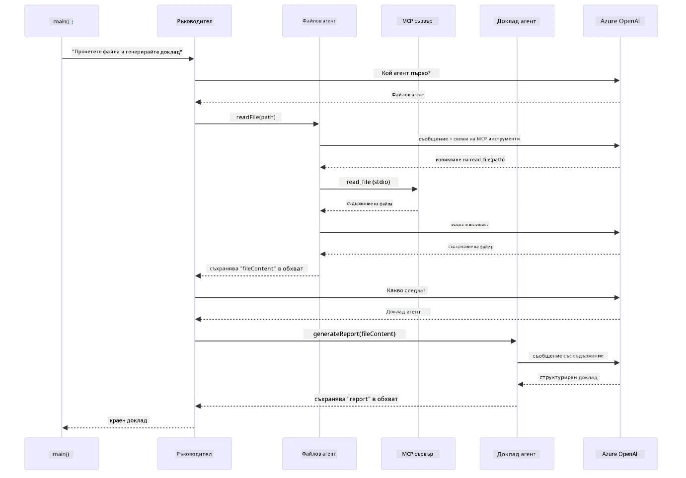

*Supervisor автономно задейства FileAgent (който използва MCP сървъра през stdio за четене на файл), след което задейства ReportAgent за генериране на структуриран доклад — всеки агент запазва своя изход в споделената Agentic Scope.*

Всеки агент запазва изхода си в **Agentic Scope** (споделена памет), което позволява на последващи агенти да използват предишните резултати. Това демонстрира как MCP инструментите се интегрират безпроблемно в агентни работни потоци — Supervisor не трябва да знае *как* се четат файловете, само че `FileAgent` може да го направи.

#### Стартиране на демо

Стартовите скриптове автоматично зареждат променливите на средата от коренния `.env` файл:

**Bash:**
```bash
cd 05-mcp
chmod +x start-supervisor.sh
./start-supervisor.sh
```
  
**PowerShell:**
```powershell
cd 05-mcp
.\start-supervisor.ps1
```
  
**Използване на VS Code:** Кликнете с десния бутон върху `SupervisorAgentDemo.java` и изберете **"Run Java"** (уверете се, че файлът `.env` е конфигуриран).

#### Как работи Supervisor

Преди да изграждате агенти, трябва да свържете MCP транспорта към клиент и да го опаковате като `ToolProvider`. Така инструментите на MCP сървъра стават налични за вашите агенти:

```java
// Създайте MCP клиент от транспорта
McpClient mcpClient = new DefaultMcpClient.Builder()
        .transport(stdioTransport)
        .build();

// Обвийте клиента като ToolProvider — това свързва MCP инструментите с LangChain4j
ToolProvider mcpToolProvider = McpToolProvider.builder()
        .mcpClients(List.of(mcpClient))
        .build();
```
  
Сега можете да инжектирате `mcpToolProvider` във всеки агент, който се нуждае от MCP инструменти:

```java
// Стъпка 1: FileAgent чете файлове с помощта на MCP инструменти
FileAgent fileAgent = AgenticServices.agentBuilder(FileAgent.class)
        .chatModel(model)
        .toolProvider(mcpToolProvider)  // Разполага с MCP инструменти за файлови операции
        .build();

// Стъпка 2: ReportAgent генерира структурирани отчети
ReportAgent reportAgent = AgenticServices.agentBuilder(ReportAgent.class)
        .chatModel(model)
        .build();

// Supervisor координира работния процес файл → отчет
SupervisorAgent supervisor = AgenticServices.supervisorBuilder()
        .chatModel(model)
        .subAgents(fileAgent, reportAgent)
        .responseStrategy(SupervisorResponseStrategy.LAST)  // Връща крайния отчет
        .build();

// Supervisor решава кои агенти да се използват въз основа на заявката
String response = supervisor.invoke("Read the file at /path/file.txt and generate a report");
```
  
#### Как FileAgent открива MCP инструменти по време на работа

Може да се запитате: **как `FileAgent` знае как да използва npm файловите инструменти?** Отговорът е, че не знае – **LLM** разпознава това по време на изпълнение чрез схемите на инструментите.

Интерфейсът `FileAgent` е просто **дефиниция на подканата**. Той няма твърдо кодирано знание за `read_file`, `list_directory` или някой друг MCP инструмент. Ето какво се случва краен-до-краен:
1. **Сървър се стартира:** `StdioMcpTransport` стартира пакета `@modelcontextprotocol/server-filesystem` чрез npm като под-процес  
2. **Откриване на инструменти:** `McpClient` изпраща JSON-RPC заявка `tools/list` към сървъра, който отговаря с имена на инструменти, описания и схеми на параметрите (например `read_file` — *"Прочетете пълното съдържание на файл"* — `{ path: string }`)  
3. **Инжектиране на схема:** `McpToolProvider` обвива тези открити схеми и ги предоставя на LangChain4j  
4. **Решение на LLM:** Когато се извика `FileAgent.readFile(path)`, LangChain4j изпраща системното съобщение, потребителското съобщение и **списъка със схеми на инструментите** към LLM. LLM чете описанията на инструментите и генерира повикване на инструмент (например `read_file(path="/some/file.txt")`)  
5. **Изпълнение:** LangChain4j прихваща повикването на инструмента, маршрутизира го обратно през MCP клиента към Node.js под-процеса, получава резултата и го подава обратно към LLM  

Това е същият механизъм за [Откриване на инструменти](../../../05-mcp), описан по-горе, но приложен конкретно за работния процес на агента. Анотациите `@SystemMessage` и `@UserMessage` насочват поведението на LLM, докато инжектирания `ToolProvider` предоставя **възможностите** — LLM свързва двете по време на изпълнение.

> **🤖 Пробвайте с [GitHub Copilot](https://github.com/features/copilot) Chat:** Отворете [`FileAgent.java`](../../../05-mcp/src/main/java/com/example/langchain4j/mcp/agents/FileAgent.java) и попитайте:  
> - "Как агентът знае кой MCP инструмент да извика?"  
> - "Какво би се случило, ако премахна ToolProvider от агента билдъра?"  
> - "Как схеми на инструментите се подават на LLM?"

#### Стратегии за отговор

Когато конфигурирате `SupervisorAgent`, вие определяте как да формулира своя краен отговор към потребителя, след като под-агентите завършат задачите си. Диаграмата по-долу показва трите налични стратегии — LAST връща директно изхода на последния агент, SUMMARY синтезира всички изходи чрез LLM, а SCORED избира този с по-висока оценка спрямо първоначалната заявка:

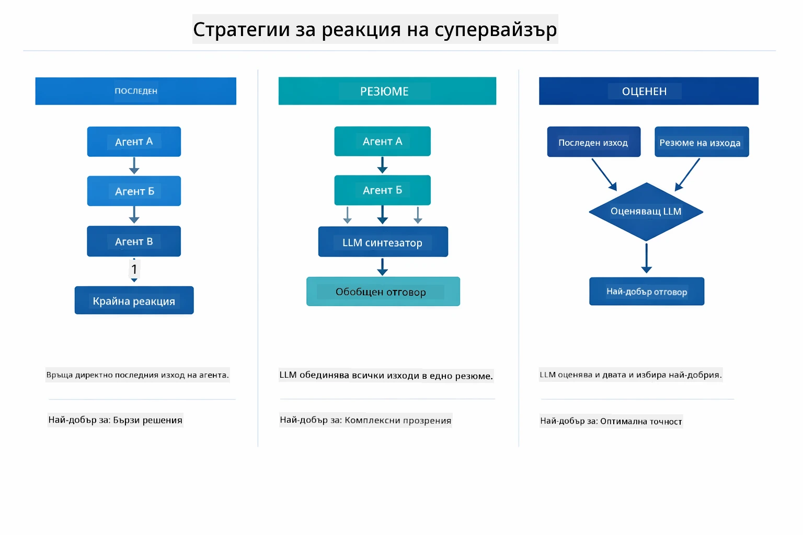

*Три стратегии за начина, по който Supervisor формулира финалния си отговор — изберете според това дали искате изхода на последния агент, синтезираното обобщение или най-добре оценената опция.*

Наличните стратегии са:

| Стратегия | Описание |
|----------|-------------|
| **LAST** | Супервайзърът връща изхода на последния извикан под-агент или инструмент. Това е полезно, когато крайната агенция в работния процес е специално проектирана да произвежда пълен, краен отговор (например "Агент за обобщение" в изследователски конвейер). |
| **SUMMARY** | Супервайзърът използва собствен вътрешен езиков модел (LLM), за да синтезира обобщение на цялото взаимодействие и всички изходи на под-агенти и след това връща това обобщение като окончателен отговор. Това осигурява ясен, агрегиращ отговор към потребителя. |
| **SCORED** | Системата използва вътрешен LLM, за да оцени както отговора LAST, така и SUMMARY спрямо първоначалната потребителска заявка, връщайки този изход, който получи по-висок резултат. |

Вижте [SupervisorAgentDemo.java](../../../05-mcp/src/main/java/com/example/langchain4j/mcp/SupervisorAgentDemo.java) за пълната имплементация.

> **🤖 Пробвайте с [GitHub Copilot](https://github.com/features/copilot) Chat:** Отворете [`SupervisorAgentDemo.java`](../../../05-mcp/src/main/java/com/example/langchain4j/mcp/SupervisorAgentDemo.java) и попитайте:  
> - "Как Супервайзърът решава кои агенти да извика?"  
> - "Каква е разликата между Supervisor и последователния (Sequential) работен процес?"  
> - "Как мога да персонализирам поведението на планиране на Супервайзъра?"

#### Разбиране на изхода

Когато стартирате демото, ще видите структурирана презентация на това как Супервайзърът оркестрира множество агенти. Ето какво означава всеки раздел:

```
======================================================================
  FILE → REPORT WORKFLOW DEMO
======================================================================

This demo shows a clear 2-step workflow: read a file, then generate a report.
The Supervisor orchestrates the agents automatically based on the request.
```
  
**Заглавието** представя концепцията за работния процес: фокусиран конвейер от четене на файлове до генериране на отчет.

```
--- WORKFLOW ---------------------------------------------------------
  ┌─────────────┐      ┌──────────────┐
  │  FileAgent  │ ───▶ │ ReportAgent  │
  │ (MCP tools) │      │  (pure LLM)  │
  └─────────────┘      └──────────────┘
   outputKey:           outputKey:
   'fileContent'        'report'

--- AVAILABLE AGENTS -------------------------------------------------
  [FILE]   FileAgent   - Reads files via MCP → stores in 'fileContent'
  [REPORT] ReportAgent - Generates structured report → stores in 'report'
```
  
**Диаграма на работния процес** показва потока на данни между агентите. Всеки агент има специфична роля:  
- **FileAgent** чете файлове чрез MCP инструменти и съхранява суровото съдържание в `fileContent`  
- **ReportAgent** използва това съдържание и генерира структуриран отчет в `report`

```
--- USER REQUEST -----------------------------------------------------
  "Read the file at .../file.txt and generate a report on its contents"
```
  
**Потребителска заявка** показва задачата. Супервайзърът я анализира и решава да извика FileAgent → ReportAgent.

```
--- SUPERVISOR ORCHESTRATION -----------------------------------------
  The Supervisor decides which agents to invoke and passes data between them...

  +-- STEP 1: Supervisor chose -> FileAgent (reading file via MCP)
  |
  |   Input: .../file.txt
  |
  |   Result: LangChain4j is an open-source, provider-agnostic Java framework for building LLM...
  +-- [OK] FileAgent (reading file via MCP) completed

  +-- STEP 2: Supervisor chose -> ReportAgent (generating structured report)
  |
  |   Input: LangChain4j is an open-source, provider-agnostic Java framew...
  |
  |   Result: Executive Summary...
  +-- [OK] ReportAgent (generating structured report) completed
```
  
**Оркестрация от Супервайзъра** показва двустъпковия процес на действие:  
1. **FileAgent** чете файла чрез MCP и съхранява съдържанието  
2. **ReportAgent** получава съдържанието и генерира структуриран отчет  

Супервайзърът взе тези решения **автономно** въз основа на заявката на потребителя.

```
--- FINAL RESPONSE ---------------------------------------------------
Executive Summary
...

Key Points
...

Recommendations
...

--- AGENTIC SCOPE (Data Flow) ----------------------------------------
  Each agent stores its output for downstream agents to consume:
  * fileContent: LangChain4j is an open-source, provider-agnostic Java framework...
  * report: Executive Summary...
```
  
#### Обяснение на функциите на агенцкия модул

Примерът демонстрира няколко напреднали функции на агенцкия модул. Нека разгледаме по-отблизо Agentic Scope и Agent Listeners.

**Agentic Scope** показва споделената памет, където агентите съхраняват резултатите си с помощта на `@Agent(outputKey="...")`. Това позволява:  
- По-късни агенти да достъпват изходите на предишните  
- Супервайзъра да синтезира краен отговор  
- Вие да инспектирате какво е произвел всеки агент  

Диаграмата по-долу показва как Agentic Scope работи като споделена памет в работния процес от файл към отчет — FileAgent записва изхода си под ключа `fileContent`, ReportAgent го чете и записва своя изход под `report`:

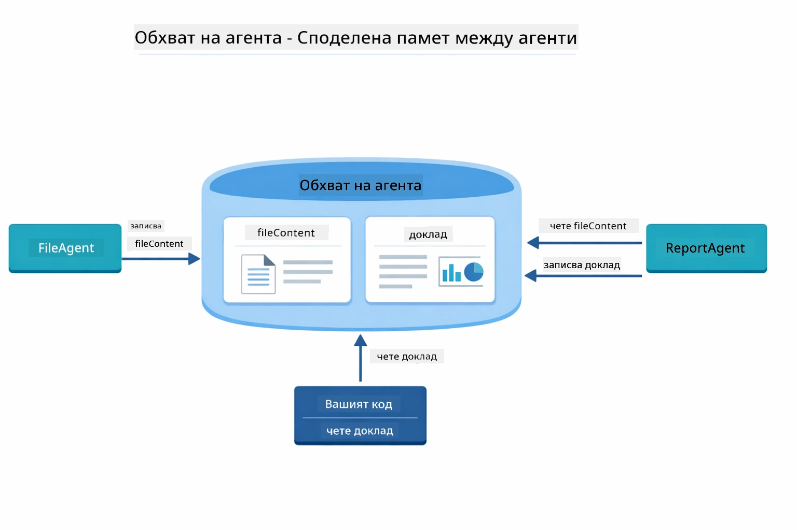

*Agentic Scope действа като споделена памет — FileAgent записва `fileContent`, ReportAgent го чете и записва `report`, а вашият код чете крайния резултат.*

```java
ResultWithAgenticScope<String> result = supervisor.invokeWithAgenticScope(request);
AgenticScope scope = result.agenticScope();
String fileContent = scope.readState("fileContent");  // Сурови данни от файл от FileAgent
String report = scope.readState("report");            // Структуриран доклад от ReportAgent
```
  
**Agent Listeners** позволяват наблюдение и отстраняване на грешки при изпълнението на агентите. Стъпка по стъпка изходът, който виждате в демото, идва от AgentListener, който се включва във всяко извикване на агент:  
- **beforeAgentInvocation** — извиква се, когато Супервайзърът избере агент, позволявайки ви да видите кой агент е избран и защо  
- **afterAgentInvocation** — извиква се, когато агент завърши, като показва неговия резултат  
- **inheritedBySubagents** — когато е true, слушателят наблюдава всички агенти в йерархията  

Следващата диаграма показва пълния жизнен цикъл на Agent Listener, включително как `onError` обработва грешки по време на изпълнение на агент:

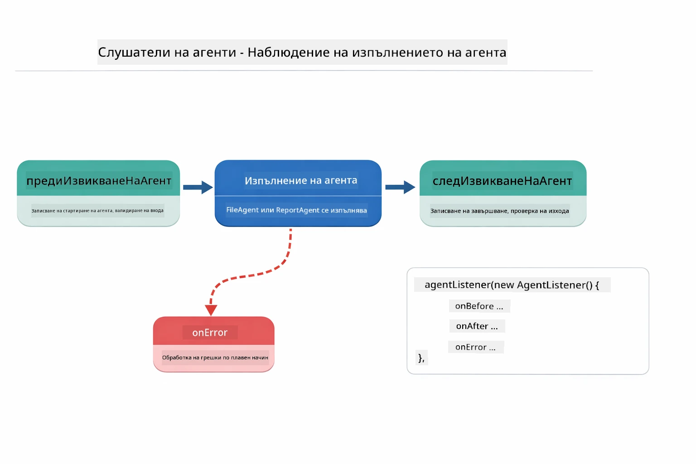

*Agent Listeners се включват в жизнения цикъл на изпълнение — наблюдават кога агенти стартират, завършват или срещат грешки.*

```java
AgentListener monitor = new AgentListener() {
    private int step = 0;
    
    @Override
    public void beforeAgentInvocation(AgentRequest request) {
        step++;
        System.out.println("  +-- STEP " + step + ": " + request.agentName());
    }
    
    @Override
    public void afterAgentInvocation(AgentResponse response) {
        System.out.println("  +-- [OK] " + response.agentName() + " completed");
    }
    
    @Override
    public boolean inheritedBySubagents() {
        return true; // Разпространете към всички подагенти
    }
};
```
  
Освен патерна Supervisor, модулът `langchain4j-agentic` предоставя няколко мощни работни процеса. Диаграмата по-долу показва всички пет — от прости последователни конвейери до работни процеси с човешко участие за одобрение:

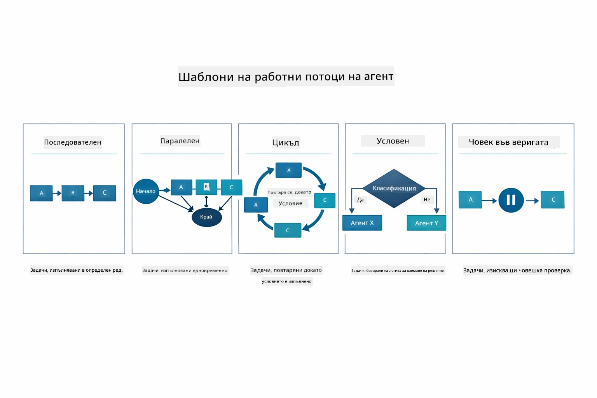

*Пет работни патерна за оркестрация на агенти — от прости последователни конвейери до работни процеси с човешки контрол.*

| Патерн | Описание | Пример за употреба |
|---------|-------------|----------|
| **Sequential** | Изпълнение на агентите по ред, изходът преминава към следващия | Конвейери: изследване → анализ → отчет |
| **Parallel** | Стартиране на агентите едновременно | Независими задачи: прогноза за времето + новини + акции |
| **Loop** | Итерация докато се изпълни условие | Оценка на качество: подобрение докато оценката ≥ 0.8 |
| **Conditional** | Маршрутизиране на базата на условия | Класифициране → насочване към специализиран агент |
| **Human-in-the-Loop** | Включване на човешки чекпойнти | Работни процеси за одобрение, преглед на съдържание |

## Основни концепции

След като разгледахте MCP и агенцкия модул в действие, нека обобщим кога да използвате всеки подход.

Едно от най-големите предимства на MCP е разрастващата се екосистема. Диаграмата по-долу показва как един универсален протокол свързва вашето AI приложение с широка гама MCP сървъри — от достъп до файлови системи и бази данни до GitHub, имейл, уеб скрейпинг и други:

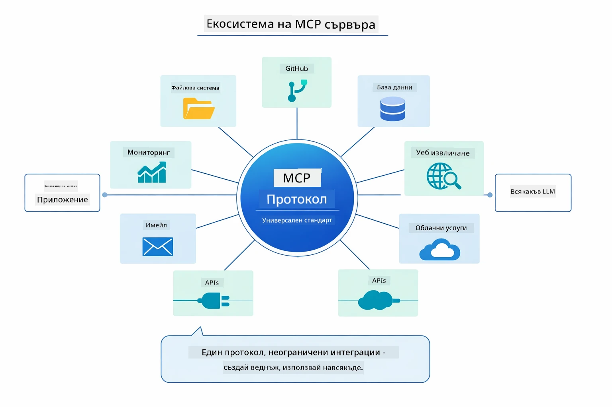

*MCP създава екосистема с универсален протокол — всеки MCP-съвместим сървър работи с всеки MCP-съвместим клиент, позволявайки споделяне на инструменти между приложения.*

**MCP** е идеален, когато искате да използвате съществуващи екосистеми от инструменти, да създавате инструменти, които могат да бъдат споделяни между множество приложения, да интегрирате услуги на трети страни със стандартни протоколи или да сменяте реализации на инструменти без промяна на кода.

**Агенцкият модул** действа най-добре, когато желаете декларативни дефиниции на агенти с анотации `@Agent`, имате нужда от оркестрация на работен процес (последователен, цикличен, паралелен), предпочитате базиран на интерфейс дизайн на агентите пред императивен код или комбинирате множество агенти, които споделят изходи чрез `outputKey`.

**Патернът Supervisor Agent** изпъква, когато работният процес не е предвидим предварително и искате LLM да вземе решението, когато имате множество специализирани агенти, които трябва да бъдат динамично оркестрирани, когато изграждате разговорни системи, насочващи към различни възможности, или когато искате най-гъвкавото и адаптивно поведение на агентите.

За да ви помогнем да изберете между потребителските методи `@Tool` от Модул 04 и MCP инструментите от този модул, следната сравнителна таблица подчертава ключовите компромиси — потребителските инструменти ви дават плътна връзка и пълна типова сигурност за специфична за приложението логика, докато MCP инструментите предлагат стандартизирани, многократно използваеми интеграции:

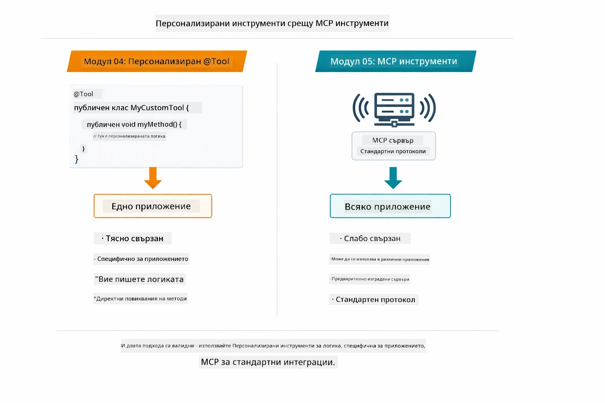

*Кога да използвате потребителски @Tool методи срещу MCP инструменти — потребителските инструменти са за специфика на приложението с пълна типова сигурност, MCP инструментите са за стандартизирани интеграции, които работят в различни приложения.*

## Поздравления!

Преминахте през всичките пет модула на курса LangChain4j за начинаещи! Ето преглед на целия учебен път, който завършихте — от базов чат до агенцки системи с MCP:

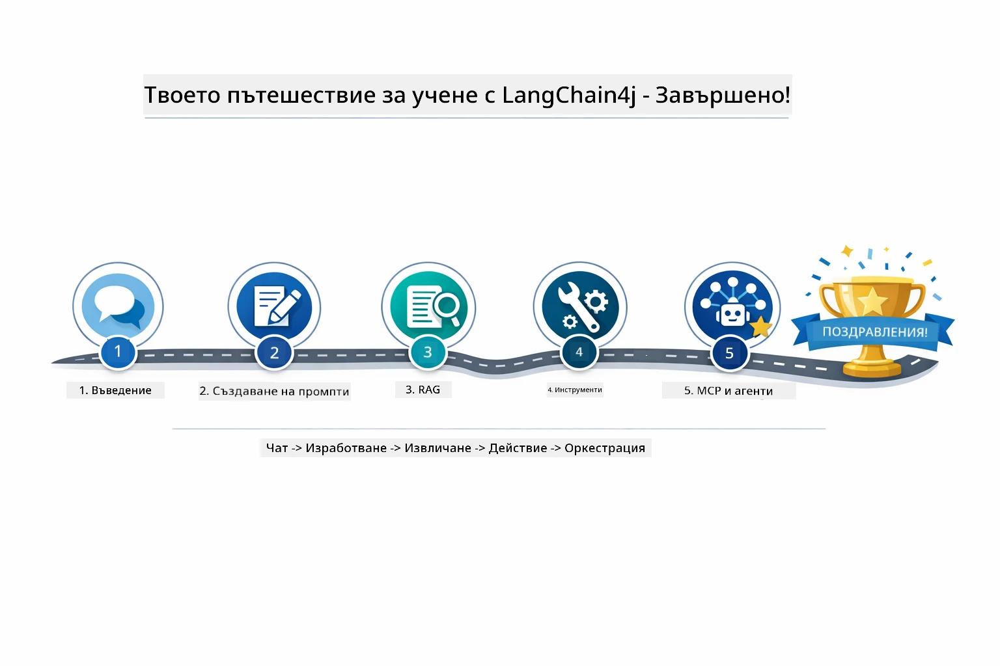

*Вашият учебен път през всичките пет модула — от базов чат до агенцки системи, захранвани с MCP.*

Завършихте курса LangChain4j за начинаещи. Научихте:  

- Как да изграждате разговорен AI с памет (Модул 01)  
- Патерни за инженерство на заявки за различни задачи (Модул 02)  
- Закотвяне на отговори в документите ви с RAG (Модул 03)  
- Създаване на базови AI агенти (асистенти) с потребителски инструменти (Модул 04)  
- Интегриране на стандартизирани инструменти с LangChain4j MCP и агенцкия модул (Модул 05)  

### Какво следва?

След завършване на модулите разгледайте [Ръководството за тестове](../docs/TESTING.md), за да видите концепциите за тестване в LangChain4j на практика.

**Официални ресурси:**  
- [LangChain4j Документация](https://docs.langchain4j.dev/) - Изчерпателни ръководства и API референции  
- [LangChain4j GitHub](https://github.com/langchain4j/langchain4j) - Изходен код и примери  
- [LangChain4j Уроци](https://docs.langchain4j.dev/tutorials/) - Стъпка по стъпка уроци за различни случаи на употреба  

Благодарим ви, че завършихте този курс!

---

**Навигация:** [← Предишен: Модул 04 - Инструменти](../04-tools/README.md) | [Обратно към Началото](../README.md)

---

<!-- CO-OP TRANSLATOR DISCLAIMER START -->
**Отказ от отговорност**:  
Този документ е преведен с помощта на AI преводаческия сервис [Co-op Translator](https://github.com/Azure/co-op-translator). Въпреки че се стремим към точност, моля, имайте предвид, че автоматизираните преводи могат да съдържат грешки или неточности. Оригиналният документ на неговия роден език трябва да се счита за авторитетен източник. За критична информация се препоръчва професионален човешки превод. Ние не носим отговорност за никакви неразбирателства или неправилни тълкувания, възникнали от използването на този превод.
<!-- CO-OP TRANSLATOR DISCLAIMER END -->