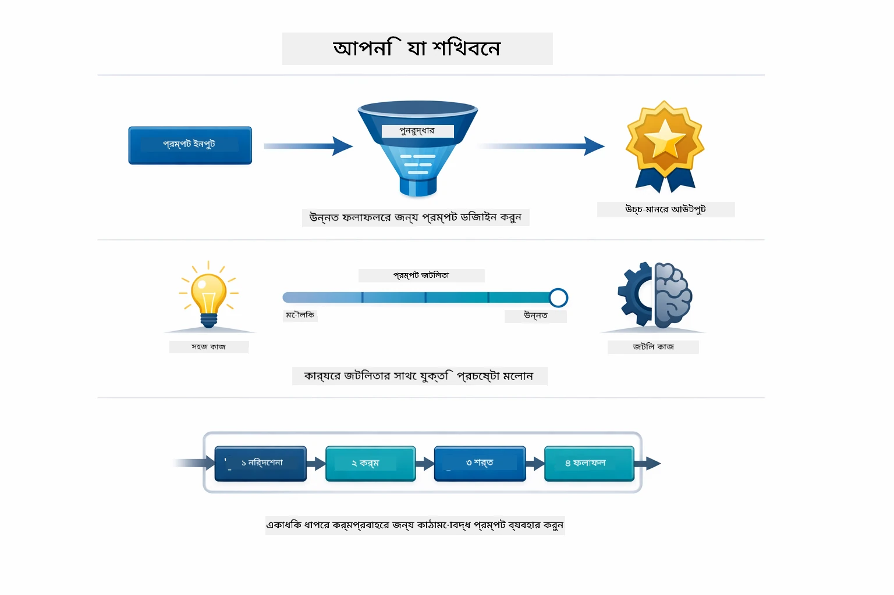
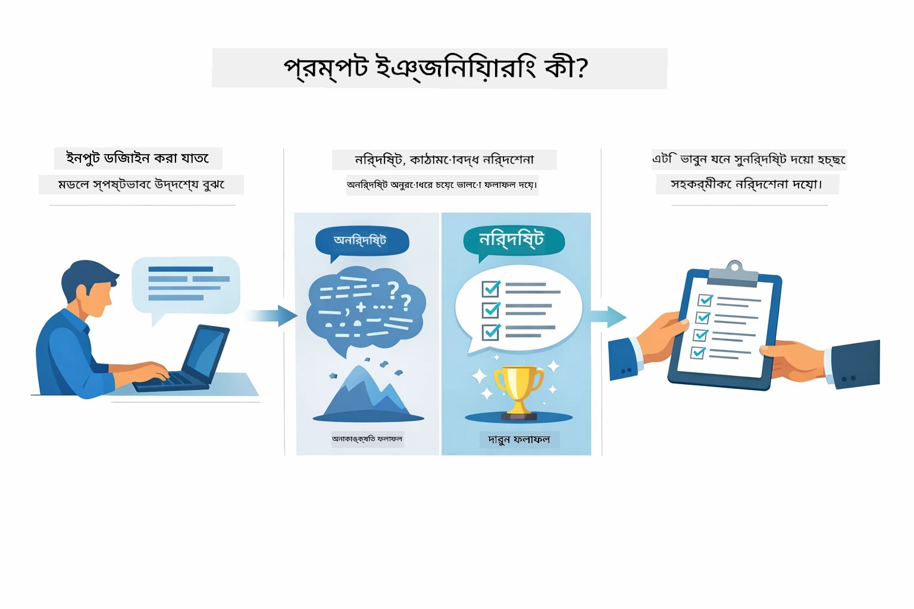
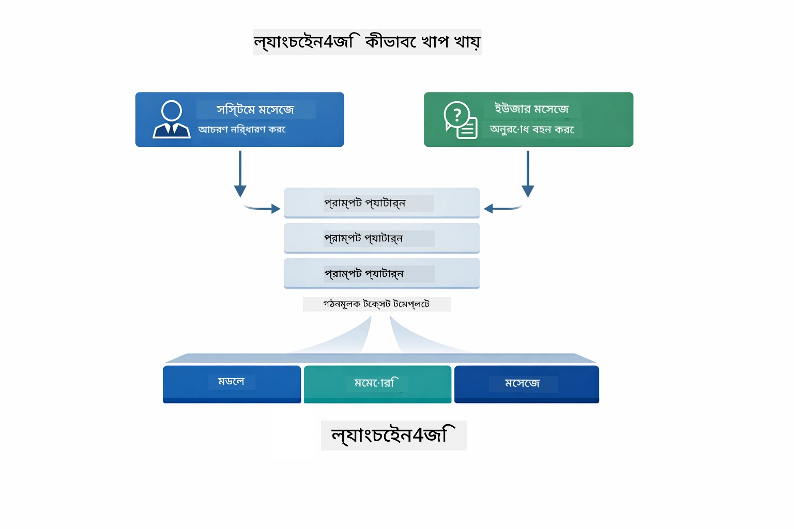
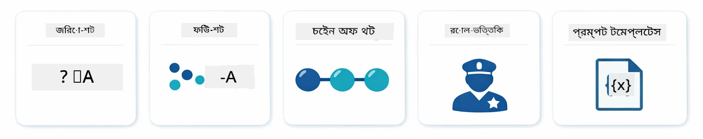
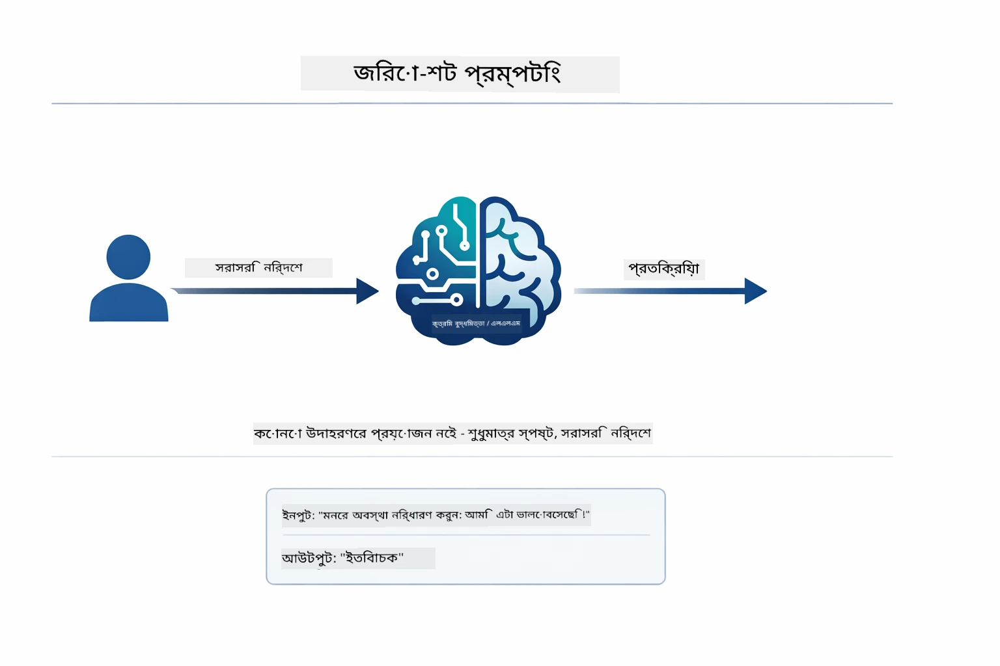
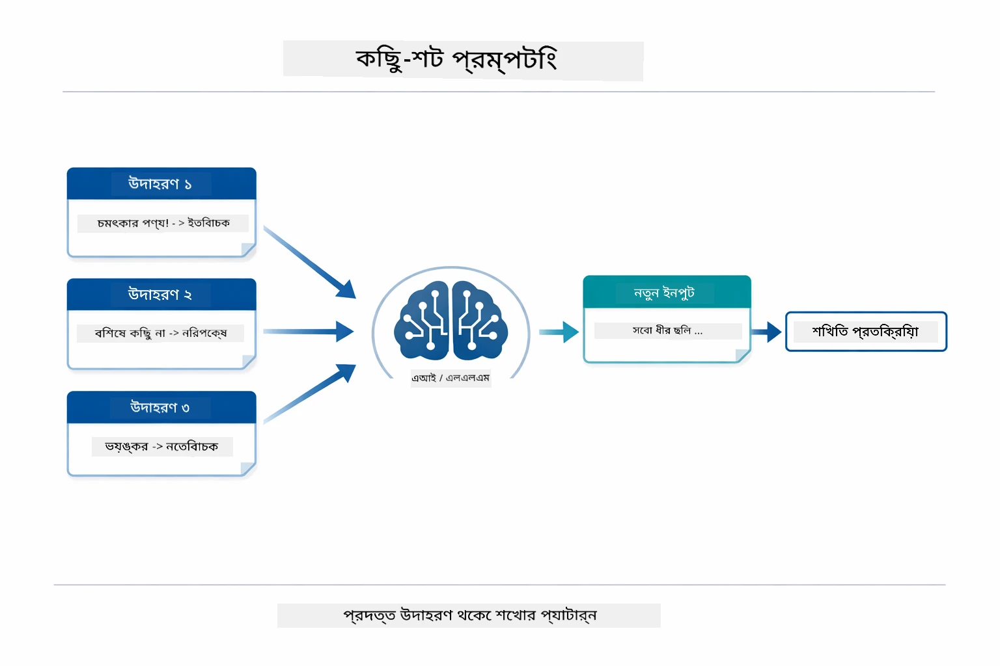
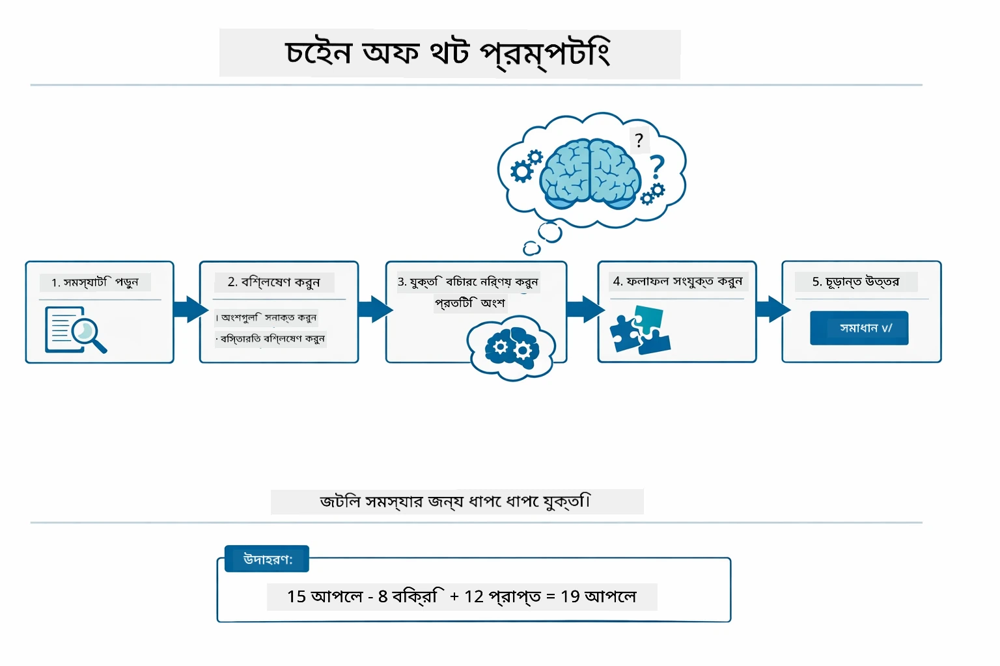
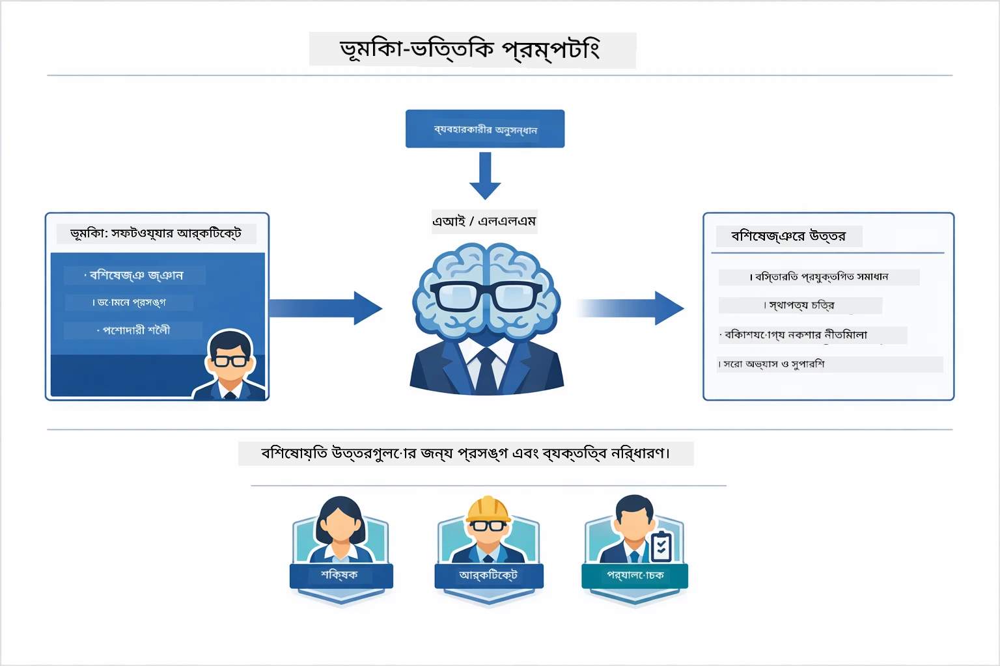
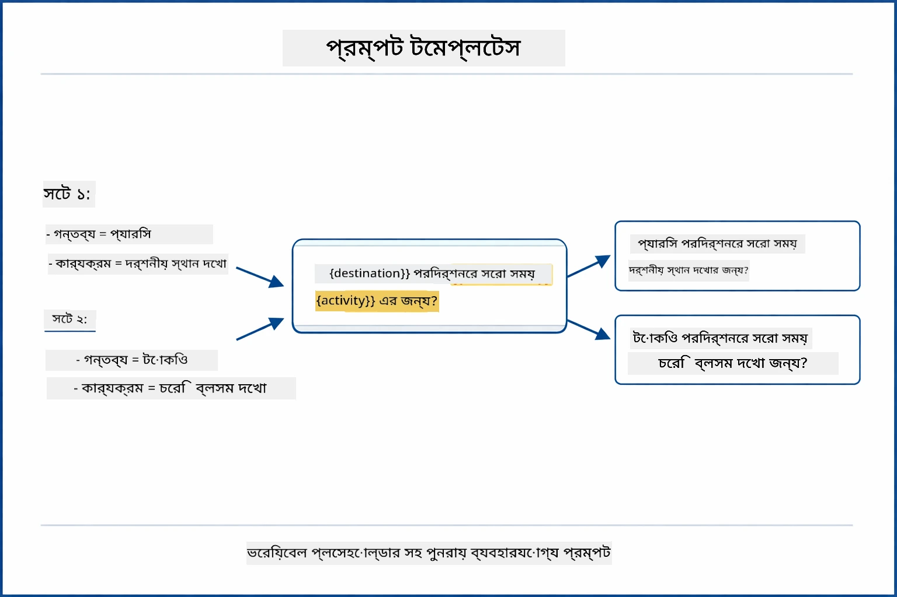
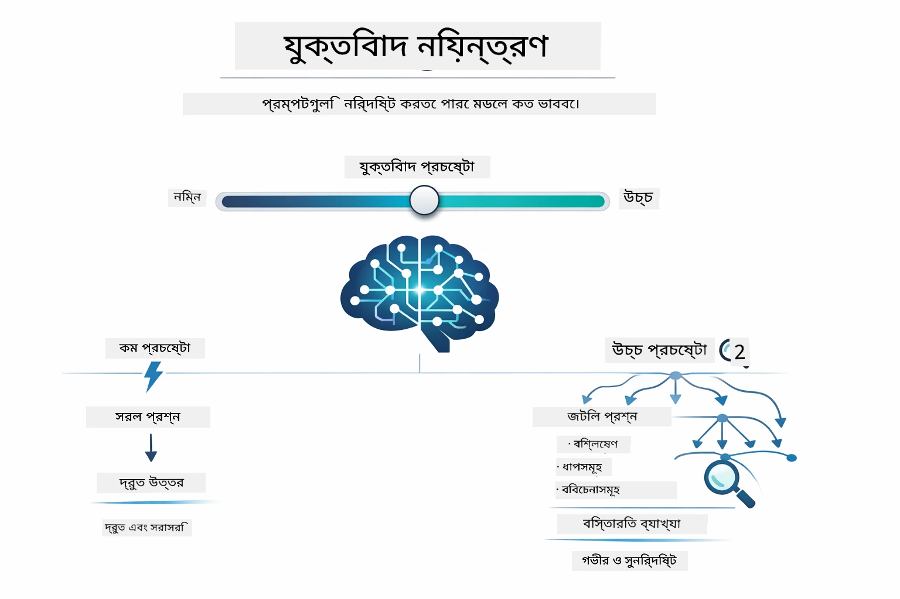

# Module 02: GPT-5.2 এর সাথে প্রম্পট ইঞ্জিনিয়ারিং

## সূচিপত্র

- [ভিডিও ওয়াকথ্রু](../../../02-prompt-engineering)
- [আপনি যা শিখবেন](../../../02-prompt-engineering)
- [পূর্বশর্তাবলি](../../../02-prompt-engineering)
- [প্রম্পট ইঞ্জিনিয়ারিং বোঝা](../../../02-prompt-engineering)
- [প্রম্পট ইঞ্জিনিয়ারিং এর মৌলিক বিষয়সমূহ](../../../02-prompt-engineering)
  - [জিরো-শট প্রম্পটিং](../../../02-prompt-engineering)
  - [ফিউ-শট প্রম্পটিং](../../../02-prompt-engineering)
  - [চেইন অফ থট](../../../02-prompt-engineering)
  - [রোল-ভিত্তিক প্রম্পটিং](../../../02-prompt-engineering)
  - [প্রম্পট টেমপ্লেটস](../../../02-prompt-engineering)
- [এডভান্সড প্যাটার্নস](../../../02-prompt-engineering)
- [বিদ্যমান Azure সম্পদ ব্যবহার](../../../02-prompt-engineering)
- [অ্যাপ্লিকেশন স্ক্রিনশট](../../../02-prompt-engineering)
- [প্যাটার্নগুলি অন্বেষণ](../../../02-prompt-engineering)
  - [কম বনাম বেশি উৎসুকতা](../../../02-prompt-engineering)
  - [টাস্ক এক্সিকিউশন (টুল প্রীএম্বেলস)](../../../02-prompt-engineering)
  - [স্ব-পর্যালোচনামূলক কোড](../../../02-prompt-engineering)
  - [সংগঠিত বিশ্লেষণ](../../../02-prompt-engineering)
  - [মাল্টি-টার্ন চ্যাট](../../../02-prompt-engineering)
  - [পদক্ষেপ-অনুসারে যুক্তি](../../../02-prompt-engineering)
  - [নির্ধারিত আউটপুট](../../../02-prompt-engineering)
- [আপনি আসলেই যা শিখছেন](../../../02-prompt-engineering)
- [পরবর্তী ধাপ](../../../02-prompt-engineering)

## ভিডিও ওয়াকথ্রু

এই লাইভ সেশন দেখুন যা বোঝায় কিভাবে এই মডিউল শুরু করবেন: [Prompt Engineering with LangChain4j - Live Session](https://www.youtube.com/live/PJ6aBaE6bog?si=LDshyBrTRodP-wke)

## আপনি যা শিখবেন



পূর্ববর্তী মডিউলে, আপনি দেখেছেন কিভাবে মেমোরি কথোপকথনমূলক AI কে সক্ষম করে এবং গিটহাব মডেল ব্যবহার করে মৌলিক ইন্টারঅ্যাকশন করা যায়। এখন আমরা ফোকাস করব আপনি যেভাবে প্রশ্ন করবেন — অর্থাৎ প্রম্পটগুলো — Azure OpenAI এর GPT-5.2 ব্যবহার করে। আপনি কিভাবে প্রম্পট গঠন করবেন তা প্রাপ্ত উত্তরগুলোর গুণগত মানে ব্যাপক প্রভাব ফেলে। আমরা শুরু করব মৌলিক প্রম্পটিং কৌশলগুলি পুনরালোচনা দিয়ে, তারপর এগোবো আটটি উন্নত প্যাটার্নের দিকে যা GPT-5.2 এর ক্ষমতাসমূহ সম্পূর্ণরূপে ব্যবহার করে।

আমরা GPT-5.2 ব্যবহার করব কারণ এটি যুক্তি নিয়ন্ত্রণ পরিচয়ে আনে - আপনি মডেলকে বলতে পারেন উত্তর দেওয়ার আগে কতটুকু চিন্তা করতে হবে। এতে বিভিন্ন প্রম্পটিং কৌশল স্পষ্ট হয় এবং আপনি বুঝতে পারবেন কখন কোন পদ্ধতি ব্যবহার করবেন। এছাড়াও, Azure-এর GPT-5.2 এর জন্য GitHub মডেলের তুলনায় কম রেট লিমিট থাকা থেকে আমরা উপকৃত হব।

## পূর্বশর্তাবলি

- মডিউল 01 সম্পন্ন হয়েছে (Azure OpenAI সম্পদ স্থাপন করা হয়েছে)
- `.env` ফাইল রুট ডিরেক্টরিতে Azure ক্রেডেনশিয়াল সহ (মডিউল 01 এর `azd up` দ্বারা তৈরি)

> **নোট:** যদি আপনি মডিউল 01 সম্পন্ন না করে থাকেন, প্রথমে সেখানে থাকা স্থাপন নির্দেশাবলী অনুসরণ করুন।

## প্রম্পট ইঞ্জিনিয়ারিং বোঝা



প্রম্পট ইঞ্জিনিয়ারিং হল এমন ইনপুট টেক্সট ডিজাইন করা যা ধারাবাহিকভাবে আপনাকে প্রয়োজনীয় ফলাফল দেয়। এটি কেবল প্রশ্ন করা নয় - এটি এমনভাবে অনুরোধ গঠন করা যাতে মডেল নির্দিষ্টভাবে বুঝতে পারে আপনি কি চান এবং কিভাবে তা প্রদান করতে হবে।

একজন সহকর্মীকে নির্দেশ দেওয়ার মতো ভাবুন। "বাগটি ঠিক কর" অস্পষ্ট। "UserService.java এর লাইন ৪৫-এ null pointer exception ফিক্স করতে null check যোগ কর" নির্দিষ্ট। ভাষাগত মডেলগুলো একই রকম - নির্দিষ্টতা ও গঠন গুরুত্বপূর্ণ।



LangChain4j প্রদান করে অবকাঠামো — মডেল সংযোগ, মেমোরি, এবং মেসেজ টাইপ — যেহেতু প্রম্পট প্যাটার্নস শুধু সতর্কভাবে গঠিত টেক্সট যা ঐ অবকাঠামোর মাধ্যমে পাঠানো হয়। মূল নির্মাণ ব্লকগুলো হল `SystemMessage` (যা AI এর আচরণ ও ভূমিকা নির্ধারণ করে) এবং `UserMessage` (যা আপনার আসল অনুরোধ বহন করে)।

## প্রম্পট ইঞ্জিনিয়ারিং এর মৌলিক বিষয়সমূহ



এই মডিউলের উন্নত প্যাটার্নগুলোর মধ্যে প্রবেশ করার আগে, আসুন পাঁচটি মৌলিক প্রম্পটিং কৌশল পুনরালোচনা করি। এগুলো হলো মূল ভিত্তি যা প্রতিটি প্রম্পট ইঞ্জিনিয়ারকে জানা উচিত। আপনি যদি ইতোমধ্যে [Quick Start মডিউল](../00-quick-start/README.md#2-prompt-patterns) করেছেন, তাহলে এগুলো কাজের মধ্যে দেখেছেন — এখানে তাদের পিছনের ধারণামূলক কাঠামো রয়েছে।

### জিরো-শট প্রম্পটিং

সবচেয়ে সহজ পন্থা: মডেলকে কোনো উদাহরণের ছাড়া সরাসরি নির্দেশ দিন। মডেল সম্পূর্ণরূপে তার প্রশিক্ষণের ওপর নির্ভর করে কাজটা বুঝে এবং সম্পাদন করে। সরল অনুরোধের ক্ষেত্রে এটি ভালো কাজ করে যেখানে প্রত্যাশিত আচরণ স্পষ্ট।



*উদাহরণ ছাড়া সরাসরি নির্দেশ — মডেল শুধু নির্দেশ থেকে কাজ অনুমান করে*

```java
String prompt = "Classify this sentiment: 'I absolutely loved the movie!'";
String response = model.chat(prompt);
// উত্তর: "ইতিবাচক"
```

**কখন ব্যবহার করবেন:** সহজ শ্রেণীবিভাগ, সরাসরি প্রশ্ন, অনুবাদ, অথবা এমন কোনো কাজ যেখানে অতিরিক্ত নির্দেশনার প্রয়োজন হয় না।

### ফিউ-শট প্রম্পটিং

আপনার কাঙ্ক্ষিত প্যাটার্ন মডেলকে শেখানোর জন্য উদাহরণ দিন। মডেল আপনার উদাহরণ থেকে ইনপুট-আউটপুট বিন্যাস শেখে এবং নতুন ইনপুটে তা প্রয়োগ করে। এটি নিরবিচ্ছিন্নতা বাড়ায় যেখানে কাঙ্ক্ষিত বিন্যাস বা আচরণ স্পষ্ট নয়।



*উদাহরণ থেকে শেখা — মডেল প্যাটার্ন চিনে নিয়ে নতুন ইনপুটে প্রয়োগ করে*

```java
String prompt = """
    Classify the sentiment as positive, negative, or neutral.
    
    Examples:
    Text: "This product exceeded my expectations!" → Positive
    Text: "It's okay, nothing special." → Neutral
    Text: "Waste of money, very disappointed." → Negative
    
    Now classify this:
    Text: "Best purchase I've made all year!"
    """;
String response = model.chat(prompt);
```

**কখন ব্যবহার করবেন:** নিজস্ব শ্রেণীবিভাগ, সঙ্গতিপূর্ণ বিন্যাস, ডোমেন-নির্দিষ্ট কাজ, অথবা যখন জিরো-শট ফলাফল অনিমাণ।

### চেইন অফ থট

মডেলকে বলতে পারেন ধাপে ধাপে তার যুক্তি প্রদর্শন করতে। সরাসরি উত্তর দেওয়ার পরিবর্তে মডেল সমস্যা ভেঙে নিয়ে প্রতিটি অংশ স্পষ্টভাবে কাজ করে। এটি গাণিতিক, লজিক্যাল, এবং বহুতরঙ্গ যুক্তির কাজে নির্ভুলতা বাড়ায়।



*পদক্ষেপ-অনুসারে যুক্তি — জটিল সমস্যা বিশ্লেষণ করে স্পষ্ট যুক্তিবদ্ধ ধাপগুলো দেখানো*

```java
String prompt = """
    Problem: A store has 15 apples. They sell 8 apples and then 
    receive a shipment of 12 more apples. How many apples do they have now?
    
    Let's solve this step-by-step:
    """;
String response = model.chat(prompt);
// মডেলটি দেখায়: ১৫ - ৮ = ৭, তারপর ৭ + ১২ = ১৯টি আপেল
```

**কখন ব্যবহার করবেন:** গাণিতিক সমস্যা, যুক্তি ধাঁধা, ডিবাগিং, অথবা এমন কোনো কাজ যেখানে যুক্তি প্রদর্শন নির্ভুলতা ও বিশ্বাসযোগ্যতা বাড়ায়।

### রোল-ভিত্তিক প্রম্পটিং

আপনার প্রশ্নের আগে AI এর জন্য একটি চরিত্র বা ভূমিকা নির্ধারণ করুন। এটি এমন প্রসঙ্গ প্রদান করে যা উত্তরের টোন, গভীরতা, এবং ফোকাস গঠন করে। "সফটওয়্যার আর্কিটেক্ট" "জুনিয়র ডেভেলপার" বা "সিকিউরিটি অডিটর"-এর থেকে ভিন্ন পরামর্শ দেয়।



*প্রসঙ্গ এবং ব্যক্তিত্ব নির্ধারণ — একই প্রশ্নের উত্তরে ভূমিকা অনুসারে পার্থক্য আসে*

```java
String prompt = """
    You are an experienced software architect reviewing code.
    Provide a brief code review for this function:
    
    def calculate_total(items):
        total = 0
        for item in items:
            total = total + item['price']
        return total
    """;
String response = model.chat(prompt);
```

**কখন ব্যবহার করবেন:** কোড পর্যালোচনা, টিউটোরিয়াল, ডোমেন-নির্দিষ্ট বিশ্লেষণ, অথবা যখন নির্দিষ্ট দক্ষতা বা দৃষ্টিভঙ্গির জন্য উত্তর প্রয়োজন।

### প্রম্পট টেমপ্লেটস

ভেরিয়েবল প্লেসহোল্ডার সহ পুনঃব্যবহারযোগ্য প্রম্পট তৈরি করুন। প্রতিবার নতুন প্রম্পট লেখার পরিবর্তে একবার টেমপ্লেট সংজ্ঞায়িত করুন এবং বিভিন্ন মান পূরণ করুন। LangChain4j এর `PromptTemplate` ক্লাস এটি সহজ করে `{{variable}}` সিনট্যাক্স দিয়ে।



*প্লেসহোল্ডার সহ পুনঃব্যবহারযোগ্য প্রম্পট — একই টেমপ্লেট, অনেকবার ব্যবহার*

```java
PromptTemplate template = PromptTemplate.from(
    "What's the best time to visit {{destination}} for {{activity}}?"
);

Prompt prompt = template.apply(Map.of(
    "destination", "Paris",
    "activity", "sightseeing"
));

String response = model.chat(prompt.text());
```

**কখন ব্যবহার করবেন:** ভিন্ন ইনপুট সহ বারবার প্রশ্ন, ব্যাচ প্রসেসিং, পুনরায় ব্যবহারযোগ্য AI ওয়ার্কফ্লো নির্মাণ, অথবা যেকোনো ক্ষেত্রে যেখানে প্রম্পট কাঠামো একই থাকে কিন্তু ডেটা পরিবর্তিত হয়।

---

এই পাঁচটি মৌলিক কৌশল আপনাকে প্রায় সব ধরনের প্রম্পটিং কাজের জন্য একটি শক্তিশালী সরঞ্জাম সরবরাহ করে। মডিউলের বাকি অংশে আমরা এগুলোর উপর ভিত্তি করে **আটটি উন্নত প্যাটার্ন** পরিচয় করিয়ে দেব যা GPT-5.2 এর যুক্তি নিয়ন্ত্রণ, স্ব-মূল্যায়ন এবং সংগঠিত আউটপুট ক্ষমতা ব্যবহার করে।

## এডভান্সড প্যাটার্নস

মৌলিক বিষয়াবলি শেষে, আসুন এগিয়ে যাই আটটি উন্নত প্যাটার্নের দিকে যা এই মডিউলকে আলাদা করে। প্রত্যেক সমস্যা একই পন্থা চাই না। কিছু প্রশ্নের দ্রুত উত্তর দরকার, কিছু গভীর চিন্তার প্রয়োজন। কোনোগুলোতে দৃশ্যমান যুক্তি দরকার, অন্যগুলো কেবল ফলাফল প্রয়োজন। নিচের প্রতিটি প্যাটার্ন ভিন্ন পরিস্থিতির জন্য অপ্টিমাইজ করা হয়েছে — এবং GPT-5.2 এর যুক্তি নিয়ন্ত্রণ এই পার্থক্যগুলোকে আরও স্পষ্ট করে তোলে।


*আটটি প্রম্পট ইঞ্জিনিয়ারিং প্যাটার্নের ওভারভিউ ও তাদের ব্যবহার ক্ষেত্র*



*GPT-5.2 এর যুক্তি নিয়ন্ত্রণ আপনাকে নির্ধারণের সুযোগ দেয় মডেল কতটুকু চিন্তা করবে — দ্রুত সরাসরি উত্তর থেকে গভীর তদন্ত পর্যন্ত*

**কম উৎসুকতা (দ্রুত ও কেন্দ্রিত)** - সরল প্রশ্নগুলোর জন্য যেখানে দ্রুত, সরাসরি উত্তর চান। মডেল অল্প যুক্তি করে - সর্বোচ্চ ২ ধাপ। গণনা, খোঁজ, বা সরাসরি প্রশ্নের জন্য ব্যবহার করুন।

```java
String prompt = """
    <context_gathering>
    - Search depth: very low
    - Bias strongly towards providing a correct answer as quickly as possible
    - Usually, this means an absolute maximum of 2 reasoning steps
    - If you think you need more time, state what you know and what's uncertain
    </context_gathering>
    
    Problem: What is 15% of 200?
    
    Provide your answer:
    """;

String response = chatModel.chat(prompt);
```

> 💡 **GitHub Copilot দিয়ে এক্সপ্লোর করুন:** খুলুন [`Gpt5PromptService.java`](../../../02-prompt-engineering/src/main/java/com/example/langchain4j/prompts/service/Gpt5PromptService.java) এবং জিজ্ঞাসা করুন:
> - "কম উৎসুকতা এবং বেশি উৎসুকতা প্রম্পটিং প্যাটার্নের পার্থক্য কী?"
> - "প্রম্পটে XML ট্যাগগুলো কীভাবে AI এর উত্তরের গঠন সাহায্য করে?"
> - "স্ব-পর্যালোচনা প্যাটার্ন কখন এবং সরাসরি নির্দেশ কখন ব্যবহার করব?"

**বেশি উৎসুকতা (গভীর ও পুঙ্খানুপুঙ্খ)** - জটিল সমস্যার জন্য যেখানে ব্যাপক বিশ্লেষণ চান। মডেল গভীরভাবে অনুসন্ধান করে এবং বিস্তারিত যুক্তি প্রদর্শন করে। সিস্টেম ডিজাইন, আর্কিটেকচার সিদ্ধান্ত, বা জটিল গবেষণার জন্য ব্যবহার করুন।

```java
String prompt = """
    Analyze this problem thoroughly and provide a comprehensive solution.
    Consider multiple approaches, trade-offs, and important details.
    Show your analysis and reasoning in your response.
    
    Problem: Design a caching strategy for a high-traffic REST API.
    """;

String response = chatModel.chat(prompt);
```

**টাস্ক এক্সিকিউশন (পদক্ষেপ-অনুসারে অগ্রগতি)** - বহু-ধাপের ওয়ার্কফ্লোর জন্য। মডেল প্রথমে একটি পরিকল্পনা দেয়, প্রতিটি ধাপ কাজ করার সময় বর্ণনা করে, তারপর সংক্ষিপ্তসার দেয়। মাইগ্রেশন, বাস্তবায়ন, বা যেকোনো বহু-ধাপ প্রক্রিয়ার জন্য ব্যবহার করুন।

```java
String prompt = """
    <task_execution>
    1. First, briefly restate the user's goal in a friendly way
    
    2. Create a step-by-step plan:
       - List all steps needed
       - Identify potential challenges
       - Outline success criteria
    
    3. Execute each step:
       - Narrate what you're doing
       - Show progress clearly
       - Handle any issues that arise
    
    4. Summarize:
       - What was completed
       - Any important notes
       - Next steps if applicable
    </task_execution>
    
    <tool_preambles>
    - Always begin by rephrasing the user's goal clearly
    - Outline your plan before executing
    - Narrate each step as you go
    - Finish with a distinct summary
    </tool_preambles>
    
    Task: Create a REST endpoint for user registration
    
    Begin execution:
    """;

String response = chatModel.chat(prompt);
```

চেইন-অফ-থট প্রম্পটিং স্পষ্টভাবে মডেলকে তার যুক্তি প্রক্রিয়া দেখাতে বলে, যা জটিল কাজগুলোর জন্য নির্ভুলতা বাড়ায়। ধাপে ধাপে বিভাজন মানুষ ও AI দুজনের জন্যই যুক্তি বোঝাতে সাহায্য করে।

> **🤖 [GitHub Copilot](https://github.com/features/copilot) চ্যাট দিয়ে চেষ্টা করুন:** এই প্যাটার্ন সম্পর্কে জিজ্ঞাসা করুন:
> - "দীর্ঘমেয়াদী অপারেশনের জন্য টাস্ক এক্সিকিউশন প্যাটার্ন কিভাবে অভিযোজিত করব?"
> - "প্রোডাকশনে টুল প্রীএম্বেল গঠন করার সেরা কৌশল কী?"
> - "ইউআই-তে মধ্যবর্তী অগ্রগতি আপডেট ক্যাপচার ও প্রদর্শন কিভাবে করব?"


*মাল্টি-স্টেপ কাজের জন্য পরিকল্পনা → বাস্তবায়ন → সারাংশ প্রবাহ*

**স্ব-পর্যালোচনামূলক কোড** - উৎপাদন-গুণমানের কোড তৈরির জন্য। মডেল উৎপাদন মান অনুসরণ করে কোড তৈরি করে যথাযথ ত্রুটি পরিচালনা সহ। নতুন ফিচার বা সার্ভিস নির্মাণের সময় ব্যবহার করুন।

```java
String prompt = """
    Generate Java code with production-quality standards: Create an email validation service
    Keep it simple and include basic error handling.
    """;

String response = chatModel.chat(prompt);
```


*পরাবর্তী উন্নতির চক্র - তৈরি, মূল্যায়ন, সমস্যা সনাক্তকরণ, উন্নতি, পুনরাবৃত্তি*

**সংগঠিত বিশ্লেষণ** - ধারাবাহিক মূল্যায়নের জন্য। মডেল একটি নির্দিষ্ট কাঠামো (সঠিকতা, অনুশীলন, কর্মক্ষমতা, নিরাপত্তা, রক্ষণাবেক্ষণযোগ্যতা) ব্যবহার করে কোড পর্যালোচনা করে। কোড পর্যালোচনা বা গুণগত মান যাচাইয়ের জন্য ব্যবহার করুন।

```java
String prompt = """
    <analysis_framework>
    You are an expert code reviewer. Analyze the code for:
    
    1. Correctness
       - Does it work as intended?
       - Are there logical errors?
    
    2. Best Practices
       - Follows language conventions?
       - Appropriate design patterns?
    
    3. Performance
       - Any inefficiencies?
       - Scalability concerns?
    
    4. Security
       - Potential vulnerabilities?
       - Input validation?
    
    5. Maintainability
       - Code clarity?
       - Documentation?
    
    <output_format>
    Provide your analysis in this structure:
    - Summary: One-sentence overall assessment
    - Strengths: 2-3 positive points
    - Issues: List any problems found with severity (High/Medium/Low)
    - Recommendations: Specific improvements
    </output_format>
    </analysis_framework>
    
    Code to analyze:
    ```
    public List getUsers() {
        return database.query("SELECT * FROM users");
    }
    ```
    Provide your structured analysis:
    """;

String response = chatModel.chat(prompt);
```

> **🤖 [GitHub Copilot](https://github.com/features/copilot) চ্যাট দিয়ে চেষ্টা করুন:** সংগঠিত বিশ্লেষণ সম্পর্কে জিজ্ঞাসা করুন:
> - "বিভিন্ন ধরনের কোড পর্যালোচনার জন্য বিশ্লেষণ কাঠামো কিভাবে কাস্টমাইজ করব?"
> - "সংগঠিত আউটপুট প্রোগ্রাম্যাটিক্যালি পার্স ও প্রক্রিয়া করার সেরা উপায় কী?"
> - "বিভিন্ন পর্যালোচনা সেশনে ধারাবাহিক গুরুত্ব স্তর কীভাবে নিশ্চিত করব?"


*গুরুত্ব স্তর সহ ধারাবাহিক কোড পর্যালোচনার জন্য কাঠামো*

**মাল্টি-টার্ন চ্যাট** - এমন কথোপকথনের জন্য যা প্রসঙ্গ প্রয়োজন। মডেল পূর্বের মেসেজ মনে রাখে এবং তাদের ওপর ভিত্তি করে উত্তর তৈরি করে। ইন্টারঅ্যাকটিভ হেল্প সেশন বা জটিল প্রশ্নোত্তরের জন্য ব্যবহৃত।

```java
ChatMemory memory = MessageWindowChatMemory.withMaxMessages(10);

memory.add(UserMessage.from("What is Spring Boot?"));
AiMessage aiMessage1 = chatModel.chat(memory.messages()).aiMessage();
memory.add(aiMessage1);

memory.add(UserMessage.from("Show me an example"));
AiMessage aiMessage2 = chatModel.chat(memory.messages()).aiMessage();
memory.add(aiMessage2);
```


*কথোপকথনের প্রসঙ্গ একাধিক পর্ব ধরে কীভাবে জমা হয় টোকেন সীমা পৌঁছানো পর্যন্ত*

**পদক্ষেপ-অনুসারে যুক্তি** - দৃশ্যমান যুক্তি প্রয়োজন এমন সমস্যার জন্য। মডেল স্পষ্টত প্রতিটি ধাপে তার যুক্তি প্রদর্শন করে। গাণিতিক সমস্যা, যুক্তি ধাঁধা, বা চিন্তাপ্রক্রিয়া বোঝার জন্য ব্যবহার করুন।

```java
String prompt = """
    <instruction>Show your reasoning step-by-step</instruction>
    
    If a train travels 120 km in 2 hours, then stops for 30 minutes,
    then travels another 90 km in 1.5 hours, what is the average speed
    for the entire journey including the stop?
    """;

String response = chatModel.chat(prompt);
```


*সমস্যাগুলো স্পষ্ট যুক্তিবদ্ধ ধাপে ভাঙ্গা*

**নির্ধারিত আউটপুট** - নির্দিষ্ট বিন্যাস চাওয়া উত্তরের জন্য। মডেল কঠোরভাবে কাঠামো এবং দৈর্ঘ্যের নিয়ম মানে। সারাংশ বা সুনির্দিষ্ট আউটপুট কাঠামো দরকার হলে ব্যবহার করুন।

```java
String prompt = """
    <constraints>
    - Exactly 100 words
    - Bullet point format
    - Technical terms only
    </constraints>
    
    Summarize the key concepts of machine learning.
    """;

String response = chatModel.chat(prompt);
```


*নির্দিষ্ট বিন্যাস, দৈর্ঘ্য, এবং কাঠামো প্রয়োগ করা*

## বিদ্যমান Azure সম্পদ ব্যবহার

**ডিপ্লয়মেন্ট যাচাই করুন:**

রুট ডিরেক্টরিতে `.env` ফাইল আছে কি না নিশ্চিত করুন এবং এতে Azure ক্রেডেনশিয়াল রয়েছে (মডিউল 01 চলাকালে তৈরি হয়েছে):
```bash
cat ../.env  # AZURE_OPENAI_ENDPOINT, API_KEY, DEPLOYMENT দেখানো উচিত
```

**অ্যাপ্লিকেশন শুরু করুন:**

> **নোট:** যদি আপনি ইতিমধ্যেই মডিউল 01 থেকে `./start-all.sh` ব্যবহার করে সব অ্যাপ্লিকেশন চালু করে থাকেন, তবে এই মডিউল ইতোমধ্যে পোর্ট ৮০৮৩-এ চলছে। নিচের স্টার্ট কমান্ডগুলো স্কিপ করে সরাসরি http://localhost:8083 এ যেতে পারেন।

**অপশন ১: স্প্রিং বুট ড্যাশবোর্ড ব্যবহার (VS Code ব্যবহারকারীদের জন্য সুপারিশকৃত)**
dev container-এ Spring Boot Dashboard এক্সটেনশনটি অন্তর্ভুক্ত রয়েছে, যা সমস্ত Spring Boot অ্যাপ্লিকেশন পরিচালনার জন্য একটি ভিজ্যুয়াল ইন্টারফেস প্রদান করে। আপনি এটি VS Code-এর বাম পাশে Activity Bar-এ খুঁজে পেতে পারেন (Spring Boot আইকনের জন্য দেখুন)।

Spring Boot Dashboard থেকে, আপনি করতে পারেন:
- ওয়ার্কস্পেসে উপলব্ধ সমস্ত Spring Boot অ্যাপ্লিকেশন দেখুন
- একটি ক্লিকে অ্যাপ্লিকেশন শুরু/বন্দ করুন
- রিয়েল-টাইমে অ্যাপ্লিকেশন লগ দেখুন
- অ্যাপ্লিকেশন স্ট্যাটাস মনিটর করুন

শুধুমাত্র "prompt-engineering" এর পাশে প্লে বোতামে ক্লিক করুন এই মডিউলটি চালু করতে, অথবা একই সাথে সব মডিউল শুরু করুন।


**Option 2: Using shell scripts**

সমস্ত ওয়েব অ্যাপ্লিকেশন (মডিউল 01-04) শুরু করুন:

**Bash:**
```bash
cd ..  # রুট ডিরেক্টরি থেকে
./start-all.sh
```

**PowerShell:**
```powershell
cd ..  # রুট ডিরেক্টরি থেকে
.\start-all.ps1
```

অথবা শুধুমাত্র এই মডিউল শুরু করুন:

**Bash:**
```bash
cd 02-prompt-engineering
./start.sh
```

**PowerShell:**
```powershell
cd 02-prompt-engineering
.\start.ps1
```

উভয় স্ক্রিপ্ট স্বয়ংক্রিয়ভাবে রুট `.env` ফাইল থেকে পরিবেশ ভেরিয়েবলগুলি লোড করবে এবং যদি JAR ফাইল না থাকে তাহলে সেগুলি বিল্ড করবে।

> **Note:** আপনি যদি শুরু করার আগে সমস্ত মডিউল ম্যানুয়ালি বিল্ড করতে চান:
>
> **Bash:**
> ```bash
> cd ..  # Go to root directory
> mvn clean package -DskipTests
> ```
>
> **PowerShell:**
> ```powershell
> cd ..  # Go to root directory
> mvn clean package -DskipTests
> ```

আপনার ব্রাউজারে http://localhost:8083 খুলুন।

**বন্দ করতে:**

**Bash:**
```bash
./stop.sh  # শুধুমাত্র এই মডিউল
# অথবা
cd .. && ./stop-all.sh  # সব মডিউলগুলি
```

**PowerShell:**
```powershell
.\stop.ps1  # শুধুমাত্র এই মডিউল
# অথবা
cd ..; .\stop-all.ps1  # সমস্ত মডিউলগুলি
```

## Application Screenshots


*মূল ড্যাশবোর্ড যা সমস্ত ৮টি prompt engineering প্যাটার্ন তাদের বৈশিষ্ট্য এবং ব্যবহারের ক্ষেত্রে দেখায়*

## Exploring the Patterns

ওয়েব ইন্টারফেস আপনাকে বিভিন্ন prompting কৌশল নিয়ে পরীক্ষা করার সুযোগ দেয়। প্রতিটি প্যাটার্ন বিভিন্ন সমস্যা সমাধান করে - চেষ্টা করুন কখন কোন পদ্ধতি কার্যকর হয় দেখার জন্য।

> **Note: Streaming vs Non-Streaming** — প্রতিটি প্যাটার্ন পৃষ্ঠায় দুটি বোতাম থাকে: **🔴 Stream Response (Live)** এবং একটি **Non-streaming** অপশন। Streaming Server-Sent Events (SSE) ব্যবহার করে, যা মডেল টোকেন তৈরি করার সময় তা রিয়েল-টাইমে প্রদর্শন করে, তাই আপনি অবিলম্বে উন্নতি দেখতে পাবেন। Non-streaming অপশন সম্পূর্ণ উত্তর আসা পর্যন্ত অপেক্ষা করে দেখায়। যেসব প্রম্পট গভীর যুক্তি চালায় (যেমন High Eagerness, Self-Reflecting Code), non-streaming কল অনেক সময় নিতে পারে — কখনও কখনও মিনিট পর্যন্ত — কোন দৃশ্যমান প্রতিক্রিয়া ছাড়াই। **জটিল প্রম্পট নিয়ে পরীক্ষা করার সময় streaming ব্যবহার করুন** যাতে মডেলটি কাজ করছে তা দেখতে পারেন এবং মনে না হয় অনুরোধের সময় শেষ হয়েছে।
>
> **Note: Browser Requirement** — Streaming ফিচারটি Fetch Streams API (`response.body.getReader()`) ব্যবহার করে, যা পুরো ব্রাউজার (Chrome, Edge, Firefox, Safari) প্রয়োজন। VS Code-এর অন্তর্নির্মিত Simple Browser-এ এটি কাজ করে না, কারণ তার webview ReadableStream API সাপোর্ট করে না। Simple Browser ব্যবহারে non-streaming বোতামগুলি সাধারণভাবেই কাজ করবে — শুধুমাত্র streaming বোতামগুলিই প্রভাবিত হবে। পূর্ণ অভিজ্ঞতার জন্য `http://localhost:8083` একটি বাহ্যিক ব্রাউজারে খুলুন।

### Low vs High Eagerness

Low Eagerness দিয়ে "What is 15% of 200?" মত সরল প্রশ্ন করুন। আপনি পাবেন দ্রুত, সরাসরি উত্তর। এখন High Eagerness দিয়ে "Design a caching strategy for a high-traffic API" মত জটিল প্রশ্ন করুন। **🔴 Stream Response (Live)** ক্লিক করুন এবং দেখুন মডেল কীভাবে বিস্তারিত যুক্তি টোকেন-বাই-টোকেন প্রদর্শন করে। একই মডেল, একই প্রশ্ন কাঠামো - কিন্তু প্রম্পট বলে কতটা চিন্তা করতে হবে।

### Task Execution (Tool Preambles)

বহু-ধাপের কাজের জন্য আগেই পরিকল্পনা ও অগ্রগতি বিবরণ উপকারী। মডেল বলে দেবে কী করবে, প্রত্যেক ধাপ বর্ণনা করবে, এবং শেষে ফলাফল সারাংশ দেবে।

### Self-Reflecting Code

"Create an email validation service" চেষ্টা করুন। শুধু কোড তৈরি করে থামার বদলে, মডেল তৈরি করে, গুণমান মানদণ্ডের বিরুদ্ধে মূল্যায়ন করে, দুর্বলতা সনাক্ত করে, এবং উন্নতি করে। আপনি দেখবেন এটি পুনরাবৃত্তি করবে যতক্ষণ না কোড উৎপাদন মান পূরণ করে।

### Structured Analysis

কোড রিভিউ করার জন্য ধারাবাহিক মূল্যায়ন কাঠামো প্রয়োজন। মডেল নির্দিষ্ট ক্যাটাগরি (সঠিকতা, অনুশীলন, পারফরম্যান্স, সুরক্ষা) সহ বিশ্লেষণ করে এবং গুরুত্বের স্তর দেয়।

### Multi-Turn Chat

"Spring Boot কী?" জিজ্ঞেস করুন, এরপর "আমাকে একটি উদাহরণ দেখাও" বলুন। মডেল আপনার প্রথম প্রশ্ন স্মরণ করবে এবং একটি স্পেসিফিক Spring Boot উদাহরণ দেবে। স্মৃতি না থাকলে দ্বিতীয় প্রশ্নটা অস্পষ্ট হতো।

### Step-by-Step Reasoning

একটি গণিত সমস্যা নিন এবং Step-by-Step Reasoning এবং Low Eagerness উভয়ের মাধ্যমে চেষ্টা করুন। Low Eagerness শুধু দ্রুত উত্তর দেয়, কিন্তু অস্পষ্ট। Step-by-step আপনাকে প্রতিটি গণনা ও সিদ্ধান্ত দেখায়।

### Constrained Output

নির্দিষ্ট ফরম্যাট বা শব্দ সংখ্যা দরকার হলে, এই প্যাটার্ন কঠোরভাবে তদারকি করে। যেমন ১০০ শব্দ পূর্ণ রূপরেখায় একটি সারাংশ তৈরি করার চেষ্টা করুন।

## What You're Really Learning

**Reasoning Effort Changes Everything**

GPT-5.2 আপনাকে প্রম্পটের মাধ্যমে হিসাবনিকাশের পরিমাণ নিয়ন্ত্রণের সুযোগ দেয়। কম প্রচেষ্টা মানে দ্রুত প্রতিক্রিয়া এবং সীমিত অনুসন্ধান। বেশি প্রচেষ্টা মানে মডেল গভীরভাবে চিন্তা করার সময় নেয়। আপনি শিখছেন কাজের জটিলতার সাথে প্রচেষ্টা মেলানো - সহজ প্রশ্নে সময় নষ্ট করবেন না, কিন্তু জটিল সিদ্ধান্ত দ্রুত করবেন না।

**Structure Guides Behavior**

প্রম্পটিয়েত XML ট্যাগগুলো লক্ষ্য করুন? সেগুলো সাজানোর জন্য নয়। মডেলগুলি ফ্রি ফর্ম টেক্সটের চেয়ে গঠিত নির্দেশনামা অনুসরণ বেশি নির্ভরযোগ্যভাবে করে। যখন আপনাকে বহু-ধাপের প্রক্রিয়া বা জটিল যুক্তি দরকার, কাঠামো মডেলকে তার অবস্থান ও পরবর্তী ধাপ ট্র্যাক করতে সাহায্য করে।


*একটি ভাল-গঠিত প্রম্পটের অ্যানাটমি, পরিষ্কার বিভাগ এবং XML-শৈলীর সংগঠন সহ*

**Quality Through Self-Evaluation**

Self-reflecting প্যাটার্নগুলি গুণমান মানদণ্ড স্পষ্ট করে কাজ করে। মডেল “ঠিক করছে” আশা করার বদলে, আপনি তাকে স্পষ্ট বলে দেন "ঠিক" মানে কি: সঠিক যুক্তি, এরর হ্যান্ডলিং, পারফরম্যান্স, সুরক্ষা। মডেল তার নিজস্ব আউটপুট মূল্যায়ন করে উন্নতি করতে পারে। এটি কোড জেনারেশনকে একটি লটারি না করে একটি প্রক্রিয়ায় রূপান্তর করে।

**Context Is Finite**

বহু-ঘটকের আলাপচারিতা প্রতিটি অনুরোধের সাথে মেসেজ ইতিহাস অন্তর্ভুক্ত করে কাজ করে। কিন্তু এর একটি সীমা আছে - প্রতিটি মডেলের সর্বোচ্চ টোকেন সংখ্যা। আলাপ বাড়লে, আপনাকে প্রাসঙ্গিক প্রসঙ্গ বজায় রাখতে কৌশল প্রয়োজন যেগুলো সীমানা ছাড়িয়ে না যায়। এই মডিউল আপনাকে স্মৃতির কাজ শেখায়; পরে শিখবেন কখন সারাংশ তৈরি করতে হয়, কখন ভুলে যেতে হয়, আর কখন পুনরুদ্ধার করতে হয়।

## Next Steps

**Next Module:** [03-rag - RAG (Retrieval-Augmented Generation)](../03-rag/README.md)

---

**Navigation:** [← Previous: Module 01 - Introduction](../01-introduction/README.md) | [Back to Main](../README.md) | [Next: Module 03 - RAG →](../03-rag/README.md)

---

<!-- CO-OP TRANSLATOR DISCLAIMER START -->
**বিস্তারিত বিবৃতি**:  
এই নথিটি AI অনুবাদ পরিষেবা [Co-op Translator](https://github.com/Azure/co-op-translator) ব্যবহার করে অনূদিত হয়েছে। আমরা যথাসম্ভব নির্ভুলতার চেষ্টা করি, তবে স্বয়ংক্রিয় অনুবাদে ত্রুটি বা অসঙ্গতি থাকতে পারে। মূল নথিটি তার নিজস্ব ভাষায়ই কর্তৃপক্ষস্বরূপ বিবেচিত হবে। গুরুত্বপূর্ণ তথ্যের জন্য পেশাদার মানব অনুবাদ গ্রহণ করার পরামর্শ দেওয়া হয়। এই অনুবাদের ব্যবহার থেকে সৃষ্ট কোন ভুলবোঝা বা ভুল ব্যাখ্যার জন্য আমরা দায়ী থাকব না।
<!-- CO-OP TRANSLATOR DISCLAIMER END -->