# Module 03: RAG (রিট্রিভাল-অগমেন্টেড জেনারেশন)

## Table of Contents

- [Video Walkthrough](../../../03-rag)
- [What You'll Learn](../../../03-rag)
- [Prerequisites](../../../03-rag)
- [Understanding RAG](../../../03-rag)
  - [Which RAG Approach Does This Tutorial Use?](../../../03-rag)
- [How It Works](../../../03-rag)
  - [Document Processing](../../../03-rag)
  - [Creating Embeddings](../../../03-rag)
  - [Semantic Search](../../../03-rag)
  - [Answer Generation](../../../03-rag)
- [Run the Application](../../../03-rag)
- [Using the Application](../../../03-rag)
  - [Upload a Document](../../../03-rag)
  - [Ask Questions](../../../03-rag)
  - [Check Source References](../../../03-rag)
  - [Experiment with Questions](../../../03-rag)
- [Key Concepts](../../../03-rag)
  - [Chunking Strategy](../../../03-rag)
  - [Similarity Scores](../../../03-rag)
  - [In-Memory Storage](../../../03-rag)
  - [Context Window Management](../../../03-rag)
- [When RAG Matters](../../../03-rag)
- [Next Steps](../../../03-rag)

## Video Walkthrough

এই লাইভ সেশনটি দেখুন যা এই মডিউল শুরু করার পদ্ধতি ব্যাখ্যা করে:

<a href="https://www.youtube.com/watch?v=_olq75ZH_eY"></a>

## What You'll Learn

পূর্বের মডিউলগুলোতে, আপনি শিখেছেন কীভাবে AI-এর সাথে কথোপকথন করতে হয় এবং কীভাবে আপনার প্রম্পটগুলো কার্যকরভাবে সাজাতে হয়। কিন্তু এখানে একটি মৌলিক সীমাবদ্ধতা আছে: ভাষার মডেলগুলি কেবলমাত্র প্রশিক্ষণের সময় যা শিখেছে সেটাই জানে। তারা আপনার কোম্পানির নীতি, আপনার প্রকল্পের ডকুমেন্টেশন বা যেকোনো তথ্যের বিষয়ে উত্তর দিতে পারবে না যা তাদের প্রশিক্ষণে ছিল না।

RAG (রিট্রিভাল-অগমেন্টেড জেনারেশন) এই সমস্যার সমাধান করে। মডেলকে আপনার তথ্য শেখানোর পরিবর্তে (যা ব্যয়বহুল এবং ব্যবহারিক নয়), আপনি এটিকে আপনার ডকুমেন্টগুলোর মধ্যে অনুসন্ধান করার ক্ষমতা দেন। কেউ যখন প্রশ্ন করে, সিস্টেম প্রাসঙ্গিক তথ্য খুঁজে বের করে এবং প্রম্পটে অন্তর্ভুক্ত করে। মডেল তারপর সেই প্রাপ্ত প্রসঙ্গের ভিত্তিতে উত্তর দেয়।

RAG কে এমন ভাবুন যেন মডেলকে একটি রেফারেন্স লাইব্রেরি দেওয়া হয়েছে। যখন আপনি একটি প্রশ্ন করবেন, সিস্টেম:

1. **ব্যবহারকারীর প্রশ্ন** - আপনি একটি প্রশ্ন করবেন
2. **এম্বেডিং** - আপনার প্রশ্নকে এক ভেক্টরে রূপান্তরিত করে
3. **ভেক্টর অনুসন্ধান** - সাদৃশ্যপূর্ণ ডকুমেন্ট চাঙ্ক খুঁজে পায়
4. **প্রসঙ্গ সমন্বয়** - প্রম্পটে প্রাসঙ্গিক চাঙ্ক যোগ করে
5. **উত্তর প্রদান** - প্রাপ্ত প্রসঙ্গের উপর ভিত্তি করে LLM উত্তর তৈরি করে

এটি মডেলের উত্তরকে আপনার বাস্তব ডেটার উপর ভিত্তি করে স্থির করে, যাতে এটি তার প্রশিক্ষণের জ্ঞানের ওপর নির্ভর না করে বা উত্তর বানিয়ে না দেয়।

## Prerequisites

- [Module 00 - Quick Start](../00-quick-start/README.md) সম্পন্ন (এই মডিউলে পরে উল্লেখ করা Easy RAG উদাহরণের জন্য)
- [Module 01 - Introduction](../01-introduction/README.md) সম্পন্ন (Azure OpenAI রিসোর্সসমূহ স্থাপনকৃত, যার মধ্যে রয়েছে `text-embedding-3-small` এম্বেডিং মডেল)
- রুট ডিরেক্টরিতে `.env` ফাইল, যার মধ্যে Azure এর ক্রেডেনশিয়ালস রয়েছে (মডিউল 01-এ `azd up` দিয়ে তৈরি)

> **Note:** আপনি যদি Module 01 সম্পন্ন না করে থাকেন, প্রথমে সেখানে দেওয়া ডিপ্লয়মেন্ট নির্দেশনা অনুসরণ করুন। `azd up` কমান্ড GPT চ্যাট মডেল এবং এই মডিউলে ব্যবহৃত এম্বেডিং মডেল উভয়ই ডিপ্লয় করে।

## Understanding RAG

নিচের ডায়াগ্রামটি মূল ধারণাটি দেখায়: কেবল মডেলের প্রশিক্ষণের ডেটার ওপর নির্ভর না করে, RAG তাকে আপনার ডকুমেন্টের একটি রেফারেন্স লাইব্রেরি দেয় যা সে প্রতিটি উত্তর তৈরি করার আগে পরামর্শ করতে পারে।

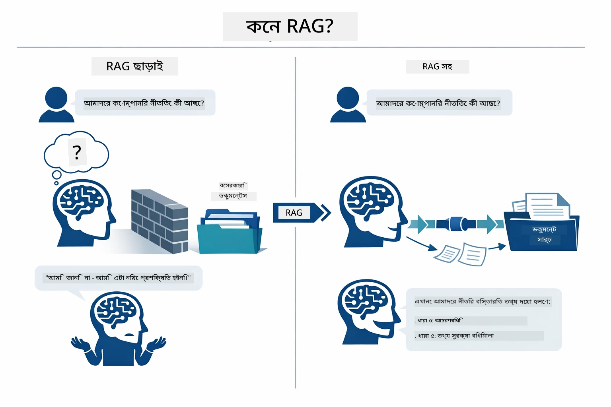

*এই ডায়াগ্রামটি দেখায় একটি সাধারণ LLM (যা প্রশিক্ষণ তথ্য থেকে অনুমান করে) এবং RAG-সক্ষম LLM (যা প্রথমে আপনার ডকুমেন্টগুলো পরামর্শ করে) এর মধ্যে পার্থক্য।*

এটি হলো শেষ পর্যন্ত পিসিগুলোর সংযোগের ধারা। এক ব্যবহারকারীর প্রশ্ন চারটি পর্যায় দিয়ে প্রবাহিত হয় — এম্বেডিং, ভেক্টর অনুসন্ধান, প্রসঙ্গ সমন্বয়, এবং উত্তর তৈরি — প্রতিটি একটি পূর্ববর্তী ধাপের ওপর ভিত্তি করে:


*এই ডায়াগ্রামটি দেখায় সমগ্র RAG পাইপলাইন — একজন ব্যবহারকারীর প্রশ্ন এম্বেডিং, ভেক্টর অনুসন্ধান, প্রসঙ্গ সমন্বয়, এবং উত্তর জেনারেশনের মাধ্যমে প্রবাহিত হয়।*

এরপরের অংশে প্রতিটি ধাপ বিস্তারিতভাবে ধাপে ধাপে বর্ণনা করা হয়েছে, কোডসহ যা আপনি রান ও পরিবর্তন করতে পারেন।

### Which RAG Approach Does This Tutorial Use?

LangChain4j RAG বাস্তবায়নের জন্য তিনটি পদ্ধতি প্রদান করে, প্রতিটি ভিন্ন স্তরের বিমূর্ততার। নিচের ডায়াগ্রামটি সেগুলো পার্শ্ব-পার্শ্ব তুলনা করে:

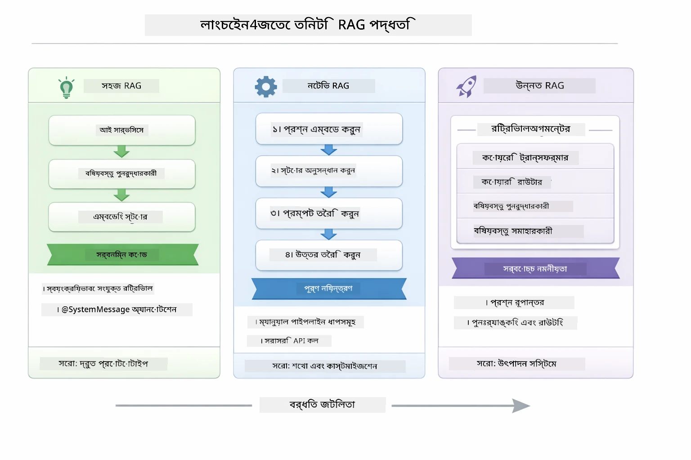

*এই ডায়াগ্রামটি LangChain4j এর তিনটি RAG পদ্ধতির তুলনা করে — Easy, Native, এবং Advanced — তাদের মূল উপাদান এবং ব্যবহারের সময় দেখানো হয়েছে।*

| পদ্ধতি | কি করে | ট্রেড-অফ |
|---|---|---|
| **Easy RAG** | সমস্ত কিছু স্বয়ংক্রিয়ভাবে `AiServices` এবং `ContentRetriever` এর মাধ্যমে যুক্ত করে। আপনি একটি ইন্টারফেস অ্যানোটেট করেন, রিট্রিভার যুক্ত করেন, আর LangChain4j এম্বেডিং, অনুসন্ধান, এবং প্রম্পট সমন্বয় পরিচালনা করে। | কোড কম, কিন্তু প্রতিটি ধাপে কি হচ্ছে তা দেখেন না। |
| **Native RAG** | আপনি এম্বেডিং মডেল কল করেন, স্টোরে অনুসন্ধান করেন, প্রম্পট তৈরি করেন, এবং নিজে উত্তর তৈরি করেন — এক ধাপে এক ধাপে স্পষ্টভাবে। | বেশি কোড লাগে, কিন্তু প্রতিটি স্তর দৃশ্যমান এবং পরিবর্তনযোগ্য। |
| **Advanced RAG** | `RetrievalAugmentor` ফ্রেমওয়ার্ক ব্যবহার করে প্লাগেবল কুয়েরি ট্রান্সফরমার, রাউটার, রেঙ্কার, এবং কনটেন্ট ইনজেক্টর দিয়ে প্রোডাকশন-গ্রেড পায়পলাইন তৈরি করে। | সর্বোচ্চ নমনীয়তা, কিন্তু জটিলতাও অনেক। |

**এই টিউটোরিয়ালে Native পদ্ধতিটি ব্যবহৃত হয়েছে।** RAG পাইপলাইনের প্রতিটি ধাপ — কুয়েরি এম্বেড করা, ভেক্টর স্টোরে অনুসন্ধান, প্রসঙ্গ সমন্বয়, এবং উত্তর জেনারেশন — [`RagService.java`](../../../03-rag/src/main/java/com/example/langchain4j/rag/service/RagService.java) ফাইলে স্পষ্টভাবে লেখা হয়েছে। এটি ইচ্ছাকৃত: শেখার জন্য, প্রতিটি ধাপ আপনি দেখতে ও বুঝতে পারেন তা বেশি গুরুত্বপূর্ণ, কোড কম হওয়া নয়। একবার আপনি সহজে বুঝে গেলে, দ্রুত প্রোটোটাইপের জন্য Easy RAG-এ যেতে পারেন অথবা প্রোডাকশনের জন্য Advanced RAG ব্যবহার করতে পারেন।

> **💡 ইতিমধ্যে Easy RAG দেখেছেন?** [Quick Start মডিউল](../00-quick-start/README.md) এ একটি ডকুমেন্ট Q&A উদাহরণ ([`SimpleReaderDemo.java`](../../../00-quick-start/src/main/java/com/example/langchain4j/quickstart/SimpleReaderDemo.java)) আছে যা Easy RAG ব্যবহার করে — LangChain4j এম্বেডিং, অনুসন্ধান, এবং প্রম্পট সমন্বয় স্বয়ংক্রিয়ভাবে পরিচালনা করে। এই মডিউলটি পরবর্তী ধাপ যেখানে পাইপলাইনটি খুলে প্রতিটি ধাপ আপনি নিজে দেখতে এবং নিয়ন্ত্রণ করতে পারবেন।

নিচের ডায়াগ্রামে Quick Start উদাহরণের Easy RAG পাইপলাইন দেখানো হয়েছে। লক্ষ্য করুন `AiServices` এবং `EmbeddingStoreContentRetriever` কীভাবে জটিলতা ঢেকে রাখে — আপনি একটি ডকুমেন্ট লোড করেন, রিট্রিভার যুক্ত করেন, এবং উত্তর পান। এই মডিউলের Native পদ্ধতি প্রতিটি লুকানো ধাপ খুলে দেয়:

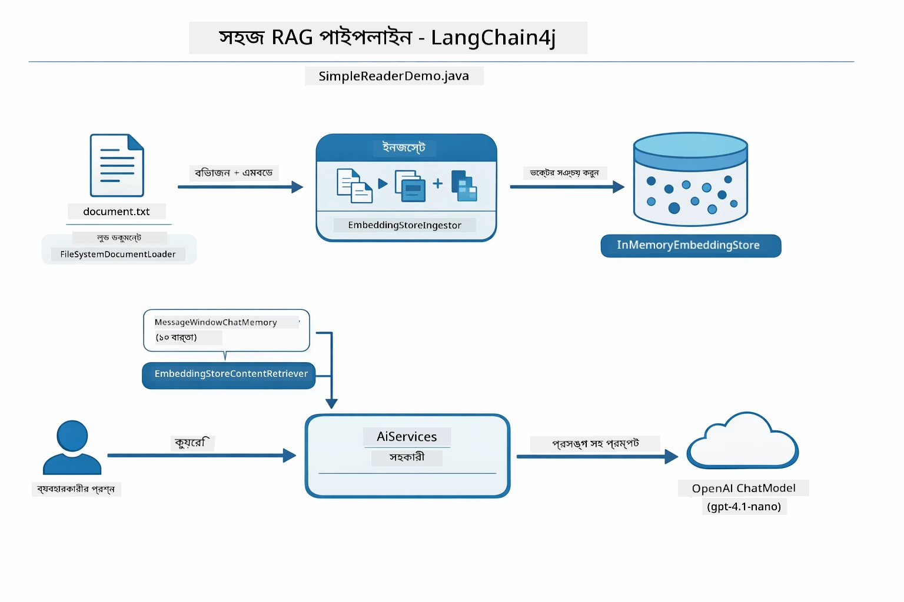

*এই ডায়াগ্রামটি `SimpleReaderDemo.java` এর Easy RAG পাইপলাইন দেখায়। এর সাথে এই মডিউলের Native পদ্ধতির তুলনা করুন: Easy RAG এম্বেডিং, রিট্রিভাল এবং প্রম্পট সমন্বয় `AiServices` এবং `ContentRetriever` এর পেছনে লুকিয়ে রাখে — আপনি শুধু ডকুমেন্ট লোড করেন, রিট্রিভার যুক্ত করেন, এবং উত্তর পেয়ে যান। Native পদ্ধতিতে প্রত্যেক ধাপ নিজে কল করতে হয় (এম্বেড, সার্চ, প্রসঙ্গ তৈরি, জেনারেট), যা সম্পূর্ণ নিয়ন্ত্রণ এবং দৃশ্যমানতা দেয়।*

## How It Works

এই মডিউলের RAG পাইপলাইন চারটি ধাপে বিভক্ত যা ব্যবহারকারী প্রতি প্রশ্ন করলে ধারাবাহিকভাবে চলে। প্রথমেই, একটি আপলোড করা ডকুমেন্ট **পার্স এবং চাঙ্ক করা হয়** — এমন ছোট অংশে ভাগ করা হয় যা মডেলের প্রসঙ্গ উইন্ডোতে আরামদায়ক ফিট হয়। এই চাঙ্কগুলো একটু overlapped থাকে যাতে সীমান্তে প্রসঙ্গ হারানো না হয়।

তারপর ঐ চাঙ্কগুলোকে **ভেক্টর এম্বেডিংয়ে রূপান্তরিত** করা হয় এবং সঞ্চয় করা হয় যাতে গণিতীয় তুলনা করা যায়। যখন একটি প্রশ্ন আসে, সিস্টেম একটি **সেমান্টিক সার্চ** চালায় যাতে সবচেয়ে প্রাসঙ্গিক চাঙ্ক পাওয়া যায়, এবং অবশেষে তাদের প্রসঙ্গ হিসেবে LLM-এ পাঠানো হয় **উত্তর তৈরি** এর জন্য। নিচের অংশগুলো প্রতিটি ধাপ কোড এবং ডায়াগ্রামসহ দেখায়। প্রথম ধাপ দেখা যাক।

### Document Processing

[DocumentService.java](../../../03-rag/src/main/java/com/example/langchain4j/rag/service/DocumentService.java)

আপনি যখন একটি ডকুমেন্ট আপলোড করেন, সিস্টেম সেটি পার্স করে (PDF বা সাধারণ টেক্সট), ফাইলনামের মতো মেটাডেটা সংযুক্ত করে, এবং চাঙ্কে ভাগ করে — ছোট ছোট অংশ যা মডেলের প্রসঙ্গ উইন্ডোর মধ্যে ফিট করে। এই চাঙ্কগুলো সামান্য overlapped থাকে যাতে সীমান্তে প্রসঙ্গ হারিয়ে না যায়।

```java
// আপলোড করা ফাইলটি বিশ্লেষণ করুন এবং এটিকে একটি LangChain4j ডকুমেন্ট হিসেবে মোড়ান
Document document = Document.from(content, metadata);

// ৩০ টোকেন ওভারল্যাপ সহ ৩০০-টোকেনের অংশে বিভক্ত করুন
DocumentSplitter splitter = DocumentSplitters
    .recursive(300, 30);

List<TextSegment> segments = splitter.split(document);
```

নিচের ডায়াগ্রামটি কিভাবে এটি ভিজ্যুয়ালি কাজ করে দেখায়। লক্ষ্য করুন প্রতিটি চাঙ্কের কিছু টোকেন প্রতিবেশীদের সাথে ভাগাভাগি করে — ৩০ টোকেন ওভারল্যাপ নিশ্চিত করে যে গুরুত্বপূর্ণ প্রসঙ্গ ফাঁক ফোকর হবেনা:

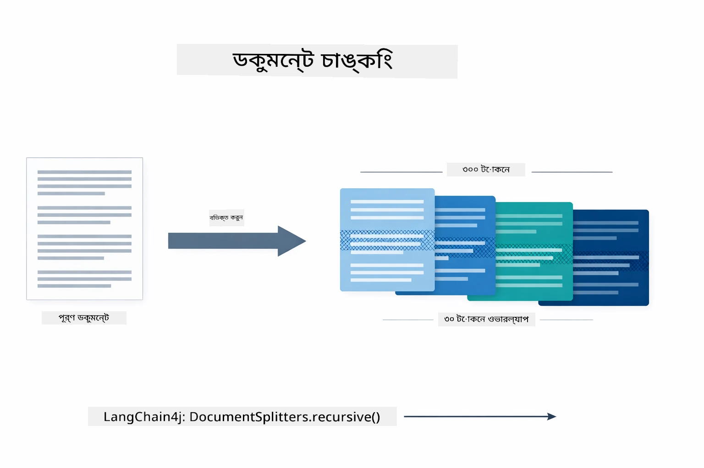

*এই ডায়াগ্রামটি দেখায় কীভাবে একটি ডকুমেন্ট ৩০ টোকেন ওভারল্যাপ সহ ৩০০ টোকেন দীর্ঘ চাঙ্কে বিভক্ত হয়, চাঙ্ক সীমান্তে প্রসঙ্গ সংরক্ষণ করে।*

> **🤖 GitHub Copilot Chat দিয়ে চেষ্টা করুন:** খুলুন [`DocumentService.java`](../../../03-rag/src/main/java/com/example/langchain4j/rag/service/DocumentService.java) এবং জিজ্ঞাসা করুন:
> - "LangChain4j কীভাবে ডকুমেন্টগুলো চাঙ্কে বিভক্ত করে এবং ওভারল্যাপ কেন গুরুত্বপূর্ণ?"
> - "বিভিন্ন ধরণের ডকুমেন্টে আদর্শ চাঙ্ক আকার কী এবং কেন?"
> - "কিভাবে একাধিক ভাষার ডকুমেন্ট বা বিশেষ ফরম্যাটিং থাকা ডকুমেন্ট হ্যান্ডেল করবেন?"

### Creating Embeddings

[LangChainRagConfig.java](../../../03-rag/src/main/java/com/example/langchain4j/rag/config/LangChainRagConfig.java)

প্রতিটি চাঙ্ককে একটি সংখ্যাগত উপস্থাপনায় রূপান্তরিত করা হয় যাকে এম্বেডিং বলা হয় — সহজভাবে বলতে গেলে মানে থেকে সংখ্যা তৈরি করার একটি কনভার্টার। এম্বেডিং মডেলটি "ইন্টেলিজেন্ট" নয়, যেমন একটি চ্যাট মডেল; এটি নির্দেশ মেনে চলে না, যুক্তি তৈরি করে না বা প্রশ্নের উত্তর দেয় না। যা করে তা হলো টেক্সটকে একটি গণিতীয় স্থানতে রূপান্তর করা যেখানে সাদৃশ্যপূর্ণ মানে কাছাকাছি থাকে — "গাড়ি" "অটোমোবাইল"-এর নিকটে, "রিফান্ড নীতি" "আমার টাকা ফেরত" এর কাছে। ভাবুন চ্যাট মডেল যেন একজন মানুষ যার সঙ্গে আপনি কথা বলতে পারেন; এম্বেডিং মডেল হল একটি খুব ভালো ফাইলিং সিস্টেম।

নিচের ডায়াগ্রামটি এই ধারণাটি দৃশ্যমান করে তোলে — টেক্সট ইনপুট হয়, সংখ্যাগত ভেক্টর আউটপুট হয়, আর সাদৃশ্যপূর্ণ মানে পরিচিত ভেক্টরগুলো একসঙ্গে থাকে:

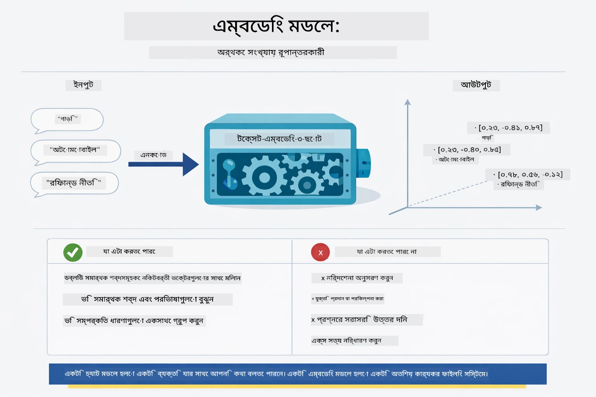

*এই ডায়াগ্রামটি দেখায় কীভাবে একটি এম্বেডিং মডেল টেক্সটকে সংখ্যাগত ভেক্টরে রূপান্তর করে এবং সাদৃশ্যপূর্ণ মানে — যেমন "গাড়ি" ও "অটোমোবাইল" — ভেক্টর স্থানে একসঙ্গে রাখে।*

```java
@Bean
public EmbeddingModel embeddingModel() {
    return OpenAiOfficialEmbeddingModel.builder()
        .baseUrl(azureOpenAiEndpoint)
        .apiKey(azureOpenAiKey)
        .modelName(azureEmbeddingDeploymentName)
        .build();
}

EmbeddingStore<TextSegment> embeddingStore = 
    new InMemoryEmbeddingStore<>();
```

নীচের ক্লাস ডায়াগ্রামটি RAG পাইপলাইনের দুইটি পৃথক প্রবাহ এবং LangChain4j ক্লাসগুলো দেখায় যা এগুলো বাস্তবায়ন করে। **ingestion flow** (আপলোডের সময় একবার চলবে) ডকুমেন্ট বিভক্ত করে, চাঙ্ক এম্বেড করে, এবং `.addAll()` এর মাধ্যমে সঞ্চয় করে। **query flow** (প্রতিবার ব্যবহারকারী প্রশ্ন করলে চলে) প্রশ্ন এম্বেড করে, `.search()` দিয়ে স্টোরে অনুসন্ধান করে, এবং ম্যাচ হওয়া প্রসঙ্গ চ্যাট মডেলে পাঠায়। উভয় প্রবাহ মিলিত হয় শেয়ার করা `EmbeddingStore<TextSegment>` ইন্টারফেসে:

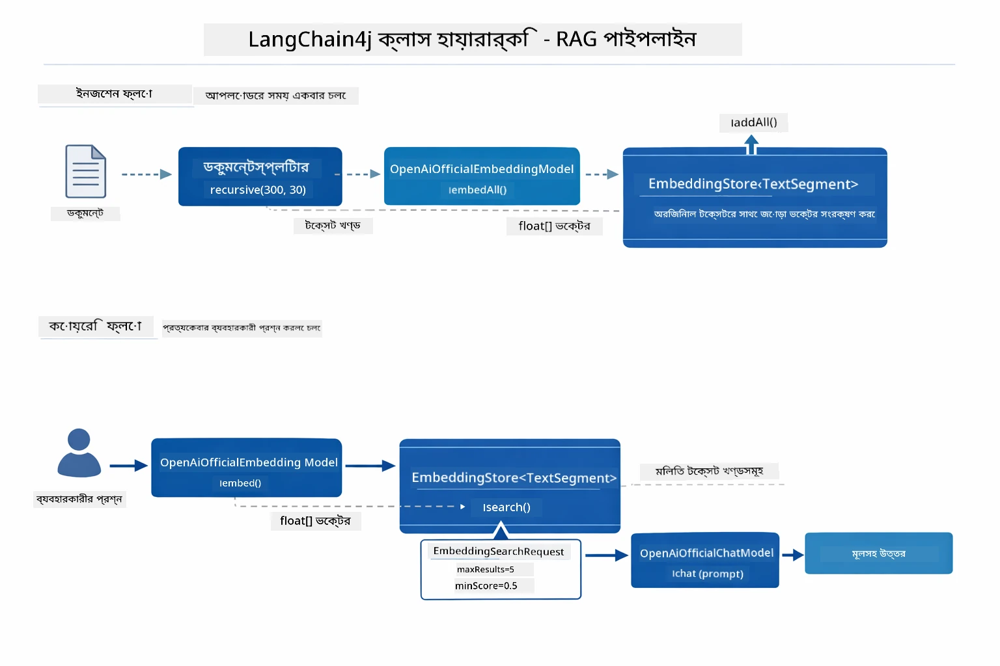

*ডায়াগ্রামটি RAG পাইপলাইনের দুইটি প্রবাহ — ingestion এবং query — দেখায় এবং তারা কিভাবে শেয়ার করা EmbeddingStore-এর মাধ্যমে যুক্ত।*

 এম্বেডিংগুলি সঞ্চয় করার পর, সাদৃশ্যপূর্ণ বিষয়বস্তু স্বাভাবিকভাবেই ভেক্টর স্থানে ক্লাস্টার হয়। নিচের ভিজ্যুয়ালাইজেশনটি দেখায় কীভাবে সম্পর্কিত বিষয়ের ডকুমেন্টস কাছাকাছি পয়েন্টে থাকে, যা সেমান্টিক সার্চ সম্ভব করে তোলে:


*এই ভিজ্যুয়ালাইজেশনটি দেখায় কীভাবে সম্পর্কিত ডকুমেন্টগুলো ৩ডি ভেক্টর স্থানে ক্লাস্টার করে, যেখানে টেকনিক্যাল ডকস, বিজনেস রুলস, এবং FQA-এর মত বিষয়গুলো আলাদা আলাদা গ্রুপ তৈরি করে।*

যখন ব্যবহারকারী অনুসন্ধান করে, সিস্টেম চারটি ধাপ অনুসরণ করে: ডকুমেন্টগুলো একবার এম্বেড করে, প্রতিবার সার্চ করার সময় প্রশ্ন এম্বেড করে, প্রশ্ন ভেক্টরকে সঞ্চিত সমস্ত ভেক্টরের সঙ্গে কসাইন সাদৃশ্য মাপ দিয়ে তুলনা করে, এবং সর্বোচ্চ স্কোরধারী টপ-কে চাঙ্কগুলো ফিরিয়ে দেয়। নিচের ডায়াগ্রামটি প্রতিটি ধাপ এবং LangChain4j ক্লাসগুলো দেখায়:

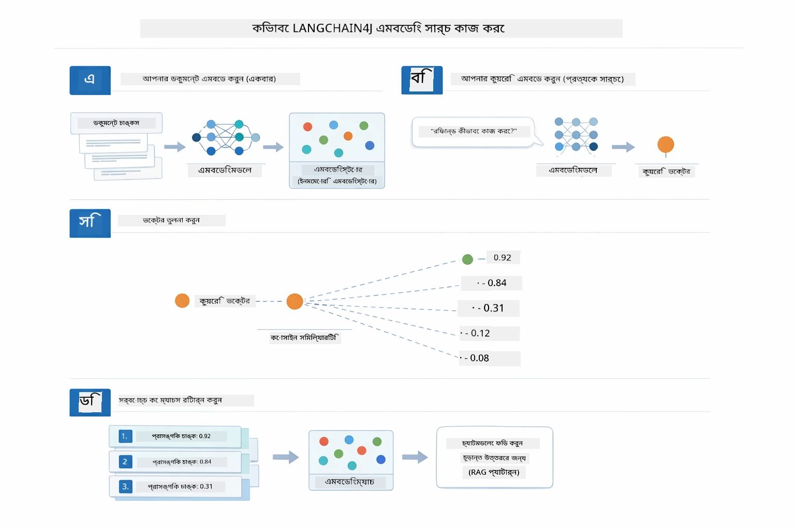

*এই ডায়াগ্রামটি চার ধাপের এম্বেডিং সার্চ প্রক্রিয়া দেখায়: ডকুমেন্ট এম্বেড করা, প্রশ্ন এম্বেড করা, ভেক্টর কসাইন সাদৃশ্য দিয়ে তুলনা, এবং টপ-কে ফলাফল ফেরত দেওয়া।*

### Semantic Search

[RagService.java](../../../03-rag/src/main/java/com/example/langchain4j/rag/service/RagService.java)

আপনি যখন একটি প্রশ্ন করেন, আপনার প্রশ্নও একটি এম্বেডিংয়ে রূপান্তরিত হয়। সিস্টেম আপনার প্রশ্নের এম্বেডিং তুলনা করে সমস্ত ডকুমেন্ট চাঙ্কের এম্বেডিংয়ের সঙ্গে। এটি সবচেয়ে সাদৃশ্যপূর্ণ মানের চাঙ্কগুলো খুঁজে পায় - শুধু মিল থাকা কীওয়ার্ড নয়, প্রকৃত সেমান্টিক সাদৃশ্য।

```java
Embedding queryEmbedding = embeddingModel.embed(question).content();

EmbeddingSearchRequest searchRequest = EmbeddingSearchRequest.builder()
    .queryEmbedding(queryEmbedding)
    .maxResults(5)
    .minScore(0.5)
    .build();

EmbeddingSearchResult<TextSegment> searchResult = embeddingStore.search(searchRequest);
List<EmbeddingMatch<TextSegment>> matches = searchResult.matches();

for (EmbeddingMatch<TextSegment> match : matches) {
    String relevantText = match.embedded().text();
    double score = match.score();
}
```

নিচের ডায়াগ্রামটি সেমান্টিক সার্চ এবং প্রচলিত কীওয়ার্ড সার্চের পার্থক্য তুলে ধরে। "vehicle" কীওয়ার্ড সার্চ "cars and trucks" সম্পর্কে একটি চাঙ্ক মিস করে, কিন্তু সেমান্টিক সার্চ বোঝে তারা একই অর্থ বহন করে এবং তাকে উচ্চ মানের মিল হিসেবে ফেরত দেয়:

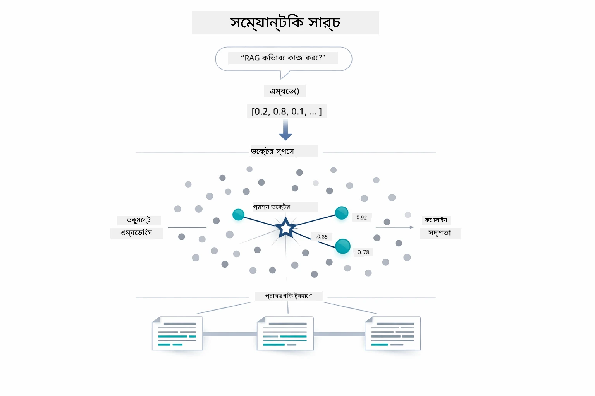

*এই ডায়াগ্রামটি কীওয়ার্ড-বেসড সার্চ ও সেমান্টিক সার্চ তুলনা করে, দেখাচ্ছে কীভাবে সেমান্টিক সার্চ খুঁজে পায় ধারণাগতভাবে সম্পর্কিত বিষয়বস্তু এমনকি যখন সঠিক কীওয়ার্ড ভিন্ন হয়।*
অবজেক্টিভলি, সাদৃশ্য পরিমাপ করা হয় কসমাইন সাদৃশ্য ব্যবহার করে — মূলত প্রশ্ন করা হয় "এই দুই তীর একই দিকেই নির্দেশ করছে কি?" দুইটি অংশ সম্পূর্ণ ভিন্ন শব্দ ব্যবহার করতে পারে, কিন্তু যদি তারা একই অর্থ বহন করে তাহলে তাদের ভেক্টর একই দিকে নির্দেশ করে এবং স্কোর ১.০ এর কাছাকাছি হয়:

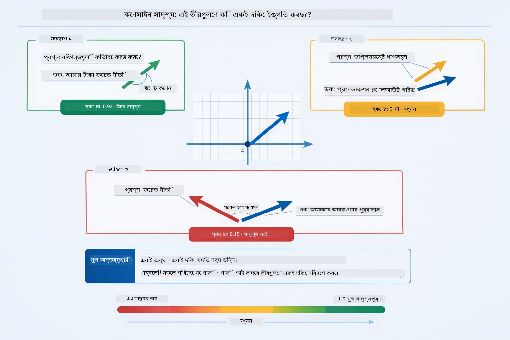

*এই চিত্রটি কসমাইন সাদৃশ্যকে এম্বেডিং ভেক্টরগুলোর মধ্যে কোণ হিসাবে বর্ণনা করে — বেশি সামঞ্জস্যপূর্ণ ভেক্টরগুলো ১.০ এর কাছাকাছি স্কোর পায়, যা উচ্চতর অর্থগত সাদৃশ্য নির্দেশ করে।*

> **🤖 [GitHub Copilot](https://github.com/features/copilot) Chat এর সাথে চেষ্টা করুন:** খুলুন [`RagService.java`](../../../03-rag/src/main/java/com/example/langchain4j/rag/service/RagService.java) এবং প্রশ্ন করুন:
> - "এম্বেডিংসের সাথে সাদৃশ্য অনুসন্ধান কিভাবে কাজ করে এবং স্কোর নির্ধারণ করে কী?"
> - "কোন সাদৃশ্য সীমা ব্যবহার করা উচিত এবং এটি ফলাফলের উপর কী প্রভাব ফেলে?"
> - "যখন কোন প্রাসঙ্গিক ডকুমেন্ট পাওয়া যায় না তখন আমি কীভাবে হ্যান্ডল করব?"

### উত্তর তৈরি

[RagService.java](../../../03-rag/src/main/java/com/example/langchain4j/rag/service/RagService.java)

সবচেয়ে প্রাসঙ্গিক অংশগুলো একত্রিত করে একটি গঠনমূলক প্রম্পটে রূপান্তর করা হয় যা স্পষ্ট নির্দেশাবলী, প্রাপ্ত প্রাসঙ্গিক বিষয়বস্তু, এবং ব্যবহারকারীর প্রশ্ন অন্তর্ভুক্ত করে। মডেল ওই নির্দিষ্ট অংশগুলো পড়ে এবং তথ্যের ভিত্তিতে উত্তর দেয় — এটি শুধুমাত্র সামনে থাকা তথ্য ব্যবহার করতে পারে, যেটা হ্যালুসিনেশন প্রতিরোধ করে।

```java
String context = matches.stream()
    .map(match -> match.embedded().text())
    .collect(Collectors.joining("\n\n"));

String prompt = String.format("""
    Answer the question based on the following context.
    If the answer cannot be found in the context, say so.

    Context:
    %s

    Question: %s

    Answer:""", context, request.question());

String answer = chatModel.chat(prompt);
```

নীচের চিত্রটি এই সংকলন প্রক্রিয়া প্রদর্শন করে — অনুসন্ধান ধাপ থেকে শীর্ষ স্কোরিং অংশগুলো প্রম্পট টেমপ্লেটে ইনজেক্ট করা হয়, এবং `OpenAiOfficialChatModel` একটি ভিত্তিপ্রাপ্ত উত্তর তৈরি করে:

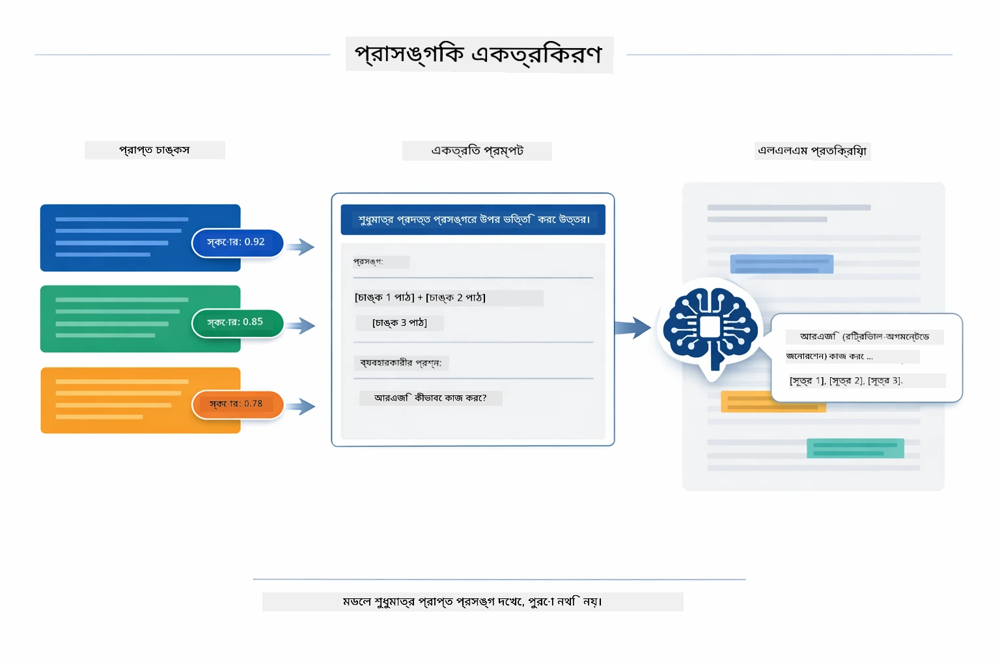

*এই চিত্রটি দেখায় কীভাবে শীর্ষ স্কোরিং অংশগুলো গঠনমূলক প্রম্পটে সংকলিত হয়, যা মডেলকে আপনার তথ্য থেকে ভিত্তিপ্রাপ্ত উত্তর তৈরি করতে সাহায্য করে।*

## অ্যাপ্লিকেশন চালু করুন

**বিন্যাস যাচাই করুন:**

রুট ডিরেক্টরিতে `.env` ফাইলটি আছে কিনা নিশ্চিত করুন, যার মধ্যে Azure ক্রেডেনশিয়াল রয়েছে (মডিউল ০১ এর সময় তৈরি)। মডিউল ডিরেক্টরি থেকে এটি চালান (`03-rag/`):

**Bash:**
```bash
cat ../.env  # AZURE_OPENAI_ENDPOINT, API_KEY, DEPLOYMENT দেখানো উচিত
```

**PowerShell:**
```powershell
Get-Content ..\.env  # AZURE_OPENAI_ENDPOINT, API_KEY, DEPLOYMENT দেখানো উচিত
```

**অ্যাপ্লিকেশন শুরু করুন:**

> **দ্রষ্টব্য:** যদি আপনি ইতিমধ্যেই সব অ্যাপ্লিকেশন `./start-all.sh` ব্যবহার করে রুট ডিরেক্টরি থেকে চালু করে থাকেন (যেমন মডিউল ০১ এ বর্ণিত), এই মডিউল ইতিমধ্যেই পোর্ট ৮০৮১ এ চলছে। তাই নিচের স্টার্ট কমান্ডগুলো এড়িয়ে সরাসরি http://localhost:8081 এ যেতে পারেন।

**বিকল্প ১: Spring Boot Dashboard ব্যবহার করে (VS Code ব্যবহারকারীদের জন্য সুপারিশকৃত)**

ডেভেলপমেন্ট কন্টেইনারে Spring Boot Dashboard এক্সটেনশন অন্তর্ভুক্ত, যা সব Spring Boot অ্যাপ্লিকেশন পরিচালনার জন্য একটি ভিজ্যুয়াল ইন্টারফেস প্রদান করে। আপনি VS Code এর বাম পাশে Activity Bar এ এটি পাবেন (Spring Boot আইকন খুঁজুন)।

Spring Boot Dashboard থেকে আপনি:
- ওয়ার্কস্পেসে থাকা সব Spring Boot অ্যাপ্লিকেশন দেখতে পারবেন
- এক ক্লিকেই অ্যাপ্লিকেশন শুরু/বন্দ করতে পারবেন
- রিয়েল-টাইমে অ্যাপ্লিকেশন লগ দেখতে পারবেন
- অ্যাপ্লিকেশন স্ট্যাটাস মনিটর করতে পারবেন

শুধুমাত্র "rag" এর পাশে থাকা প্লে বোতামে ক্লিক করে এই মডিউল চালু করুন, অথবা একযোগে সব মডিউল শুরু করুন।


*এই স্ক্রিনশটে দেখানো হয়েছে VS Code এ Spring Boot Dashboard, যেখানে আপনি অ্যাপ্লিকেশন গুলো শুরু, বন্ধ এবং পর্যবেক্ষণ করতে পারেন।*

**বিকল্প ২: শেল স্ক্রিপ্ট ব্যবহার করে**

সব ওয়েব অ্যাপ্লিকেশন (মডিউল ০১-০৪) শুরু করুন:

**Bash:**
```bash
cd ..  # রুট ডিরেক্টরি থেকে
./start-all.sh
```

**PowerShell:**
```powershell
cd ..  # রুট ডিরেক্টরি থেকে
.\start-all.ps1
```

অথবা শুধুমাত্র এই মডিউলটি শুরু করুন:

**Bash:**
```bash
cd 03-rag
./start.sh
```

**PowerShell:**
```powershell
cd 03-rag
.\start.ps1
```

উভয় স্ক্রিপ্ট স্বয়ংক্রিয়ভাবে রুট `.env` ফাইল থেকে পরিবেশ ভেরিয়েবল লোড করবে এবং জারা (JAR) ফাইল না থাকলে তৈরি করবে।

> **দ্রষ্টব্য:** যদি আপনি শুরু করার আগে সব মডিউল ম্যানুয়ালি তৈরি করতে চান:
>
> **Bash:**
> ```bash
> cd ..  # Go to root directory
> mvn clean package -DskipTests
> ```

> **PowerShell:**
> ```powershell
> cd ..  # Go to root directory
> mvn clean package -DskipTests
> ```

আপনার ব্রাউজারে http://localhost:8081 খুলুন।

**বন্ধ করতে:**

**Bash:**
```bash
./stop.sh  # শুধুমাত্র এই মডিউল
# অথবা
cd .. && ./stop-all.sh  # সব মডিউলসমূহ
```

**PowerShell:**
```powershell
.\stop.ps1  # এই মডিউল শুধুমাত্র
# অথবা
cd ..; .\stop-all.ps1  # সব মডিউলগুলি
```

## অ্যাপ্লিকেশন ব্যবহার

অ্যাপ্লিকেশনটি ডকুমেন্ট আপলোড ও প্রশ্ন করার জন্য একটি ওয়েব ইন্টারফেস প্রদান করে।

<a href="images/rag-homepage.png"></a>

*এই স্ক্রিনশটে RAG অ্যাপ্লিকেশন ইন্টারফেস দেখানো হয়েছে যেখানে আপনি ডকুমেন্ট আপলোড এবং প্রশ্ন করতে পারেন।*

### ডকুমেন্ট আপলোড করুন

প্রথমে একটি ডকুমেন্ট আপলোড করুন - TXT ফাইল পরীক্ষা করার জন্য সেরা। এই ডিরেক্টরিতে একটি `sample-document.txt` আছে যা LangChain4j ফিচার, RAG বাস্তবায়ন এবং সেরা অভ্যাস সম্পর্কিত তথ্য ধারণ করে - সিস্টেম টেস্টের জন্য উপযুক্ত।

সিস্টেম আপনার ডকুমেন্ট প্রক্রিয়াকরণ করে, সেটিকে অংশে ভাগ করে এবং প্রতিটি অংশের জন্য এম্বেডিং তৈরি করে। এটি স্বয়ংক্রিয়ভাবে আপলোডের সময় ঘটে।

### প্রশ্ন করুন

এখন ডকুমেন্টের বিষয়বস্তু সম্পর্কে নির্দিষ্ট প্রশ্ন করুন। এমন কিছু চেষ্টা করুন যা ডকুমেন্টে স্পষ্টভাবে উল্লেখ আছে। সিস্টেম প্রাসঙ্গিক অংশগুলি খুঁজে বের করে, সেগুলো প্রম্পটে অন্তর্ভুক্ত করে এবং উত্তর তৈরি করে।

### উৎস রেফারেন্স চেক করুন

প্রতিটি উত্তরের সাথে উৎস রেফারেন্স ও সাদৃশ্য স্কোর দেখানো হয়। এই স্কোরগুলো (০ থেকে ১) দেখায় প্রতিটি অংশ কতটা আপনার প্রশ্নের সাথে প্রাসঙ্গিক ছিল। বেশি স্কোর মানে ভাল মিল। এটি আপনাকে উৎস উপাদানের সাথে উত্তর যাচাই করতে সাহায্য করে।

<a href="images/rag-query-results.png"></a>

*এই স্ক্রিনশটে প্রশ্নের ফলাফল, তৈরি উত্তর, উৎস রেফারেন্স, এবং প্রতিটি প্রাপ্ত অংশের প্রাসঙ্গিকতা স্কোর দেখানো হয়েছে।*

### প্রশ্নের সাথে পরীক্ষা-নিরীক্ষা করুন

বিভিন্ন ধরনের প্রশ্ন চেষ্টা করুন:
- নির্দিষ্ট তথ্য: "মূল বিষয় কী?"
- তুলনা: "X এবং Y এর মধ্যে পার্থক্য কী?"
- সারাংশ: "Z সম্পর্কে মূল পয়েন্টগুলো সারসংক্ষেপ করুন"

দেখুন কীভাবে আপনার প্রশ্নের মিল ডকুমেন্টের বিষয়বস্তুর উপর ভিত্তি করে প্রাসঙ্গিকতার স্কোর পরিবর্তন হয়।

## মূল ধারনা

### অংশে ভাগ করার কৌশল

ডকুমেন্টগুলো ৩০ টোকেন ওভারল্যাপ সহ ৩০০ টোকেনের অংশে ভাগ করা হয়। এই ভারসাম্য নিশ্চিত করে প্রতিটি অংশ যথেষ্ট প্রসঙ্গ সহ অর্থবহ থাকে এবং পর্যাপ্ত ছোট থাকে যাতে একাধিক অংশ প্রম্পটে দেওয়া যায়।

### সাদৃশ্য স্কোর

প্রত্যেক প্রাপ্ত অংশের সাথে একটি সাদৃশ্য স্কোর থাকে ০ থেকে ১ এর মধ্যে, যা নির্দেশ করে অংশটি ব্যবহারকারীর প্রশ্নের সাথে কতটা মিলেছে। নিচের চিত্রে স্কোর পরিসর এবং সিস্টেম কীভাবে সেগুলো ব্যবহার করে ফলাফল ফিল্টার করে দেখানো হয়েছে:

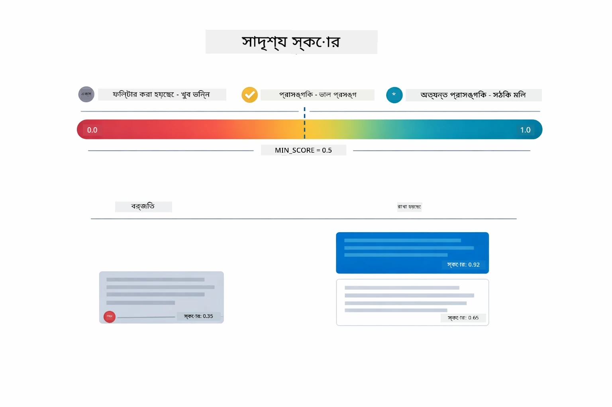

*এই চিত্রটি ০ থেকে ১ এর স্কোর পরিসর দেখায়, যেখানে ০.৫ একটি ন্যূনতম সীমা যা অপ্রাসঙ্গিক অংশগুলো ফিল্টার করে।*

স্কোর পরিসর:
- ০.৭-১.০: অত্যন্ত প্রাসঙ্গিক, সঠিক মিল
- ০.৫-০.৭: প্রাসঙ্গিক, ভালো প্রসঙ্গ
- ০.৫ এর নিচে: ফিল্টার করা হয়েছে, খুব অপ্রাসঙ্গিক

গুণগত মান নিশ্চিত করতে সিস্টেম শুধুমাত্র ন্যূনতম সীমা ছাপিয়ে অংশগুলোই পুনরুদ্ধার করে।

এম্বেডিংস ভাল কাজ করে যখন অর্থ স্পষ্টভাবে ক্লাস্টার হয়, কিন্তু কিছু দুর্বলতা থাকে। নিচের চিত্রটি সাধারণ ব্যর্থতার কারণগুলো দেখায় — খুব বড় অংশগুলো মটমটানো ভেক্টর তৈরি করে, খুব ছোট অংশগুলোতে প্রসঙ্গ নেই, অস্পষ্ট শব্দগুলো একাধিক ক্লাস্টার নির্দেশ করে, এবং সঠিক-মিল লুকআপ (আইডি, পার্ট নম্বর) এম্বেডিংসের সাথে কাজ করে না:

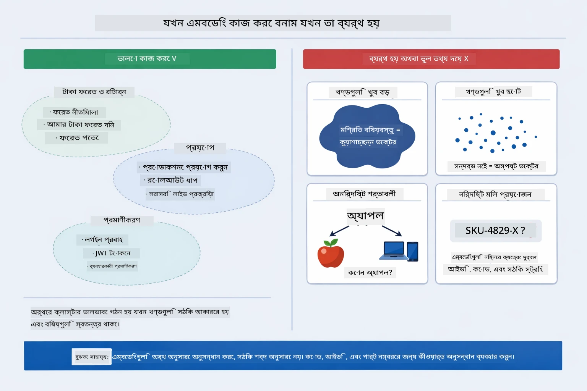

*এই চিত্রটি সাধারণ এম্বেডিং ব্যর্থতার কারণগুলো দেখায়: খুব বড় অংশ, খুব ছোট অংশ, অস্পষ্ট শব্দ যা একাধিক ক্লাস্টার নির্দেশ করে, এবং সঠিক-মিল লুকআপ যেমন আইডি।*

### ইন-মেমোরি স্টোরেজ

এই মডিউলটি সরলতার জন্য ইন-মেমোরি স্টোরেজ ব্যবহার করে। যখন আপনি অ্যাপ্লিকেশন পুনরায় চালু করবেন, তখন আপলোড করা ডকুমেন্টগুলো হারিয়ে যাবে। প্রোডাকশন সিস্টেম স্থায়ী ভেক্টর ডাটাবেস যেমন Qdrant বা Azure AI Search ব্যবহার করে।

### প্রসঙ্গ উইন্ডো ব্যবস্থাপনা

প্রত্যেক মডেলের একটি সর্বোচ্চ প্রসঙ্গ উইন্ডো থাকে। বড় ডকুমেন্টের সব অংশ প্রম্পটে অন্তর্ভুক্ত করা সম্ভব নয়। সিস্টেম সর্বোচ্চ N টি প্রাসঙ্গিক অংশ (ডিফল্ট ৫) পুনরুদ্ধার করে যাতে সীমাবদ্ধতা বজায় থাকে এবং যথাযথ প্রসঙ্গ দিয়ে সঠিক উত্তর দেওয়া যায়।

## যখন RAG গুরুত্বপূর্ণ

RAG সবসময় সঠিক পন্থা নয়। নিচের সিদ্ধান্ত গাইডটি আপনাকে সাহায্য করবে বুঝতে কখন RAG মূল্য সংযোজন করে এবং কখন সরল পন্থা — যেমন সরাসরি প্রম্পটে বিষয়বস্তু অন্তর্ভুক্ত করা বা মডেলের অভ্যন্তরীণ জ্ঞানের উপর নির্ভর করা — যথেষ্ট:

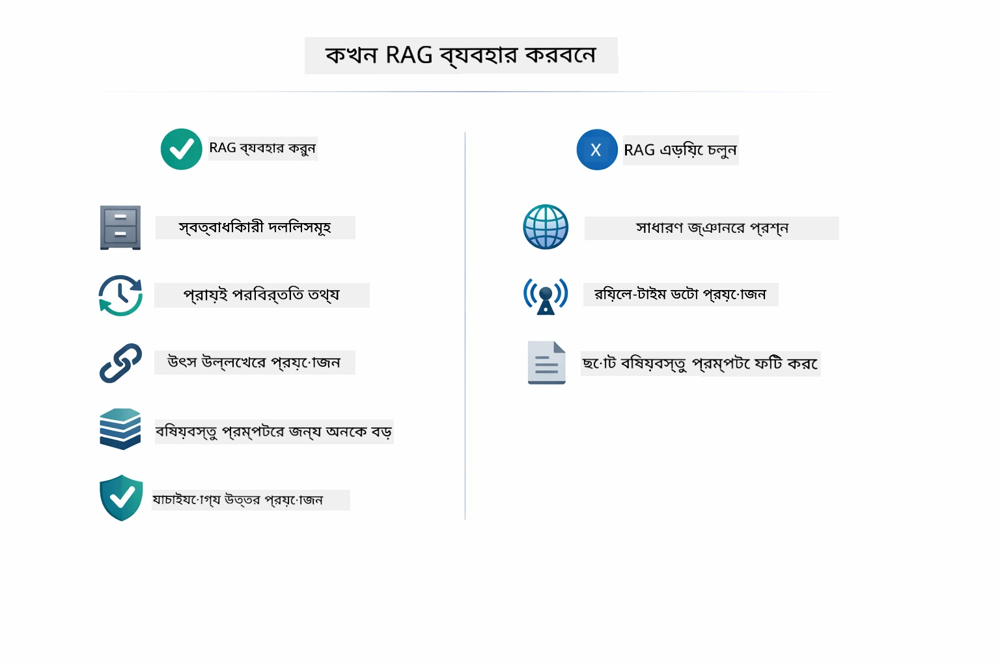

*এই চিত্রটি সিদ্ধান্ত গাইড দেখায় যাতে বোঝা যায় কখন RAG মূল্য সংযোজন করে এবং কখন সরল পন্থাগুলো যথেষ্ট।*

## পরবর্তী ধাপ

**পরবর্তী মডিউল:** [04-tools - AI Agents with Tools](../04-tools/README.md)

---

**নেভিগেশন:** [← পূর্ববর্তী: মডিউল ০২ - প্রম্পট ইঞ্জিনিয়ারিং](../02-prompt-engineering/README.md) | [মেইনে ফিরে যান](../README.md) | [পরবর্তী: মডিউল ০৪ - টুলস →](../04-tools/README.md)

---

<!-- CO-OP TRANSLATOR DISCLAIMER START -->
**দ্রষ্টব্য**:  
এই নথিটি AI অনুবাদ সেবা [Co-op Translator](https://github.com/Azure/co-op-translator) ব্যবহার করে অনূদিত হয়েছে। আমরা যথাসাধ্য সঠিকতার চেষ্টা করি, তবে স্বয়ংক্রিয় অনুবাদে ত্রুটি বা অনিশ্চয়তা থাকতে পারে দয়া করে খেয়াল রাখুন। মূল নথিটি তার মূল ভাষায়ই কর্তৃত্বপূর্ণ উৎস হিসাবে বিবেচনা করা উচিত। গুরুত্বপূর্ণ তথ্যের জন্য পেশাদার মানব অনুবাদের পরামর্শ দেওয়া হয়। এই অনুবাদের ব্যবহারে সৃষ্ট কোন ভুল-বুঝাবুঝি বা ভুল ব্যাখ্যার জন্য আমরা দায়ী নই।
<!-- CO-OP TRANSLATOR DISCLAIMER END -->