# মডিউল ০৪: টুলসহ AI এজেন্ট

## বিষয়বস্তু তালিকা

- [আপনি যা শিখবেন](../../../04-tools)
- [প্রয়োজনীয়তা](../../../04-tools)
- [টুলসহ AI এজেন্ট বোঝা](../../../04-tools)
- [কিভাবে টুল কলিং কাজ করে](../../../04-tools)
  - [টুল সংজ্ঞা](../../../04-tools)
  - [সিদ্ধান্ত গ্রহণ](../../../04-tools)
  - [কার্যকরী কার্যক্রম](../../../04-tools)
  - [প্রতিক্রিয়া সৃষ্টিকরণ](../../../04-tools)
  - [স্থাপত্য: স্প্রিং বুট অটো-ওয়্যারিং](../../../04-tools)
- [টুল চেইনিং](../../../04-tools)
- [অ্যাপ্লিকেশন চালান](../../../04-tools)
- [অ্যাপ্লিকেশন ব্যবহার](../../../04-tools)
  - [সহজ টুল ব্যবহার চেষ্টা করুন](../../../04-tools)
  - [টুল চেইনিং পরীক্ষা করুন](../../../04-tools)
  - [আলাপচারিতার প্রবাহ দেখুন](../../../04-tools)
  - [বিভিন্ন অনুরোধ নিয়ে পরীক্ষা-নিরীক্ষা করুন](../../../04-tools)
- [মূল ধারণা](../../../04-tools)
  - [ReAct প্যাটার্ন (যুক্তি ও কার্য)](../../../04-tools)
  - [টুল বর্ণনা গুরুত্বপূর্ণ](../../../04-tools)
  - [সেশন পরিচালনা](../../../04-tools)
  - [ত্রুটি হ্যান্ডলিং](../../../04-tools)
- [উপলব্ধ টুলসমূহ](../../../04-tools)
- [কখন টুল-ভিত্তিক এজেন্ট ব্যবহার করবেন](../../../04-tools)
- [টুলস বনাম RAG](../../../04-tools)
- [পরবর্তী ধাপ](../../../04-tools)

## আপনি যা শিখবেন

এখন পর্যন্ত, আপনি AI সঙ্গে আলাপচারিতা করার, প্রম্পট কার্যকরভাবে গঠন করার এবং আপনার নথিতে প্রতিক্রিয়া ভিত্তি স্থাপন করার পদ্ধতি শিখেছেন। কিন্তু এখনও একটি মৌলিক সীমাবদ্ধতা রয়েছে: ভাষা মডেল শুধুমাত্র টেক্সট তৈরি করতে পারে। এটি আবহাওয়া পরীক্ষা করতে পারে না, গণনা করতে পারে না, ডাটাবেস অনুসন্ধান করতে পারে না অথবা বাহ্যিক সিস্টেমের সাথে যোগাযোগ করতে পারে না।

টুল এই পরিবর্তন ঘটায়। মডেলকে এমন ফাংশনগুলোর অ্যাক্সেস দিলে যা এটি কল করতে পারে, আপনি এটি একটি টেক্সট জেনারেটর থেকে এমন একটি এজেন্টে রূপান্তরিত করেন যা কাজ নিতে পারে। মডেল সিদ্ধান্ত নেয় কখন একটি টুল দরকার, কোন টুল ব্যবহার হবে, এবং কী প্যারামিটার পাঠানো হবে। আপনার কোড ফাংশনটি কার্যকর করে ফলাফল ফেরত দেয়। মডেল সেই ফলাফলটি তার প্রতিক্রিয়ায় অন্তর্ভুক্ত করে।

## প্রয়োজনীয়তা

- সম্পন্ন [মডিউল ০১ - পরিচিতি](../01-introduction/README.md) (Azure OpenAI রিসোর্স ডিপ্লয় করা হয়েছে)
- পূর্বের মডিউলগুলি সম্পন্ন করা সুপারিশ করা হয় (এই মডিউলটি টুলস বনাম RAG তুলনায় [মডিউল ০৩ থেকে RAG ধারণাগুলো](../03-rag/README.md) উল্লেখ করে)
- মূল ডিরেক্টরিতে `.env` ফাইল সহ Azure ক্রেডেনশিয়াল (মডিউল ০১ এ `azd up` দ্বারা তৈরি)

> **নোট:** আপনি যদি মডিউল ০১ সম্পন্ন না করে থাকেন, তাহলে লাস্টমে ডিপ্লয়মেন্ট নির্দেশনাগুলো প্রথমে অনুসরণ করুন।

## টুলসহ AI এজেন্ট বোঝা

> **📝 নোট:** এই মডিউলে "এজেন্ট" শব্দটি AI সহকারী নির্দেশ করে যার মধ্যে টুল কলিং ক্ষমতা যুক্ত আছে। এটি আলাদা **Agentic AI** প্যাটার্ন থেকে (স্বায়ত্তশাসিত এজেন্ট যারা পরিকল্পনা, স্মৃতি, ও বহু-ধাপ যুক্তি জন্য ব্যবহৃত হয়) যা আমরা [মডিউল ০৫: MCP](../05-mcp/README.md) এ আলোচনা করব।

টুল না থাকলে, ভাষা মডেল শুধুমাত্র তার প্রশিক্ষণ তথ্য থেকে টেক্সট তৈরি করতে পারে। বর্তমান আবহাওয়ার জানার জন্য জিজ্ঞাসা করলে, এটি অনুমান করতে হয়। টুল দিলে এটি আবহাওয়ার API কল করতে পারে, গণনা করতে পারে, বা ডাটাবেস অনুসন্ধান করতে পারে — এবং সেই বাস্তব ফলাফলগুলো তার প্রতিক্রিয়াতে বুনে দিতে পারে।

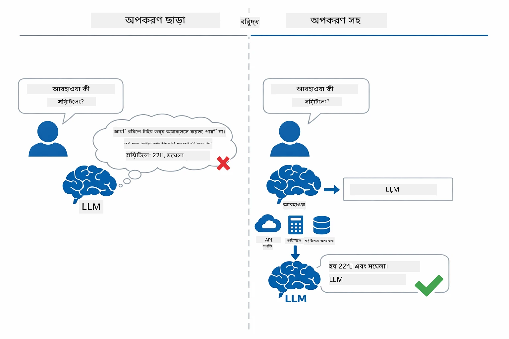

*টুল না থাকলে মডেল কেবল অনুমান করে — টুল দিয়ে এটি API কল করে, গণনা করে এবং বাস্তব সময় তথ্য ফেরত দেয়।*

একটি টুলসহ AI এজেন্ট অনুসরণ করে **যুক্তি ও কার্য (ReAct)** প্যাটার্ন। মডেল শুধু উত্তর দেয় না — এটি চিন্তা করে যা দরকার, একটি টুল কল করে কাজ করে, ফলাফল পর্যবেক্ষণ করে, এবং সিদ্ধান্ত নেয় আবার কাজ করবে বা চূড়ান্ত উত্তর প্রদান করবে:

১. **যুক্তি করুন** — এজেন্ট ব্যবহারকারীর প্রশ্ন বিশ্লেষণ করে কোন তথ্য প্রয়োজন নির্ধারণ করে  
২. **কার্যকর করুন** — এজেন্ট সঠিক টুল নির্বাচন করে, সঠিক প্যারামিটার তৈরি করে, এবং কল করে  
৩. **পর্যবেক্ষণ করুন** — এজেন্ট টুলের আউটপুট পায় এবং ফলাফল মূল্যায়ন করে  
৪. **পুনরাবৃত্তি বা উত্তর দিন** — যদি আরও তথ্য দরকার হয়, তখন আবার লুপ; অন্যথায় একটি প্রাঞ্জল ভাষার উত্তর তৈরি করে

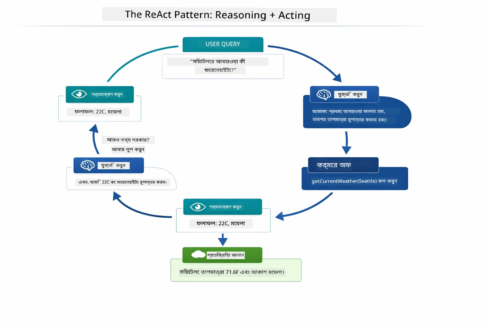

*ReAct চক্র — এজেন্ট চিন্তা করে করণীয়, টুল কল করে, ফলাফল পর্যবেক্ষণ করে, এবং চূড়ান্ত উত্তর প্রদানের আগে পুনরাবৃত্তি করে।*

এটি স্বয়ংক্রিয়ভাবে ঘটে। আপনি টুল এবং তার বর্ণনা নির্ধারণ করেন। মডেল সিদ্ধান্ত নেয় কখন এবং কিভাবে তা ব্যবহার করবে।

## কিভাবে টুল কলিং কাজ করে

### টুল সংজ্ঞা

[WeatherTool.java](../../../04-tools/src/main/java/com/example/langchain4j/agents/tools/WeatherTool.java) | [TemperatureTool.java](../../../04-tools/src/main/java/com/example/langchain4j/agents/tools/TemperatureTool.java)

আপনি ফাংশনগুলো পরিষ্কার বর্ণনা ও প্যারামিটার স্পেসিফিকেশনের সাথে সংজ্ঞায়িত করেন। মডেল এই বর্ণনাগুলো সিস্টেম প্রম্পটে দেখে বুঝতে পারে প্রতিটি টুল কি করে।

```java
@Component
public class WeatherTool {
    
    @Tool("Get the current weather for a location")
    public String getCurrentWeather(@P("Location name") String location) {
        // আপনার আবহাওয়া অনুসন্ধান লজিক
        return "Weather in " + location + ": 22°C, cloudy";
    }
}

@AiService
public interface Assistant {
    String chat(@MemoryId String sessionId, @UserMessage String message);
}

// সহকারী স্বয়ংক্রিয়ভাবে স্প্রিং বুট দ্বারা সংযুক্ত:
// - চ্যাটমডেল বীন
// - @Component ক্লাস থেকে সব @Tool পদ্ধতি
// - সেশন ব্যবস্থাপনার জন্য ChatMemoryProvider
```

নিচের ডায়াগ্রামটি প্রতিটি অ্যানোটেশন বিশ্লেষণ করে এবং দেখায় কিভাবে প্রতিটি অংশ AI কে বুঝতে সাহায্য করে কখন টুল কল করতে হবে এবং কী আর্গুমেন্ট দিতে হবে:

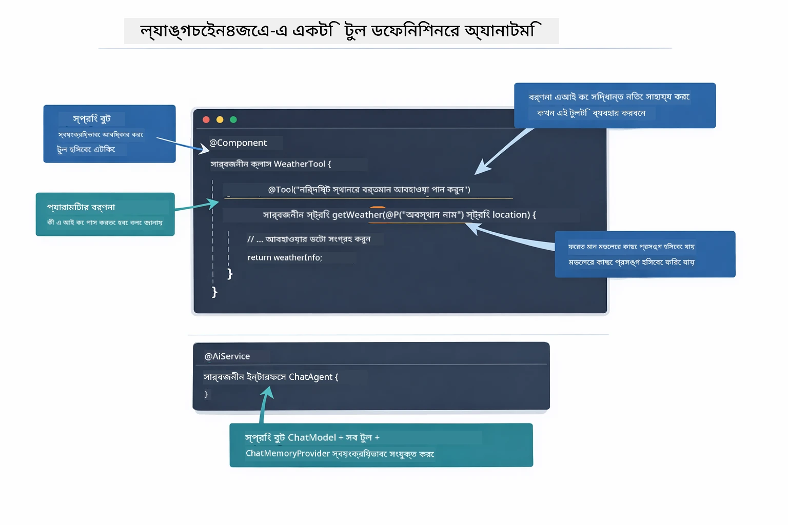

*একটি টুল সংজ্ঞার গঠন — @Tool AI কে বলে কখন ব্যবহার করতে হবে, @P প্রতিটি প্যারামিটার বর্ণনা করে, এবং @AiService সমস্ত কিছু শুরুতেই সংযোগ করে।*

> **🤖 GitHub Copilot Chat দিয়ে চেষ্টা করুন:** [`WeatherTool.java`](../../../04-tools/src/main/java/com/example/langchain4j/agents/tools/WeatherTool.java) খুলে জিজ্ঞাসা করুন:  
> - "কিভাবে মক ডাটা ব্যবহার না করে বাস্তব আবহাওয়া API যেমন OpenWeatherMap সংযোগ করব?"  
> - "কোন টুল বর্ণনা ভালো যা AI এর সঠিক ব্যবহার নিশ্চিত করে?"  
> - "টুল ইমপ্লিমেন্টেশনে API এরর ও রেট লিমিট কিভাবে সঠিকভাবে হ্যান্ডেল করব?"

### সিদ্ধান্ত গ্রহণ

যখন ব্যবহারকারী বলে "সিয়াটলের আবাহাওয়া কেমন?" মডেল এলোমেলো টুল নির্বাচন করে না। এটি প্রতিটি টুলের বর্ণনার সাথে ব্যবহারকারীর উদ্দেশ্য তুলনা করে, প্রাসঙ্গিকতার স্কোর দেয়, এবং সেরা ম্যাচ নির্বাচন করে। এরপরে সঠিক প্যারামিটার সহ একটি ফাংশন কল (যেমন `location` কে `"Seattle"` সেট করে) তৈরি করে।

যদি কোন টুল ব্যবহারকারীর অনুরোধের সাথে মেলে না, তবে মডেল নিজের জ্ঞানে থেকে উত্তর দেয়। যদি একাধিক টুল মেলে, সবচেয়ে নির্দিষ্টটি নির্বাচন করে।

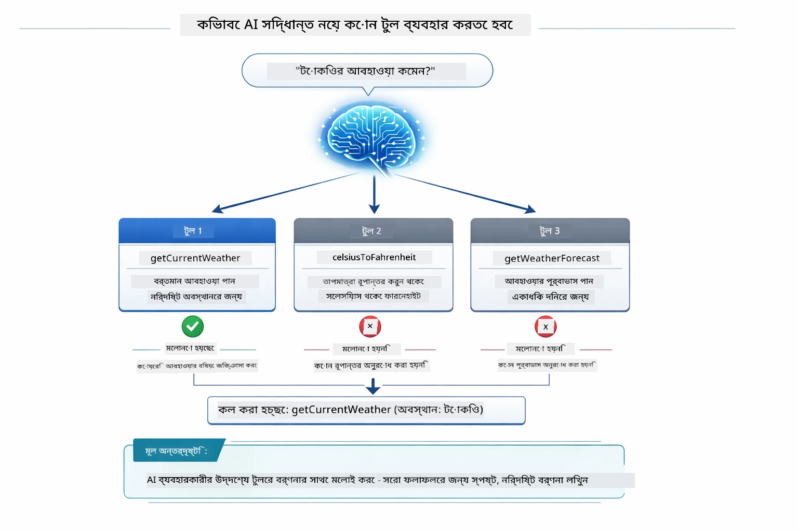

*মডেল প্রতিটি উপলভ্য টুল ব্যবহারকারীর উদ্দেশ্যের সাথে মূল্যায়ন করে এবং সেরা ম্যাচ নির্বাচন করে — তাই পরিষ্কার ও নির্দিষ্ট টুল বর্ণনা লেখা গুরুত্বপূর্ণ।*

### কার্যকরী কার্যক্রম

[AgentService.java](../../../04-tools/src/main/java/com/example/langchain4j/agents/service/AgentService.java)

স্প্রিং বুট ঘোষণা করা `@AiService` ইন্টারফেসকে সকল নিবন্ধিত টুলের সাথে অটো-ওয়্যার করে, এবং LangChain4j স্বয়ংক্রিয়ভাবে টুল কল নির্বাহ করে। পেছনের দৃশ্যে, পুর্ণাঙ্গ টুল কল ছয়টি পর্যায়ের মাধ্যমে প্রবাহিত হয় — ব্যবহারকারীর প্রাকৃতিক ভাষার প্রশ্ন থেকে শুরু করে প্রাকৃতিক ভাষার উত্তরে ফিরে যাওয়া পর্যন্ত:

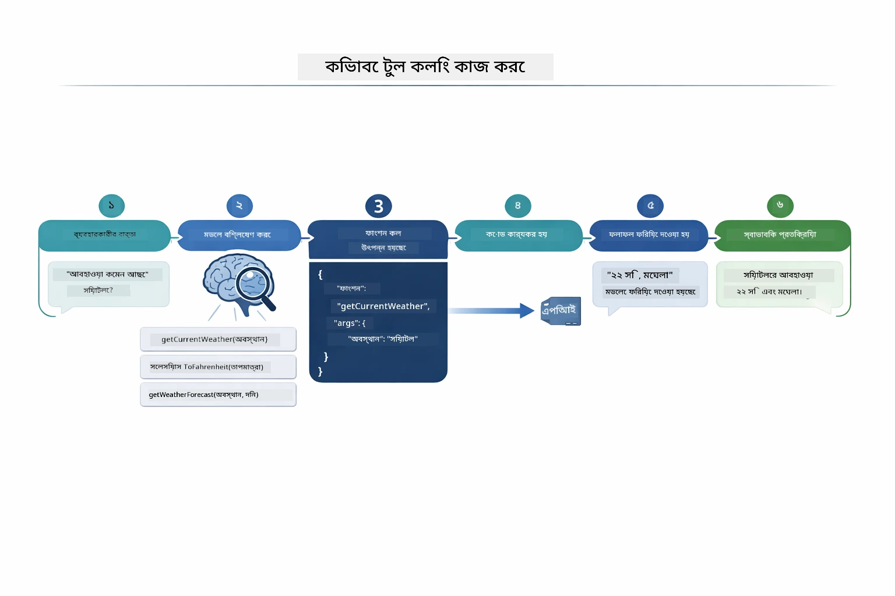

*পূর্ণাঙ্গ ফ্লো — ব্যবহারকারী প্রশ্ন করে, মডেল টুল নির্বাচন করে, LangChain4j সেটি কার্যকর করে, এবং মডেল ফলাফল প্রাকৃতিক উত্তরে বুনে দেয়।*

আপনি যদি মডিউল ০০ তে [ToolIntegrationDemo](../../../00-quick-start/src/main/java/com/example/langchain4j/quickstart/ToolIntegrationDemo.java) চালিয়ে থাকেন, তাহলে এই প্যাটার্নটি আগে দেখেছেন — `Calculator` টুলগুলো একইভাবে কল হয়েছিল। নিচের সিকুয়েন্স ডায়াগ্রামটি দেখায় ঠিক কী ঘটেছিল ওই ডেমোর সময়:

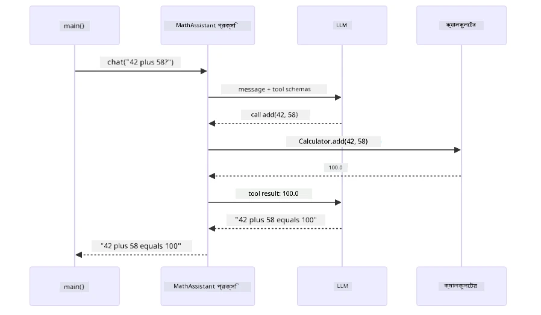

*কুইক স্টার্ট ডেমো থেকে টুল কলিং লুপ — `AiServices` আপনার বার্তা ও টুল স্কিমা LLM-এ পাঠায়, LLM `add(42, 58)` মতো ফাংশন কল সহ উত্তর দেয়, LangChain4j লোকালি `Calculator` পদ্ধতি নির্বাহ করে, এবং ফলাফল চূড়ান্ত উত্তরের জন্য ফেরত দেয়।*

> **🤖 GitHub Copilot Chat দিয়ে চেষ্টা করুন:** [`AgentService.java`](../../../04-tools/src/main/java/com/example/langchain4j/agents/service/AgentService.java) খুলে জিজ্ঞাসা করুন:  
> - "ReAct প্যাটার্ন কিভাবে কাজ করে এবং কেন AI এজেন্টের জন্য কার্যকর?"  
> - "এজেন্ট কিভাবে সিদ্ধান্ত নেয় কোন টুল কখন ও কোন ক্রমে ব্যবহার করবে?"  
> - "যদি টুল কার্যকারিতা ব্যর্থ হয়, ত্রুটি কীভাবে দৃঢ়ভাবে হ্যান্ডেল করব?"

### প্রতিক্রিয়া সৃষ্টিকরণ

মডেল আবহাওয়া তথ্য গ্রহণ করে এবং ব্যবহারকারীর জন্য একটি স্বাভাবিক ভাষায় প্রতিক্রিয়া তৈরি করে।

### স্থাপত্য: স্প্রিং বুট অটো-ওয়্যারিং

এই মডিউলটি LangChain4j এর স্প্রিং বুট ইন্টিগ্রেশন ব্যবহার করে ঘোষণা করা `@AiService` ইন্টারফেসগুলির সাথে। শুরুতে স্প্রিং বুট প্রত্যেকটি `@Component` যা `@Tool` পদ্ধতি ধারণ করে, আপনার `ChatModel` বিন এবং `ChatMemoryProvider` আবিষ্কার করে—তাদের সবাইকে একটি একক `Assistant` ইন্টারফেসে সংযুক্ত করে যা জিরো বয়লারপ্লেট প্রদান করে।

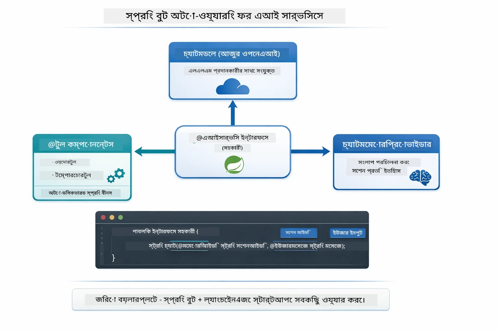

*`@AiService` ইন্টারফেসটি ChatModel, টুল কম্পোনেন্ট, এবং মেমরি প্রোভাইডার একত্রিত করে — স্প্রিং বুট সমস্ত ওয়্যারিং স্বয়ংক্রিয়ভাবে পরিচালনা করে।*

সম্পূর্ণ অনুরোধ জীববৃত্তের সিকুয়েন্স ডায়াগ্রাম এখানে — HTTP অনুরোধ থেকে কন্ট্রোলার, সার্ভিস, অটো-ওয়্যার প্রক্সি, এবং টুল কার্যকরী পর্যন্ত:

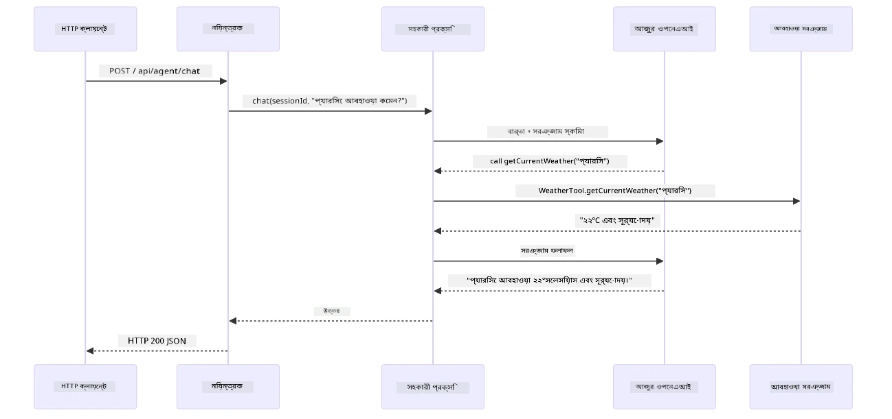

*পূর্ণাঙ্গ স্প্রিং বুট অনুরোধ জীববৃত্ত — HTTP অনুরোধ কন্ট্রোলার ও সার্ভিস দিয়ে প্রবাহিত হয় এবং অটো-ওয়্যার `Assistant` প্রক্সিতে পৌঁছে, যা LLM ও টুল কলগুলো স্বয়ংক্রিয়ভাবে সমন্বিত করে।*

এই পদ্ধতির মূল সুবিধা:

- **স্প্রিং বুট অটো-ওয়্যারিং** — ChatModel ও টুলগুলো স্বয়ংক্রিয়ভাবে ইনজেক্টেড  
- **@MemoryId প্যাটার্ন** — স্বয়ংক্রিয় সেশন-ভিত্তিক মেমরি পরিচালনা  
- **একক ইন্সট্যান্স** — Assistant একবার তৈরি হয়ে পুনরায় ব্যবহৃত হয়, উন্নত কর্মক্ষমতার জন্য  
- **টাইপ-সেফ এক্সিকিউশন** — জাভা মেথড সরাসরি টাইপ রূপান্তরিত করে কল হয়  
- **মাল্টি-টার্ন অর্কেস্ট্রেশন** — টুল চেইনিং স্বয়ংক্রিয়ভাবে পরিচালনা করে  
- **জিরো বয়লারপ্লেট** — কোন ম্যানুয়াল `AiServices.builder()` কল বা মেমরি HashMap দরকার হয় না

বিকল্প পদ্ধতি (`AiServices.builder()` ম্যানুয়াল) বেশি কোডের প্রয়োজন এবং স্প্রিং বুট ইন্টিগ্রেশনের সুবিধা মিস করে।

## টুল চেইনিং

**টুল চেইনিং** — টুল-ভিত্তিক এজেন্টের প্রকৃত ক্ষমতা দেখা যায় যখন একটি প্রশ্নের জন্য একাধিক টুল দরকার হয়। প্রশ্ন করুন "সিয়াটলের আবহাওয়া ফারেনহাইটে কত?" এজেন্ট স্বয়ংক্রিয়ভাবে দুইটি টুল চেইন করে: প্রথমে `getCurrentWeather` কল করে সেলসিয়াস তাপমাত্রা আনে, পরে ঐ মান `celsiusToFahrenheit` তে পাঠিয়ে রূপান্তর করে — সব একক আলাপচারিতার মোড়কে।

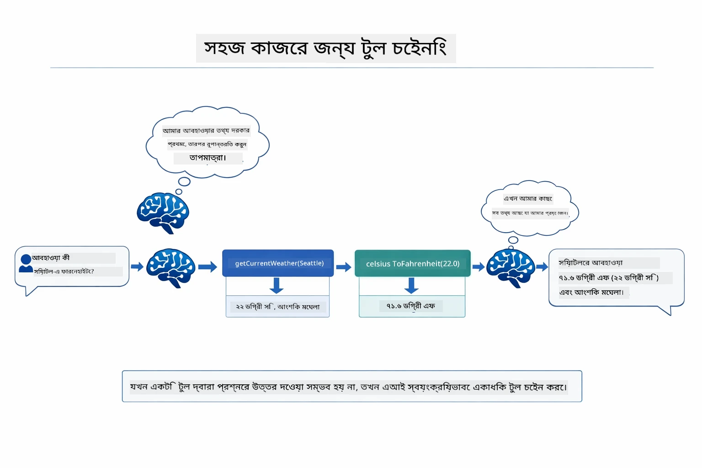

*টুল চেইনিং কার্যক্রম — এজেন্ট প্রথমে getCurrentWeather কল করে, তারপর সেলসিয়াস ফলাফল celsiusToFahrenheit এ পাঠায়, এবং সম্মিলিত উত্তর প্রদান করে।*

**সুশৃঙ্খল ব্যর্থতা** — যদি আবহাওয়ার জন্য এমন একটি শহর চান যা মক ডাটায় নেই। টুল একটি ত্রুটি বার্তা ফেরত দেয়, এবং AI ব্যাখ্যা করে যে সাহায্য করতে পারবে না, পুরো অ্যাপ ক্র্যাশ না করে। টুলগুলো সেফলি ফেইল করে। নিচের ডায়াগ্রাম দুটি পদ্ধতির স্বচ্ছ তুলনা করে — সঠিক ত্রুটি হ্যান্ডলিংয়ের মাধ্যমে এজেন্ট ব্যতিক্রম ধরে সহায়ক প্রতিক্রিয়া দেয়, অন্যদিকে তা না করলে পুরো অ্যাপ্লিকেশন ক্র্যাশ হয়:

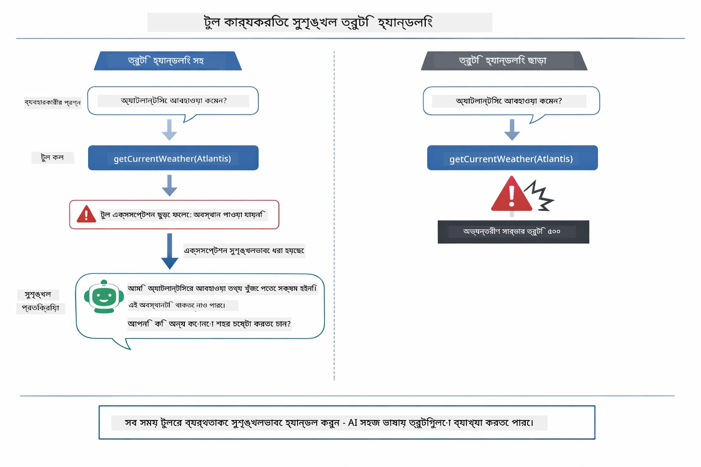

*যখন টুল ব্যর্থ হয়, এজেন্ট ত্রুটি ধারণ করে এবং ক্র্যাশ করার পরিবর্তে সহায়ক ব্যাখ্যা দেয়।*

এটি একটি একক আলাপচারিতার মোড়কে ঘটে। এজেন্ট স্বয়ংক্রিয়ভাবে একাধিক টুল কল পরিচালনা করে।

## অ্যাপ্লিকেশন চালান

**ডিপ্লয়মেন্ট যাচাই করুন:**

নিশ্চিত করুন মূল ডিরেক্টরিতে `.env` ফাইল রয়েছে Azure ক্রেডেনশিয়াল সহ (মডিউল ০১ চলাকালীন তৈরি)। এই মডিউল ডিরেক্টরি (`04-tools/`) থেকে চালান:

**Bash:**  
```bash
cat ../.env  # AZURE_OPENAI_ENDPOINT, API_KEY, DEPLOYMENT দেখানো উচিত
```
  
**PowerShell:**  
```powershell
Get-Content ..\.env  # AZURE_OPENAI_ENDPOINT, API_KEY, DEPLOYMENT দেখানো উচিত
```
  
**অ্যাপ্লিকেশন শুরু করুন:**

> **নোট:** আপনি যদি ইতিমধ্যে মূল ডিরেক্টরি থেকে `./start-all.sh` ব্যবহার করে সব অ্যাপ্লিকেশন শুরু করে থাকেন (মডিউল ০১ এ দেওয়া নির্দেশনা অনুযায়ী), তাহলে এই মডিউল ইতিমধ্যেই পোর্ট ৮০৮৪ এ চলছে। আপনি নিচের শুরু কমান্ডগুলো বাদ দিয়ে সরাসরি http://localhost:8084 এ যেতে পারেন।

**বিকল্প ১: স্প্রিং বুট ড্যাশবোর্ড ব্যবহার করা (VS Code ব্যবহারকারীদের জন্য সুপারিশ করা)**

ডেভ কন্টেইনারে রয়েছে স্প্রিং বুট ড্যাশবোর্ড এক্সটেনশন, যা সব স্প্রিং বুট অ্যাপ্লিকেশন ব্যবস্থাপনার জন্য ভিজ্যুয়াল ইন্টারফেস দেয়। VS Code এর বামদিকে অ্যাক্টিভিটি বারে (স্প্রিং বুট আইকন দেখুন) এটি খুঁজে পাবেন।

স্প্রিং বুট ড্যাশবোর্ড থেকে আপনি:  
- ওয়ার্কস্পেসের সব স্প্রিং বুট অ্যাপ্লিকেশন দেখতে পারবেন  
- এক ক্লিকে অ্যাপ্লিকেশন চালু/বন্ধ করতে পারবেন  
- বাস্তব সময়ে অ্যাপ্লিকেশন লগ দেখতে পারবেন  
- অ্যাপ্লিকেশন স্ট্যাটাস পর্যবেক্ষণ করতে পারবেন

"tools" পাশের প্লে বাটন ক্লিক করে এই মডিউল শুরু করুন, অথবা একবারে সব মডিউল শুরু করুন।

VS Code এ স্প্রিং বুট ড্যাশবোর্ড এর চেহারাঃ


*VS Code এ স্প্রিং বুট ড্যাশবোর্ড — এক জায়গা থেকে সব মডিউল শুরু, বন্ধ, ও মনিটর করুন*

**বিকল্প ২: শেল স্ক্রিপ্ট ব্যবহার করা**

সব ওয়েব অ্যাপ্লিকেশন চালু করুন (মডিউল ০১-০৪):  

**Bash:**
```bash
cd ..  # রুট ডিরেক্টরি থেকে
./start-all.sh
```

**PowerShell:**
```powershell
cd ..  # রুট ডিরেক্টরি থেকে
.\start-all.ps1
```

অথবা কেবল এই মডিউল শুরু করুন:

**Bash:**
```bash
cd 04-tools
./start.sh
```

**PowerShell:**
```powershell
cd 04-tools
.\start.ps1
```

উভয় স্ক্রিপ্ট স্বয়ংক্রিয়ভাবে রুট `.env` ফাইল থেকে পরিবেশ ভেরিয়েবল লোড করে এবং যদি JAR গুলো না থাকে তবে সেগুলো তৈরি করবে।

> **Note:** আপনি যদি শুরু করার আগে সমস্ত মডিউল ম্যানুয়ালি তৈরি করতে চান:
>
> **Bash:**
> ```bash
> cd ..  # Go to root directory
> mvn clean package -DskipTests
> ```
>
> **PowerShell:**
> ```powershell
> cd ..  # Go to root directory
> mvn clean package -DskipTests
> ```

আপনার ব্রাউজারে http://localhost:8084 খুলুন।

**বন্ধ করতে:**

**Bash:**
```bash
./stop.sh  # এই মডিউল মাত্র
# অথবা
cd .. && ./stop-all.sh  # সমস্ত মডিউলসমূহ
```

**PowerShell:**
```powershell
.\stop.ps1  # শুধুমাত্র এই মডিউল
# অথবা
cd ..; .\stop-all.ps1  # সব মডিউলসমূহ
```

## অ্যাপ্লিকেশন ব্যবহার করা

অ্যাপ্লিকেশনটি একটি ওয়েব ইন্টারফেস প্রদান করে যেখানে আপনি একটি AI এজেন্টের সাথে ইন্টারঅ্যাক্ট করতে পারেন যেটি আবহাওয়া এবং তাপমাত্রা রূপান্তর টুলস-এর প্রবেশাধিকার রয়েছে। ইন্টারফেসটি দেখতে কেমন — এতে দ্রুত শুরু করার উদাহরণ এবং অনুরোধ পাঠানোর জন্য একটি চ্যাট প্যানেল অন্তর্ভুক্ত রয়েছে:

<a href="images/tools-homepage.png"></a>

*AI Agent Tools ইন্টারফেস - দ্রুত উদাহরণ এবং টুলসের সাথে ইন্টারঅ্যাকশনের জন্য চ্যাট ইন্টারফেস*

### সহজ টুল ব্যবহারের চেষ্টা করুন

সরল অনুরোধ দিয়ে শুরু করুন: "100 ডিগ্রি ফারেনহাইট কে সেলসিয়াসে রূপান্তর করুন"। এজেন্ট চিনে নেয় যে এটি তাপমাত্রা রূপান্তর টুল ব্যবহার করতে হবে, সঠিক প্যারামিটার সহ কল করে এবং রেজাল্ট ফিরিয়ে দেয়। লক্ষ্য করুন কতটা প্রাকৃতিক মনে হয় - আপনি নির্দিষ্ট করেননি কোন টুল ব্যবহার করবেন বা কিভাবে কল করবেন।

### টুল চেইনিং পরীক্ষা করুন

এখন আরও জটিল কিছু চেষ্টা করুন: "সিয়াটলের আবহাওয়া কী এবং সেটি ফারেনহাইটে রূপান্তর করুন?" দেখুন এজেন্ট ধাপে ধাপে কিভাবে কাজ করে। প্রথমে আবহাওয়া (যা সেলসিয়াসে রিটার্ন করে) পায়, বুঝতে পারে ফারেনহাইটে রূপান্তর করতে হবে, রূপান্তর টুল কল করে, এবং উভয় ফলাফল একত্রে একটি উত্তর দেয়।

### কথোপকথন প্রবাহ দেখুন

চ্যাট ইন্টারফেস কথোপকথনের ইতিহাস সংরক্ষণ করে, যা আপনাকে বহুবারের সংলাপে সাহায্য করে। আপনি সব পূর্ববর্তী প্রশ্ন এবং উত্তর দেখতে পারেন, যা কথোপকথন ট্র্যাক করা এবং এজেন্ট কিভাবে একাধিক আদান-প্রদান মাধ্যমে প্রসঙ্গ তৈরি করে বুঝতে সহজ করে।

<a href="images/tools-conversation-demo.png"></a>

*একাধিক টুল কল সহ বহুবারের কথোপকথন যা সহজ রূপান্তর, আবহাওয়া অনুসন্ধান, এবং টুল চেইনিং দেখায়*

### বিভিন্ন অনুরোধের সাথে পরীক্ষা করুন

বিভিন্ন সংমিশ্রণ চেষ্টা করুন:
- আবহাওয়ার অনুসন্ধান: "টোকিওতে আবহাওয়া কেমন?"
- তাপমাত্রা রূপান্তর: "২৫°C কত কেলভিন?"
- মিলিত প্রশ্ন: "প্যারিসে আবহাওয়া পরীক্ষা করুন এবং বলুন এটা ২০°C এর উপরে কিনা"

দেখুন কিভাবে এজেন্ট প্রাকৃতিক ভাষা ব্যাখ্যা করে এবং উপযুক্ত টুল কলের সঙ্গে মিলিয়ে নেয়।

## গুরুত্বপূর্ণ ধারণা

### ReAct প্যাটার্ন (যুক্তি ও কর্ম)

এজেন্ট যুক্তি (কী করতে হবে সিদ্ধান্ত নেওয়া) এবং কর্ম (টুল ব্যবহারের মাধ্যমে) এর মধ্যে পাল্টা যায়। এই প্যাটার্ন স্বয়ংক্রিয় সমস্যা সমাধান সক্ষম করে শুধুমাত্র নির্দেশনা অনুসরণের পরিবর্তে।

### টুল বর্ণনা গুরুত্বপূর্ণ

আপনার টুল বর্ণনার গুণমানে নির্ভর করে এজেন্ট কত ভালো করে সেগুলো ব্যবহার করে। স্পষ্ট এবং নির্দিষ্ট বর্ণনা মডেলকে বুঝতে সাহায্য করে কখন এবং কিভাবে প্রতিটি টুল কল করতে হয়।

### সেশন ম্যানেজমেন্ট

`@MemoryId` অ্যানোটেশন স্বয়ংক্রিয় সেশন-ভিত্তিক মেমোরি ব্যবস্থাপনা সক্ষম করে। প্রতিটি সেশন আইডি তার নিজস্ব `ChatMemory` ইনস্ট্যান্স পায় যা `ChatMemoryProvider` বিন দ্বারা পরিচালিত হয়, তাই একাধিক ব্যবহারকারী একই সময়ে এজেন্টের সাথে আলাদা আলাদা কথা বলতে পারে। নিচের চিত্রটি দেখায় কিভাবে একাধিক ব্যবহারকারী তাদের সেশন আইডি অনুযায়ী আলাদা আলাদা মেমোরি স্টোরে রাউট করা হয়:

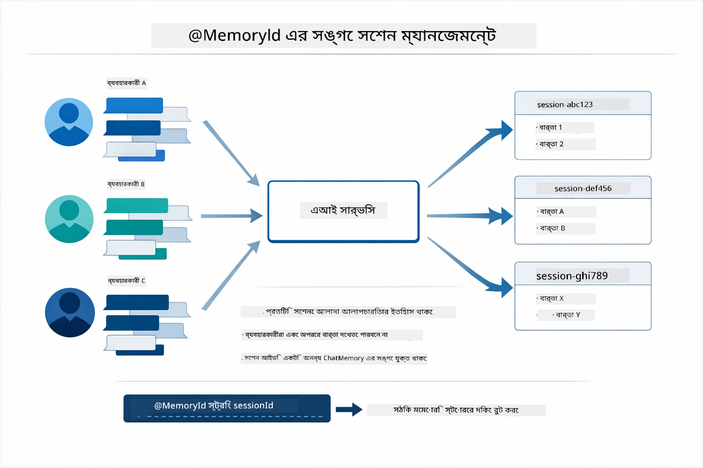

*প্রত্যেক সেশন আইডি একটি পৃথক কথোপকথন ইতিহাসে ম্যাপ করা হয় — ব্যবহারকারীরা একে অপরের বার্তা কখনো দেখতে পায় না।*

### ত্রুটি পরিচালনা

টুলস ব্যর্থ হতে পারে — API টাইমআউট, প্যারামিটার ভুল হতে পারে, বাহ্যিক সার্ভিস ডাউন হতে পারে। প্রোডাকশন এজেন্টদের ত্রুটি পরিচালনার প্রয়োজন যাতে মডেল সমস্যা ব্যাখ্যা করতে পারে বা বিকল্প চেষ্টা করতে পারে সম্পূর্ণ অ্যাপ্লিকেশন ক্র্যাশ না করে। যখন টুল এক্সসেপশন ফেলে, LangChain4j এটি ক্যাচ করে এবং ত্রুটি বার্তা মডেলের কাছে প্রদান করে, যা প্রাকৃতিক ভাষায় সমস্যা ব্যাখ্যা করতে পারে।

## উপলব্ধ টুলস

নিচের চিত্রটি দেখায় যে আপনি বিভিন্ন টুল তৈরি করতে পারেন। এই মডিউলটি আবহাওয়া এবং তাপমাত্রা টুলস প্রদর্শন করে, কিন্তু একই `@Tool` প্যাটার্ন যেকোনো জাভা মেথডের জন্য কাজ করে — ডেটাবেস কুয়েরি থেকে পেমেন্ট প্রসেসিং পর্যন্ত।

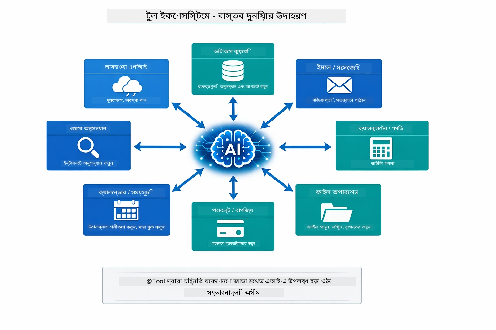

*যেকোনো জাভা মেথড যা @Tool দিয়ে অ্যানোটেট করা হয় AI এর জন্য উপলব্ধ হয় — প্যাটার্নটি ডেটাবেস, API, ইমেইল, ফাইল অপারেশন সহ আরও অন্যান্য ক্ষেত্রে প্রসারিত।*

## কখন টুল-ভিত্তিক এজেন্ট ব্যবহার করবেন

প্রতি অনুরোধই টুলসের প্রয়োজন হয় না। সিদ্ধান্ত আসে AI কে বাহ্যিক সিস্টেমের সাথে ইন্টারঅ্যাক্ট করতে হবে কিনা বা তার নিজস্ব জ্ঞান থেকে উত্তর দিতে পারবে কিনা। নিচের গাইড সারাংশ দেয় কখন টুলস দরকার এবং কখন অপ্রয়োজনীয়:

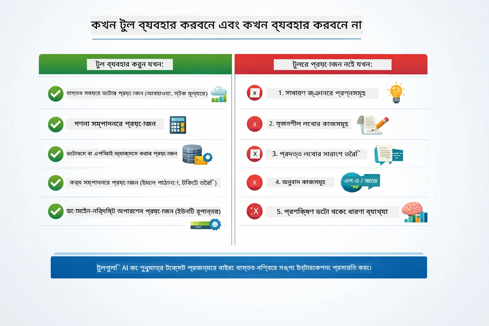

*দ্রুত সিদ্ধান্তের গাইড — টুলস প্রয়োজন রিয়েল-টাইম ডেটা, হিসাব-নিকাশ এবং ক্রিয়াকলাপের জন্য; সাধারণ জ্ঞান ও সৃষ্টিশীল কাজের জন্য দরকার হয় না।*

## টুলস বনাম RAG

মডিউল ০৩ এবং ০৪ উভয়ই AI ক্ষমতা বাড়ায়, কিন্তু মৌলিকভাবে ভিন্নভাবে। RAG মডেলকে **জ্ঞান** প্রদান করে ডকুমেন্ট রিট্রিভের মাধ্যমে। টুলস মডেলকে **ক্রিয়া** গ্রহণের ক্ষমতা দেয় ফাংশন কল করার মাধ্যমে। নিচের চিত্রে এই দুই পদ্ধতির তুলনা দেখানো হলো — প্রত্যেক কাজপ্রবাহ কিভাবে কাজ করে এবং তাদের মাঝে লেনদেনগুলি:

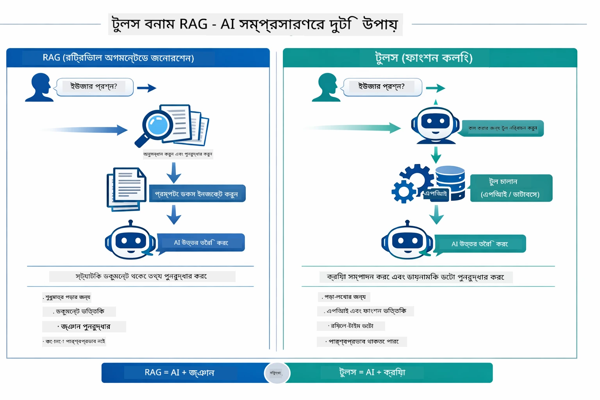

*RAG স্ট্যাটিক ডকুমেন্ট থেকে তথ্য উদ্ধার করে — টুলস কার্য প্রয়োগ করে এবং ডায়নামিক, রিয়েল-টাইম ডেটা নিয়ে আসে। অনেক প্রোডাকশন সিস্টেম উভয় পদ্ধতির সম্মিলন করে।*

প্রায়শই, প্রকৃত প্রোডাকশন সিস্টেম উভয় পদ্ধতির সংমিশ্রণ করে: RAG আপনাদের নথিপত্রে উত্তর ভিত্তিক করতে, এবং টুলস লাইভ ডেটা আনতে বা অপারেশন করতে।

## পরবর্তী ধাপ

**পরবর্তী মডিউল:** [05-mcp - Model Context Protocol (MCP)](../05-mcp/README.md)

---

**নেভিগেশন:** [← পূর্ববর্তী: মডিউল ০৩ - RAG](../03-rag/README.md) | [প্রধান পৃষ্ঠায় ফেরত](../README.md) | [পরবর্তী: মডিউল ০৫ - MCP →](../05-mcp/README.md)

---

<!-- CO-OP TRANSLATOR DISCLAIMER START -->
**দিয়ে রাখছি**:
এই নথিটি AI অনুবাদ সেবা [Co-op Translator](https://github.com/Azure/co-op-translator) ব্যবহার করে অনুবাদ করা হয়েছে। আমরা যথাসাধ্য সঠিকতার চেষ্টা করি, তবে অনুগ্রহ করে মনে রাখবেন যে স্বয়ংক্রিয় অনুবাদে ভুল বা অপ্রামাণিকতা থাকতে পারে। মূল নথিটি তার নিজস্ব ভাষায় যথাযথ ও বিশ্বাসযোগ্য উৎস হিসেবে বিবেচিত হওয়া উচিত। গুরুত্বপুর্ণ তথ্যের জন্য পেশাদার মানব অনুবাদ পরামর্শযোগ্য। এই অনুবাদের ব্যবহারে ঘটিত কোনো ভুলবোঝাবুঝি কিংবা ভুল ব্যাখ্যার জন্য আমরা দায়বদ্ধ নই।
<!-- CO-OP TRANSLATOR DISCLAIMER END -->