# Module 05: মডেল কনটেক্সট প্রোটোকল (MCP)

## Table of Contents

- [ভিডিও ওয়াকথ্রু](../../../05-mcp)
- [আপনি কী শিখবেন](../../../05-mcp)
- [MCP কী?](../../../05-mcp)
- [MCP কীভাবে কাজ করে](../../../05-mcp)
- [এজেন্টিক মডিউল](../../../05-mcp)
- [উদাহরণগুলি চালানো](../../../05-mcp)
  - [প্রয়োজনীয় শর্তাদি](../../../05-mcp)
- [দ্রুত শুরু](../../../05-mcp)
  - [ফাইল অপারেশনস (স্টডিও)](../../../05-mcp)
  - [সুপারভাইজার এজেন্ট](../../../05-mcp)
    - [ডেমো চালানো](../../../05-mcp)
    - [সুপারভাইজার কীভাবে কাজ করে](../../../05-mcp)
    - [FileAgent কীভাবে রানটাইমে MCP টুলস আবিষ্কার করে](../../../05-mcp)
    - [প্রতিক্রিয়া কৌশলসমূহ](../../../05-mcp)
    - [আউটপুট বোঝা](../../../05-mcp)
    - [এজেন্টিক মডিউলের বৈশিষ্ট্য ব্যাখ্যা](../../../05-mcp)
- [মূল ধারণা](../../../05-mcp)
- [অভিনন্দন!](../../../05-mcp)
  - [পরবর্তীতে কী?](../../../05-mcp)

## ভিডিও ওয়াকথ্রু

এই লাইভ সেশনটি দেখুন যা এই মডিউল শুরু করার পদ্ধতি ব্যাখ্যা করে:

<a href="https://www.youtube.com/watch?v=O_J30kZc0rw"></a>

## আপনি কী শিখবেন

আপনি কথোপকথনশীল AI তৈরি করেছেন, প্রম্পটগুলি দক্ষতার সাথে নিয়ন্ত্রণ করেছেন, ডকুমেন্টে ভিত্তি করে উত্তর দিয়েছেন, এবং টুলস সহ এজেন্ট তৈরি করেছেন। কিন্তু সব সেই টুলস আপনার নির্দিষ্ট অ্যাপ্লিকেশনের জন্য কাস্টম-তৈরি। যদি আপনি আপনার AI কে একটি মানকীকৃত টুলস ইকোসিস্টেম ব্যবহার করার সুযোগ দিতে পারেন যা কেউ যেকেউ তৈরি ও শেয়ার করতে পারে, তাহলে কেমন হয়? এই মডিউলে, আপনি শেখবেন মডেল কনটেক্সট প্রোটোকল (MCP) এবং LangChain4j এর এজেন্টিক মডিউল ব্যবহার করে কীভাবে তা করা যায়। আমরা প্রথমে একটি সহজ MCP ফাইল রিডার প্রদর্শন করব এবং তারপর দেখাবো কীভাবে এটি সুপারভাইজার এজেন্ট প্যাটার্ন ব্যবহার করে উন্নত এজেন্টিক ওয়ার্কফ্লোতে সহজেই সংযুক্ত হয়।

## MCP কী?

মডেল কনটেক্সট প্রোটোকল (MCP) ঠিক তা প্রদান করে - AI অ্যাপ্লিকেশনগুলোকে বাহ্যিক টুলস আবিষ্কার এবং ব্যবহার করার জন্য একটি মানক উপায়। প্রতিটি ডেটা সোর্স বা সার্ভিসের জন্য কাস্টম ইন্টিগ্রেশন লেখার পরিবর্তে, আপনি MCP সার্ভারগুলোর সাথে সংযুক্ত হন যা তাদের সক্ষমতাগুলো একটি সঙ্গতিপূর্ণ ফরম্যাটে প্রকাশ করে। আপনার AI এজেন্ট তখন স্বয়ংক্রিয়ভাবে এই টুলগুলি আবিষ্কার এবং ব্যবহার করতে পারে।

নীচের চিত্রটি পার্থক্যটি দেখায় — MCP না থাকলে, প্রতিটি ইন্টিগ্রেশনের জন্য কাস্টম পয়েন্ট-টু-পয়েন্ট ওয়্যারিং লাগে; MCP থাকলে, একটি প্রোটোকল আপনার অ্যাপকে যেকোনো টুলে সংযুক্ত করে:


*আইন MCP এর আগে: জটিল পয়েন্ট-টু-পয়েন্ট ইন্টিগ্রেশন। MCP এর পর: এক প্রোটোকল, অসীম সম্ভাবনা।*

MCP AI উন্নয়নে একটি মৌলিক সমস্যা সমাধান করে: প্রতিটি ইন্টিগ্রেশন কাস্টম। GitHub অ্যাক্সেস করতে চান? কাস্টম কোড। ফাইল পড়তে চান? কাস্টম কোড। ডাটাবেস প্রশ্ন করতে চান? কাস্টম কোড। এবং এই ইন্টিগ্রেশনসমূহ অন্য AI অ্যাপ্লিকেশনগুলোর সাথে কাজ করে না।

MCP এটি মানক করে তোলে। একটি MCP সার্ভার টুলগুলি স্পষ্ট বিবরণ এবং স্কিমাসহ প্রকাশ করে। যে কোনো MCP ক্লায়েন্ট সংযুক্ত হতে পারে, উপলব্ধ টুল আবিষ্কার করতে পারে, এবং ব্যবহার করতে পারে। একবার তৈরি করুন, সর্বত্র ব্যবহার করুন।

নীচের চিত্রটি এই স্থাপত্য দেখায় — একটি MCP ক্লায়েন্ট (আপনার AI অ্যাপ্লিকেশন) একাধিক MCP সার্ভারের সাথে সংযুক্ত হয়, প্রত্যেকে তাদের টুল সেগুলি স্ট্যান্ডার্ড প্রোটোকলের মাধ্যমে প্রকাশ করে:


*মডেল কনটেক্সট প্রোটোকল স্থাপত্য - মানকীকৃত টুল আবিষ্কার এবং কার্যকরী*

## MCP কীভাবে কাজ করে

অন্তর্গতভাবে, MCP একটি স্তরবদ্ধ স্থাপত্য ব্যবহার করে। আপনার Java অ্যাপ্লিকেশন (MCP ক্লায়েন্ট) উপলব্ধ টুল আবিষ্কার করে, JSON-RPC অনুরোধগুলি একটি ট্রান্সপোর্ট লেয়ারের মাধ্যমে (স্টডিও বা HTTP) পাঠায়, এবং MCP সার্ভার অপারেশন 수행 করে ফলাফল ফেরত দেয়। নিচের চিত্রটি এই প্রোটোকলের প্রতিটি স্তর সরল করে:

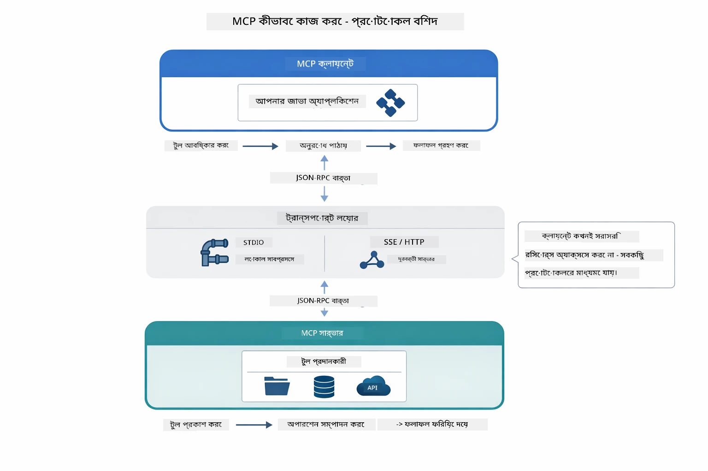

*MCP কীভাবে কাজ করে — ক্লায়েন্ট টুল আবিষ্কার করে, JSON-RPC বার্তা আদানপ্রদান করে, এবং ট্রান্সপোর্ট লেয়ারের মাধ্যমে অপারেশন সম্পন্ন করে।*

**সার্ভার-ক্লায়েন্ট স্থাপত্য**

MCP একটি ক্লায়েন্ট-সার্ভার মডেল ব্যবহার করে। সার্ভার টুল প্রদান করে - ফাইল পড়া, ডাটাবেস প্রশ্ন, API কল। ক্লায়েন্ট (আপনার AI অ্যাপ) সার্ভারের সাথে সংযুক্ত হয় এবং টুল ব্যবহার করে।

LangChain4j এর সাথে MCP ব্যবহার করতে, এই Maven নির্ভরতা যোগ করুন:

```xml
<dependency>
    <groupId>dev.langchain4j</groupId>
    <artifactId>langchain4j-mcp</artifactId>
    <version>${langchain4j.version}</version>
</dependency>
```

**টুল আবিষ্কার**

আপনার ক্লায়েন্ট যখন একটি MCP সার্ভারে সংযুক্ত হয়, তখন এটি জিজ্ঞাসা করে "তোমার কাছে কী টুল আছে?" সার্ভার উপলব্ধ টুলগুলোর তালিকা পাঠায়, প্রত্যেকটির বর্ণনা এবং প্যারামিটার স্কিমাসহ। আপনার AI এজেন্ট তারপর ব্যবহারকারীর অনুরোধের উপর ভিত্তি করে কী টুল ব্যবহার করতে হবে তা নির্ধারণ করতে পারে। নিচের চিত্রে এই হ্যান্ডশেক দেখানো হয়েছে — ক্লায়েন্ট `tools/list` অনুরোধ পাঠায় এবং সার্ভার তার উপলব্ধ টুলগুলি বর্ণনা ও প্যারামিটার স্কিমাসহ ফেরত দেয়:

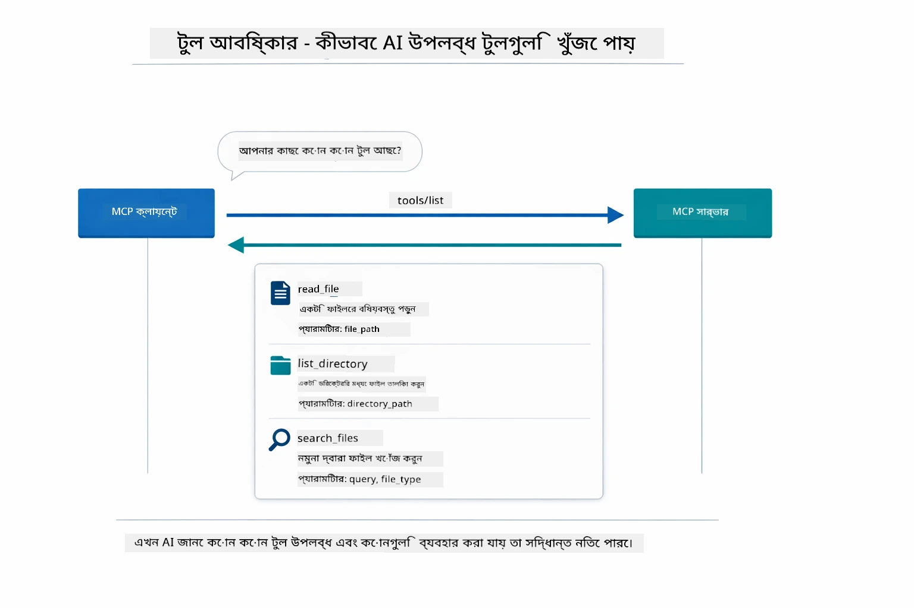

*AI স্টার্টআপে উপলব্ধ টুল আবিষ্কার করে — এখন এটি জানে কোন ক্ষমতাগুলি উপলব্ধ এবং কোনগুলি ব্যবহার করা যেতে পারে।*

**ট্রান্সপোর্ট মেকানিজম**

MCP বিভিন্ন ট্রান্সপোর্ট মেকানিজম সমর্থন করে। দুইটি অপশন হলো স্টডিও (স্থানীয় সাবপ্রসেস যোগাযোগের জন্য) এবং স্ট্রিমেবল HTTP (রিমোট সার্ভারের জন্য)। এই মডিউল স্টডিও ট্রান্সপোর্ট প্রদর্শন করে:


*MCP ট্রান্সপোর্ট মেকানিজম: রিমোট সার্ভারের জন্য HTTP, স্থানীয় প্রসেসের জন্য Stdio*

**Stdio** - [StdioTransportDemo.java](../../../05-mcp/src/main/java/com/example/langchain4j/mcp/StdioTransportDemo.java)

স্থানীয় প্রসেসের জন্য। আপনার অ্যাপ্লিকেশন সাবপ্রসেস হিসেবে একটি সার্ভার চালায় এবং স্ট্যান্ডার্ড ইনপুট/আউটপুটের মাধ্যমে যোগাযোগ করে। ফাইল সিস্টেম অ্যাক্সেস বা কমান্ড-লাইন টুলসের জন্য উপকারী।

```java
McpTransport stdioTransport = new StdioMcpTransport.Builder()
    .command(List.of(
        npmCmd, "exec",
        "@modelcontextprotocol/server-filesystem@2025.12.18",
        resourcesDir
    ))
    .logEvents(false)
    .build();
```

`@modelcontextprotocol/server-filesystem` সার্ভার নিম্নলিখিত টুলগুলি প্রকাশ করে, সবগুলি আপনি নির্দিষ্ট ডিরেক্টরিগুলোর মধ্যে স্যান্ডবক্সড:

| টুল | বর্ণনা |
|------|-------------|
| `read_file` | একটি ফাইলের বিষয়বস্তু পড়ুন |
| `read_multiple_files` | এক কল-এ একাধিক ফাইল পড়ুন |
| `write_file` | একটি ফাইল তৈরি বা ওভাররাইট করুন |
| `edit_file` | লক্ষ্যভিত্তিক ফাইন্ড-অ্যান্ড-রিপ্লেস সম্পাদনা করুন |
| `list_directory` | একটি পাথের ফাইল এবং ডিরেক্টরির তালিকা দেখান |
| `search_files` | প্যাটার্ন অনুসারে রিকারসিভ ফাইল অনুসন্ধান করুন |
| `get_file_info` | ফাইলের মেটাডেটা পান (আকার, টাইমস্টাম্প, অনুমতি) |
| `create_directory` | একটি ডিরেক্টরি তৈরি করুন (প্যারেন্ট ডিরেক্টরিসহ) |
| `move_file` | একটি ফাইল বা ডিরেক্টরি সরান বা নাম পরিবর্তন করুন |

নীচের চিত্রটি দেখায় কীভাবে স্টডিও ট্রান্সপোর্ট রানটাইমে কাজ করে — আপনার Java অ্যাপ্লিকেশন MCP সার্ভারকে একটি চাইল্ড প্রসেস হিসেবে চালায় এবং তারা stdin/stdout পাইপের মাধ্যমে যোগাযোগ করে, কোনো নেটওয়ার্ক বা HTTP জড়িত নয়:

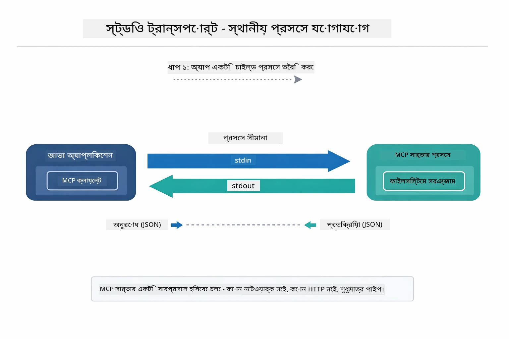

*স্টডিও ট্রান্সপোর্ট কার্যক্রমে — আপনার অ্যাপ্লিকেশন MCP সার্ভারকে চাইল্ড প্রসেস হিসেবে চালায় এবং stdin/stdout পাইপে যোগাযোগ করে।*

> **🤖 [GitHub Copilot](https://github.com/features/copilot) চ্যাট দিয়ে চেষ্টা করুন:** [`StdioTransportDemo.java`](../../../05-mcp/src/main/java/com/example/langchain4j/mcp/StdioTransportDemo.java) খুলুন এবং প্রশ্ন করুন:
> - "Stdio ট্রান্সপোর্ট কীভাবে কাজ করে এবং কখন HTTP এর পরিবর্তে ব্যবহার করা উচিত?"
> - "LangChain4j কীভাবে MCP সার্ভার প্রসেসগুলোর জীবনচক্র পরিচালনা করে?"
> - "AI কে ফাইল সিস্টেম অ্যাক্সেস দেওয়ার নিরাপত্তা প্রভাব কী কী?"

## এজেন্টিক মডিউল

যেখানে MCP মানকীকৃত টুলস প্রদান করে, সেখানে LangChain4j এর **এজেন্টিক মডিউল** একটি বিবৃতিমূলক উপায় প্রদান করে যেভাবে এজেন্ট তৈরী করা যায় যারা ঐ টুলগুলো সমন্বয় করে। `@Agent` অ্যানোটেশন এবং `AgenticServices` আপনাকে ইন্টারফেসের মাধ্যমে এজেন্ট আচরণ নির্ধারণ করার সুযোগ দেয়, কার্যকরী কোডের পরিবর্তে।

এই মডিউলে, আপনি **সুপারভাইজার এজেন্ট** প্যাটার্ন অনুসন্ধান করবেন — একটি উন্নত এজেন্টিক AI পদ্ধতি যেখানে "সুপারভাইজার" এজেন্ট ব্যবহারকারীর অনুরোধ অনুযায়ী কোন সাব-এজেন্ট কল করতে হবে তা গতিশীল ভাবে সিদ্ধান্ত নেয়। আমরা উভয় ধারণা একত্রিত করব একটি সাব-এজেন্টকে MCP-চালিত ফাইল অ্যাক্সেস ক্ষমতা দিয়ে।

এজেন্টিক মডিউল ব্যবহার করার জন্য Maven নির্ভরতাটি যোগ করুন:

```xml
<dependency>
    <groupId>dev.langchain4j</groupId>
    <artifactId>langchain4j-agentic</artifactId>
    <version>${langchain4j.mcp.version}</version>
</dependency>
```
> **দ্রষ্টব্য:** `langchain4j-agentic` মডিউল একটি পৃথক ভার্সন প্রোপার্টি (`langchain4j.mcp.version`) ব্যবহার করে কারণ এটি মূল LangChain4j লাইব্রেরির থেকে আলাদা সময়সূচীতে মুক্তি পায়।

> **⚠️ পরীক্ষামূলক:** `langchain4j-agentic` মডিউল **পরীক্ষামূলক** এবং পরিবর্তনের অধীনে। AI সহকারী তৈরির স্থিতিশীল উপায় এখনও `langchain4j-core` ও কাস্টম টুলস (Module 04) ব্যবহার করে।

## উদাহরণগুলি চালানো

### প্রয়োজনীয় শর্তাদি

- সম্পন্ন [Module 04 - Tools](../04-tools/README.md) (এই মডিউল কাস্টম টুল ধারণার উপর ভিত্তি করে এবং MCP টুলের সঙ্গে তুলনা করে)
- রুট ডিরেক্টরিতে `.env` ফাইল এজুর পরিচয়পত্রসহ (Module 01 এ `azd up` দ্বারা তৈরি)
- Java 21+, Maven 3.9+
- Node.js 16+ এবং npm (MCP সার্ভারগুলোর জন্য)

> **দ্রষ্টব্য:** আপনার পরিবেশ ভেরিয়েবলগুলো এখনও সেট করা না থাকলে, [Module 01 - Introduction](../01-introduction/README.md) দেখুন ডিপ্লয়মেন্ট নির্দেশনার জন্য (`azd up` স্বয়ংক্রিয়ভাবে `.env` ফাইল তৈরি করে), অথবা `.env.example` থেকে `.env` কপি করে আপনার মান পূরণ করুন।

## দ্রুত শুরু

**VS Code ব্যবহার করলে:** এক্সপ্লোরারে যেকোনো ডেমো ফাইলে রাইট-ক্লিক করে **"Run Java"** নির্বাচন করুন, অথবা রান ও ডিবাগ প্যানেল থেকে লঞ্চ কনফিগারেশন ব্যবহার করুন (প্রথমে নিশ্চিত করুন `.env` ফাইলে এজুর পরিচয়পত্র সঠিক আছে)।

**Maven ব্যবহার করলে:** বিকল্প হিসাবে, নিচের উদাহরণগুলোর মাধ্যমে কমান্ড লাইন থেকে চালাতে পারেন।

### ফাইল অপারেশনস (স্টডিও)

এটি স্থানীয় সাবপ্রসেস-ভিত্তিক টুলস প্রদর্শন করে।

**✅ কোন পূর্বপ্রয়োজন নেই** - MCP সার্ভার স্বয়ংক্রিয়ভাবে চালু হয়।

**স্টার্ট স্ক্রিপ্ট ব্যবহার (সুপারিশকৃত):**

স্টার্ট স্ক্রিপ্ট রুট `.env` ফাইল থেকে পরিবেশ ভেরিয়েবলগুলি স্বয়ংক্রিয়ভাবে লোড করে:

**Bash:**
```bash
cd 05-mcp
chmod +x start-stdio.sh
./start-stdio.sh
```

**PowerShell:**
```powershell
cd 05-mcp
.\start-stdio.ps1
```

**VS Code ব্যবহার:** `StdioTransportDemo.java`-তে রাইট-ক্লিক করে **"Run Java"** নির্বাচন করুন (নিশ্চিত করুন `.env` ফাইল সঠিক কনফিগার করা আছে)।

অ্যাপ্লিকেশন স্বয়ংক্রিয়ভাবে একটি ফাইলসিস্টেম MCP সার্ভার চালু করে এবং একটি স্থানীয় ফাইল পড়ে। লক্ষ্য করুন কীভাবে সাবপ্রসেস পরিচালনা আপনার পক্ষে করা হয়।

**প্রত্যাশিত আউটপুট:**
```
Assistant response: The file provides an overview of LangChain4j, an open-source Java library
for integrating Large Language Models (LLMs) into Java applications...
```

### সুপারভাইজার এজেন্ট

**সুপারভাইজার এজেন্ট প্যাটার্ন** একটি **নমনীয়** এজেন্টিক AI ফর্ম। একটি সুপারভাইজার LLM ব্যবহার করে স্বায়ত্তশাসিতভাবে নির্ধারণ করে কোন এজেন্টগুলো ব্যবহার করতে হবে ব্যবহারকারীর অনুরোধের ভিত্তিতে। পরবর্তী উদাহরণে, আমরা MCP-চালিত ফাইল অ্যাক্সেস ও একটি LLM এজেন্ট একত্রিত করব একটি নিয়ন্ত্রিত ফাইল পড়া → রিপোর্ট ওয়ার্কফ্লো তৈরিতে।

ডেমোতে, `FileAgent` MCP ফাইলসিস্টেম টুলস ব্যবহার করে একটি ফাইল পড়ে, এবং `ReportAgent` গঠনমূলক রিপোর্ট তৈরি করে একটি কার্যনির্বাহী সারাংশ (১ বাক্য), ৩টি মূল পয়েন্ট, ও সুপারিশসহ। সুপারভাইজার এই প্রবাহ স্বয়ংক্রিয়ভাবে পরিচালনা করে:

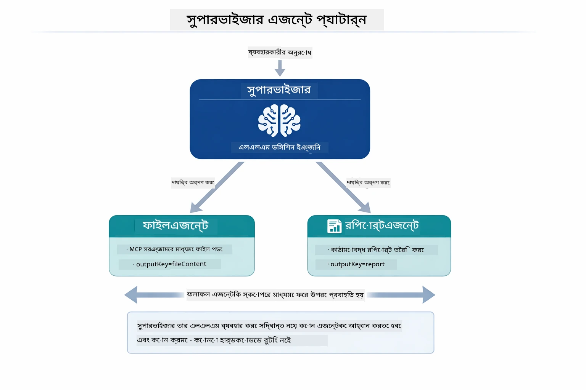

*সুপারভাইজার নিজের LLM ব্যবহার করে নির্ধারণ করে কোন এজেন্ট কল করবে এবং কী ক্রমে — কোনো হার্ডকোডেড রাউটিং প্রয়োজন হয় না।*

আমাদের ফাইল থেকে রিপোর্ট পাইপলাইনটির কঠিন কর্মপ্রবাহটি এরকম দেখায়:

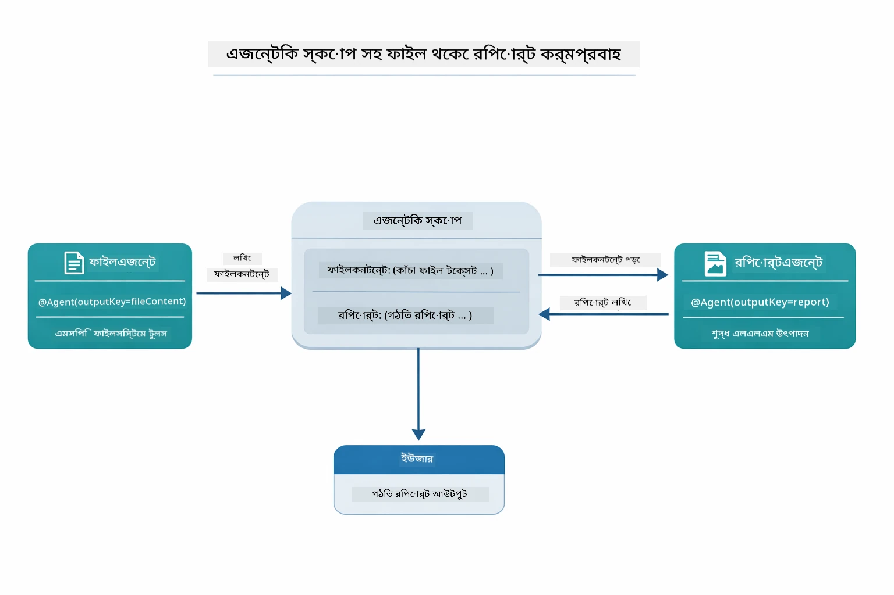

*FileAgent MCP টুলসের মাধ্যমে ফাইল পড়ে, তারপর ReportAgent কাঁচা বিষয়বস্তুকে গঠিত রিপোর্টে রূপান্তর করে।*

নিচের সিকোয়েন্স ডায়াগ্রাম পুরো সুপারভাইজার সাঙ্গঠনিক ক্রিয়াকলাপ ট্রেস করে — MCP সার্ভার চালু করা থেকে শুরু করে, সুপারভাইজারের স্বায়ত্তশাসিত এজেন্ট নির্বাচন, স্টডিওর মাধ্যমে টুল কল এবং চূড়ান্ত রিপোর্টে:

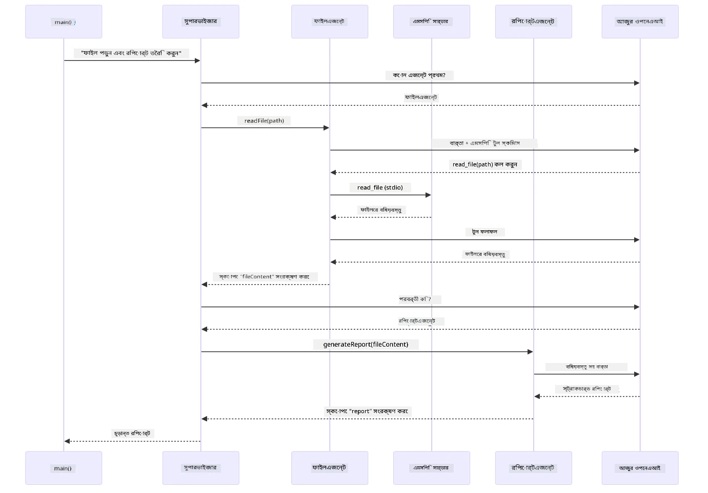

*সুপারভাইজার স্বায়ত্তশাসিতভাবে FileAgent কল করে (যে MCP সার্ভারের মাধ্যমে ফাইল পড়ে), তারপর ReportAgent কল করে একটি গঠিত রিপোর্ট তৈরি করে — প্রতিটি এজেন্ট তার আউটপুট শেয়ার করা Agentic Scope এ সংরক্ষণ করে।*

প্রতিটি এজেন্ট তার আউটপুট **Agentic Scope** (সহযোগী মেমোরি) তে সংরক্ষণ করে, যা পরবর্তী এজেন্টদের পূর্বের ফলাফল অ্যাক্সেস করার সুযোগ দেয়। এটি দেখায় কীভাবে MCP টুলস নির্বিঘ্নে এজেন্টিক ওয়ার্কফ্লোতে একত্রিত হয় — সুপারভাইজারকে জানার দরকার নেই *কিভাবে* ফাইল পড়া হয়, শুধু জানলেই যথেষ্ট যে `FileAgent` এটি করতে পারে।

#### ডেমো চালানো

স্টার্ট স্ক্রিপ্ট রুট `.env` ফাইল থেকে পরিবেশ ভেরিয়েবলসমূহ স্বয়ংক্রিয়ভাবে লোড করে:

**Bash:**
```bash
cd 05-mcp
chmod +x start-supervisor.sh
./start-supervisor.sh
```

**PowerShell:**
```powershell
cd 05-mcp
.\start-supervisor.ps1
```

**VS Code ব্যবহার:** `SupervisorAgentDemo.java` এ রাইট-ক্লিক করে **"Run Java"** নির্বাচন করুন (নিশ্চিত করুন `.env` ফাইল সঠিক কনফিগার করা আছে)।

#### সুপারভাইজার কীভাবে কাজ করে

এজেন্ট তৈরি করার আগে, আপনাকে MCP ট্রান্সপোর্টকে একটি ক্লায়েন্টে সংযুক্ত করতে হবে এবং এটিকে `ToolProvider` হিসেবে আবর্তন করতে হবে। এইভাবেই MCP সার্ভারের টুলগুলি আপনার এজেন্টদের জন্য উপলব্ধ হয়:

```java
// পরিবহন থেকে একটি MCP ক্লায়েন্ট তৈরি করুন
McpClient mcpClient = new DefaultMcpClient.Builder()
        .transport(stdioTransport)
        .build();

// ক্লায়েন্টটিকে একটি ToolProvider হিসাবে মোড়ানো — এটি MCP সরঞ্জামগুলি LangChain4j-তে সংযুক্ত করে
ToolProvider mcpToolProvider = McpToolProvider.builder()
        .mcpClients(List.of(mcpClient))
        .build();
```


এখন আপনি যেকোনো এজেন্টে `mcpToolProvider` ইনজেক্ট করতে পারেন যাকে MCP টুল প্রয়োজন:

```java
// ধাপ ১: FileAgent MCP সরঞ্জাম ব্যবহার করে ফাইল পড়ে
FileAgent fileAgent = AgenticServices.agentBuilder(FileAgent.class)
        .chatModel(model)
        .toolProvider(mcpToolProvider)  // ফাইল অপারেশনের জন্য MCP সরঞ্জাম রয়েছে
        .build();

// ধাপ ২: ReportAgent গঠনমূলক রিপোর্ট তৈরি করে
ReportAgent reportAgent = AgenticServices.agentBuilder(ReportAgent.class)
        .chatModel(model)
        .build();

// Supervisor ফাইল → রিপোর্ট কর্মপ্রবাহ পরিচালনা করে
SupervisorAgent supervisor = AgenticServices.supervisorBuilder()
        .chatModel(model)
        .subAgents(fileAgent, reportAgent)
        .responseStrategy(SupervisorResponseStrategy.LAST)  // চূড়ান্ত রিপোর্ট ফেরত দিন
        .build();

// Supervisor অনুরোধের ভিত্তিতে কোন এজেন্টগুলো কল করতে হবে তা সিদ্ধান্ত নেয়
String response = supervisor.invoke("Read the file at /path/file.txt and generate a report");
```

#### FileAgent কীভাবে রানটাইমে MCP টুলস আবিষ্কার করে

আপনি ভাবতে পারেন: **`FileAgent` কীভাবে npm ফাইলসিস্টেম টুলস কীভাবে ব্যবহার করতে হয় তা জানে?** উত্তরে, জানেন কি—এটি জানে না—**LLM** রানটাইমে টুল স্কিমাসের মাধ্যমে এটি বের করে।
`FileAgent` ইন্টারফেসটি কেবল একটি **প্রম্পট সংজ্ঞা** মাত্র। এতে `read_file`, `list_directory`, বা অন্য কোনো MCP টুলের কোনো কঠোরকৃত জ্ঞান নেই। এখানে সম্পূর্ণ প্রক্রিয়া হল:

1. **সার্ভার চালু হয়:** `StdioMcpTransport` `@modelcontextprotocol/server-filesystem` npm প্যাকেজকে একটি চাইল্ড প্রসেস হিসেবে চালু করে
2. **টুল আবিষ্কার:** `McpClient` সার্ভারকে একটি `tools/list` JSON-RPC রিকোয়েস্ট পাঠায়, যা টুলের নাম, বর্ণনা এবং প্যারামিটার স্কিমাস (যেমন, `read_file` — *"ফাইলের সম্পূর্ণ বিষয়বস্তু পড়ুন"* — `{ path: string }`) সহ প্রতিক্রিয়া জানায়
3. **স্কিমা ইনজেকশন:** `McpToolProvider` এই আবিষ্কৃত স্কিমাগুলোকে মোড়ক দিয়ে LangChain4j-কে প্রদান করে
4. **LLM সিদ্ধান্ত নেয়:** যখন `FileAgent.readFile(path)` কল করা হয়, LangChain4j সিস্টেম মেসেজ, ব্যবহারকারী মেসেজ এবং **টুল স্কিমাগুলোর তালিকা** LLM-কে পাঠায়। LLM টুল বর্ণনাগুলো পড়ে এবং একটি টুল কল তৈরি করে (যেমন, `read_file(path="/some/file.txt")`)
5. **বাস্তবায়ন:** LangChain4j টুল কলটিকে বাধাগ্রস্ত করে, এটি MCP ক্লায়েন্টের মাধ্যমে নোড.জেএস সাবপ্রসেসে রুট করে, ফলাফল অর্জন করে এবং তা LLM-কে ফেরত দেয়

এটাই উপরের [Tool Discovery](../../../05-mcp) প্রক্রিয়ার সমান, কিন্তু বিশেষভাবে এজেন্ট ওয়ার্কফ্লোর জন্য প্রযোজ্য। `@SystemMessage` এবং `@UserMessage` এনোটেশনগুলি LLM-এর আচরণ নির্দেশ দেয়, আর ইনজেক্ট করা `ToolProvider` তাকে **ক্ষমতা** প্রদান করে — LLM রানটাইমে দুটির মধ্যকার সেতুবন্ধন করে।

> **🤖 [GitHub Copilot](https://github.com/features/copilot) Chat দিয়ে চেষ্টা করুন:** [`FileAgent.java`](../../../05-mcp/src/main/java/com/example/langchain4j/mcp/agents/FileAgent.java) খুলে জিজ্ঞেস করুন:
> - "এই এজেন্ট কীভাবে জানে কোন MCP টুল কল করতে হবে?"
> - "যদি আমি agent builder থেকে ToolProvider সরিয়ে দিই, কী ঘটবে?"
> - "কীভাবে টুল স্কিমাগুলো LLM-এ পাঠানো হয়?"

#### প্রতিক্রিয়া কৌশলসমূহ

যখন আপনি একটি `SupervisorAgent` কনফিগার করেন, তখন আপনি নির্ধারণ করেন যে সাব-এজেন্টরা কাজ শেষ করার পরে এটি কীভাবে ব্যবহারকারীর কাছে চূড়ান্ত উত্তর প্রদান করবে। নিচের চিত্রে তিনটি উপলব্ধ কৌশল দেখানো হলো — LAST সরাসরি শেষ এজেন্টের আউটপুট দেয়, SUMMARY সমস্ত আউটপুট একটি LLM এর মাধ্যমে সংশ্লেষ করে দেয়, এবং SCORED মূল অনুরোধের সাথে সর্বোচ্চ স্কোরযুক্ত আউটপুট নির্বাচন করে:

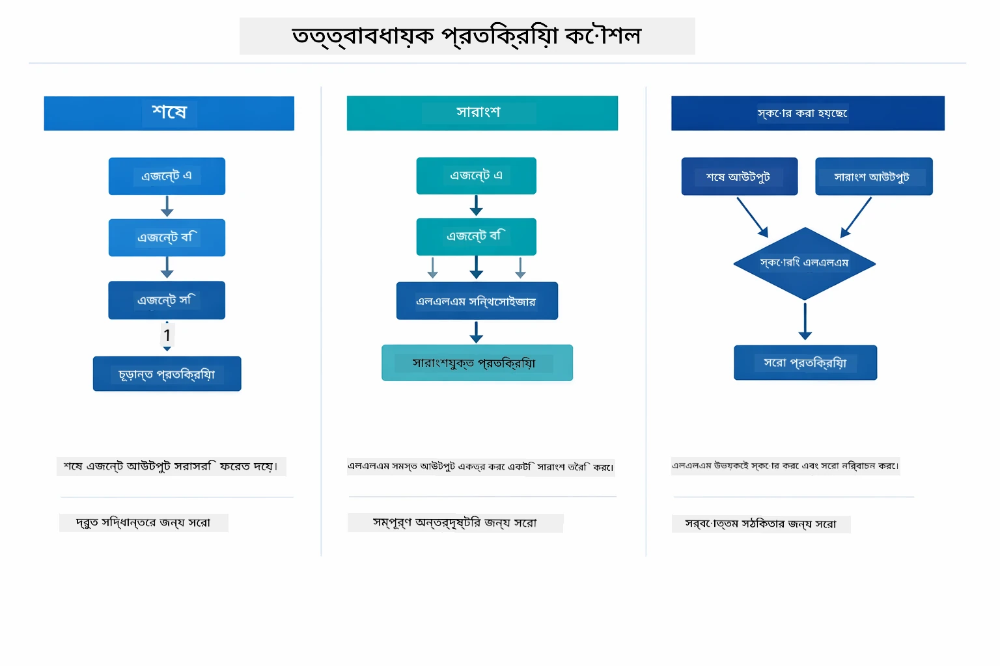

*Supervisor কিভাবে চূড়ান্ত প্রতিক্রিয়া ফর্মুলেট করে তার তিনটি কৌশল — শেষ এজেন্টের আউটপুট, সংশ্লেষিত সারাংশ, অথবা সর্বোচ্চ স্কোর পাওয়া বিকল্প বেছে নিন।*

উপলব্ধ কৌশলসমূহ হল:

| কৌশল | বর্ণনা |
|----------|-------------|
| **LAST** | Supervisor সর্বশেষ সাব-এজেন্ট বা কল করা টুলের আউটপুট ফেরত দেয়। এটি উপযোগী যখন শেষ এজেন্টটা সম্পূর্ণ, চূড়ান্ত উত্তর উপস্থাপনের জন্য বিশেষভাবে ডিজাইন করা থাকে (যেমন, গবেষণা পাইপলাইনে "Summary Agent")। |
| **SUMMARY** | Supervisor নিজস্ব অভ্যন্তরীণ ভাষা মডেল (LLM) ব্যবহার করে পুরো কথোপকথন এবং সমস্ত সাব-এজেন্ট আউটপুটের সারাংশ তৈরি করে এবং সেটি চূড়ান্ত প্রতিক্রিয়া হিসাবে ফেরত দেয়। এটি ব্যবহারকারীর জন্য পরিষ্কার, সম্মিলিত উত্তর প্রদান করে। |
| **SCORED** | সিস্টেম অভ্যন্তরীণ LLM ব্যবহার করে LAST প্রতিক্রিয়া এবং SUMMARY এর স্কোর করে, এবং যেটি উচ্চ স্কোর পায় সেটি ফেরত দেয়। |

সম্পূর্ণ বাস্তবায়নের জন্য দেখুন [SupervisorAgentDemo.java](../../../05-mcp/src/main/java/com/example/langchain4j/mcp/SupervisorAgentDemo.java)।

> **🤖 [GitHub Copilot](https://github.com/features/copilot) Chat দিয়ে চেষ্টা করুন:** [`SupervisorAgentDemo.java`](../../../05-mcp/src/main/java/com/example/langchain4j/mcp/SupervisorAgentDemo.java) খুলে জিজ্ঞেস করুন:
> - "Supervisor কীভাবে সিদ্ধান্ত নেয় কোন এজেন্টগুলো আহ্বান করা হবে?"
> - "Supervisor এবং Sequential ওয়ার্কফ্লো প্যাটার্নগুলোর পার্থক্য কী?"
> - "আমি কিভাবে Supervisor-এর পরিকল্পনা আচরণ কাস্টমাইজ করতে পারি?"

#### আউটপুট বোঝা

ডেমো চালালে আপনি দেখতে পাবেন Supervisor কীভাবে একাধিক এজেন্টের সমন্বয় সাধন করে তার ধাপে ধাপে স্পষ্ট বর্ণনা। প্রতিটি অংশের অর্থ হল:

```
======================================================================
  FILE → REPORT WORKFLOW DEMO
======================================================================

This demo shows a clear 2-step workflow: read a file, then generate a report.
The Supervisor orchestrates the agents automatically based on the request.
```

**শিরোনাম** ওয়ার্কফ্লো ধারণার পরিচয় দেয়: ফাইল পড়া থেকে রিপোর্ট তৈরি পর্যন্ত একটি কেন্দ্রীভূত ধারা।

```
--- WORKFLOW ---------------------------------------------------------
  ┌─────────────┐      ┌──────────────┐
  │  FileAgent  │ ───▶ │ ReportAgent  │
  │ (MCP tools) │      │  (pure LLM)  │
  └─────────────┘      └──────────────┘
   outputKey:           outputKey:
   'fileContent'        'report'

--- AVAILABLE AGENTS -------------------------------------------------
  [FILE]   FileAgent   - Reads files via MCP → stores in 'fileContent'
  [REPORT] ReportAgent - Generates structured report → stores in 'report'
```

**ওয়ার্কফ্লো ডায়াগ্রাম** এজেন্টদের মধ্যে তথ্য প্রবাহ দেখায়। প্রতিটি এজেন্টের একটি বিশেষ ভূমিকা আছে:
- **FileAgent** MCP টুল ব্যবহার করে ফাইল পড়ে এবং কাঁচা বিষয়বস্তু `fileContent`-এ সঞ্চয় করে
- **ReportAgent** সেই বিষয়বস্তু ব্যবহার করে সংগঠিত রিপোর্ট তৈরি করে `report`-এ রাখে

```
--- USER REQUEST -----------------------------------------------------
  "Read the file at .../file.txt and generate a report on its contents"
```

**ব্যবহারকারীর অনুরোধ** কাজটি দেখায়। Supervisor এটি বিশ্লেষণ করে FileAgent → ReportAgent কল করার সিদ্ধান্ত নেয়।

```
--- SUPERVISOR ORCHESTRATION -----------------------------------------
  The Supervisor decides which agents to invoke and passes data between them...

  +-- STEP 1: Supervisor chose -> FileAgent (reading file via MCP)
  |
  |   Input: .../file.txt
  |
  |   Result: LangChain4j is an open-source, provider-agnostic Java framework for building LLM...
  +-- [OK] FileAgent (reading file via MCP) completed

  +-- STEP 2: Supervisor chose -> ReportAgent (generating structured report)
  |
  |   Input: LangChain4j is an open-source, provider-agnostic Java framew...
  |
  |   Result: Executive Summary...
  +-- [OK] ReportAgent (generating structured report) completed
```

**Supervisor সমন্বয়** ২-ধাপের প্রক্রিয়া দেখায়:
1. **FileAgent** MCP এর মাধ্যমে ফাইল পড়ে এবং বিষয়বস্তু সঞ্চয় করে
2. **ReportAgent** বিষয়বস্তু পেয়ে একটি সংগঠিত রিপোর্ট তৈরি করে

Supervisor ব্যবহারকারীর অনুরোধের ভিত্তিতে এই সিদ্ধান্তগুলো **স্বায়ত্তশাসিতভাবে** নিয়েছে।

```
--- FINAL RESPONSE ---------------------------------------------------
Executive Summary
...

Key Points
...

Recommendations
...

--- AGENTIC SCOPE (Data Flow) ----------------------------------------
  Each agent stores its output for downstream agents to consume:
  * fileContent: LangChain4j is an open-source, provider-agnostic Java framework...
  * report: Executive Summary...
```

#### Agentic মডিউলের বৈশিষ্ট্য ব্যাখ্যা

উদাহরণটি agentic মডিউলের কয়েকটি উন্নত বৈশিষ্ট্য প্রদর্শন করে। Agentic Scope এবং Agent Listeners-এ একটু গভীরভাবে তাকাই।

**Agentic Scope** শেয়ার করা মেমোরি দেখায়, যেখানে এজেন্টরা `@Agent(outputKey="...")` ব্যবহার করে তাদের ফলাফল সংরক্ষণ করেছে। এর ফলে:
- পরবর্তী এজেন্টরা আগের এজেন্টের আউটপুট অ্যাক্সেস করতে পারে
- Supervisor চূড়ান্ত প্রতিক্রিয়া সংশ্লেষণ করতে পারে
- আপনি প্রতিটি এজেন্টের আউটপুট পরীক্ষা করতে পারেন

নিচের চিত্রে Agentic Scope-এর কাজ দেখানো হয়েছে ফাইল থেকে রিপোর্ট ওয়ার্কফ্লোতে — FileAgent নিজের আউটপুট `fileContent`-এর অধীনে লেখে, ReportAgent তা পড়ে এবং নিজের আউটপুট `report`-এর অধীনে লেখে:

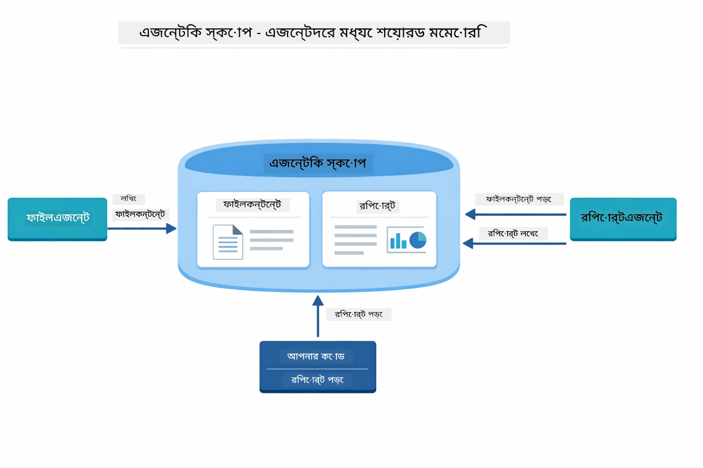

*Agentic Scope হল শেয়ার করা মেমোরি — FileAgent `fileContent` লেখে, ReportAgent তা পড়ে এবং `report` লেখে, আর আপনার কোড চূড়ান্ত ফলাফল পড়ে।*

```java
ResultWithAgenticScope<String> result = supervisor.invokeWithAgenticScope(request);
AgenticScope scope = result.agenticScope();
String fileContent = scope.readState("fileContent");  // FileAgent থেকে কাঁচা ফাইল ডেটা
String report = scope.readState("report");            // ReportAgent থেকে গঠনবদ্ধ রিপোর্ট
```

**Agent Listeners** এজেন্টের কার্যক্রম পর্যবেক্ষণ এবং ডিবাগিং সক্ষম করে। ডেমোতে আপনার দেখা স্টেপ-বাই-স্টেপ আউটপুট একটি AgentListener থেকে আসে, যা প্রতিটি এজেন্ট আহ্বানে যুক্ত হয়:
- **beforeAgentInvocation** - Supervisor যখন একটি এজেন্ট নির্বাচন করে তখন কল হয়, আপনাকে দেখতে দেয় কোন এজেন্ট নির্বাচিত হয়েছে এবং কেন
- **afterAgentInvocation** - একটি এজেন্ট কাজ শেষ করলে কল হয়, তার ফলাফল দেখায়
- **inheritedBySubagents** - সত্য হলে, লিসেনার পুরো হায়ারারকির এজেন্টদের পর্যবেক্ষণ করে

নিচের চিত্রটি সম্পূর্ণ Agent Listener লাইফসাইকেল দেখায়, যার মধ্যে `onError` এজেন্টের কার্যকলাপে ব্যর্থতা হ্যান্ডেল করে:

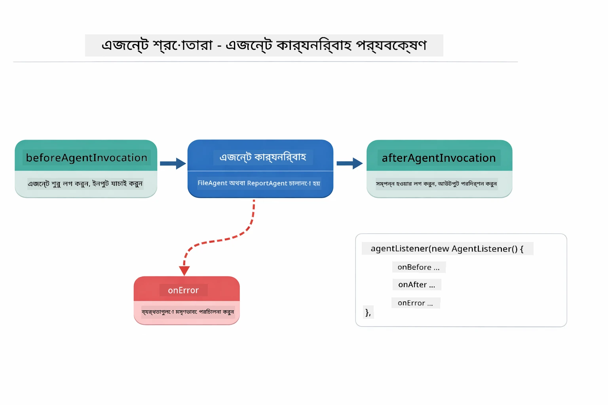

*Agent Listeners কার্যকলাপ লাইফসাইকেলে হুক করে — এজেন্ট শুরু, সম্পন্ন বা ত্রুটি ঘটলে পর্যবেক্ষণ করে।*

```java
AgentListener monitor = new AgentListener() {
    private int step = 0;
    
    @Override
    public void beforeAgentInvocation(AgentRequest request) {
        step++;
        System.out.println("  +-- STEP " + step + ": " + request.agentName());
    }
    
    @Override
    public void afterAgentInvocation(AgentResponse response) {
        System.out.println("  +-- [OK] " + response.agentName() + " completed");
    }
    
    @Override
    public boolean inheritedBySubagents() {
        return true; // সব উপ-এজেন্টদের কাছে ছড়িয়ে দিন
    }
};
```

Supervisor প্যাটার্ন ছাড়াও `langchain4j-agentic` মডিউল বিভিন্ন শক্তিশালী ওয়ার্কফ্লো প্যাটার্ন প্রদান করে। নিচের চিত্রে পাঁচটি দেখানো হয়েছে — সহজ সিকুয়েন্সিয়াল পাইপলাইন থেকে মানুষের অনুমোদনের লুপিং ওয়ার্কফ্লো:

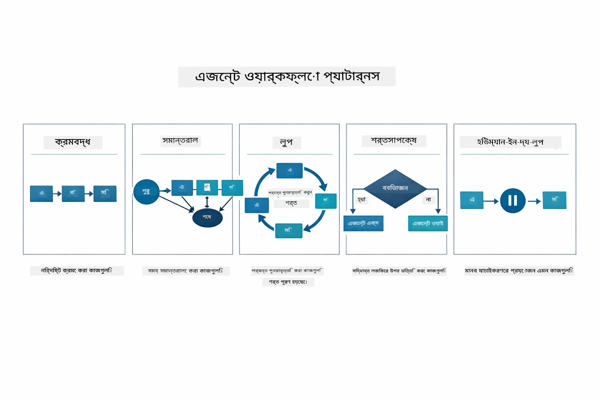

*এজেন্টদের সমন্বয়ের জন্য পাঁচটি ওয়ার্কফ্লো প্যাটার্ন — সিকুয়েন্সিয়াল পাইপলাইন থেকে মানুষের অনুমোদন ওয়ার্কফ্লো।*

| প্যাটার্ন | বর্ণনা | ব্যবহারের ক্ষেত্র |
|---------|-------------|----------|
| **Sequential** | এজেন্টগুলোকে ক্রমানুসারে চালান, আউটপুট পরবর্তী এজেন্টে যায় | পাইপলাইন: গবেষণা → বিশ্লেষণ → রিপোর্ট |
| **Parallel** | একাধিক এজেন্ট একসাথে চালু করুন | স্বাধীন টাস্ক: আবহাওয়া + খবর + স্টক |
| **Loop** | শর্ত পূরণ না হওয়া পর্যন্ত পুনরাবৃত্তি | মান নির্ধারণ: স্কোর ≥ 0.8 না হওয়া পর্যন্ত পরিমার্জন |
| **Conditional** | শর্ত অনুসারে রুটিং | শ্রেণীবিন্যাস → বিশেষজ্ঞ এজেন্টের কাছে রুট |
| **Human-in-the-Loop** | মানব যাচাইকরণ পয়েন্ট যোগ করুন | অনুমোদন ওয়ার্কফ্লো, বিষয়বস্তু পর্যালোচনা |

## মূল ধারণাসমূহ

এখন যেহেতু আপনি MCP এবং agentic মডিউল কার্যকরভাবে অন্বেষণ করেছেন, চলুন সারসংক্ষেপ করি কখন কোন পদ্ধতি ব্যবহার করবেন।

MCP-এর সবচেয়ে বড় সুবিধাগুলোর মধ্যে একটি হল এর বর্ধিত ইকোসিস্টেম। নিচের চিত্রে দেখা যাচ্ছে কীভাবে একটি ইউনিভার্সাল প্রোটোকল আপনার AI অ্যাপ্লিকেশনকে বিভিন্ন MCP সার্ভারের সাথে সংযুক্ত করে — ফাইল সিস্টেম ও ডাটাবেস থেকে শুরু করে GitHub, ইমেল, ওয়েব স্ক্র্যাপিং এবং আরও অনেক কিছু:

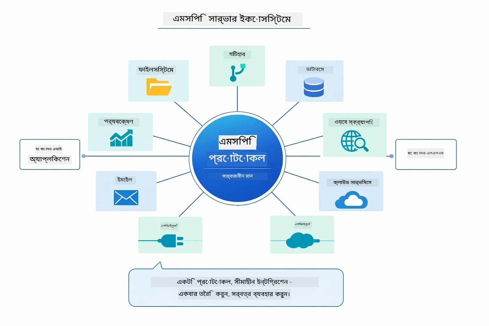

*MCP একটি ইউনিভার্সাল প্রোটোকল ইকোসিস্টেম তৈরি করে — যেকোন MCP-সঙ্গত সার্ভার যেকোন MCP-সঙ্গত ক্লায়েন্টের সাথে কাজ করে, অ্যাপ্লিকেশন জুড়ে টুল শেয়ারিং সম্ভব করে।*

**MCP** আদর্শ যখন আপনি বিদ্যমান টুল ইকোসিস্টেম ব্যবহার করতে চান, এমন টুল তৈরি করতে চাই যা একাধিক অ্যাপ্লিকেশন ভাগাভাগি করতে পারে, তৃতীয় পক্ষের পরিষেবাগুলো মানক প্রোটোকল দিয়ে সংযুক্ত করতে চান, অথবা কোড পরিবর্তন ছাড়াই টুল বাস্তবায়ন পরিবর্তন করতে চান।

**Agentic মডিউল** শ্রেষ্ঠ যখন আপনি `@Agent` এনোটেশনের মাধ্যমে ঘোষণা ভিত্তিক এজেন্ট সংজ্ঞা চান, ওয়ার্কফ্লো সমন্বয় (সিকুয়েন্সিয়াল, লুপ, প্যারালেল) দরকার, ইন্টারফেসভিত্তিক এজেন্ট ডিজাইন পছন্দ করেন, বা এমন একাধিক এজেন্ট একত্রে ব্যবহার করছেন যারা `outputKey` দ্বারা আউটপুট ভাগাভাগি করে।

**Supervisor Agent প্যাটার্ন** সেরা যখন ওয়ার্কফ্লো আগেই পূর্বনির্ধারিত থাকে না এবং আপনি LLM কে সিদ্ধান্ত নিতে চান, একাধিক বিশেষায়িত এজেন্ট ডায়নামিক অর্কেস্ট্রেশনের প্রয়োজন হয়, কথোপকথনীয় সিস্টেম তৈরি করতে চান যা বিভিন্ন ক্ষমতায় রাউট করে, অথবা সবচেয়ে নমনীয়, অভিযোজিত এজেন্ট আচরণ চান।

Module 04 থেকে কাস্টম `@Tool` পদ্ধতি এবং এই মডিউল থেকে MCP টুলগুলোর মধ্যে বেছে নেওয়ার জন্য নিচের তুলনাটি দেখুন — কাস্টম টুল সরাসরি টাইপ সেফটি এবং অ্যাপ-নির্দিষ্ট লজিক দেয়, MCP টুল মানসম্পন্ন, পুনর্ব্যবহারযোগ্য ইন্টিগ্রেশন প্রদান করে:

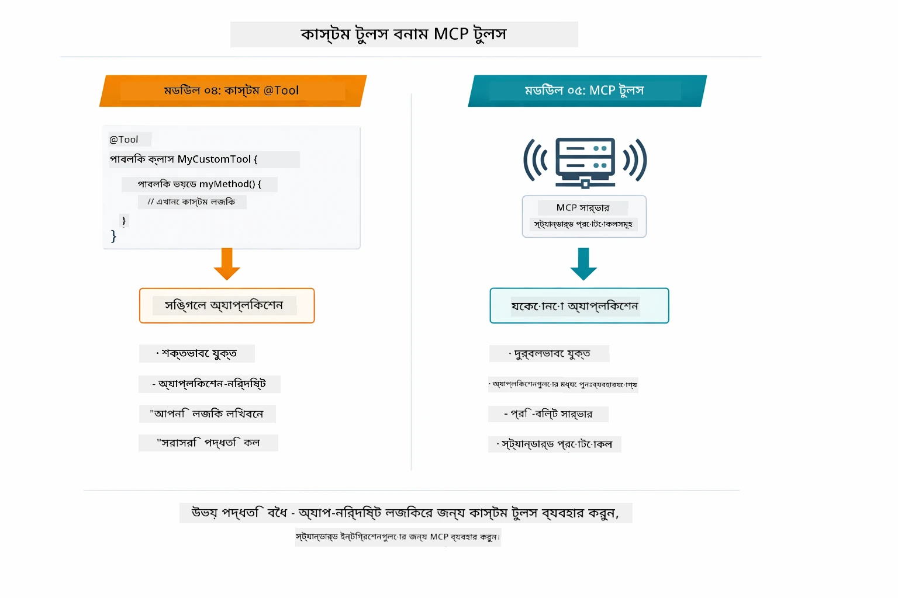

*কখন কাস্টম @Tool পদ্ধতি ব্যবহার করবেন এবং কখন MCP টুল — অ্যাপ নির্দিষ্ট লজিকের জন্য কাস্টম টুল, বহুবিধ অ্যাপ্লিকেশনের জন্য MCP টুল।*

## অভিনন্দন!

আপনি সম্পূর্ণ LangChain4j for Beginners কোর্সের পাঁচটি মডিউল সফলভাবে শেষ করেছেন! নিচে আপনার সম্পূর্ণ শেখার যাত্রার চিত্র — বেসিক চ্যাট থেকে শুরু করে MCP-চালিত agentic সিস্টেম পর্যন্ত:

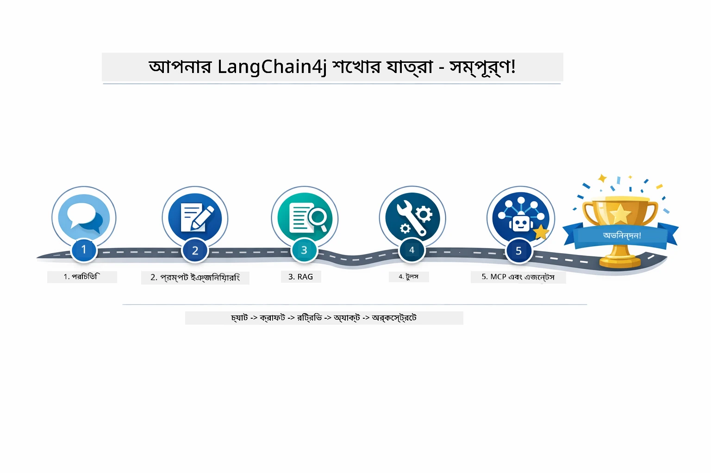

*পাঁচটি মডিউল জুড়ে আপনার শেখার যাত্রা — সাধারণ চ্যাট থেকে MCP-চালিত agentic সিস্টেম।*

আপনি শিখেছেন:

- মেমোরি সহ কনভার্সেশনাল AI তৈরি করা (মডিউল ০১)
- বিভিন্ন কাজের জন্য প্রম্পট ইঞ্জিনিয়ারিং প্যাটার্ন (মডিউল ০২)
- আপনার ডকুমেন্টে ভিত্তি করে RAG সহ প্রতিক্রিয়া তৈরি (মডিউল ০৩)
- কাস্টম টুল ব্যবহার করে বেসিক AI এজেন্ট তৈরি (মডিউল ০৪)
- LangChain4j MCP ও Agentic মডিউল দিয়ে মানক টুল ইন্টিগ্রেশন (মডিউল ০৫)

### পরবর্তী ধাপ?

মডিউল শেষ করার পর [Testing Guide](../docs/TESTING.md) ঘুরে দেখুন যাতে LangChain4j টেস্টিং ধারণাগুলো বাস্তবে দেখে নিতে পারেন।

**অফিসিয়াল রিসোর্সসমূহ:**
- [LangChain4j ডকুমেন্টেশন](https://docs.langchain4j.dev/) - বিস্তৃত গাইড এবং API রেফারেন্স
- [LangChain4j GitHub](https://github.com/langchain4j/langchain4j) - সোর্স কোড এবং উদাহরণ
- [LangChain4j টিউটোরিয়ালস](https://docs.langchain4j.dev/tutorials/) - বিভিন্ন ব্যবহারের স্টেপ-বাই-স্টেপ টিউটোরিয়াল

এই কোর্স সম্পন্ন করার জন্য আপনাকে ধন্যবাদ!

---

**নেভিগেশন:** [← পূর্ববর্তী: Module 04 - Tools](../04-tools/README.md) | [মেইনে ফিরে যান](../README.md)

---

<!-- CO-OP TRANSLATOR DISCLAIMER START -->
**অস্বীকৃতি**:
এই দলিলটি AI অনুবাদ সেবা [Co-op Translator](https://github.com/Azure/co-op-translator) ব্যবহার করে অনূদিত হয়েছে। আমরা যথাযথতার জন্য চেষ্টা করি, তবে অনুগ্রহ করে জানুন যে স্বয়ংক্রিয় অনুবাদে ত্রুটি বা ভুল থাকতে পারে। মূল ভাষায় থাকা মূল দলিলটিকে প্রামাণিক উৎস হিসেবে বিবেচনা করা উচিত। গুরুত্বপূর্ণ তথ্যের জন্য পেশাদার মানব অনুবাদের পরামর্শ দেওয়া হয়। এই অনুবাদের ব্যবহারের ফলে কোনো ভুল বোঝাবুঝি বা ভুল ব্যাখ্যার জন্য আমরা দায়ী নই।
<!-- CO-OP TRANSLATOR DISCLAIMER END -->