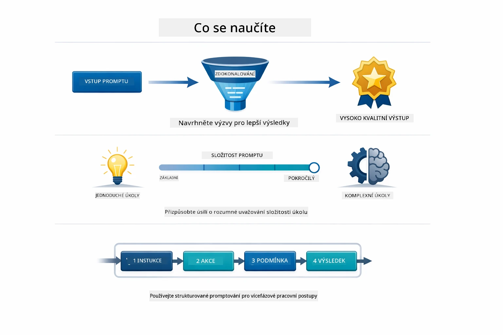
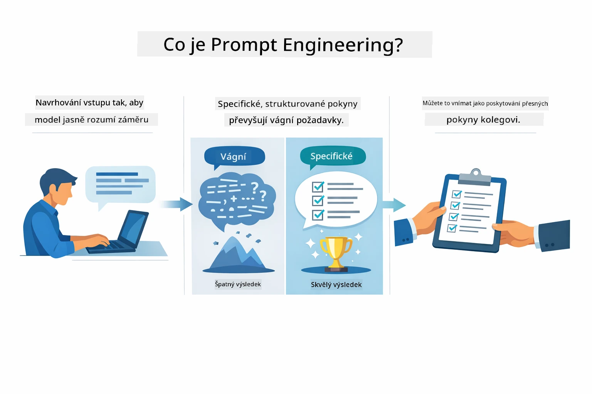
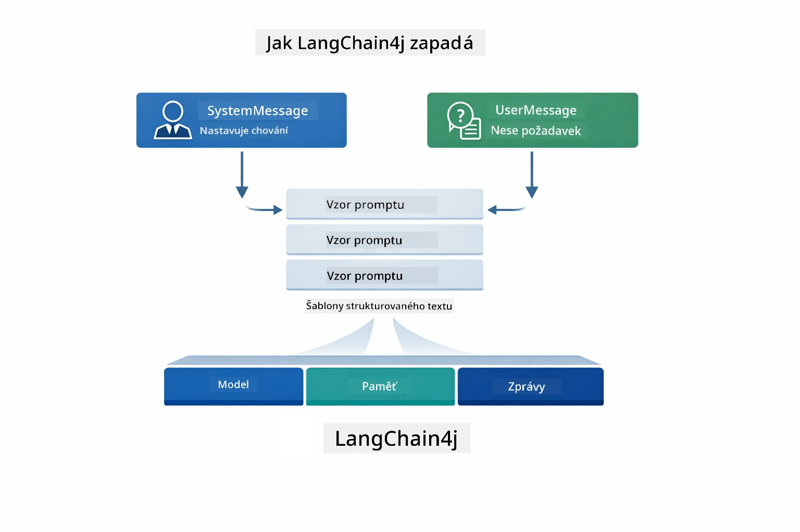
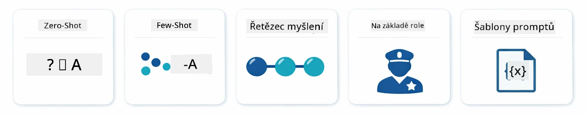
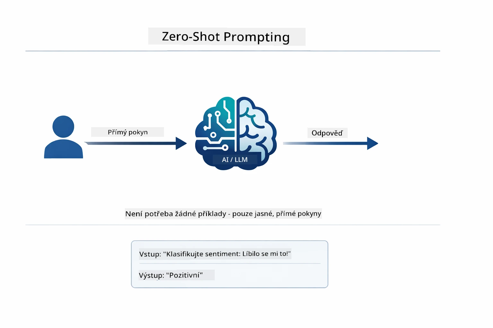
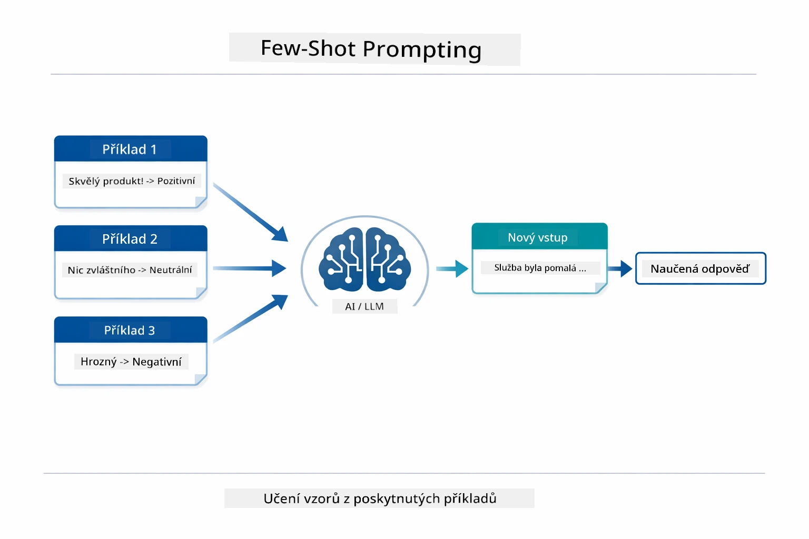
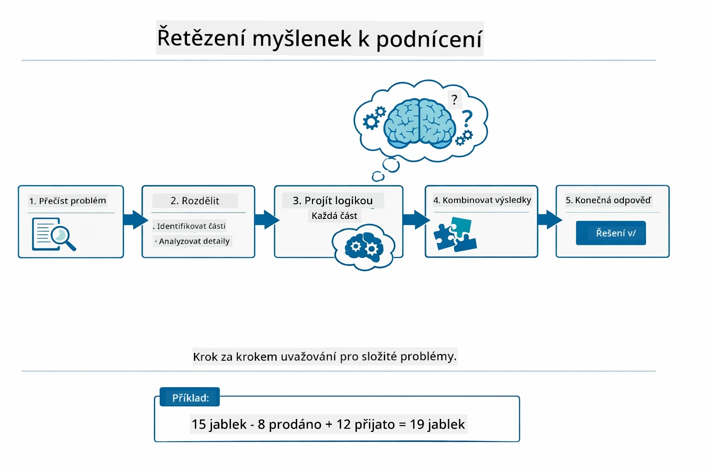
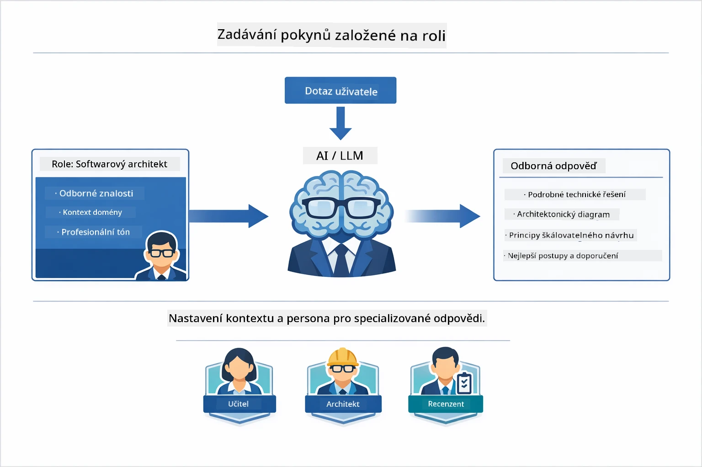
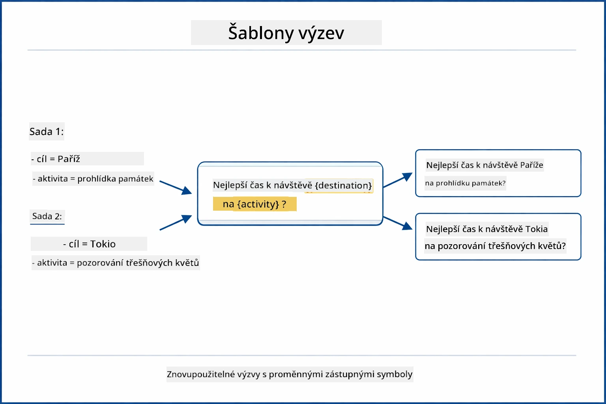
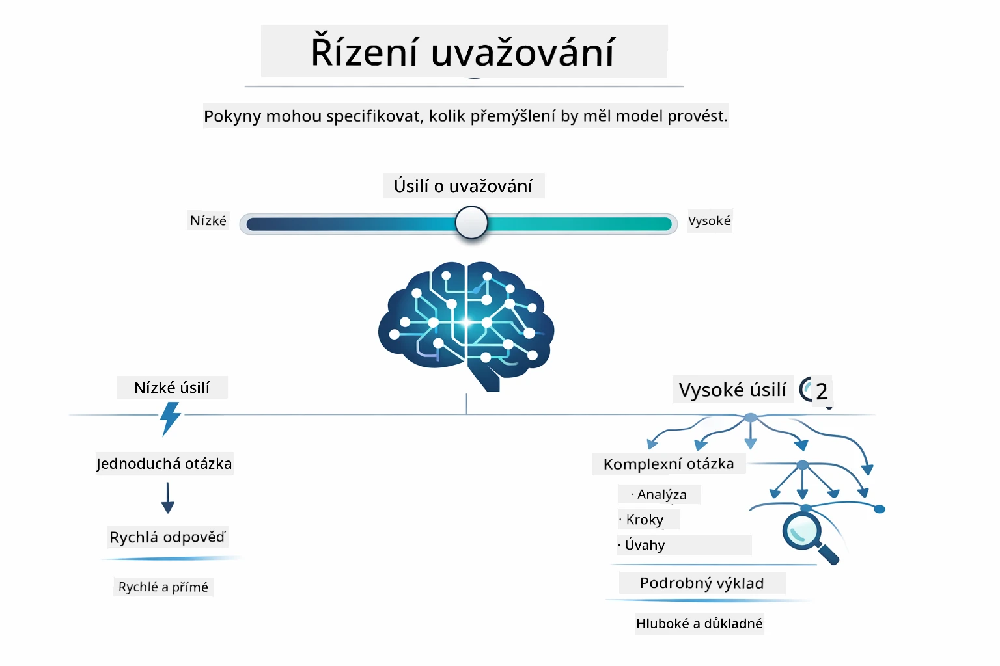

# Modul 02: Inženýrství promptů s GPT-5.2

## Obsah

- [Video procházka](../../../02-prompt-engineering)
- [Co se naučíte](../../../02-prompt-engineering)
- [Požadavky](../../../02-prompt-engineering)
- [Pochopení inženýrství promptů](../../../02-prompt-engineering)
- [Základy inženýrství promptů](../../../02-prompt-engineering)
  - [Zero-Shot prompting](../../../02-prompt-engineering)
  - [Few-Shot prompting](../../../02-prompt-engineering)
  - [Řetězec myšlenek](../../../02-prompt-engineering)
  - [Promptování na základě role](../../../02-prompt-engineering)
  - [Šablony promptů](../../../02-prompt-engineering)
- [Pokročilé vzory](../../../02-prompt-engineering)
- [Spuštění aplikace](../../../02-prompt-engineering)
- [Snímky obrazovky aplikace](../../../02-prompt-engineering)
- [Prozkoumání vzorů](../../../02-prompt-engineering)
  - [Nízká vs vysoká ochota](../../../02-prompt-engineering)
  - [Provedení úkolu (Úvodní nástroje)](../../../02-prompt-engineering)
  - [Sebereflexivní kód](../../../02-prompt-engineering)
  - [Strukturovaná analýza](../../../02-prompt-engineering)
  - [Vícekolová konverzace](../../../02-prompt-engineering)
  - [Postupné odůvodňování](../../../02-prompt-engineering)
  - [Omezený výstup](../../../02-prompt-engineering)
- [Co se skutečně učíte](../../../02-prompt-engineering)
- [Další kroky](../../../02-prompt-engineering)

## Video procházka

Podívejte se na tuto živou relaci, která vysvětluje, jak začít s tímto modulem:

<a href="https://www.youtube.com/live/PJ6aBaE6bog?si=LDshyBrTRodP-wke"></a>

## Co se naučíte

Následující diagram poskytuje přehled klíčových témat a dovedností, které v tomto modulu rozvinete — od technik zdokonalování promptů po postupný pracovní postup, který budete používat.



V předchozích modulech jste prozkoumali základní interakce LangChain4j s GitHub Models a viděli, jak paměť umožňuje konverzační AI s Azure OpenAI. Nyní se zaměříme na to, jak klást otázky — tedy samotné prompty — pomocí GPT-5.2 od Azure OpenAI. Způsob, jakým strukturalizujete své prompty, dramaticky ovlivňuje kvalitu odpovědí, které obdržíte. Začneme přehledem základních technik prompting, poté přejdeme k osmi pokročilým vzorům, které plně využívají možnosti GPT-5.2.

Použijeme GPT-5.2, protože zavádí kontrolu odůvodnění — můžete modelu říci, kolik přemýšlení má před odpovědí provést. To dělá různé strategie prompting zřetelnějšími a pomáhá vám pochopit, kdy použít každý přístup. Také využijeme méně restriktivní limity Azure pro GPT-5.2 ve srovnání s GitHub Models.

## Požadavky

- Dokončen Modul 01 (nasazené Azure OpenAI zdroje)
- `.env` soubor v kořenovém adresáři s přihlašovacími údaji Azure (vytvořený pomocí `azd up` v Modulu 01)

> **Poznámka:** Pokud jste Modulu 01 nedokončili, nejprve postupujte podle tamních pokynů k nasazení.

## Pochopení inženýrství promptů

Inženýrství promptů je v jádru rozdílem mezi vágními a přesnými instrukcemi, jak ukazuje následující srovnání.



Inženýrství promptů znamená navrhování vstupního textu, který vám konzistentně přinese požadované výsledky. Nejde jen o kladení otázek — jde o strukturování požadavků tak, aby model přesně pochopil, co chcete, a jak to má dodat.

Představte si to jako dávaní instrukcí kolegovi. „Oprav chybu“ je vágní. „Oprav výjimku null pointer v UserService.java na řádku 45 přidáním kontroly na null“ je specifické. Jazykové modely fungují stejným způsobem — záleží na přesnosti a struktuře.

Diagram níže ukazuje, jak do tohoto obrazu zapadá LangChain4j — spojuje vaše vzory promptů s modelem pomocí stavebních bloků SystemMessage a UserMessage.



LangChain4j poskytuje infrastrukturu — připojení k modelu, paměť a typy zpráv — zatímco vzory promptů jsou pouze pečlivě strukturovaný text, který touto infrastrukturou posíláte. Klíčovými stavebními bloky jsou `SystemMessage` (který nastavuje chování a roli AI) a `UserMessage` (který nese váš skutečný požadavek).

## Základy inženýrství promptů

Pět základních technik uvedených níže tvoří základ efektivního inženýrství promptů. Každá řeší jiný aspekt komunikace s jazykovými modely.



Než se pustíme do pokročilých vzorů v tomto modulu, připomeňme si pět základních technik promptování. Tyto jsou stavebními kameny, které by měl znát každý prompt inženýr. Pokud jste již prošli [Rychlý start modul](../00-quick-start/README.md#2-prompt-patterns), viděli jste je v akci — zde je konceptuální rámec za nimi.

### Zero-Shot prompting

Nejjednodušší přístup: dejte modelu přímý pokyn bez příkladů. Model se zcela spoléhá na své tréninkové znalosti, aby pochopil a vykonal úkol. Funguje to dobře pro přímočaré požadavky, kde je očekávané chování zřejmé.



*Přímý pokyn bez příkladů — model vyvozuje úkol pouze z pokynu*

```java
String prompt = "Classify this sentiment: 'I absolutely loved the movie!'";
String response = model.chat(prompt);
// Odpověď: "Pozitivní"
```

**Kdy použít:** Jednoduché klasifikace, přímé otázky, překlady nebo jakýkoli úkol, který model zvládne bez dalšího vedení.

### Few-Shot prompting

Poskytněte příklady, které ukazují vzor, podle kterého má model postupovat. Model se z vašich příkladů naučí očekávaný vstupně-výstupní formát a aplikuje ho na nové vstupy. To výrazně zlepšuje konzistenci u úkolů, kde požadovaný formát nebo chování není zřejmé.



*Učení z příkladů — model rozpoznává vzor a aplikuje ho na nové vstupy*

```java
String prompt = """
    Classify the sentiment as positive, negative, or neutral.
    
    Examples:
    Text: "This product exceeded my expectations!" → Positive
    Text: "It's okay, nothing special." → Neutral
    Text: "Waste of money, very disappointed." → Negative
    
    Now classify this:
    Text: "Best purchase I've made all year!"
    """;
String response = model.chat(prompt);
```

**Kdy použít:** Vlastní klasifikace, konzistentní formátování, úkoly specifické pro doménu nebo pokud jsou výsledky zero-shot nekonzistentní.

### Řetězec myšlenek

Požádejte model, aby ukázal své odůvodnění krok za krokem. Místo aby skočil rovnou k odpovědi, model rozdělí problém a explicitně projde každý krok. To zlepšuje přesnost u matematických, logických a vícekrokových úkolů.



*Postupné odůvodňování — rozdělení složitých problémů do explicitních logických kroků*

```java
String prompt = """
    Problem: A store has 15 apples. They sell 8 apples and then 
    receive a shipment of 12 more apples. How many apples do they have now?
    
    Let's solve this step-by-step:
    """;
String response = model.chat(prompt);
// Model ukazuje: 15 - 8 = 7, pak 7 + 12 = 19 jablek
```

**Kdy použít:** Matematické úlohy, logické hádanky, ladění nebo jakýkoli úkol, kde zobrazení procesu odůvodnění zvyšuje přesnost a důvěru.

### Promptování na základě role

Než položíte otázku, nastavte AI osobnost nebo roli. To poskytuje kontext, který formuje tón, hloubku a zaměření odpovědi. „Softwarový architekt“ poskytne jiné rady než „junior vývojář“ nebo „auditor bezpečnosti“.



*Nastavení kontextu a osobnosti — stejná otázka dostane jinou odpověď podle přiřazené role*

```java
String prompt = """
    You are an experienced software architect reviewing code.
    Provide a brief code review for this function:
    
    def calculate_total(items):
        total = 0
        for item in items:
            total = total + item['price']
        return total
    """;
String response = model.chat(prompt);
```

**Kdy použít:** Kontroly kódu, doučování, doménové analýzy nebo když potřebujete odpovědi přizpůsobené určité úrovni odbornosti či perspektivě.

### Šablony promptů

Vytvářejte znovupoužitelné prompty s proměnnými zástupci. Místo psaní nového promptu pokaždé definujte šablonu jednou a plňte ji různými hodnotami. Třída `PromptTemplate` v LangChain4j to usnadňuje pomocí syntaxe `{{variable}}`.



*Znovupoužitelné prompty s proměnnými zástupci — jedna šablona, mnoho použití*

```java
PromptTemplate template = PromptTemplate.from(
    "What's the best time to visit {{destination}} for {{activity}}?"
);

Prompt prompt = template.apply(Map.of(
    "destination", "Paris",
    "activity", "sightseeing"
));

String response = model.chat(prompt.text());
```

**Kdy použít:** Opakované dotazy s různými vstupy, dávkové zpracování, budování znovupoužitelných AI workflow, nebo kdekoliv, kde struktura promptu zůstává stejná, ale data se mění.

---

Těchto pět základů vám dává pevný arzenál pro většinu promptingových úkolů. Zbytek tohoto modulu na nich staví pomocí **osmi pokročilých vzorů**, které využívají kontrolu odůvodnění GPT-5.2, sebehodnocení a schopnosti strukturovaného výstupu.

## Pokročilé vzory

Po pokrytí základů přejděme k osmi pokročilým vzorům, které činí tento modul unikátním. Ne každý problém vyžaduje stejný přístup. Některé otázky chtějí rychlé odpovědi, jiné hluboké přemýšlení. Některé potřebují viditelné odůvodnění, jiné jen výsledky. Každý níže uvedený vzor je optimalizován pro jiný scénář — a kontrola odůvodnění GPT-5.2 rozdíly ještě více zdůrazňuje.


*Přehled osmi vzorů inženýrství promptů a jejich užití*

GPT-5.2 přidává další dimenzi k těmto vzorům: *kontrolu odůvodnění*. Posuvník níže ukazuje, jak můžete upravit úsilí modelu o myšlení — od rychlých přímých odpovědí po hlubokou a důkladnou analýzu.



*Kontrola odůvodnění GPT-5.2 vám umožňuje určit, kolik přemýšlení má model udělat — od rychlých přímých odpovědí po hluboké zkoumání*

**Nízká ochota (rychlé a cílené)** - Pro jednoduché otázky, kde chcete rychlé, přímé odpovědi. Model dělá minimální odůvodnění - maximálně 2 kroky. Použijte to pro výpočty, vyhledávání nebo přímočaré otázky.

```java
String prompt = """
    <context_gathering>
    - Search depth: very low
    - Bias strongly towards providing a correct answer as quickly as possible
    - Usually, this means an absolute maximum of 2 reasoning steps
    - If you think you need more time, state what you know and what's uncertain
    </context_gathering>
    
    Problem: What is 15% of 200?
    
    Provide your answer:
    """;

String response = chatModel.chat(prompt);
```

> 💡 **Prozkoumejte s GitHub Copilot:** Otevřete [`Gpt5PromptService.java`](../../../02-prompt-engineering/src/main/java/com/example/langchain4j/prompts/service/Gpt5PromptService.java) a zeptejte se:
> - „Jaký je rozdíl mezi nízkou a vysokou ochotou ve vzorech prompting?“
> - „Jak pomáhají XML tagy v promptech strukturovat odpověď AI?“
> - „Kdy mám použít vzory sebereflexe vs přímé instrukce?“

**Vysoká ochota (hluboké a důkladné)** - Pro složité problémy, kde chcete komplexní analýzu. Model důkladně zkoumá a ukazuje podrobné odůvodnění. Použijte to pro návrh systému, architektonická rozhodnutí nebo složitý výzkum.

```java
String prompt = """
    Analyze this problem thoroughly and provide a comprehensive solution.
    Consider multiple approaches, trade-offs, and important details.
    Show your analysis and reasoning in your response.
    
    Problem: Design a caching strategy for a high-traffic REST API.
    """;

String response = chatModel.chat(prompt);
```

**Provedení úkolu (postupný pokrok)** - Pro vícekrokové pracovní postupy. Model předem poskytne plán, narraci každého kroku během práce a nakonec shrnutí. Použijte to pro migrace, implementace nebo jakýkoli vícekrokový proces.

```java
String prompt = """
    <task_execution>
    1. First, briefly restate the user's goal in a friendly way
    
    2. Create a step-by-step plan:
       - List all steps needed
       - Identify potential challenges
       - Outline success criteria
    
    3. Execute each step:
       - Narrate what you're doing
       - Show progress clearly
       - Handle any issues that arise
    
    4. Summarize:
       - What was completed
       - Any important notes
       - Next steps if applicable
    </task_execution>
    
    <tool_preambles>
    - Always begin by rephrasing the user's goal clearly
    - Outline your plan before executing
    - Narrate each step as you go
    - Finish with a distinct summary
    </tool_preambles>
    
    Task: Create a REST endpoint for user registration
    
    Begin execution:
    """;

String response = chatModel.chat(prompt);
```

Řetězcové prompting explicitně žádá model, aby ukázal proces svého odůvodnění, což zlepšuje přesnost u složitých úkolů. Postupné rozklady pomáhají lidem i AI pochopit logiku.

> **🤖 Vyzkoušejte s [GitHub Copilot](https://github.com/features/copilot) Chat:** Zeptejte se na tento vzor:
> - „Jak bych přizpůsobil vzor provedení úkolu pro dlouhotrvající operace?“
> - „Jaké jsou nejlepší postupy pro strukturování úvodních nástrojů v produkčních aplikacích?“
> - „Jak mohu zachytit a zobrazit průběžné aktualizace pokroku v UI?“

Diagram níže ilustruje tento pracovní postup Plán → Provedení → Shrnutí.


*Pracovní postup Plán → Provedení → Shrnutí pro vícekrokové úkoly*

**Sebereflexivní kód** - Pro generování produkčního kódu. Model generuje kód podle produkčních standardů s patřičnou obsluhou chyb. Používejte to při budování nových funkcí nebo služeb.

```java
String prompt = """
    Generate Java code with production-quality standards: Create an email validation service
    Keep it simple and include basic error handling.
    """;

String response = chatModel.chat(prompt);
```

Diagram níže ukazuje tento iterativní cyklus vylepšování — generování, hodnocení, identifikace slabých míst a zdokonalování, dokud kód neodpovídá produkčním standardům.


*Iterativní smyčka zlepšování - generuj, hodnot, identifikuj problémy, zlepšuj, opakuj*

**Strukturovaná analýza** - Pro konzistentní hodnocení. Model kontroluje kód pomocí pevného rámce (správnost, postupy, výkon, bezpečnost, udržovatelnost). Použijte to pro kontroly kódu nebo hodnocení kvality.

```java
String prompt = """
    <analysis_framework>
    You are an expert code reviewer. Analyze the code for:
    
    1. Correctness
       - Does it work as intended?
       - Are there logical errors?
    
    2. Best Practices
       - Follows language conventions?
       - Appropriate design patterns?
    
    3. Performance
       - Any inefficiencies?
       - Scalability concerns?
    
    4. Security
       - Potential vulnerabilities?
       - Input validation?
    
    5. Maintainability
       - Code clarity?
       - Documentation?
    
    <output_format>
    Provide your analysis in this structure:
    - Summary: One-sentence overall assessment
    - Strengths: 2-3 positive points
    - Issues: List any problems found with severity (High/Medium/Low)
    - Recommendations: Specific improvements
    </output_format>
    </analysis_framework>
    
    Code to analyze:
    ```
    public List getUsers() {
        return database.query("SELECT * FROM users");
    }
    ```
    Provide your structured analysis:
    """;

String response = chatModel.chat(prompt);
```

> **🤖 Vyzkoušejte s [GitHub Copilot](https://github.com/features/copilot) Chat:** Zeptejte se na strukturovanou analýzu:
> - „Jak mohu přizpůsobit rámec analýzy pro různé typy kontrol kódu?“
> - „Jak nejlépe zpracovat a programově reagovat na strukturovaný výstup?“
> - „Jak zajistím konzistentní úrovně závažnosti v různých recenzních sezeních?“

Následující diagram ukazuje, jak tento strukturovaný rámec organizuje kontrolu kódu do konzistentních kategorií s úrovněmi závažnosti.


*Rámec pro konzistentní kontroly kódu s úrovněmi závažnosti*

**Vícekolová konverzace** - Pro konverzace, které vyžadují kontext. Model si pamatuje předchozí zprávy a staví na nich. Použijte to pro interaktivní pomoc nebo komplexní otázky a odpovědi.

```java
ChatMemory memory = MessageWindowChatMemory.withMaxMessages(10);

memory.add(UserMessage.from("What is Spring Boot?"));
AiMessage aiMessage1 = chatModel.chat(memory.messages()).aiMessage();
memory.add(aiMessage1);

memory.add(UserMessage.from("Show me an example"));
AiMessage aiMessage2 = chatModel.chat(memory.messages()).aiMessage();
memory.add(aiMessage2);
```

Diagram níže vizualizuje, jak se konverzační kontext hromadí s každým kolem a jak souvisí s limitem tokenů modelu.


*Jak se konverzační kontext hromadí přes více kol až do dosažení limitu tokenů*
**Krok za krokem zdůvodnění** – Pro problémy vyžadující viditelnou logiku. Model ukazuje explicitní zdůvodnění pro každý krok. Použijte to pro matematické problémy, logické hádanky nebo když potřebujete pochopit myšlenkový proces.

```java
String prompt = """
    <instruction>Show your reasoning step-by-step</instruction>
    
    If a train travels 120 km in 2 hours, then stops for 30 minutes,
    then travels another 90 km in 1.5 hours, what is the average speed
    for the entire journey including the stop?
    """;

String response = chatModel.chat(prompt);
```

Níže uvedený diagram ilustruje, jak model rozděluje problémy na explicitní, číslované logické kroky.


*Rozklad problémů na explicitní logické kroky*

**Omezený výstup** – Pro odpovědi s konkrétními požadavky na formát. Model přísně dodržuje pravidla formátu a délky. Použijte to pro shrnutí nebo pokud potřebujete přesnou strukturu výstupu.

```java
String prompt = """
    <constraints>
    - Exactly 100 words
    - Bullet point format
    - Technical terms only
    </constraints>
    
    Summarize the key concepts of machine learning.
    """;

String response = chatModel.chat(prompt);
```

Následující diagram ukazuje, jak omezení vedou model k tomu, aby produkoval výstup, který striktně dodržuje vaše požadavky na formát a délku.


*Prosazování konkrétních požadavků na formát, délku a strukturu*

## Spuštění aplikace

**Ověření nasazení:**

Ujistěte se, že soubor `.env` existuje v kořenovém adresáři s přihlašovacími údaji Azure (vytvořen během modulu 01). Spusťte to z adresáře modulu (`02-prompt-engineering/`):

**Bash:**
```bash
cat ../.env  # Mělo by zobrazit AZURE_OPENAI_ENDPOINT, API_KEY, DEPLOYMENT
```

**PowerShell:**
```powershell
Get-Content ..\.env  # Mělo by zobrazovat AZURE_OPENAI_ENDPOINT, API_KEY, DEPLOYMENT
```

**Spuštění aplikace:**

> **Poznámka:** Pokud jste již spustili všechny aplikace pomocí `./start-all.sh` z kořenového adresáře (jak je popsáno v modulu 01), tento modul už běží na portu 8083. Můžete přeskočit příkazy pro spuštění níže a jít přímo na http://localhost:8083.

**Možnost 1: Použití Spring Boot Dashboard (doporučeno pro uživatele VS Code)**

Vývojové prostředí obsahuje rozšíření Spring Boot Dashboard, které poskytuje vizuální rozhraní pro správu všech Spring Boot aplikací. Najdete ho v Activity Bar na levé straně VS Code (hledejte ikonu Spring Boot).

Z Spring Boot Dashboard můžete:
- Vidět všechny dostupné Spring Boot aplikace v pracovním prostoru
- Spustit/zastavit aplikace jedním kliknutím
- Zobrazit logy aplikací v reálném čase
- Monitorovat stav aplikace

Jednoduše klikněte na tlačítko přehrávání vedle "prompt-engineering" pro spuštění tohoto modulu, nebo spusťte všechny moduly najednou.


*Spring Boot Dashboard ve VS Code — spouštění, zastavování a monitorování všech modulů z jednoho místa*

**Možnost 2: Použití shell skriptů**

Spusťte všechny webové aplikace (moduly 01-04):

**Bash:**
```bash
cd ..  # Ze základního adresáře
./start-all.sh
```

**PowerShell:**
```powershell
cd ..  # Ze základního adresáře
.\start-all.ps1
```

Nebo spusťte jen tento modul:

**Bash:**
```bash
cd 02-prompt-engineering
./start.sh
```

**PowerShell:**
```powershell
cd 02-prompt-engineering
.\start.ps1
```

Oba skripty automaticky načtou proměnné prostředí z kořenového souboru `.env` a sestaví JARy, pokud neexistují.

> **Poznámka:** Pokud chcete před spuštěním ručně sestavit všechny moduly:
>
> **Bash:**
> ```bash
> cd ..  # Go to root directory
> mvn clean package -DskipTests
> ```
>
> **PowerShell:**
> ```powershell
> cd ..  # Go to root directory
> mvn clean package -DskipTests
> ```

Otevřete v prohlížeči http://localhost:8083.

**Pro zastavení:**

**Bash:**
```bash
./stop.sh  # Pouze tento modul
# Nebo
cd .. && ./stop-all.sh  # Všechny moduly
```

**PowerShell:**
```powershell
.\stop.ps1  # Pouze tento modul
# Nebo
cd ..; .\stop-all.ps1  # Všechny moduly
```

## Snímky obrazovek aplikace

Zde je hlavní rozhraní modulu prompt engineering, kde můžete experimentovat se všemi osmi vzory vedle sebe.


*Hlavní panel zobrazující všech 8 vzorů prompt engineeringu s jejich charakteristikami a případy použití*

## Prozkoumání vzorů

Webové rozhraní umožňuje experimentovat s různými strategiemi promptování. Každý vzor řeší jiné problémy – vyzkoušejte je a uvidíte, kdy který přístup vyniká.

> **Poznámka: Streamování vs Nestreamování** — Každá stránka vzoru nabízí dvě tlačítka: **🔴 Stream Response (živě)** a možnost **Nestreamování**. Streamování používá Server-Sent Events (SSE) k zobrazování tokenů v reálném čase, jak je model generuje, takže okamžitě vidíte pokrok. Nestreamová volba čeká na celou odpověď, než ji zobrazí. U promptů, které spouštějí hluboké zdůvodňování (např. High Eagerness, Self-Reflecting Code), může volání bez streamování trvat velmi dlouho – někdy minuty – bez viditelné zpětné vazby. **Při experimentování s komplexními promptami používejte streamování**, abyste viděli model pracovat a vyhnuli se dojmu, že požadavek časově vypršel.
>
> **Poznámka: Požadavek na prohlížeč** — Streamovací funkce používá Fetch Streams API (`response.body.getReader()`), které vyžaduje plnohodnotný prohlížeč (Chrome, Edge, Firefox, Safari). NEfunguje ve vestavěném Simple Browseru VS Code, protože jeho webview nepodporuje ReadableStream API. Pokud používáte Simple Browser, tlačítka pro nestreamování budou fungovat normálně — problém se týká pouze streamovacích tlačítek. Pro plný zážitek otevřete `http://localhost:8083` v externím prohlížeči.

### Nízká vs Vysoká zaujatost

Zeptejte se jednoduchou otázku jako „Co je 15 % ze 200?“ pomocí Nízké zaujatosti. Dostanete okamžitou, přímou odpověď. Nyní se zeptejte na něco složitého jako „Navrhni caching strategii pro API s vysokým provozem“ pomocí Vysoké zaujatosti. Klikněte na **🔴 Stream Response (živě)** a sledujte detailní zdůvodnění modelu token po tokenu. Stejný model, stejná struktura otázky – ale prompt mu říká, kolik přemýšlení má věnovat.

### Provádění úkolů (úvodní nástroje)

Vícekrokové pracovní postupy těží z předběžného plánování a komentáře průběhu. Model popisuje, co udělá, komentuje každý krok a poté shrnuje výsledky.

### Sebereflexivní kód

Zkuste „Vytvoř službu validace e-mailu“. Místo toho, aby model jen vygeneroval kód a zastavil se, generuje, hodnotí podle kritérií kvality, identifikuje slabá místa a vylepšuje. Uvidíte, jak kód opakovaně upravuje, dokud nevyhoví produkčním standardům.

### Strukturovaná analýza

Revize kódu potřebují konzistentní hodnotící rámce. Model analyzuje kód podle pevných kategorií (správnost, postupy, výkon, bezpečnost) s úrovněmi závažnosti.

### Vícekolový chat

Zeptejte se „Co je Spring Boot?“ a hned pak pokračujte s „Ukaž mi příklad“. Model si pamatuje vaši první otázku a dává vám konkrétní příklad Spring Bootu. Bez paměti by druhá otázka byla moc vágní.

### Krok za krokem zdůvodnění

Vyberte matematický problém a vyzkoušejte jej s Krok za krokem zdůvodněním i Nízkou zaujatostí. Nízká zaujatost jen dá odpověď – rychle, ale neprůhledně. Krok za krokem vám ukáže každý výpočet a rozhodnutí.

### Omezený výstup

Když potřebujete konkrétní formáty nebo počet slov, tento vzor striktně dodržuje pravidla. Vyzkoušejte generovat shrnutí s přesně 100 slovy v odrážkách.

## Co se opravdu učíte

**Úsilí o zdůvodnění mění vše**

GPT-5.2 vám umožňuje ovládat výpočetní úsilí přes vaše prompty. Nízké úsilí znamená rychlé odpovědi s minimálním průzkumem. Vysoké úsilí znamená, že model věnuje čas hlubokému přemýšlení. Učíte se přizpůsobovat úsilí složitosti úkolu – neztrácejte čas na jednoduché otázky, ale nespěchejte ani u složitých rozhodnutí.

**Struktura vede chování**

Všimli jste si XML značek v promptech? Nejsou dekorativní. Modely spolehlivěji sledují strukturované instrukce než volný text. Když potřebujete vícekrokové procesy nebo složitou logiku, struktura pomáhá modelu sledovat, kde je a co přijde dál. Níže uvedený diagram rozkládá dobře strukturovaný prompt a ukazuje, jak značky jako `<system>`, `<instructions>`, `<context>`, `<user-input>`, a `<constraints>` organizují vaše instrukce do jasných sekcí.


*Anatomie dobře strukturovaného promptu s jasnými sekcemi a organizací ve stylu XML*

**Kvalita díky sebehodnocení**

Sebereflexivní vzory fungují tak, že dělají kritéria kvality explicitní. Místo toho, aby se model jen doufal, že „to udělá správně“, přesně mu říkáte, co znamená „správně“: správná logika, ošetření chyb, výkon, bezpečnost. Model pak může vyhodnotit svůj vlastní výstup a zlepšit se. To proměňuje generování kódu z loterie na proces.

**Kontext je omezený**

Vícekolové konverzace fungují tak, že každému požadavku se přidává historie zpráv. Ale existuje limit – každý model má maximální počet tokenů. Jak konverzace roste, budete potřebovat strategie, jak udržet relevantní kontext, aniž byste překročili tento limit. Tento modul vám ukazuje, jak paměť funguje; později se naučíte, kdy shrnovat, kdy zapomenout a kdy vyhledávat.

## Další kroky

**Další modul:** [03-rag - RAG (Generování s rozšířením o vyhledávání)](../03-rag/README.md)

---

**Navigace:** [← Předchozí: Modul 01 - Úvod](../01-introduction/README.md) | [Zpět na hlavní stránku](../README.md) | [Další: Modul 03 - RAG →](../03-rag/README.md)

---

<!-- CO-OP TRANSLATOR DISCLAIMER START -->
**Prohlášení o omezení odpovědnosti**:  
Tento dokument byl přeložen pomocí AI překladatelské služby [Co-op Translator](https://github.com/Azure/co-op-translator). Přestože usilujeme o přesnost, mějte prosím na paměti, že automatizované překlady mohou obsahovat chyby nebo nepřesnosti. Originální dokument v jeho mateřském jazyce by měl být považován za autoritativní zdroj. Pro důležité informace se doporučuje využít profesionální lidský překlad. Nejsme odpovědní za žádná nedorozumění nebo mylné výklady vyplývající z použití tohoto překladu.
<!-- CO-OP TRANSLATOR DISCLAIMER END -->