# Modul 03: RAG (Retrieval-Augmented Generation)

## Obsah

- [Video průvodce](../../../03-rag)
- [Co se naučíte](../../../03-rag)
- [Požadavky](../../../03-rag)
- [Porozumění RAG](../../../03-rag)
  - [Který přístup RAG tento tutoriál používá?](../../../03-rag)
- [Jak to funguje](../../../03-rag)
  - [Zpracování dokumentů](../../../03-rag)
  - [Vytváření embeddingů](../../../03-rag)
  - [Sémantické vyhledávání](../../../03-rag)
  - [Generování odpovědí](../../../03-rag)
- [Spuštění aplikace](../../../03-rag)
- [Používání aplikace](../../../03-rag)
  - [Nahrání dokumentu](../../../03-rag)
  - [Pokládání otázek](../../../03-rag)
  - [Kontrola zdrojových odkazů](../../../03-rag)
  - [Experimentování s otázkami](../../../03-rag)
- [Klíčové koncepty](../../../03-rag)
  - [Strategie chunkování](../../../03-rag)
  - [Skóre podobnosti](../../../03-rag)
  - [Ukládání v paměti](../../../03-rag)
  - [Řízení context window](../../../03-rag)
- [Kdy je RAG důležitý](../../../03-rag)
- [Další kroky](../../../03-rag)

## Video průvodce

Sledujte tento živý přenos, který vysvětluje, jak začít s tímto modulem:

<a href="https://www.youtube.com/watch?v=_olq75ZH_eY"></a>

## Co se naučíte

V předchozích modulech jste se naučili vést rozhovory s AI a efektivně strukturovat své podněty. Ale existuje základní omezení: jazykové modely znají pouze to, co se naučily během tréninku. Nemohou odpovídat na otázky týkající se politik vaší firmy, dokumentace vašich projektů nebo jakýchkoli informací, na kterých nebyly trénovány.

RAG (Retrieval-Augmented Generation) tento problém řeší. Místo toho, aby se model snažil naučit vaše informace (což je drahé a nepraktické), dáváte mu možnost prohledávat vaše dokumenty. Když někdo položí otázku, systém najde relevantní informace a zahrne je do podnětu. Model pak odpoví na základě tohoto nalezeného kontextu.

Představte si RAG jako poskytnutí referenční knihovny modelu. Když se zeptáte na otázku, systém:

1. **Dotaz uživatele** - Položíte otázku  
2. **Embedding** - Převádí vaši otázku na vektor  
3. **Vektorové vyhledávání** - Najde podobné části dokumentu  
4. **Sestavení kontextu** - Přidá relevantní části do podnětu  
5. **Odpověď** - LLM vygeneruje odpověď na základě kontextu  

To zakládá odpovědi modelu na vašich skutečných datech, místo aby se spoléhal na znalosti z tréninku nebo si vymýšlel odpovědi.

## Požadavky

- Dokončený [Modul 00 - Rychlý start](../00-quick-start/README.md) (pro příklad Easy RAG uvedený výše)  
- Dokončený [Modul 01 - Úvod](../01-introduction/README.md) (nasazeny Azure OpenAI zdroje, včetně embedding modelu `text-embedding-3-small`)  
- `.env` soubor v kořenovém adresáři s přihlašovacími údaji Azure (vytvořený příkazem `azd up` v Modulu 01)  

> **Poznámka:** Pokud jste ještě nedokončili Modul 01, postupujte nejprve podle pokynů pro nasazení tam. Příkaz `azd up` nasazuje jak GPT chat model, tak embedding model používaný tímto modulem.

## Porozumění RAG

Schéma níže ilustruje základní koncept: místo spoléhání se pouze na tréninková data modelu dává RAG modelu referenční knihovnu vašich dokumentů, do které může nahlédnout před vygenerováním každé odpovědi.

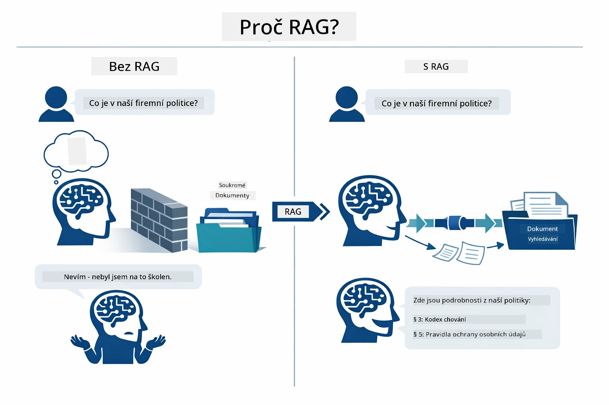

*Tento diagram ukazuje rozdíl mezi standardním LLM (který hádá na základě tréninkových dat) a LLM s RAG (který se nejprve poradí s vašimi dokumenty).*

Zde je propojení celého procesu end-to-end. Otázka uživatele prochází čtyřmi fázemi — embedding, vektorové vyhledávání, sestavení kontextu a generování odpovědi — přičemž každá stavba vychází z té předchozí:


*Tento diagram ukazuje end-to-end RAG proces — dotaz uživatele prochází embeddingem, vektorovým vyhledáváním, sestavením kontextu a generováním odpovědi.*

Zbytek tohoto modulu podrobně prochází každou z těchto fází s kódem, který můžete spustit a upravovat.

### Který přístup RAG tento tutoriál používá?

LangChain4j nabízí tři způsoby implementace RAG, každý s jinou úrovní abstrakce. Níže uvedený diagram je porovnává vedle sebe:

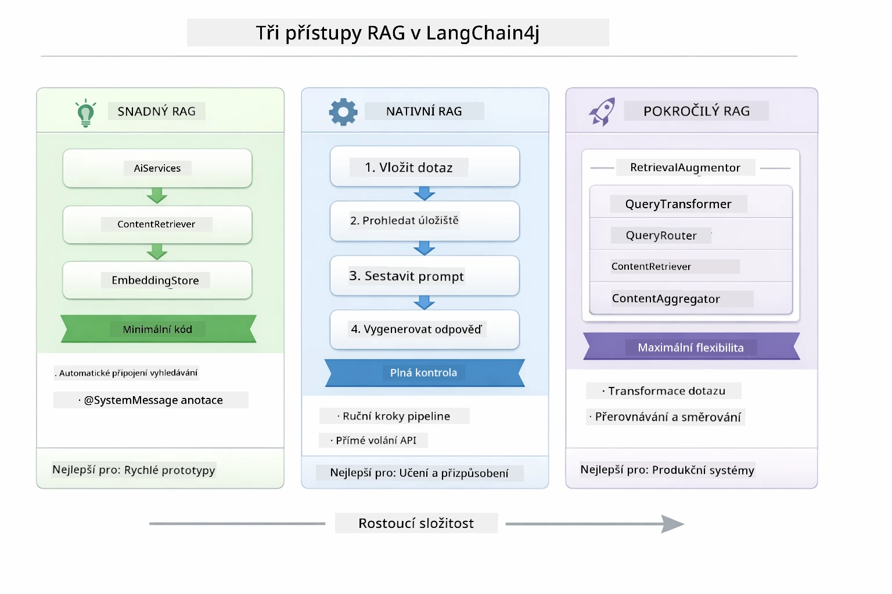

*Tento diagram porovnává tři LangChain4j RAG přístupy — Easy, Native a Advanced — ukazující jejich klíčové komponenty a kdy který používat.*

| Přístup | Co dělá | Kompromis |
|---|---|---|
| **Easy RAG** | Automaticky propojí vše přes `AiServices` a `ContentRetriever`. Anotujete rozhraní, připojíte retriever a LangChain4j za scénou zvládne embedding, vyhledávání i sestavení podnětu. | Minimální kód, ale nevidíte, co se děje v každém kroku. |
| **Native RAG** | Samostatně zavoláte embedding model, vyhledáte v úložišti, postavíte podnět a vygenerujete odpověď — jeden explicitní krok po kroku. | Více kódu, ale každá fáze je viditelná a upravitelná. |
| **Advanced RAG** | Používá rámec `RetrievalAugmentor` s pluginovými transformátory dotazů, směrovači, přehodnocovači a injektory obsahu pro výrobní pipeline. | Maximální flexibilita, ale podstatně vyšší složitost. |

**Tento tutoriál používá Native přístup.** Každý krok RAG pipeline — embedding dotazu, vyhledávání ve vektorovém úložišti, sestavení kontextu a generování odpovědi — je explicitně napsaný v [`RagService.java`](../../../03-rag/src/main/java/com/example/langchain4j/rag/service/RagService.java). To je záměrné: jako vzdělávací zdroj je důležitější, abyste každý krok viděli a porozuměli mu, než aby byl kód minimalizovaný. Jakmile pochopíte, jak na sebe jednotlivé části navazují, můžete přejít na Easy RAG pro rychlé prototypy nebo Advanced RAG pro produkční systémy.

> **💡 Už jste viděli Easy RAG v akci?** Modul [Rychlý start](../00-quick-start/README.md) obsahuje příklad Document Q&A ([`SimpleReaderDemo.java`](../../../00-quick-start/src/main/java/com/example/langchain4j/quickstart/SimpleReaderDemo.java)), který používá Easy RAG přístup — LangChain4j automaticky zvládá embedding, vyhledávání a sestavení podnětu. Tento modul jde o krok dál tím, že ten pipeline rozebírá, abyste každý krok mohli vidět a kontrolovat sami.

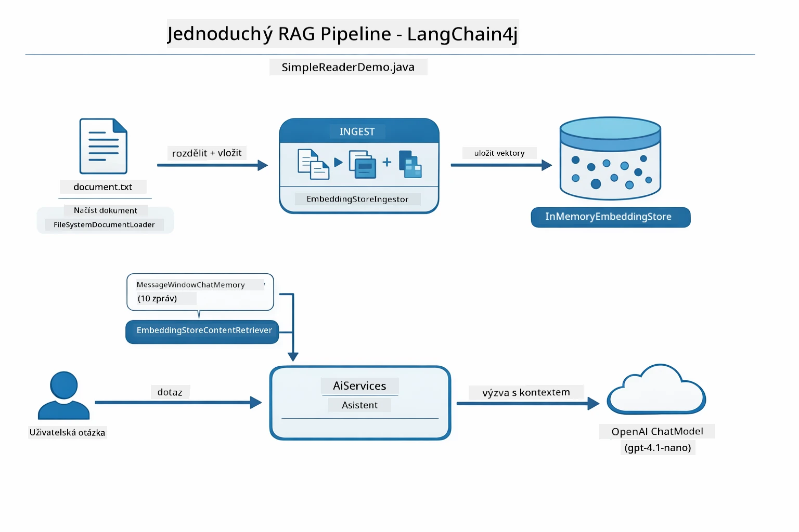

*Tento diagram ukazuje Easy RAG pipeline z `SimpleReaderDemo.java`. Porovnejte to s Native přístupem používaným v tomto modulu: Easy RAG skrývá embedding, retrieval a sestavení podnětu za `AiServices` a `ContentRetriever` — načtete dokument, připojíte retriever a získáte odpovědi. Native přístup v tomto modulu tento pipeline rozděluje, takže voláte každý krok (embed, search, assemble context, generate) sami, což vám dává plnou kontrolu a přehled.*

## Jak to funguje

RAG pipeline v tomto modulu se rozkládá do čtyř fází, které se spouští za sebou pokaždé, když uživatel položí otázku. Nejprve se nahraný dokument **parsuje a rozdělí na chunk-y** do spravovatelných částí. Tyto chunk-y se poté převedou na **vektorové embeddingy** a uloží, aby mohly být matematicky porovnávány. Když přijde dotaz, systém provede **sémantické vyhledávání**, aby našel nejrelevantnější chunk-y, a nakonec je předá jako kontext do LLM pro **generování odpovědi**. Níže jsou podrobnosti každé fáze s konkrétním kódem a diagramy. Začněme prvním krokem.

### Zpracování dokumentů

[DocumentService.java](../../../03-rag/src/main/java/com/example/langchain4j/rag/service/DocumentService.java)

Když nahrajete dokument, systém jej parsuje (PDF nebo prostý text), připojí metadata jako název souboru a pak jej rozdělí na chunk-y — menší části, které pohodlně zapadnou do context window modelu. Tyto chunk-y se mírně překrývají, aby neztratil kontext na hranicích.

```java
// Analyzujte nahraný soubor a zabalte jej do dokumentu LangChain4j
Document document = Document.from(content, metadata);

// Rozdělte na úseky po 300 tokenech s překrytím 30 tokenů
DocumentSplitter splitter = DocumentSplitters
    .recursive(300, 30);

List<TextSegment> segments = splitter.split(document);
```

Níže je diagram, který to znázorňuje vizuálně. Všimněte si, jak každý chunk sdílí některé tokeny se svými sousedy — 30-tokenové překrytí zajišťuje, že žádný důležitý kontext nepřepadne mezi hranicemi:

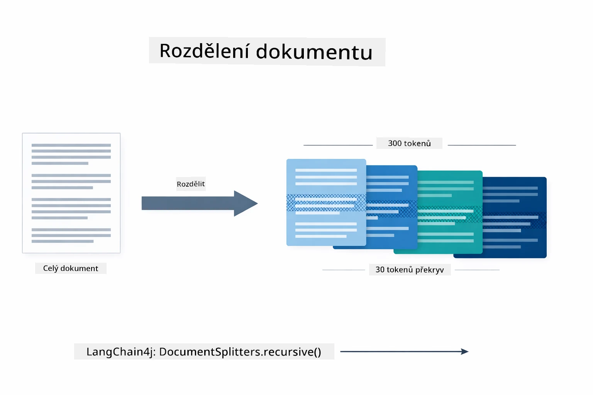

*Tento diagram ukazuje, jak je dokument rozdělen do chunků po 300 tokenech s 30-tokenovým překrytím, čímž se zachovává kontext na hranicích chunků.*

> **🤖 Vyzkoušejte s [GitHub Copilot](https://github.com/features/copilot) Chat:** Otevřete [`DocumentService.java`](../../../03-rag/src/main/java/com/example/langchain4j/rag/service/DocumentService.java) a zeptejte se:  
> - "Jak LangChain4j rozděluje dokumenty na chunk-y a proč je překrytí důležité?"  
> - "Jaká je optimální velikost chunků pro různé typy dokumentů a proč?"  
> - "Jak se vypořádat s dokumenty v několika jazycích nebo se speciálním formátováním?"

### Vytváření embeddingů

[LangChainRagConfig.java](../../../03-rag/src/main/java/com/example/langchain4j/rag/config/LangChainRagConfig.java)

Každý chunk se převede do číselné reprezentace nazývané embedding — v podstatě převod významu na čísla. Embedding model není "inteligentní" jako chat model; nedokáže řídit instrukce, uvažovat ani odpovídat na otázky. Co ale dokáže, je namapovat text do matematického prostoru, kde podobné významy jsou blízko sebe — "auto" vedle "automobil," "refund policy" vedle "vrácení peněz." Představte si chat model jako člověka, se kterým si můžete povídat; embedding model je ultra dobrý pořadač.

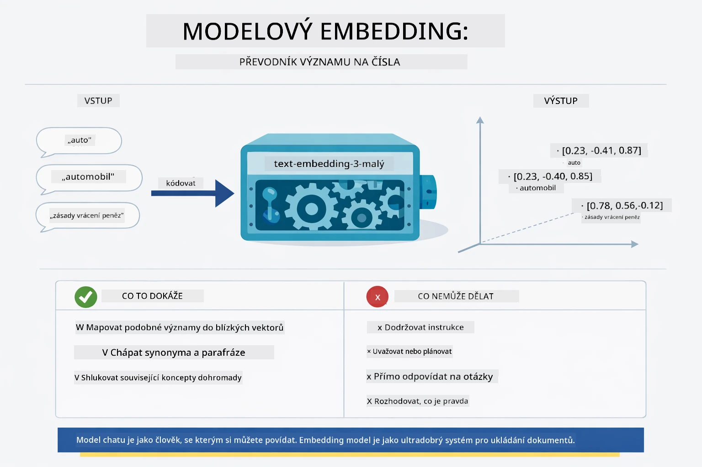

*Tento diagram ukazuje, jak embedding model převádí text na číselné vektory, přičemž podobné významy — jako "auto" a "automobil" — jsou blízko sebe ve vektorovém prostoru.*

```java
@Bean
public EmbeddingModel embeddingModel() {
    return OpenAiOfficialEmbeddingModel.builder()
        .baseUrl(azureOpenAiEndpoint)
        .apiKey(azureOpenAiKey)
        .modelName(azureEmbeddingDeploymentName)
        .build();
}

EmbeddingStore<TextSegment> embeddingStore = 
    new InMemoryEmbeddingStore<>();
```

Třída diagram níže ukazuje dva samostatné toky v RAG pipeline a třídy LangChain4j, které je implementují. **Ingestní tok** (běží při nahrání) rozděluje dokument, embeduje chunk-y a ukládá je přes `.addAll()`. **Dotazový tok** (běží kdykoli uživatel položí otázku) embeduje dotaz, vyhledá v úložišti přes `.search()` a předá nalezený kontext chat modelu. Oba toky se propojují přes sdílené rozhraní `EmbeddingStore<TextSegment>`:

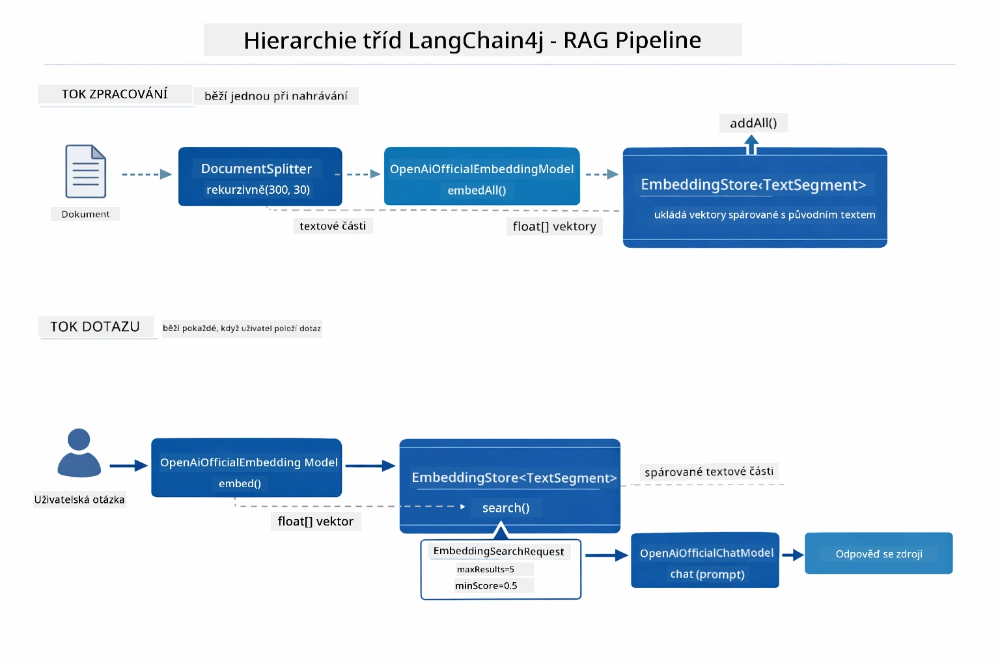

*Tento diagram ukazuje dva toky v RAG pipeline — ingestní a dotazový — a jak jsou propojeny přes sdílené EmbeddingStore.*

Jakmile jsou embeddingy uloženy, podobný obsah se přirozeně seskupí ve vektorovém prostoru. Níže je vizualizace, která ukazuje, jak se dokumenty o příbuzných tématech shromažďují jako blízké body, což umožňuje sémantické vyhledávání:


*Tato vizualizace ukazuje, jak se související dokumenty seskupují v 3D vektorovém prostoru, přičemž témata jako Technická dokumentace, Obchodní pravidla a FAQ tvoří jasné skupiny.*

Když uživatel vyhledává, systém následuje čtyři kroky: embeduje dokumenty jednou, embeduje dotaz při každém vyhledávání, porovnává vektor dotazu se všemi uloženými vektory pomocí kosinové podobnosti a vrací top-K nejlépe hodnocené chunk-y. Diagram níže provází každým krokem a ukazuje LangChain4j třídy, které se na tom podílejí:

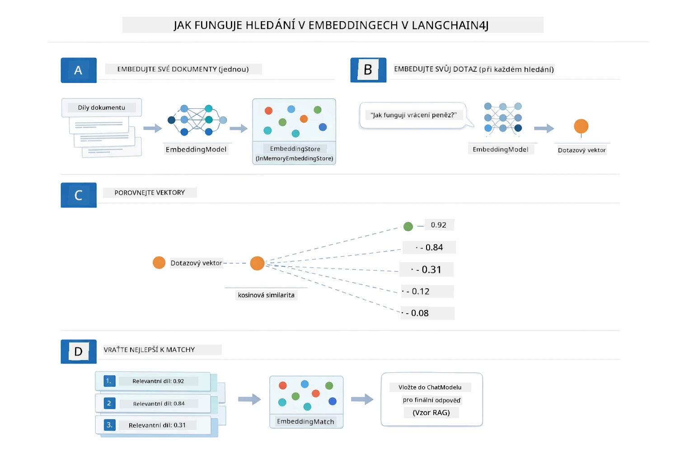

*Tento diagram ukazuje čtyřstupňový proces vyhledávání embeddingů: embedování dokumentů, embedování dotazu, porovnání vektorů pomocí kosinové podobnosti a vrácení top-K výsledků.*

### Sémantické vyhledávání

[RagService.java](../../../03-rag/src/main/java/com/example/langchain4j/rag/service/RagService.java)

Když položíte otázku, vaše otázka se také převede na embedding. Systém porovná embedding vaší otázky se všemi embeddingy chunků dokumentu. Najde chunk-y s nejpodobnějším významem — ne jen podle shody klíčových slov, ale podle skutečné sémantické podobnosti.

```java
Embedding queryEmbedding = embeddingModel.embed(question).content();

EmbeddingSearchRequest searchRequest = EmbeddingSearchRequest.builder()
    .queryEmbedding(queryEmbedding)
    .maxResults(5)
    .minScore(0.5)
    .build();

EmbeddingSearchResult<TextSegment> searchResult = embeddingStore.search(searchRequest);
List<EmbeddingMatch<TextSegment>> matches = searchResult.matches();

for (EmbeddingMatch<TextSegment> match : matches) {
    String relevantText = match.embedded().text();
    double score = match.score();
}
```

Níže uvedený diagram kontrastuje sémantické vyhledávání s tradičním hledáním podle klíčových slov. Hledání klíčového slova „vozidlo“ by minulo chunk o „auta a náklaďáky“, ale sémantické vyhledávání rozumí, že mají stejný význam a řadí ho vysoko:

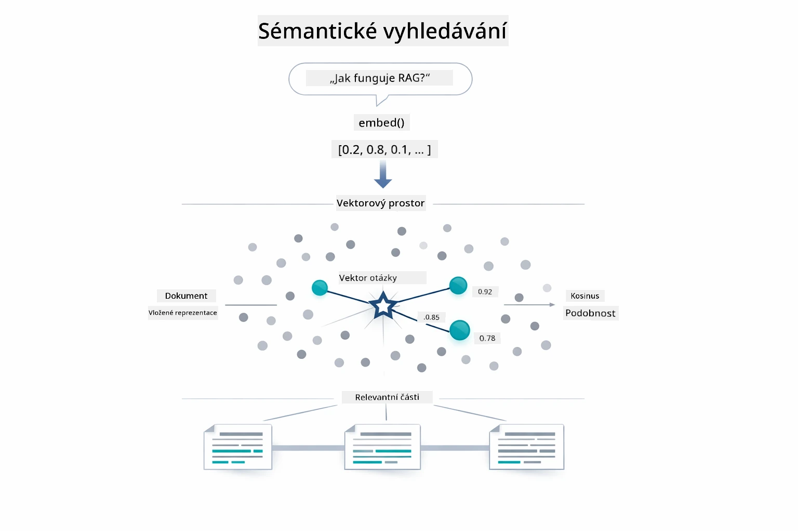

*Tento diagram srovnává vyhledávání založené na klíčových slovech se sémantickým vyhledáváním, ukazující jak sémantické vyhledávání vrací konceptuálně související obsah i když přesná klíčová slova chybí.*

Uvnitř se podobnost měří kosinovou podobností — vlastně otázkou "ukazují tyto dvě šipky stejným směrem?" Dvě chunk-y mohou používat úplně různá slova, ale pokud mají stejný význam, jejich vektory ukazují stejným směrem a skórují blízko 1.0:

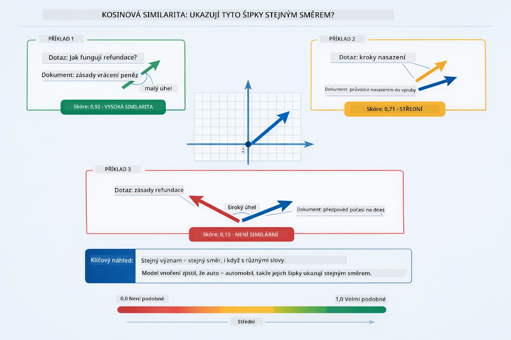
*Tento diagram ilustruje kosinovou podobnost jako úhel mezi vektorovými vloženími — lépe zarovnané vektory dosahují skóre blíže 1,0, což značí vyšší sémantickou podobnost.*

> **🤖 Vyzkoušejte s [GitHub Copilot](https://github.com/features/copilot) Chat:** Otevřete [`RagService.java`](../../../03-rag/src/main/java/com/example/langchain4j/rag/service/RagService.java) a zeptejte se:
> - „Jak funguje vyhledávání podobnosti s vloženími a co určuje skóre?“
> - „Jaký práh podobnosti bych měl použít a jak to ovlivní výsledky?“
> - „Jak řešit situace, kdy nebyly nalezeny žádné relevantní dokumenty?“

### Generování odpovědí

[RagService.java](../../../03-rag/src/main/java/com/example/langchain4j/rag/service/RagService.java)

Nejrelevantnější části jsou sestaveny do strukturované výzvy, která obsahuje explicitní instrukce, získaný kontext a uživatelovu otázku. Model čte tyto konkrétní části a odpovídá na základě těchto informací — může použít pouze to, co má před sebou, což zabraňuje halucinacím.

```java
String context = matches.stream()
    .map(match -> match.embedded().text())
    .collect(Collectors.joining("\n\n"));

String prompt = String.format("""
    Answer the question based on the following context.
    If the answer cannot be found in the context, say so.

    Context:
    %s

    Question: %s

    Answer:""", context, request.question());

String answer = chatModel.chat(prompt);
```

Níže uvedený diagram ukazuje tento proces sestavení v akci — nejlépe hodnocené části z kroku vyhledávání jsou vloženy do šablony výzvy a `OpenAiOfficialChatModel` generuje podloženou odpověď:

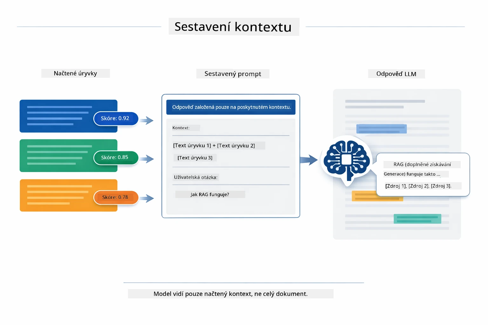

*Tento diagram ukazuje, jak jsou nejlépe hodnocené části sestaveny do strukturované výzvy, což umožňuje modelu generovat podloženou odpověď z vašich dat.*

## Spuštění aplikace

**Ověřte nasazení:**

Ujistěte se, že soubor `.env` existuje v kořenovém adresáři s přihlašovacími údaji Azure (vytvořenými během Modulu 01):

**Bash:**
```bash
cat ../.env  # Mělo by zobrazit AZURE_OPENAI_ENDPOINT, API_KEY, DEPLOYMENT
```

**PowerShell:**
```powershell
Get-Content ..\.env  # Mělo by zobrazit AZURE_OPENAI_ENDPOINT, API_KEY, DEPLOYMENT
```

**Spuštění aplikace:**

> **Poznámka:** Pokud jste již spustili všechny aplikace pomocí `./start-all.sh` z Modulu 01, tento modul již běží na portu 8081. Můžete přeskočit níže uvedené příkazy spuštění a přejít přímo na http://localhost:8081.

**Možnost 1: Použití Spring Boot Dashboard (doporučeno pro uživatele VS Code)**

Vývojářský kontejner obsahuje rozšíření Spring Boot Dashboard, které poskytuje vizuální rozhraní pro správu všech aplikací Spring Boot. Najdete ho v panelu aktivit na levé straně VS Code (hledejte ikonu Spring Boot).

Ze Spring Boot Dashboard můžete:
- Vidět všechny dostupné aplikace Spring Boot v pracovním prostoru
- Spustit/zastavit aplikace jedním kliknutím
- Zobrazovat protokoly aplikace v reálném čase
- Sledovat stav aplikace

Jednoduše klikněte na tlačítko přehrávání vedle „rag“ pro spuštění tohoto modulu, nebo spusťte všechny moduly najednou.


*Tento screenshot ukazuje Spring Boot Dashboard ve VS Code, kde můžete vizuálně spouštět, zastavovat a sledovat aplikace.*

**Možnost 2: Použití shell skriptů**

Spusťte všechny webové aplikace (moduly 01-04):

**Bash:**
```bash
cd ..  # Z kořenového adresáře
./start-all.sh
```

**PowerShell:**
```powershell
cd ..  # Z kořenového adresáře
.\start-all.ps1
```

Nebo spusťte jen tento modul:

**Bash:**
```bash
cd 03-rag
./start.sh
```

**PowerShell:**
```powershell
cd 03-rag
.\start.ps1
```

Oba skripty automaticky načtou proměnné prostředí z kořenového souboru `.env` a zkompilují JARy, pokud ještě neexistují.

> **Poznámka:** Pokud chcete ručně sestavit všechny moduly před spuštěním:
>
> **Bash:**
> ```bash
> cd ..  # Go to root directory
> mvn clean package -DskipTests
> ```
>
> **PowerShell:**
> ```powershell
> cd ..  # Go to root directory
> mvn clean package -DskipTests
> ```

Otevřete v prohlížeči http://localhost:8081.

**Pro zastavení:**

**Bash:**
```bash
./stop.sh  # Pouze tento modul
# Nebo
cd .. && ./stop-all.sh  # Všechny moduly
```

**PowerShell:**
```powershell
.\stop.ps1  # Pouze tento modul
# Nebo
cd ..; .\stop-all.ps1  # Všechny moduly
```

## Použití aplikace

Aplikace poskytuje webové rozhraní pro nahrávání dokumentů a kladení otázek.

<a href="images/rag-homepage.png"></a>

*Tento screenshot ukazuje rozhraní aplikace RAG, kde nahráváte dokumenty a kladete otázky.*

### Nahrání dokumentu

Začněte nahráním dokumentu — pro testování jsou nejvhodnější TXT soubory. V tomto adresáři je k dispozici `sample-document.txt`, který obsahuje informace o funkcích LangChain4j, implementaci RAG a osvědčené postupy — ideální pro testování systému.

Systém zpracuje váš dokument, rozdělí ho na části a pro každou část vytvoří vložení. Toto probíhá automaticky při nahrání.

### Kladete otázky

Nyní zeptejte se na konkrétní otázky ohledně obsahu dokumentu. Zkuste něco faktického, co je v dokumentu jasně uvedeno. Systém vyhledá relevantní části, zahrne je do výzvy a vygeneruje odpověď.

### Kontrola zdrojových referencí

Každá odpověď obsahuje zdrojové reference se skóre podobnosti. Toto skóre (0 až 1) ukazuje, jak relevantní byla každá část pro vaši otázku. Vyšší skóre znamená lepší shodu. To vám umožní ověřit odpověď vůči zdrojovému materiálu.

<a href="images/rag-query-results.png"></a>

*Tento screenshot ukazuje výsledky dotazu s vygenerovanou odpovědí, zdrojovými referencemi a skóre relevance pro každou nalezenou část.*

### Experimentujte s otázkami

Vyzkoušejte různé typy otázek:
- Konkrétní fakta: „Jaké je hlavní téma?“
- Srovnání: „Jaký je rozdíl mezi X a Y?“
- Shrnutí: „Shrňte klíčové body o Z“

Sledujte, jak se skóre relevance mění podle toho, jak dobře se vaše otázka shoduje s obsahem dokumentu.

## Klíčové koncepty

### Strategie dělení na části

Dokumenty jsou rozděleny do částí po 300 tokenech s překrytím 30 tokenů. Tento poměr zajistí, že každá část má dostatek kontextu, aby byla smysluplná, a zároveň je dostatečně malá, aby bylo možné do výzvy zahrnout více částí.

### Skóre podobnosti

Každá nalezená část má skóre podobnosti od 0 do 1, které udává, jak úzce odpovídá uživatelově otázce. Níže uvedený diagram znázorňuje rozsahy skóre a způsob, jakým systém filtruji výsledky:

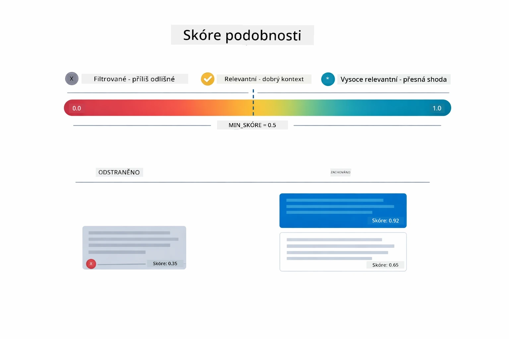

*Tento diagram ukazuje rozsahy skóre od 0 do 1, s minimálním prahem 0,5, který odfiltruje nerelevantní části.*

Skóre se pohybují od 0 do 1:
- 0,7–1,0: Vysoce relevantní, přesná shoda
- 0,5–0,7: Relevantní, dobrý kontext
- Pod 0,5: Odfiltrováno, příliš odlišné

Systém získává pouze části nad minimálním prahem, aby zajistil kvalitu.

Vložení fungují dobře, když se významy jasně shlukují, ale mají slepé skvrny. Následující diagram ukazuje běžné režimy selhání — části, které jsou příliš velké, vytvářejí rozmazané vektory, části příliš malé nemají kontext, nejednoznačné termíny odkazují na více shluků a přesné vyhledávání (ID, čísla dílů) s vloženími vůbec nefunguje:

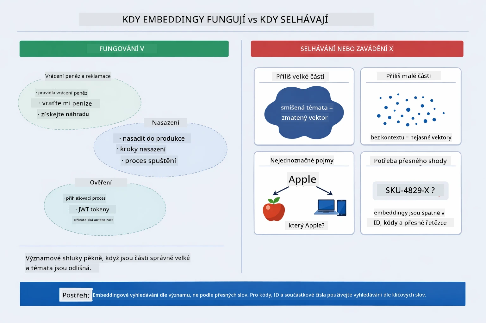

*Tento diagram ukazuje běžné režimy selhání vložení: části příliš velké, části příliš malé, nejednoznačné termíny směřující do více shluků a přesné vyhledávání jako ID.*

### Paměťové úložiště

Tento modul používá pro jednoduchost úložiště v paměti. Po restartu aplikace se nahrané dokumenty ztratí. Produkční systémy používají perzistentní vektorové databáze jako Qdrant nebo Azure AI Search.

### Správa kontextového okna

Každý model má maximální kontextové okno. Nemůžete zahrnout každou část z velkého dokumentu. Systém získává top N nejrelevantnějších částí (výchozí 5), aby zůstal v mezích a zároveň poskytl dostatek kontextu pro přesné odpovědi.

## Kdy je RAG důležitý

RAG není vždy vhodný přístup. Níže uvedený průvodce vám pomůže rozhodnout, kdy RAG přidává hodnotu a kdy postačují jednodušší přístupy — například zahrnutí obsahu přímo do výzvy nebo spoléhání na vestavěné znalosti modelu:

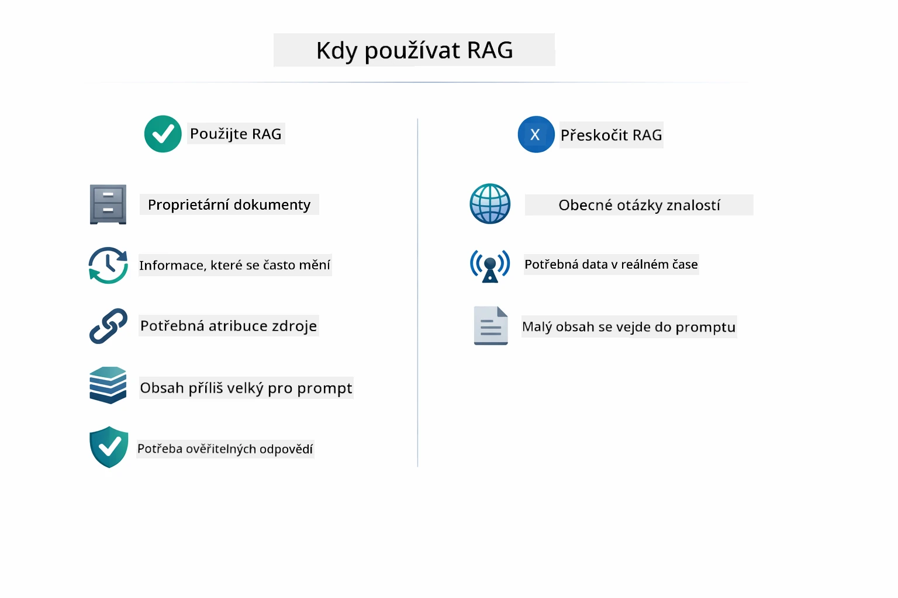

*Tento diagram ukazuje rozhodovací průvodce, kdy RAG přidává hodnotu a kdy postačují jednodušší přístupy.*

**Používejte RAG, když:**
- odpovídáte na otázky o vlastních dokumentech
- informace se často mění (směrnice, ceny, specifikace)
- je třeba přesnosti s uvedením zdroje
- obsah je příliš velký na to, aby se vešel do jedné výzvy
- potřebujete ověřitelné, podložené odpovědi

**Nepoužívejte RAG, když:**
- otázky vyžadují obecné znalosti, které model již má
- potřebujete data v reálném čase (RAG pracuje s nahranými dokumenty)
- obsah je dostatečně malý, aby bylo možné ho zahrnout přímo do výzvy

## Další kroky

**Další modul:** [04-tools - AI Agents s nástroji](../04-tools/README.md)

---

**Navigace:** [← Předchozí: Modul 02 - Prompt Engineering](../02-prompt-engineering/README.md) | [Zpět na hlavní stránku](../README.md) | [Další: Modul 04 - Nástroje →](../04-tools/README.md)

---

<!-- CO-OP TRANSLATOR DISCLAIMER START -->
**Prohlášení o vyloučení odpovědnosti**:  
Tento dokument byl přeložen pomocí AI překladatelské služby [Co-op Translator](https://github.com/Azure/co-op-translator). I když usilujeme o přesnost, mějte prosím na paměti, že automatizované překlady mohou obsahovat chyby nebo nepřesnosti. Originální dokument v jeho rodném jazyce by měl být považován za autoritativní zdroj. Pro kritické informace se doporučuje profesionální lidský překlad. Nejsme odpovědní za jakákoliv nedorozumění nebo mylné výklady vyplývající z použití tohoto překladu.
<!-- CO-OP TRANSLATOR DISCLAIMER END -->