# Modul 04: AI agenti s nástroji

## Obsah

- [Video průvodce](../../../04-tools)
- [Co se naučíte](../../../04-tools)
- [Předpoklady](../../../04-tools)
- [Porozumění AI agentům s nástroji](../../../04-tools)
- [Jak funguje volání nástrojů](../../../04-tools)
  - [Definice nástrojů](../../../04-tools)
  - [Rozhodování](../../../04-tools)
  - [Vykonání](../../../04-tools)
  - [Generování odpovědi](../../../04-tools)
  - [Architektura: Spring Boot automatické propojení](../../../04-tools)
- [Řetězení nástrojů](../../../04-tools)
- [Spuštění aplikace](../../../04-tools)
- [Používání aplikace](../../../04-tools)
  - [Vyzkoušejte jednoduché použití nástroje](../../../04-tools)
  - [Testování řetězení nástrojů](../../../04-tools)
  - [Zobrazení průběhu konverzace](../../../04-tools)
  - [Experimentování s různými požadavky](../../../04-tools)
- [Klíčové koncepty](../../../04-tools)
  - [Vzor ReAct (Reasoning and Acting)](../../../04-tools)
  - [Popisy nástrojů mají význam](../../../04-tools)
  - [Správa relace](../../../04-tools)
  - [Zpracování chyb](../../../04-tools)
- [Dostupné nástroje](../../../04-tools)
- [Kdy používat agenty založené na nástrojích](../../../04-tools)
- [Nástroje vs RAG](../../../04-tools)
- [Další kroky](../../../04-tools)

## Video průvodce

Podívejte se na živou relaci, která vysvětluje, jak začít s tímto modulem:

<a href="https://www.youtube.com/watch?v=O_J30kZc0rw"></a>

## Co se naučíte

Dosud jste se naučili, jak vést rozhovory s AI, efektivně strukturovat výzvy a zakládat odpovědi na vašich dokumentech. Přesto existuje základní omezení: jazykové modely umí pouze generovat text. Nemohou zkontrolovat počasí, provádět výpočty, dotazovat se do databází nebo komunikovat s externími systémy.

Nástroje to mění. Poskytnutím modelu přístupu k funkcím, které může volat, ho proměníte z generátoru textu na agenta, který může podnikat akce. Model rozhoduje, kdy potřebuje nástroj, který nástroj použít a jaké parametry předat. Váš kód vykoná funkci a vrátí výsledek. Model tento výsledek zakomponuje do své odpovědi.

## Předpoklady

- Dokončen [Modul 01 - Úvod](../01-introduction/README.md) (nasazené Azure OpenAI zdroje)
- Doporučeno dokončit předchozí moduly (tento modul odkazuje na [RAG koncepty z Modulu 03](../03-rag/README.md) v porovnání Nástroje vs RAG)
- `.env` soubor v kořenovém adresáři s Azure přihlašovacími údaji (vytvořeno pomocí `azd up` v Modulu 01)

> **Poznámka:** Pokud jste ještě nedokončili Modul 01, nejdříve postupujte podle jeho nasazovacích pokynů.

## Porozumění AI agentům s nástroji

> **📝 Poznámka:** Termín „agenti“ v tomto modulu označuje AI asistenty rozšířené o schopnost volání nástrojů. To se liší od vzorů **Agentic AI** (autonomní agenti s plánováním, pamětí a vícekrokovým uvažováním), které budeme probírat v [Modulu 05: MCP](../05-mcp/README.md).

Bez nástrojů může jazykový model generovat pouze text založený na svých tréninkových datech. Zeptejte se ho na aktuální počasí a musí odhadovat. Dejte mu nástroje a může zavolat API počasí, provést výpočty nebo dotazovat databázi — a pak tyto skutečné výsledky zapracovat do své odpovědi.

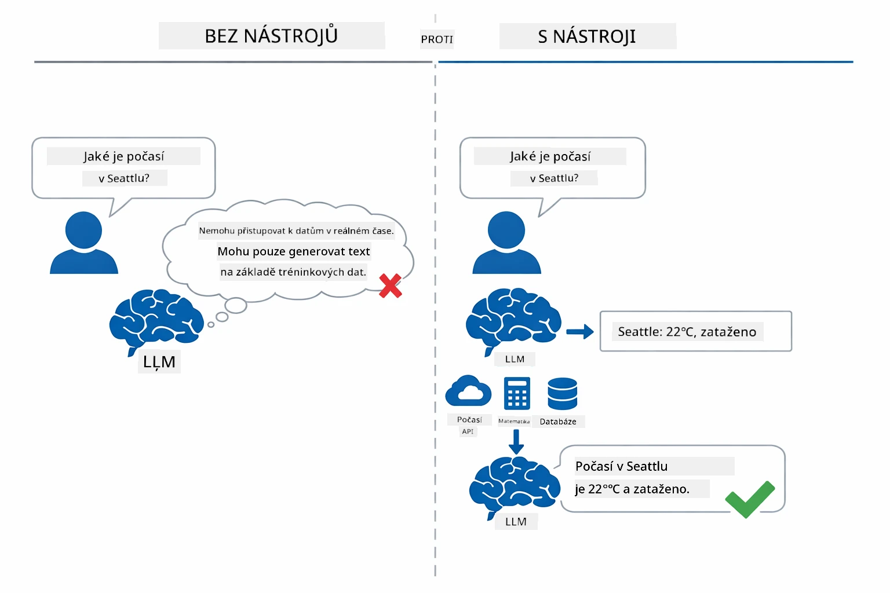

*Bez nástrojů model jen hádá — s nástroji může volat API, provádět výpočty a vracet aktuální data.*

AI agent s nástroji používá vzor **Reasoning and Acting (ReAct)**. Model nejen odpovídá — přemýšlí o tom, co potřebuje, jedná voláním nástroje, pozoruje výsledek a pak rozhodne, zda znovu jednat nebo podat konečnou odpověď:

1. **Reason (Přemýšlí)** — Agent analyzuje uživatelskou otázku a určí, jaké informace potřebuje
2. **Act (Jde k činu)** — Agent vybere správný nástroj, vytvoří správné parametry a zavolá ho
3. **Observe (Sleduje)** — Agent přijme výstup nástroje a vyhodnotí ho
4. **Repeat or Respond (Opakuje nebo odpovídá)** — Pokud je potřeba více dat, agent se vrací zpět; jinak vytváří odpověď v přirozeném jazyce

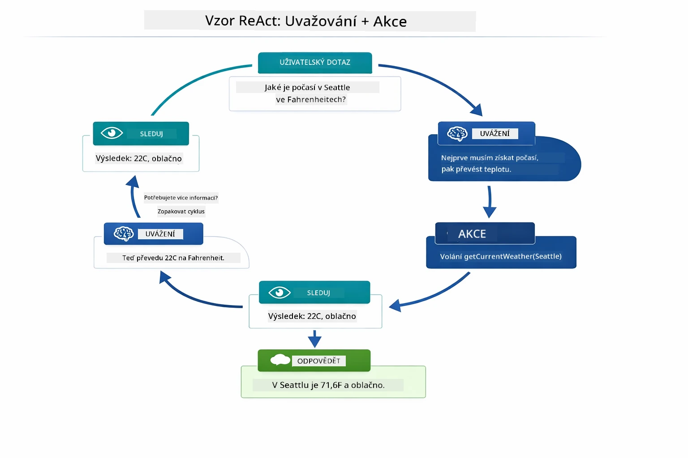

*Cyklický ReAct vzor — agent uvažuje, co dělat, jedná voláním nástroje, sleduje výsledek a pokračuje, dokud nemůže podat konečnou odpověď.*

To se děje automaticky. Definujete nástroje a jejich popisy. Model rozhoduje, kdy a jak je používat.

## Jak funguje volání nástrojů

### Definice nástrojů

[WeatherTool.java](../../../04-tools/src/main/java/com/example/langchain4j/agents/tools/WeatherTool.java) | [TemperatureTool.java](../../../04-tools/src/main/java/com/example/langchain4j/agents/tools/TemperatureTool.java)

Definujete funkce s jasnými popisy a specifikacemi parametrů. Model vidí tyto popisy ve svém systémovém promptu a chápe, k čemu každý nástroj slouží.

```java
@Component
public class WeatherTool {
    
    @Tool("Get the current weather for a location")
    public String getCurrentWeather(@P("Location name") String location) {
        // Vaše logika vyhledávání počasí
        return "Weather in " + location + ": 22°C, cloudy";
    }
}

@AiService
public interface Assistant {
    String chat(@MemoryId String sessionId, @UserMessage String message);
}

// Asistent je automaticky propojen Spring Bootem s:
// - ChatModel bean
// - Všechny metody @Tool z tříd označených @Component
// - ChatMemoryProvider pro správu relací
```

Diagram níže rozebírá každou anotaci a ukazuje, jak každý prvek pomáhá AI pochopit, kdy nástroj zavolat a jaké argumenty předat:

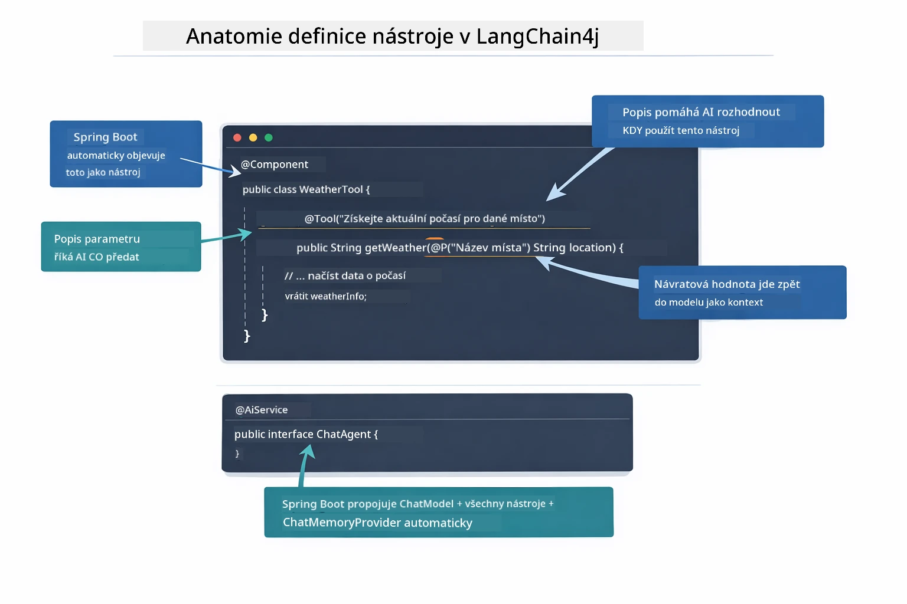

*Anatomie definice nástroje — @Tool říká AI, kdy jej použít, @P popisuje každý parametr a @AiService vše při startu propojí.*

> **🤖 Vyzkoušejte s [GitHub Copilot](https://github.com/features/copilot) Chat:** Otevřete [`WeatherTool.java`](../../../04-tools/src/main/java/com/example/langchain4j/agents/tools/WeatherTool.java) a zeptejte se:
> - „Jak bych integroval skutečné API počasí, třeba OpenWeatherMap, místo testovacích dat?“
> - „Co dělá dobrý popis nástroje, který pomáhá AI správně jej používat?“
> - „Jak řešit chyby API a limity rychlosti v implementaci nástrojů?“

### Rozhodování

Když uživatel položí otázku „Jaké je počasí v Seattlu?“, model si náhodně nevybere nástroj. Porovnává uživatelův záměr s popisy všech dostupných nástrojů, každému přiřazuje skóre relevanci a vybere nejlepší shodu. Pak vygeneruje strukturovaný volací příkaz s odpovídajícími parametry — v tomto případě nastaví `location` na `"Seattle"`.

Pokud žádný nástroj nesedí na uživatelův požadavek, model odpoví z vlastní znalosti. Pokud sedí více nástrojů, vybere ten nejpřesnější.

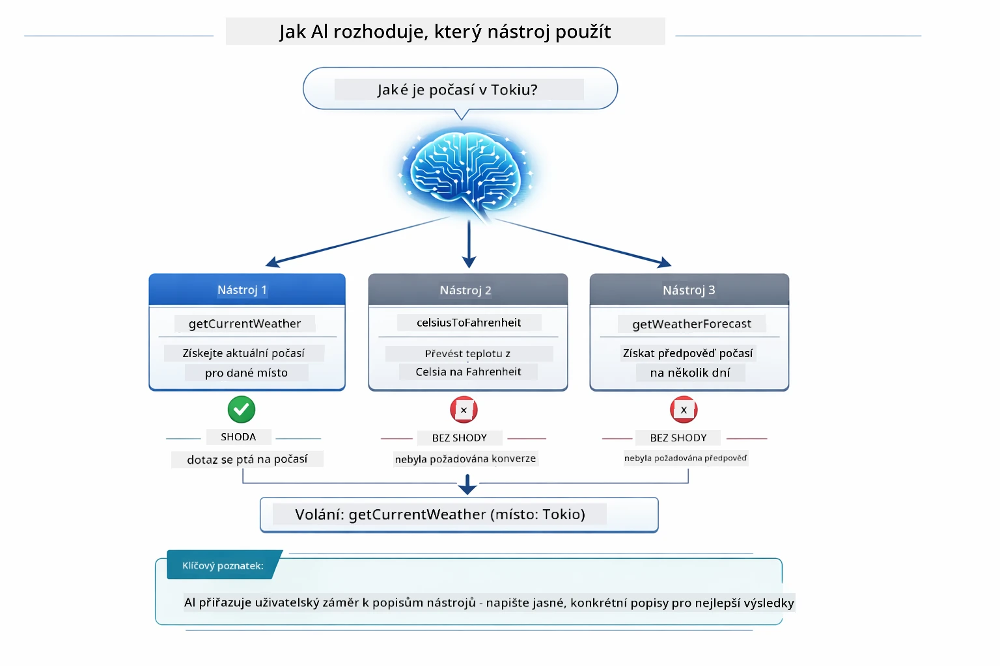

*Model porovnává každý dostupný nástroj s uživatelovým záměrem a vybírá nejlepší shodu — proto je důležité psát jasné a konkrétní popisy nástrojů.*

### Vykonání

[AgentService.java](../../../04-tools/src/main/java/com/example/langchain4j/agents/service/AgentService.java)

Spring Boot automaticky propojí deklarativní rozhraní `@AiService` se všemi registrovanými nástroji a LangChain4j volání nástrojů provádí automaticky. V pozadí probíhá kompletní volání nástroje přes šest fází — od uživatelovy otázky v přirozeném jazyce až zpět k odpovědi v přirozeném jazyce:

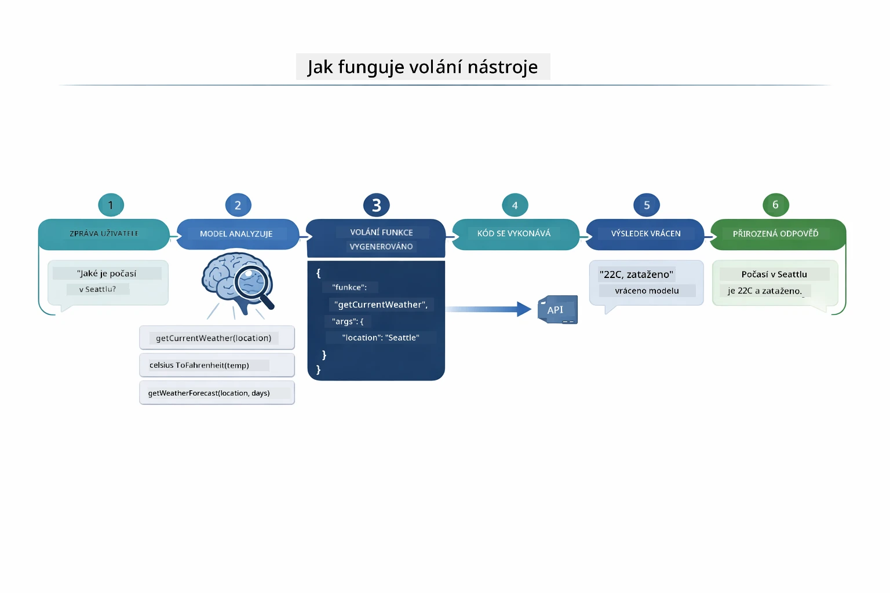

*Celý průběh — uživatel položí otázku, model vybere nástroj, LangChain4j ho vykoná a model začleňuje výsledek do přirozené odpovědi.*

Pokud jste spustili [ToolIntegrationDemo](../../../00-quick-start/src/main/java/com/example/langchain4j/quickstart/ToolIntegrationDemo.java) v Modulu 00, už jste viděli tento vzor v akci — nástroje `Calculator` se volaly stejným způsobem. Následující sekvenční diagram ukazuje přesně, co se během té ukázky dělo pod pokličkou:

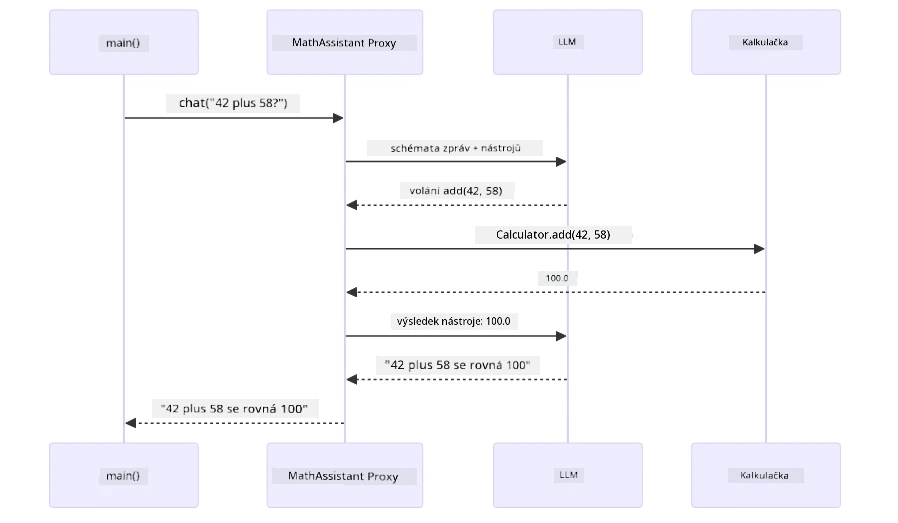

*Cyklus volání nástroje z ukázky Quick Start — `AiServices` posílá vaši zprávu a schéma nástroje do LLM, LLM odpoví voláním funkce jako `add(42, 58)`, LangChain4j místně vykoná metodu `Calculator` a vrátí výsledek pro konečnou odpověď.*

> **🤖 Vyzkoušejte s [GitHub Copilot](https://github.com/features/copilot) Chat:** Otevřete [`AgentService.java`](../../../04-tools/src/main/java/com/example/langchain4j/agents/service/AgentService.java) a zeptejte se:
> - „Jak funguje vzor ReAct a proč je efektivní pro AI agenty?“
> - „Jak agent rozhoduje, který nástroj použít a v jakém pořadí?“
> - „Co se stane, pokud vykonání nástroje selže - jak řešit chyby robustně?“

### Generování odpovědi

Model obdrží data o počasí a formátuje je do přirozené jazykové odpovědi uživateli.

### Architektura: Spring Boot automatické propojení

Tento modul používá integraci LangChain4j se Spring Bootem s deklarativními rozhraními `@AiService`. Při startu Spring Boot automaticky najde každý `@Component`, který obsahuje metody s `@Tool`, váš bean `ChatModel` a `ChatMemoryProvider` — a všechny je propojí do jednoho rozhraní `Assistant` bez potřeby boilerplate kódu.

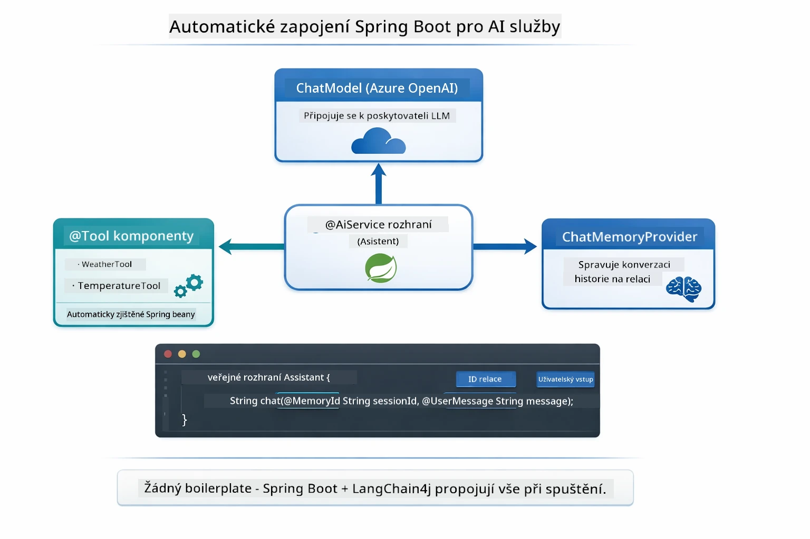

*Rozhraní @AiService spojuje ChatModel, komponenty nástrojů a poskytovatele paměti — Spring Boot automaticky zajišťuje jejich propojení.*

Zde je celý životní cyklus požadavku jako sekvenční diagram — od HTTP požadavku přes controller, service a automaticky propojený proxy až k vykonání nástroje a zpět:

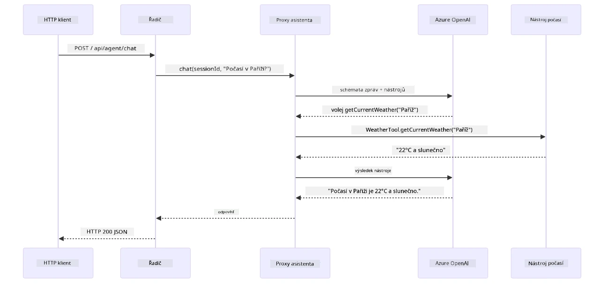

*Kompletní životní cyklus požadavku Spring Boot — HTTP požadavek prochází přes controller a service k automaticky propojenému proxy `Assistant`, které automaticky zajišťuje orchestraci LLM a volání nástrojů.*

Klíčové výhody tohoto přístupu:

- **Spring Boot automatické propojení** — ChatModel a nástroje automaticky injektovány
- **Vzor @MemoryId** — Automatická správa paměti založená na relacích
- **Jediná instance** — Assistant vytvořen jednou a znovu použít pro lepší výkon
- **Typově bezpečné vykonání** — Java metody volány přímo s konverzí typů
- **Vícekroková orchestrací** — Automaticky řeší řetězení nástrojů
- **Nulový boilerplate** — Žádné manuální volání `AiServices.builder()` nebo paměťových HashMap

Alternativní přístupy (manuální `AiServices.builder()`) vyžadují více kódu a postrádají výhody integrace se Spring Bootem.

## Řetězení nástrojů

**Řetězení nástrojů** — Skutečná síla agentů založených na nástrojích se ukazuje, když jedna otázka vyžaduje použití více nástrojů. Zeptejte se na „Jaké je počasí v Seattlu ve Fahrenheitech?“ a agent automaticky řetězí dva nástroje: nejprve zavolá `getCurrentWeather` pro získání teploty ve stupních Celsia, pak tuto hodnotu předá do `celsiusToFahrenheit` pro převod — vše v jediném kole konverzace.

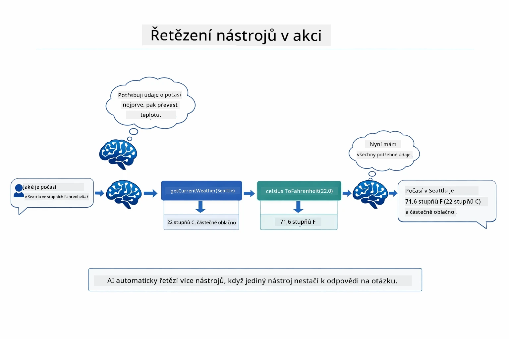

*Řetězení nástrojů v akci — agent nejdříve zavolá getCurrentWeather, výsledek v Celsiích předá do celsiusToFahrenheit a poskytne kombinovanou odpověď.*

**Hladké selhání** — Zeptejte se na počasí ve městě, které není v testovacích datech. Nástroj vrátí chybovou zprávu a AI vysvětlí, že nedokáže pomoci, místo aby spadl. Nástroje selhávají bezpečně. Diagram níže ukazuje dva přístupy — při správném zpracování chyb agent chybu zachytí a odpoví nápomocně, zatímco bez něj aplikace spadne:

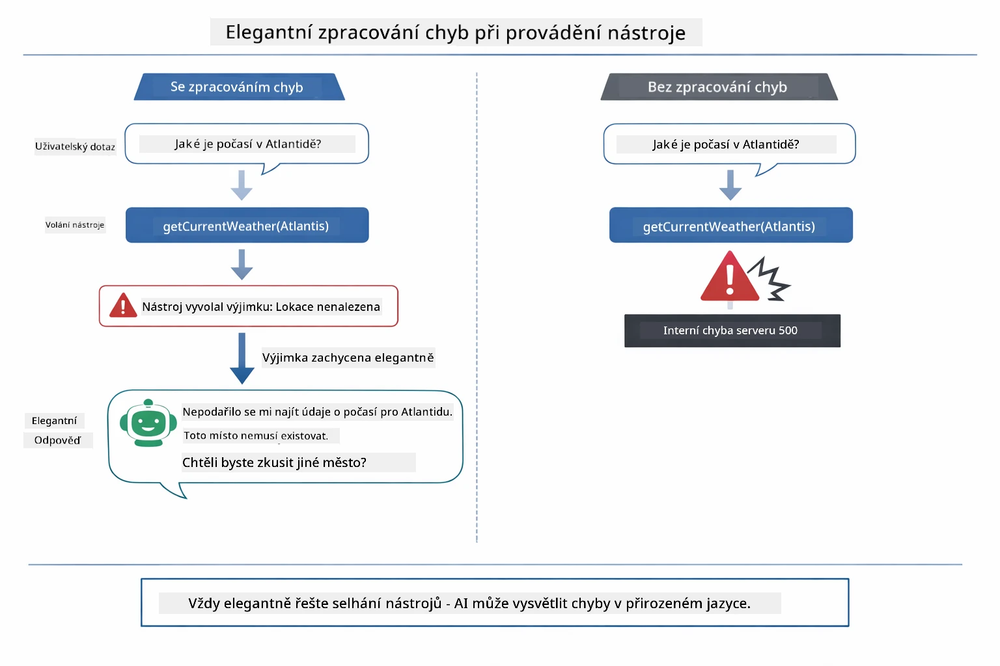

*Když nástroj selže, agent chybu zachytí a odpoví s užitečným vysvětlením místo pádu.*

To se děje v rámci jediného kola konverzace. Agent samostatně orchestruje více volání nástrojů.

## Spuštění aplikace

**Ověření nasazení:**

Ujistěte se, že `.env` soubor existuje v kořenovém adresáři s Azure přihlašovacími údaji (vytvořené během Modulu 01). Spusťte z adresáře modulu (`04-tools/`):

**Bash:**
```bash
cat ../.env  # Mělo by zobrazit AZURE_OPENAI_ENDPOINT, API_KEY, DEPLOYMENT
```

**PowerShell:**
```powershell
Get-Content ..\.env  # Mělo by zobrazit AZURE_OPENAI_ENDPOINT, API_KEY, DEPLOYMENT
```

**Spusťte aplikaci:**

> **Poznámka:** Pokud jste již spustili všechny aplikace pomocí `./start-all.sh` z kořenového adresáře (jak popisuje Modul 01), tento modul je již spuštěný na portu 8084. Můžete přeskočit příkazy spuštění níže a přejít přímo na http://localhost:8084.

**Možnost 1: Použití Spring Boot Dashboard (doporučeno pro uživatele VS Code)**

Vývojový kontejner obsahuje rozšíření Spring Boot Dashboard, které poskytuje vizuální rozhraní pro správu všech Spring Boot aplikací. Najdete ho v liště aktivit na levé straně VS Code (hledáte ikonu Spring Boot).

V Spring Boot Dashboard můžete:
- Vidět všechny dostupné Spring Boot aplikace v pracovním prostoru
- Spouštět/zastavovat aplikace jedním kliknutím
- Prohlížet si logy aplikace v reálném čase
- Monitorovat stav aplikace
Jednoduše klikněte na tlačítko přehrát vedle "tools" pro spuštění tohoto modulu, nebo spusťte všechny moduly najednou.

Takto vypadá Spring Boot Dashboard ve VS Code:


*Spring Boot Dashboard ve VS Code — spuštění, zastavení a sledování všech modulů z jednoho místa*

**Varianta 2: Použití shell skriptů**

Spusťte všechny webové aplikace (moduly 01-04):

**Bash:**
```bash
cd ..  # Ze základního adresáře
./start-all.sh
```

**PowerShell:**
```powershell
cd ..  # Ze základního adresáře
.\start-all.ps1
```

Nebo spusťte pouze tento modul:

**Bash:**
```bash
cd 04-tools
./start.sh
```

**PowerShell:**
```powershell
cd 04-tools
.\start.ps1
```

Oba skripty automaticky načítají proměnné prostředí ze souboru `.env` v kořenovém adresáři a pokud JAR soubory neexistují, vytvoří je.

> **Poznámka:** Pokud chcete všechny moduly nejdříve manuálně sestavit před spuštěním:
>
> **Bash:**
> ```bash
> cd ..  # Go to root directory
> mvn clean package -DskipTests
> ```
>
> **PowerShell:**
> ```powershell
> cd ..  # Go to root directory
> mvn clean package -DskipTests
> ```

Otevřete v prohlížeči http://localhost:8084.

**Pro zastavení:**

**Bash:**
```bash
./stop.sh  # Pouze tento modul
# Nebo
cd .. && ./stop-all.sh  # Všechny moduly
```

**PowerShell:**
```powershell
.\stop.ps1  # Pouze tento modul
# Nebo
cd ..; .\stop-all.ps1  # Všechny moduly
```

## Použití aplikace

Aplikace poskytuje webové rozhraní, kde můžete komunikovat s AI agentem, který má přístup k nástrojům pro počasí a převody teplot. Takto vypadá rozhraní — obsahuje rychlé startovací příklady a chatovací panel pro odesílání požadavků:

<a href="images/tools-homepage.png"></a>

*Rozhraní AI Agent Tools - rychlé příklady a chat pro interakci s nástroji*

### Vyzkoušejte jednoduché použití nástroje

Začněte jednoduchým požadavkem: "Převést 100 stupňů Fahrenheita na Celsia". Agent rozpozná, že potřebuje nástroj pro převod teplot, zavolá ho s potřebnými parametry a vrátí výsledek. Všimněte si, jak to působí přirozeně - nemuseli jste uvádět, který nástroj použít nebo jak ho zavolat.

### Otestujte řetězení nástrojů

Teď zkuste něco složitějšího: "Jaké je počasí v Seattlu a převeď ho na Fahrenheity?" Sledujte, jak agent postupuje krok za krokem. Nejprve zjistí počasí (vrací se v Celsiích), pak pozná, že je potřeba převést na Fahrenheity, zavolá nástroj pro převod a oba výsledky spojí do jedné odpovědi.

### Sledujte tok konverzace

Chatovací rozhraní uchovává historii konverzací, což umožňuje vícekolové interakce. Vidíte všechny předchozí dotazy a odpovědi, což usnadňuje sledování konverzace a pochopení, jak agent vytváří kontext přes více výměn.

<a href="images/tools-conversation-demo.png"></a>

*Vícekroková konverzace ukazující jednoduché převody, vyhledávání počasí a řetězení nástrojů*

### Experimentujte s různými požadavky

Vyzkoušejte různé kombinace:
- Vyhledávání počasí: "Jaké je počasí v Tokiu?"
- Převody teplot: "Kolik je 25 °C v Kelvinech?"
- Kombinované dotazy: "Zkontroluj počasí v Paříži a řekni mi, jestli je nad 20 °C"

Všimněte si, jak agent interpretuje přirozený jazyk a mapuje ho na odpovídající volání nástrojů.

## Klíčové pojmy

### ReAct vzor (Reasoning and Acting)

Agent střídá rozvažování (rozhodování, co udělat) a jednání (používání nástrojů). Tento vzor umožňuje autonomní řešení problémů místo pouhého reagování na instrukce.

### Popisy nástrojů jsou důležité

Kvalita popisů nástrojů přímo ovlivňuje, jak dobře je agent používá. Jasné a specifické popisy pomáhají modelu pochopit, kdy a jak každý nástroj zavolat.

### Správa relací

Anotace `@MemoryId` umožňuje automatickou správu paměti na základě relace. Každé ID relace dostane vlastní instanci `ChatMemory`, kterou spravuje bean `ChatMemoryProvider`, takže více uživatelů může interagovat s agentem současně, aniž by se jejich konverzace proplétaly. Následující diagram ukazuje, jak jsou uživatelé směrováni na izolované paměťové úložiště na základě jejich ID relace:

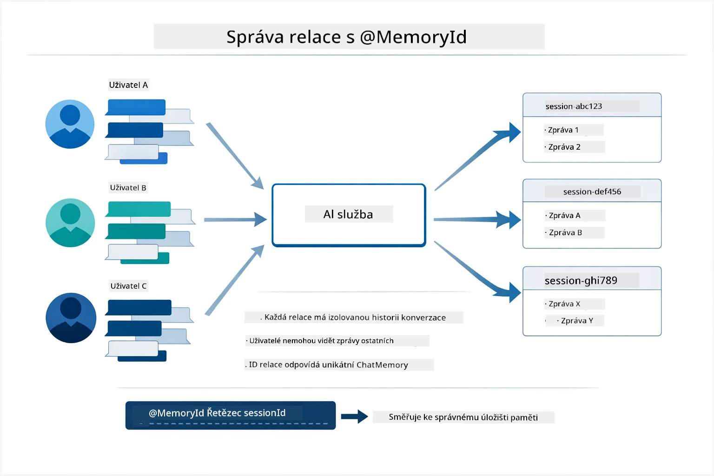

*Každé ID relace odpovídá izolované historii konverzace — uživatelé nikdy nevidí zprávy jiných.*

### Zpracování chyb

Nástroje mohou selhat — API může vypršet časový limit, parametry mohou být neplatné, externí služby mohou vypadnout. Produkční agenti potřebují zpracování chyb, aby model mohl vysvětlit problémy nebo zkusit alternativy místo pádu celé aplikace. Když nástroj vyhodí výjimku, LangChain4j ji zachytí a pošle chybovou zprávu zpět modelu, který pak problém vysvětlí přirozeným jazykem.

## Dostupné nástroje

Níže uvedený diagram ukazuje široký ekosystém nástrojů, které můžete vytvářet. Tento modul demonstruje nástroje pro počasí a teplotu, ale stejný vzor `@Tool` funguje pro jakoukoliv Java metodu — od databázových dotazů až po zpracování plateb.

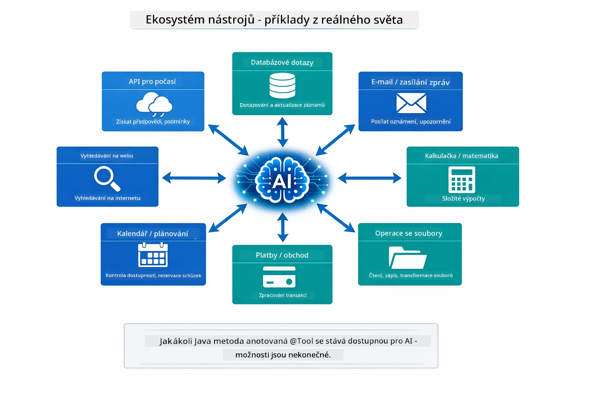

*Jakákoliv Java metoda anotovaná `@Tool` je dostupná AI — tento vzor se rozšiřuje na databáze, API, e-maily, operace se soubory a další.*

## Kdy používat agenty založené na nástrojích

Ne každý požadavek potřebuje nástroje. Rozhodnutí závisí na tom, zda AI potřebuje komunikovat s externími systémy, nebo může odpovědět ze svých znalostí. Následující průvodce shrnuje, kdy nástroje přidávají hodnotu a kdy nejsou potřeba:

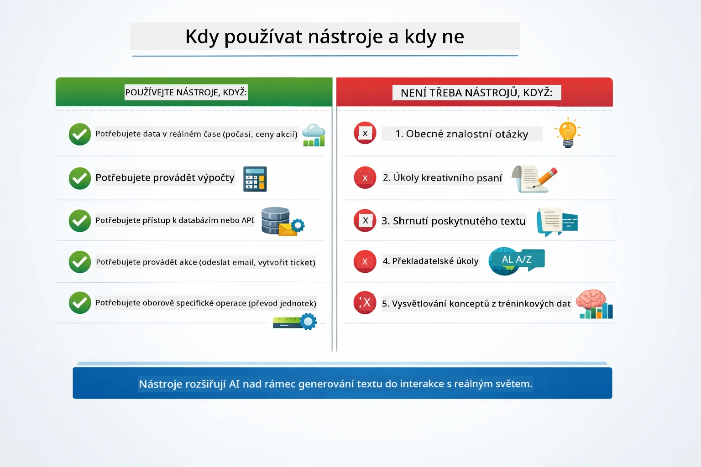

*Rychlý průvodce rozhodováním — nástroje jsou pro data v reálném čase, výpočty a akce; obecné znalosti a kreativní úkoly je nepotřebují.*

## Nástroje vs RAG

Moduly 03 a 04 oba rozšiřují, co může AI dělat, ale zásadně odlišnými způsoby. RAG poskytuje modelu přístup ke **znalostem** načítáním dokumentů. Nástroje dávají modelu schopnost provádět **akce** voláním funkcí. Následující diagram porovnává tyto dva přístupy vedle sebe — od toho, jak každý pracovní postup funguje, až po kompromisy mezi nimi:

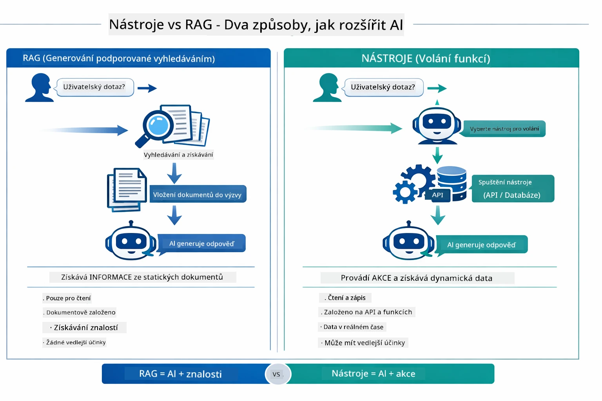

*RAG vyhledává informace ve statických dokumentech — nástroje vykonávají akce a získávají dynamická, aktuální data. Mnoho produkčních systémů kombinuje oba.*

V praxi mnoho produkčních systémů kombinuje oba přístupy: RAG pro zakotvení odpovědí ve vaší dokumentaci a Nástroje pro získávání živých dat nebo provádění operací.

## Další kroky

**Další modul:** [05-mcp - Model Context Protocol (MCP)](../05-mcp/README.md)

---

**Navigace:** [← Předchozí: Modul 03 - RAG](../03-rag/README.md) | [Zpět na hlavní stránku](../README.md) | [Další: Modul 05 - MCP →](../05-mcp/README.md)

---

<!-- CO-OP TRANSLATOR DISCLAIMER START -->
**Prohlášení o vyloučení odpovědnosti**:  
Tento dokument byl přeložen pomocí AI překladatelské služby [Co-op Translator](https://github.com/Azure/co-op-translator). I když usilujeme o přesnost, mějte prosím na paměti, že automatické překlady mohou obsahovat chyby nebo nepřesnosti. Původní dokument v jeho mateřském jazyce by měl být považován za závazný zdroj. Pro důležité informace se doporučuje profesionální lidský překlad. Nejsme odpovědní za jakékoliv nedorozumění nebo mylné interpretace vzniklé použitím tohoto překladu.
<!-- CO-OP TRANSLATOR DISCLAIMER END -->