# Modul 05: Protokol kontextu modelu (MCP)

## Obsah

- [Co se naučíte](../../../05-mcp)
- [Co je MCP?](../../../05-mcp)
- [Jak MCP funguje](../../../05-mcp)
- [Agentní modul](../../../05-mcp)
- [Spuštění příkladů](../../../05-mcp)
  - [Požadavky](../../../05-mcp)
- [Rychlý start](../../../05-mcp)
  - [Operace se soubory (Stdio)](../../../05-mcp)
  - [Supervizor agent](../../../05-mcp)
    - [Spuštění ukázky](../../../05-mcp)
    - [Jak supervizor funguje](../../../05-mcp)
    - [Jak FileAgent za běhu objevuje MCP nástroje](../../../05-mcp)
    - [Strategie odpovědí](../../../05-mcp)
    - [Porozumění výstupu](../../../05-mcp)
    - [Vysvětlení funkcí agentního modulu](../../../05-mcp)
- [Klíčové pojmy](../../../05-mcp)
- [Gratulujeme!](../../../05-mcp)
  - [Co dál?](../../../05-mcp)

## Co se naučíte

Postavili jste konverzační AI, zvládli promptování, zakládali odpovědi na dokumentech a vytvořili agenty s nástroji. Ale všechny tyto nástroje byly na míru šité pro vaši konkrétní aplikaci. Co kdybyste své AI mohli dát přístup k standardizovanému ekosystému nástrojů, které může kdokoliv vytvářet a sdílet? V tomto modulu se naučíte, jak to udělat pomocí Protokolu kontextu modelu (MCP) a agentního modulu LangChain4j. Nejprve ukážeme jednoduchý MCP čtečku souborů a poté, jak se snadno integruje do pokročilých agentních workflow pomocí vzoru Supervisor Agent.

## Co je MCP?

Protokol kontextu modelu (MCP) poskytuje právě to – standardní způsob, jak mohou AI aplikace objevovat a používat externí nástroje. Místo psaní vlastních integrací pro každý datový zdroj nebo službu se připojíte k MCP serverům, které své schopnosti vystavují v konzistentním formátu. Váš AI agent pak může tyto nástroje automaticky objevovat a používat.

Níže uvedený diagram ukazuje rozdíl — bez MCP každá integrace vyžaduje vlastní přímé spojení; s MCP jeden protokol propojuje vaši aplikaci s libovolným nástrojem:


*Před MCP: složité integrace bod-bod. Po MCP: jeden protokol, nekonečné možnosti.*

MCP řeší zásadní problém ve vývoji AI: každá integrace je na míru. Chcete přistupovat k GitHubu? Vlastní kód. Chcete číst soubory? Vlastní kód. Chcete dotazovat databázi? Vlastní kód. A žádná z těchto integrací nefunguje s jinými AI aplikacemi.

MCP to standardizuje. MCP server vystavuje nástroje s jasnými popisy a schématy. Jakýkoli MCP klient se může připojit, objevit dostupné nástroje a používat je. Postavte jednou, použijte všude.

Níže uvedený diagram znázorňuje tuto architekturu — jeden MCP klient (vaše AI aplikace) se připojuje k více MCP serverům, z nichž každý vystavuje své vlastní nástroje přes standardní protokol:


*Architektura Protokolu kontextu modelu - standardizované objevování a vykonávání nástrojů*

## Jak MCP funguje

Pod kapotou používá MCP vrstvenou architekturu. Vaše Java aplikace (MCP klient) objevuje dostupné nástroje, posílá JSON-RPC požadavky přes transportní vrstvu (Stdio nebo HTTP) a MCP server vykonává operace a vrací výsledky. Následující diagram rozebírá každou vrstvu tohoto protokolu:

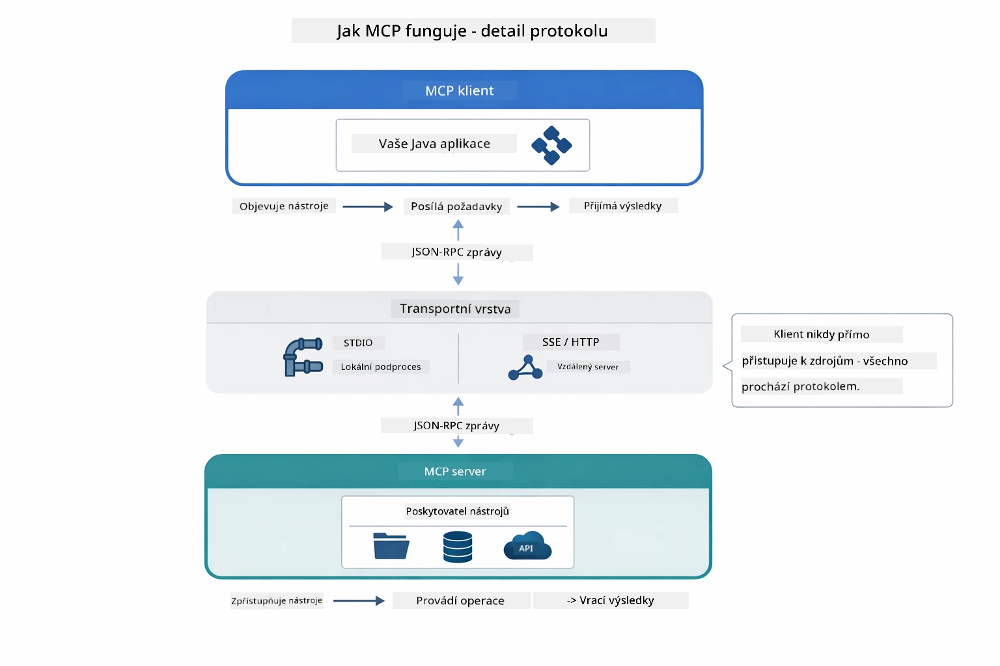

*Jak MCP funguje pod kapotou — klienti objevují nástroje, vyměňují si JSON-RPC zprávy a vykonávají operace přes transportní vrstvu.*

**Architektura server-klient**

MCP používá model klient-server. Servery poskytují nástroje – čtení souborů, dotazování databází, volání API. Klienti (vaše AI aplikace) se připojují k serverům a používají jejich nástroje.

Chcete-li MCP používat s LangChain4j, přidejte tuto Maven závislost:

```xml
<dependency>
    <groupId>dev.langchain4j</groupId>
    <artifactId>langchain4j-mcp</artifactId>
    <version>${langchain4j.version}</version>
</dependency>
```

**Objevování nástrojů**

Když se váš klient připojí k MCP serveru, ptá se "Jaké nástroje máte?" Server odpoví seznamem dostupných nástrojů, každý s popisy a schématy parametrů. Váš AI agent pak může rozhodnout, které nástroje použije na základě požadavků uživatele. Níže uvedený diagram ukazuje toto předávání — klient pošle požadavek `tools/list` a server vrátí své dostupné nástroje s popisy a schématy parametrů:

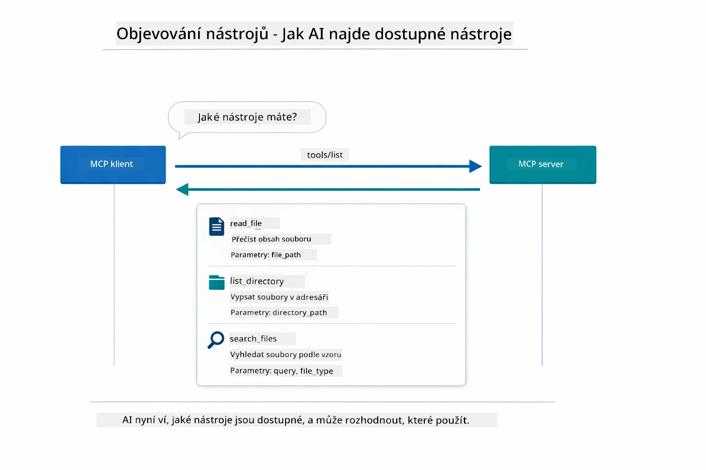

*AI objeví dostupné nástroje při spuštění — nyní zná dostupné schopnosti a může rozhodnout, které použije.*

**Transportní mechanismy**

MCP podporuje různé transportní mechanismy. Dvě možnosti jsou Stdio (pro místní komunikaci s podprocesy) a Streamable HTTP (pro vzdálené servery). Tento modul demonstruje transport Stdio:


*Transportní mechanismy MCP: HTTP pro vzdálené servery, Stdio pro lokální procesy*

**Stdio** - [StdioTransportDemo.java](../../../05-mcp/src/main/java/com/example/langchain4j/mcp/StdioTransportDemo.java)

Pro lokální procesy. Vaše aplikace spustí server jako podproces a komunikuje prostřednictvím standardního vstupu/výstupu. Vhodné pro přístup k souborovému systému nebo příkazovým nástrojům.

```java
McpTransport stdioTransport = new StdioMcpTransport.Builder()
    .command(List.of(
        npmCmd, "exec",
        "@modelcontextprotocol/server-filesystem@2025.12.18",
        resourcesDir
    ))
    .logEvents(false)
    .build();
```

Server `@modelcontextprotocol/server-filesystem` vystavuje následující nástroje, všechny sandboxované do adresářů, které určíte:

| Nástroj | Popis |
|-------|-------------|
| `read_file` | Čtení obsahu jednoho souboru |
| `read_multiple_files` | Čtení více souborů v jednom volání |
| `write_file` | Vytvoření nebo přepsání souboru |
| `edit_file` | Cílené nahrazení (find-and-replace) |
| `list_directory` | Výpis souborů a adresářů na cestě |
| `search_files` | Rekurzivní vyhledávání souborů odpovídajících vzoru |
| `get_file_info` | Získání metadat souboru (velikost, časové značky, oprávnění) |
| `create_directory` | Vytvoření adresáře (včetně rodičovských adresářů) |
| `move_file` | Přesun nebo přejmenování souboru či adresáře |

Následující diagram ukazuje, jak transport Stdio funguje za běhu — vaše Java aplikace spustí MCP server jako podproces a komunikují přes stdin/stdout potrubí, bez sítě nebo HTTP:

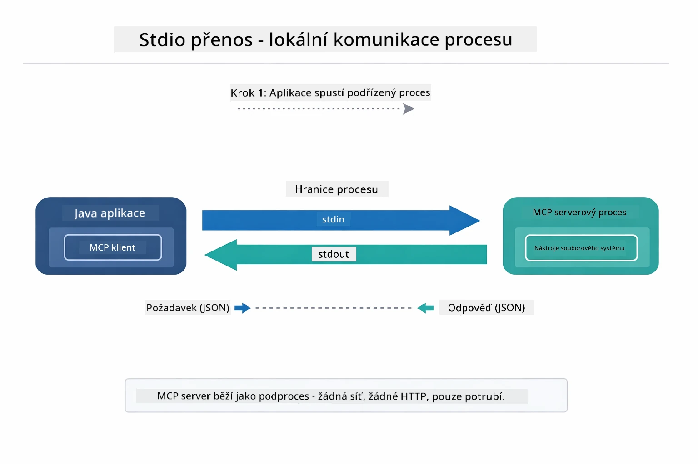

*Transport Stdio v akci — vaše aplikace spustí MCP server jako podproces a komunikuje přes stdin/stdout potrubí.*

> **🤖 Vyzkoušejte s [GitHub Copilot](https://github.com/features/copilot) Chat:** Otevřete [`StdioTransportDemo.java`](../../../05-mcp/src/main/java/com/example/langchain4j/mcp/StdioTransportDemo.java) a zeptejte se:
> - "Jak transport Stdio funguje a kdy jej použít oproti HTTP?"
> - "Jak LangChain4j spravuje životní cyklus spuštěných procesů MCP serveru?"
> - "Jaké jsou bezpečnostní dopady při poskytování AI přístupu k souborovému systému?"

## Agentní modul

Zatímco MCP poskytuje standardizované nástroje, agentní modul LangChain4j nabízí deklarativní způsob, jak sestavit agenty, kteří tyto nástroje orchestrují. Anotace `@Agent` a třída `AgenticServices` umožňují definovat chování agenta přes rozhraní místo imperativního kódu.

V tomto modulu prozkoumáte vzor **Supervisor Agent** — pokročilý agentní přístup AI, kde „supervizor“ agent dynamicky rozhoduje, které pod-agenty vyvolat na základě požadavků uživatele. Kombinujeme oba koncepty tím, že jednomu z našich pod-agentů dáme schopnosti přístupu k souborům poháněné MCP.

Chcete-li používat agentní modul, přidejte tuto Maven závislost:

```xml
<dependency>
    <groupId>dev.langchain4j</groupId>
    <artifactId>langchain4j-agentic</artifactId>
    <version>${langchain4j.mcp.version}</version>
</dependency>
```
> **Poznámka:** Modul `langchain4j-agentic` používá samostatnou verzi (`langchain4j.mcp.version`), protože je vydáván nezávisle na jádru LangChain4j knihoven.

> **⚠️ Experimentální:** Modul `langchain4j-agentic` je **experimentální** a může se změnit. Stabilním způsobem, jak vytvářet AI asistenty, zůstává `langchain4j-core` s vlastními nástroji (Modul 04).

## Spuštění příkladů

### Požadavky

- Dokončený [Modul 04 - Nástroje](../04-tools/README.md) (tento modul navazuje na koncepty vlastních nástrojů a porovnává je s MCP nástroji)
- Soubor `.env` v kořenovém adresáři s Azure údaji (vytvořený příkazem `azd up` v Modulu 01)
- Java 21+, Maven 3.9+
- Node.js 16+ a npm (pro MCP servery)

> **Poznámka:** Pokud jste ještě nenastavili své environmentální proměnné, podívejte se na [Modul 01 - Úvod](../01-introduction/README.md) pro pokyny k nasazení (`azd up` soubor `.env` vytvoří automaticky), nebo zkopírujte `.env.example` do `.env` v kořenovém adresáři a vyplňte své hodnoty.

## Rychlý start

**Použití VS Code:** Jednoduše klikněte pravým tlačítkem na libovolný demo soubor v Průzkumníku a vyberte **„Run Java“**, nebo použijte launch konfigurace z panelu Spustit a ladit (předtím se ujistěte, že váš `.env` soubor je nastaven s Azure údaji).

**Použití Maven:** Alternativně můžete spustit z příkazového řádku pomocí následujících příkladů.

### Operace se soubory (Stdio)

Ukazuje nástroje založené na lokálních podprocesech.

**✅ Není potřeba žádných předpokladů** – MCP server se spustí automaticky.

**Použití startovacích skriptů (doporučeno):**

Startovací skripty automaticky načtou proměnné prostředí z kořenového `.env` souboru:

**Bash:**
```bash
cd 05-mcp
chmod +x start-stdio.sh
./start-stdio.sh
```

**PowerShell:**
```powershell
cd 05-mcp
.\start-stdio.ps1
```

**Použití VS Code:** Klikněte pravým tlačítkem na `StdioTransportDemo.java` a vyberte **„Run Java“** (ujistěte se, že váš `.env` soubor je nastaven).

Aplikace automaticky spustí MCP server pro souborový systém a načte lokální soubor. Všimněte si, jak je správa podprocesu za vás ošetřena.

**Očekávaný výstup:**
```
Assistant response: The file provides an overview of LangChain4j, an open-source Java library
for integrating Large Language Models (LLMs) into Java applications...
```

### Supervizor Agent

Vzor **Supervisor Agent** je **flexibilní** forma agentní AI. Supervizor používá LLM, aby autonomně rozhodl, které agenty vyvolat na základě požadavku uživatele. V dalším příkladu kombinujeme přístup k souborům poháněný MCP s LLM agentem, čímž vytváříme workflow pro čtení souboru → zprávu s dohledem.

V demo `FileAgent` čte soubor pomocí MCP nástrojů souborového systému a `ReportAgent` generuje strukturovanou zprávu s výkonným shrnutím (1 věta), 3 klíčovými body a doporučeními. Supervizor tento tok automaticky koordinuje:

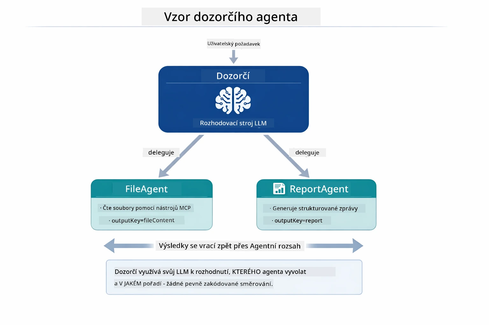

*Supervizor používá svůj LLM, aby rozhodl, které agenty a v jakém pořadí vyvolat — bez nutnosti pevného routování.*

Takto vypadá konkrétní workflow našeho pipeline od souboru ke zprávě:

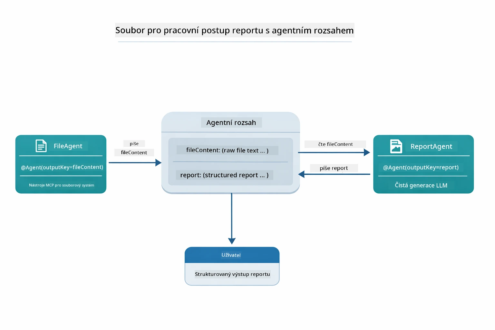

*FileAgent čte soubor přes MCP nástroje, poté ReportAgent transformuje surový obsah do strukturované zprávy.*

Následující sekvenční diagram sleduje celou orchestrace Supervizora — od spuštění MCP serveru, přes autonomní výběr agentů Supervizorem, až po volání nástrojů přes stdio a výslednou zprávu:

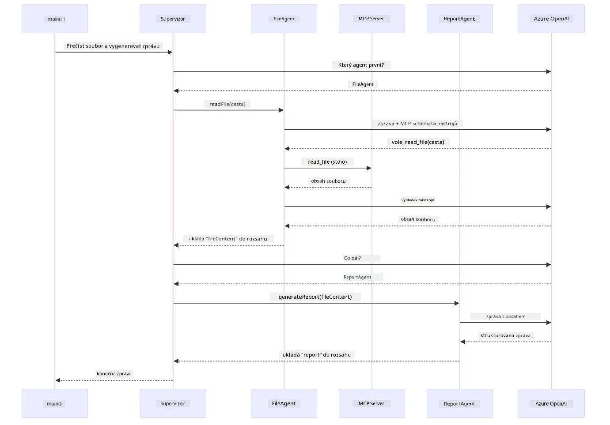

*Supervizor autonomně vyvolává FileAgent (který volá MCP server přes stdio pro čtení souboru), pak vyvolává ReportAgent k vytvoření strukturované zprávy — každý agent ukládá svůj výstup do sdíleného Agentního prostoru.*

Každý agent ukládá svůj výstup do **Agentního prostoru** (sdílené paměti), což umožňuje dalším agentům přístup k předchozím výsledkům. To demonstruje, jak se MCP nástroje hladce integrují do agentních workflow — Supervizor nemusí vědět *jak* se soubory čtou, jen že to umí `FileAgent`.

#### Spuštění ukázky

Startovací skripty automaticky načtou proměnné prostředí z kořenového `.env` souboru:

**Bash:**
```bash
cd 05-mcp
chmod +x start-supervisor.sh
./start-supervisor.sh
```

**PowerShell:**
```powershell
cd 05-mcp
.\start-supervisor.ps1
```

**Použití VS Code:** Klikněte pravým tlačítkem na `SupervisorAgentDemo.java` a vyberte **„Run Java“** (ujistěte se, že váš `.env` soubor je nastaven).

#### Jak supervizor funguje

Před vytvořením agentů je třeba připojit MCP transport ke klientovi a zabalit ho jako `ToolProvider`. Takto se nástroje MCP serveru zpřístupní vašim agentům:

```java
// Vytvořte MCP klienta z transportu
McpClient mcpClient = new DefaultMcpClient.Builder()
        .transport(stdioTransport)
        .build();

// Zabalte klienta jako ToolProvider — to propojuje nástroje MCP do LangChain4j
ToolProvider mcpToolProvider = McpToolProvider.builder()
        .mcpClients(List.of(mcpClient))
        .build();
```

Nyní můžete `mcpToolProvider` injektovat do jakéhokoli agenta, který potřebuje MCP nástroje:

```java
// Krok 1: FileAgent čte soubory pomocí nástrojů MCP
FileAgent fileAgent = AgenticServices.agentBuilder(FileAgent.class)
        .chatModel(model)
        .toolProvider(mcpToolProvider)  // Disponuje nástroji MCP pro operace se soubory
        .build();

// Krok 2: ReportAgent generuje strukturované zprávy
ReportAgent reportAgent = AgenticServices.agentBuilder(ReportAgent.class)
        .chatModel(model)
        .build();

// Supervisor koordinuje pracovní postup soubor → zpráva
SupervisorAgent supervisor = AgenticServices.supervisorBuilder()
        .chatModel(model)
        .subAgents(fileAgent, reportAgent)
        .responseStrategy(SupervisorResponseStrategy.LAST)  // Vrátit finální zprávu
        .build();

// Supervisor rozhoduje, které agenty vyvolat na základě požadavku
String response = supervisor.invoke("Read the file at /path/file.txt and generate a report");
```

#### Jak FileAgent za běhu objevuje MCP nástroje

Možná vás zajímá: **jak `FileAgent` ví, jak používat npm souborové MCP nástroje?** Odpověď je, že to neví — **LLM** to zjišťuje za běhu pomocí schémat nástrojů.

Rozhraní `FileAgent` je jen **definice promptu**. Nemá žádné pevné znalosti o `read_file`, `list_directory` nebo jiném MCP nástroji. Takto to probíhá od začátku do konce:
1. **Spuštění serveru:** `StdioMcpTransport` spouští npm balíček `@modelcontextprotocol/server-filesystem` jako podřízený proces  
2. **Objevování nástrojů:** `McpClient` posílá serveru JSON-RPC požadavek `tools/list`, který odpoví názvy nástrojů, popisy a schématy parametrů (např. `read_file` — *"Přečíst celý obsah souboru"* — `{ path: string }`)  
3. **Vložení schémat:** `McpToolProvider` obalí tato objevená schémata a zpřístupní je LangChain4j  
4. **Rozhodování LLM:** Při volání `FileAgent.readFile(path)` LangChain4j odešle systémovou zprávu, zprávu uživatele **a seznam schémat nástrojů** LLM. LLM přečte popisy nástrojů a vytvoří volání nástroje (např. `read_file(path="/some/file.txt")`)  
5. **Provedení:** LangChain4j zachytí volání nástroje, přesměruje jej zpět skrze MCP klienta do Node.js podprocesu, získá výsledek a předá jej zpět LLM  

Toto je stejný mechanismus [Objevování nástrojů](../../../05-mcp) popsaný výše, ale aplikovaný konkrétně na agentní pracovní tok. Anotace `@SystemMessage` a `@UserMessage` řídí chování LLM, zatímco vložený `ToolProvider` mu dává **schopnosti** — LLM tyto dvě věci propojí za běhu.  

> **🤖 Vyzkoušejte s [GitHub Copilot](https://github.com/features/copilot) Chat:** Otevřete [`FileAgent.java`](../../../05-mcp/src/main/java/com/example/langchain4j/mcp/agents/FileAgent.java) a zeptejte se:  
> - "Jak tento agent ví, který MCP nástroj zavolat?"  
> - "Co by se stalo, kdybych odstranil ToolProvider z agent builderu?"  
> - "Jak se schémata nástrojů předávají LLM?"  

#### Strategie odpovědí  

Když konfigurujete `SupervisorAgent`, určujete, jak má formulovat svou konečnou odpověď uživateli po dokončení úkolů pod-agentů. Níže uvedený diagram ukazuje tři dostupné strategie — LAST vrátí výstup posledního agenta přímo, SUMMARY shrne všechny výstupy pomocí LLM a SCORED vybere ten, který získá vyšší skóre oproti původnímu požadavku:  

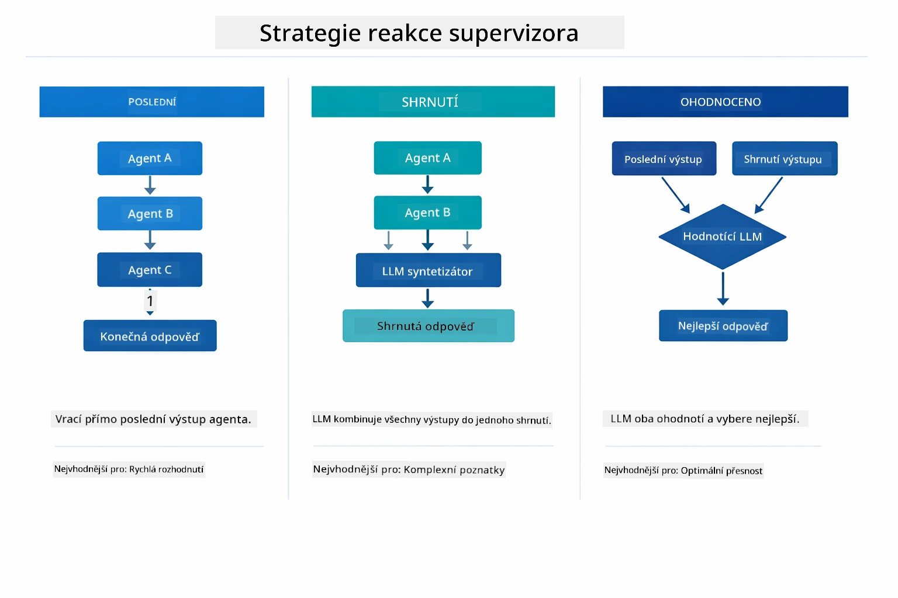  

*Tři strategie, jak Supervisor formuluje konečnou odpověď — zvolte podle toho, zda chcete výstup posledního agenta, syntetizované shrnutí nebo nejlepší skórovanou možnost.*  

Dostupné strategie jsou:  

| Strategie | Popis |  
|----------|-------------|  
| **LAST** | Supervisor vrátí výstup posledního pod-agenta nebo zavolaného nástroje. To je užitečné, když je poslední agent ve workflow speciálně navržen k vytvoření kompletní konečné odpovědi (např. "Summary Agent" v badatelském procesu). |  
| **SUMMARY** | Supervisor použije svůj interní jazykový model (LLM) pro syntézu shrnutí celé interakce a všech výstupů pod-agentů a toto shrnutí vrátí jako konečnou odpověď. Poskytuje čistou, agregovanou odpověď uživateli. |  
| **SCORED** | Systém použije interní LLM k ohodnocení obou odpovědí — poslední (LAST) a shrnutí (SUMMARY) — vůči původnímu uživatelskému požadavku a vrátí tu, která získá vyšší skóre. |  

Viz [SupervisorAgentDemo.java](../../../05-mcp/src/main/java/com/example/langchain4j/mcp/SupervisorAgentDemo.java) pro kompletní implementaci.  

> **🤖 Vyzkoušejte s [GitHub Copilot](https://github.com/features/copilot) Chat:** Otevřete [`SupervisorAgentDemo.java`](../../../05-mcp/src/main/java/com/example/langchain4j/mcp/SupervisorAgentDemo.java) a zeptejte se:  
> - "Jak Supervisor rozhoduje, které agenty zavolat?"  
> - "Jaký je rozdíl mezi vzory Supervisor a Sequential workflow?"  
> - "Jak mohu přizpůsobit plánování Supervisora?"  

#### Porozumění výstupu  

Když spustíte demo, uvidíte strukturovaný průvodce tím, jak Supervisor orchestruje více agentů. Co každý blok znamená:  

```
======================================================================
  FILE → REPORT WORKFLOW DEMO
======================================================================

This demo shows a clear 2-step workflow: read a file, then generate a report.
The Supervisor orchestrates the agents automatically based on the request.
```
  
**Hlavička** uvádí koncept workflow: zaměřený proces od čtení souboru po generování reportu.  

```
--- WORKFLOW ---------------------------------------------------------
  ┌─────────────┐      ┌──────────────┐
  │  FileAgent  │ ───▶ │ ReportAgent  │
  │ (MCP tools) │      │  (pure LLM)  │
  └─────────────┘      └──────────────┘
   outputKey:           outputKey:
   'fileContent'        'report'

--- AVAILABLE AGENTS -------------------------------------------------
  [FILE]   FileAgent   - Reads files via MCP → stores in 'fileContent'
  [REPORT] ReportAgent - Generates structured report → stores in 'report'
```
  
**Diagram workflow** ukazuje tok dat mezi agenty. Každý agent má jasnou roli:  
- **FileAgent** čte soubory pomocí MCP nástrojů a ukládá surový obsah do `fileContent`  
- **ReportAgent** tento obsah spotřebuje a vytvoří strukturovaný report v `report`  

```
--- USER REQUEST -----------------------------------------------------
  "Read the file at .../file.txt and generate a report on its contents"
```
  
**Požadavek uživatele** ukazuje úkol. Supervisor jej analyzuje a rozhodne se zavolat FileAgent → ReportAgent.  

```
--- SUPERVISOR ORCHESTRATION -----------------------------------------
  The Supervisor decides which agents to invoke and passes data between them...

  +-- STEP 1: Supervisor chose -> FileAgent (reading file via MCP)
  |
  |   Input: .../file.txt
  |
  |   Result: LangChain4j is an open-source, provider-agnostic Java framework for building LLM...
  +-- [OK] FileAgent (reading file via MCP) completed

  +-- STEP 2: Supervisor chose -> ReportAgent (generating structured report)
  |
  |   Input: LangChain4j is an open-source, provider-agnostic Java framew...
  |
  |   Result: Executive Summary...
  +-- [OK] ReportAgent (generating structured report) completed
```
  
**Orchestrace Supervisora** ukazuje dvoukrokový proces v akci:  
1. **FileAgent** načte soubor přes MCP a uloží obsah  
2. **ReportAgent** obdrží obsah a vygeneruje strukturovaný report  

Supervisor tato rozhodnutí učinil **autonomně** na základě požadavku uživatele.  

```
--- FINAL RESPONSE ---------------------------------------------------
Executive Summary
...

Key Points
...

Recommendations
...

--- AGENTIC SCOPE (Data Flow) ----------------------------------------
  Each agent stores its output for downstream agents to consume:
  * fileContent: LangChain4j is an open-source, provider-agnostic Java framework...
  * report: Executive Summary...
```
  
#### Vysvětlení funkcí agentního modulu  

Příklad demonstruje několik pokročilých funkcí agentního modulu. Podívejme se blíže na Agentic Scope a Agent Listeners.  

**Agentic Scope** ukazuje sdílenou paměť, kde agenti uložili své výsledky pomocí `@Agent(outputKey="...")`. To umožňuje:  
- Pozdějším agentům přistupovat k výstupům agentů dříve  
- Supervisorovi syntetizovat konečnou odpověď  
- Vám prohlédnout si, co každý agent vytvořil  

Níže uvedený diagram ukazuje, jak Agentic Scope funguje jako sdílená paměť ve workflow od souboru k reportu — FileAgent píše svůj výstup pod klíč `fileContent`, ReportAgent jej čte a píše pod klíč `report`:  

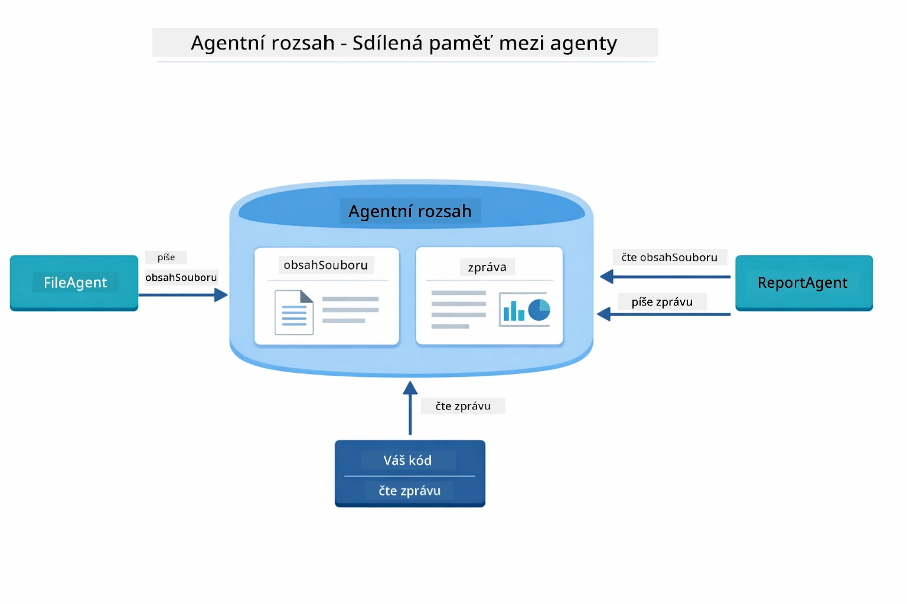  

*Agentic Scope slouží jako sdílená paměť — FileAgent zapisuje `fileContent`, ReportAgent to čte a zapisuje `report` a váš kód pak čte finální výsledek.*  

```java
ResultWithAgenticScope<String> result = supervisor.invokeWithAgenticScope(request);
AgenticScope scope = result.agenticScope();
String fileContent = scope.readState("fileContent");  // Surová data souboru z FileAgent
String report = scope.readState("report");            // Strukturovaná zpráva z ReportAgent
```
  
**Agent Listeners** umožňují sledování a ladění během provádění agentů. Výstup krok za krokem z dema pochází z AgentListeneru, který je připojen ke každému volání agenta:  
- **beforeAgentInvocation** – Volá se před vybraním agenta Supervisorom, ukazuje, který agent byl zvolen a proč  
- **afterAgentInvocation** – Volá se po dokončení agenta, zobrazuje jeho výsledek  
- **inheritedBySubagents** – Když je `true`, posluchač sleduje všechny agenty v hierarchii  

Následující diagram ukazuje celý životní cyklus Agent Listeneru, včetně toho, jak `onError` řeší chyby během provádění agenta:  

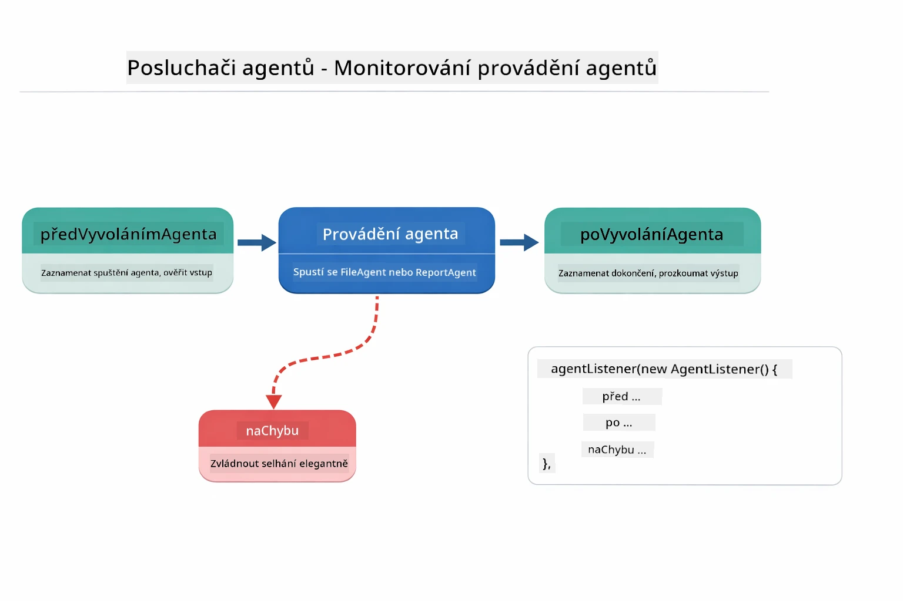  

*Agent Listeners se připojují k životnímu cyklu provádění — sledují start, dokončení nebo chyby agentů.*  

```java
AgentListener monitor = new AgentListener() {
    private int step = 0;
    
    @Override
    public void beforeAgentInvocation(AgentRequest request) {
        step++;
        System.out.println("  +-- STEP " + step + ": " + request.agentName());
    }
    
    @Override
    public void afterAgentInvocation(AgentResponse response) {
        System.out.println("  +-- [OK] " + response.agentName() + " completed");
    }
    
    @Override
    public boolean inheritedBySubagents() {
        return true; // Propagovat na všechny pod-agenty
    }
};
```
  
Kromě vzoru Supervisor poskytuje modul `langchain4j-agentic` několik výkonných vzorů workflow. Níže uvedený diagram ukazuje všech pět — od jednoduchých sekvenčních pipeline až po workflow s lidským schvalováním:  

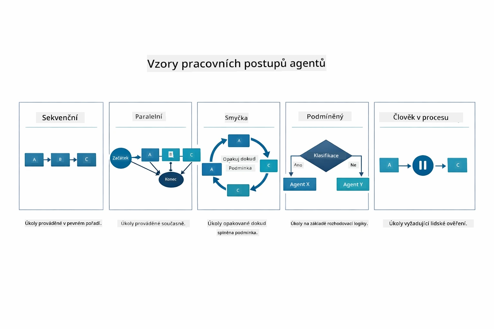  

*Pět vzorů workflow pro orchestraci agentů — od jednoduchých sekvenčních pipeline až po workflow s lidským schvalováním.*  

| Vzor | Popis | Použití |  
|---------|-------------|----------|  
| **Sekvenční** | Spustí agenty postupně, výstup jde do dalšího | Pipeline: výzkum → analýza → report |  
| **Paralelní** | Spustí agenty současně | Nezávislé úkoly: počasí + zprávy + akcie |  
| **Cyklus (loop)** | Iteruje, dokud není splněna podmínka | Hodnocení kvality: zpřesňuj dokud skóre ≥ 0,8 |  
| **Podmíněný** | Směruje podle podmínek | Klasifikuj → přesměruj k specialistovi |  
| **Člověk v procesu** | Přidává lidské kontroly | Schvalovací workflow, revize obsahu |  

## Klíčové pojmy  

Nyní, když jste prozkoumali MCP a agentní modul v praxi, shrňme, kdy použít který přístup.  

Jednou z největších výhod MCP je rostoucí ekosystém. Diagram níže ukazuje, jak jeden univerzální protokol spojuje vaši AI aplikaci s rozmanitými MCP servery — od přístupu k souborovému systému a databázím, přes GitHub, e-mail, web scraping a další:  

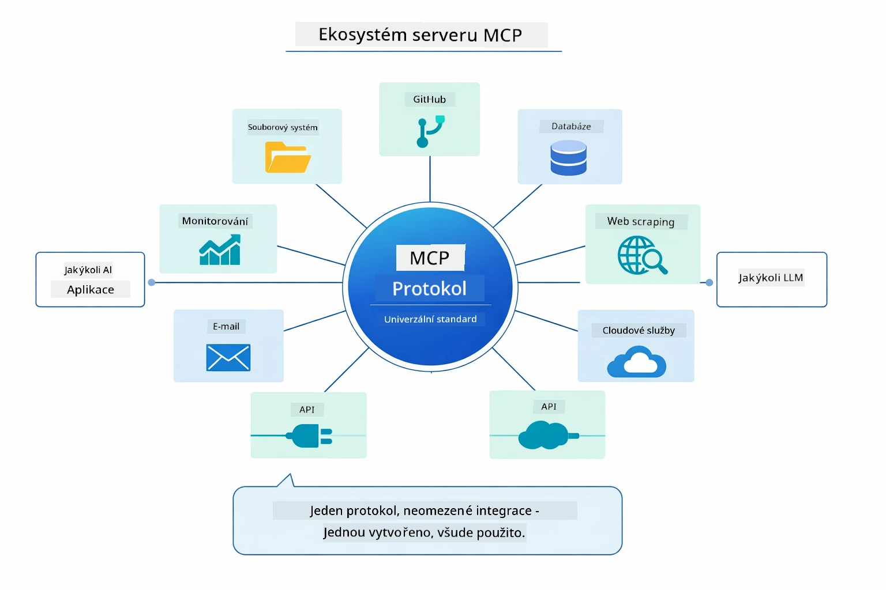  

*MCP vytváří ekosystém univerzálního protokolu — jakýkoli MCP-kompatibilní server funguje s jakýmkoli MCP-kompatibilním klientem, umožňuje sdílení nástrojů mezi aplikacemi.*  

**MCP** je ideální, když chcete využívat existující ekosystémy nástrojů, vytvářet nástroje, které může sdílet více aplikací, integrovat služby třetích stran s využitím standardních protokolů nebo vyměňovat implementace nástrojů bez změny kódu.  

**Agentní modul** funguje nejlépe tam, kde chcete deklarativní definice agentů s anotacemi `@Agent`, potřebujete orchestraci workflow (sekvenční, cykly, paralelní), preferujete návrh agentů založený na rozhraní před imperativním kódem nebo kombinujete mnoho agentů, kteří sdílejí výstupy pomocí `outputKey`.  

**Vzor Supervisor Agent** vyniká, když workflow není předvídatelný dopředu a chcete, aby rozhodovala LLM, když máte více specializovaných agentů vyžadujících dynamickou orchestraci, při budování konverzačních systémů, které směrují na různé schopnosti, nebo když chcete nejflexibilnější a adaptivní chování agentů.  

Pro usnadnění rozhodnutí mezi vlastními metodami `@Tool` z Modulu 04 a MCP nástroji z tohoto modulu uvádíme následující srovnání — vlastní nástroje nabízí úzké propojení a plnou typovou bezpečnost pro aplikační logiku, MCP nástroje poskytují standardizované, znovupoužitelné integrace:  

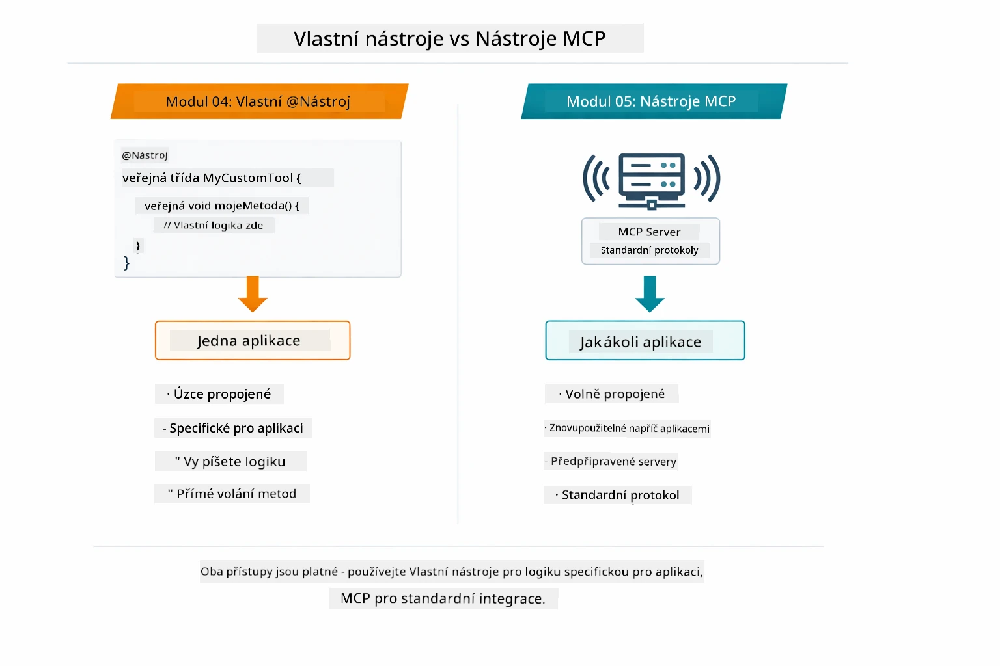  

*Kdy použít vlastní metody @Tool vs MCP nástroje — vlastní nástroje pro aplikační logiku s plnou typovou bezpečností, MCP nástroje pro standardizované integrace fungující přes aplikace.*  

## Gratulujeme!  

Prošli jste všemi pěti moduly kurzu LangChain4j pro začátečníky! Zde je pohled na celou vaši učební cestu — od základního chatu až po agentní systémy poháněné MCP:  

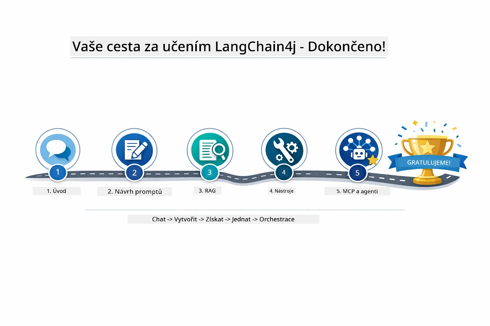  

*Vaše učební cesta přes všech pět modulů — od základního chatu po agentní systémy s MCP.*  

Kurz LangChain4j pro začátečníky jste dokončili a naučili jste se:  

- Jak vytvářet konverzační AI s pamětí (Modul 01)  
- Vzory promtování pro různé úkoly (Modul 02)  
- Založení odpovědí na dokumentech pomocí RAG (Modul 03)  
- Tvorbu základních AI agentů (asistentů) s vlastními nástroji (Modul 04)  
- Integraci standardizovaných nástrojů s moduly LangChain4j MCP a Agentic (Modul 05)  

### Co dál?  

Po dokončení modulů prozkoumejte [Testing Guide](../docs/TESTING.md), kde uvidíte koncepty testování LangChain4j v praxi.  

**Oficiální zdroje:**  
- [Dokumentace LangChain4j](https://docs.langchain4j.dev/) – Podrobné návody a reference API  
- [LangChain4j GitHub](https://github.com/langchain4j/langchain4j) – Zdrojový kód a příklady  
- [Návody LangChain4j](https://docs.langchain4j.dev/tutorials/) – Krok za krokem návody pro různé případy použití  

Děkujeme, že jste dokončili tento kurz!  

---  

**Navigace:** [← Předchozí: Modul 04 - Nástroje](../04-tools/README.md) | [Zpět na začátek](../README.md)

---

<!-- CO-OP TRANSLATOR DISCLAIMER START -->
**Upozornění**:  
Tento dokument byl přeložen pomocí AI překladatelské služby [Co-op Translator](https://github.com/Azure/co-op-translator). Přestože usilujeme o přesnost, mějte prosím na paměti, že automatické překlady mohou obsahovat chyby nebo nepřesnosti. Původní dokument v jeho mateřském jazyce by měl být považován za autoritativní zdroj. Pro kritické informace se doporučuje profesionální lidský překlad. Nejsme odpovědni za jakékoliv nedorozumění nebo nesprávné výklady vyplývající z použití tohoto překladu.
<!-- CO-OP TRANSLATOR DISCLAIMER END -->