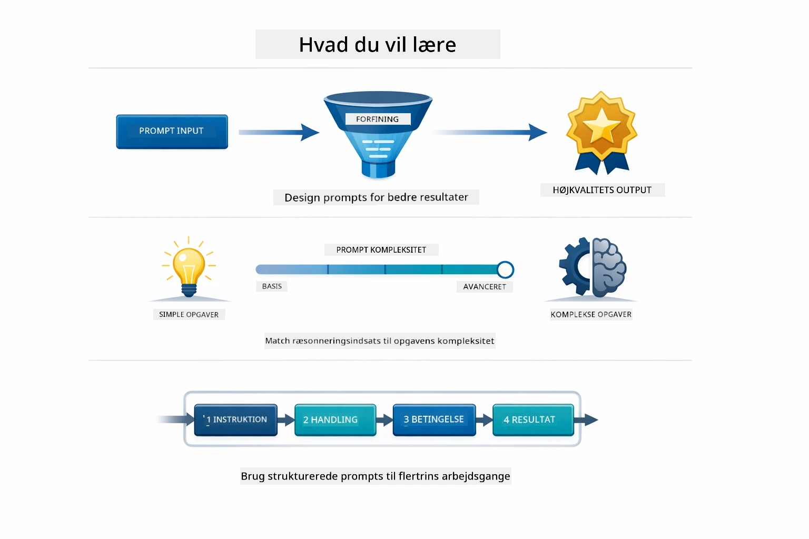
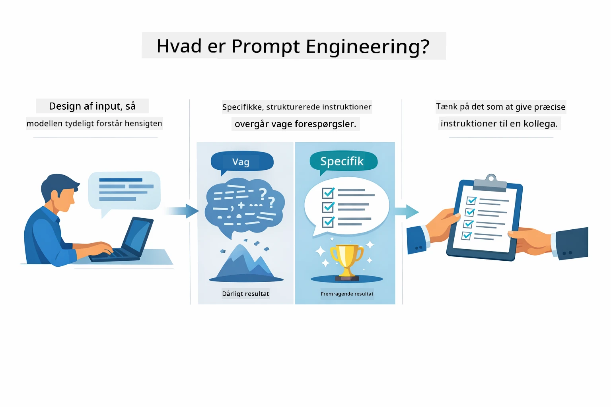
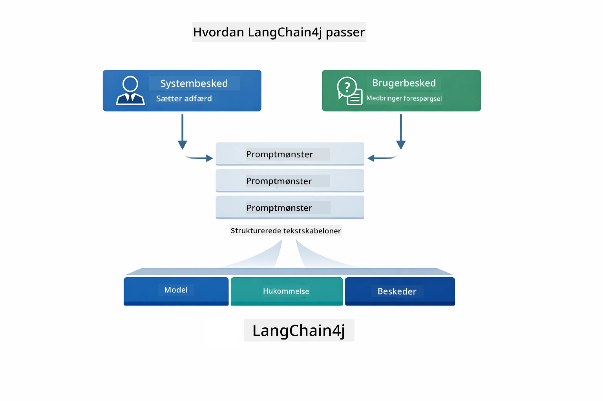
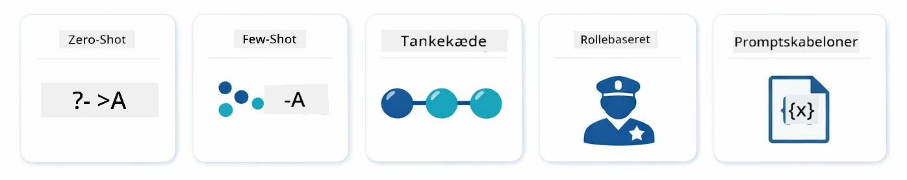
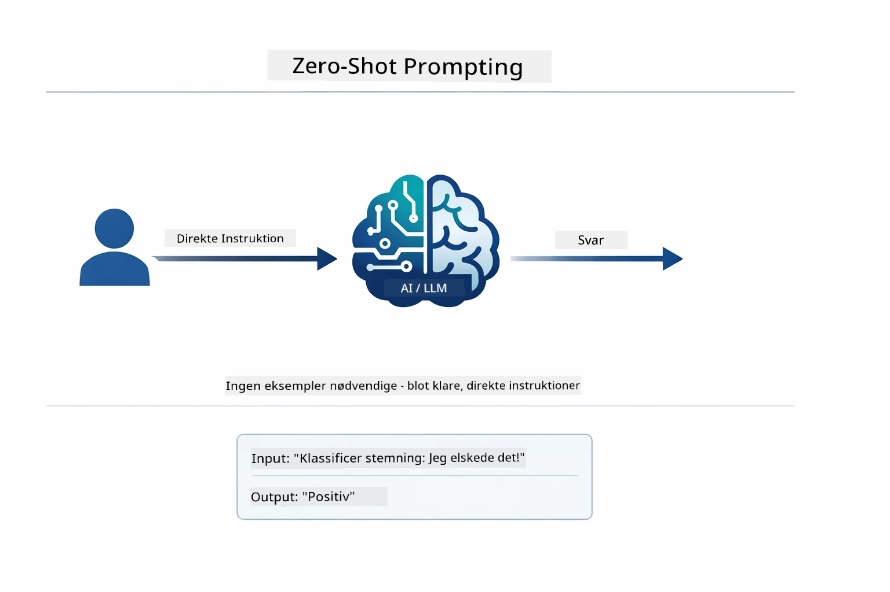
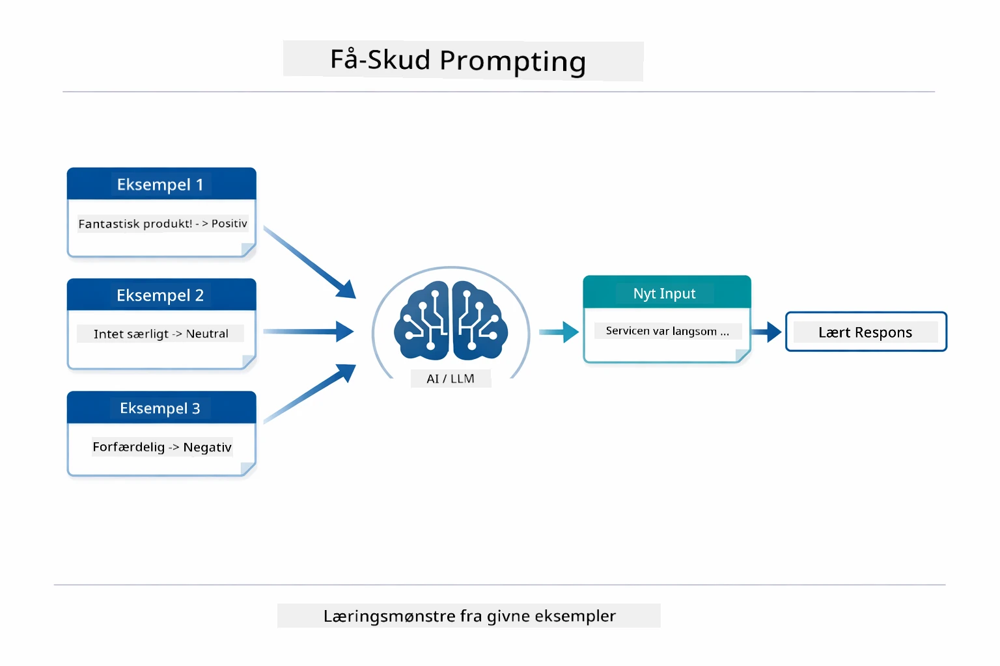
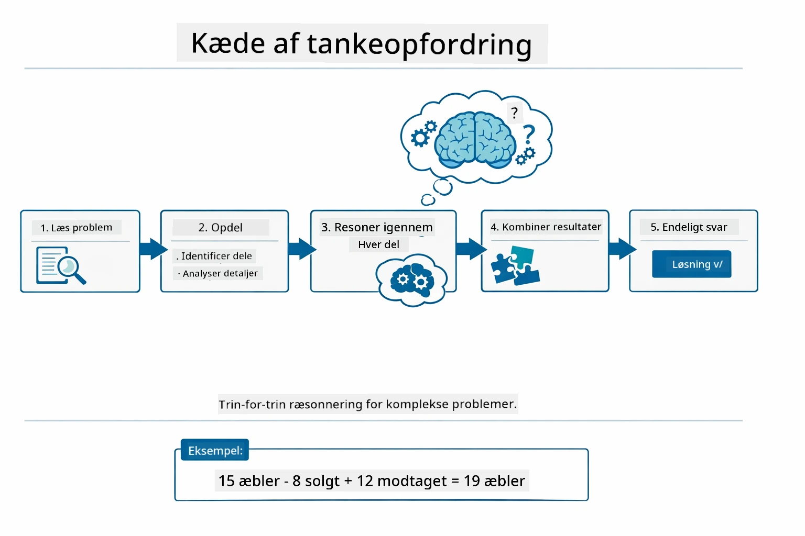
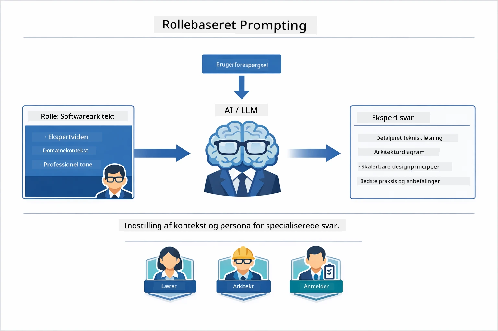
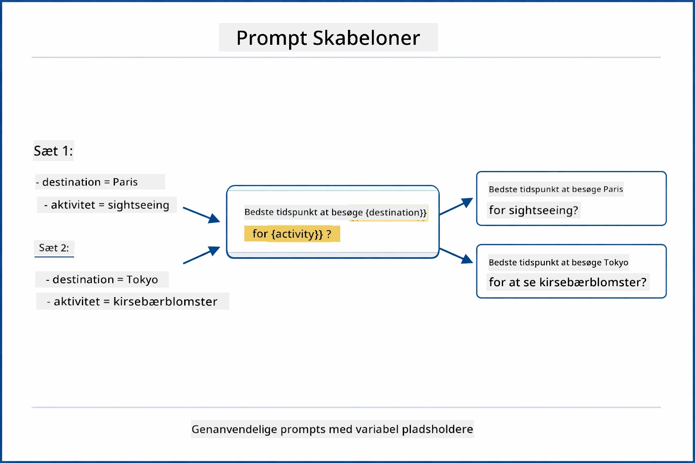
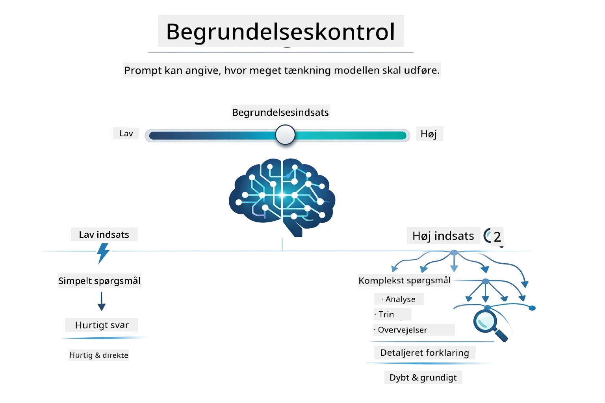

# Modul 02: Prompt Engineering med GPT-5.2

## Indholdsfortegnelse

- [Hvad Du Vil Lære](../../../02-prompt-engineering)
- [Forudsætninger](../../../02-prompt-engineering)
- [Forståelse af Prompt Engineering](../../../02-prompt-engineering)
- [Grundlæggende om Prompt Engineering](../../../02-prompt-engineering)
  - [Zero-Shot Prompting](../../../02-prompt-engineering)
  - [Few-Shot Prompting](../../../02-prompt-engineering)
  - [Chain of Thought](../../../02-prompt-engineering)
  - [Role-Based Prompting](../../../02-prompt-engineering)
  - [Prompt Templates](../../../02-prompt-engineering)
- [Avancerede Mønstre](../../../02-prompt-engineering)
- [Brug af Eksisterende Azure-Ressourcer](../../../02-prompt-engineering)
- [Applikationsskærmbilleder](../../../02-prompt-engineering)
- [Udforskning af Mønstrene](../../../02-prompt-engineering)
  - [Lav vs Høj Iver](../../../02-prompt-engineering)
  - [Opgaveudførelse (Tool Preambles)](../../../02-prompt-engineering)
  - [Selvreflekterende Kode](../../../02-prompt-engineering)
  - [Struktureret Analyse](../../../02-prompt-engineering)
  - [Multi-Turn Chat](../../../02-prompt-engineering)
  - [Trin-for-Trin Resoneringsproces](../../../02-prompt-engineering)
  - [Begrænset Output](../../../02-prompt-engineering)
- [Hvad Du Virkelig Lærer](../../../02-prompt-engineering)
- [Næste Skridt](../../../02-prompt-engineering)

## Hvad Du Vil Lære



I det forrige modul så du, hvordan hukommelse muliggør samtale-AI, og brugte GitHub Models til grundlæggende interaktioner. Nu fokuserer vi på, hvordan du stiller spørgsmål — selve promptene — ved brug af Azure OpenAIs GPT-5.2. Den måde, du strukturerer dine prompts på, påvirker dramatisk kvaliteten af de svar, du får. Vi starter med en gennemgang af de grundlæggende prompting-teknikker og bevæger os derefter videre til otte avancerede mønstre, der udnytter GPT-5.2's kapaciteter fuldt ud.

Vi bruger GPT-5.2, fordi den introducerer styring af resoneringsdybde – du kan fortælle modellen, hvor meget tænkning den skal lave før svar. Det gør forskellige prompting-strategier mere tydelige, og hjælper dig med at forstå, hvornår hver tilgang skal bruges. Vi får også fordel af Azures færre ratebegrænsninger for GPT-5.2 sammenlignet med GitHub Models.

## Forudsætninger

- Færdiggjort Modul 01 (Azure OpenAI-ressourcer implementeret)
- `.env` fil i rodmappen med Azure legitimationsoplysninger (oprettet af `azd up` i Modul 01)

> **Bemærk:** Hvis du ikke har færdiggjort Modul 01, følg venligst implementeringsinstruktionerne der først.

## Forståelse af Prompt Engineering



Prompt engineering handler om at designe input-tekst, der konsekvent giver dig de resultater, du har brug for. Det handler ikke kun om at stille spørgsmål - det handler om at strukturere forespørgsler, så modellen præcist forstår, hvad du vil, og hvordan det skal leveres.

Tænk på det som at give instruktioner til en kollega. "Ret fejlen" er vagt. "Ret null pointer exception i UserService.java linje 45 ved at tilføje en null-tjek" er specifikt. Sproglige modeller fungerer på samme måde - specificitet og struktur betyder noget.



LangChain4j giver infrastrukturen — modelforbindelser, hukommelse og beskedtyper — mens prompt-mønstre blot er omhyggeligt struktureret tekst, du sender gennem den infrastruktur. De vigtigste byggesten er `SystemMessage` (som sætter AI'ens adfærd og rolle) og `UserMessage` (som bærer din egentlige forespørgsel).

## Grundlæggende om Prompt Engineering



Inden vi dykker ned i de avancerede mønstre i dette modul, lad os gennemgå fem grundlæggende prompting-teknikker. Disse er byggesten, som enhver prompt-ingeniør bør kende. Hvis du allerede har arbejdet med [Quick Start-modulet](../00-quick-start/README.md#2-prompt-patterns), har du set disse i praksis — her er det konceptuelle rammeværk bag dem.

### Zero-Shot Prompting

Den simpleste tilgang: giv modellen en direkte instruktion uden eksempler. Modellen stoler udelukkende på sin træning for at forstå og udføre opgaven. Det fungerer godt til ligetil forespørgsler, hvor forventet adfærd er åbenlys.



*Direkte instruktion uden eksempler — modellen udleder opgaven alene fra instruktionen*

```java
String prompt = "Classify this sentiment: 'I absolutely loved the movie!'";
String response = model.chat(prompt);
// Svar: "Positiv"
```

**Hvornår at bruge:** Simple klassifikationer, direkte spørgsmål, oversættelser eller enhver opgave modellen kan håndtere uden yderligere vejledning.

### Few-Shot Prompting

Giv eksempler, der demonstrerer det mønster, du ønsker modellen skal følge. Modellen lærer det forventede input-output-format fra dine eksempler og anvender det på nye inputs. Dette forbedrer markant konsistensen for opgaver, hvor det ønskede format eller adfærd ikke er åbenlys.



*Indlæring fra eksempler — modellen identificerer mønstret og anvender det på nye inputs*

```java
String prompt = """
    Classify the sentiment as positive, negative, or neutral.
    
    Examples:
    Text: "This product exceeded my expectations!" → Positive
    Text: "It's okay, nothing special." → Neutral
    Text: "Waste of money, very disappointed." → Negative
    
    Now classify this:
    Text: "Best purchase I've made all year!"
    """;
String response = model.chat(prompt);
```

**Hvornår at bruge:** Brugerdefinerede klassifikationer, konsistent formatering, domænespecifikke opgaver eller når zero-shot resultater er inkonsistente.

### Chain of Thought

Bed modellen om at vise sin ræsonnering trin for trin. I stedet for at springe direkte til et svar, nedbryder modellen problemet og arbejder gennem hver del eksplicit. Dette forbedrer nøjagtigheden ved matematiske, logiske og flertrins resoneringsopgaver.



*Trin-for-trin ræsonnering — opdeling af komplekse problemer i eksplicitte logiske skridt*

```java
String prompt = """
    Problem: A store has 15 apples. They sell 8 apples and then 
    receive a shipment of 12 more apples. How many apples do they have now?
    
    Let's solve this step-by-step:
    """;
String response = model.chat(prompt);
// Modellen viser: 15 - 8 = 7, derefter 7 + 12 = 19 æbler
```

**Hvornår at bruge:** Matematikopgaver, logiske gåder, debugging eller enhver opgave, hvor visning af ræsonneringsproces øger nøjagtighed og tillid.

### Role-Based Prompting

Sæt en persona eller rolle for AI'en før du stiller dit spørgsmål. Dette giver kontekst, der former tonen, dybden og fokus for svaret. En "softwarearkitekt" giver anderledes rådgivning end en "juniorudvikler" eller en "sikkerhedsrevisor".



*Sæt kontekst og persona — det samme spørgsmål får et andet svar afhængigt af den tildelte rolle*

```java
String prompt = """
    You are an experienced software architect reviewing code.
    Provide a brief code review for this function:
    
    def calculate_total(items):
        total = 0
        for item in items:
            total = total + item['price']
        return total
    """;
String response = model.chat(prompt);
```

**Hvornår at bruge:** Kodegennemgange, vejledning, domænespecifik analyse, eller når du har brug for svar tilpasset et bestemt ekspertiseniveau eller perspektiv.

### Prompt Templates

Lav genanvendelige prompts med variable pladsholdere. I stedet for at skrive en ny prompt hver gang, definerer du en template én gang og indsætter forskellige værdier. LangChain4j's `PromptTemplate` klasse gør dette let med `{{variable}}`-syntaks.



*Genanvendelige prompts med variable pladsholdere — en template, mange anvendelser*

```java
PromptTemplate template = PromptTemplate.from(
    "What's the best time to visit {{destination}} for {{activity}}?"
);

Prompt prompt = template.apply(Map.of(
    "destination", "Paris",
    "activity", "sightseeing"
));

String response = model.chat(prompt.text());
```

**Hvornår at bruge:** Gentagne forespørgsler med forskellige input, batch-behandling, opbygning af genanvendelige AI-arbejdsgange, eller enhver situation hvor prompt-strukturen forbliver den samme, men data varierer.

---

Disse fem grundlæggende teknikker giver dig et solidt værktøjssæt til de fleste prompting-opgaver. Resten af dette modul bygger videre på dem med **otte avancerede mønstre**, der udnytter GPT-5.2's ræsonneringskontrol, selv-evaluering, og strukturerede output kapaciteter.

## Avancerede Mønstre

Med det grundlæggende på plads, lad os gå til de otte avancerede mønstre, der gør dette modul unikt. Ikke alle problemer behøver samme tilgang. Nogle spørgsmål kræver hurtige svar, andre kræver dyb tænkning. Nogle behøver synlig ræsonnering, andre kun resultater. Hvert mønster herunder er optimeret til et andet scenarie — og GPT-5.2's ræsonneringskontrol gør forskellene endnu mere markante.


*Oversigt over de otte prompt engineering mønstre og deres anvendelsestilfælde*



*GPT-5.2's ræsonneringskontrol lader dig angive, hvor meget tænkning modellen skal lave — fra hurtige direkte svar til dyb udforskning*

**Lav Iver (Hurtigt & Fokuseret)** - Til simple spørgsmål, hvor du ønsker hurtige, direkte svar. Modellen laver minimal ræsonnering - maksimalt 2 trin. Brug dette til beregninger, opslag eller ligefremme spørgsmål.

```java
String prompt = """
    <context_gathering>
    - Search depth: very low
    - Bias strongly towards providing a correct answer as quickly as possible
    - Usually, this means an absolute maximum of 2 reasoning steps
    - If you think you need more time, state what you know and what's uncertain
    </context_gathering>
    
    Problem: What is 15% of 200?
    
    Provide your answer:
    """;

String response = chatModel.chat(prompt);
```

> 💡 **Udforsk med GitHub Copilot:** Åbn [`Gpt5PromptService.java`](../../../02-prompt-engineering/src/main/java/com/example/langchain4j/prompts/service/Gpt5PromptService.java) og spørg:
> - "Hvad er forskellen på lav iver og høj iver i promptingmønstre?"
> - "Hvordan hjælper XML-tags i prompts med at strukturere AI's svar?"
> - "Hvornår skal jeg bruge selvrefleksionsmønstre vs direkte instruktioner?"

**Høj Iver (Dyb & Grundig)** - Til komplekse problemer, hvor du ønsker omfattende analyse. Modellen udforsker grundigt og viser detaljeret ræsonnering. Brug dette til systemdesign, arkitekturvalg eller kompleks forskning.

```java
String prompt = """
    Analyze this problem thoroughly and provide a comprehensive solution.
    Consider multiple approaches, trade-offs, and important details.
    Show your analysis and reasoning in your response.
    
    Problem: Design a caching strategy for a high-traffic REST API.
    """;

String response = chatModel.chat(prompt);
```

**Opgaveudførelse (Trin-for-Trin Fremgang)** - Til flertrins arbejdsgange. Modellen leverer en plan forfra, fortæller om hvert trin undervejs og giver så en opsummering. Brug dette til migreringer, implementeringer eller enhver flertrinsproces.

```java
String prompt = """
    <task_execution>
    1. First, briefly restate the user's goal in a friendly way
    
    2. Create a step-by-step plan:
       - List all steps needed
       - Identify potential challenges
       - Outline success criteria
    
    3. Execute each step:
       - Narrate what you're doing
       - Show progress clearly
       - Handle any issues that arise
    
    4. Summarize:
       - What was completed
       - Any important notes
       - Next steps if applicable
    </task_execution>
    
    <tool_preambles>
    - Always begin by rephrasing the user's goal clearly
    - Outline your plan before executing
    - Narrate each step as you go
    - Finish with a distinct summary
    </tool_preambles>
    
    Task: Create a REST endpoint for user registration
    
    Begin execution:
    """;

String response = chatModel.chat(prompt);
```

Chain-of-Thought prompting beder eksplicit modellen vise sin ræsonneringsproces, hvilket forbedrer nøjagtigheden ved komplekse opgaver. Nedbrydningen trin for trin hjælper både mennesker og AI med at forstå logikken.

> **🤖 Prøv med [GitHub Copilot](https://github.com/features/copilot) Chat:** Spørg om dette mønster:
> - "Hvordan kan jeg tilpasse opgaveudførelsesmønstret til langvarige operationer?"
> - "Hvad er bedste praksis for at strukturere tool preambles i produktionsapps?"
> - "Hvordan kan jeg fange og vise mellemliggende statusopdateringer i en UI?"


*Plan → Udfør → Opsummer arbejdsgang for flertrinsopgaver*

**Selvreflekterende Kode** - Til generering af produktionsklar kode. Modellen genererer kode efter produktionsstandarder med korrekt fejlbehandling. Brug dette ved opbygning af nye funktioner eller tjenester.

```java
String prompt = """
    Generate Java code with production-quality standards: Create an email validation service
    Keep it simple and include basic error handling.
    """;

String response = chatModel.chat(prompt);
```


*Iterativ forbedringscyklus - generer, evaluér, identificér problemer, forbedr, gentag*

**Struktureret Analyse** - Til konsistent evaluering. Modellen gennemgår kode ved hjælp af et fastlagt rammeværk (rigtighed, praksis, ydelse, sikkerhed, vedligeholdelse). Brug dette til kodegennemgange eller kvalitetsvurderinger.

```java
String prompt = """
    <analysis_framework>
    You are an expert code reviewer. Analyze the code for:
    
    1. Correctness
       - Does it work as intended?
       - Are there logical errors?
    
    2. Best Practices
       - Follows language conventions?
       - Appropriate design patterns?
    
    3. Performance
       - Any inefficiencies?
       - Scalability concerns?
    
    4. Security
       - Potential vulnerabilities?
       - Input validation?
    
    5. Maintainability
       - Code clarity?
       - Documentation?
    
    <output_format>
    Provide your analysis in this structure:
    - Summary: One-sentence overall assessment
    - Strengths: 2-3 positive points
    - Issues: List any problems found with severity (High/Medium/Low)
    - Recommendations: Specific improvements
    </output_format>
    </analysis_framework>
    
    Code to analyze:
    ```
    public List getUsers() {
        return database.query("SELECT * FROM users");
    }
    ```
    Provide your structured analysis:
    """;

String response = chatModel.chat(prompt);
```

> **🤖 Prøv med [GitHub Copilot](https://github.com/features/copilot) Chat:** Spørg om struktureret analyse:
> - "Hvordan kan jeg tilpasse analyse-rammeværket til forskellige typer kodegennemgange?"
> - "Hvad er den bedste måde at parsere og agere på struktureret output programmatisk?"
> - "Hvordan sikrer jeg konsekvente alvorlighedsniveauer på tværs af forskellige gennemgangssessioner?"


*Rammeværk for konsistente kodegennemgange med alvorlighedsniveauer*

**Multi-Turn Chat** - Til samtaler, der behøver kontekst. Modellen husker tidligere beskeder og bygger videre på dem. Brug til interaktive hjælpesessioner eller komplekse Q&A.

```java
ChatMemory memory = MessageWindowChatMemory.withMaxMessages(10);

memory.add(UserMessage.from("What is Spring Boot?"));
AiMessage aiMessage1 = chatModel.chat(memory.messages()).aiMessage();
memory.add(aiMessage1);

memory.add(UserMessage.from("Show me an example"));
AiMessage aiMessage2 = chatModel.chat(memory.messages()).aiMessage();
memory.add(aiMessage2);
```


*Hvordan samtalekontekst akkumulere over flere omgange, indtil token-grænsen nås*

**Trin-for-Trin Resoneringsproces** - Til problemer, der kræver synlig logik. Modellen viser eksplicit ræsonnering for hvert trin. Brug dette til matematikopgaver, logiske gåder eller når du skal forstå tankeprocessen.

```java
String prompt = """
    <instruction>Show your reasoning step-by-step</instruction>
    
    If a train travels 120 km in 2 hours, then stops for 30 minutes,
    then travels another 90 km in 1.5 hours, what is the average speed
    for the entire journey including the stop?
    """;

String response = chatModel.chat(prompt);
```


*Nedbrydning af problemer i eksplicitte logiske skridt*

**Begrænset Output** - Til svar med specifikke formateringskrav. Modellen følger strikt formaterings- og længderegler. Brug til sammenfatninger eller når du har brug for præcis outputstruktur.

```java
String prompt = """
    <constraints>
    - Exactly 100 words
    - Bullet point format
    - Technical terms only
    </constraints>
    
    Summarize the key concepts of machine learning.
    """;

String response = chatModel.chat(prompt);
```


*Håndhævelse af specifikke formater, længder og strukturkrav*

## Brug af Eksisterende Azure-Ressourcer

**Bekræft implementering:**

Sørg for, at `.env`-filen findes i rodmappen med Azure legitimationsoplysninger (oprettet under Modul 01):
```bash
cat ../.env  # Skal vise AZURE_OPENAI_ENDPOINT, API_KEY, DEPLOYMENT
```

**Start applikationen:**

> **Bemærk:** Hvis du allerede har startet alle applikationer med `./start-all.sh` fra Modul 01, kører dette modul allerede på port 8083. Du kan springe start-kommandoerne herunder over og gå direkte til http://localhost:8083.

**Mulighed 1: Brug af Spring Boot Dashboard (Anbefalet til VS Code brugere)**

Dev-containeren indeholder Spring Boot Dashboard-udvidelsen, som giver en visuel grænseflade til at styre alle Spring Boot applikationer. Du finder den i aktivitetsbjælken til venstre i VS Code (se efter Spring Boot-ikonet).

Fra Spring Boot Dashboard kan du:
- Se alle tilgængelige Spring Boot applikationer i arbejdsområdet
- Starte/stoppe applikationer med et enkelt klik
- Se applikationslogfiler i realtid
- Overvåge applikationens status
Klik blot på afspilningsknappen ved siden af "prompt-engineering" for at starte denne modul, eller start alle moduler på én gang.


**Mulighed 2: Brug af shell-scripts**

Start alle webapplikationer (moduler 01-04):

**Bash:**
```bash
cd ..  # Fra rodmappen
./start-all.sh
```

**PowerShell:**
```powershell
cd ..  # Fra rodmappen
.\start-all.ps1
```

Eller start kun dette modul:

**Bash:**
```bash
cd 02-prompt-engineering
./start.sh
```

**PowerShell:**
```powershell
cd 02-prompt-engineering
.\start.ps1
```

Begge scripts indlæser automatisk miljøvariabler fra rodens `.env`-fil og bygger JAR-filerne, hvis de ikke findes.

> **Note:** Hvis du foretrækker at bygge alle moduler manuelt før start:
>
> **Bash:**
> ```bash
> cd ..  # Go to root directory
> mvn clean package -DskipTests
> ```
>
> **PowerShell:**
> ```powershell
> cd ..  # Go to root directory
> mvn clean package -DskipTests
> ```

Åbn http://localhost:8083 i din browser.

**For at stoppe:**

**Bash:**
```bash
./stop.sh  # Kun denne modul
# Eller
cd .. && ./stop-all.sh  # Alle moduler
```

**PowerShell:**
```powershell
.\stop.ps1  # Kun denne modul
# Eller
cd ..; .\stop-all.ps1  # Alle moduler
```

## Applikationsskærmbilleder


*Hoveddashboard, der viser alle 8 prompt engineering mønstre med deres karakteristika og brugstilfælde*

## Udforskning af Mønstrene

Webgrænsefladen lader dig eksperimentere med forskellige prompting-strategier. Hvert mønster løser forskellige problemer - prøv dem for at se, hvornår hver tilgang fungerer bedst.

> **Note: Streaming vs Non-Streaming** — Hver mønsterside tilbyder to knapper: **🔴 Stream Response (Live)** og en **Non-streaming** mulighed. Streaming bruger Server-Sent Events (SSE) til at vise tokens i realtid, mens modellen genererer dem, så du ser fremdriften med det samme. Non-streaming-tilstanden venter på hele svaret, før det vises. For prompts, der kræver dyb resonnering (f.eks. High Eagerness, Self-Reflecting Code), kan non-streaming-kaldet tage meget lang tid – nogle gange minutter – uden synlig feedback. **Brug streaming ved eksperimenter med komplekse prompts** for at kunne se modellen arbejde og undgå indtryk af, at anmodningen er udløbet.
>
> **Note: Browserkrav** — Streaming-funktionen bruger Fetch Streams API (`response.body.getReader()`), hvilket kræver en fuld browser (Chrome, Edge, Firefox, Safari). Det virker **ikke** i VS Code’s indbyggede Simple Browser, da dens webview ikke understøtter ReadableStream API. Hvis du bruger Simple Browser, vil non-streaming knapper stadig fungere normalt – kun streaming-knapperne påvirkes. Åbn `http://localhost:8083` i en ekstern browser for den fulde oplevelse.

### Lav vs Høj Eagerness

Spørg et simpelt spørgsmål som "Hvad er 15% af 200?" med Lav Eagerness. Du får et øjeblikkeligt, direkte svar. Stil nu noget komplekst som "Design en caching-strategi for en højtrafikeret API" med Høj Eagerness. Klik på **🔴 Stream Response (Live)** og se modellens detaljerede ræsonnering dukke op token-for-token. Samme model, samme spørgsmålsstruktur - men prompten fortæller modellen, hvor meget den skal tænke.

### Opgaveudførelse (Værktøjsindledninger)

Flere-trins workflows drager fordel af forudgående planlægning og løbende fortælling. Modellen skitserer, hvad den vil gøre, fortæller om hvert trin og opsummerer resultaterne.

### Selvreflekterende kode

Prøv "Lav en e-mail valideringstjeneste". I stedet for bare at generere kode og stoppe, genererer modellen, evaluerer efter kvalitetskriterier, identificerer svagheder og forbedrer. Du vil se den iterere, indtil koden opfylder produktionsstandarder.

### Struktureret analyse

Kodegennemgange har brug for konsistente evalueringsrammer. Modellen analyserer kode ved hjælp af faste kategorier (korrekthed, praksis, ydelse, sikkerhed) med sværhedsgrader.

### Multi-turn Chat

Spørg "Hvad er Spring Boot?" og følg straks op med "Vis mig et eksempel". Modellen husker dit første spørgsmål og giver dig et Spring Boot-eksempel specifikt. Uden hukommelse ville det andet spørgsmål være for vagt.

### Trin-for-trin ræsonnering

Vælg et matematikproblem og prøv det med både Trin-for-trin Ræsonnering og Lav Eagerness. Lav eagerness giver dig kun svaret - hurtigt men uigennemsigtigt. Trin-for-trin viser dig hver beregning og beslutning.

### Begrænset output

Når du har brug for specifikke formater eller ordantal, sikrer dette mønster streng overholdelse. Prøv at generere et resumé med præcis 100 ord i punktform.

## Hvad du virkelig lærer

**Ræsonnementets indsats ændrer alt**

GPT-5.2 lader dig styre den beregningsmæssige indsats via dine prompts. Lav indsats betyder hurtige svar med minimal udforskning. Høj indsats betyder, at modellen tager sig tid til at tænke dybt. Du lærer at matche indsatsen til opgavens kompleksitet – spild ikke tid på simple spørgsmål, men forhast dig heller ikke ved komplekse beslutninger.

**Struktur styrer adfærd**

Læg mærke til XML-tags i promptene? De er ikke dekorative. Modeller følger strukturerede instruktioner mere pålideligt end frit tekstformat. Når du har brug for flertrinsprocesser eller kompleks logik, hjælper struktur modellen med at holde styr på, hvor den er, og hvad der kommer næste.


*Opbygningen af en velstruktureret prompt med klare sektioner og XML-lignende organisering*

**Kvalitet gennem selvevaluering**

Selvreflekterende mønstre fungerer ved at gøre kvalitetskriterier eksplicitte. I stedet for at håbe på, at modellen "gør det rigtigt", fortæller du den præcist, hvad "rigtigt" betyder: korrekt logik, fejlhåndtering, ydelse, sikkerhed. Modellen kan så evaluere sit eget output og forbedre det. Det forvandler kodegenerering fra et lotteri til en proces.

**Kontext er begrænset**

Flertrins-samtaler fungerer ved at inkludere beskedhistorik med hver anmodning. Men der er en grænse – hver model har en maksimal token-antal. Efterhånden som samtaler vokser, skal du bruge strategier til at bevare relevant kontekst uden at ramme loftet. Dette modul viser dig, hvordan hukommelse fungerer; senere lærer du, hvornår du skal opsummere, glemme og hente.

## Næste skridt

**Næste modul:** [03-rag - RAG (Retrieval-Augmented Generation)](../03-rag/README.md)

---

**Navigation:** [← Forrige: Modul 01 - Introduktion](../01-introduction/README.md) | [Tilbage til hoved](../README.md) | [Næste: Modul 03 - RAG →](../03-rag/README.md)

---

<!-- CO-OP TRANSLATOR DISCLAIMER START -->
**Ansvarsfraskrivelse**:
Dette dokument er blevet oversat ved hjælp af AI-oversættelsestjenesten [Co-op Translator](https://github.com/Azure/co-op-translator). Selvom vi bestræber os på nøjagtighed, skal du være opmærksom på, at automatiserede oversættelser kan indeholde fejl eller unøjagtigheder. Det oprindelige dokument på dets modersmål bør betragtes som den autoritative kilde. For kritiske oplysninger anbefales professionel menneskelig oversættelse. Vi påtager os intet ansvar for misforståelser eller fejltolkninger, der opstår som følge af brugen af denne oversættelse.
<!-- CO-OP TRANSLATOR DISCLAIMER END -->