# Modul 03: RAG (Retrieval-Augmented Generation)

## Indholdsfortegnelse

- [Video Gennemgang](../../../03-rag)
- [Hvad Du Vil Lære](../../../03-rag)
- [Forudsætninger](../../../03-rag)
- [Forstå RAG](../../../03-rag)
  - [Hvilken RAG Metode Bruger Denne Tutorial?](../../../03-rag)
- [Hvordan Det Virker](../../../03-rag)
  - [Dokumentbehandling](../../../03-rag)
  - [Oprettelse af Embeddings](../../../03-rag)
  - [Semantisk Søgning](../../../03-rag)
  - [Svar Generering](../../../03-rag)
- [Kør Applikationen](../../../03-rag)
- [Brug af Applikationen](../../../03-rag)
  - [Upload et Dokument](../../../03-rag)
  - [Stil Spørgsmål](../../../03-rag)
  - [Tjek Kildehenvisninger](../../../03-rag)
  - [Eksperimenter med Spørgsmål](../../../03-rag)
- [Nøglebegreber](../../../03-rag)
  - [Chunking Strategi](../../../03-rag)
  - [Lighedsscores](../../../03-rag)
  - [Hukommelseslagring](../../../03-rag)
  - [Styring af Context Window](../../../03-rag)
- [Hvornår RAG Betyder Noget](../../../03-rag)
- [Næste Skridt](../../../03-rag)

## Video Gennemgang

Se denne live session, der forklarer, hvordan du kommer i gang med dette modul: [RAG med LangChain4j - Live Session](https://www.youtube.com/watch?v=_olq75ZH_eY)

## Hvad Du Vil Lære

I de foregående moduler lærte du, hvordan man fører samtaler med AI og strukturerer dine prompts effektivt. Men der er en grundlæggende begrænsning: sprogmodeller ved kun, hvad de lærte under træningen. De kan ikke besvare spørgsmål om din virksomheds politikker, din projekt-dokumentation eller oplysninger, de ikke er blevet trænet på.

RAG (Retrieval-Augmented Generation) løser dette problem. I stedet for at forsøge at lære modellen dine oplysninger (hvilket er dyrt og upraktisk), giver du den mulighed for at søge i dine dokumenter. Når nogen stiller et spørgsmål, finder systemet relevant information og medtager det i prompten. Modellen svarer så baseret på den hentede kontekst.

Tænk på RAG som at give modellen et referencebibliotek. Når du stiller et spørgsmål, gør systemet:

1. **Brugerforespørgsel** - Du stiller et spørgsmål  
2. **Embedding** - Konverterer dit spørgsmål til en vektor  
3. **Vektorsøgning** - Finder lignende dokumentstykker  
4. **Kontekstsammenstilling** - Tilføjer relevante stykker til prompten  
5. **Svar** - LLM genererer et svar baseret på konteksten

Dette forankrer modellens svar i dine faktiske data i stedet for at stole på dens træningsviden eller finde på svar.

## Forudsætninger

- Gennemført [Modul 00 - Quick Start](../00-quick-start/README.md) (for Easy RAG eksemplet nævnt ovenfor)  
- Gennemført [Modul 01 - Introduktion](../01-introduction/README.md) (Azure OpenAI ressourcer implementeret, inklusiv `text-embedding-3-small` embedding modellen)  
- `.env` fil i rodbiblioteket med Azure legitimationsoplysninger (oprettet via `azd up` i Modul 01)  

> **Bemærk:** Hvis du ikke har gennemført Modul 01, følg først implementeringsinstruktionerne der. `azd up` kommandoen implementerer både GPT chat modellen og embedding modellen, som dette modul bruger.

## Forstå RAG

Diagrammet nedenfor illustrerer kernekonceptet: i stedet for kun at stole på modellens træningsdata, giver RAG den et referencebibliotek af dine dokumenter, som den kan konsultere, før den genererer hvert svar.

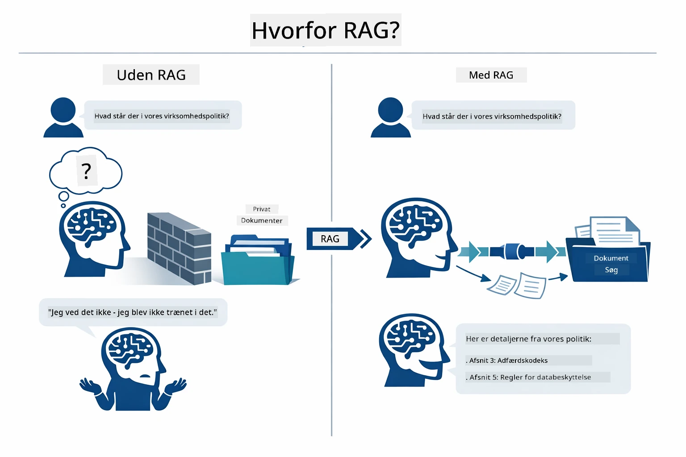

*Dette diagram viser forskellen mellem en standard LLM (som gætter ud fra træningsdata) og en RAG-forstærket LLM (som konsulterer dine dokumenter først).*

Sådan forbinder delene sig end-to-end. En brugers spørgsmål gennemgår fire faser — embedding, vektorsøgning, kontekstsammenstilling og svar-generering — som bygger ovenpå hinanden:


*Dette diagram viser den end-to-end RAG pipeline — en brugerforespørgsel løber gennem embedding, vektorsøgning, kontekstsammenstilling og svar-generering.*

Resten af dette modul gennemgår hver fase i detaljer med kode, du kan køre og modificere.

### Hvilken RAG Metode Bruger Denne Tutorial?

LangChain4j tilbyder tre måder at implementere RAG på, hver med et forskelligt abstraktionsniveau. Diagrammet nedenfor sammenligner dem side om side:

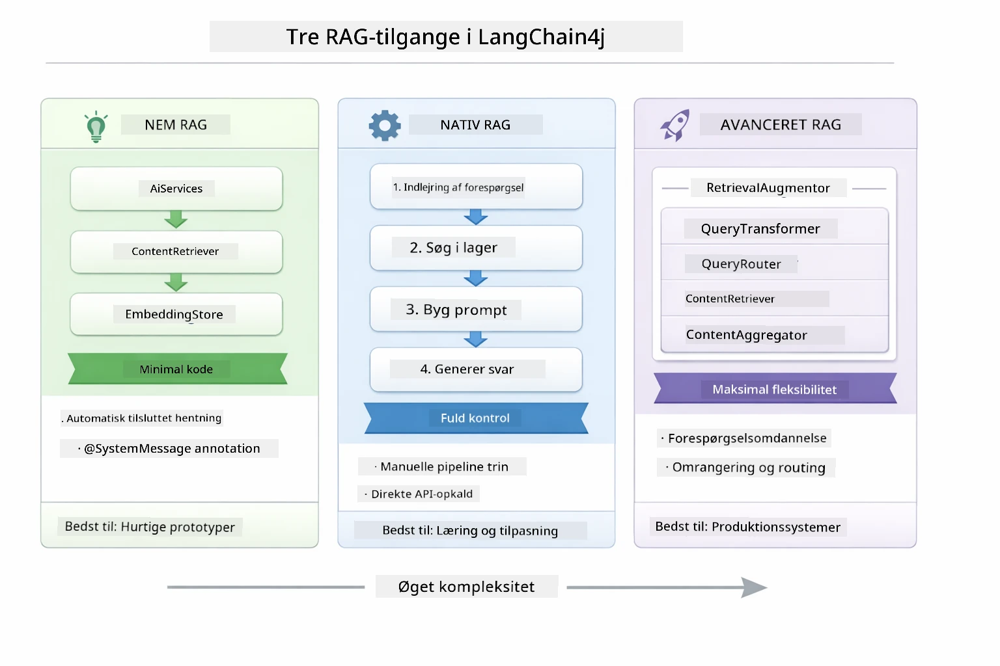

*Dette diagram sammenligner de tre LangChain4j RAG metoder — Easy, Native og Advanced — og viser deres nøglekomponenter og hvornår de skal bruges.*

| Metode | Hvad Den Gør | Afvejning |
|---|---|---|
| **Easy RAG** | Forbinder alt automatisk igennem `AiServices` og `ContentRetriever`. Du annoterer et interface, tilknytter en retriever, og LangChain4j håndterer embedding, søgning og prompt-sammenstilling bag kulisserne. | Minimal kode, men du ser ikke, hvad der sker i hvert trin. |
| **Native RAG** | Du kalder embedding modellen, søger i lagret, bygger prompten og genererer selv svaret — et eksplicit trin ad gangen. | Mere kode, men hver fase er synlig og kan ændres. |
| **Advanced RAG** | Bruger `RetrievalAugmentor` rammen med plug-in baserede forespørgselstransformere, routere, rangordnere og indholdsindsprøjtere for produktionsklare pipelines. | Maksimal fleksibilitet, men betydeligt mere kompleksitet. |

**Denne tutorial bruger Native metoden.** Hvert trin i RAG-pipelinen — embedding af forespørgslen, søgning i vektor-lageret, sammenstilling af kontekst og generering af svaret — er skrevet eksplicit i [`RagService.java`](../../../03-rag/src/main/java/com/example/langchain4j/rag/service/RagService.java). Dette er med vilje: som læringsressource er det vigtigere, at du kan se og forstå hvert trin, end at koden er minimal. Når du er fortrolig med hvordan delene passer sammen, kan du gå videre til Easy RAG for hurtige prototyper eller Advanced RAG til produktion.

> **💡 Har du allerede set Easy RAG i aktion?** [Quick Start modulet](../00-quick-start/README.md) inkluderer et Dokument Q&A eksempel ([`SimpleReaderDemo.java`](../../../00-quick-start/src/main/java/com/example/langchain4j/quickstart/SimpleReaderDemo.java)), som bruger Easy RAG metoden — LangChain4j håndterer embedding, søgning og prompt-sammenstilling automatisk. Dette modul tager næste skridt ved at bryde den pipeline op, så du selv kan se og styre hvert trin.

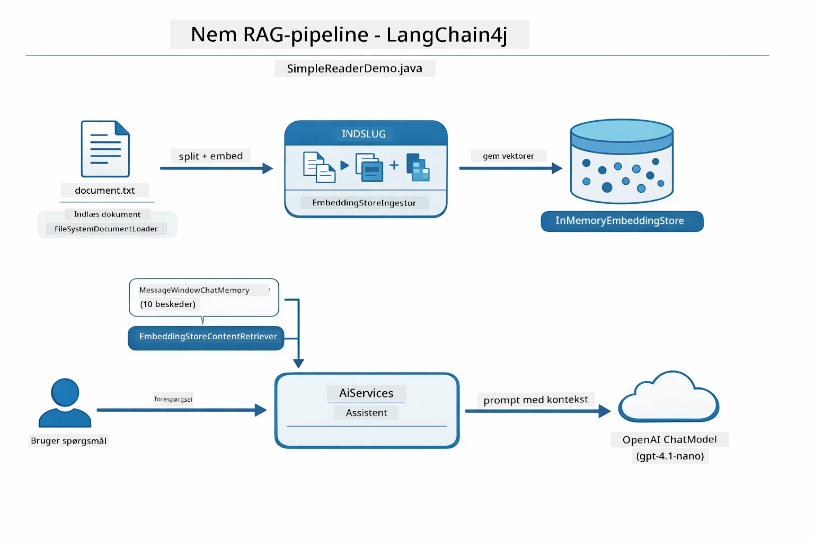

*Dette diagram viser Easy RAG-pipelinen fra `SimpleReaderDemo.java`. Sammenlign med Native metoden brugt i dette modul: Easy RAG skjuler embedding, retrieval og prompt-sammenstilling bag `AiServices` og `ContentRetriever` — du loader et dokument, tilføjer en retriever og får svar. Native metoden i dette modul åbner pipelinen, så du selv kalder hvert trin (embed, søg, saml kontekst, generer), hvilket giver fuld synlighed og kontrol.*

## Hvordan Det Virker

RAG-pipelinen i dette modul opdeles i fire faser, der kører i rækkefølge hver gang en bruger stiller et spørgsmål. Først bliver et uploadet dokument **parset og delt i chunks** i håndterbare bidder. Disse chunks omdannes så til **vektorembeddings** og gemmes, så de kan sammenlignes matematisk. Når en forespørgsel kommer, udfører systemet en **semantisk søgning** for at finde de mest relevante chunks, som til sidst sendes som kontekst til LLM'en for **svar-generering**. Følgende afsnit gennemgår hver fase med de faktiske kodeeksempler og diagrammer. Lad os se på det første trin.

### Dokumentbehandling

[DocumentService.java](../../../03-rag/src/main/java/com/example/langchain4j/rag/service/DocumentService.java)

Når du uploader et dokument, parser systemet det (PDF eller almindelig tekst), tilknytter metadata som filnavn, og deler det derefter op i chunks — mindre stykker, der komfortabelt kan være i modellens kontekstvindue. Disse chunks overlapper let, så du ikke mister kontekst ved grænserne.

```java
// Analyser den uploadede fil og indpak den i et LangChain4j-dokument
Document document = Document.from(content, metadata);

// Del op i bidder på 300 tokens med 30 tokens overlap
DocumentSplitter splitter = DocumentSplitters
    .recursive(300, 30);

List<TextSegment> segments = splitter.split(document);
```
  
Diagrammet nedenfor viser, hvordan dette fungerer visuelt. Bemærk, hvordan hver chunk deler nogle tokens med sine naboer — 30-token overlap sikrer, at vigtig kontekst ikke går tabt mellem stykkerne:

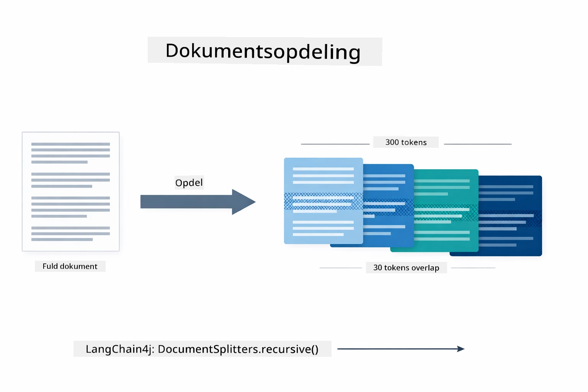

*Dette diagram viser et dokument delt i 300-token chunks med 30-token overlap, der bevarer kontekst ved chunk-grænser.*

> **🤖 Prøv med [GitHub Copilot](https://github.com/features/copilot) Chat:** Åbn [`DocumentService.java`](../../../03-rag/src/main/java/com/example/langchain4j/rag/service/DocumentService.java) og spørg:  
> - "Hvordan splitter LangChain4j dokumenter i chunks, og hvorfor er overlap vigtigt?"  
> - "Hvad er den optimale chunk-størrelse for forskellige dokumenttyper, og hvorfor?"  
> - "Hvordan håndterer jeg dokumenter på flere sprog eller med speciel formatering?"

### Oprettelse af Embeddings

[LangChainRagConfig.java](../../../03-rag/src/main/java/com/example/langchain4j/rag/config/LangChainRagConfig.java)

Hver chunk konverteres til en numerisk repræsentation kaldet en embedding — grundlæggende en betydning-til-tal-konverter. Embedding-modellen er ikke "intelligent" på samme måde som en chatmodel; den kan ikke følge instruktioner, ræsonnere eller besvare spørgsmål. Det, den kan gøre, er at kortlægge tekst til et matematisk rum, hvor lignende betydninger lander tæt på hinanden — "bil" tæt på "automobil", "refusionspolitik" tæt på "returner mine penge". Tænk på en chatmodel som en person, du kan tale med; en embedding model er et supergodt system til arkivering.

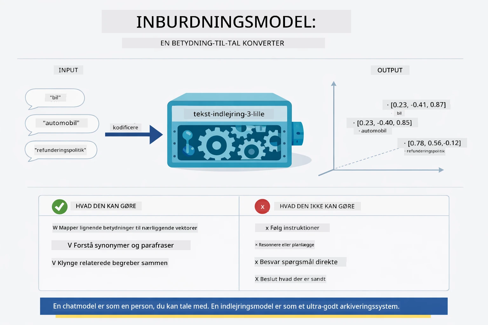

*Dette diagram viser, hvordan en embedding model konverterer tekst til numeriske vektorer og placerer lignende betydninger — som "bil" og "automobil" — tæt på hinanden i vektor-rummet.*

```java
@Bean
public EmbeddingModel embeddingModel() {
    return OpenAiOfficialEmbeddingModel.builder()
        .baseUrl(azureOpenAiEndpoint)
        .apiKey(azureOpenAiKey)
        .modelName(azureEmbeddingDeploymentName)
        .build();
}

EmbeddingStore<TextSegment> embeddingStore = 
    new InMemoryEmbeddingStore<>();
```
  
Klassediagrammet nedenfor viser de to separate flows i en RAG pipeline og LangChain4j-klasserne, der implementerer dem. **Indtagsflowet** (kører én gang ved upload) splitter dokumentet, embedder chunks og lagrer dem via `.addAll()`. **Forespørgselsflowet** (kører hver gang en bruger spørger) embedder spørgsmålet, søger i lageret via `.search()`, og sender den matchede kontekst til chatmodellen. Begge flows mødes ved det delte `EmbeddingStore<TextSegment>` interface:

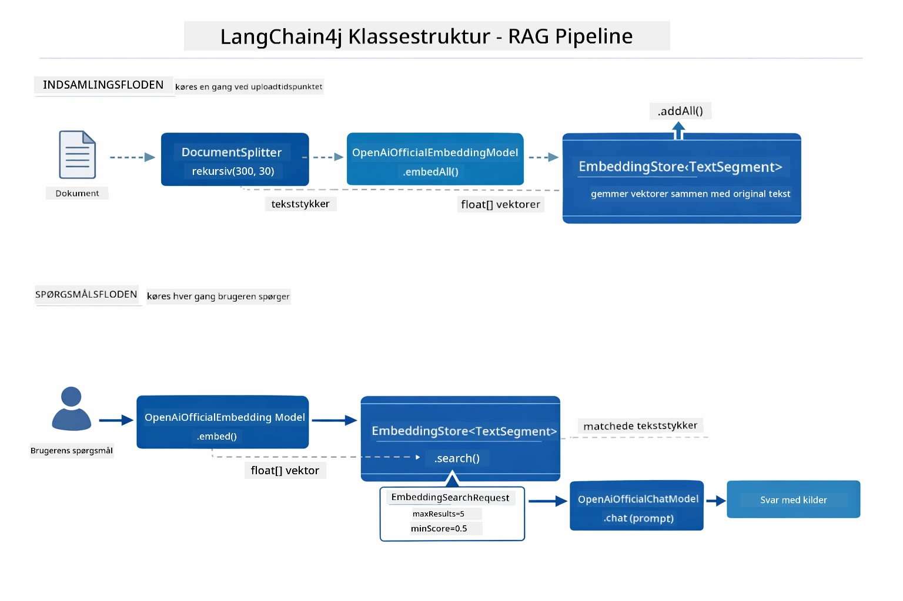

*Dette diagram viser de to flows i en RAG pipeline — indtag og forespørgsel — og hvordan de forbindes via et delt EmbeddingStore.*

Når embeddings er lagret, kluster lignende indhold naturligt sammen i vektor-rummet. Visualiseringen nedenfor viser, hvordan dokumenter om relaterede emner ender som nærtliggende punkter, hvilket muliggør semantisk søgning:


*Denne visualisering viser, hvordan relaterede dokumenter kluster sammen i 3D vektor-rum, med emner som Teknisk Dokumentation, Forretningsregler og FAQs, der danner distinkte grupper.*

Når en bruger søger, følger systemet fire trin: embed dokumenterne én gang, embed forespørgslen ved hver søgning, sammenlign forespørgsel-vektoren med alle lagrede vektorer via cosinus-lighed, og returner de top-K højst scorende chunks. Diagrammet nedenfor viser hvert trin og de involverede LangChain4j-klasser:

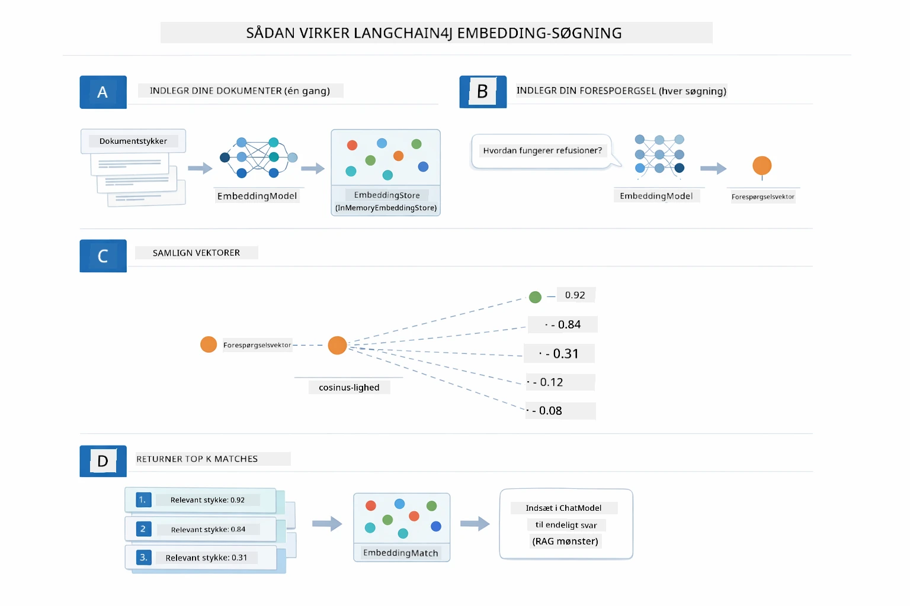

*Dette diagram viser den fire-trins embedding søgeproces: embed dokumenter, embed forespørgsel, sammenlign vektorer med cosinus-lighed, og returner top-K resultater.*

### Semantisk Søgning

[RagService.java](../../../03-rag/src/main/java/com/example/langchain4j/rag/service/RagService.java)

Når du stiller et spørgsmål, bliver dit spørgsmål også til en embedding. Systemet sammenligner embedding'en for dit spørgsmål mod alle dokumentchunks' embeddings. Det finder de chunks, der har mest lignende betydning - ikke bare matchende nøgleord, men faktisk semantisk lighed.

```java
Embedding queryEmbedding = embeddingModel.embed(question).content();

EmbeddingSearchRequest searchRequest = EmbeddingSearchRequest.builder()
    .queryEmbedding(queryEmbedding)
    .maxResults(5)
    .minScore(0.5)
    .build();

EmbeddingSearchResult<TextSegment> searchResult = embeddingStore.search(searchRequest);
List<EmbeddingMatch<TextSegment>> matches = searchResult.matches();

for (EmbeddingMatch<TextSegment> match : matches) {
    String relevantText = match.embedded().text();
    double score = match.score();
}
```
  
Diagrammet nedenfor sammenligner semantisk søgning med traditionel nøgleordsøgning. En nøgleordsøgning efter "køretøj" overser et chunk om "biler og lastbiler", men semantisk søgning forstår, at de betyder det samme, og returnerer det som et højt scorende match:

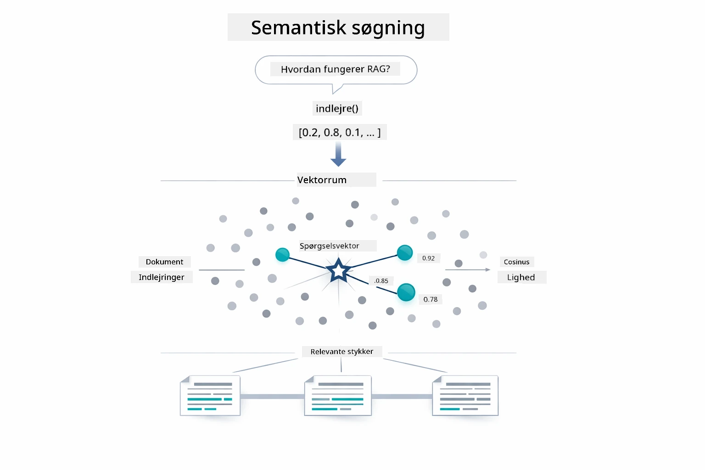

*Dette diagram sammenligner nøgleordsbaseret søgning med semantisk søgning, og viser hvordan semantisk søgning henter konceptuelt relateret indhold, selv når de eksakte nøgleord er forskellige.*

Under motorhjelmen måles lighed ved hjælp af cosinus-lighed — essentielt ved at spørge "peger disse to pilene i samme retning?" To chunks kan bruge helt forskellige ord, men hvis de betyder det samme, peger deres vektorer i samme retning og scorer tæt på 1.0:

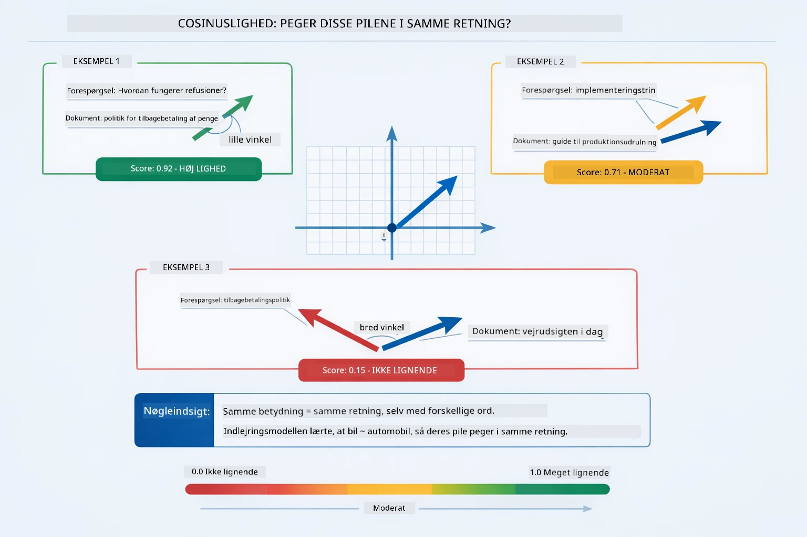

*Dette diagram illustrerer cosinus-lighed som vinklen mellem embedding-vektorer — mere alignede vektorer scorer tættere på 1.0, hvilket angiver højere semantisk lighed.*
> **🤖 Prøv med [GitHub Copilot](https://github.com/features/copilot) Chat:** Åbn [`RagService.java`](../../../03-rag/src/main/java/com/example/langchain4j/rag/service/RagService.java) og spørg:
> - "Hvordan fungerer lignende søgning med embeddings, og hvad bestemmer scoren?"
> - "Hvilken grænseværdi for lighed bør jeg bruge, og hvordan påvirker det resultaterne?"
> - "Hvordan håndterer jeg tilfælde, hvor der ikke findes relevante dokumenter?"

### Svar Generering

[RagService.java](../../../03-rag/src/main/java/com/example/langchain4j/rag/service/RagService.java)

De mest relevante bidder samles i en struktureret prompt, der inkluderer eksplicitte instruktioner, den hentede kontekst og brugerens spørgsmål. Modellen læser disse specifikke bidder og svarer baseret på disse oplysninger — den kan kun bruge det, der er foran den, hvilket forhindrer hallucination.

```java
String context = matches.stream()
    .map(match -> match.embedded().text())
    .collect(Collectors.joining("\n\n"));

String prompt = String.format("""
    Answer the question based on the following context.
    If the answer cannot be found in the context, say so.

    Context:
    %s

    Question: %s

    Answer:""", context, request.question());

String answer = chatModel.chat(prompt);
```

Diagrammet nedenfor viser denne samling i aktion — de bedst scorende bidder fra søgetrinnet indsættes i prompt-skabelonen, og `OpenAiOfficialChatModel` genererer et forankret svar:

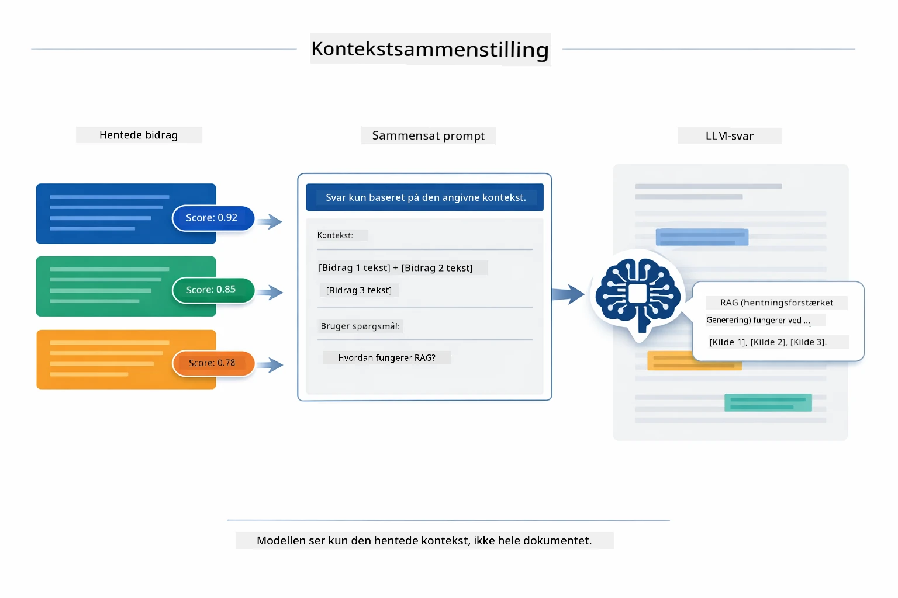

*Dette diagram viser, hvordan de bedst scorende bidder samles i en struktureret prompt, hvilket gør modellen i stand til at generere et forankret svar ud fra dine data.*

## Kør Applikationen

**Bekræft deployment:**

Sørg for, at `.env`-filen findes i rodbiblioteket med Azure-legitimationsoplysninger (oprettet under Modul 01):

**Bash:**
```bash
cat ../.env  # Skal vise AZURE_OPENAI_ENDPOINT, API_KEY, DEPLOYMENT
```

**PowerShell:**
```powershell
Get-Content ..\.env  # Skal vise AZURE_OPENAI_ENDPOINT, API_KEY, DEPLOYMENT
```

**Start applikationen:**

> **Bemærk:** Hvis du allerede har startet alle applikationer med `./start-all.sh` fra Modul 01, kører dette modul allerede på port 8081. Du kan springe startkommandoerne nedenfor over og gå direkte til http://localhost:8081.

**Mulighed 1: Brug Spring Boot Dashboard (Anbefalet til VS Code-brugere)**

Dev-containeren inkluderer Spring Boot Dashboard-udvidelsen, som giver en visuel grænseflade til at administrere alle Spring Boot-applikationer. Du finder den i Aktivitetsbjælken til venstre i VS Code (se efter Spring Boot-ikonet).

Fra Spring Boot Dashboard kan du:
- Se alle tilgængelige Spring Boot-applikationer i arbejdsområdet
- Starte/stoppe applikationer med et enkelt klik
- Se applikationslogfiler i realtid
- Overvåge applikationsstatus

Klik blot på afspilningsknappen ved siden af "rag" for at starte dette modul eller start alle moduler på én gang.


*Dette skærmbillede viser Spring Boot Dashboard i VS Code, hvor du visuelt kan starte, stoppe og overvåge applikationer.*

**Mulighed 2: Brug shell-scripts**

Start alle webapplikationer (moduler 01-04):

**Bash:**
```bash
cd ..  # Fra rodbiblioteket
./start-all.sh
```

**PowerShell:**
```powershell
cd ..  # Fra rodkataloget
.\start-all.ps1
```

Eller start kun dette modul:

**Bash:**
```bash
cd 03-rag
./start.sh
```

**PowerShell:**
```powershell
cd 03-rag
.\start.ps1
```

Begge scripts indlæser automatisk miljøvariabler fra rodbibliotekets `.env`-fil og bygger JAR-filer, hvis de ikke findes.

> **Bemærk:** Hvis du foretrækker at bygge alle moduler manuelt inden start:
>
> **Bash:**
> ```bash
> cd ..  # Go to root directory
> mvn clean package -DskipTests
> ```
>
> **PowerShell:**
> ```powershell
> cd ..  # Go to root directory
> mvn clean package -DskipTests
> ```

Åbn http://localhost:8081 i din browser.

**For at stoppe:**

**Bash:**
```bash
./stop.sh  # Kun denne modul
# Eller
cd .. && ./stop-all.sh  # Alle moduler
```

**PowerShell:**
```powershell
.\stop.ps1  # Kun dette modul
# Eller
cd ..; .\stop-all.ps1  # Alle moduler
```

## Brug af Applikationen

Applikationen tilbyder en webgrænseflade til dokumentupload og spørgsmål.

<a href="images/rag-homepage.png"></a>

*Dette skærmbillede viser RAG-applikationsgrænsefladen, hvor du uploader dokumenter og stiller spørgsmål.*

### Upload et dokument

Start med at uploade et dokument – TXT-filer fungerer bedst til test. En `sample-document.txt` er tilgængelig i denne mappe, som indeholder information om LangChain4j-funktioner, RAG-implementering og bedste praksis – perfekt til at teste systemet.

Systemet behandler dit dokument, bryder det op i bidder og opretter embeddings for hver bid. Dette sker automatisk ved upload.

### Stil Spørgsmål

Nu kan du stille specifikke spørgsmål om dokumentets indhold. Prøv noget faktuelt, der klart står i dokumentet. Systemet søger relevante bidder, inkluderer dem i prompten og genererer et svar.

### Tjek Kildehenvisninger

Bemærk, at hvert svar inkluderer kildehenvisninger med lighedsscores. Disse scores (0 til 1) viser, hvor relevante hver bid var i forhold til dit spørgsmål. Højere scores betyder bedre matches. Dette gør det muligt at verificere svaret mod kilde-materialet.

<a href="images/rag-query-results.png"></a>

*Dette skærmbillede viser forespørgselsresultater med det genererede svar, kildehenvisninger og relevansscores for hver fundne bid.*

### Eksperimenter med Spørgsmål

Prøv forskellige typer spørgsmål:
- Specifikke fakta: "Hvad er hovedemnet?"
- Sammenligninger: "Hvad er forskellen på X og Y?"
- Resuméer: "Opsummer nøglepunkterne om Z"

Se hvordan relevansscores ændrer sig baseret på, hvor godt dit spørgsmål matcher dokumentindholdet.

## Nøglebegreber

### Chunking-strategi

Dokumenter opdeles i 300-token bidder med 30 tokens overlap. Denne balance sikrer, at hver bid har nok kontekst til at være meningsfuld, mens den holdes lille nok til at inkludere flere bidder i en prompt.

### Lighedsscores

Hver hentet bid leveres med en lighedsscore mellem 0 og 1, der angiver, hvor tæt det matcher brugerens spørgsmål. Diagrammet nedenfor visualiserer scoreområderne og hvordan systemet bruger dem til at filtrere resultater:

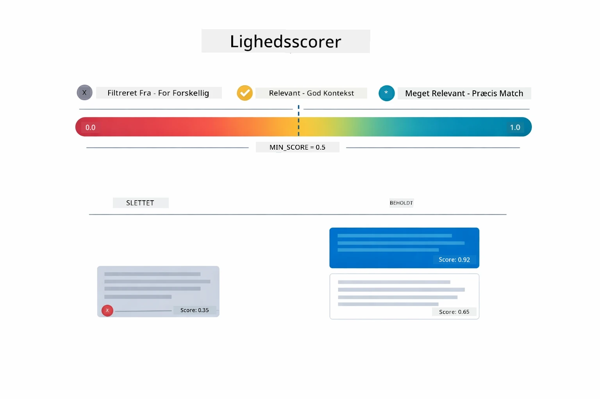

*Dette diagram viser scoreområder fra 0 til 1 med en minimumsgrænseværdi på 0,5, der filtrerer irrelevante bidder fra.*

Scores varierer fra 0 til 1:
- 0,7-1,0: Meget relevante, præcis match
- 0,5-0,7: Relevante, god kontekst
- Under 0,5: Filtreret fra, for forskellige

Systemet henter kun bidder over minimumsgrænsen for at sikre kvalitet.

Embeddings fungerer godt, når betydninger klumper sig klart sammen, men de har blinde vinkler. Diagrammet nedenfor viser almindelige fejlopfattelser — bidder der er for store giver mudrede vektorer, bidder der er for små mangler kontekst, tvetydige termer peger mod flere klynger, og præcise opslag (ID'er, reservedelsnumre) fungerer slet ikke med embeddings:

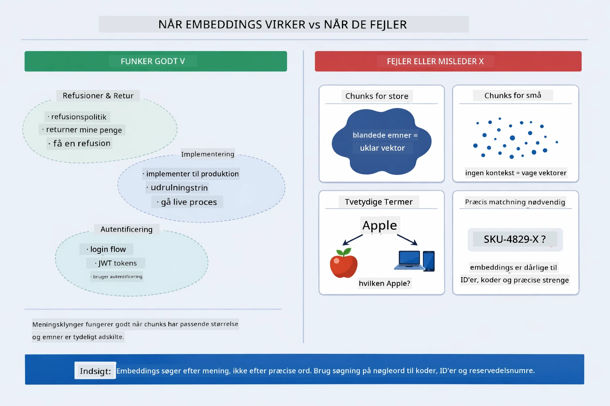

*Dette diagram viser almindelige fejltilstande for embeddings: bidder for store, bidder for små, tvetydige termer, og præcise opslag som ID'er.*

### In-memory lagring

Dette modul bruger in-memory lagring for enkelhedens skyld. Når du genstarter applikationen, mistes uploadede dokumenter. Produktionssystemer bruger vedvarende vektordatabaser som Qdrant eller Azure AI Search.

### Håndtering af kontekstvindue

Hver model har et maksimalt kontekstvindue. Du kan ikke inkludere hver bid fra et stort dokument. Systemet henter de N mest relevante bidder (standard 5) for at holde sig inden for grænserne, mens der gives nok kontekst til præcise svar.

## Hvornår RAG er relevant

RAG er ikke altid den rette tilgang. Beslutningsguiden nedenfor hjælper dig med at afgøre, hvornår RAG tilfører værdi versus, hvornår simplere tilgange — som at inkludere indhold direkte i prompten eller stole på modellens indbyggede viden — er tilstrækkelige:

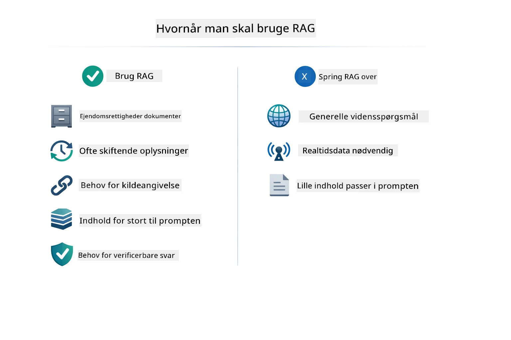

*Dette diagram viser en beslutningsguide for, hvornår RAG tilfører værdi versus, hvornår simplere tilgange er tilstrækkelige.*

**Brug RAG når:**
- Du besvarer spørgsmål om proprietære dokumenter
- Information ændres hyppigt (politikker, priser, specifikationer)
- Nøjagtighed kræver kildeangivelse
- Indholdet er for stort til at passe i en enkelt prompt
- Du har brug for verificerbare, forankrede svar

**Brug ikke RAG når:**
- Spørgsmål kræver generel viden, som modellen allerede har
- Realtime data er nødvendig (RAG arbejder med uploadede dokumenter)
- Indholdet er lille nok til at inkluderes direkte i prompts

## Næste Skridt

**Næste Modul:** [04-tools - AI Agents with Tools](../04-tools/README.md)

---

**Navigation:** [← Forrige: Modul 02 - Prompt Engineering](../02-prompt-engineering/README.md) | [Tilbage til Hoved](../README.md) | [Næste: Modul 04 - Tools →](../04-tools/README.md)

---

<!-- CO-OP TRANSLATOR DISCLAIMER START -->
**Ansvarsfraskrivelse**:
Dette dokument er blevet oversat ved brug af AI-oversættelsestjenesten [Co-op Translator](https://github.com/Azure/co-op-translator). Selvom vi bestræber os på nøjagtighed, skal du være opmærksom på, at automatiserede oversættelser kan indeholde fejl eller unøjagtigheder. Det oprindelige dokument på dets modersmål bør betragtes som den autoritative kilde. For kritisk information anbefales professionel, menneskelig oversættelse. Vi påtager os intet ansvar for misforståelser eller fejltolkninger, der måtte opstå ved brug af denne oversættelse.
<!-- CO-OP TRANSLATOR DISCLAIMER END -->