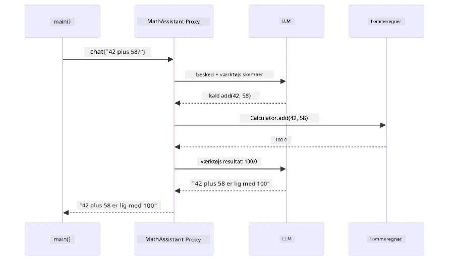
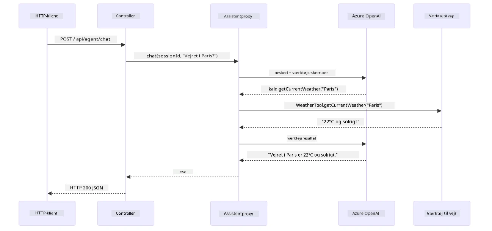

# Modul 04: AI-agenter med værktøjer

## Indholdsfortegnelse

- [Videogennemgang](../../../04-tools)
- [Det vil du lære](../../../04-tools)
- [Forudsætninger](../../../04-tools)
- [Forståelse af AI-agenter med værktøjer](../../../04-tools)
- [Hvordan værktøjskald fungerer](../../../04-tools)
  - [Værktøjsdefinitioner](../../../04-tools)
  - [Beslutningstagning](../../../04-tools)
  - [Udførelse](../../../04-tools)
  - [Generering af svar](../../../04-tools)
  - [Arkitektur: Spring Boot Auto-Wiring](../../../04-tools)
- [Kædning af værktøjer](../../../04-tools)
- [Kør applikationen](../../../04-tools)
- [Brug af applikationen](../../../04-tools)
  - [Prøv enkel værktøjsbrug](../../../04-tools)
  - [Test kædning af værktøjer](../../../04-tools)
  - [Se samtaleflow](../../../04-tools)
  - [Eksperimenter med forskellige forespørgsler](../../../04-tools)
- [Nøglebegreber](../../../04-tools)
  - [ReAct-mønsteret (Reasoning and Acting)](../../../04-tools)
  - [Værktøjsbeskrivelser betyder noget](../../../04-tools)
  - [Sessionsstyring](../../../04-tools)
  - [Fejlhåndtering](../../../04-tools)
- [Tilgængelige værktøjer](../../../04-tools)
- [Hvornår man skal bruge værktøjsbaserede agenter](../../../04-tools)
- [Værktøjer vs RAG](../../../04-tools)
- [Næste skridt](../../../04-tools)

## Videogennemgang

Se denne live-session, som forklarer, hvordan du kommer i gang med dette modul:

<a href="https://www.youtube.com/watch?v=O_J30kZc0rw"></a>

## Det vil du lære

Indtil videre har du lært, hvordan man har samtaler med AI, strukturerer prompts effektivt og forankrer svar i dine dokumenter. Men der er stadig en grundlæggende begrænsning: sprogmodeller kan kun generere tekst. De kan ikke tjekke vejret, udføre beregninger, forespørge databaser eller interagere med eksterne systemer.

Værktøjer ændrer dette. Ved at give modellen adgang til funktioner, den kan kalde, forvandler du den fra en tekstgenerator til en agent, som kan handle. Modellen beslutter, hvornår den har brug for et værktøj, hvilket værktøj den skal bruge, og hvilke parametre den skal sende. Din kode udfører funktionen og returnerer resultatet. Modellen indarbejder dette resultat i sit svar.

## Forudsætninger

- Fuldført [Modul 01 - Introduktion](../01-introduction/README.md) (Azure OpenAI-ressourcer er implementeret)
- Fuldførte tidligere moduler anbefales (dette modul refererer til [RAG-koncepter fra Modul 03](../03-rag/README.md) i sammenligningen mellem Værktøjer og RAG)
- `.env`-fil i rodkatalog med Azure-legitimationsoplysninger (oprettet af `azd up` i Modul 01)

> **Note:** Hvis du ikke har fuldført Modul 01, skal du følge implementeringsvejledningen der først.

## Forståelse af AI-agenter med værktøjer

> **📝 Note:** Udtrykket "agenter" i dette modul henviser til AI-assistenter, der er udvidet med evnen til at kalde værktøjer. Dette er forskelligt fra **Agentic AI**-mønstrene (autonome agenter med planlægning, hukommelse og flertrinsresonnement), som vi vil dække i [Modul 05: MCP](../05-mcp/README.md).

Uden værktøjer kan en sprogmodel kun generere tekst ud fra sine træningsdata. Spørg den om det nuværende vejr, og den må gætte. Giv den værktøjer, og den kan kalde en vejr-API, udføre beregninger eller forespørge en database — og så væve disse faktiske resultater ind i sit svar.


*Uden værktøjer kan modellen kun gætte — med værktøjer kan den kalde API’er, køre beregninger og returnere realtime data.*

En AI-agent med værktøjer følger et **Reasoning and Acting (ReAct)** mønster. Modellen reagerer ikke bare — den tænker over, hvad den har brug for, handler ved at kalde et værktøj, observerer resultatet og beslutter så, om den skal handle igen eller give det endelige svar:

1. **Resonér** — Agenten analyserer brugerens spørgsmål og fastslår, hvilken information den har brug for
2. **Handl** — Agenten vælger det rette værktøj, genererer de korrekte parametre og kalder værktøjet
3. **Observer** — Agenten modtager værktøjets output og evaluerer resultatet
4. **Gentag eller svar** — Hvis der er brug for mere data, gentager agenten processen; ellers udformer den et naturligt sprog-svar


*ReAct-cyklussen — agenten overvejer handling, handler ved at kalde et værktøj, observerer resultatet, og gentager til det kan levere et endeligt svar.*

Dette sker automatisk. Du definerer værktøjerne og deres beskrivelser. Modellen håndterer beslutningstagningen om, hvornår og hvordan de skal bruges.

## Hvordan værktøjskald fungerer

### Værktøjsdefinitioner

[WeatherTool.java](../../../04-tools/src/main/java/com/example/langchain4j/agents/tools/WeatherTool.java) | [TemperatureTool.java](../../../04-tools/src/main/java/com/example/langchain4j/agents/tools/TemperatureTool.java)

Du definerer funktioner med klare beskrivelser og parameterspecifikationer. Modellen ser disse beskrivelser i sit systemprompt og forstår, hvad hvert værktøj gør.

```java
@Component
public class WeatherTool {
    
    @Tool("Get the current weather for a location")
    public String getCurrentWeather(@P("Location name") String location) {
        // Din vejropslagslogik
        return "Weather in " + location + ": 22°C, cloudy";
    }
}

@AiService
public interface Assistant {
    String chat(@MemoryId String sessionId, @UserMessage String message);
}

// Assistenten er automatisk forbundet af Spring Boot med:
// - ChatModel bean
// - Alle @Tool metoder fra @Component klasser
// - ChatMemoryProvider til sessionshåndtering
```

Diagrammet nedenfor gennemgår hver annotation og viser, hvordan hver del hjælper AI med at forstå, hvornår værktøjet skal kaldes, og hvilke argumenter der skal sendes:


*Anatomi af en værktøjsdefinition — @Tool fortæller AI, hvornår det skal bruges, @P beskriver hver parameter, og @AiService forbinder det hele ved opstart.*

> **🤖 Prøv med [GitHub Copilot](https://github.com/features/copilot) Chat:** Åbn [`WeatherTool.java`](../../../04-tools/src/main/java/com/example/langchain4j/agents/tools/WeatherTool.java) og spørg:
> - "Hvordan integrerer jeg en ægte vejr-API som OpenWeatherMap i stedet for mock-data?"
> - "Hvad gør en god værktøjsbeskrivelse, der hjælper AI med at bruge det korrekt?"
> - "Hvordan håndterer jeg API-fejl og rate limits i værktøjsimplementeringer?"

### Beslutningstagning

Når en bruger spørger "Hvordan er vejret i Seattle?", vælger modellen ikke tilfældigt et værktøj. Den sammenligner brugerens hensigt med alle værktøjsbeskrivelser, den har adgang til, vurderer relevansen for hver og vælger det bedste match. Den genererer derefter et struktureret funktionskald med de rette parametre — i dette tilfælde ved at sætte `location` til `"Seattle"`.

Hvis intet værktøj matcher brugerens forespørgsel, falder modellen tilbage til at svare ud fra sin egen viden. Hvis flere værktøjer matcher, vælger den det mest specifikke.


*Modellen evaluerer hvert tilgængeligt værktøj i forhold til brugerens hensigt og vælger det bedste match — derfor er klare, specifikke værktøjsbeskrivelser vigtige.*

### Udførelse

[AgentService.java](../../../04-tools/src/main/java/com/example/langchain4j/agents/service/AgentService.java)

Spring Boot auto-forbinder det deklarative `@AiService` interface med alle registrerede værktøjer, og LangChain4j udfører værktøjskald automatisk. Bag kulisserne har et komplet værktøjskald seks faser — fra brugerens spørgsmål i naturligt sprog helt tilbage til et svar i naturligt sprog:


*Den komplette end-to-end flow — brugeren stiller et spørgsmål, modellen vælger et værktøj, LangChain4j udfører det, og modellen fletter resultatet ind i et naturligt svar.*

Hvis du kørte [ToolIntegrationDemo](../../../00-quick-start/src/main/java/com/example/langchain4j/quickstart/ToolIntegrationDemo.java) i Modul 00, har du allerede set dette mønster i aktion — `Calculator`-værktøjerne blev kaldt på samme måde. Sekvensdiagrammet nedenfor viser præcis, hvad der skete under overfladen under den demo:



*Værktøjskaldsløkken fra Quick Start-demoen — `AiServices` sender din besked og værktøjsskemaer til LLM, LLM svarer med et funktionskald som `add(42, 58)`, LangChain4j kører `Calculator`-metoden lokalt, og sender resultatet tilbage til det endelige svar.*

> **🤖 Prøv med [GitHub Copilot](https://github.com/features/copilot) Chat:** Åbn [`AgentService.java`](../../../04-tools/src/main/java/com/example/langchain4j/agents/service/AgentService.java) og spørg:
> - "Hvordan fungerer ReAct-mønsteret, og hvorfor er det effektivt for AI-agenter?"
> - "Hvordan beslutter agenten, hvilket værktøj der skal bruges og i hvilken rækkefølge?"
> - "Hvad sker der, hvis en værktøjsudførelse fejler - hvordan håndterer jeg fejl robust?"

### Generering af svar

Modellen modtager vejrinformationerne og formaterer dem til et svar i naturligt sprog til brugeren.

### Arkitektur: Spring Boot Auto-Wiring

Dette modul bruger LangChain4js Spring Boot-integration med deklarative `@AiService` interfaces. Ved opstart opdager Spring Boot alle `@Component` med `@Tool`-metoder, din `ChatModel` bean og `ChatMemoryProvider` — og binder dem alle sammen i et enkelt `Assistant` interface uden boilerplate.


*@AiService-interfacet binder ChatModel, værktøjskomponenter og hukommelsesudbyder sammen — Spring Boot håndterer alle bindinger automatisk.*

Her er hele anmodningens livscyklus som et sekvensdiagram — fra HTTP-anmodningen gennem controller, service og auto-forbundet proxy, helt til værktøjets udførelse og tilbage:



*Den komplette Spring Boot-anmodnings livscyklus — HTTP-anmodningen går gennem controlleren og servicen til den auto-forbundne Assistant proxy, som orkestrerer LLM og værktøjskald automatisk.*

Vigtige fordele ved denne tilgang:

- **Spring Boot auto-wiring** — ChatModel og værktøjer injiceres automatisk
- **@MemoryId-mønster** — Automatisk sessionsbaseret hukommelsesstyring
- **Én enkelt instans** — Assistant oprettes én gang og genbruges for bedre ydeevne
- **Typesikker udførelse** — Java-metoder kaldes direkte med typekonvertering
- **Multi-turn orkestrering** — Håndterer automatisk kædning af værktøjer
- **Ingen boilerplate** — Ingen manuelle kald til `AiServices.builder()` eller hukommelses-HashMap

Alternative tilgange (manuelt `AiServices.builder()`) kræver mere kode og mangler Spring Boot integrationsfordele.

## Kædning af værktøjer

**Kædning af værktøjer** — Den virkelige styrke ved værktøjsbaserede agenter viser sig, når et enkelt spørgsmål kræver flere værktøjer. Spørg "Hvordan er vejret i Seattle i Fahrenheit?" og agenten kæder automatisk to værktøjer sammen: først kalder den `getCurrentWeather` for at få temperaturen i Celsius, derefter sender den den værdi til `celsiusToFahrenheit` for konvertering — alt sammen i én samtalerunde.


*Kædning af værktøjer i aktion — agenten kalder først getCurrentWeather, sender så Celsius-resultatet videre til celsiusToFahrenheit, og leverer et samlet svar.*

**Elegant fejlhåndtering** — Spørg efter vejret i en by, der ikke findes i mock-dataene. Værktøjet returnerer en fejlmeddelelse, og AI forklarer, at den ikke kan hjælpe i stedet for at crashe. Værktøjer fejler sikkert. Diagrammet nedenfor sammenligner de to tilgange — med korrekt fejlhåndtering fanger agenten undtagelsen og svarer hjælpsomt, mens uden den crasher hele applikationen:


*Når et værktøj fejler, fanger agenten fejlen og svarer med en hjælpsom forklaring i stedet for at crashe.*

Dette sker i én samtalerunde. Agenten orkestrerer flere værktøjskald autonomt.

## Kør applikationen

**Bekræft implementering:**

Sørg for, at `.env`-filen findes i rodkataloget med Azure-legitimationsoplysninger (oprettet under Modul 01). Kør dette fra modulets bibliotek (`04-tools/`):

**Bash:**
```bash
cat ../.env  # Skal vise AZURE_OPENAI_ENDPOINT, API_KEY, DEPLOYMENT
```

**PowerShell:**
```powershell
Get-Content ..\.env  # Skal vise AZURE_OPENAI_ENDPOINT, API_KEY, DEPLOYMENT
```

**Start applikationen:**

> **Note:** Hvis du allerede har startet alle applikationer med `./start-all.sh` fra rodkataloget (som beskrevet i Modul 01), kører dette modul allerede på port 8084. Du kan springe startkommandoerne over og gå direkte til http://localhost:8084.

**Mulighed 1: Brug af Spring Boot Dashboard (Anbefales til VS Code-brugere)**

Dev-containeren inkluderer Spring Boot Dashboard-udvidelsen, som giver en visuel grænseflade til at administrere alle Spring Boot-applikationer. Du kan finde den i aktivitetsbjælken til venstre i VS Code (se efter Spring Boot-ikonet).

Fra Spring Boot Dashboard kan du:
- Se alle tilgængelige Spring Boot-applikationer i arbejdsområdet
- Starte/stoppe applikationer med et enkelt klik
- Se applikationslogs i realtid
- Overvåge applikationens status
Klik blot på afspilningsknappen ved siden af "tools" for at starte dette modul, eller start alle moduler på én gang.

Sådan ser Spring Boot Dashboard ud i VS Code:


*Spring Boot Dashboard i VS Code — start, stop og overvåg alle moduler fra ét sted*

**Mulighed 2: Brug af shell scripts**

Start alle webapplikationer (moduler 01-04):

**Bash:**
```bash
cd ..  # Fra rodmappen
./start-all.sh
```

**PowerShell:**
```powershell
cd ..  # Fra rodmappe
.\start-all.ps1
```

Eller start kun dette modul:

**Bash:**
```bash
cd 04-tools
./start.sh
```

**PowerShell:**
```powershell
cd 04-tools
.\start.ps1
```

Begge scripts indlæser automatisk miljøvariabler fra roden `.env`-filen og vil bygge JAR-filerne, hvis de ikke findes.

> **Bemærk:** Hvis du foretrækker at bygge alle moduler manuelt inden start:
>
> **Bash:**
> ```bash
> cd ..  # Go to root directory
> mvn clean package -DskipTests
> ```
>
> **PowerShell:**
> ```powershell
> cd ..  # Go to root directory
> mvn clean package -DskipTests
> ```

Åbn http://localhost:8084 i din browser.

**For at stoppe:**

**Bash:**
```bash
./stop.sh  # Kun denne modul
# Eller
cd .. && ./stop-all.sh  # Alle moduler
```

**PowerShell:**
```powershell
.\stop.ps1  # Kun denne modul
# Eller
cd ..; .\stop-all.ps1  # Alle moduler
```

## Brug af Applikationen

Applikationen giver en webgrænseflade, hvor du kan interagere med en AI-agent, der har adgang til vejr- og temperaturkonverteringsværktøjer. Sådan ser grænsefladen ud — den indeholder hurtigstart-eksempler og en chatpanel til at sende forespørgsler:

<a href="images/tools-homepage.png"></a>

*AI Agent Tools-grænsefladen – hurtige eksempler og chatinterface til interaktion med værktøjer*

### Prøv Enkel Brug af Værktøjer

Start med en simpel forespørgsel: "Konverter 100 grader Fahrenheit til Celsius". Agenten genkender, at den skal bruge temperaturkonverteringsværktøjet, kalder det med de rette parametre og returnerer resultatet. Bemærk, hvor naturligt det føles – du specificerede ikke, hvilket værktøj der skulle bruges eller hvordan det skulle kaldes.

### Test Kædning af Værktøjer

Prøv nu noget mere komplekst: "Hvad er vejret i Seattle og konverter det til Fahrenheit?" Se hvordan agenten arbejder trin for trin. Den henter først vejret (som returnerer Celsius), genkender behovet for at konvertere til Fahrenheit, kalder konverteringsværktøjet og kombinerer begge resultater i et svar.

### Se Samtale Flow

Chatinterfacet bevarer samtalehistorikken, så du kan have flertrins-interaktioner. Du kan se alle tidligere forespørgsler og svar, hvilket gør det nemt at følge samtalen og forstå, hvordan agenten bygger kontekst over flere udvekslinger.

<a href="images/tools-conversation-demo.png"></a>

*Flertrins-samtale, der viser simple konverteringer, vejropslag og kædning af værktøjer*

### Eksperimentér med Forskellige Forespørgsler

Prøv forskellige kombinationer:
- Vejropslag: "Hvordan er vejret i Tokyo?"
- Temperaturkonverteringer: "Hvad er 25°C i Kelvin?"
- Kombinerede forespørgsler: "Tjek vejret i Paris og fortæl om det er over 20°C"

Bemærk, hvordan agenten fortolker naturligt sprog og oversætter det til relevante værktøjskald.

## Centrale Begreber

### ReAct Mønster (Resonering og Handling)

Agenten skifter mellem at ræsonnere (beslutte hvad der skal gøres) og handle (bruge værktøjer). Dette mønster muliggør autonom problemløsning i stedet for bare at svare på instruktioner.

### Værktøjsbeskrivelser Betyr

Kvaliteten af dine værktøjsbeskrivelser påvirker direkte, hvor godt agenten bruger dem. Klare, specifikke beskrivelser hjælper modellen med at forstå hvornår og hvordan hvert værktøj skal kaldes.

### Sessionsstyring

`@MemoryId`-annotationen muliggør automatisk sessionsbaseret hukommelsesstyring. Hver session-ID får sin egen `ChatMemory`-instans styret af `ChatMemoryProvider`-bean, så flere brugere kan interagere samtidigt uden at deres samtaler blandes. Følgende diagram viser, hvordan flere brugere rutes til isolerede hukommelseslagre baseret på deres session-ID’er:


*Hver session-ID svarer til en isoleret samtalehistorik — brugerne ser aldrig hinandens beskeder.*

### Fejlhåndtering

Værktøjer kan fejle — API’er timeout, parametre kan være ugyldige, eksterne tjenester går ned. Produktionsagenter har brug for fejlhåndtering, så modellen kan forklare problemer eller prøve alternativer i stedet for at få hele applikationen til at gå ned. Når et værktøj kaster en undtagelse, fanger LangChain4j den og sender fejlbeskeden tilbage til modellen, som kan forklare problemet i naturligt sprog.

## Tilgængelige Værktøjer

Diagrammet nedenfor viser det brede økosystem af værktøjer, du kan bygge. Dette modul demonstrerer vejr- og temperaturværktøjer, men det samme `@Tool`-mønster fungerer for enhver Java-metode — fra databaseforespørgsler til betalingsbehandling.


*Enhver Java-metode annoteret med @Tool bliver tilgængelig for AI’en — mønstret gælder også for databaser, API’er, e-mail, filoperationer og mere.*

## Hvornår Skal Man Bruge Værktøjsbaserede Agenter

Ikke alle forespørgsler behøver værktøjer. Beslutningen handler om, hvorvidt AI’en skal interagere med eksterne systemer, eller om den kan svare ud fra sin egen viden. Følgende guide opsummerer, hvornår værktøjer tilfører værdi, og hvornår de er unødvendige:


*En hurtig beslutningsguide — værktøjer er til realtidsdata, beregninger og handlinger; generel viden og kreative opgaver behøver dem ikke.*

## Værktøjer vs RAG

Modulerne 03 og 04 udvider begge, hvad AI’en kan, men på fundamentalt forskellige måder. RAG giver modellen adgang til **viden** ved at hente dokumenter. Værktøjer giver modellen evnen til at tage **handlinger** ved at kalde funktioner. Diagrammet nedenfor sammenligner de to tilgange side om side — fra hvordan hvert workflow fungerer til kompromiserne mellem dem:


*RAG henter information fra statiske dokumenter — Værktøjer udfører handlinger og henter dynamiske, realtidsdata. Mange produktionssystemer kombinerer begge.*

I praksis kombinerer mange produktionssystemer begge tilgange: RAG til at forankre svar i din dokumentation, og Værktøjer til at hente live data eller udføre operationer.

## Næste Skridt

**Næste Modul:** [05-mcp - Model Context Protocol (MCP)](../05-mcp/README.md)

---

**Navigation:** [← Forrige: Modul 03 - RAG](../03-rag/README.md) | [Tilbage til Hovedmenu](../README.md) | [Næste: Modul 05 - MCP →](../05-mcp/README.md)

---

<!-- CO-OP TRANSLATOR DISCLAIMER START -->
**Ansvarsfraskrivelse**:
Dette dokument er blevet oversat ved hjælp af AI-oversættelsestjenesten [Co-op Translator](https://github.com/Azure/co-op-translator). Selvom vi bestræber os på nøjagtighed, bedes du være opmærksom på, at automatiserede oversættelser kan indeholde fejl eller unøjagtigheder. Det oprindelige dokument på originalsproget bør betragtes som den autoritative kilde. For vigtig information anbefales professionel menneskelig oversættelse. Vi påtager os intet ansvar for misforståelser eller fejltolkninger, der opstår som følge af brugen af denne oversættelse.
<!-- CO-OP TRANSLATOR DISCLAIMER END -->