# Modul 04: AI-agenter med værktøjer

## Indholdsfortegnelse

- [Hvad du vil lære](../../../04-tools)
- [Forudsætninger](../../../04-tools)
- [Forståelse af AI-agenter med værktøjer](../../../04-tools)
- [Hvordan værktøjskald fungerer](../../../04-tools)
  - [Værktøjsdefinitioner](../../../04-tools)
  - [Beslutningstagning](../../../04-tools)
  - [Udførelse](../../../04-tools)
  - [Generering af svar](../../../04-tools)
  - [Arkitektur: Spring Boot automatisk wiring](../../../04-tools)
- [Værktøjskædning](../../../04-tools)
- [Kør applikationen](../../../04-tools)
- [Brug af applikationen](../../../04-tools)
  - [Prøv simpel værktøjsbrug](../../../04-tools)
  - [Test værktøjskædning](../../../04-tools)
  - [Se samtaleflow](../../../04-tools)
  - [Eksperimenter med forskellige forespørgsler](../../../04-tools)
- [Nøglebegreber](../../../04-tools)
  - [ReAct-mønsteret (Resonnement og Handling)](../../../04-tools)
  - [Værktøjsbeskrivelser betyder noget](../../../04-tools)
  - [Sessionstyring](../../../04-tools)
  - [Fejlhåndtering](../../../04-tools)
- [Tilgængelige værktøjer](../../../04-tools)
- [Hvornår man bruger værktøjsbaserede agenter](../../../04-tools)
- [Værktøjer vs RAG](../../../04-tools)
- [Næste skridt](../../../04-tools)

## Hvad du vil lære

Indtil nu har du lært, hvordan du fører samtaler med AI, strukturerer prompts effektivt og forankrer svar i dine dokumenter. Men der er stadig en grundlæggende begrænsning: sprogmodeller kan kun generere tekst. De kan ikke tjekke vejret, udføre beregninger, forespørge databaser eller interagere med eksterne systemer.

Værktøjer ændrer dette. Ved at give modellen adgang til funktioner, den kan kalde, forvandler du den fra en tekstgenerator til en agent, der kan udføre handlinger. Modellen beslutter, hvornår den har brug for et værktøj, hvilket værktøj den vil bruge, og hvilke parametre den skal sende. Din kode udfører funktionen og returnerer resultatet. Modellen indarbejder dette resultat i sit svar.

## Forudsætninger

- Afsluttet [Modul 01 - Introduktion](../01-introduction/README.md) (Azure OpenAI ressourcer implementeret)
- Afsluttet tidligere moduler anbefales (dette modul refererer til [RAG-konceptet fra Modul 03](../03-rag/README.md) i Værktøjer vs RAG sammenligningen)
- `.env` fil i rodmappen med Azure legitimationsoplysninger (oprettet af `azd up` i Modul 01)

> **Bemærk:** Hvis du ikke har afsluttet Modul 01, så følg først installationsinstruktionerne der.

## Forståelse af AI-agenter med værktøjer

> **📝 Bemærk:** Udtrykket "agenter" i dette modul henviser til AI-assistenter, der er forbedret med værktøjskald-funktioner. Dette adskiller sig fra **Agentic AI**-mønstrene (autonome agenter med planlægning, hukommelse og flertrins ræsonnering), som vi dækker i [Modul 05: MCP](../05-mcp/README.md).

Uden værktøjer kan en sprogmodel kun generere tekst baseret på sine træningsdata. Spørg den om vejret lige nu, og den må gætte. Giv den værktøjer, og den kan kalde en vejr-API, udføre beregninger eller forespørge en database — og derefter flette disse reelle resultater ind i sit svar.

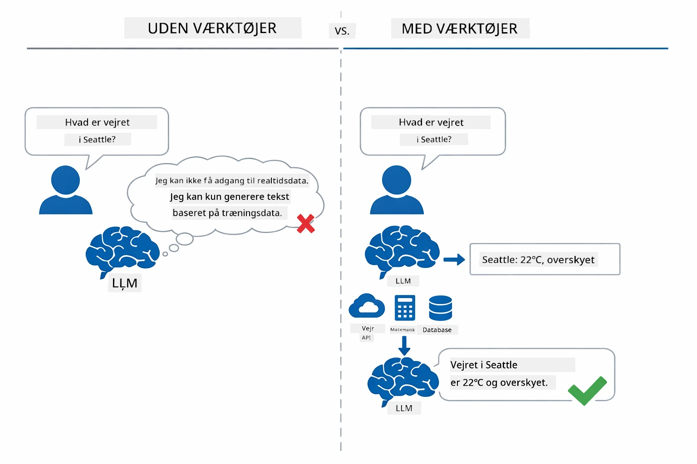

*Uden værktøjer kan modellen kun gætte — med værktøjer kan den kalde API’er, udføre beregninger og levere realtidsdata.*

En AI-agent med værktøjer følger et **Reasoning and Acting (ReAct)**-mønster. Modellen svarer ikke bare — den tænker over, hvad den har brug for, handler ved at kalde et værktøj, observerer resultatet og beslutter så, om den skal handle igen eller levere det endelige svar:

1. **Ræsonner** — Agenten analyserer brugerens spørgsmål og afgør, hvilke oplysninger den behøver
2. **Handler** — Agenten vælger det rette værktøj, genererer de korrekte parametre og kalder det
3. **Observerer** — Agenten modtager værktøjets output og evaluerer resultatet
4. **Gentag eller svar** — Hvis der er brug for mere data, går agenten tilbage til start; ellers komponerer den et svar på naturligt sprog

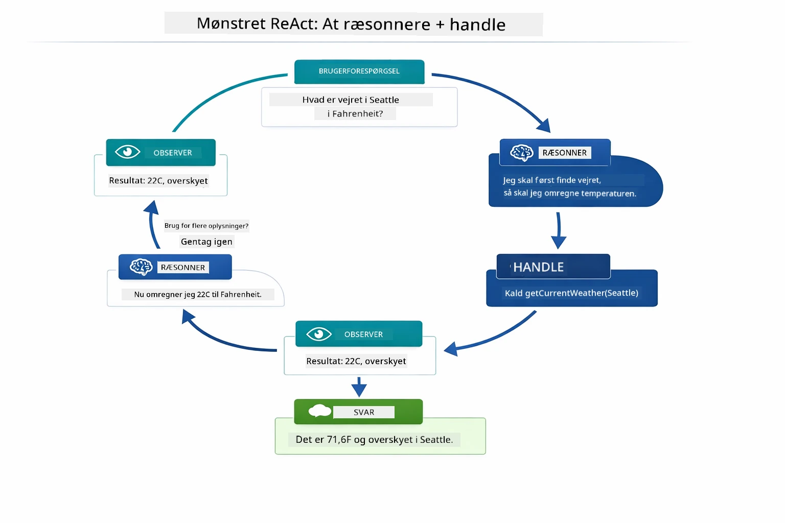

*ReAct-cyklussen — agenten ræsonnerer over, hvad den skal gøre, handler ved at kalde et værktøj, observerer resultatet og gentager, indtil den kan levere det endelige svar.*

Dette sker automatisk. Du definerer værktøjerne og deres beskrivelser. Modellen håndterer beslutninger om, hvornår og hvordan de skal bruges.

## Hvordan værktøjskald fungerer

### Værktøjsdefinitioner

[WeatherTool.java](../../../04-tools/src/main/java/com/example/langchain4j/agents/tools/WeatherTool.java) | [TemperatureTool.java](../../../04-tools/src/main/java/com/example/langchain4j/agents/tools/TemperatureTool.java)

Du definerer funktioner med klare beskrivelser og parameter-specifikationer. Modellen ser disse beskrivelser i systemprompten og forstår, hvad hvert værktøj gør.

```java
@Component
public class WeatherTool {
    
    @Tool("Get the current weather for a location")
    public String getCurrentWeather(@P("Location name") String location) {
        // Din vejropslagningslogik
        return "Weather in " + location + ": 22°C, cloudy";
    }
}

@AiService
public interface Assistant {
    String chat(@MemoryId String sessionId, @UserMessage String message);
}

// Assistenten er automatisk forbundet af Spring Boot med:
// - ChatModel bean
// - Alle @Tool metoder fra @Component klasser
// - ChatMemoryProvider til sessionsstyring
```

Diagrammet nedenfor gennemgår hver annotation og viser, hvordan hver del hjælper AI med at forstå, hvornår værktøjet skal kaldes, og hvilke argumenter der skal gives:

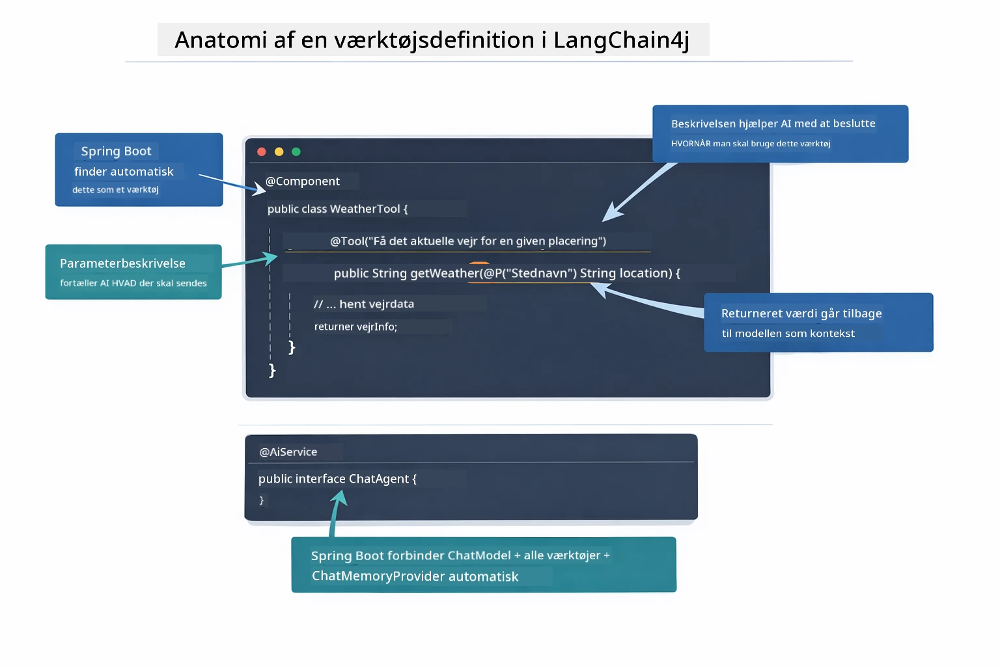

*Anatomi for en værktøjsdefinition — @Tool fortæller AI, hvornår det skal bruges, @P beskriver hver parameter, og @AiService forbinder det hele ved opstart.*

> **🤖 Prøv med [GitHub Copilot](https://github.com/features/copilot) Chat:** Åbn [`WeatherTool.java`](../../../04-tools/src/main/java/com/example/langchain4j/agents/tools/WeatherTool.java) og spørg:
> - "Hvordan integrerer jeg en rigtig vejr-API som OpenWeatherMap i stedet for mock-data?"
> - "Hvad gør en god værktøjsbeskrivelse, der hjælper AI med at bruge det korrekt?"
> - "Hvordan håndterer jeg API-fejl og grænser i værktøjsimplementeringer?"

### Beslutningstagning

Når en bruger spørger "Hvordan er vejret i Seattle?", vælger modellen ikke tilfældigt et værktøj. Den sammenligner brugerens hensigt med alle tilgængelige værktøjsbeskrivelser, scorer hver for relevans og vælger det bedste match. Den genererer derefter et struktureret funktionskald med de rette parametre – i dette tilfælde sættes `location` til `"Seattle"`.

Hvis intet værktøj matcher brugerens forespørgsel, vender modellen tilbage til at svare ud fra sin egen viden. Hvis flere værktøjer matcher, vælger den det mest specifikke.

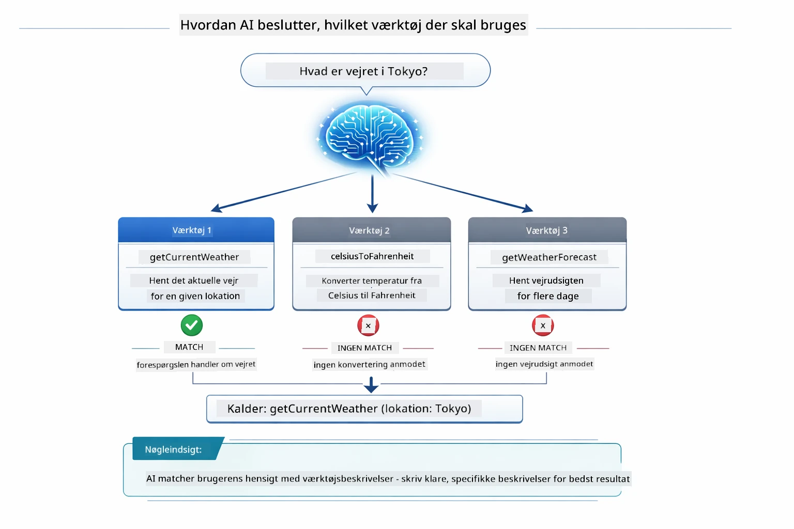

*Modellen evaluerer hvert tilgængeligt værktøj mod brugerens hensigt og vælger det bedste match — derfor er klare og specifikke værktøjsbeskrivelser vigtige.*

### Udførelse

[AgentService.java](../../../04-tools/src/main/java/com/example/langchain4j/agents/service/AgentService.java)

Spring Boot autowirer den deklarative `@AiService`-interface med alle registrerede værktøjer, og LangChain4j udfører værktøjskald automatisk. Bag kulisserne gennemløber et komplet værktøjskald seks stadier — fra brugerens spørgsmål på naturligt sprog helt tilbage til et svar på naturligt sprog:

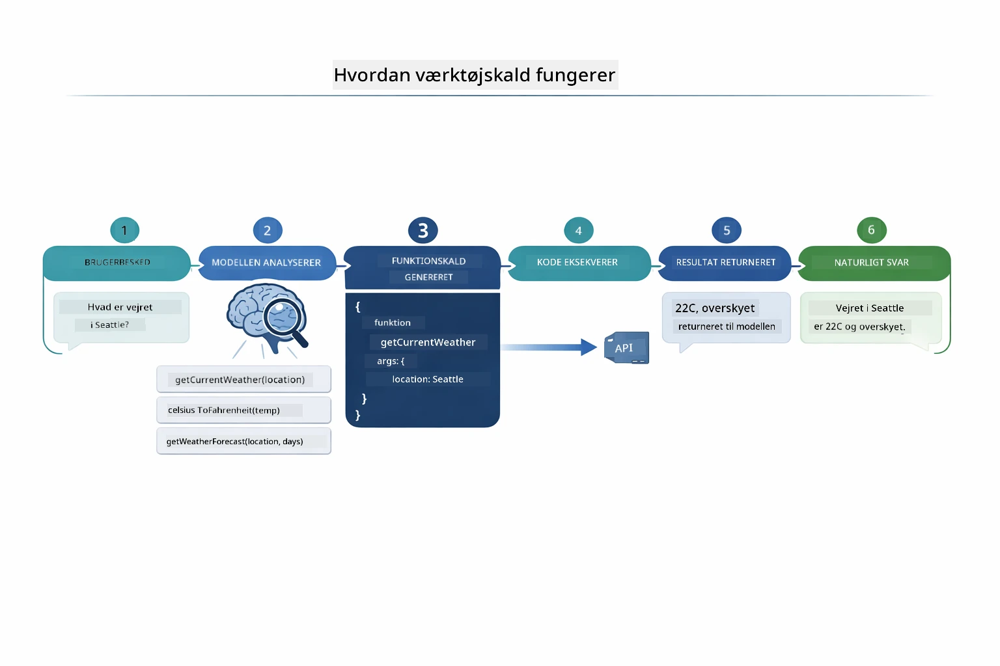

*Fuldt flow — brugeren stiller et spørgsmål, modellen vælger et værktøj, LangChain4j udfører det, og modellen fletter resultatet ind i et naturligt svar.*

> **🤖 Prøv med [GitHub Copilot](https://github.com/features/copilot) Chat:** Åbn [`AgentService.java`](../../../04-tools/src/main/java/com/example/langchain4j/agents/service/AgentService.java) og spørg:
> - "Hvordan fungerer ReAct-mønsteret, og hvorfor er det effektivt for AI-agenter?"
> - "Hvordan beslutter agenten, hvilket værktøj der skal bruges og i hvilken rækkefølge?"
> - "Hvad sker der, hvis et værktøjskald fejler – hvordan håndterer jeg fejl robust?"

### Generering af svar

Modellen modtager vejrdata og formaterer det til et svar på naturligt sprog til brugeren.

### Arkitektur: Spring Boot automatisk wiring

Dette modul bruger LangChain4j's Spring Boot-integration med deklarative `@AiService`-interfaces. Ved opstart opdager Spring Boot alle `@Component`er, der indeholder `@Tool`-metoder, din `ChatModel` bean og `ChatMemoryProvider` — og forbinder dem alle til en enkelt `Assistant`-interface uden nogen boilerplate.

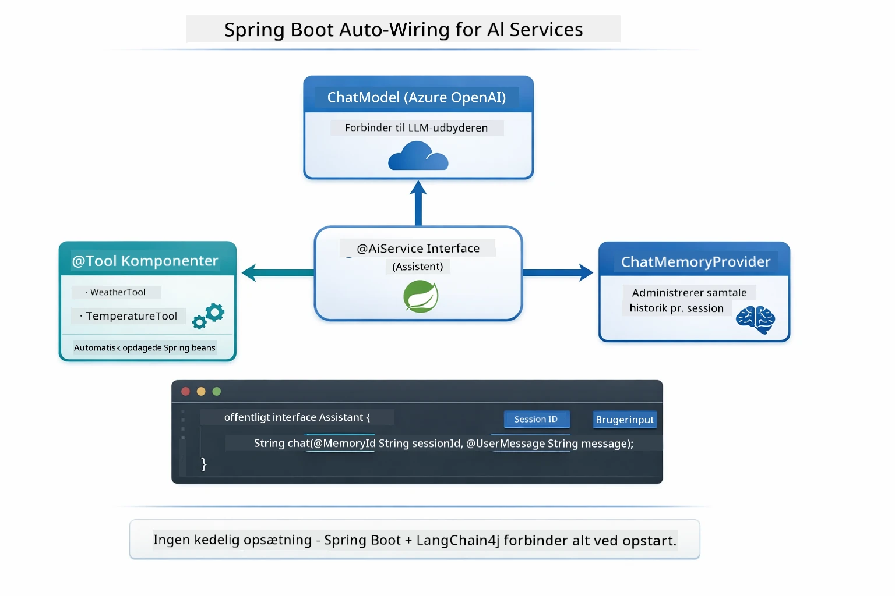

*@AiService-interfacet binder ChatModel, værktøjskomponenter og hukommelsesudbyder sammen — Spring Boot håndterer wiring automatisk.*

Nøglefordele ved denne tilgang:

- **Spring Boot automatisk wiring** — ChatModel og værktøjer injectes automatisk
- **@MemoryId mønster** — Automatisk sessionbaseret hukommelsesstyring
- **Enkelt instans** — Assistant oprettes én gang og genbruges for bedre ydeevne
- **Typesikker udførelse** — Java-metoder kaldes direkte med typekonvertering
- **Multi-turn orkestrering** — Håndterer værktøjskædning automatisk
- **Ingen boilerplate** — Ingen manuelle `AiServices.builder()`-kald eller hukommelses-HashMap

Alternative tilgange (manuel `AiServices.builder()`) kræver mere kode og mangler Spring Boot integrationsfordelene.

## Værktøjskædning

**Værktøjskædning** — Den sande styrke ved værktøjsbaserede agenter viser sig, når et enkelt spørgsmål kræver flere værktøjer. Spørg "Hvordan er vejret i Seattle i Fahrenheit?", og agenten kæder automatisk to værktøjer sammen: først kaldes `getCurrentWeather` for at få temperaturen i Celsius, derefter sendes denne værdi til `celsiusToFahrenheit` for konvertering — alt i én samtalerunde.

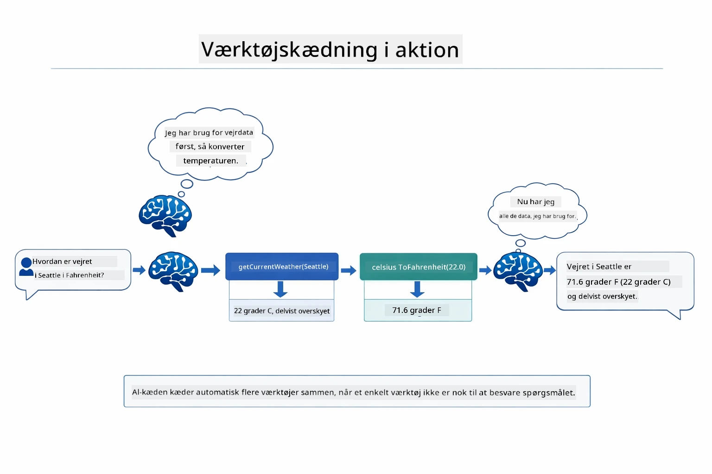

*Værktøjskædning i praksis — agenten kalder først getCurrentWeather, før Celsius-resultatet sendes videre til celsiusToFahrenheit, og leverer et samlet svar.*

**Elegant fejlbehandling** — Spørg om vejret i en by, der ikke findes i mock-dataene. Værktøjet returnerer en fejlmeddelelse, og AI forklarer, at det ikke kan hjælpe i stedet for at gå ned. Værktøjer fejler sikkert. Diagrammet nedenfor sammenligner de to tilgange — med korrekt fejlhåndtering fanger agenten undtagelsen og svarer hjælpsomt, mens hele applikationen går ned uden:

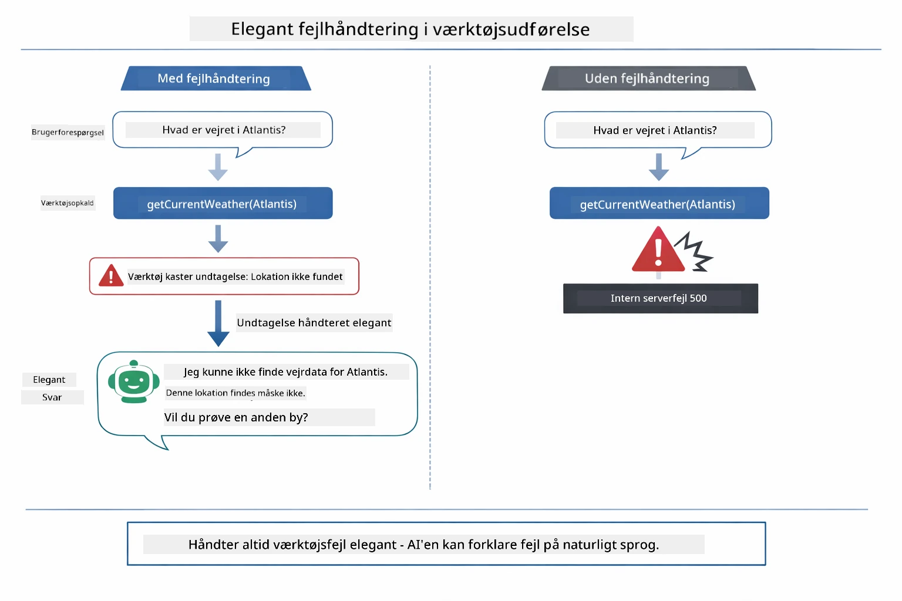

*Når et værktøj fejler, fanger agenten fejlen og svarer med en hjælpsom forklaring i stedet for at gå ned.*

Dette sker i én samtalerunde. Agenten orkestrerer flere værktøjskald autonomt.

## Kør applikationen

**Bekræft deployment:**

Sørg for, at `.env`-filen findes i rodmappen med Azure-legitimationsoplysninger (oprettet under Modul 01). Kør dette fra modulets mappe (`04-tools/`):

**Bash:**
```bash
cat ../.env  # Skal vise AZURE_OPENAI_ENDPOINT, API_KEY, DEPLOYMENT
```
  
**PowerShell:**
```powershell
Get-Content ..\.env  # Skal vise AZURE_OPENAI_ENDPOINT, API_KEY, DEPLOYMENT
```
  
**Start applikationen:**

> **Bemærk:** Hvis du allerede har startet alle applikationer via `./start-all.sh` fra rodmappen (som beskrevet i Modul 01), kører dette modul allerede på port 8084. Du kan springe startkommandoerne over nedenfor og gå direkte til http://localhost:8084.

**Mulighed 1: Brug Spring Boot Dashboard (Anbefalet til VS Code-brugere)**

Dev containeren inkluderer Spring Boot Dashboard-udvidelsen, som giver en visuel grænseflade til at administrere alle Spring Boot-applikationer. Du finder den i aktivitetsbjælken til venstre i VS Code (se efter Spring Boot-ikonet).

Fra Spring Boot Dashboard kan du:
- Se alle tilgængelige Spring Boot-applikationer i workspace’et
- Starte/stoppe applikationer med ét klik
- Se applikationslogfiler i realtid
- Overvåge applikationsstatus

Klik blot på play-knappen ud for "tools" for at starte dette modul, eller start alle moduler på én gang.

Sådan ser Spring Boot Dashboard ud i VS Code:


*Spring Boot Dashboard i VS Code — start, stop og overvåg alle moduler på ét sted*

**Mulighed 2: Brug shell-scripts**

Start alle webapplikationer (moduler 01-04):

**Bash:**
```bash
cd ..  # Fra rodkataloget
./start-all.sh
```
  
**PowerShell:**
```powershell
cd ..  # Fra rodmappe
.\start-all.ps1
```
  
Eller start kun dette modul:

**Bash:**
```bash
cd 04-tools
./start.sh
```
  
**PowerShell:**
```powershell
cd 04-tools
.\start.ps1
```
  
Begge scripts indlæser automatisk miljøvariabler fra rodens `.env`-fil og bygger JAR-filerne, hvis de ikke findes.

> **Bemærk:** Hvis du foretrækker at bygge alle moduler manuelt før start:
>
> **Bash:**
> ```bash
> cd ..  # Go to root directory
> mvn clean package -DskipTests
> ```
  
> **PowerShell:**
> ```powershell
> cd ..  # Go to root directory
> mvn clean package -DskipTests
> ```
  
Åbn http://localhost:8084 i din browser.

**For at stoppe:**

**Bash:**
```bash
./stop.sh  # Kun dette modul
# Eller
cd .. && ./stop-all.sh  # Alle moduler
```
  
**PowerShell:**
```powershell
.\stop.ps1  # Kun dette modul
# Eller
cd ..; .\stop-all.ps1  # Alle moduler
```
  
## Brug af applikationen

Applikationen giver en webgrænseflade, hvor du kan interagere med en AI-agent, som har adgang til værktøjer til vejr og temperaturkonvertering. Sådan ser grænsefladen ud — den indeholder hurtigstartseksempler og et chat-panel til at sende forespørgsler:
<a href="images/tools-homepage.png"></a>

*AI Agent Tools-grænsefladen - hurtige eksempler og chatgrænseflade til interaktion med værktøjer*

### Prøv Enkel Værktøjsbrug

Start med en simpel anmodning: "Konverter 100 grader Fahrenheit til Celsius". agenten genkender, at den har brug for temperaturkonverteringsværktøjet, kalder det med de rigtige parametre og returnerer resultatet. Bemærk, hvor naturligt det føles - du specificerede ikke hvilket værktøj, der skulle bruges, eller hvordan det skulle kaldes.

### Test Kædning af Værktøjer

Prøv nu noget mere komplekst: "Hvordan er vejret i Seattle og konverter det til Fahrenheit?" Se agenten arbejde sig igennem dette i trin. Den henter først vejret (som returnerer Celsius), genkender at det skal konverteres til Fahrenheit, kalder konverteringsværktøjet og kombinerer begge resultater til ét svar.

### Se Samtale Flow

Chatgrænsefladen bevarer samtalehistorikken, så du kan have interaktioner i flere runder. Du kan se alle tidligere forespørgsler og svar, hvilket gør det nemt at følge samtalen og forstå, hvordan agenten opbygger kontekst over flere udvekslinger.

<a href="images/tools-conversation-demo.png"></a>

*Samtale i flere runder, der viser simple konverteringer, vejropslag og kædning af værktøjer*

### Eksperimenter med Forskellige Forespørgsler

Prøv forskellige kombinationer:
- Vejropslag: "Hvordan er vejret i Tokyo?"
- Temperaturkonverteringer: "Hvad er 25°C i Kelvin?"
- Kombinerede forespørgsler: "Tjek vejret i Paris og fortæl mig, om det er over 20°C"

Bemærk, hvordan agenten tolker naturligt sprog og oversætter det til passende kald til værktøjer.

## Centrale Begreber

### ReAct Mønster (Resonering og Handling)

Agenten skifter mellem resonering (beslutte hvad der skal gøres) og handling (bruge værktøjer). Dette mønster muliggør autonom problemløsning i stedet for blot at reagere på instruktioner.

### Værktøjsbeskrivelser Betaler Sig

Kvaliteten af dine værktøjsbeskrivelser påvirker direkte, hvor godt agenten bruger dem. Klare, specifikke beskrivelser hjælper modellen med at forstå hvornår og hvordan hvert værktøj skal kaldes.

### Sessionsstyring

`@MemoryId`-annotationen muliggør automatisk sessionsbaseret hukommelsesstyring. Hver session-ID får sin egen `ChatMemory`-instans, der styres af `ChatMemoryProvider` bean, så flere brugere kan interagere med agenten samtidigt uden at deres samtaler blandes sammen. Følgende diagram viser, hvordan flere brugere rutes til isolerede hukommelseslagre baseret på deres session-ID'er:

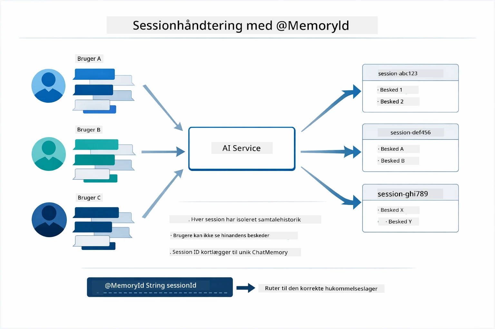

*Hver session-ID kortlægger til en isoleret samtalehistorik — brugerne ser aldrig hinandens beskeder.*

### Fejlhåndtering

Værktøjer kan fejle — API'er kan timeout, parametre kan være ugyldige, eksterne tjenester kan gå ned. Produktionsagenter har brug for fejlhåndtering, så modellen kan forklare problemer eller prøve alternativer i stedet for at få hele applikationen til at crashe. Når et værktøj kaster en undtagelse, fanger LangChain4j den og sender fejlmeddelelsen tilbage til modellen, som så kan forklare problemet i naturligt sprog.

## Tilgængelige Værktøjer

Diagrammet nedenfor viser det brede økosystem af værktøjer, du kan bygge. Dette modul demonstrerer vejr- og temperaturværktøjer, men det samme `@Tool`-mønster fungerer for enhver Java-metode — fra databaseforespørgsler til betalingsbehandling.

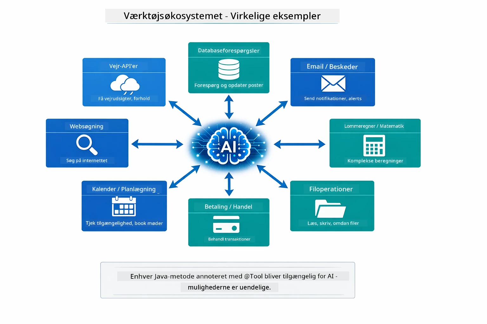

*Enhver Java-metode annoteret med @Tool bliver tilgængelig for AI — mønstret udvides til databaser, API’er, e-mail, filoperationer og mere.*

## Hvornår Skal Man Bruge Værktøjsbaserede Agenter

Ikke hver forespørgsel behøver værktøjer. Beslutningen handler om, hvorvidt AI'en skal interagere med eksterne systemer eller kan svare ud fra sin egen viden. Følgende guide opsummerer, hvornår værktøjer tilfører værdi, og hvornår de ikke er nødvendige:

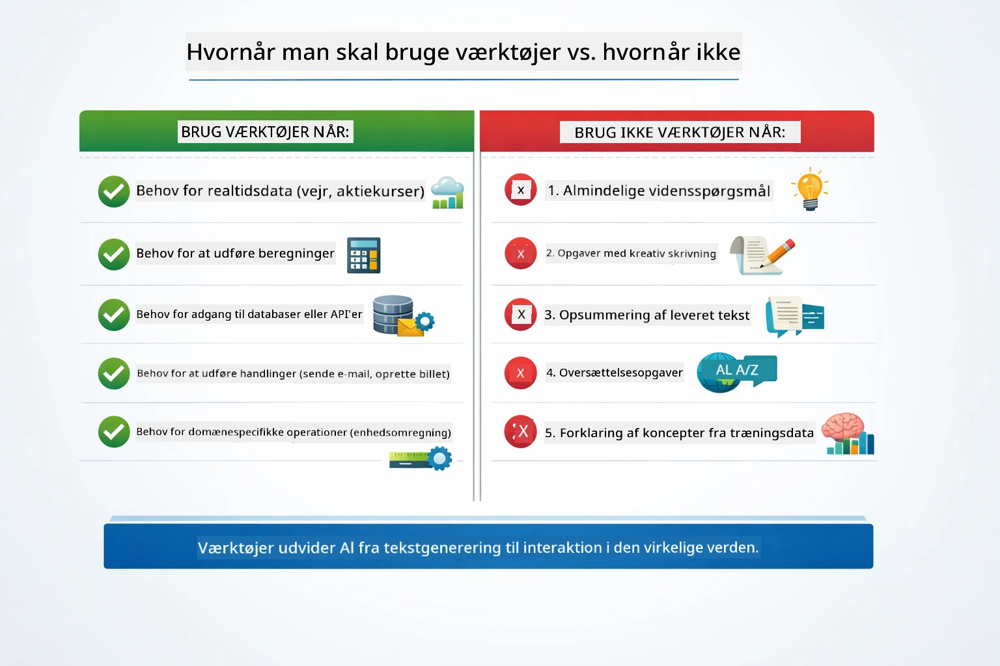

*En hurtig beslutningsguide — værktøjer er til realtidsdata, beregninger og handlinger; generel viden og kreative opgaver behøver dem ikke.*

## Værktøjer vs RAG

Modulerne 03 og 04 udvider begge, hvad AI kan gøre, men på fundamentalt forskellige måder. RAG giver modellen adgang til **viden** ved at hente dokumenter. Værktøjer giver modellen mulighed for at udføre **handlinger** ved at kalde funktioner. Diagrammet nedenfor sammenligner de to tilgange side om side — fra hvordan hver arbejdsgang fungerer til afvejningerne mellem dem:

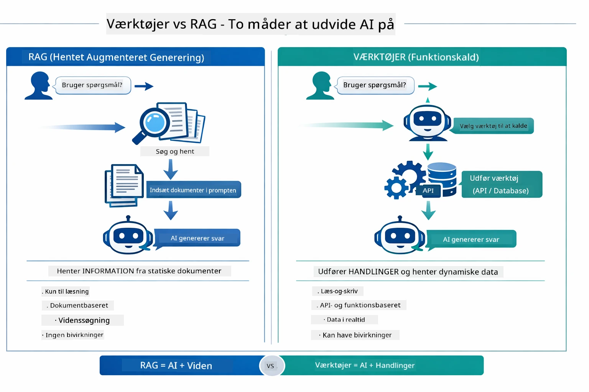

*RAG henter information fra statiske dokumenter — Værktøjer udfører handlinger og henter dynamiske, realtidsdata. Mange produktionssystemer kombinerer begge.*

I praksis kombinerer mange produktionssystemer begge tilgange: RAG til at forankre svar i din dokumentation, og Værktøjer til at hente live data eller udføre operationer.

## Næste Skridt

**Næste Modul:** [05-mcp - Model Context Protocol (MCP)](../05-mcp/README.md)

---

**Navigation:** [← Forrige: Modul 03 - RAG](../03-rag/README.md) | [Tilbage til hovedmenu](../README.md) | [Næste: Modul 05 - MCP →](../05-mcp/README.md)

---

<!-- CO-OP TRANSLATOR DISCLAIMER START -->
**Ansvarsfraskrivelse**:
Dette dokument er oversat ved hjælp af AI-oversættelsestjenesten [Co-op Translator](https://github.com/Azure/co-op-translator). Selvom vi bestræber os på nøjagtighed, skal du være opmærksom på, at automatiske oversættelser kan indeholde fejl eller unøjagtigheder. Det oprindelige dokument på dets oprindelige sprog bør betragtes som den autoritative kilde. For kritisk information anbefales professionel menneskelig oversættelse. Vi påtager os intet ansvar for misforståelser eller fejltolkninger, der opstår som følge af brugen af denne oversættelse.
<!-- CO-OP TRANSLATOR DISCLAIMER END -->