# Modul 05: Model Context Protocol (MCP)

## Indholdsfortegnelse

- [Hvad du vil lære](../../../05-mcp)
- [Hvad er MCP?](../../../05-mcp)
- [Hvordan MCP virker](../../../05-mcp)
- [Agentisk modulet](../../../05-mcp)
- [Køre eksemplerne](../../../05-mcp)
  - [Forudsætninger](../../../05-mcp)
- [Kom godt i gang](../../../05-mcp)
  - [Filoperationer (Stdio)](../../../05-mcp)
  - [Supervisor Agent](../../../05-mcp)
    - [Køre demoen](../../../05-mcp)
    - [Hvordan supervisoren virker](../../../05-mcp)
    - [Hvordan FileAgent opdager MCP-værktøjer ved runtime](../../../05-mcp)
    - [Responsstrategier](../../../05-mcp)
    - [Forstå outputtet](../../../05-mcp)
    - [Forklaring af agentiske modulfunktioner](../../../05-mcp)
- [Nøglebegreber](../../../05-mcp)
- [Tillykke!](../../../05-mcp)
  - [Hvad er næste skridt?](../../../05-mcp)

## Hvad du vil lære

Du har bygget samtale-AI, mestret prompts, forankret svar i dokumenter og skabt agenter med værktøjer. Men alle disse værktøjer var specialbygget til din specifikke applikation. Hvad hvis du kunne give din AI adgang til et standardiseret økosystem af værktøjer, som alle kan skabe og dele? I dette modul lærer du præcis det med Model Context Protocol (MCP) og LangChain4j’s agentiske modul. Vi viser først en simpel MCP-fil-læser og viser derefter, hvordan den nemt integreres i avancerede agentiske workflows ved brug af Supervisor Agent-mønsteret.

## Hvad er MCP?

Model Context Protocol (MCP) giver netop dette – en standard måde for AI-applikationer at opdage og bruge eksterne værktøjer. I stedet for at skrive tilpassede integrationer for hver datakilde eller service, forbinder du til MCP-servere, der eksponerer deres kapaciteter i et konsistent format. Din AI-agent kan så automatisk opdage og bruge disse værktøjer.

Diagrammet nedenfor viser forskellen — uden MCP kræver hver integration specialtilpasset punkt-til-punkt-forbindelse; med MCP forbinder én protokol din app til ethvert værktøj:


*Før MCP: Komplekse punkt-til-punkt-integrationer. Efter MCP: Én protokol, uendelige muligheder.*

MCP løser et grundlæggende problem i AI-udvikling: hver integration er skræddersyet. Vil du have adgang til GitHub? Specialkode. Vil du læse filer? Specialkode. Vil du spørge en database? Specialkode. Og ingen af disse integrationer virker med andre AI-applikationer.

MCP standardiserer dette. En MCP-server eksponerer værktøjer med klare beskrivelser og skemaer. Enhver MCP-klient kan forbinde, opdage tilgængelige værktøjer og bruge dem. Byg én gang, brug overalt.

Diagrammet nedenfor illustrerer denne arkitektur — en enkelt MCP-klient (din AI-applikation) forbinder til flere MCP-servere, som hver eksponerer deres egne værktøjer gennem den standardiserede protokol:


*Model Context Protocol arkitektur – standardiseret værktøjsopdagelse og eksekvering*

## Hvordan MCP virker

Under motorhjelmen bruger MCP en lagdelt arkitektur. Din Java-applikation (MCP-klienten) opdager tilgængelige værktøjer, sender JSON-RPC-forespørgsler gennem et transportlag (Stdio eller HTTP), og MCP-serveren eksekverer operationer og returnerer resultater. Følgende diagram opdeler hvert lag i denne protokol:

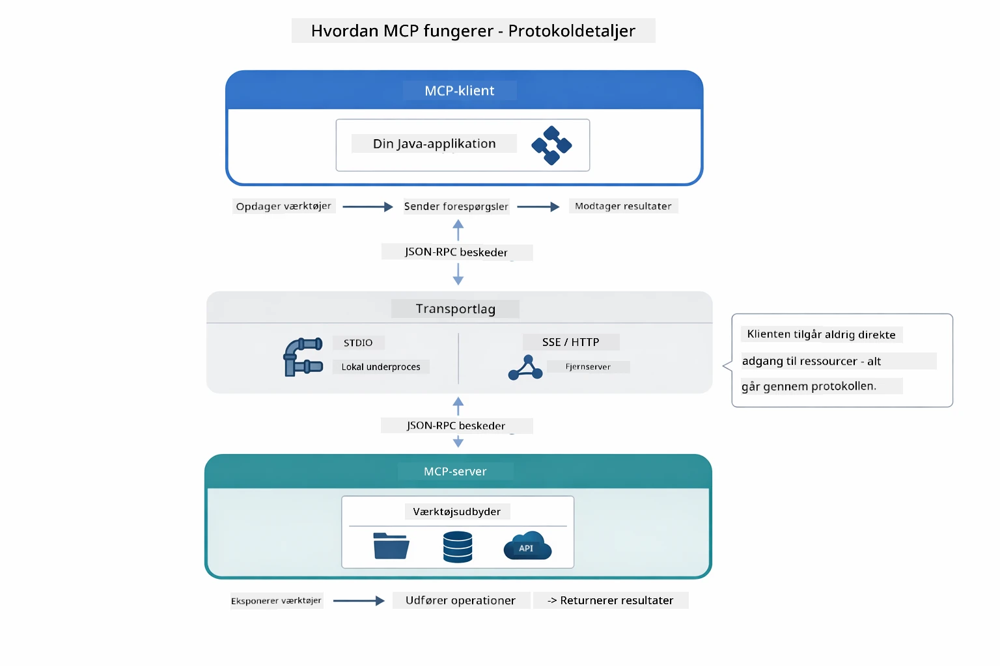

*Hvordan MCP virker under motorhjelmen — klienter opdager værktøjer, udveksler JSON-RPC-meddelelser og udfører operationer gennem et transportlag.*

**Server-Klient Arkitektur**

MCP bruger en klient-server model. Servere leverer værktøjer – læser filer, forespørger databaser, kalder APIs. Klienter (din AI-applikation) forbinder til servere og bruger deres værktøjer.

For at bruge MCP med LangChain4j, tilføj denne Maven-afhængighed:

```xml
<dependency>
    <groupId>dev.langchain4j</groupId>
    <artifactId>langchain4j-mcp</artifactId>
    <version>${langchain4j.version}</version>
</dependency>
```
  
**Værktøjsopdagelse**

Når din klient forbinder til en MCP-server, spørger den “Hvilke værktøjer har du?” Serveren svarer med en liste af tilgængelige værktøjer, hver med beskrivelser og parameter-skemaer. Din AI-agent kan så beslutte, hvilke værktøjer den skal bruge baseret på brugerforespørgsler. Diagrammet nedenfor viser denne håndtrykshandling – klienten sender en `tools/list`-forespørgsel, og serveren returnerer sine tilgængelige værktøjer med beskrivelser og skemaer:

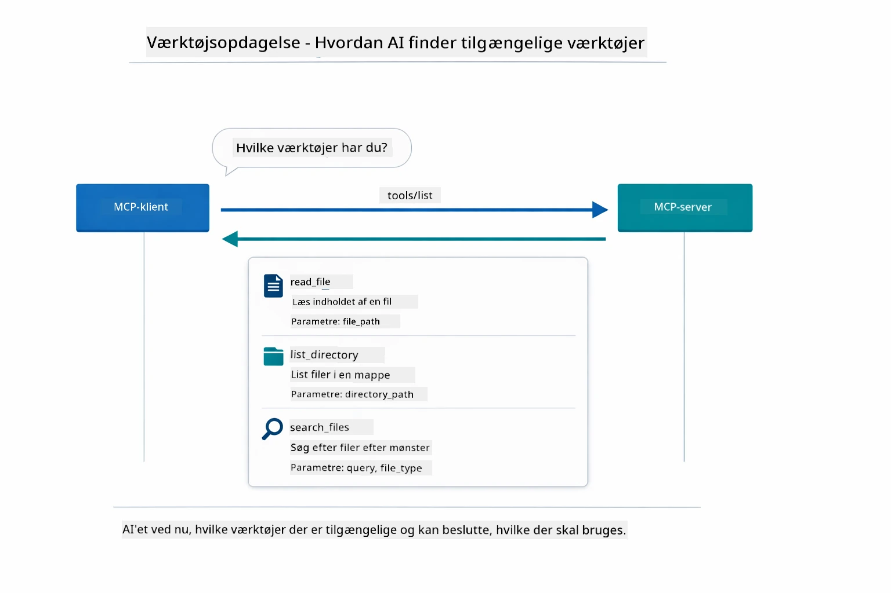

*AI’en opdager tilgængelige værktøjer ved opstart — den ved nu, hvilke kapaciteter der er tilgængelige, og kan vælge, hvilke den vil bruge.*

**Transportmekanismer**

MCP understøtter forskellige transportmekanismer. De to muligheder er Stdio (for lokal subprocess-kommunikation) og Streamable HTTP (for fjernservere). Dette modul demonstrerer Stdio-transporten:


*MCP transportmekanismer: HTTP for fjernservere, Stdio for lokale processer*

**Stdio** - [StdioTransportDemo.java](../../../05-mcp/src/main/java/com/example/langchain4j/mcp/StdioTransportDemo.java)

Til lokale processer. Din applikation starter en server som en subprocess og kommunikerer gennem standard input/output. Bruges til adgang til filsystemet eller kommandolinjeværktøjer.

```java
McpTransport stdioTransport = new StdioMcpTransport.Builder()
    .command(List.of(
        npmCmd, "exec",
        "@modelcontextprotocol/server-filesystem@2025.12.18",
        resourcesDir
    ))
    .logEvents(false)
    .build();
```
  
`@modelcontextprotocol/server-filesystem` serveren eksponerer følgende værktøjer, alle sandboxed til de angivne mapper:

| Værktøj | Beskrivelse |
|------|-------------|
| `read_file` | Læs indholdet af en enkelt fil |
| `read_multiple_files` | Læs flere filer i ét kald |
| `write_file` | Opret eller overskriv en fil |
| `edit_file` | Lav målrettede find-og-erstattelses-redigeringer |
| `list_directory` | List filer og mapper på en sti |
| `search_files` | Rekursivt søg efter filer der matcher et mønster |
| `get_file_info` | Hent metadata for en fil (størrelse, tidsstempler, rettigheder) |
| `create_directory` | Opret en mappe (inklusive overordnede mapper) |
| `move_file` | Flyt eller omdøb en fil eller mappe |

Følgende diagram viser hvordan Stdio-transport fungerer ved runtime — din Java-applikation starter MCP-serveren som en child process, og de kommunikerer via stdin/stdout-rør, uden netværk eller HTTP involveret:

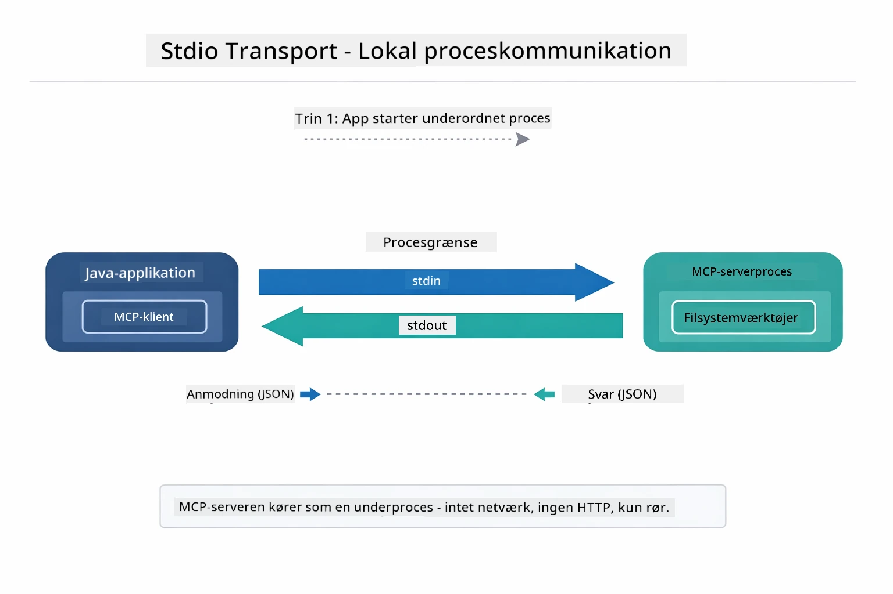

*Stdio-transport i funktion — din applikation starter MCP-serveren som en child process og kommunikerer via stdin/stdout-rør.*

> **🤖 Prøv med [GitHub Copilot](https://github.com/features/copilot) Chat:** Åbn [`StdioTransportDemo.java`](../../../05-mcp/src/main/java/com/example/langchain4j/mcp/StdioTransportDemo.java) og spørg:
> - "Hvordan virker Stdio-transport, og hvornår skal jeg bruge den vs HTTP?"
> - "Hvordan håndterer LangChain4j livscyklussen for startede MCP-serverprocesser?"
> - "Hvad er sikkerhedsimplikationerne ved at give AI adgang til filsystemet?"

## Agentisk modulet

Mens MCP leverer standardiserede værktøjer, giver LangChain4j’s **agentiske modul** en deklarativ måde at bygge agenter på, som orkestrerer disse værktøjer. `@Agent` annotationen og `AgenticServices` lader dig definere agentadfærd gennem interfaces i stedet for imperativ kode.

I dette modul udforsker du **Supervisor Agent**-mønstret – en avanceret agentisk AI-tilgang, hvor en "supervisor" agent dynamisk beslutter, hvilke sub-agenter der skal kaldes baseret på brugerforespørgsler. Vi kombinerer begge koncepter ved at give en af vores sub-agenter MCP-drevne filadgangsfunktioner.

For at bruge det agentiske modul, tilføj denne Maven-afhængighed:

```xml
<dependency>
    <groupId>dev.langchain4j</groupId>
    <artifactId>langchain4j-agentic</artifactId>
    <version>${langchain4j.mcp.version}</version>
</dependency>
```
> **Bemærk:** `langchain4j-agentic` modulet bruger en separat versionsejendom (`langchain4j.mcp.version`), fordi det udgives på en anden tidsplan end de centrale LangChain4j-biblioteker.

> **⚠️ Eksperimentelt:** `langchain4j-agentic` modulet er **eksperimentelt** og kan ændres. Den stabile måde at bygge AI-assistenter på er fortsat `langchain4j-core` med tilpassede værktøjer (Modul 04).

## Køre eksemplerne

### Forudsætninger

- Fuldført [Modul 04 - Værktøjer](../04-tools/README.md) (dette modul bygger videre på konceptet med tilpassede værktøjer og sammenligner dem med MCP-værktøjer)
- `.env` fil i rodkataloget med Azure legitimationsoplysninger (oprettet via `azd up` i Modul 01)
- Java 21+, Maven 3.9+
- Node.js 16+ og npm (til MCP-servere)

> **Bemærk:** Hvis du ikke har opsat dine miljøvariable endnu, se [Modul 01 - Introduktion](../01-introduction/README.md) for deploymentsinstruktioner (`azd up` opretter `.env` filen automatisk), eller kopier `.env.example` til `.env` i rodkataloget og udfyld dine værdier.

## Kom godt i gang

**Bruger du VS Code:** Højreklik blot på enhver demo-fil i Explorer og vælg **"Run Java"**, eller brug launch-konfigurationerne fra Run and Debug-panelet (sørg først for, at din `.env` fil er konfigureret med Azure-legitimationsoplysninger).

**Bruger du Maven:** Alternativt kan du køre fra kommandolinjen med eksemplerne nedenfor.

### Filoperationer (Stdio)

Dette demonstrerer lokale subprocess-baserede værktøjer.

**✅ Ingen forudsætninger nødvendige** – MCP-serveren startes automatisk.

**Brug af Start Scripts (anbefalet):**

Start-scripts loader automatisk miljøvariable fra roden `.env` fil:

**Bash:**
```bash
cd 05-mcp
chmod +x start-stdio.sh
./start-stdio.sh
```
  
**PowerShell:**
```powershell
cd 05-mcp
.\start-stdio.ps1
```
  
**Brug af VS Code:** Højreklik på `StdioTransportDemo.java` og vælg **"Run Java"** (sørg for, at din `.env` fil er konfigureret).

Applikationen starter en filsystem MCP-server automatisk og læser en lokal fil. Bemærk hvordan subprocesstyring håndteres for dig.

**Forventet output:**
```
Assistant response: The file provides an overview of LangChain4j, an open-source Java library
for integrating Large Language Models (LLMs) into Java applications...
```
  
### Supervisor Agent

**Supervisor Agent mønstret** er en **fleksibel** form for agentisk AI. En Supervisor bruger et LLM til autonomt at beslutte, hvilke agenter der skal kaldes baseret på brugerens anmodning. I det næste eksempel kombinerer vi MCP-drevet filadgang med en LLM-agent for at skabe en overvåget fil-læs → rapport workflow.

I demoen læser `FileAgent` en fil ved hjælp af MCP-filsystemværktøjer, og `ReportAgent` genererer en struktureret rapport med et executive summary (1 sætning), 3 nøglepunkter og anbefalinger. Supervisoren orkestrerer denne flow automatisk:

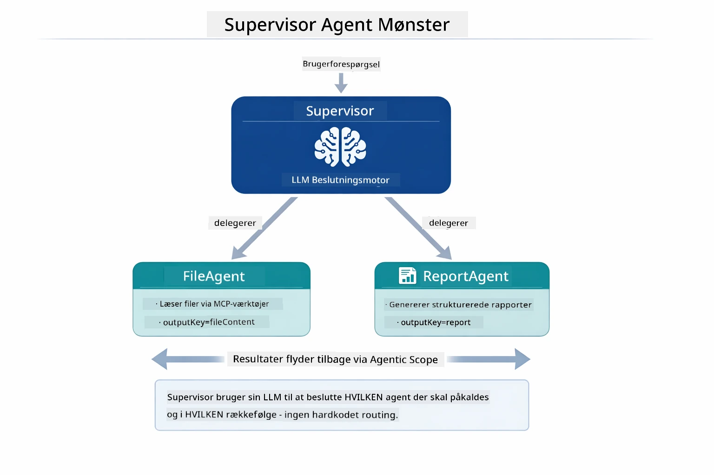

*Supervisoren bruger sin LLM til at beslutte, hvilke agenter der skal kaldes og i hvilken rækkefølge — ingen hardkodet routing nødvendig.*

Sådan ser det konkrete workflow ud for vores fil-til-rapport pipeline:

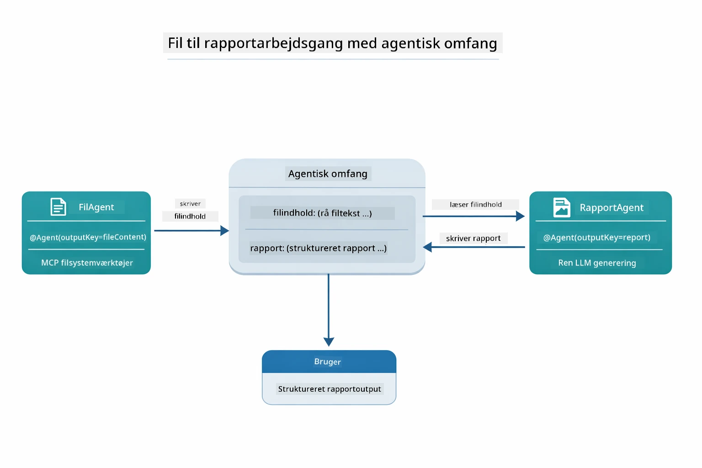

*FileAgent læser filen via MCP-værktøjer, og ReportAgent omdanner det rå indhold til en struktureret rapport.*

Følgende sekvensdiagram sporer den fulde Supervisor-orkestrering – fra opstart af MCP-serveren, gennem Supervisorens autonome agentvalg, til værktøjskald over stdio og den endelige rapport:

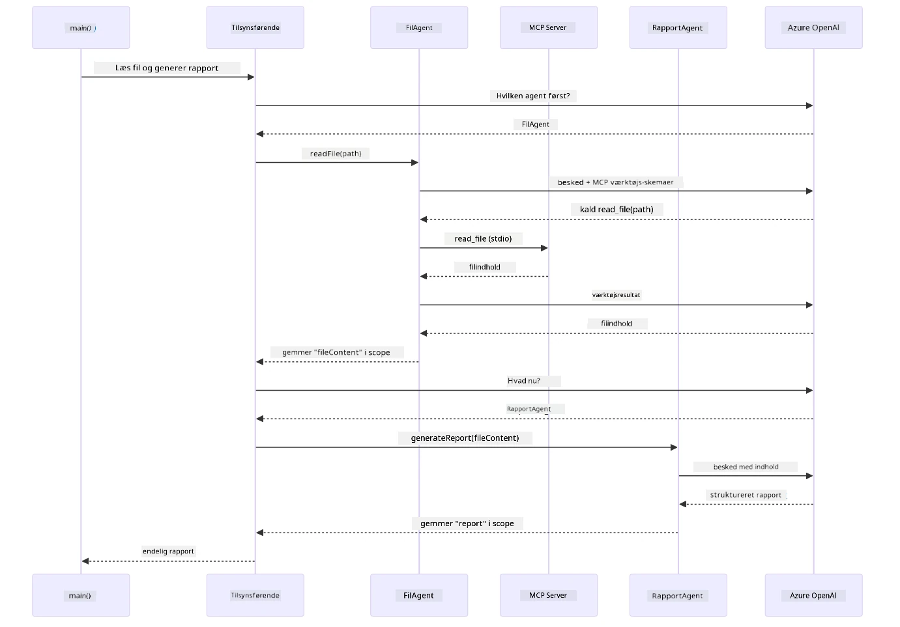

*Supervisoren kalder autonomt FileAgent (som kalder MCP-serveren over stdio for at læse filen), og kalder derefter ReportAgent for at generere en struktureret rapport — hver agent gemmer sit output i det delte Agentiske Scope.*

Hver agent gemmer sit output i **Agentic Scope** (delt hukommelse), hvilket tillader downstream-agenter at tilgå tidligere resultater. Dette demonstrerer, hvordan MCP-værktøjer sømløst integreres i agentiske workflows — Supervisoren behøver ikke vide *hvordan* filer læses, kun at `FileAgent` kan gøre det.

#### Køre demoen

Start-scripts loader automatisk miljøvariable fra roden `.env` fil:

**Bash:**
```bash
cd 05-mcp
chmod +x start-supervisor.sh
./start-supervisor.sh
```
  
**PowerShell:**
```powershell
cd 05-mcp
.\start-supervisor.ps1
```
  
**Brug af VS Code:** Højreklik på `SupervisorAgentDemo.java` og vælg **"Run Java"** (sørg for, at din `.env` fil er konfigureret).

#### Hvordan supervisoren virker

Før du bygger agenter, skal du forbinde MCP-transporten til en klient og pakke den som en `ToolProvider`. Sådan bliver MCP-serverens værktøjer tilgængelige for dine agenter:

```java
// Opret en MCP-klient fra transporten
McpClient mcpClient = new DefaultMcpClient.Builder()
        .transport(stdioTransport)
        .build();

// Wrap klienten som en ToolProvider — dette forbinder MCP-værktøjer til LangChain4j
ToolProvider mcpToolProvider = McpToolProvider.builder()
        .mcpClients(List.of(mcpClient))
        .build();
```
  
Nu kan du injicere `mcpToolProvider` i enhver agent, der har brug for MCP-værktøjer:

```java
// Trin 1: FileAgent læser filer ved hjælp af MCP-værktøjer
FileAgent fileAgent = AgenticServices.agentBuilder(FileAgent.class)
        .chatModel(model)
        .toolProvider(mcpToolProvider)  // Har MCP-værktøjer til filoperationer
        .build();

// Trin 2: ReportAgent genererer strukturerede rapporter
ReportAgent reportAgent = AgenticServices.agentBuilder(ReportAgent.class)
        .chatModel(model)
        .build();

// Supervisor koordinerer fil → rapport arbejdsgangen
SupervisorAgent supervisor = AgenticServices.supervisorBuilder()
        .chatModel(model)
        .subAgents(fileAgent, reportAgent)
        .responseStrategy(SupervisorResponseStrategy.LAST)  // Returner den endelige rapport
        .build();

// Supervisor beslutter, hvilke agenter der skal aktiveres baseret på anmodningen
String response = supervisor.invoke("Read the file at /path/file.txt and generate a report");
```
  
#### Hvordan FileAgent opdager MCP-værktøjer ved runtime

Du undrer dig måske: **hvordan ved `FileAgent`, hvordan den skal bruge npm filsystemværktøjer?** Svaret er, at det gør den ikke – det er **LLM’en**, der finder det ud af ved runtime igennem værktøjsskemaer.

`FileAgent` interfacet er blot en **promptdefinition**. Den har ikke hardkodet kendskab til `read_file`, `list_directory` eller andre MCP-værktøjer. Sådan foregår det end-to-end:
1. **Server opretter proces:** `StdioMcpTransport` starter `@modelcontextprotocol/server-filesystem` npm-pakken som en underordnet proces  
2. **Værktøjsopdagelse:** `McpClient` sender en `tools/list` JSON-RPC anmodning til serveren, som svarer med værktøjsnavne, beskrivelser og parameterskemaer (f.eks. `read_file` — *"Læs hele indholdet af en fil"* — `{ path: string }`)  
3. **Skemaindsprøjtning:** `McpToolProvider` indpakker disse opdagede skemaer og gør dem tilgængelige for LangChain4j  
4. **LLM beslutter:** Når `FileAgent.readFile(path)` kaldes, sender LangChain4j systembeskeden, brugerbeskeden, **og listen over værktøjsskemaer** til LLM’en. LLM’en læser værktøjsbeskrivelserne og genererer et værktøjskald (f.eks. `read_file(path="/some/file.txt")`)  
5. **Udførelse:** LangChain4j opfanger værktøjskaldet, ruter det gennem MCP-klienten tilbage til Node.js-underprocessen, modtager resultatet og fodrer det tilbage til LLM’en  

Dette er den samme [Tool Discovery](../../../05-mcp) mekanisme, som tidligere beskrevet, men anvendt specifikt på agentarbejdsgangen. `@SystemMessage` og `@UserMessage` annotationerne styrer LLM’ens adfærd, mens den injicerede `ToolProvider` giver den **kapaciteterne** — LLM’en forbinder de to under kørslen.

> **🤖 Prøv med [GitHub Copilot](https://github.com/features/copilot) Chat:** Åbn [`FileAgent.java`](../../../05-mcp/src/main/java/com/example/langchain4j/mcp/agents/FileAgent.java) og spørg:  
> - "Hvordan ved denne agent, hvilket MCP-værktøj den skal kalde?"  
> - "Hvad sker der, hvis jeg fjerner ToolProvider fra agentbyggeren?"  
> - "Hvordan bliver værktøjsskemaer sendt til LLM?"  

#### Responsstrategier

Når du konfigurerer en `SupervisorAgent`, angiver du, hvordan den skal formulere sit endelige svar til brugeren, efter sub-agenterne har fuldført deres opgaver. Diagrammet nedenfor viser de tre tilgængelige strategier — LAST returnerer det sidste agents output direkte, SUMMARY syntetiserer alle output via en LLM, og SCORED vælger den, der scorer bedst i forhold til den oprindelige forespørgsel:

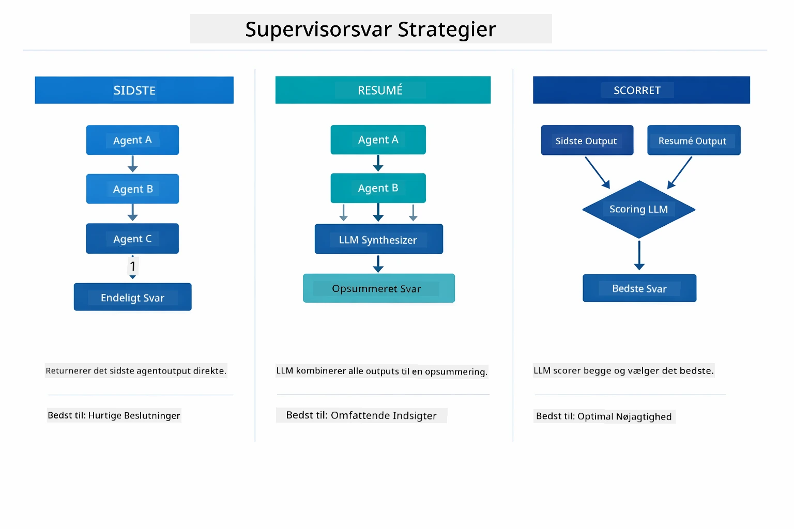

*Tre strategier for, hvordan Supervisor formulerer sit endelige svar — vælg baseret på om du vil have den sidste agents output, et syntetiseret sammendrag, eller den bedst scorende mulighed.*

De tilgængelige strategier er:

| Strategi | Beskrivelse |
|----------|-------------|
| **LAST** | Supervisoren returnerer output fra den sidste kaldte sub-agent eller værktøj. Dette er nyttigt, når den sidste agent i arbejdsgangen er specifikt designet til at producere det komplette, endelige svar (f.eks. en "Summary Agent" i en forskningspipeline). |
| **SUMMARY** | Supervisoren bruger sin egen interne Language Model (LLM) til at syntetisere et sammendrag af hele interaktionen og alle sub-agenters output, og returnerer derefter dette sammendrag som det endelige svar. Dette giver et rent, samlet svar til brugeren. |
| **SCORED** | Systemet bruger en intern LLM til at score både LAST-svaret og SUMMARY af interaktionen i forhold til den oprindelige brugerforespørgsel og returnerer det output, der får den højeste score. |

Se [SupervisorAgentDemo.java](../../../05-mcp/src/main/java/com/example/langchain4j/mcp/SupervisorAgentDemo.java) for den komplette implementering.

> **🤖 Prøv med [GitHub Copilot](https://github.com/features/copilot) Chat:** Åbn [`SupervisorAgentDemo.java`](../../../05-mcp/src/main/java/com/example/langchain4j/mcp/SupervisorAgentDemo.java) og spørg:  
> - "Hvordan beslutter Supervisoren, hvilke agenter den skal kalde?"  
> - "Hvad er forskellen mellem Supervisor- og Sekventielle arbejdsgangsmønstre?"  
> - "Hvordan kan jeg tilpasse Supervisors planlægningsadfærd?"  

#### Forstå outputtet

Når du kører demoen, vil du se en struktureret gennemgang af, hvordan Supervisor orkestrerer flere agenter. Her er hvad hver sektion betyder:

```
======================================================================
  FILE → REPORT WORKFLOW DEMO
======================================================================

This demo shows a clear 2-step workflow: read a file, then generate a report.
The Supervisor orchestrates the agents automatically based on the request.
```
  
**Headeren** introducerer arbejdsgangskonceptet: en fokuseret pipeline fra fil-læsning til rapportgenerering.

```
--- WORKFLOW ---------------------------------------------------------
  ┌─────────────┐      ┌──────────────┐
  │  FileAgent  │ ───▶ │ ReportAgent  │
  │ (MCP tools) │      │  (pure LLM)  │
  └─────────────┘      └──────────────┘
   outputKey:           outputKey:
   'fileContent'        'report'

--- AVAILABLE AGENTS -------------------------------------------------
  [FILE]   FileAgent   - Reads files via MCP → stores in 'fileContent'
  [REPORT] ReportAgent - Generates structured report → stores in 'report'
```
  
**Arbejdsgangsdiagrammet** viser dataflowet mellem agenter. Hver agent har en specifik rolle:  
- **FileAgent** læser filer via MCP-værktøjer og gemmer råindholdet i `fileContent`  
- **ReportAgent** bruger det indhold og producerer en struktureret rapport i `report`  

```
--- USER REQUEST -----------------------------------------------------
  "Read the file at .../file.txt and generate a report on its contents"
```
  
**Brugerforespørgslen** viser opgaven. Supervisoren parser den og beslutter at kalde FileAgent → ReportAgent.

```
--- SUPERVISOR ORCHESTRATION -----------------------------------------
  The Supervisor decides which agents to invoke and passes data between them...

  +-- STEP 1: Supervisor chose -> FileAgent (reading file via MCP)
  |
  |   Input: .../file.txt
  |
  |   Result: LangChain4j is an open-source, provider-agnostic Java framework for building LLM...
  +-- [OK] FileAgent (reading file via MCP) completed

  +-- STEP 2: Supervisor chose -> ReportAgent (generating structured report)
  |
  |   Input: LangChain4j is an open-source, provider-agnostic Java framew...
  |
  |   Result: Executive Summary...
  +-- [OK] ReportAgent (generating structured report) completed
```
  
**Supervisor orkestrering** viser 2-trins flowet i praksis:  
1. **FileAgent** læser filen via MCP og gemmer indholdet  
2. **ReportAgent** modtager indholdet og genererer en struktureret rapport  

Supervisoren tog disse beslutninger **autonomt** baseret på brugerens forespørgsel.

```
--- FINAL RESPONSE ---------------------------------------------------
Executive Summary
...

Key Points
...

Recommendations
...

--- AGENTIC SCOPE (Data Flow) ----------------------------------------
  Each agent stores its output for downstream agents to consume:
  * fileContent: LangChain4j is an open-source, provider-agnostic Java framework...
  * report: Executive Summary...
```
  
#### Forklaring af Agentic Module-funktioner

Eksemplet demonstrerer flere avancerede funktioner af agentic-modulet. Lad os se nærmere på Agentic Scope og Agent Listeners.

**Agentic Scope** viser den delte hukommelse, hvor agenter gemte deres resultater ved hjælp af `@Agent(outputKey="...")`. Dette gør det muligt for:  
- Senere agenter at tilgå tidligere agenters output  
- Supervisor at syntetisere et endeligt svar  
- Dig at inspicere, hvad hver agent producerede  

Diagrammet nedenfor viser, hvordan Agentic Scope fungerer som delt hukommelse i fil-til-rapport arbejdsgangen — FileAgent skriver sit output under nøgle `fileContent`, ReportAgent læser det og skriver sit eget output under `report`:

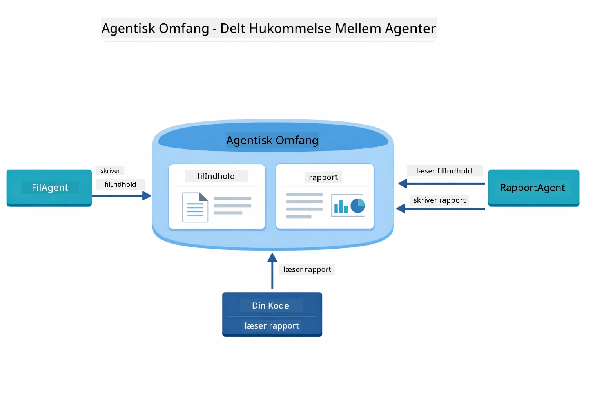

*Agentic Scope fungerer som delt hukommelse — FileAgent skriver `fileContent`, ReportAgent læser det og skriver `report`, og din kode læser det endelige resultat.*

```java
ResultWithAgenticScope<String> result = supervisor.invokeWithAgenticScope(request);
AgenticScope scope = result.agenticScope();
String fileContent = scope.readState("fileContent");  // Rå fildata fra FileAgent
String report = scope.readState("report");            // Struktureret rapport fra ReportAgent
```
  
**Agent Listeners** muliggør overvågning og debugging af agentudførelse. Den trin-for-trin output, du ser i demoen, kommer fra en AgentListener, der kobler sig på hver agentkald:  
- **beforeAgentInvocation** - Kaldes når Supervisor vælger en agent, så du kan se hvilken agent der blev valgt og hvorfor  
- **afterAgentInvocation** - Kaldes når en agent fuldfører, og viser dets resultat  
- **inheritedBySubagents** - Når sand, overvåger lytteren alle agenter i hierarkiet  

Følgende diagram viser hele Agent Listener livscyklussen, inklusive hvordan `onError` håndterer fejl under agentudførelse:

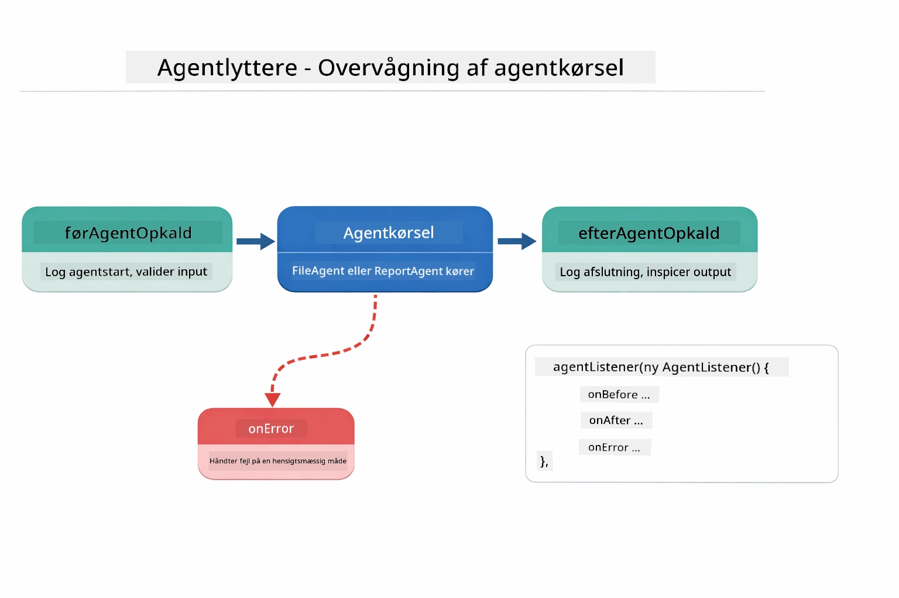

*Agent Listeners kobler sig til udførelseslivscyklussen — overvåg når agenter starter, fuldfører eller møder fejl.*

```java
AgentListener monitor = new AgentListener() {
    private int step = 0;
    
    @Override
    public void beforeAgentInvocation(AgentRequest request) {
        step++;
        System.out.println("  +-- STEP " + step + ": " + request.agentName());
    }
    
    @Override
    public void afterAgentInvocation(AgentResponse response) {
        System.out.println("  +-- [OK] " + response.agentName() + " completed");
    }
    
    @Override
    public boolean inheritedBySubagents() {
        return true; // Propager til alle underagenter
    }
};
```
  
Ud over Supervisor-mønsteret tilbyder `langchain4j-agentic` modulet flere kraftfulde arbejdsgangsmønstre. Diagrammet nedenfor viser alle fem — fra simple sekventielle pipelines til human-in-the-loop godkendelsesarbejdsgange:

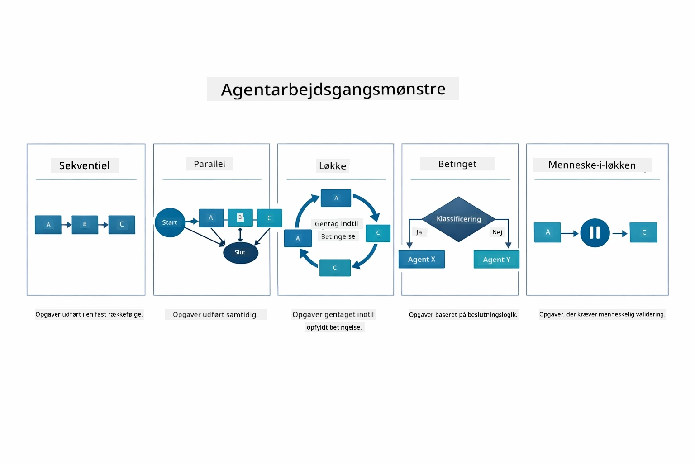

*Fem arbejdsgangsmønstre til at orkestrere agenter — fra simple sekventielle pipelines til godkendelsesarbejdsgange med menneskelig indblanding.*

| Mønster | Beskrivelse | Anvendelse |
|---------|-------------|------------|
| **Sekventiel** | Udfør agenter i rækkefølge, output flyder til næste | Pipelines: forskning → analyse → rapport |
| **Parallelt** | Kør agenter samtidigt | Uafhængige opgaver: vejr + nyheder + aktier |
| **Loop** | Gentag indtil betingelse opfyldt | Kvalitetsscore: forfin indtil score ≥ 0.8 |
| **Betinget** | Ruter baseret på betingelser | Klassificer → rute til specialistagent |
| **Human-in-the-Loop** | Tilføj menneskelige kontrolpunkter | Godkendelsesarbejdsgange, indholdsrevision |

## Nøglebegreber

Nu hvor du har udforsket MCP og agentic-modulet i praksis, opsummerer vi, hvornår du skal bruge hver tilgang.

En af MCP’s største fordele er det voksende økosystem. Diagrammet nedenfor viser, hvordan en enkelt universel protokol forbinder din AI-applikation til en bred vifte af MCP-servere — fra filsystem- og databaseadgang til GitHub, e-mail, web scraping og mere:

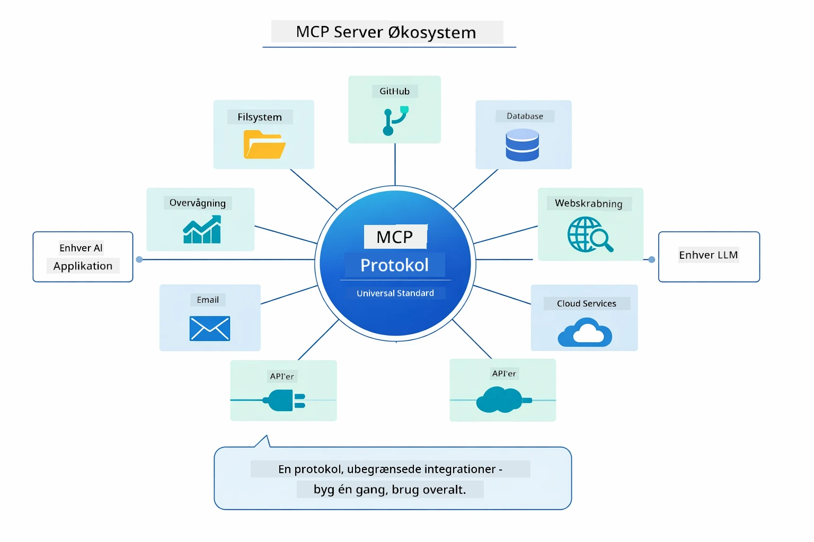

*MCP skaber et universelt protokoløkosystem — enhver MCP-kompatibel server virker med enhver MCP-kompatibel klient, hvilket muliggør deling af værktøjer på tværs af applikationer.*

**MCP** er ideelt, når du vil udnytte eksisterende værktøjsøkosystemer, bygge værktøjer som flere applikationer kan dele, integrere tredjepartstjenester med standardprotokoller, eller udskifte værktøjsimplementeringer uden at ændre kode.

**Agentic-modulet** fungerer bedst, når du ønsker deklarative agentdefinitioner med `@Agent` annotationer, har brug for orkestrering af arbejdsgange (sekventiel, loop, parallelt), foretrækker interface-baseret agentdesign fremfor imperativ kode, eller kombinerer flere agenter, der deler output via `outputKey`.

**Supervisor Agent-mønsteret** er stærkt, når arbejdsgangen ikke kan forudses, og du vil lade LLM’en beslutte, når du har flere specialiserede agenter, der har brug for dynamisk orkestrering, når du bygger konversationssystemer, der ruter til forskellige kapaciteter, eller når du ønsker den mest fleksible, adaptive agentadfærd.

For at hjælpe dig med at vælge mellem de brugerdefinerede `@Tool` metoder fra Modul 04 og MCP-værktøjer fra dette modul, fremhæver følgende sammenligning de vigtigste afvejninger — brugerdefinerede værktøjer giver tæt kobling og fuld typesikkerhed til app-specifik logik, mens MCP-værktøjer tilbyder standardiserede, genanvendelige integrationer:

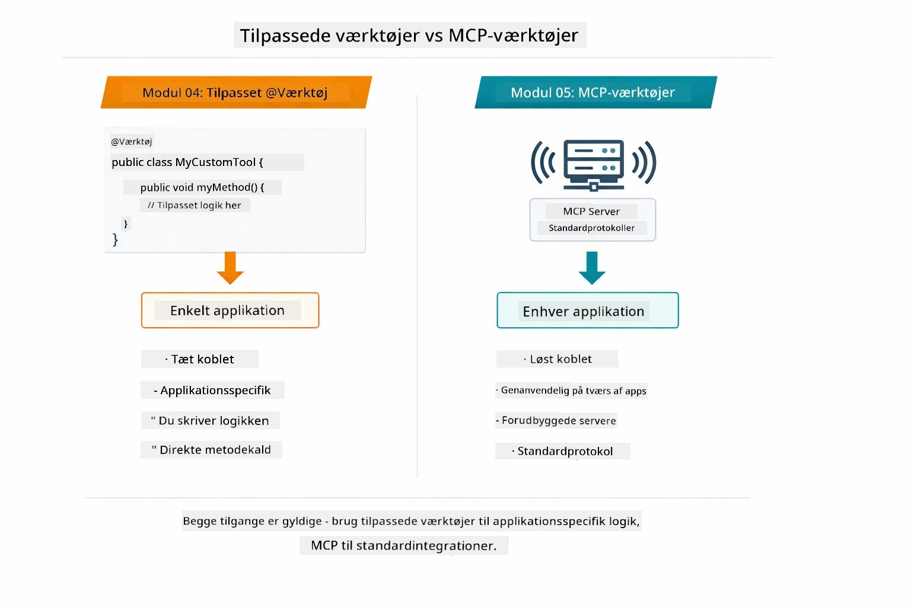

*Hvornår du skal bruge brugerdefinerede @Tool-metoder vs MCP-værktøjer — brugerdefinerede til app-specifik logik med fuld typesikkerhed, MCP-værktøjer til standardiserede integrationer, der virker på tværs af applikationer.*

## Tillykke!

Du har gennemført alle fem moduler i LangChain4j for Beginners kurset! Her er et overblik over hele læringsrejsen, du har gennemført — fra basal chat helt til MCP-drevne agentic systemer:

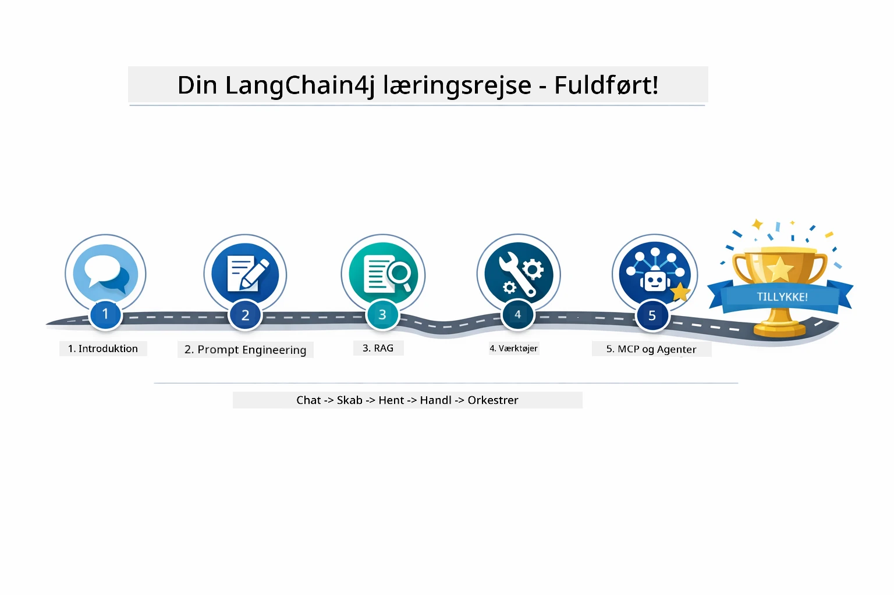

*Din læringsrejse gennem alle fem moduler — fra basal chat til MCP-drevne agentic systemer.*

Du har gennemført LangChain4j for Beginners kurset. Du har lært:

- Hvordan man bygger konverserende AI med hukommelse (Modul 01)  
- Prompt engineering mønstre til forskellige opgaver (Modul 02)  
- At forankre svar i dine dokumenter med RAG (Modul 03)  
- At skabe grundlæggende AI-agenter (assistenter) med brugerdefinerede værktøjer (Modul 04)  
- At integrere standardiserede værktøjer med LangChain4j MCP og Agentic moduler (Modul 05)  

### Hvad nu?

Efter at have gennemført modulerne, kan du udforske [Testing Guide](../docs/TESTING.md) for at se LangChain4j testkoncepter i praksis.

**Officielle ressourcer:**  
- [LangChain4j Dokumentation](https://docs.langchain4j.dev/) - Omfattende guider og API-reference  
- [LangChain4j GitHub](https://github.com/langchain4j/langchain4j) - Kildekode og eksempler  
- [LangChain4j Tutorials](https://docs.langchain4j.dev/tutorials/) - Trin-for-trin tutorials til forskellige anvendelsestilfælde  

Tak fordi du gennemførte dette kursus!

---

**Navigation:** [← Forrige: Modul 04 - Værktøjer](../04-tools/README.md) | [Tilbage til forsiden](../README.md)

---

<!-- CO-OP TRANSLATOR DISCLAIMER START -->
**Ansvarsfraskrivelse**:
Dette dokument er blevet oversat ved hjælp af AI-oversættelsestjenesten [Co-op Translator](https://github.com/Azure/co-op-translator). Selvom vi stræber efter nøjagtighed, bedes du være opmærksom på, at automatiserede oversættelser kan indeholde fejl eller unøjagtigheder. Det oprindelige dokument på dets oprindelige sprog bør betragtes som den autoritative kilde. For kritisk information anbefales professionel menneskelig oversættelse. Vi påtager os intet ansvar for eventuelle misforståelser eller fejltolkninger, der opstår som følge af brugen af denne oversættelse.
<!-- CO-OP TRANSLATOR DISCLAIMER END -->