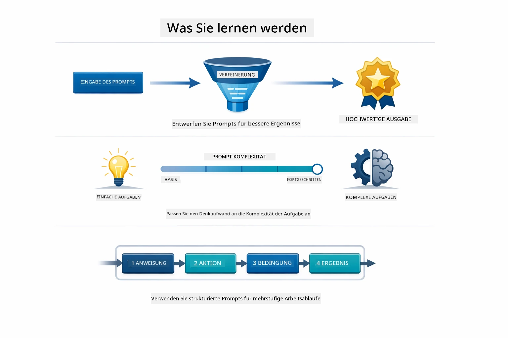
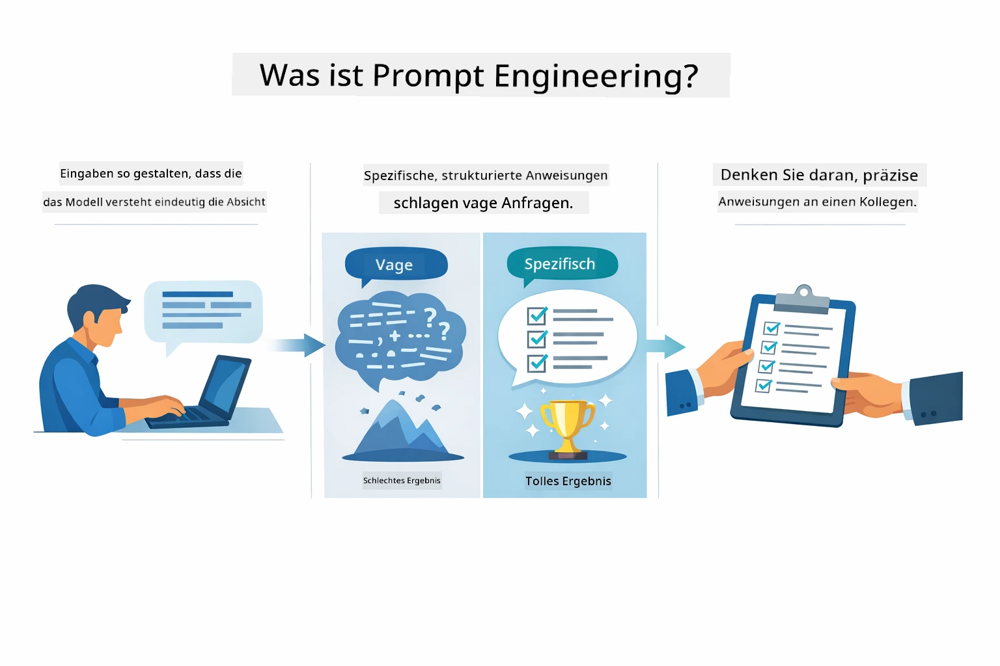
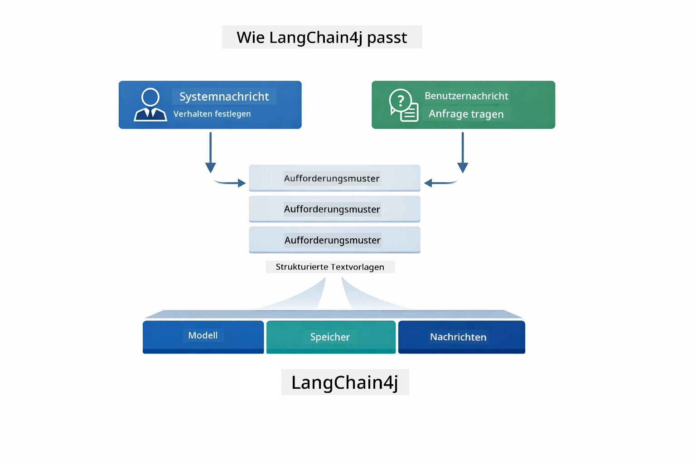
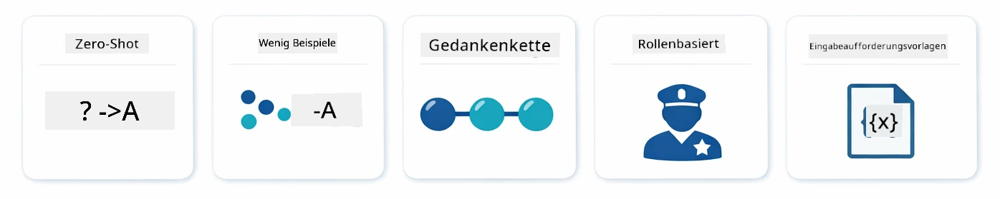
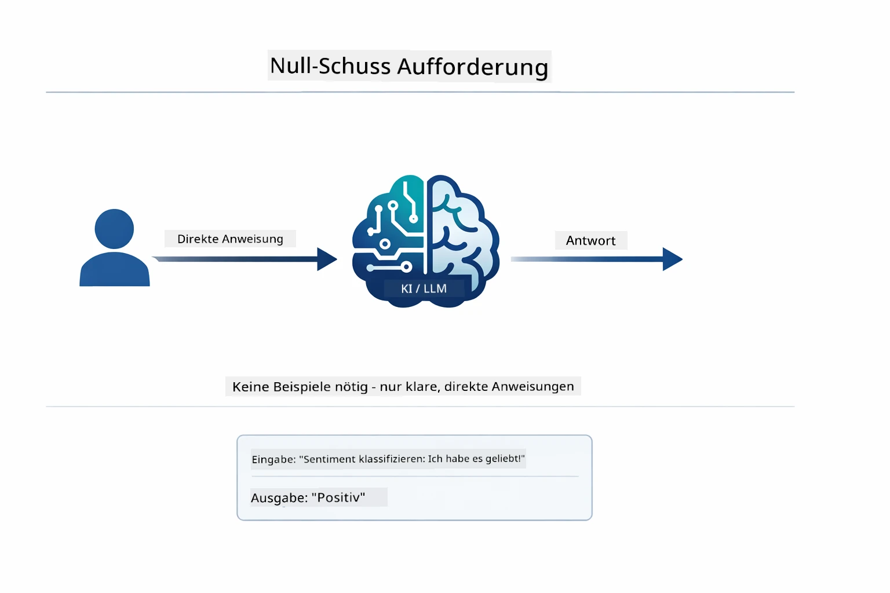
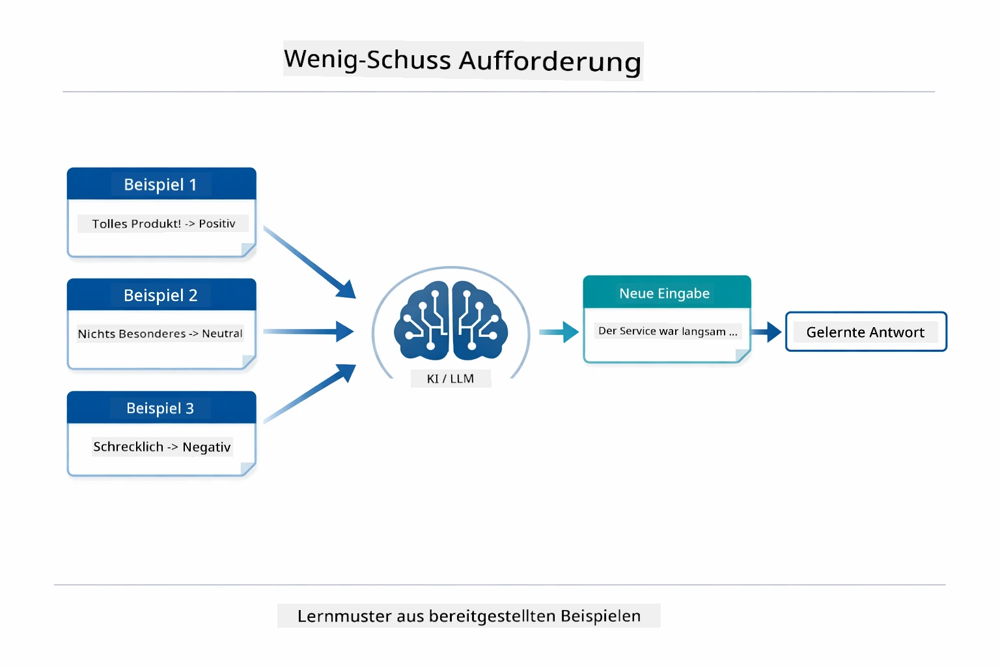
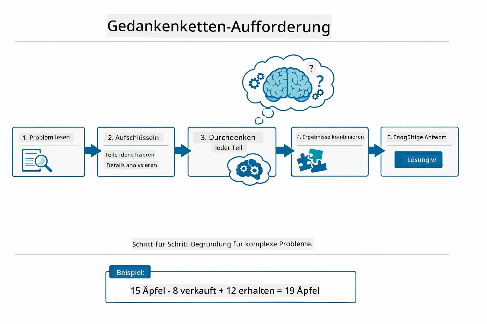
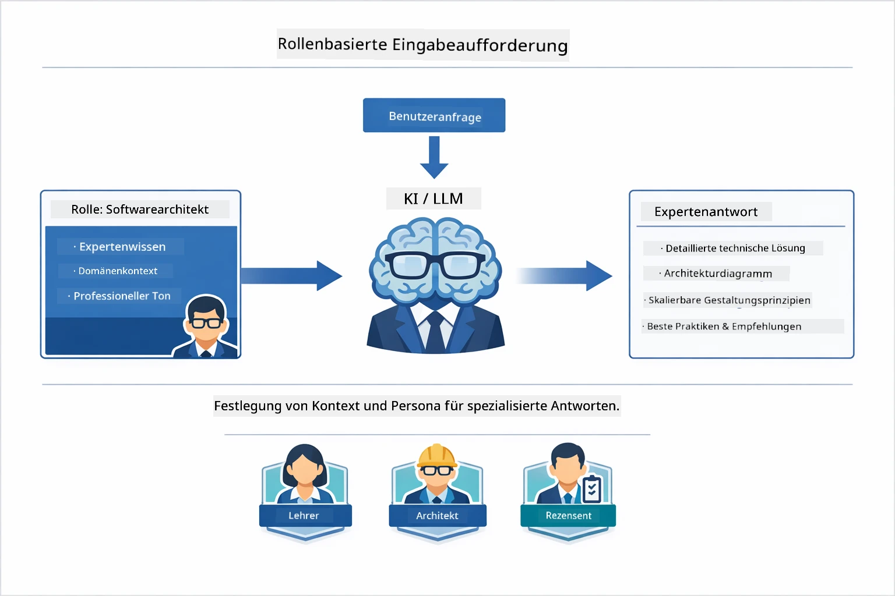
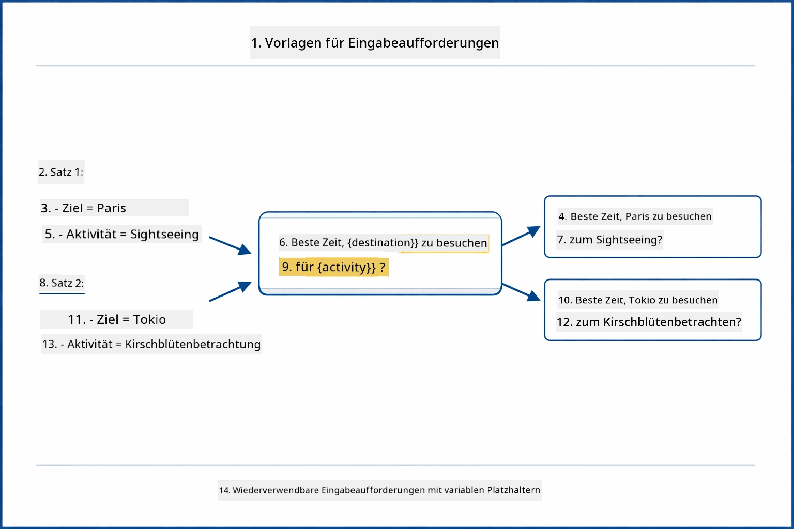
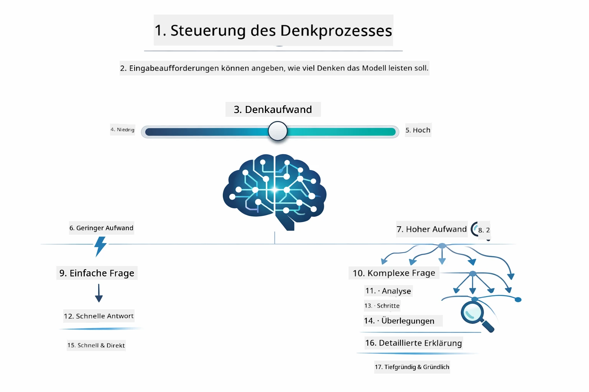

# Modul 02: Prompt Engineering mit GPT-5.2

## Inhaltsverzeichnis

- [Was Sie lernen werden](../../../02-prompt-engineering)
- [Voraussetzungen](../../../02-prompt-engineering)
- [Verständnis von Prompt Engineering](../../../02-prompt-engineering)
- [Grundlagen des Prompt Engineerings](../../../02-prompt-engineering)
  - [Zero-Shot Prompting](../../../02-prompt-engineering)
  - [Few-Shot Prompting](../../../02-prompt-engineering)
  - [Chain of Thought](../../../02-prompt-engineering)
  - [Role-Based Prompting](../../../02-prompt-engineering)
  - [Prompt Templates](../../../02-prompt-engineering)
- [Erweiterte Muster](../../../02-prompt-engineering)
- [Verwendung bestehender Azure-Ressourcen](../../../02-prompt-engineering)
- [Anwendungs-Screenshots](../../../02-prompt-engineering)
- [Erkundung der Muster](../../../02-prompt-engineering)
  - [Niedrige vs hohe Eifer](../../../02-prompt-engineering)
  - [Aufgabenausführung (Tool-Preambles)](../../../02-prompt-engineering)
  - [Selbstreflektierender Code](../../../02-prompt-engineering)
  - [Strukturierte Analyse](../../../02-prompt-engineering)
  - [Multi-Turn Chat](../../../02-prompt-engineering)
  - [Schritt-für-Schritt-Argumentation](../../../02-prompt-engineering)
  - [Eingeschränkte Ausgabe](../../../02-prompt-engineering)
- [Was Sie wirklich lernen](../../../02-prompt-engineering)
- [Nächste Schritte](../../../02-prompt-engineering)

## Was Sie lernen werden



Im vorherigen Modul haben Sie gesehen, wie Speicher konversationelle KI ermöglicht, und GitHub-Modelle für grundlegende Interaktionen verwendet. Jetzt konzentrieren wir uns darauf, wie Sie Fragen stellen – also die Prompts selbst – mit Azure OpenAI’s GPT-5.2. Die Art und Weise, wie Sie Ihre Prompts strukturieren, wirkt sich dramatisch auf die Qualität der Antworten aus, die Sie erhalten. Wir beginnen mit einer Übersicht der grundlegenden Prompting-Techniken und gehen dann auf acht fortgeschrittene Muster ein, die die Fähigkeiten von GPT-5.2 voll ausnutzen.

Wir verwenden GPT-5.2, weil es eine Steuerung der Argumentation einführt – Sie können dem Modell sagen, wie viel Nachdenken es vor der Antwort leisten soll. Das macht verschiedene Prompting-Strategien transparenter und hilft Ihnen zu verstehen, wann Sie welche Methode einsetzen sollten. Außerdem profitieren wir von den geringeren Ratenlimits von Azure für GPT-5.2 im Vergleich zu GitHub-Modellen.

## Voraussetzungen

- Abgeschlossenes Modul 01 (Azure OpenAI-Ressourcen bereitgestellt)
- `.env` Datei im Stammverzeichnis mit Azure-Zugangsdaten (erstellt durch `azd up` im Modul 01)

> **Hinweis:** Wenn Sie Modul 01 noch nicht abgeschlossen haben, folgen Sie dort zuerst den Bereitstellungsanweisungen.

## Verständnis von Prompt Engineering



Prompt Engineering bedeutet, Eingabetext so zu gestalten, dass Sie beständig die gewünschten Ergebnisse erhalten. Es geht nicht nur darum, Fragen zu stellen – es geht darum, Anfragen so zu strukturieren, dass das Modell genau versteht, was Sie wollen und wie es geliefert werden soll.

Denken Sie daran wie daran, einem Kollegen Anweisungen zu geben. „Behebe den Fehler“ ist vage. „Behebe die Nullzeiger-Ausnahme in UserService.java Zeile 45 durch Hinzufügen einer null-Prüfung“ ist spezifisch. Sprachmodelle funktionieren genau so – Spezifität und Struktur sind entscheidend.



LangChain4j stellt die Infrastruktur bereit – Modellverbindungen, Speicher und Nachrichtentypen – während Prompt-Muster nur sorgfältig strukturierter Text sind, den Sie durch diese Infrastruktur schicken. Die Schlüsselbausteine sind `SystemMessage` (das Verhalten und die Rolle der KI festlegt) und `UserMessage` (das Ihre tatsächliche Anfrage transportiert).

## Grundlagen des Prompt Engineerings



Bevor wir in diesem Modul in die fortgeschrittenen Muster eintauchen, lassen Sie uns fünf grundlegende Prompting-Techniken wiederholen. Diese sind die Bausteine, die jeder Prompt Engineer kennen sollte. Wenn Sie das [Quick Start Modul](../00-quick-start/README.md#2-prompt-patterns) bereits durchgearbeitet haben, kennen Sie diese Muster in der Praxis – hier ist der konzeptuelle Rahmen dahinter.

### Zero-Shot Prompting

Der einfachste Ansatz: Geben Sie dem Modell eine direkte Anweisung ohne Beispiele. Das Modell stützt sich vollständig auf sein Training, um die Aufgabe zu verstehen und auszuführen. Dies funktioniert gut bei unkomplizierten Anfragen, bei denen das erwartete Verhalten offensichtlich ist.



*Direkte Anweisung ohne Beispiele – das Modell leitet die Aufgabe nur aus der Anweisung ab*

```java
String prompt = "Classify this sentiment: 'I absolutely loved the movie!'";
String response = model.chat(prompt);
// Antwort: "Positiv"
```

**Wann verwenden:** Einfache Klassifizierungen, direkte Fragen, Übersetzungen oder jede Aufgabe, die das Modell ohne zusätzliche Anleitung bewältigen kann.

### Few-Shot Prompting

Geben Sie Beispiele an, die zeigen, welchen Mustern das Modell folgen soll. Das Modell lernt aus Ihren Beispielen das erwartete Ein- und Ausgabeformat und wendet es auf neue Eingaben an. Dies verbessert die Konsistenz dramatisch bei Aufgaben, bei denen das gewünschte Format oder Verhalten nicht offensichtlich ist.



*Lernen aus Beispielen – das Modell erkennt das Muster und wendet es auf neue Eingaben an*

```java
String prompt = """
    Classify the sentiment as positive, negative, or neutral.
    
    Examples:
    Text: "This product exceeded my expectations!" → Positive
    Text: "It's okay, nothing special." → Neutral
    Text: "Waste of money, very disappointed." → Negative
    
    Now classify this:
    Text: "Best purchase I've made all year!"
    """;
String response = model.chat(prompt);
```

**Wann verwenden:** Benutzerdefinierte Klassifizierungen, konsistente Formatierung, domänenspezifische Aufgaben oder wenn Zero-Shot-Ergebnisse inkonsistent sind.

### Chain of Thought

Fordern Sie das Modell auf, seine Argumentation schrittweise zu zeigen. Statt direkt zur Antwort zu springen, zerlegt das Modell das Problem und arbeitet jeden Teil explizit durch. Dies verbessert die Genauigkeit bei Mathematik, Logik und mehrstufigen Argumentationsaufgaben.



*Schritt-für-Schritt-Argumentation – komplexe Probleme in explizite logische Schritte zerlegen*

```java
String prompt = """
    Problem: A store has 15 apples. They sell 8 apples and then 
    receive a shipment of 12 more apples. How many apples do they have now?
    
    Let's solve this step-by-step:
    """;
String response = model.chat(prompt);
// Das Modell zeigt: 15 - 8 = 7, dann 7 + 12 = 19 Äpfel
```

**Wann verwenden:** Mathematische Probleme, Logikrätsel, Debugging oder jede Aufgabe, bei der das Anzeigen des Argumentationsprozesses die Genauigkeit und das Vertrauen verbessert.

### Role-Based Prompting

Geben Sie der KI vor dem Stellen Ihrer Frage eine Persona oder Rolle vor. Dies schafft einen Kontext, der Ton, Tiefe und Fokus der Antwort prägt. Ein „Softwarearchitekt“ gibt andere Ratschläge als ein „Junior-Entwickler“ oder ein „Sicherheitsauditor“.



*Kontext und Persona festlegen – dieselbe Frage erhält je nach zugewiesener Rolle eine andere Antwort*

```java
String prompt = """
    You are an experienced software architect reviewing code.
    Provide a brief code review for this function:
    
    def calculate_total(items):
        total = 0
        for item in items:
            total = total + item['price']
        return total
    """;
String response = model.chat(prompt);
```

**Wann verwenden:** Code-Reviews, Nachhilfe, domänenspezifische Analysen oder wenn Sie Antworten brauchen, die auf ein bestimmtes Fachwissen oder eine Perspektive zugeschnitten sind.

### Prompt Templates

Erstellen Sie wiederverwendbare Prompts mit variablen Platzhaltern. Anstatt jedes Mal einen neuen Prompt zu schreiben, definieren Sie eine Vorlage einmal und füllen verschiedene Werte ein. Die `PromptTemplate`-Klasse von LangChain4j macht das mit der Syntax `{{variable}}` einfach.



*Wiederverwendbare Prompts mit variablen Platzhaltern – eine Vorlage, viele Anwendungen*

```java
PromptTemplate template = PromptTemplate.from(
    "What's the best time to visit {{destination}} for {{activity}}?"
);

Prompt prompt = template.apply(Map.of(
    "destination", "Paris",
    "activity", "sightseeing"
));

String response = model.chat(prompt.text());
```

**Wann verwenden:** Wiederholte Abfragen mit unterschiedlichen Eingaben, Batch-Verarbeitung, Aufbau wiederverwendbarer KI-Workflows oder jedes Szenario, bei dem die Prompt-Struktur gleich bleibt, aber die Daten wechseln.

---

Diese fünf Grundlagen bieten Ihnen ein solides Werkzeugset für die meisten Prompting-Aufgaben. Der Rest dieses Moduls baut darauf mit **acht fortgeschrittenen Mustern** auf, die GPT-5.2’s Steuerung der Argumentation, Selbstbewertung und strukturierte Ausgabe-Fähigkeiten nutzen.

## Erweiterte Muster

Nachdem die Grundlagen abgedeckt sind, kommen wir zu den acht fortgeschrittenen Mustern, die dieses Modul einzigartig machen. Nicht alle Probleme benötigen denselben Ansatz. Manche Fragen brauchen schnelle Antworten, andere tiefgehendes Nachdenken. Manche verlangen sichtbare Argumentation, andere nur Ergebnisse. Jedes Muster unten ist für ein anderes Szenario optimiert – und GPT-5.2’s Steuerung der Argumentation macht die Unterschiede noch deutlicher.


*Überblick über die acht Prompt-Engineering-Muster und ihre Anwendungsfälle*



*Die Steuerung der Argumentation von GPT-5.2 lässt Sie bestimmen, wie viel das Modell nachdenken soll – von schnellen direkten Antworten bis hin zu tiefgehender Exploration*


*Niedriger Eifer (schnell, direkt) vs. hoher Eifer (gründlich, explorativ) Argumentationsansätze*

**Niedriger Eifer (Schnell & Fokussiert)** - Für einfache Fragen, bei denen Sie schnelle, direkte Antworten möchten. Das Modell führt minimale Argumentationsschritte aus – maximal 2 Schritte. Verwenden Sie dies für Berechnungen, Nachschlagen oder einfache Fragen.

```java
String prompt = """
    <reasoning_effort>low</reasoning_effort>
    <instruction>maximum 2 reasoning steps</instruction>
    
    What is 15% of 200?
    """;

String response = chatModel.chat(prompt);
```

> 💡 **Erkunden mit GitHub Copilot:** Öffnen Sie [`Gpt5PromptService.java`](../../../02-prompt-engineering/src/main/java/com/example/langchain4j/prompts/service/Gpt5PromptService.java) und fragen Sie:
> - „Was ist der Unterschied zwischen niedrigem und hohem Eifer bei Prompting-Mustern?“
> - „Wie helfen XML-Tags in Prompts, die Antwort der KI zu strukturieren?“
> - „Wann sollte ich Selbstreflexionsmuster gegenüber direkter Anweisung verwenden?“

**Hoher Eifer (Tief & Gründlich)** - Für komplexe Probleme, bei denen Sie umfassende Analysen möchten. Das Modell erkundet gründlich und zeigt detaillierte Argumentation. Verwenden Sie dies für Systemdesign, Architekturentscheidungen oder komplexe Recherche.

```java
String prompt = """
    <reasoning_effort>high</reasoning_effort>
    <instruction>explore thoroughly, show detailed reasoning</instruction>
    
    Design a caching strategy for a high-traffic REST API.
    """;

String response = chatModel.chat(prompt);
```

**Aufgabenausführung (Schritt-für-Schritt-Fortschritt)** - Für mehrstufige Workflows. Das Modell liefert einen Vorausplan, erzählt jeden Schritt während der Ausführung und gibt schließlich eine Zusammenfassung. Nutzen Sie dies für Migrationen, Implementierungen oder jeden mehrstufigen Prozess.

```java
String prompt = """
    <task>Create a REST endpoint for user registration</task>
    <preamble>Provide an upfront plan</preamble>
    <narration>Narrate each step as you work</narration>
    <summary>Summarize what was accomplished</summary>
    """;

String response = chatModel.chat(prompt);
```

Chain-of-Thought-Prompting fordert das Modell explizit auf, seinen Argumentationsprozess zu zeigen, was die Genauigkeit bei komplexen Aufgaben verbessert. Die Schritt-für-Schritt-Aufschlüsselung hilft sowohl Menschen als auch der KI, die Logik zu verstehen.

> **🤖 Probieren Sie mit [GitHub Copilot](https://github.com/features/copilot) Chat:** Fragen Sie nach diesem Muster:
> - „Wie würde ich das Aufgabenausführungsmuster für lang laufende Operationen anpassen?“
> - „Was sind Best Practices zum Strukturieren von Tool-Preambles in Produktionsanwendungen?“
> - „Wie kann ich Zwischenfortschritte erfassen und in einer UI anzeigen?“


*Planen → Ausführen → Zusammenfassen Workflow für mehrstufige Aufgaben*

**Selbstreflektierender Code** - Für die Erstellung von produktionsreifem Code. Das Modell erzeugt Code, prüft ihn anhand von Qualitätskriterien und verbessert ihn iterativ. Nutzen Sie das bei der Entwicklung neuer Features oder Services.

```java
String prompt = """
    <task>Create an email validation service</task>
    <quality_criteria>
    - Correct logic and error handling
    - Best practices (clean code, proper naming)
    - Performance optimization
    - Security considerations
    </quality_criteria>
    <instruction>Generate code, evaluate against criteria, improve iteratively</instruction>
    """;

String response = chatModel.chat(prompt);
```


*Iterative Verbesserungsschleife – generieren, bewerten, Probleme identifizieren, verbessern, wiederholen*

**Strukturierte Analyse** - Für konsistente Bewertungen. Das Modell überprüft Code mit einem festen Rahmenwerk (Korrektheit, Praktiken, Leistung, Sicherheit). Verwenden Sie dies für Code-Reviews oder Qualitätsbewertungen.

```java
String prompt = """
    <code>
    public List getUsers() {
        return database.query("SELECT * FROM users");
    }
    </code>
    
    <framework>
    Evaluate using these categories:
    1. Correctness - Logic and functionality
    2. Best Practices - Code quality
    3. Performance - Efficiency concerns
    4. Security - Vulnerabilities
    </framework>
    """;

String response = chatModel.chat(prompt);
```

> **🤖 Probieren Sie mit [GitHub Copilot](https://github.com/features/copilot) Chat:** Fragen Sie zur strukturierten Analyse:
> - „Wie kann ich das Analyse-Framework für verschiedene Arten von Code-Reviews anpassen?“
> - „Wie kann ich strukturierte Ausgaben programmatisch parsen und verwenden?“
> - „Wie stelle ich konsistente Schweregrade über verschiedene Review-Sitzungen hinweg sicher?“


*Vier-Kategorien-Rahmenwerk für konsistente Code-Reviews mit Schweregradstufen*

**Multi-Turn Chat** - Für Gespräche, die Kontext benötigen. Das Modell merkt sich vorherige Nachrichten und baut darauf auf. Verwenden Sie dies für interaktive Hilfesitzungen oder komplexe Fragen und Antworten.

```java
ChatMemory memory = MessageWindowChatMemory.withMaxMessages(10);

memory.add(UserMessage.from("What is Spring Boot?"));
AiMessage aiMessage1 = chatModel.chat(memory.messages()).aiMessage();
memory.add(aiMessage1);

memory.add(UserMessage.from("Show me an example"));
AiMessage aiMessage2 = chatModel.chat(memory.messages()).aiMessage();
memory.add(aiMessage2);
```


*Wie sich Gesprächskontext über mehrere Runden ansammelt, bis zum Erreichen des Token-Limits*

**Schritt-für-Schritt-Argumentation** - Für Probleme, die sichtbare Logik erfordern. Das Modell zeigt explizite Argumentation für jeden Schritt. Verwenden Sie dies für Mathematikprobleme, Logikrätsel oder wenn Sie den Denkprozess verstehen möchten.

```java
String prompt = """
    <instruction>Show your reasoning step-by-step</instruction>
    
    If a train travels 120 km in 2 hours, then stops for 30 minutes,
    then travels another 90 km in 1.5 hours, what is the average speed
    for the entire journey including the stop?
    """;

String response = chatModel.chat(prompt);
```


*Zerlegung von Problemen in explizite logische Schritte*

**Eingeschränkte Ausgabe** - Für Antworten mit speziellen Formatvorgaben. Das Modell hält sich strikt an Format- und Längenregeln. Verwenden Sie dies für Zusammenfassungen oder wenn Sie eine präzise Ausgabestruktur benötigen.

```java
String prompt = """
    <constraints>
    - Exactly 100 words
    - Bullet point format
    - Technical terms only
    </constraints>
    
    Summarize the key concepts of machine learning.
    """;

String response = chatModel.chat(prompt);
```


*Durchsetzung spezieller Format-, Längen- und Strukturvorgaben*

## Verwendung bestehender Azure-Ressourcen

**Bereitstellung überprüfen:**

Stellen Sie sicher, dass die `.env` Datei im Stammverzeichnis mit Azure-Zugangsdaten vorhanden ist (wurde während Modul 01 erstellt):
```bash
cat ../.env  # Sollte AZURE_OPENAI_ENDPOINT, API_KEY, DEPLOYMENT anzeigen
```

**Starten Sie die Anwendung:**

> **Hinweis:** Wenn Sie bereits alle Anwendungen mit `./start-all.sh` aus Modul 01 gestartet haben, läuft dieses Modul bereits auf Port 8083. Sie können die Startbefehle unten überspringen und direkt zu http://localhost:8083 gehen.

**Option 1: Verwendung des Spring Boot Dashboards (Empfohlen für VS Code Benutzer)**

Der Dev-Container enthält die Erweiterung Spring Boot Dashboard, die eine visuelle Oberfläche zur Verwaltung aller Spring Boot Anwendungen bietet. Sie finden diese in der Aktivitätsleiste auf der linken Seite von VS Code (suchen Sie das Spring Boot-Symbol).
Vom Spring Boot Dashboard aus können Sie:
- Alle verfügbaren Spring Boot-Anwendungen im Arbeitsbereich sehen
- Anwendungen mit einem Klick starten/stoppen
- Anwendungsprotokolle in Echtzeit anzeigen
- Anwendungsstatus überwachen

Klicken Sie einfach auf den Wiedergabe-Button neben "prompt-engineering", um dieses Modul zu starten, oder starten Sie alle Module auf einmal.


**Option 2: Verwendung von Shell-Skripten**

Starten Sie alle Webanwendungen (Module 01-04):

**Bash:**
```bash
cd ..  # Vom Stammverzeichnis
./start-all.sh
```

**PowerShell:**
```powershell
cd ..  # Vom Stammverzeichnis
.\start-all.ps1
```

Oder starten Sie nur dieses Modul:

**Bash:**
```bash
cd 02-prompt-engineering
./start.sh
```

**PowerShell:**
```powershell
cd 02-prompt-engineering
.\start.ps1
```

Beide Skripte laden automatisch Umgebungsvariablen aus der Root-`.env`-Datei und erstellen die JARs, falls diese nicht vorhanden sind.

> **Hinweis:** Wenn Sie alle Module manuell vor dem Starten bauen möchten:
>
> **Bash:**
> ```bash
> cd ..  # Go to root directory
> mvn clean package -DskipTests
> ```
>
> **PowerShell:**
> ```powershell
> cd ..  # Go to root directory
> mvn clean package -DskipTests
> ```

Öffnen Sie http://localhost:8083 in Ihrem Browser.

**Zum Stoppen:**

**Bash:**
```bash
./stop.sh  # Nur dieses Modul
# Oder
cd .. && ./stop-all.sh  # Alle Module
```

**PowerShell:**
```powershell
.\stop.ps1  # Nur dieses Modul
# Oder
cd ..; .\stop-all.ps1  # Alle Module
```

## Anwendungsscreenshots


*Das Hauptdashboard zeigt alle 8 Prompt-Engineering-Muster mit ihren Eigenschaften und Anwendungsfällen*

## Die Muster erkunden

Die Weboberfläche ermöglicht es Ihnen, verschiedene Prompting-Strategien auszuprobieren. Jedes Muster löst unterschiedliche Probleme – probieren Sie sie aus, um zu sehen, wann welcher Ansatz am besten funktioniert.

### Niedrige vs. hohe Eiferbereitschaft

Stellen Sie eine einfache Frage wie „Was sind 15 % von 200?“ mit niedriger Eiferbereitschaft. Sie erhalten sofort eine direkte Antwort. Fragen Sie nun etwas Komplexes wie „Entwerfe eine Caching-Strategie für eine stark frequentierte API“ mit hoher Eiferbereitschaft. Beobachten Sie, wie das Modell langsamer wird und detaillierte Begründungen liefert. Gleiches Modell, gleiche Frageform – aber der Prompt sagt ihm, wie viel Denkzeit es investieren soll.


*Schnelle Berechnung mit minimaler Begründung*


*Umfassende Caching-Strategie (2,8 MB)*

### Aufgabenausführung (Tool-Einleitungen)

Mehrstufige Workflows profitieren von einer vorherigen Planung und Fortschrittserzählung. Das Modell beschreibt, was es tun wird, erzählt jeden Schritt und fasst dann die Ergebnisse zusammen.


*Erstellen eines REST-Endpunkts mit schrittweiser Erzählung (3,9 MB)*

### Selbstreflektierender Code

Probieren Sie „Erstelle einen E-Mail-Validierungsdienst“. Anstatt nur Code zu generieren und zu stoppen, generiert das Modell, bewertet anhand von Qualitätskriterien, identifiziert Schwächen und verbessert. Sie sehen, wie es iteriert, bis der Code Produktionsstandards entspricht.


*Vollständiger E-Mail-Validierungsdienst (5,2 MB)*

### Strukturierte Analyse

Code Reviews benötigen konsistente Bewertungsrahmen. Das Modell analysiert Code anhand festgelegter Kategorien (Korrektheit, Praktiken, Leistung, Sicherheit) mit Schweregraden.


*Rahmenwerk-basierte Code-Überprüfung*

### Mehrfach-Runden-Chat

Fragen Sie „Was ist Spring Boot?“ und folgen Sie sofort mit „Zeig mir ein Beispiel“. Das Modell erinnert sich an Ihre erste Frage und liefert Ihnen ein spezifisches Spring Boot-Beispiel. Ohne Gedächtnis wäre die zweite Frage zu vage.


*Kontextbewahrung über Fragen hinweg*

### Schritt-für-Schritt-Denken

Wählen Sie ein Matheproblem und probieren Sie es sowohl mit Schritt-für-Schritt-Denken als auch mit niedriger Eiferbereitschaft. Niedrige Eiferbereitschaft gibt Ihnen nur die Antwort – schnell, aber undurchsichtig. Schritt-für-Schritt zeigt Ihnen jede Berechnung und Entscheidung.


*Matheproblem mit expliziten Schritten*

### Beschränkte Ausgabe

Wenn Sie bestimmte Formate oder Wortanzahlen benötigen, erzwingt dieses Muster strikte Einhaltung. Versuchen Sie eine Zusammenfassung mit genau 100 Wörtern im Bullet-Point-Format zu erzeugen.


*Maschinelles Lernen Zusammenfassung mit Formatkontrolle*

## Was Sie wirklich lernen

**Denkaufwand ändert alles**

GPT-5.2 lässt Sie den Rechenaufwand durch Ihre Prompts steuern. Wenig Aufwand bedeutet schnelle Antworten mit minimaler Erkundung. Hoher Aufwand bedeutet, dass das Modell sich Zeit nimmt, um tief nachzudenken. Sie lernen, den Aufwand an die Komplexität der Aufgabe anzupassen – verschwenden Sie keine Zeit bei einfachen Fragen, aber überstürzen Sie auch nicht komplexe Entscheidungen.

**Struktur steuert Verhalten**

Fallen Ihnen die XML-Tags in den Prompts auf? Sie sind nicht nur dekorativ. Modelle folgen strukturierten Anweisungen verlässlicher als freier Text. Wenn Sie mehrstufige Prozesse oder komplexe Logik benötigen, hilft Struktur dem Modell, den Überblick zu behalten, wo es ist und was als Nächstes kommt.


*Anatomie eines gut strukturierten Prompts mit klaren Abschnitten und XML-ähnlicher Organisation*

**Qualität durch Selbstevaluation**

Die selbstreflektierenden Muster funktionieren, indem Qualitätskriterien explizit gemacht werden. Anstatt zu hoffen, dass das Modell „es richtig macht“, sagen Sie ihm genau, was „richtig“ bedeutet: korrekte Logik, Fehlerbehandlung, Leistung, Sicherheit. Das Modell kann dann seine eigene Ausgabe bewerten und verbessern. Das macht Codeerzeugung vom Lotteriespiel zu einem Prozess.

**Kontext ist begrenzt**

Mehrfach-Runden-Gespräche funktionieren, indem die Nachrichten-Historie jeder Anfrage beigefügt wird. Aber es gibt eine Grenze – jedes Modell hat eine maximale Token-Anzahl. Wenn Gespräche wachsen, brauchen Sie Strategien, um relevanten Kontext zu behalten, ohne diese Grenze zu überschreiten. Dieses Modul zeigt, wie Gedächtnis funktioniert; später lernen Sie, wann Sie zusammenfassen, vergessen oder abrufen sollten.

## Nächste Schritte

**Nächstes Modul:** [03-rag - RAG (Retrieval-Augmented Generation)](../03-rag/README.md)

---

**Navigation:** [← Vorheriges: Modul 01 - Einführung](../01-introduction/README.md) | [Zurück zum Hauptverzeichnis](../README.md) | [Nächstes: Modul 03 - RAG →](../03-rag/README.md)

---

<!-- CO-OP TRANSLATOR DISCLAIMER START -->
**Haftungsausschluss**:
Dieses Dokument wurde mit dem KI-Übersetzungsdienst [Co-op Translator](https://github.com/Azure/co-op-translator) übersetzt. Obwohl wir uns um Genauigkeit bemühen, möchten wir darauf hinweisen, dass automatisierte Übersetzungen Fehler oder Ungenauigkeiten enthalten können. Das Originaldokument in seiner Ursprungsfassung ist als maßgebliche Quelle zu betrachten. Für wichtige Informationen wird eine professionelle menschliche Übersetzung empfohlen. Wir übernehmen keine Haftung für Missverständnisse oder Fehlinterpretationen, die durch die Nutzung dieser Übersetzung entstehen.
<!-- CO-OP TRANSLATOR DISCLAIMER END -->