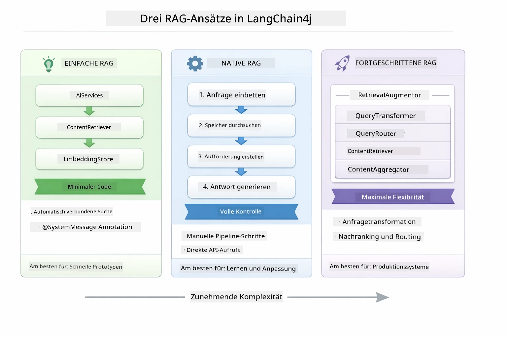
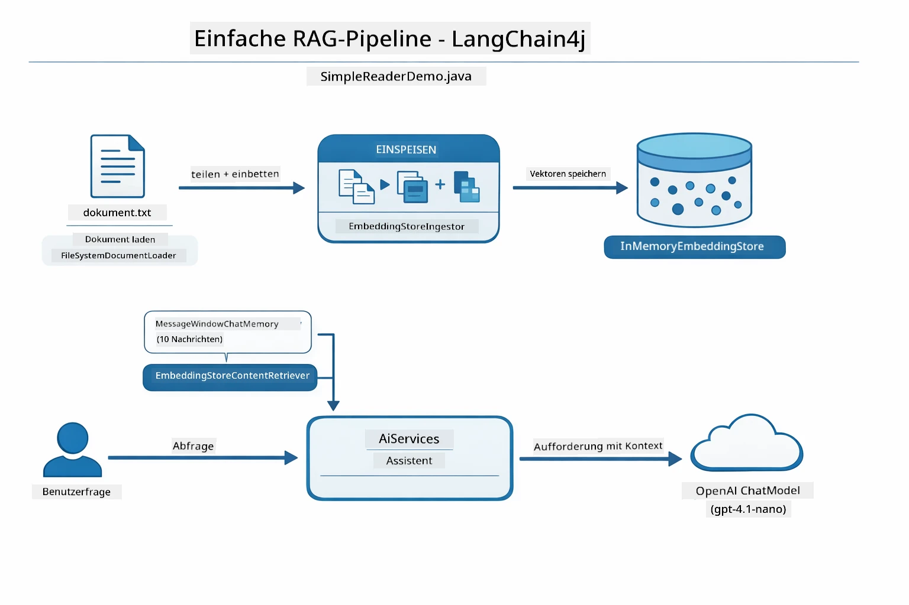
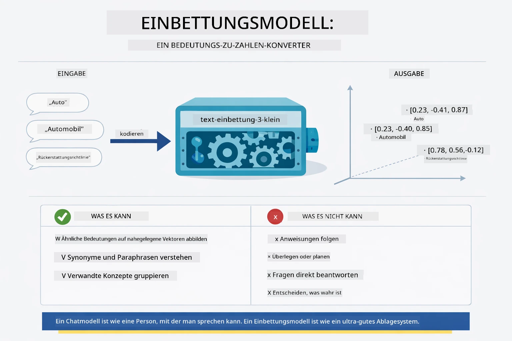
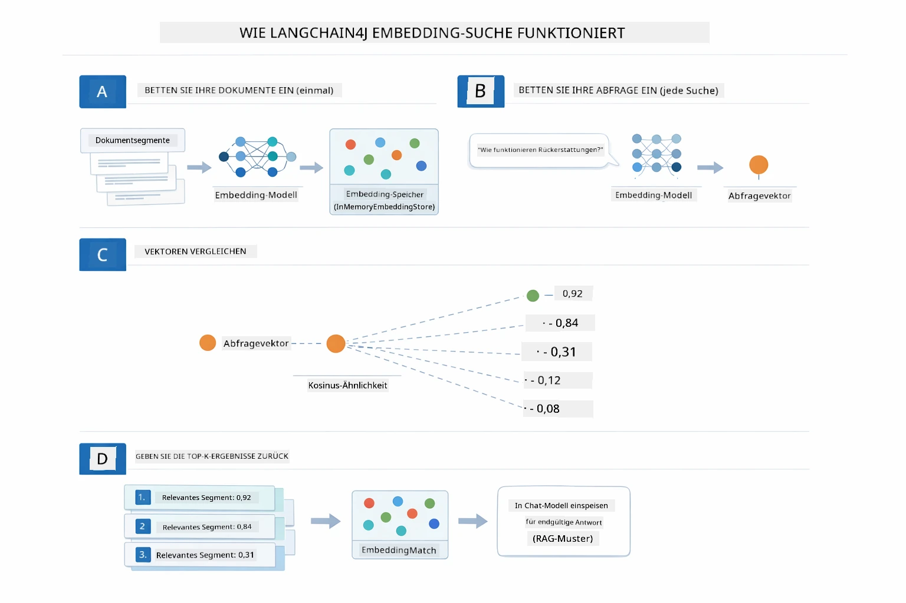
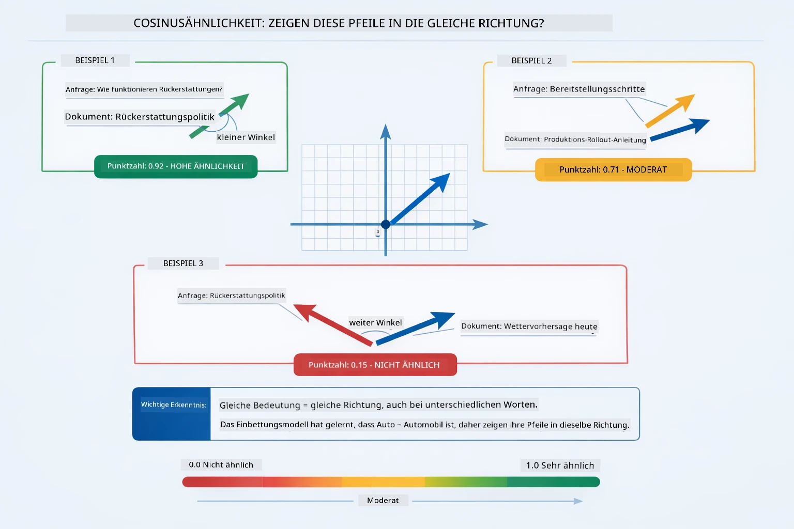
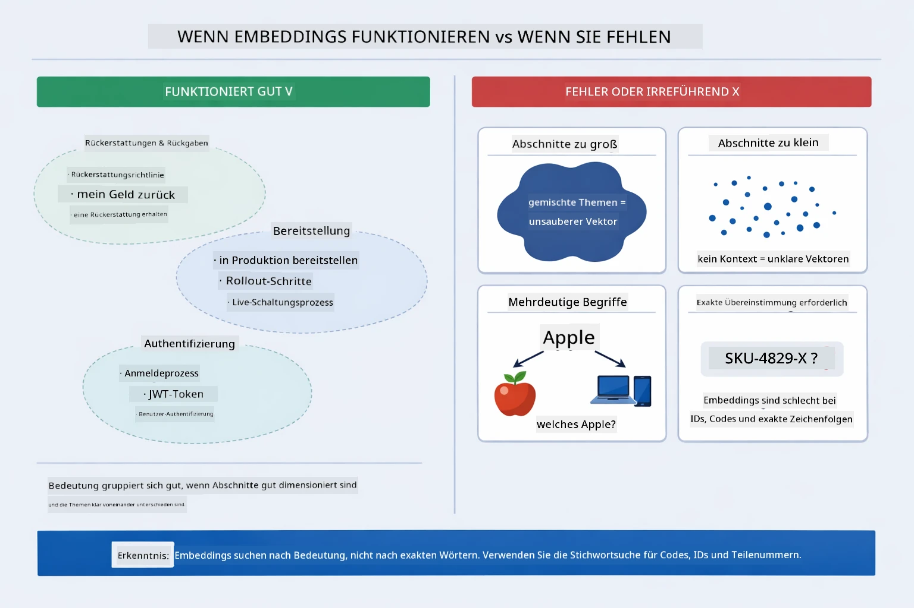

# Modul 03: RAG (Retrieval-Augmented Generation)

## Inhaltsverzeichnis

- [Video Walkthrough](../../../03-rag)
- [Das wirst du lernen](../../../03-rag)
- [Voraussetzungen](../../../03-rag)
- [RAG verstehen](../../../03-rag)
  - [Welchen RAG-Ansatz verwendet dieses Tutorial?](../../../03-rag)
- [Wie es funktioniert](../../../03-rag)
  - [Dokumentenverarbeitung](../../../03-rag)
  - [Erstellung von Embeddings](../../../03-rag)
  - [Semantische Suche](../../../03-rag)
  - [Antwortgenerierung](../../../03-rag)
- [Anwendung ausführen](../../../03-rag)
- [Anwendung verwenden](../../../03-rag)
  - [Dokument hochladen](../../../03-rag)
  - [Fragen stellen](../../../03-rag)
  - [Quellen überprüfen](../../../03-rag)
  - [Mit Fragen experimentieren](../../../03-rag)
- [Wichtige Konzepte](../../../03-rag)
  - [Chunking-Strategie](../../../03-rag)
  - [Ähnlichkeitspunkte](../../../03-rag)
  - [In-Memory-Speicherung](../../../03-rag)
  - [Kontextfenstermanagement](../../../03-rag)
- [Wann RAG relevant ist](../../../03-rag)
- [Nächste Schritte](../../../03-rag)

## Video Walkthrough

Sieh dir diese Live-Sitzung an, die erklärt, wie du mit diesem Modul startest:

<a href="https://www.youtube.com/watch?v=_olq75ZH_eY"></a>

## Das wirst du lernen

In den vorherigen Modulen hast du gelernt, wie man mit KI kommuniziert und Eingaben effektiv strukturiert. Aber es gibt eine grundlegende Einschränkung: Sprachmodelle wissen nur, was sie während des Trainings gelernt haben. Sie können keine Fragen zu den Richtlinien deines Unternehmens, deiner Projektdokumentation oder Informationen beantworten, auf die sie nicht trainiert wurden.

RAG (Retrieval-Augmented Generation) löst dieses Problem. Anstatt zu versuchen, dem Modell deine Informationen beizubringen (was teuer und unpraktisch ist), gibst du ihm die Möglichkeit, in deinen Dokumenten zu suchen. Wenn jemand eine Frage stellt, findet das System relevante Informationen und fügt sie dem Prompt bei. Das Modell antwortet dann basierend auf diesem abgerufenen Kontext.

Stell dir RAG als Bibliothek für das Modell vor. Wenn du eine Frage stellst, führt das System folgende Schritte aus:

1. **Nutzeranfrage** – Du stellst eine Frage  
2. **Embedding** – Wandelt deine Frage in einen Vektor um  
3. **Vektorsuche** – Findet ähnliche Dokumentenabschnitte  
4. **Kontextzusammenstellung** – Fügt relevante Abschnitte dem Prompt hinzu  
5. **Antwort** – Das LLM generiert eine Antwort basierend auf dem Kontext  

So werden die Antworten des Modells auf deinen tatsächlichen Daten basiert und nicht nur auf Wissen aus dem Training oder erfundenen Antworten.

## Voraussetzungen

- Abgeschlossenes [Modul 00 – Quick Start](../00-quick-start/README.md) (für das oben referenzierte Easy RAG Beispiel)  
- Abgeschlossenes [Modul 01 – Einführung](../01-introduction/README.md) (Azure OpenAI Ressourcen bereitgestellt, inklusive des `text-embedding-3-small` Embedding-Modells)  
- `.env` Datei im Stammverzeichnis mit Azure-Zugangsdaten (erstellt durch `azd up` im Modul 01)  

> **Hinweis:** Wenn du Modul 01 nicht abgeschlossen hast, folge dort zuerst den Bereitstellungsanweisungen. Der `azd up` Befehl stellt sowohl das GPT Chat-Modell als auch das Embedding-Modell bereit, das in diesem Modul verwendet wird.

## RAG verstehen

Das folgende Diagramm veranschaulicht das Kernkonzept: Statt sich nur auf die Trainingsdaten des Modells zu verlassen, erhält RAG eine Referenzbibliothek deiner Dokumente, die vor jeder Antwort konsultiert wird.


*Dieses Diagramm zeigt den Unterschied zwischen einem Standard-LLM (das basierend auf Trainingsdaten rät) und einem RAG-verbesserten LLM (das zuerst deine Dokumente konsultiert).*

So verbinden sich die einzelnen Komponenten miteinander. Die Nutzerfrage durchläuft vier Stadien — Embedding, Vektorsuche, Kontextzusammenstellung und Antwortgenerierung — die jeweils auf dem vorherigen aufbauen:


*Dieses Diagramm zeigt die End-to-End RAG-Pipeline — eine Nutzeranfrage durchläuft Embedding, Vektorsuche, Kontextzusammenstellung und Antwortgenerierung.*

Der Rest dieses Moduls erläutert jede Phase detailliert mit Code, den du ausführen und anpassen kannst.

### Welchen RAG-Ansatz verwendet dieses Tutorial?

LangChain4j bietet drei Arten, RAG zu implementieren, jeweils mit unterschiedlichem Abstraktionsgrad. Das folgende Diagramm vergleicht sie nebeneinander:



*Dieses Diagramm vergleicht die drei LangChain4j RAG-Ansätze — Easy, Native und Advanced — zeigt deren Hauptbestandteile und wann man welchen verwendet.*

| Ansatz | Was er macht | Kompromiss |
|---|---|---|
| **Easy RAG** | Verkabelt alles automatisch durch `AiServices` und `ContentRetriever`. Du annotierst ein Interface, hängst einen Retriever an, und LangChain4j übernimmt Embedding, Suche und Prompt-Zusammenstellung im Hintergrund. | Wenig Code, aber du siehst nicht, was bei jedem Schritt passiert. |
| **Native RAG** | Du rufst das Embedding-Modell auf, suchst im Speicher, baust den Prompt und generierst die Antwort selbst — explizit Schritt für Schritt. | Mehr Code, aber jeder Schritt ist sichtbar und anpassbar. |
| **Advanced RAG** | Nutzt das `RetrievalAugmentor` Framework mit plug-and-play Query-Transformern, Routern, Re-Rankern und Content-Injektoren für Produktions-Pipelines. | Maximale Flexibilität, aber deutlich komplexer. |

**Dieses Tutorial verwendet den Native-Ansatz.** Jeder Schritt der RAG-Pipeline — Abfrage-Embedding, Suche im Vektorspeicher, Kontextzusammenstellung und Antwortgenerierung — ist explizit in [`RagService.java`](../../../03-rag/src/main/java/com/example/langchain4j/rag/service/RagService.java) ausgeführt. Dies ist Absicht: Als Lernressource ist es wichtiger, jeden Schritt zu sehen und zu verstehen, als den Code zu minimieren. Sobald du verstanden hast, wie alles zusammenpasst, kannst du zu Easy RAG für schnelle Prototypen oder Advanced RAG für produktive Systeme wechseln.

> **💡 Schon Easy RAG gesehen?** Das [Quick Start Modul](../00-quick-start/README.md) enthält ein Document Q&A Beispiel ([`SimpleReaderDemo.java`](../../../00-quick-start/src/main/java/com/example/langchain4j/quickstart/SimpleReaderDemo.java)), das den Easy RAG Ansatz nutzt — LangChain4j übernimmt automatisch Embedding, Suche und Prompt-Zusammenstellung. Dieses Modul geht einen Schritt weiter, indem es die Pipeline öffnet, damit du jeden Schritt selbst sehen und steuern kannst.



*Dieses Diagramm zeigt die Easy RAG Pipeline aus `SimpleReaderDemo.java`. Vergleiche das mit dem Native-Ansatz in diesem Modul: Easy RAG versteckt Embedding, Abruf und Prompt-Zusammenstellung hinter `AiServices` und `ContentRetriever` — du lädst ein Dokument, hängst einen Retriever an und bekommst Antworten. Der Native-Ansatz in diesem Modul öffnet diese Pipeline, sodass du jeden Schritt (embed, search, assemble context, generate) selbst aufrufst und somit volle Sichtbarkeit und Kontrolle hast.*

## Wie es funktioniert

Die RAG-Pipeline in diesem Modul gliedert sich in vier Schritte, die jedes Mal hintereinander ausgeführt werden, wenn ein Nutzer eine Frage stellt. Zuerst wird ein hochgeladenes Dokument **geparst und in Chunks** zerlegt, die handhabbar sind. Diese Chunks werden dann in **Vektor-Embeddings** umgewandelt und gespeichert, damit man sie rechnerisch vergleichen kann. Kommt eine Anfrage, führt das System eine **semantische Suche** durch, um die relevantesten Chunks zu finden, und übergibt diese dann als Kontext an das LLM zur **Antwortgenerierung**. Die nachfolgenden Abschnitte erklären jeden Schritt mit Code und Diagrammen – lass uns mit dem ersten Schritt beginnen.

### Dokumentenverarbeitung

[DocumentService.java](../../../03-rag/src/main/java/com/example/langchain4j/rag/service/DocumentService.java)

Wenn du ein Dokument hochlädst, wird es vom System geparst (PDF oder Klartext), mit Metadaten wie Dateiname versehen und dann in Chunks — kleinere, zum Kontextfenster des Modells passende Stücke — zerlegt. Diese Chunks überlappen sich geringfügig, damit am Rand nichts an Kontext verloren geht.

```java
// Analysiere die hochgeladene Datei und verpacke sie in ein LangChain4j-Dokument
Document document = Document.from(content, metadata);

// Teile in 300-Token-Chunks mit 30-Token-Überlappung auf
DocumentSplitter splitter = DocumentSplitters
    .recursive(300, 30);

List<TextSegment> segments = splitter.split(document);
```
  
Das folgende Diagramm zeigt das visuell. Beachte, wie sich die Chunks in einigen Tokens überschneiden – die 30-Tokens-Überlappung sorgt dafür, dass kein wichtiger Kontext „zwischen den Ritzen“ verloren geht:


*Dieses Diagramm zeigt, wie ein Dokument in 300-Token-Chunks mit 30-Token Überlappung aufgeteilt wird, um den Kontext an den Chunk-Grenzen zu erhalten.*

> **🤖 Probier es mit dem [GitHub Copilot](https://github.com/features/copilot) Chat:** Öffne [`DocumentService.java`](../../../03-rag/src/main/java/com/example/langchain4j/rag/service/DocumentService.java) und frage:  
> - „Wie teilt LangChain4j Dokumente in Chunks und warum ist Überlappung wichtig?“  
> - „Was ist die optimale Chunk-Größe für verschiedene Dokumenttypen und warum?“  
> - „Wie gehe ich mit Dokumenten in mehreren Sprachen oder mit spezieller Formatierung um?“

### Erstellung von Embeddings

[LangChainRagConfig.java](../../../03-rag/src/main/java/com/example/langchain4j/rag/config/LangChainRagConfig.java)

Jeder Chunk wird in eine numerische Darstellung umgewandelt, ein sogenanntes Embedding — im Grunde ein Bedeutungs-zu-Zahlen-Konverter. Das Embedding-Modell ist nicht „intelligent“ wie ein Chat-Modell; es kann keine Anweisungen befolgen, nicht logisch schließen oder Fragen beantworten. Was es kann, ist Text in einen mathematischen Raum abzubilden, wo ähnliche Bedeutungen nah beieinander liegen — „Auto“ nahe bei „Automobil“, „Rückerstattungsbestimmungen“ nahe bei „Geld zurück“. Stell dir ein Chat-Modell als Person vor, mit der du sprechen kannst; ein Embedding-Modell ist ein sehr gutes Ablagesystem.



*Dieses Diagramm zeigt, wie ein Embedding-Modell Text in numerische Vektoren wandelt und ähnliche Bedeutungen — wie „Auto“ und „Automobil“ — im Vektorraum nahe zueinander platziert.*

```java
@Bean
public EmbeddingModel embeddingModel() {
    return OpenAiOfficialEmbeddingModel.builder()
        .baseUrl(azureOpenAiEndpoint)
        .apiKey(azureOpenAiKey)
        .modelName(azureEmbeddingDeploymentName)
        .build();
}

EmbeddingStore<TextSegment> embeddingStore = 
    new InMemoryEmbeddingStore<>();
```
  
Das folgende Klassendiagramm zeigt die zwei getrennten Flows in einer RAG-Pipeline und die LangChain4j-Klassen, die sie implementieren. Der **Ingest-Flow** (läuft einmal beim Upload) teilt das Dokument, erzeugt Embeddings der Chunks und speichert sie via `.addAll()`. Der **Query-Flow** (läuft bei jeder Nutzerfrage) erzeugt ein Embedding der Frage, sucht im Speicher via `.search()` und übergibt den gefundenen Kontext an das Chat-Modell. Beide Flows verbinden sich an der gemeinsamen `EmbeddingStore<TextSegment>` Schnittstelle:


*Dieses Diagramm zeigt die zwei Flows in einer RAG-Pipeline — Ingestion und Query — und wie sie über einen gemeinsamen EmbeddingStore verbunden sind.*

Sobald Embeddings gespeichert sind, gruppieren sich ähnliche Inhalte im Vektorraum natürlich zusammen. Die Visualisierung unten zeigt, wie Dokumente zu verwandten Themen als benachbarte Punkte erscheinen — das ermöglicht semantische Suche:


*Diese Visualisierung zeigt, wie verwandte Dokumente in einem 3D-Vektorraum clusterartig zusammenfallen, mit Themen wie Technische Docs, Geschäftsregeln und FAQs als erkennbare Gruppen.*

Wenn ein Nutzer sucht, folgt das System vier Schritten: Dokumente werden einmal eingebettet, die Suchanfrage für jede Suche eingebettet, der Vektor der Anfrage wird mittels Kosinusähnlichkeit mit allen gespeicherten Vektoren verglichen, und die Top-K am höchsten bewerteten Chunks werden zurückgegeben. Das folgende Diagramm erläutert jeden Schritt und die LangChain4j-Klassen:



*Dieses Diagramm zeigt den vierstufigen Embedding-Suchprozess: Dokumente einbetten, Anfrage einbetten, Vektoren mittels Kosinusähnlichkeit vergleichen und die Top-K-Ergebnisse zurückgeben.*

### Semantische Suche

[RagService.java](../../../03-rag/src/main/java/com/example/langchain4j/rag/service/RagService.java)

Wenn du eine Frage stellst, wird auch diese Frage als Embedding erzeugt. Das System vergleicht das Embedding deiner Frage mit allen Embeddings der Dokumentchunks. Es findet jene Chunks mit den ähnlichsten Bedeutungen – nicht nur passende Schlüsselwörter, sondern echte semantische Ähnlichkeit.

```java
Embedding queryEmbedding = embeddingModel.embed(question).content();

EmbeddingSearchRequest searchRequest = EmbeddingSearchRequest.builder()
    .queryEmbedding(queryEmbedding)
    .maxResults(5)
    .minScore(0.5)
    .build();

EmbeddingSearchResult<TextSegment> searchResult = embeddingStore.search(searchRequest);
List<EmbeddingMatch<TextSegment>> matches = searchResult.matches();

for (EmbeddingMatch<TextSegment> match : matches) {
    String relevantText = match.embedded().text();
    double score = match.score();
}
```
  
Das folgende Diagramm stellt die semantische Suche dem traditionellen Stichwort-Suchen gegenüber. Eine Stichwortsuche nach „Fahrzeug“ verfehlt einen Chunk über „Autos und Lastwagen“, aber die semantische Suche erkennt, dass sie dasselbe meinen und gibt ihn als hoch bewertetes Ergebnis zurück:


*Dieses Diagramm vergleicht die stichwortbasierte Suche mit der semantischen Suche und zeigt, wie letztere konzeptuell verwandte Inhalte findet – auch wenn exakte Schlüsselwörter fehlen.*

Unter der Haube wird Ähnlichkeit mit Kosinusähnlichkeit gemessen — im Grunde wird gefragt: „zeigen diese zwei Pfeile in dieselbe Richtung?“ Zwei Chunks können völlig unterschiedliche Wörter verwenden, doch wenn sie dieselbe Bedeutung haben, zeigen ihre Vektoren in dieselbe Richtung und erzielen einen Wert nahe 1,0:


*Dieses Diagramm veranschaulicht die Kosinusähnlichkeit als den Winkel zwischen Einbettungsvektoren – stärker ausgerichtete Vektoren ergeben einen Wert näher bei 1,0, was auf eine höhere semantische Ähnlichkeit hinweist.*

> **🤖 Probieren Sie den Chat mit [GitHub Copilot](https://github.com/features/copilot) aus:** Öffnen Sie [`RagService.java`](../../../03-rag/src/main/java/com/example/langchain4j/rag/service/RagService.java) und fragen Sie:
> - "Wie funktioniert die Ähnlichkeitssuche mit Einbettungen und was bestimmt den Score?"
> - "Welchen Ähnlichkeitsschwellenwert sollte ich verwenden und wie beeinflusst er die Ergebnisse?"
> - "Wie gehe ich mit Fällen um, in denen keine relevanten Dokumente gefunden werden?"

### Antwortgenerierung

[RagService.java](../../../03-rag/src/main/java/com/example/langchain4j/rag/service/RagService.java)

Die relevantesten Abschnitte werden zu einer strukturierten Eingabeaufforderung zusammengestellt, die explizite Anweisungen, den abgerufenen Kontext und die Benutzerfrage enthält. Das Modell liest genau diese Abschnitte und antwortet basierend auf diesen Informationen – es kann nur das verwenden, was vorliegt, was Halluzinationen verhindert.

```java
String context = matches.stream()
    .map(match -> match.embedded().text())
    .collect(Collectors.joining("\n\n"));

String prompt = String.format("""
    Answer the question based on the following context.
    If the answer cannot be found in the context, say so.

    Context:
    %s

    Question: %s

    Answer:""", context, request.question());

String answer = chatModel.chat(prompt);
```

Das folgende Diagramm zeigt diese Zusammenstellung in Aktion – die am besten bewerteten Abschnitte aus dem Suchschritt werden in die Eingabevorlage eingefügt, und das `OpenAiOfficialChatModel` erzeugt eine fundierte Antwort:


*Dieses Diagramm zeigt, wie die am besten bewerteten Abschnitte zu einer strukturierten Eingabeaufforderung zusammengefügt werden, die es dem Modell ermöglicht, eine fundierte Antwort aus Ihren Daten zu generieren.*

## Anwendung Ausführen

**Deployment überprüfen:**

Stellen Sie sicher, dass die `.env`-Datei im Stammverzeichnis mit Azure-Anmeldedaten vorhanden ist (wurde während Modul 01 erstellt):

**Bash:**
```bash
cat ../.env  # Sollte AZURE_OPENAI_ENDPOINT, API_KEY, DEPLOYMENT anzeigen
```

**PowerShell:**
```powershell
Get-Content ..\.env  # Sollte AZURE_OPENAI_ENDPOINT, API_KEY, DEPLOYMENT anzeigen
```

**Starten Sie die Anwendung:**

> **Hinweis:** Wenn Sie bereits alle Anwendungen mit `./start-all.sh` aus Modul 01 gestartet haben, läuft dieses Modul bereits auf Port 8081. Sie können die Startbefehle unten überspringen und direkt zu http://localhost:8081 gehen.

**Option 1: Verwendung des Spring Boot Dashboards (Empfohlen für VS Code Benutzer)**

Der Entwicklungscontainer enthält die Erweiterung Spring Boot Dashboard, die eine grafische Oberfläche zur Verwaltung aller Spring Boot-Anwendungen bietet. Sie finden sie in der Aktivitätsleiste links in VS Code (suchen Sie nach dem Spring Boot-Symbol).

Im Spring Boot Dashboard können Sie:
- Alle verfügbaren Spring Boot-Anwendungen im Arbeitsbereich sehen
- Anwendungen mit einem Klick starten/stoppen
- Anwendungsprotokolle in Echtzeit ansehen
- Den Anwendungsstatus überwachen

Klicken Sie einfach auf den Play-Button rechts neben "rag", um dieses Modul zu starten, oder starten Sie alle Module auf einmal.


*Dieser Screenshot zeigt das Spring Boot Dashboard in VS Code, wo Sie Anwendungen visuell starten, stoppen und überwachen können.*

**Option 2: Verwendung von Shell-Skripten**

Starten Sie alle Webanwendungen (Module 01-04):

**Bash:**
```bash
cd ..  # Vom Stammverzeichnis
./start-all.sh
```

**PowerShell:**
```powershell
cd ..  # Vom Stammverzeichnis
.\start-all.ps1
```

Oder starten Sie nur dieses Modul:

**Bash:**
```bash
cd 03-rag
./start.sh
```

**PowerShell:**
```powershell
cd 03-rag
.\start.ps1
```

Beide Skripte laden automatisch Umgebungsvariablen aus der `.env`-Datei im Stammverzeichnis und bauen die JARs, falls diese noch nicht existieren.

> **Hinweis:** Wenn Sie alle Module lieber manuell vor dem Start bauen möchten:
>
> **Bash:**
> ```bash
> cd ..  # Go to root directory
> mvn clean package -DskipTests
> ```

> **PowerShell:**
> ```powershell
> cd ..  # Go to root directory
> mvn clean package -DskipTests
> ```

Öffnen Sie http://localhost:8081 in Ihrem Browser.

**Zum Stoppen:**

**Bash:**
```bash
./stop.sh  # Nur dieses Modul
# Oder
cd .. && ./stop-all.sh  # Alle Module
```

**PowerShell:**
```powershell
.\stop.ps1  # Dieses Modul nur
# Oder
cd ..; .\stop-all.ps1  # Alle Module
```

## Anwendung Benutzen

Die Anwendung bietet eine Weboberfläche zum Hochladen von Dokumenten und zur Fragestellung.

<a href="images/rag-homepage.png"></a>

*Dieser Screenshot zeigt die RAG-Anwendungsoberfläche, wo Sie Dokumente hochladen und Fragen stellen können.*

### Dokument Hochladen

Beginnen Sie damit, ein Dokument hochzuladen – TXT-Dateien eignen sich am besten zum Testen. In diesem Verzeichnis liegt eine Datei `sample-document.txt`, die Informationen zu LangChain4j-Funktionen, RAG-Implementierung und Best Practices enthält – ideal, um das System zu testen.

Das System verarbeitet Ihr Dokument, zerlegt es in Abschnitte und erstellt für jeden Abschnitt Einbettungen. Dies geschieht automatisch beim Hochladen.

### Fragen Stellen

Stellen Sie nun spezifische Fragen zum Dokumentinhalt. Versuchen Sie etwas Faktisches, das klar im Dokument steht. Das System sucht relevante Abschnitte, fügt diese in die Eingabeaufforderung ein und generiert eine Antwort.

### Quellenangaben Prüfen

Beachten Sie, dass jede Antwort Quellverweise mit Ähnlichkeitsscores enthält. Diese Scores (von 0 bis 1) zeigen, wie relevant jeder Abschnitt für Ihre Frage war. Höhere Werte bedeuten bessere Übereinstimmungen. So können Sie die Antwort mit dem Ausgangsmaterial vergleichen.

<a href="images/rag-query-results.png"></a>

*Dieser Screenshot zeigt die Abfrageergebnisse mit der generierten Antwort, den Quellenverweisen und Relevanz-Scores für jeden abgerufenen Abschnitt.*

### Mit Fragen Experimentieren

Probieren Sie verschiedene Arten von Fragen aus:
- Spezifische Fakten: „Was ist das Hauptthema?“
- Vergleiche: „Was ist der Unterschied zwischen X und Y?“
- Zusammenfassungen: „Fassen Sie die wichtigsten Punkte zu Z zusammen“

Beobachten Sie, wie sich die Relevanzwerte je nach Passgenauigkeit Ihrer Frage zum Dokumentinhalt ändern.

## Grundkonzepte

### Chunking-Strategie

Dokumente werden in 300-Token-Abschnitte mit 30 Token Überlappung unterteilt. Dieses Gleichgewicht stellt sicher, dass jeder Abschnitt genügend Kontext für Bedeutung bietet und gleichzeitig klein genug bleibt, um mehrere Abschnitte in eine Eingabeaufforderung einzufügen.

### Ähnlichkeitsscores

Jeder abgefragte Abschnitt wird mit einem Ähnlichkeitsscore zwischen 0 und 1 versehen, der angibt, wie gut er zur Nutzerfrage passt. Das folgende Diagramm visualisiert die Scorebereiche und wie das System sie zur Filterung verwendet:


*Dieses Diagramm zeigt Score-Bereiche von 0 bis 1 mit einem Mindestschwellenwert von 0,5, der irrelevante Abschnitte herausfiltert.*

Scores reichen von 0 bis 1:
- 0,7–1,0: Hoch relevant, exakte Übereinstimmung
- 0,5–0,7: Relevant, guter Kontext
- Unter 0,5: Gefiltert, zu unähnlich

Das System ruft nur Abschnitte oberhalb des Mindestschwellenwertes ab, um Qualität sicherzustellen.

Einbettungen funktionieren gut, wenn Bedeutungen klar gruppiert sind, haben aber auch Schwachstellen. Das folgende Diagramm zeigt häufige Fehlermodi – Abschnitte, die zu groß sind, erzeugen unscharfe Vektoren, zu kleine Abschnitte haben zu wenig Kontext, mehrdeutige Begriffe zeigen auf mehrere Cluster, und exakte Übereinstimmungen (IDs, Teilenummern) funktionieren überhaupt nicht mit Einbettungen:



*Dieses Diagramm zeigt gängige Fehlermodi bei Einbettungen: zu große Abschnitte, zu kleine Abschnitte, mehrdeutige Begriffe, die auf mehrere Cluster zeigen, und exakte Übereinstimmungen wie IDs.*

### In-Memory-Speicherung

Dieses Modul verwendet der Einfachheit halber In-Memory-Speicherung. Beim Neustart der Anwendung gehen hochgeladene Dokumente verloren. Produktive Systeme verwenden persistente Vektordatenbanken wie Qdrant oder Azure AI Search.

### Verwaltung des Kontextfensters

Jedes Modell hat ein maximales Kontextfenster. Sie können nicht jeden Abschnitt eines großen Dokuments einbeziehen. Das System ruft die Top N relevantesten Abschnitte (Standard 5) ab, um innerhalb der Grenzen zu bleiben und dennoch ausreichend Kontext für genaue Antworten zu bieten.

## Wann RAG Sinn macht

RAG ist nicht immer der richtige Ansatz. Der folgende Entscheidungsleitfaden hilft Ihnen zu bestimmen, wann RAG Mehrwert bietet und wann einfachere Ansätze – wie direkte Inhalte in der Eingabeaufforderung oder das Vertrauen auf das eingebaute Wissen des Modells – ausreichen:


*Dieses Diagramm zeigt einen Entscheidungsleitfaden, wann RAG Mehrwert schafft und wann einfachere Ansätze genügen.*

**Verwenden Sie RAG, wenn:**
- Sie Fragen zu proprietären Dokumenten beantworten
- Informationen sich häufig ändern (Richtlinien, Preise, Spezifikationen)
- Genauigkeit mit Quellenangabe erforderlich ist
- Inhalte zu groß sind, um in eine einzelne Eingabeaufforderung zu passen
- Sie überprüfbare, fundierte Antworten benötigen

**Verwenden Sie RAG nicht, wenn:**
- Fragen allgemeines Wissen erfordern, das das Modell bereits hat
- Echtzeitdaten benötigt werden (RAG arbeitet mit hochgeladenen Dokumenten)
- Inhalte klein genug sind, um direkt in Eingabeaufforderungen aufgenommen zu werden

## Nächste Schritte

**Nächstes Modul:** [04-tools – KI-Agenten mit Tools](../04-tools/README.md)

---

**Navigation:** [← Vorheriges: Modul 02 – Prompt Engineering](../02-prompt-engineering/README.md) | [Zurück zum Hauptverzeichnis](../README.md) | [Weiter: Modul 04 – Tools →](../04-tools/README.md)

---

<!-- CO-OP TRANSLATOR DISCLAIMER START -->
**Haftungsausschluss**:  
Dieses Dokument wurde mithilfe des KI-Übersetzungsdienstes [Co-op Translator](https://github.com/Azure/co-op-translator) übersetzt. Obwohl wir um Genauigkeit bemüht sind, können automatisierte Übersetzungen Fehler oder Ungenauigkeiten enthalten. Das Originaldokument in seiner Ursprungssprache ist als maßgebliche Quelle zu betrachten. Für kritische Informationen wird eine professionelle menschliche Übersetzung empfohlen. Wir übernehmen keine Haftung für Missverständnisse oder Fehlinterpretationen, die aus der Nutzung dieser Übersetzung entstehen.
<!-- CO-OP TRANSLATOR DISCLAIMER END -->