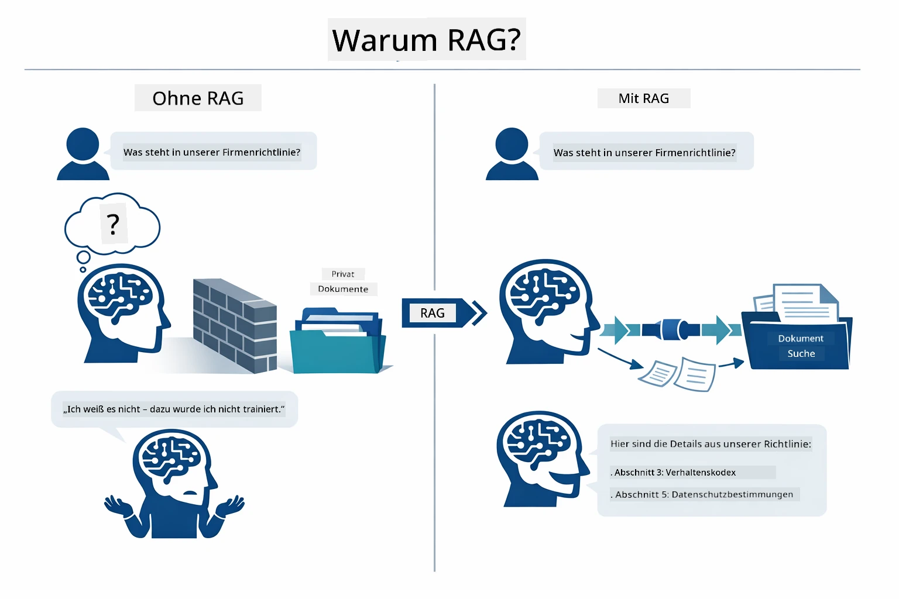
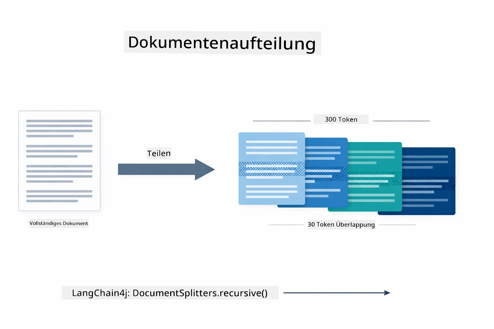
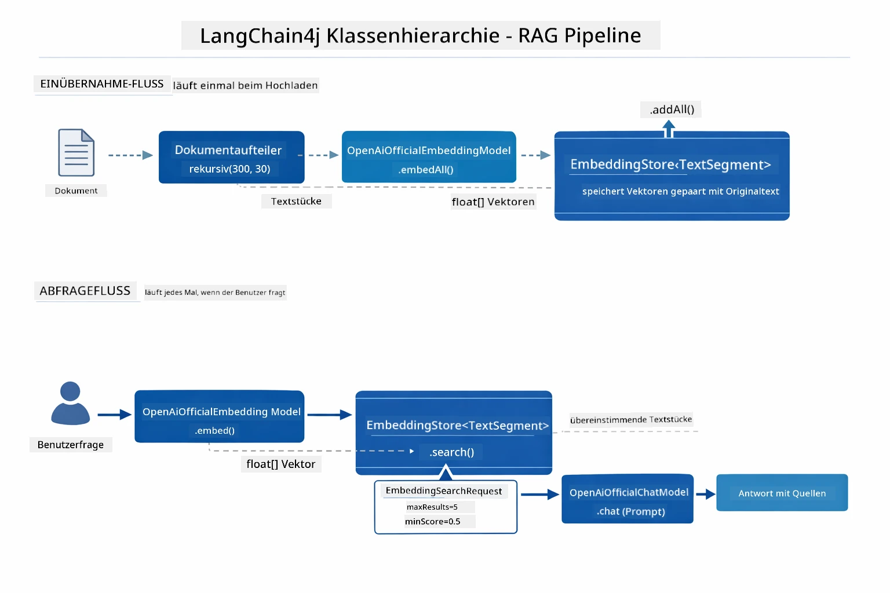
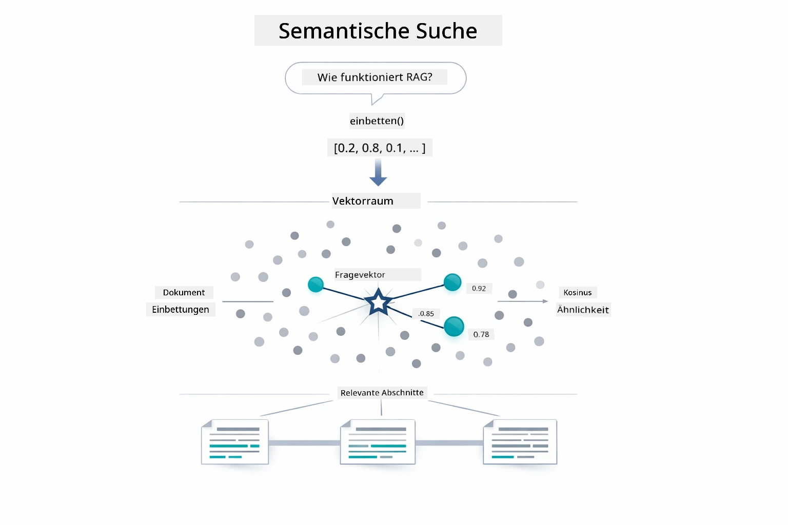
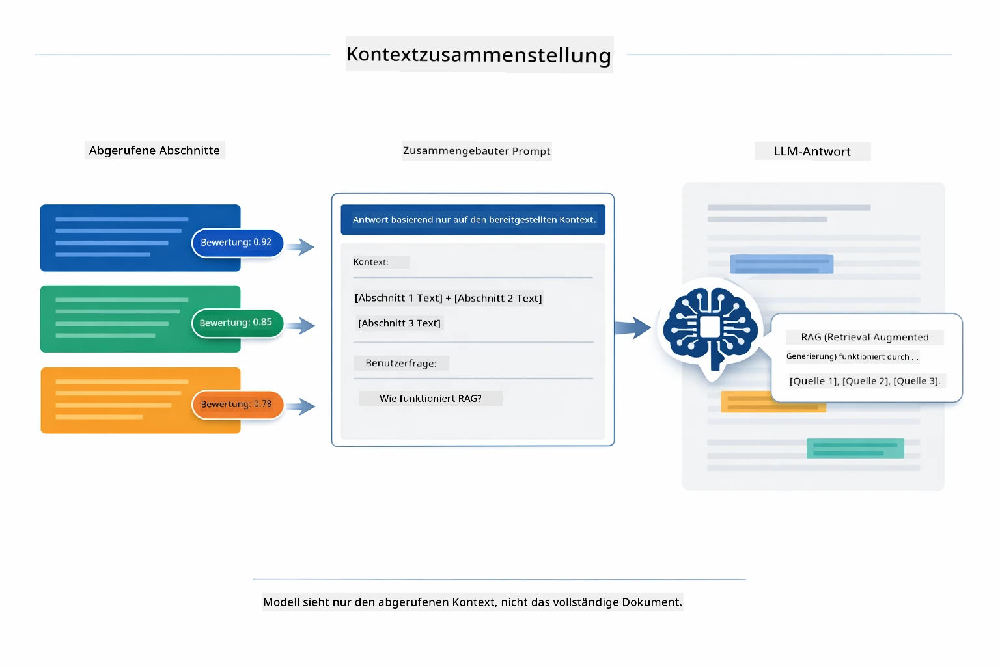
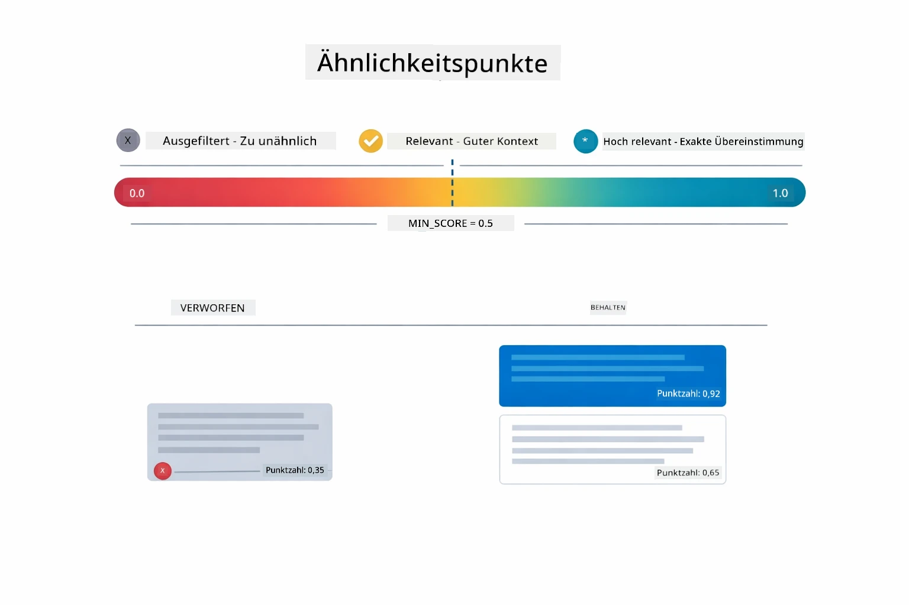
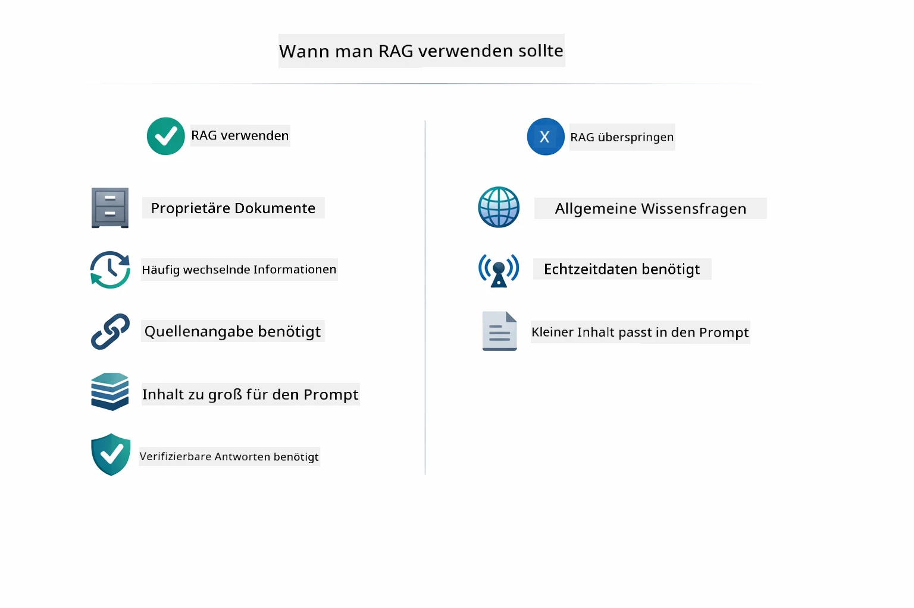

# Modul 03: RAG (Retrieval-Augmented Generation)

## Inhaltsverzeichnis

- [Was Sie lernen werden](../../../03-rag)
- [Verstehen von RAG](../../../03-rag)
- [Voraussetzungen](../../../03-rag)
- [Funktionsweise](../../../03-rag)
  - [Dokumentenverarbeitung](../../../03-rag)
  - [Erstellung von Einbettungen](../../../03-rag)
  - [Semantische Suche](../../../03-rag)
  - [Antwortgenerierung](../../../03-rag)
- [Anwendung starten](../../../03-rag)
- [Verwendung der Anwendung](../../../03-rag)
  - [Ein Dokument hochladen](../../../03-rag)
  - [Fragen stellen](../../../03-rag)
  - [Quellenangaben überprüfen](../../../03-rag)
  - [Mit Fragen experimentieren](../../../03-rag)
- [Kernkonzepte](../../../03-rag)
  - [Chunking-Strategie](../../../03-rag)
  - [Ähnlichkeitsscores](../../../03-rag)
  - [In-Memory-Speicherung](../../../03-rag)
  - [Kontextfenstermanagement](../../../03-rag)
- [Wann RAG wichtig ist](../../../03-rag)
- [Nächste Schritte](../../../03-rag)

## Was Sie lernen werden

In den vorherigen Modulen haben Sie gelernt, wie man Gespräche mit KI führt und Ihre Aufforderungen effektiv strukturiert. Aber es gibt eine grundlegende Einschränkung: Sprachmodelle wissen nur, was sie während des Trainings gelernt haben. Sie können keine Fragen zu den Richtlinien Ihres Unternehmens, Ihrer Projektdokumentation oder Informationen beantworten, die ihnen nicht beigebracht wurden.

RAG (Retrieval-Augmented Generation) löst dieses Problem. Anstatt zu versuchen, dem Modell Ihre Informationen beizubringen (was teuer und unpraktisch ist), geben Sie ihm die Möglichkeit, Ihre Dokumente zu durchsuchen. Wenn jemand eine Frage stellt, findet das System relevante Informationen und fügt sie in die Eingabeaufforderung ein. Das Modell antwortet dann basierend auf diesem abgerufenen Kontext.

Stellen Sie sich RAG als eine Referenzbibliothek für das Modell vor. Wenn Sie eine Frage stellen, durchläuft das System:

1. **Benutzeranfrage** – Sie stellen eine Frage  
2. **Einbettung** – Wandelt Ihre Frage in einen Vektor um  
3. **Vektorsuche** – Findet ähnliche Dokumentchunks  
4. **Kontextaufbau** – Fügt relevante Chunks dem Prompt hinzu  
5. **Antwort** – LLM generiert eine Antwort basierend auf dem Kontext

Dies verankert die Antwort des Modells in Ihren tatsächlichen Daten, anstatt sich auf das Trainingswissen zu verlassen oder Antworten zu erfinden.

## Verstehen von RAG

Das folgende Diagramm veranschaulicht das Kernkonzept: Anstatt sich nur auf die Trainingsdaten des Modells zu verlassen, gibt RAG ihm eine Referenzbibliothek Ihrer Dokumente, die vor jeder Antwortgenerierung konsultiert wird.



So hängen die Teile Ende-zu-Ende zusammen. Die Frage eines Benutzers durchläuft vier Phasen — Einbettung, Vektorsuche, Kontextaufbau und Antwortgenerierung — wobei jede Phase auf der vorherigen aufbaut:


Der Rest dieses Moduls führt Sie durch jede Phase im Detail mit ausführbarem und veränderbarem Code.

## Voraussetzungen

- Abgeschlossenes Modul 01 (Azure OpenAI Ressourcen bereitgestellt)  
- `.env` Datei im Stammverzeichnis mit Azure-Zugangsdaten (erstellt durch `azd up` in Modul 01)

> **Hinweis:** Wenn Sie Modul 01 nicht abgeschlossen haben, folgen Sie zuerst den dortigen Bereitstellungsanweisungen.

## Funktionsweise

### Dokumentenverarbeitung

[DocumentService.java](../../../03-rag/src/main/java/com/example/langchain4j/rag/service/DocumentService.java)

Wenn Sie ein Dokument hochladen, parst das System es (PDF oder Klartext), fügt Metadaten wie den Dateinamen hinzu und zerlegt es dann in Chunks — kleinere Stücke, die bequem ins Kontextfenster des Modells passen. Diese Chunks überlappen leicht, damit kein Kontext an den Grenzen verloren geht.

```java
// Analysiere die hochgeladene Datei und verpacke sie in ein LangChain4j-Dokument
Document document = Document.from(content, metadata);

// In 300-Token-Stücke mit 30-Token-Überlappung aufteilen
DocumentSplitter splitter = DocumentSplitters
    .recursive(300, 30);

List<TextSegment> segments = splitter.split(document);
```
  
Das Diagramm unten zeigt, wie das visuell funktioniert. Beachten Sie, wie jeder Chunk einige Tokens mit seinen Nachbarn teilt – die 30-Token-Überlappung stellt sicher, dass kein wichtiger Kontext zwischen den Stücken verloren geht:



> **🤖 Probieren Sie es mit [GitHub Copilot](https://github.com/features/copilot) Chat aus:** Öffnen Sie [`DocumentService.java`](../../../03-rag/src/main/java/com/example/langchain4j/rag/service/DocumentService.java) und fragen Sie:  
> - „Wie teilt LangChain4j Dokumente in Chunks auf und warum ist Überlappung wichtig?“  
> - „Was ist die optimale Chunk-Größe für verschiedene Dokumenttypen und warum?“  
> - „Wie gehe ich mit Dokumenten in mehreren Sprachen oder mit spezieller Formatierung um?“

### Erstellung von Einbettungen

[LangChainRagConfig.java](../../../03-rag/src/main/java/com/example/langchain4j/rag/config/LangChainRagConfig.java)

Jeder Chunk wird in eine numerische Darstellung namens Einbettung umgewandelt – im Wesentlichen ein mathematischer Fingerabdruck, der die Bedeutung des Texts einfängt. Ähnliche Texte erzeugen ähnliche Einbettungen.

```java
@Bean
public EmbeddingModel embeddingModel() {
    return OpenAiOfficialEmbeddingModel.builder()
        .baseUrl(azureOpenAiEndpoint)
        .apiKey(azureOpenAiKey)
        .modelName(azureEmbeddingDeploymentName)
        .build();
}

EmbeddingStore<TextSegment> embeddingStore = 
    new InMemoryEmbeddingStore<>();
```
  
Das Klassendiagramm unten zeigt, wie diese LangChain4j-Komponenten verbunden sind. `OpenAiOfficialEmbeddingModel` wandelt Text in Vektoren um, `InMemoryEmbeddingStore` hält die Vektoren zusammen mit ihren ursprünglichen `TextSegment`-Daten, und `EmbeddingSearchRequest` steuert Abrufparameter wie `maxResults` und `minScore`:



Sobald Einbettungen gespeichert sind, gruppieren sich ähnliche Inhalte natürlich im Vektorraum. Die Visualisierung unten zeigt, wie Dokumente zu verwandten Themen als nahe beieinander liegende Punkte enden, was die semantische Suche ermöglicht:


### Semantische Suche

[RagService.java](../../../03-rag/src/main/java/com/example/langchain4j/rag/service/RagService.java)

Wenn Sie eine Frage stellen, wird auch Ihre Frage in eine Einbettung umgewandelt. Das System vergleicht die Frage-Einbettung mit allen Dokumentchunk-Einbettungen. Es findet die Chunks mit der größten semantischen Ähnlichkeit – nicht nur übereinstimmende Schlüsselwörter.

```java
Embedding queryEmbedding = embeddingModel.embed(question).content();

EmbeddingSearchRequest searchRequest = EmbeddingSearchRequest.builder()
    .queryEmbedding(queryEmbedding)
    .maxResults(5)
    .minScore(0.5)
    .build();

EmbeddingSearchResult<TextSegment> searchResult = embeddingStore.search(searchRequest);
List<EmbeddingMatch<TextSegment>> matches = searchResult.matches();

for (EmbeddingMatch<TextSegment> match : matches) {
    String relevantText = match.embedded().text();
    double score = match.score();
}
```
  
Das Diagramm unten vergleicht semantische Suche mit traditioneller Stichwortsuche. Eine Stichwortsuche nach "Fahrzeug" verfehlt einen Chunk über "Autos und Lastwagen", aber die semantische Suche erkennt, dass sie das Gleiche meinen und liefert ihn als hochbewertete Übereinstimmung:



> **🤖 Probieren Sie es mit [GitHub Copilot](https://github.com/features/copilot) Chat aus:** Öffnen Sie [`RagService.java`](../../../03-rag/src/main/java/com/example/langchain4j/rag/service/RagService.java) und fragen Sie:  
> - „Wie funktioniert die Ähnlichkeitssuche mit Einbettungen und was bestimmt den Score?“  
> - „Welchen Ähnlichkeitsschwellenwert sollte ich verwenden und wie beeinflusst er die Ergebnisse?“  
> - „Wie gehe ich mit Fällen um, in denen keine relevanten Dokumente gefunden werden?“

### Antwortgenerierung

[RagService.java](../../../03-rag/src/main/java/com/example/langchain4j/rag/service/RagService.java)

Die relevantesten Chunks werden zu einem strukturierten Prompt zusammengesetzt, der explizite Anweisungen, den abgerufenen Kontext und die Frage des Benutzers enthält. Das Modell liest diese spezifischen Chunks und antwortet auf Basis dieser Informationen – es kann nur nutzen, was ihm gezeigt wird, was Halluzinationen verhindert.

```java
String context = matches.stream()
    .map(match -> match.embedded().text())
    .collect(Collectors.joining("\n\n"));

String prompt = String.format("""
    Answer the question based on the following context.
    If the answer cannot be found in the context, say so.

    Context:
    %s

    Question: %s

    Answer:""", context, request.question());

String answer = chatModel.chat(prompt);
```
  
Das Diagramm unten zeigt diese Zusammensetzung in Aktion – die bestbewerteten Chunks aus der Suchphase werden in die Promptvorlage eingefügt, und das `OpenAiOfficialChatModel` generiert eine fundierte Antwort:



## Anwendung starten

**Bereitstellung überprüfen:**

Stellen Sie sicher, dass die `.env`-Datei im Stammverzeichnis mit Azure-Zugangsdaten vorhanden ist (erstellt während Modul 01):  
```bash
cat ../.env  # Sollte AZURE_OPENAI_ENDPOINT, API_KEY, DEPLOYMENT anzeigen
```
  
**Anwendung starten:**

> **Hinweis:** Wenn Sie bereits alle Anwendungen mit `./start-all.sh` aus Modul 01 gestartet haben, läuft dieses Modul bereits auf Port 8081. Sie können die Startbefehle unten überspringen und direkt zu http://localhost:8081 gehen.

**Option 1: Verwendung des Spring Boot Dashboards (empfohlen für VS Code Nutzer)**

Der Dev-Container enthält die Spring Boot Dashboard-Erweiterung, die eine visuelle Oberfläche zur Verwaltung aller Spring Boot Anwendungen bietet. Sie finden diese in der Aktivitätsleiste links in VS Code (suchen Sie nach dem Spring Boot Symbol).

Im Spring Boot Dashboard können Sie:  
- Alle verfügbaren Spring Boot Anwendungen im Workspace sehen  
- Anwendungen mit einem Klick starten/stoppen  
- Anwendungsprotokolle in Echtzeit anzeigen  
- Den Anwendungsstatus überwachen

Klicken Sie einfach auf die Play-Taste neben „rag“, um dieses Modul zu starten, oder starten Sie alle Module gleichzeitig.


**Option 2: Verwendung von Shell-Skripten**

Starten Sie alle Webanwendungen (Module 01-04):

**Bash:**  
```bash
cd ..  # Vom Stammverzeichnis
./start-all.sh
```
  
**PowerShell:**  
```powershell
cd ..  # Vom Stammverzeichnis
.\start-all.ps1
```
  
Oder starten Sie nur dieses Modul:

**Bash:**  
```bash
cd 03-rag
./start.sh
```
  
**PowerShell:**  
```powershell
cd 03-rag
.\start.ps1
```
  
Beide Skripte laden automatisch Umgebungsvariablen aus der root `.env`-Datei und bauen die JARs, wenn sie nicht existieren.

> **Hinweis:** Wenn Sie alle Module lieber manuell bauen möchten, bevor Sie starten:  
>
> **Bash:**  
> ```bash
> cd ..  # Go to root directory
> mvn clean package -DskipTests
> ```
>  
> **PowerShell:**  
> ```powershell
> cd ..  # Go to root directory
> mvn clean package -DskipTests
> ```
  
Öffnen Sie http://localhost:8081 in Ihrem Browser.

**Zum Stoppen:**  

**Bash:**  
```bash
./stop.sh  # Nur dieses Modul
# Oder
cd .. && ./stop-all.sh  # Alle Module
```
  
**PowerShell:**  
```powershell
.\stop.ps1  # Nur dieses Modul
# Oder
cd ..; .\stop-all.ps1  # Alle Module
```
  
## Verwendung der Anwendung

Die Anwendung bietet eine Weboberfläche für Dokumenten-Upload und Fragestellungen.

<a href="images/rag-homepage.png"></a>

*Die RAG-Anwendungsoberfläche – Dokumente hochladen und Fragen stellen*

### Ein Dokument hochladen

Beginnen Sie damit, ein Dokument hochzuladen – TXT-Dateien eignen sich am besten zum Testen. Eine `sample-document.txt` ist in diesem Verzeichnis enthalten, die Informationen zu LangChain4j-Funktionen, RAG-Implementierung und Best Practices enthält – perfekt zum Systemtest.

Das System verarbeitet Ihr Dokument, zerlegt es in Chunks und erstellt für jeden Chunk Einbettungen. Dies geschieht automatisch beim Hochladen.

### Fragen stellen

Stellen Sie nun spezifische Fragen zum Dokumentinhalt. Versuchen Sie etwas Faktisches, das klar im Dokument steht. Das System sucht nach relevanten Chunks, fügt sie in den Prompt ein und generiert eine Antwort.

### Quellenangaben überprüfen

Beachten Sie, dass jede Antwort Quellenangaben mit Ähnlichkeitsscores enthält. Diese Scores (0 bis 1) zeigen, wie relevant jeder Chunk für Ihre Frage war. Höhere Scores bedeuten bessere Übereinstimmungen. So können Sie die Antwort mit dem Quellmaterial überprüfen.

<a href="images/rag-query-results.png"></a>

*Abfrageergebnisse mit Antwort, Quellenangaben und Relevanzscores*

### Mit Fragen experimentieren

Probieren Sie verschiedene Fragestellungen aus:  
- Spezifische Fakten: „Was ist das Hauptthema?“  
- Vergleiche: „Was ist der Unterschied zwischen X und Y?“  
- Zusammenfassungen: „Fassen Sie die wichtigsten Punkte zu Z zusammen“

Beobachten Sie, wie sich die Relevanzscores ändern, je nachdem, wie gut Ihre Frage zum Dokumentinhalt passt.

## Kernkonzepte

### Chunking-Strategie

Dokumente werden in 300-Token-Chunks mit 30 Token Überlappung aufgeteilt. Diese Balance sorgt dafür, dass jeder Chunk genügend Kontext für Sinnhaftigkeit hat, während er klein genug bleibt, um mehrere Chunks in einem Prompt zu berücksichtigen.

### Ähnlichkeitsscores

Jeder abgerufene Chunk kommt mit einem Ähnlichkeitsscore zwischen 0 und 1, der anzeigt, wie eng er zur Frage des Nutzers passt. Das folgende Diagramm visualisiert die Scorebereiche und wie das System sie zum Filtern verwendet:



Scores reichen von 0 bis 1:  
- 0,7–1,0: Sehr relevant, exakte Übereinstimmung  
- 0,5–0,7: Relevant, guter Kontext  
- Unter 0,5: Gefiltert, zu unterschiedlich

Das System ruft nur Chunks über dem Mindestschwellenwert ab, um Qualität sicherzustellen.

### In-Memory-Speicherung

Dieses Modul verwendet der Einfachheit halber In-Memory-Speicherung. Beim Neustart der Anwendung gehen hochgeladene Dokumente verloren. Produktivsysteme nutzen persistente Vektordatenbanken wie Qdrant oder Azure AI Search.

### Kontextfenstermanagement

Jedes Modell hat ein maximales Kontextfenster. Sie können nicht jeden Chunk eines großen Dokuments einfügen. Das System ruft die Top N relevantesten Chunks ab (Standard 5), um innerhalb der Grenzen zu bleiben und dennoch genügend Kontext für genaue Antworten zu bieten.

## Wann RAG wichtig ist

RAG ist nicht immer der richtige Ansatz. Der folgende Entscheidungsleitfaden hilft Ihnen festzustellen, wann RAG Mehrwert bietet und wann einfachere Ansätze – wie Inhalte direkt im Prompt einzufügen oder sich auf das integrierte Wissen des Modells zu verlassen – ausreichen:



**Verwenden Sie RAG, wenn:**
- Beantwortung von Fragen zu proprietären Dokumenten
- Informationen ändern sich häufig (Richtlinien, Preise, Spezifikationen)
- Genauigkeit erfordert Quellennachweis
- Inhalt ist zu umfangreich, um in eine einzelne Eingabeaufforderung zu passen
- Sie benötigen überprüfbare, fundierte Antworten

**Verwenden Sie RAG nicht, wenn:**
- Fragen allgemeines Wissen erfordern, das das Modell bereits besitzt
- Echtzeitdaten benötigt werden (RAG arbeitet mit hochgeladenen Dokumenten)
- Der Inhalt klein genug ist, um direkt in die Eingabeaufforderung aufgenommen zu werden

## Nächste Schritte

**Nächstes Modul:** [04-tools - KI-Agenten mit Werkzeugen](../04-tools/README.md)

---

**Navigation:** [← Vorheriges: Modul 02 - Prompt Engineering](../02-prompt-engineering/README.md) | [Zurück zum Hauptmenü](../README.md) | [Weiter: Modul 04 - Werkzeuge →](../04-tools/README.md)

---

<!-- CO-OP TRANSLATOR DISCLAIMER START -->
**Haftungsausschluss**:  
Dieses Dokument wurde mit dem KI-Übersetzungsdienst [Co-op Translator](https://github.com/Azure/co-op-translator) übersetzt. Obwohl wir auf Genauigkeit achten, können automatisierte Übersetzungen Fehler oder Ungenauigkeiten enthalten. Das Originaldokument in seiner Ursprungssprache gilt als maßgebliche Quelle. Für wichtige Informationen wird eine professionelle menschliche Übersetzung empfohlen. Wir übernehmen keine Haftung für Missverständnisse oder Fehlinterpretationen, die durch die Nutzung dieser Übersetzung entstehen.
<!-- CO-OP TRANSLATOR DISCLAIMER END -->