# Modul 04: KI-Agenten mit Werkzeugen

## Inhaltsverzeichnis

- [Was du lernen wirst](../../../04-tools)
- [Voraussetzungen](../../../04-tools)
- [Verstehen von KI-Agenten mit Werkzeugen](../../../04-tools)
- [Wie Werkzeugaufrufe funktionieren](../../../04-tools)
  - [Werkzeugdefinitionen](../../../04-tools)
  - [Entscheidungsfindung](../../../04-tools)
  - [Ausführung](../../../04-tools)
  - [Antwortgenerierung](../../../04-tools)
  - [Architektur: Spring Boot Auto-Wiring](../../../04-tools)
- [Werkzeugverkettung](../../../04-tools)
- [Anwendung starten](../../../04-tools)
- [Die Anwendung verwenden](../../../04-tools)
  - [Einfache Werkzeugnutzung ausprobieren](../../../04-tools)
  - [Werkzeugverkettung testen](../../../04-tools)
  - [Konversationsfluss ansehen](../../../04-tools)
  - [Mit verschiedenen Anfragen experimentieren](../../../04-tools)
- [Kernkonzepte](../../../04-tools)
  - [ReAct-Muster (Reasoning and Acting)](../../../04-tools)
  - [Werkzeugbeschreibungen sind wichtig](../../../04-tools)
  - [Sitzungsmanagement](../../../04-tools)
  - [Fehlerbehandlung](../../../04-tools)
- [Verfügbare Werkzeuge](../../../04-tools)
- [Wann man werkzeugbasierte Agenten verwendet](../../../04-tools)
- [Werkzeuge vs RAG](../../../04-tools)
- [Nächste Schritte](../../../04-tools)

## Was du lernen wirst

Bis jetzt hast du gelernt, wie man Gespräche mit KI führt, Eingabeaufforderungen effektiv strukturiert und Antworten auf deine Dokumente stützt. Aber es gibt noch eine grundlegende Einschränkung: Sprachmodelle können nur Text generieren. Sie können das Wetter nicht prüfen, keine Berechnungen ausführen, keine Datenbanken abfragen oder mit externen Systemen interagieren.

Werkzeuge verändern das. Indem du dem Modell Zugriff auf Funktionen gibst, die es aufrufen kann, verwandelst du es von einem Textgenerator in einen Agenten, der handeln kann. Das Modell entscheidet, wann es ein Werkzeug braucht, welches es benutzt und welche Parameter es übergibt. Dein Code führt die Funktion aus und gibt das Ergebnis zurück. Das Modell integriert dieses Ergebnis in seine Antwort.

## Voraussetzungen

- Modul 01 abgeschlossen (Azure OpenAI-Ressourcen bereitgestellt)
- `.env`-Datei im Stammverzeichnis mit Azure-Anmeldeinformationen (erstellt durch `azd up` in Modul 01)

> **Hinweis:** Wenn du Modul 01 noch nicht abgeschlossen hast, folge dort zuerst den Bereitstellungsanweisungen.

## Verstehen von KI-Agenten mit Werkzeugen

> **📝 Hinweis:** Der Begriff „Agenten“ in diesem Modul bezieht sich auf KI-Assistenten, die mit Werkzeugaufruf-Fähigkeiten erweitert sind. Dies unterscheidet sich von den **Agentic AI**-Mustern (autonome Agenten mit Planung, Gedächtnis und mehrstufigem Denken), die wir in [Modul 05: MCP](../05-mcp/README.md) behandeln.

Ohne Werkzeuge kann ein Sprachmodell nur Text aus seinen Trainingsdaten erzeugen. Frag es nach dem aktuellen Wetter, muss es raten. Gib ihm Werkzeuge, und es kann eine Wetter-API aufrufen, Berechnungen durchführen oder eine Datenbank abfragen – und dann diese realen Ergebnisse in seine Antwort einfließen lassen.

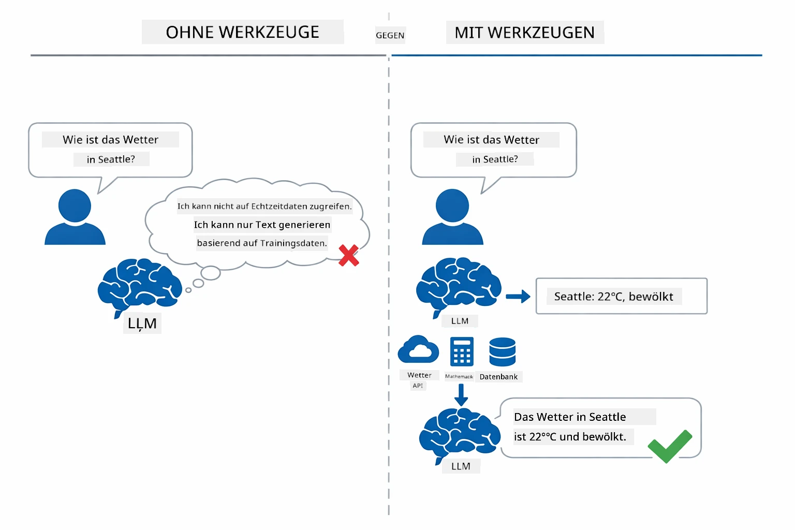

*Ohne Werkzeuge kann das Modell nur raten – mit Werkzeugen kann es APIs aufrufen, Berechnungen durchführen und Echtzeitdaten liefern.*

Ein KI-Agent mit Werkzeugen folgt einem **Reasoning and Acting (ReAct)**-Muster. Das Modell antwortet nicht nur – es denkt darüber nach, was es braucht, handelt, indem es ein Werkzeug aufruft, beobachtet das Ergebnis und entscheidet dann, ob es erneut handelt oder die finale Antwort liefert:

1. **Nachdenken** — Der Agent analysiert die Frage des Nutzers und bestimmt, welche Informationen er braucht
2. **Handeln** — Der Agent wählt das passende Werkzeug, erzeugt die korrekten Parameter und ruft es auf
3. **Beobachten** — Der Agent erhält die Ausgabe des Werkzeugs und bewertet das Ergebnis
4. **Wiederholen oder Antworten** — Wenn mehr Daten benötigt werden, geht der Agent zurück zum Anfang; andernfalls formuliert er eine natürliche Antwort

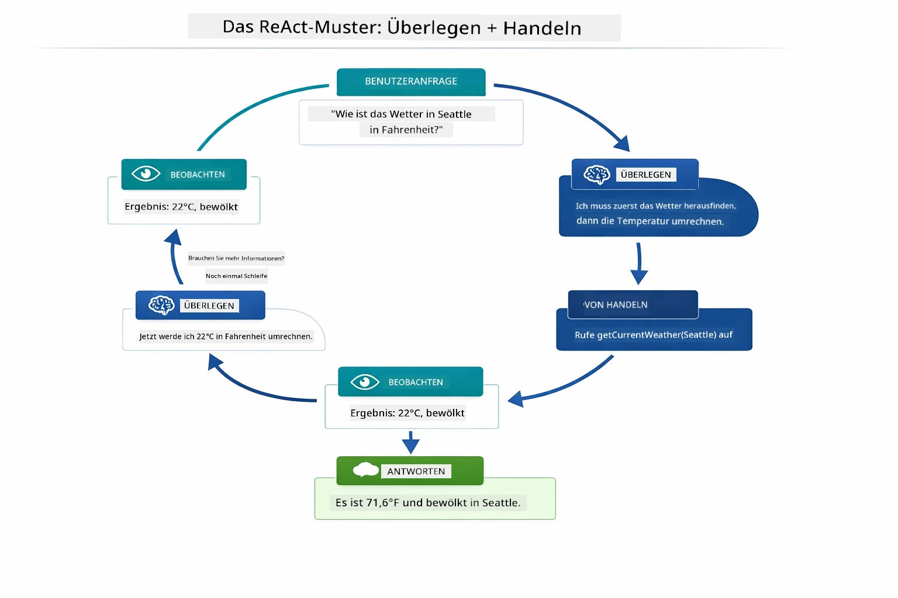

*Der ReAct-Zyklus — der Agent denkt darüber nach, was zu tun ist, handelt, indem er ein Werkzeug aufruft, beobachtet das Ergebnis und wiederholt dies, bis er die finale Antwort liefern kann.*

Dies geschieht automatisch. Du definierst die Werkzeuge und ihre Beschreibungen. Das Modell übernimmt die Entscheidungsfindung darüber, wann und wie es sie nutzen soll.

## Wie Werkzeugaufrufe funktionieren

### Werkzeugdefinitionen

[WeatherTool.java](../../../04-tools/src/main/java/com/example/langchain4j/agents/tools/WeatherTool.java) | [TemperatureTool.java](../../../04-tools/src/main/java/com/example/langchain4j/agents/tools/TemperatureTool.java)

Du definierst Funktionen mit klaren Beschreibungen und Parameterspezifikationen. Das Modell sieht diese Beschreibungen in seinem System-Prompt und versteht, was jedes Werkzeug tut.

```java
@Component
public class WeatherTool {
    
    @Tool("Get the current weather for a location")
    public String getCurrentWeather(@P("Location name") String location) {
        // Ihre Wetterabfrage-Logik
        return "Weather in " + location + ": 22°C, cloudy";
    }
}

@AiService
public interface Assistant {
    String chat(@MemoryId String sessionId, @UserMessage String message);
}

// Assistant wird automatisch von Spring Boot verbunden mit:
// - ChatModel Bean
// - Alle @Tool-Methoden aus @Component-Klassen
// - ChatMemoryProvider zur Sitzungsverwaltung
```

Das folgende Diagramm zerlegt jede Annotation und zeigt, wie jede Komponente der KI hilft zu verstehen, wann das Werkzeug aufzurufen ist und welche Argumente übergeben werden:

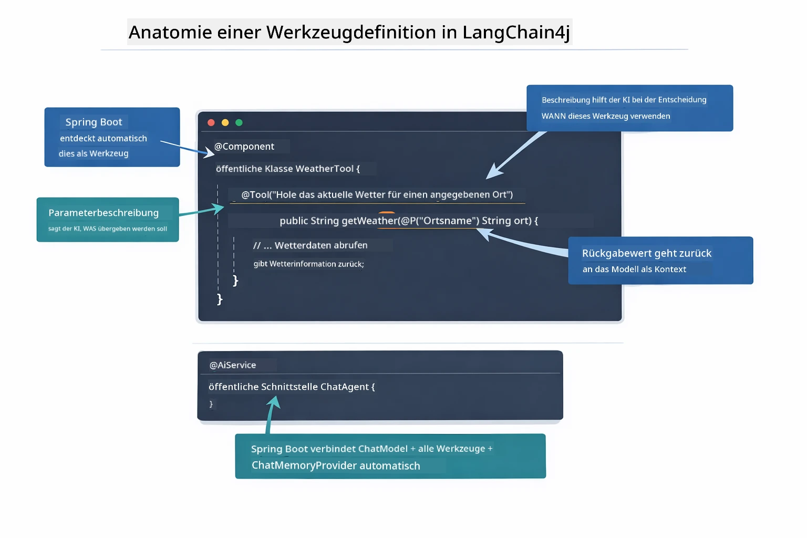

*Anatomie einer Werkzeugdefinition — @Tool sagt der KI, wann sie es nutzen soll, @P beschreibt jeden Parameter, und @AiService verbindet alles beim Start.*

> **🤖 Probiere es mit [GitHub Copilot](https://github.com/features/copilot) Chat:** Öffne [`WeatherTool.java`](../../../04-tools/src/main/java/com/example/langchain4j/agents/tools/WeatherTool.java) und frage:
> - "Wie würde ich eine echte Wetter-API wie OpenWeatherMap anstelle von Mock-Daten integrieren?"
> - "Was macht eine gute Werkzeugbeschreibung aus, die der KI hilft, es richtig zu nutzen?"
> - "Wie handle ich API-Fehler und Rate Limits in Werkzeugimplementierungen?"

### Entscheidungsfindung

Wenn ein Nutzer fragt: „Wie ist das Wetter in Seattle?“, wählt das Modell nicht zufällig ein Werkzeug aus. Es vergleicht die Absicht des Nutzers mit jeder Werkzeugbeschreibung, die ihm zur Verfügung steht, bewertet jede auf Relevanz und wählt die beste Übereinstimmung aus. Es generiert dann einen strukturierten Funktionsaufruf mit den richtigen Parametern – in diesem Fall `location` auf `"Seattle"` gesetzt.

Wenn kein Werkzeug zur Nutzeranfrage passt, greift das Modell auf sein eigenes Wissen zurück. Wenn mehrere Werkzeuge passen, wählt es das spezifischste.

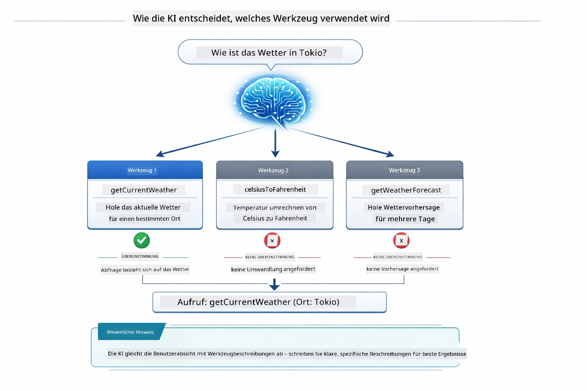

*Das Modell bewertet jedes verfügbare Werkzeug gegen die Nutzerabsicht und wählt die beste Übereinstimmung – deshalb sind klare, spezifische Werkzeugbeschreibungen wichtig.*

### Ausführung

[AgentService.java](../../../04-tools/src/main/java/com/example/langchain4j/agents/service/AgentService.java)

Spring Boot verdrahtet die deklarative `@AiService`-Schnittstelle automatisch mit allen registrierten Werkzeugen, und LangChain4j führt Werkzeugaufrufe automatisch aus. Im Hintergrund durchläuft ein kompletter Werkzeugaufruf sechs Phasen – von der natürlichen Spracheingabe des Nutzers bis zur natürlichen Antwort:

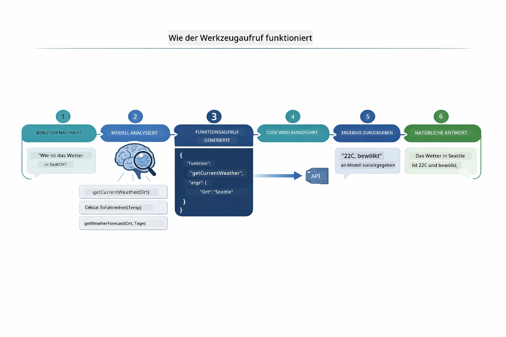

*Der End-to-End-Ablauf — der Nutzer stellt eine Frage, das Modell wählt ein Werkzeug, LangChain4j führt es aus, und das Modell integriert das Ergebnis in eine natürliche Antwort.*

> **🤖 Probiere es mit [GitHub Copilot](https://github.com/features/copilot) Chat:** Öffne [`AgentService.java`](../../../04-tools/src/main/java/com/example/langchain4j/agents/service/AgentService.java) und frage:
> - "Wie funktioniert das ReAct-Muster und warum ist es effektiv für KI-Agenten?"
> - "Wie entscheidet der Agent, welches Werkzeug er benutzt und in welcher Reihenfolge?"
> - "Was passiert, wenn ein Werkzeugaufruf fehlschlägt - wie sollte ich Fehler robust behandeln?"

### Antwortgenerierung

Das Modell erhält die Wetterdaten und formatiert diese zu einer natürlichen Antwort für den Nutzer.

### Architektur: Spring Boot Auto-Wiring

Dieses Modul verwendet LangChain4j’s Spring Boot-Integration mit deklarativen `@AiService`-Schnittstellen. Beim Start entdeckt Spring Boot jede `@Component`, die `@Tool`-Methoden enthält, deinen `ChatModel`-Bean und den `ChatMemoryProvider` – und verdrahtet sie alle zu einer einzigen `Assistant`-Schnittstelle ohne Boilerplate.

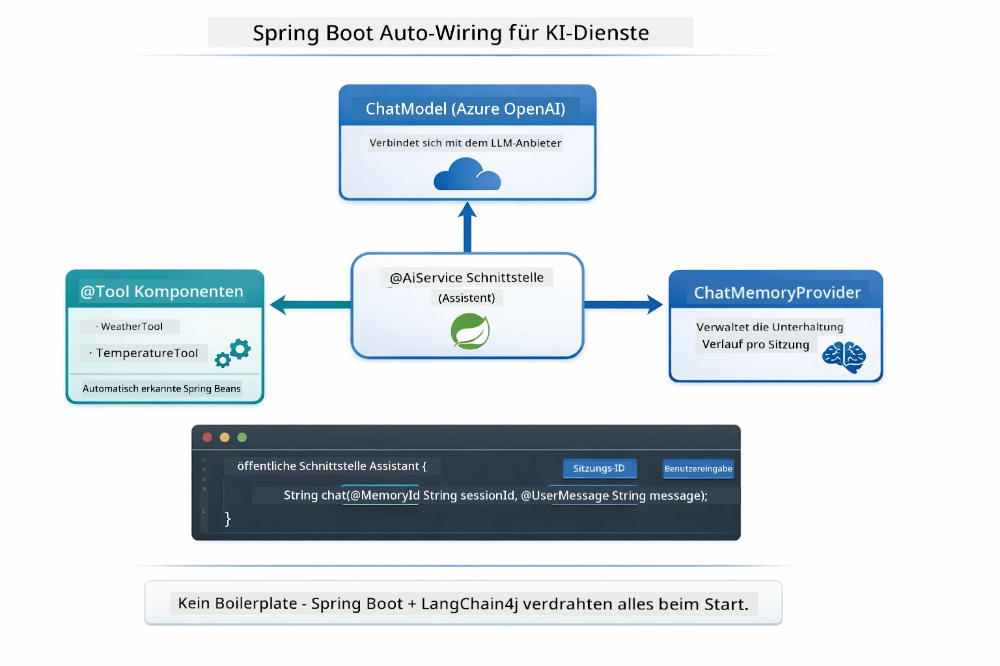

*Die @AiService-Schnittstelle verbindet ChatModel, Werkzeugkomponenten und Gedächtnisprovider – Spring Boot übernimmt die gesamte Verdrahtung automatisch.*

Wichtige Vorteile dieses Ansatzes:

- **Spring Boot Auto-Wiring** — ChatModel und Werkzeuge werden automatisch injiziert
- **@MemoryId-Muster** — Automatisches, sitzungsbasiertes Gedächtnis-Management
- **Einzelinstanz** — Assistant wird einmal erstellt und für bessere Performance wiederverwendet
- **Typsichere Ausführung** — Java-Methoden werden direkt mit Typkonvertierung aufgerufen
- **Mehrstufige Orchestrierung** — Kümmert sich automatisch um Werkzeugverkettung
- **Kein Boilerplate** — Keine manuellen `AiServices.builder()`-Aufrufe oder Memory HashMaps

Alternative Ansätze (manueller `AiServices.builder()`) erfordern mehr Code und verzichten auf Spring Boot Integration Vorteile.

## Werkzeugverkettung

**Werkzeugverkettung** — Die wahre Stärke werkzeugbasierter Agenten zeigt sich, wenn eine einzige Frage mehrere Werkzeuge benötigt. Frag „Wie ist das Wetter in Seattle in Fahrenheit?“ und der Agent verkettet automatisch zwei Werkzeuge: zuerst ruft er `getCurrentWeather` auf, um die Temperatur in Celsius zu erhalten, dann übergibt er diesen Wert an `celsiusToFahrenheit` zur Umrechnung – alles in einem einzelnen Gesprächszyklus.

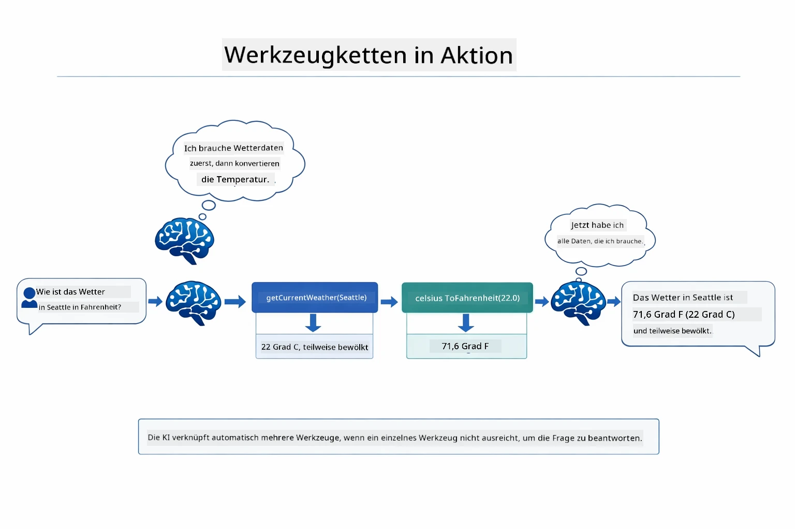

*Werkzeugverkettung in Aktion — der Agent ruft zuerst getCurrentWeather auf, leitet dann das Celsius-Ergebnis an celsiusToFahrenheit weiter und gibt eine kombinierte Antwort.*

So sieht das in der laufenden Anwendung aus — der Agent verkettet zwei Werkzeugaufrufe in einem Gesprächszyklus:

<a href="images/tool-chaining.png"></a>

*Tatsächliche Anwendungsausgabe — der Agent verkettet automatisch getCurrentWeather → celsiusToFahrenheit in einem Zyklus.*

**Elegantes Scheitern** — Frag nach dem Wetter in einer Stadt, die nicht in den Mock-Daten ist. Das Werkzeug gibt eine Fehlermeldung zurück, und die KI erklärt, dass sie nicht helfen kann, anstatt abzustürzen. Werkzeuge schlagen sicher fehl.

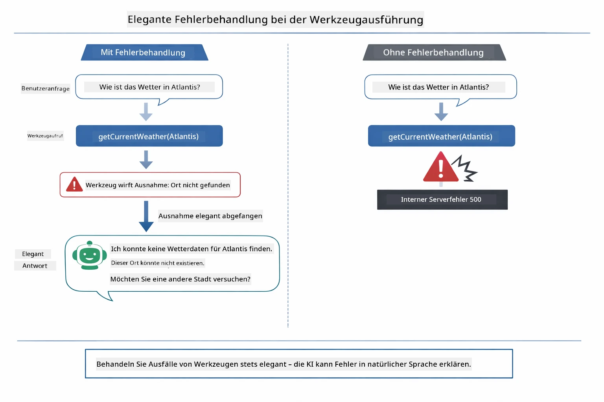

*Wenn ein Werkzeug fehlschlägt, fängt der Agent den Fehler ab und antwortet mit einer hilfreichen Erklärung, statt abzustürzen.*

Dies geschieht in einem einzigen Gesprächszyklus. Der Agent orchestriert mehrere Werkzeugaufrufe autonom.

## Anwendung starten

**Bereitstellung prüfen:**

Stelle sicher, dass die `.env`-Datei im Stammverzeichnis mit Azure-Anmeldeinformationen existiert (wurde während Modul 01 erstellt):
```bash
cat ../.env  # Sollte AZURE_OPENAI_ENDPOINT, API_KEY, DEPLOYMENT anzeigen
```

**Anwendung starten:**

> **Hinweis:** Wenn du bereits alle Anwendungen mit `./start-all.sh` aus Modul 01 gestartet hast, läuft dieses Modul bereits auf Port 8084. Du kannst die Startbefehle unten überspringen und direkt http://localhost:8084 öffnen.

**Option 1: Verwendung des Spring Boot Dashboards (Empfohlen für VS Code Nutzer)**

Der Dev-Container enthält die Spring Boot Dashboard-Erweiterung, die eine visuelle Oberfläche zum Verwalten aller Spring Boot-Anwendungen bietet. Du findest sie in der Aktivitätsleiste links in VS Code (suche das Spring Boot Symbol).

Mit dem Spring Boot Dashboard kannst du:
- Alle verfügbaren Spring Boot-Anwendungen im Arbeitsbereich sehen
- Anwendungen mit einem Klick starten/stoppen
- Log-Ausgaben der Anwendungen in Echtzeit ansehen
- Anwendungsstatus überwachen

Klicke einfach auf den Play-Button neben „tools“, um dieses Modul zu starten, oder starte alle Module zusammen.


**Option 2: Verwendung von Shell-Skripten**

Starte alle Webanwendungen (Module 01-04):

**Bash:**
```bash
cd ..  # Vom Stammverzeichnis
./start-all.sh
```

**PowerShell:**
```powershell
cd ..  # Vom Stammverzeichnis
.\start-all.ps1
```

Oder starte nur dieses Modul:

**Bash:**
```bash
cd 04-tools
./start.sh
```

**PowerShell:**
```powershell
cd 04-tools
.\start.ps1
```

Beide Skripte laden automatisch Umgebungsvariablen aus der `.env`-Datei im Stammverzeichnis und bauen die JARs, falls sie noch nicht existieren.

> **Hinweis:** Wenn du alle Module vor dem Start lieber manuell bauen möchtest:
>
> **Bash:**
> ```bash
> cd ..  # Go to root directory
> mvn clean package -DskipTests
> ```
>
> **PowerShell:**
> ```powershell
> cd ..  # Go to root directory
> mvn clean package -DskipTests
> ```

Öffne http://localhost:8084 in deinem Browser.

**Zum Stoppen:**

**Bash:**
```bash
./stop.sh  # Nur dieses Modul
# Oder
cd .. && ./stop-all.sh  # Alle Module
```

**PowerShell:**
```powershell
.\stop.ps1  # Nur dieses Modul
# Oder
cd ..; .\stop-all.ps1  # Alle Module
```

## Die Anwendung verwenden

Die Anwendung bietet eine Weboberfläche, über die du mit einem KI-Agenten interagieren kannst, der Zugriff auf Wetter- und Temperaturumrechnungswerkzeuge hat.

<a href="images/tools-homepage.png"></a>

*Die KI-Agent Werkzeuge Oberfläche – schnelle Beispiele und Chat-Interface zur Interaktion mit Werkzeugen*

### Einfache Werkzeugnutzung ausprobieren
Beginnen Sie mit einer einfachen Anfrage: „Konvertiere 100 Grad Fahrenheit in Celsius“. Der Agent erkennt, dass er das Werkzeug zur Temperaturumrechnung benötigt, ruft es mit den richtigen Parametern auf und liefert das Ergebnis zurück. Beachten Sie, wie natürlich sich das anfühlt – Sie haben nicht angegeben, welches Werkzeug verwendet werden soll oder wie es aufzurufen ist.

### Werkzeugverkettung testen

Versuchen Sie nun etwas Komplexeres: „Wie ist das Wetter in Seattle und konvertiere es in Fahrenheit?“ Beobachten Sie, wie der Agent dies schrittweise bearbeitet. Er ruft zuerst das Wetter ab (das in Celsius zurückgegeben wird), erkennt, dass er in Fahrenheit umrechnen muss, ruft das Umrechnungswerkzeug auf und kombiniert beide Ergebnisse zu einer Antwort.

### Sehen Sie sich den Gesprächsverlauf an

Die Chat-Oberfläche pflegt den Gesprächsverlauf, sodass Sie mehrstufige Interaktionen führen können. Sie können alle vorherigen Anfragen und Antworten sehen, was es einfach macht, die Unterhaltung nachzuvollziehen und zu verstehen, wie der Agent Kontext über mehrere Austausche aufbaut.

<a href="images/tools-conversation-demo.png"></a>

*Mehrstufiges Gespräch mit einfachen Umrechnungen, Wetterabfragen und Werkzeugverkettung*

### Experimentieren Sie mit verschiedenen Anfragen

Probieren Sie verschiedene Kombinationen:
- Wetterabfragen: „Wie ist das Wetter in Tokio?“
- Temperaturumrechnungen: „Wie viel sind 25°C in Kelvin?“
- Kombinierte Anfragen: „Überprüfe das Wetter in Paris und sag mir, ob es über 20°C liegt“

Beachten Sie, wie der Agent natürliche Sprache interpretiert und in passende Werkzeugaufrufe umsetzt.

## Wichtige Konzepte

### ReAct-Muster (Reasoning and Acting)

Der Agent wechselt zwischen Nachdenken (entscheiden, was zu tun ist) und Handeln (Werkzeuge verwenden). Dieses Muster ermöglicht autonomes Problemlösen und nicht nur das Reagieren auf Anweisungen.

### Werkzeugbeschreibungen sind entscheidend

Die Qualität Ihrer Werkzeugbeschreibungen beeinflusst direkt, wie gut der Agent sie verwendet. Klare, spezifische Beschreibungen helfen dem Modell zu verstehen, wann und wie es jedes Werkzeug aufrufen soll.

### Sitzungsverwaltung

Die `@MemoryId`-Annotation ermöglicht automatische, sitzungsbasierte Speicherverwaltung. Jede Sitzungs-ID erhält eine eigene `ChatMemory`-Instanz, die vom `ChatMemoryProvider`-Bean verwaltet wird, sodass mehrere Benutzer gleichzeitig mit dem Agenten interagieren können, ohne dass sich ihre Gespräche vermischen.

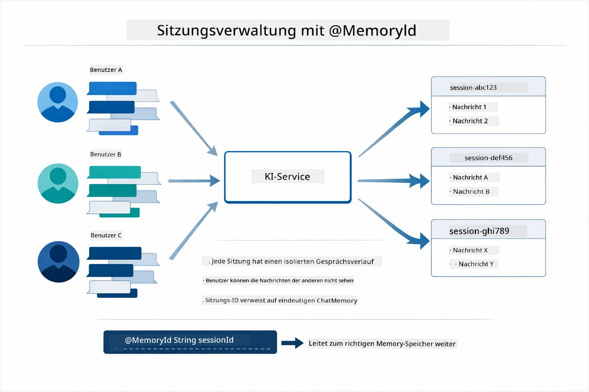

*Jede Sitzungs-ID entspricht einem isolierten Gesprächsverlauf – Benutzer sehen nie die Nachrichten der anderen.*

### Fehlerbehandlung

Werkzeuge können ausfallen – APIs können zeitüberschreiten, Parameter können ungültig sein, externe Dienste können ausfallen. Produktivagenten benötigen Fehlerbehandlung, damit das Modell Probleme erklären oder Alternativen versuchen kann, statt die gesamte Anwendung abstürzen zu lassen. Wenn ein Werkzeug eine Ausnahme wirft, fängt LangChain4j diese ab und gibt die Fehlermeldung an das Modell zurück, das das Problem dann in natürlicher Sprache erklären kann.

## Verfügbare Werkzeuge

Die folgende Abbildung zeigt das breite Ökosystem an Werkzeugen, die Sie bauen können. Dieses Modul demonstriert Wetter- und Temperaturwerkzeuge, aber das gleiche `@Tool`-Muster funktioniert für jede Java-Methode – von Datenbankabfragen bis hin zur Zahlungsabwicklung.

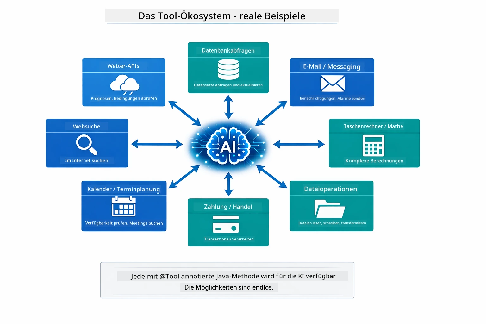

*Jede Java-Methode, die mit @Tool annotiert ist, wird für die KI verfügbar – das Muster erstreckt sich auf Datenbanken, APIs, E-Mail, Dateioperationen und mehr.*

## Wann sollte man Werkzeug-basierte Agenten verwenden

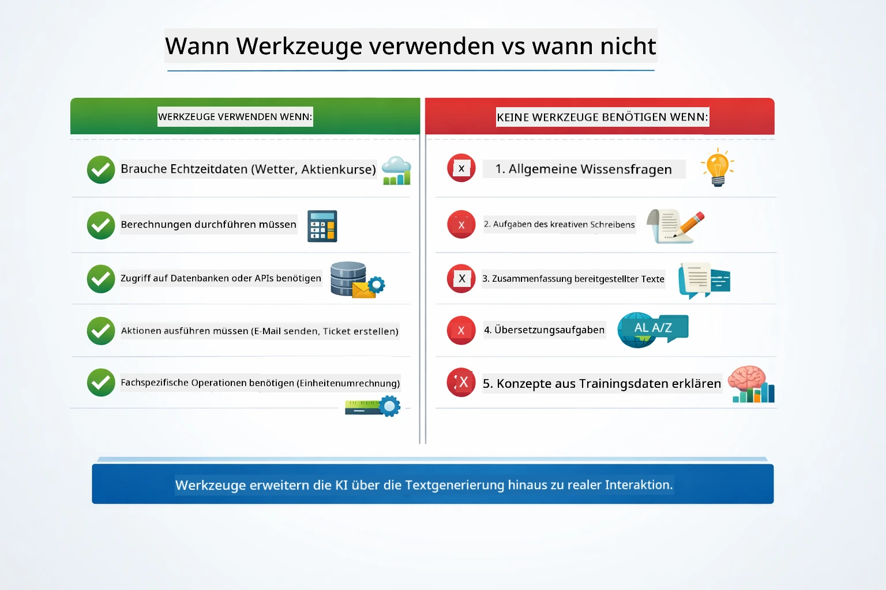

*Eine kurze Entscheidungshilfe – Werkzeuge sind für Echtzeitdaten, Berechnungen und Aktionen; allgemeines Wissen und kreative Aufgaben benötigen sie nicht.*

**Werkzeuge einsetzen, wenn:**
- Antworten Echtzeitdaten erfordern (Wetter, Aktienkurse, Lagerbestand)
- Sie Berechnungen über einfache Mathematik hinaus durchführen müssen
- Zugriff auf Datenbanken oder APIs erforderlich ist
- Aktionen ausgeführt werden (E-Mails senden, Tickets erstellen, Datensätze aktualisieren)
- Mehrere Datenquellen kombiniert werden

**Werkzeuge nicht einsetzen, wenn:**
- Fragen aus allgemeinem Wissen beantwortet werden können
- Die Antwort rein konversationell ist
- Die Werkzeuglatenz das Erlebnis zu sehr verlangsamen würde

## Werkzeuge vs RAG

Die Module 03 und 04 erweitern beide, was die KI kann, aber auf grundsätzlich verschiedene Weisen. RAG gibt dem Modell Zugriff auf **Wissen**, indem Dokumente abgerufen werden. Werkzeuge geben dem Modell die Fähigkeit, **Aktionen** durch Funktionsaufrufe auszuführen.

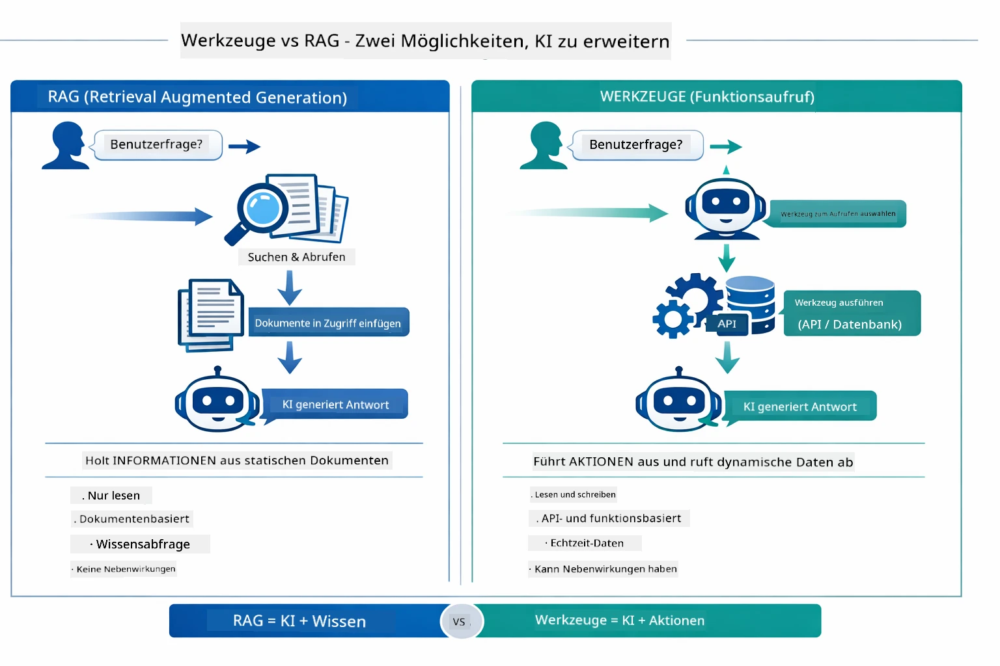

*RAG ruft Informationen aus statischen Dokumenten ab – Werkzeuge führen Aktionen aus und holen dynamische Echtzeitdaten. Viele produktive Systeme kombinieren beides.*

In der Praxis kombinieren viele produktive Systeme beide Ansätze: RAG, um Antworten in Ihrer Dokumentation zu verankern, und Werkzeuge, um Live-Daten abzurufen oder Operationen auszuführen.

## Nächste Schritte

**Nächstes Modul:** [05-mcp - Model Context Protocol (MCP)](../05-mcp/README.md)

---

**Navigation:** [← Zurück: Modul 03 - RAG](../03-rag/README.md) | [Zurück zur Übersicht](../README.md) | [Weiter: Modul 05 - MCP →](../05-mcp/README.md)

---

<!-- CO-OP TRANSLATOR DISCLAIMER START -->
**Haftungsausschluss**:  
Dieses Dokument wurde mit dem KI-Übersetzungsdienst [Co-op Translator](https://github.com/Azure/co-op-translator) übersetzt. Obwohl wir auf Genauigkeit Wert legen, können automatisierte Übersetzungen Fehler oder Ungenauigkeiten enthalten. Das Originaldokument in seiner Ausgangssprache gilt als maßgebliche Quelle. Für wichtige Informationen wird eine professionelle menschliche Übersetzung empfohlen. Wir übernehmen keine Haftung für Missverständnisse oder Fehlinterpretationen, die sich aus der Verwendung dieser Übersetzung ergeben.
<!-- CO-OP TRANSLATOR DISCLAIMER END -->