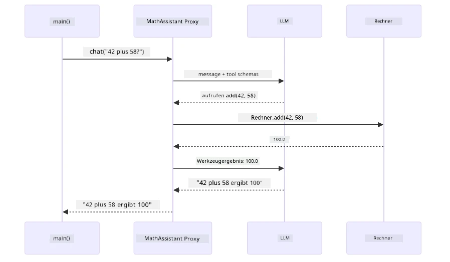
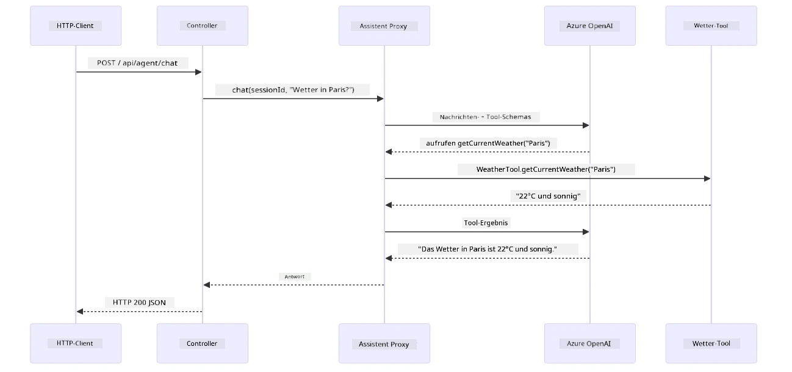

# Modul 04: KI-Agenten mit Tools

## Inhaltsverzeichnis

- [Video-Durchgang](../../../04-tools)
- [Was Sie lernen werden](../../../04-tools)
- [Voraussetzungen](../../../04-tools)
- [KI-Agenten mit Tools verstehen](../../../04-tools)
- [Wie Tool-Aufrufe funktionieren](../../../04-tools)
  - [Tool-Definitionen](../../../04-tools)
  - [Entscheidungsfindung](../../../04-tools)
  - [Ausführung](../../../04-tools)
  - [Antwortgenerierung](../../../04-tools)
  - [Architektur: Spring Boot Auto-Wiring](../../../04-tools)
- [Tool-Verkettung](../../../04-tools)
- [Anwendung ausführen](../../../04-tools)
- [Anwendung verwenden](../../../04-tools)
  - [Einfache Tool-Nutzung ausprobieren](../../../04-tools)
  - [Tool-Verkettung testen](../../../04-tools)
  - [Gesprächsverlauf ansehen](../../../04-tools)
  - [Mit verschiedenen Anfragen experimentieren](../../../04-tools)
- [Wichtige Konzepte](../../../04-tools)
  - [ReAct-Muster (Reasoning and Acting)](../../../04-tools)
  - [Tool-Beschreibungen sind wichtig](../../../04-tools)
  - [Sitzungsverwaltung](../../../04-tools)
  - [Fehlerbehandlung](../../../04-tools)
- [Verfügbare Tools](../../../04-tools)
- [Wann man tool-basierte Agenten verwendet](../../../04-tools)
- [Tools vs RAG](../../../04-tools)
- [Nächste Schritte](../../../04-tools)

## Video-Durchgang

Sehen Sie sich diese Live-Session an, die erklärt, wie Sie mit diesem Modul starten:

<a href="https://www.youtube.com/watch?v=O_J30kZc0rw"></a>

## Was Sie lernen werden

Bis jetzt haben Sie gelernt, wie man Gespräche mit KI führt, Eingabeaufforderungen effektiv strukturiert und Antworten in Ihren Dokumenten verankert. Aber es gibt immer noch eine grundlegende Einschränkung: Sprachmodelle können nur Text generieren. Sie können nicht das Wetter prüfen, Berechnungen durchführen, Datenbanken abfragen oder mit externen Systemen interagieren.

Tools verändern das. Indem Sie dem Modell Zugriff auf Funktionen geben, die es aufrufen kann, verwandeln Sie es von einem Textgenerator in einen Agenten, der handeln kann. Das Modell entscheidet, wann es ein Tool benötigt, welches Tool es nutzt und welche Parameter es übergibt. Ihr Code führt die Funktion aus und liefert das Ergebnis zurück. Das Modell integriert dieses Ergebnis in seine Antwort.

## Voraussetzungen

- Abgeschlossenes [Modul 01 – Einführung](../01-introduction/README.md) (Azure OpenAI Ressourcen bereitgestellt)
- Empfohlen, vorherige Module abgeschlossen zu haben (dieses Modul verweist auf [RAG-Konzepte aus Modul 03](../03-rag/README.md) im Vergleich Tools vs. RAG)
- `.env`-Datei im Stammverzeichnis mit Azure-Anmeldedaten (erstellt durch `azd up` in Modul 01)

> **Hinweis:** Wenn Sie Modul 01 noch nicht abgeschlossen haben, folgen Sie zuerst den dortigen Bereitstellungsanweisungen.

## KI-Agenten mit Tools verstehen

> **📝 Hinweis:** Der Begriff „Agenten“ in diesem Modul bezieht sich auf KI-Assistenten mit Tool-Aufruf-Fähigkeiten. Dies unterscheidet sich von den **Agentic AI** Mustern (autonome Agenten mit Planung, Gedächtnis und mehrstufigem Schlussfolgern), die wir in [Modul 05: MCP](../05-mcp/README.md) behandeln.

Ohne Tools kann ein Sprachmodell nur Text aus seinen Trainingsdaten generieren. Fragen Sie es nach dem aktuellen Wetter, muss es raten. Geben Sie ihm Tools, kann es eine Wetter-API aufrufen, Berechnungen durchführen oder eine Datenbank abfragen – und diese echten Ergebnisse in seine Antwort einfließen lassen.


*Ohne Tools kann das Modell nur raten – mit Tools kann es APIs aufrufen, Berechnungen durchführen und Echtzeitdaten liefern.*

Ein KI-Agent mit Tools folgt dem **Reasoning and Acting (ReAct)** Muster. Das Modell antwortet nicht einfach – es denkt darüber nach, was es braucht, handelt durch Tool-Aufrufe, beobachtet das Ergebnis und entscheidet dann, ob es erneut handeln oder die finale Antwort liefern soll:

1. **Nachdenken** — Der Agent analysiert die Frage des Nutzers und bestimmt, welche Informationen er benötigt
2. **Handeln** — Der Agent wählt das richtige Tool aus, erzeugt die passenden Parameter und ruft es auf
3. **Beobachten** — Der Agent empfängt die Ausgabe des Tools und bewertet das Ergebnis
4. **Wiederholen oder Antworten** — Wenn weitere Daten nötig sind, wiederholt der Agent den Zyklus; sonst formuliert er eine natürliche Antwort


*Der ReAct-Zyklus – der Agent denkt darüber nach, was zu tun ist, handelt durch Tool-Aufrufe, beobachtet das Ergebnis und wiederholt dies, bis eine Endantwort vorliegt.*

Dies geschieht automatisch. Sie definieren die Tools und deren Beschreibungen. Das Modell übernimmt die Entscheidungsfindung, wann und wie sie genutzt werden.

## Wie Tool-Aufrufe funktionieren

### Tool-Definitionen

[WeatherTool.java](../../../04-tools/src/main/java/com/example/langchain4j/agents/tools/WeatherTool.java) | [TemperatureTool.java](../../../04-tools/src/main/java/com/example/langchain4j/agents/tools/TemperatureTool.java)

Sie definieren Funktionen mit klaren Beschreibungen und Parameterspezifikationen. Das Modell sieht diese Beschreibungen in seinem System-Prompt und versteht, was jedes Tool macht.

```java
@Component
public class WeatherTool {
    
    @Tool("Get the current weather for a location")
    public String getCurrentWeather(@P("Location name") String location) {
        // Ihre Wetterabfrage-Logik
        return "Weather in " + location + ": 22°C, cloudy";
    }
}

@AiService
public interface Assistant {
    String chat(@MemoryId String sessionId, @UserMessage String message);
}

// Assistant wird automatisch von Spring Boot verbunden mit:
// - ChatModel-Bean
// - Alle @Tool-Methoden aus @Component-Klassen
// - ChatMemoryProvider für Sitzungsverwaltung
```
  
Das folgende Diagramm zerlegt jede Annotation und zeigt, wie jedes Element der KI hilft zu verstehen, wann das Tool aufzurufen ist und welche Argumente übergeben werden sollen:


*Anatomie einer Tool-Definition – @Tool sagt der KI, wann sie verwendet wird, @P beschreibt jeden Parameter und @AiService verknüpft alles beim Start.*

> **🤖 Probieren Sie es mit [GitHub Copilot](https://github.com/features/copilot) Chat:** Öffnen Sie [`WeatherTool.java`](../../../04-tools/src/main/java/com/example/langchain4j/agents/tools/WeatherTool.java) und fragen Sie:
> - „Wie integriere ich eine echte Wetter-API wie OpenWeatherMap anstelle von Mock-Daten?“
> - „Was macht eine gute Tool-Beschreibung aus, die der KI hilft, sie korrekt zu verwenden?“
> - „Wie handle ich API-Fehler und Rate Limits in Tool-Implementierungen?“

### Entscheidungsfindung

Wenn ein Nutzer fragt „Wie ist das Wetter in Seattle?“, wählt das Modell nicht zufällig ein Tool aus. Es vergleicht die Absicht des Nutzers mit jeder verfügbaren Tool-Beschreibung, bewertet deren Relevanz und wählt die beste Übereinstimmung aus. Dann generiert es einen strukturierten Funktionsaufruf mit den richtigen Parametern – hier `location` auf `"Seattle"` gesetzt.

Wenn kein Tool zur Benutzeranfrage passt, fällt das Modell auf Antworten aus seinem eigenen Wissen zurück. Bei mehreren passenden Tools wählt es das speziellste.


*Das Modell bewertet jedes verfügbare Tool im Hinblick auf die Nutzerabsicht und wählt das beste – deswegen sind klare, spezifische Tool-Beschreibungen wichtig.*

### Ausführung

[AgentService.java](../../../04-tools/src/main/java/com/example/langchain4j/agents/service/AgentService.java)

Spring Boot verdrahtet die deklarative `@AiService` Schnittstelle mit allen registrierten Tools automatisch, und LangChain4j führt Tool-Aufrufe selbstständig aus. Im Hintergrund durchläuft ein Tool-Aufruf sechs Stufen – von der nativen Nutzerspracheingabe bis zur natürlichen Antwort:


*End-to-End Ablauf – der Nutzer stellt eine Frage, das Modell wählt ein Tool aus, LangChain4j führt es aus, und das Modell integriert das Ergebnis in die natürliche Antwort.*

Wenn Sie die [ToolIntegrationDemo](../../../00-quick-start/src/main/java/com/example/langchain4j/quickstart/ToolIntegrationDemo.java) aus Modul 00 ausgeführt haben, haben Sie dieses Muster schon gesehen – die `Calculator`-Tools wurden genauso aufgerufen. Das folgende Sequenzdiagramm zeigt genau, was während dieser Demo unter der Haube geschah:



*Die Tool-Aufruf-Schleife aus der Quick Start Demo – `AiServices` schickt Ihre Nachricht und Tool-Schemata an das LLM, das LLM antwortet mit einem Funktionsaufruf wie `add(42, 58)`, LangChain4j führt die `Calculator` Methode lokal aus und gibt das Ergebnis für die finale Antwort zurück.*

> **🤖 Probieren Sie es mit [GitHub Copilot](https://github.com/features/copilot) Chat:** Öffnen Sie [`AgentService.java`](../../../04-tools/src/main/java/com/example/langchain4j/agents/service/AgentService.java) und fragen Sie:
> - „Wie funktioniert das ReAct-Muster und warum ist es für KI-Agenten effektiv?“
> - „Wie entscheidet der Agent, welches Tool er wann nutzt?“
> - „Was passiert, wenn die Ausführung eines Tools fehlschlägt – wie behandle ich Fehler robust?“

### Antwortgenerierung

Das Modell erhält die Wetterdaten und formatiert sie als eine natürliche Antwort für den Nutzer.

### Architektur: Spring Boot Auto-Wiring

Dieses Modul verwendet LangChain4j’s Spring Boot Integration mit deklarativen `@AiService` Schnittstellen. Beim Start entdeckt Spring Boot jede `@Component`, die `@Tool` Methoden enthält, ihre `ChatModel` Bean und den `ChatMemoryProvider` – und verdrahtet sie alle in eine einzige `Assistant` Schnittstelle ohne Boilerplate.


*Die @AiService Schnittstelle verbindet ChatModel, Tool-Komponenten und Memory Provider – Spring Boot übernimmt die komplette Verkabelung automatisch.*

Hier sehen Sie den kompletten Anforderungslebenszyklus als Sequenzdiagramm – von der HTTP-Anfrage über Controller, Service und verdrahteten Proxy bis zur Tool-Ausführung und zurück:



*Der vollständige Spring Boot Anforderungszyklus – HTTP-Anfrage fließt durch Controller und Service zum verdrahteten Assistant Proxy, der LLM und Tool-Aufrufe automatisch orchestriert.*

Wichtige Vorteile dieses Ansatzes:

- **Spring Boot Auto-Wiring** – ChatModel und Tools werden automatisch injiziert
- **@MemoryId Muster** – Automatisches memory-basiertes Sitzungsmanagement
- **Einzelne Instanz** – Assistant wird einmalig erstellt und für bessere Performance wiederverwendet
- **Typsichere Ausführung** – Java-Methoden werden direkt mit Typumwandlung aufgerufen
- **Multi-Turn Orchestrierung** – Unterstützt automatische Tool-Verkettung
- **Zero Boilerplate** – Keine manuellen `AiServices.builder()` Aufrufe oder Memory HashMap

Alternative Ansätze (manuelles `AiServices.builder()`) erfordern mehr Code und verzichten auf Spring Boot Integrationsvorteile.

## Tool-Verkettung

**Tool-Verkettung** – Die tatsächliche Stärke von tool-basierten Agenten zeigt sich, wenn eine einzelne Frage mehrere Tools erfordert. Fragen Sie „Wie ist das Wetter in Seattle in Fahrenheit?“ und der Agent verknüpft automatisch zwei Tools: zuerst ruft er `getCurrentWeather` auf, um die Temperatur in Celsius zu erhalten, dann übergibt er diesen Wert an `celsiusToFahrenheit` für die Umrechnung – alles in einem einzigen Gesprächsturn.


*Tool-Verkettung in Aktion – der Agent ruft zuerst getCurrentWeather auf, leitet das Celsius-Ergebnis an celsiusToFahrenheit weiter und liefert eine kombinierte Antwort.*

**Abschwächung von Fehlern** – Fragen Sie nach dem Wetter in einer Stadt, die nicht in den Mock-Daten ist. Das Tool gibt eine Fehlermeldung zurück, und die KI erklärt, dass sie nicht helfen kann, anstatt abzustürzen. Tools fallen sicher aus. Das folgende Diagramm zeigt den Unterschied zwischen den beiden Ansätzen – mit ordentlicher Fehlerbehandlung fängt der Agent die Ausnahme auf und antwortet hilfreich, ohne sie stürzt die gesamte Anwendung ab:


*Wenn ein Tool fehlschlägt, fängt der Agent den Fehler ab und antwortet mit einer hilfreichen Erklärung, statt dass es zum Absturz kommt.*

Dies geschieht in einem einzigen Gesprächsschritt. Der Agent orchestriert mehrere Tool-Aufrufe autonom.

## Anwendung ausführen

**Bereitstellung überprüfen:**

Stellen Sie sicher, dass die `.env`-Datei im Stammverzeichnis mit Azure-Zugangsdaten vorhanden ist (erstellt während Modul 01). Führen Sie dies im Modulsverzeichnis (`04-tools/`) aus:

**Bash:**  
```bash
cat ../.env  # Sollte AZURE_OPENAI_ENDPOINT, API_KEY, DEPLOYMENT anzeigen
```
  
**PowerShell:**  
```powershell
Get-Content ..\.env  # Sollte AZURE_OPENAI_ENDPOINT, API_KEY, DEPLOYMENT anzeigen
```
  
**Starten der Anwendung:**

> **Hinweis:** Falls Sie bereits alle Anwendungen mit `./start-all.sh` aus dem Stammverzeichnis gestartet haben (wie in Modul 01 beschrieben), läuft dieses Modul bereits auf Port 8084. Sie können die Startbefehle unten überspringen und direkt http://localhost:8084 aufrufen.

**Option 1: Verwendung des Spring Boot Dashboards (Empfohlen für VS Code Nutzer)**

Der Dev Container enthält die Erweiterung Spring Boot Dashboard, welche eine visuelle Oberfläche zur Verwaltung aller Spring Boot Anwendungen bereitstellt. Sie finden sie in der Aktivitätsleiste links in VS Code (suchen Sie das Spring Boot Symbol).

Im Spring Boot Dashboard können Sie:  
- Alle verfügbaren Spring Boot Anwendungen im Workspace sehen  
- Anwendungen mit einem Klick starten/stoppen  
- Echtzeit-Protokolle anzeigen  
- Den Anwendungsstatus überwachen
Klicken Sie einfach auf die Wiedergabetaste neben „tools“, um dieses Modul zu starten, oder starten Sie alle Module auf einmal.

So sieht das Spring Boot Dashboard in VS Code aus:


*Das Spring Boot Dashboard in VS Code — alle Module von einem Ort aus starten, stoppen und überwachen*

**Option 2: Verwendung von Shell-Skripten**

Starten Sie alle Webanwendungen (Module 01-04):

**Bash:**
```bash
cd ..  # Vom Stammverzeichnis
./start-all.sh
```

**PowerShell:**
```powershell
cd ..  # Vom Stammverzeichnis
.\start-all.ps1
```

Oder starten Sie nur dieses Modul:

**Bash:**
```bash
cd 04-tools
./start.sh
```

**PowerShell:**
```powershell
cd 04-tools
.\start.ps1
```

Beide Skripte laden automatisch Umgebungsvariablen aus der Root-`.env`-Datei und bauen die JARs, falls sie noch nicht existieren.

> **Hinweis:** Wenn Sie alle Module manuell vor dem Start bauen möchten:
>
> **Bash:**
> ```bash
> cd ..  # Go to root directory
> mvn clean package -DskipTests
> ```
>
> **PowerShell:**
> ```powershell
> cd ..  # Go to root directory
> mvn clean package -DskipTests
> ```

Öffnen Sie http://localhost:8084 in Ihrem Browser.

**Zum Stoppen:**

**Bash:**
```bash
./stop.sh  # Nur dieses Modul
# Oder
cd .. && ./stop-all.sh  # Alle Module
```

**PowerShell:**
```powershell
.\stop.ps1  # Nur dieses Modul
# Oder
cd ..; .\stop-all.ps1  # Alle Module
```

## Verwendung der Anwendung

Die Anwendung bietet eine Weboberfläche, über die Sie mit einem KI-Agenten interagieren können, der Zugriff auf Wetter- und Temperaturumrechner-Tools hat. So sieht die Oberfläche aus — sie enthält Schnellstart-Beispiele und ein Chatfenster zum Senden von Anfragen:

<a href="images/tools-homepage.png"></a>

*Die AI Agent Tools-Oberfläche – Schnellbeispiele und Chat-Interface zur Interaktion mit Tools*

### Einfachen Tool-Einsatz ausprobieren

Starten Sie mit einer einfachen Anfrage: „Convert 100 degrees Fahrenheit to Celsius“. Der Agent erkennt, dass er das Temperaturumrechnungstool benötigt, ruft es mit den richtigen Parametern auf und liefert das Ergebnis zurück. Beachten Sie, wie natürlich sich das anfühlt – Sie haben nicht angegeben, welches Tool zu verwenden ist oder wie es aufgerufen wird.

### Tool-Verkettung testen

Versuchen Sie nun etwas Komplexeres: „What’s the weather in Seattle and convert it to Fahrenheit?“ Sehen Sie, wie der Agent dies in Schritten abarbeitet. Zuerst holt er die Wetterdaten (die in Celsius zurückgegeben werden), erkennt, dass eine Umrechnung zu Fahrenheit nötig ist, ruft das Umrechnungstool auf und kombiniert beide Ergebnisse zu einer Antwort.

### Gesprächsverlauf ansehen

Die Chat-Oberfläche speichert den Gesprächsverlauf, sodass Sie mehrstufige Interaktionen führen können. Sie können alle vorherigen Anfragen und Antworten sehen, was es einfach macht, das Gespräch nachzuvollziehen und zu verstehen, wie der Agent Kontext über mehrere Austausche aufbaut.

<a href="images/tools-conversation-demo.png"></a>

*Mehrstufiges Gespräch mit einfachen Umrechnungen, Wetterabfragen und Tool-Verkettung*

### Verschiedene Anfragen ausprobieren

Testen Sie verschiedene Kombinationen:
- Wetterabfragen: „What’s the weather in Tokyo?“
- Temperaturumrechnungen: „What is 25°C in Kelvin?“
- Kombinierte Anfragen: „Check the weather in Paris and tell me if it’s above 20°C“

Beachten Sie, wie der Agent natürliche Sprache interpretiert und in passende Tool-Aufrufe übersetzt.

## Wichtige Konzepte

### ReAct-Muster (Reasoning and Acting)

Der Agent wechselt zwischen Überlegung (was zu tun ist) und Ausführung (Einsatz von Tools). Dieses Muster ermöglicht eigenständige Problemlösung anstatt nur auf Anweisungen zu reagieren.

### Tool-Beschreibungen sind entscheidend

Die Qualität Ihrer Tool-Beschreibungen beeinflusst direkt, wie gut der Agent sie nutzt. Klare, spezifische Beschreibungen helfen dem Modell zu verstehen, wann und wie jedes Tool aufgerufen wird.

### Sitzungsverwaltung

Die `@MemoryId`-Annotation ermöglicht automatische sessionsbasierte Speicherverwaltung. Jede Sitzungs-ID erhält eine eigene `ChatMemory`-Instanz, die vom `ChatMemoryProvider`-Bean verwaltet wird, sodass mehrere Benutzer gleichzeitig mit dem Agenten interagieren können, ohne dass sich ihre Gespräche vermischen. Das folgende Diagramm zeigt, wie mehrere Benutzer anhand ihrer Sitzungs-IDs zu isolierten Speicherbereichen geleitet werden:


*Jede Sitzungs-ID führt zu einem isolierten Gesprächsverlauf – Benutzer sehen niemals die Nachrichten anderer.*

### Fehlerbehandlung

Tools können fehlschlagen – APIs laufen zeitüberschreitend ab, Parameter können ungültig sein, externe Dienste ausfallen. Produktionsagenten benötigen Fehlerbehandlung, damit das Modell Probleme erklären oder Alternativen versuchen kann statt die gesamte Anwendung abstürzen zu lassen. Wenn ein Tool eine Ausnahme wirft, fängt LangChain4j diese ab und gibt die Fehlermeldung an das Modell zurück, das dann das Problem in natürlicher Sprache erklären kann.

## Verfügbare Tools

Das folgende Diagramm zeigt das breite Ökosystem an Tools, die Sie bauen können. Dieses Modul zeigt Wetter- und Temperatur-Tools, aber dasselbe `@Tool`-Muster funktioniert für jede Java-Methode — von Datenbankabfragen bis hin zur Zahlungsabwicklung.


*Jede mit @Tool annotierte Java-Methode steht der KI zur Verfügung — das Muster lässt sich auf Datenbanken, APIs, E-Mail, Dateioperationen und mehr erweitern.*

## Wann man toolbasierte Agenten einsetzt

Nicht jede Anfrage benötigt Tools. Die Entscheidung hängt davon ab, ob die KI mit externen Systemen interagieren muss oder aus eigenem Wissen antworten kann. Der folgende Leitfaden fasst zusammen, wann Tools sinnvoll sind und wann nicht:


*Kurzer Entscheidungsleitfaden – Tools sind für Echtzeitdaten, Berechnungen und Aktionen; allgemeines Wissen und kreative Aufgaben benötigen sie nicht.*

## Tools vs RAG

Die Module 03 und 04 erweitern beide die Fähigkeiten der KI, aber auf grundlegend unterschiedliche Weise. RAG gibt dem Modell Zugriff auf **Wissen** durch das Abrufen von Dokumenten. Tools geben dem Modell die Möglichkeit, **Aktionen** durch Funktionsaufrufe auszuführen. Das folgende Diagramm vergleicht diese beiden Ansätze nebeneinander – vom jeweiligen Ablauf bis zu den Kompromissen zwischen ihnen:


*RAG ruft Informationen aus statischen Dokumenten ab – Tools führen Aktionen aus und holen dynamische, Echtzeit-Daten. Viele produktive Systeme kombinieren beide.*

In der Praxis kombinieren viele produktive Systeme beide Ansätze: RAG, um Antworten auf Basis Ihrer Dokumentation zu verankern, und Tools, um Live-Daten abzurufen oder Operationen durchzuführen.

## Nächste Schritte

**Nächstes Modul:** [05-mcp - Model Context Protocol (MCP)](../05-mcp/README.md)

---

**Navigation:** [← Zurück: Modul 03 - RAG](../03-rag/README.md) | [Zurück zum Hauptmenü](../README.md) | [Weiter: Modul 05 - MCP →](../05-mcp/README.md)

---

<!-- CO-OP TRANSLATOR DISCLAIMER START -->
**Haftungsausschluss**:  
Dieses Dokument wurde mit dem KI-Übersetzungsdienst [Co-op Translator](https://github.com/Azure/co-op-translator) übersetzt. Obwohl wir auf Genauigkeit achten, können automatisierte Übersetzungen Fehler oder Ungenauigkeiten enthalten. Das Originaldokument in seiner Ursprungssprache ist als maßgebliche Quelle zu betrachten. Für kritische Informationen wird eine professionelle menschliche Übersetzung empfohlen. Wir übernehmen keine Haftung für Missverständnisse oder Fehlinterpretationen, die aus der Nutzung dieser Übersetzung entstehen.
<!-- CO-OP TRANSLATOR DISCLAIMER END -->