# Modul 05: Model Context Protocol (MCP)

## Inhaltsverzeichnis

- [Video-Durchgang](../../../05-mcp)
- [Was Du Lernen Wirst](../../../05-mcp)
- [Was ist MCP?](../../../05-mcp)
- [Wie MCP Funktioniert](../../../05-mcp)
- [Das Agentic-Modul](../../../05-mcp)
- [Die Beispiele Ausführen](../../../05-mcp)
  - [Voraussetzungen](../../../05-mcp)
- [Schnellstart](../../../05-mcp)
  - [Dateioperationen (Stdio)](../../../05-mcp)
  - [Supervisor-Agent](../../../05-mcp)
    - [Demo Ausführen](../../../05-mcp)
    - [Wie der Supervisor Funktioniert](../../../05-mcp)
    - [Wie FileAgent MCP-Tools zur Laufzeit Entdeckt](../../../05-mcp)
    - [Antwortstrategien](../../../05-mcp)
    - [Das Ergebnis Verstehen](../../../05-mcp)
    - [Erklärung der Funktionen des Agentic-Moduls](../../../05-mcp)
- [Schlüsselkonzepte](../../../05-mcp)
- [Glückwunsch!](../../../05-mcp)
  - [Was kommt als Nächstes?](../../../05-mcp)

## Video-Durchgang

Sieh dir diese Live-Sitzung an, die erklärt, wie du mit diesem Modul startest:

<a href="https://www.youtube.com/watch?v=O_J30kZc0rw"></a>

## Was Du Lernen Wirst

Du hast konversationelle KI gebaut, Prompts gemeistert, Antworten in Dokumenten verankert und Agenten mit Tools erstellt. Aber all diese Tools waren speziell für deine Anwendung maßgeschneidert. Was wäre, wenn du deiner KI Zugriff auf ein standardisiertes Ökosystem von Tools geben könntest, die jeder erstellen und teilen kann? In diesem Modul lernst du genau das mit dem Model Context Protocol (MCP) und dem agentischen Modul von LangChain4j. Zuerst zeigen wir einen einfachen MCP-Dateileser und dann, wie er sich einfach in fortgeschrittene agentische Workflows mittels des Supervisor-Agent-Musters integriert.

## Was ist MCP?

Das Model Context Protocol (MCP) bietet genau das – eine standardisierte Methode, wie KI-Anwendungen externe Tools entdecken und verwenden können. Statt für jede Datenquelle oder jeden Dienst individuelle Integrationen zu schreiben, verbindest du dich mit MCP-Servern, die ihre Funktionen in einem einheitlichen Format bereitstellen. Dein KI-Agent kann diese Tools dann automatisch entdecken und nutzen.

Das untenstehende Diagramm zeigt den Unterschied – ohne MCP erfordert jede Integration individuelle Punkt-zu-Punkt-Verbindungen; mit MCP verbindet ein einziges Protokoll deine App mit jedem Tool:


*Vor MCP: Komplexe Punkt-zu-Punkt-Integrationen. Nach MCP: Ein Protokoll, endlose Möglichkeiten.*

MCP löst ein grundlegendes Problem in der KI-Entwicklung: jede Integration ist maßgeschneidert. Möchtest du auf GitHub zugreifen? Eigenes Coding. Möchtest du Dateien lesen? Eigenes Coding. Möchtest du eine Datenbank abfragen? Eigenes Coding. Und keine dieser Integrationen funktioniert mit anderen KI-Anwendungen.

MCP standardisiert dies. Ein MCP-Server stellt Tools mit klaren Beschreibungen und Schemata bereit. Jeder MCP-Client kann sich verbinden, verfügbare Tools entdecken und diese nutzen. Einmal bauen, überall verwenden.

Das folgende Diagramm illustriert diese Architektur – ein einzelner MCP-Client (deine KI-Anwendung) verbindet sich mit mehreren MCP-Servern, die jeweils ihre eigenen Tools über das Standardprotokoll exposen:


*Model Context Protocol Architektur – standardisierte Tool-Erkennung und -Ausführung*

## Wie MCP Funktioniert

Im Hintergrund verwendet MCP eine geschichtete Architektur. Deine Java-Anwendung (der MCP-Client) entdeckt verfügbare Tools, sendet JSON-RPC-Anfragen über eine Transportschicht (Stdio oder HTTP), und der MCP-Server führt Operationen aus und liefert Ergebnisse zurück. Die folgende Grafik zeigt jede Ebene dieses Protokolls im Detail:

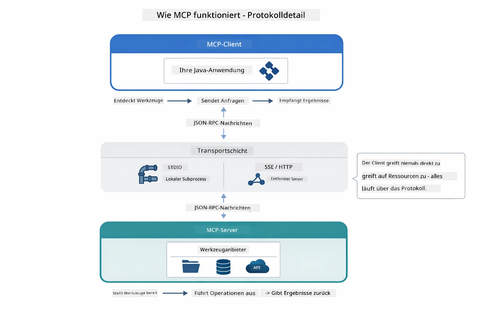

*Wie MCP im Hintergrund funktioniert — Clients entdecken Tools, tauschen JSON-RPC-Nachrichten aus und führen Operationen über eine Transportschicht aus.*

**Server-Client-Architektur**

MCP verwendet ein Client-Server-Modell. Server stellen Tools bereit – Datei lesen, Datenbank abfragen, APIs aufrufen. Clients (deine KI-Anwendung) verbinden sich mit Servern und nutzen deren Tools.

Um MCP mit LangChain4j zu nutzen, füge diese Maven-Abhängigkeit hinzu:

```xml
<dependency>
    <groupId>dev.langchain4j</groupId>
    <artifactId>langchain4j-mcp</artifactId>
    <version>${langchain4j.version}</version>
</dependency>
```

**Tool-Erkennung**

Wenn sich dein Client mit einem MCP-Server verbindet, fragt er: "Welche Tools hast du?" Der Server antwortet mit einer Liste verfügbarer Tools, jeweils mit Beschreibungen und Parameterschemata. Dein KI-Agent kann dann basierend auf Nutzeranfragen entscheiden, welche Tools er nutzt. Das folgende Diagramm zeigt diesen Handshake – der Client sendet eine `tools/list`-Anfrage und der Server gibt seine verfügbaren Tools mit Beschreibungen und Schemas zurück:

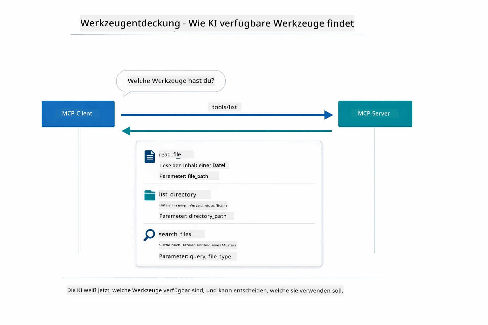

*Die KI entdeckt beim Start verfügbare Tools — sie weiß jetzt, welche Funktionen verfügbar sind, und kann entscheiden, welche sie verwendet.*

**Transportmechanismen**

MCP unterstützt verschiedene Transportmechanismen. Die beiden Optionen sind Stdio (für lokale Subprozess-Kommunikation) und Streamable HTTP (für entfernte Server). Dieses Modul demonstriert den Stdio-Transport:


*MCP-Transportmechanismen: HTTP für entfernte Server, Stdio für lokale Prozesse*

**Stdio** - [StdioTransportDemo.java](../../../05-mcp/src/main/java/com/example/langchain4j/mcp/StdioTransportDemo.java)

Für lokale Prozesse. Deine Anwendung startet einen Server als Subprozess und kommuniziert über Standard-Ein-/Ausgabe. Nützlich für Zugriff auf Dateisystem oder Kommandozeilen-Tools.

```java
McpTransport stdioTransport = new StdioMcpTransport.Builder()
    .command(List.of(
        npmCmd, "exec",
        "@modelcontextprotocol/server-filesystem@2025.12.18",
        resourcesDir
    ))
    .logEvents(false)
    .build();
```

Der `@modelcontextprotocol/server-filesystem`-Server stellt folgende Tools bereit, alle auf die von dir angegebenen Verzeichnisse beschränkt:

| Tool                | Beschreibung                                               |
|---------------------|------------------------------------------------------------|
| `read_file`         | Den Inhalt einer einzelnen Datei lesen                     |
| `read_multiple_files`| Mehrere Dateien in einem Aufruf lesen                      |
| `write_file`        | Eine Datei erstellen oder überschreiben                      |
| `edit_file`         | Gezielte Suchen-und-Ersetzen-Bearbeitungen durchführen      |
| `list_directory`    | Dateien und Verzeichnisse an einem Pfad auflisten            |
| `search_files`      | Rekursiv nach Dateien suchen, die einem Muster entsprechen  |
| `get_file_info`     | Dateimetadaten erhalten (Größe, Zeitstempel, Berechtigungen)|
| `create_directory`  | Ein Verzeichnis erstellen (inklusive übergeordneter Verzeichnisse)|
| `move_file`         | Eine Datei oder ein Verzeichnis verschieben oder umbenennen |

Das folgende Diagramm zeigt, wie der Stdio-Transport zur Laufzeit funktioniert — deine Java-Anwendung startet den MCP-Server als Kindprozess, und sie kommunizieren über stdin/stdout-Pipes, ohne Netzwerk oder HTTP:

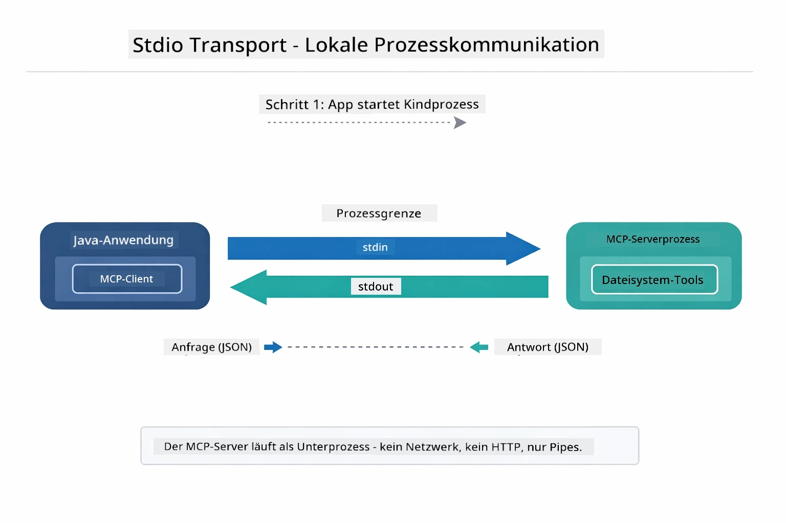

*Stdio-Transport in Aktion — deine Anwendung startet den MCP-Server als Kindprozess und kommuniziert über stdin/stdout-Pipes.*

> **🤖 Probiere es mit [GitHub Copilot](https://github.com/features/copilot) Chat:** Öffne [`StdioTransportDemo.java`](../../../05-mcp/src/main/java/com/example/langchain4j/mcp/StdioTransportDemo.java) und frage:
> - "Wie funktioniert der Stdio-Transport und wann sollte ich ihn statt HTTP verwenden?"
> - "Wie verwaltet LangChain4j den Lebenszyklus der gestarteten MCP-Server-Prozesse?"
> - "Welche Sicherheitsaspekte gibt es, wenn die KI Zugriff auf das Dateisystem erhält?"

## Das Agentic-Modul

Während MCP standardisierte Tools bereitstellt, bietet das **agentic Modul** von LangChain4j eine deklarative Möglichkeit, Agenten zu bauen, die diese Tools orchestrieren. Die Annotation `@Agent` und `AgenticServices` ermöglichen es, das Agentenverhalten über Schnittstellen anstatt imperativen Code zu definieren.

In diesem Modul wirst du das **Supervisor-Agent**-Muster erkunden – ein fortgeschrittener agentischer KI-Ansatz, bei dem ein „Supervisor“-Agent dynamisch entscheidet, welche Subagenten basierend auf Nutzeranfragen invoked werden. Wir kombinieren beide Konzepte, indem wir einem unserer Subagenten MCP-gestützte Datei-Zugriffsfähigkeiten geben.

Um das agentic Modul zu nutzen, füge diese Maven-Abhängigkeit hinzu:

```xml
<dependency>
    <groupId>dev.langchain4j</groupId>
    <artifactId>langchain4j-agentic</artifactId>
    <version>${langchain4j.mcp.version}</version>
</dependency>
```
> **Hinweis:** Das `langchain4j-agentic`-Modul verwendet eine separate Versionsproperty (`langchain4j.mcp.version`), weil es auf einem anderen Veröffentlichungszeitplan als die Kernbibliotheken von LangChain4j basiert.

> **⚠️ Experimentell:** Das `langchain4j-agentic`-Modul ist **experimentell** und kann sich ändern. Die stabile Methode, KI-Assistenten zu bauen, bleibt weiterhin `langchain4j-core` mit benutzerdefinierten Tools (Modul 04).

## Die Beispiele Ausführen

### Voraussetzungen

- Modul [04 - Tools](../04-tools/README.md) abgeschlossen (dieses Modul baut auf dem Konzept benutzerdefinierter Tools auf und vergleicht sie mit MCP-Tools)
- `.env`-Datei im Stammverzeichnis mit Azure-Anmeldeinformationen (erstellt durch `azd up` in Modul 01)
- Java 21+, Maven 3.9+
- Node.js 16+ und npm (für MCP-Server)

> **Hinweis:** Falls du deine Umgebungsvariablen noch nicht eingerichtet hast, siehe [Modul 01 - Einführung](../01-introduction/README.md) für die Bereitstellungsanleitung (`azd up` erstellt die `.env`-Datei automatisch), oder kopiere `.env.example` zu `.env` im Stammverzeichnis und fülle deine Werte ein.

## Schnellstart

**Mit VS Code:** Klicke einfach mit der rechten Maustaste auf eine Demo-Datei im Explorer und wähle **„Run Java“**, oder benutze die Startkonfigurationen im Run & Debug-Panel (stelle sicher, dass deine `.env`-Datei mit Azure-Anmeldeinformationen konfiguriert ist).

**Mit Maven:** Alternativ kannst du die folgenden Beispiele über die Kommandozeile ausführen.

### Dateioperationen (Stdio)

Dies demonstriert lokal über Subprozesse laufende Tools.

**✅ Keine Voraussetzungen nötig** – der MCP-Server wird automatisch gestartet.

**Mit den Startskripten (Empfohlen):**

Die Startskripte laden automatisch Umgebungsvariablen aus der `.env`-Datei im Stammverzeichnis:

**Bash:**
```bash
cd 05-mcp
chmod +x start-stdio.sh
./start-stdio.sh
```

**PowerShell:**
```powershell
cd 05-mcp
.\start-stdio.ps1
```

**Mit VS Code:** Klicke mit der rechten Maustaste auf `StdioTransportDemo.java` und wähle **„Run Java“** (stelle sicher, dass deine `.env`-Datei konfiguriert ist).

Die Anwendung startet automatisch einen MCP-Dateisystem-Server und liest eine lokale Datei. Beachte, wie die Subprozessverwaltung für dich erledigt wird.

**Erwartete Ausgabe:**
```
Assistant response: The file provides an overview of LangChain4j, an open-source Java library
for integrating Large Language Models (LLMs) into Java applications...
```

### Supervisor-Agent

Das **Supervisor-Agent-Muster** ist eine **flexible** Form agentischer KI. Ein Supervisor nutzt ein LLM, um autonom zu entscheiden, welche Agenten basierend auf der Nutzeranfrage invoked werden. Im nächsten Beispiel kombinieren wir MCP-gestützten Datei-Zugriff mit einem LLM-Agenten, um einen überwachten Workflow Datei → Bericht zu erstellen.

Im Demo liest `FileAgent` eine Datei mit MCP-Dateisystem-Tools und `ReportAgent` generiert einen strukturierten Bericht mit einer Executive Summary (1 Satz), 3 Schlüsselpunkten und Empfehlungen. Der Supervisor orchestratet diesen Ablauf automatisch:

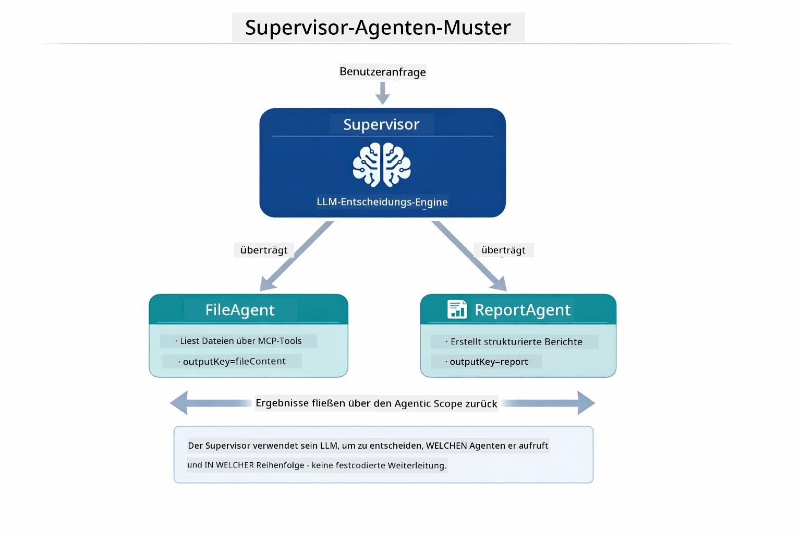

*Der Supervisor nutzt sein LLM, um zu entscheiden, welche Agenten in welcher Reihenfolge invoked werden – keine festcodierte Steuerung nötig.*

So sieht der konkrete Workflow für unsere Datei-zu-Bericht-Pipeline aus:

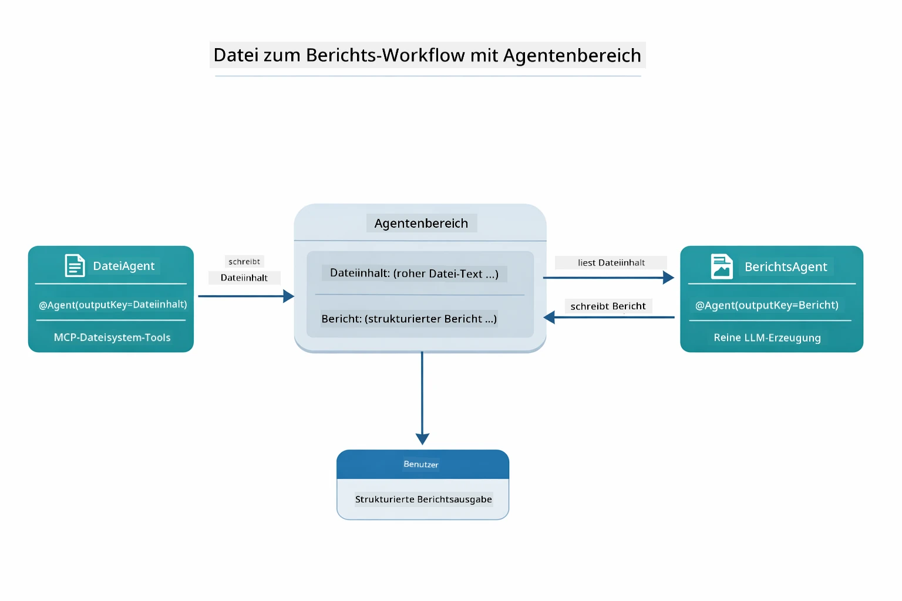

*FileAgent liest die Datei über MCP-Tools, anschließend wandelt ReportAgent den Rohinhalt in einen strukturierten Bericht um.*

Das folgende Sequenzdiagramm verfolgt die vollständige Supervisor-Orchestrierung – vom Starten des MCP-Servers, über die autonome Agentenauswahl durch den Supervisor, bis hin zu Tool-Aufrufen über stdio und dem finalen Bericht:

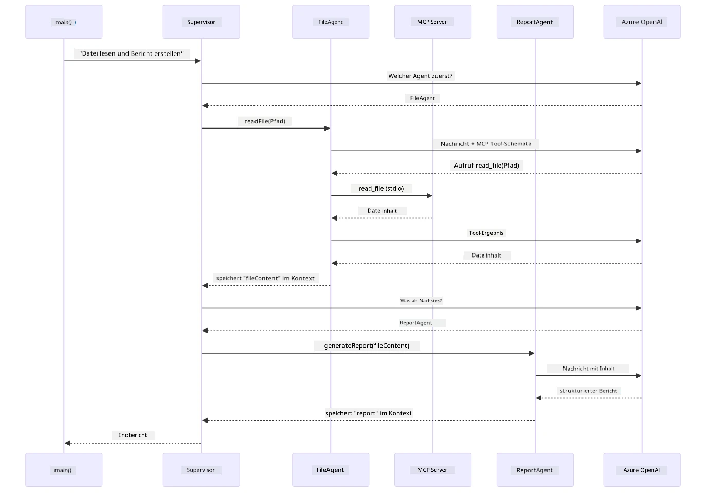

*Der Supervisor ruft autonom FileAgent auf (der den MCP-Server über stdio zum Lesen der Datei aufruft), dann ReportAgent zur Erstellung eines strukturierten Berichts – jeder Agent speichert seine Ausgabe im gemeinsamen Agentic Scope.*

Jeder Agent speichert seine Ausgabe im **Agentic Scope** (gemeinsamer Speicher), sodass nachfolgende Agenten auf vorherige Ergebnisse zugreifen können. Dies demonstriert, wie MCP-Tools nahtlos in agentische Workflows integriert sind – der Supervisor muss nicht wissen, *wie* Dateien gelesen werden, nur dass `FileAgent` das kann.

#### Demo Ausführen

Die Startskripte laden automatisch Umgebungsvariablen aus der `.env`-Datei im Stammverzeichnis:

**Bash:**
```bash
cd 05-mcp
chmod +x start-supervisor.sh
./start-supervisor.sh
```

**PowerShell:**
```powershell
cd 05-mcp
.\start-supervisor.ps1
```

**Mit VS Code:** Klicke mit der rechten Maustaste auf `SupervisorAgentDemo.java` und wähle **„Run Java“** (stelle sicher, dass deine `.env`-Datei konfiguriert ist).

#### Wie der Supervisor Funktioniert

Bevor du Agenten baust, musst du den MCP-Transport mit einem Client verbinden und ihn als `ToolProvider` kapseln. So werden die Tools des MCP-Servers für deine Agenten verfügbar:

```java
// Erstellen Sie einen MCP-Client aus dem Transport
McpClient mcpClient = new DefaultMcpClient.Builder()
        .transport(stdioTransport)
        .build();

// Wickeln Sie den Client als ToolProvider ein — dies verbindet MCP-Tools mit LangChain4j
ToolProvider mcpToolProvider = McpToolProvider.builder()
        .mcpClients(List.of(mcpClient))
        .build();
```

Jetzt kannst du `mcpToolProvider` in jeden Agenten injizieren, der MCP-Tools benötigt:

```java
// Schritt 1: FileAgent liest Dateien mit MCP-Werkzeugen
FileAgent fileAgent = AgenticServices.agentBuilder(FileAgent.class)
        .chatModel(model)
        .toolProvider(mcpToolProvider)  // Verfügt über MCP-Werkzeuge für Dateioperationen
        .build();

// Schritt 2: ReportAgent erstellt strukturierte Berichte
ReportAgent reportAgent = AgenticServices.agentBuilder(ReportAgent.class)
        .chatModel(model)
        .build();

// Supervisor steuert den Datei → Bericht Arbeitsablauf
SupervisorAgent supervisor = AgenticServices.supervisorBuilder()
        .chatModel(model)
        .subAgents(fileAgent, reportAgent)
        .responseStrategy(SupervisorResponseStrategy.LAST)  // Gibt den endgültigen Bericht zurück
        .build();

// Der Supervisor entscheidet, welche Agenten basierend auf der Anfrage aufgerufen werden sollen
String response = supervisor.invoke("Read the file at /path/file.txt and generate a report");
```

#### Wie FileAgent MCP-Tools zur Laufzeit Entdeckt

Du fragst dich vielleicht: **wie weiß `FileAgent`, wie es die npm-Dateisystemtools nutzen soll?** Die Antwort ist: es weiß es nicht – das **LLM** findet dies zur Laufzeit anhand der Tool-Schemata heraus.
Die `FileAgent`-Schnittstelle ist nur eine **Prompt-Definition**. Sie enthält kein fest codiertes Wissen über `read_file`, `list_directory` oder andere MCP-Tools. So läuft es von Anfang bis Ende ab:

1. **Server startet:** `StdioMcpTransport` startet das npm-Paket `@modelcontextprotocol/server-filesystem` als Kindprozess
2. **Tool-Erkennung:** Der `McpClient` sendet eine `tools/list` JSON-RPC-Anfrage an den Server, der mit Tool-Namen, Beschreibungen und Parameterschemata antwortet (z.B. `read_file` — *"Liest den kompletten Inhalt einer Datei"* — `{ path: string }`)
3. **Schema-Injektion:** `McpToolProvider` umhüllt diese entdeckten Schemata und stellt sie LangChain4j zur Verfügung
4. **LLM entscheidet:** Wenn `FileAgent.readFile(path)` aufgerufen wird, sendet LangChain4j die Systemnachricht, Nutzernachricht **und die Liste der Tool-Schemata** an das LLM. Das LLM liest die Tool-Beschreibungen und erzeugt einen Tool-Aufruf (z.B. `read_file(path="/some/file.txt")`)
5. **Ausführung:** LangChain4j fängt den Tool-Aufruf ab, leitet ihn über den MCP-Client zurück an den Node.js-Subprozess, erhält das Ergebnis und gibt es an das LLM zurück

Dies ist derselbe [Tool Discovery](../../../05-mcp)-Mechanismus, der oben beschrieben wurde, aber speziell auf den Agent-Workflow angewandt. Die Annotationen `@SystemMessage` und `@UserMessage` steuern das Verhalten des LLM, während der injizierte `ToolProvider` die **Fähigkeiten** bereitstellt – das LLM verbindet beide zur Laufzeit.

> **🤖 Probier es mit [GitHub Copilot](https://github.com/features/copilot) Chat:** Öffne [`FileAgent.java`](../../../05-mcp/src/main/java/com/example/langchain4j/mcp/agents/FileAgent.java) und frage:
> - "Wie weiß dieser Agent, welches MCP-Tool er aufrufen soll?"
> - "Was passiert, wenn ich den ToolProvider aus dem Agenten-Builder entferne?"
> - "Wie werden die Tool-Schemata an das LLM übergeben?"

#### Antwortstrategien

Wenn du einen `SupervisorAgent` konfigurierst, gibst du an, wie die finale Antwort an den Benutzer formuliert werden soll, nachdem die Unteragenten ihre Aufgaben abgeschlossen haben. Das folgende Diagramm zeigt die drei verfügbaren Strategien — LAST gibt die letzte Agentenausgabe direkt zurück, SUMMARY fasst alle Ausgaben per LLM zusammen und SCORED wählt das Ergebnis mit der besseren Bewertung im Vergleich zur ursprünglichen Anfrage aus:

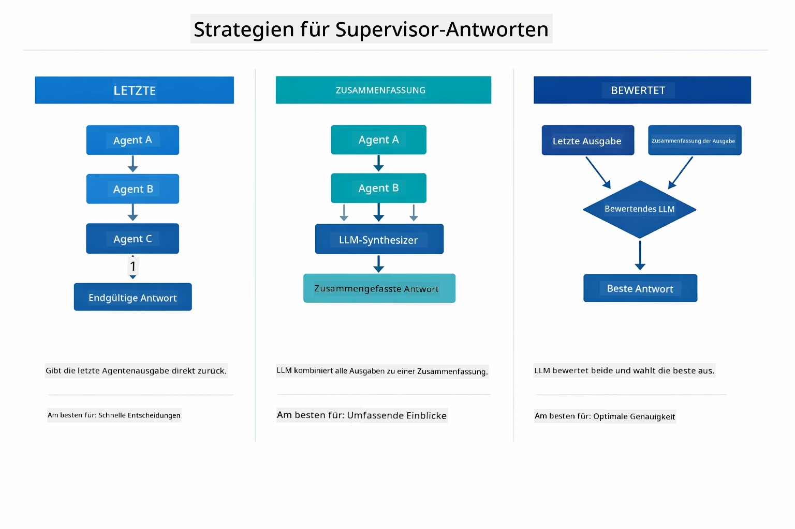

*Drei Strategien, wie der Supervisor seine finale Antwort formuliert – wähle, ob die letzte Agentenausgabe, eine zusammengefasste Synthese oder die bestbewertete Option gewünscht ist.*

Verfügbare Strategien:

| Strategie | Beschreibung |
|----------|-------------|
| **LAST** | Der Supervisor gibt die Ausgabe des zuletzt aufgerufenen Unteragenten oder Tools zurück. Nützlich, wenn der letzte Agent im Workflow speziell dafür gedacht ist, die endgültige Antwort zu liefern (z.B. ein „Summary Agent“ in einer Recherche-Pipeline). |
| **SUMMARY** | Der Supervisor verwendet ein internes Sprachmodell (LLM), um eine Zusammenfassung der gesamten Interaktion und aller Unteragentenausgaben zu erstellen und gibt diese Zusammenfassung als finale Antwort zurück. So erhält der Benutzer eine saubere, aggregierte Antwort. |
| **SCORED** | Das System verwendet ein internes LLM, um sowohl die LAST-Antwort als auch die SUMMARY der Interaktion gegen die ursprüngliche Benutzeranfrage zu bewerten und gibt die besser bewertete Ausgabe zurück. |

Siehe [SupervisorAgentDemo.java](../../../05-mcp/src/main/java/com/example/langchain4j/mcp/SupervisorAgentDemo.java) für die vollständige Implementierung.

> **🤖 Probier es mit [GitHub Copilot](https://github.com/features/copilot) Chat:** Öffne [`SupervisorAgentDemo.java`](../../../05-mcp/src/main/java/com/example/langchain4j/mcp/SupervisorAgentDemo.java) und frage:
> - "Wie entscheidet der Supervisor, welche Agenten er aufruft?"
> - "Was ist der Unterschied zwischen Supervisor- und Sequential-Workflow-Mustern?"
> - "Wie kann ich das Planungsverhalten des Supervisors anpassen?"

#### Verständnis der Ausgabe

Wenn du die Demo ausführst, siehst du eine strukturierte Schritt-für-Schritt-Erklärung, wie der Supervisor mehrere Agenten orchestriert. So ist jede Sektion zu verstehen:

```
======================================================================
  FILE → REPORT WORKFLOW DEMO
======================================================================

This demo shows a clear 2-step workflow: read a file, then generate a report.
The Supervisor orchestrates the agents automatically based on the request.
```
  
**Die Überschrift** stellt das Workflow-Konzept vor: eine fokussierte Pipeline vom Datei-Lesen bis zur Berichtsgenerierung.

```
--- WORKFLOW ---------------------------------------------------------
  ┌─────────────┐      ┌──────────────┐
  │  FileAgent  │ ───▶ │ ReportAgent  │
  │ (MCP tools) │      │  (pure LLM)  │
  └─────────────┘      └──────────────┘
   outputKey:           outputKey:
   'fileContent'        'report'

--- AVAILABLE AGENTS -------------------------------------------------
  [FILE]   FileAgent   - Reads files via MCP → stores in 'fileContent'
  [REPORT] ReportAgent - Generates structured report → stores in 'report'
```
  
**Workflow-Diagramm** zeigt den Datenfluss zwischen Agenten. Jeder Agent hat eine spezifische Rolle:
- **FileAgent** liest Dateien mit MCP-Tools und speichert den Rohinhalt in `fileContent`
- **ReportAgent** verarbeitet diesen Inhalt und erzeugt einen strukturierten Bericht in `report`

```
--- USER REQUEST -----------------------------------------------------
  "Read the file at .../file.txt and generate a report on its contents"
```
  
**Benutzeranfrage** zeigt die Aufgabe. Der Supervisor analysiert diese und entscheidet, FileAgent → ReportAgent aufzurufen.

```
--- SUPERVISOR ORCHESTRATION -----------------------------------------
  The Supervisor decides which agents to invoke and passes data between them...

  +-- STEP 1: Supervisor chose -> FileAgent (reading file via MCP)
  |
  |   Input: .../file.txt
  |
  |   Result: LangChain4j is an open-source, provider-agnostic Java framework for building LLM...
  +-- [OK] FileAgent (reading file via MCP) completed

  +-- STEP 2: Supervisor chose -> ReportAgent (generating structured report)
  |
  |   Input: LangChain4j is an open-source, provider-agnostic Java framew...
  |
  |   Result: Executive Summary...
  +-- [OK] ReportAgent (generating structured report) completed
```
  
**Supervisor-Orchestrierung** zeigt den 2-Schritte-Flow in Aktion:
1. **FileAgent** liest die Datei über MCP und speichert den Inhalt
2. **ReportAgent** erhält den Inhalt und erzeugt einen strukturierten Bericht

Diese Entscheidungen traf der Supervisor **autonom** basierend auf der Benutzeranfrage.

```
--- FINAL RESPONSE ---------------------------------------------------
Executive Summary
...

Key Points
...

Recommendations
...

--- AGENTIC SCOPE (Data Flow) ----------------------------------------
  Each agent stores its output for downstream agents to consume:
  * fileContent: LangChain4j is an open-source, provider-agnostic Java framework...
  * report: Executive Summary...
```
  
#### Erläuterung der agentischen Modul-Features

Das Beispiel demonstriert mehrere fortgeschrittene Funktionen des agentischen Moduls. Schauen wir uns Agentic Scope und Agent Listeners genauer an.

**Agentic Scope** zeigt den gemeinsamen Speicher, in dem Agenten ihre Ergebnisse mit `@Agent(outputKey="...")` ablegen. Das ermöglicht:
- Späteren Agenten Zugriff auf frühere Ausgaben
- Dem Supervisor, eine finale Antwort zu synthetisieren
- Dir, nachzuvollziehen, was jeder Agent produziert hat

Das folgende Diagramm zeigt, wie Agentic Scope als gemeinsamer Speicher im Datei-zu-Bericht-Workflow funktioniert — FileAgent schreibt seine Ausgabe unter dem Schlüssel `fileContent`, ReportAgent liest diesen und schreibt seine Ausgabe unter `report`:

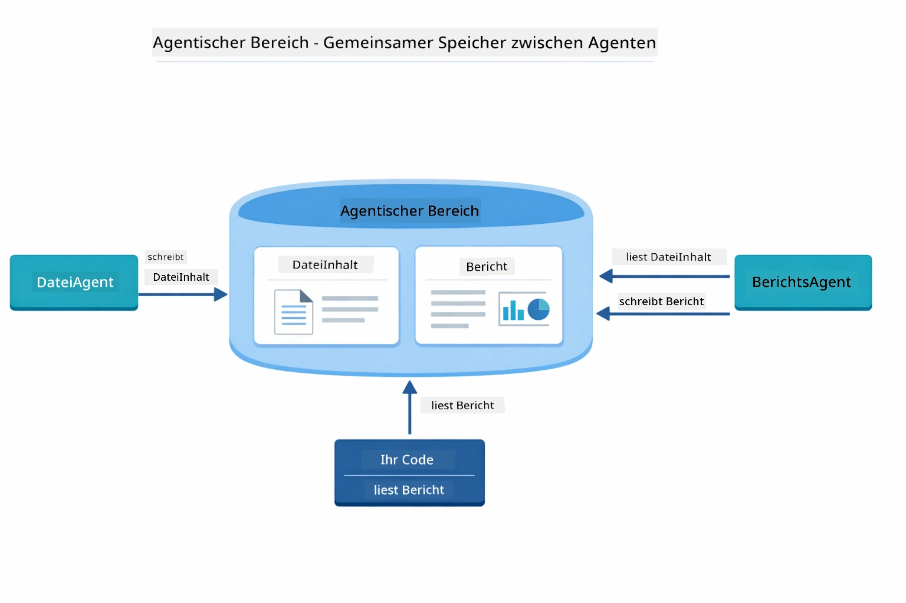

*Agentic Scope wirkt als gemeinsamer Speicher — FileAgent schreibt `fileContent`, ReportAgent liest und schreibt `report`, und dein Code liest das finale Ergebnis.*

```java
ResultWithAgenticScope<String> result = supervisor.invokeWithAgenticScope(request);
AgenticScope scope = result.agenticScope();
String fileContent = scope.readState("fileContent");  // Rohdateidaten von FileAgent
String report = scope.readState("report");            // Strukturierter Bericht von ReportAgent
```
  
**Agent Listeners** ermöglichen Überwachung und Fehlerbehebung bei der Agentenausführung. Die schrittweise Ausgabe in der Demo stammt von einem AgentListener, der bei jedem Agentenaufruf eingehängt ist:
- **beforeAgentInvocation** - Wird aufgerufen, wenn der Supervisor einen Agenten auswählt, damit du siehst, welcher Agent warum gewählt wurde
- **afterAgentInvocation** - Wird nach Abschluss eines Agenten aufgerufen und zeigt dessen Ergebnis
- **inheritedBySubagents** - Wenn wahr, überwacht der Listener alle Agenten in der Hierarchie

Das folgende Diagramm zeigt den kompletten Lebenszyklus eines Agent Listener, einschließlich wie `onError` Fehler während der Agentenausführung behandelt:

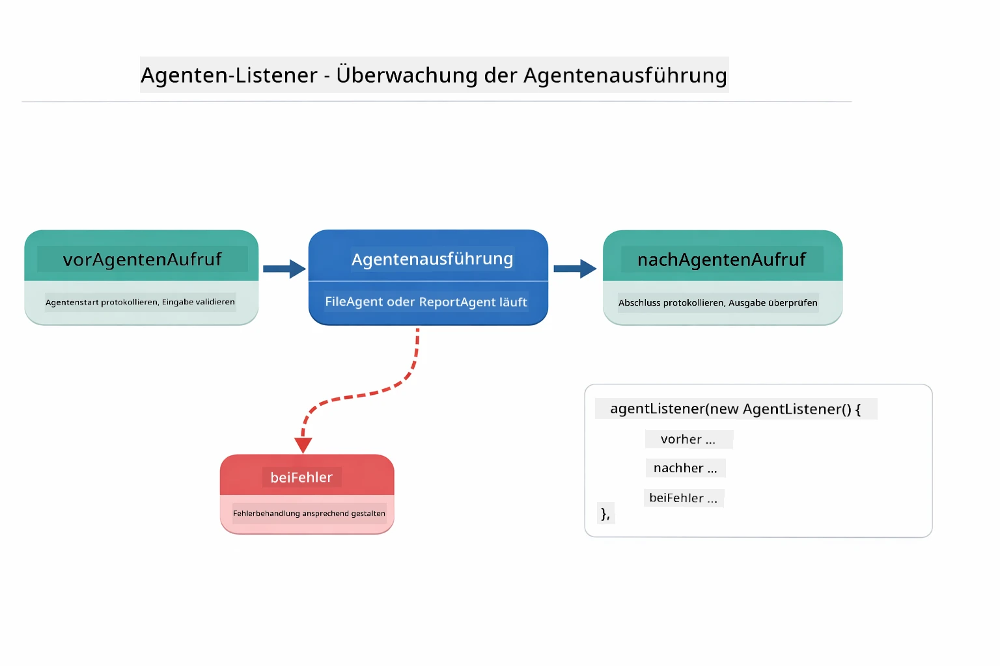

*Agent Listeners hängen sich in den Ausführungslebenszyklus ein — überwache, wann Agenten starten, fertig sind oder Fehler auftreten.*

```java
AgentListener monitor = new AgentListener() {
    private int step = 0;
    
    @Override
    public void beforeAgentInvocation(AgentRequest request) {
        step++;
        System.out.println("  +-- STEP " + step + ": " + request.agentName());
    }
    
    @Override
    public void afterAgentInvocation(AgentResponse response) {
        System.out.println("  +-- [OK] " + response.agentName() + " completed");
    }
    
    @Override
    public boolean inheritedBySubagents() {
        return true; // An alle Unteragenten weiterleiten
    }
};
```
  
Über das Supervisor-Muster hinaus bietet das `langchain4j-agentic`-Modul mehrere leistungsfähige Workflow-Muster. Das folgende Diagramm zeigt alle fünf — von einfachen sequentiellen Pipelines bis zu Human-in-the-Loop-Freigabe-Workflows:

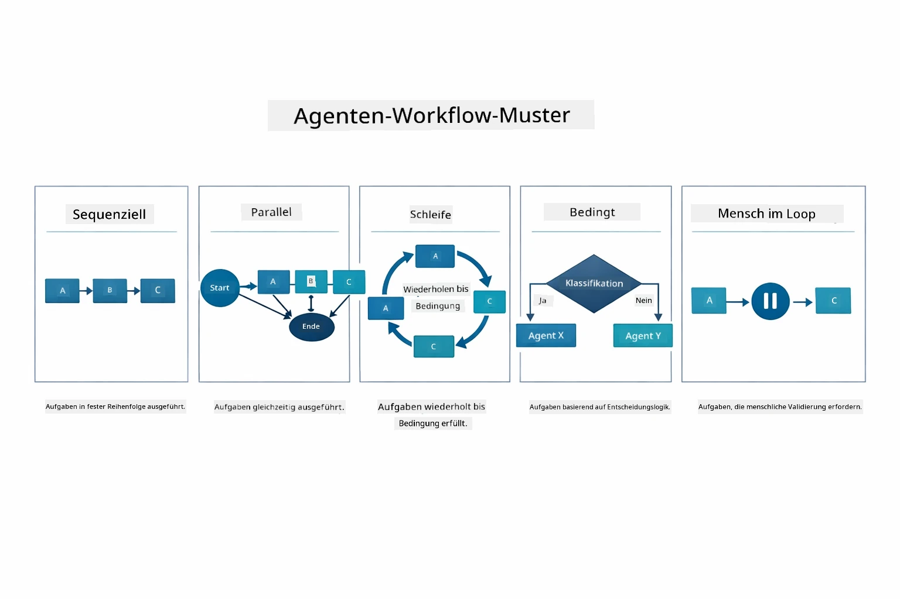

*Fünf Workflow-Muster zur Orchestrierung von Agenten — von einfachen sequentiellen Pipelines bis zu Human-in-the-Loop-Freigabeprozessen.*

| Muster | Beschreibung | Anwendungsfall |
|---------|-------------|----------------|
| **Sequential** | Agenten nacheinander ausführen, Ausgabe zum nächsten weitergeben | Pipelines: recherchieren → analysieren → berichten |
| **Parallel** | Agenten gleichzeitig ausführen | Unabhängige Aufgaben: Wetter + Nachrichten + Aktien |
| **Loop** | Iterieren bis Bedingung erfüllt | Qualitätsbewertung: verfeinern bis Score ≥ 0,8 |
| **Conditional** | Basierend auf Bedingungen weiterleiten | Klassifizieren → zum Spezial-Agenten routen |
| **Human-in-the-Loop** | Menschliche Kontrollpunkte hinzufügen | Freigabe-Workflows, Inhaltsprüfung |

## Wichtige Konzepte

Nachdem du MCP und das agentische Modul praktisch kennengelernt hast, fassen wir zusammen, wann man welche Herangehensweise nutzt.

Einer der größten Vorteile von MCP ist das wachsende Ökosystem. Das folgende Diagramm zeigt, wie ein einziges universelles Protokoll deine AI-Anwendung mit einer Vielzahl von MCP-Servern verbindet — vom Dateisystem- und Datenbankzugriff über GitHub, E-Mail, Web Scraping bis hin zu mehr:

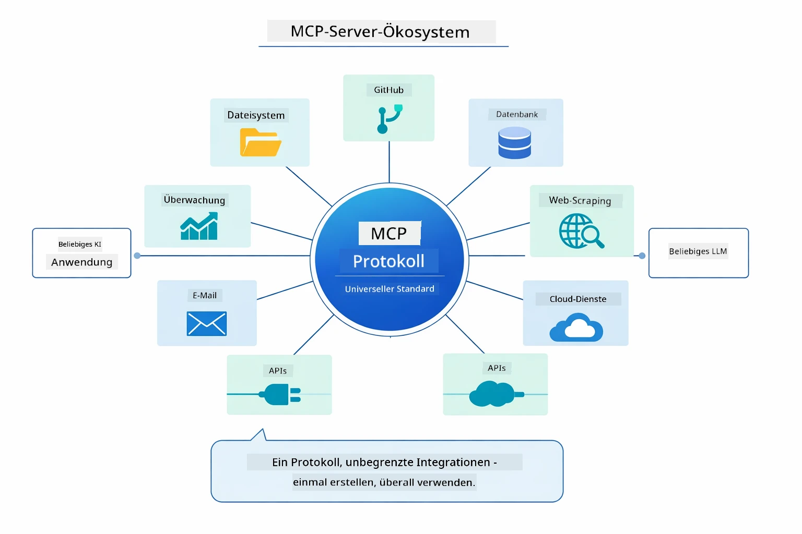

*MCP schafft ein universelles Protokoll-Ökosystem — jeder MCP-kompatible Server kann mit jedem MCP-kompatiblen Client zusammenarbeiten, ermöglicht Tool-Sharing über verschiedene Anwendungen hinweg.*

**MCP** ist ideal, wenn du vorhandene Tool-Ökosysteme nutzen möchtest, Tools bauen willst, die mehrere Anwendungen teilen können, Drittanbieterdienste mit Standardprotokollen integrierst oder Tool-Implementierungen ohne Codeänderung austauschen willst.

**Das agentische Modul** eignet sich am besten, wenn du deklarative Agent-Definitionen mit `@Agent`-Annotationen möchtest, Workflow-Orchestrierung (sequentiell, Schleife, parallel) brauchst, Interface-basierte Agent-Entwicklung der imperativen Programmierung vorziehst oder mehrere Agenten verbindest, die Ausgaben über `outputKey` teilen.

**Das Supervisor-Agent-Muster** glänzt, wenn der Workflow im Voraus nicht vorhersehbar ist und du das LLM entscheiden lassen willst, wenn du mehrere spezialisierte Agenten hast, die dynamisch orchestriert werden müssen, wenn du Konversationssysteme baust, die zu unterschiedlichen Fähigkeiten routen, oder wenn du das flexibelste, adaptivste Agenten-Verhalten willst.

Um dir die Entscheidung zwischen den benutzerdefinierten `@Tool`-Methoden aus Modul 04 und den MCP-Tools aus diesem Modul zu erleichtern, zeigt die folgende Gegenüberstellung die wichtigsten Abwägungen — benutzerdefinierte Tools bieten enge Kopplung und volle Typsicherheit für anwendungsspezifische Logik, MCP-Tools standardisierte, wiederverwendbare Integrationen:

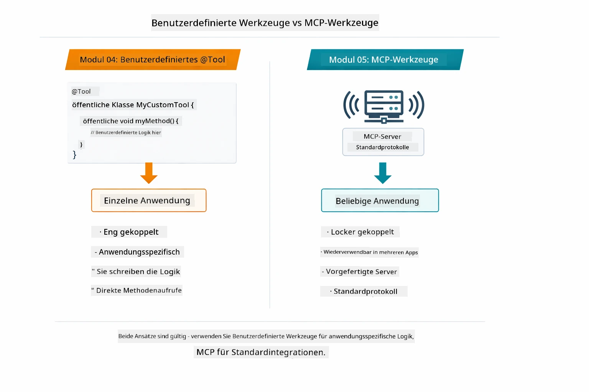

*Wann du benutzerdefinierte @Tool-Methoden vs MCP-Tools verwendest — benutzerdefiniert für anwendungsspezifische Logik mit voller Typsicherheit, MCP für standardisierte Integrationen, die über Anwendungen hinweg funktionieren.*

## Herzlichen Glückwunsch!

Du hast alle fünf Module des LangChain4j für Anfänger-Kurses durchlaufen! Hier ein Überblick über deine komplette Lernreise — vom einfachen Chat bis zu MCP-gestützten agentischen Systemen:

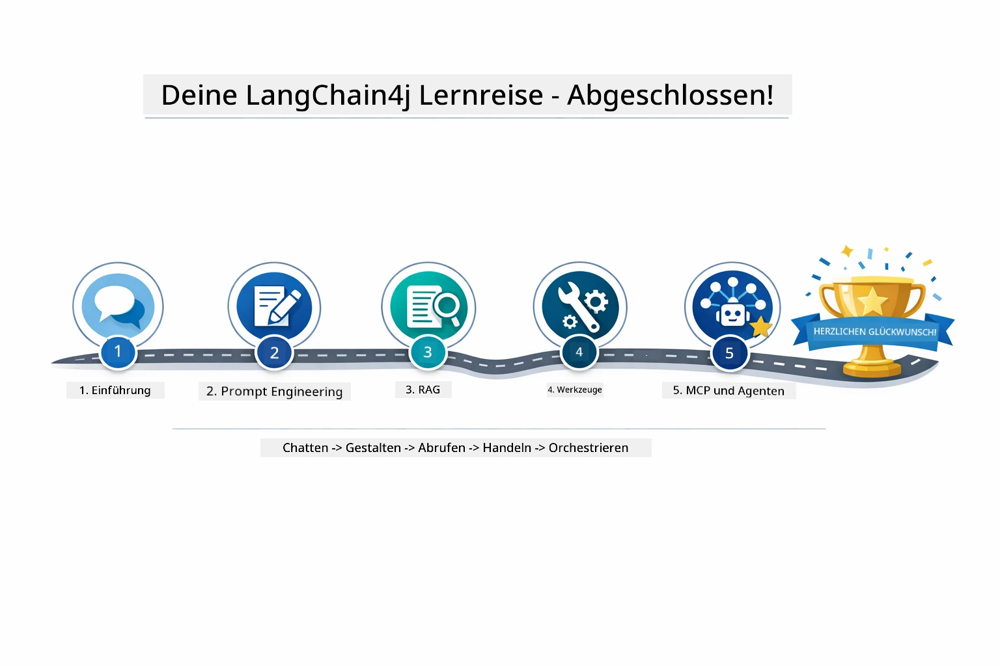

*Deine Lernreise durch alle fünf Module — vom Basis-Chat zu MCP-gestützten agentischen Systemen.*

Du hast den LangChain4j für Anfänger-Kurs abgeschlossen. Du hast gelernt:

- Wie man konversationsfähige KI mit Gedächtnis baut (Modul 01)
- Prompt-Engineering-Muster für verschiedene Aufgaben (Modul 02)
- Antworten auf Grundlage eigener Dokumente mit RAG verankern (Modul 03)
- Grundlegende KI-Agenten (Assistenten) mit benutzerdefinierten Tools erstellen (Modul 04)
- Standardisierte Tools mit den LangChain4j MCP- und Agentic-Modulen integrieren (Modul 05)

### Wie geht es weiter?

Nach Abschluss der Module solltest du den [Testing Guide](../docs/TESTING.md) erkunden, um LangChain4j-Testkonzepte in Aktion zu sehen.

**Offizielle Ressourcen:**  
- [LangChain4j Dokumentation](https://docs.langchain4j.dev/) – Umfassende Anleitungen und API-Referenz  
- [LangChain4j GitHub](https://github.com/langchain4j/langchain4j) – Quellcode und Beispiele  
- [LangChain4j Tutorials](https://docs.langchain4j.dev/tutorials/) – Schritt-für-Schritt-Anleitungen für verschiedene Anwendungsfälle  

Vielen Dank, dass du diesen Kurs abgeschlossen hast!

---

**Navigation:** [← Zurück: Modul 04 - Tools](../04-tools/README.md) | [Zurück zur Übersicht](../README.md)

---

<!-- CO-OP TRANSLATOR DISCLAIMER START -->
**Haftungsausschluss**:  
Dieses Dokument wurde mithilfe des KI-Übersetzungsdienstes [Co-op Translator](https://github.com/Azure/co-op-translator) übersetzt. Obwohl wir uns um Genauigkeit bemühen, kann es bei automatischen Übersetzungen zu Fehlern oder Ungenauigkeiten kommen. Das Originaldokument in seiner Ursprungssprache gilt als maßgebliche Quelle. Für wichtige Informationen wird eine professionelle menschliche Übersetzung empfohlen. Wir übernehmen keine Haftung für Missverständnisse oder Fehlinterpretationen, die durch die Nutzung dieser Übersetzung entstehen.
<!-- CO-OP TRANSLATOR DISCLAIMER END -->