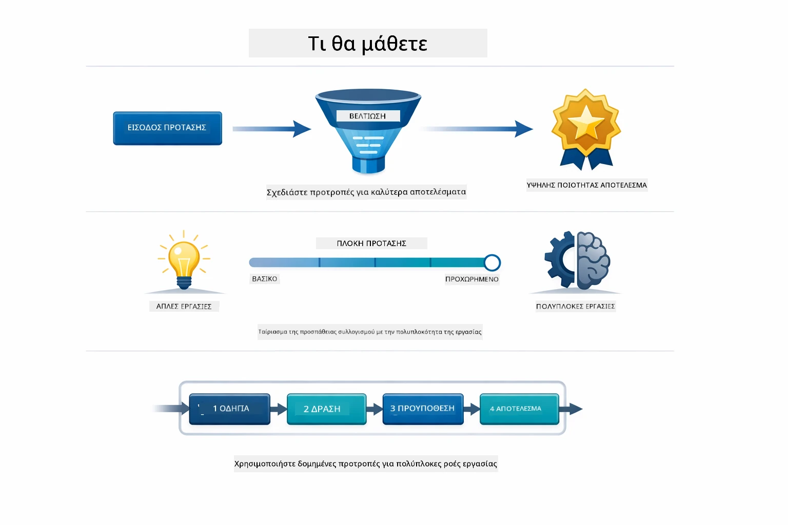
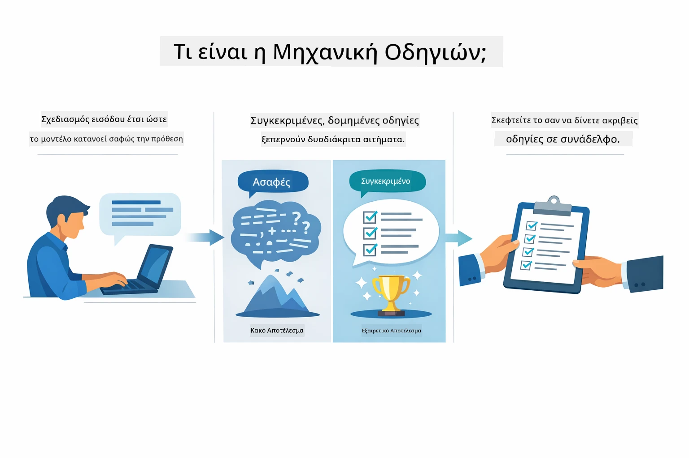
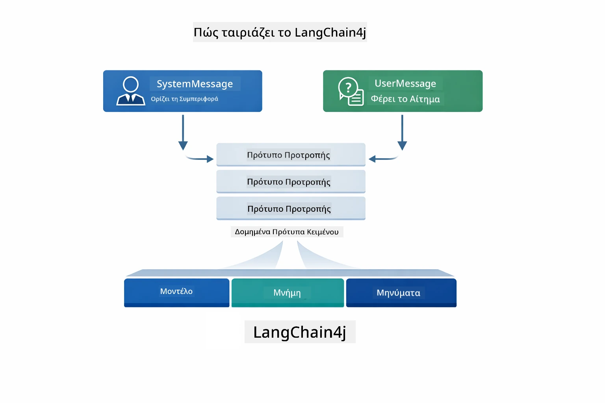
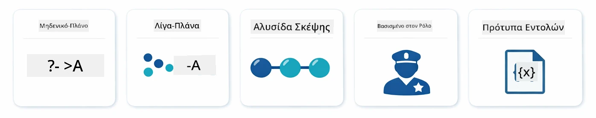
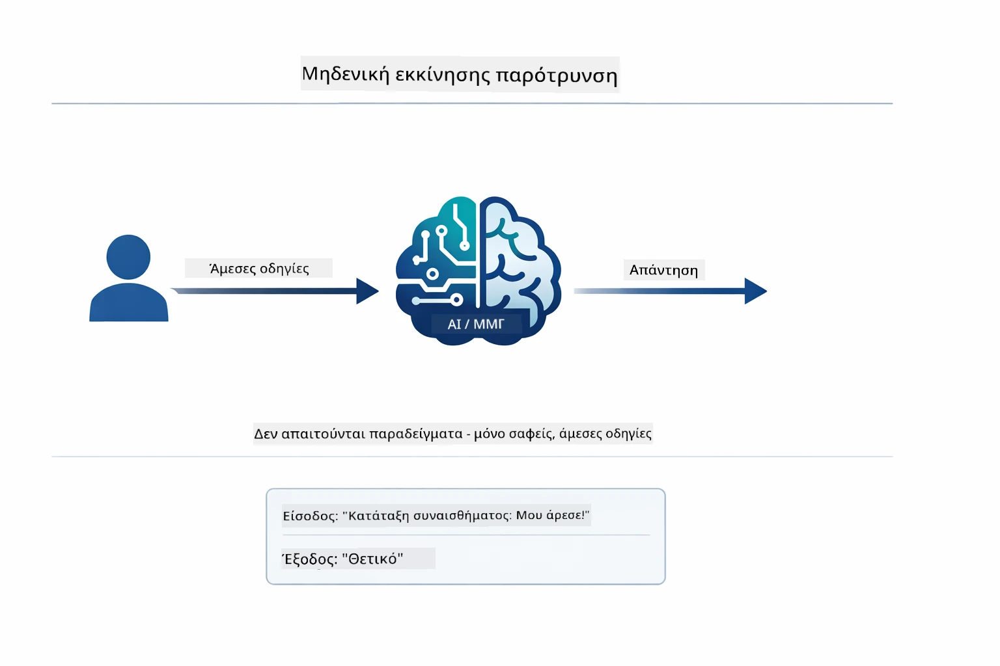
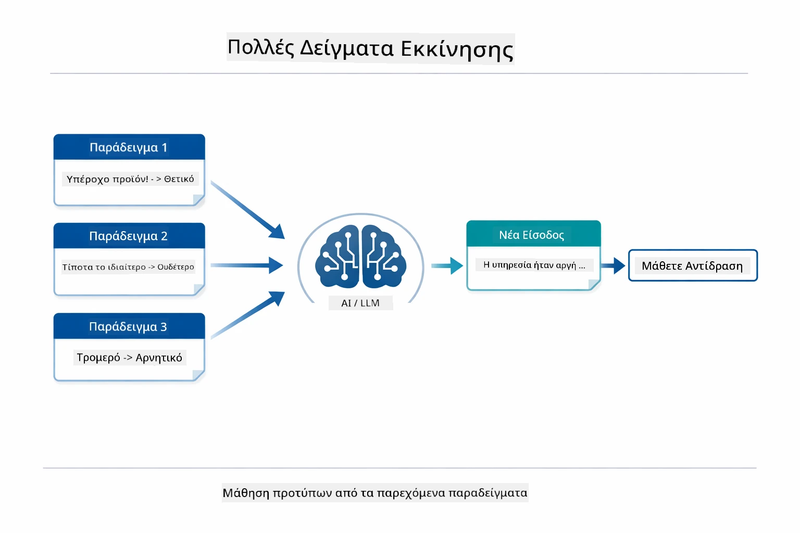
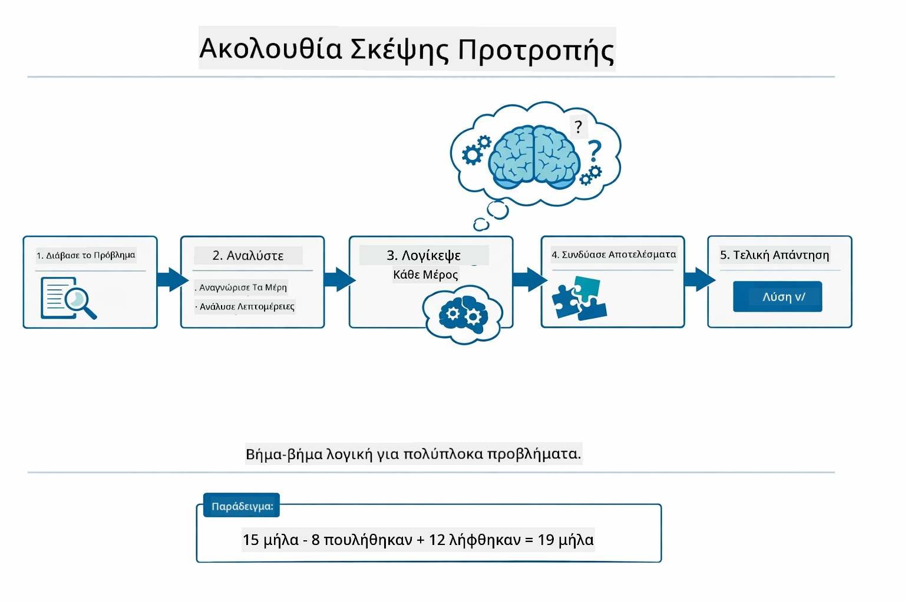
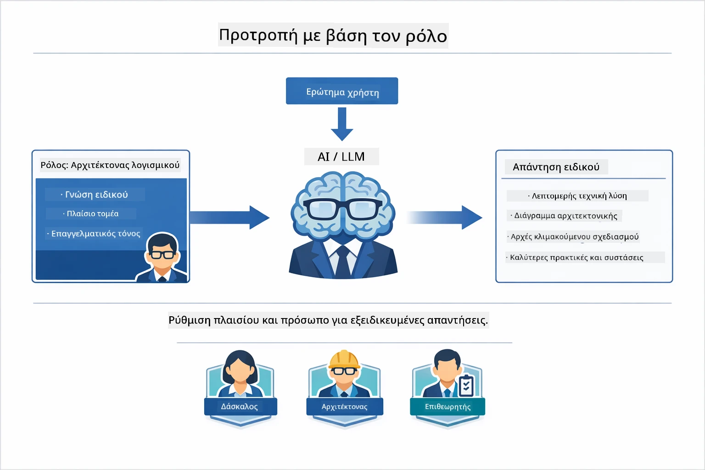
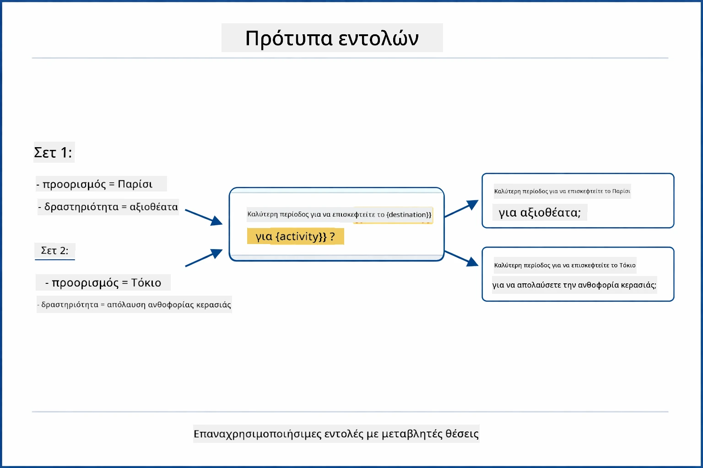
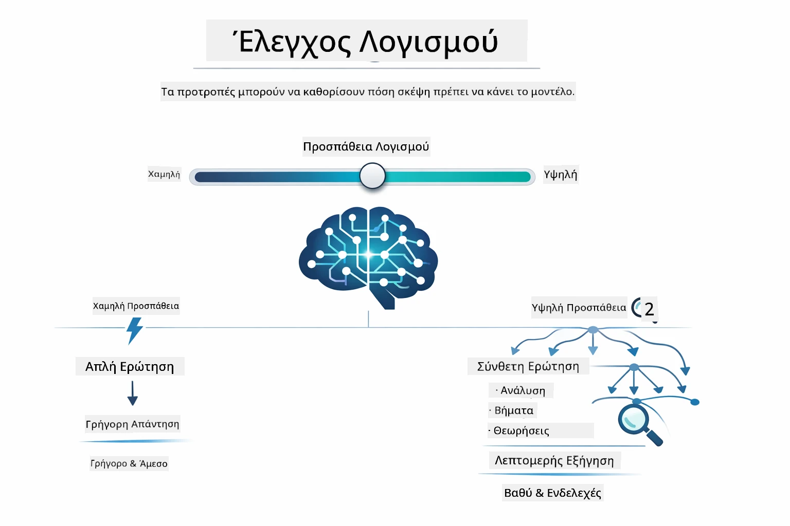

# Module 02: Μηχανική Ερωτημάτων με GPT-5.2

## Περιεχόμενα

- [Τι Θα Μάθετε](../../../02-prompt-engineering)
- [Προαπαιτούμενα](../../../02-prompt-engineering)
- [Κατανόηση της Μηχανικής Ερωτημάτων](../../../02-prompt-engineering)
- [Βασικά της Μηχανικής Ερωτημάτων](../../../02-prompt-engineering)
  - [Zero-Shot Ερωτήματα](../../../02-prompt-engineering)
  - [Few-Shot Ερωτήματα](../../../02-prompt-engineering)
  - [Chain of Thought](../../../02-prompt-engineering)
  - [Ερωτήματα με Βάση το Ρόλο](../../../02-prompt-engineering)
  - [Πρότυπα Ερωτημάτων](../../../02-prompt-engineering)
- [Προχωρημένα Πρότυπα](../../../02-prompt-engineering)
- [Χρήση Υφιστάμενων Πόρων Azure](../../../02-prompt-engineering)
- [Στιγμιότυπα Εφαρμογής](../../../02-prompt-engineering)
- [Εξερεύνηση των Προτύπων](../../../02-prompt-engineering)
  - [Χαμηλή vs Υψηλή Επιθυμία](../../../02-prompt-engineering)
  - [Εκτέλεση Εργασιών (Προλόγοι Εργαλείων)](../../../02-prompt-engineering)
  - [Κώδικας Αυτο-Αντανάκλασης](../../../02-prompt-engineering)
  - [Δομημένη Ανάλυση](../../../02-prompt-engineering)
  - [Συνομιλία Πολλαπλών Γύρων](../../../02-prompt-engineering)
  - [Σταδιακή Σκέψη](../../../02-prompt-engineering)
  - [Περιορισμένη Έξοδος](../../../02-prompt-engineering)
- [Τι Πραγματικά Μαθαίνετε](../../../02-prompt-engineering)
- [Επόμενα Βήματα](../../../02-prompt-engineering)

## Τι Θα Μάθετε



Στο προηγούμενο module, είδατε πώς η μνήμη επιτρέπει τη συνομιλιακή τεχνητή νοημοσύνη και χρησιμοποιήσατε τα Μοντέλα GitHub για βασικές αλληλεπιδράσεις. Τώρα θα επικεντρωθούμε στο πώς κάνετε ερωτήσεις — τα ίδια τα prompts — χρησιμοποιώντας το GPT-5.2 της Azure OpenAI. Ο τρόπος που διαμορφώνετε τα prompts επηρεάζει δραματικά την ποιότητα των απαντήσεων που λαμβάνετε. Ξεκινάμε με μια ανασκόπηση των βασικών τεχνικών prompt, και μετά προχωράμε σε οκτώ προχωρημένα πρότυπα που αξιοποιούν πλήρως τις δυνατότητες του GPT-5.2.

Θα χρησιμοποιήσουμε το GPT-5.2 γιατί εισάγει τον έλεγχο συλλογισμού — μπορείτε να πείτε στο μοντέλο πόση σκέψη να κάνει πριν απαντήσει. Αυτό κάνει πιο εμφανείς τις διαφορετικές στρατηγικές χρήσης prompts και σας βοηθά να καταλάβετε πότε να χρησιμοποιείτε κάθε προσέγγιση. Θα ωφεληθούμε επίσης από τα λιγότερα όρια ταχύτητας στην Azure για το GPT-5.2 σε σύγκριση με τα Μοντέλα GitHub.

## Προαπαιτούμενα

- Ολοκληρωμένο Module 01 (υποδομές Azure OpenAI αναπτύχθηκαν)
- Αρχείο `.env` στον ριζικό κατάλογο με διαπιστευτήρια Azure (δημιουργήθηκε με `azd up` στο Module 01)

> **Σημείωση:** Αν δεν έχετε ολοκληρώσει το Module 01, ακολουθήστε πρώτα τις οδηγίες ανάπτυξης εκεί.

## Κατανόηση της Μηχανικής Ερωτημάτων



Η μηχανική ερωτημάτων αφορά το σχεδιασμό εισαγωγικών κειμένων που σας δίνουν σταθερά τα αποτελέσματα που χρειάζεστε. Δεν πρόκειται μόνο για το να κάνετε ερωτήσεις — πρόκειται για τη δομή των αιτημάτων ώστε το μοντέλο να καταλαβαίνει ακριβώς τι θέλετε και πώς να το παραδώσει.

Σκεφτείτε το σαν να δίνετε οδηγίες σε έναν συνάδελφο. "Διόρθωσε το σφάλμα" είναι ασαφές. "Διόρθωσε τη null pointer exception στο UserService.java στη γραμμή 45 προσθέτοντας έλεγχο null" είναι συγκεκριμένο. Τα γλωσσικά μοντέλα δουλεύουν με τον ίδιο τρόπο — η συγκεκριμενοποίηση και η δομή έχουν σημασία.



Το LangChain4j παρέχει τη δομή — συνδέσεις με μοντέλα, μνήμη, και τύπους μηνυμάτων — ενώ τα προτύπα prompt είναι απλώς προσεκτικά δομημένα κείμενα που στέλνετε μέσω αυτής της δομής. Τα βασικά δομικά στοιχεία είναι το `SystemMessage` (που ορίζει τη συμπεριφορά και το ρόλο της AI) και το `UserMessage` (που μεταφέρει το πραγματικό σας αίτημα).

## Βασικά της Μηχανικής Ερωτημάτων



Πριν εμβαθύνουμε στα προχωρημένα πρότυπα αυτού του module, ας ανασκοπήσουμε πέντε θεμελιώδεις τεχνικές prompt. Αυτά είναι τα δομικά στοιχεία που πρέπει να γνωρίζει κάθε μηχανικός prompt. Αν ήδη έχετε δουλέψει μέσα από το [Quick Start module](../00-quick-start/README.md#2-prompt-patterns), τις έχετε δει σε δράση — εδώ είναι το εννοιολογικό πλαίσιο πίσω τους.

### Zero-Shot Ερωτήματα

Η απλούστερη προσέγγιση: δώστε στο μοντέλο μια άμεση οδηγία χωρίς παραδείγματα. Το μοντέλο βασίζεται εξ ολοκλήρου στην εκπαίδευσή του για να κατανοήσει και να εκτελέσει την εργασία. Αυτό δουλεύει καλά για απλά αιτήματα όπου η αναμενόμενη συμπεριφορά είναι προφανής.



*Άμεση οδηγία χωρίς παραδείγματα — το μοντέλο συμπεραίνει την εργασία μόνο από την οδηγία*

```java
String prompt = "Classify this sentiment: 'I absolutely loved the movie!'";
String response = model.chat(prompt);
// Απάντηση: "Θετικό"
```

**Πότε να χρησιμοποιείται:** Απλές ταξινομήσεις, άμεσες ερωτήσεις, μεταφράσεις ή οποιαδήποτε εργασία το μοντέλο μπορεί να χειριστεί χωρίς επιπλέον καθοδήγηση.

### Few-Shot Ερωτήματα

Παρέχετε παραδείγματα που δείχνουν το μοτίβο που θέλετε να ακολουθήσει το μοντέλο. Το μοντέλο μαθαίνει τη μορφή εισόδου-εξόδου από τα παραδείγματά σας και την εφαρμόζει σε νέα δεδομένα. Αυτό βελτιώνει δραματικά τη συνέπεια για εργασίες όπου η επιθυμητή μορφή ή συμπεριφορά δεν είναι προφανής.



*Μάθηση από παραδείγματα — το μοντέλο εντοπίζει το μοτίβο και το εφαρμόζει σε νέα εισαγωγή*

```java
String prompt = """
    Classify the sentiment as positive, negative, or neutral.
    
    Examples:
    Text: "This product exceeded my expectations!" → Positive
    Text: "It's okay, nothing special." → Neutral
    Text: "Waste of money, very disappointed." → Negative
    
    Now classify this:
    Text: "Best purchase I've made all year!"
    """;
String response = model.chat(prompt);
```

**Πότε να χρησιμοποιείται:** Προσαρμοσμένες ταξινομήσεις, συνεπής μορφοποίηση, εργασίες ειδικού τομέα, ή όταν τα αποτελέσματα zero-shot είναι ασυνεπή.

### Chain of Thought

Ζητήστε από το μοντέλο να δείξει τη συλλογιστική του βήμα-βήμα. Αντί να πηδήξει απευθείας σε απάντηση, το μοντέλο αναλύει το πρόβλημα και δουλεύει κάθε μέρος ρητά. Αυτό βελτιώνει την ακρίβεια σε μαθηματικά, λογική, και πολύ-βηματικές εργασίες συλλογισμού.



*Σκέψη βήμα-βήμα — ανάλυση σύνθετων προβλημάτων σε ρητά λογικά βήματα*

```java
String prompt = """
    Problem: A store has 15 apples. They sell 8 apples and then 
    receive a shipment of 12 more apples. How many apples do they have now?
    
    Let's solve this step-by-step:
    """;
String response = model.chat(prompt);
// Το μοντέλο δείχνει: 15 - 8 = 7, μετά 7 + 12 = 19 μήλα
```

**Πότε να χρησιμοποιείται:** Μαθηματικά προβλήματα, λογικά παζλ, αποσφαλμάτωση, ή οποιαδήποτε εργασία όπου η εμφάνιση της διαδικασίας συλλογισμού βελτιώνει την ακρίβεια και την εμπιστοσύνη.

### Ερωτήματα με Βάση το Ρόλο

Ορίστε ένα πρόσωπο ή ρόλο για την AI πριν κάνετε την ερώτησή σας. Αυτό παρέχει ένα πλαίσιο που διαμορφώνει τον τόνο, το βάθος, και την εστίαση της απάντησης. Ένας "αρχιτέκτονας λογισμικού" δίνει διαφορετικές συμβουλές από έναν "junior developer" ή έναν "security auditor".



*Ορισμός πλαισίου και προφίλ — η ίδια ερώτηση λαμβάνει διαφορετική απάντηση ανάλογα με το ρόλο*

```java
String prompt = """
    You are an experienced software architect reviewing code.
    Provide a brief code review for this function:
    
    def calculate_total(items):
        total = 0
        for item in items:
            total = total + item['price']
        return total
    """;
String response = model.chat(prompt);
```

**Πότε να χρησιμοποιείται:** Αναθεωρήσεις κώδικα, διδασκαλία, αναλυση ειδικών τομέων, ή όταν χρειάζεστε απαντήσεις προσαρμοσμένες σε επίπεδο εμπειρίας ή οπτική γωνία.

### Πρότυπα Ερωτημάτων

Δημιουργήστε επαναχρησιμοποιήσιμα prompts με μεταβλητές θέσεις αποθήκευσης. Αντί να γράφετε νέο prompt κάθε φορά, ορίστε ένα πρότυπο μία φορά και συμπληρώνετε διαφορετικές τιμές. Η κλάση `PromptTemplate` του LangChain4j το κάνει εύκολο με τη σύνταξη `{{variable}}`.



*Επαναχρησιμοποιήσιμα prompts με μεταβλητές — ένα πρότυπο, πολλές χρήσεις*

```java
PromptTemplate template = PromptTemplate.from(
    "What's the best time to visit {{destination}} for {{activity}}?"
);

Prompt prompt = template.apply(Map.of(
    "destination", "Paris",
    "activity", "sightseeing"
));

String response = model.chat(prompt.text());
```

**Πότε να χρησιμοποιείται:** Επαναλαμβανόμενα αιτήματα με διαφορετικές εισόδους, μαζική επεξεργασία, κατασκευή επαναχρησιμοποιήσιμων AI ροών εργασιών, ή σε σενάρια όπου η δομή του prompt παραμένει ίδια αλλά τα δεδομένα αλλάζουν.

---

Αυτά τα πέντε βασικά παρέχουν ένα στιβαρό εργαλείο για τις περισσότερες εργασίες prompt. Το υπόλοιπο αυτού του module βασίζεται σε αυτά με **οκτώ προχωρημένα πρότυπα** που αξιοποιούν τον έλεγχο συλλογισμού, την αυτο-αξιολόγηση, και τις δυνατότητες δομημένης εξόδου του GPT-5.2.

## Προχωρημένα Πρότυπα

Με τα βασικά καλυμμένα, ας προχωρήσουμε στα οκτώ προχωρημένα πρότυπα που κάνουν αυτό το module μοναδικό. Δεν χρειάζονται όλα τα προβλήματα την ίδια προσέγγιση. Μερικές ερωτήσεις χρειάζονται γρήγορες απαντήσεις, άλλες βαθιά σκέψη. Μερικές χρειάζονται ορατή συλλογιστική, άλλες απλά αποτελέσματα. Κάθε πρότυπο παρακάτω είναι βελτιστοποιημένο για διαφορετικό σενάριο — και ο έλεγχος συλλογισμού του GPT-5.2 κάνει τις διαφορές ακόμη πιο έντονες.


*Επισκόπηση οκτώ προτύπων μηχανικής ερωτημάτων και των περιπτώσεων χρήσης τους*



*Ο έλεγχος συλλογισμού του GPT-5.2 σας επιτρέπει να καθορίσετε πόση σκέψη πρέπει να κάνει το μοντέλο — από γρήγορες άμεσες απαντήσεις έως βαθιά εξερεύνηση*

**Χαμηλή Επιθυμία (Γρήγορο & Στοχευμένο)** - Για απλές ερωτήσεις όπου θέλετε γρήγορες, άμεσες απαντήσεις. Το μοντέλο κάνει ελάχιστο συλλογισμό - το πολύ 2 βήματα. Χρησιμοποιήστε το για υπολογισμούς, αναζητήσεις, ή απλές ερωτήσεις.

```java
String prompt = """
    <context_gathering>
    - Search depth: very low
    - Bias strongly towards providing a correct answer as quickly as possible
    - Usually, this means an absolute maximum of 2 reasoning steps
    - If you think you need more time, state what you know and what's uncertain
    </context_gathering>
    
    Problem: What is 15% of 200?
    
    Provide your answer:
    """;

String response = chatModel.chat(prompt);
```

> 💡 **Εξερευνήστε με GitHub Copilot:** Ανοίξτε το [`Gpt5PromptService.java`](../../../02-prompt-engineering/src/main/java/com/example/langchain4j/prompts/service/Gpt5PromptService.java) και ρωτήστε:
> - "Ποια είναι η διαφορά μεταξύ των προτύπων χαμηλής και υψηλής επιθυμίας prompt;"
> - "Πώς βοηθούν οι ετικέτες XML στα prompts να δομηθεί η απάντηση της AI;"
> - "Πότε πρέπει να χρησιμοποιώ πρότυπα αυτο-αντανάκλασης αντί για άμεση οδηγία;"

**Υψηλή Επιθυμία (Βαθιά & Εκτενής)** - Για πολύπλοκα προβλήματα όπου θέλετε λεπτομερή ανάλυση. Το μοντέλο εξερευνά εκτενώς και δείχνει αναλυτικό συλλογισμό. Χρησιμοποιήστε το για σχεδιασμό συστημάτων, αρχιτεκτονικές αποφάσεις, ή πολύπλοκη έρευνα.

```java
String prompt = """
    Analyze this problem thoroughly and provide a comprehensive solution.
    Consider multiple approaches, trade-offs, and important details.
    Show your analysis and reasoning in your response.
    
    Problem: Design a caching strategy for a high-traffic REST API.
    """;

String response = chatModel.chat(prompt);
```

**Εκτέλεση Εργασίας (Προόδος βήμα-βήμα)** - Για ροές εργασιών πολλαπλών βημάτων. Το μοντέλο παρέχει ένα αρχικό σχέδιο, αφηγείται κάθε βήμα καθώς εξελίσσεται η εργασία, και τελικά δίνει μια σύνοψη. Χρησιμοποιήστε το για migratons, υλοποιήσεις, ή οποιαδήποτε διαδικασία πολλαπλών βημάτων.

```java
String prompt = """
    <task_execution>
    1. First, briefly restate the user's goal in a friendly way
    
    2. Create a step-by-step plan:
       - List all steps needed
       - Identify potential challenges
       - Outline success criteria
    
    3. Execute each step:
       - Narrate what you're doing
       - Show progress clearly
       - Handle any issues that arise
    
    4. Summarize:
       - What was completed
       - Any important notes
       - Next steps if applicable
    </task_execution>
    
    <tool_preambles>
    - Always begin by rephrasing the user's goal clearly
    - Outline your plan before executing
    - Narrate each step as you go
    - Finish with a distinct summary
    </tool_preambles>
    
    Task: Create a REST endpoint for user registration
    
    Begin execution:
    """;

String response = chatModel.chat(prompt);
```

Η τεχνική Chain-of-Thought ζητά ρητά από το μοντέλο να δείξει τη διαδικασία συλλογισμού, βελτιώνοντας την ακρίβεια σε σύνθετες εργασίες. Η ανάλυση βήμα-βήμα βοηθά τόσο ανθρώπους όσο και AI να καταλάβουν τη λογική.

> **🤖 Δοκιμάστε με [GitHub Copilot](https://github.com/features/copilot) Chat:** Ρωτήστε για αυτό το πρότυπο:
> - "Πώς θα προσαρμόσω το πρότυπο εκτέλεσης εργασίας για μακροχρόνιες λειτουργίες;"
> - "Ποιες είναι οι βέλτιστες πρακτικές για τη δομή προλόγων εργαλείων σε παραγωγικές εφαρμογές;"
> - "Πώς μπορώ να καταγράψω και να εμφανίσω ενδιάμεσα ενημερώσεις προόδου σε UI;"


*Σχεδιασμός → Εκτέλεση → Σύνοψη ροής εργασίας για εργασίες πολλαπλών βημάτων*

**Κώδικας Αυτο-Αντανάκλασης** - Για παραγωγή κώδικα παραγωγικής ποιότητας. Το μοντέλο παράγει κώδικα σύμφωνα με πρότυπα παραγωγής με σωστή διαχείριση σφαλμάτων. Χρησιμοποιήστε το όταν χτίζετε νέες λειτουργίες ή υπηρεσίες.

```java
String prompt = """
    Generate Java code with production-quality standards: Create an email validation service
    Keep it simple and include basic error handling.
    """;

String response = chatModel.chat(prompt);
```


*Επαναληπτικός βελτιωτικός κύκλος — γεννήστε, αξιολογήστε, εντοπίστε προβλήματα, βελτιώστε, επαναλάβετε*

**Δομημένη Ανάλυση** - Για συνεπή αξιολόγηση. Το μοντέλο αναθεωρεί κώδικα χρησιμοποιώντας ένα σταθερό πλαίσιο (ορθότητα, πρακτικές, απόδοση, ασφάλεια, διαχειρισιμότητα). Χρησιμοποιήστε το για αναθεωρήσεις κώδικα ή αξιολογήσεις ποιότητας.

```java
String prompt = """
    <analysis_framework>
    You are an expert code reviewer. Analyze the code for:
    
    1. Correctness
       - Does it work as intended?
       - Are there logical errors?
    
    2. Best Practices
       - Follows language conventions?
       - Appropriate design patterns?
    
    3. Performance
       - Any inefficiencies?
       - Scalability concerns?
    
    4. Security
       - Potential vulnerabilities?
       - Input validation?
    
    5. Maintainability
       - Code clarity?
       - Documentation?
    
    <output_format>
    Provide your analysis in this structure:
    - Summary: One-sentence overall assessment
    - Strengths: 2-3 positive points
    - Issues: List any problems found with severity (High/Medium/Low)
    - Recommendations: Specific improvements
    </output_format>
    </analysis_framework>
    
    Code to analyze:
    ```
    public List getUsers() {
        return database.query("SELECT * FROM users");
    }
    ```
    Provide your structured analysis:
    """;

String response = chatModel.chat(prompt);
```

> **🤖 Δοκιμάστε με [GitHub Copilot](https://github.com/features/copilot) Chat:** Ρωτήστε για δομημένη ανάλυση:
> - "Πώς μπορώ να προσαρμόσω το πλαίσιο ανάλυσης για διαφορετικούς τύπους αναθεωρήσεων κώδικα;"
> - "Ποιος είναι ο καλύτερος τρόπος για να αναλύσω και να δράσω σε δομημένη έξοδο προγραμματιστικά;"
> - "Πώς διασφαλίζω συνεπή επίπεδα σοβαρότητας σε διαφορετικές συνόδους αναθεώρησης;"


*Πλαίσιο για συνεπείς αναθεωρήσεις κώδικα με επίπεδα σοβαρότητας*

**Συνομιλία Πολλαπλών Γύρων** - Για συζητήσεις που χρειάζονται πλαίσιο. Το μοντέλο θυμάται προηγούμενα μηνύματα και χτίζει πάνω τους. Χρησιμοποιήστε το για διαδραστικές συνεδρίες βοήθειας ή πολύπλοκο Q&A.

```java
ChatMemory memory = MessageWindowChatMemory.withMaxMessages(10);

memory.add(UserMessage.from("What is Spring Boot?"));
AiMessage aiMessage1 = chatModel.chat(memory.messages()).aiMessage();
memory.add(aiMessage1);

memory.add(UserMessage.from("Show me an example"));
AiMessage aiMessage2 = chatModel.chat(memory.messages()).aiMessage();
memory.add(aiMessage2);
```


*Πώς το πλαίσιο συνομιλίας συσσωρεύεται μέσα σε πολλούς γύρους μέχρι να φτάσει το όριο token*

**Σταδιακή Σκέψη** - Για προβλήματα που απαιτούν ορατή λογική. Το μοντέλο δείχνει ρητή συλλογιστική για κάθε βήμα. Χρησιμοποιήστε το για μαθηματικά προβλήματα, λογικά παζλ, ή όταν χρειάζεται να κατανοήσετε τη διαδικασία σκέψης.

```java
String prompt = """
    <instruction>Show your reasoning step-by-step</instruction>
    
    If a train travels 120 km in 2 hours, then stops for 30 minutes,
    then travels another 90 km in 1.5 hours, what is the average speed
    for the entire journey including the stop?
    """;

String response = chatModel.chat(prompt);
```


*Ανάλυση προβλημάτων σε ρητά λογικά βήματα*

**Περιορισμένη Έξοδος** - Για απαντήσεις με συγκεκριμένες απαιτήσεις μορφής. Το μοντέλο ακολουθεί αυστηρά κανόνες μορφής και μήκους. Χρησιμοποιήστε το για περιλήψεις ή όταν χρειάζεστε ακριβή δομή εξόδου.

```java
String prompt = """
    <constraints>
    - Exactly 100 words
    - Bullet point format
    - Technical terms only
    </constraints>
    
    Summarize the key concepts of machine learning.
    """;

String response = chatModel.chat(prompt);
```


*Επιβολή συγκεκριμένων απαιτήσεων μορφής, μήκους και δομής*

## Χρήση Υφιστάμενων Πόρων Azure

**Επαλήθευση ανάπτυξης:**

Βεβαιωθείτε ότι το αρχείο `.env` υπάρχει στον ριζικό κατάλογο με τα διαπιστευτήρια Azure (δημιουργήθηκε κατά το Module 01):
```bash
cat ../.env  # Πρέπει να εμφανίζει το AZURE_OPENAI_ENDPOINT, API_KEY, DEPLOYMENT
```

**Εκκίνηση της εφαρμογής:**

> **Σημείωση:** Αν έχετε ήδη ξεκινήσει όλες τις εφαρμογές χρησιμοποιώντας `./start-all.sh` από το Module 01, αυτό το module τρέχει ήδη στη θύρα 8083. Μπορείτε να παραλείψετε τις εντολές εκκίνησης παρακάτω και να πάτε απευθείας στο http://localhost:8083.

**Επιλογή 1: Χρήση Spring Boot Dashboard (Προτεινόμενο για χρήστες VS Code)**

Το dev container περιλαμβάνει την επέκταση Spring Boot Dashboard, που παρέχει οπτικό περιβάλλον διαχείρισης όλων των εφαρμογών Spring Boot. Το βρίσκετε στη Λωρίδα Δραστηριότητας αριστερά στο VS Code (αναζητήστε το εικονίδιο Spring Boot).

Από το Spring Boot Dashboard μπορείτε:
- Να δείτε όλες τις διαθέσιμες εφαρμογές Spring Boot στο workspace
- Να ξεκινάτε/σταματάτε εφαρμογές με ένα μόνο κλικ
- Να βλέπετε τα logs της εφαρμογής σε πραγματικό χρόνο
- Να παρακολουθείτε την κατάσταση των εφαρμογών
Απλώς κάντε κλικ στο κουμπί αναπαραγωγής δίπλα στο "prompt-engineering" για να ξεκινήσετε αυτό το module, ή ξεκινήστε όλα τα modules ταυτόχρονα.


**Επιλογή 2: Χρήση shell scripts**

Ξεκινήστε όλες τις web εφαρμογές (modules 01-04):

**Bash:**
```bash
cd ..  # Από τον ριζικό κατάλογο
./start-all.sh
```

**PowerShell:**
```powershell
cd ..  # Από τον ριζικό κατάλογο
.\start-all.ps1
```

Ή ξεκινήστε μόνο αυτό το module:

**Bash:**
```bash
cd 02-prompt-engineering
./start.sh
```

**PowerShell:**
```powershell
cd 02-prompt-engineering
.\start.ps1
```

Και τα δύο scripts φορτώνουν αυτόματα τις μεταβλητές περιβάλλοντος από το αρχείο `.env` στη ρίζα και θα δημιουργήσουν τα JARs αν δεν υπάρχουν.

> **Σημείωση:** Αν προτιμάτε να δημιουργήσετε όλα τα modules χειροκίνητα πριν ξεκινήσετε:
>
> **Bash:**
> ```bash
> cd ..  # Go to root directory
> mvn clean package -DskipTests
> ```
>
> **PowerShell:**
> ```powershell
> cd ..  # Go to root directory
> mvn clean package -DskipTests
> ```

Ανοίξτε το http://localhost:8083 στον περιηγητή σας.

**Για να σταματήσετε:**

**Bash:**
```bash
./stop.sh  # Μόνο αυτό το module
# Ή
cd .. && ./stop-all.sh  # Όλα τα modules
```

**PowerShell:**
```powershell
.\stop.ps1  # Μόνο αυτό το μονάδα
# Ή
cd ..; .\stop-all.ps1  # Όλες οι μονάδες
```

## Στιγμιότυπα Εφαρμογής


*Ο κύριος πίνακας που εμφανίζει και τα 8 πρότυπα μηχανικής προτροπής με τα χαρακτηριστικά και τις περιπτώσεις χρήσης τους*

## Εξερευνώντας τα Πρότυπα

Η web διεπαφή σας επιτρέπει να πειραματιστείτε με διαφορετικές στρατηγικές προτροπής. Κάθε πρότυπο λύνει διαφορετικά προβλήματα - δοκιμάστε τα για να δείτε πότε λάμπει η κάθε προσέγγιση.

### Χαμηλή έναντι Υψηλής Προθυμίας

Κάντε μια απλή ερώτηση όπως "Ποιο είναι το 15% του 200;" χρησιμοποιώντας Χαμηλή Προθυμία. Θα λάβετε άμεση, άμεση απάντηση. Τώρα ρωτήστε κάτι πιο σύνθετο όπως "Σχεδιάστε μια στρατηγική caching για ένα API με υψηλή επισκεψιμότητα" χρησιμοποιώντας Υψηλή Προθυμία. Δείτε πώς το μοντέλο επιβραδύνει και παρέχει λεπτομερή αιτιολόγηση. Το ίδιο μοντέλο, η ίδια δομή ερώτησης - αλλά η προτροπή του λέει πόση σκέψη να κάνει.


*Γρήγορος υπολογισμός με ελάχιστη αιτιολόγηση*


*Εκτενής στρατηγική caching (2.8MB)*

### Εκτέλεση Εργασίας (Προετοιμασίες Εργαλείων)

Οι πολύ-βηματικές ροές εργασίας ωφελούνται από την αρχική προγραμματιστική και αφήγηση προόδου. Το μοντέλο περιγράφει τι θα κάνει, διηγείται κάθε βήμα και στη συνέχεια συνοψίζει τα αποτελέσματα.


*Δημιουργία REST endpoint με βήμα-βήμα αφήγηση (3.9MB)*

### Αυτο-Αναστοχαστικός Κώδικας

Δοκιμάστε "Δημιουργήστε μια υπηρεσία επαλήθευσης email". Αντί να απλά δημιουργεί κώδικα και να σταματά, το μοντέλο δημιουργεί, αξιολογεί βάσει κριτηρίων ποιότητας, εντοπίζει αδυναμίες και βελτιώνει. Θα δείτε να επαναλαμβάνει μέχρι ο κώδικας να πληροί τα πρότυπα παραγωγής.


*Ολοκληρωμένη υπηρεσία επαλήθευσης email (5.2MB)*

### Δομημένη Ανάλυση

Οι αναθεωρήσεις κώδικα χρειάζονται συνεπή πλαίσια αξιολόγησης. Το μοντέλο αναλύει τον κώδικα χρησιμοποιώντας σταθερές κατηγορίες (ορθότητα, πρακτικές, απόδοση, ασφάλεια) με επίπεδα σοβαρότητας.


*Αναθεώρηση κώδικα με βάση πλαίσιο*

### Πολλαπλός Γύρος Συνομιλίας

Ρωτήστε "Τι είναι το Spring Boot;" και αμέσως μετά "Δείξε μου ένα παράδειγμα". Το μοντέλο θυμάται την πρώτη ερώτηση και σας δίνει συγκεκριμένο παράδειγμα Spring Boot. Χωρίς μνήμη, η δεύτερη ερώτηση θα ήταν πολύ αόριστη.


*Διατήρηση πλαισίου μεταξύ ερωτήσεων*

### Βήμα-βήμα Λογική

Επιλέξτε ένα μαθηματικό πρόβλημα και δοκιμάστε το τόσο με Βηματική Λογική όσο και με Χαμηλή Προθυμία. Η χαμηλή προθυμία απλά δίνει την απάντηση - γρήγορη αλλά αδιαφανή. Η βηματική λογική σας δείχνει κάθε υπολογισμό και απόφαση.


*Μαθηματικό πρόβλημα με ρητά βήματα*

### Περιορισμένη Έξοδος

Όταν χρειάζεστε συγκεκριμένες μορφές ή αριθμό λέξεων, αυτό το πρότυπο επιβάλει αυστηρή συμμόρφωση. Δοκιμάστε να δημιουργήσετε μια περίληψη με ακριβώς 100 λέξεις σε μορφή κουκκίδων.


*Περίληψη μηχανικής μάθησης με έλεγχο μορφής*

## Τι Μαθαίνετε Πραγματικά

**Η Προσπάθεια Λογικής Αλλάζει Όλα**

Το GPT-5.2 σας επιτρέπει να ελέγχετε την υπολογιστική προσπάθεια μέσω των προτροπών σας. Η χαμηλή προσπάθεια σημαίνει γρήγορες απαντήσεις με ελάχιστη διερεύνηση. Η υψηλή προσπάθεια σημαίνει πως το μοντέλο αφιερώνει χρόνο για βαθιά σκέψη. Μαθαίνετε να ταιριάζετε την προσπάθεια με την πολυπλοκότητα της εργασίας - μην σπαταλάτε χρόνο σε απλές ερωτήσεις, αλλά μην βιάζεστε σε σύνθετες αποφάσεις.

**Η Δομή Καθοδηγεί τη Συμπεριφορά**

Παρατηρήστε τις ετικέτες XML στις προτροπές; Δεν είναι διακοσμητικές. Τα μοντέλα ακολουθούν δομημένες οδηγίες πιο αξιόπιστα από το ελεύθερο κείμενο. Όταν χρειάζεστε πολύ-βηματικές διαδικασίες ή πολύπλοκη λογική, η δομή βοηθά το μοντέλο να παρακολουθεί πού βρίσκεται και τι ακολουθεί.


*Ανατομία μιας καλά δομημένης προτροπής με καθαρές ενότητες και οργάνωση τύπου XML*

**Ποιότητα Μέσω Αυτο-Αξιολόγησης**

Τα αυτο-αναστοχαστικά πρότυπα λειτουργούν κάνοντας τα κριτήρια ποιότητας ρητά. Αντί να ελπίζετε ότι το μοντέλο "το κάνει σωστά", του λέτε ακριβώς τι σημαίνει "σωστά": σωστή λογική, χειρισμός σφαλμάτων, απόδοση, ασφάλεια. Το μοντέλο μπορεί τότε να αξιολογήσει τη δική του έξοδο και να βελτιώσει. Αυτό μετατρέπει τη δημιουργία κώδικα από λοταρία σε διαδικασία.

**Το Πλαίσιο Είναι Πεπερασμένο**

Οι συνομιλίες πολλαπλών γύρων δουλεύουν συμπεριλαμβάνοντας το ιστορικό μηνυμάτων σε κάθε αίτημα. Αλλά υπάρχει όριο - κάθε μοντέλο έχει μέγιστο αριθμό tokens. Καθώς οι συνομιλίες μεγαλώνουν, θα χρειαστείτε στρατηγικές για να κρατήσετε το σχετικό πλαίσιο χωρίς να φτάσετε στο όριο. Αυτό το module σας δείχνει πώς λειτουργεί η μνήμη· αργότερα θα μάθετε πότε να συνοψίζετε, πότε να ξεχνάτε και πότε να ανακτάτε.

## Επόμενα Βήματα

**Επόμενο Module:** [03-rag - RAG (Retrieval-Augmented Generation)](../03-rag/README.md)

---

**Πλοήγηση:** [← Προηγούμενο: Module 01 - Εισαγωγή](../01-introduction/README.md) | [Πίσω στην Αρχική](../README.md) | [Επόμενο: Module 03 - RAG →](../03-rag/README.md)

---

<!-- CO-OP TRANSLATOR DISCLAIMER START -->
**Αποποίηση ευθυνών**:  
Αυτό το έγγραφο έχει μεταφραστεί χρησιμοποιώντας την υπηρεσία αυτόματης μετάφρασης AI [Co-op Translator](https://github.com/Azure/co-op-translator). Παρότι προσπαθούμε για ακρίβεια, παρακαλούμε να λάβετε υπόψη ότι οι αυτοματοποιημένες μεταφράσεις μπορεί να περιέχουν λάθη ή ανακρίβειες. Το πρωτότυπο έγγραφο στη μητρική του γλώσσα πρέπει να θεωρείται η αυθεντική πηγή. Για κρίσιμες πληροφορίες συνιστάται επαγγελματική μετάφραση από ανθρώπους. Δεν φέρουμε ευθύνη για τυχόν παρεξηγήσεις ή λανθασμένες ερμηνείες που προκύπτουν από τη χρήση αυτής της μετάφρασης.
<!-- CO-OP TRANSLATOR DISCLAIMER END -->