# Module 03: RAG (Ανάκτηση-Ενισχυμένη Γεννήτρια)

## Περιεχόμενα

- [Βίντεο Παρουσίασης](../../../03-rag)
- [Τι Θα Μάθετε](../../../03-rag)
- [Προαπαιτούμενα](../../../03-rag)
- [Κατανόηση του RAG](../../../03-rag)
  - [Ποια Προσέγγιση RAG Χρησιμοποιεί Αυτό το Σεμινάριο;](../../../03-rag)
- [Πώς Λειτουργεί](../../../03-rag)
  - [Επεξεργασία Εγγράφων](../../../03-rag)
  - [Δημιουργία Ενσωματώσεων](../../../03-rag)
  - [Σημασιολογική Αναζήτηση](../../../03-rag)
  - [Δημιουργία Απαντήσεων](../../../03-rag)
- [Εκτέλεση της Εφαρμογής](../../../03-rag)
- [Χρήση της Εφαρμογής](../../../03-rag)
  - [Ανέβασμα Εγγράφου](../../../03-rag)
  - [Κάντε Ερωτήσεις](../../../03-rag)
  - [Έλεγχος Πηγών Αναφορών](../../../03-rag)
  - [Πειραματισμός με Ερωτήσεις](../../../03-rag)
- [Βασικές Έννοιες](../../../03-rag)
  - [Στρατηγική Τμηματοποίησης](../../../03-rag)
  - [Βαθμολογίες Ομοιότητας](../../../03-rag)
  - [Αποθήκευση Μνήμης](../../../03-rag)
  - [Διαχείριση Παραθύρου Πλαισίου](../../../03-rag)
- [Πότε το RAG Είναι Σημαντικό](../../../03-rag)
- [Επόμενα Βήματα](../../../03-rag)

## Βίντεο Παρουσίασης

Παρακολουθήστε αυτήν τη ζωντανή συνεδρίαση που εξηγεί πώς να ξεκινήσετε με αυτό το module:

<a href="https://www.youtube.com/watch?v=_olq75ZH_eY"></a>

## Τι Θα Μάθετε

Στα προηγούμενα modules, μάθατε πώς να κάνετε συνομιλίες με το AI και να δομείτε αποτελεσματικά τις εντολές σας. Αλλά υπάρχει ένας θεμελιώδης περιορισμός: τα μοντέλα γλώσσας γνωρίζουν μόνο όσα έμαθαν κατά τη διάρκεια της εκπαίδευσής τους. Δεν μπορούν να απαντήσουν σε ερωτήσεις σχετικά με τις πολιτικές της εταιρείας σας, την τεκμηρίωση του έργου σας ή οποιεσδήποτε πληροφορίες δεν εκπαιδεύτηκαν.

Το RAG (Ανάκτηση-Ενισχυμένη Γεννήτρια) λύνει αυτό το πρόβλημα. Αντί να προσπαθείτε να διδάξετε στο μοντέλο τις πληροφορίες σας (το οποίο είναι ακριβό και μη πρακτικό), του δίνετε τη δυνατότητα να αναζητά μέσα στα έγγραφά σας. Όταν κάποιος θέτει μια ερώτηση, το σύστημα βρίσκει σχετικές πληροφορίες και τις συμπεριλαμβάνει στην εντολή. Το μοντέλο απαντάει βάσει αυτού του ανακτημένου πλαισίου.

Σκεφτείτε το RAG σαν να δίνετε στο μοντέλο μια βιβλιοθήκη αναφορών. Όταν κάνετε μια ερώτηση, το σύστημα:

1. **Ερώτηση Χρήστη** - Κάνετε μια ερώτηση
2. **Ενσωμάτωση** - Μετατρέπει την ερώτησή σας σε διάνυσμα
3. **Αναζήτηση Διανύσματος** - Βρίσκει παρόμοια τμήματα εγγράφων
4. **Συναρμολόγηση Πλαισίου** - Προσθέτει σχετικά τμήματα στην εντολή
5. **Απάντηση** - Το LLM παράγει απάντηση βάσει του πλαισίου

Αυτό στηρίζει τις απαντήσεις του μοντέλου στα πραγματικά σας δεδομένα αντί να βασίζεται μόνο στη γνώση της εκπαίδευσης ή να επινοεί απαντήσεις.

## Προαπαιτούμενα

- Ολοκληρωμένο [Module 00 - Γρήγορη Εκκίνηση](../00-quick-start/README.md) (για το παράδειγμα Easy RAG που αναφέρεται αργότερα σε αυτό το module)
- Ολοκληρωμένο [Module 01 - Εισαγωγή](../01-introduction/README.md) (πόροι Azure OpenAI αναπτυγμένοι, συμπεριλαμβανομένου του μοντέλου ενσωμάτωσης `text-embedding-3-small`)
- Αρχείο `.env` στον ριζικό φάκελο με διαπιστευτήρια Azure (δημιουργημένο από την εντολή `azd up` στο Module 01)

> **Σημείωση:** Αν δεν έχετε ολοκληρώσει το Module 01, ακολουθήστε πρώτα τις οδηγίες ανάπτυξης εκεί. Η εντολή `azd up` αναπτύσσει τόσο το μοντέλο συνομιλίας GPT όσο και το μοντέλο ενσωμάτωσης που χρησιμοποιεί αυτό το module.

## Κατανόηση του RAG

Το παρακάτω διάγραμμα απεικονίζει την βασική ιδέα: αντί να βασίζεται μόνο στα δεδομένα εκπαίδευσης του μοντέλου, το RAG του παρέχει μια βιβλιοθήκη αναφοράς από τα έγγραφά σας για συμβουλευτικό έλεγχο πριν από την παραγωγή κάθε απάντησης.

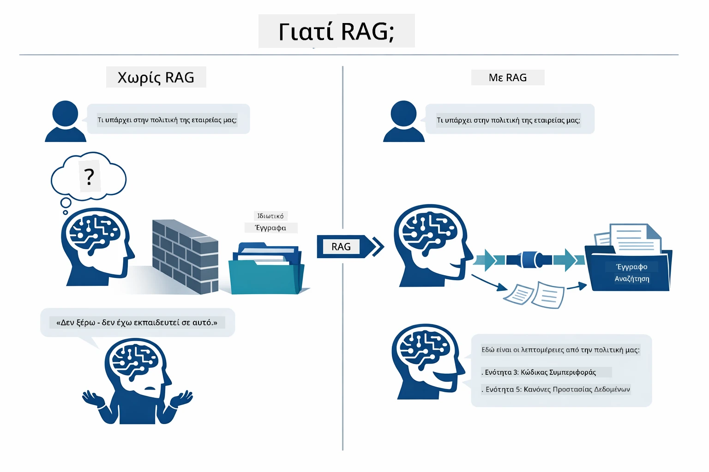

*Αυτό το διάγραμμα δείχνει τη διαφορά μεταξύ ενός τυπικού LLM (που μαντεύει από τα δεδομένα εκπαίδευσης) και ενός LLM ενισχυμένου με RAG (που συμβουλεύεται πρώτα τα έγγραφά σας).*

Δείτε πώς συνδέονται τα μέρη από άκρη σε άκρη. Η ερώτηση ενός χρήστη περνά μέσα από τέσσερα στάδια — ενσωμάτωση, αναζήτηση διανύσματος, συναρμολόγηση πλαισίου, και δημιουργία απάντησης — καθένα χτίζοντας πάνω στο προηγούμενο:


*Αυτό το διάγραμμα δείχνει την ολοκληρωμένη ροή RAG — μια ερώτηση χρήστη περνά μέσα από ενσωμάτωση, αναζήτηση διανύσματος, συναρμολόγηση πλαισίου, και παραγωγή απάντησης.*

Το υπόλοιπο αυτού του module εξηγεί κάθε στάδιο λεπτομερώς, με κώδικα τον οποίο μπορείτε να εκτελέσετε και να τροποποιήσετε.

### Ποια Προσέγγιση RAG Χρησιμοποιεί Αυτό το Σεμινάριο;

Το LangChain4j προσφέρει τρεις τρόπους για να υλοποιήσετε το RAG, κάθε ένας με διαφορετικό επίπεδο αφαίρεσης. Το παρακάτω διάγραμμα τα συγκρίνει πλάι-πλάι:

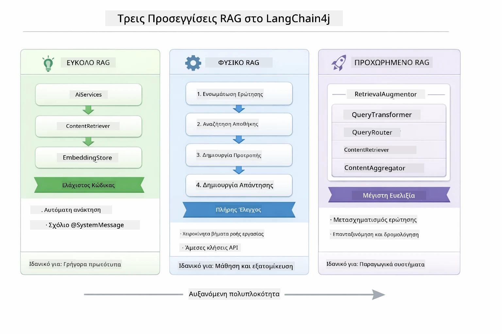

*Αυτό το διάγραμμα συγκρίνει τις τρεις προσεγγίσεις RAG του LangChain4j — Easy, Native, και Advanced — δείχνοντας τα βασικά τους συστατικά και πότε να χρησιμοποιήσετε κάθε μία.*

| Προσέγγιση | Τι Κάνει | Αντισταθμιστικό Όφελος |
|---|---|---|
| **Easy RAG** | Συνδέει τα πάντα αυτόματα μέσω `AiServices` και `ContentRetriever`. Αντιστοιχίζετε ένα interface, προσθέτετε έναν retriever, και το LangChain4j αναλαμβάνει την ενσωμάτωση, αναζήτηση και σύνθεση εντολών κρυφά. | Ελάχιστος κώδικας, αλλά δεν βλέπετε τι συμβαίνει σε κάθε βήμα. |
| **Native RAG** | Καλείτε εσείς το μοντέλο ενσωμάτωσης, αναζητάτε στην αποθήκη, φτιάχνετε την εντολή και παράγετε την απάντηση — βήμα-βήμα και ρητά. | Περισσότερος κώδικας, αλλά κάθε στάδιο είναι ορατό και τροποποιήσιμο. |
| **Advanced RAG** | Χρησιμοποιεί το πλαίσιο `RetrievalAugmentor` με pluggable μετασχηματιστές ερωτήσεων, δρομολογητές, επαναταξινομητές και ενισχυτές περιεχομένου για παραγωγικές ροές εργασίας. | Μέγιστη ευελιξία, αλλά σημαντικά περισσότερη πολυπλοκότητα. |

**Αυτό το σεμινάριο χρησιμοποιεί την Native προσέγγιση.** Κάθε βήμα της ροής RAG — ενσωμάτωση της ερώτησης, αναζήτηση στην αποθήκη διανυσμάτων, συναρμολόγηση πλαισίου και παραγωγή απάντησης — είναι γραμμένο ρητά στο [`RagService.java`](../../../03-rag/src/main/java/com/example/langchain4j/rag/service/RagService.java). Αυτό είναι εκ προθέσεως: ως εκπαιδευτικό υλικό, είναι πιο σημαντικό να βλέπετε και να κατανοείτε κάθε στάδιο παρά να ελαχιστοποιείται ο κώδικας. Μόλις νιώσετε άνετα με το πώς τα μέρη συνδέονται, μπορείτε να προχωρήσετε στο Easy RAG για γρήγορα πρωτότυπα ή στο Advanced RAG για παραγωγικά συστήματα.

> **💡 Έχετε ήδη δει το Easy RAG σε δράση;** Το [Quick Start module](../00-quick-start/README.md) περιλαμβάνει ένα παράδειγμα ερωταπαντήσεων εγγράφων ([`SimpleReaderDemo.java`](../../../00-quick-start/src/main/java/com/example/langchain4j/quickstart/SimpleReaderDemo.java)) που χρησιμοποιεί το Easy RAG — το LangChain4j αναλαμβάνει ενσωμάτωση, αναζήτηση και σύνθεση εντολών αυτόματα. Αυτό το module προχωρά ένα βήμα παραπέρα, ανοίγοντας αυτή τη ροή ώστε να βλέπετε και να ελέγχετε κάθε στάδιο εσείς οι ίδιοι.

Το παρακάτω διάγραμμα δείχνει τη ροή Easy RAG από το παράδειγμα Quick Start. Παρατηρήστε πώς τα `AiServices` και `EmbeddingStoreContentRetriever` κρύβουν όλη την πολυπλοκότητα — φορτώνετε ένα έγγραφο, προσθέτετε έναν retriever, και παίρνετε απαντήσεις. Η Native προσέγγιση σε αυτό το module ανοίγει όλα εκείνα τα κρυφά βήματα:

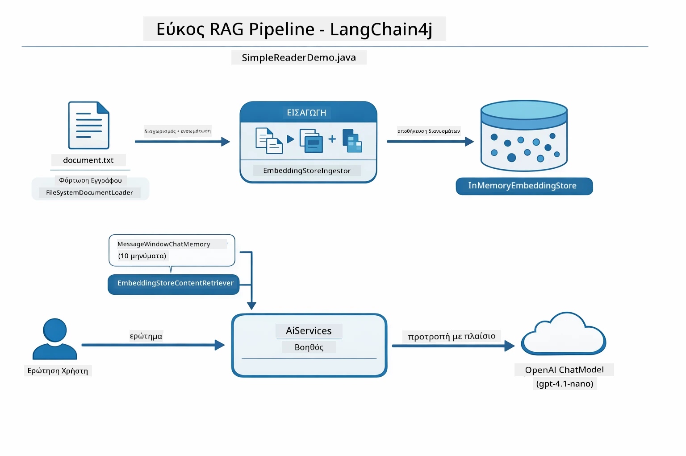

*Αυτό το διάγραμμα δείχνει τη ροή Easy RAG από το `SimpleReaderDemo.java`. Συγκρίνετέ το με την Native προσέγγιση που χρησιμοποιείται σε αυτό το module: το Easy RAG κρύβει την ενσωμάτωση, την ανάκτηση και τη σύνθεση εντολών πίσω από τα `AiServices` και `ContentRetriever` — φορτώνετε ένα έγγραφο, προσθέτετε retriever, και λαμβάνετε απαντήσεις. Η Native προσέγγιση εδώ ανοίγει αυτή τη ροή ώστε να καλείτε κάθε στάδιο (ενσωμάτωση, αναζήτηση, συναρμολόγηση πλαισίου, παραγωγή) μόνοι σας, δίνοντάς σας πλήρη ορατότητα και έλεγχο.*

## Πώς Λειτουργεί

Η ροή RAG σε αυτό το module χωρίζεται σε τέσσερα στάδια που εκτελούνται διαδοχικά κάθε φορά που ένας χρήστης θέτει μια ερώτηση. Πρώτα, ένα ανεβασμένο έγγραφο **αναλύεται και διαχωρίζεται σε τμήματα** εύχρηστου μεγέθους. Αυτά τα τμήματα στη συνέχεια μετατρέπονται σε **ενσωματώσεις διανυσμάτων** και αποθηκεύονται ώστε να μπορούν να συσχετιστούν μαθηματικά. Όταν έρχεται μια ερώτηση, το σύστημα πραγματοποιεί μια **σημασιολογική αναζήτηση** για να βρει τα πιο σχετικά τμήματα και τελικά τα περνά ως πλαίσιο στο LLM για **παραγωγή απάντησης**. Οι παρακάτω ενότητες εξετάζουν κάθε στάδιο με τον πραγματικό κώδικα και διαγράμματα. Ας δούμε το πρώτο βήμα.

### Επεξεργασία Εγγράφων

[DocumentService.java](../../../03-rag/src/main/java/com/example/langchain4j/rag/service/DocumentService.java)

Όταν ανεβάζετε ένα έγγραφο, το σύστημα το αναλύει (PDF ή απλό κείμενο), προσθέτει μεταδεδομένα όπως το όνομα αρχείου, και στη συνέχεια το χωρίζει σε τμήματα — μικρότερα κομμάτια που χωρούν άνετα στο πλαίσιο του μοντέλου. Αυτά τα τμήματα επικαλύπτονται ελαφρώς ώστε να μην χάνεται το πλαίσιο στα όρια.

```java
// Αναλύστε το ανεβασμένο αρχείο και τυλίξτε το σε ένα Έγγραφο LangChain4j
Document document = Document.from(content, metadata);

// Χωρίστε σε κομμάτια των 300 τοκεν με επικάλυψη 30 τοκεν
DocumentSplitter splitter = DocumentSplitters
    .recursive(300, 30);

List<TextSegment> segments = splitter.split(document);
```

Το παρακάτω διάγραμμα δείχνει πώς δουλεύει αυτό οπτικά. Παρατηρήστε πώς κάθε τμήμα μοιράζεται μερικά tokens με τα γειτονικά του — η επικάλυψη 30 token διασφαλίζει ότι δεν χάνεται σημαντικό πλαίσιο ανάμεσα στα κομμάτια:

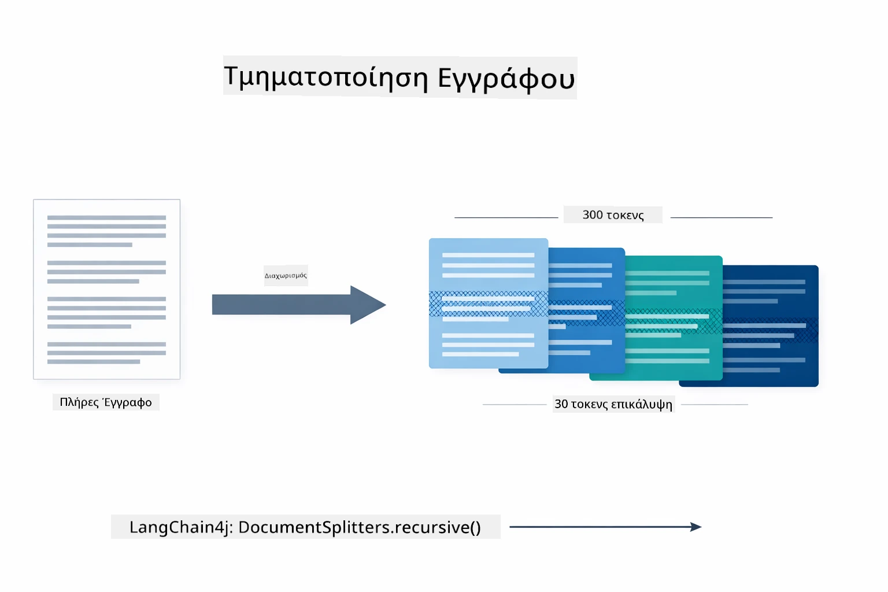

*Αυτό το διάγραμμα δείχνει ένα έγγραφο που χωρίζεται σε τμήματα των 300 token με επικάλυψη 30 token, διατηρώντας το πλαίσιο στα όρια των τμημάτων.*

> **🤖 Δοκιμάστε με το [GitHub Copilot](https://github.com/features/copilot) Chat:** Ανοίξτε το [`DocumentService.java`](../../../03-rag/src/main/java/com/example/langchain4j/rag/service/DocumentService.java) και ρωτήστε:
> - "Πώς χωρίζει το LangChain4j τα έγγραφα σε τμήματα και γιατί η επικάλυψη είναι σημαντική;"
> - "Ποιο είναι το βέλτιστο μέγεθος τμήματος για διαφορετικούς τύπους εγγράφων και γιατί;"
> - "Πώς χειρίζομαι έγγραφα σε πολλές γλώσσες ή με ειδική μορφοποίηση;"

### Δημιουργία Ενσωματώσεων

[LangChainRagConfig.java](../../../03-rag/src/main/java/com/example/langchain4j/rag/config/LangChainRagConfig.java)

Κάθε τμήμα μετατρέπεται σε έναν αριθμητικό αναπαριστώντας, που ονομάζεται ενσωμάτωση — ουσιαστικά ένας μετατροπέας από νόημα σε αριθμούς. Το μοντέλο ενσωμάτωσης δεν είναι "έξυπνο" όπως ένα μοντέλο συνομιλίας· δεν μπορεί να ακολουθεί εντολές, να συλλογίζεται ή να απαντά σε ερωτήσεις. Αυτό που κάνει είναι να χαρτογραφεί το κείμενο σε έναν μαθηματικό χώρο όπου παρόμοια νοήματα βρίσκονται κοντά το ένα στο άλλο — "αυτοκίνητο" κοντά σε "όχημα", "πολιτική επιστροφής" κοντά σε "επιστροφή χρημάτων". Σκεφτείτε το μοντέλο συνομιλίας ως ένα άτομο με το οποίο μπορείτε να μιλήσετε· το μοντέλο ενσωμάτωσης είναι ένα εξαιρετικό σύστημα αρχειοθέτησης.

Το παρακάτω διάγραμμα οπτικοποιεί αυτή την ιδέα — το κείμενο μπαίνει, βγαίνουν αριθμητικά διανύσματα, και παρόμοια νοήματα τοποθετούνται κοντά:

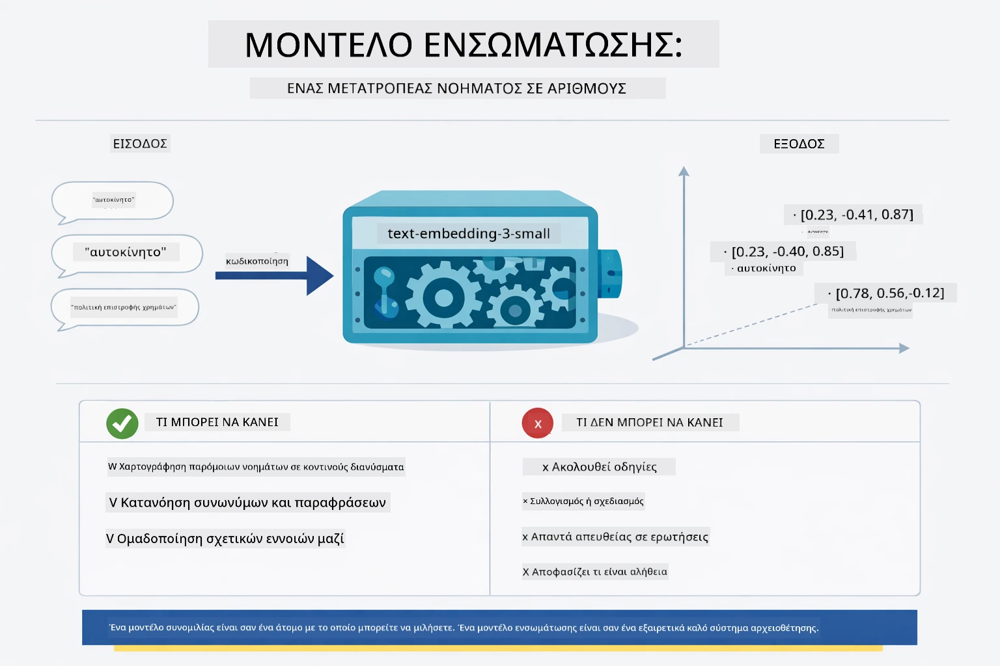

*Αυτό το διάγραμμα δείχνει πώς ένα μοντέλο ενσωμάτωσης μετατρέπει το κείμενο σε αριθμητικά διανύσματα, τοποθετώντας παρόμοια νοήματα — όπως "αυτοκίνητο" και "όχημα" — κοντά το ένα στο άλλο στο διανυσματικό χώρο.*

```java
@Bean
public EmbeddingModel embeddingModel() {
    return OpenAiOfficialEmbeddingModel.builder()
        .baseUrl(azureOpenAiEndpoint)
        .apiKey(azureOpenAiKey)
        .modelName(azureEmbeddingDeploymentName)
        .build();
}

EmbeddingStore<TextSegment> embeddingStore = 
    new InMemoryEmbeddingStore<>();
```

Το παρακάτω διάγραμμα κλάσεων δείχνει τις δύο ξεχωριστές ροές σε μια ροή εργασίας RAG και τις κλάσεις LangChain4j που τις υλοποιούν. Η **ροή απορρόφησης** (τρέχει μία φορά κατά το ανέβασμα) χωρίζει το έγγραφο, ενσωματώνει τα τμήματα και τα αποθηκεύει μέσω της `.addAll()`. Η **ροή ερωτήσεων** (τρέχει κάθε φορά που ένας χρήστης ρωτά) ενσωματώνει την ερώτηση, αναζητά στην αποθήκη μέσω της `.search()`, και περνά το ταιριαστό πλαίσιο στο μοντέλο συνομιλίας. Και οι δύο ροές συναντώνται στη κοινή διεπαφή `EmbeddingStore<TextSegment>`:

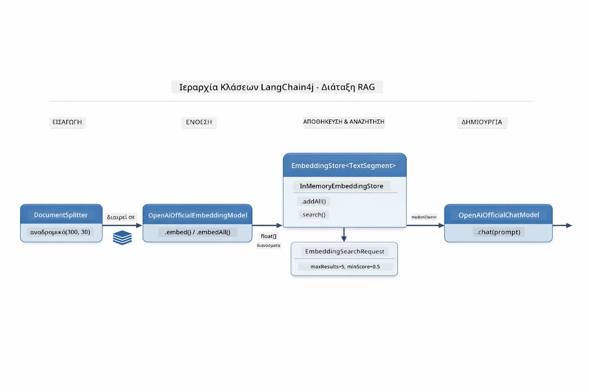

*Αυτό το διάγραμμα δείχνει τις δύο ροές σε μια ροή RAG — απορρόφηση και ερώτηση — και πώς συνδέονται μέσω της κοινής EmbeddingStore.*

Μόλις αποθηκευτούν οι ενσωματώσεις, το παρόμοιο περιεχόμενο φυσικά ομαδοποιείται στον διανυσματικό χώρο. Η οπτικοποίηση παρακάτω δείχνει πώς έγγραφα σχετικά με συναφή θέματα καταλήγουν σε γειτονικά σημεία, καθιστώντας δυνατή τη σημασιολογική αναζήτηση:


*Αυτή η οπτικοποίηση δείχνει πώς σχετικά έγγραφα ομαδοποιούνται στον 3D διανυσματικό χώρο, με θέματα όπως Τεχνικά Έγγραφα, Εμπορικοί Κανόνες, και Συχνές Ερωτήσεις να σχηματίζουν διακεκριμένες ομάδες.*

Όταν ένας χρήστης αναζητά, το σύστημα ακολουθεί τέσσερα βήματα: ενσωματώνει τα έγγραφα μία φορά, ενσωματώνει την ερώτηση σε κάθε αναζήτηση, συγκρίνει το διάνυσμα της ερώτησης με όλα τα αποθηκευμένα διανύσματα χρησιμοποιώντας την ομοιότητα του συνημιτόνου, και επιστρέφει τα κορυφαία-K τμήματα με τις υψηλότερες βαθμολογίες. Το διάγραμμα παρακάτω περιγράφει κάθε βήμα και τις σχετικές κλάσεις LangChain4j:

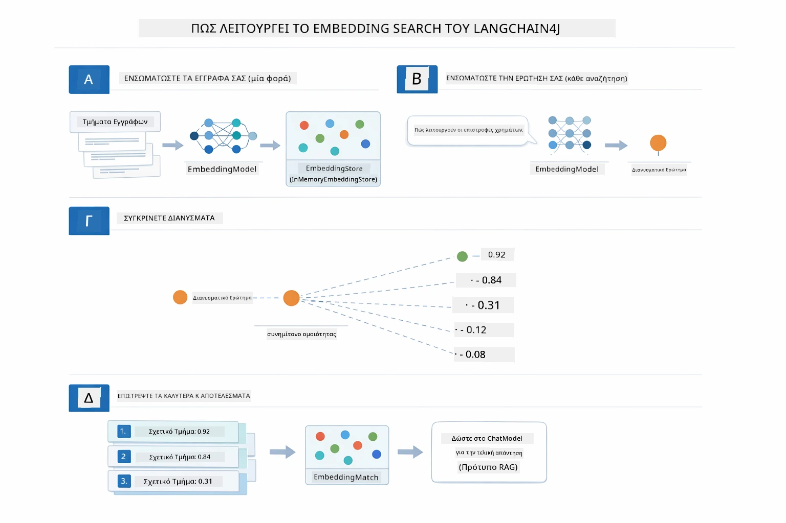

*Αυτό το διάγραμμα δείχνει τη διαδικασία αναζήτησης τεσσάρων βημάτων με ενσωμάτωση: ενσωμάτωση εγγράφων, ενσωμάτωση ερώτησης, σύγκριση διανυσμάτων με ομοιότητα συνημιτόνου, και επιστροφή των κορυφαίων αποτελεσμάτων.*

### Σημασιολογική Αναζήτηση

[RagService.java](../../../03-rag/src/main/java/com/example/langchain4j/rag/service/RagService.java)

Όταν κάνετε μια ερώτηση, και η ερώτησή σας μετατρέπεται σε ενσωμάτωση. Το σύστημα συγκρίνει την ενσωμάτωση της ερώτησής σας με όλες τις ενσωματώσεις των τμημάτων εγγράφων. Βρίσκει τα τμήματα με τα πιο παρόμοια νοήματα — όχι απλώς μείωση λέξεων-κλειδιών, αλλά πραγματική σημασιολογική ομοιότητα.

```java
Embedding queryEmbedding = embeddingModel.embed(question).content();

EmbeddingSearchRequest searchRequest = EmbeddingSearchRequest.builder()
    .queryEmbedding(queryEmbedding)
    .maxResults(5)
    .minScore(0.5)
    .build();

EmbeddingSearchResult<TextSegment> searchResult = embeddingStore.search(searchRequest);
List<EmbeddingMatch<TextSegment>> matches = searchResult.matches();

for (EmbeddingMatch<TextSegment> match : matches) {
    String relevantText = match.embedded().text();
    double score = match.score();
}
```

Το παρακάτω διάγραμμα αντιπαραβάλλει τη σημασιολογική αναζήτηση με την παραδοσιακή αναζήτηση με λέξεις-κλειδιά. Μια αναζήτηση με λέξη-κλειδί για "όχημα" χάνει ένα τμήμα για "αυτοκίνητα και φορτηγά", αλλά η σημασιολογική αναζήτηση καταλαβαίνει ότι σημαίνουν το ίδιο και το επιστρέφει ως υψηλοβάθμο αποτέλεσμα:

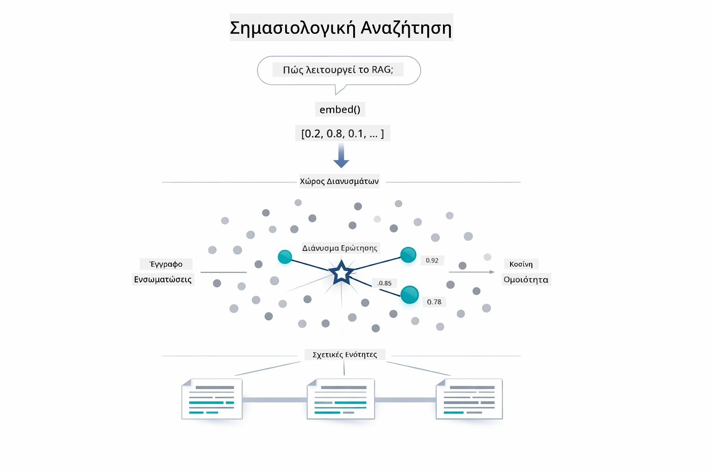

*Αυτό το διάγραμμα συγκρίνει την αναζήτηση με βάση λέξεις-κλειδιά με τη σημασιολογική αναζήτηση, δείχνοντας πώς η σημασιολογική αναζήτηση αναζητά περιεχόμενο σχετικό εννοιολογικά ακόμη και όταν διαφέρουν οι ακριβείς λέξεις-κλειδιά.*
Κάτω από την επιφάνεια, η ομοιότητα μετριέται χρησιμοποιώντας την συνημίτονα ομοιότητα — ουσιαστικά ρωτώντας "δεικνύουν αυτά τα δύο βέλη προς την ίδια κατεύθυνση;" Δύο τμήματα μπορούν να χρησιμοποιούν εντελώς διαφορετικές λέξεις, αλλά αν σημαίνουν το ίδιο πράγμα, τα διανύσματά τους δείχνουν στην ίδια κατεύθυνση και η βαθμολογία είναι κοντά στο 1.0:

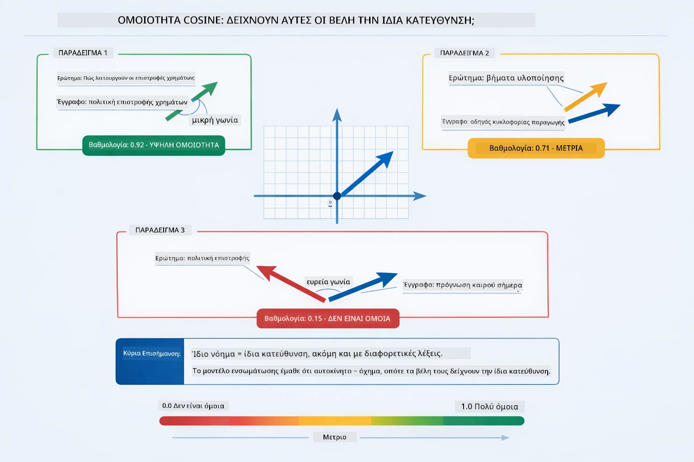

*Αυτό το διάγραμμα απεικονίζει τη συνημίτονα ομοιότητα ως τη γωνία μεταξύ των διανυσμάτων ενσωμάτωσης — όσο πιο ευθυγραμμισμένα είναι τα διανύσματα, τόσο πιο κοντά στο 1.0 είναι η βαθμολογία, υποδεικνύοντας μεγαλύτερη σημασιολογική ομοιότητα.*

> **🤖 Δοκίμασε με [GitHub Copilot](https://github.com/features/copilot) Chat:** Άνοιξε το [`RagService.java`](../../../03-rag/src/main/java/com/example/langchain4j/rag/service/RagService.java) και ρώτα:
> - "Πώς λειτουργεί η αναζήτηση ομοιότητας με τις ενσωματώσεις και τι καθορίζει τη βαθμολογία;"
> - "Ποιο όριο ομοιότητας πρέπει να χρησιμοποιήσω και πώς επηρεάζει τα αποτελέσματα;"
> - "Πώς διαχειρίζομαι περιπτώσεις όπου δεν βρέθηκαν σχετικά έγγραφα;"

### Δημιουργία Απάντησης

[RagService.java](../../../03-rag/src/main/java/com/example/langchain4j/rag/service/RagService.java)

Τα πιο σχετικά τμήματα συγκεντρώνονται σε μια δομημένη υπόδειξη που περιλαμβάνει ρητές οδηγίες, το ανακτηθέν πλαίσιο και την ερώτηση του χρήστη. Το μοντέλο διαβάζει αυτά τα συγκεκριμένα τμήματα και απαντά βάσει αυτών των πληροφοριών — μπορεί να χρησιμοποιήσει μόνο ό,τι έχει μπροστά του, κάτι που αποτρέπει την παραγωγή ψευδών απαντήσεων.

```java
String context = matches.stream()
    .map(match -> match.embedded().text())
    .collect(Collectors.joining("\n\n"));

String prompt = String.format("""
    Answer the question based on the following context.
    If the answer cannot be found in the context, say so.

    Context:
    %s

    Question: %s

    Answer:""", context, request.question());

String answer = chatModel.chat(prompt);
```

Το διάγραμμα παρακάτω δείχνει αυτή τη συναρμολόγηση σε δράση — τα τμήματα με την υψηλότερη βαθμολογία από το βήμα αναζήτησης εισάγονται στο πρότυπο υπόδειξης, και το `OpenAiOfficialChatModel` παράγει μια βασισμένη απάντηση:

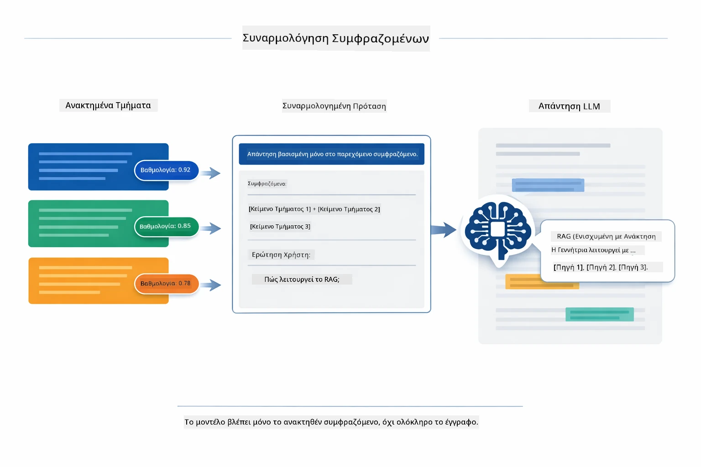

*Αυτό το διάγραμμα δείχνει πώς τα τμήματα με την υψηλότερη βαθμολογία συγκεντρώνονται σε μια δομημένη υπόδειξη, επιτρέποντας στο μοντέλο να παράγει μια βασισμένη απάντηση από τα δεδομένα σας.*

## Εκτέλεση της Εφαρμογής

**Επαλήθευση ανάπτυξης:**

Βεβαιωθείτε ότι το αρχείο `.env` υπάρχει στον ριζικό φάκελο με τα διαπιστευτήρια Azure (δημιουργήθηκε κατά τη διάρκεια του Μονάδα 01). Εκτελέστε το από τον φάκελο της μονάδας (`03-rag/`):

**Bash:**
```bash
cat ../.env  # Θα πρέπει να εμφανίζει AZURE_OPENAI_ENDPOINT, API_KEY, DEPLOYMENT
```

**PowerShell:**
```powershell
Get-Content ..\.env  # Πρέπει να εμφανίζει AZURE_OPENAI_ENDPOINT, API_KEY, DEPLOYMENT
```

**Εκκίνηση της εφαρμογής:**

> **Σημείωση:** Αν έχετε ήδη ξεκινήσει όλες τις εφαρμογές χρησιμοποιώντας το `./start-all.sh` από τον ριζικό φάκελο (όπως περιγράφεται στο Μονάδα 01), αυτή η μονάδα τρέχει ήδη στην θύρα 8081. Μπορείτε να παραλείψετε τις παρακάτω εντολές εκκίνησης και να μεταβείτε απευθείας στο http://localhost:8081.

**Επιλογή 1: Χρήση του Spring Boot Dashboard (Συνιστάται για χρήστες VS Code)**

Το dev container περιλαμβάνει την επέκταση Spring Boot Dashboard, που παρέχει οπτικό περιβάλλον για τη διαχείριση όλων των εφαρμογών Spring Boot. Μπορείτε να το βρείτε στη μπάρα δραστηριότητας στα αριστερά του VS Code (αναζητήστε το εικονίδιο του Spring Boot).

Από το Spring Boot Dashboard μπορείτε να:
- Δείτε όλες τις διαθέσιμες εφαρμογές Spring Boot στο χώρο εργασίας
- Ξεκινήσετε/σταματήσετε εφαρμογές με ένα κλικ
- Προβάλετε αρχεία καταγραφής εφαρμογών σε πραγματικό χρόνο
- Παρακολουθείτε την κατάσταση των εφαρμογών

Απλά κάντε κλικ στο κουμπί εκκίνησης δίπλα στο "rag" για να ξεκινήσετε αυτή τη μονάδα, ή ξεκινήστε όλες τις μονάδες μαζί.


*Αυτή η εικόνα οθόνης δείχνει το Spring Boot Dashboard στο VS Code, όπου μπορείτε να ξεκινήσετε, να σταματήσετε και να παρακολουθήσετε εφαρμογές οπτικά.*

**Επιλογή 2: Χρήση shell scripts**

Εκκινήστε όλες τις web εφαρμογές (μονάδες 01-04):

**Bash:**
```bash
cd ..  # Από τον ριζικό φάκελο
./start-all.sh
```

**PowerShell:**
```powershell
cd ..  # Από τον ριζικό κατάλογο
.\start-all.ps1
```

Ή εκκινήστε μόνο αυτή τη μονάδα:

**Bash:**
```bash
cd 03-rag
./start.sh
```

**PowerShell:**
```powershell
cd 03-rag
.\start.ps1
```

Και τα δύο scripts φορτώνουν αυτόματα μεταβλητές περιβάλλοντος από το αρχείο `.env` του ριζικού φακέλου και θα δημιουργήσουν τα JAR αν δεν υπάρχουν.

> **Σημείωση:** Αν προτιμάτε να κατασκευάσετε όλες τις μονάδες χειροκίνητα πριν την εκκίνηση:
>
> **Bash:**
> ```bash
> cd ..  # Go to root directory
> mvn clean package -DskipTests
> ```
>
> **PowerShell:**
> ```powershell
> cd ..  # Go to root directory
> mvn clean package -DskipTests
> ```

Ανοίξτε το http://localhost:8081 στο πρόγραμμα περιήγησής σας.

**Για να σταματήσετε:**

**Bash:**
```bash
./stop.sh  # Μόνο αυτό το module
# Ή
cd .. && ./stop-all.sh  # Όλα τα modules
```

**PowerShell:**
```powershell
.\stop.ps1  # Μόνο αυτό το module
# Ή
cd ..; .\stop-all.ps1  # Όλα τα modules
```

## Χρήση της Εφαρμογής

Η εφαρμογή παρέχει μια διαδικτυακή διεπαφή για την φόρτωση εγγράφων και την υποβολή ερωτήσεων.

<a href="images/rag-homepage.png"></a>

*Αυτή η εικόνα οθόνης δείχνει τη διεπαφή της εφαρμογής RAG όπου ανεβάζετε έγγραφα και κάνετε ερωτήσεις.*

### Ανέβασμα Εγγράφου

Ξεκινήστε ανεβάζοντας ένα έγγραφο - τα αρχεία TXT είναι ιδανικά για δοκιμές. Ένα `sample-document.txt` παρέχεται σε αυτόν τον φάκελο που περιέχει πληροφορίες για τις λειτουργίες του LangChain4j, την υλοποίηση RAG και βέλτιστες πρακτικές - τέλειο για δοκιμή του συστήματος.

Το σύστημα επεξεργάζεται το έγγραφό σας, το διασπά σε τμήματα και δημιουργεί ενσωματώσεις για κάθε τμήμα. Αυτό γίνεται αυτόματα όταν ανεβάζετε.

### Υποβολή Ερωτήσεων

Τώρα κάντε συγκεκριμένες ερωτήσεις σχετικά με το περιεχόμενο του εγγράφου. Δοκιμάστε κάτι πραγματικό που δηλώνεται σαφώς στο έγγραφο. Το σύστημα αναζητά σχετικά τμήματα, τα συμπεριλαμβάνει στην υπόδειξη και παράγει μια απάντηση.

### Έλεγχος Αναφορών Πηγών

Παρατηρήστε ότι κάθε απάντηση περιλαμβάνει αναφορές πηγών με βαθμολογίες ομοιότητας. Αυτές οι βαθμολογίες (0 έως 1) δείχνουν πόσο σχετικό ήταν κάθε τμήμα με την ερώτησή σας. Υψηλότερες βαθμολογίες σημαίνουν καλύτερες αντιστοιχίες. Αυτό σας επιτρέπει να επαληθεύσετε την απάντηση με βάση το πρωτότυπο υλικό.

<a href="images/rag-query-results.png"></a>

*Αυτή η εικόνα οθόνης δείχνει τα αποτελέσματα ερωτήσεων με την παραγόμενη απάντηση, τις αναφορές πηγών και τις βαθμολογίες σχετικότητας για κάθε ανακτηθέν τμήμα.*

### Πειραματιστείτε με Ερωτήσεις

Δοκιμάστε διαφορετικούς τύπους ερωτήσεων:
- Συγκεκριμένα γεγονότα: "Ποιο είναι το κύριο θέμα;"
- Συγκρίσεις: "Ποια είναι η διαφορά μεταξύ X και Y;"
- Περίληψη: "Περίληψη των βασικών σημείων για το Z"

Παρακολουθήστε πώς αλλάζουν οι βαθμολογίες σχετικότητας ανάλογα με το πόσο καλά η ερώτησή σας ταιριάζει με το περιεχόμενο του εγγράφου.

## Βασικές Έννοιες

### Στρατηγική Κατατμήσεων

Τα έγγραφα διασπώνται σε τμήματα 300 tokens με 30 tokens επικάλυψη. Αυτή η ισορροπία διασφαλίζει ότι κάθε τμήμα έχει αρκετό πλαίσιο για να είναι ουσιαστικό ενώ παραμένει αρκετά μικρό ώστε να χωρούν πολλά τμήματα σε μια υπόδειξη.

### Βαθμολογίες Ομοιότητας

Κάθε ανακτηθέν τμήμα συνοδεύεται από μια βαθμολογία ομοιότητας μεταξύ 0 και 1 που δείχνει πόσο στενά ταιριάζει με την ερώτηση του χρήστη. Το διάγραμμα παρακάτω οπτικοποιεί τα εύρη βαθμολογιών και πώς το σύστημα τα χρησιμοποιεί για τη φιλτραρίσματος αποτελεσμάτων:

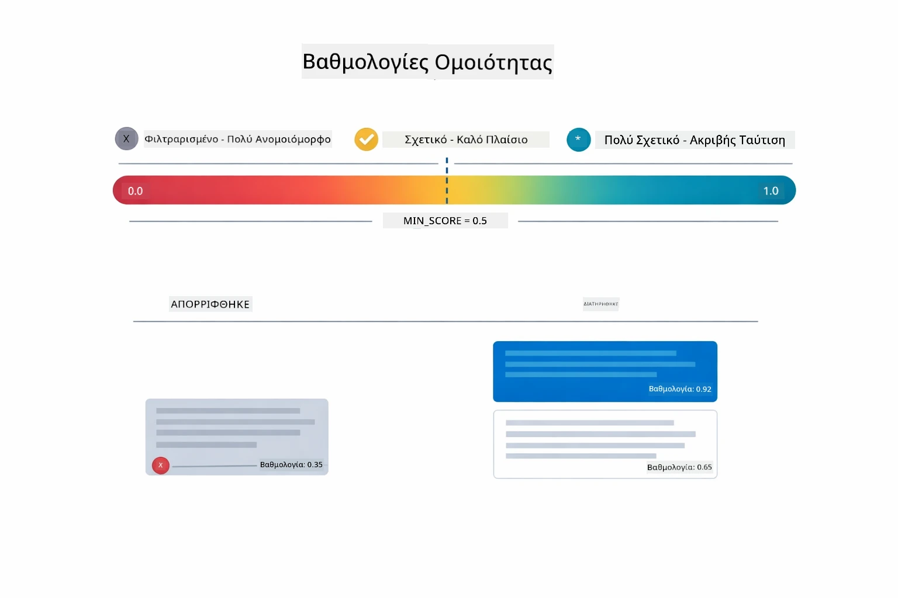

*Αυτό το διάγραμμα δείχνει εύρη βαθμολογιών από 0 έως 1, με κατώτερο όριο 0.5 που φιλτράρει τα μη σχετικά τμήματα.*

Οι βαθμολογίες κυμαίνονται από 0 έως 1:
- 0.7-1.0: Πολύ σχετικό, ακριβής αντιστοιχία
- 0.5-0.7: Σχετικό, καλό πλαίσιο
- Κάτω από 0.5: Φιλτραρισμένο, πολύ ανομοιόμορφο

Το σύστημα ανακτά μόνο τμήματα πάνω από το ελάχιστο όριο για να διασφαλίσει την ποιότητα.

Οι ενσωματώσεις λειτουργούν καλά όταν οι έννοιες συσσωρεύονται καθαρά, αλλά έχουν και αδύναμα σημεία. Το διάγραμμα παρακάτω δείχνει συνήθεις τρόπους αποτυχίας — τμήματα πολύ μεγάλα παράγουν θολά διανύσματα, τμήματα πολύ μικρά στερούνται πλαισίου, ασαφείς όροι σκιάζουν πολλαπλές ομάδες, και οι ακριβείς αναζητήσεις (IDs, αριθμοί μερών) δεν λειτουργούν καθόλου με ενσωματώσεις:

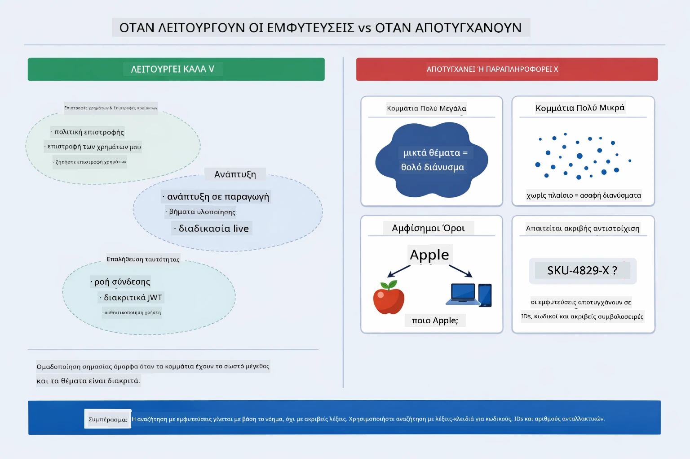

*Αυτό το διάγραμμα δείχνει συνήθεις τρόπους αποτυχίας ενσωμάτωσης: τμήματα πολύ μεγάλα, τμήματα πολύ μικρά, ασαφείς όροι που δείχνουν σε πολλαπλές ομάδες, και ακριβείς αναζητήσεις όπως IDs.*

### Αποθήκευση στη Μνήμη

Αυτή η μονάδα χρησιμοποιεί αποθήκευση στη μνήμη για απλότητα. Όταν επανεκκινείτε την εφαρμογή, τα ανεβασμένα έγγραφα χάνονται. Συστήματα παραγωγής χρησιμοποιούν επίμονες βάσεις δεδομένων διανυσμάτων όπως το Qdrant ή το Azure AI Search.

### Διαχείριση Παραθύρου Πλαισίου

Κάθε μοντέλο έχει μέγιστο παράθυρο πλαισίου. Δεν μπορείτε να συμπεριλάβετε κάθε τμήμα από ένα μεγάλο έγγραφο. Το σύστημα ανακτά τα N πιο σχετικά τμήματα (προεπιλογή 5) για να παραμείνει εντός ορίων ενώ παρέχει αρκετό πλαίσιο για ακριβείς απαντήσεις.

## Πότε έχει Σημασία το RAG

Το RAG δεν είναι πάντα η κατάλληλη προσέγγιση. Ο παρακάτω οδηγός απόφασης σας βοηθά να αποφασίσετε πότε το RAG προσθέτει αξία έναντι απλούστερων προσεγγίσεων — όπως η άμεση ενσωμάτωση περιεχομένου στην υπόδειξη ή η χρήση της ενσωματωμένης γνώσης του μοντέλου:

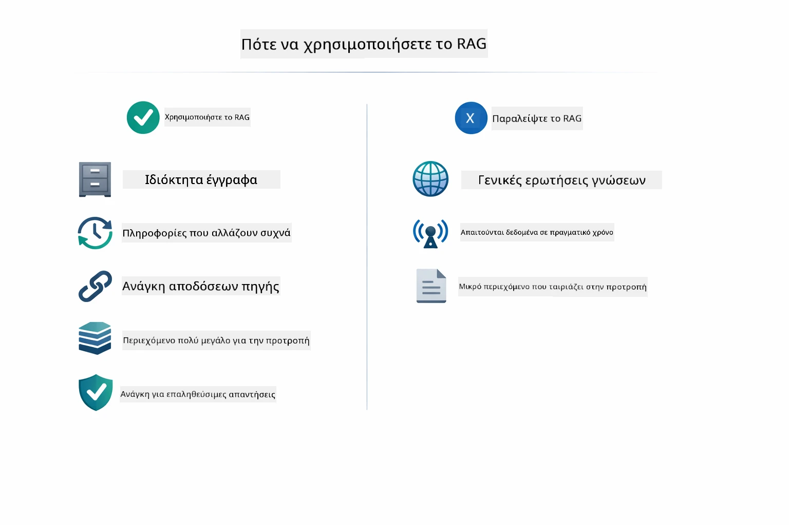

*Αυτό το διάγραμμα δείχνει έναν οδηγό απόφασης για το πότε το RAG προσθέτει αξία και πότε οι απλούστερες προσεγγίσεις είναι επαρκείς.*

## Επόμενα Βήματα

**Επόμενη Μονάδα:** [04-tools - AI Agents with Tools](../04-tools/README.md)

---

**Πλοήγηση:** [← Προηγούμενο: Μονάδα 02 - Μηχανική Υποδείξεων](../02-prompt-engineering/README.md) | [Πίσω στην Αρχική](../README.md) | [Επόμενο: Μονάδα 04 - Εργαλεία →](../04-tools/README.md)

---

<!-- CO-OP TRANSLATOR DISCLAIMER START -->
**Αποποίηση ευθυνών**:  
Αυτή η εγγραφή έχει μεταφραστεί χρησιμοποιώντας την υπηρεσία αυτόματης μετάφρασης AI [Co-op Translator](https://github.com/Azure/co-op-translator). Παρά τις προσπάθειές μας για ακρίβεια, παρακαλούμε να λάβετε υπόψη ότι οι αυτοματοποιημένες μεταφράσεις ενδέχεται να περιέχουν λάθη ή ανακρίβειες. Το πρωτότυπο έγγραφο στη γλωσσική του μορφή πρέπει να θεωρείται η αυθεντική πηγή. Για κρίσιμες πληροφορίες, συνιστάται η επαγγελματική ανθρώπινη μετάφραση. Δεν φέρουμε ευθύνη για τυχόν παρεξηγήσεις ή λανθασμένες ερμηνείες που προκύπτουν από τη χρήση αυτής της μετάφρασης.
<!-- CO-OP TRANSLATOR DISCLAIMER END -->