# Module 04: Πράκτορες Τεχνητής Νοημοσύνης με Εργαλεία

## Πίνακας Περιεχομένων

- [Τι Θα Μάθετε](../../../04-tools)
- [Προαπαιτούμενα](../../../04-tools)
- [Κατανόηση των Πρακτόρων Τεχνητής Νοημοσύνης με Εργαλεία](../../../04-tools)
- [Πώς Λειτουργεί η Κλήση Εργαλείων](../../../04-tools)
  - [Ορισμοί Εργαλείων](../../../04-tools)
  - [Λήψη Αποφάσεων](../../../04-tools)
  - [Εκτέλεση](../../../04-tools)
  - [Δημιουργία Απάντησης](../../../04-tools)
  - [Αρχιτεκτονική: Αυτόματη Σύνδεση Spring Boot](../../../04-tools)
- [Αλυσίδωση Εργαλείων](../../../04-tools)
- [Εκτέλεση της Εφαρμογής](../../../04-tools)
- [Χρήση της Εφαρμογής](../../../04-tools)
  - [Δοκιμάστε Απλή Χρήση Εργαλείων](../../../04-tools)
  - [Δοκιμή Αλυσίδωσης Εργαλείων](../../../04-tools)
  - [Δείτε τη Ροή της Συζήτησης](../../../04-tools)
  - [Πειραματιστείτε με Διάφορα Αιτήματα](../../../04-tools)
- [Βασικές Έννοιες](../../../04-tools)
  - [Το Πρότυπο ReAct (Σκέψη και Δράση)](../../../04-tools)
  - [Οι Περιγραφές Εργαλείων Είναι Σημαντικές](../../../04-tools)
  - [Διαχείριση Συνεδρίας](../../../04-tools)
  - [Διαχείριση Σφαλμάτων](../../../04-tools)
- [Διαθέσιμα Εργαλεία](../../../04-tools)
- [Πότε να Χρησιμοποιείτε Πράκτορες με Βάση τα Εργαλεία](../../../04-tools)
- [Εργαλεία έναντι RAG](../../../04-tools)
- [Επόμενα Βήματα](../../../04-tools)

## Τι Θα Μάθετε

Μέχρι τώρα, έχετε μάθει πώς να διεξάγετε συνομιλίες με ΤΝ, να δομείτε αποτελεσματικά τις προτροπές και να εδραιώνετε τις απαντήσεις στα έγγραφά σας. Αλλά υπάρχει ακόμη ένας θεμελιώδης περιορισμός: τα γλωσσικά μοντέλα μπορούν μόνο να παράγουν κείμενο. Δεν μπορούν να ελέγξουν τον καιρό, να εκτελέσουν υπολογισμούς, να κάνουν ερωτήματα σε βάσεις δεδομένων ή να αλληλεπιδράσουν με εξωτερικά συστήματα.

Τα εργαλεία αλλάζουν αυτό. Δίνοντας στο μοντέλο πρόσβαση σε λειτουργίες που μπορεί να καλέσει, το μετατρέπετε από γεννήτρια κειμένου σε πράκτορα που μπορεί να αναλάβει δράσεις. Το μοντέλο αποφασίζει πότε χρειάζεται ένα εργαλείο, ποιο εργαλείο να χρησιμοποιήσει και ποιους παραμέτρους να περάσει. Ο κώδικάς σας εκτελεί τη λειτουργία και επιστρέφει το αποτέλεσμα. Το μοντέλο ενσωματώνει αυτό το αποτέλεσμα στην απάντησή του.

## Προαπαιτούμενα

- Ολοκληρωμένο το [Module 01 - Εισαγωγή](../01-introduction/README.md) (έχουν αναπτυχθεί πόροι Azure OpenAI)
- Συνιστώνται ολοκληρωμένα τα προηγούμενα modules (αυτό το module αναφέρεται σε [έννοιες RAG από το Module 03](../03-rag/README.md) στη σύγκριση Εργαλείων έναντι RAG)
- Αρχείο `.env` στον ριζικό κατάλογο με διαπιστευτήρια Azure (δημιουργημένο από την `azd up` στο Module 01)

> **Σημείωση:** Εάν δεν έχετε ολοκληρώσει το Module 01, ακολουθήστε πρώτα τις οδηγίες ανάπτυξης εκεί.

## Κατανόηση των Πρακτόρων Τεχνητής Νοημοσύνης με Εργαλεία

> **📝 Σημείωση:** Ο όρος "πράκτορες" σε αυτό το module αναφέρεται σε βοηθούς ΤΝ εμπλουτισμένους με δυνατότητες κλήσης εργαλείων. Αυτό διαφέρει από τα πρότυπα **Agentic AI** (αυτόνομοι πράκτορες με σχεδιασμό, μνήμη και λογική πολλών βημάτων) που θα καλύψουμε στο [Module 05: MCP](../05-mcp/README.md).

Χωρίς εργαλεία, ένα γλωσσικό μοντέλο μπορεί μόνο να παράγει κείμενο από τα δεδομένα εκπαίδευσής του. Ζητήστε του τον τρέχοντα καιρό και πρέπει να μαντέψει. Δώστε του εργαλεία και μπορεί να καλέσει ένα API καιρού, να εκτελέσει υπολογισμούς ή να κάνει ερωτήματα σε βάση δεδομένων — στη συνέχεια να ενσωματώσει αυτά τα πραγματικά αποτελέσματα στην απάντησή του.

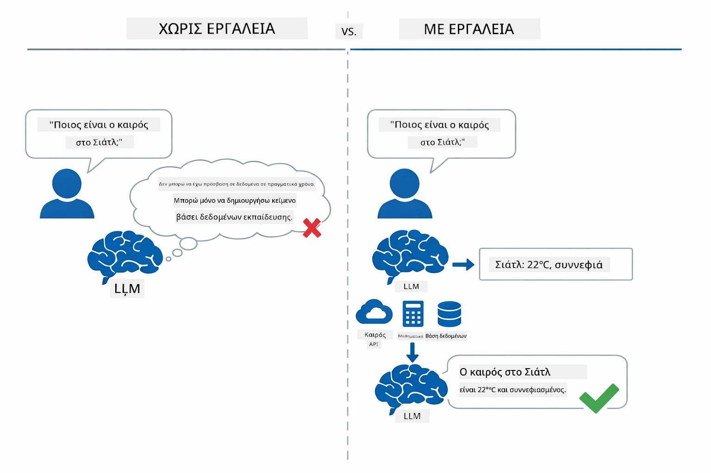

*Χωρίς εργαλεία το μοντέλο μόνο μαντεύει — με εργαλεία μπορεί να καλέσει APIs, να εκτελέσει υπολογισμούς και να επιστρέψει δεδομένα σε πραγματικό χρόνο.*

Ένας πράκτορας ΤΝ με εργαλεία ακολουθεί το πρότυπο **Reasoning and Acting (ReAct)**. Το μοντέλο δεν απαντά απλώς — σκέφτεται τι χρειάζεται, ενεργεί καλώντας ένα εργαλείο, παρατηρεί το αποτέλεσμα και στη συνέχεια αποφασίζει αν θα ξαναδράσει ή θα δώσει την τελική απάντηση:

1. **Σκέψη** — Ο πράκτορας αναλύει την ερώτηση του χρήστη και καθορίζει ποια πληροφορία χρειάζεται
2. **Δράση** — Ο πράκτορας επιλέγει το κατάλληλο εργαλείο, δημιουργεί τις σωστές παραμέτρους και το καλεί
3. **Παρατήρηση** — Ο πράκτορας λαμβάνει την έξοδο του εργαλείου και αξιολογεί το αποτέλεσμα
4. **Επανάληψη ή Απάντηση** — Αν χρειάζονται περισσότερα δεδομένα, ο πράκτορας επιστρέφει στο βήμα 1, αλλιώς συνθέτει μια φυσική γλώσσα απάντηση

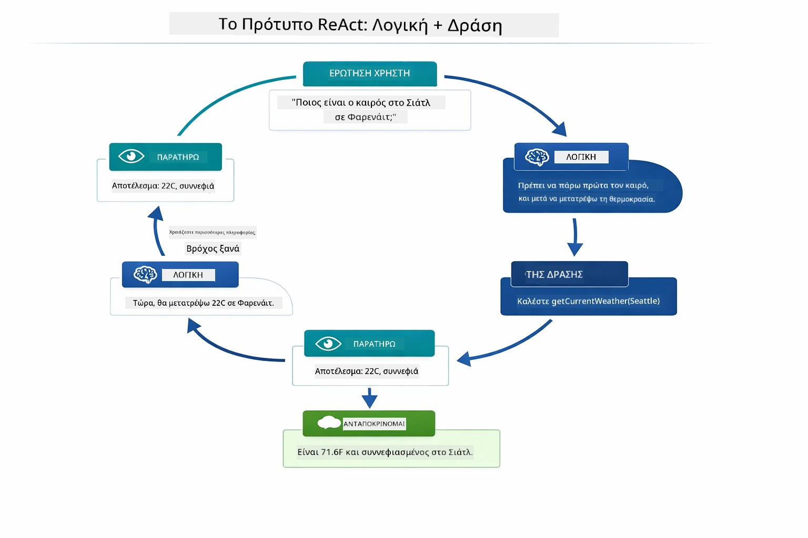

*Ο κύκλος ReAct — ο πράκτορας συλλογίζεται τι να κάνει, δρα καλώντας ένα εργαλείο, παρατηρεί το αποτέλεσμα και επαναλαμβάνει μέχρι να δώσει την τελική απάντηση.*

Αυτό συμβαίνει αυτόματα. Ορίζετε τα εργαλεία και τις περιγραφές τους. Το μοντέλο αναλαμβάνει τη λήψη αποφάσεων για το πότε και πώς να τα χρησιμοποιήσει.

## Πώς Λειτουργεί η Κλήση Εργαλείων

### Ορισμοί Εργαλείων

[WeatherTool.java](../../../04-tools/src/main/java/com/example/langchain4j/agents/tools/WeatherTool.java) | [TemperatureTool.java](../../../04-tools/src/main/java/com/example/langchain4j/agents/tools/TemperatureTool.java)

Ορίζετε συναρτήσεις με σαφείς περιγραφές και προδιαγραφές παραμέτρων. Το μοντέλο βλέπει αυτές τις περιγραφές στην προτροπή συστήματος και κατανοεί τι κάνει κάθε εργαλείο.

```java
@Component
public class WeatherTool {
    
    @Tool("Get the current weather for a location")
    public String getCurrentWeather(@P("Location name") String location) {
        // Η λογική αναζήτησης καιρού σας
        return "Weather in " + location + ": 22°C, cloudy";
    }
}

@AiService
public interface Assistant {
    String chat(@MemoryId String sessionId, @UserMessage String message);
}

// Ο βοηθός συνδέεται αυτόματα από το Spring Boot με:
// - το bean ChatModel
// - όλες τις μεθόδους @Tool από τις κλάσεις @Component
// - το ChatMemoryProvider για τη διαχείριση συνεδριών
```

Το διάγραμμα παρακάτω αναλύει κάθε σχολιασμό και δείχνει πώς κάθε κομμάτι βοηθά το ΤΝ να καταλάβει πότε να καλέσει το εργαλείο και ποια ορίσματα να περάσει:

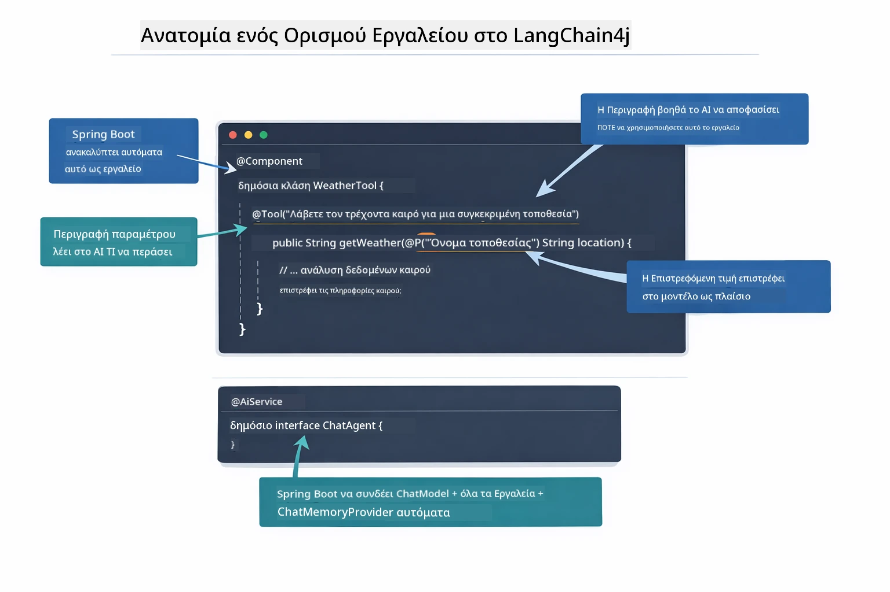

*Ανατομία ενός ορισμού εργαλείου — το @Tool λέει στο ΤΝ πότε να το χρησιμοποιεί, το @P περιγράφει κάθε παράμετρο, και το @AiService συνδέει τα πάντα κατά την εκκίνηση.*

> **🤖 Δοκιμάστε με το [GitHub Copilot](https://github.com/features/copilot) Chat:** Ανοίξτε το [`WeatherTool.java`](../../../04-tools/src/main/java/com/example/langchain4j/agents/tools/WeatherTool.java) και ρωτήστε:
> - "Πώς θα ενσωμάτωνα ένα πραγματικό API καιρού όπως το OpenWeatherMap αντί για ψεύτικα δεδομένα;"
> - "Τι κάνει μια καλή περιγραφή εργαλείου που βοηθά το ΤΝ να το χρησιμοποιήσει σωστά;"
> - "Πώς χειρίζομαι σφάλματα API και όρια ρυθμού στις υλοποιήσεις εργαλείων;"

### Λήψη Αποφάσεων

Όταν ένας χρήστης ρωτά «Ποιος είναι ο καιρός στο Σιάτλ;», το μοντέλο δεν διαλέγει τυχαία ένα εργαλείο. Συγκρίνει την πρόθεση του χρήστη με κάθε περιγραφή εργαλείου που έχει πρόσβαση, αξιολογεί την συνάφεια κάθε εργαλείου και επιλέγει το καλύτερο ταίριασμα. Στη συνέχεια δημιουργεί μια δομημένη κλήση συνάρτησης με τις κατάλληλες παραμέτρους — στην περίπτωση αυτή, ορίζοντας το `location` σε `"Seattle"`.

Εάν κανένα εργαλείο δεν ταιριάζει στο αίτημα του χρήστη, το μοντέλο επιστρέφει απάντηση από τις δικές του γνώσεις. Αν ταιριάζουν πολλαπλά εργαλεία, επιλέγει το πιο συγκεκριμένο.

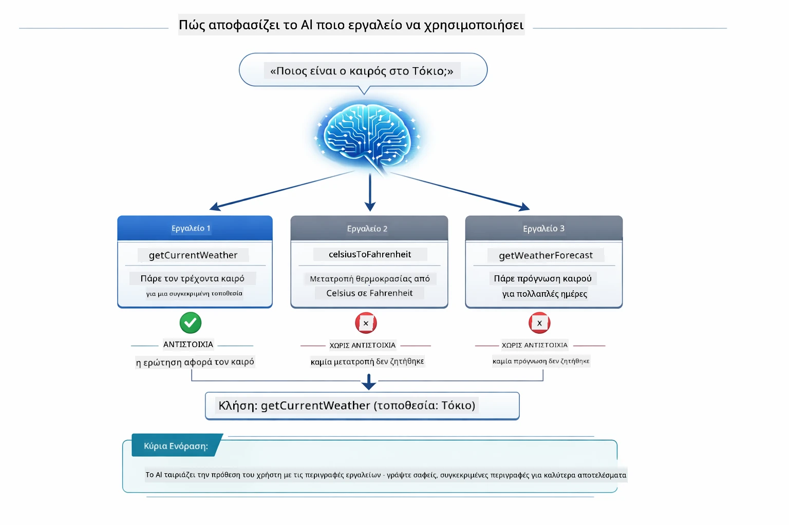

*Το μοντέλο αξιολογεί κάθε διαθέσιμο εργαλείο σε σχέση με την πρόθεση του χρήστη και επιλέγει το καλύτερο ταίριασμα — γι' αυτό έχει σημασία να γράφετε σαφείς, συγκεκριμένες περιγραφές εργαλείων.*

### Εκτέλεση

[AgentService.java](../../../04-tools/src/main/java/com/example/langchain4j/agents/service/AgentService.java)

Το Spring Boot κάνει αυτόματη σύνδεση του δηλωτικού interface `@AiService` με όλα τα καταχωρημένα εργαλεία, και το LangChain4j εκτελεί τις κλήσεις εργαλείων αυτόματα. Πίσω από τα παρασκήνια, μια πλήρης κλήση εργαλείου ρέει μέσα από έξι στάδια — από την ερώτηση του χρήστη σε φυσική γλώσσα μέχρι την απάντηση πάλι σε φυσική γλώσσα:

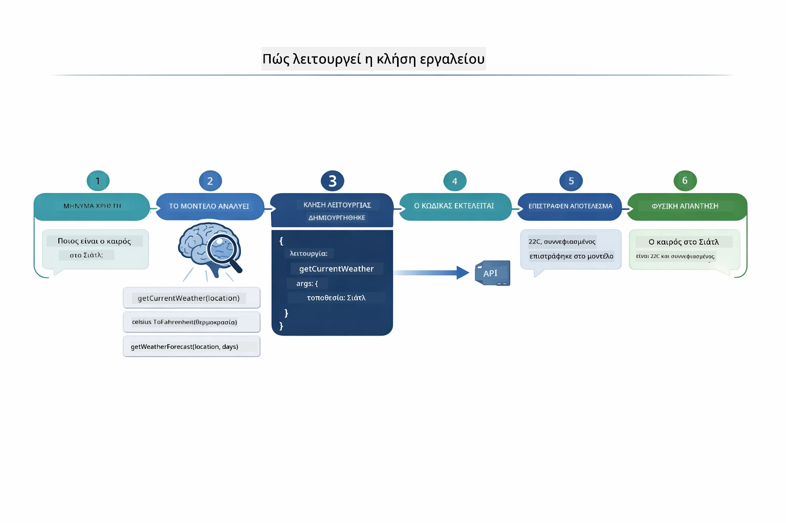

*Η πλήρης ροή — ο χρήστης κάνει μια ερώτηση, το μοντέλο επιλέγει εργαλείο, το LangChain4j το εκτελεί, και το μοντέλο υφαίνει το αποτέλεσμα σε μια φυσική απάντηση.*

> **🤖 Δοκιμάστε με το [GitHub Copilot](https://github.com/features/copilot) Chat:** Ανοίξτε το [`AgentService.java`](../../../04-tools/src/main/java/com/example/langchain4j/agents/service/AgentService.java) και ρωτήστε:
> - "Πώς λειτουργεί το πρότυπο ReAct και γιατί είναι αποτελεσματικό για πράκτορες ΤΝ;"
> - "Πώς αποφασίζει ο πράκτορας ποιο εργαλείο να χρησιμοποιήσει και με ποια σειρά;"
> - "Τι συμβαίνει αν αποτύχει η εκτέλεση ενός εργαλείου - πώς να χειριστώ αποτελεσματικά τα σφάλματα;"

### Δημιουργία Απάντησης

Το μοντέλο λαμβάνει τα δεδομένα καιρού και τα μορφοποιεί σε απάντηση σε φυσική γλώσσα για τον χρήστη.

### Αρχιτεκτονική: Αυτόματη Σύνδεση Spring Boot

Αυτό το module χρησιμοποιεί την ενσωμάτωση του LangChain4j με Spring Boot μέσω δηλωτικών `@AiService` interfaces. Κατά την εκκίνηση, το Spring Boot ανακαλύπτει κάθε `@Component` που περιέχει μεθόδους `@Tool`, το bean `ChatModel` σας και τον `ChatMemoryProvider` — και τα συνδέει όλα σε ένα interface `Assistant` χωρίς καθόλου boilerplate.

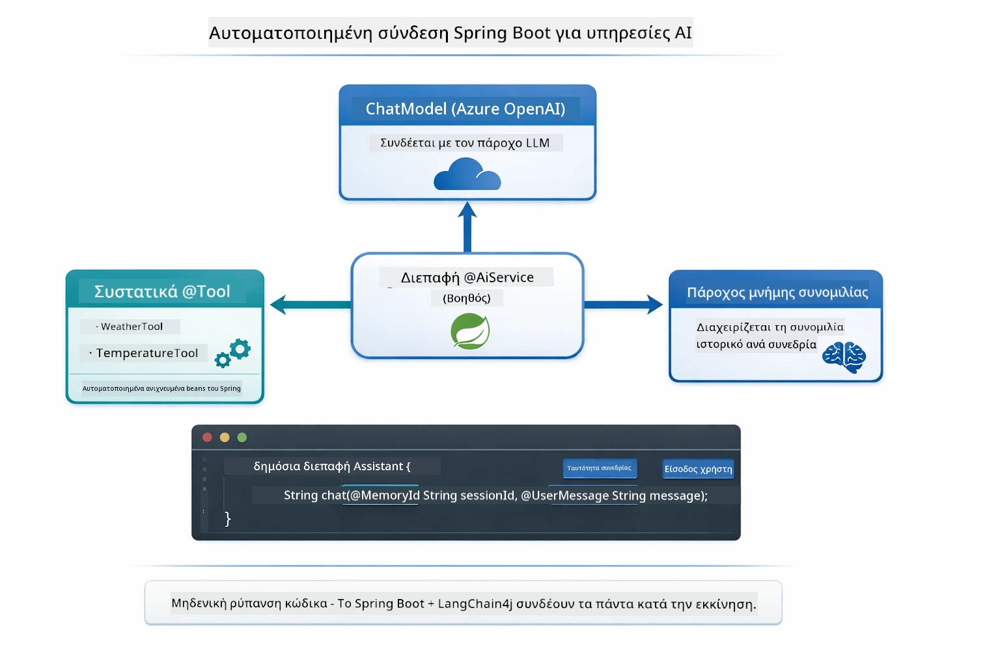

*Το interface @AiService συνδέει το ChatModel, τα εργαλεία και τον πάροχο μνήμης — το Spring Boot διαχειρίζεται αυτόματα όλες τις συνδέσεις.*

Βασικά πλεονεκτήματα αυτής της προσέγγισης:

- **Αυτόματη σύνδεση Spring Boot** — Αυτόματη ένεση του ChatModel και των εργαλείων
- **Πρότυπο @MemoryId** — Αυτόματη διαχείριση μνήμης βάσει συνεδρίας
- **Μια μοναδική παρουσία** — Ο Assistant δημιουργείται μια φορά και χρησιμοποιείται ξανά για καλύτερη απόδοση
- **Τυποασφαλής εκτέλεση** — Κλήσεις μεθόδων Java απευθείας με μετατροπή τύπων
- **Πολυβηματική ορχήστρωση** — Διαχειρίζεται αυτόματα την αλυσίδωση εργαλείων
- **Μηδενικό boilerplate** — Χωρίς χειροκίνητες κλήσεις `AiServices.builder()` ή μνήμη HashMap

Εναλλακτικές προσεγγίσεις (χειροκίνητο `AiServices.builder()`) απαιτούν περισσότερο κώδικα και στερούνται τα πλεονεκτήματα του Spring Boot.

## Αλυσίδωση Εργαλείων

**Αλυσίδωση Εργαλείων** — Η πραγματική δύναμη των πρακτόρων με βάση τα εργαλεία φαίνεται όταν μια μόνο ερώτηση απαιτεί πολλαπλά εργαλεία. Ρωτήστε «Ποιος είναι ο καιρός στο Σιάτλ σε Φαρενάιτ;» και ο πράκτορας αλυσιδώνει αυτόματα δύο εργαλεία: πρώτα καλεί το `getCurrentWeather` για να πάρει τη θερμοκρασία σε Κελσίου, μετά στέλνει αυτήν την τιμή στο `celsiusToFahrenheit` για μετατροπή — όλα σε μία μόνο στροφή συνομιλίας.

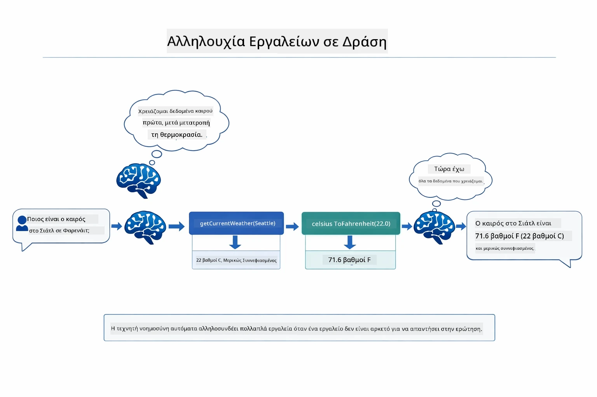

*Η αλυσίδωση εργαλείων σε δράση — ο πράκτορας καλεί πρώτα το getCurrentWeather, μετά περνά το αποτέλεσμα σε Κελσίου στο celsiusToFahrenheit, και δίνει μια συνδυασμένη απάντηση.*

**Ομαλές Αποτυχίες** — Ζητήστε τον καιρό σε μια πόλη που δεν υπάρχει στα ψεύτικα δεδομένα. Το εργαλείο επιστρέφει μήνυμα σφάλματος και η ΤΝ εξηγεί ότι δεν μπορεί να βοηθήσει αντί να καταρρεύσει. Τα εργαλεία αποτυγχάνουν με ασφάλεια. Το διάγραμμα παρακάτω αντιπαραβάλλει τις δύο προσεγγίσεις — με σωστό χειρισμό σφαλμάτων, ο πράκτορας πιάνει την εξαίρεση και απαντά με βοηθητική εξήγηση, ενώ χωρίς αυτό η εφαρμογή καταρρέει ολοκληρωτικά:

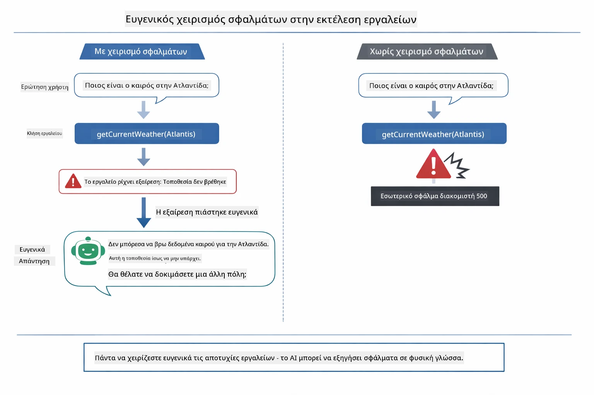

*Όταν ένα εργαλείο αποτυγχάνει, ο πράκτορας πιάνει το σφάλμα και απαντά με χρήσιμη εξήγηση αντί να προκαλέσει κατάρρευση.*

Αυτό γίνεται σε μία στροφή συνομιλίας. Ο πράκτορας ορχηστρώνει πολλαπλές κλήσεις εργαλείων αυτόνομα.

## Εκτέλεση της Εφαρμογής

**Επαλήθευση ανάπτυξης:**

Βεβαιωθείτε ότι το αρχείο `.env` υπάρχει στον ριζικό κατάλογο με διαπιστευτήρια Azure (δημιουργήθηκε κατά το Module 01). Εκτελέστε αυτήν την εντολή από το φάκελο του module (`04-tools/`):

**Bash:**
```bash
cat ../.env  # Θα πρέπει να εμφανίζει AZURE_OPENAI_ENDPOINT, API_KEY, DEPLOYMENT
```

**PowerShell:**
```powershell
Get-Content ..\.env  # Θα πρέπει να εμφανίζει AZURE_OPENAI_ENDPOINT, API_KEY, DEPLOYMENT
```

**Εκκίνηση της εφαρμογής:**

> **Σημείωση:** Αν έχετε ήδη ξεκινήσει όλες τις εφαρμογές χρησιμοποιώντας το `./start-all.sh` από τον ριζικό κατάλογο (όπως περιγράφεται στο Module 01), τότε αυτό το module ήδη τρέχει στην θύρα 8084. Μπορείτε να παραλείψετε τις παρακάτω εντολές εκκίνησης και να μεταβείτε απευθείας στο http://localhost:8084.

**Επιλογή 1: Χρήση Spring Boot Dashboard (Συνιστάται για χρήστες VS Code)**

Το container ανάπτυξης περιλαμβάνει την επέκταση Spring Boot Dashboard, που παρέχει οπτικό περιβάλλον διαχείρισης για όλες τις εφαρμογές Spring Boot. Την βρίσκετε στη μπάρα εργασιών στα αριστερά του VS Code (αναζητήστε το εικονίδιο Spring Boot).

Από το Spring Boot Dashboard μπορείτε:
- Να δείτε όλες τις διαθέσιμες εφαρμογές Spring Boot στον χώρο εργασίας
- Να ξεκινήσετε/σταματήσετε εφαρμογές με ένα κλικ
- Να δείτε logs εφαρμογών σε πραγματικό χρόνο
- Να παρακολουθήσετε την κατάσταση της εφαρμογής

Απλά κάντε κλικ στο κουμπί έναρξης δίπλα στο "tools" για να ξεκινήσετε αυτό το module, ή ξεκινήστε όλα τα modules μαζί.

Έτσι φαίνεται το Spring Boot Dashboard στο VS Code:


*Το Spring Boot Dashboard στο VS Code — ξεκινήστε, σταματήστε και παρακολουθήστε όλα τα modules από ένα σημείο*

**Επιλογή 2: Χρήση shell scripts**

Ξεκινήστε όλες τις web εφαρμογές (modules 01-04):

**Bash:**
```bash
cd ..  # Από τον ριζικό κατάλογο
./start-all.sh
```

**PowerShell:**
```powershell
cd ..  # Από τον ριζικό κατάλογο
.\start-all.ps1
```

Ή ξεκινήστε μόνο αυτό το module:

**Bash:**
```bash
cd 04-tools
./start.sh
```

**PowerShell:**
```powershell
cd 04-tools
.\start.ps1
```

Και τα δύο scripts φορτώνουν αυτόματα τις μεταβλητές περιβάλλοντος από το ριζικό αρχείο `.env` και θα χτίσουν τα JAR αν δεν υπάρχουν ήδη.

> **Σημείωση:** Αν προτιμάτε να χτίσετε όλα τα modules χειροκίνητα πριν την εκκίνηση:
>
> **Bash:**
> ```bash
> cd ..  # Go to root directory
> mvn clean package -DskipTests
> ```

> **PowerShell:**
> ```powershell
> cd ..  # Go to root directory
> mvn clean package -DskipTests
> ```

Ανοίξτε το http://localhost:8084 στο πρόγραμμα περιήγησής σας.

**Για να σταματήσετε:**

**Bash:**
```bash
./stop.sh  # Μόνο αυτό το μονάδα
# Ή
cd .. && ./stop-all.sh  # Όλες οι μονάδες
```

**PowerShell:**
```powershell
.\stop.ps1  # Μόνο αυτό το module
# Ή
cd ..; .\stop-all.ps1  # Όλα τα modules
```

## Χρήση της Εφαρμογής

Η εφαρμογή παρέχει ένα web περιβάλλον όπου μπορείτε να αλληλεπιδράσετε με έναν πράκτορα ΤΝ που έχει πρόσβαση σε εργαλεία καιρού και μετατροπής θερμοκρασίας. Έτσι φαίνεται η διεπαφή — περιλαμβάνει παραδείγματα γρήγορης εκκίνησης και πλαίσιο συνομιλίας για αποστολή αιτημάτων:
<a href="images/tools-homepage.png"></a>

*Η διεπαφή Εργαλείων AI Agent - γρήγορα παραδείγματα και διεπαφή συνομιλίας για αλληλεπίδραση με εργαλεία*

### Δοκιμάστε Απλή Χρήση Εργαλείων

Ξεκινήστε με ένα απλό αίτημα: "Μετατρέψτε 100 βαθμούς Φαρενάιτ σε Κελσίου". Ο πράκτορας αναγνωρίζει ότι χρειάζεται το εργαλείο μετατροπής θερμοκρασίας, το καλεί με τις σωστές παραμέτρους και επιστρέφει το αποτέλεσμα. Παρατηρήστε πόσο φυσικό είναι αυτό - δεν καθορίσατε ποιο εργαλείο να χρησιμοποιηθεί ή πώς να κληθεί.

### Δοκιμάστε Αλυσιδωτή Χρήση Εργαλείων

Τώρα δοκιμάστε κάτι πιο περίπλοκο: "Ποιος είναι ο καιρός στο Σιάτλ και μετατρέψτε τον σε Φαρενάιτ;" Παρακολουθήστε τον πράκτορα να δουλεύει βήμα-βήμα. Πρώτα λαμβάνει τον καιρό (που επιστρέφει σε Κελσίου), αναγνωρίζει ότι πρέπει να μετατρέψει σε Φαρενάιτ, καλεί το εργαλείο μετατροπής και συνδυάζει τα δύο αποτελέσματα σε μία απάντηση.

### Δείτε τη Ροή της Συνομιλίας

Η διεπαφή συνομιλίας διατηρεί το ιστορικό συνομιλίας, επιτρέποντάς σας να έχετε αλληλεπιδράσεις πολλαπλών γύρων. Μπορείτε να δείτε όλες τις προηγούμενες ερωτήσεις και απαντήσεις, καθιστώντας εύκολη την παρακολούθηση της συνομιλίας και την κατανόηση του πώς ο πράκτορας δημιουργεί το πλαίσιο μέσα από πολλές ανταλλαγές.

<a href="images/tools-conversation-demo.png"></a>

*Συνομιλία πολλαπλών γύρων που δείχνει απλές μετατροπές, αναζητήσεις καιρού και αλυσιδωτή χρήση εργαλείων*

### Πειραματιστείτε με Διάφορα Αιτήματα

Δοκιμάστε διάφορους συνδυασμούς:
- Αναζητήσεις καιρού: "Ποιος είναι ο καιρός στο Τόκιο;"
- Μετατροπές θερμοκρασίας: "Τι είναι 25°C σε Κέλβιν;"
- Συνδυασμένα ερωτήματα: "Ελέγξτε τον καιρό στο Παρίσι και πείτε μου αν είναι πάνω από 20°C"

Παρατηρήστε πώς ο πράκτορας ερμηνεύει τη φυσική γλώσσα και τη μετατρέπει σε κατάλληλες κλήσεις εργαλείων.

## Κύριες Έννοιες

### Πρότυπο ReAct (Λογική και Δράση)

Ο πράκτορας εναλλάσσει μεταξύ λογικής (αποφασίζοντας τι να κάνει) και δράσης (χρησιμοποιώντας εργαλεία). Αυτό το πρότυπο επιτρέπει την αυτόνομη επίλυση προβλημάτων αντί απλά να ανταποκρίνεται σε εντολές.

### Οι Περιγραφές Εργαλείων Μετρούν

Η ποιότητα των περιγραφών των εργαλείων επηρεάζει άμεσα το πόσο καλά τα χρησιμοποιεί ο πράκτορας. Καθαρές, συγκεκριμένες περιγραφές βοηθούν το μοντέλο να καταλάβει πότε και πώς να καλέσει κάθε εργαλείο.

### Διαχείριση Συνεδρίας

Η επισήμανση `@MemoryId` επιτρέπει την αυτόματη διαχείριση μνήμης βάσει συνεδρίας. Κάθε αναγνωριστικό συνεδρίας αποκτά τη δική του `ChatMemory` που διαχειρίζεται το bean `ChatMemoryProvider`, επιτρέποντας σε πολλούς χρήστες να αλληλεπιδρούν με τον πράκτορα ταυτόχρονα χωρίς να αναμειγνύονται οι συνομιλίες τους. Το παρακάτω διάγραμμα δείχνει πώς πολλοί χρήστες κατευθύνονται σε απομονωμένες αποθήκες μνήμης ανάλογα με το αναγνωριστικό συνεδρίας τους:

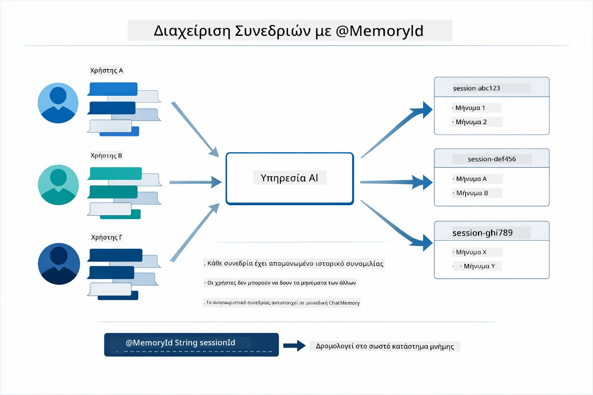

*Κάθε αναγνωριστικό συνεδρίας αντιστοιχεί σε απομονωμένο ιστορικό συνομιλίας — οι χρήστες δεν βλέπουν ποτέ τα μηνύματα ο ένας του άλλου.*

### Διαχείριση Σφαλμάτων

Τα εργαλεία μπορεί να αποτύχουν — οι API μπορεί να έχουν εμπλοκή χρόνου, οι παράμετροι να είναι άκυροι, οι εξωτερικές υπηρεσίες να πέφτουν. Οι παραγωγικοί πράκτορες χρειάζονται διαχείριση σφαλμάτων ώστε το μοντέλο να μπορεί να εξηγεί τα προβλήματα ή να δοκιμάζει εναλλακτικές αντί να καταρρέει ολόκληρη η εφαρμογή. Όταν ένα εργαλείο προκαλεί εξαίρεση, το LangChain4j το αναλαμβάνει και επιστρέφει το μήνυμα λάθους στο μοντέλο, το οποίο μπορεί μετά να εξηγήσει το πρόβλημα σε φυσική γλώσσα.

## Διαθέσιμα Εργαλεία

Το παρακάτω διάγραμμα δείχνει το ευρύ οικοσύστημα εργαλείων που μπορείτε να δημιουργήσετε. Αυτό το module παρουσιάζει εργαλεία καιρού και θερμοκρασίας, αλλά το ίδιο πρότυπο `@Tool` δουλεύει για οποιαδήποτε μέθοδο Java — από ερωτήματα βάσεων δεδομένων μέχρι διαχείριση πληρωμών.

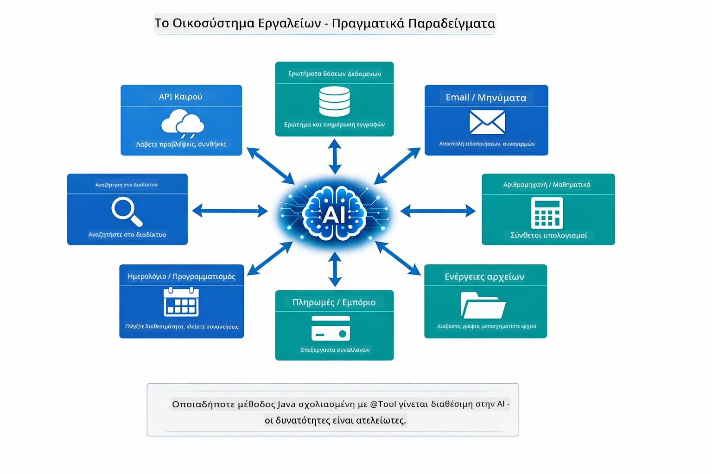

*Οποιαδήποτε μέθοδος Java επισημασμένη με @Tool γίνεται διαθέσιμη στην AI — το πρότυπο εφαρμόζεται σε βάσεις δεδομένων, APIs, email, λειτουργίες αρχείων και άλλα.*

## Πότε να Χρησιμοποιείτε Πράκτορες με Εργαλεία

Δεν χρειάζονται πάντα εργαλεία για κάθε αίτημα. Η απόφαση βασίζεται στο αν η AI χρειάζεται να αλληλεπιδράσει με εξωτερικά συστήματα ή μπορεί να απαντήσει από τη δική της γνώση. Ο παρακάτω οδηγός συνοψίζει πότε τα εργαλεία προσθέτουν αξία και πότε είναι περιττά:

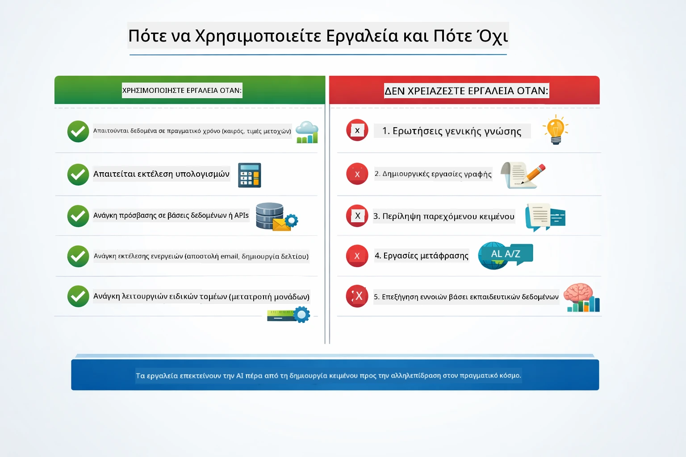

*Ένας γρήγορος οδηγός απόφασης — τα εργαλεία είναι για δεδομένα σε πραγματικό χρόνο, υπολογισμούς και ενέργειες· οι γενικές γνώσεις και οι δημιουργικές εργασίες δεν τα χρειάζονται.*

## Εργαλεία έναντι RAG

Τα modules 03 και 04 διευρύνουν τις δυνατότητες της AI με θεμελιωδώς διαφορετικούς τρόπους. Το RAG δίνει στο μοντέλο πρόσβαση σε **γνώσεις** ανακτώντας έγγραφα. Τα Εργαλεία δίνουν στο μοντέλο τη δυνατότητα να αναλαμβάνει **ενέργειες** καλώντας λειτουργίες. Το παρακάτω διάγραμμα συγκρίνει αυτές τις δύο προσεγγίσεις δίπλα-δίπλα — από το πώς λειτουργεί κάθε ροή εργασίας μέχρι τα πλεονεκτήματα και μειονεκτήματά τους:

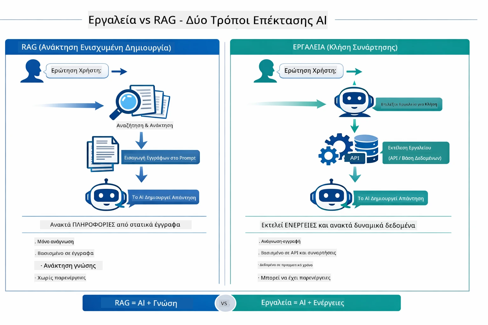

*Το RAG ανακτά πληροφορίες από στατικά έγγραφα — τα Εργαλεία εκτελούν ενέργειες και παίρνουν δυναμικά, σε πραγματικό χρόνο δεδομένα. Πολλά παραγωγικά συστήματα συνδυάζουν και τα δύο.*

Στην πράξη, πολλά παραγωγικά συστήματα συνδυάζουν και τις δύο προσεγγίσεις: το RAG για να βασίζονται οι απαντήσεις στην τεκμηρίωσή σας και τα Εργαλεία για την άντληση ζωντανών δεδομένων ή την εκτέλεση λειτουργιών.

## Επόμενα Βήματα

**Επόμενο Module:** [05-mcp - Πρωτόκολλο Πλαισίου Μοντέλου (MCP)](../05-mcp/README.md)

---

**Πλοήγηση:** [← Προηγούμενο: Module 03 - RAG](../03-rag/README.md) | [Πίσω στην Κύρια Σελίδα](../README.md) | [Επόμενο: Module 05 - MCP →](../05-mcp/README.md)

---

<!-- CO-OP TRANSLATOR DISCLAIMER START -->
**Αποποίηση ευθυνών**:  
Αυτό το έγγραφο έχει μεταφραστεί χρησιμοποιώντας την υπηρεσία αυτόματης μετάφρασης AI [Co-op Translator](https://github.com/Azure/co-op-translator). Παρόλο που προσπαθούμε για ακρίβεια, παρακαλούμε να γνωρίζετε ότι οι αυτόματες μεταφράσεις ενδέχεται να περιέχουν λάθη ή ανακρίβειες. Το πρωτότυπο έγγραφο στη μητρική του γλώσσα πρέπει να θεωρείται η αυθεντική πηγή. Για κρίσιμες πληροφορίες, συνιστάται επαγγελματική μετάφραση από άνθρωπο. Δεν φέρουμε ευθύνη για τυχόν παρεξηγήσεις ή λανθασμένες ερμηνείες που προκύπτουν από τη χρήση αυτής της μετάφρασης.
<!-- CO-OP TRANSLATOR DISCLAIMER END -->