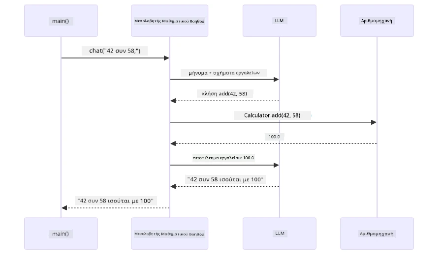
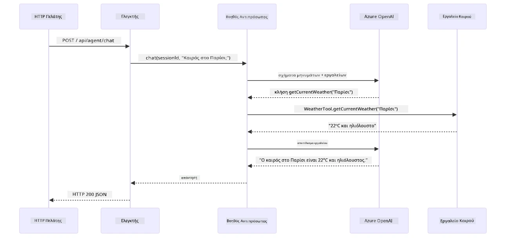

# Module 04: Πράκτορες AI με Εργαλεία

## Περιεχόμενα

- [Τι θα μάθετε](../../../04-tools)
- [Προαπαιτούμενα](../../../04-tools)
- [Κατανόηση των Πρακτόρων AI με Εργαλεία](../../../04-tools)
- [Πώς λειτουργεί η Κλήση Εργαλείων](../../../04-tools)
  - [Ορισμοί Εργαλείων](../../../04-tools)
  - [Λήψη Αποφάσεων](../../../04-tools)
  - [Εκτέλεση](../../../04-tools)
  - [Δημιουργία Απάντησης](../../../04-tools)
  - [Αρχιτεκτονική: Αυτόματη Σύνδεση Spring Boot](../../../04-tools)
- [Αλυσιδωτή Χρήση Εργαλείων](../../../04-tools)
- [Εκτέλεση της Εφαρμογής](../../../04-tools)
- [Χρήση της Εφαρμογής](../../../04-tools)
  - [Δοκιμή Απλής Χρήσης Εργαλείου](../../../04-tools)
  - [Δοκιμή Αλυσιδωτής Χρήσης Εργαλείων](../../../04-tools)
  - [Προβολή Ροής Συζήτησης](../../../04-tools)
  - [Πειραματισμός με Διάφορα Αιτήματα](../../../04-tools)
- [Βασικές Έννοιες](../../../04-tools)
  - [Πρότυπο ReAct (Σκέψη και Δράση)](../../../04-tools)
  - [Σημασία Περιγραφών Εργαλείων](../../../04-tools)
  - [Διαχείριση Συνεδριών](../../../04-tools)
  - [Διαχείριση Σφαλμάτων](../../../04-tools)
- [Διαθέσιμα Εργαλεία](../../../04-tools)
- [Πότε να Χρησιμοποιείτε Πράκτορες με Εργαλεία](../../../04-tools)
- [Εργαλεία vs RAG](../../../04-tools)
- [Επόμενα Βήματα](../../../04-tools)

## Τι θα μάθετε

Μέχρι στιγμής, έχετε μάθει πώς να έχετε συνομιλίες με AI, να δομείτε κατάλληλα τα prompts, και να εδραιώνετε απαντήσεις στα έγγραφά σας. Αλλά υπάρχει ακόμα ένας θεμελιώδης περιορισμός: τα γλωσσικά μοντέλα μπορούν μόνο να παράγουν κείμενο. Δεν μπορούν να ελέγξουν τον καιρό, να κάνουν υπολογισμούς, να ερωτήσουν βάσεις δεδομένων ή να αλληλεπιδράσουν με εξωτερικά συστήματα.

Τα εργαλεία αλλάζουν αυτό. Δίνοντας στο μοντέλο πρόσβαση σε λειτουργίες που μπορεί να καλέσει, το μετατρέπετε από γεννήτρια κειμένου σε πράκτορα που μπορεί να αναλαμβάνει δράσεις. Το μοντέλο αποφασίζει πότε χρειάζεται ένα εργαλείο, ποιο εργαλείο να χρησιμοποιήσει, και ποια παραμέτρους να περάσει. Ο κώδικάς σας εκτελεί τη λειτουργία και επιστρέφει το αποτέλεσμα. Το μοντέλο ενσωματώνει αυτό το αποτέλεσμα στην απάντησή του.

## Προαπαιτούμενα

- Ολοκληρωμένο το [Module 01 - Εισαγωγή](../01-introduction/README.md) (αρχεία Azure OpenAI αναπτυγμένα)
- Προτεινόμενη ολοκλήρωση προηγούμενων modules (αυτό το module αναφέρεται σε [έννοιες RAG από το Module 03](../03-rag/README.md) στη σύγκριση Εργαλείων έναντι RAG)
- Αρχείο `.env` στον ριζικό φάκελο με στοιχεία Azure (δημιουργήθηκε από το `azd up` στο Module 01)

> **Σημείωση:** Αν δεν έχετε ολοκληρώσει το Module 01, ακολουθήστε πρώτα τις οδηγίες ανάπτυξης εκεί.

## Κατανόηση των Πρακτόρων AI με Εργαλεία

> **📝 Σημείωση:** Ο όρος "πράκτορες" σε αυτό το module αναφέρεται σε βοηθούς AI ενισχυμένους με δυνατότητες κλήσης εργαλείων. Αυτό διαφέρει από τα πρότυπα **Agentic AI** (αυτόνομοι πράκτορες με σχεδιασμό, μνήμη και πολυσταδιακή λογική) που θα καλύψουμε στο [Module 05: MCP](../05-mcp/README.md).

Χωρίς εργαλεία, ένα γλωσσικό μοντέλο μπορεί μόνο να παράγει κείμενο από τα εκπαιδευτικά του δεδομένα. Ζητήστε του τον τρέχοντα καιρό, και πρέπει να μαντέψει. Δώστε του εργαλεία, και μπορεί να καλέσει έναν καιρικό API, να κάνει υπολογισμούς, ή να ερωτήσει μια βάση δεδομένων — και μετά να ενσωματώσει αυτά τα πραγματικά αποτελέσματα στην απάντησή του.


*Χωρίς εργαλεία το μοντέλο απλώς μαντεύει — με εργαλεία μπορεί να καλέσει APIs, να εκτελέσει υπολογισμούς και να επιστρέψει δεδομένα σε πραγματικό χρόνο.*

Ένας πράκτορας AI με εργαλεία ακολουθεί το πρότυπο **Σκέψης και Δράσης (ReAct)**. Το μοντέλο δεν απαντά απλώς — σκέφτεται τι χρειάζεται, ενεργεί καλώντας ένα εργαλείο, παρατηρεί το αποτέλεσμα, και μετά αποφασίζει αν θα δράσει ξανά ή θα δώσει την τελική απάντηση:

1. **Σκέψη** — Ο πράκτορας αναλύει την ερώτηση του χρήστη και καθορίζει ποιες πληροφορίες χρειάζεται
2. **Δράση** — Ο πράκτορας επιλέγει το σωστό εργαλείο, δημιουργεί τις σωστές παραμέτρους, και το καλεί
3. **Παρατήρηση** — Ο πράκτορας λαμβάνει το αποτέλεσμα του εργαλείου και το αξιολογεί
4. **Επανάληψη ή Απάντηση** — Αν χρειάζονται περισσότερα δεδομένα, ο πράκτορας επανέρχεται· αλλιώς, συνθέτει μια φυσική απάντηση


*Ο κύκλος ReAct — ο πράκτορας σκεφτεί τι θα κάνει, ενεργεί καλώντας ένα εργαλείο, παρατηρεί το αποτέλεσμα, και επαναλαμβάνει μέχρι να δώσει την τελική απάντηση.*

Αυτό συμβαίνει αυτόματα. Ορίζετε τα εργαλεία και τις περιγραφές τους. Το μοντέλο αναλαμβάνει τη λήψη αποφάσεων για το πότε και πώς να τα χρησιμοποιεί.

## Πώς λειτουργεί η Κλήση Εργαλείων

### Ορισμοί Εργαλείων

[WeatherTool.java](../../../04-tools/src/main/java/com/example/langchain4j/agents/tools/WeatherTool.java) | [TemperatureTool.java](../../../04-tools/src/main/java/com/example/langchain4j/agents/tools/TemperatureTool.java)

Ορίζετε λειτουργίες με σαφείς περιγραφές και προδιαγραφές παραμέτρων. Το μοντέλο βλέπει αυτές τις περιγραφές στο σύστημα prompt και κατανοεί τι κάνει κάθε εργαλείο.

```java
@Component
public class WeatherTool {
    
    @Tool("Get the current weather for a location")
    public String getCurrentWeather(@P("Location name") String location) {
        // Η λογική αναζήτησης καιρού σας
        return "Weather in " + location + ": 22°C, cloudy";
    }
}

@AiService
public interface Assistant {
    String chat(@MemoryId String sessionId, @UserMessage String message);
}

// Ο βοηθός συνδέεται αυτόματα από το Spring Boot με:
// - το bean ChatModel
// - Όλες τις μεθόδους @Tool από τις κλάσεις @Component
// - ChatMemoryProvider για τη διαχείριση συνεδριών
```

Το διάγραμμα παρακάτω αναλύει κάθε σχολιασμό και δείχνει πώς κάθε κομμάτι βοηθά το AI να καταλάβει πότε να καλέσει το εργαλείο και ποια επιχειρήματα να περάσει:


*Ανατομία ορισμού εργαλείου — το @Tool λέει στο AI πότε να το χρησιμοποιήσει, το @P περιγράφει κάθε παράμετρο, και το @AiService συνδέει τα πάντα κατά την εκκίνηση.*

> **🤖 Δοκιμάστε με το [GitHub Copilot](https://github.com/features/copilot) Chat:** Ανοίξτε το [`WeatherTool.java`](../../../04-tools/src/main/java/com/example/langchain4j/agents/tools/WeatherTool.java) και ρωτήστε:
> - "Πώς θα ενσωματώσω έναν πραγματικό κανονιστικό καιροσ API όπως το OpenWeatherMap αντί για mock δεδομένα;"
> - "Τι κάνει μια καλή περιγραφή εργαλείου που βοηθά το AI να το χρησιμοποιήσει σωστά;"
> - "Πώς διαχειρίζομαι σφάλματα API και περιορισμούς ρυθμού στα εργαλεία;"

### Λήψη Αποφάσεων

Όταν ένας χρήστης ρωτά "Ποιος είναι ο καιρός στο Σιάτλ;", το μοντέλο δεν επιλέγει τυχαία ένα εργαλείο. Συγκρίνει την πρόθεση του χρήστη με κάθε περιγραφή εργαλείου στο οποίο έχει πρόσβαση, βαθμολογεί την καταλληλότητα, και επιλέγει την καλύτερη επιλογή. Μετά δημιουργεί μια δομημένη κλήση λειτουργίας με τις σωστές παραμέτρους — σε αυτή την περίπτωση, ορίζει το `location` σε `"Seattle"`.

Αν κανένα εργαλείο δεν ταιριάζει στο αίτημα του χρήστη, το μοντέλο απαντά με βάση τη δική του γνώση. Αν ταιριάζουν πολλά εργαλεία, επιλέγει το πιο συγκεκριμένο.


*Το μοντέλο αξιολογεί κάθε διαθέσιμο εργαλείο με βάση την πρόθεση του χρήστη και επιλέγει το καλύτερο — γι' αυτό έχει σημασία να γράφετε σαφείς, συγκεκριμένες περιγραφές εργαλείων.*

### Εκτέλεση

[AgentService.java](../../../04-tools/src/main/java/com/example/langchain4j/agents/service/AgentService.java)

Το Spring Boot συνδέει αυτόματα τη δηλωτική διεπαφή `@AiService` με όλα τα καταχωρημένα εργαλεία, και το LangChain4j εκτελεί τις κλήσεις εργαλείων αυτόματα. Στο παρασκήνιο, μια πλήρης κλήση εργαλείου περνάει από έξι στάδια — από την ερώτηση με φυσική γλώσσα του χρήστη ως την απάντηση με φυσική γλώσσα:


*Η πλήρης ροή — ο χρήστης κάνει μια ερώτηση, το μοντέλο επιλέγει ένα εργαλείο, το LangChain4j το εκτελεί, και το μοντέλο υφαίνει το αποτέλεσμα σε μια φυσική απάντηση.*

Αν έχετε τρέξει το [ToolIntegrationDemo](../../../00-quick-start/src/main/java/com/example/langchain4j/quickstart/ToolIntegrationDemo.java) στο Module 00, έχετε ήδη δει αυτό το πρότυπο σε δράση — τα εργαλεία `Calculator` καλούνταν με τον ίδιο τρόπο. Το παρακάτω διαγραμματικό σχήμα δείχνει ακριβώς τι συνέβη στο παρασκήνιο κατά τη διάρκεια εκείνης της επίδειξης:



*Ο βρόχος κλήσης εργαλείων από τη demo Γρήγορου Ξεκινήματος — τα `AiServices` στέλνουν το μήνυμά σας και τα σχήματα εργαλείων στο LLM, το LLM απαντά με κλήση λειτουργίας όπως `add(42, 58)`, το LangChain4j εκτελεί τη μέθοδο `Calculator` τοπικά, και επιστρέφει το αποτέλεσμα για την τελική απάντηση.*

> **🤖 Δοκιμάστε με το [GitHub Copilot](https://github.com/features/copilot) Chat:** Ανοίξτε το [`AgentService.java`](../../../04-tools/src/main/java/com/example/langchain4j/agents/service/AgentService.java) και ρωτήστε:
> - "Πώς λειτουργεί το πρότυπο ReAct και γιατί είναι αποτελεσματικό για πράκτορες AI;"
> - "Πώς αποφασίζει ο πράκτορας ποιο εργαλείο να χρησιμοποιήσει και με ποια σειρά;"
> - "Τι συμβαίνει αν αποτύχει η εκτέλεση ενός εργαλείου - πώς να διαχειριστώ τα σφάλματα με αξιοπιστία;"

### Δημιουργία Απάντησης

Το μοντέλο λαμβάνει τα δεδομένα καιρού και τα μορφοποιεί σε μια απάντηση με φυσική γλώσσα για τον χρήστη.

### Αρχιτεκτονική: Αυτόματη Σύνδεση Spring Boot

Αυτό το module χρησιμοποιεί την ενσωμάτωση LangChain4j με Spring Boot και τις δηλωτικές διεπαφές `@AiService`. Κατά την εκκίνηση, το Spring Boot βρίσκει κάθε `@Component` που περιέχει `@Tool` μεθόδους, το bean `ChatModel`, και τον `ChatMemoryProvider` — και τα συνδέει όλα σε μια ενιαία διεπαφή `Assistant` χωρίς επιπλέον ρυθμίσεις.


*Η διεπαφή @AiService συνδέει το ChatModel, τα components των εργαλείων και τον provider μνήμης — το Spring Boot χειρίζεται όλη τη σύνδεση αυτόματα.*

Ακολουθεί η πλήρης ροή ζωής του αιτήματος ως διάγραμμα αλληλουχίας — από το HTTP αίτημα μέσω του controller, service, και του αυτόματου proxy, ως την εκτέλεση του εργαλείου και πίσω:



*Η ολοκληρωμένη ροή ζωής αιτήματος Spring Boot — το HTTP αίτημα περνά μέσω controller και service στον αυτόματο proxy Assistant, που συντονίζει το LLM και τις κλήσεις εργαλείων αυτόματα.*

Κύρια οφέλη αυτής της προσέγγισης:

- **Αυτόματη σύνδεση Spring Boot** — ChatModel και εργαλεία εισάγονται αυτόματα
- **Πρότυπο @MemoryId** — Αυτόματη διαχείριση μνήμης βάσει συνεδρίας
- **Μία και μοναδική παρουσία** — Ο Assistant δημιουργείται μία φορά και επαναχρησιμοποιείται για καλύτερη απόδοση
- **Εκτέλεση με τύπους ασφαλείς** — Κλήση Java μεθόδων απευθείας με μετατροπή τύπων
- **Πολυσταδιακή ορχήστρωση** — Χειρίζεται την αλυσιδωτή χρήση εργαλείων αυτόματα
- **Χωρίς επιπλέον ρυθμίσεις** — Δεν χρειάζονται χειροκίνητες κλήσεις `AiServices.builder()` ή HashMap μνήμης

Εναλλακτικές προσεγγίσεις (χειροκίνητο `AiServices.builder()`) απαιτούν περισσότερο κώδικα και χάνουν τα οφέλη ενσωμάτωσης Spring Boot.

## Αλυσιδωτή Χρήση Εργαλείων

**Αλυσιδωτή Χρήση Εργαλείων** — Η πραγματική δύναμη των πρακτόρων με εργαλεία φαίνεται όταν μια μόνο ερώτηση απαιτεί πολλαπλά εργαλεία. Ρωτήστε "Ποιος είναι ο καιρός στο Σιάτλ σε Φαρενάιτ;" και ο πράκτορας αυτόματα αλυσιδώνει δύο εργαλεία: πρώτα καλεί το `getCurrentWeather` για να πάρει τη θερμοκρασία σε Κελσίου, κατόπιν περνά αυτή την τιμή στο `celsiusToFahrenheit` για τη μετατροπή — όλα σε μια μόνο στροφή συνομιλίας.


*Αλυσιδωτή χρήση εργαλείων σε δράση — ο πράκτορας καλεί πρώτα το getCurrentWeather, μετά στέλνει το αποτέλεσμα σε Κελσίου στο celsiusToFahrenheit, και δίνει συνδυασμένη απάντηση.*

**Ομαλές Αποτυχίες** — Ζητήστε καιρό σε πόλη που δεν υπάρχει στα mock δεδομένα. Το εργαλείο επιστρέφει μήνυμα σφάλματος, και το AI εξηγεί ότι δεν μπορεί να βοηθήσει αντί να καταρρεύσει. Τα εργαλεία αποτυγχάνουν με ασφάλεια. Το διάγραμμα παρακάτω συγκρίνει τις δύο προσεγγίσεις — με σωστή διαχείριση σφαλμάτων, ο πράκτορας πιάνει την εξαίρεση και απαντά με χρήσιμη επεξήγηση, ενώ χωρίς αυτήν η εφαρμογή καταρρέει ολικά:


*Όταν ένα εργαλείο αποτυγχάνει, ο πράκτορας πιάνει το σφάλμα και απαντά με χρήσιμη επεξήγηση αντί να καταρρεύσει.*

Αυτό γίνεται σε μία στροφή συνομιλίας. Ο πράκτορας συντονίζει αυτόνομα πολλαπλές κλήσεις εργαλείων.

## Εκτέλεση της Εφαρμογής

**Επαλήθευση ανάπτυξης:**

Βεβαιωθείτε ότι το αρχείο `.env` υπάρχει στον ριζικό φάκελο με τα στοιχεία Azure (δημιουργήθηκε κατά το Module 01). Τρέξτε αυτήν την εντολή από τον φάκελο module (`04-tools/`):

**Bash:**
```bash
cat ../.env  # Θα πρέπει να εμφανίζει τα AZURE_OPENAI_ENDPOINT, API_KEY, DEPLOYMENT
```

**PowerShell:**
```powershell
Get-Content ..\.env  # Πρέπει να εμφανίζει το AZURE_OPENAI_ENDPOINT, το API_KEY, το DEPLOYMENT
```

**Εκκίνηση της εφαρμογής:**

> **Σημείωση:** Αν ήδη έχετε ξεκινήσει όλες τις εφαρμογές με `./start-all.sh` από τον ριζικό φάκελο (όπως περιγράφεται στο Module 01), αυτό το module τρέχει ήδη στη θύρα 8084. Μπορείτε να παραλείψετε τις παρακάτω εντολές εκκίνησης και να μεταβείτε απευθείας στο http://localhost:8084.

**Επιλογή 1: Χρήση του Spring Boot Dashboard (Προτεινόμενο για χρήστες VS Code)**

Το περιβάλλον ανάπτυξης περιλαμβάνει την επέκταση Spring Boot Dashboard, που παρέχει οπτική διεπαφή για διαχείριση όλων των εφαρμογών Spring Boot. Μπορείτε να τη βρείτε στη γραμμή δραστηριοτήτων αριστερά στο VS Code (αναζητήστε το εικονίδιο Spring Boot).

Από το Spring Boot Dashboard μπορείτε:
- Να δείτε όλες τις διαθέσιμες εφαρμογές Spring Boot στο έργο
- Να ξεκινήσετε/σταματήσετε εφαρμογές με ένα κλικ
- Να δείτε τα logs εφαρμογής σε πραγματικό χρόνο
- Να παρακολουθήσετε την κατάσταση της εφαρμογής

Απλώς πατήστε το κουμπί play δίπλα στο "tools" για να ξεκινήσετε αυτό το module, ή ξεκινήστε όλα τα modules μαζί.

Έτσι δείχνει το Spring Boot Dashboard στο VS Code:


*Το Spring Boot Dashboard στο VS Code — ξεκινήστε, σταματήστε, και παρακολουθήστε όλα τα modules από ένα μέρος*

**Επιλογή 2: Χρήση σεναρίων shell**

Ξεκινήστε όλες τις web εφαρμογές (modules 01-04):

**Bash:**
```bash
cd ..  # Από τον κατάλογο ρίζας
./start-all.sh
```

**PowerShell:**
```powershell
cd ..  # Από τον ριζικό κατάλογο
.\start-all.ps1
```

Ή ξεκινήστε μόνο αυτό το module:

**Bash:**
```bash
cd 04-tools
./start.sh
```

**PowerShell:**
```powershell
cd 04-tools
.\start.ps1
```

Και τα δύο script φορτώνουν αυτόματα τις μεταβλητές περιβάλλοντος από το αρχικό αρχείο `.env` και θα δημιουργήσουν τα JARs αν δεν υπάρχουν.

> **Σημείωση:** Αν προτιμάτε να δημιουργήσετε όλα τα modules χειροκίνητα πριν ξεκινήσετε:
>
> **Bash:**
> ```bash
> cd ..  # Go to root directory
> mvn clean package -DskipTests
> ```
>
> **PowerShell:**
> ```powershell
> cd ..  # Go to root directory
> mvn clean package -DskipTests
> ```

Ανοίξτε http://localhost:8084 στο πρόγραμμα περιήγησής σας.

**Για να σταματήσετε:**

**Bash:**
```bash
./stop.sh  # Μόνο αυτό το module
# Ή
cd .. && ./stop-all.sh  # Όλα τα modules
```

**PowerShell:**
```powershell
.\stop.ps1  # Μόνο αυτό το μοντέλο
# Ή
cd ..; .\stop-all.ps1  # Όλα τα μοντέλα
```

## Χρήση της Εφαρμογής

Η εφαρμογή παρέχει μια διαδικτυακή διεπαφή όπου μπορείτε να αλληλεπιδράσετε με έναν πράκτορα AI που έχει πρόσβαση σε εργαλεία καιρού και μετατροπής θερμοκρασίας. Να πώς φαίνεται η διεπαφή — περιλαμβάνει παραδείγματα γρήγορης εκκίνησης και πάνελ συνομιλίας για αποστολή αιτημάτων:

<a href="images/tools-homepage.png"></a>

*Η διεπαφή εργαλείων πράκτορα AI - γρήγορα παραδείγματα και διεπαφή συνομιλίας για αλληλεπίδραση με εργαλεία*

### Δοκιμάστε Απλή Χρήση Εργαλείου

Ξεκινήστε με ένα απλό αίτημα: "Μετατρέψτε 100 βαθμούς Φαρενάιτ σε Κελσίου". Ο πράκτορας αναγνωρίζει ότι χρειάζεται το εργαλείο μετατροπής θερμοκρασίας, το καλεί με τις σωστές παραμέτρους και επιστρέφει το αποτέλεσμα. Παρατηρήστε πόσο φυσικό είναι αυτό - δεν ορίσατε ποιο εργαλείο να χρησιμοποιήσει ή πώς να το καλέσει.

### Δοκιμάστε Σειρά Εργαλείων

Τώρα δοκιμάστε κάτι πιο πολύπλοκο: "Ποιος είναι ο καιρός στο Σιάτλ και μετατρέψτε το σε Φαρενάιτ;" Δείτε τον πράκτορα να δουλεύει βήμα βήμα. Πρώτα παίρνει τον καιρό (που επιστρέφει σε Κελσίου), αναγνωρίζει ότι πρέπει να το μετατρέψει σε Φαρενάιτ, καλεί το εργαλείο μετατροπής και συνδυάζει τα δύο αποτελέσματα σε μία απάντηση.

### Δείτε τη Ροή της Συνομιλίας

Η διεπαφή συνομιλίας διατηρεί το ιστορικό συνομιλίας, επιτρέποντάς σας να έχετε πολυγωνικές αλληλεπιδράσεις. Μπορείτε να δείτε όλα τα προηγούμενα ερωτήματα και απαντήσεις, διευκολύνοντας την παρακολούθηση της συνομιλίας και την κατανόηση του πώς ο πράκτορας δημιουργεί το πλαίσιο σε πολλαπλές ανταλλαγές.

<a href="images/tools-conversation-demo.png"></a>

*Πολυγωνική συνομιλία που δείχνει απλές μετατροπές, αναζητήσεις καιρού και σύνδεση εργαλείων*

### Πειραματιστείτε με Διάφορα Αιτήματα

Δοκιμάστε διάφορους συνδυασμούς:
- Αναζητήσεις καιρού: "Ποιος είναι ο καιρός στο Τόκιο;"
- Μετατροπές θερμοκρασίας: "Τι είναι 25°C σε Kelvin;"
- Συνδυασμένα ερωτήματα: "Δείτε τον καιρό στο Παρίσι και πείτε μου αν είναι πάνω από 20°C"

Παρατηρήστε πώς ο πράκτορας ερμηνεύει τη φυσική γλώσσα και την αντιστοιχίζει σε κατάλληλες κλήσεις εργαλείων.

## Βασικές Έννοιες

### Πρότυπο ReAct (Λογική και Δράση)

Ο πράκτορας εναλλάσσεται μεταξύ λογικής (απόφαση τι να κάνει) και δράσης (χρήση εργαλείων). Αυτό το πρότυπο επιτρέπει αυτόνομη επίλυση προβλημάτων αντί απλής απόκρισης σε εντολές.

### Σημασία Περιγραφών Εργαλείων

Η ποιότητα των περιγραφών εργαλείων επηρεάζει άμεσα το πόσο καλά τα χρησιμοποιεί ο πράκτορας. Καθαρές, συγκεκριμένες περιγραφές βοηθούν το μοντέλο να καταλάβει πότε και πώς να καλέσει κάθε εργαλείο.

### Διαχείριση Συνεδρίας

Η υποσημείωση `@MemoryId` ενεργοποιεί αυτόματη διαχείριση μνήμης βάσει συνεδρίας. Κάθε ID συνεδρίας παίρνει ένα δικό του `ChatMemory` instance που διαχειρίζεται το bean `ChatMemoryProvider`, έτσι πολλοί χρήστες μπορούν να αλληλεπιδρούν με τον πράκτορα ταυτόχρονα χωρίς να αναμειγνύονται οι συνομιλίες τους. Το παρακάτω διάγραμμα δείχνει πώς πολλοί χρήστες δρομολογούνται σε απομονωμένες αποθήκες μνήμης βάσει των IDs τους:


*Κάθε ID συνεδρίας αντιστοιχεί σε απομονωμένο ιστορικό συνομιλίας — οι χρήστες δεν βλέπουν ποτέ τα μηνύματα άλλων.*

### Διαχείριση Σφαλμάτων

Εργαλεία μπορεί να αποτύχουν — APIs να έχουν χρονικά όρια, παράμετροι να μην είναι έγκυροι, εξωτερικές υπηρεσίες να πέσουν. Οι παραγωγικοί πράκτορες χρειάζονται διαχείριση σφαλμάτων ώστε το μοντέλο να μπορεί να εξηγήσει προβλήματα ή να δοκιμάσει εναλλακτικές αντί να καταρρεύσει ολόκληρη η εφαρμογή. Όταν ένα εργαλείο δημιουργεί εξαίρεση, το LangChain4j το απαλλοτριώνει και τροφοδοτεί το μήνυμα σφάλματος πίσω στο μοντέλο, το οποίο μπορεί να εξηγήσει το πρόβλημα με φυσική γλώσσα.

## Διαθέσιμα Εργαλεία

Το διάγραμμα παρακάτω δείχνει το ευρύ οικοσύστημα εργαλείων που μπορείτε να δημιουργήσετε. Αυτό το module δείχνει εργαλεία καιρού και θερμοκρασίας, αλλά το ίδιο πρότυπο `@Tool` δουλεύει για οποιαδήποτε μέθοδο Java — από ερωτήματα βάσης δεδομένων μέχρι επεξεργασία πληρωμών.


*Οποιαδήποτε μέθοδος Java με την υπόμνηση @Tool γίνεται διαθέσιμη στο AI — το πρότυπο επεκτείνεται σε βάσεις δεδομένων, APIs, email, λειτουργίες αρχείων και άλλα.*

## Πότε να Χρησιμοποιήσετε Πράκτορες με Εργαλεία

Δεν χρειάζονται όλα τα αιτήματα εργαλεία. Η απόφαση εξαρτάται αν το AI χρειάζεται να αλληλεπιδράσει με εξωτερικά συστήματα ή μπορεί να απαντήσει από τις δικές του γνώσεις. Ο παρακάτω οδηγός συνοψίζει πότε τα εργαλεία προσθέτουν αξία και πότε δεν είναι απαραίτητα:


*Γρήγορος οδηγός απόφασης — τα εργαλεία είναι για δεδομένα σε πραγματικό χρόνο, υπολογισμούς και δράσεις· η γενική γνώση και οι δημιουργικές εργασίες δεν τα απαιτούν.*

## Εργαλεία vs RAG

Τα modules 03 και 04 επεκτείνουν ό,τι μπορεί να κάνει το AI, αλλά με θεμελιωδώς διαφορετικούς τρόπους. Το RAG δίνει στο μοντέλο πρόσβαση σε **γνώσεις** αναζητώντας έγγραφα. Τα Εργαλεία δίνουν στο μοντέλο ικανότητα να εκτελεί **δράσεις** καλώντας συναρτήσεις. Το διάγραμμα παρακάτω συγκρίνει αυτές τις δύο προσεγγίσεις παράλληλα — από το πώς λειτουργεί η κάθε ροή εργασίας μέχρι τα πλεονεκτήματα και μειονεκτήματα τους:


*Το RAG ανακτά πληροφορίες από στατικά έγγραφα — τα Εργαλεία εκτελούν δράσεις και φέρνουν δυναμικά, σε πραγματικό χρόνο δεδομένα. Πολλά παραγωγικά συστήματα συνδυάζουν και τα δύο.*

Στην πράξη, πολλά παραγωγικά συστήματα συνδυάζουν τις δύο προσεγγίσεις: RAG για να βασίζουν τις απαντήσεις στην τεκμηρίωση, και Εργαλεία για να φέρνουν ζωντανά δεδομένα ή να εκτελούν λειτουργίες.

## Επόμενα Βήματα

**Επόμενο Module:** [05-mcp - Model Context Protocol (MCP)](../05-mcp/README.md)

---

**Πλοήγηση:** [← Προηγούμενο: Module 03 - RAG](../03-rag/README.md) | [Πίσω στην Αρχική](../README.md) | [Επόμενο: Module 05 - MCP →](../05-mcp/README.md)

---

<!-- CO-OP TRANSLATOR DISCLAIMER START -->
**Αποποίηση ευθυνών**:  
Αυτό το έγγραφο έχει μεταφραστεί χρησιμοποιώντας την υπηρεσία μετάφρασης με τεχνητή νοημοσύνη [Co-op Translator](https://github.com/Azure/co-op-translator). Παρόλο που προσπαθούμε για ακρίβεια, παρακαλούμε να γνωρίζετε ότι οι αυτοματοποιημένες μεταφράσεις ενδέχεται να περιέχουν λάθη ή ανακρίβειες. Το πρωτότυπο έγγραφο στη γλώσσα του πρέπει να θεωρείται η επίσημη πηγή. Για κρίσιμες πληροφορίες, συνιστάται η επαγγελματική ανθρώπινη μετάφραση. Δεν ευθυνόμαστε για τυχόν παρεξηγήσεις ή λανθασμένες ερμηνείες που προκύπτουν από τη χρήση αυτής της μετάφρασης.
<!-- CO-OP TRANSLATOR DISCLAIMER END -->