# Module 05: Πρωτόκολλο Συμφραζομένων Μοντέλου (MCP)

## Πίνακας Περιεχομένων

- [Βίντεο Παρουσίαση](../../../05-mcp)
- [Τι Θα Μάθετε](../../../05-mcp)
- [Τι είναι το MCP;](../../../05-mcp)
- [Πώς Λειτουργεί το MCP](../../../05-mcp)
- [Το Agentic Module](../../../05-mcp)
- [Εκτέλεση των Παραδειγμάτων](../../../05-mcp)
  - [Προαπαιτούμενα](../../../05-mcp)
- [Γρήγορη Εκκίνηση](../../../05-mcp)
  - [Ενέργειες Αρχείων (Stdio)](../../../05-mcp)
  - [Agent Επιβλέπων](../../../05-mcp)
    - [Εκτέλεση της Επίδειξης](../../../05-mcp)
    - [Πώς Λειτουργεί ο Επιβλέπων](../../../05-mcp)
    - [Πώς ο FileAgent Ανακαλύπτει Εργαλεία MCP κατά την Εκτέλεση](../../../05-mcp)
    - [Στρατηγικές Απόκρισης](../../../05-mcp)
    - [Κατανόηση του Αποτελέσματος](../../../05-mcp)
    - [Επεξήγηση Χαρακτηριστικών του Agentic Module](../../../05-mcp)
- [Κύριες Έννοιες](../../../05-mcp)
- [Συγχαρητήρια!](../../../05-mcp)
  - [Τι Ακολουθεί;](../../../05-mcp)

## Βίντεο Παρουσίαση

Παρακολουθήστε αυτήν την ζωντανή συνεδρία που εξηγεί πώς να ξεκινήσετε με αυτό το module:

<a href="https://www.youtube.com/watch?v=O_J30kZc0rw"></a>

## Τι Θα Μάθετε

Έχετε δημιουργήσει διαλογική τεχνητή νοημοσύνη, έχετε κατακτήσει τα prompts, έχετε βασίσει τις απαντήσεις σε έγγραφα και έχετε δημιουργήσει agents με εργαλεία. Αλλά όλα αυτά τα εργαλεία ήταν προσαρμοσμένα στην ειδική εφαρμογή σας. Τι θα γινόταν αν μπορούσατε να δώσετε στην τεχνητή νοημοσύνη σας πρόσβαση σε ένα τυποποιημένο οικοσύστημα εργαλείων που μπορεί ο καθένας να δημιουργήσει και να μοιραστεί; Σε αυτό το module, θα μάθετε πώς να το κάνετε με το Πρωτόκολλο Συμφραζομένων Μοντέλου (MCP) και το agentic module του LangChain4j. Αρχικά παρουσιάζουμε έναν απλό αναγνώστη αρχείων MCP και στη συνέχεια δείχνουμε πώς αυτός ενσωματώνεται εύκολα σε προχωρημένες agentic ροές εργασίας χρησιμοποιώντας το πρότυπο Supervisor Agent.

## Τι είναι το MCP;

Το Πρωτόκολλο Συμφραζομένων Μοντέλου (MCP) παρέχει ακριβώς αυτό - έναν τυποποιημένο τρόπο για εφαρμογές τεχνητής νοημοσύνης να ανακαλύπτουν και να χρησιμοποιούν εξωτερικά εργαλεία. Αντί να γράφετε προσαρμοσμένες ενσωματώσεις για κάθε πηγή δεδομένων ή υπηρεσία, συνδέεστε σε MCP servers που εκθέτουν τις δυνατότητές τους σε συνεπή μορφή. Ο AI agent σας μπορεί τότε να ανακαλύψει και να χρησιμοποιήσει αυτά τα εργαλεία αυτόματα.

Το παρακάτω διάγραμμα δείχνει τη διαφορά — χωρίς MCP, κάθε ενσωμάτωση απαιτεί προσαρμοσμένες συνδέσεις σημείο προς σημείο· με MCP, ένα μόνο πρωτόκολλο συνδέει την εφαρμογή σας με οποιοδήποτε εργαλείο:


*Πριν το MCP: Πολύπλοκες ενσωματώσεις σημείο-προς-σημείο. Μετά το MCP: Ένα πρωτόκολλο, ατελείωτες δυνατότητες.*

Το MCP λύνει ένα θεμελιώδες πρόβλημα στην ανάπτυξη AI: κάθε ενσωμάτωση είναι προσαρμοσμένη. Θέλετε πρόσβαση στο GitHub; Προσαρμοσμένος κώδικας. Θέλετε να διαβάσετε αρχεία; Προσαρμοσμένος κώδικας. Θέλετε να κάνετε ερώτηση σε βάση δεδομένων; Προσαρμοσμένος κώδικας. Και καμία από αυτές τις ενσωματώσεις δεν λειτουργεί με άλλες εφαρμογές AI.

Το MCP τυποποιεί αυτό. Ένας MCP server εκθέτει εργαλεία με σαφείς περιγραφές και δομές παραμέτρων. Κάθε MCP client μπορεί να συνδεθεί, να ανακαλύψει διαθέσιμα εργαλεία και να τα χρησιμοποιήσει. Φτιάχνεις μία φορά, χρησιμοποιείς παντού.

Το παρακάτω διάγραμμα απεικονίζει αυτήν την αρχιτεκτονική — ένας MCP client (η εφαρμογή AI σας) συνδέεται με πολλούς MCP servers, καθένας εκθέτει το δικό του σύνολο εργαλείων μέσω του πρότυπου πρωτοκόλλου:


*Αρχιτεκτονική Πρωτοκόλλου Συμφραζομένων Μοντέλου - τυποποιημένη αναγνώριση και εκτέλεση εργαλείων*

## Πώς Λειτουργεί το MCP

Κάτω από την επιφάνεια, το MCP χρησιμοποιεί μια στρωματοποιημένη αρχιτεκτονική. Η εφαρμογή Java σας (ο MCP client) ανακαλύπτει διαθέσιμα εργαλεία, στέλνει αιτήματα JSON-RPC μέσω ενός επιπέδου μεταφοράς (Stdio ή HTTP), και ο MCP server εκτελεί τις λειτουργίες και επιστρέφει αποτελέσματα. Το παρακάτω διάγραμμα αναλύει κάθε στρώμα αυτού του πρωτοκόλλου:

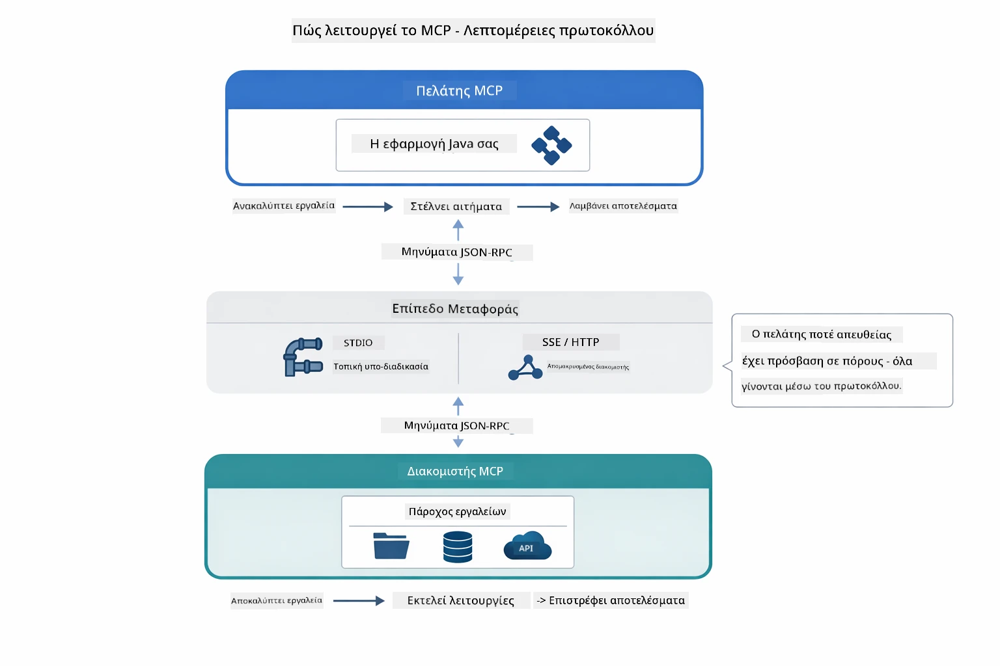

*Πώς λειτουργεί το MCP κάτω από την επιφάνεια — οι clients ανακαλύπτουν εργαλεία, ανταλλάσσουν μηνύματα JSON-RPC και εκτελούν λειτουργίες μέσω επιπέδου μεταφοράς.*

**Αρχιτεκτονική Server-Client**

Το MCP χρησιμοποιεί μοντέλο client-server. Οι servers παρέχουν εργαλεία - ανάγνωση αρχείων, ερωτήματα σε βάσεις, κλήσεις API. Οι clients (η εφαρμογή AI σας) συνδέονται στους servers και χρησιμοποιούν τα εργαλεία τους.

Για να χρησιμοποιήσετε το MCP με το LangChain4j, προσθέστε αυτή τη Maven εξάρτηση:

```xml
<dependency>
    <groupId>dev.langchain4j</groupId>
    <artifactId>langchain4j-mcp</artifactId>
    <version>${langchain4j.version}</version>
</dependency>
```

**Ανακάλυψη Εργαλείων**

Όταν ο client σας συνδέεται σε MCP server, ρωτάει "Ποια εργαλεία έχετε;" Ο server απαντά με λίστα διαθέσιμων εργαλείων, κάθε ένα με περιγραφές και δομές παραμέτρων. Ο AI agent σας μπορεί τότε να αποφασίσει ποια εργαλεία να χρησιμοποιήσει βάσει των αιτημάτων χρήστη. Το διάγραμμα παρακάτω δείχνει αυτή τη χειραψία — ο client στέλνει αίτημα `tools/list` και ο server επιστρέφει τα διαθέσιμα εργαλεία του με περιγραφές και δομές παραμέτρων:

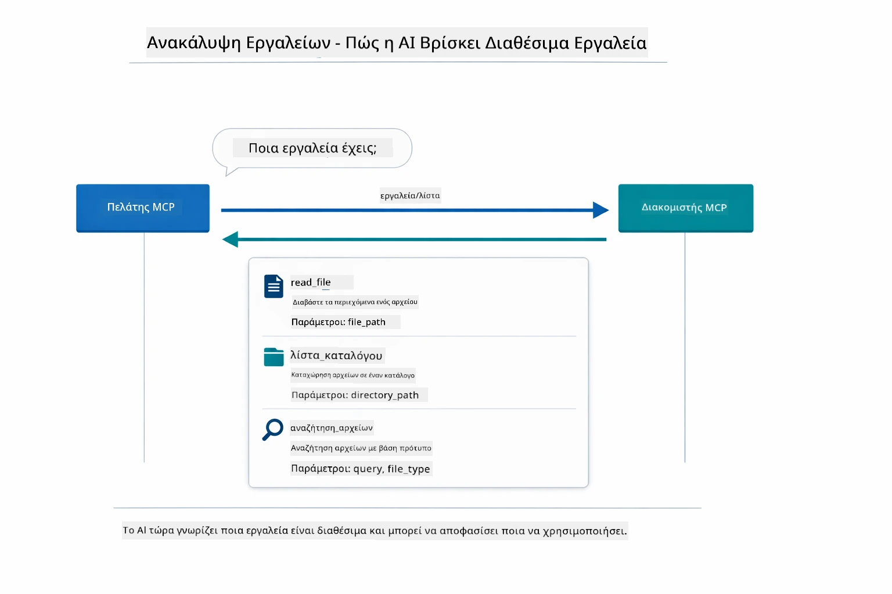

*Η AI ανακαλύπτει διαθέσιμα εργαλεία στην εκκίνηση — τώρα γνωρίζει ποιες δυνατότητες είναι διαθέσιμες και μπορεί να αποφασίσει ποια να χρησιμοποιήσει.*

**Μηχανισμοί Μεταφοράς**

Το MCP υποστηρίζει διαφορετικούς μηχανισμούς μεταφοράς. Οι δύο επιλογές είναι το Stdio (για τοπική επικοινωνία με subprocess) και το Streamable HTTP (για απομακρυσμένους servers). Αυτό το module δείχνει τον Stdio μηχανισμό:


*Μηχανισμοί μεταφοράς MCP: HTTP για απομακρυσμένους servers, Stdio για τοπικές διεργασίες*

**Stdio** - [StdioTransportDemo.java](../../../05-mcp/src/main/java/com/example/langchain4j/mcp/StdioTransportDemo.java)

Για τοπικές διεργασίες. Η εφαρμογή σας εκκινεί έναν server ως subprocess και επικοινωνεί μέσω τυπικής εισόδου/εξόδου. Χρήσιμο για πρόσβαση στο σύστημα αρχείων ή εργαλεία γραμμής εντολών.

```java
McpTransport stdioTransport = new StdioMcpTransport.Builder()
    .command(List.of(
        npmCmd, "exec",
        "@modelcontextprotocol/server-filesystem@2025.12.18",
        resourcesDir
    ))
    .logEvents(false)
    .build();
```

Ο server `@modelcontextprotocol/server-filesystem` εκθέτει τα ακόλουθα εργαλεία, όλα περιορισμένα στους καταλόγους που ορίζετε:

| Εργαλείο | Περιγραφή |
|------|-------------|
| `read_file` | Ανάγνωση του περιεχομένου ενός αρχείου |
| `read_multiple_files` | Ανάγνωση πολλαπλών αρχείων σε μία κλήση |
| `write_file` | Δημιουργία ή αντικατάσταση αρχείου |
| `edit_file` | Στοχευμένες επεξεργασίες εύρεσης-αντικατάστασης |
| `list_directory` | Λίστα αρχείων και καταλόγων σε διαδρομή |
| `search_files` | Αναδρομική αναζήτηση αρχείων που ταιριάζουν σε πρότυπο |
| `get_file_info` | Λήψη μεταδεδομένων αρχείου (μέγεθος, χρονικές σφραγίδες, δικαιώματα) |
| `create_directory` | Δημιουργία καταλόγου (συμπεριλαμβανομένων των γονικών καταλόγων) |
| `move_file` | Μετακίνηση ή μετονομασία αρχείου ή καταλόγου |

Το παρακάτω διάγραμμα δείχνει πώς λειτουργεί η μεταφορά Stdio κατά την εκτέλεση — η Java εφαρμογή σας εκκινεί τον MCP server ως child process και επικοινωνούν μέσω pipes stdin/stdout, χωρίς δικτυακή ή HTTP εμπλοκή:

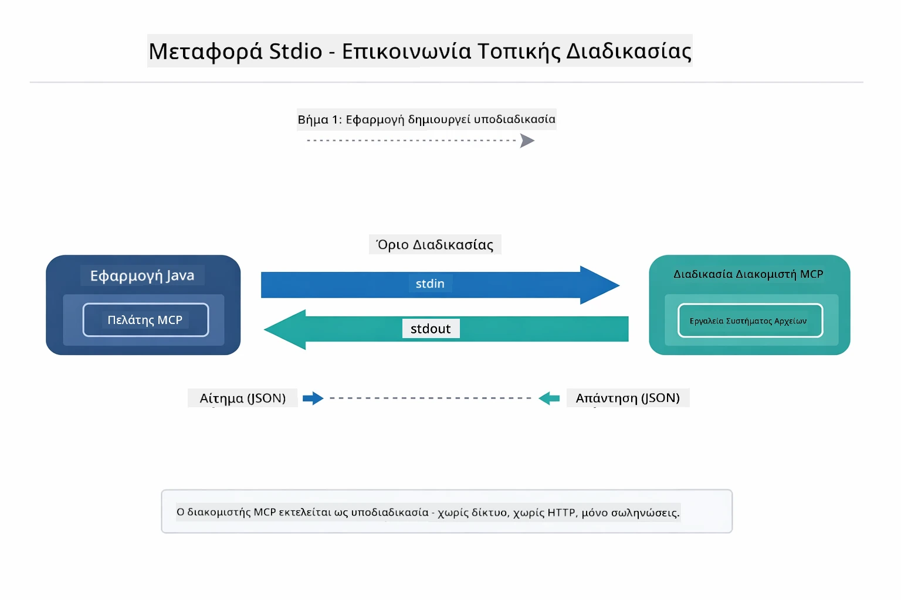

*Μεταφορά Stdio σε δράση — η εφαρμογή σας εκκινεί τον MCP server ως διεργασία παιδιού και επικοινωνεί μέσω pipes stdin/stdout.*

> **🤖 Δοκιμάστε με το [GitHub Copilot](https://github.com/features/copilot) Chat:** Ανοίξτε το [`StdioTransportDemo.java`](../../../05-mcp/src/main/java/com/example/langchain4j/mcp/StdioTransportDemo.java) και ρωτήστε:
> - "Πώς λειτουργεί η μεταφορά Stdio και πότε πρέπει να τη χρησιμοποιήσω αντί για HTTP;"
> - "Πώς διαχειρίζεται το LangChain4j τον κύκλο ζωής των εκκινουμένων MCP servers;"
> - "Ποιες είναι οι επιπτώσεις στην ασφάλεια από το να δίνω στο AI πρόσβαση στο σύστημα αρχείων;"

## Το Agentic Module

Ενώ το MCP παρέχει τυποποιημένα εργαλεία, το **agentic module** του LangChain4j παρέχει έναν δηλωτικό τρόπο να δημιουργείτε agents που οργανώνουν αυτά τα εργαλεία. Η επισήμανση `@Agent` και οι `AgenticServices` σας επιτρέπουν να ορίζετε συμπεριφορά agents μέσω interfaces αντί για επιτακτικό κώδικα.

Σε αυτό το module, εξερευνήσετε το πρότυπο **Supervisor Agent** — μια προχωρημένη agentic προσέγγιση τεχνητής νοημοσύνης όπου ένας "επιβλέπων" agent αποφασίζει δυναμικά ποιοι υπο-agent να κληθούν βάσει των αιτημάτων του χρήστη. Θα συνδυάσουμε τις δύο έννοιες δίνοντας σε έναν από τους υπο-agents μας ικανότητες πρόσβασης σε αρχεία με υποστήριξη MCP.

Για να χρησιμοποιήσετε το agentic module, προσθέστε αυτή τη Maven εξάρτηση:

```xml
<dependency>
    <groupId>dev.langchain4j</groupId>
    <artifactId>langchain4j-agentic</artifactId>
    <version>${langchain4j.mcp.version}</version>
</dependency>
```
> **Σημείωση:** Το module `langchain4j-agentic` χρησιμοποιεί ξεχωριστή ιδιότητα έκδοσης (`langchain4j.mcp.version`) επειδή κυκλοφορεί σε διαφορετικό χρονοδιάγραμμα από τις βασικές βιβλιοθήκες LangChain4j.

> **⚠️ Πειραματικό:** Το module `langchain4j-agentic` είναι **πειραματικό** και υπόκειται σε αλλαγές. Ο σταθερός τρόπος να δημιουργείτε βοηθούς AI παραμένει το `langchain4j-core` με προσαρμοσμένα εργαλεία (Module 04).

## Εκτέλεση των Παραδειγμάτων

### Προαπαιτούμενα

- Ολοκληρωμένο [Module 04 - Tools](../04-tools/README.md) (αυτό το module βασίζεται στις έννοιες προσαρμοσμένων εργαλείων και συγκρίνει με τα εργαλεία MCP)
- Αρχείο `.env` στον ριζικό κατάλογο με διαπιστευτήρια Azure (δημιουργείται από `azd up` στο Module 01)
- Java 21+, Maven 3.9+
- Node.js 16+ και npm (για MCP servers)

> **Σημείωση:** Εάν δεν έχετε ρυθμίσει ακόμα τις μεταβλητές περιβάλλοντός σας, δείτε [Module 01 - Εισαγωγή](../01-introduction/README.md) για οδηγίες ανάπτυξης (`azd up` δημιουργεί το αρχείο `.env` αυτόματα), ή αντιγράψτε το `.env.example` σε `.env` στο ριζικό φάκελο και συμπληρώστε τις τιμές σας.

## Γρήγορη Εκκίνηση

**Χρήση VS Code:** Απλώς κάντε δεξί κλικ σε οποιοδήποτε demo αρχείο στον Explorer και επιλέξτε **"Run Java"**, ή χρησιμοποιήστε τις ρυθμίσεις εκκίνησης από το πάνελ Run and Debug (βεβαιωθείτε ότι το αρχείο `.env` έχει ρυθμιστεί με διαπιστευτήρια Azure πρώτα).

**Χρήση Maven:** Εναλλακτικά, μπορείτε να τρέξετε από τη γραμμή εντολών με τα παρακάτω παραδείγματα.

### Ενέργειες Αρχείων (Stdio)

Αυτό δείχνει εργαλεία που βασίζονται σε τοπικό subprocess.

**✅ Δεν απαιτούνται προαπαιτούμενα** - ο MCP server εκκινείται αυτόματα.

**Χρήση των Script Εκκίνησης (Συνιστάται):**

Τα scripts εκκίνησης φορτώνουν αυτόματα μεταβλητές περιβάλλοντος από το ριζικό `.env` αρχείο:

**Bash:**
```bash
cd 05-mcp
chmod +x start-stdio.sh
./start-stdio.sh
```

**PowerShell:**
```powershell
cd 05-mcp
.\start-stdio.ps1
```

**Χρήση VS Code:** Δεξί κλικ στο `StdioTransportDemo.java` και επιλέξτε **"Run Java"** (βεβαιωθείτε ότι το `.env` έχει ρυθμιστεί).

Η εφαρμογή εκκινεί αυτόματα έναν MCP server συστήματος αρχείων και διαβάζει ένα τοπικό αρχείο. Παρατηρήστε πώς γίνεται η διαχείριση του subprocess για εσάς.

**Αναμενόμενο αποτέλεσμα:**
```
Assistant response: The file provides an overview of LangChain4j, an open-source Java library
for integrating Large Language Models (LLMs) into Java applications...
```

### Agent Επιβλέπων

Το πρότυπο **Supervisor Agent** είναι μια **ευέλικτη** μορφή agentic AI. Ο Επιβλέπων χρησιμοποιεί ένα LLM για να αποφασίζει αυτόνομα ποιοι agents θα κληθούν βάσει του αιτήματος του χρήστη. Στο επόμενο παράδειγμα, συνδυάζουμε την πρόσβαση σε αρχεία με υποστήριξη MCP με έναν LLM agent για να δημιουργήσουμε μια επιβλεπόμενη ροή εργασίας ανάγνωσης αρχείων → έκθεση.

Στην επίδειξη, ο `FileAgent` διαβάζει ένα αρχείο χρησιμοποιώντας εργαλεία συστήματος αρχείων MCP, και ο `ReportAgent` παράγει μια δομημένη έκθεση με εκτελεστική περίληψη (1 πρόταση), 3 βασικά σημεία και συστάσεις. Ο Επιβλέπων οργανώνει αυτό το ρεύμα αυτόματα:

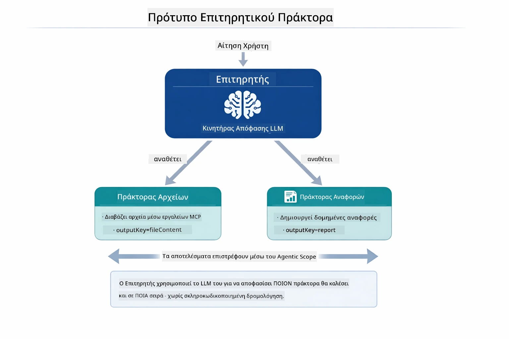

*Ο Επιβλέπων χρησιμοποιεί το LLM του για να αποφασίσει ποιοι agents θα κληθούν και με ποια σειρά — χωρίς ανάγκη για σκληροκωδικοποιημένο δρομολόγιο.*

Δείτε πώς μοιάζει η συγκεκριμένη ροή εργασίας για την αλυσίδα αρχείο-προς-έκθεση:

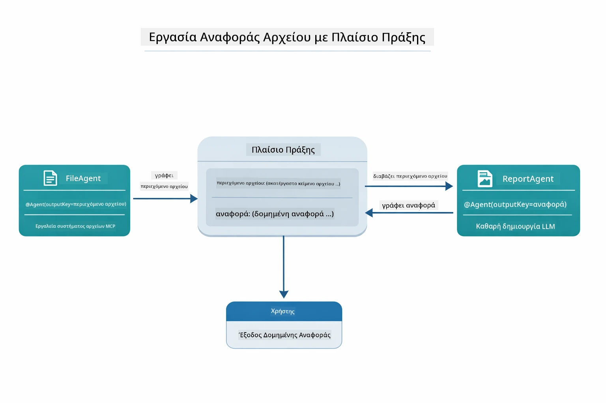

*Ο FileAgent διαβάζει το αρχείο μέσω εργαλείων MCP, μετά ο ReportAgent μετατρέπει το ακατέργαστο περιεχόμενο σε δομημένη έκθεση.*

Το παρακάτω διάγραμμα ακολουθίας παρακολουθεί ολόκληρη την ορχήστρωση του Επιβλέποντα — από την εκκίνηση του MCP server, μέσω της αυτόνομης επιλογής agents από τον Επιβλέποντα, έως τις κλήσεις εργαλείων μέσω stdio και την τελική έκθεση:

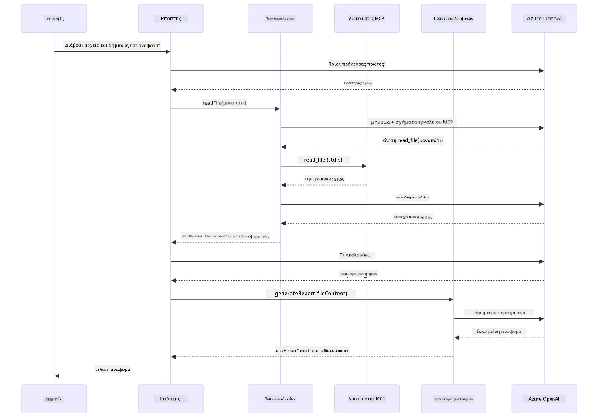

*Ο Επιβλέπων καλεί αυτόνομα τον FileAgent (που καλεί τον MCP server μέσω stdio για να διαβάσει το αρχείο), και μετά καλεί τον ReportAgent για να παράγει μια δομημένη έκθεση — κάθε agent αποθηκεύει το αποτέλεσμα του στο κοινό Agentic Scope.*

Κάθε agent αποθηκεύει το αποτέλεσμα του στο **Agentic Scope** (κοινός χώρος μνήμης), επιτρέποντας στους agents που ακολουθούν να έχουν πρόσβαση στα προηγούμενα αποτελέσματα. Αυτό δείχνει πώς τα εργαλεία MCP ενσωματώνονται άψογα σε agentic ροές εργασίας — ο Επιβλέπων δεν χρειάζεται να ξέρει *πώς* διαβάζονται τα αρχεία, αρκεί να γνωρίζει ότι ο `FileAgent` μπορεί να το κάνει.

#### Εκτέλεση της Επίδειξης

Τα scripts εκκίνησης φορτώνουν αυτόματα μεταβλητές περιβάλλοντος από το ριζικό `.env` αρχείο:

**Bash:**
```bash
cd 05-mcp
chmod +x start-supervisor.sh
./start-supervisor.sh
```

**PowerShell:**
```powershell
cd 05-mcp
.\start-supervisor.ps1
```

**Χρήση VS Code:** Δεξί κλικ στο `SupervisorAgentDemo.java` και επιλέξτε **"Run Java"** (βεβαιωθείτε ότι το `.env` έχει ρυθμιστεί).

#### Πώς Λειτουργεί ο Επιβλέπων

Πριν δημιουργήσετε agents, πρέπει να συνδέσετε το MCP transport σε έναν client και να το περιτυλίξετε ως `ToolProvider`. Έτσι τα εργαλεία του MCP server γίνονται διαθέσιμα στους agents σας:

```java
// Δημιουργήστε έναν πελάτη MCP από τη μεταφορά
McpClient mcpClient = new DefaultMcpClient.Builder()
        .transport(stdioTransport)
        .build();

// Τυλίξτε τον πελάτη ως ToolProvider — αυτό γεφυρώνει τα εργαλεία MCP στο LangChain4j
ToolProvider mcpToolProvider = McpToolProvider.builder()
        .mcpClients(List.of(mcpClient))
        .build();
```

Τώρα μπορείτε να εισάγετε το `mcpToolProvider` σε οποιονδήποτε agent χρειάζεται εργαλεία MCP:

```java
// Βήμα 1: Το FileAgent διαβάζει αρχεία χρησιμοποιώντας εργαλεία MCP
FileAgent fileAgent = AgenticServices.agentBuilder(FileAgent.class)
        .chatModel(model)
        .toolProvider(mcpToolProvider)  // Διαθέτει εργαλεία MCP για λειτουργίες αρχείων
        .build();

// Βήμα 2: Το ReportAgent δημιουργεί δομημένες αναφορές
ReportAgent reportAgent = AgenticServices.agentBuilder(ReportAgent.class)
        .chatModel(model)
        .build();

// Ο Επόπτης οργανώνει τη ροή εργασίας από αρχείο σε αναφορά
SupervisorAgent supervisor = AgenticServices.supervisorBuilder()
        .chatModel(model)
        .subAgents(fileAgent, reportAgent)
        .responseStrategy(SupervisorResponseStrategy.LAST)  // Επιστροφή της τελικής αναφοράς
        .build();

// Ο Επόπτης αποφασίζει ποιοι πράκτορες θα κληθούν βάσει του αιτήματος
String response = supervisor.invoke("Read the file at /path/file.txt and generate a report");
```

#### Πώς ο FileAgent Ανακαλύπτει Εργαλεία MCP κατά την Εκτέλεση

Μπορεί να αναρωτιέστε: **πώς ξέρει ο `FileAgent` πώς να χρησιμοποιήσει τα npm εργαλεία συστήματος αρχείων;** Η απάντηση είναι ότι δεν το ξέρει — το **LLM** το ανακαλύπτει κατά την εκτέλεση μέσω των δομών εργαλείων.
Η διεπαφή `FileAgent` είναι απλώς ένας **ορισμός προτροπής**. Δεν έχει ενσωματωμένη γνώση για τα `read_file`, `list_directory` ή οποιοδήποτε άλλο εργαλείο MCP. Εδώ είναι τι συμβαίνει από την αρχή ως το τέλος:

1. **Εκκίνηση διακομιστή:** Το `StdioMcpTransport` εκκινεί το πακέτο npm `@modelcontextprotocol/server-filesystem` ως υποδιαδικασία
2. **Ανακάλυψη εργαλείων:** Το `McpClient` στέλνει ένα JSON-RPC αίτημα `tools/list` στον διακομιστή, ο οποίος απαντά με ονόματα εργαλείων, περιγραφές και σχήματα παραμέτρων (π.χ., `read_file` — *"Διαβάζει το πλήρες περιεχόμενο ενός αρχείου"* — `{ path: string }`)
3. **Έγχυση σχημάτων:** Το `McpToolProvider` τυλίγει αυτά τα ανακαλυφθέντα σχήματα και τα καθιστά διαθέσιμα στο LangChain4j
4. **Απόφαση LLM:** Όταν καλείται το `FileAgent.readFile(path)`, το LangChain4j στέλνει το μήνυμα συστήματος, το μήνυμα χρήστη, **και τη λίστα των σχημάτων εργαλείων** στο LLM. Το LLM διαβάζει τις περιγραφές των εργαλείων και δημιουργεί μια κλήση εργαλείου (π.χ., `read_file(path="/some/file.txt")`)
5. **Εκτέλεση:** Το LangChain4j παρεμβαίνει στην κλήση εργαλείου, την κατευθύνει μέσω του πελάτη MCP πίσω στην υποδιαδικασία Node.js, λαμβάνει το αποτέλεσμα και το τροφοδοτεί πίσω στο LLM

Αυτός είναι ο ίδιος μηχανισμός [Tool Discovery](../../../05-mcp) που περιγράφηκε παραπάνω, αλλά εφαρμόζεται ειδικά στη ροή εργασίας του πράκτορα. Οι σημάνσεις `@SystemMessage` και `@UserMessage` καθοδηγούν τη συμπεριφορά του LLM, ενώ ο έγχυτος `ToolProvider` του παρέχει τις **δυνατότητες** — το LLM ενώνει τα δύο κατά την εκτέλεση.

> **🤖 Δοκιμάστε με το [GitHub Copilot](https://github.com/features/copilot) Chat:** Ανοίξτε το [`FileAgent.java`](../../../05-mcp/src/main/java/com/example/langchain4j/mcp/agents/FileAgent.java) και ρωτήστε:
> - "Πώς ξέρει αυτός ο πράκτορας ποιο εργαλείο MCP να καλέσει;"
> - "Τι θα συνέβαινε αν αφαιρούσα τον ToolProvider από τον builder του πράκτορα;"
> - "Πώς περνούν τα σχήματα εργαλείων στο LLM;"

#### Στρατηγικές Απάντησης

Όταν ρυθμίζετε έναν `SupervisorAgent`, καθορίζετε πώς θα διατυπώσει την τελική απάντηση προς τον χρήστη αφού οι υπο-πράκτορες ολοκληρώσουν τις εργασίες τους. Το παρακάτω διάγραμμα δείχνει τις τρεις διαθέσιμες στρατηγικές — το LAST επιστρέφει απευθείας το τελικό αποτέλεσμα του πράκτορα, το SUMMARY συνθέτει όλα τα αποτελέσματα μέσω ενός LLM, και το SCORED επιλέγει όποιο έχει υψηλότερη βαθμολογία σε σχέση με το αρχικό αίτημα:

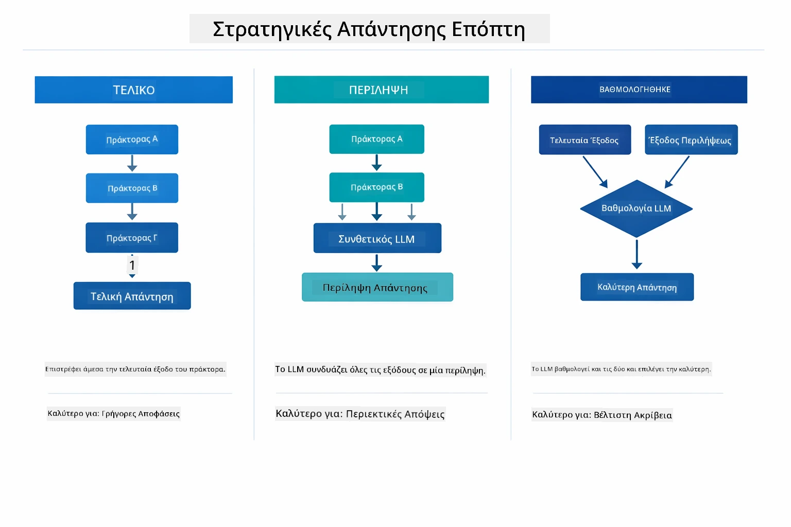

*Τρεις στρατηγικές για το πώς ο Supervisor διαμορφώνει την τελική απάντηση — επιλέξτε ανάλογα με το αν θέλετε το έξοδο του τελευταίου πράκτορα, μια συνθετική περίληψη ή την καλύτερη κατάταξη επιλογή.*

Οι διαθέσιμες στρατηγικές είναι:

| Στρατηγική | Περιγραφή |
|----------|-------------|
| **LAST** | Ο επιβλέπων επιστρέφει την έξοδο του τελευταίου υπο-πράκτορα ή εργαλείου που κλήθηκε. Αυτό είναι χρήσιμο όταν ο τελικός πράκτορας στη ροή εργασίας έχει σχεδιαστεί ειδικά για να παράγει την πλήρη, τελική απάντηση (π.χ., "Πράκτορας Περίληψης" σε μια ερευνητική ροή). |
| **SUMMARY** | Ο επιβλέπων χρησιμοποιεί το δικό του εσωτερικό Γλωσσικό Μοντέλο (LLM) για να συνθέσει μια περίληψη της συνολικής αλληλεπίδρασης και όλων των εξόδων των υπο-πρακτόρων, στη συνέχεια επιστρέφει αυτή την περίληψη ως τελική απάντηση. Αυτό παρέχει μια καθαρή, συνολική απάντηση στον χρήστη. |
| **SCORED** | Το σύστημα χρησιμοποιεί ένα εσωτερικό LLM για να βαθμολογήσει τόσο την απάντηση LAST όσο και την περίληψη SUMMARY της αλληλεπίδρασης σε σχέση με το αρχικό αίτημα του χρήστη, επιστρέφοντας όποιο αποτέλεσμα λάβει υψηλότερη βαθμολογία. |

Δείτε το [SupervisorAgentDemo.java](../../../05-mcp/src/main/java/com/example/langchain4j/mcp/SupervisorAgentDemo.java) για την πλήρη υλοποίηση.

> **🤖 Δοκιμάστε με το [GitHub Copilot](https://github.com/features/copilot) Chat:** Ανοίξτε το [`SupervisorAgentDemo.java`](../../../05-mcp/src/main/java/com/example/langchain4j/mcp/SupervisorAgentDemo.java) και ρωτήστε:
> - "Πώς αποφασίζει ο Supervisor ποιον πράκτορα να καλέσει;"
> - "Ποια η διαφορά μεταξύ των προτύπων ροής εργασίας Supervisor και Sequential;"
> - "Πώς μπορώ να προσαρμόσω τη συμπεριφορά σχεδιασμού του Supervisor;"

#### Κατανόηση του Αποτελέσματος

Όταν εκτελέσετε τη δοκιμαστική εφαρμογή, θα δείτε μια δομημένη περιήγηση του πώς ο Supervisor οργανώνει πολλούς πράκτορες. Να τι σημαίνει κάθε ενότητα:

```
======================================================================
  FILE → REPORT WORKFLOW DEMO
======================================================================

This demo shows a clear 2-step workflow: read a file, then generate a report.
The Supervisor orchestrates the agents automatically based on the request.
```
  
**Η επικεφαλίδα** εισάγει την έννοια της ροής εργασίας: μια στοχευμένη αλυσίδα από την ανάγνωση αρχείων έως τη δημιουργία αναφοράς.

```
--- WORKFLOW ---------------------------------------------------------
  ┌─────────────┐      ┌──────────────┐
  │  FileAgent  │ ───▶ │ ReportAgent  │
  │ (MCP tools) │      │  (pure LLM)  │
  └─────────────┘      └──────────────┘
   outputKey:           outputKey:
   'fileContent'        'report'

--- AVAILABLE AGENTS -------------------------------------------------
  [FILE]   FileAgent   - Reads files via MCP → stores in 'fileContent'
  [REPORT] ReportAgent - Generates structured report → stores in 'report'
```
  
**Διάγραμμα Ροής Εργασίας** δείχνει τη ροή δεδομένων μεταξύ των πρακτόρων. Κάθε πράκτορας έχει συγκεκριμένο ρόλο:  
- **FileAgent** διαβάζει αρχεία χρησιμοποιώντας εργαλεία MCP και αποθηκεύει το ακατέργαστο περιεχόμενο στο `fileContent`  
- **ReportAgent** χρησιμοποιεί αυτό το περιεχόμενο και παράγει μια οργανωμένη αναφορά στο `report`

```
--- USER REQUEST -----------------------------------------------------
  "Read the file at .../file.txt and generate a report on its contents"
```
  
**Αίτημα Χρήστη** δείχνει την εργασία. Ο Supervisor το αναλύει και αποφασίζει να καλέσει FileAgent → ReportAgent.

```
--- SUPERVISOR ORCHESTRATION -----------------------------------------
  The Supervisor decides which agents to invoke and passes data between them...

  +-- STEP 1: Supervisor chose -> FileAgent (reading file via MCP)
  |
  |   Input: .../file.txt
  |
  |   Result: LangChain4j is an open-source, provider-agnostic Java framework for building LLM...
  +-- [OK] FileAgent (reading file via MCP) completed

  +-- STEP 2: Supervisor chose -> ReportAgent (generating structured report)
  |
  |   Input: LangChain4j is an open-source, provider-agnostic Java framew...
  |
  |   Result: Executive Summary...
  +-- [OK] ReportAgent (generating structured report) completed
```
  
**Διαχείριση Supervisor** δείχνει την ροή δύο βημάτων σε δράση:  
1. **FileAgent** διαβάζει το αρχείο μέσω MCP και αποθηκεύει το περιεχόμενο  
2. **ReportAgent** λαμβάνει το περιεχόμενο και δημιουργεί μια οργανωμένη αναφορά

Ο Supervisor πήρε αυτές τις αποφάσεις **αυτόνομα** βάσει του αιτήματος του χρήστη.

```
--- FINAL RESPONSE ---------------------------------------------------
Executive Summary
...

Key Points
...

Recommendations
...

--- AGENTIC SCOPE (Data Flow) ----------------------------------------
  Each agent stores its output for downstream agents to consume:
  * fileContent: LangChain4j is an open-source, provider-agnostic Java framework...
  * report: Executive Summary...
```
  
#### Εξήγηση Χαρακτηριστικών Μονάδας Agentic

Το παράδειγμα παρουσιάζει αρκετές προηγμένες λειτουργίες της μονάδας agentic. Ας δούμε πιο προσεκτικά το Agentic Scope και τους Agent Listeners.

**Agentic Scope** δείχνει τη κοινή μνήμη όπου οι πράκτορες αποθήκευσαν τα αποτελέσματά τους χρησιμοποιώντας `@Agent(outputKey="...")`. Αυτό επιτρέπει:  
- Σε μεταγενέστερους πράκτορες να έχουν πρόσβαση σε εξόδους προηγούμενων πρακτόρων  
- Στον Supervisor να συνθέσει μια τελική απάντηση  
- Σε εσάς να ελέγξετε τι παρήγαγε κάθε πράκτορας

Το παρακάτω διάγραμμα δείχνει πώς λειτουργεί το Agentic Scope ως κοινή μνήμη στη ροή αρχείου-προς-αναφορά — ο FileAgent γράφει την έξοδο με το κλειδί `fileContent`, ο ReportAgent το διαβάζει και γράφει τη δική του έξοδο με το κλειδί `report`:

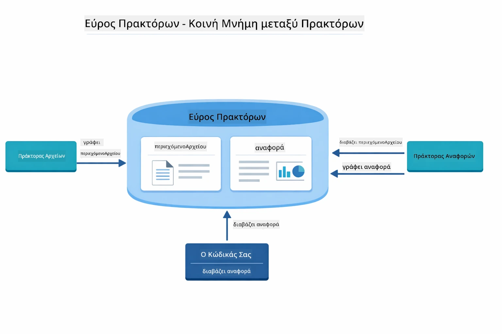

*Το Agentic Scope λειτουργεί ως κοινή μνήμη — ο FileAgent γράφει το `fileContent`, ο ReportAgent το διαβάζει και γράφει το `report`, και ο κώδικάς σας διαβάζει το τελικό αποτέλεσμα.*

```java
ResultWithAgenticScope<String> result = supervisor.invokeWithAgenticScope(request);
AgenticScope scope = result.agenticScope();
String fileContent = scope.readState("fileContent");  // Ακατέργαστα δεδομένα αρχείου από το FileAgent
String report = scope.readState("report");            // Δομημένη αναφορά από το ReportAgent
```
  
**Agent Listeners** επιτρέπουν την παρακολούθηση και τον εντοπισμό σφαλμάτων κατά την εκτέλεση των πρακτόρων. Η βήμα-βήμα έξοδος που βλέπετε στη δοκιμή προέρχεται από έναν AgentListener που συνδέεται με κάθε κλήση πράκτορα:  
- **beforeAgentInvocation** - Καλείται όταν ο Supervisor επιλέγει έναν πράκτορα, επιτρέποντάς σας να δείτε ποιος πράκτορας επιλέχθηκε και γιατί  
- **afterAgentInvocation** - Καλείται όταν ένας πράκτορας ολοκληρώνεται, εμφανίζοντας το αποτέλεσμα  
- **inheritedBySubagents** - Όταν είναι αληθές, ο listener παρακολουθεί όλους τους πράκτορες στην ιεραρχία

Το ακόλουθο διάγραμμα δείχνει τον πλήρη κύκλο ζωής του Agent Listener, συμπεριλαμβανομένου του πώς το `onError` χειρίζεται αποτυχίες κατά την εκτέλεση πράκτορα:

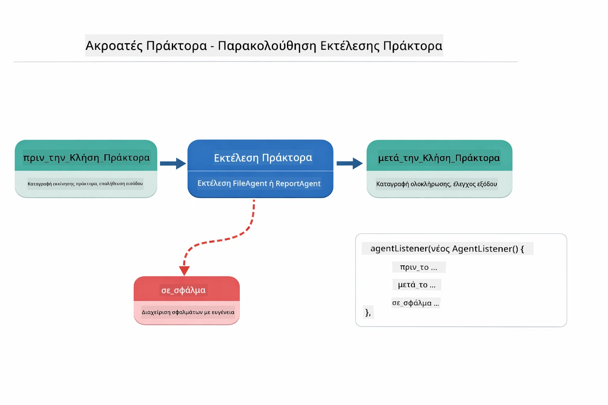

*Οι Agent Listeners συνδέονται στον κύκλο ζωής της εκτέλεσης — παρακολουθούν πότε ξεκινούν, ολοκληρώνονται ή αντιμετωπίζουν σφάλματα οι πράκτορες.*

```java
AgentListener monitor = new AgentListener() {
    private int step = 0;
    
    @Override
    public void beforeAgentInvocation(AgentRequest request) {
        step++;
        System.out.println("  +-- STEP " + step + ": " + request.agentName());
    }
    
    @Override
    public void afterAgentInvocation(AgentResponse response) {
        System.out.println("  +-- [OK] " + response.agentName() + " completed");
    }
    
    @Override
    public boolean inheritedBySubagents() {
        return true; // Διάδοση σε όλους τους υπο-πράκτορες
    }
};
```
  
Πέρα από το πρότυπο Supervisor, η μονάδα `langchain4j-agentic` παρέχει αρκετά ισχυρά πρότυπα ροής εργασίας. Το παρακάτω διάγραμμα δείχνει και τα πέντε — από απλές διαδοχικές αλυσίδες έως ροές έγκρισης με ανθρώπινη παρέμβαση:

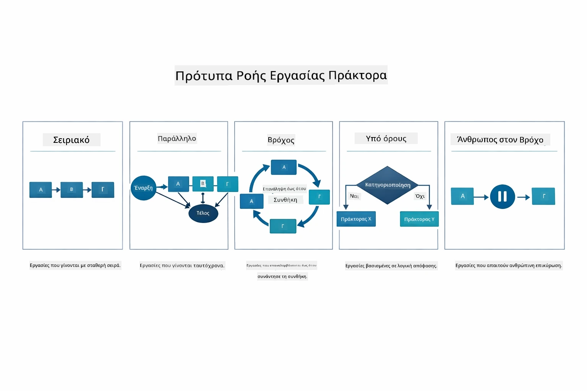

*Πέντε πρότυπα ροής εργασίας για τη διαχείριση πρακτόρων — από απλές διαδοχικές αλυσίδες έως ροές έγκρισης με ανθρώπινη παρέμβαση.*

| Πρότυπο | Περιγραφή | Περίπτωση Χρήσης |
|---------|-------------|----------|
| **Sequential** | Εκτέλεση πρακτόρων με σειρά, η έξοδος ρέει στον επόμενο | Αλυσίδες: έρευνα → ανάλυση → αναφορά |
| **Parallel** | Εκτέλεση πρακτόρων ταυτόχρονα | Ανεξάρτητες εργασίες: καιρός + ειδήσεις + χρηματιστήριο |
| **Loop** | Επανάληψη μέχρι να πληρωθεί συνθήκη | Βαθμολόγηση ποιότητας: βελτίωση μέχρι να επιτευχθεί βαθμός ≥ 0.8 |
| **Conditional** | Κατεύθυνση με βάση συνθήκες | Κατηγοριοποίηση → δρομολόγηση σε ειδικό πράκτορα |
| **Human-in-the-Loop** | Προσθήκη ανθρώπινων σημεία ελέγχου | Ροές έγκρισης, αναθεώρηση περιεχομένου |

## Κύριες Έννοιες

Τώρα που εξερευνήσατε το MCP και τη μονάδα agentic σε δράση, ας συνοψίσουμε πότε να χρησιμοποιείτε κάθε προσέγγιση.

Ένα από τα μεγαλύτερα πλεονεκτήματα του MCP είναι το αναπτυσσόμενο οικοσύστημα του. Το παρακάτω διάγραμμα δείχνει πώς ένα ενιαίο καθολικό πρωτόκολλο συνδέει την AI εφαρμογή σας με μια μεγάλη ποικιλία διακομιστών MCP — από πρόσβαση σε αρχεία και βάσεις δεδομένων έως GitHub, email, web scraping, και άλλα:

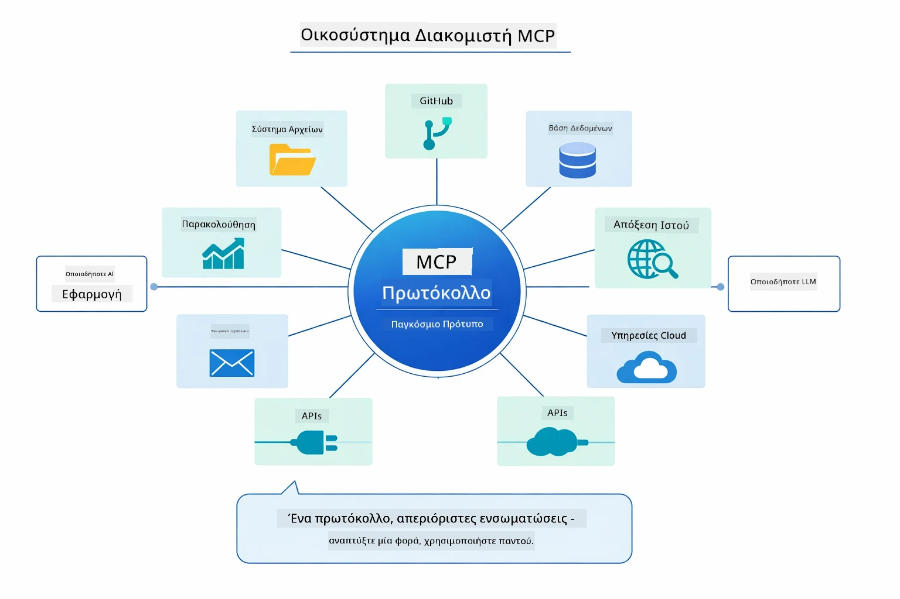

*Το MCP δημιουργεί ένα ενιαίο οικοσύστημα πρωτοκόλλου — κάθε διακομιστής συμβατός με MCP λειτουργεί με κάθε πελάτη MCP, επιτρέποντας την κοινή χρήση εργαλείων μεταξύ εφαρμογών.*

Το **MCP** είναι ιδανικό όταν θέλετε να αξιοποιήσετε υπάρχον οικοσύστημα εργαλείων, να δημιουργήσετε εργαλεία που μπορεί να μοιραστούν πολλές εφαρμογές, να ενσωματώσετε υπηρεσίες τρίτων με πρότυπα πρωτόκολλα ή να αντικαταστήσετε υλοποιήσεις εργαλείων χωρίς αλλαγή κώδικα.

**Η μονάδα Agentic** λειτουργεί καλύτερα όταν θέλετε δηλωτικούς ορισμούς πρακτόρων με σημάνσεις `@Agent`, χρειάζεστε ορχήστρωση ροής εργασίας (διαδοχική, βρόχο, παράλληλη), προτιμάτε σχεδιασμό πρακτόρων βασισμένο σε διεπαφή αντί για επιτακτικό κώδικα ή συνδυάζετε πολλούς πράκτορες που μοιράζονται εξόδους μέσω `outputKey`.

Το **πρότυπο Supervisor Agent** διακρίνεται όταν η ροή εργασίας δεν είναι προβλέψιμη εκ των προτέρων και θέλετε το LLM να αποφασίζει, όταν έχετε πολλούς ειδικευμένους πράκτορες που χρειάζονται δυναμική ορχήστρωση, όταν δημιουργείτε συνομιλιακά συστήματα που δρομολογούν σε διαφορετικές δυνατότητες ή όταν θέλετε τη πιο ευέλικτη, προσαρμοστική συμπεριφορά πράκτορα.

Για να σας βοηθήσουμε να αποφασίσετε ανάμεσα στις προσαρμοσμένες μεθόδους `@Tool` από το Μάθημα 04 και τα εργαλεία MCP αυτής της ενότητας, η παρακάτω σύγκριση επισημαίνει τα βασικά πλεονεκτήματα και μειονεκτήματα — τα προσαρμοσμένα εργαλεία προσφέρουν στενή σύνδεση και πλήρη ασφάλεια τύπων για λογική εφαρμογής, ενώ τα εργαλεία MCP παρέχουν τυποποιημένες, επαναχρησιμοποιήσιμες ενσωματώσεις:

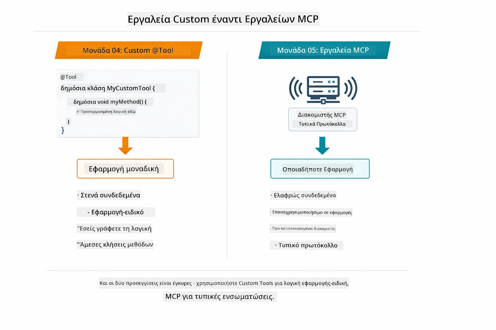

*Πότε να χρησιμοποιήσετε τις προσαρμοσμένες μεθόδους @Tool έναντι των εργαλείων MCP — προσαρμοσμένα εργαλεία για λογική εφαρμογής με πλήρη ασφάλεια τύπων, εργαλεία MCP για τυποποιημένες ενσωματώσεις που λειτουργούν σε πολλαπλές εφαρμογές.*

## Συγχαρητήρια!

Ολοκληρώσατε και τα πέντε μαθήματα του LangChain4j για Αρχάριους! Ακολουθεί μια επισκόπηση της πλήρους διαδρομής μάθησης που ολοκληρώσατε — από τη βασική συνομιλία μέχρι τα agentic συστήματα με υποστήριξη MCP:

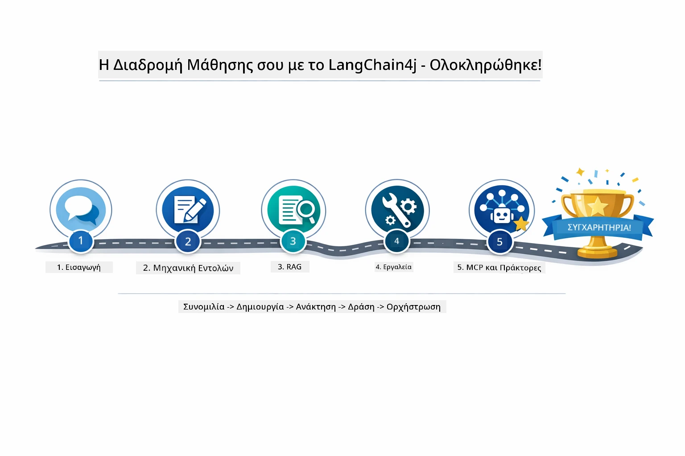

*Το ταξίδι μάθησής σας μέσα από όλα τα πέντε μαθήματα — από τη βασική συνομιλία έως τα agentic συστήματα με υποστήριξη MCP.*

Ολοκληρώσατε το μάθημα LangChain4j για Αρχάριους. Έχετε μάθει:

- Πώς να δημιουργείτε συνομιλιακή AI με μνήμη (Μάθημα 01)
- Πρότυπα σχεδιασμού προτροπών για διάφορες εργασίες (Μάθημα 02)
- Σύνδεση απαντήσεων με τα έγγραφά σας μέσω RAG (Μάθημα 03)
- Δημιουργία βασικών πρακτόρων AI (βοηθών) με προσαρμοσμένα εργαλεία (Μάθημα 04)
- Ενσωμάτωση τυποποιημένων εργαλείων με τις μονάδες LangChain4j MCP και Agentic (Μάθημα 05)

### Τι Ακολουθεί;

Μετά την ολοκλήρωση των μαθημάτων, εξερευνήστε τον [Οδηγό Δοκιμών](../docs/TESTING.md) για να δείτε τις έννοιες δοκιμών στο LangChain4j σε δράση.

**Επίσημοι Πόροι:**  
- [Τεκμηρίωση LangChain4j](https://docs.langchain4j.dev/) - Εγχειρίδια και αναφορά API  
- [GitHub LangChain4j](https://github.com/langchain4j/langchain4j) - Πηγαίος κώδικας και παραδείγματα  
- [Οδηγοί LangChain4j](https://docs.langchain4j.dev/tutorials/) - Οδηγοί βήμα προς βήμα για διάφορες χρήσεις

Σας ευχαριστούμε που ολοκληρώσατε αυτό το μάθημα!

---

**Πλοήγηση:** [← Προηγούμενο: Μάθημα 04 - Εργαλεία](../04-tools/README.md) | [Πίσω στην Κύρια Σελίδα](../README.md)

---

<!-- CO-OP TRANSLATOR DISCLAIMER START -->
**Αποποίηση ευθυνών**:  
Αυτό το έγγραφο έχει μεταφραστεί χρησιμοποιώντας την υπηρεσία αυτόματης μετάφρασης AI [Co-op Translator](https://github.com/Azure/co-op-translator). Παρότι επιδιώκουμε την ακρίβεια, παρακαλούμε να λάβετε υπόψη ότι οι αυτοματοποιημένες μεταφράσεις μπορεί να περιέχουν λάθη ή ανακρίβειες. Το πρωτότυπο έγγραφο στη γλώσσα του πρέπει να θεωρείται η αυθεντική πηγή. Για κρίσιμες πληροφορίες συνιστάται επαγγελματική μετάφραση από άνθρωπο. Δεν φέρουμε ευθύνη για τυχόν παρανοήσεις ή λανθασμένες ερμηνείες που προκύπτουν από τη χρήση αυτής της μετάφρασης.
<!-- CO-OP TRANSLATOR DISCLAIMER END -->