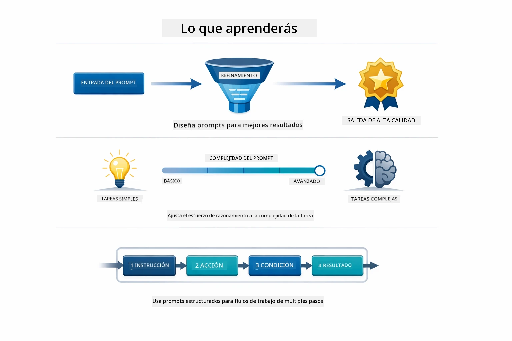
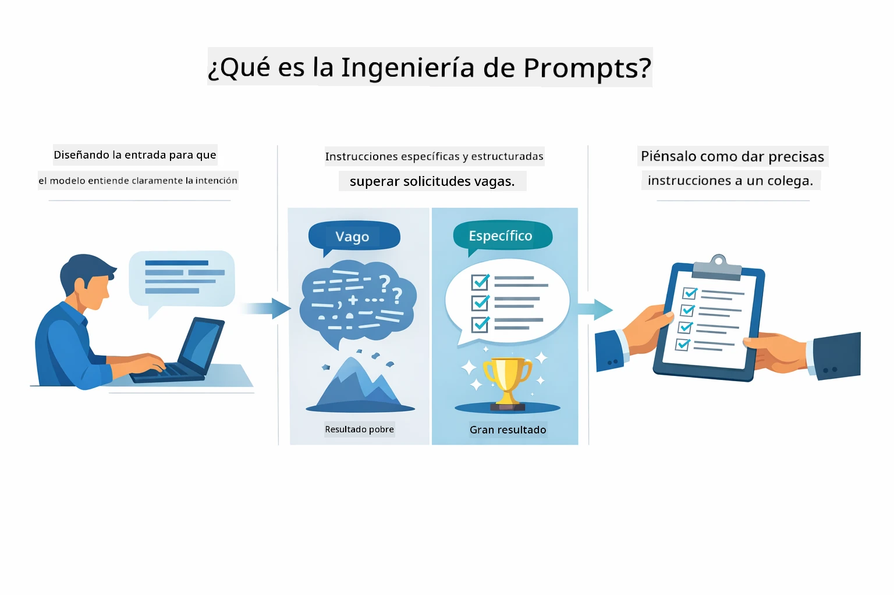
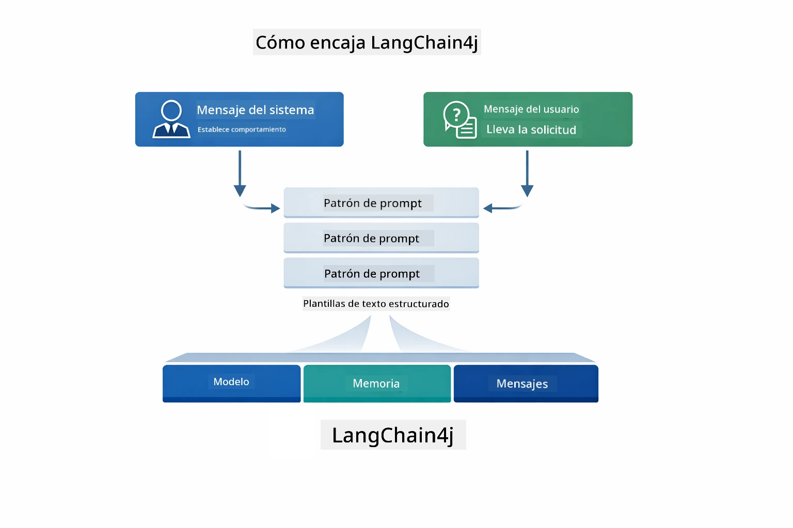
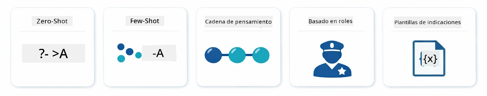
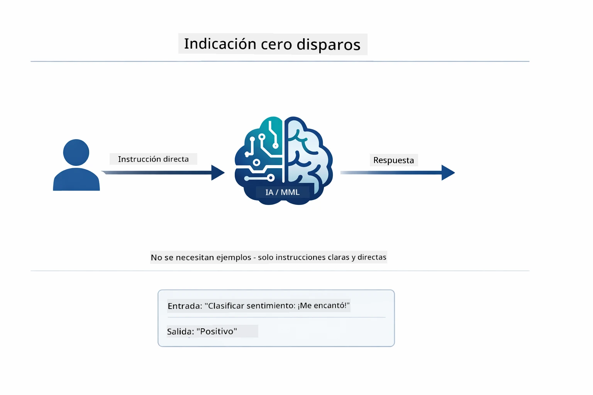
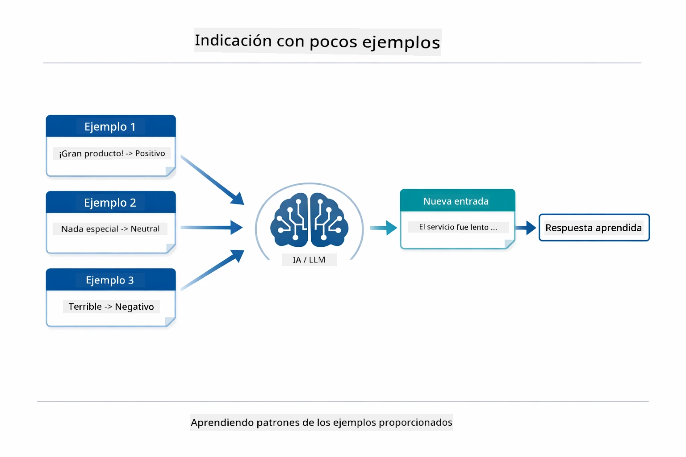
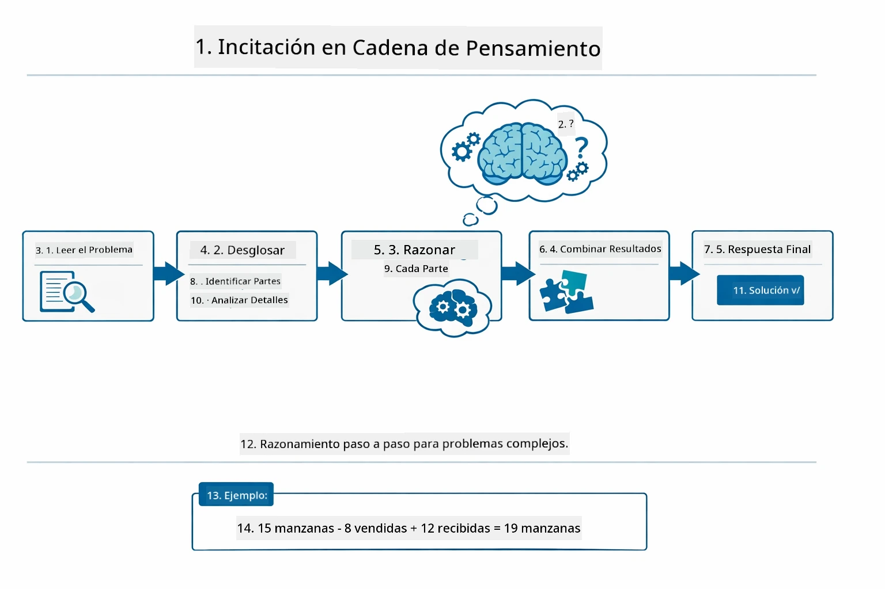
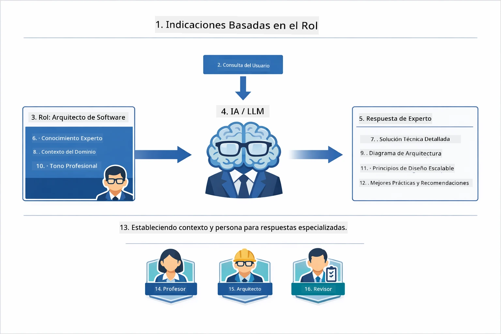
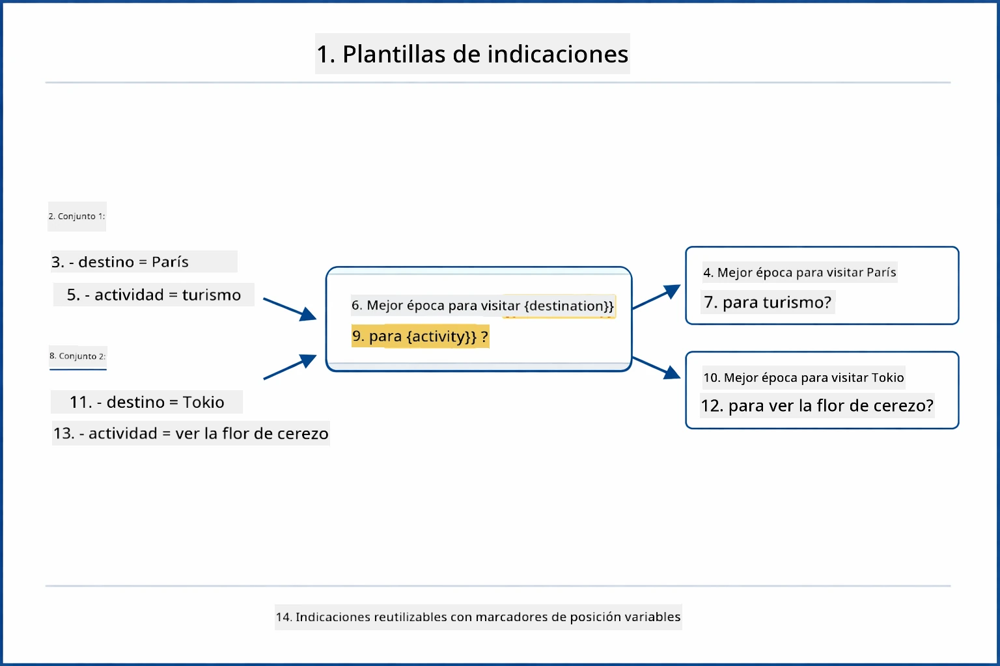
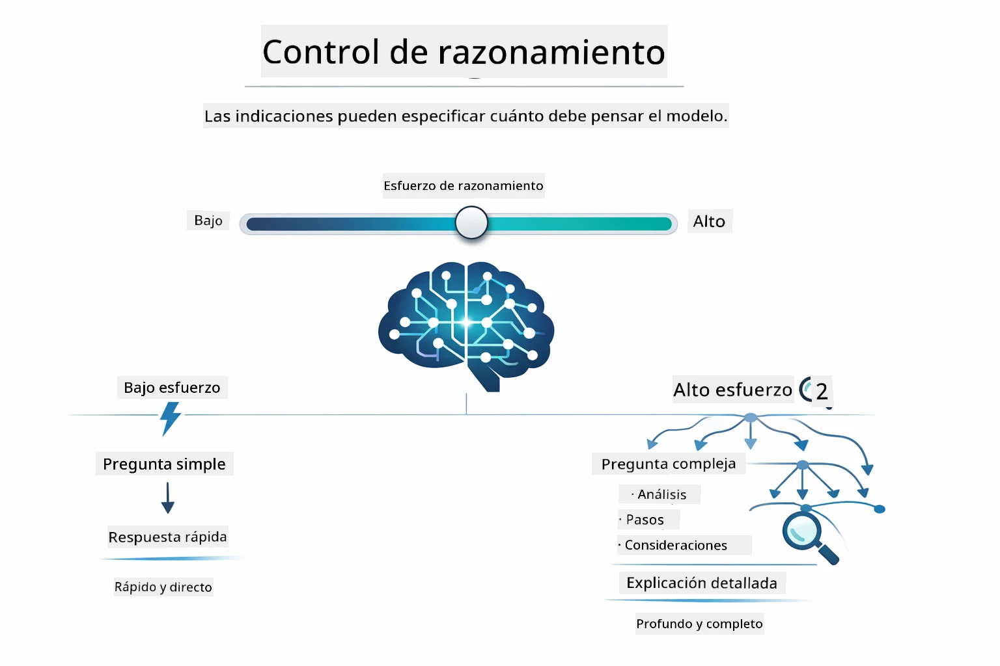

# Módulo 02: Ingeniería de Prompts con GPT-5.2

## Tabla de Contenidos

- [Qué Aprenderás](../../../02-prompt-engineering)
- [Requisitos Previos](../../../02-prompt-engineering)
- [Entendiendo la Ingeniería de Prompts](../../../02-prompt-engineering)
- [Fundamentos de la Ingeniería de Prompts](../../../02-prompt-engineering)
  - [Prompting Zero-Shot](../../../02-prompt-engineering)
  - [Prompting Few-Shot](../../../02-prompt-engineering)
  - [Cadena de Pensamiento](../../../02-prompt-engineering)
  - [Prompting Basado en Roles](../../../02-prompt-engineering)
  - [Plantillas de Prompts](../../../02-prompt-engineering)
- [Patrones Avanzados](../../../02-prompt-engineering)
- [Uso de Recursos Existentes en Azure](../../../02-prompt-engineering)
- [Capturas de Pantalla de la Aplicación](../../../02-prompt-engineering)
- [Explorando los Patrones](../../../02-prompt-engineering)
  - [Energía Baja vs Alta](../../../02-prompt-engineering)
  - [Ejecución de Tareas (Preámbulos de Herramientas)](../../../02-prompt-engineering)
  - [Código Auto-Reflexivo](../../../02-prompt-engineering)
  - [Análisis Estructurado](../../../02-prompt-engineering)
  - [Chat Multi-Turno](../../../02-prompt-engineering)
  - [Razonamiento Paso a Paso](../../../02-prompt-engineering)
  - [Salida Restringida](../../../02-prompt-engineering)
- [Qué Estás Realmente Aprendiendo](../../../02-prompt-engineering)
- [Próximos Pasos](../../../02-prompt-engineering)

## Qué Aprenderás



En el módulo anterior, viste cómo la memoria habilita la IA conversacional y usaste Modelos de GitHub para interacciones básicas. Ahora nos enfocaremos en cómo haces preguntas — los prompts mismos — usando GPT-5.2 de Azure OpenAI. La forma en que estructuras tus prompts afecta dramáticamente la calidad de las respuestas que obtienes. Empezamos con una revisión de las técnicas fundamentales de prompting, luego pasamos a ocho patrones avanzados que aprovechan completamente las capacidades de GPT-5.2.

Usaremos GPT-5.2 porque introduce control de razonamiento: puedes indicarle al modelo cuánto pensar antes de responder. Esto hace que las diferentes estrategias de prompting sean más evidentes y te ayuda a entender cuándo usar cada enfoque. También nos beneficiaremos de los límites de tasa menores de Azure para GPT-5.2 en comparación con los Modelos de GitHub.

## Requisitos Previos

- Haber completado el Módulo 01 (recursos Azure OpenAI desplegados)
- Archivo `.env` en el directorio raíz con credenciales de Azure (creado por `azd up` en el Módulo 01)

> **Nota:** Si no has completado el Módulo 01, sigue primero las instrucciones de despliegue allí.

## Entendiendo la Ingeniería de Prompts



La ingeniería de prompts trata sobre diseñar texto de entrada que consistentemente te dé los resultados que necesitas. No se trata solo de hacer preguntas, sino de estructurar solicitudes para que el modelo entienda exactamente lo que quieres y cómo entregarlo.

Piénsalo como dar instrucciones a un colega. "Arregla el error" es vago. "Arregla la excepción de puntero nulo en UserService.java línea 45 añadiendo una verificación nula" es específico. Los modelos de lenguaje funcionan igual: la especificidad y la estructura importan.



LangChain4j provee la infraestructura — conexiones de modelos, memoria y tipos de mensajes — mientras que los patrones de prompts son solo texto cuidadosamente estructurado que envías a través de esa infraestructura. Los bloques clave son `SystemMessage` (que define el comportamiento y rol de la IA) y `UserMessage` (que contiene tu solicitud real).

## Fundamentos de la Ingeniería de Prompts



Antes de adentrarnos en los patrones avanzados de este módulo, revisemos cinco técnicas fundamentales de prompting. Estos son los bloques básicos que todo ingeniero de prompts debe conocer. Si ya trabajaste el [módulo de inicio rápido](../00-quick-start/README.md#2-prompt-patterns), los viste en acción — aquí el marco conceptual detrás de ellos.

### Prompting Zero-Shot

El enfoque más simple: darle al modelo una instrucción directa sin ejemplos. El modelo se basa completamente en su entrenamiento para entender y ejecutar la tarea. Esto funciona bien para solicitudes directas donde el comportamiento esperado es obvio.



*Instrucción directa sin ejemplos — el modelo infiere la tarea solo con la instrucción*

```java
String prompt = "Classify this sentiment: 'I absolutely loved the movie!'";
String response = model.chat(prompt);
// Respuesta: "Positivo"
```

**Cuándo usar:** Clasificaciones simples, preguntas directas, traducciones o cualquier tarea que el modelo pueda manejar sin guía adicional.

### Prompting Few-Shot

Proporciona ejemplos que demuestran el patrón que quieres que el modelo siga. El modelo aprende el formato de entrada-salida esperado a partir de tus ejemplos y lo aplica a nuevas entradas. Esto mejora dramáticamente la consistencia para tareas donde el formato o comportamiento deseado no es obvio.



*Aprendiendo de ejemplos — el modelo identifica el patrón y lo aplica a entradas nuevas*

```java
String prompt = """
    Classify the sentiment as positive, negative, or neutral.
    
    Examples:
    Text: "This product exceeded my expectations!" → Positive
    Text: "It's okay, nothing special." → Neutral
    Text: "Waste of money, very disappointed." → Negative
    
    Now classify this:
    Text: "Best purchase I've made all year!"
    """;
String response = model.chat(prompt);
```

**Cuándo usar:** Clasificaciones personalizadas, formateo consistente, tareas específicas de dominio o cuando los resultados zero-shot son inconsistentes.

### Cadena de Pensamiento

Pide al modelo que muestre su razonamiento paso a paso. En lugar de saltar a una respuesta, el modelo desglosa el problema y trabaja cada parte explícitamente. Esto mejora la precisión en matemáticas, lógica y razonamientos de múltiples pasos.



*Razonamiento paso a paso — desglosar problemas complejos en pasos lógicos explícitos*

```java
String prompt = """
    Problem: A store has 15 apples. They sell 8 apples and then 
    receive a shipment of 12 more apples. How many apples do they have now?
    
    Let's solve this step-by-step:
    """;
String response = model.chat(prompt);
// El modelo muestra: 15 - 8 = 7, luego 7 + 12 = 19 manzanas
```

**Cuándo usar:** Problemas matemáticos, acertijos lógicos, depuración o cualquier tarea donde mostrar el proceso de razonamiento mejore la precisión y confianza.

### Prompting Basado en Roles

Define una persona o rol para la IA antes de hacer tu pregunta. Esto proporciona contexto que moldea el tono, la profundidad y el enfoque de la respuesta. Un "arquitecto de software" da consejos diferentes a un "desarrollador junior" o un "auditor de seguridad".



*Definir contexto y persona — la misma pregunta recibe una respuesta distinta según el rol asignado*

```java
String prompt = """
    You are an experienced software architect reviewing code.
    Provide a brief code review for this function:
    
    def calculate_total(items):
        total = 0
        for item in items:
            total = total + item['price']
        return total
    """;
String response = model.chat(prompt);
```

**Cuándo usar:** Revisiones de código, tutorías, análisis específicos del dominio o cuando necesitas respuestas adaptadas a un nivel o perspectiva particular.

### Plantillas de Prompts

Crea prompts reutilizables con marcadores variables. En lugar de escribir un nuevo prompt cada vez, define una plantilla una vez y cambia valores. La clase `PromptTemplate` de LangChain4j facilita esto con la sintaxis `{{variable}}`.



*Prompts reutilizables con marcadores de variables — una plantilla, muchos usos*

```java
PromptTemplate template = PromptTemplate.from(
    "What's the best time to visit {{destination}} for {{activity}}?"
);

Prompt prompt = template.apply(Map.of(
    "destination", "Paris",
    "activity", "sightseeing"
));

String response = model.chat(prompt.text());
```

**Cuándo usar:** Consultas repetidas con diferentes entradas, procesamiento por lotes, creación de flujos de trabajo de IA reutilizables, o cualquier escenario donde la estructura del prompt permanece pero cambian los datos.

---

Estos cinco fundamentos te dan un conjunto sólido para la mayoría de las tareas de prompting. El resto de este módulo se basa en ellos con **ocho patrones avanzados** que aprovechan el control de razonamiento, autoevaluación y capacidad de salida estructurada de GPT-5.2.

## Patrones Avanzados

Con los fundamentos cubiertos, pasemos a los ocho patrones avanzados que hacen único este módulo. No todos los problemas necesitan el mismo enfoque. Algunas preguntas requieren respuestas rápidas, otras pensamiento profundo. Unas necesitan razonamiento visible, otras solo resultados. Cada patrón a continuación está optimizado para un escenario distinto — y el control de razonamiento de GPT-5.2 hace que las diferencias sean aún más claras.


*Resumen de los ocho patrones de ingeniería de prompts y sus casos de uso*



*El control de razonamiento de GPT-5.2 te permite especificar cuánto debe pensar el modelo — desde respuestas rápidas y directas hasta exploraciones profundas*

**Energía Baja (Rápido y Enfocado)** - Para preguntas simples donde quieres respuestas rápidas y directas. El modelo hace razonamiento mínimo - máximo 2 pasos. Usa esto para cálculos, consultas o preguntas sencillas.

```java
String prompt = """
    <context_gathering>
    - Search depth: very low
    - Bias strongly towards providing a correct answer as quickly as possible
    - Usually, this means an absolute maximum of 2 reasoning steps
    - If you think you need more time, state what you know and what's uncertain
    </context_gathering>
    
    Problem: What is 15% of 200?
    
    Provide your answer:
    """;

String response = chatModel.chat(prompt);
```

> 💡 **Explora con GitHub Copilot:** Abre [`Gpt5PromptService.java`](../../../02-prompt-engineering/src/main/java/com/example/langchain4j/prompts/service/Gpt5PromptService.java) y pregunta:
> - "¿Cuál es la diferencia entre los patrones de prompting de baja energía y alta energía?"
> - "¿Cómo ayudan las etiquetas XML en los prompts a estructurar la respuesta de la IA?"
> - "¿Cuándo debo usar patrones de autorreflexión vs instrucciones directas?"

**Energía Alta (Profundo y Exhaustivo)** - Para problemas complejos donde quieres un análisis comprensivo. El modelo explora a fondo y muestra razonamiento detallado. Usa esto para diseño de sistemas, decisiones de arquitectura o investigaciones complejas.

```java
String prompt = """
    Analyze this problem thoroughly and provide a comprehensive solution.
    Consider multiple approaches, trade-offs, and important details.
    Show your analysis and reasoning in your response.
    
    Problem: Design a caching strategy for a high-traffic REST API.
    """;

String response = chatModel.chat(prompt);
```

**Ejecución de Tareas (Progreso Paso a Paso)** - Para flujos de trabajo de múltiples pasos. El modelo proporciona un plan inicial, narra cada paso mientras avanza, luego da un resumen. Úsalo para migraciones, implementaciones o cualquier proceso multi-paso.

```java
String prompt = """
    <task_execution>
    1. First, briefly restate the user's goal in a friendly way
    
    2. Create a step-by-step plan:
       - List all steps needed
       - Identify potential challenges
       - Outline success criteria
    
    3. Execute each step:
       - Narrate what you're doing
       - Show progress clearly
       - Handle any issues that arise
    
    4. Summarize:
       - What was completed
       - Any important notes
       - Next steps if applicable
    </task_execution>
    
    <tool_preambles>
    - Always begin by rephrasing the user's goal clearly
    - Outline your plan before executing
    - Narrate each step as you go
    - Finish with a distinct summary
    </tool_preambles>
    
    Task: Create a REST endpoint for user registration
    
    Begin execution:
    """;

String response = chatModel.chat(prompt);
```

El prompting Cadena-de-Pensamiento pide explícitamente al modelo mostrar su razonamiento, mejorando precisión en tareas complejas. El desglose paso a paso ayuda a humanos y a la IA a entender la lógica.

> **🤖 Prueba con [GitHub Copilot](https://github.com/features/copilot) Chat:** Pregunta sobre este patrón:
> - "¿Cómo adaptaría el patrón de ejecución de tareas para operaciones de larga duración?"
> - "¿Cuáles son las mejores prácticas para estructurar preámbulos de herramientas en aplicaciones de producción?"
> - "¿Cómo puedo capturar y mostrar actualizaciones de progreso intermedias en una interfaz UI?"


*Planificar → Ejecutar → Resumir flujo de trabajo para tareas multi-paso*

**Código Auto-Reflexivo** - Para generar código de calidad producción. El modelo genera código siguiendo estándares de producción con manejo adecuado de errores. Úsalo al construir nuevas funcionalidades o servicios.

```java
String prompt = """
    Generate Java code with production-quality standards: Create an email validation service
    Keep it simple and include basic error handling.
    """;

String response = chatModel.chat(prompt);
```


*Bucle iterativo de mejora - generar, evaluar, identificar problemas, mejorar, repetir*

**Análisis Estructurado** - Para evaluación consistente. El modelo revisa código usando un marco fijo (corrección, prácticas, rendimiento, seguridad, mantenibilidad). Úsalo para revisiones de código o evaluaciones de calidad.

```java
String prompt = """
    <analysis_framework>
    You are an expert code reviewer. Analyze the code for:
    
    1. Correctness
       - Does it work as intended?
       - Are there logical errors?
    
    2. Best Practices
       - Follows language conventions?
       - Appropriate design patterns?
    
    3. Performance
       - Any inefficiencies?
       - Scalability concerns?
    
    4. Security
       - Potential vulnerabilities?
       - Input validation?
    
    5. Maintainability
       - Code clarity?
       - Documentation?
    
    <output_format>
    Provide your analysis in this structure:
    - Summary: One-sentence overall assessment
    - Strengths: 2-3 positive points
    - Issues: List any problems found with severity (High/Medium/Low)
    - Recommendations: Specific improvements
    </output_format>
    </analysis_framework>
    
    Code to analyze:
    ```
    public List getUsers() {
        return database.query("SELECT * FROM users");
    }
    ```
    Provide your structured analysis:
    """;

String response = chatModel.chat(prompt);
```

> **🤖 Prueba con [GitHub Copilot](https://github.com/features/copilot) Chat:** Pregunta sobre análisis estructurado:
> - "¿Cómo puedo personalizar el marco de análisis para distintos tipos de revisiones de código?"
> - "¿Cuál es la mejor forma de analizar y actuar sobre salidas estructuradas programáticamente?"
> - "¿Cómo aseguro niveles consistentes de severidad en diferentes sesiones de revisión?"


*Marco para revisiones consistentes de código con niveles de severidad*

**Chat Multi-Turno** - Para conversaciones que necesitan contexto. El modelo recuerda mensajes previos y construye sobre ellos. Úsalo para sesiones interactivas de ayuda o preguntas complejas.

```java
ChatMemory memory = MessageWindowChatMemory.withMaxMessages(10);

memory.add(UserMessage.from("What is Spring Boot?"));
AiMessage aiMessage1 = chatModel.chat(memory.messages()).aiMessage();
memory.add(aiMessage1);

memory.add(UserMessage.from("Show me an example"));
AiMessage aiMessage2 = chatModel.chat(memory.messages()).aiMessage();
memory.add(aiMessage2);
```


*Cómo el contexto de la conversación se acumula a través de múltiples turnos hasta alcanzar el límite de tokens*

**Razonamiento Paso a Paso** - Para problemas que requieren lógica visible. El modelo muestra un razonamiento explícito para cada paso. Úsalo para problemas matemáticos, acertijos lógicos o cuando necesitas entender el proceso de pensamiento.

```java
String prompt = """
    <instruction>Show your reasoning step-by-step</instruction>
    
    If a train travels 120 km in 2 hours, then stops for 30 minutes,
    then travels another 90 km in 1.5 hours, what is the average speed
    for the entire journey including the stop?
    """;

String response = chatModel.chat(prompt);
```


*Desglosar problemas en pasos lógicos explícitos*

**Salida Restringida** - Para respuestas con requisitos específicos de formato. El modelo sigue estrictamente reglas de formato y longitud. Úsalo para resúmenes o cuando necesitas estructura de salida precisa.

```java
String prompt = """
    <constraints>
    - Exactly 100 words
    - Bullet point format
    - Technical terms only
    </constraints>
    
    Summarize the key concepts of machine learning.
    """;

String response = chatModel.chat(prompt);
```


*Imposición de requisitos específicos de formato, longitud y estructura*

## Uso de Recursos Existentes en Azure

**Verificar despliegue:**

Asegúrate de que el archivo `.env` exista en el directorio raíz con las credenciales de Azure (creado durante el Módulo 01):
```bash
cat ../.env  # Debe mostrar AZURE_OPENAI_ENDPOINT, API_KEY, DEPLOYMENT
```

**Iniciar la aplicación:**

> **Nota:** Si ya iniciaste todas las aplicaciones usando `./start-all.sh` desde el Módulo 01, este módulo ya está corriendo en el puerto 8083. Puedes omitir los comandos de inicio a continuación y abrir directamente http://localhost:8083.

**Opción 1: Usando Spring Boot Dashboard (Recomendado para usuarios de VS Code)**

El contenedor de desarrollo incluye la extensión Spring Boot Dashboard, que provee una interfaz visual para gestionar todas las aplicaciones Spring Boot. Puedes encontrarla en la Barra de Actividad al lado izquierdo de VS Code (busca el ícono de Spring Boot).

Desde Spring Boot Dashboard puedes:
- Ver todas las aplicaciones Spring Boot disponibles en el workspace
- Iniciar/detener aplicaciones con un solo clic
- Ver logs de aplicaciones en tiempo real
- Monitorear el estado de las aplicaciones
Simplemente haz clic en el botón de reproducción junto a "prompt-engineering" para iniciar este módulo, o inicia todos los módulos a la vez.


**Opción 2: Usar scripts de shell**

Inicia todas las aplicaciones web (módulos 01-04):

**Bash:**
```bash
cd ..  # Desde el directorio raíz
./start-all.sh
```

**PowerShell:**
```powershell
cd ..  # Desde el directorio raíz
.\start-all.ps1
```

O inicia solo este módulo:

**Bash:**
```bash
cd 02-prompt-engineering
./start.sh
```

**PowerShell:**
```powershell
cd 02-prompt-engineering
.\start.ps1
```

Ambos scripts cargan automáticamente las variables de entorno desde el archivo `.env` raíz y construirán los JAR si no existen.

> **Nota:** Si prefieres construir todos los módulos manualmente antes de iniciar:
>
> **Bash:**
> ```bash
> cd ..  # Go to root directory
> mvn clean package -DskipTests
> ```
>
> **PowerShell:**
> ```powershell
> cd ..  # Go to root directory
> mvn clean package -DskipTests
> ```

Abre http://localhost:8083 en tu navegador.

**Para detener:**

**Bash:**
```bash
./stop.sh  # Solo este módulo
# O
cd .. && ./stop-all.sh  # Todos los módulos
```

**PowerShell:**
```powershell
.\stop.ps1  # Solo este módulo
# O
cd ..; .\stop-all.ps1  # Todos los módulos
```

## Capturas de pantalla de la aplicación


*El panel principal mostrando los 8 patrones de ingeniería de prompts con sus características y casos de uso*

## Explorando los patrones

La interfaz web te permite experimentar con diferentes estrategias de prompting. Cada patrón resuelve diferentes problemas; pruébalos para ver cuándo brilla cada enfoque.

> **Nota: Transmisión vs No transmisión** — Cada página de patrón ofrece dos botones: **🔴 Transmitir respuesta (en vivo)** y una opción **Sin transmisión**. La transmisión utiliza Server-Sent Events (SSE) para mostrar los tokens en tiempo real mientras el modelo los genera, así ves el progreso inmediatamente. La opción sin transmisión espera la respuesta completa antes de mostrarla. Para prompts que provocan razonamientos profundos (por ejemplo, Alta Ganas, Código auto-reflexivo), la llamada sin transmisión puede tardar mucho tiempo — a veces minutos — sin retroalimentación visible. **Usa la transmisión al experimentar con prompts complejos** para que puedas ver al modelo trabajando y evitar la impresión de que la solicitud se ha agotado.
>
> **Nota: Requisito de navegador** — La función de transmisión usa la API Fetch Streams (`response.body.getReader()`) que requiere un navegador completo (Chrome, Edge, Firefox, Safari). No funciona en el Navegador Simple integrado en VS Code, ya que su vista web no soporta la API ReadableStream. Si usas el Navegador Simple, los botones sin transmisión funcionarán normalmente — solo los botones de transmisión se ven afectados. Abre `http://localhost:8083` en un navegador externo para la experiencia completa.

### Bajo vs Alta Ganas

Haz una pregunta simple como "¿Cuál es el 15% de 200?" usando Bajo Ganas. Obtendrás una respuesta instantánea y directa. Ahora haz algo complejo como "Diseña una estrategia de caché para una API de alto tráfico" usando Alta Ganas. Haz clic en **🔴 Transmitir respuesta (en vivo)** y observa cómo aparece el razonamiento detallado token por token. Mismo modelo, misma estructura de pregunta, pero el prompt le indica cuánto pensar.

### Ejecución de tareas (Preámbulos de herramienta)

Los flujos de trabajo en varios pasos se benefician de una planificación previa y narración del progreso. El modelo esboza lo que hará, narra cada paso y luego resume los resultados.

### Código auto-reflexivo

Prueba "Crea un servicio de validación de email". En lugar de solo generar código y detenerse, el modelo genera, evalúa según criterios de calidad, identifica debilidades y mejora. Verás que itera hasta que el código cumple con los estándares de producción.

### Análisis Estructurado

Las revisiones de código necesitan marcos de evaluación consistentes. El modelo analiza el código usando categorías fijas (corrección, prácticas, rendimiento, seguridad) con niveles de severidad.

### Chat multi-turno

Pregunta "¿Qué es Spring Boot?" y luego sigue inmediatamente con "Muéstrame un ejemplo". El modelo recuerda tu primera pregunta y te da un ejemplo específico de Spring Boot. Sin memoria, esa segunda pregunta sería demasiado vaga.

### Razonamiento paso a paso

Elige un problema matemático y pruébalo tanto con Razonamiento paso a paso como con Bajo Ganas. Bajo ganas solo te da la respuesta — rápido pero opaco. Paso a paso te muestra cada cálculo y decisión.

### Salida restringida

Cuando necesitas formatos específicos o conteos de palabras, este patrón impone un cumplimiento estricto. Prueba generando un resumen con exactamente 100 palabras en formato de viñetas.

## Lo que realmente estás aprendiendo

**El esfuerzo de razonamiento lo cambia todo**

GPT-5.2 te permite controlar el esfuerzo computacional a través de tus prompts. Bajo esfuerzo significa respuestas rápidas con exploración mínima. Alto esfuerzo significa que el modelo se toma tiempo para pensar profundamente. Estás aprendiendo a igualar el esfuerzo con la complejidad de la tarea — no desperdicies tiempo en preguntas simples, pero tampoco apresures decisiones complejas.

**La estructura guía el comportamiento**

¿Notas las etiquetas XML en los prompts? No son decorativas. Los modelos siguen instrucciones estructuradas de manera más fiable que texto libre. Cuando necesitas procesos de varios pasos o lógica compleja, la estructura ayuda al modelo a saber dónde está y qué sigue.


*Anatomía de un prompt bien estructurado con secciones claras y organización estilo XML*

**Calidad a través de la autoevaluación**

Los patrones auto-reflexivos funcionan haciendo explícitos los criterios de calidad. En lugar de esperar que el modelo "lo haga bien", le dices exactamente qué significa "bien": lógica correcta, manejo de errores, rendimiento, seguridad. El modelo puede entonces evaluar su propia salida y mejorar. Esto convierte la generación de código de una lotería en un proceso.

**El contexto es finito**

Las conversaciones multi-turno funcionan incluyendo el historial de mensajes con cada solicitud. Pero hay un límite: cada modelo tiene un máximo de tokens. A medida que las conversaciones crecen, necesitarás estrategias para mantener el contexto relevante sin llegar a ese límite. Este módulo te muestra cómo funciona la memoria; más adelante aprenderás cuándo resumir, cuándo olvidar y cuándo recuperar.

## Próximos pasos

**Siguiente módulo:** [03-rag - RAG (Generación aumentada por recuperación)](../03-rag/README.md)

---

**Navegación:** [← Anterior: Módulo 01 - Introducción](../01-introduction/README.md) | [Volver al Inicio](../README.md) | [Siguiente: Módulo 03 - RAG →](../03-rag/README.md)

---

<!-- CO-OP TRANSLATOR DISCLAIMER START -->
**Aviso Legal**:  
Este documento ha sido traducido utilizando el servicio de traducción automática [Co-op Translator](https://github.com/Azure/co-op-translator). Aunque nos esforzamos por la precisión, tenga en cuenta que las traducciones automáticas pueden contener errores o inexactitudes. El documento original en su idioma nativo debe considerarse la fuente autorizada. Para información crítica, se recomienda una traducción profesional realizada por humanos. No nos hacemos responsables de cualquier malentendido o interpretación errónea que surja del uso de esta traducción.
<!-- CO-OP TRANSLATOR DISCLAIMER END -->