# Módulo 03: RAG (Generación Aumentada por Recuperación)

## Tabla de Contenidos

- [Video Explicativo](../../../03-rag)
- [Lo Que Aprenderás](../../../03-rag)
- [Requisitos Previos](../../../03-rag)
- [Entendiendo RAG](../../../03-rag)
  - [¿Qué Enfoque RAG Usa Este Tutorial?](../../../03-rag)
- [Cómo Funciona](../../../03-rag)
  - [Procesamiento de Documentos](../../../03-rag)
  - [Creación de Embeddings](../../../03-rag)
  - [Búsqueda Semántica](../../../03-rag)
  - [Generación de Respuestas](../../../03-rag)
- [Ejecutar la Aplicación](../../../03-rag)
- [Uso de la Aplicación](../../../03-rag)
  - [Subir un Documento](../../../03-rag)
  - [Hacer Preguntas](../../../03-rag)
  - [Verificar Referencias de Origen](../../../03-rag)
  - [Experimentar con Preguntas](../../../03-rag)
- [Conceptos Clave](../../../03-rag)
  - [Estrategia de Segmentación](../../../03-rag)
  - [Puntajes de Similitud](../../../03-rag)
  - [Almacenamiento en Memoria](../../../03-rag)
  - [Gestión de la Ventana de Contexto](../../../03-rag)
- [Cuándo Importa RAG](../../../03-rag)
- [Próximos Pasos](../../../03-rag)

## Video Explicativo

Mira esta sesión en vivo que explica cómo comenzar con este módulo:

<a href="https://www.youtube.com/watch?v=_olq75ZH_eY"></a>

## Lo Que Aprenderás

En los módulos anteriores, aprendiste a tener conversaciones con IA y a estructurar tus indicaciones de forma efectiva. Pero hay una limitación fundamental: los modelos de lenguaje solo saben lo que aprendieron durante el entrenamiento. No pueden responder preguntas sobre las políticas de tu empresa, la documentación de tu proyecto, o cualquier información que no hayan visto durante el entrenamiento.

RAG (Generación Aumentada por Recuperación) resuelve este problema. En lugar de intentar enseñar al modelo tu información (lo cual es costoso e impráctico), le das la capacidad de buscar en tus documentos. Cuando alguien hace una pregunta, el sistema encuentra información relevante y la incluye en la indicación. El modelo entonces responde basándose en ese contexto recuperado.

Piensa en RAG como darle al modelo una biblioteca de referencia. Cuando haces una pregunta, el sistema:

1. **Consulta del Usuario** - Haces una pregunta  
2. **Embedding** - Convierte tu pregunta en un vector  
3. **Búsqueda Vectorial** - Encuentra fragmentos de documentos similares  
4. **Ensamblaje del Contexto** - Añade fragmentos relevantes a la indicación  
5. **Respuesta** - El LLM genera una respuesta basada en el contexto  

Esto fundamenta las respuestas del modelo en tus datos reales en lugar de depender solo de su conocimiento de entrenamiento o inventar respuestas.

## Requisitos Previos

- Haber completado [Módulo 00 - Inicio Rápido](../00-quick-start/README.md) (para el ejemplo Easy RAG referenciado más adelante en este módulo)  
- Haber completado [Módulo 01 - Introducción](../01-introduction/README.md) (recursos Azure OpenAI desplegados, incluyendo el modelo de embedding `text-embedding-3-small`)  
- Archivo `.env` en el directorio raíz con credenciales Azure (creado por `azd up` en Módulo 01)  

> **Nota:** Si no has completado el Módulo 01, sigue primero las instrucciones de despliegue ahí. El comando `azd up` despliega tanto el modelo de chat GPT como el modelo de embedding usado por este módulo.

## Entendiendo RAG

El diagrama a continuación ilustra el concepto central: en lugar de depender solo de los datos de entrenamiento del modelo, RAG le da una biblioteca de referencia con tus documentos para consultar antes de generar cada respuesta.

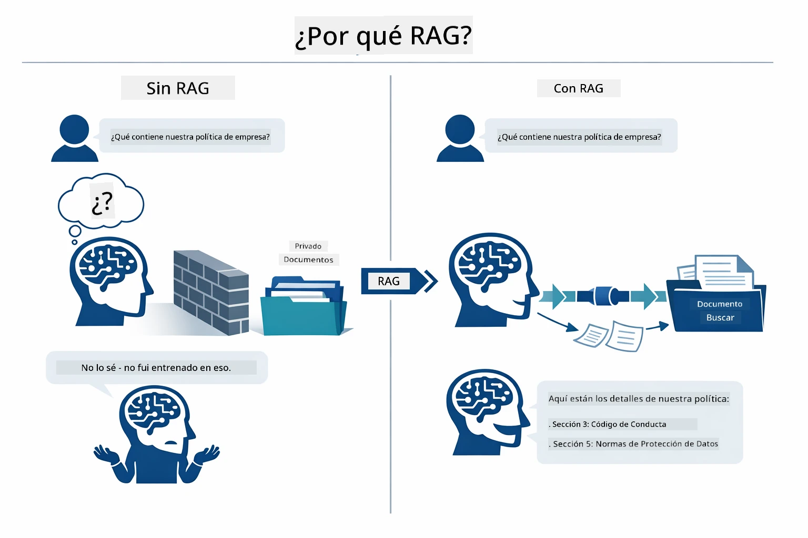

*Este diagrama muestra la diferencia entre un LLM estándar (que adivina a partir de datos de entrenamiento) y un LLM mejorado con RAG (que consulta primero tus documentos).*

Aquí se muestra cómo se conectan las piezas de principio a fin. La pregunta de un usuario pasa por cuatro etapas: embedding, búsqueda vectorial, ensamblaje del contexto y generación de respuesta — cada una construyendo sobre la anterior:


*Este diagrama muestra la pipeline completa de RAG — la consulta del usuario pasa por embedding, búsqueda vectorial, ensamblaje del contexto y generación de respuesta.*

El resto de este módulo recorre cada etapa en detalle, con código que puedes ejecutar y modificar.

### ¿Qué Enfoque RAG Usa Este Tutorial?

LangChain4j ofrece tres maneras de implementar RAG, cada una con un nivel diferente de abstracción. El diagrama a continuación los compara lado a lado:

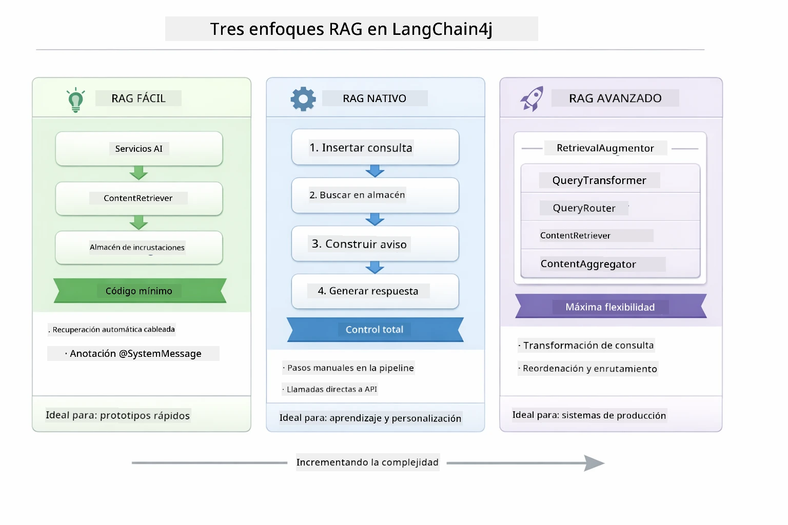

*Este diagrama compara los tres enfoques RAG de LangChain4j — Fácil, Nativo y Avanzado — mostrando sus componentes clave y cuándo usar cada uno.*

| Enfoque | Qué Hace | Compromiso |
|---|---|---|
| **Easy RAG** | Conecta todo automáticamente mediante `AiServices` y `ContentRetriever`. Anotas una interfaz, adjuntas un recuperador, y LangChain4j maneja embedding, búsqueda y ensamblaje del prompt detrás de escena. | Menor código, pero no ves lo que sucede en cada paso. |
| **Native RAG** | Llamas tú mismo al modelo de embedding, buscas en el almacén, construyes el prompt y generas la respuesta — paso explícito por paso. | Más código, pero cada etapa es visible y modificable. |
| **Advanced RAG** | Usa el framework `RetrievalAugmentor` con transformadores de consulta enchufables, enrutadores, reordenadores e inyectores de contenido para pipelines de producción. | Máxima flexibilidad, pero con mucha más complejidad. |

**Este tutorial usa el enfoque Nativo.** Cada paso del pipeline RAG — embedding de la consulta, búsqueda en el almacén vectorial, ensamblaje del contexto, y generación de la respuesta — está explícitamente escrito en [`RagService.java`](../../../03-rag/src/main/java/com/example/langchain4j/rag/service/RagService.java). Esto es intencional: como recurso de aprendizaje, es más importante que veas y entiendas cada etapa que minimizar el código. Una vez que te sientas cómodo con cómo encajan las piezas, puedes avanzar al Easy RAG para prototipos rápidos o al Advanced RAG para sistemas en producción.

> **💡 ¿Ya viste Easy RAG en acción?** El [módulo de Inicio Rápido](../00-quick-start/README.md) incluye un ejemplo de Preguntas y Respuestas de Documentos ([`SimpleReaderDemo.java`](../../../00-quick-start/src/main/java/com/example/langchain4j/quickstart/SimpleReaderDemo.java)) que usa el enfoque Easy RAG — LangChain4j maneja automáticamente embedding, búsqueda y ensamblaje del prompt. Este módulo da el siguiente paso al abrir ese pipeline para que puedas ver y controlar cada etapa tú mismo.

El diagrama a continuación muestra el pipeline Easy RAG de ese ejemplo de Inicio Rápido. Nota cómo `AiServices` y `EmbeddingStoreContentRetriever` ocultan toda la complejidad — cargas un documento, adjuntas un recuperador y obtienes respuestas. El enfoque Nativo en este módulo desglosa cada uno de esos pasos ocultos:

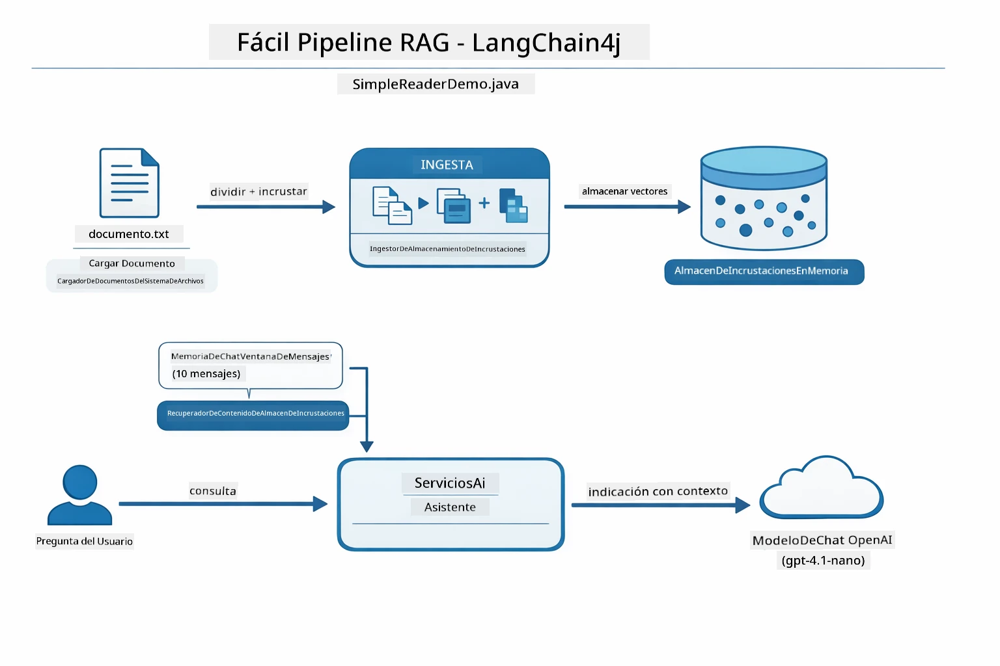

*Este diagrama muestra el pipeline Easy RAG de `SimpleReaderDemo.java`. Compara esto con el enfoque Nativo usado en este módulo: Easy RAG oculta embedding, recuperación y ensamblaje del prompt detrás de `AiServices` y `ContentRetriever` — cargas un documento, adjuntas un recuperador y obtienes respuestas. El enfoque Nativo en este módulo descompone ese pipeline para que llames cada etapa (embedding, búsqueda, ensamblaje del contexto, generación) tú mismo, proporcionándote plena visibilidad y control.*

## Cómo Funciona

El pipeline RAG en este módulo se divide en cuatro etapas que se ejecutan en secuencia cada vez que un usuario hace una pregunta. Primero, un documento subido es **analizado y segmentado** en partes manejables. Esos fragmentos se convierten en **embeddings vectoriales** y se almacenan para poder compararse matemáticamente. Cuando llega una consulta, el sistema realiza una **búsqueda semántica** para encontrar los fragmentos más relevantes, y finalmente los pasa como contexto al LLM para **generar la respuesta**. Las secciones siguientes recorren cada etapa con el código real y diagramas. Veamos el primer paso.

### Procesamiento de Documentos

[DocumentService.java](../../../03-rag/src/main/java/com/example/langchain4j/rag/service/DocumentService.java)

Cuando subes un documento, el sistema lo analiza (PDF o texto plano), le adjunta metadatos como el nombre del archivo, y luego lo divide en fragmentos — piezas más pequeñas que caben cómodamente en la ventana de contexto del modelo. Estos fragmentos se superponen ligeramente para que no se pierda contexto en los límites.

```java
// Analizar el archivo cargado y envolverlo en un Documento LangChain4j
Document document = Document.from(content, metadata);

// Dividir en fragmentos de 300 tokens con una superposición de 30 tokens
DocumentSplitter splitter = DocumentSplitters
    .recursive(300, 30);

List<TextSegment> segments = splitter.split(document);
```

El diagrama a continuación muestra cómo funciona esto visualmente. Observa cómo cada fragmento comparte algunos tokens con sus vecinos — la superposición de 30 tokens asegura que no se pierda contexto importante entre los cortes:

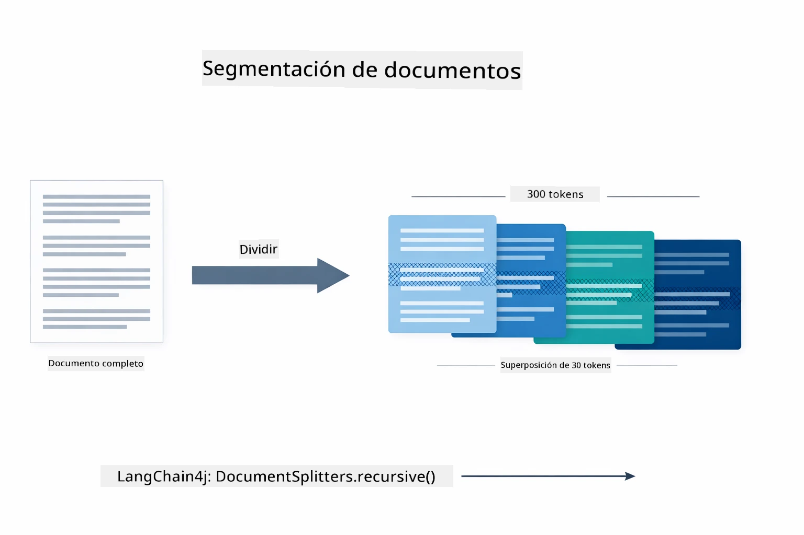

*Este diagrama muestra un documento dividido en fragmentos de 300 tokens con superposición de 30 tokens, preservando el contexto en los límites del fragmento.*

> **🤖 Prueba con [GitHub Copilot](https://github.com/features/copilot) Chat:** Abre [`DocumentService.java`](../../../03-rag/src/main/java/com/example/langchain4j/rag/service/DocumentService.java) y pregunta:  
> - "¿Cómo divide LangChain4j los documentos en fragmentos y por qué es importante la superposición?"  
> - "¿Cuál es el tamaño óptimo de fragmento para diferentes tipos de documentos y por qué?"  
> - "¿Cómo manejo documentos en varios idiomas o con formato especial?"

### Creación de Embeddings

[LangChainRagConfig.java](../../../03-rag/src/main/java/com/example/langchain4j/rag/config/LangChainRagConfig.java)

Cada fragmento se convierte en una representación numérica llamada embedding — esencialmente un convertidor de significado a números. El modelo de embedding no es "inteligente" como un modelo de chat; no puede seguir instrucciones, razonar o responder preguntas. Lo que puede hacer es mapear texto a un espacio matemático donde significados similares quedan cerca unos de otros — “coche” cerca de “automóvil”, “política de reembolso” cerca de “devuélveme el dinero.” Piensa en un modelo de chat como una persona con quien puedes hablar; un modelo de embedding es un sistema de archivo ultra-eficiente.

El diagrama a continuación visualiza este concepto — entra texto, salen vectores numéricos, y significados similares producen vectores cercanos:

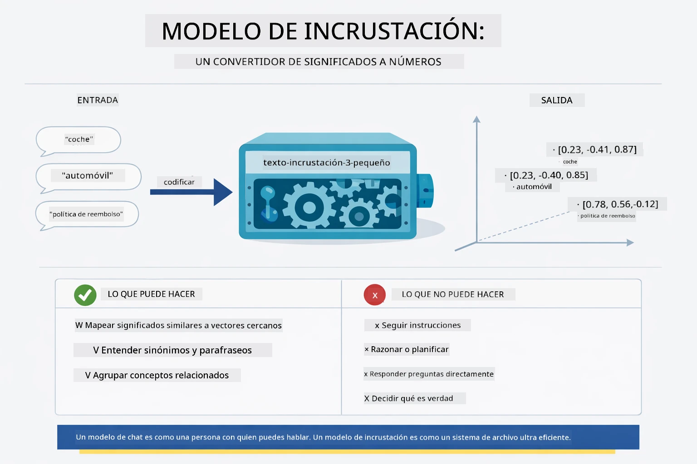

*Este diagrama muestra cómo un modelo de embedding convierte texto en vectores numéricos, ubicando significados similares — como “coche” y “automóvil” — cerca uno del otro en el espacio vectorial.*

```java
@Bean
public EmbeddingModel embeddingModel() {
    return OpenAiOfficialEmbeddingModel.builder()
        .baseUrl(azureOpenAiEndpoint)
        .apiKey(azureOpenAiKey)
        .modelName(azureEmbeddingDeploymentName)
        .build();
}

EmbeddingStore<TextSegment> embeddingStore = 
    new InMemoryEmbeddingStore<>();
```

El diagrama de clases a continuación muestra los dos flujos separados en un pipeline RAG y las clases LangChain4j que los implementan. El **flujo de ingestión** (se ejecuta una vez al subir) divide el documento, embebe los fragmentos, y los almacena vía `.addAll()`. El **flujo de consulta** (se ejecuta cada vez que un usuario pregunta) embebe la pregunta, busca en el almacén vía `.search()`, y pasa el contexto encontrado al modelo de chat. Ambos flujos se conectan por la interfaz compartida `EmbeddingStore<TextSegment>`:

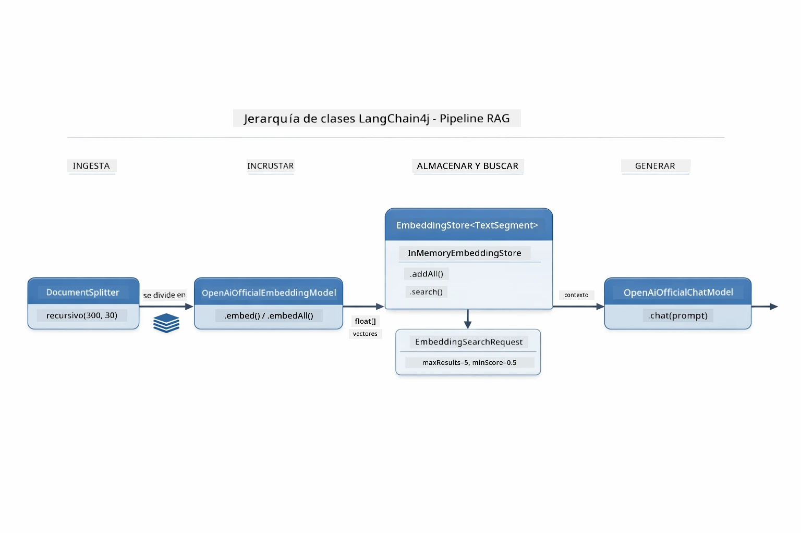

*Este diagrama muestra los dos flujos en un pipeline RAG — ingestión y consulta — y cómo se conectan a través de un EmbeddingStore compartido.*

Una vez que los embeddings están almacenados, el contenido similar naturalmente se agrupa en el espacio vectorial. La visualización a continuación muestra cómo documentos sobre temas relacionados terminan como puntos cercanos, lo que hace posible la búsqueda semántica:


*Esta visualización muestra cómo documentos relacionados se agrupan juntos en espacio vectorial 3D, con temas como Documentación Técnica, Reglas de Negocio y Preguntas Frecuentes formando grupos distintos.*

Cuando un usuario realiza una búsqueda, el sistema sigue cuatro pasos: embebe los documentos una vez, embebe la consulta en cada búsqueda, compara el vector de la consulta contra todos los vectores almacenados usando similitud coseno, y devuelve los fragmentos con los puntajes más altos (top-K). El diagrama a continuación describe cada paso y las clases LangChain4j involucradas:

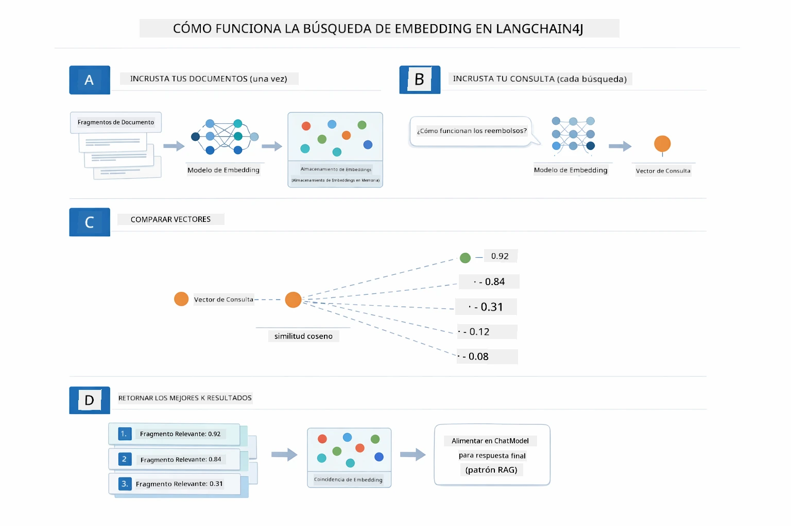

*Este diagrama muestra el proceso de búsqueda por embedding en cuatro pasos: embedear documentos, embedear la consulta, comparar vectores con similitud coseno, y devolver los mejores resultados.*

### Búsqueda Semántica

[RagService.java](../../../03-rag/src/main/java/com/example/langchain4j/rag/service/RagService.java)

Cuando haces una pregunta, tu consulta también se convierte en un embedding. El sistema compara el embedding de tu pregunta contra los embeddings de todos los fragmentos. Encuentra los fragmentos con los significados más similares — no solo coincidencias de palabras clave, sino similitud semántica real.

```java
Embedding queryEmbedding = embeddingModel.embed(question).content();

EmbeddingSearchRequest searchRequest = EmbeddingSearchRequest.builder()
    .queryEmbedding(queryEmbedding)
    .maxResults(5)
    .minScore(0.5)
    .build();

EmbeddingSearchResult<TextSegment> searchResult = embeddingStore.search(searchRequest);
List<EmbeddingMatch<TextSegment>> matches = searchResult.matches();

for (EmbeddingMatch<TextSegment> match : matches) {
    String relevantText = match.embedded().text();
    double score = match.score();
}
```

El diagrama a continuación contrasta la búsqueda semántica con la búsqueda tradicional por palabras clave. Una búsqueda por palabra clave de “vehículo” no encuentra un fragmento sobre “coches y camiones,” pero la búsqueda semántica entiende que significan lo mismo y lo devuelve como resultado con alta puntuación:

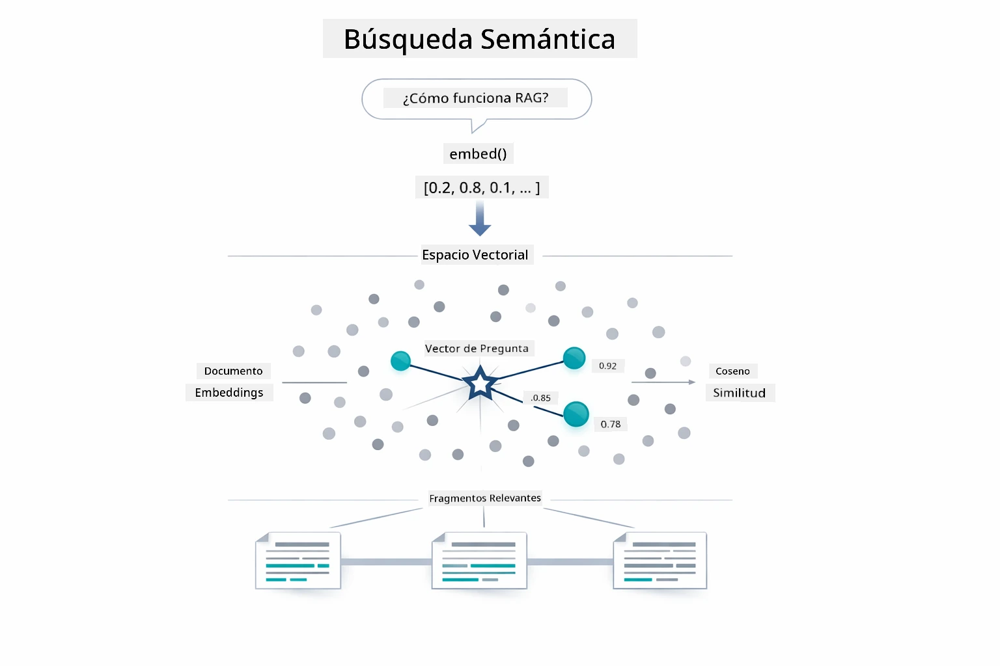

*Este diagrama compara la búsqueda basada en palabras clave con la búsqueda semántica, mostrando cómo la búsqueda semántica recupera contenido conceptualmente relacionado incluso cuando las palabras clave exactas difieren.*
Bajo el capó, la similitud se mide usando la similitud coseno: básicamente preguntando "¿están estas dos flechas apuntando en la misma dirección?" Dos fragmentos pueden usar palabras completamente diferentes, pero si significan lo mismo sus vectores apuntan en la misma dirección y obtienen una puntuación cercana a 1.0:

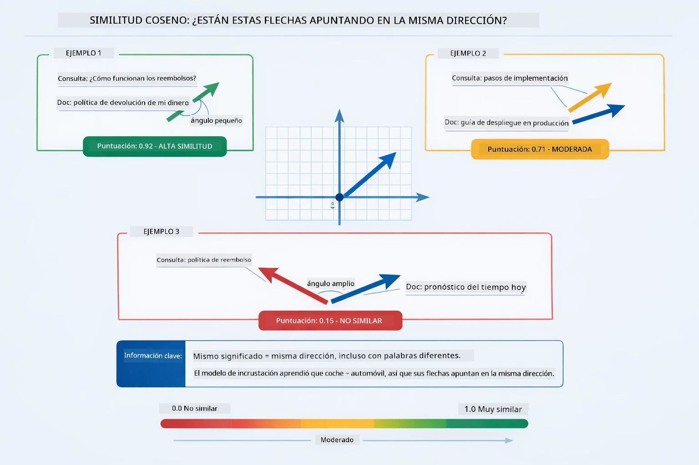

*Este diagrama ilustra la similitud coseno como el ángulo entre vectores de incrustaciones — vectores más alineados obtienen puntuaciones más cercanas a 1.0, indicando mayor similitud semántica.*

> **🤖 Prueba con [GitHub Copilot](https://github.com/features/copilot) Chat:** Abre [`RagService.java`](../../../03-rag/src/main/java/com/example/langchain4j/rag/service/RagService.java) y pregunta:
> - "¿Cómo funciona la búsqueda por similitud con embeddings y qué determina la puntuación?"
> - "¿Qué umbral de similitud debería usar y cómo afecta los resultados?"
> - "¿Cómo manejo casos donde no se encuentran documentos relevantes?"

### Generación de Respuestas

[RagService.java](../../../03-rag/src/main/java/com/example/langchain4j/rag/service/RagService.java)

Los fragmentos más relevantes se ensamblan en un prompt estructurado que incluye instrucciones explícitas, el contexto recuperado y la pregunta del usuario. El modelo lee esos fragmentos específicos y responde basado en esa información — solo puede usar lo que tiene frente a sí, lo que previene alucinaciones.

```java
String context = matches.stream()
    .map(match -> match.embedded().text())
    .collect(Collectors.joining("\n\n"));

String prompt = String.format("""
    Answer the question based on the following context.
    If the answer cannot be found in the context, say so.

    Context:
    %s

    Question: %s

    Answer:""", context, request.question());

String answer = chatModel.chat(prompt);
```

El diagrama a continuación muestra este ensamblaje en acción — los fragmentos con la puntuación más alta del paso de búsqueda se inyectan en la plantilla de prompt, y el `OpenAiOfficialChatModel` genera una respuesta fundamentada:

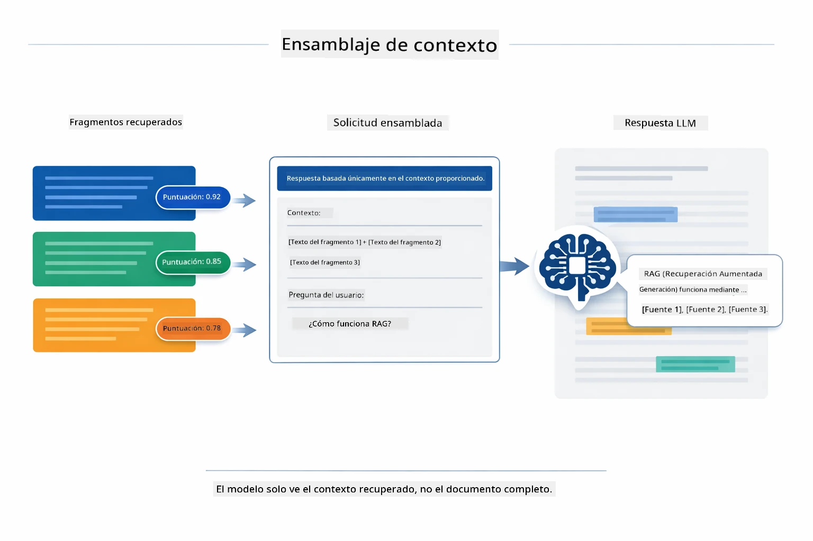

*Este diagrama muestra cómo los fragmentos con mayor puntuación se ensamblan en un prompt estructurado, permitiendo que el modelo genere una respuesta fundamentada a partir de tus datos.*

## Ejecutar la Aplicación

**Verificar despliegue:**

Asegúrate de que el archivo `.env` exista en el directorio raíz con las credenciales de Azure (creado durante el Módulo 01). Ejecuta esto desde el directorio del módulo (`03-rag/`):

**Bash:**
```bash
cat ../.env  # Debe mostrar AZURE_OPENAI_ENDPOINT, API_KEY, DEPLOYMENT
```

**PowerShell:**
```powershell
Get-Content ..\.env  # Debe mostrar AZURE_OPENAI_ENDPOINT, API_KEY, DEPLOYMENT
```

**Iniciar la aplicación:**

> **Nota:** Si ya iniciaste todas las aplicaciones usando `./start-all.sh` desde el directorio raíz (como se describe en el Módulo 01), este módulo ya está corriendo en el puerto 8081. Puedes omitir los comandos de inicio a continuación e ir directamente a http://localhost:8081.

**Opción 1: Usando Spring Boot Dashboard (Recomendado para usuarios de VS Code)**

El contenedor de desarrollo incluye la extensión Spring Boot Dashboard, que ofrece una interfaz visual para administrar todas las aplicaciones Spring Boot. Puedes encontrarla en la Barra de Actividad al lado izquierdo de VS Code (busca el ícono de Spring Boot).

Desde Spring Boot Dashboard, puedes:
- Ver todas las aplicaciones Spring Boot disponibles en el espacio de trabajo
- Iniciar/detener aplicaciones con un solo clic
- Ver los logs de la aplicación en tiempo real
- Monitorear el estado de la aplicación

Simplemente haz clic en el botón de reproducir junto a "rag" para iniciar este módulo, o inicia todos los módulos a la vez.


*Esta captura de pantalla muestra el panel de control Spring Boot en VS Code, donde puedes iniciar, detener y monitorear aplicaciones visualmente.*

**Opción 2: Usando scripts shell**

Inicia todas las aplicaciones web (módulos 01-04):

**Bash:**
```bash
cd ..  # Desde el directorio raíz
./start-all.sh
```

**PowerShell:**
```powershell
cd ..  # Desde el directorio raíz
.\start-all.ps1
```

O inicia solo este módulo:

**Bash:**
```bash
cd 03-rag
./start.sh
```

**PowerShell:**
```powershell
cd 03-rag
.\start.ps1
```

Ambos scripts cargan automáticamente las variables de entorno del archivo `.env` raíz y construirán los JAR si no existen.

> **Nota:** Si prefieres construir todos los módulos manualmente antes de iniciar:
>
> **Bash:**
> ```bash
> cd ..  # Go to root directory
> mvn clean package -DskipTests
> ```
>
> **PowerShell:**
> ```powershell
> cd ..  # Go to root directory
> mvn clean package -DskipTests
> ```

Abre http://localhost:8081 en tu navegador.

**Para detener:**

**Bash:**
```bash
./stop.sh  # Solo este módulo
# O
cd .. && ./stop-all.sh  # Todos los módulos
```

**PowerShell:**
```powershell
.\stop.ps1  # Solo este módulo
# O
cd ..; .\stop-all.ps1  # Todos los módulos
```

## Uso de la Aplicación

La aplicación proporciona una interfaz web para subir documentos y hacer preguntas.

<a href="images/rag-homepage.png"></a>

*Esta captura de pantalla muestra la interfaz de la aplicación RAG donde subes documentos y haces preguntas.*

### Subir un Documento

Comienza subiendo un documento - los archivos TXT funcionan mejor para pruebas. Se proporciona un `sample-document.txt` en este directorio que contiene información sobre características de LangChain4j, implementación RAG y mejores prácticas - perfecto para probar el sistema.

El sistema procesa tu documento, lo divide en fragmentos y crea embeddings para cada fragmento. Esto sucede automáticamente cuando subes el archivo.

### Hacer Preguntas

Ahora formula preguntas específicas sobre el contenido del documento. Intenta algo factual que esté claramente indicado en el documento. El sistema busca fragmentos relevantes, los incluye en el prompt y genera una respuesta.

### Verificar Referencias de Fuente

Nota que cada respuesta incluye referencias de fuente con puntuaciones de similitud. Estas puntuaciones (de 0 a 1) muestran qué tan relevante fue cada fragmento para tu pregunta. Puntuaciones más altas significan mejores coincidencias. Esto te permite verificar la respuesta contra el material fuente.

<a href="images/rag-query-results.png"></a>

*Esta captura de pantalla muestra los resultados de la consulta con la respuesta generada, referencias de fuente y puntuaciones de relevancia para cada fragmento recuperado.*

### Experimenta con Preguntas

Prueba diferentes tipos de preguntas:
- Hechos específicos: "¿Cuál es el tema principal?"
- Comparaciones: "¿Cuál es la diferencia entre X y Y?"
- Resúmenes: "Resume los puntos clave sobre Z"

Observa cómo cambian las puntuaciones de relevancia según qué tan bien tu pregunta coincide con el contenido del documento.

## Conceptos Clave

### Estrategia de Fragmentación

Los documentos se dividen en fragmentos de 300 tokens con 30 tokens de solapamiento. Este equilibrio asegura que cada fragmento tenga suficiente contexto para ser significativo mientras permanece lo suficientemente pequeño para incluir varios fragmentos en un prompt.

### Puntuaciones de Similitud

Cada fragmento recuperado viene con una puntuación de similitud entre 0 y 1 que indica qué tan cerca coincide con la pregunta del usuario. El diagrama a continuación visualiza los rangos de puntuación y cómo el sistema los usa para filtrar resultados:

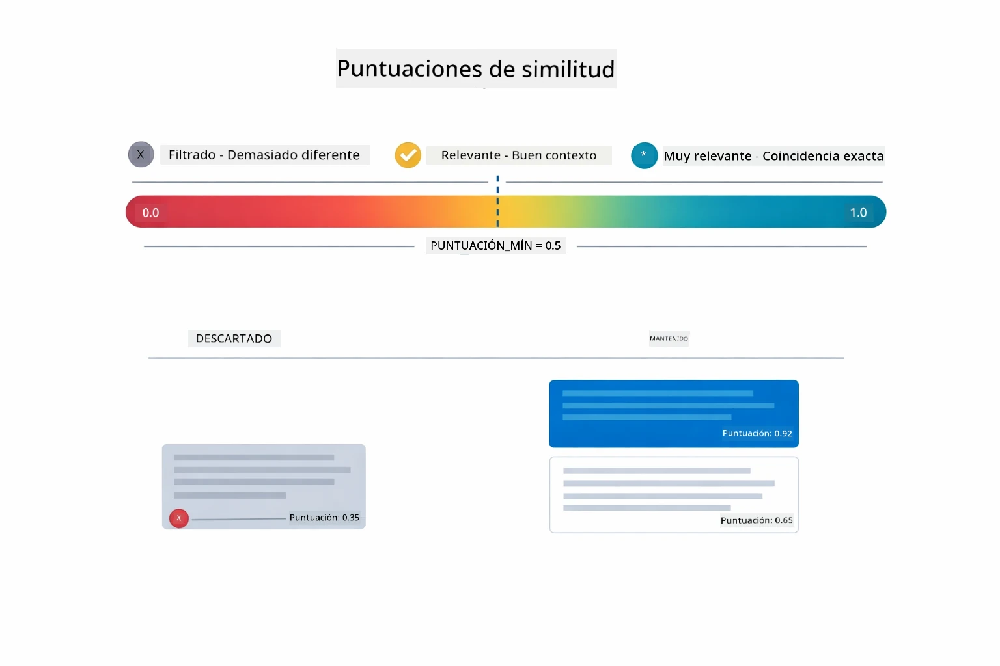

*Este diagrama muestra rangos de puntuación de 0 a 1, con un umbral mínimo de 0.5 que filtra fragmentos irrelevantes.*

Las puntuaciones van de 0 a 1:
- 0.7-1.0: Altamente relevante, coincidencia exacta
- 0.5-0.7: Relevante, buen contexto
- Por debajo de 0.5: Filtrado, demasiado disímil

El sistema solo recupera fragmentos por encima del umbral mínimo para garantizar calidad.

Los embeddings funcionan bien cuando el significado se agrupa claramente, pero tienen puntos ciegos. El diagrama a continuación muestra los modos comunes de falla: fragmentos demasiado grandes producen vectores imprecisos, fragmentos muy pequeños carecen de contexto, términos ambiguos apuntan a múltiples grupos, y las búsquedas de coincidencia exacta (IDs, números de parte) no funcionan con embeddings en absoluto:

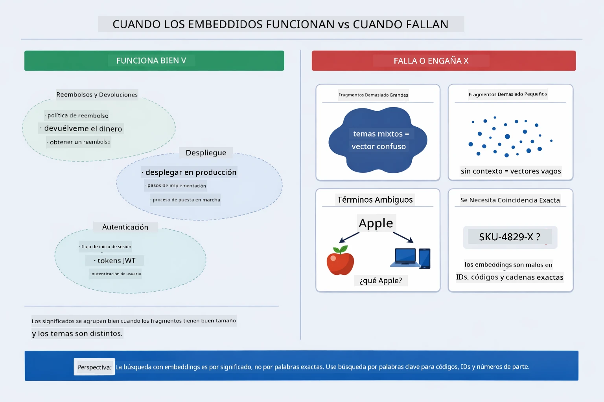

*Este diagrama muestra modos comunes de falla de embeddings: fragmentos demasiado grandes, fragmentos demasiado pequeños, términos ambiguos que apuntan a múltiples grupos, y búsquedas de coincidencia exacta como IDs.*

### Almacenamiento en Memoria

Este módulo usa almacenamiento en memoria para simplicidad. Cuando reinicias la aplicación, los documentos subidos se pierden. Los sistemas en producción usan bases de datos vectoriales persistentes como Qdrant o Azure AI Search.

### Gestión de la Ventana de Contexto

Cada modelo tiene una ventana máxima de contexto. No puedes incluir todos los fragmentos de un documento grande. El sistema recupera los N fragmentos más relevantes (por defecto 5) para mantenerse dentro de los límites mientras proporciona suficiente contexto para respuestas precisas.

## Cuándo Importa RAG

RAG no siempre es el enfoque correcto. La guía de decisiones a continuación te ayuda a determinar cuándo RAG agrega valor frente a cuándo enfoques más simples — como incluir contenido directamente en el prompt o confiar en el conocimiento incorporado del modelo — son suficientes:

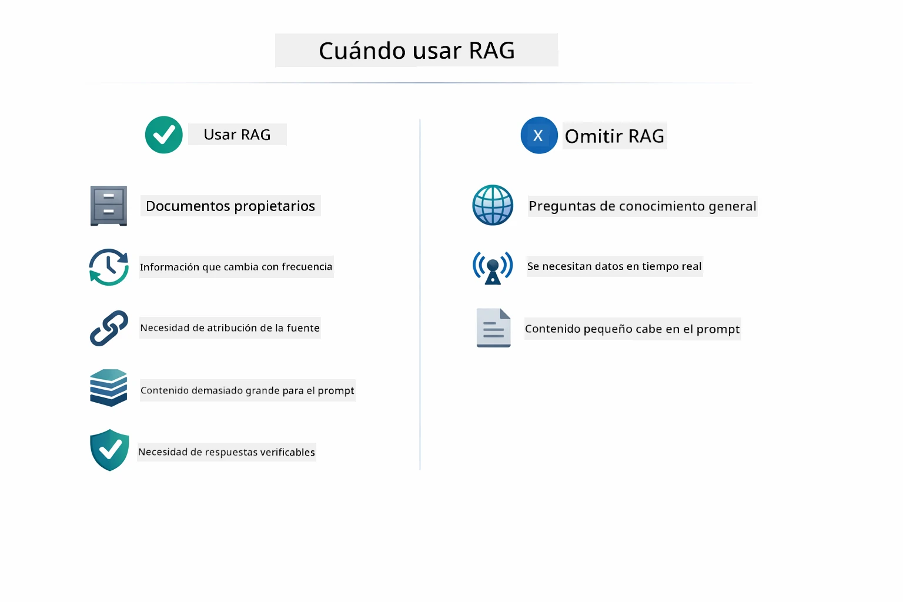

*Este diagrama muestra una guía de decisión para cuándo RAG agrega valor versus cuándo enfoques más simples son suficientes.*

## Próximos Pasos

**Próximo Módulo:** [04-tools - Agentes de IA con Herramientas](../04-tools/README.md)

---

**Navegación:** [← Anterior: Módulo 02 - Ingeniería de Prompts](../02-prompt-engineering/README.md) | [Volver al Inicio](../README.md) | [Siguiente: Módulo 04 - Herramientas →](../04-tools/README.md)

---

<!-- CO-OP TRANSLATOR DISCLAIMER START -->
**Aviso Legal**:  
Este documento ha sido traducido utilizando el servicio de traducción automática [Co-op Translator](https://github.com/Azure/co-op-translator). Aunque nos esforzamos por la precisión, tenga en cuenta que las traducciones automatizadas pueden contener errores o inexactitudes. El documento original en su idioma nativo debe considerarse la fuente autorizada. Para información crítica, se recomienda la traducción profesional realizada por un humano. No somos responsables de ningún malentendido o interpretación errónea derivada del uso de esta traducción.
<!-- CO-OP TRANSLATOR DISCLAIMER END -->