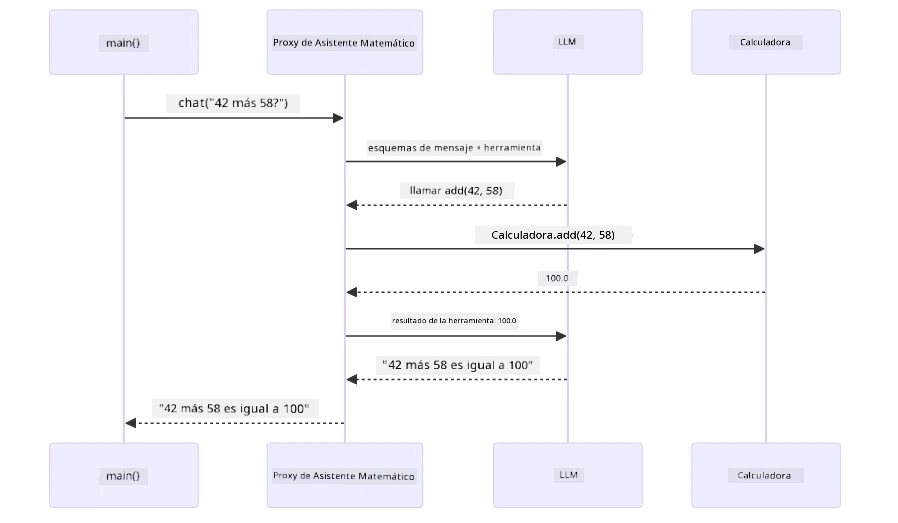
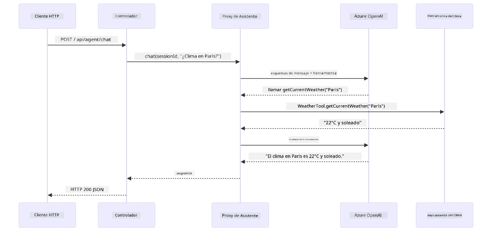

# Módulo 04: Agentes de IA con Herramientas

## Tabla de Contenidos

- [Lo que Aprenderás](../../../04-tools)
- [Requisitos Previos](../../../04-tools)
- [Entendiendo los Agentes de IA con Herramientas](../../../04-tools)
- [Cómo Funciona la Llamada a Herramientas](../../../04-tools)
  - [Definiciones de Herramientas](../../../04-tools)
  - [Toma de Decisiones](../../../04-tools)
  - [Ejecución](../../../04-tools)
  - [Generación de Respuesta](../../../04-tools)
  - [Arquitectura: Auto-Conexión de Spring Boot](../../../04-tools)
- [Encadenamiento de Herramientas](../../../04-tools)
- [Ejecutar la Aplicación](../../../04-tools)
- [Uso de la Aplicación](../../../04-tools)
  - [Prueba Uso Simple de Herramientas](../../../04-tools)
  - [Prueba Encadenamiento de Herramientas](../../../04-tools)
  - [Ver Flujo de Conversación](../../../04-tools)
  - [Experimenta con Diferentes Solicitudes](../../../04-tools)
- [Conceptos Clave](../../../04-tools)
  - [Patrón ReAct (Razonamiento y Acción)](../../../04-tools)
  - [Las Descripciones de las Herramientas Importan](../../../04-tools)
  - [Gestión de Sesiones](../../../04-tools)
  - [Manejo de Errores](../../../04-tools)
- [Herramientas Disponibles](../../../04-tools)
- [Cuándo Usar Agentes Basados en Herramientas](../../../04-tools)
- [Herramientas vs RAG](../../../04-tools)
- [Próximos Pasos](../../../04-tools)

## Lo que Aprenderás

Hasta ahora, has aprendido cómo mantener conversaciones con IA, estructurar indicaciones de manera efectiva y fundamentar respuestas en tus documentos. Pero aún hay una limitación fundamental: los modelos de lenguaje solo pueden generar texto. No pueden consultar el clima, realizar cálculos, consultar bases de datos o interactuar con sistemas externos.

Las herramientas cambian esto. Al darle al modelo acceso a funciones que puede llamar, lo transformas de un generador de texto en un agente que puede tomar acciones. El modelo decide cuándo necesita una herramienta, qué herramienta usar y qué parámetros pasar. Tu código ejecuta la función y retorna el resultado. El modelo incorpora ese resultado en su respuesta.

## Requisitos Previos

- Haber completado el [Módulo 01 - Introducción](../01-introduction/README.md) (recursos de Azure OpenAI desplegados)
- Se recomienda haber completado los módulos previos (este módulo referencia [conceptos RAG del Módulo 03](../03-rag/README.md) en la comparación Herramientas vs RAG)
- Archivo `.env` en el directorio raíz con credenciales de Azure (creado por `azd up` en el Módulo 01)

> **Nota:** Si no has completado el Módulo 01, sigue primero las instrucciones de despliegue allí.

## Entendiendo los Agentes de IA con Herramientas

> **📝 Nota:** El término "agentes" en este módulo se refiere a asistentes de IA mejorados con capacidades de llamada a herramientas. Esto es diferente de los patrones de **IA Agentica** (agentes autónomos con planificación, memoria y razonamiento multi-paso) que cubriremos en [Módulo 05: MCP](../05-mcp/README.md).

Sin herramientas, un modelo de lenguaje solo puede generar texto a partir de sus datos de entrenamiento. Pregúntale por el clima actual, y debe adivinar. Dale herramientas, y puede llamar a una API del clima, realizar cálculos o consultar una base de datos, luego incorporar esos resultados reales en su respuesta.


*Sin herramientas el modelo solo puede adivinar — con herramientas puede llamar APIs, ejecutar cálculos y devolver datos en tiempo real.*

Un agente de IA con herramientas sigue un patrón de **Razonamiento y Acción (ReAct)**. El modelo no solo responde — piensa qué necesita, actúa llamando una herramienta, observa el resultado y luego decide si actuar de nuevo o entregar la respuesta final:

1. **Razonar** — El agente analiza la pregunta del usuario y determina qué información necesita
2. **Actuar** — El agente selecciona la herramienta correcta, genera los parámetros adecuados y la llama
3. **Observar** — El agente recibe la salida de la herramienta y evalúa el resultado
4. **Repetir o Responder** — Si se necesita más información, el agente regresa al paso anterior; de lo contrario, compone una respuesta en lenguaje natural


*El ciclo ReAct — el agente razona sobre qué hacer, actúa llamando una herramienta, observa el resultado y repite hasta poder entregar la respuesta final.*

Esto sucede automáticamente. Definiste las herramientas y sus descripciones. El modelo maneja la toma de decisiones sobre cuándo y cómo usarlas.

## Cómo Funciona la Llamada a Herramientas

### Definiciones de Herramientas

[WeatherTool.java](../../../04-tools/src/main/java/com/example/langchain4j/agents/tools/WeatherTool.java) | [TemperatureTool.java](../../../04-tools/src/main/java/com/example/langchain4j/agents/tools/TemperatureTool.java)

Defines funciones con descripciones claras y especificaciones de parámetros. El modelo ve estas descripciones en su prompt del sistema y entiende qué hace cada herramienta.

```java
@Component
public class WeatherTool {
    
    @Tool("Get the current weather for a location")
    public String getCurrentWeather(@P("Location name") String location) {
        // Su lógica de consulta del clima
        return "Weather in " + location + ": 22°C, cloudy";
    }
}

@AiService
public interface Assistant {
    String chat(@MemoryId String sessionId, @UserMessage String message);
}

// Assistant está conectado automáticamente por Spring Boot con:
// - Bean ChatModel
// - Todos los métodos @Tool de las clases @Component
// - ChatMemoryProvider para la gestión de sesiones
```

El diagrama a continuación desglosa cada anotación y muestra cómo cada pieza ayuda a la IA a entender cuándo llamar a la herramienta y qué argumentos pasar:


*Anatomía de una definición de herramienta — @Tool indica a la IA cuándo usarla, @P describe cada parámetro, y @AiService conecta todo al iniciar.*

> **🤖 Prueba con [GitHub Copilot](https://github.com/features/copilot) Chat:** Abre [`WeatherTool.java`](../../../04-tools/src/main/java/com/example/langchain4j/agents/tools/WeatherTool.java) y pregunta:
> - "¿Cómo integraría una API real de clima como OpenWeatherMap en vez de datos simulados?"
> - "¿Qué hace que una buena descripción de herramienta ayude a la IA a usarla correctamente?"
> - "¿Cómo manejo errores de API y límites de tasa en las implementaciones de herramientas?"

### Toma de Decisiones

Cuando un usuario pregunta "¿Cuál es el clima en Seattle?", el modelo no escoge una herramienta al azar. Compara la intención del usuario contra cada descripción de herramienta disponible, asigna una puntuación de relevancia y selecciona la mejor coincidencia. Luego genera una llamada de función estructurada con los parámetros adecuados — en este caso, asignando `location` a `"Seattle"`.

Si ninguna herramienta coincide con la petición del usuario, el modelo responde con su propio conocimiento. Si varias herramientas coinciden, elige la más específica.


*El modelo evalúa cada herramienta disponible frente a la intención del usuario y selecciona la mejor coincidencia — por eso es importante escribir descripciones claras y específicas de las herramientas.*

### Ejecución

[AgentService.java](../../../04-tools/src/main/java/com/example/langchain4j/agents/service/AgentService.java)

Spring Boot auto-conecta la interfaz declarativa `@AiService` con todas las herramientas registradas, y LangChain4j ejecuta las llamadas a herramientas automáticamente. Detrás de escena, una llamada completa a herramienta fluye por seis etapas — desde la pregunta en lenguaje natural del usuario hasta la respuesta también en lenguaje natural:


*El flujo de extremo a extremo — el usuario hace una pregunta, el modelo selecciona una herramienta, LangChain4j la ejecuta, y el modelo incorpora el resultado en una respuesta natural.*

Si ejecutaste el [ToolIntegrationDemo](../../../00-quick-start/src/main/java/com/example/langchain4j/quickstart/ToolIntegrationDemo.java) en el Módulo 00, ya viste este patrón en acción — las herramientas `Calculator` fueron llamadas igual. El diagrama de secuencia a continuación muestra exactamente qué ocurrió durante esa demo:



*El ciclo de llamada a herramienta en la demo de Inicio Rápido — `AiServices` envía tu mensaje y esquemas de herramienta al LLM, el LLM responde con una llamada a función como `add(42, 58)`, LangChain4j ejecuta el método `Calculator` localmente, y devuelve el resultado para la respuesta final.*

> **🤖 Prueba con [GitHub Copilot](https://github.com/features/copilot) Chat:** Abre [`AgentService.java`](../../../04-tools/src/main/java/com/example/langchain4j/agents/service/AgentService.java) y pregunta:
> - "¿Cómo funciona el patrón ReAct y por qué es efectivo para agentes de IA?"
> - "¿Cómo decide el agente qué herramienta usar y en qué orden?"
> - "¿Qué sucede si la ejecución de una herramienta falla - cómo manejo errores robustamente?"

### Generación de Respuesta

El modelo recibe los datos del clima y los formatea en una respuesta en lenguaje natural para el usuario.

### Arquitectura: Auto-Conexión de Spring Boot

Este módulo usa la integración de LangChain4j con Spring Boot mediante interfaces declarativas `@AiService`. Al iniciar, Spring Boot descubre cada `@Component` que contiene métodos `@Tool`, tu bean `ChatModel` y el `ChatMemoryProvider` — luego conecta todo en una única interfaz `Assistant` sin código repetitivo.


*La interfaz @AiService une el ChatModel, componentes de herramientas y el proveedor de memoria — Spring Boot maneja toda la conexión automáticamente.*

Aquí está el ciclo completo de la solicitud como diagrama de secuencia — desde la solicitud HTTP, pasando por el controlador, servicio y proxy auto-conectado, hasta la ejecución de la herramienta y regreso:



*Ciclo completo de solicitud Spring Boot — la petición HTTP pasa por el controlador y servicio hacia el proxy Assistant auto-conectado, que orquesta el LLM y las llamadas a herramientas automáticamente.*

Beneficios clave de este enfoque:

- **Auto-conexión Spring Boot** — ChatModel y herramientas inyectadas automáticamente
- **Patrón @MemoryId** — Gestión automática de memoria basada en sesión
- **Instancia única** — Assistant creado una sola vez y reutilizado para mejor rendimiento
- **Ejecución con tipos seguros** — Métodos Java llamados directamente con conversión de tipos
- **Orquestación multi-turno** — Maneja encadenamiento de herramientas automáticamente
- **Cero código repetitivo** — Sin llamadas manuales a `AiServices.builder()` ni mapas de memoria

Enfoques alternativos (constructor manual `AiServices.builder()`) requieren más código y pierden los beneficios de integración con Spring Boot.

## Encadenamiento de Herramientas

**Encadenamiento de Herramientas** — El verdadero poder de los agentes basados en herramientas se muestra cuando una sola pregunta requiere múltiples herramientas. Pregunta "¿Cuál es el clima en Seattle en Fahrenheit?" y el agente encadena automáticamente dos herramientas: primero llama a `getCurrentWeather` para obtener la temperatura en Celsius, luego pasa ese valor a `celsiusToFahrenheit` para la conversión — todo en un solo turno de conversación.


*Encadenamiento de herramientas en acción — el agente llama primero a getCurrentWeather, luego pasa el resultado Celsius a celsiusToFahrenheit, y entrega una respuesta combinada.*

**Fallos Elegantes** — Pide el clima en una ciudad que no está en los datos simulados. La herramienta devuelve un mensaje de error, y la IA explica que no puede ayudar en lugar de causar un fallo. Las herramientas fallan de forma segura. El diagrama abajo compara ambos enfoques — con manejo de errores adecuado, el agente captura la excepción y responde con ayuda, mientras que sin manejo la aplicación completa falla:


*Cuando una herramienta falla, el agente captura el error y responde con una explicación útil en lugar de fallar.*

Esto sucede en un solo turno de conversación. El agente orquesta múltiples llamadas a herramientas autónomamente.

## Ejecutar la Aplicación

**Verificar despliegue:**

Asegúrate de que el archivo `.env` exista en el directorio raíz con credenciales de Azure (creado durante el Módulo 01). Ejecuta esto desde el directorio del módulo (`04-tools/`):

**Bash:**
```bash
cat ../.env  # Debe mostrar AZURE_OPENAI_ENDPOINT, API_KEY, DEPLOYMENT
```

**PowerShell:**
```powershell
Get-Content ..\.env  # Debería mostrar AZURE_OPENAI_ENDPOINT, API_KEY, DEPLOYMENT
```

**Iniciar la aplicación:**

> **Nota:** Si ya iniciaste todas las aplicaciones usando `./start-all.sh` desde el directorio raíz (como se describió en el Módulo 01), este módulo ya está corriendo en el puerto 8084. Puedes saltarte los comandos de inicio abajo e ir directamente a http://localhost:8084.

**Opción 1: Usar Spring Boot Dashboard (Recomendado para usuarios de VS Code)**

El contenedor de desarrollo incluye la extensión Spring Boot Dashboard, que brinda una interfaz visual para gestionar todas las aplicaciones Spring Boot. Puedes encontrarlo en la Barra de Actividad al lado izquierdo de VS Code (busca el ícono de Spring Boot).

Desde el Spring Boot Dashboard, puedes:
- Ver todas las aplicaciones Spring Boot disponibles en el espacio de trabajo
- Iniciar/detener aplicaciones con un clic
- Ver logs de aplicación en tiempo real
- Monitorear el estado de las aplicaciones

Solo haz clic en el botón de play junto a "tools" para iniciar este módulo, o inicia todos los módulos a la vez.

Así se ve el Spring Boot Dashboard en VS Code:


*El Spring Boot Dashboard en VS Code — inicia, detiene y monitorea todos los módulos desde un solo lugar*

**Opción 2: Usar scripts shell**

Inicia todas las aplicaciones web (módulos 01-04):

**Bash:**
```bash
cd ..  # Desde el directorio raíz
./start-all.sh
```

**PowerShell:**
```powershell
cd ..  # Desde el directorio raíz
.\start-all.ps1
```

O inicia solo este módulo:

**Bash:**
```bash
cd 04-tools
./start.sh
```

**PowerShell:**
```powershell
cd 04-tools
.\start.ps1
```

Ambos scripts cargan automáticamente las variables de entorno desde el archivo raíz `.env` y construirán los JARs si no existen.

> **Nota:** Si prefieres construir todos los módulos manualmente antes de iniciar:
>
> **Bash:**
> ```bash
> cd ..  # Go to root directory
> mvn clean package -DskipTests
> ```
>
> **PowerShell:**
> ```powershell
> cd ..  # Go to root directory
> mvn clean package -DskipTests
> ```

Abre http://localhost:8084 en tu navegador.

**Para detener:**

**Bash:**
```bash
./stop.sh  # Solo este módulo
# O
cd .. && ./stop-all.sh  # Todos los módulos
```

**PowerShell:**
```powershell
.\stop.ps1  # Solo este módulo
# O
cd ..; .\stop-all.ps1  # Todos los módulos
```

## Usando la Aplicación

La aplicación proporciona una interfaz web donde puedes interactuar con un agente de IA que tiene acceso a herramientas de clima y conversión de temperatura. Así es como se ve la interfaz — incluye ejemplos rápidos y un panel de chat para enviar solicitudes:

<a href="images/tools-homepage.png"></a>

*La interfaz de Herramientas del Agente de IA - ejemplos rápidos e interfaz de chat para interactuar con las herramientas*

### Prueba el Uso Simple de Herramientas

Comienza con una petición sencilla: "Convierte 100 grados Fahrenheit a Celsius". El agente reconoce que necesita la herramienta de conversión de temperatura, la llama con los parámetros correctos y devuelve el resultado. Observa lo natural que se siente — no especificaste qué herramienta usar ni cómo llamarla.

### Prueba la Cadena de Herramientas

Ahora prueba algo más complicado: "¿Cuál es el clima en Seattle y conviértelo a Fahrenheit?" Observa cómo el agente trabaja en pasos. Primero obtiene el clima (que retorna en Celsius), reconoce que necesita convertir a Fahrenheit, llama a la herramienta de conversión y combina ambos resultados en una sola respuesta.

### Ve el Flujo de la Conversación

La interfaz de chat mantiene el historial de la conversación, permitiéndote tener interacciones de múltiples turnos. Puedes ver todas las consultas y respuestas anteriores, facilitando el seguimiento de la conversación y entender cómo el agente construye contexto a través de varios intercambios.

<a href="images/tools-conversation-demo.png"></a>

*Conversación de múltiples turnos mostrando conversiones simples, consultas del clima y encadenamiento de herramientas*

### Experimenta con Diferentes Solicitudes

Prueba varias combinaciones:
- Consultas del clima: "¿Cómo está el clima en Tokio?"
- Conversiones de temperatura: "¿Cuánto es 25°C en Kelvin?"
- Consultas combinadas: "Revisa el clima en París y dime si está por encima de 20°C"

Observa cómo el agente interpreta el lenguaje natural y lo mapea a llamadas apropiadas de herramientas.

## Conceptos Clave

### Patrón ReAct (Razonar y Actuar)

El agente alterna entre razonar (decidir qué hacer) y actuar (usar herramientas). Este patrón permite la solución autónoma de problemas en lugar de solo responder a instrucciones.

### Las Descripciones de Herramientas Importan

La calidad de tus descripciones de herramientas afecta directamente qué tan bien el agente las usa. Descripciones claras y específicas ayudan al modelo a entender cuándo y cómo llamar cada herramienta.

### Gestión de Sesiones

La anotación `@MemoryId` habilita la gestión automática de memoria basada en sesión. Cada ID de sesión obtiene su propia instancia `ChatMemory` gestionada por el bean `ChatMemoryProvider`, por lo que múltiples usuarios pueden interactuar con el agente simultáneamente sin que sus conversaciones se mezclen. El siguiente diagrama muestra cómo múltiples usuarios son dirigidos a memorias aisladas basadas en sus IDs de sesión:


*Cada ID de sesión se mapea a un historial de conversación aislado — los usuarios nunca ven los mensajes de otros.*

### Manejo de Errores

Las herramientas pueden fallar — las APIs pueden expirar, los parámetros podrían ser inválidos, los servicios externos pueden caer. Los agentes de producción necesitan manejo de errores para que el modelo pueda explicar problemas o intentar alternativas en lugar de hacer que toda la aplicación falle. Cuando una herramienta lanza una excepción, LangChain4j la captura y envía el mensaje de error de vuelta al modelo, que luego puede explicar el problema en lenguaje natural.

## Herramientas Disponibles

El diagrama a continuación muestra el amplio ecosistema de herramientas que puedes construir. Este módulo demuestra herramientas de clima y temperatura, pero el mismo patrón `@Tool` funciona para cualquier método Java — desde consultas a bases de datos hasta procesamiento de pagos.


*Cualquier método Java anotado con @Tool se vuelve disponible para la IA — el patrón se extiende a bases de datos, APIs, correo electrónico, operaciones de archivos y más.*

## Cuándo Usar Agentes Basados en Herramientas

No todas las solicitudes necesitan herramientas. La decisión depende de si la IA necesita interactuar con sistemas externos o puede responder con su propio conocimiento. La siguiente guía resume cuándo las herramientas agregan valor y cuándo son innecesarias:


*Guía rápida de decisión — las herramientas son para datos en tiempo real, cálculos y acciones; el conocimiento general y tareas creativas no las necesitan.*

## Herramientas vs RAG

Los módulos 03 y 04 extienden lo que la IA puede hacer, pero de maneras fundamentalmente diferentes. RAG da al modelo acceso a **conocimiento** recuperando documentos. Las herramientas dan al modelo la capacidad de tomar **acciones** llamando funciones. El diagrama a continuación compara ambos enfoques uno al lado del otro — desde cómo opera cada flujo de trabajo hasta las compensaciones entre ellos:


*RAG recupera información de documentos estáticos — Las Herramientas ejecutan acciones y obtienen datos dinámicos, en tiempo real. Muchos sistemas de producción combinan ambos.*

En la práctica, muchos sistemas de producción combinan ambos enfoques: RAG para fundamentar respuestas en tu documentación, y Herramientas para obtener datos en vivo o realizar operaciones.

## Próximos Pasos

**Siguiente Módulo:** [05-mcp - Protocolo de Contexto del Modelo (MCP)](../05-mcp/README.md)

---

**Navegación:** [← Anterior: Módulo 03 - RAG](../03-rag/README.md) | [Volver al Inicio](../README.md) | [Siguiente: Módulo 05 - MCP →](../05-mcp/README.md)

---

<!-- CO-OP TRANSLATOR DISCLAIMER START -->
**Descargo de responsabilidad**:
Este documento ha sido traducido utilizando el servicio de traducción automática [Co-op Translator](https://github.com/Azure/co-op-translator). Aunque nos esforzamos por la precisión, tenga en cuenta que las traducciones automáticas pueden contener errores o inexactitudes. El documento original en su idioma nativo debe considerarse la fuente autorizada. Para información crítica, se recomienda una traducción profesional realizada por humanos. No nos hacemos responsables de malentendidos o interpretaciones erróneas que puedan surgir del uso de esta traducción.
<!-- CO-OP TRANSLATOR DISCLAIMER END -->