# Módulo 04: Agentes de IA con Herramientas

## Tabla de Contenidos

- [Lo que Aprenderás](../../../04-tools)
- [Prerequisitos](../../../04-tools)
- [Comprendiendo los Agentes de IA con Herramientas](../../../04-tools)
- [Cómo Funciona la Llamada a Herramientas](../../../04-tools)
  - [Definiciones de Herramientas](../../../04-tools)
  - [Toma de Decisiones](../../../04-tools)
  - [Ejecución](../../../04-tools)
  - [Generación de Respuestas](../../../04-tools)
  - [Arquitectura: Auto-Inyección en Spring Boot](../../../04-tools)
- [Encadenamiento de Herramientas](../../../04-tools)
- [Ejecutar la Aplicación](../../../04-tools)
- [Usando la Aplicación](../../../04-tools)
  - [Probar Uso Simple de Herramientas](../../../04-tools)
  - [Probar Encadenamiento de Herramientas](../../../04-tools)
  - [Ver Flujo de Conversación](../../../04-tools)
  - [Experimentar con Diferentes Solicitudes](../../../04-tools)
- [Conceptos Clave](../../../04-tools)
  - [Patrón ReAct (Razonamiento y Acción)](../../../04-tools)
  - [Las Descripciones de Herramientas Importan](../../../04-tools)
  - [Gestión de Sesiones](../../../04-tools)
  - [Manejo de Errores](../../../04-tools)
- [Herramientas Disponibles](../../../04-tools)
- [Cuándo Usar Agentes Basados en Herramientas](../../../04-tools)
- [Herramientas vs RAG](../../../04-tools)
- [Siguientes Pasos](../../../04-tools)

## Lo que Aprenderás

Hasta ahora, has aprendido cómo tener conversaciones con IA, estructurar indicaciones de manera efectiva y fundamentar respuestas en tus documentos. Pero aún existe una limitación fundamental: los modelos de lenguaje solo pueden generar texto. No pueden consultar el clima, realizar cálculos, consultar bases de datos o interactuar con sistemas externos.

Las herramientas cambian esto. Al dar acceso al modelo a funciones que puede llamar, lo transformas de un generador de texto en un agente que puede tomar acciones. El modelo decide cuándo necesita una herramienta, qué herramienta usar y qué parámetros pasar. Tu código ejecuta la función y devuelve el resultado. El modelo incorpora ese resultado en su respuesta.

## Prerequisitos

- Completar el Módulo 01 (recursos de Azure OpenAI desplegados)
- Archivo `.env` en el directorio raíz con credenciales de Azure (creado por `azd up` en el Módulo 01)

> **Nota:** Si no has completado el Módulo 01, sigue primero las instrucciones de despliegue ahí.

## Comprendiendo los Agentes de IA con Herramientas

> **📝 Nota:** El término "agentes" en este módulo se refiere a asistentes de IA mejorados con capacidades para invocar herramientas. Esto es diferente de los patrones de **Agentic AI** (agentes autónomos con planeación, memoria y razonamiento en múltiples pasos) que cubriremos en [Módulo 05: MCP](../05-mcp/README.md).

Sin herramientas, un modelo de lenguaje solo puede generar texto basado en sus datos de entrenamiento. Pregúntale por el clima actual y tiene que adivinar. Dale herramientas, y puede llamar a una API del clima, hacer cálculos o consultar una base de datos — luego integrar esos resultados reales en su respuesta.

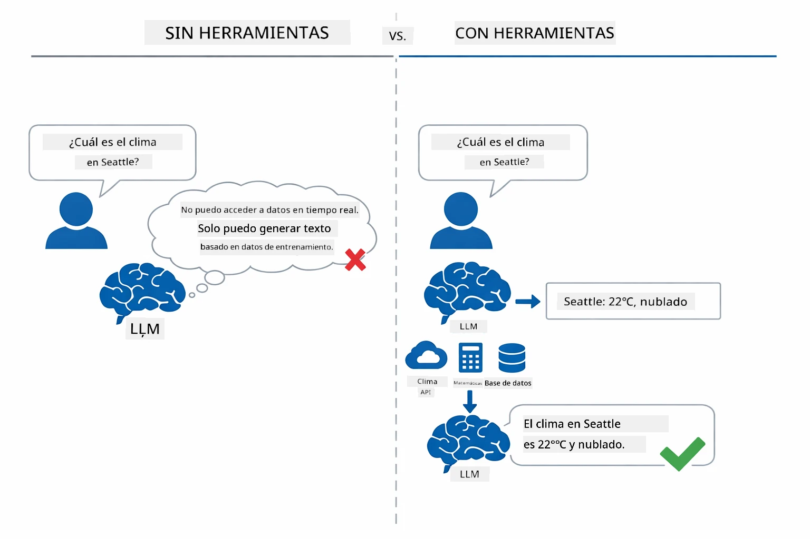

*Sin herramientas el modelo solo puede adivinar — con herramientas puede llamar APIs, realizar cálculos y devolver datos en tiempo real.*

Un agente de IA con herramientas sigue un patrón **Razonamiento y Acción (ReAct)**. El modelo no solo responde — piensa en lo que necesita, actúa llamando una herramienta, observa el resultado y luego decide si actuar de nuevo o entregar la respuesta final:

1. **Razonar** — El agente analiza la pregunta del usuario y determina qué información necesita
2. **Actuar** — El agente selecciona la herramienta adecuada, genera los parámetros correctos y la llama
3. **Observar** — El agente recibe la salida de la herramienta y evalúa el resultado
4. **Repetir o Responder** — Si necesita más datos, regresa al inicio; de lo contrario, compone una respuesta en lenguaje natural

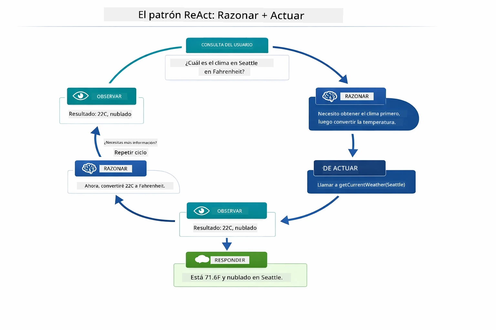

*El ciclo ReAct — el agente razona qué hacer, actúa llamando una herramienta, observa el resultado y repite hasta entregar la respuesta final.*

Esto sucede automáticamente. Definiste las herramientas y sus descripciones. El modelo maneja la toma de decisiones sobre cuándo y cómo usarlas.

## Cómo Funciona la Llamada a Herramientas

### Definiciones de Herramientas

[WeatherTool.java](../../../04-tools/src/main/java/com/example/langchain4j/agents/tools/WeatherTool.java) | [TemperatureTool.java](../../../04-tools/src/main/java/com/example/langchain4j/agents/tools/TemperatureTool.java)

Defines funciones con descripciones claras y especificaciones de parámetros. El modelo ve estas descripciones en su indicación de sistema y entiende qué hace cada herramienta.

```java
@Component
public class WeatherTool {
    
    @Tool("Get the current weather for a location")
    public String getCurrentWeather(@P("Location name") String location) {
        // Tu lógica de búsqueda meteorológica
        return "Weather in " + location + ": 22°C, cloudy";
    }
}

@AiService
public interface Assistant {
    String chat(@MemoryId String sessionId, @UserMessage String message);
}

// El asistente está automáticamente conectado por Spring Boot con:
// - Bean ChatModel
// - Todos los métodos @Tool de las clases @Component
// - ChatMemoryProvider para la gestión de sesiones
```

El siguiente diagrama desglosa cada anotación y muestra cómo cada elemento ayuda a la IA a entender cuándo llamar la herramienta y qué argumentos pasar:

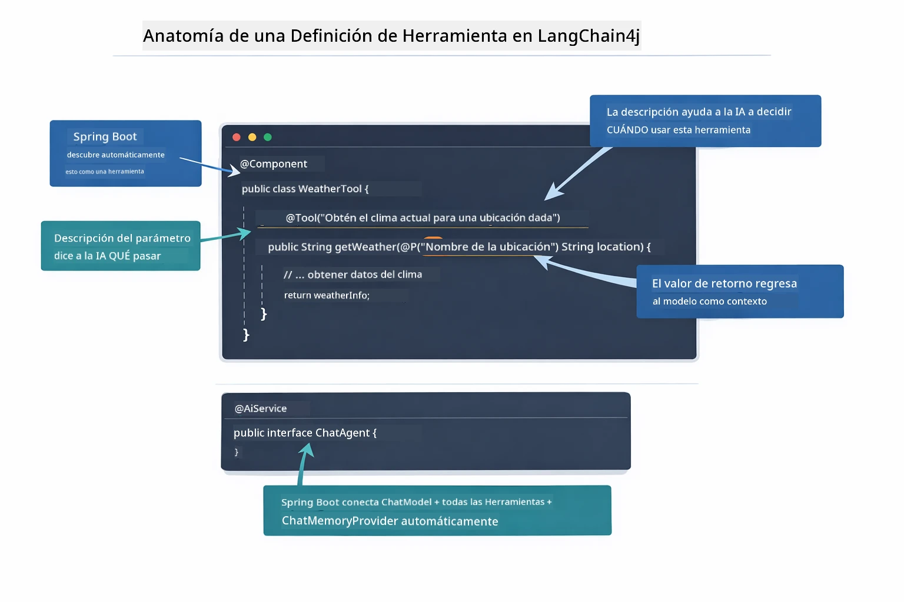

*Anatomía de una definición de herramienta — @Tool indica a la IA cuándo usarla, @P describe cada parámetro y @AiService conecta todo al iniciar.*

> **🤖 Prueba con [GitHub Copilot](https://github.com/features/copilot) Chat:** Abre [`WeatherTool.java`](../../../04-tools/src/main/java/com/example/langchain4j/agents/tools/WeatherTool.java) y pregunta:
> - "¿Cómo integraría una API real del clima como OpenWeatherMap en lugar de datos simulados?"
> - "¿Qué hace que una buena descripción de herramienta ayude a la IA a usarla correctamente?"
> - "¿Cómo manejo errores de API y límites de tasa en implementaciones de herramientas?"

### Toma de Decisiones

Cuando un usuario pregunta "¿Cuál es el clima en Seattle?", el modelo no escoge una herramienta al azar. Compara la intención del usuario con cada descripción de herramienta a la que tiene acceso, puntúa cada una según relevancia y selecciona la mejor coincidencia. Luego genera una llamada de función estructurada con los parámetros correctos — en este caso, configurando `location` como `"Seattle"`.

Si ninguna herramienta coincide con la petición del usuario, el modelo recurre a responder con su propio conocimiento. Si varias herramientas coinciden, escoge la más específica.

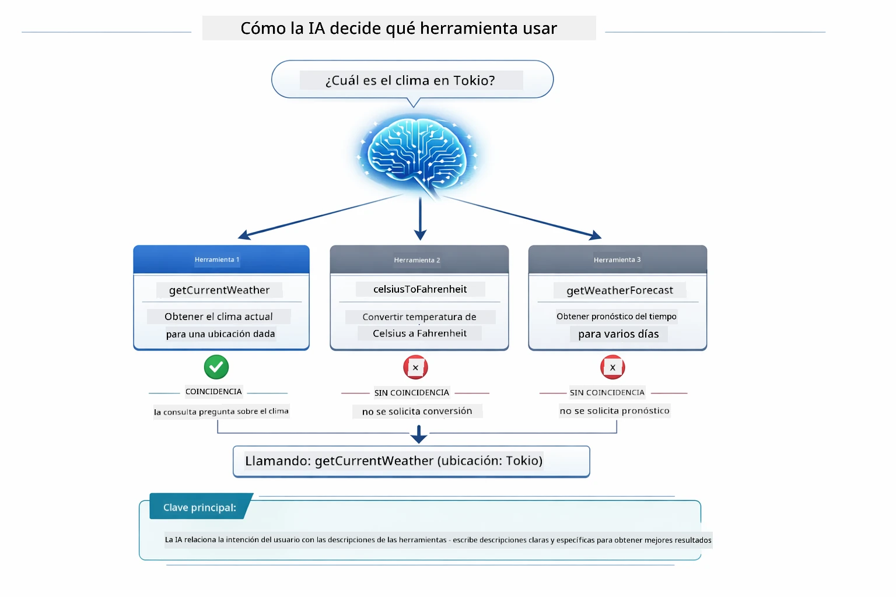

*El modelo evalúa cada herramienta disponible contra la intención del usuario y selecciona la mejor coincidencia — por eso es importante escribir descripciones claras y específicas.*

### Ejecución

[AgentService.java](../../../04-tools/src/main/java/com/example/langchain4j/agents/service/AgentService.java)

Spring Boot auto-inyecta la interfaz declarativa `@AiService` con todas las herramientas registradas, y LangChain4j ejecuta llamadas a herramientas automáticamente. Por detrás, una llamada completa a una herramienta fluye a través de seis etapas — desde la pregunta en lenguaje natural del usuario hasta la respuesta final también en lenguaje natural:

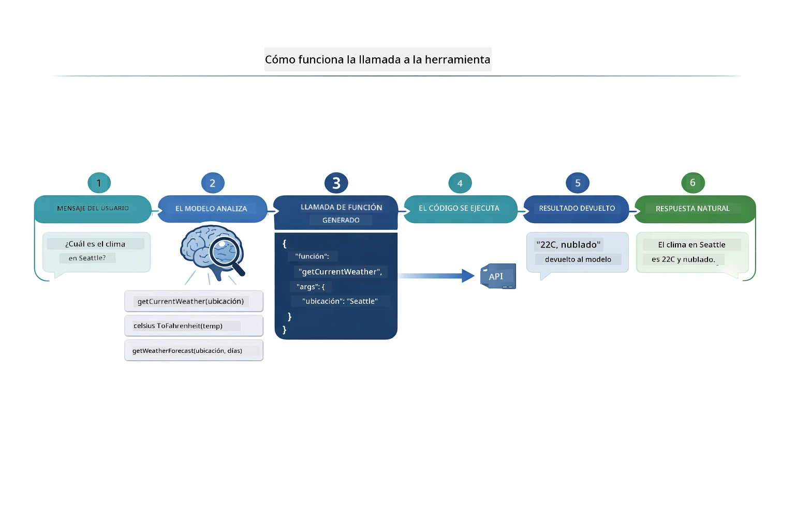

*El flujo de extremo a extremo — el usuario hace una pregunta, el modelo selecciona una herramienta, LangChain4j la ejecuta y el modelo integra el resultado en una respuesta natural.*

> **🤖 Prueba con [GitHub Copilot](https://github.com/features/copilot) Chat:** Abre [`AgentService.java`](../../../04-tools/src/main/java/com/example/langchain4j/agents/service/AgentService.java) y pregunta:
> - "¿Cómo funciona el patrón ReAct y por qué es efectivo para agentes de IA?"
> - "¿Cómo decide el agente qué herramienta usar y en qué orden?"
> - "¿Qué ocurre si falla la ejecución de una herramienta—cómo debo manejar los errores de forma robusta?"

### Generación de Respuestas

El modelo recibe los datos del clima y los formatea en una respuesta en lenguaje natural para el usuario.

### Arquitectura: Auto-Inyección en Spring Boot

Este módulo usa la integración de LangChain4j con Spring Boot y las interfaces declarativas `@AiService`. Al iniciar, Spring Boot descubre cada `@Component` que contiene métodos `@Tool`, tu bean `ChatModel` y el `ChatMemoryProvider` — para luego inyectarlos todos en una única interfaz `Assistant` sin código repetitivo.

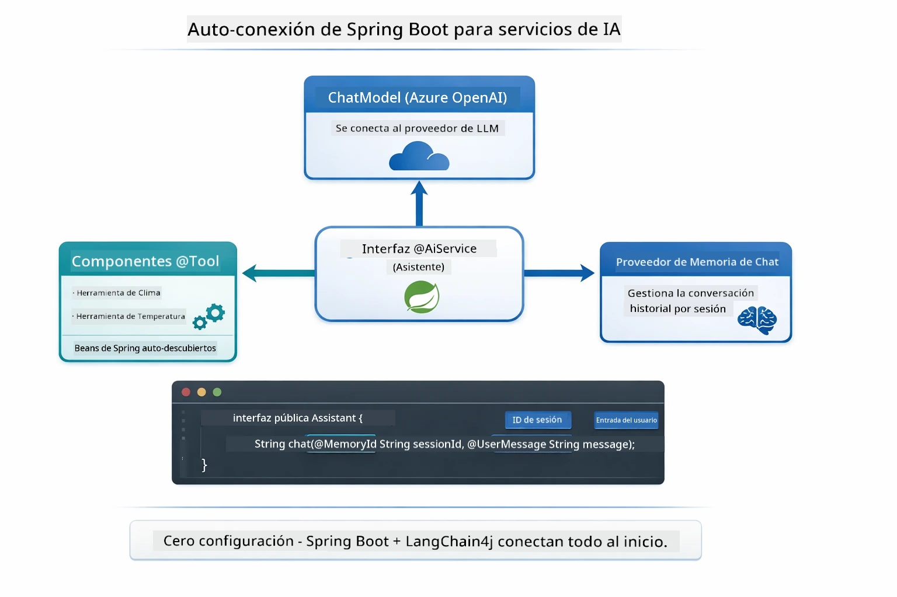

*La interfaz @AiService une el ChatModel, los componentes de herramientas y el proveedor de memoria — Spring Boot maneja toda la inyección automáticamente.*

Beneficios clave de este enfoque:

- **Auto-inyección de Spring Boot** — ChatModel y herramientas inyectados automáticamente
- **Patrón @MemoryId** — Gestión automática de memoria por sesión
- **Instancia única** — El asistente se crea una vez y se reutiliza para mejor rendimiento
- **Ejecución tipada** — Métodos Java llamados directamente con conversión de tipos
- **Orquestación multi-turno** — Maneja encadenamiento de herramientas automáticamente
- **Cero código repetitivo** — Sin llamadas manuales a `AiServices.builder()` o mapas Hash de memoria

Enfoques alternativos (con `AiServices.builder()` manual) requieren más código y no aprovechan la integración de Spring Boot.

## Encadenamiento de Herramientas

**Encadenamiento de Herramientas** — El verdadero poder de los agentes basados en herramientas se muestra cuando una sola pregunta requiere múltiples herramientas. Pregunta "¿Cuál es el clima en Seattle en Fahrenheit?" y el agente encadena automáticamente dos herramientas: primero llama a `getCurrentWeather` para obtener la temperatura en Celsius, luego pasa ese valor a `celsiusToFahrenheit` para convertirlo — todo en un solo turno de conversación.

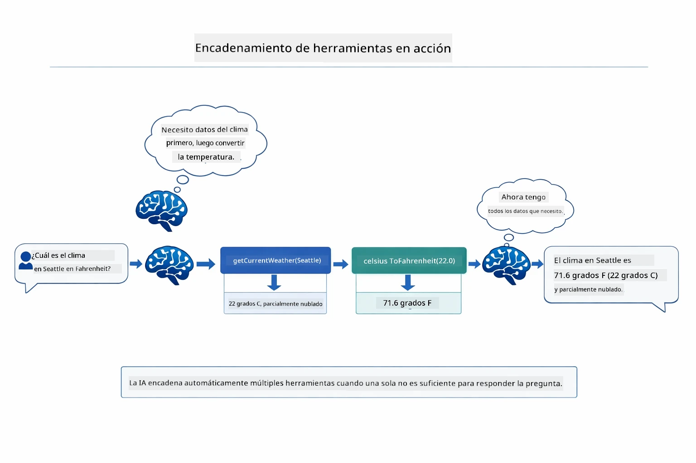

*Encadenamiento de herramientas en acción — el agente llama primero a getCurrentWeather, luego pasa el resultado en Celsius a celsiusToFahrenheit, y entrega una respuesta combinada.*

Así es como se ve esto en la aplicación en ejecución — el agente encadena dos llamadas a herramientas en un solo turno:

<a href="images/tool-chaining.png"></a>

*Salida real de la aplicación — el agente encadena automáticamente getCurrentWeather → celsiusToFahrenheit en un turno.*

**Fallos Elegantes** — Pide el clima en una ciudad que no está en los datos simulados. La herramienta devuelve un mensaje de error, y la IA explica que no puede ayudar en vez de fallar. Las herramientas fallan de forma segura.

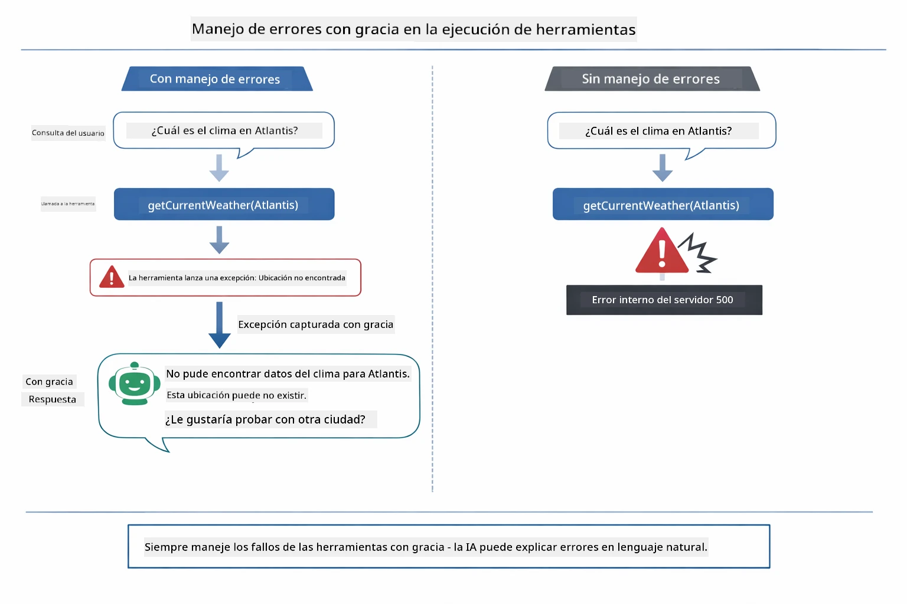

*Cuando una herramienta falla, el agente captura el error y responde con una explicación útil en vez de fallar.*

Esto sucede en un solo turno de conversación. El agente orquesta múltiples llamadas a herramientas de forma autónoma.

## Ejecutar la Aplicación

**Verificar despliegue:**

Asegúrate de que el archivo `.env` exista en el directorio raíz con las credenciales de Azure (creado durante el Módulo 01):
```bash
cat ../.env  # Debe mostrar AZURE_OPENAI_ENDPOINT, API_KEY, DEPLOYMENT
```

**Iniciar la aplicación:**

> **Nota:** Si ya iniciaste todas las aplicaciones usando `./start-all.sh` del Módulo 01, este módulo ya está corriendo en el puerto 8084. Puedes saltarte los comandos de inicio y abrir directamente http://localhost:8084.

**Opción 1: Usar Spring Boot Dashboard (Recomendado para usuarios de VS Code)**

El contenedor de desarrollo incluye la extensión Spring Boot Dashboard, que proporciona una interfaz visual para administrar todas las aplicaciones Spring Boot. Puedes encontrarla en la Barra de Actividad al lado izquierdo de VS Code (busca el ícono de Spring Boot).

Desde el Spring Boot Dashboard, puedes:
- Ver todas las aplicaciones Spring Boot disponibles en el espacio de trabajo
- Iniciar/detener aplicaciones con un clic
- Ver los logs de las aplicaciones en tiempo real
- Monitorear el estado de las aplicaciones

Simplemente haz clic en el botón de play junto a "tools" para iniciar este módulo, o inicia todos a la vez.


**Opción 2: Usar scripts shell**

Inicia todas las aplicaciones web (módulos 01-04):

**Bash:**
```bash
cd ..  # Desde el directorio raíz
./start-all.sh
```

**PowerShell:**
```powershell
cd ..  # Desde el directorio raíz
.\start-all.ps1
```

O inicia solo este módulo:

**Bash:**
```bash
cd 04-tools
./start.sh
```

**PowerShell:**
```powershell
cd 04-tools
.\start.ps1
```

Ambos scripts cargan automáticamente variables de entorno del archivo `.env` raíz y construirán los JAR si no existen.

> **Nota:** Si prefieres construir manualmente todos los módulos antes de iniciar:
>
> **Bash:**
> ```bash
> cd ..  # Go to root directory
> mvn clean package -DskipTests
> ```
>
> **PowerShell:**
> ```powershell
> cd ..  # Go to root directory
> mvn clean package -DskipTests
> ```

Abre http://localhost:8084 en tu navegador.

**Para detener:**

**Bash:**
```bash
./stop.sh  # Solo este módulo
# O
cd .. && ./stop-all.sh  # Todos los módulos
```

**PowerShell:**
```powershell
.\stop.ps1  # Solo este módulo
# O
cd ..; .\stop-all.ps1  # Todos los módulos
```

## Usando la Aplicación

La aplicación provee una interfaz web donde puedes interactuar con un agente de IA que tiene acceso a herramientas de clima y conversión de temperatura.

<a href="images/tools-homepage.png"></a>

*La interfaz de Herramientas del Agente de IA - ejemplos rápidos e interfaz de chat para interactuar con herramientas*

### Probar Uso Simple de Herramientas
Comienza con una solicitud sencilla: "Convierte 100 grados Fahrenheit a Celsius". El agente reconoce que necesita la herramienta de conversión de temperatura, la llama con los parámetros correctos y devuelve el resultado. Fíjate en lo natural que se siente: no especificaste qué herramienta usar ni cómo llamarla.

### Probar encadenamiento de herramientas

Ahora intenta algo más complejo: "¿Cuál es el clima en Seattle y conviértelo a Fahrenheit?" Observa cómo el agente trabaja en pasos. Primero obtiene el clima (que devuelve en Celsius), reconoce que necesita convertir a Fahrenheit, llama a la herramienta de conversión y combina ambos resultados en una sola respuesta.

### Ver flujo de conversación

La interfaz de chat mantiene el historial de la conversación, permitiéndote tener interacciones de varios turnos. Puedes ver todas las consultas y respuestas previas, facilitando seguir la conversación y entender cómo el agente construye el contexto a lo largo de múltiples intercambios.

<a href="images/tools-conversation-demo.png"></a>

*Conversación de varios turnos mostrando conversiones simples, consultas meteorológicas y encadenamiento de herramientas*

### Experimenta con diferentes solicitudes

Prueba varias combinaciones:
- Consultas meteorológicas: "¿Cuál es el clima en Tokio?"
- Conversiones de temperatura: "¿Cuánto es 25°C en Kelvin?"
- Consultas combinadas: "Consulta el clima en París y dime si está por encima de 20°C"

Observa cómo el agente interpreta el lenguaje natural y lo traduce en llamadas adecuadas a herramientas.

## Conceptos clave

### Patrón ReAct (Razonamiento y Acción)

El agente alterna entre razonar (decidir qué hacer) y actuar (usar herramientas). Este patrón permite resolver problemas de forma autónoma en lugar de solo responder instrucciones.

### Las descripciones de herramientas importan

La calidad de las descripciones de tus herramientas afecta directamente qué tan bien el agente las usa. Descripciones claras y específicas ayudan al modelo a entender cuándo y cómo llamar a cada herramienta.

### Gestión de sesiones

La anotación `@MemoryId` permite la gestión automática de memoria basada en sesión. Cada ID de sesión obtiene su propia instancia `ChatMemory`, gestionada por el bean `ChatMemoryProvider`, para que múltiples usuarios puedan interactuar simultáneamente con el agente sin mezclar sus conversaciones.

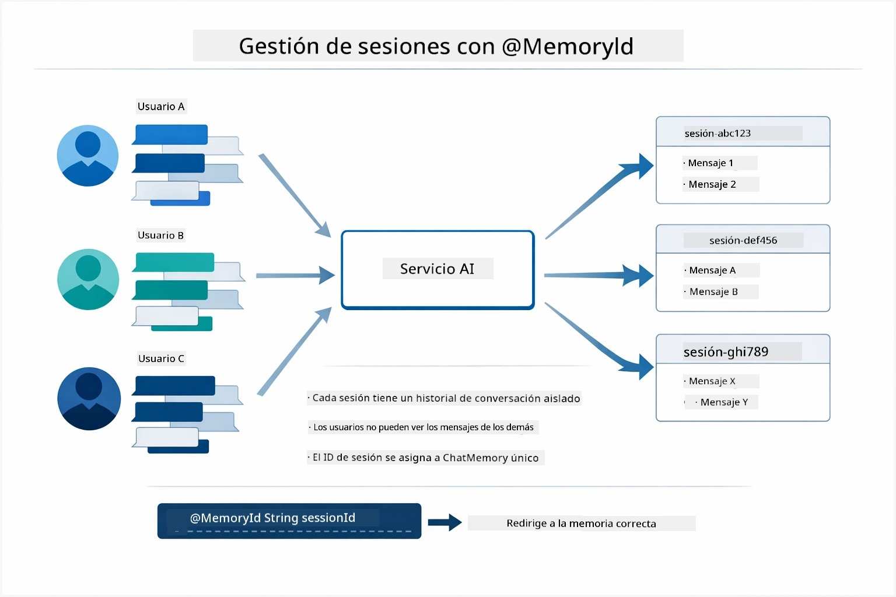

*Cada ID de sesión se asigna a un historial de conversación aislado — los usuarios nunca ven los mensajes de otros.*

### Manejo de errores

Las herramientas pueden fallar — las APIs pueden agotar el tiempo, los parámetros podrían ser inválidos, los servicios externos pueden caerse. Los agentes en producción necesitan manejo de errores para que el modelo pueda explicar problemas o intentar alternativas en lugar de que toda la aplicación caiga. Cuando una herramienta arroja una excepción, LangChain4j la captura y envía el mensaje de error al modelo, que puede explicar el problema en lenguaje natural.

## Herramientas disponibles

El diagrama abajo muestra el amplio ecosistema de herramientas que puedes construir. Este módulo demuestra herramientas de clima y temperatura, pero el mismo patrón `@Tool` funciona para cualquier método Java — desde consultas de bases de datos hasta procesamiento de pagos.

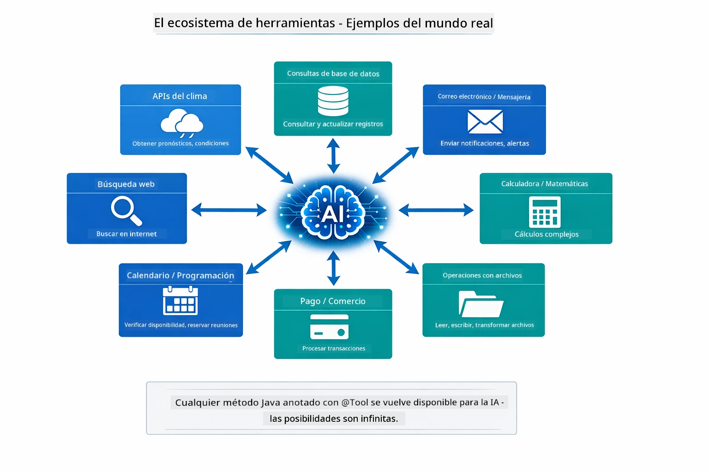

*Cualquier método Java anotado con @Tool se vuelve disponible para la IA — el patrón se extiende a bases de datos, APIs, correo, operaciones de archivos y más.*

## Cuándo usar agentes basados en herramientas

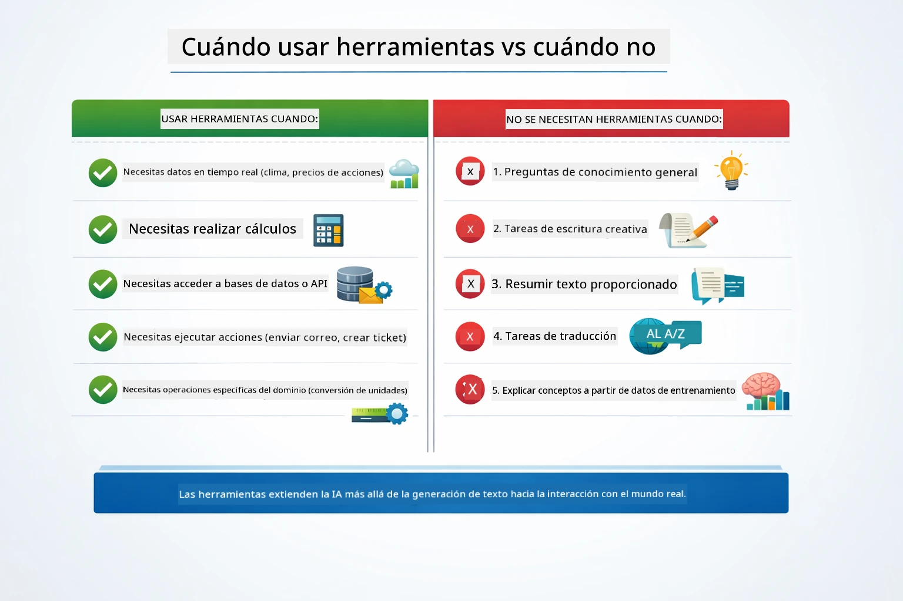

*Guía rápida — las herramientas son para datos en tiempo real, cálculos y acciones; el conocimiento general y tareas creativas no las necesitan.*

**Usa herramientas cuando:**
- Responder requiere datos en tiempo real (clima, precios de acciones, inventario)
- Necesitas hacer cálculos más allá de matemáticas simples
- Acceder a bases de datos o APIs
- Realizar acciones (enviar correos, crear tickets, actualizar registros)
- Combinar múltiples fuentes de datos

**No uses herramientas cuando:**
- Las preguntas se pueden responder con conocimiento general
- La respuesta es puramente conversacional
- La latencia de la herramienta haría la experiencia demasiado lenta

## Herramientas vs RAG

Los módulos 03 y 04 extienden lo que la IA puede hacer, pero de formas fundamentalmente diferentes. RAG le da al modelo acceso a **conocimiento** mediante la recuperación de documentos. Las herramientas le dan al modelo la capacidad de tomar **acciones** llamando funciones.

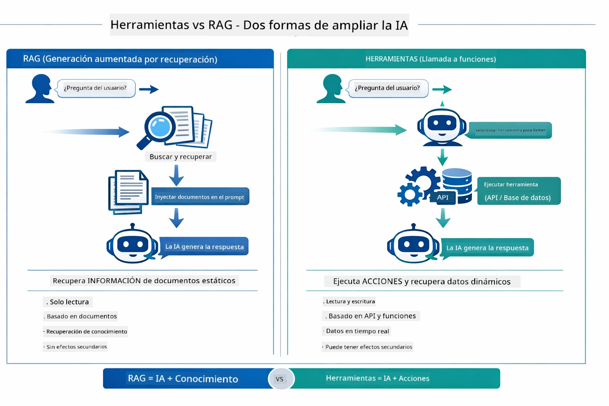

*RAG recupera información de documentos estáticos — Las herramientas ejecutan acciones y obtienen datos dinámicos en tiempo real. Muchos sistemas en producción combinan ambos.*

En la práctica, muchos sistemas en producción combinan ambos enfoques: RAG para fundamentar respuestas en tu documentación, y herramientas para obtener datos en vivo o realizar operaciones.

## Próximos pasos

**Siguiente módulo:** [05-mcp - Protocolo de contexto del modelo (MCP)](../05-mcp/README.md)

---

**Navegación:** [← Anterior: Módulo 03 - RAG](../03-rag/README.md) | [Volver al inicio](../README.md) | [Siguiente: Módulo 05 - MCP →](../05-mcp/README.md)

---

<!-- CO-OP TRANSLATOR DISCLAIMER START -->
**Aviso Legal**:  
Este documento ha sido traducido utilizando el servicio de traducción automática [Co-op Translator](https://github.com/Azure/co-op-translator). Aunque nos esforzamos por la precisión, tenga en cuenta que las traducciones automáticas pueden contener errores o inexactitudes. El documento original en su idioma nativo debe considerarse la fuente autorizada. Para información crítica, se recomienda una traducción profesional realizada por humanos. No nos hacemos responsables por malentendidos o interpretaciones erróneas derivadas del uso de esta traducción.
<!-- CO-OP TRANSLATOR DISCLAIMER END -->