# Módulo 05: Protocolo de Contexto del Modelo (MCP)

## Tabla de Contenidos

- [Recorrido en Video](../../../05-mcp)
- [Lo Que Aprenderás](../../../05-mcp)
- [¿Qué es MCP?](../../../05-mcp)
- [Cómo Funciona MCP](../../../05-mcp)
- [El Módulo Agentic](../../../05-mcp)
- [Ejecutando los Ejemplos](../../../05-mcp)
  - [Prerequisitos](../../../05-mcp)
- [Inicio Rápido](../../../05-mcp)
  - [Operaciones con Archivos (Stdio)](../../../05-mcp)
  - [Agente Supervisor](../../../05-mcp)
    - [Ejecutando la Demostración](../../../05-mcp)
    - [Cómo Funciona el Supervisor](../../../05-mcp)
    - [Cómo FileAgent Descubre Herramientas MCP en Tiempo de Ejecución](../../../05-mcp)
    - [Estrategias de Respuesta](../../../05-mcp)
    - [Entendiendo la Salida](../../../05-mcp)
    - [Explicación de las Características del Módulo Agentic](../../../05-mcp)
- [Conceptos Clave](../../../05-mcp)
- [¡Felicidades!](../../../05-mcp)
  - [¿Qué Sigue?](../../../05-mcp)

## Recorrido en Video

Mira esta sesión en vivo que explica cómo comenzar con este módulo:

<a href="https://www.youtube.com/watch?v=O_J30kZc0rw"></a>

## Lo Que Aprenderás

Has construido IA conversacional, dominado prompts, fundamentado respuestas en documentos y creado agentes con herramientas. Pero todas esas herramientas fueron creadas a medida para tu aplicación específica. ¿Y si pudieras darle a tu IA acceso a un ecosistema estandarizado de herramientas que cualquiera pueda crear y compartir? En este módulo, aprenderás a hacer precisamente eso con el Protocolo de Contexto del Modelo (MCP) y el módulo agentic de LangChain4j. Primero mostramos un simple lector de archivos MCP y luego mostramos cómo se integra fácilmente en flujos de trabajo agentic avanzados usando el patrón Supervisor Agent.

## ¿Qué es MCP?

El Protocolo de Contexto del Modelo (MCP) proporciona exactamente eso: una forma estándar para que las aplicaciones de IA descubran y usen herramientas externas. En lugar de escribir integraciones personalizadas para cada fuente de datos o servicio, te conectas a servidores MCP que exponen sus capacidades en un formato consistente. Tu agente de IA puede entonces descubrir y usar estas herramientas automáticamente.

El diagrama a continuación muestra la diferencia: sin MCP, cada integración requiere cableado punto a punto personalizado; con MCP, un solo protocolo conecta tu aplicación a cualquier herramienta:


*Antes de MCP: Integraciones punto a punto complejas. Después de MCP: Un protocolo, infinitas posibilidades.*

MCP resuelve un problema fundamental en el desarrollo de IA: cada integración es personalizada. ¿Quieres acceder a GitHub? Código personalizado. ¿Quieres leer archivos? Código personalizado. ¿Quieres consultar una base de datos? Código personalizado. Y ninguna de estas integraciones funciona con otras aplicaciones de IA.

MCP estandariza esto. Un servidor MCP expone herramientas con descripciones claras y esquemas. Cualquier cliente MCP puede conectarse, descubrir herramientas disponibles y usarlas. Se crea una vez, se usa en todas partes.

El diagrama a continuación ilustra esta arquitectura: un solo cliente MCP (tu aplicación de IA) se conecta a múltiples servidores MCP, cada uno exponiendo su propio conjunto de herramientas a través del protocolo estándar:


*Arquitectura del Protocolo de Contexto del Modelo - descubrimiento y ejecución de herramientas estandarizadas*

## Cómo Funciona MCP

En el fondo, MCP usa una arquitectura en capas. Tu aplicación Java (el cliente MCP) descubre herramientas disponibles, envía solicitudes JSON-RPC a través de una capa de transporte (Stdio o HTTP), y el servidor MCP ejecuta operaciones y devuelve resultados. El siguiente diagrama desglosa cada capa de este protocolo:

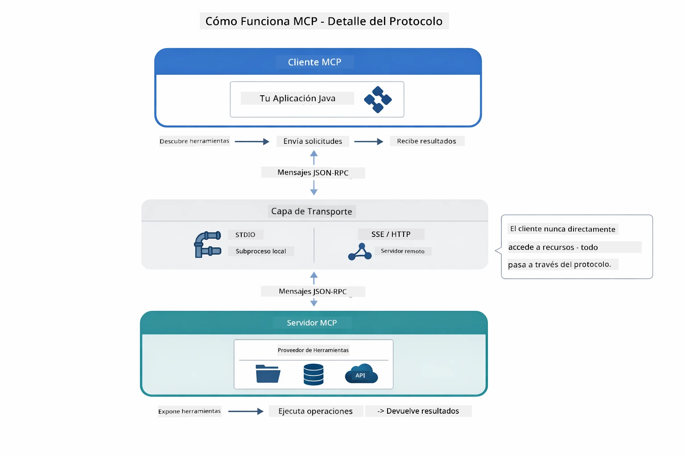

*Cómo funciona MCP por detrás — los clientes descubren herramientas, intercambian mensajes JSON-RPC y ejecutan operaciones a través de una capa de transporte.*

**Arquitectura Cliente-Servidor**

MCP utiliza un modelo cliente-servidor. Los servidores proveen herramientas — leer archivos, consultar bases de datos, llamar APIs. Los clientes (tu aplicación IA) se conectan a los servidores y usan sus herramientas.

Para usar MCP con LangChain4j, agrega esta dependencia Maven:

```xml
<dependency>
    <groupId>dev.langchain4j</groupId>
    <artifactId>langchain4j-mcp</artifactId>
    <version>${langchain4j.version}</version>
</dependency>
```

**Descubrimiento de Herramientas**

Cuando tu cliente se conecta a un servidor MCP, pregunta "¿Qué herramientas tienes?" El servidor responde con una lista de herramientas disponibles, cada una con descripciones y esquemas de parámetros. Tu agente de IA puede decidir entonces qué herramientas usar basándose en las solicitudes del usuario. El diagrama a continuación muestra este saludo — el cliente envía una solicitud `tools/list` y el servidor retorna sus herramientas disponibles con descripciones y esquemas de parámetros:

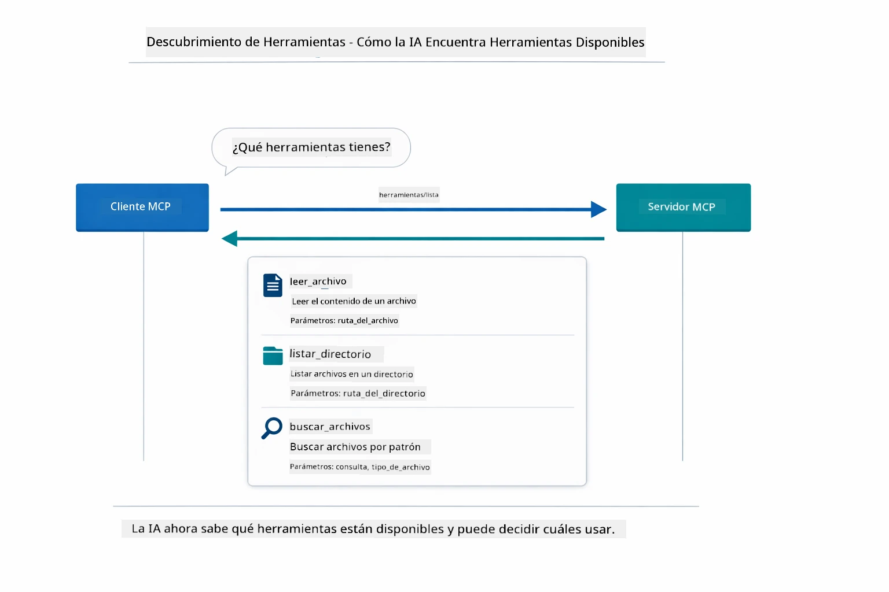

*La IA descubre herramientas disponibles en el inicio — ahora sabe qué capacidades están disponibles y puede decidir cuáles usar.*

**Mecanismos de Transporte**

MCP soporta diferentes mecanismos de transporte. Las dos opciones son Stdio (para comunicación local con subprocesos) y HTTP Streamable (para servidores remotos). Este módulo demuestra el transporte Stdio:


*Mecanismos de transporte MCP: HTTP para servidores remotos, Stdio para procesos locales*

**Stdio** - [StdioTransportDemo.java](../../../05-mcp/src/main/java/com/example/langchain4j/mcp/StdioTransportDemo.java)

Para procesos locales. Tu aplicación crea un servidor como subproceso y se comunica a través de entrada/salida estándar. Útil para acceso a sistema de archivos o herramientas de línea de comando.

```java
McpTransport stdioTransport = new StdioMcpTransport.Builder()
    .command(List.of(
        npmCmd, "exec",
        "@modelcontextprotocol/server-filesystem@2025.12.18",
        resourcesDir
    ))
    .logEvents(false)
    .build();
```

El servidor `@modelcontextprotocol/server-filesystem` expone las siguientes herramientas, todas confinadas a los directorios que especifiques:

| Herramienta | Descripción |
|-------------|-------------|
| `read_file` | Leer el contenido de un solo archivo |
| `read_multiple_files` | Leer múltiples archivos en una llamada |
| `write_file` | Crear o sobrescribir un archivo |
| `edit_file` | Hacer ediciones dirigidas de buscar y reemplazar |
| `list_directory` | Listar archivos y directorios en una ruta |
| `search_files` | Buscar recursivamente archivos que coincidan con un patrón |
| `get_file_info` | Obtener metadatos de archivo (tamaño, fechas, permisos) |
| `create_directory` | Crear un directorio (incluyendo directorios padres) |
| `move_file` | Mover o renombrar un archivo o directorio |

El siguiente diagrama muestra cómo funciona el transporte Stdio en tiempo de ejecución — tu aplicación Java crea el servidor MCP como proceso hijo y se comunican a través de tuberías stdin/stdout, sin red ni HTTP involucrados:

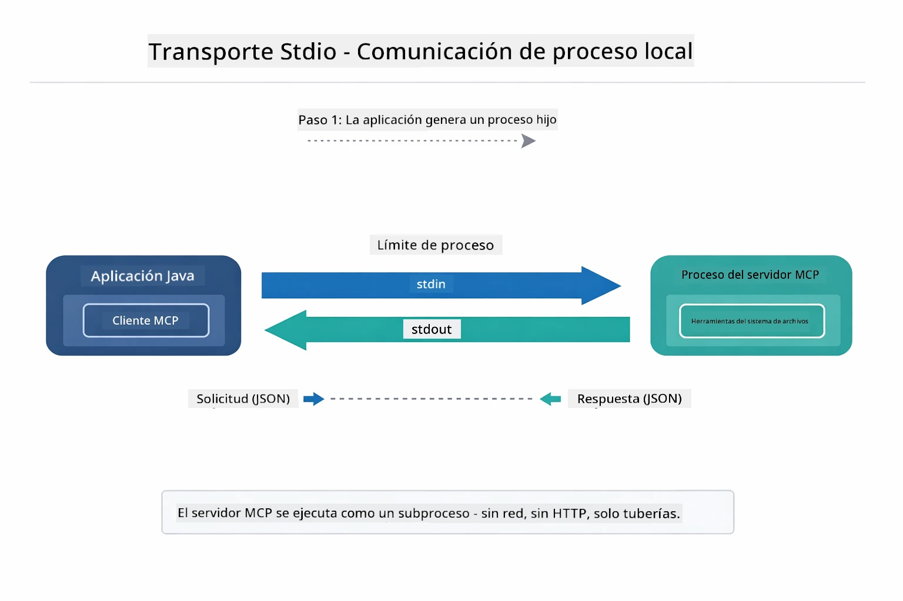

*Transporte Stdio en acción — tu aplicación crea el servidor MCP como proceso hijo y se comunica a través de tuberías stdin/stdout.*

> **🤖 Prueba con [GitHub Copilot](https://github.com/features/copilot) Chat:** Abre [`StdioTransportDemo.java`](../../../05-mcp/src/main/java/com/example/langchain4j/mcp/StdioTransportDemo.java) y pregunta:
> - "¿Cómo funciona el transporte Stdio y cuándo debería usarlo vs HTTP?"
> - "¿Cómo maneja LangChain4j el ciclo de vida de los procesos del servidor MCP lanzados?"
> - "¿Cuáles son las implicaciones de seguridad de darle acceso a la IA al sistema de archivos?"

## El Módulo Agentic

Mientras que MCP provee herramientas estandarizadas, el módulo **agentic** de LangChain4j provee una forma declarativa de construir agentes que orquestan esas herramientas. La anotación `@Agent` y `AgenticServices` te permiten definir el comportamiento del agente a través de interfaces en lugar de código imperativo.

En este módulo, explorarás el patrón **Supervisor Agent** — un enfoque agentic avanzado donde un agente "supervisor" decide dinámicamente qué sub-agentes invocar basado en las solicitudes del usuario. Combinaremos ambos conceptos dando a uno de nuestros sub-agentes capacidades de acceso a archivos impulsadas por MCP.

Para usar el módulo agentic, agrega esta dependencia Maven:

```xml
<dependency>
    <groupId>dev.langchain4j</groupId>
    <artifactId>langchain4j-agentic</artifactId>
    <version>${langchain4j.mcp.version}</version>
</dependency>
```
> **Nota:** El módulo `langchain4j-agentic` usa una propiedad de versión separada (`langchain4j.mcp.version`) porque se lanza en un calendario diferente que las librerías principales de LangChain4j.

> **⚠️ Experimental:** El módulo `langchain4j-agentic` es **experimental** y puede cambiar. La forma estable de construir asistentes IA sigue siendo `langchain4j-core` con herramientas personalizadas (Módulo 04).

## Ejecutando los Ejemplos

### Prerrequisitos

- Haber completado [Módulo 04 - Herramientas](../04-tools/README.md) (este módulo se basa en conceptos de herramientas personalizadas y las compara con herramientas MCP)
- Archivo `.env` en el directorio raíz con credenciales de Azure (creado por `azd up` en Módulo 01)
- Java 21+, Maven 3.9+
- Node.js 16+ y npm (para servidores MCP)

> **Nota:** Si aún no has configurado tus variables de entorno, revisa [Módulo 01 - Introducción](../01-introduction/README.md) para instrucciones de despliegue (`azd up` crea automáticamente el archivo `.env`), o copia `.env.example` a `.env` en el directorio raíz y completa tus valores.

## Inicio Rápido

**Usando VS Code:** Simplemente haz clic derecho en cualquier archivo de demostración en el Explorador y selecciona **"Run Java"**, o usa las configuraciones de lanzamiento desde el panel Run and Debug (asegúrate de que tu archivo `.env` esté configurado con credenciales Azure primero).

**Usando Maven:** Alternativamente, puedes ejecutar desde la línea de comandos con los ejemplos a continuación.

### Operaciones con Archivos (Stdio)

Esto demuestra herramientas basadas en subprocesos locales.

**✅ Sin prerequisitos necesarios** - el servidor MCP se inicia automáticamente.

**Usando los Scripts de Inicio (Recomendado):**

Los scripts de inicio cargan automáticamente variables de entorno desde el archivo `.env` raíz:

**Bash:**
```bash
cd 05-mcp
chmod +x start-stdio.sh
./start-stdio.sh
```

**PowerShell:**
```powershell
cd 05-mcp
.\start-stdio.ps1
```

**Usando VS Code:** Haz clic derecho en `StdioTransportDemo.java` y selecciona **"Run Java"** (asegúrate de que tu archivo `.env` esté configurado).

La aplicación lanza automáticamente un servidor MCP de sistema de archivos y lee un archivo local. Observa cómo se maneja la gestión del subproceso automáticamente.

**Salida esperada:**
```
Assistant response: The file provides an overview of LangChain4j, an open-source Java library
for integrating Large Language Models (LLMs) into Java applications...
```

### Agente Supervisor

El patrón **Supervisor Agent** es una forma **flexible** de IA agentic. Un Supervisor usa un LLM para decidir autónomamente qué agentes invocar basado en la solicitud del usuario. En el siguiente ejemplo, combinamos el acceso a archivos potenciado por MCP con un agente LLM para crear un flujo supervisado de lectura de archivo → reporte.

En la demostración, `FileAgent` lee un archivo usando herramientas de sistema de archivos MCP, y `ReportAgent` genera un reporte estructurado con un resumen ejecutivo (1 frase), 3 puntos clave y recomendaciones. El Supervisor orquesta este flujo automáticamente:

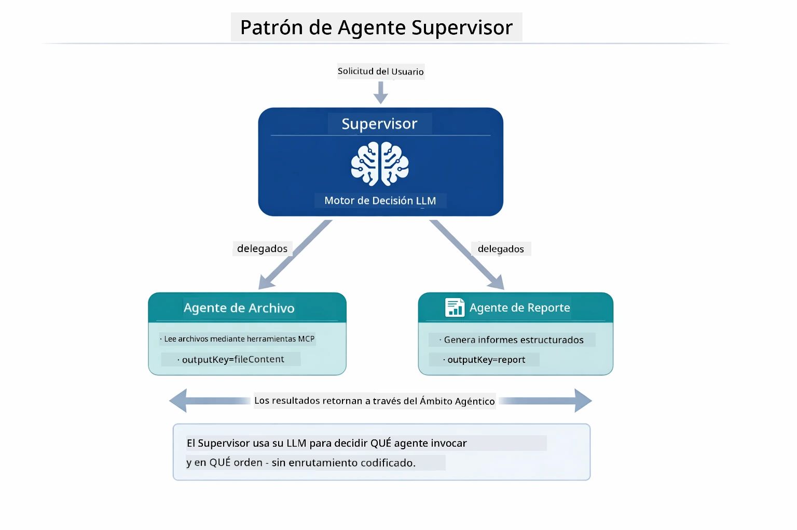

*El Supervisor usa su LLM para decidir qué agentes invocar y en qué orden — no se necesita enrutamiento codificado.*

Así luce el flujo concreto para nuestra tubería de archivo a reporte:

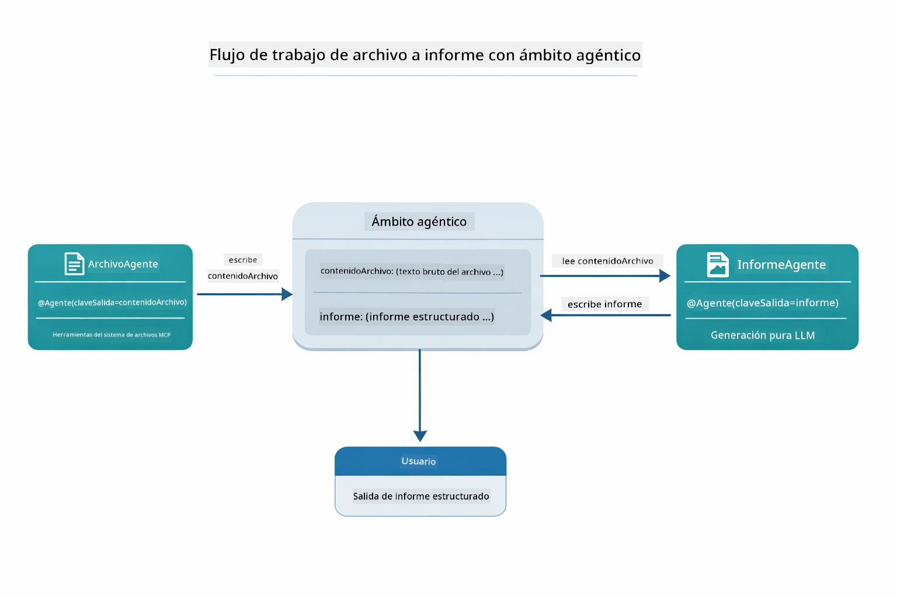

*FileAgent lee el archivo vía herramientas MCP, luego ReportAgent transforma el contenido bruto en un reporte estructurado.*

El siguiente diagrama de secuencia traza toda la orquestación del Supervisor — desde lanzar el servidor MCP, pasando por la selección autónoma de agentes del Supervisor, hasta las llamadas a herramientas por stdio y el reporte final:

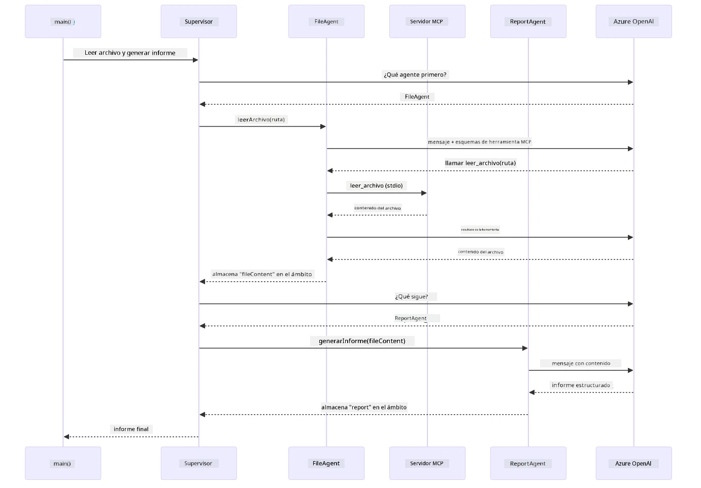

*El Supervisor invoca autónomamente a FileAgent (que llama al servidor MCP vía stdio para leer el archivo), luego invoca a ReportAgent para generar un reporte estructurado — cada agente almacena su salida en el Ámbito Agentic compartido.*

Cada agente almacena su salida en el **Ámbito Agentic** (memoria compartida), permitiendo que agentes posteriores accedan a resultados previos. Esto demuestra cómo las herramientas MCP se integran sin problemas en flujos agentic — el Supervisor no necesita saber *cómo* se leen los archivos, solo que `FileAgent` puede hacerlo.

#### Ejecutando la Demostración

Los scripts de inicio cargan automáticamente variables de entorno desde el archivo `.env` raíz:

**Bash:**
```bash
cd 05-mcp
chmod +x start-supervisor.sh
./start-supervisor.sh
```

**PowerShell:**
```powershell
cd 05-mcp
.\start-supervisor.ps1
```

**Usando VS Code:** Haz clic derecho en `SupervisorAgentDemo.java` y selecciona **"Run Java"** (asegúrate de que tu archivo `.env` esté configurado).

#### Cómo Funciona el Supervisor

Antes de construir agentes, necesitas conectar el transporte MCP a un cliente y envolverlo como un `ToolProvider`. Así es como las herramientas del servidor MCP se vuelven disponibles para tus agentes:

```java
// Crear un cliente MCP desde el transporte
McpClient mcpClient = new DefaultMcpClient.Builder()
        .transport(stdioTransport)
        .build();

// Envolver el cliente como un ToolProvider — esto conecta las herramientas MCP con LangChain4j
ToolProvider mcpToolProvider = McpToolProvider.builder()
        .mcpClients(List.of(mcpClient))
        .build();
```

Ahora puedes inyectar `mcpToolProvider` en cualquier agente que necesite herramientas MCP:

```java
// Paso 1: FileAgent lee archivos usando herramientas MCP
FileAgent fileAgent = AgenticServices.agentBuilder(FileAgent.class)
        .chatModel(model)
        .toolProvider(mcpToolProvider)  // Tiene herramientas MCP para operaciones de archivos
        .build();

// Paso 2: ReportAgent genera informes estructurados
ReportAgent reportAgent = AgenticServices.agentBuilder(ReportAgent.class)
        .chatModel(model)
        .build();

// Supervisor orquesta el flujo de trabajo archivo → informe
SupervisorAgent supervisor = AgenticServices.supervisorBuilder()
        .chatModel(model)
        .subAgents(fileAgent, reportAgent)
        .responseStrategy(SupervisorResponseStrategy.LAST)  // Devuelve el informe final
        .build();

// El Supervisor decide qué agentes invocar según la solicitud
String response = supervisor.invoke("Read the file at /path/file.txt and generate a report");
```

#### Cómo FileAgent Descubre Herramientas MCP en Tiempo de Ejecución

Te preguntarás: **¿cómo sabe `FileAgent` cómo usar las herramientas npm de sistema de archivos?** La respuesta es que no lo sabe — la **LLM** lo descubre en tiempo de ejecución a través de los esquemas de herramientas.
La interfaz `FileAgent` es solo una **definición de prompt**. No tiene conocimiento codificado de `read_file`, `list_directory` ni de ninguna otra herramienta MCP. Esto es lo que ocurre de principio a fin:

1. **El servidor se inicia:** `StdioMcpTransport` lanza el paquete npm `@modelcontextprotocol/server-filesystem` como un proceso hijo.
2. **Descubrimiento de herramientas:** El `McpClient` envía una solicitud JSON-RPC `tools/list` al servidor, que responde con nombres de herramientas, descripciones y esquemas de parámetros (por ejemplo, `read_file` — *"Leer el contenido completo de un archivo"* — `{ path: string }`).
3. **Inyección de esquemas:** `McpToolProvider` envuelve estos esquemas descubiertos y los pone a disposición de LangChain4j.
4. **Decisión del LLM:** Cuando se llama a `FileAgent.readFile(path)`, LangChain4j envía el mensaje del sistema, el mensaje del usuario **y la lista de esquemas de herramientas** al LLM. El LLM lee las descripciones de las herramientas y genera una llamada a la herramienta (por ejemplo, `read_file(path="/some/file.txt")`).
5. **Ejecución:** LangChain4j intercepta la llamada a la herramienta, la envía al cliente MCP de vuelta al subproceso de Node.js, obtiene el resultado y lo alimenta de nuevo al LLM.

Este es el mismo mecanismo de [Descubrimiento de Herramientas](../../../05-mcp) descrito anteriormente, pero aplicado específicamente al flujo de trabajo del agente. Las anotaciones `@SystemMessage` y `@UserMessage` guían el comportamiento del LLM, mientras que el `ToolProvider` inyectado le da las **capacidades** — el LLM une ambos en tiempo de ejecución.

> **🤖 Prueba con [GitHub Copilot](https://github.com/features/copilot) Chat:** Abre [`FileAgent.java`](../../../05-mcp/src/main/java/com/example/langchain4j/mcp/agents/FileAgent.java) y pregunta:
> - "¿Cómo sabe este agente qué herramienta MCP llamar?"
> - "¿Qué pasaría si quitara el ToolProvider del constructor del agente?"
> - "¿Cómo se pasan los esquemas de las herramientas al LLM?"

#### Estrategias de Respuesta

Cuando configuras un `SupervisorAgent`, especificas cómo debe formular su respuesta final al usuario tras completar las tareas de los sub-agentes. El diagrama a continuación muestra las tres estrategias disponibles — LAST devuelve directamente la salida del último agente, SUMMARY sintetiza todas las salidas mediante un LLM, y SCORED selecciona la que obtiene la puntuación más alta respecto a la solicitud original:

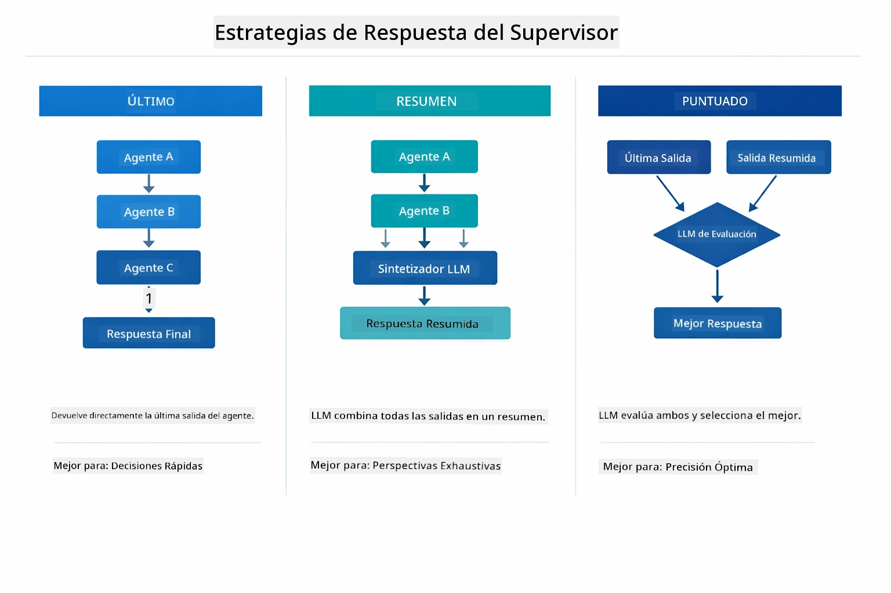

*Tres estrategias para cómo el Supervisor formula su respuesta final — elige según si quieres la salida del último agente, un resumen sintetizado o la opción mejor puntuado.*

Las estrategias disponibles son:

| Estrategia | Descripción |
|------------|-------------|
| **LAST** | El supervisor devuelve la salida del último sub-agente o herramienta llamada. Esto es útil cuando el agente final en el flujo está específicamente diseñado para producir la respuesta completa y final (e.g., un "Agente Resumen" en una cadena de investigación). |
| **SUMMARY** | El supervisor utiliza su propio Modelo de Lenguaje (LLM) interno para sintetizar un resumen de toda la interacción y las salidas de los sub-agentes, y devuelve ese resumen como respuesta final. Esto ofrece una respuesta limpia y agregada al usuario. |
| **SCORED** | El sistema usa un LLM interno para puntuar tanto la respuesta LAST como el SUMMARY de la interacción contra la solicitud original del usuario, devolviendo la salida con la puntuación más alta. |

Consulta [SupervisorAgentDemo.java](../../../05-mcp/src/main/java/com/example/langchain4j/mcp/SupervisorAgentDemo.java) para la implementación completa.

> **🤖 Prueba con [GitHub Copilot](https://github.com/features/copilot) Chat:** Abre [`SupervisorAgentDemo.java`](../../../05-mcp/src/main/java/com/example/langchain4j/mcp/SupervisorAgentDemo.java) y pregunta:
> - "¿Cómo decide el Supervisor qué agentes invocar?"
> - "¿Cuál es la diferencia entre los patrones Supervisor y Secuencial?"
> - "¿Cómo puedo personalizar el comportamiento de planificación del Supervisor?"

#### Entendiendo la Salida

Cuando ejecutes la demo, verás un recorrido estructurado de cómo el Supervisor orquesta múltiples agentes. Esto es lo que significa cada sección:

```
======================================================================
  FILE → REPORT WORKFLOW DEMO
======================================================================

This demo shows a clear 2-step workflow: read a file, then generate a report.
The Supervisor orchestrates the agents automatically based on the request.
```

**El encabezado** introduce el concepto del flujo de trabajo: una canalización centrada desde la lectura de archivos hasta la generación de reportes.

```
--- WORKFLOW ---------------------------------------------------------
  ┌─────────────┐      ┌──────────────┐
  │  FileAgent  │ ───▶ │ ReportAgent  │
  │ (MCP tools) │      │  (pure LLM)  │
  └─────────────┘      └──────────────┘
   outputKey:           outputKey:
   'fileContent'        'report'

--- AVAILABLE AGENTS -------------------------------------------------
  [FILE]   FileAgent   - Reads files via MCP → stores in 'fileContent'
  [REPORT] ReportAgent - Generates structured report → stores in 'report'
```

**Diagrama del flujo de trabajo** muestra el flujo de datos entre agentes. Cada agente tiene un rol específico:
- **FileAgent** lee archivos usando herramientas MCP y almacena contenido bruto en `fileContent`
- **ReportAgent** consume ese contenido y produce un reporte estructurado en `report`

```
--- USER REQUEST -----------------------------------------------------
  "Read the file at .../file.txt and generate a report on its contents"
```

**Solicitud del usuario** muestra la tarea. El Supervisor la analiza y decide invocar FileAgent → ReportAgent.

```
--- SUPERVISOR ORCHESTRATION -----------------------------------------
  The Supervisor decides which agents to invoke and passes data between them...

  +-- STEP 1: Supervisor chose -> FileAgent (reading file via MCP)
  |
  |   Input: .../file.txt
  |
  |   Result: LangChain4j is an open-source, provider-agnostic Java framework for building LLM...
  +-- [OK] FileAgent (reading file via MCP) completed

  +-- STEP 2: Supervisor chose -> ReportAgent (generating structured report)
  |
  |   Input: LangChain4j is an open-source, provider-agnostic Java framew...
  |
  |   Result: Executive Summary...
  +-- [OK] ReportAgent (generating structured report) completed
```

**Orquestación del Supervisor** muestra el flujo de 2 pasos en acción:
1. **FileAgent** lee el archivo vía MCP y almacena el contenido
2. **ReportAgent** recibe el contenido y genera un reporte estructurado

El Supervisor tomó estas decisiones **autónomamente** basándose en la solicitud del usuario.

```
--- FINAL RESPONSE ---------------------------------------------------
Executive Summary
...

Key Points
...

Recommendations
...

--- AGENTIC SCOPE (Data Flow) ----------------------------------------
  Each agent stores its output for downstream agents to consume:
  * fileContent: LangChain4j is an open-source, provider-agnostic Java framework...
  * report: Executive Summary...
```

#### Explicación de las características del módulo agentic

El ejemplo demuestra varias características avanzadas del módulo agentic. Vamos a echar un vistazo más de cerca al Agentic Scope y a los Agent Listeners.

**Agentic Scope** muestra la memoria compartida donde los agentes almacenaron sus resultados usando `@Agent(outputKey="...")`. Esto permite:
- Que agentes posteriores accedan a las salidas de agentes anteriores
- Que el Supervisor sintetice una respuesta final
- Que inspecciones qué produjo cada agente

El diagrama abajo muestra cómo Agentic Scope funciona como memoria compartida en el flujo de trabajo de archivo a reporte — FileAgent escribe su salida bajo la clave `fileContent`, ReportAgent la lee y escribe su propia salida bajo `report`:

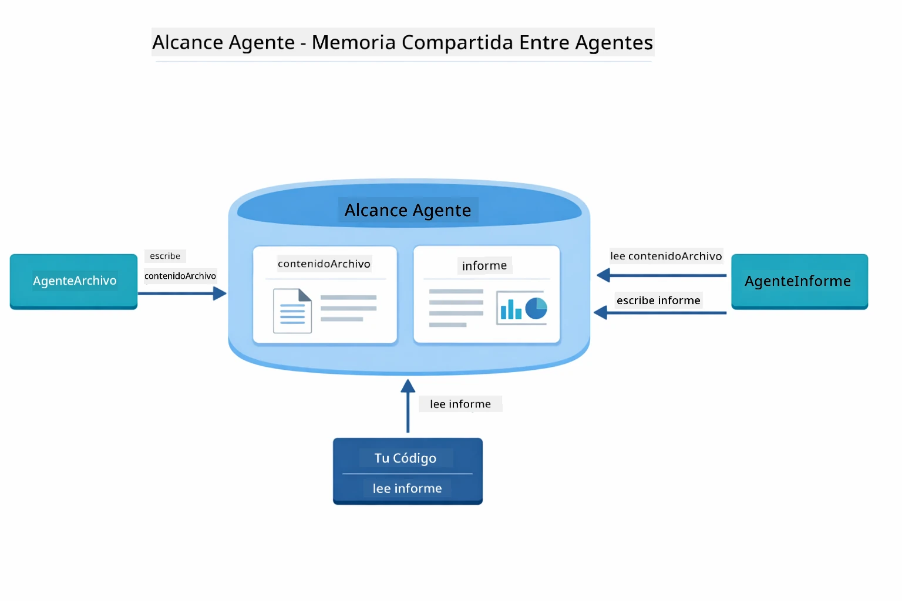

*Agentic Scope actúa como memoria compartida — FileAgent escribe `fileContent`, ReportAgent lo lee y escribe `report`, y tu código lee el resultado final.*

```java
ResultWithAgenticScope<String> result = supervisor.invokeWithAgenticScope(request);
AgenticScope scope = result.agenticScope();
String fileContent = scope.readState("fileContent");  // Datos en bruto del archivo de FileAgent
String report = scope.readState("report");            // Informe estructurado de ReportAgent
```

**Agent Listeners** permiten monitorear y depurar la ejecución de agentes. La salida paso a paso que ves en la demo proviene de un AgentListener que se engancha en cada invocación de agente:
- **beforeAgentInvocation** - Se llama cuando el Supervisor selecciona un agente, permitiéndote ver cuál fue elegido y por qué
- **afterAgentInvocation** - Se llama cuando un agente termina, mostrando su resultado
- **inheritedBySubagents** - Cuando es true, el listener monitorea todos los agentes en la jerarquía

El diagrama siguiente muestra el ciclo de vida completo del Agent Listener, incluyendo cómo `onError` maneja fallos durante la ejecución del agente:

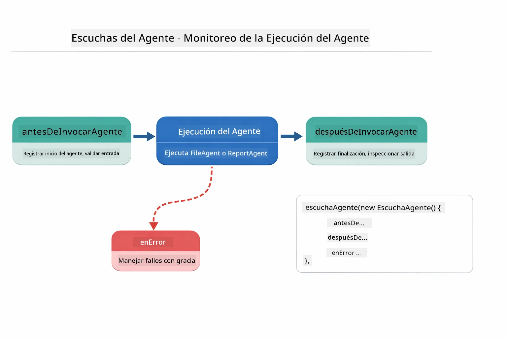

*Los Agent Listeners se enganchan en el ciclo de ejecución — monitorean cuando los agentes empiezan, terminan o encuentran errores.*

```java
AgentListener monitor = new AgentListener() {
    private int step = 0;
    
    @Override
    public void beforeAgentInvocation(AgentRequest request) {
        step++;
        System.out.println("  +-- STEP " + step + ": " + request.agentName());
    }
    
    @Override
    public void afterAgentInvocation(AgentResponse response) {
        System.out.println("  +-- [OK] " + response.agentName() + " completed");
    }
    
    @Override
    public boolean inheritedBySubagents() {
        return true; // Propagar a todos los subagentes
    }
};
```

Más allá del patrón Supervisor, el módulo `langchain4j-agentic` provee varios patrones de flujo de trabajo potentes. El diagrama abajo muestra los cinco — desde canalizaciones secuenciales simples hasta flujos de aprobación con intervención humana:

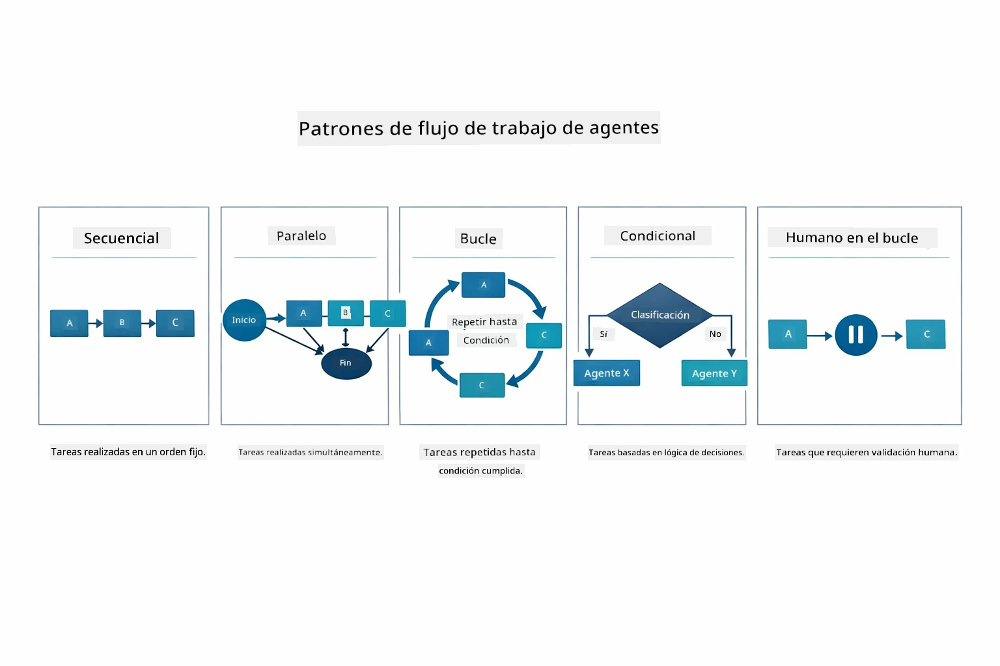

*Cinco patrones de flujo de trabajo para orquestar agentes — desde canalizaciones secuenciales simples hasta flujos de aprobación con intervención humana.*

| Patrón | Descripción | Caso de uso |
|---------|-------------|-------------|
| **Secuencial** | Ejecutar agentes en orden, la salida fluye al siguiente | Pipelines: investigación → análisis → reporte |
| **Paralelo** | Ejecutar agentes simultáneamente | Tareas independientes: clima + noticias + bolsa |
| **Bucle** | Iterar hasta cumplir condición | Puntuación de calidad: refinar hasta que la puntuación ≥ 0.8 |
| **Condicional** | Rutar basado en condiciones | Clasificar → rutar a agente especialista |
| **Intervención humana** | Añadir puntos de control humanos | Flujos de aprobación, revisión de contenido |

## Conceptos Clave

Ahora que has explorado MCP y el módulo agentic en acción, resumamos cuándo usar cada enfoque.

Una de las mayores ventajas de MCP es su ecosistema creciente. El diagrama a continuación muestra cómo un único protocolo universal conecta tu aplicación de IA con una amplia variedad de servidores MCP — desde acceso a sistema de archivos y bases de datos hasta GitHub, correo electrónico, scraping web, y más:

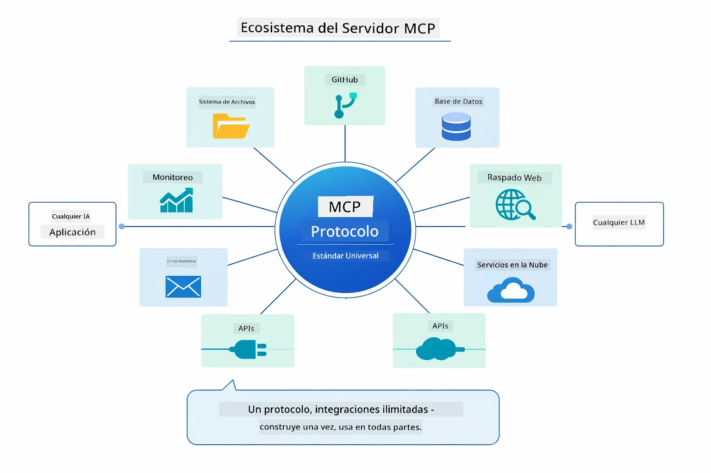

*MCP crea un ecosistema de protocolo universal — cualquier servidor compatible con MCP funciona con cualquier cliente compatible, permitiendo compartir herramientas entre aplicaciones.*

**MCP** es ideal cuando quieres aprovechar ecosistemas de herramientas existentes, construir herramientas para que varias aplicaciones las compartan, integrar servicios de terceros con protocolos estándar o cambiar implementaciones de herramientas sin modificar el código.

**El Módulo Agentic** funciona mejor cuando quieres definiciones declarativas de agentes con anotaciones `@Agent`, necesitas orquestación de flujos (secuencial, bucle, paralelo), prefieres diseño basado en interfaces en lugar de código imperativo, o combinas múltiples agentes que comparten salidas vía `outputKey`.

**El patrón Supervisor Agent** brilla cuando el flujo no es predecible de antemano y quieres que el LLM decida, cuando tienes múltiples agentes especializados que necesitan orquestación dinámica, al construir sistemas conversacionales que ruten a diferentes capacidades, o cuando quieres un comportamiento de agente más flexible y adaptativo.

Para ayudarte a decidir entre los métodos personalizados `@Tool` del Módulo 04 y las herramientas MCP de este módulo, la comparación siguiente resalta los principales compromisos — las herramientas personalizadas te ofrecen acoplamiento estrecho y seguridad total de tipos para lógica específica de la app, mientras que las herramientas MCP ofrecen integraciones estandarizadas y reutilizables:

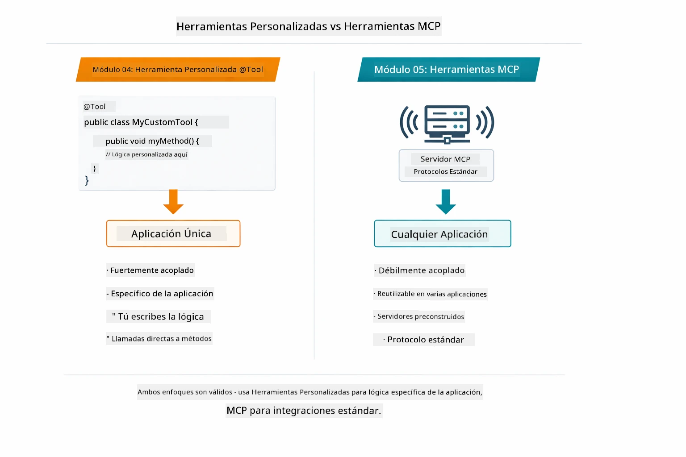

*Cuándo usar métodos personalizados @Tool vs herramientas MCP — herramientas personalizadas para lógica específica con seguridad total de tipos, herramientas MCP para integraciones estandarizadas que funcionan entre aplicaciones.*

## ¡Felicidades!

¡Has completado los cinco módulos del curso LangChain4j para Principiantes! Aquí tienes un vistazo del recorrido de aprendizaje completo que has realizado — desde chat básico hasta sistemas agentic potentes con MCP:

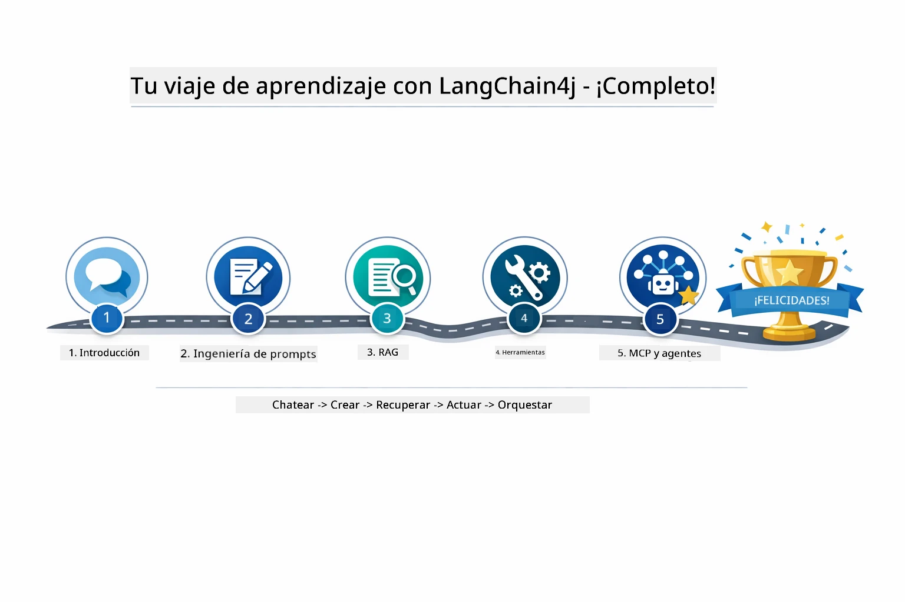

*Tu recorrido de aprendizaje a través de los cinco módulos — desde chat básico hasta sistemas agentic potentes con MCP.*

Has completado el curso LangChain4j para Principiantes. Has aprendido:

- Cómo construir IA conversacional con memoria (Módulo 01)
- Patrones de ingeniería de prompts para diferentes tareas (Módulo 02)
- Fundamentar respuestas en tus documentos con RAG (Módulo 03)
- Crear agentes básicos de IA (asistentes) con herramientas personalizadas (Módulo 04)
- Integrar herramientas estandarizadas con LangChain4j MCP y módulos Agentic (Módulo 05)

### ¿Y ahora qué?

Después de completar los módulos, explora la [Guía de Pruebas](../docs/TESTING.md) para ver los conceptos de testing en LangChain4j en acción.

**Recursos Oficiales:**
- [Documentación LangChain4j](https://docs.langchain4j.dev/) - Guías completas y referencia API
- [LangChain4j GitHub](https://github.com/langchain4j/langchain4j) - Código fuente y ejemplos
- [Tutoriales LangChain4j](https://docs.langchain4j.dev/tutorials/) - Tutoriales paso a paso para varios casos de uso

¡Gracias por completar este curso!

---

**Navegación:** [← Anterior: Módulo 04 - Herramientas](../04-tools/README.md) | [Volver al Inicio](../README.md)

---

<!-- CO-OP TRANSLATOR DISCLAIMER START -->
**Descargo de responsabilidad**:  
Este documento ha sido traducido utilizando el servicio de traducción por IA [Co-op Translator](https://github.com/Azure/co-op-translator). Aunque nos esforzamos por la precisión, tenga en cuenta que las traducciones automáticas pueden contener errores o inexactitudes. El documento original en su idioma nativo debe considerarse la fuente autorizada. Para información crítica, se recomienda una traducción profesional realizada por humanos. No nos hacemos responsables de ningún malentendido o interpretación errónea derivada del uso de esta traducción.
<!-- CO-OP TRANSLATOR DISCLAIMER END -->