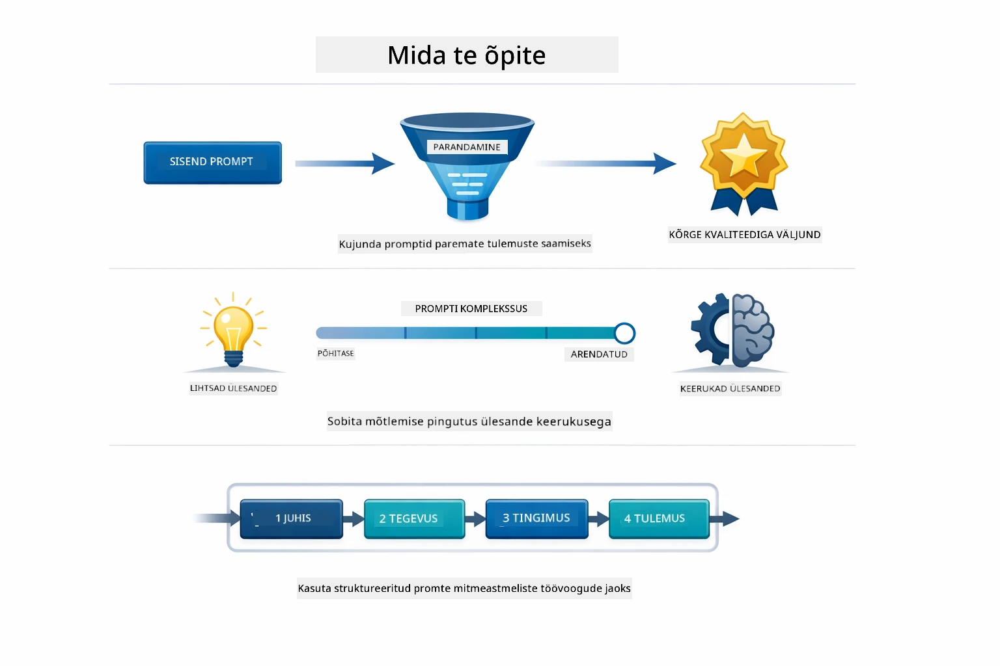
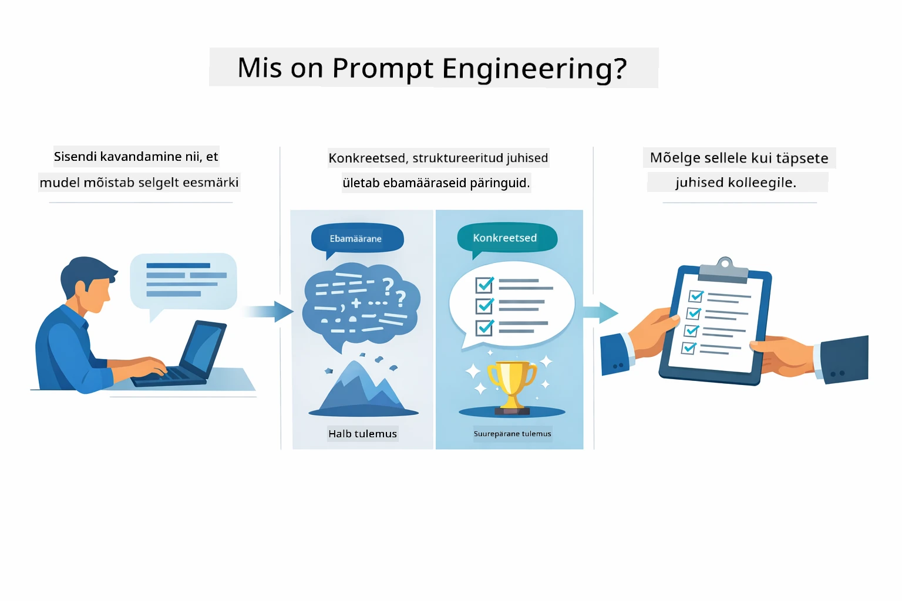
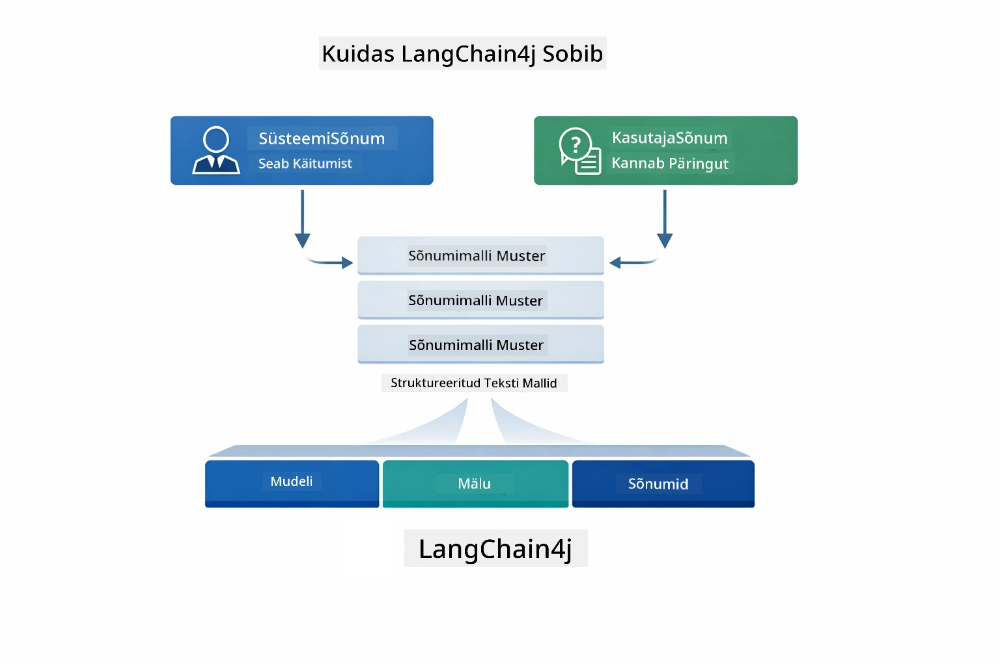
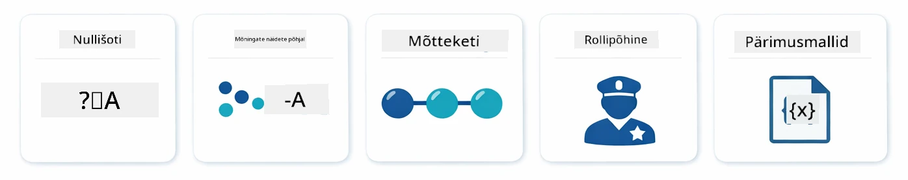
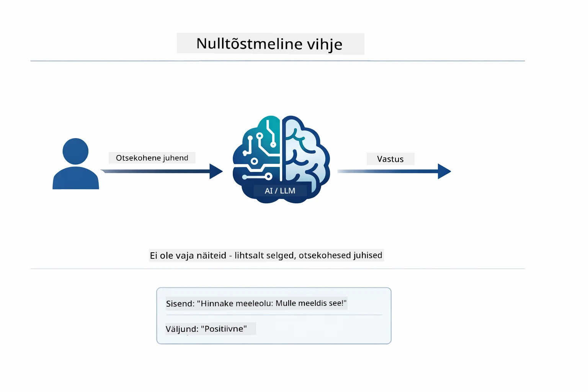
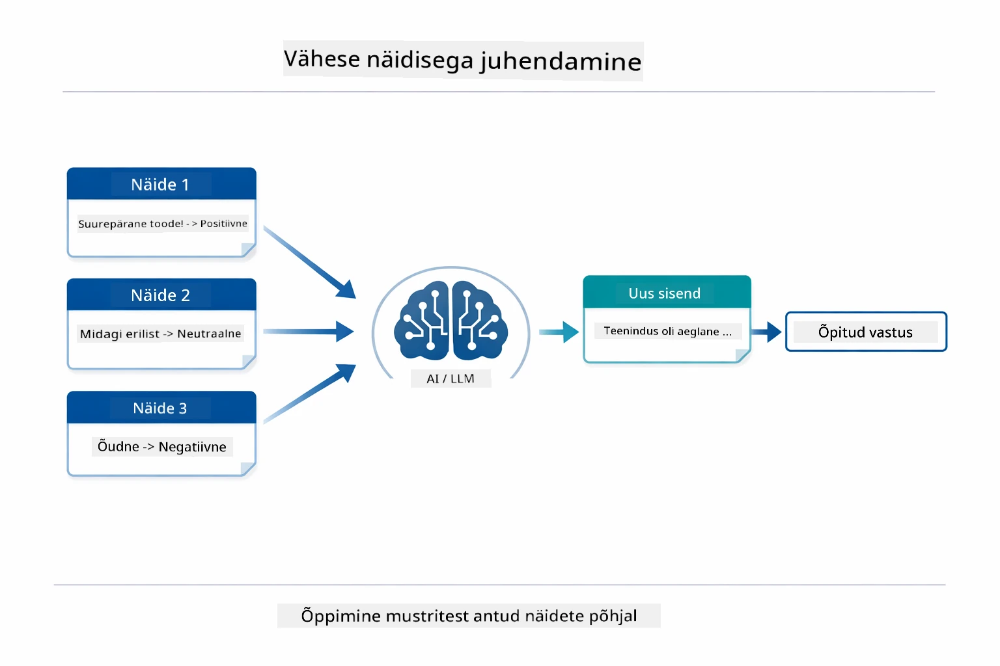
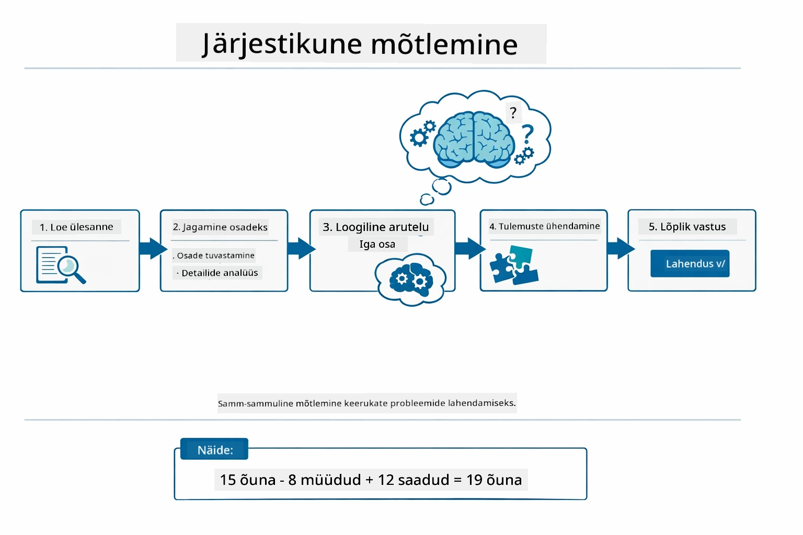
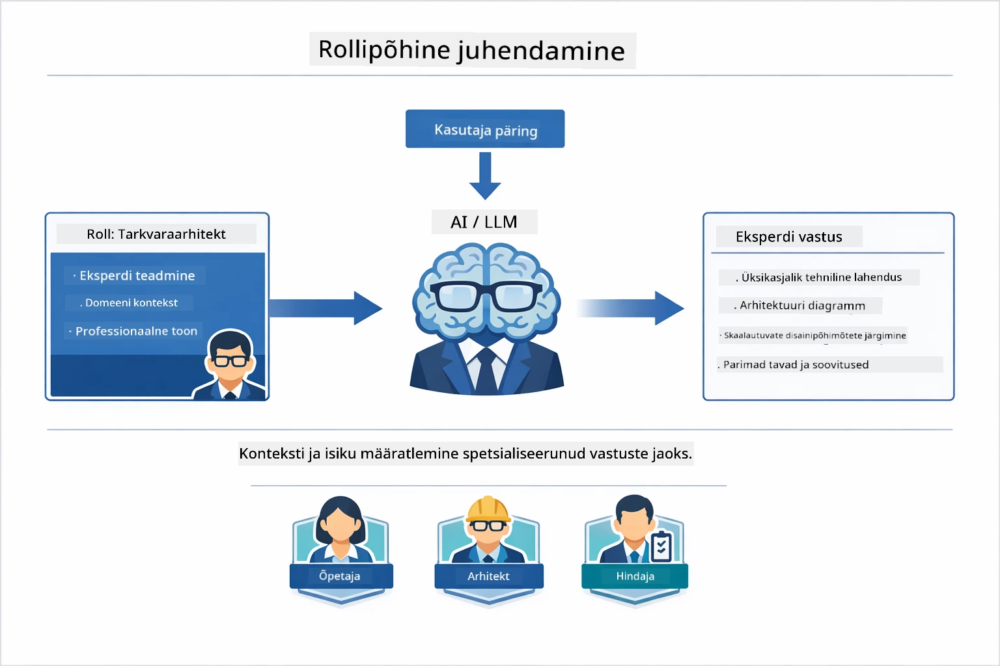
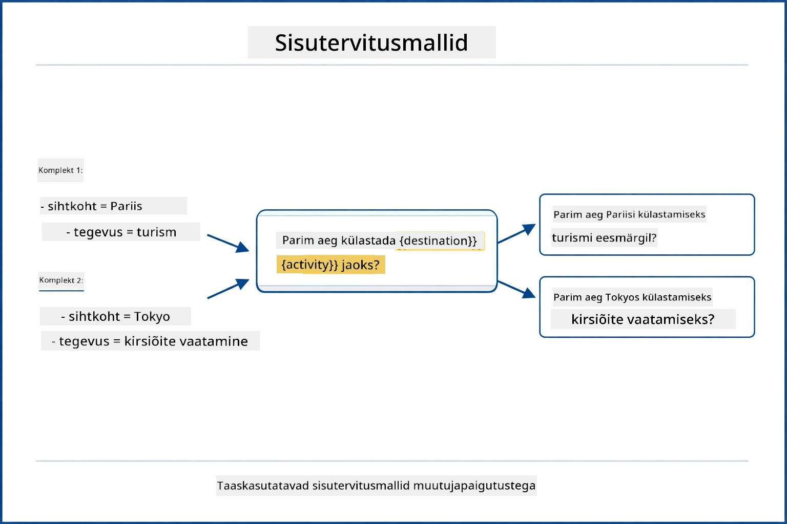
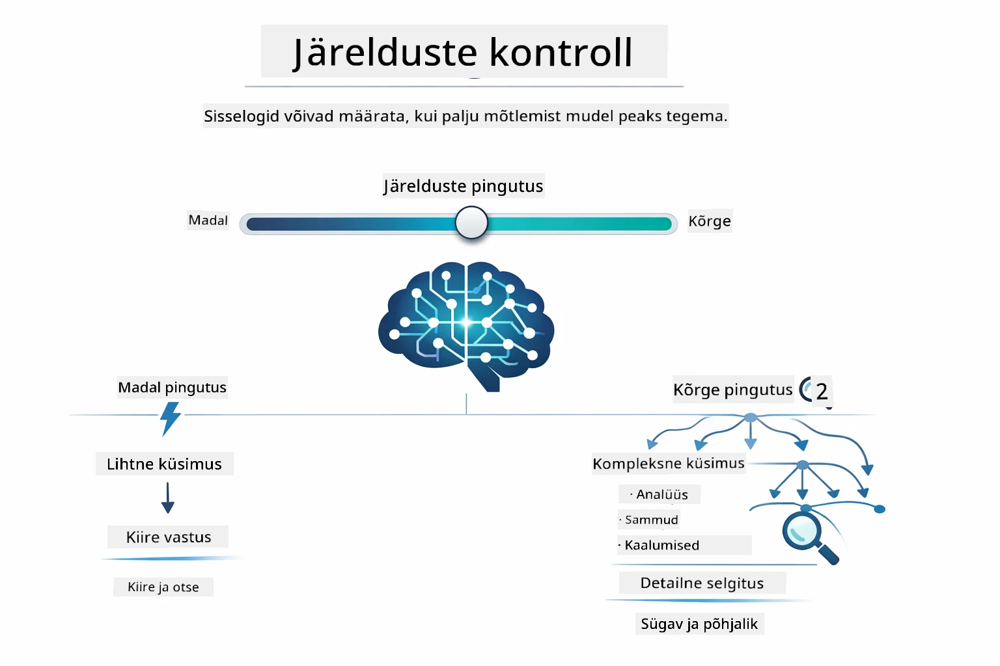

# Moodul 02: Viipade inseneritehnika GPT-5.2-ga

## Sisukord

- [Mida sa õpid](../../../02-prompt-engineering)
- [Eeltingimused](../../../02-prompt-engineering)
- [Viipade inseneritehnika mõistmine](../../../02-prompt-engineering)
- [Viipade inseneritehnika alused](../../../02-prompt-engineering)
  - [Null-löögiga viipamine](../../../02-prompt-engineering)
  - [Mõne-löögiga viipamine](../../../02-prompt-engineering)
  - [Mõtlemisahela viipamine](../../../02-prompt-engineering)
  - [Rollipõhine viipamine](../../../02-prompt-engineering)
  - [Viipade mallid](../../../02-prompt-engineering)
- [Täpsemad mustrid](../../../02-prompt-engineering)
- [Olemasolevate Azure'i ressursside kasutamine](../../../02-prompt-engineering)
- [Rakenduse ekraanipildid](../../../02-prompt-engineering)
- [Mustrite uurimine](../../../02-prompt-engineering)
  - [Madal vs kõrge innukus](../../../02-prompt-engineering)
  - [Ülesande täitmine (tööriistade sissejuhatused)](../../../02-prompt-engineering)
  - [Enesepeegeldav kood](../../../02-prompt-engineering)
  - [Struktureeritud analüüs](../../../02-prompt-engineering)
  - [Mitmekäiguline vestlus](../../../02-prompt-engineering)
  - [Samm-sammuline mõtlemine](../../../02-prompt-engineering)
  - [Piiratud väljund](../../../02-prompt-engineering)
- [Mida sa tegelikult õpid](../../../02-prompt-engineering)
- [Järgmised sammud](../../../02-prompt-engineering)

## Mida sa õpid



Eelnevas moodulis nägid, kuidas mälu võimaldab vestluslikku tehisintellekti ja kasutasid GitHubi mudeleid põhilisteks interaktsioonideks. Nüüd keskendume sellele, kuidas sa küsimusi esitad — viipadele endile — kasutades Azure OpenAI GPT-5.2. Viipade struktuur mõjutab oluliselt vastuste kvaliteeti. Alustame põhiviipade tehnika ülevaatega ja liigume edasi kaheksa täpsema mustri juurde, mis kasutavad GPT-5.2 täisvõimekust.

Kasutame GPT-5.2, kuna see tutvustab mõtlemise kontrolli – sa saad mudelile määrata, kui palju ta enne vastamist mõtlema peaks. See muudab erinevad viipade strateegiad selgemaks ja aitab sul mõista, millal mida kasutada. Samuti saame kasu Azure’i väiksematest piirmääradest GPT-5.2 puhul võrreldes GitHubi mudelitega.

## Eeltingimused

- Valmis Moodul 01 (Azure OpenAI ressursid juurutatud)
- `.env` fail juurkataloogis Azure'i volitustega (loodud `azd up` käsklusega Moodulis 01)

> **Märkus:** Kui sa ei ole veel Moodulit 01 lõpetanud, järgi esmalt seal olevaid juurutusjuhiseid.

## Viipade inseneritehnika mõistmine



Viipade inseneritehnika tähendab sisendi teksti kujundamist nii, et see pidevalt annab soovitud tulemused. See ei ole ainult küsimuste esitamine – vaid taotluste struktureerimine nii, et mudel täpselt mõistab, mida sa tahad ja kuidas seda esitada.

Mõtle sellele nagu kolleegile juhiste andmisele. "Paranda viga" on ebamäärane. "Paranda UserService.java faili rea 45 nulliviite erind, lisades nullikontrolli" on konkreetne. Keelemudelid töötavad samamoodi – täpsus ja struktuur on olulised.



LangChain4j pakub infrastruktuuri — mudeliühendused, mälu ja sõnumitüübid — samal ajal kui viipade mustrid on hoolikalt struktureeritud tekst, mida selle kaudu saadad. Peamised ehitusplokid on `SystemMessage` (mis määrab tehisintellekti käitumise ja rolli) ning `UserMessage` (mis kannab sinu tegelikku taotlust).

## Viipade inseneritehnika alused



Enne selle mooduli täpsemate mustrite juurde minekut vaatame üle viis alustehnikat. Need on ehitusplokid, mida iga viipade insener peaks teadma. Kui sa oled juba töötanud läbi [Kiiralgus mooduli](../00-quick-start/README.md#2-prompt-patterns), siis oled neid juba näinud — siin on nende kontseptuaalne raamistik.

### Null-löögiga viipamine

Kõige lihtsam lähenemine: anna mudelile otsekohene juhis ilma näideteta. Mudel tugineb täielikult oma treeningule ülesande mõistmiseks ja täitmiseks. See toimib hästi lihtsate päringute korral, kus oodatav käitumine on ilmne.



*Otsekohene juhis ilma näideteta — mudel järeldab ülesande ainult juhise põhjal*

```java
String prompt = "Classify this sentiment: 'I absolutely loved the movie!'";
String response = model.chat(prompt);
// Vastus: "Positiivne"
```

**Millal kasutada:** Lihtsad klassifikatsioonid, otsesed küsimused, tõlked või mõni ülesanne, mida mudel suudab ilma lisajuhendita täita.

### Mõne-löögiga viipamine

Esita näited, mis demonstreerivad mudelile soovitavat mustrit. Mudel õpib sinu näidetest eeskujulikku sisendi ja väljundi formaati ning rakendab seda uutele sisenditele. See parandab järjepidevust ülesannetes, kus soovitud formaat või käitumine pole ilmne.



*Õppimine näidete pealt — mudel tuvastab mustri ja rakendab seda uutele sisenditele*

```java
String prompt = """
    Classify the sentiment as positive, negative, or neutral.
    
    Examples:
    Text: "This product exceeded my expectations!" → Positive
    Text: "It's okay, nothing special." → Neutral
    Text: "Waste of money, very disappointed." → Negative
    
    Now classify this:
    Text: "Best purchase I've made all year!"
    """;
String response = model.chat(prompt);
```

**Millal kasutada:** Kohandatud klassifikatsioonid, järjepidev vormindus, domeenipõhised ülesanded või kui null-löögiga tulemused on ebajärjepidevad.

### Mõtlemisahela viipamine

Palju mudelit näitama oma mõtlemisprotsessi samm-sammult. Selle asemel, et kohe lõpule jõuda, jagab mudel probleemi osadeks ja töötab läbi iga osa selgelt. See parandab täpsust matemaatikas, loogikas ja mitmeastmelises mõtlemises.



*Samm-sammuline põhjendus — keerukate probleemide jagamine loogilisteks sammudeks*

```java
String prompt = """
    Problem: A store has 15 apples. They sell 8 apples and then 
    receive a shipment of 12 more apples. How many apples do they have now?
    
    Let's solve this step-by-step:
    """;
String response = model.chat(prompt);
// Mudel näitab: 15 - 8 = 7, siis 7 + 12 = 19 õuna
```

**Millal kasutada:** Matemaatikaülesanded, loogikamõistatused, vigade otsimine või sõltuvalt mõttekäigu näitamisest paraneb täpsus ja usaldus.

### Rollipõhine viipamine

Määra tehisintellektile persona või roll enne küsimuse esitamist. See annab konteksti, mis kujundab vastuse tooni, sügavust ja fookust. „Tarkvaraarhitekt“ annab teistsugust nõu kui „noorem arendaja“ või „turbeauditeerija“.



*Konteksti ja persona seadmine — sama küsimus saab erineva vastuse määratud rolli põhjal*

```java
String prompt = """
    You are an experienced software architect reviewing code.
    Provide a brief code review for this function:
    
    def calculate_total(items):
        total = 0
        for item in items:
            total = total + item['price']
        return total
    """;
String response = model.chat(prompt);
```

**Millal kasutada:** Koodikontrollid, juhendamine, domeenipõhine analüüs või kui vajad vastuseid, mis on kohandatud teatud ekspertteadmiste tasemele või perspektiivile.

### Viipade mallid

Loo taaskasutatavad viipad koos muutujate hoidlatega. Selle asemel, et iga kord uut viipa kirjutada, defineeri mall üks kord ja täida see erinevate väärtustega. LangChain4j `PromptTemplate` klass teeb seda lihtsaks `{{muutuja}}` süntaksiga.



*Taaskasutatavad viipad muutujate hoidlatega — üks mall, mitu kasutust*

```java
PromptTemplate template = PromptTemplate.from(
    "What's the best time to visit {{destination}} for {{activity}}?"
);

Prompt prompt = template.apply(Map.of(
    "destination", "Paris",
    "activity", "sightseeing"
));

String response = model.chat(prompt.text());
```

**Millal kasutada:** Korduvad päringud erinevate sisenditega, partiitöötlus, taaskasutatavate tehisintellektilahenduste loomine või olukorrad, kus viiba struktuur jääb samaks, kuid andmed muutuvad.

---

Need viis alustehnikat annavad sulle tugeva tööriistakomplekti enamike viipade ülesannete lahendamiseks. Selle mooduli ülejäänud osa ehitab nendele peale kaheksa täpse mustriga, mis kasutavad GPT-5.2 mõtlemise kontrolli, enesehindamise ja struktureeritud väljundi võimeid.

## Täpsemad mustrid

Põhialuste katmise järel liigume kaheksa täpse mustri juurde, mis teevad selle mooduli ainulaadseks. Kõik probleemid ei vaja sama lähenemist. Mõned küsimused vajavad kiireid vastuseid, teised süvenevat mõtlemist. Mõnel on vaja nähtavat põhjendust, teisel pelgalt tulemusi. Iga mustrit allpool on optimeeritud erinevateks olukordadeks — ja GPT-5.2 mõtlemise kontroll muudab need erinevused veelgi selgemaks.


*Kaheksa viipade insenerimustri ülevaade ja nende kasutusjuhtumid*



*GPT-5.2 mõtlemise kontroll lubab määrata, kui palju mudel peaks mõtlema — kiiretest otsestest vastustest süvauurimuseni*


*Madal innukus (kiire, otsene) vs kõrge innukus (põhjalik, uuriv) mõtlemisviisid*

**Madal innukus (Kiire ja Fookustatud)** - Lihtsate küsimuste jaoks, kus soovid kiireid, otseseid vastuseid. Mudel teeb minimaalset mõtlemist - maksimaalselt 2 sammu. Kasuta seda arvutuste, otsingute või lihtsate küsimuste puhul.

```java
String prompt = """
    <reasoning_effort>low</reasoning_effort>
    <instruction>maximum 2 reasoning steps</instruction>
    
    What is 15% of 200?
    """;

String response = chatModel.chat(prompt);
```

> 💡 **Uuri GitHub Copilotiga:** Ava [`Gpt5PromptService.java`](../../../02-prompt-engineering/src/main/java/com/example/langchain4j/prompts/service/Gpt5PromptService.java) ja küsi:
> - „Mis vahe on madala ja kõrge innukusega viipamismustritel?“
> - „Kuidas XML-sildid viipades aitavad AI vastust struktureerida?“
> - „Millal peaksin kasutama enesepeegeldamise mustreid ja millal otsest juhist?“

**Kõrge innukus (Sügav ja Põhjalik)** - Komplekssed probleemid, kus soovid põhjalikku analüüsi. Mudel uurib põhjalikult ja näitab detailset mõtlemist. Kasuta seda süsteemidisaini, arhitektuuriliste otsuste või keeruka uurimistöö jaoks.

```java
String prompt = """
    <reasoning_effort>high</reasoning_effort>
    <instruction>explore thoroughly, show detailed reasoning</instruction>
    
    Design a caching strategy for a high-traffic REST API.
    """;

String response = chatModel.chat(prompt);
```

**Ülesande täitmine (Samm-sammult edasimine)** - Mitmeastmeliste töövoogude jaoks. Mudel pakub esmalt plaani, jutustab iga sammu käigus ning seejärel annab kokkuvõtte. Kasuta seda migratsioonide, rakenduste või mistahes mitmeastmelise protsessi puhul.

```java
String prompt = """
    <task>Create a REST endpoint for user registration</task>
    <preamble>Provide an upfront plan</preamble>
    <narration>Narrate each step as you work</narration>
    <summary>Summarize what was accomplished</summary>
    """;

String response = chatModel.chat(prompt);
```

Mõtlemisahela viipamine kutsub mudelit selgelt näitama oma mõtlemisprotsessi, parandades täpsust keerulistes ülesannetes. Samm-sammuline jaotus aitab nii inimestel kui AI-l loogikat mõista.

> **🤖 Proovi [GitHub Copilotiga](https://github.com/features/copilot) Chat'is:** Küsi selle mustri kohta:
> - „Kuidas kohandada ülesande täitmist pikaajaliste operatsioonide jaoks?“
> - „Millised on parimad tavad tööriistade sissejuhatuste struktureerimiseks tootmisrakendustes?“
> - „Kuidas jäädvustada ja kuvada UI-s vahepealseid edenemisvärskendusi?“


*Plaanimine → Täitmine → Kokkuvõtte tegemine mitmeastmeliste ülesannete jaoks*

**Enesepeegeldav kood** - Toodangukvaliteediga koodi genereerimiseks. Mudel genereerib koodi, kontrollib seda kvaliteedikriteeriumide suhtes ja parendab seda iteratiivselt. Kasuta uut funktsionaalsust või teenuseid ehitades.

```java
String prompt = """
    <task>Create an email validation service</task>
    <quality_criteria>
    - Correct logic and error handling
    - Best practices (clean code, proper naming)
    - Performance optimization
    - Security considerations
    </quality_criteria>
    <instruction>Generate code, evaluate against criteria, improve iteratively</instruction>
    """;

String response = chatModel.chat(prompt);
```


*Iteratiivne parendamise tsükkel - genereeri, hinda, tuvast, paranda, korda*

**Struktureeritud analüüs** - Järjepideva hindamise jaoks. Mudel vaatab koodi läbi fikseeritud raamistiku (õigsus, tavad, jõudlus, turvalisus). Kasuta koodikontrollide või kvaliteedi hindamise jaoks.

```java
String prompt = """
    <code>
    public List getUsers() {
        return database.query("SELECT * FROM users");
    }
    </code>
    
    <framework>
    Evaluate using these categories:
    1. Correctness - Logic and functionality
    2. Best Practices - Code quality
    3. Performance - Efficiency concerns
    4. Security - Vulnerabilities
    </framework>
    """;

String response = chatModel.chat(prompt);
```

> **🤖 Proovi [GitHub Copilotiga](https://github.com/features/copilot) Chat'is:** Küsi struktureeritud analüüsi kohta:
> - „Kuidas kohandada analüüsiraamistikku erinevate koodikontrollitüüpide jaoks?“
> - „Mis on parim viis struktureeritud väljundi programmeerimiseks analüüsimiseks ja tegutsemiseks?“
> - „Kuidas tagada järjepidevad raskusastmed erinevate kontrollsessioonide vahel?“


*Neljaliikmeline raamistik järjepidevate koodikontrollide jaoks raskusastmete tasemetega*

**Mitmekäiguline vestlus** - Vestlused, mis vajavad konteksti. Mudel mäletab eelmisi sõnumeid ja ehitab nende põhjal edasi. Kasuta interaktiivsete abiseansside või keeruka K&V jaoks.

```java
ChatMemory memory = MessageWindowChatMemory.withMaxMessages(10);

memory.add(UserMessage.from("What is Spring Boot?"));
AiMessage aiMessage1 = chatModel.chat(memory.messages()).aiMessage();
memory.add(aiMessage1);

memory.add(UserMessage.from("Show me an example"));
AiMessage aiMessage2 = chatModel.chat(memory.messages()).aiMessage();
memory.add(aiMessage2);
```


*Kuidas vestluse kontekst koguneb mitme käigu jooksul, kuni jõuab tokeni piirini*

**Samm-sammuline mõtlemine** - Probleemide jaoks, mis vajavad nähtavat loogikat. Mudel näitab iga sammu selget põhjendust. Kasuta matemaatikaülesannete, loogikamõistatuste või mõtlemisprotsessi mõistmise jaoks.

```java
String prompt = """
    <instruction>Show your reasoning step-by-step</instruction>
    
    If a train travels 120 km in 2 hours, then stops for 30 minutes,
    then travels another 90 km in 1.5 hours, what is the average speed
    for the entire journey including the stop?
    """;

String response = chatModel.chat(prompt);
```


*Probleemide jagamine selgeteks loogilisteks sammudeks*

**Piiratud väljund** - Vastuste jaoks, millel on kindlad formaadi nõuded. Mudel järgib rangelt vormingu ja pikkuse reegleid. Kasuta kokkuvõtete või täpse väljundi struktuuriga juhtudel.

```java
String prompt = """
    <constraints>
    - Exactly 100 words
    - Bullet point format
    - Technical terms only
    </constraints>
    
    Summarize the key concepts of machine learning.
    """;

String response = chatModel.chat(prompt);
```


*Kindlate formaadi, pikkuse ja struktuuri nõuete järgimine*

## Olemasolevate Azure'i ressursside kasutamine

**Kontrolli juurutust:**

Veendu, et `.env` fail on juurkataloogis koos Azure'i volitustega (loodud Moodulis 01):
```bash
cat ../.env  # Peaks näitama AZURE_OPENAI_ENDPOINT, API_KEY, DEPLOYMENT
```

**Rakenduse käivitamine:**

> **Märkus:** Kui oled juba käivitanud kõik rakendused käsuga `./start-all.sh` Moodulis 01, siis see moodul töötab juba pordil 8083. Võid allolevad käivituskäsud vahele jätta ja minna otse aadressile http://localhost:8083.

**Variant 1: Kasutades Spring Booti Armatuurlaua (Soovitatav VS Code kasutajatele)**

Arenduskonteiner sisaldab Spring Booti Armatuurlaua laiendust, mis pakub visuaalset kasutajaliidest kõigi Spring Boot rakenduste haldamiseks. Selle leiad VS Code vasaku küljeriba Aktiivsusribalt (otsi Spring Boot ikooni).
Spring Booti juhtpaneelilt saate:
- Näha kõiki tööruumis saadaolevaid Spring Booti rakendusi
- Käivitada/peatada rakendusi ühe klõpsuga
- Vaadata rakenduse logisid reaalajas
- Jälgida rakenduse olekut

Lihtsalt klõpsake nuppu "prompt-engineering" kõrval, et see moodul käivitada, või käivitage kõik moodulid korraga.


**Variant 2: Kasutades shell-skripte**

Käivitage kõik veebirakendused (moodulid 01-04):

**Bash:**
```bash
cd ..  # Juurekataloogist
./start-all.sh
```

**PowerShell:**
```powershell
cd ..  # Juurekataloogist
.\start-all.ps1
```

Või käivitage ainult see moodul:

**Bash:**
```bash
cd 02-prompt-engineering
./start.sh
```

**PowerShell:**
```powershell
cd 02-prompt-engineering
.\start.ps1
```

Mõlemad skriptid laadivad automaatselt juurfailist `.env` keskkonnamuutujad ja ehitavad JAR-failid, kui need puuduvad.

> **Märkus:** Kui soovite enne käivitamist kõik moodulid käsitsi ehitada:
>
> **Bash:**
> ```bash
> cd ..  # Go to root directory
> mvn clean package -DskipTests
> ```

> **PowerShell:**
> ```powershell
> cd ..  # Go to root directory
> mvn clean package -DskipTests
> ```

Avage oma brauseris http://localhost:8083.

**Peatamiseks:**

**Bash:**
```bash
./stop.sh  # Ainult see moodul
# Või
cd .. && ./stop-all.sh  # Kõik moodulid
```

**PowerShell:**
```powershell
.\stop.ps1  # Ainult see moodul
# Või
cd ..; .\stop-all.ps1  # Kõik moodulid
```

## Rakenduse ekraanipildid


*Peamine juhtpaneel, mis näitab kõiki 8 prompt-engeneerimise mustrit nende omaduste ja kasutusjuhtumitega*

## Musteride uurimine

Veebiliides võimaldab teil katsetada erinevaid promptimise strateegiaid. Iga muster lahendab erinevaid probleeme – proovige neid, et näha, millal iga lähenemisviis tõeliselt toimib.

### Madal vs Kõrge innukus

Esitage lihtne küsimus, nt "Mis on 15% arvust 200?" kasutades madalat innukust. Saate kohe otsese vastuse. Nüüd küsige midagi keerulisemat, näiteks "Kujunda vahemälustrateegia suure liiklusega API-le" kõrge innukusega. Vaadake, kuidas mudel aeglustub ja annab põhjaliku põhjenduse. Sama mudel, sama küsimuse struktuur – aga prompt näitab, kui palju mõtlemist tehakse.


*Kiire arvutus minimaalsete põhjendustega*


*Kõikehõlmav vahemälustrateegia (2.8MB)*

### Ülesande täitmine (tööriistade sissejuhatused)

Mitmeetapilised töövood vajavad eelplaneerimist ja edenemise jutustamist. Mudel kirjeldab, mida ta teeb, jutustab iga sammu ja seejärel võtab tulemused kokku.


*REST-endpointi loomine samm-sammult jutustades (3.9MB)*

### Enesereflekteeriv kood

Proovige käsku "Loo e-posti valideerimisteenus". Selle asemel, et lihtsalt koodi genereerida ja lõpetada, genereerib mudel, hindab kvaliteedikriteeriumite alusel, tuvastab nõrkused ja täiustab. Näete, kuidas ta kordab protsessi, kuni kood vastab tootmistasemele.


*Täielik e-posti valideerimisteenus (5.2MB)*

### Struktureeritud analüüs

Koodide ülevaatus nõuab järjepidevaid hindamiskriteeriume. Mudel analüüsib koodi kindlates kategooriates (õigsus, tavad, jõudlus, turvalisus) koos raskusastmega.


*Koodide ülevaatus raamistiku alusel*

### Mitme vooruga vestlus

Küsige "Mis on Spring Boot?" ja kohe seejärel "Näita mulle näidet". Mudel mäletab teie esimest küsimust ja annab teile spetsiaalse Spring Booti näite. Ilma mäluta oleks teine küsimus liiga ebamäärane.


*Konteksti säilitamine küsimuste vahel*

### Samm-sammuline põhjendus

Valige matemaatikaprobleem ja proovige seda nii samm-sammult põhjendus kui ka madala innukusega. Madal innukus annab vastuse kiiresti, kuid lühidalt. Samm-sammuline näitab kõiki arvutusi ja otsuseid.


*Matemaatikaprobleem eksplicitsete sammudega*

### Piiratud väljund

Kui vajate kindlaid vorminguid või sõnade arvu, sunnib see muster ranget täpsust. Proovige genereerida kokkuvõtet, mis koosneb täpselt 100 sõnast punktide vormingus.


*Masinõppe kokkuvõte vormingu kontrolliga*

## Mida te tegelikult õpite

**Põhjenduskulu muudab kõik**

GPT-5.2 võimaldab teil oma promptide kaudu kontrollida arvutuslikku pingutust. Madal pingutus tähendab kiireid vastuseid minimaalse otsinguga. Kõrge pingutus tähendab, et mudel võtab aega põhjalikuks mõtlemiseks. Õpite vastavalt ülesande keerukusele pingutust määrama – ärge raisake aega lihtsatele küsimustele, aga ärge kiirustage keerukate otsustega.

**Struktuur juhib käitumist**

Kas märkasite promptides XML-silte? Need ei ole dekoratiivsed. Mudelid järgivad struktureeritud juhiseid palju usaldusväärsemalt kui vaba vormi teksti. Kui vajate mitmeastmelisi protsesse või keerukat loogikat, aitab struktuur mudelil jälgida, kus ta on ja mis järgmiseks tuleb.


> *Hästi struktureeritud prompti anatoomia selgete jaotistega ning XML-laadse organiseerimisega*

**Kvaliteet läbi enesehindamise**

Enesereflekteerivad mustrid töötavad, muutes kvaliteedikriteeriumid selgelt väljendatuks. Selle asemel, et loota mudeli "õiget tegemist", ütlete sellele täpselt, mis tähendab "õiget": korrektne loogika, veahaldus, jõudlus, turvalisus. Seejärel saab mudel hinnata oma väljundi ja parandada seda. See muudab koodigeneratsiooni loteriist protsessiks.

**Kontekst on piiratud**

Mitme vooruga vestlused töötavad, lisades iga päringu juurde sõnumite ajaloo. Kuid on piirang – igal mudelil on maksimaalne tokenite arv. Vestluste kasvades peate leidma strateegiad, kuidas hoida asjakohast konteksti ilma seda limiiti ületamata. See moodul näitab teile, kuidas mälu töötab; hiljem õpite, millal kokku võtta, millal unustada ja millal taastada.

## Järgmised sammud

**Järgmine moodul:** [03-rag - RAG (otsingu-põhine genereerimine)](../03-rag/README.md)

---

**Navigeerimine:** [← Eelmine: Moodul 01 - Sissejuhatus](../01-introduction/README.md) | [Tagasi peamenüüsse](../README.md) | [Järgmine: Moodul 03 - RAG →](../03-rag/README.md)

---

<!-- CO-OP TRANSLATOR DISCLAIMER START -->
**Vastutusest loobumine**:
See dokument on tõlgitud tehisintellekti tõlketeenuse [Co-op Translator](https://github.com/Azure/co-op-translator) abil. Kuigi püüame tagada täpsust, palun pidage meeles, et automatiseeritud tõlgetes võib esineda vigu või ebatäpsusi. Originaaldokument oma emakeeles tuleks pidada autoriteetseks allikaks. Tähtsa teabe puhul soovitatakse kasutada professionaalset inimese tehtud tõlget. Me ei vastuta selles tõlkes esinevate arusaamatuste või valesti mõistmiste eest.
<!-- CO-OP TRANSLATOR DISCLAIMER END -->