# Moodul 03: RAG (otsingul põhinev generatsioon)

## Sisukord

- [Video juhend](../../../03-rag)
- [Mida sa õpid](../../../03-rag)
- [Eeltingimused](../../../03-rag)
- [RAG mõistmine](../../../03-rag)
  - [Millist RAG lähenemist see juhend kasutab?](../../../03-rag)
- [Kuidas see töötab](../../../03-rag)
  - [Dokumendi töötlemine](../../../03-rag)
  - [Manuste loomine](../../../03-rag)
  - [Semantiline otsing](../../../03-rag)
  - [Vastuse genereerimine](../../../03-rag)
- [Rakenduse käivitamine](../../../03-rag)
- [Rakenduse kasutamine](../../../03-rag)
  - [Dokumendi üleslaadimine](../../../03-rag)
  - [Küsimuste esitamine](../../../03-rag)
  - [Allikaviidete kontrollimine](../../../03-rag)
  - [Katsetamine küsimustega](../../../03-rag)
- [Olulised mõisted](../../../03-rag)
  - [Tükkideks jagamise strateegia](../../../03-rag)
  - [Sarnasuse skoorid](../../../03-rag)
  - [Mäluhoidla](../../../03-rag)
  - [Kontekstivaate haldamine](../../../03-rag)
- [Millal RAG on oluline](../../../03-rag)
- [Järgmised sammud](../../../03-rag)

## Video juhend

Vaata seda otseülekannet, mis selgitab, kuidas selle mooduli tööga alustada:

<a href="https://www.youtube.com/watch?v=_olq75ZH_eY"></a>

## Mida sa õpid

Eelnevates moodulites õppisid, kuidas suhelda tehisintellektiga ja oma päringuid tõhusalt struktureerida. Kuid on üks põhiseade: keelemudelid teavad ainult seda, mida nad on treeningu käigus saanud. Nad ei saa vastata küsimustele sinu ettevõtte poliitikate, projektdokumentatsiooni või muu teabe kohta, mida neile ei ole õpetatud.

RAG (otsingul põhinev generatsioon) lahendab selle probleemi. Selle asemel, et mudelit sinu info õpetada (mis on kallis ja ebaotstarbekas), annad talle võimekus otsida sinu dokumentide seast. Kui keegi küsib küsimuse, leiab süsteem asjakohase info ja lisab selle päringusse. Mudel vastab siis selle leidunud konteksti põhjal.

Mõtle RAG-ile kui viitekogule mudelile. Kui sa küsid küsimust, teeb süsteem:

1. **Kasutaja päring** – Sa esitad küsimuse  
2. **Manustamine** – Muudab sinu küsimuse vektoriks  
3. **Vektorotsing** – Leiab sarnased dokumenditükid  
4. **Konteksti kokkupanek** – Lisab asjakohased tükid päringusse  
5. **Vastus** – LLM genereerib vastuse konteksti põhjal  

See kinnitab mudeli vastused sinu tegelikele andmetele, selle asemel et tugineda ainult treeningteabele või vastuseid välja mõelda.

## Eeltingimused

- Läbitud [Moodul 00 - Kiirstart](../00-quick-start/README.md) (viidatud lihtsama RAG näite jaoks)  
- Läbitud [Moodul 01 - Sissejuhatus](../01-introduction/README.md) (Azure OpenAI ressursid paigaldatud, sh `text-embedding-3-small` manustamismudel)  
- `.env` fail juurkaustas koos Azure mandaatidega (loodud `azd up` käsuga Moodulis 01)

> **Märkus:** Kui sa pole läbinud Moodulit 01, järgi esmalt seal olevaid paigaldamisjuhiseid. Käsk `azd up` paigaldab nii GPT vestlusmudeli kui ka manustamismudeli, mida see moodul kasutab.

## RAG mõistmine

Järgmine skeem illustreerib põhikontseptsiooni: selle asemel, et tugineda ainult mudeli treeningandmetele, annab RAG mudelile sinu dokumentide viitekogul, mida ta enne iga vastuse genereerimist küsida saab.

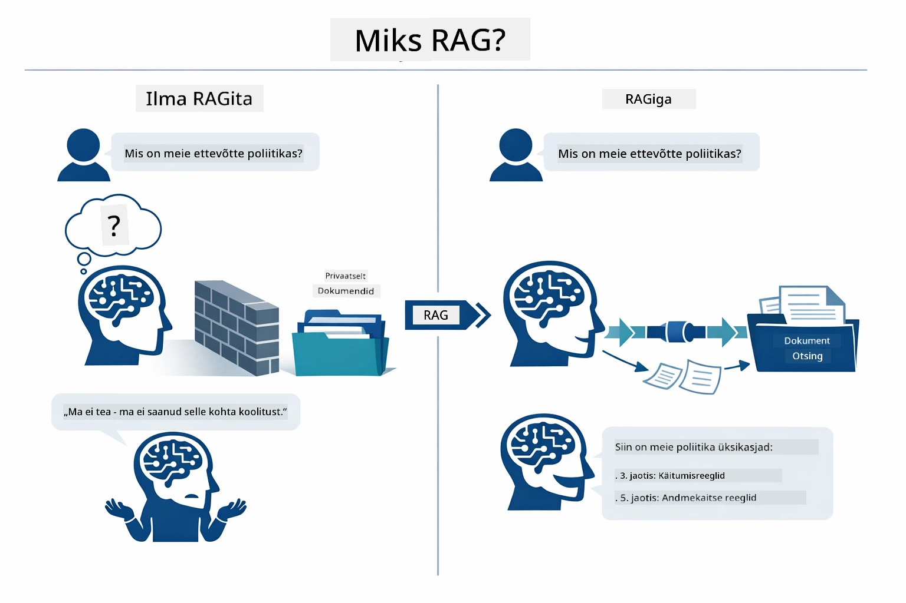

*See skeem näitab erinevust tavapärase LLM-i (mis arvestab treeningandmeid) ja RAG-ga täiustatud LLM-i vahel (mis kõigepealt küsib sinu dokumente).*

Siin on, kuidas osad lõime — kasutaja küsimus läbib neli etappi: manustamine, vektorotsing, konteksti kokkupanek ja vastuse genereerimine — iga samm toetub eelnevale:


*See skeem näitab RAG lõimtoru täielikku kulgu — kasutaja päring läbib manustamise, vektorotsingu, konteksti kokkupaneku ja vastuse genereerimise.*

Järgmised jaotised selgitavad iga etappi detailsemalt koos käivitatava ja muudetava koodiga.

### Millist RAG lähenemist see juhend kasutab?

LangChain4j pakub kolme RAG realiseerimise viisi, igaüks erineva abstraktsioonitasemega. Allolev skeem võrdleb neid kõrvuti:

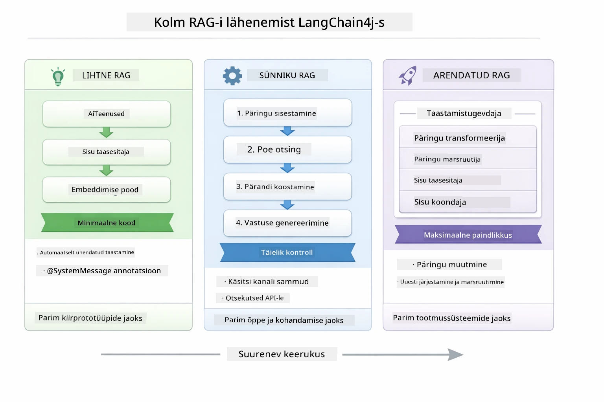

*See skeem võrdleb kolme LangChain4j RAG lähenemist — lihtne, natiivne ja täiustatud — näidates peamisi komponente ja sobivust.*

| Lähenemine | Mida see teeb | Kompromiss |
|---|---|---|
| **Lihtne RAG** | Sidub kõik automaatselt läbi `AiServices` ja `ContentRetriever`. Sa märgistad liidese, lisad retriiveri ja LangChain4j haldab manustamist, otsingut ning päringu kokkupanekut automaatselt. | Vähe koodi, kuid sa ei näe iga sammu sisemust. |
| **Natiivne RAG** | Sa kutsud manustamismudeli, otsid salvestist, koostad päringu ja genereerid vastuse ise — iga samm eraldi. | Rohkem koodi, aga iga etapp on nähtav ja muudetav. |
| **Täiustatud RAG** | Kasutab `RetrievalAugmentor` raamistiku koos vahetatavate päringutöötlusradade, ruuterite, ümberjärjestajate ja sisu süstijatega tootmistaseme lõimtorude jaoks. | Maksimaalne paindlikkus, aga oluliselt keerulisem. |

**See juhend kasutab Natiivset lähenemist.** Kõik RAG lõimtoru sammud – päringu manustamine, vektoripoest otsimine, konteksti kokkupanek ja vastuse genereerimine – on kirjas selgelt failis [`RagService.java`](../../../03-rag/src/main/java/com/example/langchain4j/rag/service/RagService.java). See on sihipärane: õppimismaterjalina on tähtsam, et näeksite ja mõistaksite iga etappi, mitte et kood oleks minimaalne. Kui oled nendest osadest aru saanud, saad liikuda Lihtsa RAG kasutusele kiirete prototüüpide jaoks või Täiustatud RAG kasutusele tootmissüsteemide jaoks.

> **💡 Kas oled juba näinud Lihtsat RAG-i töös?** [Kiirstarti moodul](../00-quick-start/README.md) sisaldab dokumendi Q&A näidet ([`SimpleReaderDemo.java`](../../../00-quick-start/src/main/java/com/example/langchain4j/quickstart/SimpleReaderDemo.java)), mis kasutab Lihtsat RAG-i — LangChain4j haldab manustamist, otsingut ja päringu kokkupanekut automaatselt. See moodul läheb samm edasi ja avab selle lõimtoru, et saaksid iga etapi ise näha ja kontrollida.

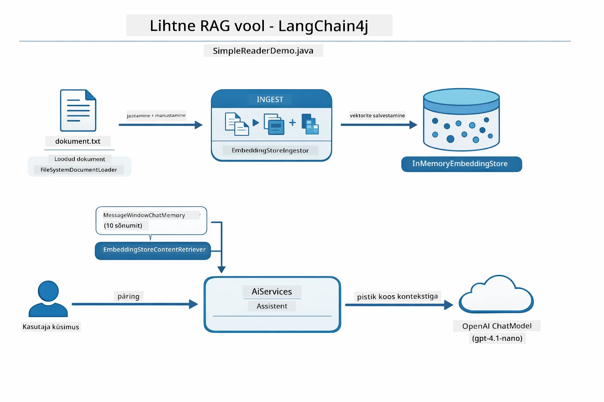

*See skeem näitab Lihtsat RAG lõimtoru `SimpleReaderDemo.java`-st. Võrdle seda Natiivse lähenemisega, mida see moodul kasutab: Lihtne RAG varjab manustamist, otsingut ja päringu kokkupanekut `AiServices` ja `ContentRetriever` taga — sa laed dokumendi, lisad retriiveri ja saad vastused. Natiivne lähenemine selles moodulis avab lõimtoru, nii et iga etappi (manusta, otsi, kogu kontekst, genereeri) kutsud ise, pakkudes täielikku nähtavust ja kontrolli.*

## Kuidas see töötab

Selles moodulis on RAG lõimtoru jagatud neljaks etapiks, mis käivituvad järjest iga kord, kui kasutaja esitab küsimuse. Esiteks töödeldakse üleslaaditud dokument **tükikesteks** — hallatavateks osadeks. Need tükid teisendatakse **vektormanusteks** ja salvestatakse, et neid saaks matemaatiliselt võrrelda. Küsimuse saabudes teeb süsteem **semantilise otsingu**, et leida kõige asjakohasemad tükid ja annab need LLM-ile **vastuse genereerimiseks**. Alljärgnevad jaotised kirjeldavad iga sammu koos tegeliku koodi ja skeemidega. Alustame esimesest etapist.

### Dokumendi töötlemine

[DocumentService.java](../../../03-rag/src/main/java/com/example/langchain4j/rag/service/DocumentService.java)

Kui sa laadid dokumendi üles, töötleb süsteem seda (PDF või tavaline tekst), lisab metainformatsiooni nagu failinimi ja jagab dokumendi tükikesteks — väiksemateks osadeks, mis mahuvad mugavalt mudeli kontekstiaknasse. Need tükid kattuvad veidi, et piiril ei kaoks kontekst.

```java
// Analüüsi üles laaditud faili ja paki see LangChain4j dokumendi sisse
Document document = Document.from(content, metadata);

// Jaga 300-sõnalisteks tükkideks, millel on 30-sõnaline kattuvus
DocumentSplitter splitter = DocumentSplitters
    .recursive(300, 30);

List<TextSegment> segments = splitter.split(document);
```

Järgmine skeem annab visuaalse ülevaate, kuidas see töötab. Märka, kuidas iga tükk jagab mõningaid tokeneid naabritega — 30 tokenit kattuvus tagab, et oluline kontekst ei kao tükkide vahele:

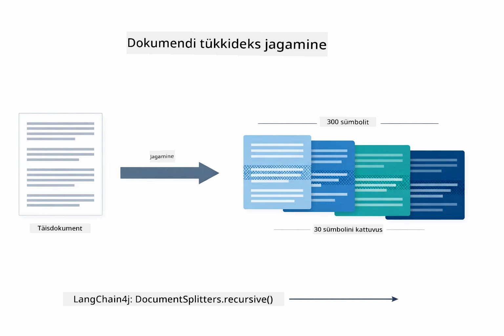

*See skeem näitab, kuidas dokument jagatakse 300-tokenilisteks tükkideks, millel on 30-tokeniline kattuvus, et säilitada kontekst tükkide piiridel.*

> **🤖 Proovi [GitHub Copilot](https://github.com/features/copilot) Chatiga:** Ava [`DocumentService.java`](../../../03-rag/src/main/java/com/example/langchain4j/rag/service/DocumentService.java) ja küsi:
> - "Kuidas jagab LangChain4j dokumendid tükkideks ja miks on kattuvus oluline?"
> - "Mis on optimaalsed tükkide suurused erinevate dokumenditüüpide jaoks ja miks?"
> - "Kuidas käsitleda dokumente mitmes keeles või erilise vormindusega?"

### Manuste loomine

[LangChainRagConfig.java](../../../03-rag/src/main/java/com/example/langchain4j/rag/config/LangChainRagConfig.java)

Iga tükk teisendatakse numbriliseks esitluseks, mida nimetatakse manuseks — sisuliselt tähenduste numbriteks teisendajaks. Manustamismudel ei ole "intelligentne" samamoodi nagu vestlusmudel; ta ei oska juhiseid järgida, mõelda ega küsimustele vastata. Mis ta oskab, on teksti kaardistamine matemaatilisse ruumi, kus sarnased tähendused paiknevad üksteisele lähedal — "auto" on lähedal "sõidukile", "tagasimakse poliitika" lähedal "raha tagastamisele". Mõtle vestlusmudelile kui inimesele, kellega saab rääkida; manustamismudel on ultrahea arhiveerimissüsteem.

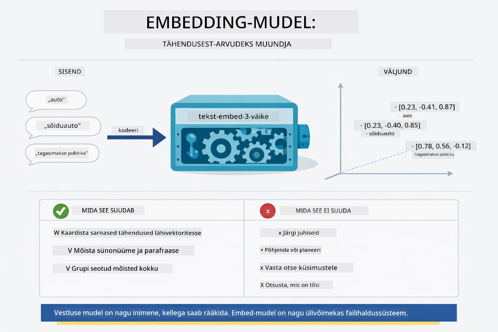

*See skeem näitab, kuidas manustamismudel teisendab teksti numbrilisteks vektoriteks, pannes sarnased tähendused — nagu "auto" ja "sõiduk" — üksteisele lähedale vektoriruumi.*

```java
@Bean
public EmbeddingModel embeddingModel() {
    return OpenAiOfficialEmbeddingModel.builder()
        .baseUrl(azureOpenAiEndpoint)
        .apiKey(azureOpenAiKey)
        .modelName(azureEmbeddingDeploymentName)
        .build();
}

EmbeddingStore<TextSegment> embeddingStore = 
    new InMemoryEmbeddingStore<>();
```

Alljärgnev klassiskeem näitab kahte erinevat voogu RAG lõimtorus ja LangChain4j klasse, mis neid realiseerivad. **Sisseiuvamise voog** (käivitatakse kord üleslaadimisel) jagab dokumendi, embedib tükid ja salvestab need meetodiga `.addAll()`. **Päringu voog** (käib iga kord, kui kasutaja küsib) embedib küsimuse, otsib poes meetodiga `.search()` ja annab leitud konteksti vestlusmudelile. Mõlemad vood koonduvad ühise liidese `EmbeddingStore<TextSegment>` taha:

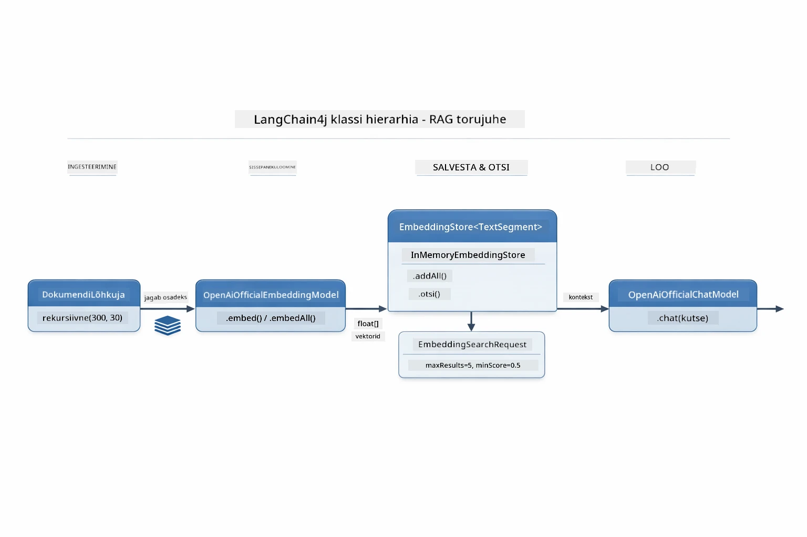

*See skeem näitab RAG lõimtoru kahte voogu — sisseiuvamist ja päringut — ning nende kokkuliitumist läbi ühise EmbeddingStore liidese.*

Kui manused on poe salvestatud, grupeerub sarnane sisu loomulikult vektorruumis. Alljärgnev visualiseerimine näitab, kuidas seotud teemad dokumentide seas kogunevad lähedasteks punktideks, mis muudab võimalikuks semantilise otsingu:


*See visualisatsioon näitab, kuidas seotud dokumendid kogunevad 3D vektorruumis, eristades gruppidena tehnilisi dokumente, ärireegleid ja KKK-sid.*

Kui kasutaja otsib, järgneb süsteem neljale sammule: embedib dokumendid korra, embedib päringu iga otsingu puhul, võrdleb päringu vektorit kõigi salvestatud vektoritega koos kosinus-sarnasuse meetodiga ja tagastab umbes kümne kõrgeima skooriga tüki. Alljärgnev skeem läbikäib kõik sammud koos LangChain4j klassidega:

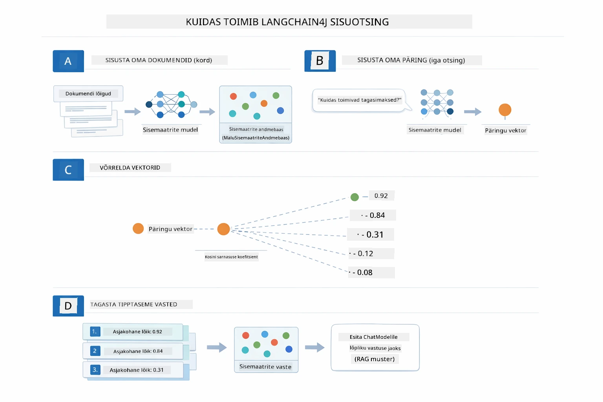

*See skeem näitab neljaastmelist manustamise otsinguprotsessi: embedid dokumendid, embedid päringu, võrdled vektoreid kosinus-sarnasusega ja tagastad parima kümne tulemuse.*

### Semantiline otsing

[RagService.java](../../../03-rag/src/main/java/com/example/langchain4j/rag/service/RagService.java)

Kui sa esitad küsimuse, teisendatakse ka su küsimus manuseks. Süsteem võrdleb su küsimuse manust kõigi dokumenditükkide manustega. Ta leiab tükid, mille tähendused on kõige sarnasemad — mitte ainult märksõnade kattuvus, vaid tegelik semantiline sarnasuse määr.

```java
Embedding queryEmbedding = embeddingModel.embed(question).content();

EmbeddingSearchRequest searchRequest = EmbeddingSearchRequest.builder()
    .queryEmbedding(queryEmbedding)
    .maxResults(5)
    .minScore(0.5)
    .build();

EmbeddingSearchResult<TextSegment> searchResult = embeddingStore.search(searchRequest);
List<EmbeddingMatch<TextSegment>> matches = searchResult.matches();

for (EmbeddingMatch<TextSegment> match : matches) {
    String relevantText = match.embedded().text();
    double score = match.score();
}
```

Alljärgnev skeem võrdleb semantilist otsingut tavapärase märksõnapõhise otsinguga. Märksõnapõhine otsing sõnale "vehicle" jätab tähelepanuta tükid "cars and trucks" kohta, aga semantiline otsing mõistab, et mõlemad tähendavad sama ja toob selle kõrge skooriga vastena:

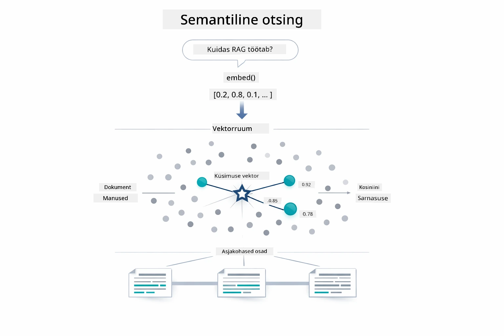

*See skeem võrdleb märksõnapõhist otsingut semantilise otsinguga, näidates, kuidas semantiline otsing leiab sisulisi seoseid ka siis, kui märksõnad erinevad.*

Põhimõtteliselt mõõdetakse sarnasust kosinus-sarnasuse meetodiga — küsides, kas kaks noolt osutavad sama suunda. Kaks tükki võivad kasutada täiesti erinevaid sõnu, aga kui nad tähendavad sama asja, siis nende vektorid osutavad samasse suunda ja skoor on ligikaudu 1.0:

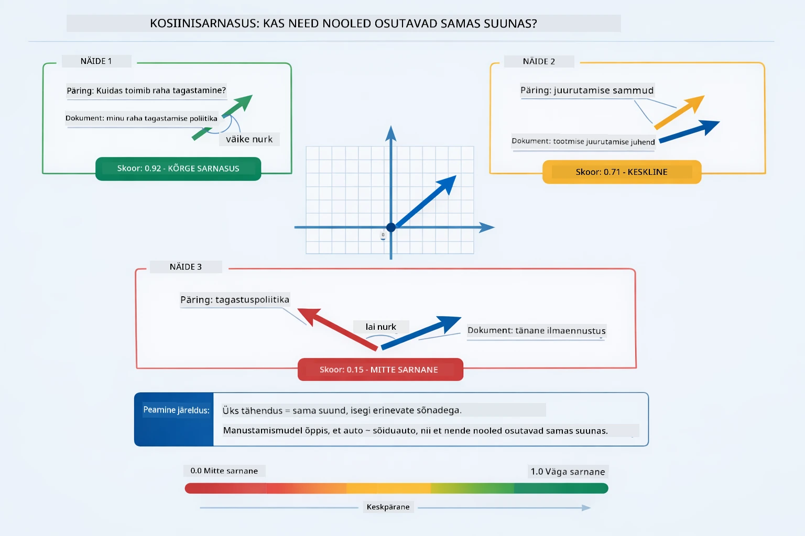
*See diagramm illustreerib kosinuse sarnasust kui nurka manustatud vektorite vahel — rohkem joondatud vektorid saavad skoori, mis on lähema 1.0-le, mis näitab kõrgemat semantilist sarnasust.*

> **🤖 Proovi [GitHub Copilot](https://github.com/features/copilot) Chatiga:** Ava [`RagService.java`](../../../03-rag/src/main/java/com/example/langchain4j/rag/service/RagService.java) ja küsi:
> - "Kuidas töötab sarnasuse otsing manustamisega ja mis määrab skoori?"
> - "Millist sarnasuse lävendit peaksin kasutama ja kuidas see tulemusi mõjutab?"
> - "Kuidas käidelda olukordi, kus asjakohaseid dokumente ei leita?"

### Vastuste genereerimine

[RagService.java](../../../03-rag/src/main/java/com/example/langchain4j/rag/service/RagService.java)

Kõige asjakohasemad lõigud kogutakse struktureeritud prompti, mis sisaldab selgeid juhiseid, otsitavat konteksti ja kasutaja küsimust. Mudel loeb neid konkreetseid lõike ja vastab nende põhjal — ta saab kasutada ainult seda, mis on tema ees, mis takistab hallutsinatsioone.

```java
String context = matches.stream()
    .map(match -> match.embedded().text())
    .collect(Collectors.joining("\n\n"));

String prompt = String.format("""
    Answer the question based on the following context.
    If the answer cannot be found in the context, say so.

    Context:
    %s

    Question: %s

    Answer:""", context, request.question());

String answer = chatModel.chat(prompt);
```

Allolev diagramm näitab selle kokkupaneku toimimist — otsingusammust kõrgeima skooriga lõigud süstitakse prompti malli ning `OpenAiOfficialChatModel` genereerib faktipõhise vastuse:

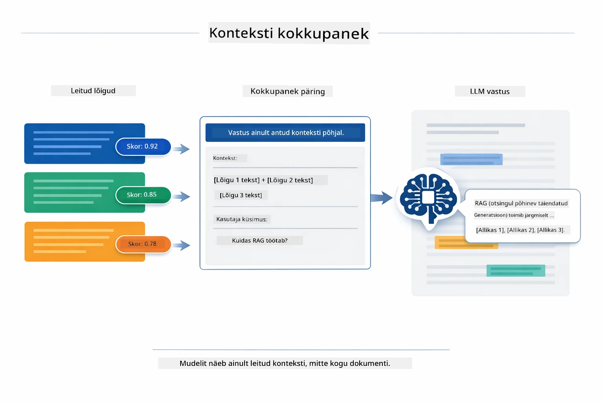

*See diagramm näitab, kuidas kõrgeima skooriga lõigud koondatakse struktureeritud prompti, võimaldades mudelil teie andmetest faktipõhise vastuse koostada.*

## Rakenduse käivitamine

**Kontrolli juurutust:**

Veendu, et juurkataloogis oleks `.env` fail Azure’i mandaadiga (loodud moodulis 01):

**Bash:**
```bash
cat ../.env  # Peaks kuvama AZURE_OPENAI_ENDPOINTi, API_VÕTMET ja JUURUTUST
```

**PowerShell:**
```powershell
Get-Content ..\.env  # Peaks näitama AZURE_OPENAI_ENDPOINT, API_KEY, DEPLOYMENT
```

**Rakenduse käivitamine:**

> **Märkus:** Kui käivitasid kõik rakendused juba `./start-all.sh` abil moodulist 01, siis see moodul töötab pordil 8081. Võid alljärgnevad startkäsklused vahele jätta ja minna otse aadressile http://localhost:8081.

**Valik 1: Spring Boot Dashboardi kasutamine (Soovitatav VS Code kasutajatele)**

Arendus konteiner sisaldab Spring Boot Dashboard laiendust, mis pakub visuaalset liidest kõigi Spring Boot rakenduste haldamiseks. Leiad selle VS Code vasakult külgribalt (otsige Spring Boot ikooni).

Spring Boot Dashboardist saad:
- Vaadata kõiki tööruumis olevaid Spring Boot rakendusi
- Käivitada/peatada rakendusi ühe klikiga
- Vaadata rakenduste logisid reaalajas
- Jälgida rakenduste olekut

Lihtsalt klõpsa nupul „play” kõrval "rag" mooduli käivitamiseks või käivita korraga kõik moodulid.


*See kuvatõmmis näitab Spring Boot Dashboardi VS Codes, kus saad rakendusi visuaalselt käivitada, peatada ja jälgida.*

**Valik 2: Shell skriptide kasutamine**

Käivita kõik veebirakendused (moodulid 01-04):

**Bash:**
```bash
cd ..  # Juurekataloogist
./start-all.sh
```

**PowerShell:**
```powershell
cd ..  # Juurkaustast
.\start-all.ps1
```

Või käivita ainult see moodul:

**Bash:**
```bash
cd 03-rag
./start.sh
```

**PowerShell:**
```powershell
cd 03-rag
.\start.ps1
```

Mõlemad skriptid laadivad automaatselt keskkonnamuutujad juurkataloogis olevast `.env` failist ja ehitavad JAR-failid, kui neid veel pole.

> **Märkus:** Kui soovid kõik moodulid käsitsi enne käivitamist ehitada:
>
> **Bash:**
> ```bash
> cd ..  # Go to root directory
> mvn clean package -DskipTests
> ```
>
> **PowerShell:**
> ```powershell
> cd ..  # Go to root directory
> mvn clean package -DskipTests
> ```

Ava brauseris http://localhost:8081.

**Peatamiseks:**

**Bash:**
```bash
./stop.sh  # Ainult see moodul
# Või
cd .. && ./stop-all.sh  # Kõik moodulid
```

**PowerShell:**
```powershell
.\stop.ps1  # See moodul ainult
# Või
cd ..; .\stop-all.ps1  # Kõik moodulid
```

## Rakenduse kasutamine

Rakendus pakub veebiliidest dokumentide üleslaadimiseks ja küsimuste esitamiseks.

<a href="images/rag-homepage.png"></a>

*See kuvatõmmis näitab RAG rakenduse liidest, kus saad dokumente üles laadida ja küsimusi esitada.*

### Dokumendi üleslaadimine

Alusta dokumendi üleslaadimisega - testi jaoks sobivad kõige paremini TXT failid. Selle kataloogi on lisatud `sample-document.txt`, mis sisaldab infot LangChain4j funktsioonide, RAG implementatsiooni ja parimate praktikate kohta - see on ideaalne süsteemi testimiseks.

Süsteem töötleb sinu dokumendi, jagab selle lõikudeks ning loob iga lõigu jaoks manustused. See toimub automaatselt peale üleslaadimist.

### Küsimuste esitamine

Esita nüüd konkreetseid küsimusi dokumendi sisule. Proovi midagi faktipõhist, mis on dokumendis selgelt kirjas. Süsteem otsib sobivad lõigud, lisab need prompti ja genereerib vastuse.

### Kontrolli allika viiteid

Pane tähele, et iga vastus sisaldab allika viiteid koos sarnasuse skooridega. Need skoorid (0 kuni 1) näitavad, kui asjakohane iga lõik sinu küsimusega oli. Kõrgem skoor tähendab paremat vastavust. See võimaldab sul vastust võrrelda lähteallikaga.

<a href="images/rag-query-results.png"></a>

*See kuvatõmmis näitab päringu tulemusi koos genereeritud vastuse, allika viidete ja iga leitud lõigu asjakohasuse skooridega.*

### Katseta küsimustega

Proovi erinevaid küsimuse tüüpe:
- Spetsiifilised faktid: „Mis on peamine teema?“
- Võrdlused: „Mis vahe on X ja Y-l?“
- Kokkuvõtted: „Tee kokkuvõte peamistest punktidest Z kohta“

Jälgi, kuidas muutuvad asjakohasuse skoorid vastavalt sellele, kui hästi sinu küsimus tekstisisuga haakub.

## Peamised mõisted

### Lõikude eraldamise strateegia

Dokumendid jagatakse 300-sõnalisteks lõikudeks, mille vahel on 30 sõna kattuvust. See tasakaal tagab, et igal lõigul on piisav kontekst mõistmiseks, kuid lõikud on piisavalt väikesed, et prompti saab lisada mitu lõiku.

### Sarnasuse skoorid

Iga leitud lõikiga kaasneb sarnasuse skoor vahemikus 0 kuni 1, mis näitab, kui hästi lõik kasutaja küsimusega sobib. Järgmine diagramm visualiseerib skooride vahemikke ja seda, kuidas süsteem neid tulemuste filtreerimisel kasutab:

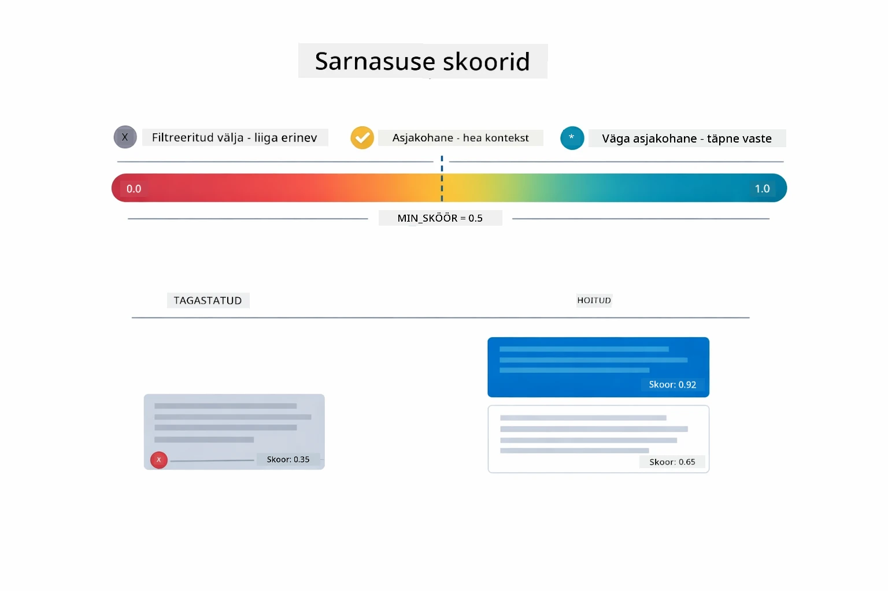

*See diagramm näitab skooride vahemikke 0 kuni 1, kus minimaalne lävi on 0.5, mis filtreerib välja mittevastavad lõigud.*

Skoorid on vahemikus 0 kuni 1:
- 0.7-1.0: Väga asjakohane, täpne vaste
- 0.5-0.7: Asjakohane, hea kontekst
- Alla 0.5: Välja filtreeritud, liiga erinev

Süsteem toob välja ainult lõigud, mis ületavad minimaalse läve, et tagada kvaliteet.

Manustused töötavad hästi, kui tähendused grupeeruvad selgelt, kuid neil on pimedad kohad. Allolev diagramm näitab tavapäraseid ebaõnnestumise juhtumeid — liiga suured lõigud annavad ebaselged vektorid, liiga väikesed lõigud jäävad kontekstideta, mitmetähenduslikud terminid viitavad mitmele klastri ning täpsed otsingud (ID-d, osanumbrids) ei tööta manustustega üldse:

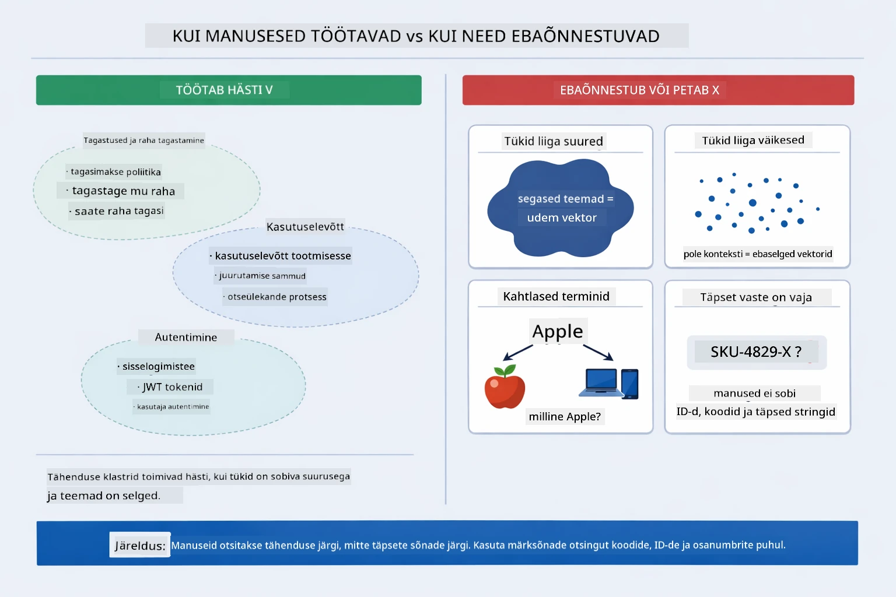

*See diagramm näitab tavalisi manustamise ebaõnnestumise juhtumeid: liiga suured lõigud, liiga väikesed lõigud, mitmetähenduslikud terminid, mis viitavad mitmele klastri, ning täpsed otsingud nagu ID-d.*

### Mälu baasil salvestus

See moodul kasutab lihtsuse huvides mälus baseeruvat salvestust. Kui rakenduse taaskäivitate, kaovad üles laaditud dokumendid. Tootmis keskkonnas kasutatakse püsivaid vektorandmebaase nagu Qdrant või Azure AI Search.

### Konteksti akna haldus

Igal mudelil on maksimaalne konteksti aken. Sa ei saa lisada iga lõiku suurest dokumendist. Süsteem toob välja top N kõige asjakohasemat lõiku (vaikimisi 5), et jääda piirangute piiresse, pakkudes samal ajal piisavalt konteksti täpsete vastuste jaoks.

## Millal RAG on oluline

RAG ei ole alati õige lahendus. Alljärgnevalt on otsustusdiagramm, mis aitab määrata, millal RAG lisab väärtust võrreldes lihtsamate lähenemistega — nagu sisu otsene lisamine prompti või mudeli sisseehitatud teadmiste kasutamine:

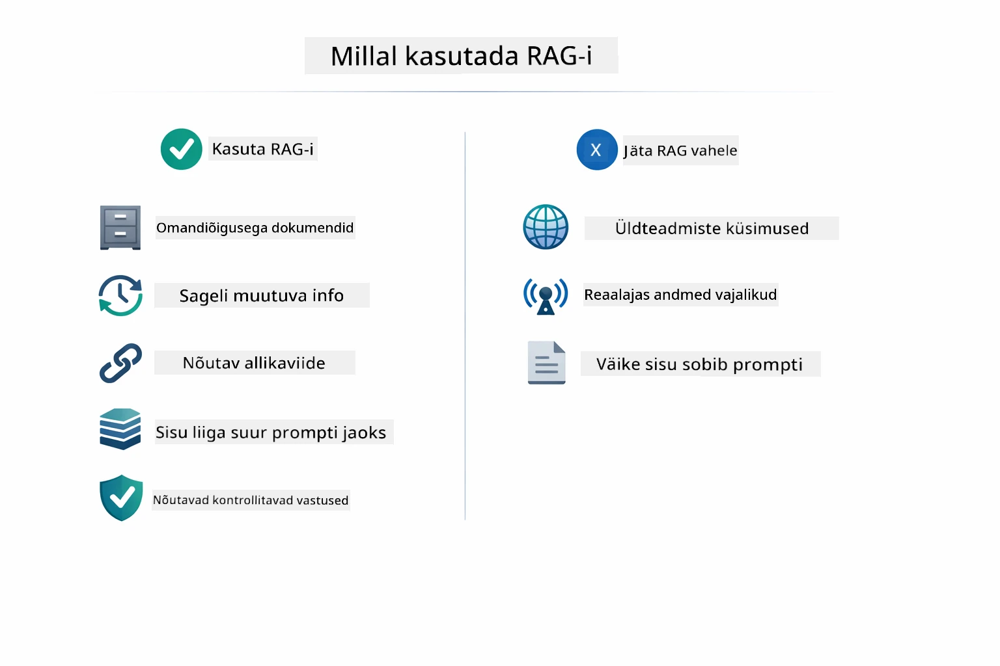

*See diagramm näitab otsustusjuhendit, millal RAG lisab väärtust ja millal piisab lihtsamatest lähenemistest.*

**Kasuta RAG-i, kui:**
- Vastad küsimustele omanike dokumentide kohta
- Info muutub tihti (poliitikad, hinnad, spetsifikatsioonid)
- Täpsus nõuab allikate tsiteerimist
- Sisu on liiga mahukas, et mahutada ühte prompti
- Vajad kontrollitavaid, faktipõhiseid vastuseid

**Ära kasuta RAG-i, kui:**
- Küsimused nõuavad üldteadmisi, mis mudelil juba olemas on
- Vajalik on reaalajas info (RAG töötab üles laaditud dokumentide põhjal)
- Sisu on piisavalt väike, et lisada otse prompti

## Järgmised sammud

**Järgmine moodul:** [04-tools - AI agendid tööriistadega](../04-tools/README.md)

---

**Navigeerimine:** [← Eelmine: Moodul 02 - Promptide inseneriteadus](../02-prompt-engineering/README.md) | [Tagasi avalehile](../README.md) | [Järgmine: Moodul 04 - Tööriistad →](../04-tools/README.md)

---

<!-- CO-OP TRANSLATOR DISCLAIMER START -->
**Vastutusest loobumine**:
See dokument on tõlgitud kasutades tehisintellektil põhinevat tõlketeenust [Co-op Translator](https://github.com/Azure/co-op-translator). Kuigi püüdleme täpsuse poole, palun arvestage, et automatiseeritud tõlked võivad sisaldada vigu või ebatäpsusi. Originaaldokument selle emakeeles tuleks lugeda autoriteetseks allikaks. Olulise teabe puhul soovitatakse kasutada professionaalset inimtõlget. Me ei vastuta selle tõlke kasutamisest tekkida võivate arusaamatuste või valesti tõlgenduste eest.
<!-- CO-OP TRANSLATOR DISCLAIMER END -->