# Moodul 04: AI agendid tööriistadega

## Sisukord

- [Mida sa õpid](../../../04-tools)
- [Eeldused](../../../04-tools)
- [AI agentide mõistmine tööriistadega](../../../04-tools)
- [Kuidas tööriistakutsed töötavad](../../../04-tools)
  - [Tööriistade määratlused](../../../04-tools)
  - [Otsuste tegemine](../../../04-tools)
  - [Täideviimine](../../../04-tools)
  - [Vastuse genereerimine](../../../04-tools)
  - [Arhitektuur: Spring Boot automaatühendus](../../../04-tools)
- [Tööriistade ühendamine](../../../04-tools)
- [Rakenduse käivitamine](../../../04-tools)
- [Rakenduse kasutamine](../../../04-tools)
  - [Proovi lihtsat tööriista kasutamist](../../../04-tools)
  - [Testi tööriistade ühendamist](../../../04-tools)
  - [Vaata vestluse voogu](../../../04-tools)
  - [Katseta erinevate päringutega](../../../04-tools)
- [Põhikontseptsioonid](../../../04-tools)
  - [ReAct muster (mõtlemine ja tegutsemine)](../../../04-tools)
  - [Tööriistade kirjeldused on olulised](../../../04-tools)
  - [Seansihaldus](../../../04-tools)
  - [Vigade käsitlemine](../../../04-tools)
- [Saadaval olevad tööriistad](../../../04-tools)
- [Millal kasutada tööriistapõhiseid agente](../../../04-tools)
- [Tööriistad vs RAG](../../../04-tools)
- [Järgmised sammud](../../../04-tools)

## Mida sa õpid

Siiani oled õppinud, kuidas AI-ga vestelda, tõhusaid käivituskäske üles ehitada ja vastuseid dokumentide põhjal põhjendada. Kuid on endiselt põhimõtteline piirang: keelemudelid suudavad genereerida ainult teksti. Nad ei saa ilma tööriistadeta ilmaennustust kontrollida, arvutusi teha, andmebaase pärida ega välissüsteemidega suhelda.

Tööriistad muudavad selle. Mudelile antakse ligipääs funktsioonidele, mida ta saab kutsuda, muutes ta tekstigeneraatorist agendiks, kes saab tegutseda. Mudel otsustab, millal tal tööriista vaja on, millist tööriista kasutada ja milliseid parameetreid ette anda. Sinu kood täidab funktsiooni ja tagastab tulemuse. Mudel kaasab selle tulemuse oma vastusesse.

## Eeldused

- Läbitud [Moodul 01 - Sissejuhatus](../01-introduction/README.md) (Azure OpenAI ressursid loodud)
- Soovitatavalt läbitud varasemad moodulid (see moodul viitab [Moodul 03 RAG kontseptsioonidele](../03-rag/README.md) tööriistade vs RAG võrdluses)
- Juurekaustas olemas `.env` fail koos Azure mandaatidega (loodud `azd up` käsuga Moodulis 01)

> **Märkus:** Kui sa pole läbinud Moodulit 01, järgi esmalt seal kirjeldatud juurutamise juhiseid.

## AI agentide mõistmine tööriistadega

> **📝 Märkus:** Sõna „agendid“ selles moodulis viitab AI abilistele, kelle võimekust on täiustatud tööriistakutsete abil. Erineb **Agentliku AI** mustritest (autonoomsed agendid planeerimise, mälu ja mitmeastmelise mõtestamisega), mida käsitleme [Moodulis 05: MCP](../05-mcp/README.md).

Ilma tööriistadeta saab keelemudel ainult treeningandmetest teksti genereerida. Küsi ilmSeattle'is ja ta peab arvama. Anna talle tööriistad ja ta saab kutsuda ilmaennustuse API, teha arvutusi või pärida andmebaasi — ning siis siduda need tegelikud tulemused vastusega.

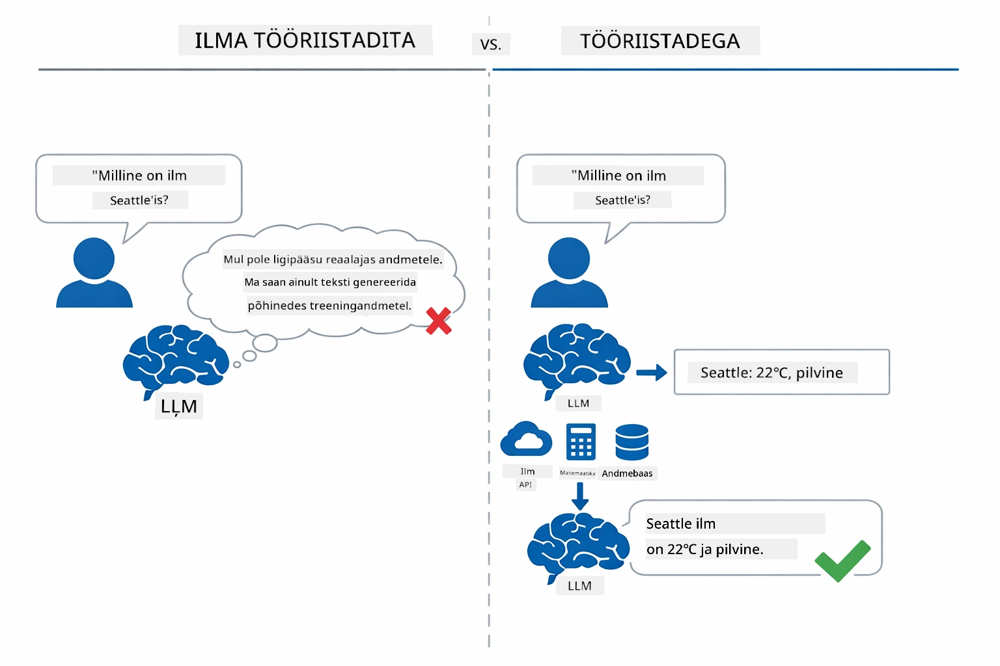

*Ilma tööriistadeta peab mudel ainult arvama — tööriistadega saab ta kutsuda API-sid, teha arvutusi ja tagastada reaalajas andmeid.*

AI agent tööriistadega järgib **ReAct (reasoning and acting)** mustrit. Mudel ei vasta ainult, ta mõtleb, mida tal vaja on, tegutseb tööriista kutsumisega, vaatleb tulemust ning otsustab seejärel, kas tegutseda uuesti või anda lõplik vastus:

1. **Mõtelda** — agent analüüsib kasutaja küsimust ja määrab vajaliku info
2. **Tegutseda** — agent valib sobiva tööriista, genereerib parameetrid ja kutsub selle välja
3. **Vaatle** — agent saab tööriista väljundi ja hindab tulemust
4. **Korda või vasta** — kui vaja on rohkem andmeid, kordab agent tsüklit; vastasel juhul koostab loomuliku keele vastuse

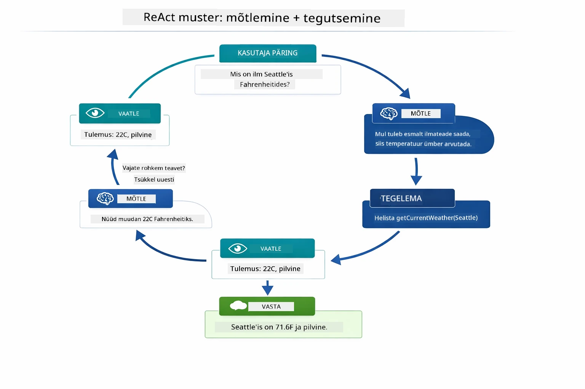

*ReAct-tsükkel — agent mõtleb, mida teha, tegutseb tööriista kutsumisega, vaatleb tulemust ja kordab, kuni saab lõpliku vastuse.*

See toimub automaatselt. Sina määrad tööriistad ja nende kirjeldused. Mudel otsustab, millal ja kuidas neid kasutada.

## Kuidas tööriistakutsed töötavad

### Tööriistade määratlused

[WeatherTool.java](../../../04-tools/src/main/java/com/example/langchain4j/agents/tools/WeatherTool.java) | [TemperatureTool.java](../../../04-tools/src/main/java/com/example/langchain4j/agents/tools/TemperatureTool.java)

Sa defineerid funktsioonid selgete kirjelduste ja parameetrite spetsifikatsioonidega. Mudel näeb neid kirjeldusi oma süsteemkäivituses ja mõistab, mida iga tööriist teeb.

```java
@Component
public class WeatherTool {
    
    @Tool("Get the current weather for a location")
    public String getCurrentWeather(@P("Location name") String location) {
        // Teie ilma päringu loogika
        return "Weather in " + location + ": 22°C, cloudy";
    }
}

@AiService
public interface Assistant {
    String chat(@MemoryId String sessionId, @UserMessage String message);
}

// Assistent ühendatakse automaatselt Spring Booti abil järgmistega:
// - ChatModel bean
// - Kõik @Tool meetodid @Component klassidest
// - ChatMemoryProvider sessiooni haldamiseks
```
  
Allolev diagramm selgitab iga annotatsiooni ja näitab, kuidas iga osa aitab AI-l mõista, millal tööriista kutsuda ja milliseid argumente anda:

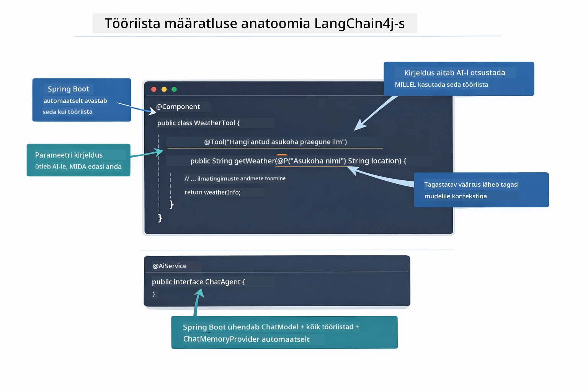

*Tööriista määratluse anatoomia — @Tool ütleb AI-le, millal seda kasutada, @P kirjeldab iga parameetrit ning @AiService ühendab kõik käivitamisel.*

> **🤖 Proovi koos [GitHub Copilotiga](https://github.com/features/copilot) Chat-is:** Ava [`WeatherTool.java`](../../../04-tools/src/main/java/com/example/langchain4j/agents/tools/WeatherTool.java) ja küsi:
> - "Kuidas integreerida päris ilma API nagu OpenWeatherMap, mitte simuleeritud andmed?"
> - "Mis teeb hea tööriistakirjelduse, mis aitab AI-l seda õigesti kasutada?"
> - "Kuidas käidelda API vigu ja kasutuspiiranguid tööriista rakendustes?"

### Otsuste tegemine

Kui kasutaja küsib „Milline ilm on Seattle'is?“, ei vali mudel tööriista juhuslikult. Ta võrdleb kasutaja kavatsust iga tööriista kirjeldusega, hindab asjakohasust ja valib parima vaste. Seejärel genereerib struktuurse funktsioonikutse õige parameetriga — antud juhul määrab `location` väärtuseks `"Seattle"`.

Kui ükski tööriist ei vasta päringule, vastab mudel oma teadmisest. Kui sobivaid tööriistu on mitu, valib kõige konkreetsema.

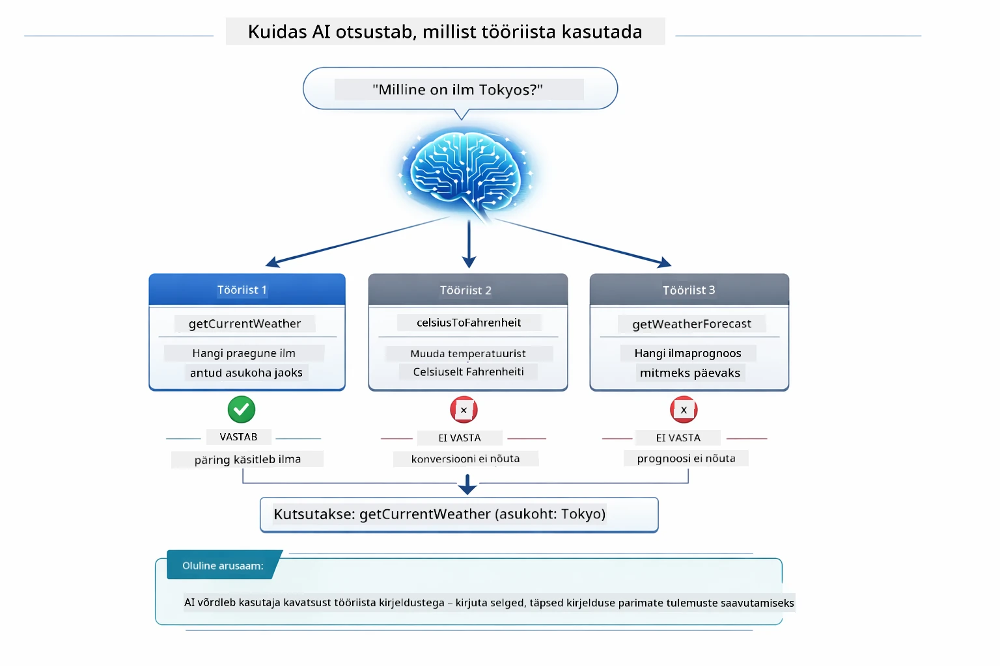

*Mudel hindab kõiki saadaolevaid tööriistu kasutaja kavatsuse vastu ja valib parima — seetõttu on oluline kirjutada selged ja täpsed tööriistakirjeldused.*

### Täideviimine

[AgentService.java](../../../04-tools/src/main/java/com/example/langchain4j/agents/service/AgentService.java)

Spring Boot ühendab deklaratiivse `@AiService` liidese kõigi registreeritud tööriistadega ja LangChain4j täidab tööriistakutsed automaatselt. Tagaplaanil läbib konkreetne tööriistakutse kuus etappi — kasutajapäringust loomuliku keele küsimuseni tagasi loomulikus keeles vastuseks:

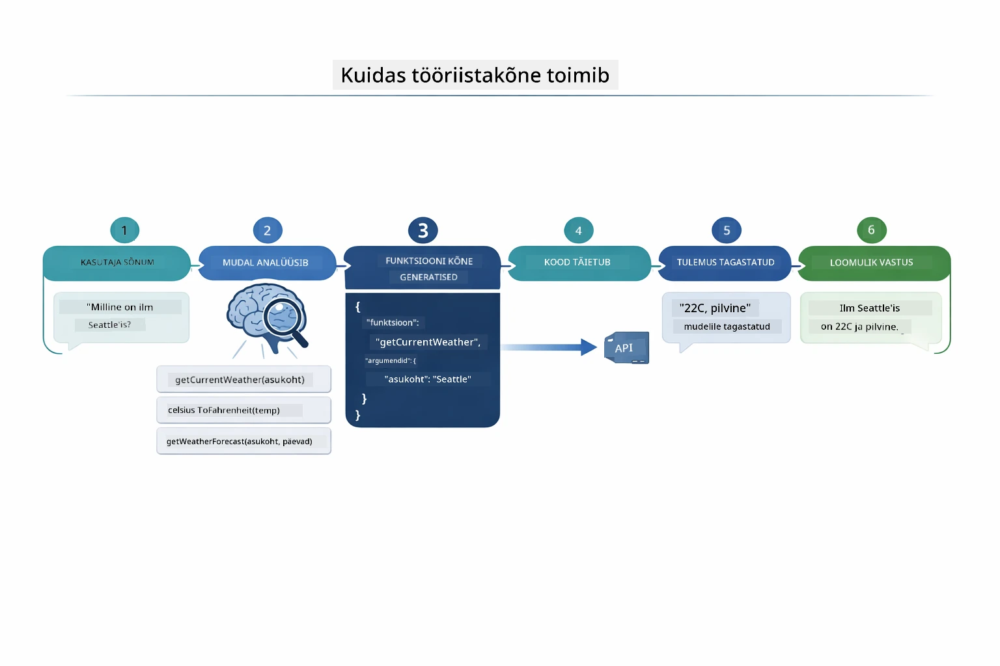

*Lõpp-lõpuks voog — kasutaja küsib, mudel valib tööriista, LangChain4j täidab selle ja mudel seob tulemuse loomulikku vastusesse.*

Kui sa jooksutasid [ToolIntegrationDemo](../../../00-quick-start/src/main/java/com/example/langchain4j/quickstart/ToolIntegrationDemo.java) Moodulis 00, nägid seda mustrit juba tegevuses — `Calculator` tööriistu kutsuti samamoodi. Allolev sekvenssdiagramm näitab täpselt, mis selle demo ajal juhtus:

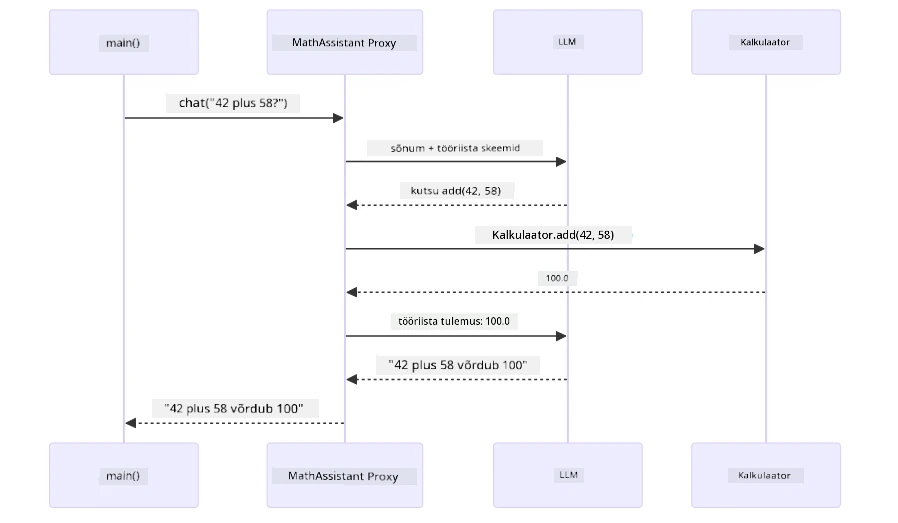

*Tööriistakutsete tsükkel Quick Start demo näidises — `AiServices` saadab sõnumi ja tööriistaskemad LLM-ile, LLM vastab funktsioonikutsega nagu `add(42, 58)`, LangChain4j täidab `Calculator` meetodi kohalikult ning annab tulemuse lõpliku vastuse jaoks.*

> **🤖 Proovi koos [GitHub Copilotiga](https://github.com/features/copilot) Chat-is:** Ava [`AgentService.java`](../../../04-tools/src/main/java/com/example/langchain4j/agents/service/AgentService.java) ja küsi:
> - "Kuidas toimub ReAct muster ja miks see on AI agentide puhul tõhus?"
> - "Kuidas agent otsustab, millist tööriista kasutada ja mis järjekorras?"
> - "Mis juhtub, kui tööriista täideviimine ebaõnnestub — kuidas ma peaksin vigade korral vastu pidama?"

### Vastuse genereerimine

Mudel saab ilmaandmed ja vormindab need kasutajale loomulikus keeles vastuseks.

### Arhitektuur: Spring Boot automaatühendus

See moodul kasutab LangChain4j Spring Boot integratsiooni deklaratiivsete `@AiService` liidestega. Käivitamisel avastab Spring Boot kõik `@Component`-id, mis sisaldavad `@Tool` meetodeid, sinu `ChatModel` bean'i ja `ChatMemoryProvider` — ning ühendab need kõik üheks `Assistant` liideseks ilma käsitsi koodita.

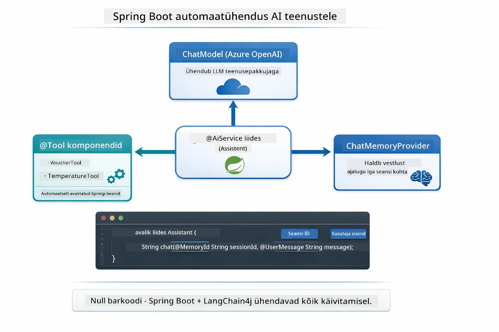

*@AiService liides ühendab ChatModeli, tööriistakomponendid ja mäluteenuse — Spring Boot korraldab kogu ühenduse automaatselt.*

Siin on päringu täisläbimine sekvenssdiagrammina — HTTP päringust läbi kontrolleri, teenuse ja automaatühendatud proxy kuni tööriista täideviimise ja tagasisuunani:

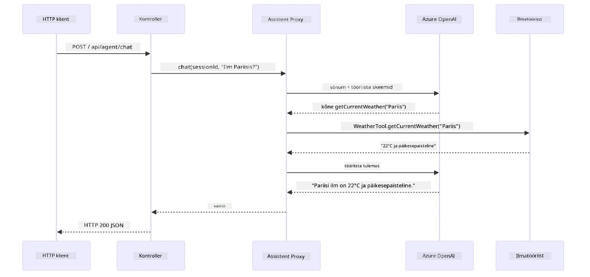

*Täielik Spring Boot päringu eluiga — HTTP päring läbib kontrolleri ja teenuse automaatühendatud Assistant proxy juurde, mis korraldab LLM-i ja tööriistakutsed iseseisvalt.*

Selle lähenemise peamised eelised:

- **Spring Booti automaatühendus** — ChatModel ja tööriistad süstitakse automaatselt
- **@MemoryId muster** — automaatne seansipõhine mälu haldus
- **Üksainus eksemplar** — Assistant luuakse korra ja kasutatakse uuesti parema jõudluse nimel
- **Tüübiohutud täideviimine** — Java meetodid kutsutakse otse koos tüübikonversiooniga
- **Mitme sammu orkestreerimine** — käsitleb tööriistade ahelat automaatselt
- **Null boilerplate** — ei ole vaja käsitsi aiServices.builder() ega mäluhashiparameetreid

Alternatiivsed lähenemised (käsitsi aiServices.builder()) nõuavad rohkem koodi ja jäävad ilma Spring Booti integratsiooni eelistest.

## Tööriistade ühendamine

**Tööriistade ühendamine** — tõeline jõud tööriistapõhistel agentidel tuleb siis, kui üks küsimus vajab mitut tööriista. Küsi "Milline ilm on Seattle'is kraadides Fahrenheit?" ja agent seob automaatselt kaks tööriista: esmalt kutsub ta `getCurrentWeather`, et saada temperatuur Celsiuses, seejärel saadab selle väärtuse `celsiusToFahrenheit` teisendamiseks — kõik ühe vestluse sammu jooksul.

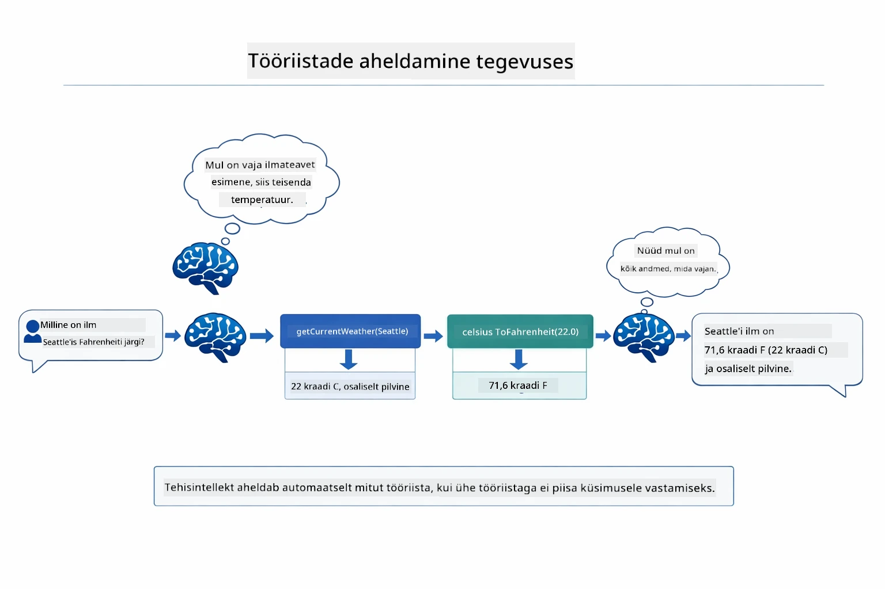

*Tööriistade ühendamine tegevuses — agent kutsub esmalt getCurrentWeather, seejärel suunab Celsiuse tulemuse celsiusToFahrenheit’i ja annab kokkuvõtva vastuse.*

**Ilmastatud tõrked** — Küsi ilma mõnes linnas, mis pole simulatsioonandmetes. Tööriist tagastab veateate ja AI selgitab, et ei saa aidata, selle asemel et kukkuda. Tööriistad ebaõnnestuvad turvaliselt. Alljärgnev diagramm võrdleb kahte lähenemist — korraliku vigade käsitlemisega kättevõtnud agent vastab abistavalt, ilma selleta kukub kogu rakendus:

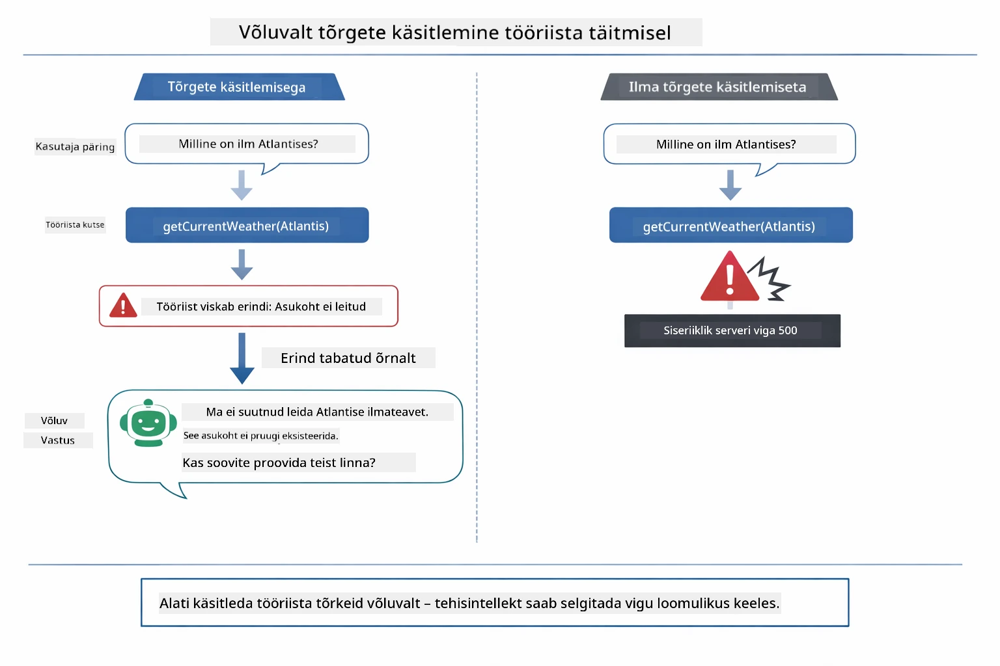

*Kui tööriist ebaõnnestub, püütakse viga ja vastatakse abistava selgitusega, mitte ei kukuta rakendust.*

See toimub ühe vestluse sammu jooksul. Agent orkestreerib mitmeid tööriistakutseid iseseisvalt.

## Rakenduse käivitamine

**Juurutuse kontroll:**

Veendu, et juurekaustas oleks `.env` fail Azure mandaatidega (loodud Mooduli 01 käigus). Käivita see mooduli kataloogist (`04-tools/`):

**Bash:**
```bash
cat ../.env  # Peaks näitama AZURE_OPENAI_ENDPOINT, API_KEY, DEPLOYMENT
```
  
**PowerShell:**
```powershell
Get-Content ..\.env  # Peaks näitama AZURE_OPENAI_ENDPOINT, API_KEY, DEPLOYMENT
```
  
**Rakenduse käivitamine:**

> **Märkus:** Kui oled juba kõik rakendused käivitanud `./start-all.sh` käsuga juurkaustast (nagu Moodulis 01 kirjeldatud), töötab see moodul juba pordil 8084. Võid vahele jätta alljärgnevad käivituskäsud ja minna otse aadressile http://localhost:8084.

**Valik 1: Kasuta Spring Boot Dashboardi (Soovitatav VS Code kasutajatele)**

Arenduskonteineris on Spring Boot Dashboard laiendus, mis pakub visuaalset liidest kõigi Spring Boot rakenduste haldamiseks. Leiad selle VS Code'i vasakult aktiivsusribalt (otsa märgiga Spring Boot ikoon).

Spring Boot Dashboardist saad:
- näha kõiki projekti Spring Boot rakendusi
- alustada/peatada rakendusi ühe klikiga
- vaadata rakenduse logisid reaalajas
- jälgida rakenduse olekut

Lihtsalt kliki "tools" nime kõrval olevale käivitusnupule, et käivitada see moodul, või alusta korraga kõigi moodulitega.

Nii näeb Spring Boot Dashboard VS Code's välja:


*Spring Boot Dashboard VS Code's — alusta, peata ja jälgi kõiki mooduleid ühest kohast*

**Valik 2: Kasuta shell-skripte**

Käivita kõik veebirakendused (moodulid 01-04):

**Bash:**
```bash
cd ..  # Juurekataloogist
./start-all.sh
```

**PowerShell:**
```powershell
cd ..  # Juure kataloogist
.\start-all.ps1
```

Või alusta lihtsalt sellest moodulist:

**Bash:**
```bash
cd 04-tools
./start.sh
```

**PowerShell:**
```powershell
cd 04-tools
.\start.ps1
```

Mõlemad skriptid laadivad automaatselt keskkonnamuutujad juurkaustas olevast `.env` failist ja ehitavad JAR-failid, kui neid veel pole.

> **Märkus:** Kui soovid enne alustamist ehitada kõik moodulid käsitsi:
>
> **Bash:**
> ```bash
> cd ..  # Go to root directory
> mvn clean package -DskipTests
> ```
>
> **PowerShell:**
> ```powershell
> cd ..  # Go to root directory
> mvn clean package -DskipTests
> ```

Ava oma brauseris aadress http://localhost:8084.

**Peatamiseks:**

**Bash:**
```bash
./stop.sh  # Ainult see moodul
# Või
cd .. && ./stop-all.sh  # Kõik moodulid
```

**PowerShell:**
```powershell
.\stop.ps1  # Ainult see moodul
# Või
cd ..; .\stop-all.ps1  # Kõik moodulid
```

## Rakenduse kasutamine

Rakendus pakub veebipõhist liidest, kus saad suhelda AI-agendiga, kellel on juurdepääs ilmateatele ja temperatuuri teisendamise tööriistadele. Nii näeb liides välja — see sisaldab kiire alguse näiteid ja vestluse paneeli päringute saatmiseks:

<a href="images/tools-homepage.png"></a>

*AI Agendi tööriistade liides – kiired näited ja vestluse liides tööriistadega suhtlemiseks*

### Proovi lihtsat tööriista kasutust

Alusta lihtsa päringuga: "Muuda 100 kraadi Fahrenheiti järgi Celsiuseks". Agent tunneb ära, et vajab temperatuuri teisendamise tööriista, kutsub seda õige parameetritega ja tagastab tulemuse. Pane tähele, kui loomulik see on – sa ei pidanud määrama, millist tööriista kasutada või kuidas seda kutsuda.

### Testi tööriistade ahelat

Nüüd proovi keerukamat päringut: "Milline on ilm Seattle’is ja muuda see Fahrenheiti järgi?" Vaata, kuidas agent samm-sammult töötab. Ta saab esmalt ilmateate (mis tagastab Celsiuse), mõistab, et peab teisendama Fahrenheiti, kutsub teisendustööriista ja ühendab mõlemad tulemused üheks vastuseks.

### Vaata vestluse kulgu

Vestlusliides hoiab vestluse ajaloo, võimaldades sul teha mitmekäigulist suhtlust. Sa näed kõiki varasemaid päringuid ja vastuseid, mis teeb lihtsaks vestluse jälgimise ja mõistmise, kuidas agent konteksti mitme vahetuse jooksul ehitab.

<a href="images/tools-conversation-demo.png"></a>

*Mitmekäiguline vestlus näitab lihtsaid teisendusi, ilmateate päringuid ja tööriistade ahelat*

### Katseta erinevaid päringuid

Proovi erinevaid kombinatsioone:
- Ilmateate päringud: "Milline on ilm Tokyos?"
- Temperatuuri teisendused: "Mis on 25 °C kelvinites?"
- Ühendatud päringud: "Kontrolli ilmateadet Pariisis ja ütle, kas temperatuur on üle 20 °C"

Pane tähele, kuidas agent tõlgendab loomulikku keelt ja muudab selle sobivateks tööriistakutseteks.

## Põhimõisted

### ReAct muster (Põhjendamine ja Tegutsemine)

Agent vaheldub põhjendamise (otsustab, mida teha) ja tegutsemise (kasutab tööriistu) vahel. See muster võimaldab autonoomset probleemilahendust pigem kui vaid juhiste järgimist.

### Tööriistade kirjeldused on olulised

Sinu tööriistade kirjelduste kvaliteet mõjutab otseselt, kui hästi agent neid kasutab. Selged ja spetsiifilised kirjeldused aitavad mudelil mõista, millal ja kuidas tööriistu kutsuda.

### Sessioonihaldus

`@MemoryId` annotatsioon võimaldab automaatset sessioonipõhist mälu haldamist. Iga sessiooni ID-d haldab oma `ChatMemory` instants `ChatMemoryProvider` bean'i kaudu, nii et mitmed kasutajad saavad samaaegselt agenti kasutada segamatult. Järgnev diagramm näitab, kuidas mitmed kasutajad suunatakse isoleeritud mälupoodidesse vastavalt oma sessioonitunnustele:

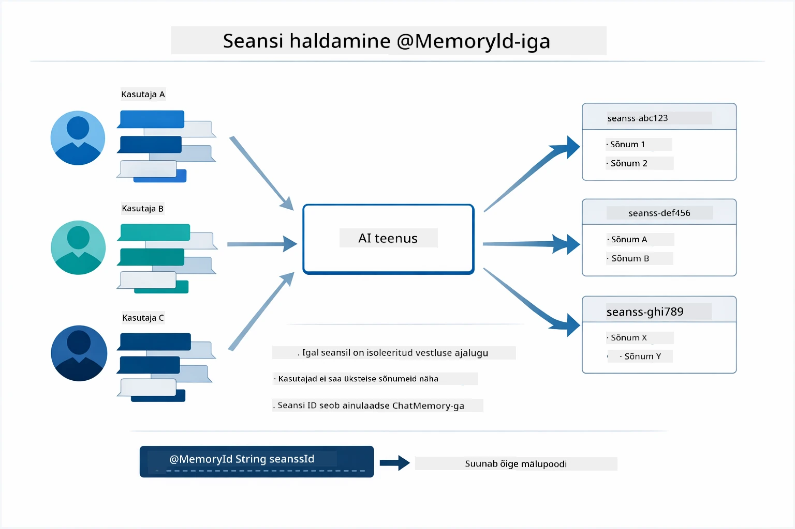

*Iga sessiooni ID kaardistub isoleeritud vestluse ajalukku — kasutajad ei näe kunagi üksteise sõnumeid.*

### Veakäsitlus

Tööriistad võivad ebaõnnestuda — API-d aeguvad, parameetrid võivad olla vigased, välised teenused võivad all olla. Tootmisagentidel on vaja veakäsitlust, et mudel saaks probleemi selgitada või proovida alternatiive, mitte kogu rakendust kokku kukutada. Kui tööriist viskab erandi, tabab LangChain4j selle ja edastab veateate mudelile, mis saab seejärel probleemi loomulikus keeles selgitada.

## Saadaval olevad tööriistad

Allolev diagramm näitab tööriistade laialdast ökosüsteemi, mida saad ehitada. See moodul demonstreerib ilmateate ja temperatuuri tööriistu, kuid sama `@Tool` muster töötab mis tahes Java meetodi puhul — alates andmebaasi päringutest kuni maksete töötlemiseni.

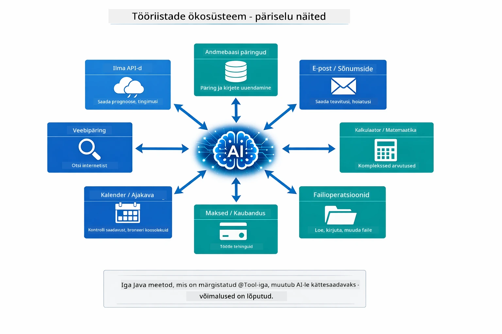

*Iga Java meetod, millel on @Tool annotatsioon, saab AI jaoks kättesaadavaks — muster laieneb andmebaasidele, API-dele, meilikasutusele, failitoimingutele ja rohkemale.*

## Millal kasutada tööriistadel põhinevaid agente

Iga päring ei vaja tööriistu. Otsus tuleneb sellest, kas AI vajab suhelda välissüsteemidega või saab vastata omaenda teadmiste põhjal. Järgmine juhend võtab kokku, millal tööriistad annavad lisaväärtust ja millal need on üleliigsed:

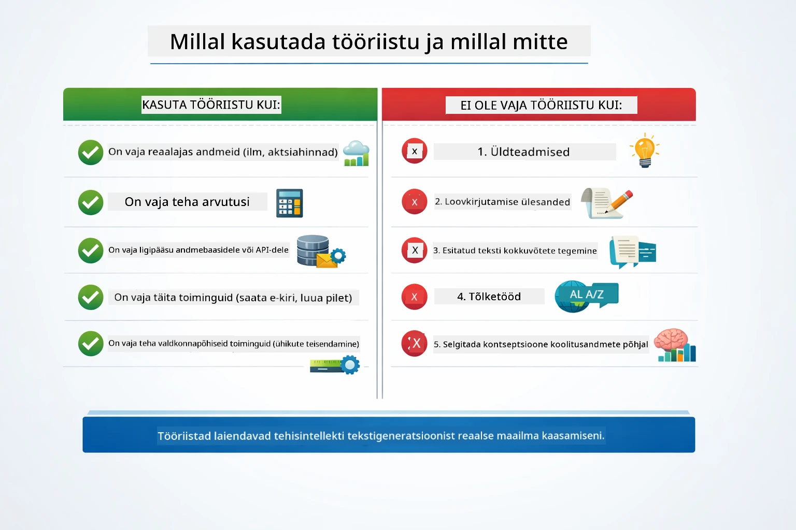

*Kiire otsustusjuhend — tööriistad on mõeldud reaalajas andmetele, arvutustele ja toimingutele; üldteadmised ja loomingulised ülesanded ei vaja neid.*

## Tööriistad vs RAG

Moodulid 03 ja 04 laiendavad AI võimalusi, kuid fundamentaalselt erinevalt. RAG annab mudelile juurdepääsu **teadmistele** dokumentide kaudu. Tööriistad võimaldavad mudelil teha **toiminguid** funktsioonide kutsumise kaudu. Järgmine diagramm võrdleb neid kahte lähenemist kõrvuti — alates töövoo toimimisest kuni nende vaheliste kompromissideni:

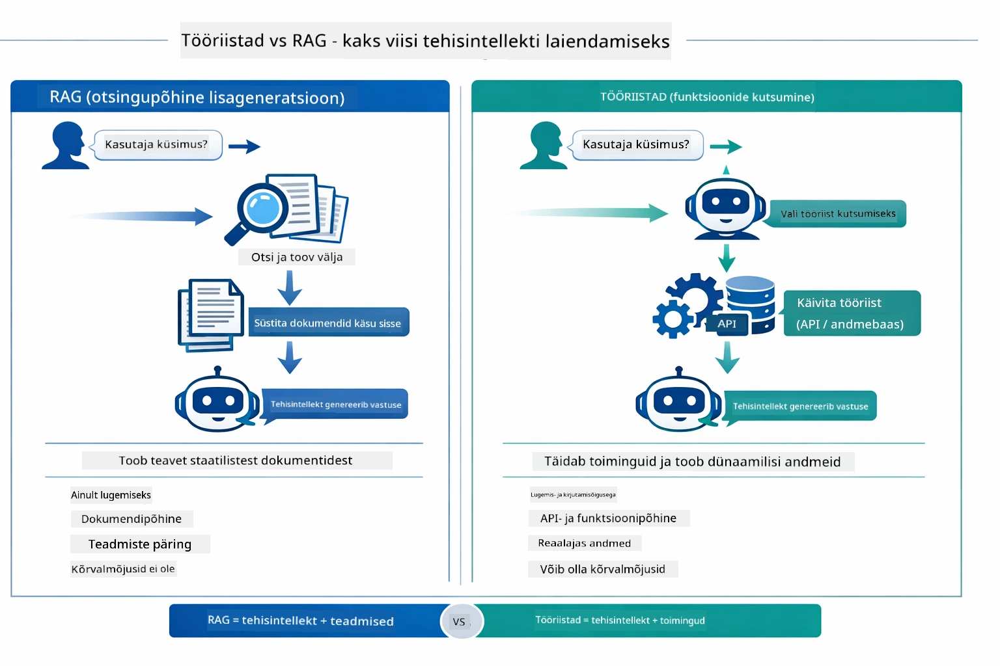

*RAG hangib teavet staatilistest dokumentidest — tööriistad teostavad toiminguid ja toovad dünaamilisi, reaalajas andmeid. Paljud tootmissüsteemid kombineerivad mõlemaid.*

Praktikas kasutavad paljud tootmissüsteemid mõlemaid lähenemisi: RAG vastuste sidumiseks dokumentatsiooniga ning tööriistad elava andmete toomiseks või toimingute tegemiseks.

## Järgmised sammud

**Järgmine moodul:** [05-mcp - Mudeli konteksti protokoll (MCP)](../05-mcp/README.md)

---

**Navigeerimine:** [← Eelmine: Moodul 03 - RAG](../03-rag/README.md) | [Tagasi peamenüüsse](../README.md) | [Järgmine: Moodul 05 - MCP →](../05-mcp/README.md)

---

<!-- CO-OP TRANSLATOR DISCLAIMER START -->
**Vastutusest loobumine**:
See dokument on tõlgitud tehisintellekti tõlketeenuse [Co-op Translator](https://github.com/Azure/co-op-translator) abil. Kuigi püüdleme täpsuse poole, palun arvestage, et automaatsed tõlked võivad sisaldada vigu või ebatäpsusi. Originaaldokument selle emakeeles tuleks pidada autoriteetseks allikaks. Olulise teabe puhul soovitatakse kasutada professionaalset inimtõlget. Me ei vastuta selle tõlke kasutamisest tingitud arusaamatuste või valesti tõlgendamise eest.
<!-- CO-OP TRANSLATOR DISCLAIMER END -->