# Moodul 05: Mudeli Konteksti Protokoll (MCP)

## Sisukord

- [Video juhend](../../../05-mcp)
- [Mida sa õpid](../../../05-mcp)
- [Mis on MCP?](../../../05-mcp)
- [Kuidas MCP töötab](../../../05-mcp)
- [Agentne moodul](../../../05-mcp)
- [Näidete käivitamine](../../../05-mcp)
  - [Eeltingimused](../../../05-mcp)
- [Kiire alustamine](../../../05-mcp)
  - [Failioperatsioonid (Stdio)](../../../05-mcp)
  - [Juhendaja agent](../../../05-mcp)
    - [Demo käivitamine](../../../05-mcp)
    - [Kuidas juhendaja töötab](../../../05-mcp)
    - [Kuidas FileAgent MCP tööriistu jooksuajal avastab](../../../05-mcp)
    - [Vastusstrateegiad](../../../05-mcp)
    - [Väljundi mõistmine](../../../05-mcp)
    - [Agentse mooduli omaduste selgitus](../../../05-mcp)
- [Põhimõisted](../../../05-mcp)
- [Palju õnne!](../../../05-mcp)
  - [Mis edasi?](../../../05-mcp)

## Video juhend

Vaata seda otseülekande sessiooni, mis selgitab, kuidas selle mooduliga alustada:

<a href="https://www.youtube.com/watch?v=O_J30kZc0rw"></a>

## Mida sa õpid

Oled loonud vestlusliku tehisintellekti, valdad promptide kasutamist, sidunud vastused dokumentidega ja loonud tööriistadega agente. Kuid kõik need tööriistad olid eritellimusel tehtud sinu konkreetsele rakendusele. Mis saab, kui saaksid anda oma tehisintellektile ligipääsu standardiseeritud tööriistade ökosüsteemile, mida igaüks saab luua ja jagada? Selles moodulis õpid, kuidas seda teha Mudeli Konteksti Protokolli (MCP) ja LangChain4j agentse mooduli abil. Näitame esmalt lihtsat MCP faililugejat ja seejärel demonstreerime, kuidas see lihtsasti integreerub keerukatesse agentsetesse töövoogudesse, kasutades Juhendaja Agendi mustrit.

## Mis on MCP?

Mudeli Konteksti Protokoll (MCP) pakub täpselt seda – standardiseeritud viisi tehisintellekti rakenduste jaoks tuvastada ja kasutada väliseid tööriistu. Selle asemel, et kirjutada kohandatud integratsioone iga andmeallika või teenuse jaoks, ühendud MCP serveritega, mis avaldavad oma võimekused ühtsel kujul. Sinu AI agent saab need tööriistad automaatselt leida ja kasutada.

Allolev diagramm näitab erinevust — ilma MCP-ta nõuab iga integratsioon kohandatud punkt-punkt ühendust; MCP-ga ühendab üks protokoll sinu rakenduse mis tahes tööriistaga:


*Enne MCP-d: keerukad punkt-punkt integratsioonid. Pärast MCP-d: üks protokoll, lõputud võimalused.*

MCP lahendab AI arenduse põhiprobleemi: iga integratsioon on kohandatud. Tahad ligi GitHubile? Kohandatud kood. Tahad lugeda faile? Kohandatud kood. Tahad pärida andmebaasi? Kohandatud kood. Ja mitte ükski neist integratsioonidest ei tööta teiste AI rakendustega.

MCP standardiseerib selle. MCP server avaldab tööriistad selgete kirjelduste ja skeemidega. Iga MCP klient saab ühenduda, leida saadaval olevad tööriistad ja neid kasutada. Loo üks kord, kasuta kõikjal.

Allolev diagramm illustreerib seda arhitektuuri — üks MCP klient (sinu AI rakendus) ühendub mitme MCP serveriga, igaüks avaldab oma tööriistakomplekti läbi standardprotokolli:


*Mudeli Konteksti Protokolli arhitektuur – standardiseeritud tööriistade avastamine ja käitamine*

## Kuidas MCP töötab

Masina all kasutab MCP kihilist arhitektuuri. Sinu Java rakendus (MCP klient) leiab saadaval olevad tööriistad, saadab JSON-RPC päringuid transpordikihi kaudu (Stdio või HTTP) ning MCP server täidab operatsioonid ja tagastab tulemused. Järgmine diagramm seletab selle protokolli iga kihti:

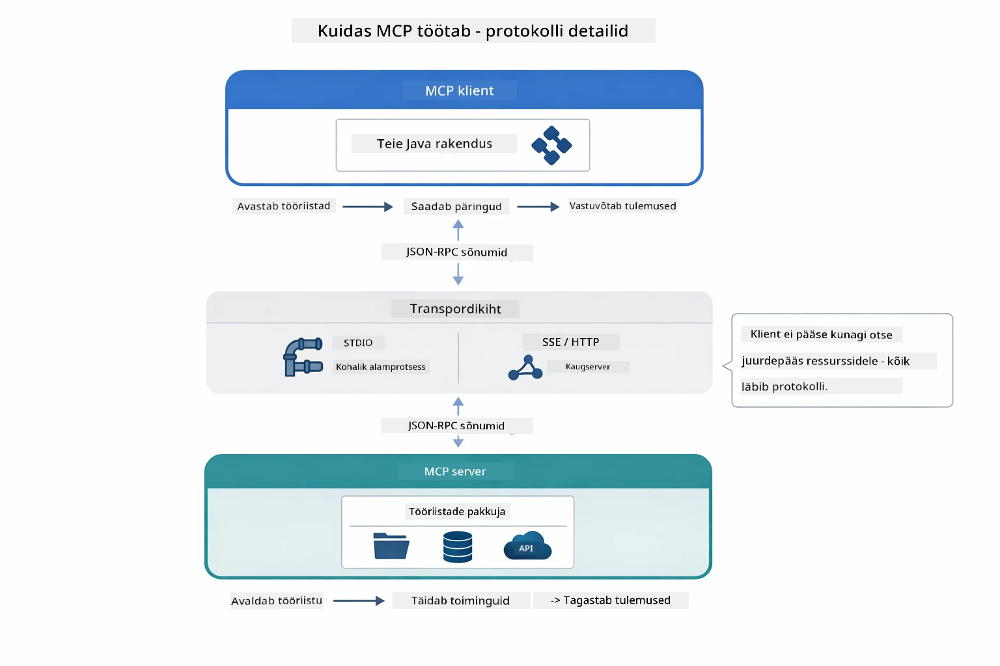

*Kuidas MCP töötab masina all – kliendid leiavad tööriistu, vahetavad JSON-RPC sõnumeid ja täidavad toiminguid transpordikihi kaudu.*

**Serveri-kliendi arhitektuur**

MCP kasutab klient-server mudelit. Serverid pakuvad tööriistu – failide lugemine, andmebaaside pärimine, API-de väljakutsumine. Kliendid (sinu AI rakendus) ühenduvad serveritega ja kasutavad nende tööriistu.

MCP kasutamiseks LangChain4j-ga lisa see Maven sõltuvus:

```xml
<dependency>
    <groupId>dev.langchain4j</groupId>
    <artifactId>langchain4j-mcp</artifactId>
    <version>${langchain4j.version}</version>
</dependency>
```

**Tööriistade avastamine**

Kui sinu klient ühendub MCP serveriga, küsib ta: "Millised tööriistad sul on?" Server vastab saadaval olevate tööriistade loendiga, igaühel kirjeldused ja parameetrite skeemid. Sinu AI agent saab seejärel otsustada, milliseid tööriistu kasutaja päringute põhjal kasutada. Allolev diagramm näitab seda käepigistust — klient saadab `tools/list` päringu ja server tagastab oma saadaval olevad tööriistad koos kirjelduste ja parameetrite skeemidega:

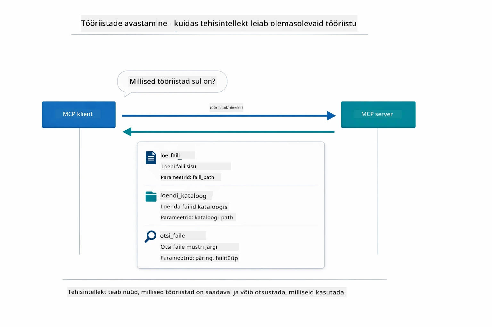

*AI avastab käivitamisel saadaval olevad tööriistad — nüüd teab ta, millised võimalused olemas on ja võib otsustada, milliseid kasutada.*

**Transpordimehhanismid**

MCP toetab erinevaid transpordimehhanisme. Kaks valikut on Stdio (kohalik alamprotsesside kommunikatsioon) ja voogedastatav HTTP (kaugserverite jaoks). See moodul demonstreerib Stdio transporti:


*MCP transpordimehhanismid: HTTP kaugserverite jaoks, Stdio kohalikeks protsessideks*

**Stdio** - [StdioTransportDemo.java](../../../05-mcp/src/main/java/com/example/langchain4j/mcp/StdioTransportDemo.java)

Kohalikeks protsessideks. Sinu rakendus käivitab serveri alamprotsessina ja suhtleb läbi standardse sisse-/väljundi. Kasulik failisüsteemi ligipääsu või käsurea tööriistade jaoks.

```java
McpTransport stdioTransport = new StdioMcpTransport.Builder()
    .command(List.of(
        npmCmd, "exec",
        "@modelcontextprotocol/server-filesystem@2025.12.18",
        resourcesDir
    ))
    .logEvents(false)
    .build();
```

`@modelcontextprotocol/server-filesystem` server pakub järgmisi tööriistu, kõik sinu määratud kaustadega piiratud:

| Tööriist | Kirjeldus |
|------|-------------|
| `read_file` | Loe ühe faili sisu |
| `read_multiple_files` | Loe mitut faili ühe korraga |
| `write_file` | Loo või kirjuta faili üle |
| `edit_file` | Tee sihipäraseid otsi-ja-asenda muudatusi |
| `list_directory` | Listeeri failid ja kaustad teel |
| `search_files` | Otsi rekursiivselt faile mustri alusel |
| `get_file_info` | Hangi faili metaandmed (suurus, ajaandmed, õigused) |
| `create_directory` | Loo kaust (sh vanemkaustad) |
| `move_file` | Liiguta või ümbernimi fail või kaust |

Järgmine diagramm näitab, kuidas Stdio transport jooksmise ajal töötab — sinu Java rakendus käivitab MCP serveri lapsprotsessina ja nad suhtlevad läbi stdin/stdout torude, ilma võrguta või HTTP-ta:

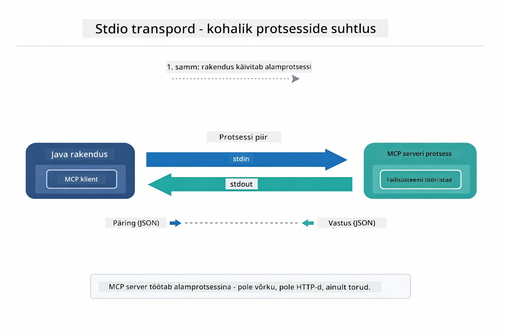

*Stdio transport tegevuses — sinu rakendus käivitab MCP serveri lapsprotsessina ja suhtleb läbi stdin/stdout torude.*

> **🤖 Proovi koos [GitHub Copilot](https://github.com/features/copilot) Chat'iga:** Ava [`StdioTransportDemo.java`](../../../05-mcp/src/main/java/com/example/langchain4j/mcp/StdioTransportDemo.java) ja küsi:
> - "Kuidas Stdio transport töötab ja millal peaksin seda HTTP-ga võrreldes kasutama?"
> - "Kuidas LangChain4j haldab käivitatud MCP serveriprotsesside elutsüklit?"
> - "Millised on turvariskid AI-le failisüsteemi ligipääsu andmisel?"

## Agentne moodul

Kuigi MCP pakub standardiseeritud tööriistu, pakub LangChain4j **agentne moodul** deklaratiivset viisi luua agente, kes korraldavad neid tööriistu. `@Agent` annotatsioon ja `AgenticServices` võimaldavad määratleda agendi käitumist liideste kaudu, mitte imperatiivse koodi kaudu.

Selles moodulis uurid **Juhendaja Agendi** mustrit — täiustatud agentset AI lähenemist, kus "juhendaja" agent otsustab dünaamiliselt, milliseid alaagente kasutaja päringute põhjal kutsuda. Ühendame need mõlemad, andes ühele alaagendile MCP jõulise failitöötluse võimed.

Agentse mooduli kasutamiseks lisa see Maven sõltuvus:

```xml
<dependency>
    <groupId>dev.langchain4j</groupId>
    <artifactId>langchain4j-agentic</artifactId>
    <version>${langchain4j.mcp.version}</version>
</dependency>
```
> **Märkus:** `langchain4j-agentic` moodul kasutab eraldi versiooni omadust (`langchain4j.mcp.version`), sest see avaldatakse erineva graafikuga võrreldes LangChain4j tuumaraamatukoguga.

> **⚠️ Eksperimentaalne:** `langchain4j-agentic` moodul on **eksperimentaalne** ja võib muutuda. Stabiilne viis AI assistentide loomiseks jääb olema `langchain4j-core` koos kohandatud tööriistadega (Moodul 04).

## Näidete käivitamine

### Eeltingimused

- Läbitud [Moodul 04 - Tööriistad](../04-tools/README.md) (see moodul põhineb kohandatud tööriistade kontseptsioonidel ja võrdleb neid MCP tööriistadega)
- `.env` fail juurkataloogis Azure volitustega (loodud `azd up` käsuga Moodulis 01)
- Java 21+, Maven 3.9+
- Node.js 16+ ja npm (MCP serverite jaoks)

> **Märkus:** Kui sa pole veel seadistanud oma keskkonnamuutujaid, vaata [Moodul 01 - Sissejuhatus](../01-introduction/README.md) paigaldusjuhiseid (`azd up` loob `.env` faili automaatselt), või kopeeri `.env.example` fail juurkataloogi `.env` nime all ja täida oma väärtused.

## Kiire alustamine

**VS Code’i kasutamine:** Lihtsalt paremklõpsa suvalisel demo failil Exploreris ja vali **"Run Java"**, või kasuta Run and Debug paneeli käivitamiskonfiguratsioone (veendu, et sinu `.env` fail on õigesti Azure volitustega seadistatud).

**Maven’i kasutamine:** Või siis võid käsurealt käivitada näited allolevate juhiste järgi.

### Failioperatsioonid (Stdio)

See demonstreerib kohapeal alamprotsessidel põhinevaid tööriistu.

**✅ Eeltingimusi pole** - MCP server käivitub automaatselt.

**Kasuta stardiskripte (soovitatav):**

Stardiskriptid laadivad automaatselt keskkonnamuutujad juurkataloogi `.env` failist:

**Bash:**
```bash
cd 05-mcp
chmod +x start-stdio.sh
./start-stdio.sh
```

**PowerShell:**
```powershell
cd 05-mcp
.\start-stdio.ps1
```

**VS Code’i kasutamine:** Paremklõpsa `StdioTransportDemo.java` peal ja vali **"Run Java"** (veendu, et sinu `.env` on seadistatud).

Rakendus käivitab automaatselt failisüsteemi MCP serveri ja loeb kohaliku faili. Pane tähele, kuidas alamprotsessi haldus on sinu eest lahendatud.

**Oodatud väljund:**
```
Assistant response: The file provides an overview of LangChain4j, an open-source Java library
for integrating Large Language Models (LLMs) into Java applications...
```

### Juhendaja agent

**Juhendaja Agendi muster** on **paindlik** agentse AI vorm. Juhendaja kasutab LLM-i, et autonoomselt otsustada, milliseid agente kutsuda vastavalt kasutaja päringule. Järgmises näites ühendame MCP jõulise faililugeja LLM agendiga, et luua juhendatud faililuge → aruandeloome töövoog.

Demos loeb `FileAgent` faili MCP failisüsteemi tööriistade abil ja `ReportAgent` genereerib struktureeritud raporti koos juhtkonna kokkuvõttega (1 lause), 3 peamise punktiga ja soovitustega. Juhendaja koordineerib seda voogu automaatselt:

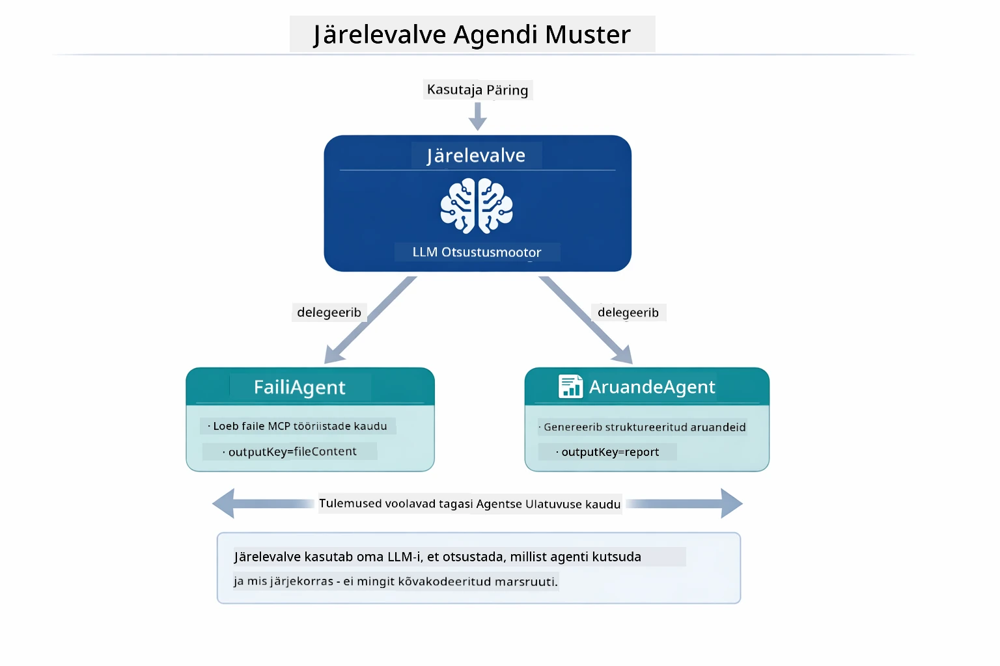

*Juhendaja kasutab oma LLM-i, et otsustada, milliseid agente ja mis järjekorras kutsuda – pole vaja kõvade kooditud marsruute.*

Siin on konkreetne töövoog meie failist raportini torujuhale:

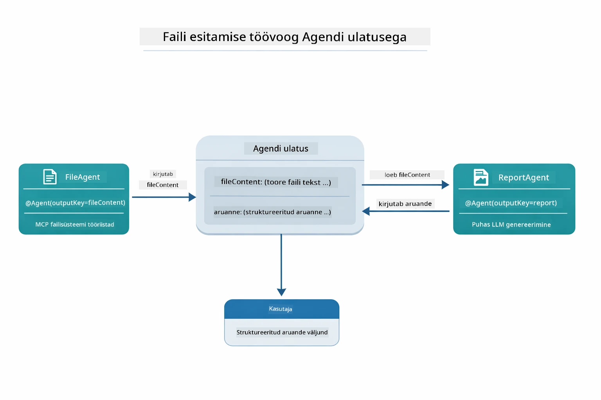

*FileAgent loeb faili läbi MCP tööriistade, seejärel ReportAgent teisendab toore sisu struktureeritud raportiks.*

Järgmine järjestusdiagramm jälgib täisjuhendamise — MCP serveri käivitamisest, juhendaja autonoomsest agendi valikust, stdio kaudu tööriistade kutsumisest kuni lõpliku raportini:

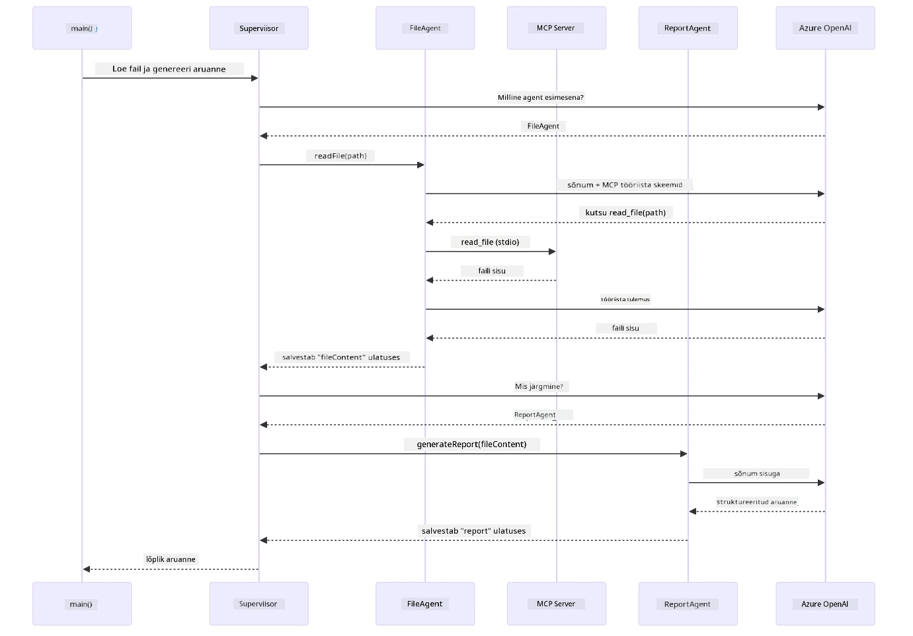

*Juhendaja kutsub autonoomselt FileAgenti (kes kutsub MCP serverit üle stdio faili lugemiseks), siis ReportAgenti struktureeritud raporti genereerimiseks — iga agent salvestab oma väljundi jagatud Agentic Scope'sse.*

Iga agent salvestab oma väljundi **Agentic Scope’sse** (jagatud mällu), võimaldades allagentidel ligipääsu eelnevatele tulemustele. See demonstreerib, kuidas MCP tööriistad sulanduvad sujuvalt agentsetesse töövoogudesse — juhendaja ei pea teadma *kuidas* failid loetakse, vaid ainult seda, et `FileAgent` saab seda teha.

#### Demo käivitamine

Stardiskriptid laadivad automaatselt keskkonnamuutujad juurkataloogi `.env` failist:

**Bash:**
```bash
cd 05-mcp
chmod +x start-supervisor.sh
./start-supervisor.sh
```

**PowerShell:**
```powershell
cd 05-mcp
.\start-supervisor.ps1
```

**VS Code’i kasutamine:** Paremklõpsa `SupervisorAgentDemo.java` peal ja vali **"Run Java"** (veendu, et sinu `.env` on seadistatud).

#### Kuidas juhendaja töötab

Enne agentide loomist pead MCP transpordi ühendama kliendiga ja mähkima selle `ToolProvider`-ks. Nii saavad MCP serveri tööriistad sinu agentide jaoks kättesaadavaks:

```java
// Loo MCP klient transpordist
McpClient mcpClient = new DefaultMcpClient.Builder()
        .transport(stdioTransport)
        .build();

// Ümbermõõda klient ToolProvider’iks — see ühendab MCP tööriistad LangChain4j-ga
ToolProvider mcpToolProvider = McpToolProvider.builder()
        .mcpClients(List.of(mcpClient))
        .build();
```

Nüüd saad süstida `mcpToolProvider` ükskõik millesse agendi, kes vajab MCP tööriistu:

```java
// Samm 1: FileAgent loeb faile, kasutades MCP tööriistu
FileAgent fileAgent = AgenticServices.agentBuilder(FileAgent.class)
        .chatModel(model)
        .toolProvider(mcpToolProvider)  // Omab MCP tööriistu failitoiminguteks
        .build();

// Samm 2: ReportAgent genereerib struktureeritud aruandeid
ReportAgent reportAgent = AgenticServices.agentBuilder(ReportAgent.class)
        .chatModel(model)
        .build();

// Juhataja koordineerib faili → aruande töövoogu
SupervisorAgent supervisor = AgenticServices.supervisorBuilder()
        .chatModel(model)
        .subAgents(fileAgent, reportAgent)
        .responseStrategy(SupervisorResponseStrategy.LAST)  // Tagasta lõplik aruanne
        .build();

// Juhataja otsustab päringu põhjal, milliseid agente kutsuda
String response = supervisor.invoke("Read the file at /path/file.txt and generate a report");
```

#### Kuidas FileAgent MCP tööriistu jooksuajal avastab

Võid mõelda: **kuidas `FileAgent` teab, kuidas npm failisüsteemi tööriistu kasutada?** Vastus on see, et ta ei tea — **LLM** mõistab selle jooksuajal tööriistade skeemide abil.
`FileAgent` liides on lihtsalt **sõnumipõhine definitsioon**. See ei sisalda ette programmeeritud teadmisi `read_file`, `list_directory` ega teiste MCP tööriistade kohta. Siin on, mis juhtub algusest lõpuni:

1. **Server käivitub:** `StdioMcpTransport` käivitab `@modelcontextprotocol/server-filesystem` npm paketi alamprotsessina  
2. **Tööriistade avastamine:** `McpClient` saadab serverile JSON-RPC päringu `tools/list`, millele server vastab tööriistade nimede, kirjelduste ja parameetrite skeemidega (nt `read_file` — *„Loe faili täielik sisu“* — `{ path: string }`)  
3. **Skeemi süstimine:** `McpToolProvider` kapseldab need avastatud skeemid ja teeb need LangChain4j jaoks kättesaadavaks  
4. **LLM otsustab:** Kui kutsutakse `FileAgent.readFile(path)`, saadab LangChain4j süsteemisõnumi, kasutajasõnumi **ja tööriistade skeemide nimekirja** LLM-ile. LLM loeb tööriistade kirjeldusi ja genereerib tööriista kutse (nt `read_file(path="/some/file.txt")`)  
5. **Täideviimine:** LangChain4j püüab tööriista kutse kinni, suunab selle MCP kliendi kaudu tagasi Node.js alamprotsessile, saab tulemuse ja edastab selle LLM-ile tagasi  

See on sama [Tööriistade avastamise](../../../05-mcp) mehhanism, mis ülal kirjeldatud, kuid rakendatud konkreetselt agendi töövoogu. Märgendid `@SystemMessage` ja `@UserMessage` juhivad LLM käitumist, samas kui süstitud `ToolProvider` annab sellele **võimekused** — LLM ühendab need jooksuajal.

> **🤖 Proovi [GitHub Copilot](https://github.com/features/copilot) Chatiga:** Ava [`FileAgent.java`](../../../05-mcp/src/main/java/com/example/langchain4j/mcp/agents/FileAgent.java) ja küsi:
> - "Kuidas see agent teab, millist MCP tööriista kutsuda?"
> - "Mis juhtuks, kui agent builderist eemaldada ToolProvider?"
> - "Kuidas tööriistade skeemid LLM-ile edastatakse?"

#### Vastamisstrateegiad

Kui seadistad `SupervisorAgent`i, määrad, kuidas ta peaks pärast alamagentide ülesannete täitmist kasutajale oma lõpliku vastuse formuleerima. Alloleval diagrammil on näha kolm saadaolevat strateegiat — LAST tagastab lõpliku agendi väljundi otse, SUMMARY sünteesib kõik väljundid läbi LLM-i ja SCORED valib neist tulemuse, mille skoor on algse päringu suhtes kõrgem:

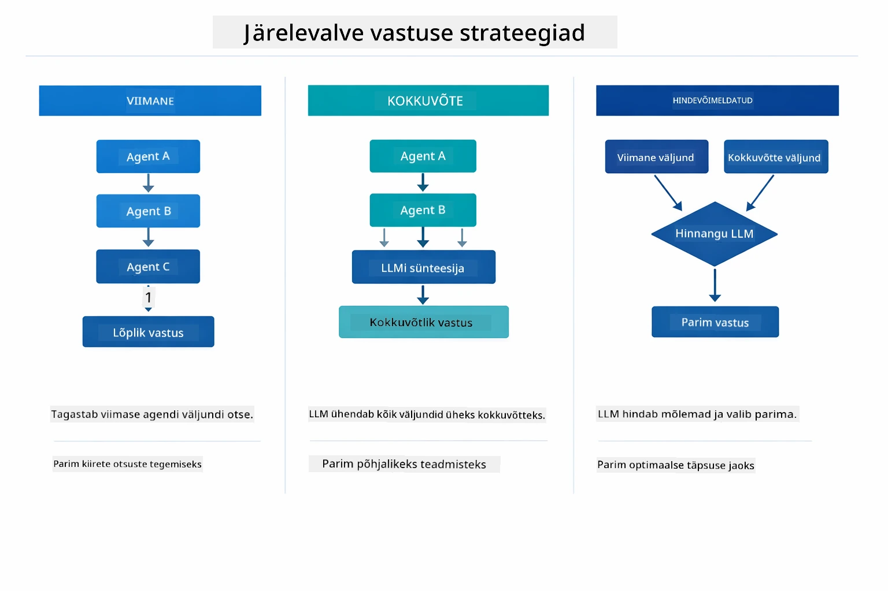

*Kolm strateegiat, kuidas Supervisor oma lõpliku vastuse formuleerib — vali vastavalt sellele, kas soovid viimase agendi väljundit, sünteesitud kokkuvõtet või parima skooriga varianti.*

Saadaval on järgmised strateegiad:

| Strateegia | Kirjeldus |
|------------|-----------|
| **LAST**   | Supervisor tagastab viimase alamagendi või kliidudud tööriista väljundi. See on kasulik, kui töövoo viimane agent on spetsiaalselt loodud täieliku lõpliku vastuse andmiseks (nt "Kokkuvõtte agent" uurimistöö torujuhtmes). |
| **SUMMARY**| Supervisor kasutab oma sisemist Keelemodell (LLM) kogu suhtluse ja alamagentide väljundite kokkuvõtte sünteesimiseks ning tagastab selle kokkuvõtte lõpliku vastusena. See annab kasutajale puhta, koondatud vastuse. |
| **SCORED** | Süsteem kasutab sisemist LLM-i nii LAST vastuse kui SUMMARY kokkuvõtte hindamiseks vastavalt algsele kasutajapäringule ning tagastab selle väljundi, mille skoor on kõrgem. |

Täieliku rakenduse jaoks vaata [SupervisorAgentDemo.java](../../../05-mcp/src/main/java/com/example/langchain4j/mcp/SupervisorAgentDemo.java).

> **🤖 Proovi [GitHub Copilot](https://github.com/features/copilot) Chatiga:** Ava [`SupervisorAgentDemo.java`](../../../05-mcp/src/main/java/com/example/langchain4j/mcp/SupervisorAgentDemo.java) ja küsi:
> - "Kuidas Supervisor otsustab, milliseid agente kutsuda?"
> - "Mis vahe on Supervisori ja jada-töövoo (Sequential) mustritel?"
> - "Kuidas saan Supervisori planeerimise käitumist kohandada?"

#### Väljundi mõistmine

Demo käivitamisel näed struktureeritud juhendust selle kohta, kuidas Supervisor orkestreerib mitut agenti. Iga sektsioon tähendus on järgmine:

```
======================================================================
  FILE → REPORT WORKFLOW DEMO
======================================================================

This demo shows a clear 2-step workflow: read a file, then generate a report.
The Supervisor orchestrates the agents automatically based on the request.
```
  
**Päis** tutvustab töövoo kontseptsiooni: keskendunud torujuhe failide lugemisest aruande koostamiseni.

```
--- WORKFLOW ---------------------------------------------------------
  ┌─────────────┐      ┌──────────────┐
  │  FileAgent  │ ───▶ │ ReportAgent  │
  │ (MCP tools) │      │  (pure LLM)  │
  └─────────────┘      └──────────────┘
   outputKey:           outputKey:
   'fileContent'        'report'

--- AVAILABLE AGENTS -------------------------------------------------
  [FILE]   FileAgent   - Reads files via MCP → stores in 'fileContent'
  [REPORT] ReportAgent - Generates structured report → stores in 'report'
```
  
**Töövoo diagramm** näitab andmevoogu agentide vahel. Igal agen dil on konkreetne roll:  
- **FileAgent** loeb faile MCP tööriistadega ja salvestab toorsisu `fileContent`  
- **ReportAgent** kasutab seda sisu ja koostab struktureeritud aruande `report`

```
--- USER REQUEST -----------------------------------------------------
  "Read the file at .../file.txt and generate a report on its contents"
```
  
**Kasutajapäring** näitab ülesannet. Supervisor analüüsib seda ja otsustab kutsuda FileAgent → ReportAgent.

```
--- SUPERVISOR ORCHESTRATION -----------------------------------------
  The Supervisor decides which agents to invoke and passes data between them...

  +-- STEP 1: Supervisor chose -> FileAgent (reading file via MCP)
  |
  |   Input: .../file.txt
  |
  |   Result: LangChain4j is an open-source, provider-agnostic Java framework for building LLM...
  +-- [OK] FileAgent (reading file via MCP) completed

  +-- STEP 2: Supervisor chose -> ReportAgent (generating structured report)
  |
  |   Input: LangChain4j is an open-source, provider-agnostic Java framew...
  |
  |   Result: Executive Summary...
  +-- [OK] ReportAgent (generating structured report) completed
```
  
**Supervisori orkestreerimine** illustreerib 2-etapilist töövoogu:  
1. **FileAgent** loeb faili MCP kaudu ja salvestab sisu  
2. **ReportAgent** saab selle sisu ja genereerib struktureeritud aruande  

Supervisor tegi need otsused **iseseisvalt** vastavalt kasutaja päringule.

```
--- FINAL RESPONSE ---------------------------------------------------
Executive Summary
...

Key Points
...

Recommendations
...

--- AGENTIC SCOPE (Data Flow) ----------------------------------------
  Each agent stores its output for downstream agents to consume:
  * fileContent: LangChain4j is an open-source, provider-agnostic Java framework...
  * report: Executive Summary...
```
  
#### Agentic mooduli funktsioonide selgitus

Näide demonstreerib mitmeid arenenud omadusi agentic moodulis. Vaadakem lähemalt Agentic Scope’i ja Agent Listener’id.

**Agentic Scope** näitab jagatud mälu, kuhu agendid salvestasid tulemusi, kasutades `@Agent(outputKey="...")`. See võimaldab:  
- Hilisematel agentidel pääseda varasemate agentide väljunditele ligi  
- Supervisoril sünteesida lõplik vastus  
- Sul inspectida, mida iga agent tootis

Alloleval diagrammil on näha, kuidas Agentic Scope toimib jagatud mäluna failist aruandeni töövoos — FileAgent kirjutab väljundi võtme `fileContent` alla, ReportAgent loeb selle ja kirjutab oma väljundi võtme `report` alla:

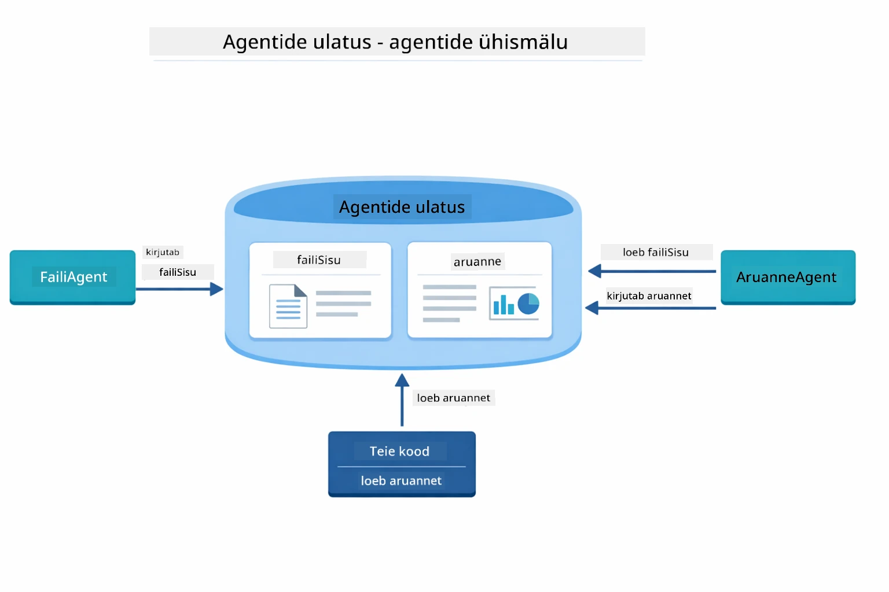

*Agentic Scope toimib jagatud mäluna — FileAgent kirjutab `fileContent`, ReportAgent loeb seda ja kirjutab `report`, ning sinu kood loeb lõpptulemuse.*

```java
ResultWithAgenticScope<String> result = supervisor.invokeWithAgenticScope(request);
AgenticScope scope = result.agenticScope();
String fileContent = scope.readState("fileContent");  // Toorfaili andmed FileAgentilt
String report = scope.readState("report");            // Struktureeritud aruanne ReportAgentilt
```
  
**Agent Listener’id** võimaldavad jälgida ja siluda agentide täitmisi. Demo samm-sammuline väljund pärineb AgentListener’ist, mis haakub iga agendi kutsega:  
- **beforeAgentInvocation** — kutsutakse, kui Supervisor valib agendi, nii saad näha, milline agent valiti ja miks  
- **afterAgentInvocation** — kutsutakse, kui agent lõpetab, kuvades selle tulemuse  
- **inheritedBySubagents** — kui tõene, jälgitakse kõiki hierarhias olevaid agente  

Järgmine diagramm illustreerib Agent Listener’i täielikku elutsüklit, sh kuidas `onError` käsitleb agentide täitmisel esinevaid vigu:

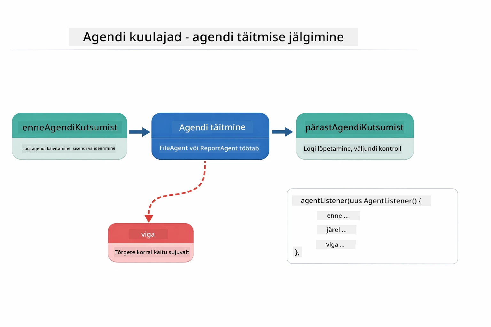

*Agent Listener’id haakuvad täitmise elutsüklisse — jälgi, millal agendid alustavad, lõpetavad või puutuvad kokku vigadega.*

```java
AgentListener monitor = new AgentListener() {
    private int step = 0;
    
    @Override
    public void beforeAgentInvocation(AgentRequest request) {
        step++;
        System.out.println("  +-- STEP " + step + ": " + request.agentName());
    }
    
    @Override
    public void afterAgentInvocation(AgentResponse response) {
        System.out.println("  +-- [OK] " + response.agentName() + " completed");
    }
    
    @Override
    public boolean inheritedBySubagents() {
        return true; // Levita kõigile all-agentidele
    }
};
```
  
Lisaks Supervisori mustrile pakub `langchain4j-agentic` moodul võimsaid töövoo mustreid. Allolev diagramm näitab kõiki viit — alates lihtsatest jada-torudest kuni inimsekkumisega heakskiitmise töövoogudeni:

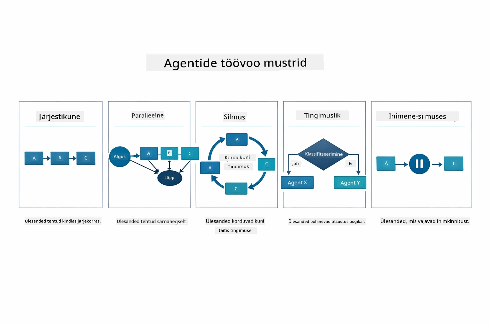

*Viis töövoo mustrit agentide orkestreerimiseks — alates lihtsatest jada-torudest kuni inimsekkumisega heakskiitmise töövoogudeni.*

| Muster         | Kirjeldus                     | Kasutusjuhtum                        |
|----------------|-------------------------------|------------------------------------|
| **Sequential** | Käivita agendid järjest, väljund läheb järgmisele | Torud: uurimine → analüüs → aruanne |
| **Parallel**   | Käivita agendid samaaegselt   | Sõltumatud ülesanded: ilm + uudised + aktsiad |
| **Loop**       | Tsükli läbi kuni tingimus täidetud | Kvaliteedisooritus: täpsusta kuni skoor ≥ 0.8 |
| **Conditional**| Suuna tingimuste alusel        | Klassifitseeri → suuna spetsialistile |
| **Human-in-the-Loop** | Lisa inimlikke kontrollpunkte | Heakskiitmise töövood, sisu ülevaatus |

## Peamised mõisted

Nüüd, kui oled uurinud MCP ja agentic moodulit praktikas, võtame kokku, millal kumbagi lähenemist kasutada.

Üks MCP suurimaid eeliseid on selle kasvav ökosüsteem. Järgmine diagramm näitab, kuidas üks universaalne protokoll ühendab sinu AI rakenduse paljude MCP serveritega — alates failisüsteemi ja andmebaasi ligipääsust kuni GitHubi, e-posti, veebikraapimise ja muuni:

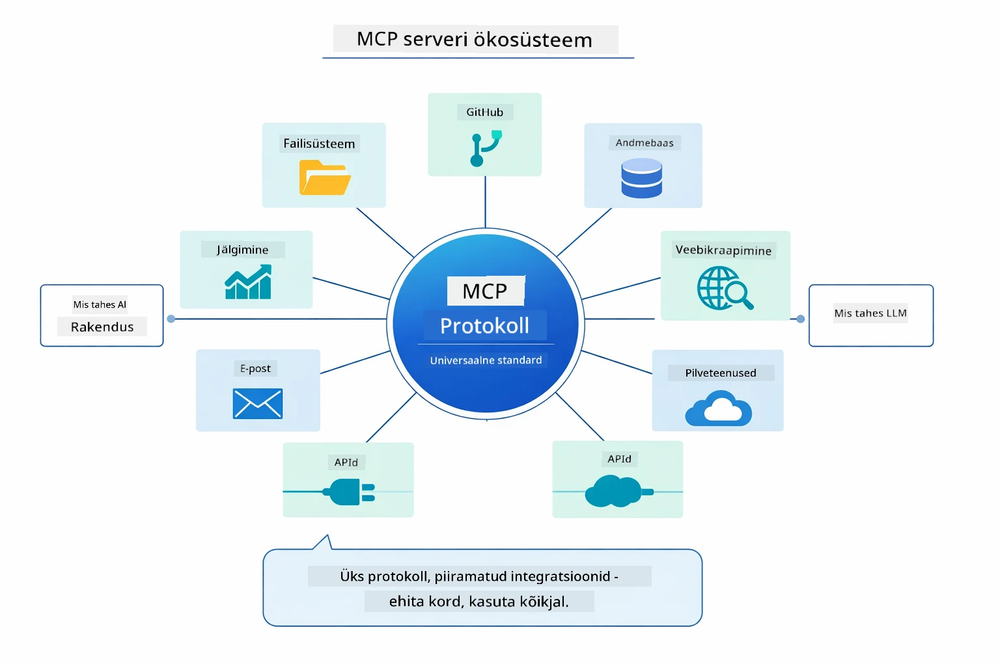

*MCP loob universaalse protokolli ökosüsteemi — iga MCP-ühilduv server töötab koos iga MCP-ühilduva kliendiga, võimaldades tööriistade jagamist rakenduste vahel.*

**MCP** on ideaalne, kui soovid kasutada olemasolevaid tööriistade ökosüsteeme, ehitada tööriistu, mida jagavad mitmed rakendused, integreerida kolmanda osapoole teenuseid standardsete protokollidega või vahetada tööriistade implementeeringuid koodi muutmata.

**Agentic Moodul** sobib kõige paremini, kui soovid deklaratiivseid agentide definitsioone `@Agent` märgenditega, vajad töövoo orkestreerimist (jada, tsükkel, paralleel), eelista liidese-põhist agentide disaini käsupõhise koodi asemel või ühendad mitut agenti, kes jagavad väljundeid `outputKey` kaudu.

**Supervisor Agent mustril** on plussiks, kui töövoog ei ole eelnevalt prognoositav ja soovid, et LLM otsustab, kui sul on mitu spetsialiseeritud agenti, keda tuleb dünaamiliselt orkestreerida, kui ehitad vestlussüsteeme, mis suunavad erinevatele võimekustele, või kui tahad kõige paindlikumat ja kohanemisvõimelisema agendi käitumist.

Selleks, et aidata otsustada mooduli 04 kohandatud `@Tool` meetodite ja selle mooduli MCP tööriistade vahel, toob järgmine võrdlus esile peamised kompromissid — kohandatud tööriistad annavad tugeva sidumise ja täieliku tüüpitõrje rakenduspõhise loogika jaoks, MCP tööriistad aga standardiseeritud ja taaskasutatavad integratsioonid:

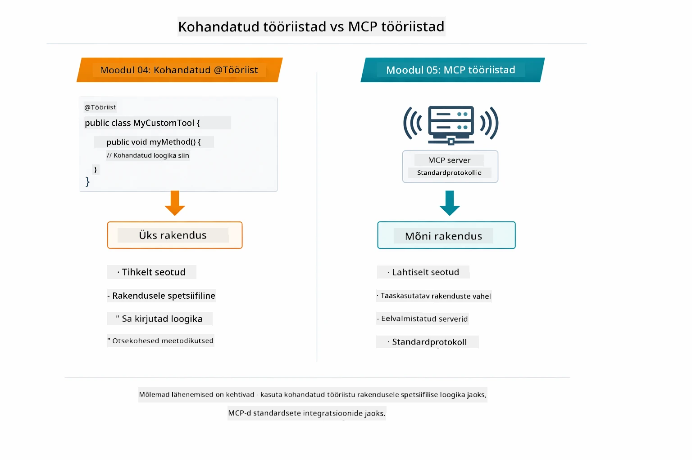

*Millal kasutada kohandatud @Tool meetodeid vs MCP tööriistu — kohandatud tööriistad rakenduspõhise loogika jaoks täieliku tüüpitõrjega, MCP tööriistad standardiseeritud integratsioonide jaoks, mis töötavad mitme rakendusega.*

## Palju õnne!

Oled läbinud kõik viis moodulit kursusel LangChain4j algajatele! Siin on ülevaade kogu õpiteekonnast — alates põhivestlusest kuni MCP-võimeliste agentic süsteemideni:

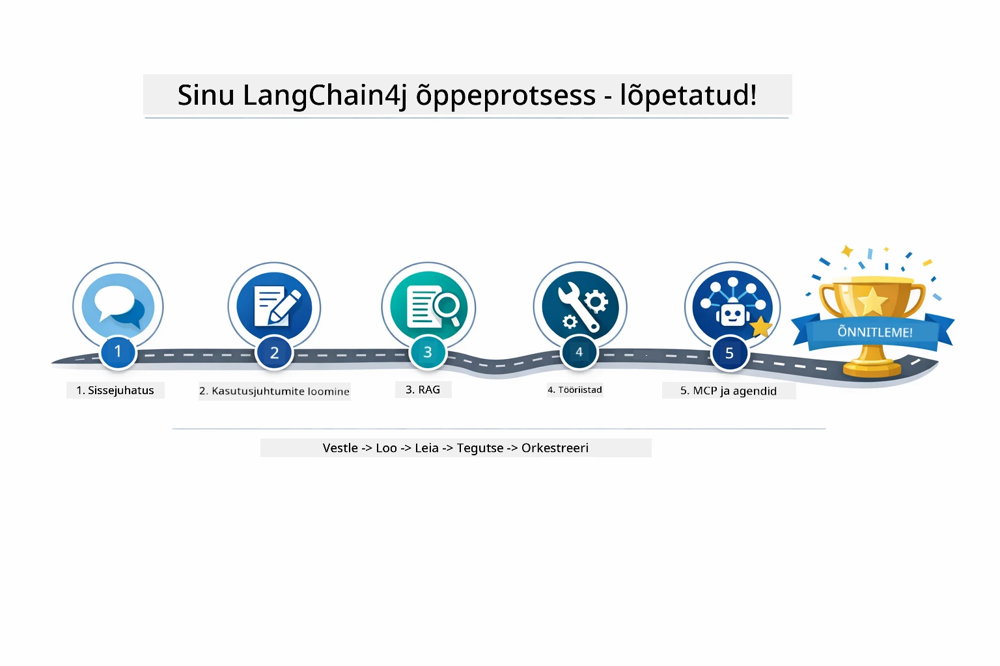

*Sinu õpiteekond kõigi viie mooduli kaudu — alates põhivestlusest MCP-võimeliste agentic süsteemideni.*

Oled lõpetanud LangChain4j for Beginners kursuse. Oled õppinud:

- Kuidas luua vestluslikku tehisintellekti mäluga (Moodul 01)  
- Sõnumiinsenerluse mustreid erinevate ülesannete jaoks (Moodul 02)  
- Vastuste sidumist dokumentidega RAG meetodiga (Moodul 03)  
- Põhiliste tehisintellekti agentide (abisüsteemide) loomist kohandatud tööriistadega (Moodul 04)  
- Standardiseeritud tööriistade integreerimist LangChain4j MCP ja Agentic moodulite abil (Moodul 05)  

### Mis järgmiseks?

Pärast moodulite läbimist uuri [Testimise juhendit](../docs/TESTING.md), et näha LangChain4j testimise kontseptsioone praktikas.

**Ametlikud ressursid:**  
- [LangChain4j dokumentatsioon](https://docs.langchain4j.dev/) — põhjalikud juhendid ja API kirjeldus  
- [LangChain4j GitHub](https://github.com/langchain4j/langchain4j) — lähtekood ja näited  
- [LangChain4j õpetused](https://docs.langchain4j.dev/tutorials/) — samm-sammult juhendid erinevate kasutusjuhtude jaoks  

Täname, et lõpetasid selle kursuse!

---

**Navigatsioon:** [← Eelmine: Moodul 04 - Tööriistad](../04-tools/README.md) | [Tagasi avalehele](../README.md)

---

<!-- CO-OP TRANSLATOR DISCLAIMER START -->
**Lahtiütlus**:
See dokument on tõlgitud kasutades tehisintellekti tõlketeenust [Co-op Translator](https://github.com/Azure/co-op-translator). Kuigi me püüame tagada täpsust, palun pidage meeles, et automatiseeritud tõlked võivad sisaldada vigu või ebatäpsusi. Algupärane dokument selle emakeeles on teie autoriteetne allikas. Tähtsa teabe puhul soovitatakse kasutada professionaalset inimtõlget. Me ei vastuta selle tõlke kasutamisest tulenevate arusaamatuste ega valesti mõistmiste eest.
<!-- CO-OP TRANSLATOR DISCLAIMER END -->