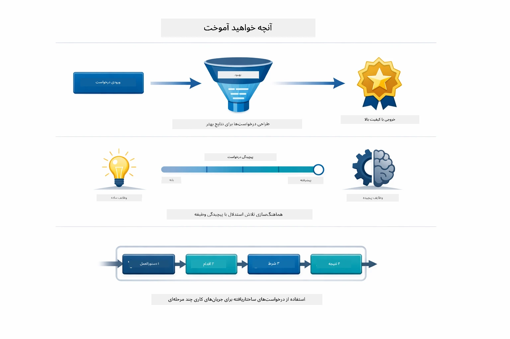
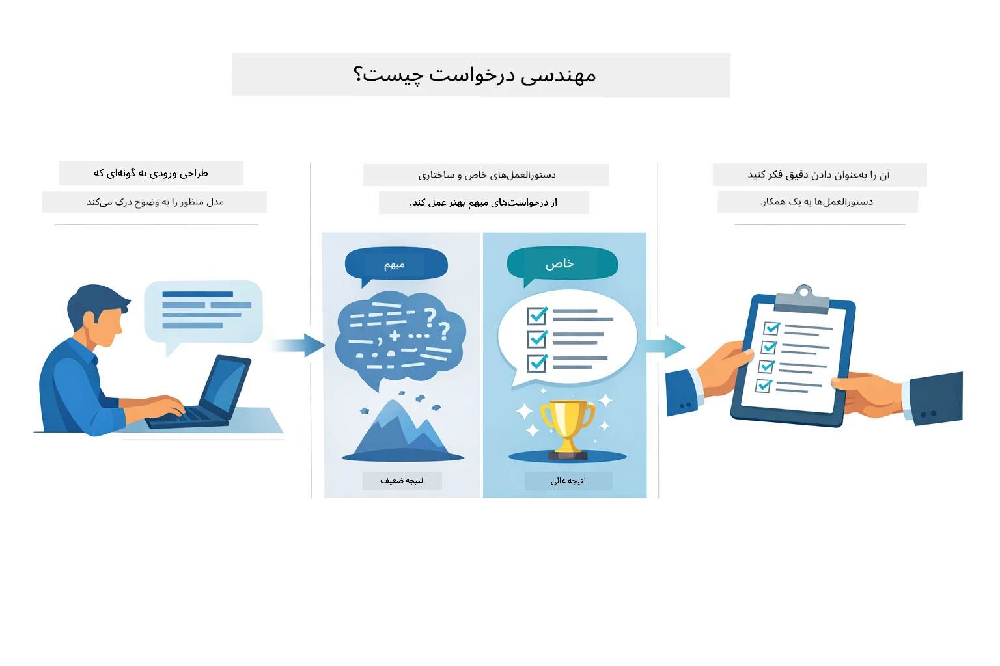
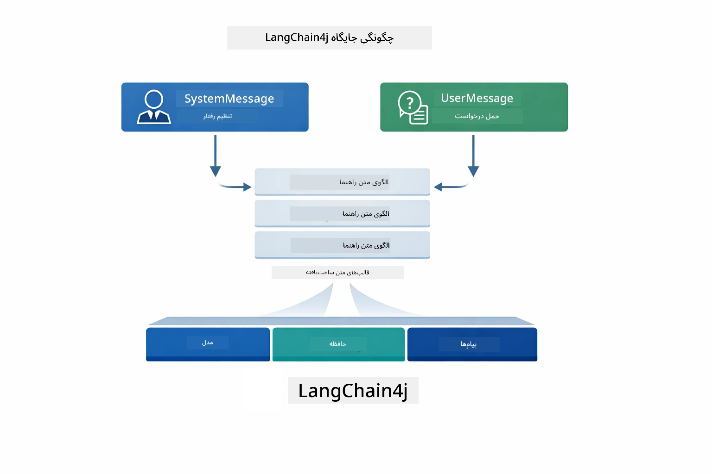
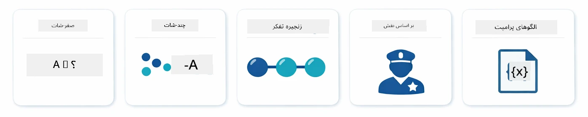
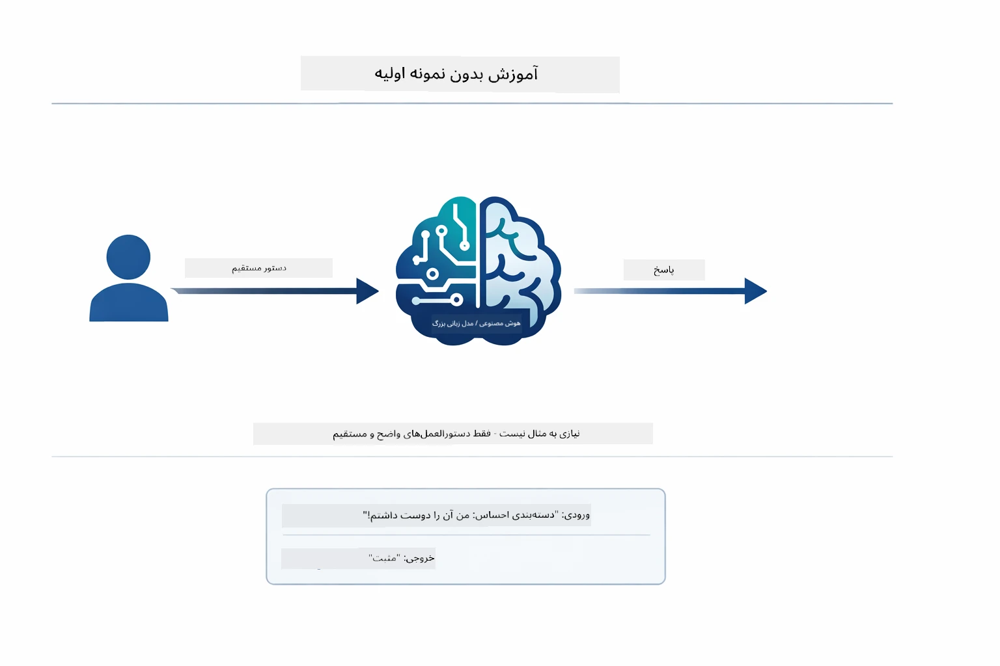
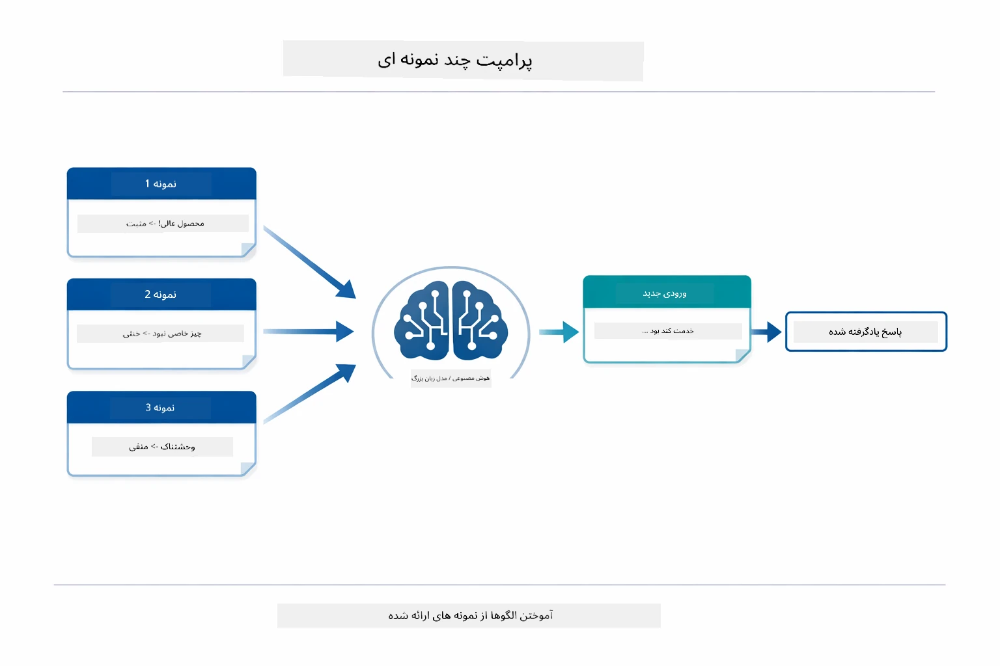
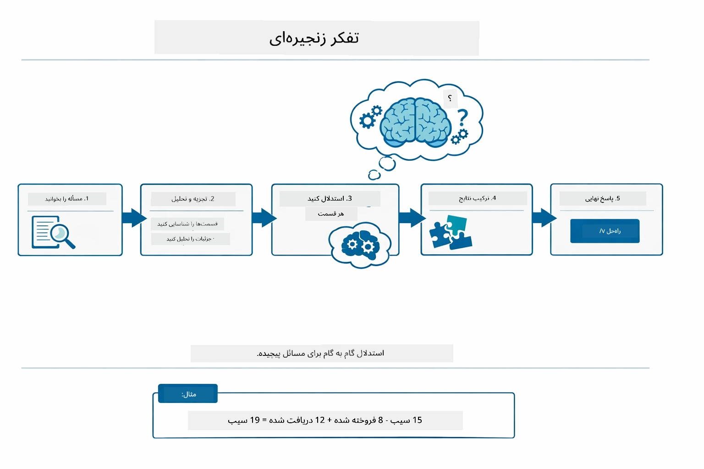
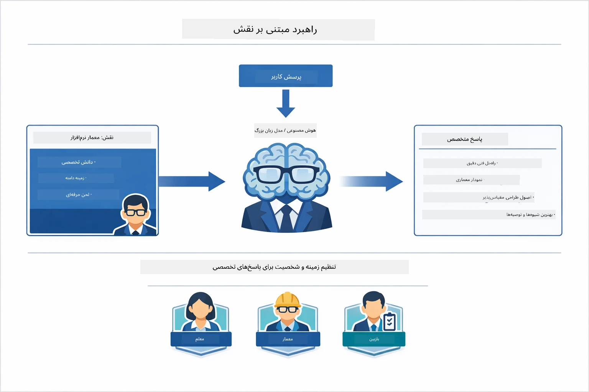
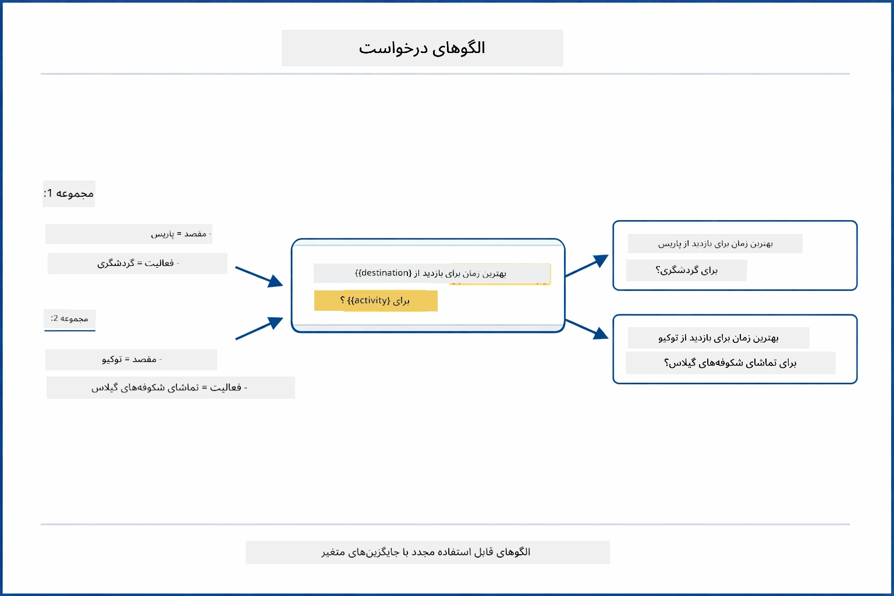
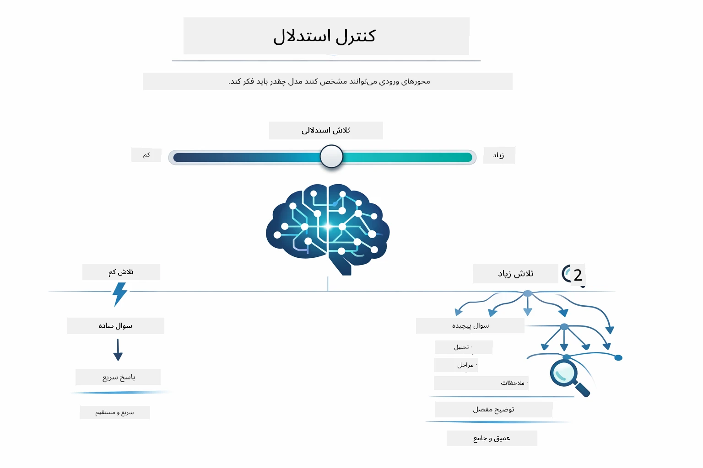

# ماژول ۰۲: مهندسی پرامپت با GPT-5.2

## فهرست مطالب

- [چه چیزی یاد می‌گیرید](../../../02-prompt-engineering)
- [پیش‌نیازها](../../../02-prompt-engineering)
- [درک مهندسی پرامپت](../../../02-prompt-engineering)
- [اصول مهندسی پرامپت](../../../02-prompt-engineering)
  - [پرامپت بدون نمونه](../../../02-prompt-engineering)
  - [پرامپت با چند نمونه](../../../02-prompt-engineering)
  - [زنجیره تفکر](../../../02-prompt-engineering)
  - [پرامپت مبتنی بر نقش](../../../02-prompt-engineering)
  - [قالب‌های پرامپت](../../../02-prompt-engineering)
- [الگوهای پیشرفته](../../../02-prompt-engineering)
- [استفاده از منابع فعلی Azure](../../../02-prompt-engineering)
- [تصاویر برنامه](../../../02-prompt-engineering)
- [کاوش در الگوها](../../../02-prompt-engineering)
  - [کم‌اشتیاق در مقابل پر اشتیاق](../../../02-prompt-engineering)
  - [اجرای وظیفه (پیش‌گفتار ابزارها)](../../../02-prompt-engineering)
  - [کد خودبازتابی](../../../02-prompt-engineering)
  - [تحلیل ساختاریافته](../../../02-prompt-engineering)
  - [چت چند دوری](../../../02-prompt-engineering)
  - [استدلال گام به گام](../../../02-prompt-engineering)
  - [خروجی محدود شده](../../../02-prompt-engineering)
- [آنچه واقعاً یاد می‌گیرید](../../../02-prompt-engineering)
- [قدم‌های بعدی](../../../02-prompt-engineering)

## چه چیزی یاد می‌گیرید



در ماژول قبلی، دیدید که چگونه حافظه امکان هوش مصنوعی مکالمه‌ای را فراهم می‌کند و از مدل‌های GitHub برای تعاملات پایه استفاده کردید. حالا تمرکز ما بر روی نحوه پرسیدن سوالات — یعنی خود پرامپت‌ها — با استفاده از GPT-5.2 از Azure OpenAI است. نحوه ساختاردهی پرامپت‌ها به طور چشمگیری کیفیت پاسخ‌ها را تحت تأثیر قرار می‌دهد. ابتدا مرور کلی روی تکنیک‌های پایه پرامپتینگ داریم، سپس به هشت الگوی پیشرفته می‌پردازیم که از قابلیت‌های GPT-5.2 به‌طور کامل بهره می‌برند.

ما از GPT-5.2 استفاده می‌کنیم چون کنترل استدلال را معرفی می‌کند - شما می‌توانید به مدل بگویید چقدر باید قبل از پاسخ‌دادن فکر کند. این باعث می‌شود استراتژی‌های مختلف پرامپت‌دهی واضح‌تر باشد و به شما کمک می‌کند بفهمید هر کدام را کی باید به کار برید. همچنین از محدودیت‌های نرخ کمتر Azure برای GPT-5.2 نسبت به مدل‌های GitHub بهره‌مند می‌شویم.

## پیش‌نیازها

- تکمیل ماژول ۰۱ (منابع Azure OpenAI مستقر شده)
- فایل `.env` در شاخه ریشه با اعتبارنامه‌های Azure (ایجاد شده توسط `azd up` در ماژول ۰۱)

> **توجه:** اگر ماژول ۰۱ را تکمیل نکرده‌اید، ابتدا دستورالعمل‌های استقرار آن را دنبال کنید.

## درک مهندسی پرامپت



مهندسی پرامپت یعنی طراحی متن ورودی که به طور مداوم نتایج مورد نیاز شما را می‌دهد. فقط پرسیدن سوال نیست — بلکه ساختاردهی درخواست‌ها است تا مدل دقیقاً بفهمد چه چیزی می‌خواهید و چگونه آن را تحویل دهد.

مثل دادن دستورالعمل به یک همکار فکر کنید. «رفع اشکال» حالت مبهم است. «رفع استثنای اشاره‌گر null در خط ۴۵ فایل UserService.java با اضافه کردن چک null» دقیق است. مدل‌های زبانی هم همین‌طور عمل می‌کنند — خاص بودن و ساختار مهم است.



LangChain4j زیرساخت لازم را فراهم می‌کند — ارتباط با مدل، حافظه، و نوع‌های پیام — در حالی که الگوهای پرامپت فقط متن‌های دقیقی هستند که از طریق آن زیرساخت ارسال می‌شوند. بلوک‌های کلیدی عبارتند از `SystemMessage` (که رفتار و نقش هوش مصنوعی را تنظیم می‌کند) و `UserMessage` (که درخواست واقعی شما را حمل می‌کند).

## اصول مهندسی پرامپت



قبل از شروع به الگوهای پیشرفته این ماژول، بیایید پنج تکنیک پایه پرامپتینگ را مرور کنیم. این‌ها بلوک‌های اصلی هستند که هر مهندس پرامپت باید بداند. اگر قبلاً ماژول [شروع سریع](../00-quick-start/README.md#2-prompt-patterns) را دیده باشید، این‌ها را در عمل دیده‌اید — اینجا چارچوب مفهومی پشت آن‌ها آمده است.

### پرامپت بدون نمونه

ساده‌ترین روش: یک دستور مستقیم بدون نمونه به مدل بدهید. مدل کاملاً به آموزش خودش متکی است تا وظیفه را بفهمد و اجرا کند. این برای درخواست‌های ساده‌ای که رفتار مورد انتظار واضح است، خوب عمل می‌کند.



*دستور مستقیم بدون نمونه — مدل فقط از روی دستور وظیفه را استنباط می‌کند*

```java
String prompt = "Classify this sentiment: 'I absolutely loved the movie!'";
String response = model.chat(prompt);
// پاسخ: «مثبت»
```

**زمان استفاده:** دسته‌بندی‌های ساده، سوالات مستقیم، ترجمه‌ها، یا هر کاری که مدل بتواند بدون راهنمایی اضافی انجام دهد.

### پرامپت با چند نمونه

نمونه‌های مشخصی ارائه دهید که الگوی موردنظرتان را نشان دهد. مدل فرمت ورودی-خروجی مورد انتظار را از نمونه‌ها یاد می‌گیرد و برای ورودی‌های جدید اعمال می‌کند. این به طور چشمگیری ثبات را در کارهایی که فرمت یا رفتار دلخواه واضح نیست، بهبود می‌بخشد.



*یادگیری از نمونه‌ها — مدل الگو را شناسایی و به ورودی‌های جدید اعمال می‌کند*

```java
String prompt = """
    Classify the sentiment as positive, negative, or neutral.
    
    Examples:
    Text: "This product exceeded my expectations!" → Positive
    Text: "It's okay, nothing special." → Neutral
    Text: "Waste of money, very disappointed." → Negative
    
    Now classify this:
    Text: "Best purchase I've made all year!"
    """;
String response = model.chat(prompt);
```

**زمان استفاده:** دسته‌بندی‌های سفارشی، قالب‌بندی منسجم، کارهای دامنه خاص، یا وقتی نتایج بدون نمونه ناپایدار است.

### زنجیره تفکر

از مدل بخواهید استدلال خود را گام به گام نشان دهد. به جای رفتن مستقیم به پاسخ، مدل مسئله را تجزیه می‌کند و هر قسمت را به صراحت تجزیه و تحلیل می‌کند. این دقت را در ریاضی، منطق و مسائل چند مرحله‌ای بهبود می‌بخشد.



*استدلال گام به گام — شکستن مسائل پیچیده به مراحل منطقی صریح*

```java
String prompt = """
    Problem: A store has 15 apples. They sell 8 apples and then 
    receive a shipment of 12 more apples. How many apples do they have now?
    
    Let's solve this step-by-step:
    """;
String response = model.chat(prompt);
// مدل نشان می‌دهد: ۱۵ - ۸ = ۷، سپس ۷ + ۱۲ = ۱۹ سیب
```

**زمان استفاده:** مسائل ریاضی، معماهای منطقی، رفع اشکال، یا هر کاری که نشان دادن فرآیند استدلال دقت و اعتماد را افزایش می‌دهد.

### پرامپت مبتنی بر نقش

یک شخصیت یا نقش برای هوش مصنوعی قبل از پرسیدن سؤال تنظیم کنید. این زمینه‌ای فراهم می‌کند که لحن، عمق و تمرکز پاسخ را شکل می‌دهد. یک «معمار نرم‌افزار» نصایح متفاوتی نسبت به «توسعه‌دهنده تازه‌کار» یا «ممیزی امنیت» می‌دهد.



*تنظیم زمینه و شخصیت — همان سوال پاسخ متفاوتی بسته به نقش داده شده می‌گیرد*

```java
String prompt = """
    You are an experienced software architect reviewing code.
    Provide a brief code review for this function:
    
    def calculate_total(items):
        total = 0
        for item in items:
            total = total + item['price']
        return total
    """;
String response = model.chat(prompt);
```

**زمان استفاده:** بازبینی کد، آموزش، تحلیل دامنه خاص، یا وقتی پاسخ‌ها باید برای سطح تخصص یا دیدگاه خاص سفارشی شوند.

### قالب‌های پرامپت

پرامپت‌هایی با جایگاه‌های متغیر قابل استفاده مجدد بسازید. به جای نوشتن پرامپت جدید هر بار، یک قالب تعریف کنید و مقادیر مختلف را پر کنید. کلاس `PromptTemplate` در LangChain4j این کار را با نحو `{{variable}}` آسان می‌کند.



*پرامپت‌های قابل استفاده مجدد با جایگاه‌های متغیر — یک قالب، استفاده‌های بسیار*

```java
PromptTemplate template = PromptTemplate.from(
    "What's the best time to visit {{destination}} for {{activity}}?"
);

Prompt prompt = template.apply(Map.of(
    "destination", "Paris",
    "activity", "sightseeing"
));

String response = model.chat(prompt.text());
```

**زمان استفاده:** پرسش‌های تکراری با ورودی‌های مختلف، پردازش دسته‌ای، ساخت جریان‌های کاری AI قابل استفاده مجدد، یا هر موقعیتی که ساختار پرامپت ثابت است ولی داده‌ها تغییر می‌کنند.

---

این پنج اصل ابزار محکمی برای اکثر وظایف پرامپت به شما می‌دهند. بقیه این ماژول روی آن‌ها بنا شده با **هشت الگوی پیشرفته** که کنترل استدلال GPT-5.2، خودارزیابی، و قابلیت‌های خروجی ساختاریافته را به کار می‌گیرند.

## الگوهای پیشرفته

با اصول پوشش داده شده، بیایید به هشت الگوی پیشرفته برویم که این ماژول را منحصر به فرد می‌کنند. همه مسائل به یک روش نیاز ندارند. برخی سوالات پاسخ‌های سریع می‌خواهند، برخی تفکر عمیق. بعضی به استدلال قابل مشاهده نیاز دارند و برخی فقط به نتایج. هر الگو برای سناریوی متفاوت بهینه شده — و کنترل استدلال GPT-5.2 باعث می‌شود تفاوت‌ها حتی برجسته‌تر شود.


*مروری بر هشت الگوی مهندسی پرامپت و موارد استفاده آن‌ها*



*کنترل استدلال GPT-5.2 به شما امکان می‌دهد مشخص کنید مدل چقدر باید فکر کند — از پاسخ‌های سریع و مستقیم تا کاوش عمیق*

**کم اشتیاق (سریع و متمرکز)** - برای سوالات ساده که می‌خواهید پاسخ‌های سریع و مستقیم داشته باشید. مدل حداقل استدلال انجام می‌دهد — حداکثر ۲ مرحله. این را برای محاسبات، جستجوها، یا سوالات سرراست استفاده کنید.

```java
String prompt = """
    <context_gathering>
    - Search depth: very low
    - Bias strongly towards providing a correct answer as quickly as possible
    - Usually, this means an absolute maximum of 2 reasoning steps
    - If you think you need more time, state what you know and what's uncertain
    </context_gathering>
    
    Problem: What is 15% of 200?
    
    Provide your answer:
    """;

String response = chatModel.chat(prompt);
```

> 💡 **با GitHub Copilot کاوش کنید:** فایل [`Gpt5PromptService.java`](../../../02-prompt-engineering/src/main/java/com/example/langchain4j/prompts/service/Gpt5PromptService.java) را باز کرده و بپرسید:
> - «تفاوت بین الگوهای پرامپت کم اشتیاق و پر اشتیاق چیست؟»
> - «چگونه تگ‌های XML در پرامپت‌ها به ساختار پاسخ هوش مصنوعی کمک می‌کنند؟»
> - «چه زمانی باید از الگوهای خودبازتابی نسبت به دستور مستقیم استفاده کنم؟»

**پر اشتیاق (عمیق و کامل)** - برای مسائل پیچیده که می‌خواهید تحلیل جامع داشته باشید. مدل به طور کامل کاوش می‌کند و استدلال دقیق نشان می‌دهد. این را برای طراحی سیستم، تصمیمات معماری، یا پژوهش‌های پیچیده استفاده کنید.

```java
String prompt = """
    Analyze this problem thoroughly and provide a comprehensive solution.
    Consider multiple approaches, trade-offs, and important details.
    Show your analysis and reasoning in your response.
    
    Problem: Design a caching strategy for a high-traffic REST API.
    """;

String response = chatModel.chat(prompt);
```

**اجرای وظیفه (پیشرفت گام به گام)** - برای جریان‌های کاری چند مرحله‌ای. مدل یک برنامه اولیه ارائه می‌دهد، هر مرحله را شرح می‌دهد و سپس خلاصه می‌دهد. این را برای مهاجرت‌ها، پیاده‌سازی‌ها، یا هر فرآیند چند مرحله‌ای استفاده کنید.

```java
String prompt = """
    <task_execution>
    1. First, briefly restate the user's goal in a friendly way
    
    2. Create a step-by-step plan:
       - List all steps needed
       - Identify potential challenges
       - Outline success criteria
    
    3. Execute each step:
       - Narrate what you're doing
       - Show progress clearly
       - Handle any issues that arise
    
    4. Summarize:
       - What was completed
       - Any important notes
       - Next steps if applicable
    </task_execution>
    
    <tool_preambles>
    - Always begin by rephrasing the user's goal clearly
    - Outline your plan before executing
    - Narrate each step as you go
    - Finish with a distinct summary
    </tool_preambles>
    
    Task: Create a REST endpoint for user registration
    
    Begin execution:
    """;

String response = chatModel.chat(prompt);
```

پرامپت زنجیره تفکر مدل را به نمایش استدلال خود تشویق می‌کند که دقت در وظایف پیچیده را بهبود می‌بخشد. تجزیه گام به گام به هر دو انسان و هوش مصنوعی کمک می‌کند منطق را بفهمند.

> **🤖 با چت [GitHub Copilot](https://github.com/features/copilot) امتحان کنید:** درباره این الگو بپرسید:
> - «چگونه الگوی اجرای وظیفه را برای عملیات طولانی مدت سازگار کنم؟»
> - «بهترین روش‌ها برای ساختاردهی پیش‌گفتارهای ابزارها در برنامه‌های تولیدی چیست؟»
> - «چگونه می‌توانم به‌روزرسانی‌های پیشرفت میانی را در UI ثبت و نمایش دهم؟»


*برنامه‌ریزی → اجرا → خلاصه‌سازی برای کارهای چند مرحله‌ای*

**کد خودبازتابی** - برای تولید کد با کیفیت تولید. مدل کد را با رعایت استانداردهای تولید و مدیریت خطاهای مناسب تولید می‌کند. این را هنگام ساخت ویژگی‌ها یا خدمات جدید استفاده کنید.

```java
String prompt = """
    Generate Java code with production-quality standards: Create an email validation service
    Keep it simple and include basic error handling.
    """;

String response = chatModel.chat(prompt);
```


*چرخه بهبود تدریجی - تولید، ارزیابی، شناسایی مشکلات، بهبود، تکرار*

**تحلیل ساختاریافته** - برای ارزیابی منسجم. مدل کد را با چارچوب ثابتی بازبینی می‌کند (درستی، روش‌ها، عملکرد، امنیت، نگهداری). این را برای بازبینی کد یا ارزیابی کیفیت استفاده کنید.

```java
String prompt = """
    <analysis_framework>
    You are an expert code reviewer. Analyze the code for:
    
    1. Correctness
       - Does it work as intended?
       - Are there logical errors?
    
    2. Best Practices
       - Follows language conventions?
       - Appropriate design patterns?
    
    3. Performance
       - Any inefficiencies?
       - Scalability concerns?
    
    4. Security
       - Potential vulnerabilities?
       - Input validation?
    
    5. Maintainability
       - Code clarity?
       - Documentation?
    
    <output_format>
    Provide your analysis in this structure:
    - Summary: One-sentence overall assessment
    - Strengths: 2-3 positive points
    - Issues: List any problems found with severity (High/Medium/Low)
    - Recommendations: Specific improvements
    </output_format>
    </analysis_framework>
    
    Code to analyze:
    ```
    public List getUsers() {
        return database.query("SELECT * FROM users");
    }
    ```
    Provide your structured analysis:
    """;

String response = chatModel.chat(prompt);
```

> **🤖 با چت [GitHub Copilot](https://github.com/features/copilot) امتحان کنید:** درباره تحلیل ساختاریافته بپرسید:
> - «چگونه می‌توانم چارچوب تحلیل را برای انواع مختلف بازبینی کد سفارشی کنم؟»
> - «بهترین روش برای پارس کردن و عمل به خروجی ساختاریافته به صورت برنامه‌ای چیست؟»
> - «چگونه سطح شدت‌ها را در جلسات مختلف بازبینی به طور یکنواخت حفظ کنم؟»


*چارچوبی برای بازبینی کد منسجم با سطوح شدت*

**چت چند دوری** - برای گفتگوهایی که نیاز به زمینه دارند. مدل پیام‌های قبلی را به یاد دارد و بر اساس آن‌ها پاسخ می‌دهد. این را برای جلسات کمک تعاملی یا پرسش و پاسخ‌های پیچیده استفاده کنید.

```java
ChatMemory memory = MessageWindowChatMemory.withMaxMessages(10);

memory.add(UserMessage.from("What is Spring Boot?"));
AiMessage aiMessage1 = chatModel.chat(memory.messages()).aiMessage();
memory.add(aiMessage1);

memory.add(UserMessage.from("Show me an example"));
AiMessage aiMessage2 = chatModel.chat(memory.messages()).aiMessage();
memory.add(aiMessage2);
```


*جمع شدن زمینه مکالمه در چندین نوبت تا رسیدن به محدودیت توکن*

**استدلال گام به گام** - برای مسائلی که به منطق قابل مشاهده نیاز دارند. مدل برای هر مرحله استدلال صریح نشان می‌دهد. این را برای مسائل ریاضی، معماهای منطقی، یا زمانی که باید فرآیند تفکر را بفهمید، استفاده کنید.

```java
String prompt = """
    <instruction>Show your reasoning step-by-step</instruction>
    
    If a train travels 120 km in 2 hours, then stops for 30 minutes,
    then travels another 90 km in 1.5 hours, what is the average speed
    for the entire journey including the stop?
    """;

String response = chatModel.chat(prompt);
```


*شکستن مسائل به مراحل منطقی صریح*

**خروجی محدود شده** - برای پاسخ‌هایی با الزامات قالب خاص. مدل دقیقاً قواعد قالب و طول را رعایت می‌کند. این را برای خلاصه‌ها یا زمانی که نیاز به ساختار دقیق خروجی دارید، استفاده کنید.

```java
String prompt = """
    <constraints>
    - Exactly 100 words
    - Bullet point format
    - Technical terms only
    </constraints>
    
    Summarize the key concepts of machine learning.
    """;

String response = chatModel.chat(prompt);
```


*اجرا کردن الزامات قالب، طول، و ساختار مشخص*

## استفاده از منابع فعلی Azure

**تأیید استقرار:**

اطمینان حاصل کنید فایل `.env` در شاخه ریشه با اعتبارنامه‌های Azure وجود دارد (ایجاد شده هنگام ماژول ۰۱):
```bash
cat ../.env  # باید AZURE_OPENAI_ENDPOINT، API_KEY، DEPLOYMENT را نمایش دهد
```

**راه‌اندازی برنامه:**

> **توجه:** اگر قبلاً همه برنامه‌ها را با `./start-all.sh` در ماژول ۰۱ راه‌اندازی کرده‌اید، این ماژول هم‌اکنون بر روی پورت ۸۰۸۳ در حال اجرا است. می‌توانید دستورات راه‌اندازی زیر را رد کنید و مستقیماً به http://localhost:8083 بروید.

**گزینه ۱: استفاده از داشبورد Spring Boot (توصیه شده برای کاربران VS Code)**

کانتینر توسعه شامل افزونه داشبورد Spring Boot است که رابط بصری برای مدیریت همه برنامه‌های Spring Boot را فراهم می‌کند. می‌توانید آن را در نوار فعالیت سمت چپ VS Code (آیکون Spring Boot را ببینید) پیدا کنید.

از داشبورد Spring Boot می‌توانید:
- مشاهده همه برنامه‌های Spring Boot موجود در فضای کاری
- راه‌اندازی/توقف برنامه‌ها با یک کلیک
- مشاهده لاگ‌های برنامه به صورت لحظه‌ای
- نظارت بر وضعیت برنامه‌ها
فقط کافی است روی دکمه پخش کنار «prompt-engineering» کلیک کنید تا این ماژول شروع شود، یا همه ماژول‌ها را به‌طور همزمان اجرا کنید.


**گزینه ۲: استفاده از اسکریپت‌های شل**

همه برنامه‌های وب (ماژول‌های ۰۱ تا ۰۴) را اجرا کنید:

**بش:**
```bash
cd ..  # از دایرکتوری ریشه
./start-all.sh
```

**پاورشل:**
```powershell
cd ..  # از دایرکتوری ریشه
.\start-all.ps1
```

یا فقط این ماژول را اجرا کنید:

**بش:**
```bash
cd 02-prompt-engineering
./start.sh
```

**پاورشل:**
```powershell
cd 02-prompt-engineering
.\start.ps1
```

هر دو اسکریپت به‌طور خودکار متغیرهای محیطی را از فایل `.env` ریشه بارگذاری می‌کنند و در صورتی که فایل‌های JAR وجود نداشته باشند، آن‌ها را می‌سازند.

> **نکته:** اگر ترجیح می‌دهید قبل از شروع همه ماژول‌ها را به‌صورت دستی بسازید:
>
> **بش:**
> ```bash
> cd ..  # Go to root directory
> mvn clean package -DskipTests
> ```
>
> **پاورشل:**
> ```powershell
> cd ..  # Go to root directory
> mvn clean package -DskipTests
> ```

مرورگر خود را باز کرده و به آدرس http://localhost:8083 بروید.

**برای توقف:**

**بش:**
```bash
./stop.sh  # فقط این ماژول
# یا
cd .. && ./stop-all.sh  # همه ماژول‌ها
```

**پاورشل:**
```powershell
.\stop.ps1  # فقط این ماژول
# یا
cd ..; .\stop-all.ps1  # همه ماژول‌ها
```

## تصاویر برنامه


*داشبورد اصلی که ۸ الگوی مهندسی پرامپت را به همراه ویژگی‌ها و موارد استفاده آن‌ها نمایش می‌دهد*

## بررسی الگوها

رابط وب به شما امکان می‌دهد با استراتژی‌های مختلف پرامپت آزمایش کنید. هر الگو مسائل متفاوتی را حل می‌کند - آن‌ها را امتحان کنید تا ببینید هر روش کی بهتر عمل می‌کند.

> **نکته: پخش زنده در مقابل پخش غیرزنده** — هر صفحه الگو دو دکمه ارائه می‌دهد: **🔴 پخش پاسخ (زنده)** و گزینه **غیرزنده**. پخش زنده از Server-Sent Events (SSE) استفاده می‌کند تا توکن‌ها را هم‌زمان با تولید مدل نمایش دهد، بنابراین پیشرفت را بلافاصله می‌بینید. گزینه غیرزنده منتظر می‌ماند تا کل پاسخ آماده شود و سپس نمایش داده شود. برای پرامپت‌هایی که به تفکر عمیق نیاز دارند (مثلاً High Eagerness، کد خودبازاندیشانه)، فراخوانی غیرزنده ممکن است بسیار طول بکشد — گاهی چند دقیقه — بدون هیچ بازخورد قابل مشاهده. **وقتی با پرامپت‌های پیچیده آزمایش می‌کنید، از حالت پخش زنده استفاده کنید** تا مدل را در حال کار ببینید و از این تصور جلوگیری کنید که درخواست تایم‌اوت شده است.
>
> **نکته: نیاز مرورگر** — ویژگی پخش زنده از Fetch Streams API (`response.body.getReader()`) استفاده می‌کند که نیاز به مرورگر کامل (Chrome, Edge, Firefox, Safari) دارد. این در مرورگر ساده داخلی VS Code کار نمی‌کند، زیرا نمای وب آن از ReadableStream API پشتیبانی نمی‌کند. اگر از مرورگر ساده استفاده کنید، دکمه‌های غیرزنده به طور معمول کار می‌کنند — فقط دکمه‌های پخش زنده تحت تأثیر هستند. برای تجربه کامل `http://localhost:8083` را در یک مرورگر خارجی باز کنید.

### اشتیاق پایین در مقابل اشتیاق بالا

یک سؤال ساده مثل "۱۵٪ از ۲۰۰ چقدر است؟" را با اشتیاق پایین بپرسید. پاسخ سریع و مستقیم دریافت می‌کنید. حالا چیزی پیچیده‌تر چون "یک استراتژی کشینگ برای یک API پرترافیک طراحی کن" را با اشتیاق بالا بپرسید. روی **🔴 پخش پاسخ (زنده)** کلیک کنید و مشاهده کنید که مدل چطور با توضیحات دقیق، تک‌تک توکن‌ها را تولید می‌کند. همان مدل، همان ساختار سؤال — اما پرامپت میزان تفکر را به مدل اعلام می‌کند.

### اجرای کار (پیش‌درآمد ابزار)

کارهای چندمرحله‌ای از برنامه‌ریزی مقدماتی و روایت پیشرفت بهره می‌برند. مدل توضیح می‌دهد چه کاری انجام خواهد داد، هر مرحله را روایت می‌کند، سپس نتایج را خلاصه می‌کند.

### کد خودبازاندیشانه

"یک سرویس اعتبارسنجی ایمیل بساز" را امتحان کنید. به جای اینکه فقط کد تولید و متوقف شود، مدل تولید می‌کند، بر اساس معیارهای کیفیت ارزیابی می‌کند، نقاط ضعف را شناسایی و کد را بهبود می‌دهد. می‌بینید که مدل تکرار می‌کند تا کد به استانداردهای تولید برسد.

### تحلیل ساختاریافته

بررسی کد نیاز به چارچوب‌هایی با ارزیابی‌های ثابت دارد. مدل کد را با دسته‌بندی‌های تثبیت‌شده (درستی، شیوه‌ها، کارایی، امنیت) با سطح شدت آن‌ها تحلیل می‌کند.

### گفتگو چندگامه

"Spring Boot چیست؟" را بپرسید، سپس بلافاصله بگویید "برایم یک مثال بزن". مدل سؤال اول شما را به خاطر می‌سپارد و به طور خاص یک مثال Spring Boot می‌دهد. بدون حافظه، سؤال دوم بسیار مبهم می‌شد.

### استدلال مرحله به مرحله

یک مسئله ریاضی انتخاب کنید و آن را با هر دو روش استدلال مرحله به مرحله و اشتیاق پایین امتحان کنید. اشتیاق پایین فقط پاسخ را می‌دهد — سریع اما مبهم. مرحله‌به‌مرحله هر محاسبه و تصمیم را نمایش می‌دهد.

### خروجی محدود شده

وقتی به فرمت‌ها یا تعداد کلمات مشخصی نیاز دارید، این الگو رعایت دقیق را الزام می‌کند. مثلا ساخت خلاصه‌ای با دقیقاً ۱۰۰ کلمه و به صورت نکته‌وار را امتحان کنید.

## آنچه واقعاً یاد می‌گیرید

**تلاش استدلال همه چیز را تغییر می‌دهد**

GPT-5.2 به شما اجازه می‌دهد تلاش محاسباتی را از طریق پرامپت‌هایتان کنترل کنید. تلاش کم یعنی پاسخ‌های سریع با کمترین کاوش. تلاش زیاد یعنی مدل زمان می‌گذارد و عمیق می‌اندیشد. شما یاد می‌گیرید تلاش را با پیچیدگی کار هماهنگ کنید — روی سؤالات ساده وقت نگذارید، ولی تصمیم‌های پیچیده را هم عجولانه نگیرید.

**ساختار رفتار را هدایت می‌کند**

تگ‌های XML در پرامپت‌ها را می‌بینید؟ آن‌ها فقط زینتی نیستند. مدل‌ها دستورالعمل‌های ساختارمند را قابل اطمینان‌تر از متن آزاد دنبال می‌کنند. وقتی به فرایندهای چندمرحله‌ای یا منطق پیچیده نیاز دارید، ساختار به مدل کمک می‌کند بداند کجاست و بعدی چیست.


*ساختار یک پرامپت خوب سازمان‌یافته با بخش‌های واضح و سازماندهی به سبک XML*

**کیفیت از طریق خودارزیابی**

الگوهای خودبازاندیشانه کیفیت را صریح می‌کنند. به جای اینکه مدل "درست انجام دهد" را فرض کنیم، دقیقاً می‌گوییم "درست" یعنی چه: منطق صحیح، مدیریت خطا، کارایی، امنیت. مدل سپس می‌تواند خروجی خود را ارزیابی و بهبود دهد. این تولید کد را از قمار به فرآیند تبدیل می‌کند.

**متن محدود است**

گفتگوهای چندگامه با درج تاریخچه پیام‌ها با هر درخواست کار می‌کنند. اما محدودیتی وجود دارد — هر مدل تعداد توکن محدودی دارد. با افزایش گفتگوها، به استراتژی‌هایی نیاز خواهید داشت که متن مرتبط را حفظ کنند بدون اینکه سقف را رد کنند. این ماژول به شما نشان می‌دهد حافظه چگونه کار می‌کند؛ بعداً یاد می‌گیرید کی خلاصه کنید، کی فراموش کنید و کی بازیابی کنید.

## مراحل بعدی

**ماژول بعدی:** [03-rag - RAG (تولید تقویت‌شده بازیابی)](../03-rag/README.md)

---

**جهت‌یابی:** [← قبلی: ماژول ۰۱ - معرفی](../01-introduction/README.md) | [بازگشت به اصلی](../README.md) | [بعدی: ماژول ۰۳ - RAG →](../03-rag/README.md)

---

<!-- CO-OP TRANSLATOR DISCLAIMER START -->
**توضیح مهم**:  
این سند با استفاده از سرویس ترجمه هوش مصنوعی [Co-op Translator](https://github.com/Azure/co-op-translator) ترجمه شده است. در حالی که ما سعی در دقت داریم، لطفاً توجه داشته باشید که ترجمه‌های خودکار ممکن است دارای خطا یا نادرستی‌هایی باشند. سند اصلی به زبان بومی آن باید به عنوان منبع معتبر در نظر گرفته شود. برای اطلاعات حیاتی، توصیه می‌شود از ترجمه حرفه‌ای انسانی بهره‌مند شوید. ما مسئول هر گونه سوءتفاهم یا تفسیر نادرست ناشی از استفاده این ترجمه نیستیم.
<!-- CO-OP TRANSLATOR DISCLAIMER END -->