# ماژول ۰۳: RAG (تولید تقویت‌شده با بازیابی)

## فهرست مطالب

- [بازبینی ویدیو](../../../03-rag)
- [آنچه یاد می‌گیرید](../../../03-rag)
- [پیش‌نیازها](../../../03-rag)
- [درک RAG](../../../03-rag)
  - [کدام روش RAG در این آموزش استفاده شده است؟](../../../03-rag)
- [چگونه کار می‌کند](../../../03-rag)
  - [پردازش سند](../../../03-rag)
  - [ایجاد تعبیه‌ها](../../../03-rag)
  - [جستجوی معنایی](../../../03-rag)
  - [تولید پاسخ](../../../03-rag)
- [اجرای برنامه](../../../03-rag)
- [استفاده از برنامه](../../../03-rag)
  - [بارگذاری یک سند](../../../03-rag)
  - [پرسیدن سوال](../../../03-rag)
  - [بررسی منابع](../../../03-rag)
  - [آزمایش با سوالات](../../../03-rag)
- [مفاهیم کلیدی](../../../03-rag)
  - [استراتژی خرد کردن](../../../03-rag)
  - [امتیازهای شباهت](../../../03-rag)
  - [ذخیره‌سازی در حافظه](../../../03-rag)
  - [مدیریت پنجره‌ی زمینه](../../../03-rag)
- [زمان اهمیت RAG](../../../03-rag)
- [گام‌های بعدی](../../../03-rag)

## بازبینی ویدیو

این جلسه زنده را ببینید که توضیح می‌دهد چگونه با این ماژول شروع کنید: [RAG با LangChain4j - جلسه زنده](https://www.youtube.com/watch?v=_olq75ZH_eY)

## آنچه یاد می‌گیرید

در ماژول‌های قبلی، یاد گرفتید چگونه با هوش مصنوعی گفتگو کنید و بپرامپت‌های خود را به‌طور موثری ساختاربندی نمایید. اما یک محدودیت اساسی وجود دارد: مدل‌های زبانی فقط آنچه را در طول آموزش یاد گرفته‌اند می‌دانند. آنها نمی‌توانند به سوالاتی درباره‌ی سیاست‌های شرکت شما، مستندات پروژه‌تان یا هر اطلاعاتی که آموزش ندیده‌اند پاسخ دهند.

RAG (تولید تقویت‌شده با بازیابی) این مشکل را حل می‌کند. به جای اینکه به مدل اطلاعات شما را آموزش دهید (که پرهزینه و غیرعملی است)، به آن امکان جستجو در اسناد شما داده می‌شود. وقتی کسی سوالی می‌پرسد، سیستم اطلاعات مرتبط را پیدا کرده و در پرامپت قرار می‌دهد. سپس مدل بر اساس آن زمینه بازیابی شده پاسخ می‌دهد.

به RAG مانند دادن یک کتابخانه مرجع به مدل فکر کنید. وقتی سوالی می‌پرسید، سیستم:

1. **پرسش کاربر** - شما سوال می‌پرسید
2. **تعبیه** - سوال شما را به برداری تبدیل می‌کند
3. **جستجوی برداری** - بخش‌های مشابه سند را پیدا می‌کند
4. **چینش زمینه** - بخش‌های مرتبط را به پرامپت اضافه می‌کند
5. **پاسخ** - مدل زبانی بزرگ بر اساس آن زمینه پاسخ می‌دهد

این پاسخ‌های مدل را بر پایه داده‌های واقعی شما قرار می‌دهد، نه صرفاً دانش آموزش یا ساختن پاسخ.

## پیش‌نیازها

- تکمیل [ماژول ۰۰ - شروع سریع](../00-quick-start/README.md) (برای مثال Easy RAG که بالاتر آمده است)
- تکمیل [ماژول ۰۱ - مقدمه](../01-introduction/README.md) (منابع Azure OpenAI پیاده‌سازی شده، شامل مدل تعبیه `text-embedding-3-small`)
- فایل `.env` در شاخه ریشه با اطلاعات اعتبار Azure (ایجاد شده توسط `azd up` در ماژول ۰۱)

> **توجه:** اگر ماژول ۰۱ را کامل نکرده‌اید، ابتدا دستورالعمل‌های استقرار آن را دنبال کنید. فرمان `azd up` مدل چت GPT و مدل تعبیه را که این ماژول استفاده می‌کند، استقرار می‌دهد.

## درک RAG

نمودار زیر مفهوم اصلی را نمایش می‌دهد: به جای تکیه صرف بر داده‌های آموزش مدل، RAG به آن کتابخانه مرجعی از اسناد شما می‌دهد تا قبل از تولید هر پاسخ به آنها مراجعه کند.

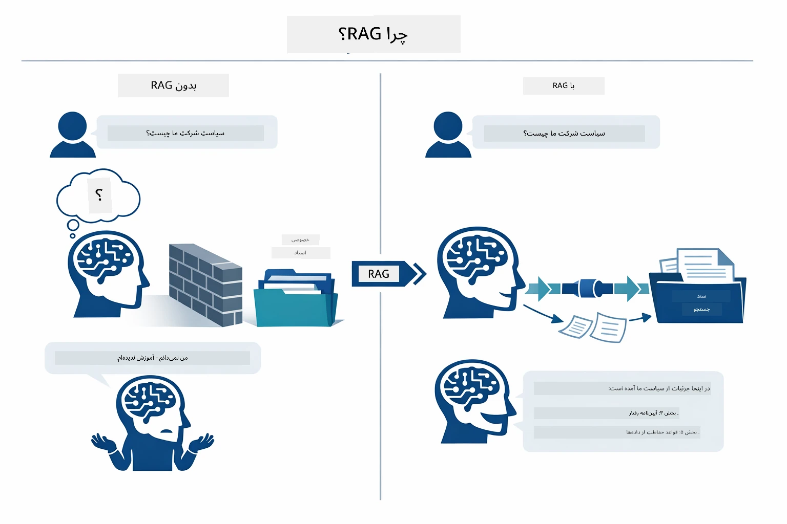

*این نمودار تفاوت بین یک مدل زبانی بزرگ استاندارد (که حدس می‌زند از داده‌های آموزش) و یک مدل زبانی تقویت‌شده با RAG (که ابتدا اسناد شما را بررسی می‌کند) را نشان می‌دهد.*

در اینجا چگونگی اتصال قطعات انتها به انتها آمده است. سوال کاربر از چهار مرحله عبور می‌کند — تعبیه، جستجوی برداری، چینش زمینه و تولید پاسخ — که هر کدام بر پایه قبلی ساخته شده‌اند:


*این نمودار خط لوله انتها به انتهای RAG را نشان می‌دهد — پرسش کاربر از تعبیه، جستجوی برداری، چینش زمینه و تولید پاسخ عبور می‌کند.*

بقیه این ماژول هر مرحله را با جزییات و کدی که می‌توانید اجرا و تغییر دهید، بررسی می‌کند.

### کدام روش RAG در این آموزش استفاده شده است؟

LangChain4j سه روش برای پیاده‌سازی RAG ارائه می‌دهد، هر کدام با سطح انتزاعی متفاوت. نمودار زیر آنها را کنار هم مقایسه می‌کند:

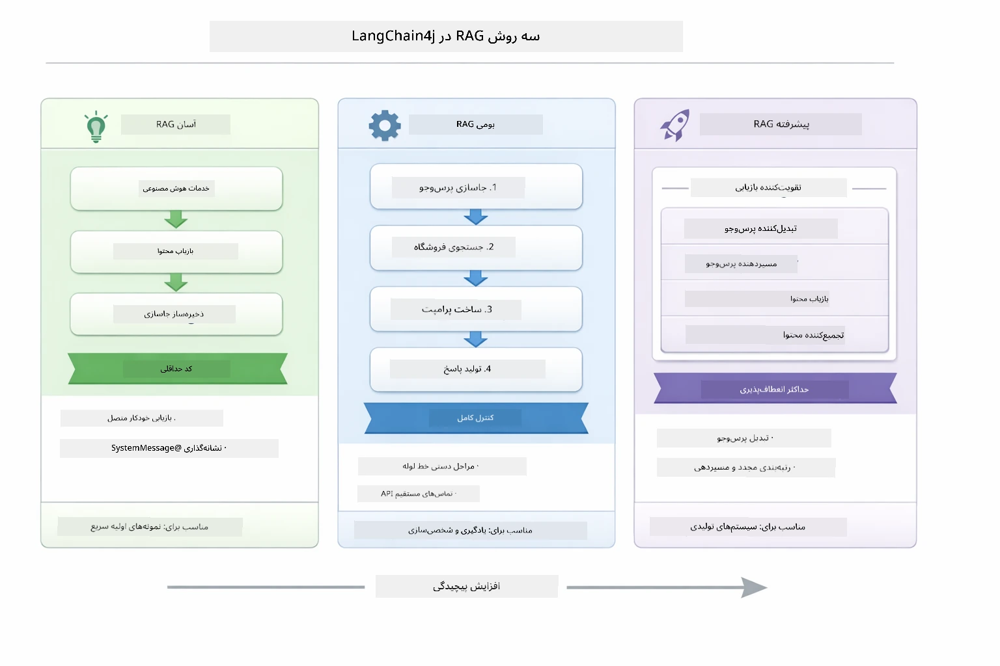

*این نمودار سه روش RAG در LangChain4j — آسان، بومی، و پیشرفته — را نشان می‌دهد و اجزای کلیدی و زمان استفاده از هرکدام را توضیح می‌دهد.*

| روش | کاری که انجام می‌دهد | معایب و مزایا |
|---|---|---|
| **Easy RAG** | همه چیز به صورت خودکار از طریق `AiServices` و `ContentRetriever` وصل می‌شود. شما یک رابط را حاشیه‌نویسی می‌کنید، بازیابی‌کننده می‌چسبانید و LangChain4j تعبیه، جستجو و چینش پرامپت را پشت پرده انجام می‌دهد. | کد کم، اما جزئیات هر مرحله را نمی‌بینید. |
| **Native RAG** | شما مدل تعبیه را فراخوانی می‌کنید، فروشگاه را جستجو می‌کنید، پرامپت را می‌سازید و پاسخ را خودتان تولید می‌کنید — هر مرحله را صریحاً. | کد بیشتر، اما هر مرحله قابل مشاهده و قابل اصلاح است. |
| **Advanced RAG** | از چارچوب `RetrievalAugmentor` با تبدیل‌کننده‌های پرسش قابل تعویض، روترها، رتبه‌بندی مجدد، و تزریق‌کننده‌های محتوا برای خط لوله‌های تولیدی استفاده می‌کند. | بیشترین انعطاف، ولی پیچیدگی بسیار بیشتر. |

**این آموزش از روش بومی استفاده می‌کند.** هر مرحله از خط لوله RAG — تعبیه پرسش، جستجوی فروشگاه برداری، چینش زمینه و تولید پاسخ — به‌وضوح در [`RagService.java`](../../../03-rag/src/main/java/com/example/langchain4j/rag/service/RagService.java) نوشته شده است. این یک انتخاب آگاهانه است: به‌عنوان منبع آموزشی، مهم‌تر است که همه مراحل را ببینید و درک کنید تا اینکه کد به حداقل برسد. وقتی با چگونگی اتصال قطعات راحت شدید، می‌توانید به Easy RAG برای نمونه‌های سریع یا Advanced RAG برای سیستم‌های تولیدی منتقل شوید.

> **💡 قبلاً Easy RAG را دیده‌اید؟** ماژول [شروع سریع](../00-quick-start/README.md) شامل نمونه پرسش و پاسخ سند ([`SimpleReaderDemo.java`](../../../00-quick-start/src/main/java/com/example/langchain4j/quickstart/SimpleReaderDemo.java)) است که از رویکرد Easy RAG استفاده می‌کند — LangChain4j تعبیه، جستجو و چینش پرامپت را خودکار انجام می‌دهد. این ماژول با باز کردن آن خط لوله، مرحله بعدی را می‌گیرد تا بتوانید هر مرحله را خودتان ببینید و کنترل کنید.

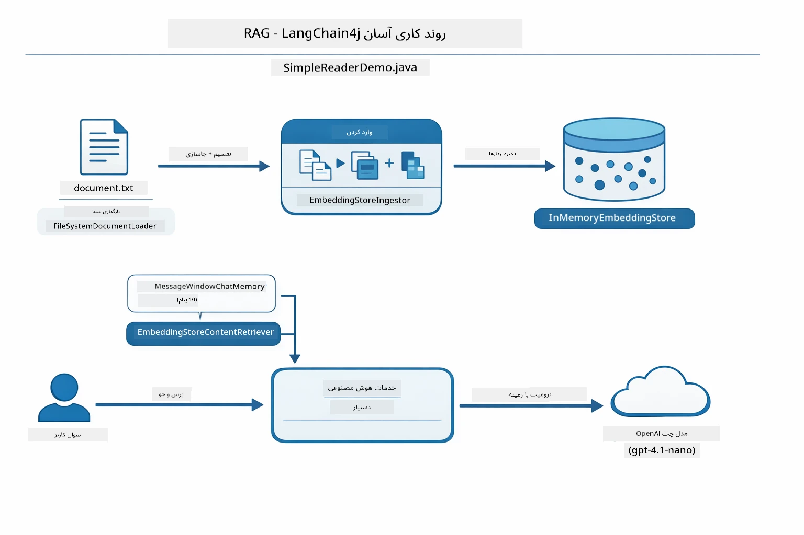

*این نمودار خط لوله Easy RAG از `SimpleReaderDemo.java` را نشان می‌دهد. آن را با روش بومی در این ماژول مقایسه کنید: Easy RAG تعبیه، بازیابی و چینش پرامپت را پشت `AiServices` و `ContentRetriever` پنهان می‌کند — شما یک سند بارگذاری می‌کنید، بازیابی‌کننده می‌چسبانید و پاسخ می‌گیرید. روش بومی در این ماژول آن خط لوله را باز می‌کند تا هر مرحله (تعبیه، جستجو، چینش زمینه، تولید) را خودتان صدا بزنید و کنترل کامل داشته باشید.*

## چگونه کار می‌کند

خط لوله RAG در این ماژول به چهار مرحله تقسیم می‌شود که هر بار که کاربر سوالی می‌پرسد، به ترتیب اجرا می‌شوند. ابتدا، یک سند آپلود شده **پارس و خرد می‌شود** به قطعات قابل مدیریت. سپس این قطعات به **تعبیه‌های برداری** تبدیل شده و ذخیره می‌شوند تا قابل مقایسه ریاضی باشند. وقتی سوالی می‌آید، سیستم یک **جستجوی معنایی** انجام می‌دهد تا مرتبط‌ترین قطعات را پیدا کند، و در نهایت آنها را به‌عنوان زمینه به مدل زبان بزرگ برای **تولید پاسخ** می‌فرستد. بخش‌های زیر هر مرحله را با کد واقعی و نمودار توضیح می‌دهند. بیایید به مرحله اول نگاه کنیم.

### پردازش سند

[DocumentService.java](../../../03-rag/src/main/java/com/example/langchain4j/rag/service/DocumentService.java)

وقتی سندی بارگذاری می‌کنید، سیستم آن را پارس می‌کند (PDF یا متن ساده)، متادیتا مانند نام فایل را می‌چسباند، سپس آن را به قطعات خرد می‌کند — بخش‌های کوچکتری که به‌راحتی در پنجره زمینه مدل جا می‌شوند. این بخش‌ها کمی همپوشانی دارند تا در مرزها زمینه از دست نرود.

```java
// فایل بارگذاری شده را تجزیه کرده و آن را در یک سند LangChain4j قرار دهید
Document document = Document.from(content, metadata);

// به قطعات 300 توکنی با همپوشانی 30 توکنی تقسیم کنید
DocumentSplitter splitter = DocumentSplitters
    .recursive(300, 30);

List<TextSegment> segments = splitter.split(document);
```

نمودار زیر این فرآیند را به صورت تصویری نشان می‌دهد. توجه کنید که هر تکه برخی از توکن‌ها را با همسایه‌هایش به اشتراک می‌گذارد — همپوشانی ۳۰ توکنی تضمین می‌کند هیچ زمینه مهمی در بین سوخته نشود:

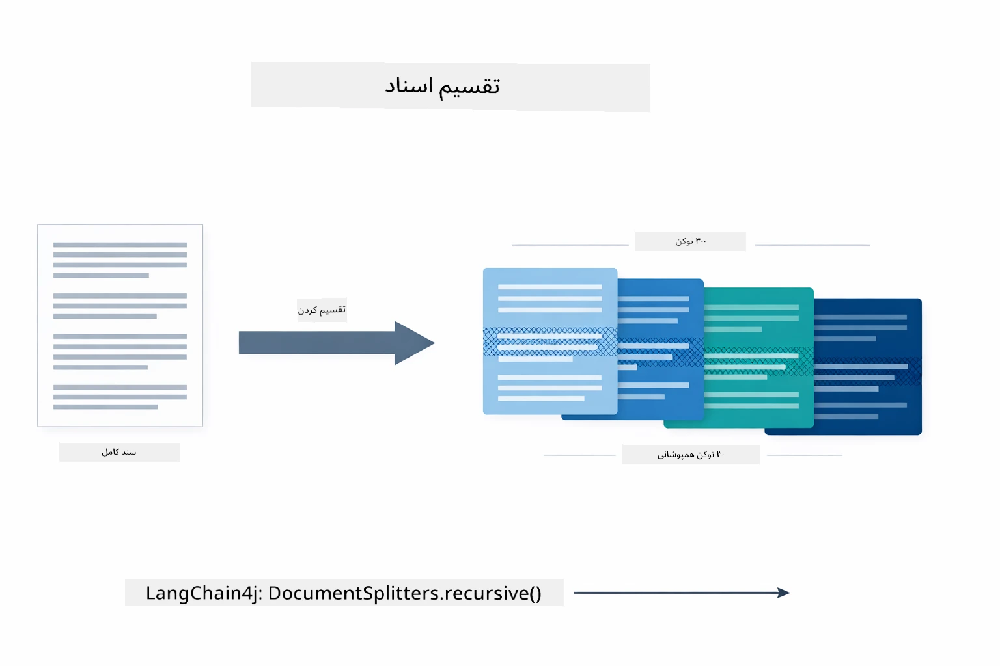

*این نمودار نشان می‌دهد سند به تکه‌های ۳۰۰ توکنی با ۳۰ توکن همپوشانی تقسیم می‌شود تا زمینه در مرزها حفظ شود.*

> **🤖 با [GitHub Copilot](https://github.com/features/copilot) Chat امتحان کنید:** فایل [`DocumentService.java`](../../../03-rag/src/main/java/com/example/langchain4j/rag/service/DocumentService.java) را باز کنید و بپرسید:
> - "چگونه LangChain4j اسناد را به تکه‌ها تقسیم می‌کند و چرا همپوشانی مهم است؟"
> - "اندازه بهینه تکه برای انواع مختلف سند چقدر است و چرا؟"
> - "چگونه اسناد چندزبانه یا با قالب‌بندی خاص را مدیریت کنم؟"

### ایجاد تعبیه‌ها

[LangChainRagConfig.java](../../../03-rag/src/main/java/com/example/langchain4j/rag/config/LangChainRagConfig.java)

هر تکه به یک نمایش عددی به نام تعبیه تبدیل می‌شود — اساساً تبدیل معنا به اعداد. مدل تعبیه به‌صورت چت هوشمند نیست؛ نمی‌تواند دستورها را دنبال کند، استدلال کند یا پاسخ دهد. کاری که می‌تواند انجام دهد، نگاشت متن به فضایی ریاضی است که معانی مشابه کنار هم قرار می‌گیرند — "ماشین" نزدیک "خودرو"، "سیاست بازگشت وجه" نزدیک "بازگشت پول من". مدل چت شبیه یک شخصی است که می‌توانید با او صحبت کنید؛ مدل تعبیه یک سیستم پرونده‌سازی بسیار خوب است.

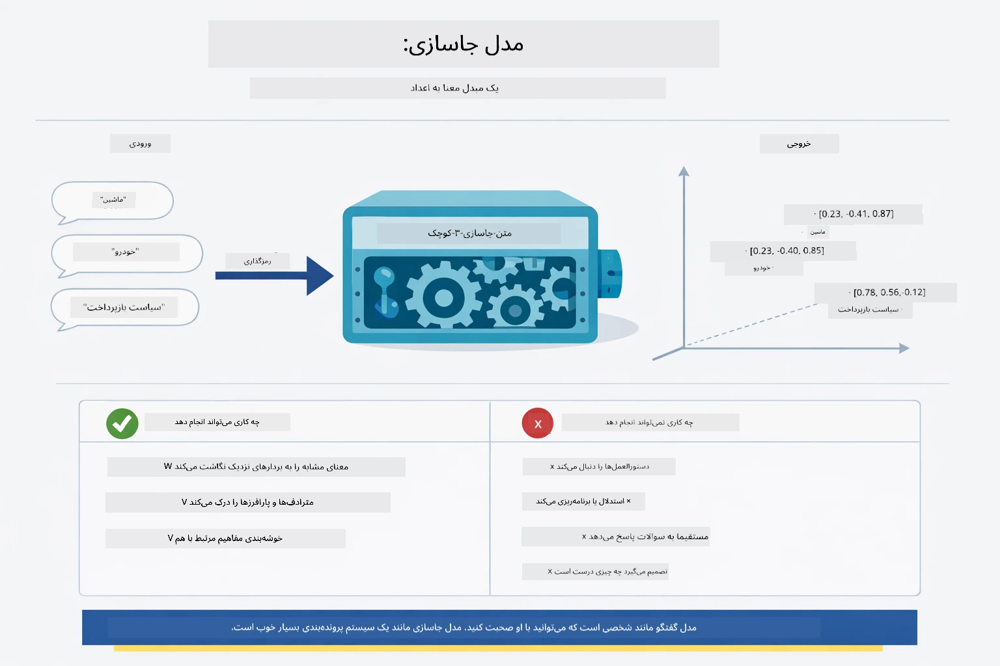

*این نمودار نشان می‌دهد چگونه مدل تعبیه متن را به بردارهای عددی تبدیل می‌کند، معانی مشابه مانند "ماشین" و "خودرو" را در فضای برداری نزدیک می‌کند.*

```java
@Bean
public EmbeddingModel embeddingModel() {
    return OpenAiOfficialEmbeddingModel.builder()
        .baseUrl(azureOpenAiEndpoint)
        .apiKey(azureOpenAiKey)
        .modelName(azureEmbeddingDeploymentName)
        .build();
}

EmbeddingStore<TextSegment> embeddingStore = 
    new InMemoryEmbeddingStore<>();
```

نمودار کلاس زیر دو جریان جدا در خط لوله RAG و کلاس‌های LangChain4j که آنها را پیاده‌سازی می‌کنند نشان می‌دهد. **جریان جذب** (یکبار هنگام بارگذاری) سند را خرد می‌کند، تکه‌ها را تعبیه می‌کند و via `.addAll()` ذخیره می‌کند. **جریان پرسش** (هر بار که کاربر سوال می‌پرسد) سوال را تعبیه می‌کند، فروشگاه را از طریق `.search()` جستجو می‌کند و زمینه‌های مطابقت یافته را به مدل گفتگویی می‌دهد. هر دو جریان از اینترفیس مشترک `EmbeddingStore<TextSegment>` استفاده می‌کنند:

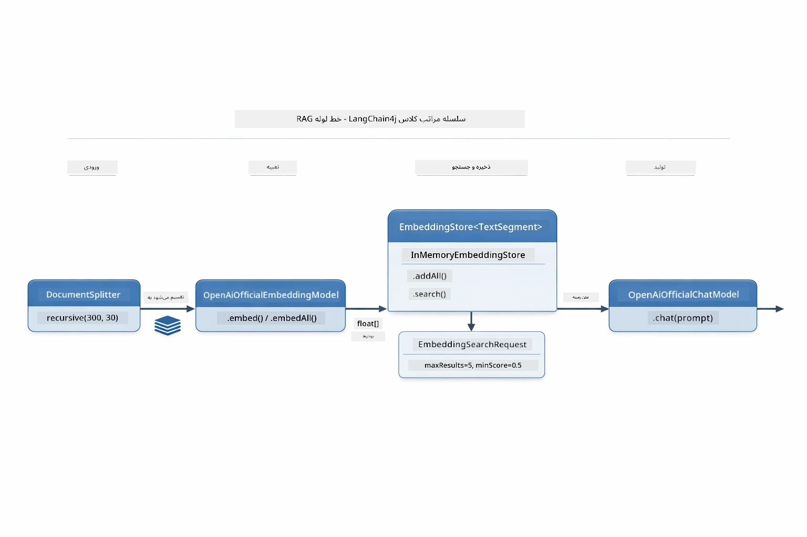

*این نمودار دو جریان در خط لوله RAG — جذب و پرسش — و نحوه اتصال آنها از طریق EmbeddingStore مشترک را نمایش می‌دهد.*

پس از ذخیره تعبیه‌ها، محتوای مشابه به طور طبیعی در فضای برداری کنار هم خوشه‌بندی می‌شود. تصویر زیر نشان می‌دهد چگونه اسناد با موضوعات مرتبط به نقاط نزدیک تبدیل می‌شوند که باعث امکان‌پذیری جستجوی معنایی می‌شود:


*این تصویر نشان می‌دهد چگونه اسناد مرتبط در فضای برداری سه‌بعدی کنار هم خوشه‌بندی می‌شوند، با موضوعاتی مانند اسناد فنی، قوانین کسب‌وکار و پرسش‌های متداول هر کدام گروه‌های متمایزی تشکیل می‌دهند.*

وقتی کاربر جستجو می‌کند، سیستم چهار مرحله را دنبال می‌کند: یکبار تعبیه اسناد، تعبیه پرسش در هر جستجو، مقایسه بردار پرسش با تمامی بردارهای ذخیره شده با استفاده از شباهت کسینوسی، و بازگرداندن بهترین K تکه با بیشترین امتیاز. نمودار زیر هر مرحله و کلاس‌های LangChain4j را نشان می‌دهد:

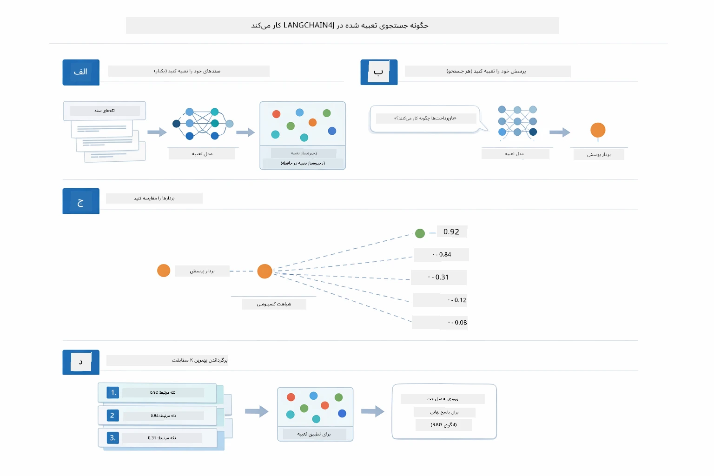

*این نمودار فرایند جستجوی تعبیه چهار مرحله‌ای را نشان می‌دهد: تعبیه اسناد، تعبیه پرسش، مقایسه بردارها با شباهت کسینوسی، و بازگرداندن نتایج برتر.*

### جستجوی معنایی

[RagService.java](../../../03-rag/src/main/java/com/example/langchain4j/rag/service/RagService.java)

وقتی سوالی می‌پرسید، سوال شما نیز به تعبیه تبدیل می‌شود. سیستم تعبیه سوال شما را با همه تعبیه‌های تکه‌های سند مقایسه می‌کند. تکه‌هایی را پیدا می‌کند که بیشترین شباهت معنایی را دارند - نه فقط کلمات کلیدی مشابه، بلکه معنای واقعی نزدیک.

```java
Embedding queryEmbedding = embeddingModel.embed(question).content();

EmbeddingSearchRequest searchRequest = EmbeddingSearchRequest.builder()
    .queryEmbedding(queryEmbedding)
    .maxResults(5)
    .minScore(0.5)
    .build();

EmbeddingSearchResult<TextSegment> searchResult = embeddingStore.search(searchRequest);
List<EmbeddingMatch<TextSegment>> matches = searchResult.matches();

for (EmbeddingMatch<TextSegment> match : matches) {
    String relevantText = match.embedded().text();
    double score = match.score();
}
```

نمودار زیر جستجوی معنایی را با جستجوی کلمه کلیدی سنتی مقایسه می‌کند. جستجوی کلمه کلیدی برای "وسیله نقلیه" یک تکه درباره‌ی "ماشین‌ها و کامیون‌ها" را از دست می‌دهد، اما جستجوی معنایی می‌فهمد آنها همان معنی را دارند و آن را به‌عنوان تطابق با امتیاز بالا برمی‌گرداند:

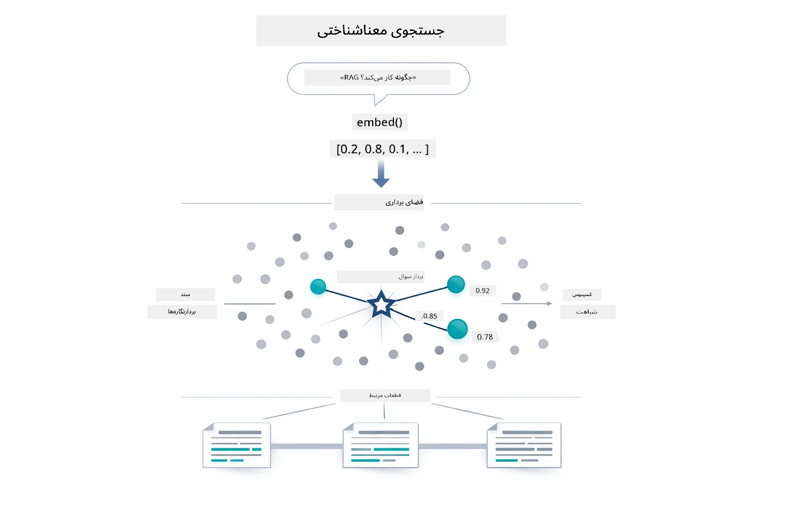

*این نمودار جستجوی مبتنی بر کلمه کلیدی را با جستجوی معنایی مقایسه می‌کند، نشان می‌دهد چگونه جستجوی معنایی حتی وقتی کلمات کلیدی دقیق متفاوت‌اند، محتوای معنایی مرتبط را بازیابی می‌کند.*

در پشت صحنه، شباهت با استفاده از شباهت کسینوسی اندازه‌گیری می‌شود — اساساً پرسیدن "آیا این دو پیکان در یک جهت هستند؟" دو تکه می‌توانند کلمات کاملاً متفاوتی داشته باشند، اما اگر همان معنی را بدهند بردارهایشان در یک جهت بوده و امتیازشان نزدیک ۱٫۰ است:

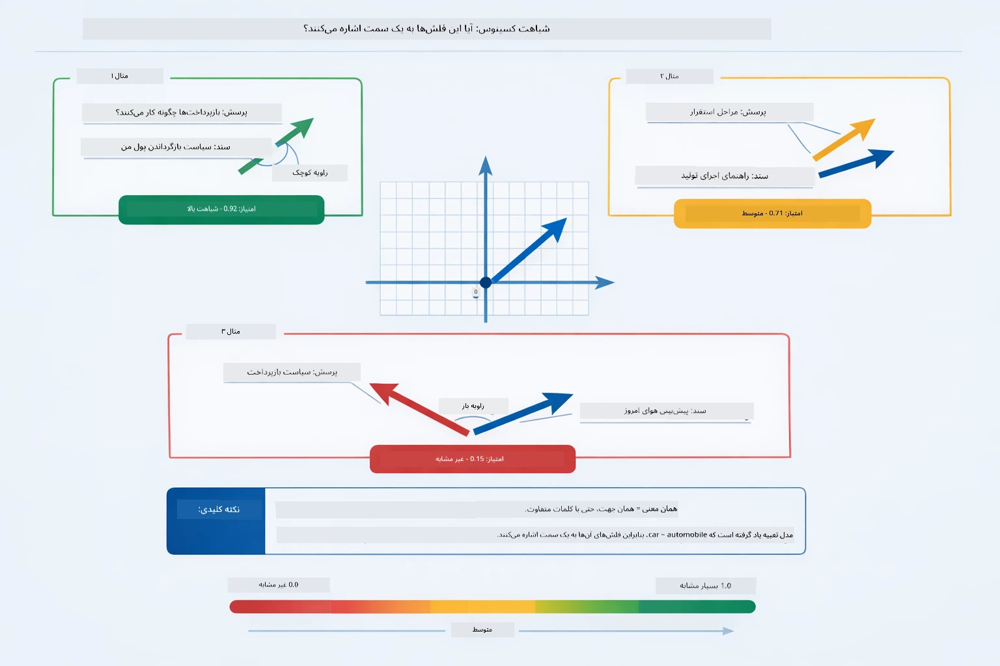

*این نمودار شباهت کسینوسی را به عنوان زاویه بین بردارهای تعبیه نشان می‌دهد — بردارهای هم‌راستا امتیاز نزدیک ۱٫۰ دارند، نشان‌دهنده شباهت معنایی بالاتر.*
> **🤖 امتحان کنید با [GitHub Copilot](https://github.com/features/copilot) Chat:** فایل [`RagService.java`](../../../03-rag/src/main/java/com/example/langchain4j/rag/service/RagService.java) را باز کنید و بپرسید:
> - "جستجوی شباهت چگونه با امبدینگ‌ها کار می‌کند و چه چیزی نمره را تعیین می‌کند؟"
> - "چه آستانه شباهتی باید استفاده کنم و چگونه روی نتایج تأثیر می‌گذارد؟"
> - "چگونه مواردی که هیچ سند مرتبطی پیدا نمی‌شود را مدیریت کنم؟"

### تولید پاسخ

[RagService.java](../../../03-rag/src/main/java/com/example/langchain4j/rag/service/RagService.java)

مرتبط‌ترین قطعه‌ها در یک پرامپت ساختاریافته ترکیب می‌شوند که شامل دستورالعمل‌های صریح، زمینه بازیابی‌شده و سوال کاربر است. مدل آن قطعه‌های خاص را می‌خواند و بر اساس آن اطلاعات پاسخ می‌دهد — این مدل تنها می‌تواند از آنچه روبرویش است استفاده کند که از ایجاد توهم جلوگیری می‌کند.

```java
String context = matches.stream()
    .map(match -> match.embedded().text())
    .collect(Collectors.joining("\n\n"));

String prompt = String.format("""
    Answer the question based on the following context.
    If the answer cannot be found in the context, say so.

    Context:
    %s

    Question: %s

    Answer:""", context, request.question());

String answer = chatModel.chat(prompt);
```

نمودار زیر این ترکیب را در عمل نشان می‌دهد — قطعه‌های برتر با بالاترین امتیاز از گام جستجو در قالب پرامپت تزریق می‌شوند و `OpenAiOfficialChatModel` پاسخی مبتنی بر واقعیت ایجاد می‌کند:

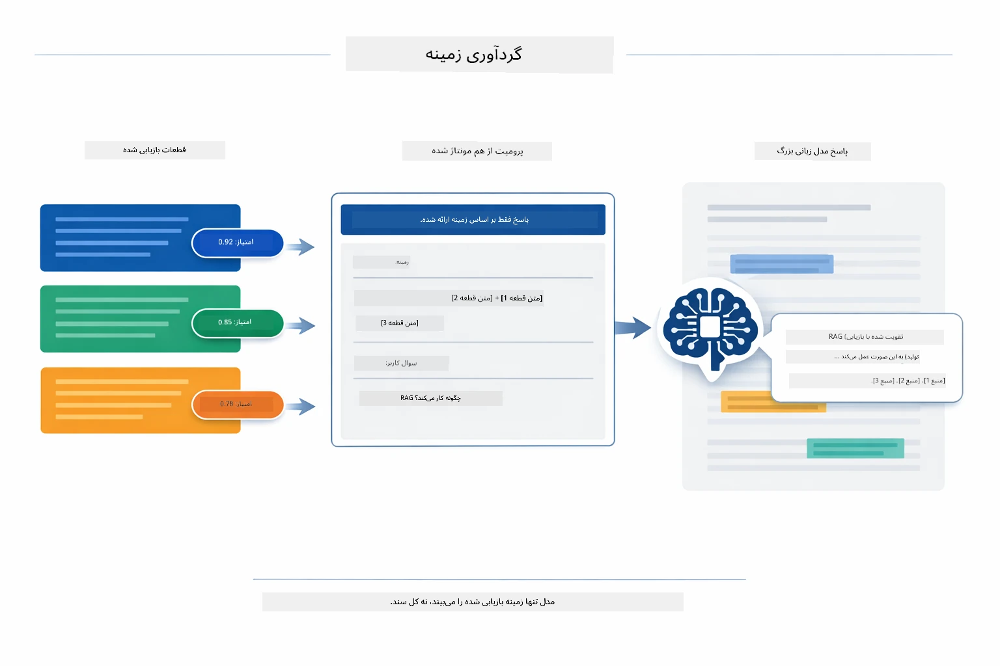

*این نمودار نشان می‌دهد که چگونه قطعه‌های با بالاترین امتیاز در یک پرامپت ساختاریافته جمع‌آوری می‌شوند و به مدل اجازه می‌دهند پاسخی مبتنی بر داده‌های شما تولید کند.*

## اجرای برنامه

**بررسی استقرار:**

اطمینان حاصل کنید که فایل `.env` با مشخصات Azure (ایجاد شده در ماژول ۰۱) در دایرکتوری اصلی وجود دارد:

**Bash:**
```bash
cat ../.env  # باید AZURE_OPENAI_ENDPOINT، API_KEY و DEPLOYMENT را نشان دهد
```

**PowerShell:**
```powershell
Get-Content ..\.env  # باید AZURE_OPENAI_ENDPOINT، API_KEY، DEPLOYMENT را نمایش دهد
```

**شروع برنامه:**

> **نکته:** اگر قبلاً همه برنامه‌ها را با `./start-all.sh` از ماژول ۰۱ اجرا کرده‌اید، این ماژول هم‌اکنون روی پورت ۸۰۸۱ اجرا می‌شود. می‌توانید دستورات شروع زیر را نادیده بگیرید و مستقیماً به http://localhost:8081 بروید.

**گزینه ۱: استفاده از Spring Boot Dashboard (توصیه‌شده برای کاربران VS Code)**

کانتینر توسعه شامل افزونه Spring Boot Dashboard است که رابط گرافیکی برای مدیریت همه برنامه‌های Spring Boot فراهم می‌کند. می‌توانید آن را در نوار فعالیت در سمت چپ VS Code پیدا کنید (آیکون Spring Boot را جستجو کنید).

از Spring Boot Dashboard می‌توانید:
- همه برنامه‌های Spring Boot موجود در فضای کاری را ببینید
- برنامه‌ها را با یک کلیک شروع/توقف کنید
- لاگ‌های برنامه را بصورت زنده مشاهده کنید
- وضعیت برنامه را زیر نظر داشته باشید

فقط روی دکمه پخش کنار "rag" کلیک کنید تا این ماژول شروع شود، یا همه ماژول‌ها را همزمان شروع کنید.


*این عکس صفحه، Spring Boot Dashboard در VS Code را نشان می‌دهد که می‌توانید به شکل بصری برنامه‌ها را شروع، توقف و نظارت کنید.*

**گزینه ۲: استفاده از اسکریپت‌های شل**

همه برنامه‌های وب (ماژول ۰۱ تا ۰۴) را شروع کنید:

**Bash:**
```bash
cd ..  # از دایرکتوری ریشه
./start-all.sh
```

**PowerShell:**
```powershell
cd ..  # از دایرکتوری ریشه
.\start-all.ps1
```

یا فقط این ماژول را شروع کنید:

**Bash:**
```bash
cd 03-rag
./start.sh
```

**PowerShell:**
```powershell
cd 03-rag
.\start.ps1
```

هر دو اسکریپت متغیرهای محیطی را از فایل `.env` ریشه بارگذاری می‌کنند و اگر فایل JAR وجود نداشته باشد، آنها را می‌سازند.

> **نکته:** اگر ترجیح می‌دهید همه ماژول‌ها را به صورت دستی بسازید قبل از شروع:
>
> **Bash:**
> ```bash
> cd ..  # Go to root directory
> mvn clean package -DskipTests
> ```
>
> **PowerShell:**
> ```powershell
> cd ..  # Go to root directory
> mvn clean package -DskipTests
> ```

مرورگر را باز کنید و به http://localhost:8081 بروید.

**برای توقف:**

**Bash:**
```bash
./stop.sh  # این ماژول فقط
# یا
cd .. && ./stop-all.sh  # همه ماژول‌ها
```

**PowerShell:**
```powershell
.\stop.ps1  # فقط این ماژول
# یا
cd ..; .\stop-all.ps1  # همه ماژول‌ها
```

## استفاده از برنامه

برنامه یک رابط وب برای بارگذاری اسناد و پرسیدن سوالات فراهم می‌کند.

<a href="images/rag-homepage.png"></a>

*این عکس صفحه، رابط برنامه RAG را نشان می‌دهد که در آن اسناد را آپلود می‌کنید و سوال طرح می‌کنید.*

### آپلود یک سند

با بارگذاری یک سند شروع کنید — فایل‌های TXT برای تست بهترین هستند. یک فایل `sample-document.txt` در این دایرکتوری ارائه شده که شامل اطلاعاتی درباره ویژگی‌های LangChain4j، پیاده‌سازی RAG و بهترین شیوه‌ها است — عالی برای تست سیستم.

سیستم سند شما را پردازش کرده، آن را به قطعات تقسیم می‌کند و برای هر قطعه امبدینگ ایجاد می‌کند. این فرآیند به طور خودکار هنگام بارگذاری انجام می‌شود.

### پرسیدن سوالات

اکنون سوالات خاص درباره محتوای سند بپرسید. چیزی واقعی که صراحتاً در سند آمده است را امتحان کنید. سیستم قطعات مرتبط را جستجو کرده، آنها را در پرامپت وارد می‌کند و پاسخ تولید می‌کند.

### بررسی منابع

توجه کنید که هر پاسخ شامل مراجع منبع با نمرات شباهت است. این نمرات (از ۰ تا ۱) نشان می‌دهند هر قطعه چقدر به سوال شما مرتبط بوده است. نمرات بالاتر به معنی تطابق بهتر هستند. این امکان را به شما می‌دهد پاسخ را با منبع اصلی بررسی کنید.

<a href="images/rag-query-results.png"></a>

*این عکس صفحه نتایج جستجو را نشان می‌دهد همراه با پاسخ تولیدشده، مراجع منبع و نمرات مرتبط بودن هر قطعه بازیابی شده.*

### آزمایش با سوالات

سوالات مختلف را امتحان کنید:
- حقایق خاص: "موضوع اصلی چیست؟"
- مقایسه‌ها: "تفاوت X و Y چیست؟"
- خلاصه‌ها: "نکات کلیدی درباره Z را خلاصه کن"

توجه کنید که چگونه نمرات مرتبط بودن با توجه به تطابق سوال شما با محتوای سند تغییر می‌کند.

## مفاهیم کلیدی

### استراتژی تقسیم قطعه

اسناد به قطعه‌های ۳۰۰ توکنی با ۳۰ توکن همپوشانی تقسیم می‌شوند. این تعادل تضمین می‌کند هر قطعه زمینه کافی برای معنی‌دار بودن دارد و در عین حال کوچک است تا چند قطعه را بتوان در یک پرامپت گنجاند.

### نمرات شباهت

هر قطعه بازیابی شده شامل نمره شباهتی بین ۰ تا ۱ است که نشان می‌دهد چقدر به سوال کاربر نزدیک است. نمودار زیر دامنه‌های نمره و نحوه استفاده سیستم از آنها برای فیلتر کردن نتایج را نشان می‌دهد:

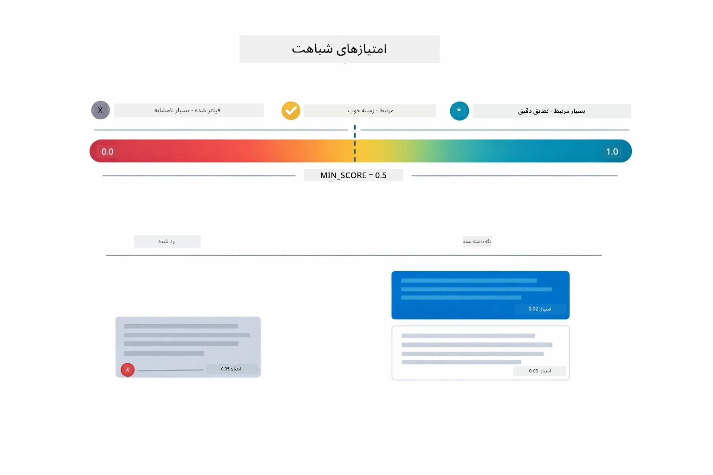

*این نمودار دامنه نمرات از ۰ تا ۱ را نشان می‌دهد، با حداقل آستانه ۰.۵ که قطعات نامرتبط را فیلتر می‌کند.*

نمرات از ۰ تا ۱ هستند:
- ۰.۷-۱.۰: بسیار مرتبط، تطابق دقیق
- ۰.۵-۰.۷: مرتبط، زمینه خوب
- زیر ۰.۵: فیلتر شده، خیلی نامرتبط

سیستم تنها قطعات بالاتر از حداقل آستانه را بازیابی می‌کند تا کیفیت حفظ شود.

امبدینگ‌ها وقتی معنی به خوبی دسته‌بندی می‌شود عملکرد خوبی دارند، اما دارای نقاط کور هستند. نمودار زیر حالت‌های شایع شکست را نشان می‌دهد — قطعات خیلی بزرگ وکتورهای مبهم تولید می‌کنند، قطعات خیلی کوچک فاقد زمینه‌اند، اصطلاحات مبهم به چند خوشه ارجاع می‌دهند، و جستجوهای تطابق دقیق (کدها، شماره قطعه) به‌کل با امبدینگ‌ها کار نمی‌کند:

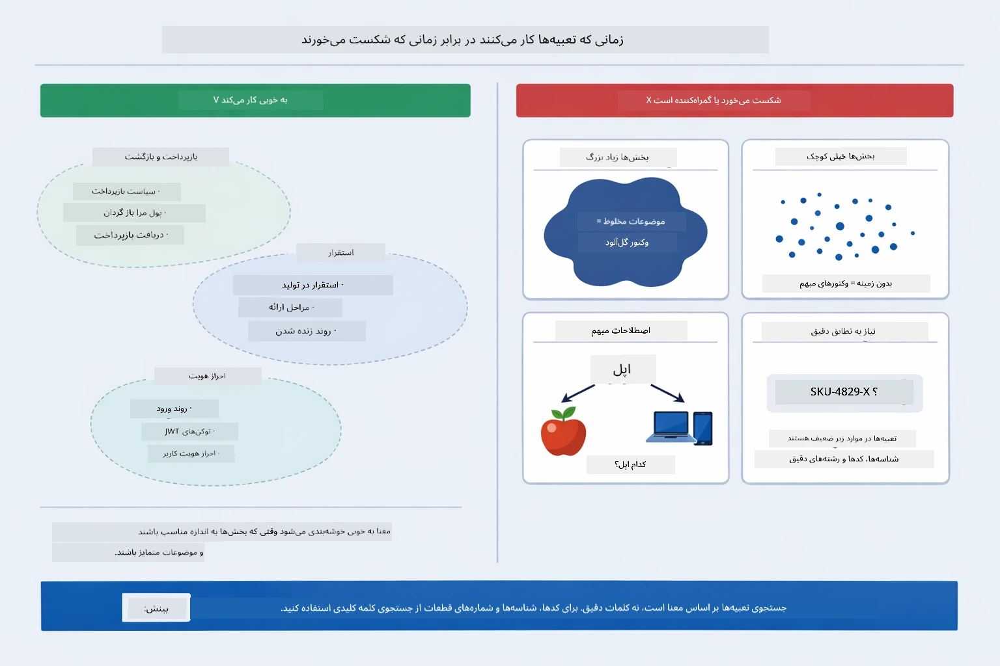

*این نمودار حالت‌های شایع شکست امبدینگ را نشان می‌دهد: قطعات خیلی بزرگ، قطعات خیلی کوچک، اصطلاحات مبهم که به چند خوشه اشاره دارند، و جستجوهای تطابق دقیق مثل کدها.*

### ذخیره‌سازی در حافظه

این ماژول برای سادگی از ذخیره‌سازی در حافظه استفاده می‌کند. وقتی برنامه را دوباره راه‌اندازی کنید، اسناد بارگذاری شده حذف می‌شوند. سیستم‌های تولیدی از پایگاه داده‌های برداری ماندگار مثل Qdrant یا Azure AI Search استفاده می‌کنند.

### مدیریت پنجره زمینه

هر مدل یک پنجره زمینه حداکثر دارد. نمی‌توانید همه قطعات یک سند بزرگ را وارد کنید. سیستم N قطعه مرتبط برتر را بازیابی می‌کند (پیش‌فرض ۵) تا در محدودیت‌ها بماند و زمینه کافی برای پاسخ‌های دقیق فراهم کند.

## وقتی RAG اهمیت دارد

RAG همیشه روش درستی نیست. راهنمای تصمیم زیر کمک می‌کند تعیین کنید چه زمانی RAG ارزش افزوده دارد و چه زمانی روش‌های ساده‌تر مثل وارد کردن محتوا مستقیماً در پرامپت یا تکیه به دانش خود مدل کافی است:

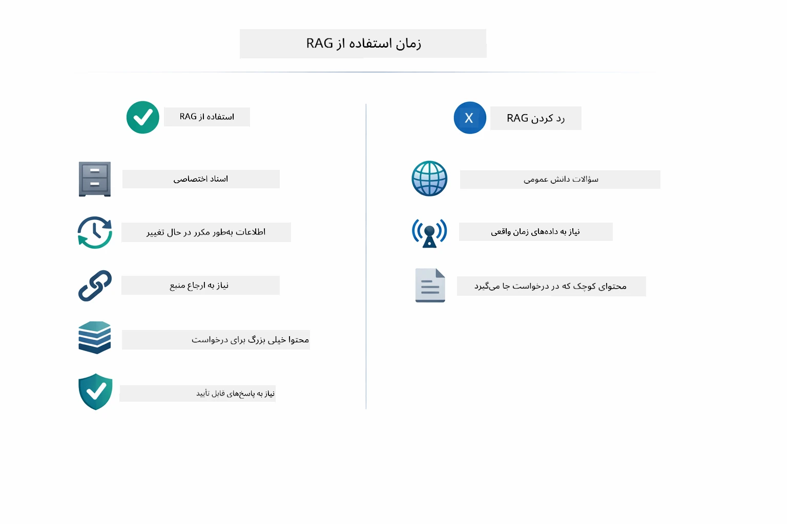

*این نمودار راهنمای تصمیم‌گیری نشان می‌دهد چه زمانی RAG ارزش افزوده دارد و چه زمانی روش‌های ساده‌تر کافی است.*

**زمان استفاده از RAG:**
- پاسخ به سوالات درباره اسناد مالکیتی
- اطلاعات به‌طور مکرر تغییر می‌کند (راهنماها، قیمت‌ها، مشخصات)
- دقت نیازمند انتساب منبع است
- محتوا خیلی بزرگ است که در یک پرامپت جا شود
- نیاز به پاسخ‌های قابل تأیید و مبتنی بر منبع دارید

**زمان استفاده نکردن از RAG:**
- سوالات به دانش کلی مدل نیاز دارند
- داده‌های لحظه‌ای لازم است (RAG روی اسناد بارگذاری شده کار می‌کند)
- محتوا کوچک و قابل گنجاندن مستقیم در پرامپت است

## مراحل بعدی

**ماژول بعدی:** [04-tools - عوامل هوش مصنوعی با ابزارها](../04-tools/README.md)

---

**مسیرها:** [← قبلی: ماژول ۰۲ - مهندسی پرامپت](../02-prompt-engineering/README.md) | [بازگشت به اصلی](../README.md) | [بعدی: ماژول ۰۴ - ابزارها →](../04-tools/README.md)

---

<!-- CO-OP TRANSLATOR DISCLAIMER START -->
**سلب مسئولیت**:  
این سند با استفاده از سرویس ترجمه هوش مصنوعی [Co-op Translator](https://github.com/Azure/co-op-translator) ترجمه شده است. در حالی که ما برای دقت تلاش می‌کنیم، لطفاً توجه داشته باشید که ترجمه‌های خودکار ممکن است حاوی اشتباهات یا نادرستی‌هایی باشند. سند اصلی به زبان مادری آن باید به عنوان منبع معتبر در نظر گرفته شود. برای اطلاعات حیاتی، استفاده از ترجمه حرفه‌ای انسانی توصیه می‌شود. ما مسئول هیچ گونه سوء تفاهم یا تفسیر نادرستی که ناشی از استفاده از این ترجمه باشد، نیستیم.
<!-- CO-OP TRANSLATOR DISCLAIMER END -->