# ماژول ۰۴: عامل‌های هوش مصنوعی با ابزارها

## فهرست مطالب

- [چیزهایی که یاد می‌گیرید](../../../04-tools)
- [پیش‌نیازها](../../../04-tools)
- [درک عامل‌های هوش مصنوعی با ابزارها](../../../04-tools)
- [نحوه کار فراخوانی ابزار](../../../04-tools)
  - [تعاریف ابزار](../../../04-tools)
  - [تصمیم‌گیری](../../../04-tools)
  - [اجرا](../../../04-tools)
  - [تولید پاسخ](../../../04-tools)
  - [معماری: اتوصلی خودکار Spring Boot](../../../04-tools)
- [زنجیره‌سازی ابزار](../../../04-tools)
- [اجرای برنامه](../../../04-tools)
- [استفاده از برنامه](../../../04-tools)
  - [تجربه استفاده ساده از ابزار](../../../04-tools)
  - [آزمایش زنجیره‌سازی ابزار](../../../04-tools)
  - [مشاهده جریان گفتگو](../../../04-tools)
  - [تجربه با درخواست‌های مختلف](../../../04-tools)
- [مفاهیم کلیدی](../../../04-tools)
  - [الگوی ReAct (استدلال و عمل)](../../../04-tools)
  - [اهمیت توضیحات ابزار](../../../04-tools)
  - [مدیریت نشست](../../../04-tools)
  - [مدیریت خطا](../../../04-tools)
- [ابزارهای موجود](../../../04-tools)
- [چه زمانی از عامل‌های مبتنی بر ابزار استفاده کنیم](../../../04-tools)
- [ابزارها در مقابل RAG](../../../04-tools)
- [گام‌های بعدی](../../../04-tools)

## چیزهایی که یاد می‌گیرید

تا اینجا، یاد گرفته‌اید چگونه با هوش مصنوعی گفتگو کنید، پروامپت‌ها را به شکل موثری ساختاربندی کنید و پاسخ‌ها را بر اساس اسناد خود مبنا قرار دهید. اما هنوز یک محدودیت اساسی وجود دارد: مدل‌های زبانی فقط می‌توانند متن تولید کنند. نمی‌توانند وضعیت هوا را بررسی کنند، محاسبات انجام دهند، پایگاه‌داده‌ها را پرس‌وجو کنند یا با سیستم‌های خارجی تعامل داشته باشند.

ابزارها این موضوع را تغییر می‌دهند. با دادن دسترسی به توابعی که مدل می‌تواند فراخوانی کند، آن را از تولیدکننده متن به عاملی تبدیل می‌کنید که می‌تواند عمل کند. مدل تصمیم می‌گیرد چه زمانی به یک ابزار نیاز دارد، کدام ابزار را استفاده کند و چه پارامترهایی را بفرستد. کد شما تابع را اجرا می‌کند و نتیجه را برمی‌گرداند. مدل آن نتیجه را در پاسخ خود می‌گنجاند.

## پیش‌نیازها

- تکمیل شده [ماژول ۰۱ - مقدمه](../01-introduction/README.md) (منابع Azure OpenAI پیاده‌سازی شده)
- تکمیل ماژول‌های قبلی توصیه می‌شود (این ماژول به [مفاهیم RAG از ماژول ۰۳](../03-rag/README.md) در مقایسه ابزارها با RAG اشاره می‌کند)
- وجود فایل `.env` در دایرکتوری ریشه با اطلاعات Azure (ایجاد شده توسط `azd up` در ماژول ۰۱)

> **توجه:** اگر ماژول ۰۱ را تکمیل نکرده‌اید، ابتدا دستورالعمل‌های استقرار آن را دنبال کنید.

## درک عامل‌های هوش مصنوعی با ابزارها

> **📝 توجه:** در این ماژول، "عامل‌ها" به دستیارهای هوش مصنوعی اشاره دارد که با قابلیت فراخوانی ابزار تقویت شده‌اند. این با الگوهای **Agentic AI** (عامل‌های خودگردان با برنامه‌ریزی، حافظه و استدلال چندمرحله‌ای) که در [ماژول ۰۵: MCP](../05-mcp/README.md) مرور خواهند شد، متفاوت است.

بدون ابزار، یک مدل زبانی تنها می‌تواند متن را از داده‌های آموزشی خود تولید کند. اگر از آن بخواهید وضعیت هوای فعلی را بگوید، فقط باید حدس بزند. اگر ابزار بدهید، می‌تواند به یک API وضعیت هوا فراخوانی کند، محاسبات را انجام دهد یا پایگاه‌داده‌ای را جستجو کند — سپس آن نتایج واقعی را در پاسخ خود وارد کند.

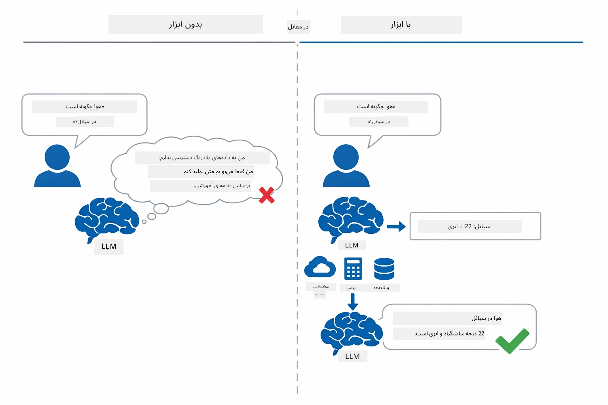

*بدون ابزار مدل فقط حدس می‌زند — با ابزارها می‌تواند API‌ها را فراخوانی کند، محاسبات انجام دهد و داده‌های زمان واقعی ارائه دهد.*

یک عامل هوش مصنوعی با ابزارها الگوی **استدلال و عمل (ReAct)** را دنبال می‌کند. مدل فقط پاسخ نمی‌دهد — بلکه می‌اندیشد که به چه چیزی نیاز دارد، با فراخوانی یک ابزار عمل می‌کند، نتیجه را مشاهده می‌کند، و سپس تصمیم می‌گیرد دوباره عمل کند یا پاسخ نهایی را ارائه دهد:

۱. **استدلال** — عامل سوال کاربر را تحلیل می‌کند و تعیین می‌کند به چه اطلاعاتی نیاز دارد  
۲. **عمل** — عامل ابزار مناسب را انتخاب می‌کند، پارامترهای درست را تولید می‌کند و آن را فراخوانی می‌کند  
۳. **مشاهده** — عامل خروجی ابزار را دریافت کرده و نتیجه را ارزیابی می‌کند  
۴. **تکرار یا پاسخ** — اگر داده بیشتری لازم باشد، حلقه را تکرار می‌کند؛ در غیر این صورت پاسخ زبان طبیعی را می‌سازد

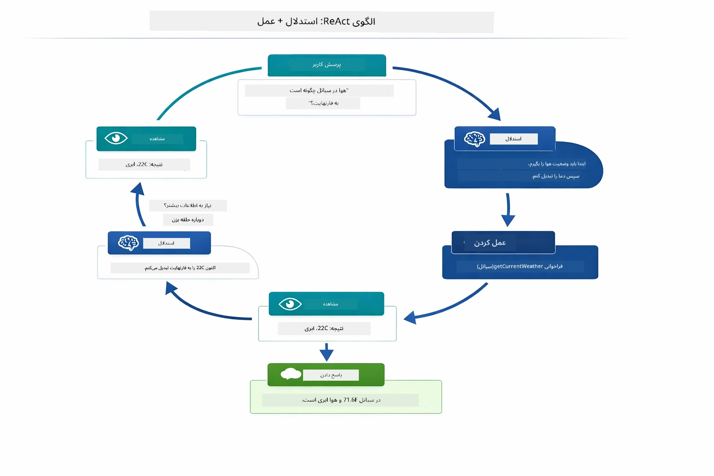

*چرخه ReAct — عامل درباره کاری که باید انجام دهد استدلال می‌کند، با فراخوانی ابزار عمل می‌کند، نتیجه را مشاهده می‌کند و تا زمانی که بتواند پاسخ نهایی را بدهد این چرخه ادامه دارد.*

این به‌طور خودکار اتفاق می‌افتد. شما ابزارها و توضیحات آنها را تعریف می‌کنید. مدل تصمیم‌گیری درباره زمان و نحوه استفاده از آنها را بر عهده می‌گیرد.

## نحوه کار فراخوانی ابزار

### تعاریف ابزار

[WeatherTool.java](../../../04-tools/src/main/java/com/example/langchain4j/agents/tools/WeatherTool.java) | [TemperatureTool.java](../../../04-tools/src/main/java/com/example/langchain4j/agents/tools/TemperatureTool.java)

شما توابعی با توضیحات واضح و مشخصات پارامترهای دقیق تعریف می‌کنید. مدل این توضیحات را در پروامپت سیستمی خود می‌بیند و می‌فهمد هر ابزار چه کاری انجام می‌دهد.

```java
@Component
public class WeatherTool {
    
    @Tool("Get the current weather for a location")
    public String getCurrentWeather(@P("Location name") String location) {
        // منطق جستجوی آب و هوا
        return "Weather in " + location + ": 22°C, cloudy";
    }
}

@AiService
public interface Assistant {
    String chat(@MemoryId String sessionId, @UserMessage String message);
}

// دستیار به طور خودکار توسط Spring Boot متصل شده است با:
// - بیلن ChatModel
// - همه متدهای @Tool از کلاس‌های @Component
// - ChatMemoryProvider برای مدیریت جلسه
```
  
نمودار زیر هر توضیحی را تجزیه می‌کند و نشان می‌دهد هر بخش چگونه به هوش مصنوعی کمک می‌کند تا بفهمد چه زمانی ابزار را فراخوانی کند و چه آرگومان‌هایی باید ارسال شود:

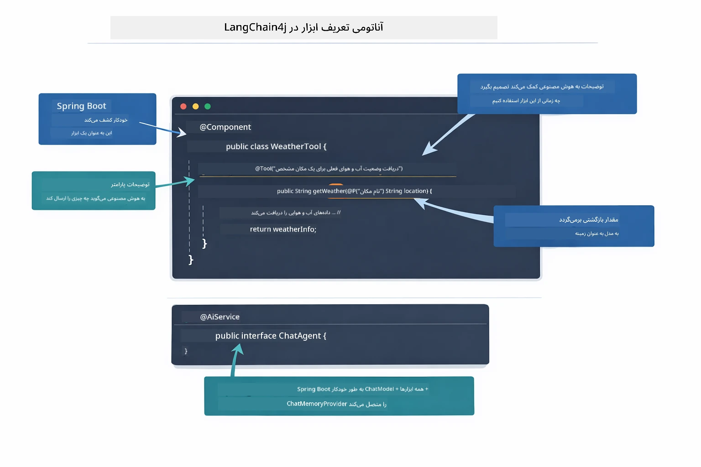

*آناتومی تعریف یک ابزار — @Tool به هوش مصنوعی می‌گوید چه زمانی از آن استفاده کند، @P هر پارامتر را توصیف می‌کند، و @AiService در زمان شروع همه چیز را متصل می‌کند.*

> **🤖 امتحان کنید با [GitHub Copilot](https://github.com/features/copilot) Chat:**  
> فایل [`WeatherTool.java`](../../../04-tools/src/main/java/com/example/langchain4j/agents/tools/WeatherTool.java) را باز کنید و بپرسید:  
> - "چگونه یک API واقعی هواشناسی مثل OpenWeatherMap را به جای داده‌های مدل جعلی ادغام کنم؟"  
> - "یک توضیح خوب برای ابزار که به هوش مصنوعی کمک کند آن را درست استفاده کند چه ویژگی‌هایی دارد؟"  
> - "چگونه خطاهای API و محدودیت‌های نرخ را در پیاده‌سازی ابزارها مدیریت کنم؟"

### تصمیم‌گیری

وقتی کاربری می‌پرسد: «وضعیت هوا در سیاتل چطوره؟»، مدل به صورت تصادفی ابزاری را انتخاب نمی‌کند. منظور کاربر را با همه توضیحات ابزارهای موجود مقایسه می‌کند، هرکدام را برای مرتبط بودن ارزیابی می‌کند و بهترین گزینه را انتخاب می‌کند. سپس یک فراخوانی تابع ساختاریافته با پارامترهای درست ایجاد می‌کند – در این مورد، مقدار `location` را روی `"Seattle"` تنظیم می‌کند.

اگر هیچ ابزاری با درخواست کاربر مطابقت نداشته باشد، مدل به پاسخ دادن بر اساس دانش خود باز می‌گردد. اگر ابزارهای متعددی مطابقت داشتند، دقیق‌ترین را انتخاب می‌کند.

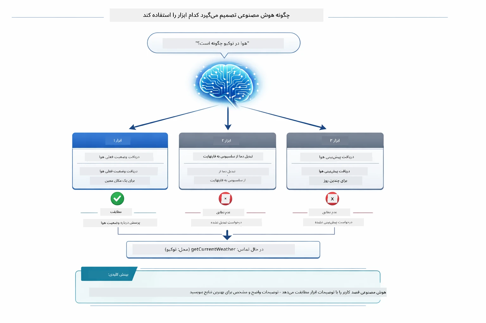

*مدل هر ابزار موجود را در برابر هدف کاربر ارزیابی می‌کند و بهترین تطابق را انتخاب می‌کند — به همین دلیل نوشتن توضیحات واضح و خاص ابزار اهمیت دارد.*

### اجرا

[AgentService.java](../../../04-tools/src/main/java/com/example/langchain4j/agents/service/AgentService.java)

Spring Boot رابط `@AiService` اعلامی را با همه ابزارهای ثبت شده به‌صورت خودکار متصل می‌کند، و LangChain4j فراخوانی ابزارها را به‌طور خودکار اجرا می‌کند. پشت صحنه، یک فراخوانی کامل ابزار از شش مرحله عبور می‌کند — از سوال کاربر به زبان طبیعی تا پاسخ به زبان طبیعی:

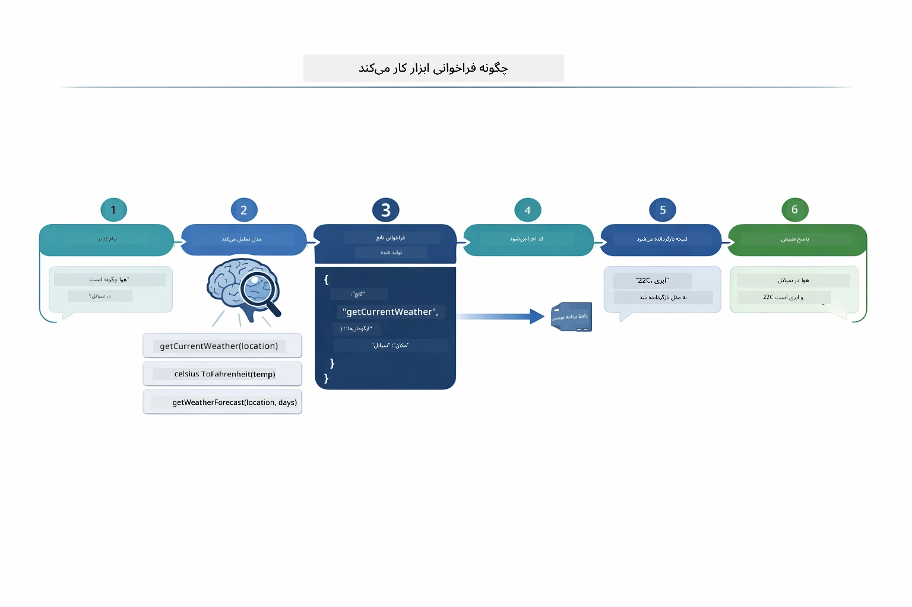

*جریان انتها-به-انتها — کاربر سوال می‌پرسد، مدل ابزار را انتخاب می‌کند، LangChain4j آن را اجرا می‌کند و مدل نتیجه را در پاسخ طبیعی می‌گنجاند.*

اگر [ToolIntegrationDemo](../../../00-quick-start/src/main/java/com/example/langchain4j/quickstart/ToolIntegrationDemo.java) را در ماژول ۰۰ اجرا کرده باشید، قبلاً این الگو را در عمل دیده‌اید — ابزارهای `Calculator` به همین صورت فراخوانی شدند. نمودار دنباله زیر نشان می‌دهد دقیقا در طول آن دمو چه اتفاقی افتاد:

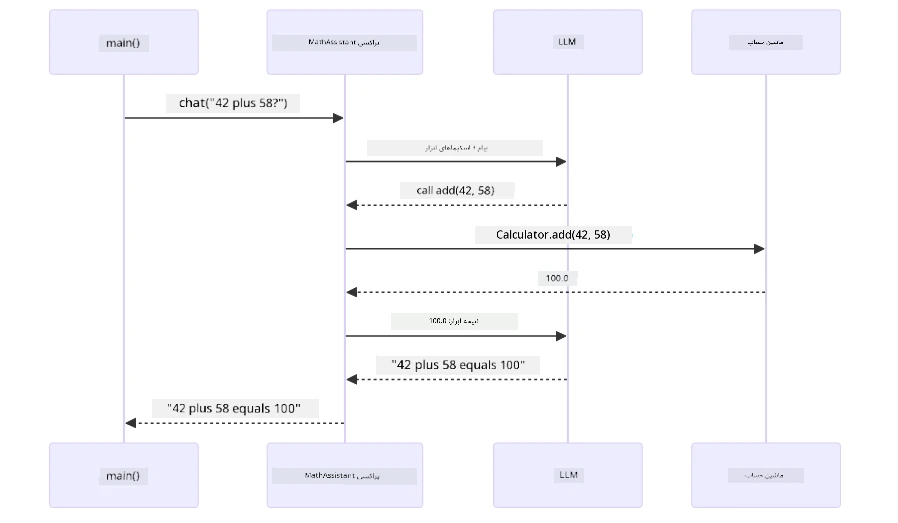

*حلقه فراخوانی ابزار از دمو شروع سریع — `AiServices` پیام و شمای ابزار شما را به LLM می‌فرستد، LLM پاسخ تابعی مثل `add(42, 58)` می‌دهد، LangChain4j متد `Calculator` را به‌صورت محلی اجرا می‌کند و نتیجه را برای پاسخ نهایی ارسال می‌کند.*

> **🤖 امتحان کنید با [GitHub Copilot](https://github.com/features/copilot) Chat:**  
> فایل [`AgentService.java`](../../../04-tools/src/main/java/com/example/langchain4j/agents/service/AgentService.java) را باز کنید و بپرسید:  
> - "الگوی ReAct چگونه کار می‌کند و چرا برای عامل‌های AI موثر است؟"  
> - "عامل چگونه تصمیم می‌گیرد کدام ابزار را و به چه ترتیبی استفاده کند؟"  
> - "اگر اجرای یک ابزار شکست خورد - چطور باید خطاها را به‌طور محکم مدیریت کنم؟"

### تولید پاسخ

مدل داده‌های آب‌وهوایی را دریافت می‌کند و آنها را به پاسخ زبان طبیعی برای کاربر قالب‌بندی می‌کند.

### معماری: اتوصلی خودکار Spring Boot

این ماژول از ادغام LangChain4j با Spring Boot با رابط‌های اعلامی `@AiService` استفاده می‌کند. در شروع، Spring Boot همه `@Component`هایی که متدهای `@Tool` دارند، Bean مدل گفتگو (`ChatModel`) و فراهم‌کننده حافظه گفتگو (`ChatMemoryProvider`) را کشف کرده و همه را در یک رابط `Assistant` بدون نیاز به کدنویسی اضافی به هم وصل می‌کند.

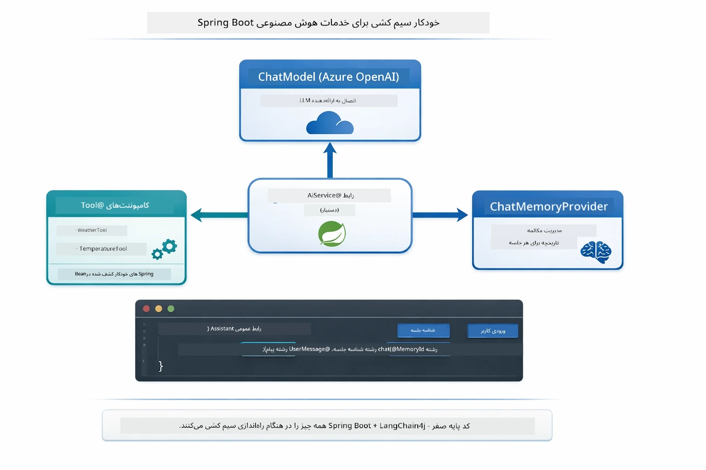

*رابط `@AiService` مدل گفتگو، کامپوننت‌های ابزار و فراهم‌کننده حافظه را به هم گره می‌زند — Spring Boot به‌طور خودکار همه اتصالات را مدیریت می‌کند.*

اینجا چرخه کامل درخواست به صورت نمودار دنباله آمده است — از درخواست HTTP، کنترلر، سرویس، پراکسی اتوصلی، تا اجرای ابزار و بازگشت:

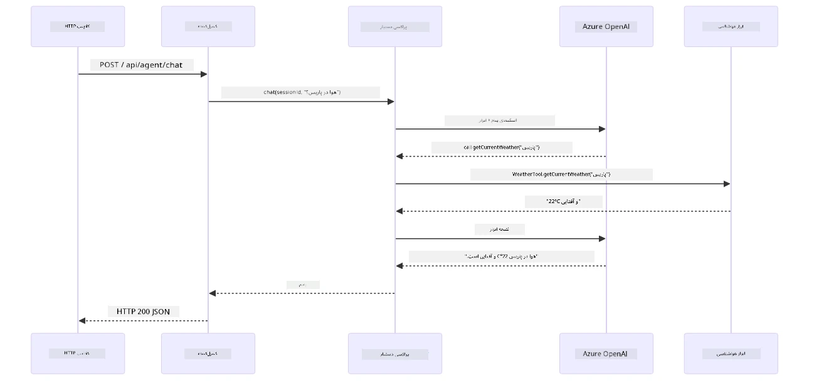

*چرخه کامل درخواست Spring Boot — درخواست HTTP از طریق کنترلر و سرویس به پراکسی اتوصلی Assistant می‌رود، که به طور خودکار LLM و فراخوانی ابزارها را مدیریت می‌کند.*

مزایای کلیدی این رویکرد:

- **اتوصلی خودکار Spring Boot** — مدل گفتگو و ابزارها به‌طور خودکار تزریق می‌شوند  
- **الگوی @MemoryId** — مدیریت حافظه مبتنی بر نشست به‌طور خودکار  
- **یک نمونه واحد** — Assistant یک بار ساخته شده و برای بهبود عملکرد استفاده مجدد می‌شود  
- **اجرای ایمن بر حسب نوع** — متدهای جاوا مستقیما با تبدیل نوع فراخوانی می‌شوند  
- **هماهنگی چندمرحله‌ای** — زنجیره‌سازی ابزارها به‌طور خودکار مدیریت می‌شود  
- **بدون کدنویسی مکرر** — بدون فراخوانی دستی `AiServices.builder()` یا استفاده از HashMap حافظه

رویکردهای جایگزین (مانند `AiServices.builder()` دستی) نیازمند کد بیشتر و فاقد مزایای ادغام Spring Boot هستند.

## زنجیره‌سازی ابزار

**زنجیره‌سازی ابزار** — قدرت واقعی عامل‌های مبتنی بر ابزار وقتی نمایان می‌شود که یک سوال تنها به یک ابزار محدود نباشد. بپرسید: «وضعیت هوا در سیاتل به فارنهایت چقدره؟» و عامل به طور خودکار دو ابزار را زنجیره می‌کند: ابتدا `getCurrentWeather` را صدا می‌زند تا دمای سلسیوس را بگیرد، سپس آن مقدار را به `celsiusToFahrenheit` برای تبدیل می‌دهد — همه در یک مرحله گفتگو.

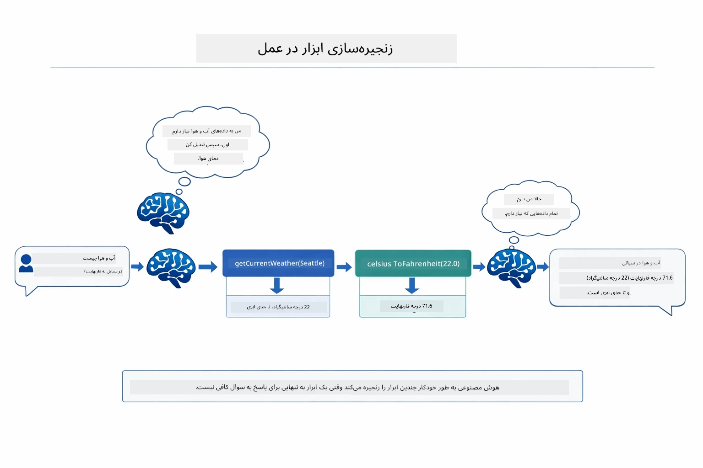

*زنجیره‌سازی ابزار در عمل — عامل ابتدا `getCurrentWeather` را فراخوانی می‌کند، سپس نتیجه سلسیوس را به `celsiusToFahrenheit` می‌فرستد و پاسخ ترکیبی می‌دهد.*

**شکست‌های ملایم** — برای آب‌وهوا در شهری که در داده‌های شبیه‌سازی موجود نیست درخواست کنید. ابزار پیام خطا می‌دهد و هوش مصنوعی توضیح می‌دهد نمی‌تواند کمک کند به جای اینکه برنامه کرش کند. ابزارها به‌طور ایمن شکست می‌خورند. نمودار زیر دو رویکرد متفاوت را نشان می‌دهد — با مدیریت درست خطا، عامل استثناء را می‌گیرد و پاسخ مفیدی می‌دهد، در حالی که بدون آن برنامه به کلی کرش می‌کند:

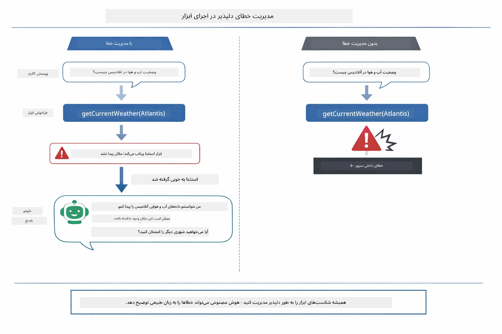

*وقتی ابزار شکست می‌خورد، عامل خطا را می‌گیرد و به جای کرش کردن، با توضیح مفید پاسخ می‌دهد.*

این در یک مرحله گفتگو اتفاق می‌افتد. عامل چندین فراخوانی ابزار را به صورت خودمختار هماهنگ می‌کند.

## اجرای برنامه

**تایید استقرار:**

اطمینان حاصل کنید فایل `.env` در دایرکتوری ریشه با اطلاعات Azure موجود است (در طول ماژول ۰۱ ایجاد شده است). این دستور را از دایرکتوری ماژول (`04-tools/`) اجرا کنید:

**Bash:**  
```bash
cat ../.env  # باید AZURE_OPENAI_ENDPOINT، API_KEY، DEPLOYMENT را نشان دهد
```
  
**PowerShell:**  
```powershell
Get-Content ..\.env  # باید AZURE_OPENAI_ENDPOINT، API_KEY و DEPLOYMENT را نشان دهد
```
  
**شروع برنامه:**

> **توجه:** اگر قبلاً همه برنامه‌ها را با `./start-all.sh` از دایرکتوری ریشه (مطابق ماژول ۰۱) اجرا کرده‌اید، این ماژول در پورت ۸۰۸۴ در حال اجراست. می‌توانید دستورات شروع پایین را رد کنید و مستقیماً به http://localhost:8084 بروید.

**گزینه ۱: استفاده از Spring Boot Dashboard (توصیه‌شده برای کاربران VS Code)**

کانتینر توسعه شامل افزونه Spring Boot Dashboard است که رابط بصری برای مدیریت همه برنامه‌های Spring Boot را فراهم می‌کند. می‌توانید آن را در نوار فعالیت سمت چپ VS Code (آیکون Spring Boot) پیدا کنید.

از Spring Boot Dashboard می‌توانید:  
- همه برنامه‌های Spring Boot موجود در فضای کاری را ببینید  
- برنامه‌ها را با یک کلیک شروع/متوقف کنید  
- لاگ‌های برنامه را در زمان واقعی مشاهده کنید  
- وضعیت برنامه را پایش کنید  

فقط روی دکمه پخش کنار "tools" کلیک کنید تا این ماژول اجرا شود، یا همه ماژول‌ها را همزمان شروع کنید.

نمای Spring Boot Dashboard در VS Code به این شکل است:


*داشبورد Spring Boot در VS Code — شروع، توقف و پایش همه ماژول‌ها از یک مکان*

**گزینه ۲: استفاده از اسکریپت‌های شل**

اجرای همه برنامه‌های وب (ماژول‌های ۰۱ تا ۰۴):

**Bash:**
```bash
cd ..  # از دایرکتوری ریشه
./start-all.sh
```

**PowerShell:**
```powershell
cd ..  # از شاخه‌ی ریشه
.\start-all.ps1
```

یا فقط این ماژول را شروع کنید:

**Bash:**
```bash
cd 04-tools
./start.sh
```

**PowerShell:**
```powershell
cd 04-tools
.\start.ps1
```

هر دو اسکریپت به‌طور خودکار متغیرهای محیطی را از فایل ریشه `.env` بارگذاری می‌کنند و اگر فایل‌های JAR وجود نداشته باشند، آنها را می‌سازند.

> **نکته:** اگر ترجیح می‌دهید همه ماژول‌ها را به‌صورت دستی قبل از شروع بسازید:
>
> **Bash:**
> ```bash
> cd ..  # Go to root directory
> mvn clean package -DskipTests
> ```
>
> **PowerShell:**
> ```powershell
> cd ..  # Go to root directory
> mvn clean package -DskipTests
> ```

آدرس http://localhost:8084 را در مرورگر خود باز کنید.

**برای توقف:**

**Bash:**
```bash
./stop.sh  # فقط این ماژول
# یا
cd .. && ./stop-all.sh  # همه ماژول‌ها
```

**PowerShell:**
```powershell
.\stop.ps1  # فقط این ماژول
# یا
cd ..; .\stop-all.ps1  # همه ماژول‌ها
```

## استفاده از برنامه

این برنامه یک رابط وب ارائه می‌دهد که می‌توانید با یک عامل هوش مصنوعی تعامل کنید که به ابزارهای وضعیت هوا و تبدیل دما دسترسی دارد. این‌طور به نظر می‌رسد — شامل نمونه‌های شروع سریع و پنل گفت‌وگو برای ارسال درخواست‌ها است:

<a href="images/tools-homepage.png"></a>

*رابط ابزارهای عامل هوش مصنوعی - نمونه‌های سریع و رابط گفت‌وگو برای تعامل با ابزارها*

### امتحان استفاده ساده از ابزار

با یک درخواست ساده شروع کنید: «تبدیل ۱۰۰ درجه فارنهایت به سلسیوس». عامل متوجه می‌شود که باید از ابزار تبدیل دما استفاده کند، آن را با پارامترهای درست فراخوانی می‌کند و نتیجه را بازمی‌گرداند. توجه کنید چقدر طبیعی است — شما مشخص نکردید کدام ابزار را استفاده کند یا چگونه آن را فراخوانی کند.

### آزمایش زنجیره‌سازی ابزار

حالا چیزی پیچیده‌تر امتحان کنید: «وضعیت هوا در سیاتل چیست و آن را به فارنهایت تبدیل کن؟» ببینید عامل این کار را به صورت مرحله‌ای انجام می‌دهد. ابتدا وضعیت هوا را می‌گیرد (که به سلسیوس بازمی‌گرداند)، سپس متوجه می‌شود باید به فارنهایت تبدیل کند، ابزار تبدیل را فراخوانی می‌کند و هر دو نتیجه را در یک پاسخ ترکیب می‌کند.

### مشاهده جریان گفتگو

رابط گفت‌وگو تاریخچه گفتگو را حفظ می‌کند، به شما امکان می‌دهد تعاملات چندمرحله‌ای داشته باشید. می‌توانید همه پرسش‌ها و پاسخ‌های قبلی را ببینید، که دنبال کردن گفتگو و فهمیدن چگونگی ساخت زمینه توسط عامل طی چند تبادل را ساده می‌کند.

<a href="images/tools-conversation-demo.png"></a>

*گفتگوی چندمرحله‌ای که تبدیل‌های ساده، جستجوی وضعیت هوا و زنجیره‌سازی ابزارها را نشان می‌دهد*

### آزمایش با درخواست‌های مختلف

چند ترکیب مختلف را امتحان کنید:
- جستجوی وضعیت هوا: «وضع هوا در توکیو چیست؟»
- تبدیل‌های دما: «۲۵ درجه سانتی‌گراد چند کلوین است؟»
- پرسش‌های ترکیبی: «وضع هوا در پاریس را بررسی کن و بگو آیا بالای ۲۰ درجه سانتی‌گراد است یا نه»

توجه کنید که عامل چگونه زبان طبیعی را تفسیر کرده و آن را به فراخوانی‌های مناسب ابزار تبدیل می‌کند.

## مفاهیم کلیدی

### الگوی ReAct (دلیل‌یابی و اقدام)

عامل بین دلیل‌یابی (تصمیم‌گیری درباره کار بعدی) و اقدام (استفاده از ابزارها) جابجا می‌شود. این الگو امکان حل مسئله خودکار را به‌جای صرفاً پاسخگویی به دستورالعمل‌ها فراهم می‌کند.

### اهمیت توضیحات ابزار

کیفیت توضیحات ابزار شما مستقیماً بر چگونگی استفاده خوب عامل از آنها تأثیر می‌گذارد. توضیحات واضح و خاص به مدل کمک می‌کند بفهمد چه زمانی و چگونه باید هر ابزار را فراخوانی کند.

### مدیریت نشست

حاشیه‌نویسی `@MemoryId` امکان مدیریت حافظه مبتنی بر نشست به‌صورت خودکار را فراهم می‌کند. هر شناسه نشست یک نمونه `ChatMemory` مختص به خود دارد که توسط بن `ChatMemoryProvider` مدیریت می‌شود، بنابراین کاربران متعدد می‌توانند به‌طور همزمان با عامل تعامل کنند بدون اینکه گفتگوهایشان مخلوط شود. نمودار زیر نشان می‌دهد چگونه کاربران متعدد به حافظه‌های مجزا بر اساس شناسه‌های نشست هدایت می‌شوند:

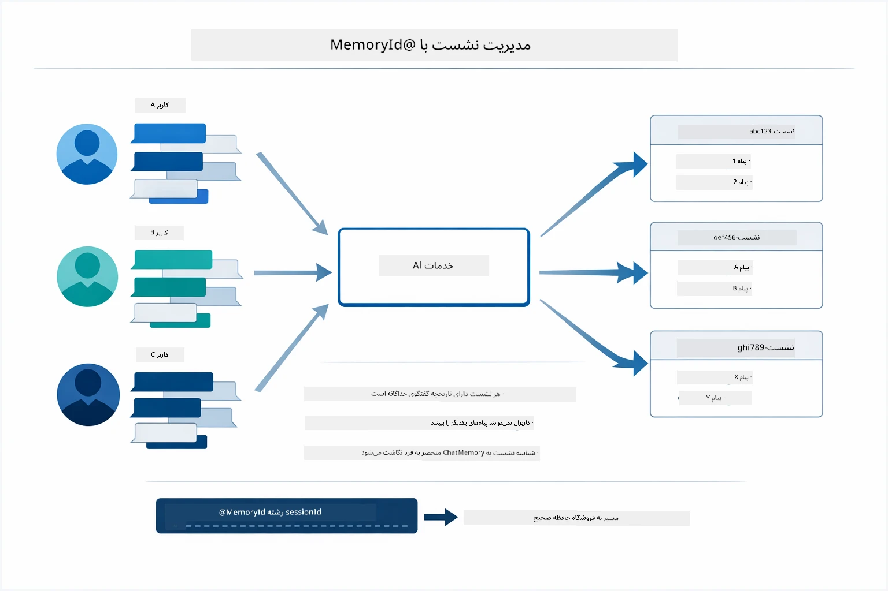

*هر شناسه نشست به تاریخچه گفتگو جداگانه اختصاص دارد — کاربران پیام‌های یکدیگر را نمی‌بینند.*

### مدیریت خطا

ابزارها ممکن است خطا کنند — APIها ممکن است زمان‌شان تمام شود، پارامترها ممکن است نامعتبر باشند، سرویس‌های خارجی ممکن است از کار بیفتند. عامل‌های تولیدی به مدیریت خطا نیاز دارند تا مدل بتواند مشکلات را توضیح دهد یا راه‌های جایگزین را امتحان کند به‌جای اینکه کل برنامه خراب شود. وقتی یک ابزار استثنا پرتاب می‌کند، LangChain4j آن را می‌گیرد و پیام خطا را به مدل می‌دهد تا مدل بتواند مشکل را به زبان طبیعی توضیح دهد.

## ابزارهای موجود

نمودار پایین گستره وسیعی از ابزارهایی که می‌توانید بسازید را نشان می‌دهد. این ماژول ابزارهای وضعیت هوا و دما را نمونه می‌کند، اما همان الگوی `@Tool` برای هر متد جاوا کار می‌کند — از پرس‌وجوهای پایگاه داده تا پردازش پرداخت.

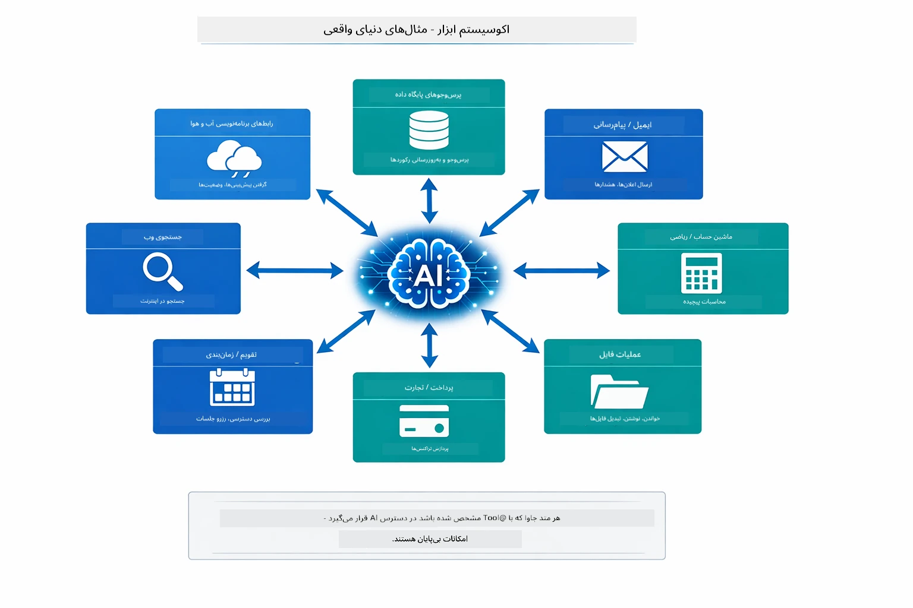

*هر متد جاوایی که با @Tool حاشیه‌نویسی شود در دسترس هوش مصنوعی قرار می‌گیرد — این الگو به پایگاه‌های داده، APIها، ایمیل، عملیات فایل و بیشتر گسترش می‌یابد.*

## چه زمانی از عامل‌های مبتنی بر ابزار استفاده کنیم

هر درخواستی نیاز به ابزار ندارد. تصمیم بستگی دارد به اینکه آیا هوش مصنوعی باید با سیستم‌های خارجی تعامل داشته باشد یا می‌تواند از دانش خودش پاسخ دهد. راهنمای زیر خلاصه می‌کند چه زمانی ابزار ارزش افزوده دارد و چه زمانی لازم نیست:

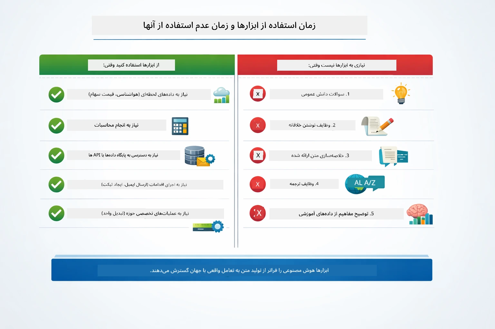

*راهنمای سریع تصمیم — ابزارها برای داده‌های لحظه‌ای، محاسبات و عملیات‌اند؛ دانش عمومی و وظایف خلاقانه نیازی به آن‌ها ندارند.*

## ابزارها در مقابل RAG

ماژول‌های ۰۳ و ۰۴ هر دو قابلیت‌های هوش مصنوعی را گسترش می‌دهند اما به روشی بنیادین متفاوت. RAG مدل را به **دانش** از طریق بازیابی اسناد دسترسی می‌دهد. ابزارها به مدل توانایی انجام **عملیات** با فراخوانی توابع می‌دهند. نمودار زیر این دو رویکرد را کنار هم مقایسه می‌کند — از نحوه عملکرد هر جریان کاری تا مزایا و معایب آن‌ها:

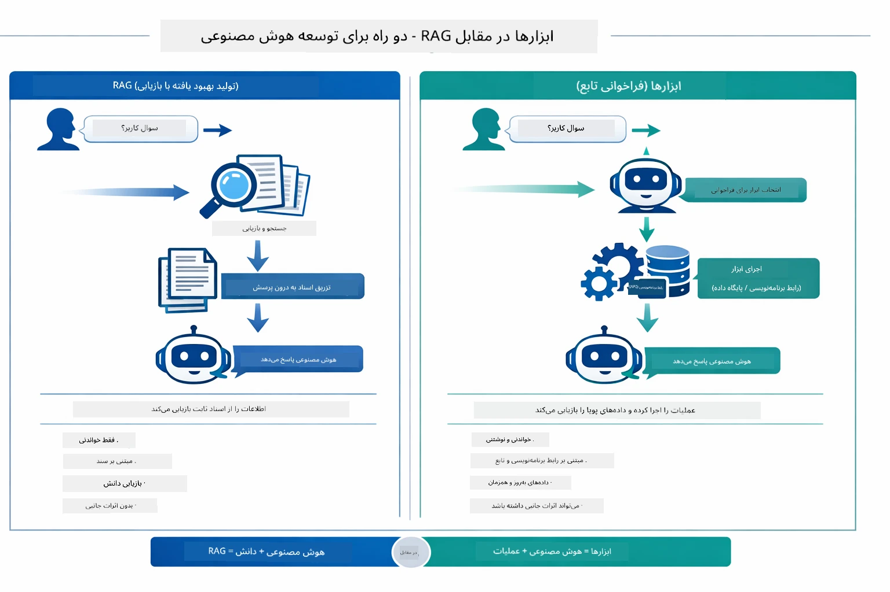

*RAG اطلاعات را از اسناد ایستا بازیابی می‌کند — ابزارها عملیات را اجرا کرده و داده‌های پویا و لحظه‌ای دریافت می‌کنند. بسیاری از سیستم‌های تولیدی هر دو را ترکیب می‌کنند.*

در عمل، بسیاری از سیستم‌های تولیدی هر دو رویکرد را ترکیب می‌کنند: RAG برای پایه‌گذاری پاسخ‌ها در مستندات شما، و ابزارها برای دریافت داده‌های زنده یا انجام عملیات.

## مراحل بعدی

**ماژول بعدی:** [05-mcp - پروتکل متن مدل (MCP)](../05-mcp/README.md)

---

**ناوبری:** [← قبلی: ماژول ۰۳ - RAG](../03-rag/README.md) | [بازگشت به اصلی](../README.md) | [بعدی: ماژول ۰۵ - MCP →](../05-mcp/README.md)

---

<!-- CO-OP TRANSLATOR DISCLAIMER START -->
**توضیح مسئولیت**:  
این سند با استفاده از سرویس ترجمه هوش مصنوعی [Co-op Translator](https://github.com/Azure/co-op-translator) ترجمه شده است. اگرچه ما در پی دقت هستیم، اما لطفاً توجه داشته باشید که ترجمه‌های خودکار ممکن است شامل خطاها یا نادرستی‌هایی باشند. سند اصلی به زبان بومی خود، منبع معتبر به شمار می‌رود. برای اطلاعات حیاتی، ترجمه حرفه‌ای انسانی توصیه می‌شود. ما مسئول هیچ‌گونه سوء تفاهم یا برداشت نادرست ناشی از استفاده از این ترجمه نیستیم.
<!-- CO-OP TRANSLATOR DISCLAIMER END -->