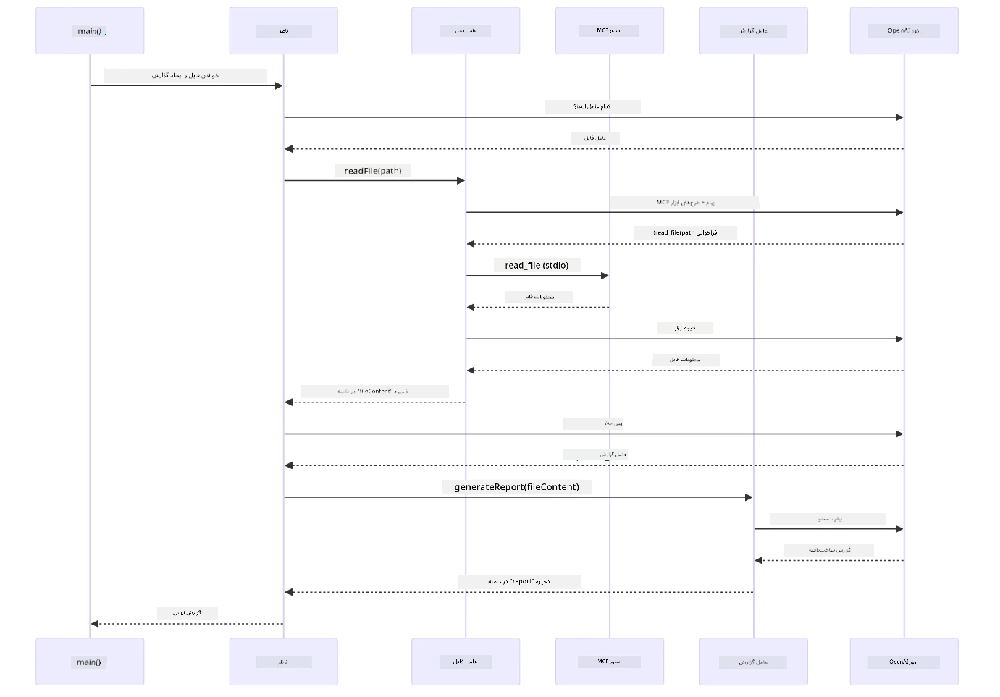

# ماژول ۰۵: پروتکل زمینه مدل (MCP)

## فهرست مطالب

- [مرور ویدیو](../../../05-mcp)
- [آنچه یاد خواهید گرفت](../../../05-mcp)
- [MCP چیست؟](../../../05-mcp)
- [چگونه MCP کار می‌کند](../../../05-mcp)
- [ماژول عامل‌مند](../../../05-mcp)
- [اجرای مثال‌ها](../../../05-mcp)
  - [پیش‌نیازها](../../../05-mcp)
- [شروع سریع](../../../05-mcp)
  - [عملیات فایل (Stdio)](../../../05-mcp)
  - [عامل ناظر](../../../05-mcp)
    - [اجرای دموی نمایشی](../../../05-mcp)
    - [چگونه ناظر کار می‌کند](../../../05-mcp)
    - [چگونگی کشف ابزارهای MCP توسط FileAgent در زمان اجرا](../../../05-mcp)
    - [استراتژی‌های پاسخ](../../../05-mcp)
    - [درک خروجی](../../../05-mcp)
    - [توضیح ویژگی‌های ماژول عامل‌مند](../../../05-mcp)
- [مفاهیم کلیدی](../../../05-mcp)
- [تبریک!](../../../05-mcp)
  - [بعدی چیست؟](../../../05-mcp)

## مرور ویدیو

این جلسه زنده را تماشا کنید که توضیح می‌دهد چگونه با این ماژول شروع کنید:

<a href="https://www.youtube.com/watch?v=O_J30kZc0rw"></a>

## آنچه یاد خواهید گرفت

شما یک هوش مصنوعی مکالمه‌ای ساخته‌اید، در فرمان‌ها مهارت پیدا کرده‌اید، پاسخ‌ها را بر اساس اسناد پایه‌گذاری کرده‌اید و عامل‌هایی با ابزار ساخته‌اید. اما تمام آن ابزارها برای برنامه خاص شما به صورت سفارشی ساخته شده بودند. چه می‌شد اگر می‌توانستید به هوش مصنوعی خود دسترسی به یک اکوسیستم استاندارد شده از ابزارها بدهید که هر کسی بتواند آنها را بسازد و به اشتراک بگذارد؟ در این ماژول، یاد می‌گیرید که دقیقاً این کار را با پروتکل زمینه مدل (MCP) و ماژول عامل‌مند LangChain4j انجام دهید. ابتدا یک خواننده فایل ساده MCP را نمایش می‌دهیم و سپس نشان می‌دهیم چگونه به آسانی در جریان‌های کاری عامل‌مند پیشرفته با استفاده از الگوی عامل ناظر ادغام می‌شود.

## MCP چیست؟

پروتکل زمینه مدل (MCP) دقیقاً همان را فراهم می‌کند — روشی استاندارد برای برنامه‌های هوش مصنوعی که ابزارهای خارجی را کشف و استفاده کنند. به جای نوشتن ادغام‌های سفارشی برای هر منبع داده یا سرویس، شما به سرورهای MCP متصل می‌شوید که قابلیت‌های خود را با یک قالب ثابت ارائه می‌دهند. عامل هوش مصنوعی شما می‌تواند این ابزارها را به طور خودکار کشف و استفاده کند.

نمودار زیر تفاوت را نشان می‌دهد — بدون MCP، هر ادغام نیازمند سیم‌کشی نقطه به نقطه سفارشی است؛ با MCP، یک پروتکل واحد برنامه شما را به هر ابزاری متصل می‌کند:


*قبل از MCP: ادغام‌های نقطه به نقطه پیچیده. بعد از MCP: یک پروتکل، امکانات بی‌پایان.*

MCP یک مشکل بنیادی در توسعه هوش مصنوعی را حل می‌کند: هر ادغام سفارشی است. می‌خواهید به گیت‌هاب دسترسی داشته باشید؟ کد سفارشی. می‌خواهید فایل‌ها را بخوانید؟ کد سفارشی. می‌خواهید از یک پایگاه داده پرس‌وجو کنید؟ کد سفارشی. و هیچ‌کدام از این ادغام‌ها با دیگر برنامه‌های هوش مصنوعی کار نمی‌کنند.

MCP این را استاندارد می‌کند. یک سرور MCP ابزارها را با توضیحات شفاف و ساختار داده‌ها ارائه می‌دهد. هر مشتری MCP می‌تواند وصل شود، ابزارهای موجود را کشف کند و از آنها استفاده کند. یکبار بسازید، همه‌جا استفاده کنید.

نمودار زیر این معماری را نشان می‌دهد — یک مشتری MCP واحد (برنامه هوش مصنوعی شما) به چند سرور MCP متصل می‌شود که هرکدام مجموعه‌ای از ابزارهای خود را از طریق پروتکل استاندارد ارائه می‌دهند:


*معماری پروتکل زمینه مدل - کشف و اجرای استاندارد ابزار*

## چگونه MCP کار می‌کند

در پشت صحنه، MCP از معماری لایه‌ای استفاده می‌کند. برنامه جاوای شما (مشتری MCP) ابزارهای موجود را کشف می‌کند، درخواست‌های JSON-RPC را از طریق لایه انتقال (Stdio یا HTTP) ارسال می‌کند، و سرور MCP عملیات را اجرا کرده و نتایج را برمی‌گرداند. نمودار زیر هر لایه این پروتکل را تفکیک می‌کند:


*چگونگی کار MCP در پشت صحنه — مشتری‌ها ابزارها را کشف می‌کنند، پیام‌های JSON-RPC رد و بدل می‌کنند و عملیات از طریق لایه انتقال اجرا می‌شود.*

**معماری سرور-مشتری**

MCP از مدل سرور-مشتری استفاده می‌کند. سرورها ابزارها را فراهم می‌کنند — خواندن فایل‌ها، پرس‌وجو از پایگاه‌های داده، فراخوانی API‌ها. مشتری‌ها (برنامه هوش مصنوعی شما) به سرورها متصل شده و از ابزارهای آنها استفاده می‌کنند.

برای استفاده از MCP با LangChain4j، این وابستگی Maven را اضافه کنید:

```xml
<dependency>
    <groupId>dev.langchain4j</groupId>
    <artifactId>langchain4j-mcp</artifactId>
    <version>${langchain4j.version}</version>
</dependency>
```

**کشف ابزارها**

وقتی مشتری شما به یک سرور MCP وصل می‌شود، می‌پرسد «چه ابزارهایی دارید؟» سرور با فهرستی از ابزارهای موجود پاسخ می‌دهد، هرکدام با توضیحات و ساختار پارامترها. عامل هوش مصنوعی شما سپس می‌تواند تصمیم بگیرد بر اساس درخواست کاربران کدام ابزارها را استفاده کند. نمودار زیر این دست دادن را نشان می‌دهد — مشتری درخواست `tools/list` ارسال می‌کند و سرور ابزارهای موجود را با توضیحات و ساختار پارامتر بازمی‌گرداند:


*هوش مصنوعی در شروع کار ابزارهای موجود را کشف می‌کند — اکنون می‌داند چه قابلیت‌هایی در دسترس است و می‌تواند تصمیم بگیرد کدام را استفاده کند.*

**مکانیزم‌های انتقال**

MCP مکانیزم‌های انتقال مختلفی را پشتیبانی می‌کند. دو گزینه موجود Stdio (برای ارتباطات فرایند فرعی محلی) و HTTP قابل جریان (برای سرورهای راه دور) هستند. این ماژول انتقال Stdio را نشان می‌دهد:


*مکانیزم‌های انتقال MCP: HTTP برای سرورهای راه دور، Stdio برای فرآیندهای محلی*

**Stdio** - [StdioTransportDemo.java](../../../05-mcp/src/main/java/com/example/langchain4j/mcp/StdioTransportDemo.java)

برای فرآیندهای محلی. برنامه شما یک سرور را به عنوان فرایند فرعی راه‌اندازی می‌کند و از طریق ورودی/خروجی استاندارد با آن ارتباط برقرار می‌کند. برای دسترسی به سیستم فایل یا ابزارهای خط فرمان مفید است.

```java
McpTransport stdioTransport = new StdioMcpTransport.Builder()
    .command(List.of(
        npmCmd, "exec",
        "@modelcontextprotocol/server-filesystem@2025.12.18",
        resourcesDir
    ))
    .logEvents(false)
    .build();
```

سرور `@modelcontextprotocol/server-filesystem` ابزارهای زیر را فراهم می‌کند، همه در محدوده پوشه‌هایی که مشخص می‌کنید محدود شده‌اند:

| ابزار | توضیحات |
|------|-------------|
| `read_file` | خواندن محتوای یک فایل واحد |
| `read_multiple_files` | خواندن چندین فایل در یک فراخوانی |
| `write_file` | ایجاد یا بازنویسی فایل |
| `edit_file` | انجام ویرایش هدفمند یافتن و جایگزینی |
| `list_directory` | فهرست کردن فایل‌ها و پوشه‌ها در یک مسیر |
| `search_files` | جستجوی بازگشتی برای فایل‌های مطابق با الگو |
| `get_file_info` | دریافت فراداده فایل (اندازه، زمان‌ها، مجوزها) |
| `create_directory` | ایجاد پوشه (از جمله پوشه‌های والد) |
| `move_file` | جابجایی یا تغییر نام فایل یا پوشه |

نمودار زیر نشان می‌دهد که انتقال Stdio در زمان اجرا چگونه کار می‌کند — برنامه جاوای شما سرور MCP را به عنوان یک فرایند فرعی راه‌اندازی می‌کند و آنها از طریق لوله‌های stdin/stdout ارتباط برقرار می‌کنند، بدون دخالت شبکه یا HTTP:


*انتقال Stdio در عمل — برنامه شما سرور MCP را به عنوان فرایند فرعی راه‌اندازی و از طریق لوله‌های stdin/stdout ارتباط برقرار می‌کند.*

> **🤖 امتحان کنید با چت [GitHub Copilot](https://github.com/features/copilot):** فایل [`StdioTransportDemo.java`](../../../05-mcp/src/main/java/com/example/langchain4j/mcp/StdioTransportDemo.java) را باز کنید و بپرسید:
> - "انتقال Stdio چگونه کار می‌کند و کی باید از آن به جای HTTP استفاده کنم؟"
> - "LangChain4j چگونه چرخه عمر فرایندهای سرور MCP ایجاد شده را مدیریت می‌کند؟"
> - "ملاحظات امنیتی دادن دسترسی به سیستم فایل به هوش مصنوعی چیست؟"

## ماژول عامل‌مند

در حالی که MCP ابزارهای استاندارد شده‌ای فراهم می‌کند، ماژول **عامل‌مند** LangChain4j روشی اعلامی برای ساخت عامل‌هایی فراهم می‌آورد که این ابزارها را ارکستراسیون می‌کنند. نشانه‌گذاری `@Agent` و `AgenticServices` اجازه می‌دهد رفتار عامل از طریق رابط به جای کد امری تعریف شود.

در این ماژول، الگوی **عامل ناظر** را کشف خواهید کرد — رویکرد پیشرفته‌تری از AI عامل‌مند که یک عامل «ناظر» به طور داینامیک انتخاب می‌کند کدام زیرعامل‌ها را بر اساس درخواست کاربر فعال کند. ما هر دو مفهوم را با دادن دسترسی به فایل تحت قدرت MCP به یکی از زیرعامل‌هایمان ترکیب می‌کنیم.

برای استفاده از ماژول عامل‌مند، این وابستگی Maven را اضافه کنید:

```xml
<dependency>
    <groupId>dev.langchain4j</groupId>
    <artifactId>langchain4j-agentic</artifactId>
    <version>${langchain4j.mcp.version}</version>
</dependency>
```
 > **نکته:** ماژول `langchain4j-agentic` از خاصیت نسخه جداگانه‌ای (`langchain4j.mcp.version`) استفاده می‌کند زیرا با جدول زمان‌بندی متفاوتی نسبت به کتابخانه‌های اصلی LangChain4j منتشر می‌شود.

> **⚠️ آزمایشی:** ماژول `langchain4j-agentic` **آزمایشی** است و ممکن است تغییر کند. روش پایدار ساخت دستیارهای هوش مصنوعی همچنان `langchain4j-core` با ابزارهای سفارشی (ماژول ۰۴) است.

## اجرای مثال‌ها

### پیش‌نیازها

- تکمیل [ماژول ۰۴ - ابزارها](../04-tools/README.md) (این ماژول بر مفاهیم ابزار سفارشی بنا شده و با ابزارهای MCP مقایسه می‌شود)
- فایل `.env` در دایرکتوری ریشه با اعتبارنامه‌های Azure (ایجاد شده توسط `azd up` در ماژول ۰۱)
- جاوا ۲۱ یا بالاتر، Maven 3.9 یا بالاتر
- Node.js 16 به بالا و npm (برای سرورهای MCP)

> **توجه:** اگر هنوز متغیرهای محیطی خود را تنظیم نکرده‌اید، به [ماژول ۰۱ - معرفی](../01-introduction/README.md) برای دستورالعمل‌های استقرار مراجعه کنید (`azd up` به صورت خودکار فایل `.env` می‌سازد)، یا `.env.example` را به `.env` در دایرکتوری ریشه کپی کرده و مقادیر خود را وارد کنید.

## شروع سریع

**استفاده از VS Code:** به سادگی روی هر فایل دمو در پنجره اکسپلورر راست‌کلیک کرده و **"Run Java"** را انتخاب کنید، یا از پیکربندی‌های راه‌اندازی در پنل Run and Debug استفاده کنید (ابتدا مطمئن شوید فایل `.env` با اعتبارنامه Azure پیکربندی شده است).

**استفاده از Maven:** همچنین می‌توانید از خط فرمان با مثال‌های زیر اجرا کنید.

### عملیات فایل (Stdio)

این ابزارهای مبتنی بر فرایند فرعی محلی را نمایش می‌دهد.

**✅ هیچ پیش‌نیازی لازم نیست** — سرور MCP به طور خودکار راه‌اندازی می‌شود.

**استفاده از اسکریپت‌های شروع (توصیه شده):**

اسکریپت‌های شروع به صورت خودکار متغیرهای محیطی را از فایل `.env` ریشه بارگیری می‌کنند:

**Bash:**
```bash
cd 05-mcp
chmod +x start-stdio.sh
./start-stdio.sh
```

**PowerShell:**
```powershell
cd 05-mcp
.\start-stdio.ps1
```

**استفاده از VS Code:** روی `StdioTransportDemo.java` راست‌کلیک کرده و **"Run Java"** را انتخاب کنید (مطمئن شوید فایل `.env` پیکربندی شده است).

برنامه به طور خودکار سرور MCP سیستم فایل را راه‌اندازی کرده و یک فایل محلی را می‌خواند. مدیریت فرایند فرعی برای شما انجام می‌شود.

**خروجی مورد انتظار:**
```
Assistant response: The file provides an overview of LangChain4j, an open-source Java library
for integrating Large Language Models (LLMs) into Java applications...
```

### عامل ناظر

الگوی **عامل ناظر** شکلی **انعطاف‌پذیر** از AI عامل‌مند است. یک ناظر با استفاده از LLM به طور خودکار تصمیم می‌گیرد کدام عامل‌ها را بر اساس درخواست کاربر فراخوانی کند. در مثال بعدی، دسترسی به فایل تحت قدرت MCP را با عامل LLM برای ایجاد جریان کاری خواندن فایل → گزارش ترکیب می‌کنیم.

در دموی نمایشی، `FileAgent` یک فایل را با استفاده از ابزارهای سیستم‌فایل MCP می‌خواند، و `ReportAgent` یک گزارش ساختاریافته با خلاصه اجرایی (۱ جمله)، ۳ نکته کلیدی و توصیه‌ها تولید می‌کند. ناظر این جریان را به طور خودکار هماهنگ می‌کند:


*ناظر با استفاده از LLM خود تصمیم می‌گیرد کدام عوامل را و به چه ترتیبی فراخوانی کند — نیازی به مسیر دهی سخت‌کد شده نیست.*

جریان کاری مشخص برای خط لوله فایل به گزارش ما به این صورت است:


*FileAgent فایل را از طریق ابزارهای MCP می‌خواند، سپس ReportAgent محتوای خام را به گزارش ساخت‌یافته تبدیل می‌کند.*

نمودار دنباله زیر ارکستراسیون کامل ناظر را ردیابی می‌کند — از راه‌اندازی سرور MCP، انتخاب خودمختار عامل‌ها توسط ناظر، تا فراخوانی ابزارها از طریق stdio و گزارش نهایی:



*ناظر به طور خودکار FileAgent را فراخوانی می‌کند (که سرور MCP را از طریق stdio فراخوانی می‌کند تا فایل را بخواند)، سپس ReportAgent را برای ساخت گزارش ساختاریافته فراخوانی می‌کند — هر عامل خروجی خود را در حوزه عامل‌مند مشترک ذخیره می‌کند.*

هر عامل خروجی خود را در **حوزه عامل‌مند** (حافظه مشترک) ذخیره می‌کند، که اجازه می‌دهد عامل‌های پایین‌دستی به نتایج قبلی دسترسی داشته باشند. این نشان می‌دهد چگونه ابزارهای MCP به راحتی در جریان‌های کاری عامل‌مند ادغام می‌شوند — ناظر نیازی ندارد بداند *چگونه* فایل‌ها خوانده می‌شوند، فقط کافی است بداند که `FileAgent` می‌تواند این کار را انجام دهد.

#### اجرای دموی نمایشی

اسکریپت‌های شروع به طور خودکار متغیرهای محیطی را از فایل `.env` ریشه بارگیری می‌کنند:

**Bash:**
```bash
cd 05-mcp
chmod +x start-supervisor.sh
./start-supervisor.sh
```

**PowerShell:**
```powershell
cd 05-mcp
.\start-supervisor.ps1
```

**استفاده از VS Code:** روی `SupervisorAgentDemo.java` راست‌کلیک کرده و **"Run Java"** را انتخاب کنید (مطمئن شوید فایل `.env` پیکربندی شده است).

#### چگونه ناظر کار می‌کند

قبل از ساخت عامل‌ها، باید انتقال MCP را به یک مشتری متصل کنید و آن را به صورت یک `ToolProvider` بپیچید. اینطوری ابزارهای سرور MCP برای عامل‌های شما در دسترس می‌شوند:

```java
// ایجاد یک کلاینت MCP از ترنسپورت
McpClient mcpClient = new DefaultMcpClient.Builder()
        .transport(stdioTransport)
        .build();

// پیچیدن کلاینت به عنوان یک ToolProvider — این پل ارتباطی ابزارهای MCP به LangChain4j است
ToolProvider mcpToolProvider = McpToolProvider.builder()
        .mcpClients(List.of(mcpClient))
        .build();
```

اکنون می‌توانید `mcpToolProvider` را در هر عاملی که به ابزارهای MCP نیاز دارد تزریق کنید:

```java
// مرحله ۱: FileAgent فایل‌ها را با استفاده از ابزارهای MCP می‌خواند
FileAgent fileAgent = AgenticServices.agentBuilder(FileAgent.class)
        .chatModel(model)
        .toolProvider(mcpToolProvider)  // ابزارهای MCP برای عملیات فایل دارد
        .build();

// مرحله ۲: ReportAgent گزارش‌های ساختاریافته تولید می‌کند
ReportAgent reportAgent = AgenticServices.agentBuilder(ReportAgent.class)
        .chatModel(model)
        .build();

// Supervisor جریان کاری فایل → گزارش را هماهنگ می‌کند
SupervisorAgent supervisor = AgenticServices.supervisorBuilder()
        .chatModel(model)
        .subAgents(fileAgent, reportAgent)
        .responseStrategy(SupervisorResponseStrategy.LAST)  // گزارش نهایی را بازمی‌گرداند
        .build();

// Supervisor بر اساس درخواست تصمیم می‌گیرد کدام عوامل اجرا شوند
String response = supervisor.invoke("Read the file at /path/file.txt and generate a report");
```

#### چگونگی کشف ابزارهای MCP توسط FileAgent در زمان اجرا

ممکن است بپرسید: **چگونه `FileAgent` می‌داند چگونه از ابزارهای npm سیستم فایل استفاده کند؟** پاسخ این است که نمی‌داند — **LLM** در زمان اجرا از طریق ساختارهای ابزار متوجه این می‌شود.
رابط کاربری `FileAgent` صرفاً یک **تعریف پرامپت** است. هیچ دانش سخت‌کد شده‌ای درباره `read_file`، `list_directory` یا هیچ ابزار MCP دیگری ندارد. در اینجا روند کامل از ابتدا تا انتها آمده است:

1. **سرور اجرا می‌شود:** `StdioMcpTransport` بسته npm با نام `@modelcontextprotocol/server-filesystem` را به عنوان یک پردازش فرزند راه‌اندازی می‌کند  
2. **کشف ابزار:** `McpClient` درخواست JSON-RPC با عنوان `tools/list` را به سرور ارسال می‌کند، سرور نیز نام ابزارها، توضیحات و شمای پارامترها را پاسخ می‌دهد (مثلاً `read_file` — *"مطالب کامل یک فایل را بخواند"* — `{ path: string }`)  
3. **تزریق شمای ابزار:** `McpToolProvider` این شمای کشف شده را بسته‌بندی می‌کند و در دسترس LangChain4j قرار می‌دهد  
4. **تصمیم‌گیری LLM:** وقتی متد `FileAgent.readFile(path)` فراخوانی می‌شود، LangChain4j پیام سیستم، پیام کاربر، **و فهرست شمای ابزارها** را به LLM می‌فرستد. LLM شرح ابزارها را می‌خواند و یک فراخوانی ابزار تولید می‌کند (مثلاً `read_file(path="/some/file.txt")`)  
5. **اجرای ابزار:** LangChain4j فراخوانی ابزار را می‌گیرد، آن را از طریق کلاینت MCP به پردازش فرزند Node.js می‌فرستد، نتیجه را دریافت می‌کند و آن را به LLM برمی‌گرداند  

این همان مکانیسم [کشف ابزار](../../../05-mcp) است که بالاتر شرح داده شد، با این تفاوت که به‌طور خاص برای جریان کاری agent اعمال شده است. نشانه‌گذاری‌های `@SystemMessage` و `@UserMessage` رفتار LLM را هدایت می‌کنند، در حالی که `ToolProvider` تزریق شده به آن **قابلیت‌ها** می‌دهد — LLM بین این دو در زمان اجرا پل می‌زند.

> **🤖 با Chat [GitHub Copilot](https://github.com/features/copilot) امتحان کنید:** فایل [`FileAgent.java`](../../../05-mcp/src/main/java/com/example/langchain4j/mcp/agents/FileAgent.java) را باز کنید و بپرسید:  
> - "این ایجنت چطور می‌داند کدام ابزار MCP را فراخوانی کند؟"  
> - "اگر ToolProvider را از agent builder حذف کنم چه اتفاقی می‌افتد؟"  
> - "چطور شمای ابزارها به LLM منتقل می‌شوند؟"

#### استراتژی‌های پاسخ‌دهی

وقتی `SupervisorAgent` را پیکربندی می‌کنید، مشخص می‌کنید که چگونه باید پاسخ نهایی خود را پس از تکمیل وظایف زیرایجنت‌ها به کاربر بدهد. نمودار زیر سه استراتژی موجود را نشان می‌دهد — LAST مستقیماً خروجی ایجنت نهایی را برمی‌گرداند، SUMMARY همه خروجی‌ها را توسط LLM ترکیب می‌کند و SCORED خروجی با امتیاز بالاتر نسبت به درخواست اصلی را انتخاب می‌کند:


*سه استراتژی برای نحوه‌ی فرموله کردن پاسخ نهایی Supervisor — انتخاب بر اساس اینکه خروجی ایجنت آخر می‌خواهید، خلاصه‌ای ترکیب شده می‌خواهید یا بهترین گزینه‌امتیازدهی‌شده.*

استراتژی‌های موجود عبارتند از:

| استراتژی | توضیح |
|----------|--------|
| **LAST** | سوپروایزر خروجی آخرین زیرایجنت یا ابزار فراخوانی شده را برمی‌گرداند. این زمانی مفید است که ایجنت نهایی در جریان کاری به‌طور مشخص برای تولید پاسخ کامل و نهایی طراحی شده باشد (مثلاً "ایجنت خلاصه‌سازی" در یک خط لوله پژوهشی). |
| **SUMMARY** | سوپروایزر از مدل زبانی داخلی خود (LLM) برای ترکیب یک خلاصه از کل تعامل و همه خروجی‌های زیرایجنت استفاده می‌کند و آن خلاصه را به عنوان پاسخ نهایی برمی‌گرداند. این یک پاسخ تمیز و تجمیع شده به کاربر ارائه می‌دهد. |
| **SCORED** | سیستم با استفاده از LLM داخلی به هر دوی پاسخ LAST و خلاصه SUMMARY از تعامل امتیاز می‌دهد و خروجی‌ای که امتیاز بالاتری دریافت کند را بازمی‌گرداند. |

پیاده‌سازی کامل را در [SupervisorAgentDemo.java](../../../05-mcp/src/main/java/com/example/langchain4j/mcp/SupervisorAgentDemo.java) ببینید.

> **🤖 با Chat [GitHub Copilot](https://github.com/features/copilot) امتحان کنید:** فایل [`SupervisorAgentDemo.java`](../../../05-mcp/src/main/java/com/example/langchain4j/mcp/SupervisorAgentDemo.java) را باز کنید و بپرسید:  
> - "چگونه سوپروایزر تصمیم می‌گیرد کدام ایجنت‌ها را فراخوانی کند؟"  
> - "تفاوت الگوهای کاری Supervisor و Sequential چیست؟"  
> - "چطور می‌توانم رفتار برنامه‌ریزی سوپروایزر را شخصی‌سازی کنم؟"

#### فهمیدن خروجی

وقتی دمو را اجرا کنید، یک راهنمای ساختاریافته خواهید دید که نشان می‌دهد چطور سوپروایزر چند ایجنت را هماهنگ می‌کند. در اینجا معنای هر بخش آمده است:

```
======================================================================
  FILE → REPORT WORKFLOW DEMO
======================================================================

This demo shows a clear 2-step workflow: read a file, then generate a report.
The Supervisor orchestrates the agents automatically based on the request.
```
  
**سربرگ** مفهوم جریان کاری را معرفی می‌کند: یک خط لوله متمرکز از خواندن فایل تا تولید گزارش.

```
--- WORKFLOW ---------------------------------------------------------
  ┌─────────────┐      ┌──────────────┐
  │  FileAgent  │ ───▶ │ ReportAgent  │
  │ (MCP tools) │      │  (pure LLM)  │
  └─────────────┘      └──────────────┘
   outputKey:           outputKey:
   'fileContent'        'report'

--- AVAILABLE AGENTS -------------------------------------------------
  [FILE]   FileAgent   - Reads files via MCP → stores in 'fileContent'
  [REPORT] ReportAgent - Generates structured report → stores in 'report'
```
  
**نمودار جریان کاری** جریان داده‌ها بین ایجنت‌ها را نشان می‌دهد. هر ایجنت نقش مشخصی دارد:  
- **FileAgent** با استفاده از ابزارهای MCP فایل‌ها را می‌خواند و محتوای خام را در `fileContent` ذخیره می‌کند  
- **ReportAgent** آن محتوا را می‌گیرد و گزارش ساختاریافته‌ای در `report` تولید می‌کند

```
--- USER REQUEST -----------------------------------------------------
  "Read the file at .../file.txt and generate a report on its contents"
```
  
**درخواست کاربر** وظیفه را نشان می‌دهد. سوپروایزر این را تجزیه می‌کند و تصمیم می‌گیرد FileAgent → ReportAgent را فراخوانی کند.

```
--- SUPERVISOR ORCHESTRATION -----------------------------------------
  The Supervisor decides which agents to invoke and passes data between them...

  +-- STEP 1: Supervisor chose -> FileAgent (reading file via MCP)
  |
  |   Input: .../file.txt
  |
  |   Result: LangChain4j is an open-source, provider-agnostic Java framework for building LLM...
  +-- [OK] FileAgent (reading file via MCP) completed

  +-- STEP 2: Supervisor chose -> ReportAgent (generating structured report)
  |
  |   Input: LangChain4j is an open-source, provider-agnostic Java framew...
  |
  |   Result: Executive Summary...
  +-- [OK] ReportAgent (generating structured report) completed
```
  
**هماهنگی سوپروایزر** جریان ۲ مرحله‌ای را نمایش می‌دهد:  
1. **FileAgent** فایل را از طریق MCP می‌خواند و محتوا را ذخیره می‌کند  
2. **ReportAgent** محتوا را دریافت کرده و گزارش ساختاریافته تولید می‌کند

سوپروایزر این تصمیمات را **خودمختارانه** بر اساس درخواست کاربر گرفت.

```
--- FINAL RESPONSE ---------------------------------------------------
Executive Summary
...

Key Points
...

Recommendations
...

--- AGENTIC SCOPE (Data Flow) ----------------------------------------
  Each agent stores its output for downstream agents to consume:
  * fileContent: LangChain4j is an open-source, provider-agnostic Java framework...
  * report: Executive Summary...
```
  
#### توضیح ویژگی‌های ماژول Agentic

این مثال چند ویژگی پیشرفته ماژول agentic را نشان می‌دهد. بیایید دقیق‌تر به Agentic Scope و Agent Listeners نگاه کنیم.

**Agentic Scope** حافظه مشترکی را نشان می‌دهد که ایجنت‌ها با `@Agent(outputKey="...")` نتایج خود را ذخیره می‌کنند. این امکان را می‌دهد:  
- ایجنت‌های بعدی به خروجی‌های ایجنت‌های قبلی دسترسی داشته باشند  
- سوپروایزر پاسخ نهایی را ترکیب کند  
- شما بتوانید آنچه هر ایجنت تولید کرده را بررسی کنید

نمودار زیر نشان می‌دهد که Agentic Scope چگونه به عنوان حافظه مشترک در جریان کاری فایل به گزارش کار می‌کند — FileAgent خروجی خود را در کلید `fileContent` می‌نویسد، ReportAgent آن را می‌خواند و خروجی خود را در `report` می‌نویسد:


*Agentic Scope به عنوان حافظه مشترک عمل می‌کند — FileAgent مقدار `fileContent` را می‌نویسد، ReportAgent آن را می‌خواند و سپس `report` را می‌نویسد، و کد شما نتیجه نهایی را می‌خواند.*

```java
ResultWithAgenticScope<String> result = supervisor.invokeWithAgenticScope(request);
AgenticScope scope = result.agenticScope();
String fileContent = scope.readState("fileContent");  // داده‌های خام فایل از FileAgent
String report = scope.readState("report");            // گزارش ساختار یافته از ReportAgent
```
  
**Agent Listeners** امکان نظارت و اشکال‌زدایی اجرای ایجنت‌ها را فراهم می‌کنند. خروجی گام‌به‌گام که در دمو می‌بینید از یک AgentListener می‌آید که به هر فراخوانی ایجنت متصل می‌شود:  
- **beforeAgentInvocation** - زمانی فراخوانی می‌شود که سوپروایزر یک ایجنت را انتخاب می‌کند و به شما اجازه می‌دهد ببینید کدام ایجنت چرا انتخاب شده است  
- **afterAgentInvocation** - وقتی ایجنت انجام شد فراخوانی می‌شود و نتیجه آن را نشان می‌دهد  
- **inheritedBySubagents** - اگر true باشد، شنونده اجرای همه ایجنت‌های سلسله‌مراتبی را نظارت می‌کند

نمودار زیر چرخه کامل عمر Agent Listener را نشان می‌دهد، از جمله چگونگی مدیریت خطا‌ها توسط `onError` هنگام اجرای ایجنت:


*Agent Listeners به چرخه عمر اجرا متصل می‌شوند — زمان شروع، پایان یا خطاهای ایجنت را نظارت می‌کنند.*

```java
AgentListener monitor = new AgentListener() {
    private int step = 0;
    
    @Override
    public void beforeAgentInvocation(AgentRequest request) {
        step++;
        System.out.println("  +-- STEP " + step + ": " + request.agentName());
    }
    
    @Override
    public void afterAgentInvocation(AgentResponse response) {
        System.out.println("  +-- [OK] " + response.agentName() + " completed");
    }
    
    @Override
    public boolean inheritedBySubagents() {
        return true; // به همه زیرواسط‌ها ارسال کن
    }
};
```
  
فراتر از الگوی سوپروایزر، ماژول `langchain4j-agentic` چند الگوی قدرتمند جریان کاری را فراهم می‌کند. نمودار زیر همه پنج الگو را نشان می‌دهد — از خط لوله ساده ترتیبی تا جریان‌های کاری تاییدیه انسانی:


*پنج الگوی جریان کاری برای هماهنگی ایجنت‌ها — از خطوط لوله ترتیبی ساده تا جریان‌های کاری تاییدیه انسانی.*

| الگو | توضیح | مورد استفاده |
|---------|-----------------|--------------|
| **Sequential** | اجرای ایجنت‌ها به ترتیب، خروجی به بعدی ارسال می‌شود | خطوط لوله: تحقیق → تحلیل → گزارش |
| **Parallel** | اجرای همزمان ایجنت‌ها | وظایف مستقل: هواشناسی + اخبار + بورس |
| **Loop** | تکرار تا برآورده‌شدن شرط | امتیازدهی کیفیت: تکرار تا امتیاز ≥ 0.8 |
| **Conditional** | مسیریابی بر اساس شرایط | دسته‌بندی → ارسال به ایجنت متخصص |
| **Human-in-the-Loop** | افزودن نقاط کنترل انسانی | جریان‌های کاری تایید، بازبینی محتوا |

## مفاهیم کلیدی

حالا که MCP و ماژول agentic را در عمل بررسی کردید، بیایید خلاصه کنیم هر کدام را کی باید استفاده کنید.

یکی از بزرگترین مزایای MCP اکوسیستم نوپای آن است. نمودار زیر نشان می‌دهد چطور یک پروتکل جهانی برنامه هوش مصنوعی شما را به طیف وسیعی از سرورهای MCP متصل می‌کند — از دسترسی به فایل‌سیستم و پایگاه داده تا GitHub، ایمیل، استخراج داده از وب و بیشتر:


*MCP یک اکوسیستم پروتکل جهانی ایجاد می‌کند — هر سرور سازگار با MCP با هر کلاینت سازگار MCP کار می‌کند و اشتراک‌گذاری ابزار بین برنامه‌ها را ممکن می‌سازد.*

**MCP** زمانی ایده‌آل است که بخواهید از اکوسیستم‌های ابزار موجود بهره ببرید، ابزارهایی بسازید که چند برنامه بتوانند از آن‌ها استفاده کنند، سرویس‌های ثالث را با پروتکل‌های استاندارد یکپارچه کنید یا پیاده‌سازی ابزار را بدون تغییر کد تعویض کنید.

**ماژول Agentic** بهترین کارایی را زمانی دارد که بخواهید تعریف ایجنت‌ها به‌صورت اعلانی با نشانه‌گذاری `@Agent` داشته باشید، به هماهنگی جریان کاری (ترتیبی، حلقه، موازی) نیاز دارید، طراحی ایجنت بر اساس رابط به جای کد امری ترجیح می‌دهید یا چند ایجنت را که خروجی‌هایشان را با `outputKey` به اشتراک می‌گذارند، ترکیب می‌کنید.

**الگوی Supervisor Agent** وقتی برتری دارد که جریان کاری از پیش قابل پیش‌بینی نیست و می‌خواهید LLM تصمیم بگیرد، وقتی چند ایجنت تخصصی دارید که نیاز به ارکستریشن پویا دارند، هنگام ساخت سیستم‌های گفتگومحور که به قابلیت‌های مختلف مسیریابی می‌کنند، یا زمانی که انعطاف‌پذیرترین و تطبیقی‌ترین رفتار ایجنت را می‌خواهید.

برای کمک به شما در انتخاب بین متدهای سفارشی `@Tool` از ماژول ۰۴ و ابزارهای MCP از این ماژول، مقایسه زیر کلیدهای اصلی هر کدام را نشان می‌دهد — ابزارهای سفارشی اتصال تنگاتنگ و تایپ امن کامل برای منطق مربوط به اپلیکیشن می‌دهند، در حالی که ابزارهای MCP انتگراسیون‌های استاندارد و قابل استفاده مجدد ارائه می‌کنند:


*کی از متدهای سفارشی @Tool استفاده کنید و کی ابزارهای MCP — ابزار سفارشی برای منطق خاص اپ همراه با تایپ ایمن کامل، ابزارهای MCP برای انتگراسیون استاندارد که در چند برنامه کار می‌کند.*

## تبریک!

شما تمام پنج ماژول دوره LangChain4j برای مبتدیان را پشت سر گذاشتید! اینجا نگاهی به کل مسیر یادگیری انجام شده دارید — از چت پایه تا سیستم‌های agentic مجهز به MCP:


*مسیر یادگیری شما در تمام پنج ماژول — از چت پایه تا سیستم‌های agentic مجهز به MCP.*

شما دوره LangChain4j برای مبتدیان را کامل کرده‌اید. شما یاد گرفتید:

- چگونه هوش مصنوعی مکالمه‌ای با حافظه بسازید (ماژول ۰۱)  
- الگوهای مهندسی پرامپت برای وظایف مختلف (ماژول ۰۲)  
- متکی کردن پاسخ‌ها به اسناد با RAG (ماژول ۰۳)  
- ساخت ایجنت‌های AI پایه (دستیارها) با ابزارهای سفارشی (ماژول ۰۴)  
- انتگراسیون ابزارهای استاندارد با ماژول‌های LangChain4j MCP و Agentic (ماژول ۰۵)  

### مرحله بعدی؟

بعد از پایان ماژول‌ها، راهنمای [آزمایش](../docs/TESTING.md) را ببینید تا مفاهیم تست LangChain4j را در عمل مشاهده کنید.

**منابع رسمی:**  
- [مستندات LangChain4j](https://docs.langchain4j.dev/) — راهنماهای جامع و مرجع API  
- [گیت‌هاب LangChain4j](https://github.com/langchain4j/langchain4j) — کد منبع و مثال‌ها  
- [آموزش‌های LangChain4j](https://docs.langchain4j.dev/tutorials/) — آموزش قدم‌به‌قدم برای موارد استفاده مختلف  

از اینکه این دوره را به پایان رساندید سپاسگزاریم!

---

**ناوبری:** [← قبلی: ماژول ۰۴ - ابزارها](../04-tools/README.md) | [بازگشت به اصلی](../README.md)

---

<!-- CO-OP TRANSLATOR DISCLAIMER START -->
**توضیح مهم**:  
این سند با استفاده از سرویس ترجمه ماشینی [Co-op Translator](https://github.com/Azure/co-op-translator) ترجمه شده است. با اینکه ما در تلاش برای دقت بالا هستیم، لطفاً توجه داشته باشید که ترجمه‌های خودکار ممکن است حاوی اشتباهات یا نواقصی باشند. سند اصلی به زبان مبدا باید به عنوان مرجع معتبر در نظر گرفته شود. برای اطلاعات حیاتی، ترجمه حرفه‌ای توسط انسان توصیه می‌شود. ما مسئول هیچگونه سوءتفاهم یا برداشت نادرستی که ناشی از استفاده از این ترجمه باشد، نیستیم.
<!-- CO-OP TRANSLATOR DISCLAIMER END -->