# ماژول ۰۵: پروتکل زمینه مدل (MCP)

## فهرست مطالب

- [آنچه خواهید آموخت](../../../05-mcp)
- [MCP چیست؟](../../../05-mcp)
- [MCP چگونه کار می‌کند](../../../05-mcp)
- [ماژول عامل‌مند](../../../05-mcp)
- [اجرای مثال‌ها](../../../05-mcp)
  - [پیش‌نیازها](../../../05-mcp)
- [شروع سریع](../../../05-mcp)
  - [عملیات فایل (Stdio)](../../../05-mcp)
  - [عامل ناظر](../../../05-mcp)
    - [اجرای دموی نمونه](../../../05-mcp)
    - [چگونگی عملکرد ناظر](../../../05-mcp)
    - [راهبردهای پاسخ](../../../05-mcp)
    - [درک خروجی](../../../05-mcp)
    - [توضیح ویژگی‌های ماژول عامل‌مند](../../../05-mcp)
- [مفاهیم کلیدی](../../../05-mcp)
- [تبریک!](../../../05-mcp)
  - [بعدی چیست؟](../../../05-mcp)

## آنچه خواهید آموخت

شما هوش مصنوعی مکالمه‌ای ساختید، در پرامپت‌ها مهارت یافتید، پاسخ‌ها را بر پایه مدارک تثبیت کردید و عامل‌هایی با ابزارها ساختید. اما همه آن ابزارها به صورت سفارشی برای برنامه خاص شما ساخته شده بودند. اگر بتوانید به هوش مصنوعی خود دسترسی به یک اکوسیستم استاندارد ابزارها بدهید که هرکسی بتواند بسازد و به اشتراک بگذارد، چه؟ در این ماژول، خواهید آموخت دقیقاً همین کار را با پروتکل زمینه مدل (MCP) و ماژول عامل‌مند LangChain4j انجام دهید. ابتدا یک خواننده فایل ساده MCP نمایش می‌دهیم و سپس نشان می‌دهیم چگونه به راحتی در جریان‌های کاری پیشرفته عامل‌مند با استفاده از الگوی عامل ناظر ادغام می‌شود.

## MCP چیست؟

پروتکل زمینه مدل (MCP) دقیقاً همین کار را انجام می‌دهد - روشی استاندارد برای برنامه‌های هوش مصنوعی جهت کشف و استفاده از ابزارهای خارجی. به جای نوشتن ادغام‌های سفارشی برای هر منبع داده یا سرویس، به سرورهای MCP متصل می‌شوید که قابلیت‌هایشان را با فرمت ثابتی ارائه می‌دهند. سپس عامل هوش مصنوعی شما می‌تواند این ابزارها را به صورت خودکار کشف و استفاده کند.

نمودار زیر تفاوت را نشان می‌دهد — بدون MCP، هر ادغام نیاز به اتصال نقطه به نقطه سفارشی دارد؛ با MCP، یک پروتکل واحد برنامه شما را به هر ابزاری متصل می‌کند:


*قبل از MCP: ادغام‌های پیچیده نقطه به نقطه. بعد از MCP: یک پروتکل، امکانات بی‌پایان.*

MCP یک مشکل بنیادی در توسعه هوش مصنوعی را حل می‌کند: هر ادغام سفارشی است. می‌خواهید به GitHub دسترسی داشته باشید؟ کد سفارشی. می‌خواهید فایل‌ها را بخوانید؟ کد سفارشی. می‌خواهید بانک اطلاعاتی را جستجو کنید؟ کد سفارشی. و هیچ‌کدام از این ادغام‌ها با سایر برنامه‌های هوش مصنوعی کار نمی‌کنند.

MCP این را استاندارد می‌کند. یک سرور MCP ابزارها را با توصیفات و اسکیمای پارامتر روشن ارائه می‌دهد. هر کلاینت MCP می‌تواند متصل شود، ابزارهای موجود را کشف کند و آنها را استفاده کند. یک‌بار بسازید، همه‌جا استفاده کنید.

نمودار زیر این معماری را نشان می‌دهد — یک کلاینت MCP واحد (برنامه هوش مصنوعی شما) به چندین سرور MCP متصل می‌شود که هرکدام مجموعه ابزارهای خود را از طریق پروتکل استاندارد ارائه می‌دهند:


*معماری پروتکل زمینه مدل - کشف و اجرای ابزارهای استاندارد شده*

## MCP چگونه کار می‌کند

در لایه زیرین، MCP از معماری چند لایه استفاده می‌کند. برنامه جاوای شما (کلاینت MCP) ابزارهای موجود را کشف می‌کند، درخواست‌های JSON-RPC را از طریق یک لایه انتقال (Stdio یا HTTP) ارسال می‌کند، و سرور MCP عملیات را اجرا کرده و نتایج را برمی‌گرداند. نمودار زیر هر لایه از این پروتکل را تفکیک می‌کند:

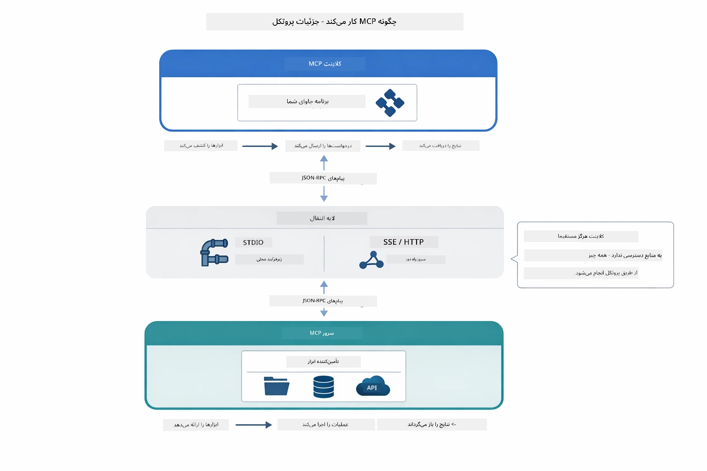

*چگونگی عملکرد MCP در لایه زیرین — کلاینت‌ها ابزارها را کشف می‌کنند، پیام‌های JSON-RPC رد و بدل می‌کنند، و از طریق لایه انتقال عملیات را اجرا می‌کنند.*

**معماری سرور-کلاینت**

MCP از مدل سرور-کلاینت استفاده می‌کند. سرورها ابزارها را ارائه می‌دهند — خواندن فایل‌ها، جستجوی بانک اطلاعاتی، تماس با APIها. کلاینت‌ها (برنامه هوش مصنوعی شما) به سرورها متصل شده و از ابزارهایشان استفاده می‌کنند.

برای استفاده از MCP با LangChain4j، این وابستگی Maven را اضافه کنید:

```xml
<dependency>
    <groupId>dev.langchain4j</groupId>
    <artifactId>langchain4j-mcp</artifactId>
    <version>${langchain4j.version}</version>
</dependency>
```

**کشف ابزارها**

وقتی کلاینت شما به سرور MCP متصل می‌شود، می‌پرسد «چه ابزارهایی دارید؟» سرور با فهرستی از ابزارهای موجود پاسخ می‌دهد که هرکدام توصیف‌ها و اسکیمای پارامتر دارند. عامل هوش مصنوعی شما می‌تواند بر اساس درخواست‌های کاربر تصمیم بگیرد کدام ابزارها را استفاده کند. نمودار زیر این دست دادن را نشان می‌دهد — کلاینت درخواست `tools/list` ارسال می‌کند و سرور ابزارهای موجود را با توصیف‌ها و اسکیمای پارامتر بازمی‌گرداند:

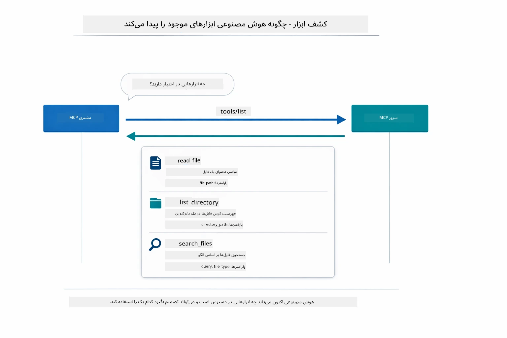

*هوش مصنوعی در زمان راه‌اندازی ابزارهای موجود را کشف می‌کند — اکنون می‌داند چه قابلیت‌هایی در دسترس است و می‌تواند تصمیم بگیرد کدام را استفاده کند.*

**مکانیسم‌های انتقال**

MCP از مکانیسم‌های انتقال مختلف پشتیبانی می‌کند. دو گزینه اصلی Stdio (برای ارتباط زیرفرآیند محلی) و HTTP قابل استریم (برای سرورهای راه دور) هستند. این ماژول مکانیسم انتقال Stdio را نشان می‌دهد:


*مکانیسم‌های انتقال MCP: HTTP برای سرورهای راه دور، Stdio برای فرآیندهای محلی*

**Stdio** - [StdioTransportDemo.java](../../../05-mcp/src/main/java/com/example/langchain4j/mcp/StdioTransportDemo.java)

برای فرآیندهای محلی. برنامه شما سرور را به عنوان یک زیرفرآیند اجرا می‌کند و از طریق ورودی/خروجی استاندارد ارتباط برقرار می‌کند. برای دسترسی به سیستم فایل یا ابزارهای خط فرمان مفید است.

```java
McpTransport stdioTransport = new StdioMcpTransport.Builder()
    .command(List.of(
        npmCmd, "exec",
        "@modelcontextprotocol/server-filesystem@2025.12.18",
        resourcesDir
    ))
    .logEvents(false)
    .build();
```

سرور `@modelcontextprotocol/server-filesystem` ابزارهای زیر را ارائه می‌دهد که همه در چهارچوب دایرکتوری‌هایی که مشخص می‌کنید محدود شده‌اند:

| ابزار | توضیح |
|------|-------------|
| `read_file` | خواندن محتوای یک فایل واحد |
| `read_multiple_files` | خواندن چندین فایل در یک فراخوانی |
| `write_file` | ایجاد یا بازنویسی یک فایل |
| `edit_file` | انجام ویرایش‌های هدفمند جستجو و جایگزینی |
| `list_directory` | فهرست فایل‌ها و دایرکتوری‌ها در یک مسیر |
| `search_files` | جستجوی بازگشتی برای فایل‌های مطابق با الگو |
| `get_file_info` | دریافت متادیتا فایل (اندازه، زمان‌ها، مجوزها) |
| `create_directory` | ایجاد یک دایرکتوری (شامل دایرکتوری‌های بالادستی) |
| `move_file` | جابجایی یا تغییر نام فایل یا دایرکتوری |

نمودار زیر نشان می‌دهد که چگونه انتقال Stdio در زمان اجرا عمل می‌کند — برنامه جاوای شما سرور MCP را به عنوان یک فرآیند فرزند اجرا می‌کند و آن‌ها از طریق لوله‌های stdin/stdout ارتباط برقرار می‌کنند، بدون مشارکت شبکه یا HTTP:

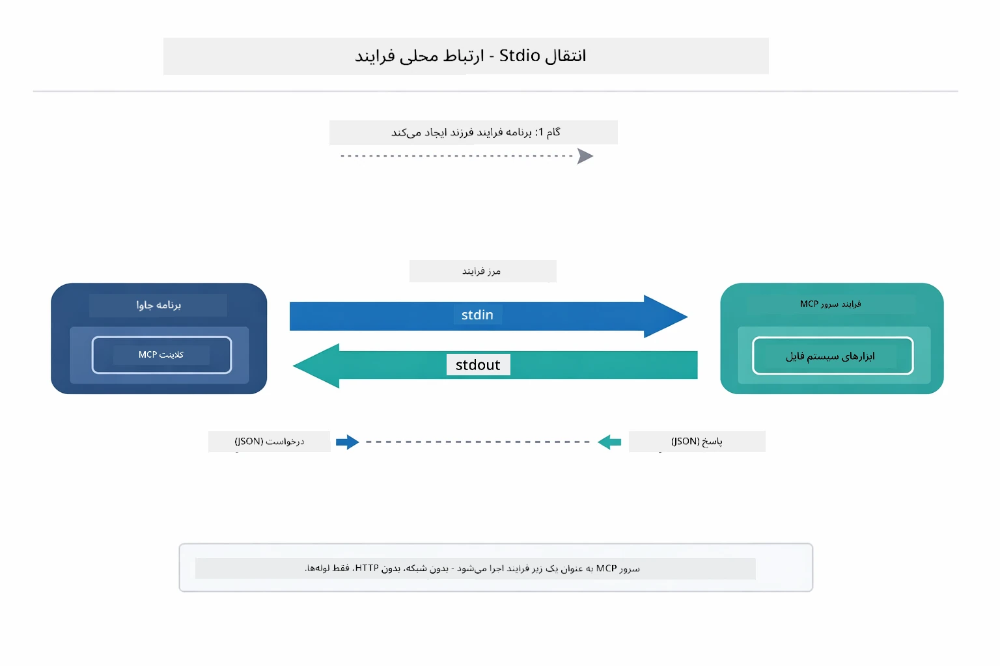

*انتقال Stdio در عمل — برنامه شما سرور MCP را به عنوان فرآیند فرزند اجرا کرده و از طریق لوله‌های stdin/stdout ارتباط برقرار می‌کند.*

> **🤖 با [GitHub Copilot](https://github.com/features/copilot) Chat امتحان کنید:** فایل [`StdioTransportDemo.java`](../../../05-mcp/src/main/java/com/example/langchain4j/mcp/StdioTransportDemo.java) را باز کنید و بپرسید:
> - «انتقال Stdio چگونه کار می‌کند و چه زمانی باید آن را به جای HTTP استفاده کنم؟»
> - «LangChain4j چگونه چرخه حیات فرآیندهای سرور MCP که تولید می‌شوند را مدیریت می‌کند؟»
> - «ملاحظات امنیتی دادن دسترسی AI به سیستم فایل چیست؟»

## ماژول عامل‌مند

در حالی که MCP ابزارهای استانداردشده را ارائه می‌دهد، ماژول **عامل‌مند** LangChain4j راهی اعلامی برای ساخت عامل‌هایی فراهم می‌کند که آن ابزارها را هماهنگ می‌کنند. صفت `@Agent` و `AgenticServices` به شما اجازه می‌دهند رفتار عامل را از طریق اینترفیس‌ها به جای کد امری تعریف کنید.

در این ماژول، الگوی **عامل ناظر** را بررسی خواهید کرد — رویکرد پیشرفته عامل‌مند هوش مصنوعی که در آن یک عامل «ناظر» به صورت پویا تصمیم می‌گیرد کدام زیرعامل‌ها را بر اساس درخواست کاربر فراخوانی کند. ما هر دو مفهوم را ترکیب می‌کنیم و به یکی از زیرعامل‌ها قابلیت دسترسی به فایل از طریق MCP را می‌دهیم.

برای استفاده از ماژول عامل‌مند، این وابستگی Maven را اضافه کنید:

```xml
<dependency>
    <groupId>dev.langchain4j</groupId>
    <artifactId>langchain4j-agentic</artifactId>
    <version>${langchain4j.mcp.version}</version>
</dependency>
```
> **توجه:** ماژول `langchain4j-agentic` از یک خاصیت نسخه جداگانه (`langchain4j.mcp.version`) استفاده می‌کند زیرا برنامه انتشار آن متفاوت از کتابخانه‌های اصلی LangChain4j است.

> **⚠️ آزمایشی:** ماژول `langchain4j-agentic` **آزمایشی** است و ممکن است تغییر کند. روش پایدار برای ساخت دستیارهای هوش مصنوعی همچنان `langchain4j-core` با ابزارهای سفارشی است (ماژول ۰۴).

## اجرای مثال‌ها

### پیش‌نیازها

- تکمیل [ماژول ۰۴ - ابزارها](../04-tools/README.md) (این ماژول بر مفاهیم ابزار سفارشی ساخته شده و آن‌ها را با ابزارهای MCP مقایسه می‌کند)
- فایل `.env` در دایرکتوری ریشه با مجوزهای Azure (ایجاد شده توسط `azd up` در ماژول ۰۱)
- جاوا ۲۱ یا بالاتر، مِیون ۳.۹ یا بالاتر
- Node.js 16 به بالا و npm (برای سرورهای MCP)

> **توجه:** اگر هنوز متغیرهای محیطی‌تان را تنظیم نکرده‌اید، به [ماژول ۰۱ - مقدمه](../01-introduction/README.md) برای دستورالعمل‌های استقرار مراجعه کنید (فایل `.env` به طور خودکار توسط `azd up` ساخته می‌شود)، یا فایل `.env.example` را به `.env` در ریشه کپی کرده و مقادیر خود را وارد کنید.

## شروع سریع

**استفاده از VS Code:** به سادگی روی هر فایل دمو در پنل Explorer راست‌کلیک کنید و گزینه **"Run Java"** را انتخاب نمایید، یا از پیکربندی‌های راه‌اندازی در پنل Run and Debug استفاده کنید (ابتدا مطمئن شوید فایل `.env` با مجوزهای Azure پیکربندی شده است).

**استفاده از Maven:** همچنین می‌توانید با استفاده از خط فرمان با مثال‌های زیر اجرا کنید.

### عملیات فایل (Stdio)

این مثال ابزارهای مبتنی بر زیرفرآیند محلی را نشان می‌دهد.

**✅ نیاز به پیش‌نیاز ندارد** - سرور MCP به طور خودکار اجرا می‌شود.

**استفاده از اسکریپت‌های شروع (توصیه شده):**

اسکریپت‌های شروع به طور خودکار متغیرهای محیطی را از فایل `.env` ریشه بارگذاری می‌کنند:

**Bash:**
```bash
cd 05-mcp
chmod +x start-stdio.sh
./start-stdio.sh
```

**PowerShell:**
```powershell
cd 05-mcp
.\start-stdio.ps1
```

**استفاده از VS Code:** روی فایل `StdioTransportDemo.java` راست‌کلیک کنید و گزینه **"Run Java"** را انتخاب نمایید (اطمینان حاصل کنید فایل `.env` پیکربندی شده است).

برنامه به طور خودکار سرور MCP سیستم فایل را اجرا کرده و یک فایل محلی را می‌خواند. توجه کنید که مدیریت زیرفرآیند برای شما انجام شده است.

**خروجی مورد انتظار:**
```
Assistant response: The file provides an overview of LangChain4j, an open-source Java library
for integrating Large Language Models (LLMs) into Java applications...
```

### عامل ناظر

الگوی **عامل ناظر** شکلی **قابل انعطاف** از هوش مصنوعی عامل‌مند است. یک ناظر با استفاده از LLM به طور خودکار تصمیم می‌گیرد کدام عامل‌ها را بر اساس درخواست کاربر فراخوانی کند. در مثال بعدی، دسترسی به فایل مبتنی بر MCP را با یک عامل LLM ترکیب می‌کنیم تا جریان کاری خواندن فایل → گزارش را به صورت نظارت‌شده بسازیم.

در دمو، `FileAgent` یک فایل را با استفاده از ابزارهای سیستم فایل MCP می‌خواند، و `ReportAgent` گزارشی ساختاریافته با یک خلاصه اجرایی (یک جمله)، ۳ نکته کلیدی، و توصیه‌ها تولید می‌کند. ناظر این جریان را به طور خودکار هماهنگ می‌کند:

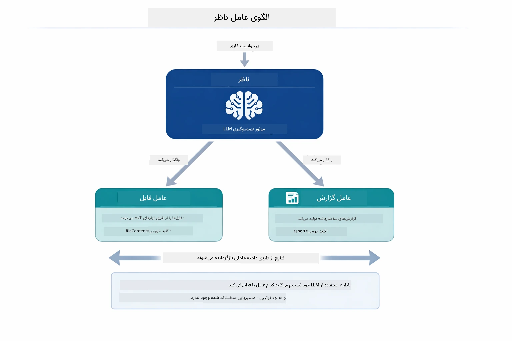

*ناظر با استفاده از LLM خود تصمیم می‌گیرد کدام عامل‌ها را فراخوانی کند و به چه ترتیب — نیازی به مسیریابی کدگذاری شده نیست.*

جریان کاری مشخص برای خط لوله فایل به گزارش به این شکل است:

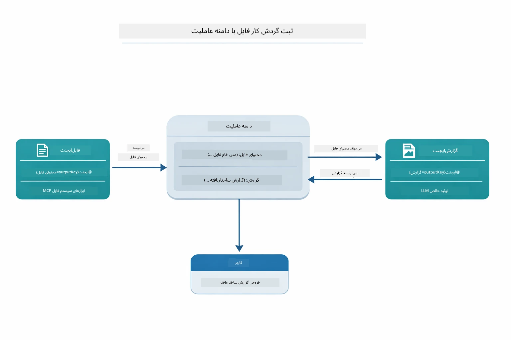

*FileAgent فایل را از طریق ابزارهای MCP می‌خواند، سپس ReportAgent محتوای خام را به گزارشی ساختاری تبدیل می‌کند.*

هر عامل خروجی خود را در **Agentic Scope** (حافظه مشترک) ذخیره می‌کند، که به عامل‌های پایین‌دست اجازه می‌دهد به نتایج قبلی دسترسی داشته باشند. این نشان می‌دهد چگونه ابزارهای MCP به صورت یکپارچه در جریان‌های کاری عامل‌مند جا می‌گیرند — ناظر نیازی ندارد بداند *چگونه* فایل‌ها خوانده می‌شوند، فقط کافی است که `FileAgent` می‌تواند این کار را انجام دهد.

#### اجرای دمو

اسکریپت‌های شروع به طور خودکار متغیرهای محیطی را از فایل `.env` ریشه بارگذاری می‌کنند:

**Bash:**
```bash
cd 05-mcp
chmod +x start-supervisor.sh
./start-supervisor.sh
```

**PowerShell:**
```powershell
cd 05-mcp
.\start-supervisor.ps1
```

**استفاده از VS Code:** روی فایل `SupervisorAgentDemo.java` راست‌کلیک کنید و گزینه **"Run Java"** را انتخاب کنید (اطمینان حاصل کنید فایل `.env` پیکربندی شده است).

#### چگونگی عملکرد ناظر

قبل از ساخت عامل‌ها، باید انتقال MCP را به یک کلاینت متصل کرده و آن را به عنوان `ToolProvider` بپیچید. این روش باعث می‌شود ابزارهای سرور MCP در دسترس عامل‌های شما قرار گیرد:

```java
// ساخت یک کلاینت MCP از طریق ترنسپورت
McpClient mcpClient = new DefaultMcpClient.Builder()
        .transport(stdioTransport)
        .build();

// بسته‌بندی کلاینت به عنوان ToolProvider — این پل ابزارهای MCP را به LangChain4j متصل می‌کند
ToolProvider mcpToolProvider = McpToolProvider.builder()
        .mcpClients(List.of(mcpClient))
        .build();
```

اکنون می‌توانید `mcpToolProvider` را به هر عاملی که به ابزارهای MCP نیاز دارد تزریق کنید:

```java
// مرحله ۱: فایل‌ایجنت فایل‌ها را با استفاده از ابزارهای MCP می‌خواند
FileAgent fileAgent = AgenticServices.agentBuilder(FileAgent.class)
        .chatModel(model)
        .toolProvider(mcpToolProvider)  // دارای ابزارهای MCP برای عملیات فایل
        .build();

// مرحله ۲: گزارش‌ایجنت گزارش‌های ساختاریافته تولید می‌کند
ReportAgent reportAgent = AgenticServices.agentBuilder(ReportAgent.class)
        .chatModel(model)
        .build();

// ناظر جریان کاری فایل → گزارش را هماهنگ می‌کند
SupervisorAgent supervisor = AgenticServices.supervisorBuilder()
        .chatModel(model)
        .subAgents(fileAgent, reportAgent)
        .responseStrategy(SupervisorResponseStrategy.LAST)  // گزارش نهایی را بازگردان
        .build();

// ناظر بر اساس درخواست تصمیم می‌گیرد کدام ایجنت‌ها فراخوانی شوند
String response = supervisor.invoke("Read the file at /path/file.txt and generate a report");
```

#### راهبردهای پاسخ

وقتی یک `SupervisorAgent` پیکربندی می‌کنید، مشخص می‌نمایید چگونه باید پاسخ نهایی به کاربر را پس از اتمام کار زیرعامل‌ها فرموله کند. نمودار زیر سه راهبرد موجود را نشان می‌دهد — LAST خروجی آخرین عامل را مستقیم برمی‌گرداند، SUMMARY همه خروجی‌ها را با LLM ترکیب می‌کند، و SCORED هرکدام که امتیاز بالاتری در برابر درخواست اصلی کاربر داشته باشد را انتخاب می‌کند:

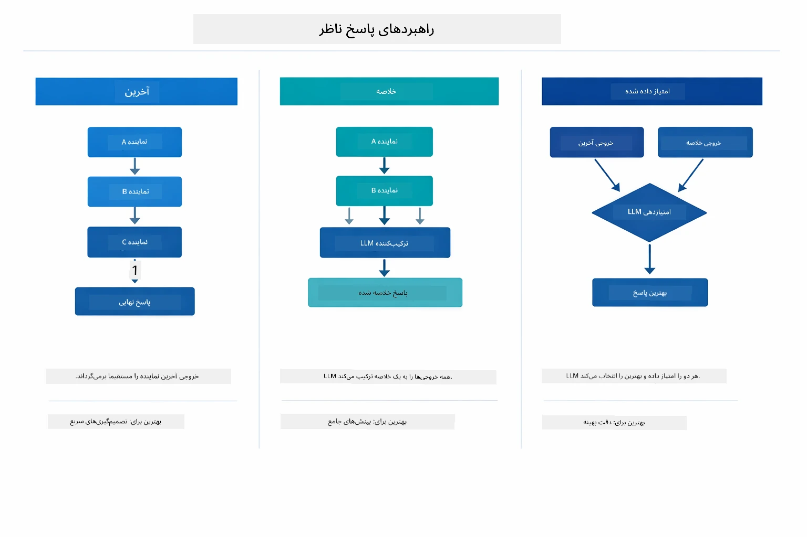

*سه راهبرد برای فرموله کردن پاسخ نهایی توسط ناظر — بر اساس اینکه خروجی آخرین عامل، خلاصه ترکیبی، یا بهترین گزینه امتیازدار را می‌خواهید انتخاب کنید.*

راهبردهای موجود عبارتند از:

| راهبرد | توضیح |
|----------|-------------|
| **LAST** | ناظر خروجی آخرین زیرعامل یا ابزار فراخوانی شده را برمی‌گرداند. این زمانی مفید است که عامل نهایی در جریان کاری برای تولید پاسخ کامل نهایی طراحی شده باشد (مثلاً یک «عامل خلاصه‌ساز» در خط لوله تحقیق). |
| **SUMMARY** | ناظر با استفاده از مدل زبان داخلی خود، خلاصه‌ای از کل تعامل و خروجی‌های زیرعامل‌ها را ترکیب کرده و آن خلاصه را به عنوان پاسخ نهایی برمی‌گرداند. این پاسخ جمع‌بندی تمیزی را به کاربر ارائه می‌دهد. |
| **SCORED** | سیستم با استفاده از مدل زبان داخلی، هم پاسخ LAST و هم خلاصه SUMMARY را نسبت به درخواست اصلی کاربر امتیازدهی می‌کند و خروجی با امتیاز بالاتر را بازمی‌گرداند. |
کد کامل را در [SupervisorAgentDemo.java](../../../05-mcp/src/main/java/com/example/langchain4j/mcp/SupervisorAgentDemo.java) ببینید.

> **🤖 امتحان کنید با گپ [GitHub Copilot](https://github.com/features/copilot):** فایل [`SupervisorAgentDemo.java`](../../../05-mcp/src/main/java/com/example/langchain4j/mcp/SupervisorAgentDemo.java) را باز کنید و بپرسید:
> - "سرپرست چگونه تصمیم می‌گیرد کدام عامل‌ها را فراخوانی کند؟"
> - "تفاوت الگوهای سرپرست و جریان کاری ترتیبی چیست؟"
> - "چگونه می‌توانم رفتار برنامه‌ریزی سرپرست را سفارشی کنم؟"

#### درک خروجی

وقتی دمو را اجرا می‌کنید، یک مرور ساختاریافته خواهید دید از اینکه سرپرست چگونه چندین عامل را هماهنگ می‌کند. هر بخش به چه معناست:

```
======================================================================
  FILE → REPORT WORKFLOW DEMO
======================================================================

This demo shows a clear 2-step workflow: read a file, then generate a report.
The Supervisor orchestrates the agents automatically based on the request.
```
  
**سرفصل** مفهوم جریان کاری را معرفی می‌کند: خط لوله تمرکز یافته‌ای که از خواندن فایل تا تولید گزارش پیش می‌رود.

```
--- WORKFLOW ---------------------------------------------------------
  ┌─────────────┐      ┌──────────────┐
  │  FileAgent  │ ───▶ │ ReportAgent  │
  │ (MCP tools) │      │  (pure LLM)  │
  └─────────────┘      └──────────────┘
   outputKey:           outputKey:
   'fileContent'        'report'

--- AVAILABLE AGENTS -------------------------------------------------
  [FILE]   FileAgent   - Reads files via MCP → stores in 'fileContent'
  [REPORT] ReportAgent - Generates structured report → stores in 'report'
```
  
**نمودار جریان کاری** جریان داده بین عامل‌ها را نشان می‌دهد. هر عامل نقش مشخصی دارد:  
- **FileAgent** با ابزارهای MCP فایل‌ها را می‌خواند و محتوای خام را در `fileContent` ذخیره می‌کند  
- **ReportAgent** آن محتوا را مصرف می‌کند و گزارشی ساختاریافته در `report` تولید می‌کند

```
--- USER REQUEST -----------------------------------------------------
  "Read the file at .../file.txt and generate a report on its contents"
```
  
**درخواست کاربر** کار را نشان می‌دهد. سرپرست آن را پردازش می‌کند و تصمیم می‌گیرد ابتدا FileAgent و سپس ReportAgent را فراخوانی کند.

```
--- SUPERVISOR ORCHESTRATION -----------------------------------------
  The Supervisor decides which agents to invoke and passes data between them...

  +-- STEP 1: Supervisor chose -> FileAgent (reading file via MCP)
  |
  |   Input: .../file.txt
  |
  |   Result: LangChain4j is an open-source, provider-agnostic Java framework for building LLM...
  +-- [OK] FileAgent (reading file via MCP) completed

  +-- STEP 2: Supervisor chose -> ReportAgent (generating structured report)
  |
  |   Input: LangChain4j is an open-source, provider-agnostic Java framew...
  |
  |   Result: Executive Summary...
  +-- [OK] ReportAgent (generating structured report) completed
```
  
**هماهنگی سرپرست** جریان دو مرحله‌ای را به صورت عملی نشان می‌دهد:  
1. **FileAgent** فایل را از طریق MCP می‌خواند و محتوا را ذخیره می‌کند  
2. **ReportAgent** محتوا را دریافت می‌کند و گزارش ساخت‌یافته می‌سازد

سرپرست این تصمیمات را به صورت **خودکار** بر اساس درخواست کاربر گرفته است.

```
--- FINAL RESPONSE ---------------------------------------------------
Executive Summary
...

Key Points
...

Recommendations
...

--- AGENTIC SCOPE (Data Flow) ----------------------------------------
  Each agent stores its output for downstream agents to consume:
  * fileContent: LangChain4j is an open-source, provider-agnostic Java framework...
  * report: Executive Summary...
```
  
#### توضیح ویژگی‌های ماژول عامل‌محور

این مثال چندین ویژگی پیشرفته ماژول عامل‌محور را نشان می‌دهد. بیایید نگاهی دقیق‌تر به Agentic Scope و Agent Listeners داشته باشیم.

**Agentic Scope** حافظه مشترکی است که عامل‌ها نتایج خود را با استفاده از `@Agent(outputKey="...")` در آن ذخیره کردند. این امکان‌ها را فراهم می‌کند:  
- عامل‌های بعدی می‌توانند خروجی‌های عامل‌های قبلی را دسترسی داشته باشند  
- سرپرست می‌تواند پاسخ نهایی را ترکیب کند  
- شما می‌توانید ببینید هر عامل چه تولید کرده است

نمودار زیر نشان می‌دهد چگونه Agentic Scope به عنوان حافظه مشترک در جریان کار فایل به گزارش کار می‌کند — FileAgent خروجی خود را زیر کلید `fileContent` می‌نویسد، ReportAgent آن را می‌خواند و خروجی خود را زیر `report` می‌نویسد:

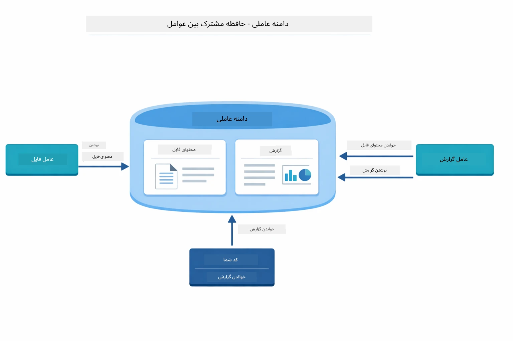

*Agentic Scope به عنوان حافظه مشترک عمل می‌کند — FileAgent محتوای `fileContent` را می‌نویسد، ReportAgent آن را می‌خواند و `report` را می‌نویسد و کد شما نتیجه نهایی را می‌خواند.*

```java
ResultWithAgenticScope<String> result = supervisor.invokeWithAgenticScope(request);
AgenticScope scope = result.agenticScope();
String fileContent = scope.readState("fileContent");  // داده‌های خام فایل از FileAgent
String report = scope.readState("report");            // گزارش ساختاریافته از ReportAgent
```
  
**Agent Listeners** امکان نظارت و اشکال‌زدایی اجرای عامل‌ها را فراهم می‌کنند. خروجی مرحله به مرحله‌ای که در دمو می‌بینید از یک AgentListener می‌آید که به هر فراخوانی عامل وصل می‌شود:  
- **beforeAgentInvocation** - زمانی فراخوانی می‌شود که سرپرست یک عامل را انتخاب می‌کند، به شما می‌گوید کدام عامل انتخاب شده و چرا  
- **afterAgentInvocation** - پس از اتمام عامل، نتیجه آن نمایش داده می‌شود  
- **inheritedBySubagents** - اگر درست باشد، این شنوندگان همه عوامل در سلسله مراتب را نظارت می‌کنند

نمودار زیر چرخه کامل زندگی Agent Listener را نشان می‌دهد، از جمله اینکه چگونه `onError` خطاها را هنگام اجرای عامل‌ها مدیریت می‌کند:

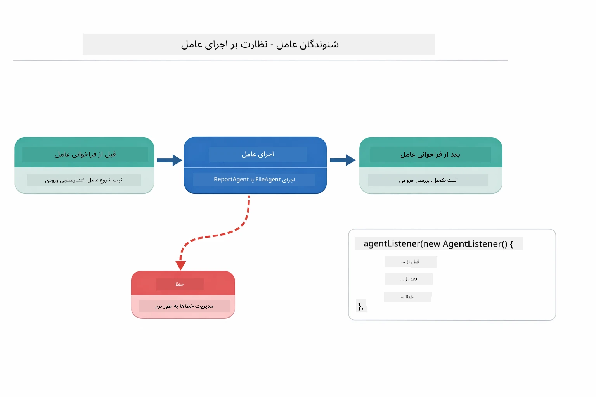

*Agent Listeners به چرخه زندگی اجرا وصل می‌شوند — نظارت بر زمانی که عامل‌ها شروع، اتمام یا با خطا برخورد می‌کنند.*

```java
AgentListener monitor = new AgentListener() {
    private int step = 0;
    
    @Override
    public void beforeAgentInvocation(AgentRequest request) {
        step++;
        System.out.println("  +-- STEP " + step + ": " + request.agentName());
    }
    
    @Override
    public void afterAgentInvocation(AgentResponse response) {
        System.out.println("  +-- [OK] " + response.agentName() + " completed");
    }
    
    @Override
    public boolean inheritedBySubagents() {
        return true; // به همه زیرنمایندگان منتقل کنید
    }
};
```
  
فراتر از الگوی سرپرست، ماژول `langchain4j-agentic` چندین الگوی قدرتمند جریان کاری را ارائه می‌دهد. نمودار زیر همه پنج الگو را نشان می‌دهد — از خط لوله‌های ترتیبی ساده تا جریان‌های کاری تأیید با دخالت انسان:

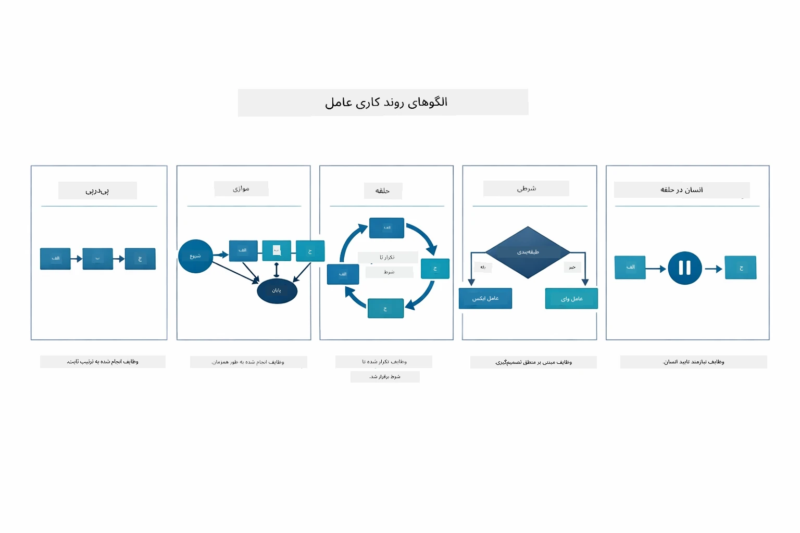

*پنج الگوی جریان کاری برای هماهنگی عامل‌ها — از خطوط لوله ترتیبی ساده تا جریان‌های کاری تأیید با دخالت انسان.*

| الگو | توضیح | مورد کاربرد |
|---------|-------------|----------|
| **Sequential** | عامل‌ها را به ترتیب اجرا می‌کند، خروجی به مرحله بعد می‌رود | خطوط لوله: تحقیق → تحلیل → گزارش |
| **Parallel** | عامل‌ها را به صورت همزمان اجرا می‌کند | کارهای مستقل: هواشناسی + اخبار + بورس |
| **Loop** | تکرار می‌کند تا وقتی شرطی برآورده شود | امتیازدهی کیفیت: اصلاح تا امتیاز ≥ ۰.۸ |
| **Conditional** | هدایت بر اساس شرایط | دسته‌بندی → هدایت به عامل متخصص |
| **Human-in-the-Loop** | نقاط بازرسی انسانی اضافه می‌کند | جریان‌های کاری تأیید، بازبینی محتوا |

## مفاهیم کلیدی

اکنون که MCP و ماژول عامل‌محور را در عمل بررسی کرده‌اید، بیایید خلاصه کنیم چه زمانی هر رویکرد را استفاده کنید.

یکی از بزرگ‌ترین مزایای MCP اکوسیستم در حال رشد آن است. نمودار زیر نشان می‌دهد چگونه یک پروتکل جهانی واحد برنامه هوش مصنوعی شما را به مجموعه وسیعی از سرورهای MCP متصل می‌کند — از دسترسی به سیستم فایل و بانک اطلاعاتی گرفته تا گیت‌هاب، ایمیل، وب‌اسکریپینگ و موارد دیگر:

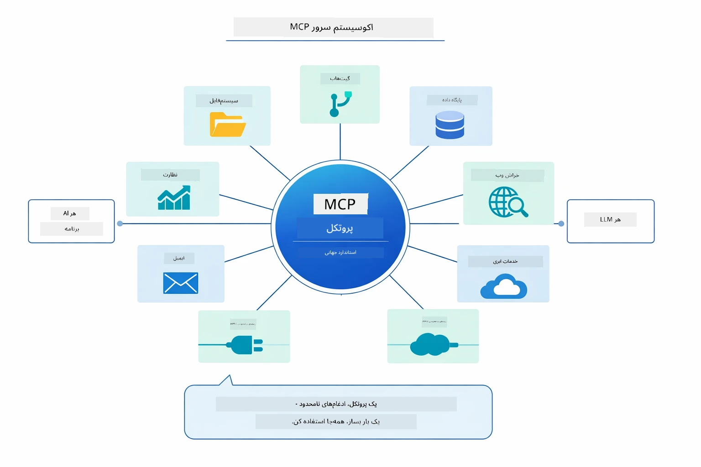

*MCP یک اکوسیستم پروتکل جهانی ایجاد می‌کند — هر سرور سازگار با MCP با هر مشتری سازگار با MCP کار می‌کند و امکان اشتراک‌گذاری ابزار را بین برنامه‌ها فراهم می‌سازد.*

**MCP** زمانی ایده‌آل است که می‌خواهید از اکوسیستم‌های ابزار موجود بهره ببرید، ابزارهایی بسازید که چندین برنامه بتوانند مشترکاً استفاده کنند، سرویس‌های شخص ثالث را با پروتکل‌های استاندارد یکپارچه کنید، یا پیاده‌سازی ابزارها را بدون تغییر کد عوض کنید.

**ماژول Agentic** زمانی بهترین است که بخواهید تعریف‌های اعلانی عامل با حاشیه‌نویسی‌های `@Agent` داشته باشید، نیاز به هماهنگی جریان کاری (ترتیبی، حلقه، موازی) دارید، طراحی عامل مبتنی بر رابط را به جای کد امری ترجیح می‌دهید، یا چندین عامل را ترکیب می‌کنید که خروجی‌ها را از طریق `outputKey` به اشتراک می‌گذارند.

**الگوی Supervisor Agent** زمانی می‌درخشد که جریان کاری از پیش قابل پیش‌بینی نیست و می‌خواهید LLM تصمیم بگیرد، وقتی چندین عامل تخصصی دارید که نیاز به هماهنگی پویا دارند، وقتی سیستم‌های مکالمه‌ای می‌سازید که به توانایی‌های مختلف راه می‌برند، یا وقتی می‌خواهید انعطاف‌پذیرترین رفتار عامل را داشته باشید.

برای کمک به شما در انتخاب بین متدهای سفارشی `@Tool` از ماژول ۰۴ و ابزارهای MCP از این ماژول، مقایسه زیر نکات کلیدی را نشان می‌دهد — ابزارهای سفارشی اتصال محکم و ایمنی کامل نوع برای منطق برنامه را فراهم می‌کنند، در حالی که ابزارهای MCP یکپارچه‌سازی استاندارد و قابل استفاده مجدد ارائه می‌دهند:

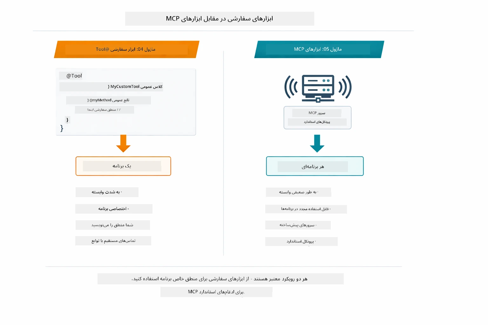

*چه زمانی از متدهای سفارشی @Tool استفاده کنیم و چه زمانی از ابزارهای MCP — ابزارهای سفارشی برای منطق برنامه با ایمنی نوع کامل، ابزارهای MCP برای یکپارچه‌سازی‌های استاندارد که در برنامه‌های مختلف کار می‌کنند.*

## تبریک!

شما تمام پنج ماژول دوره LangChain4j برای مبتدیان را پشت سر گذاشتید! این تصویری از کل مسیر یادگیری است که طی کرده‌اید — از چت ساده تا سیستم‌های عامل‌محور مجهز به MCP:

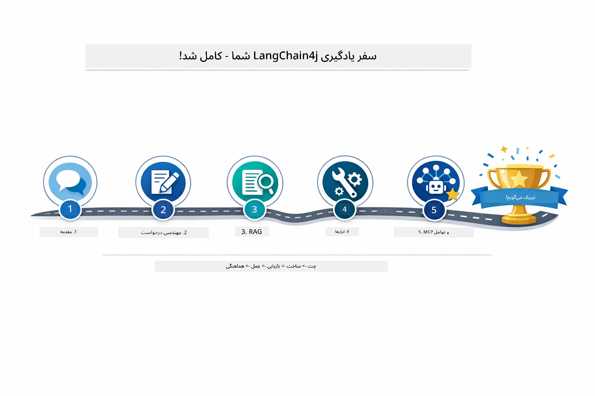

*مسیر یادگیری شما در تمام پنج ماژول — از چت ساده تا سیستم‌های عامل‌محور با قدرت MCP.*

شما دوره LangChain4j برای مبتدیان را به پایان رساندید. آموزش‌های زیر را فرا گرفتید:

- چگونه هوش مصنوعی مکالمه‌ای با حافظه بسازید (ماژول ۰۱)  
- الگوهای مهندسی دستورات برای کارهای مختلف (ماژول ۰۲)  
- پایه‌گذاری پاسخ‌ها در اسناد با RAG (ماژول ۰۳)  
- ساخت عامل‌های هوش مصنوعی پایه (دستیارها) با ابزارهای سفارشی (ماژول ۰۴)  
- ادغام ابزارهای استاندارد با ماژول‌های LangChain4j MCP و Agentic (ماژول ۰۵)

### مرحله بعد؟

پس از اتمام ماژول‌ها، راهنمای [آزمون](../docs/TESTING.md) را ببینید تا مفاهیم تست LangChain4j را در عمل تجربه کنید.

**منابع رسمی:**  
- [مستندات LangChain4j](https://docs.langchain4j.dev/) - راهنماها و مرجع API جامع  
- [گیت‌هاب LangChain4j](https://github.com/langchain4j/langchain4j) - کد منبع و نمونه‌ها  
- [آموزش‌های LangChain4j](https://docs.langchain4j.dev/tutorials/) - آموزش‌های گام به گام برای موارد مختلف استفاده

از اینکه این دوره را تکمیل کردید سپاسگزاریم!

---

**ناوبری:** [← قبلی: ماژول ۰۴ - ابزارها](../04-tools/README.md) | [بازگشت به اصلی](../README.md)

---

<!-- CO-OP TRANSLATOR DISCLAIMER START -->
**سلب مسئولیت**:  
این سند با استفاده از سرویس ترجمه هوش مصنوعی [Co-op Translator](https://github.com/Azure/co-op-translator) ترجمه شده است. در حالی که ما در دقت تلاش می‌کنیم، لطفاً توجه داشته باشید که ترجمه‌های خودکار ممکن است دارای خطاها یا نادرستی‌هایی باشند. سند اصلی به زبان اصلی خود باید به عنوان منبع معتبر در نظر گرفته شود. برای اطلاعات حیاتی، توصیه می‌شود از ترجمه حرفه‌ای انسانی استفاده کنید. ما در قبال هر گونه سوءتفاهم یا برداشت نادرست ناشی از استفاده از این ترجمه مسئولیتی نداریم.
<!-- CO-OP TRANSLATOR DISCLAIMER END -->