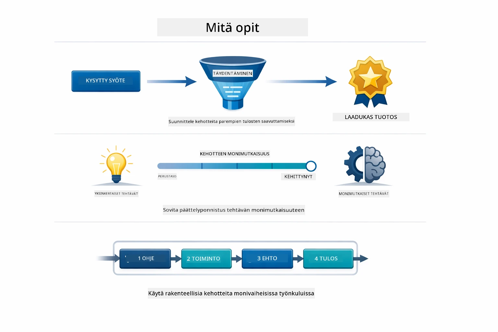
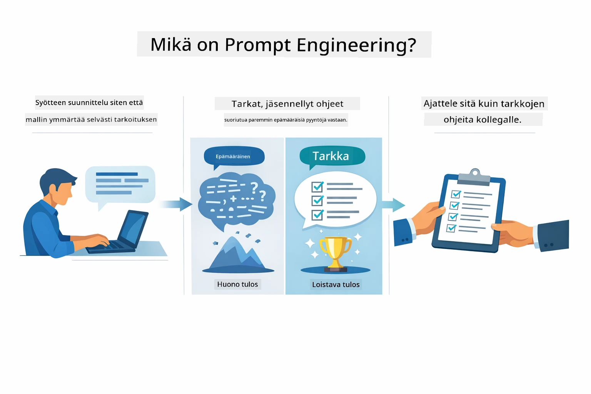
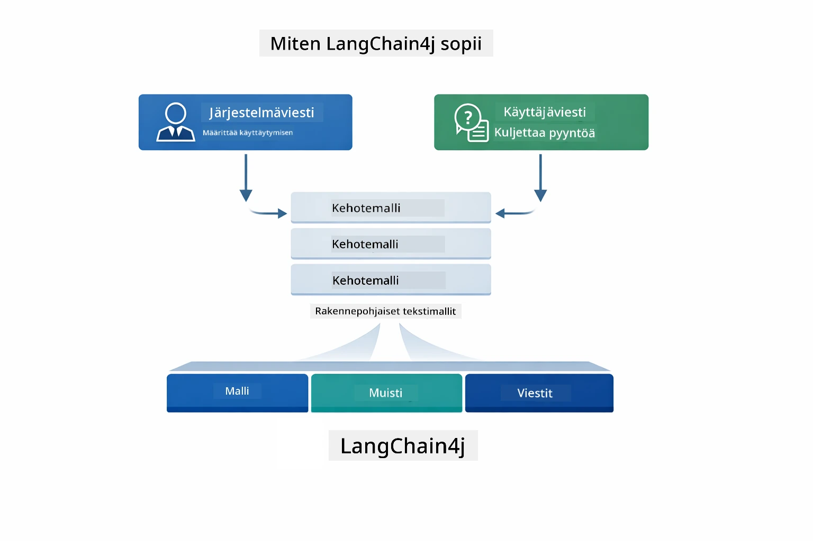
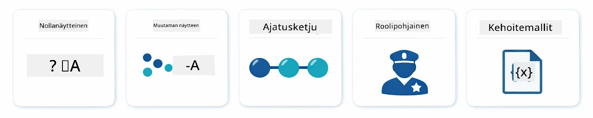
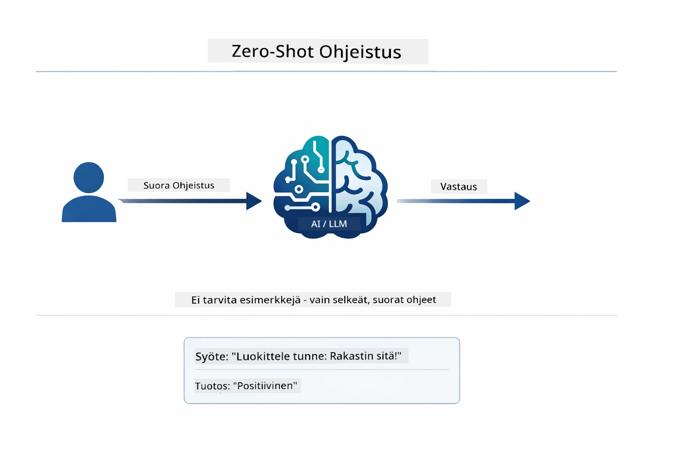
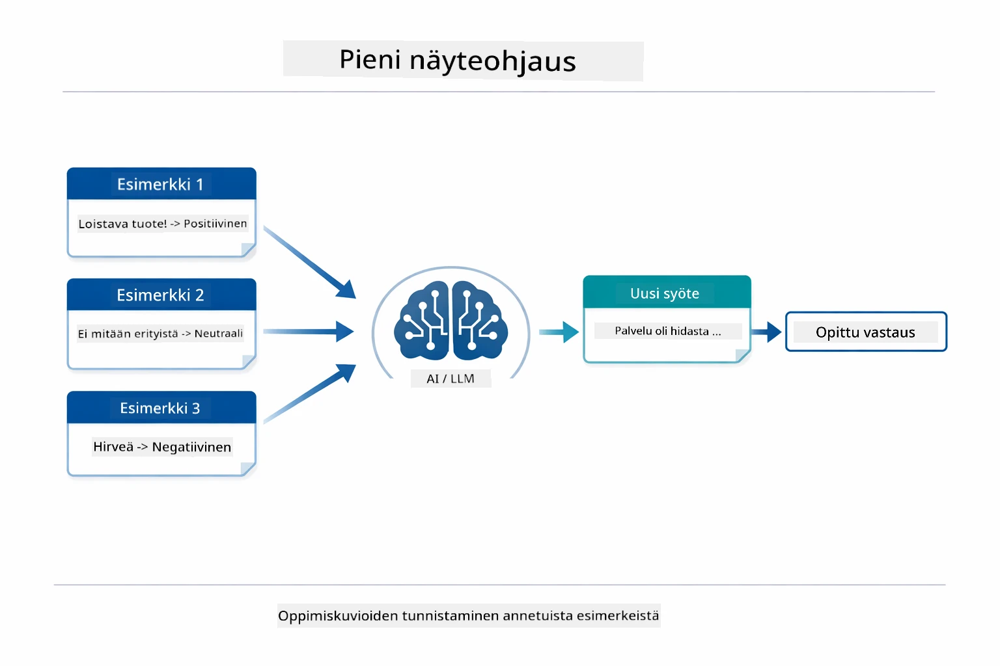
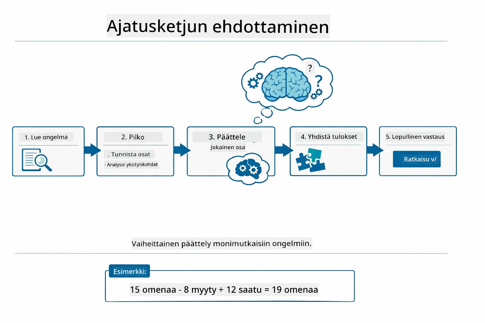
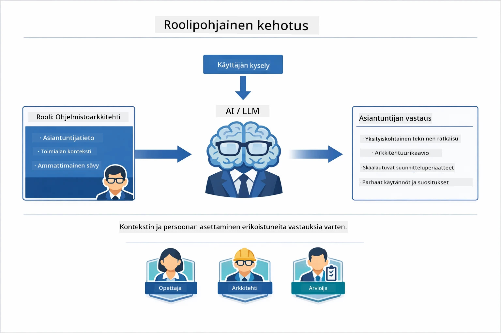
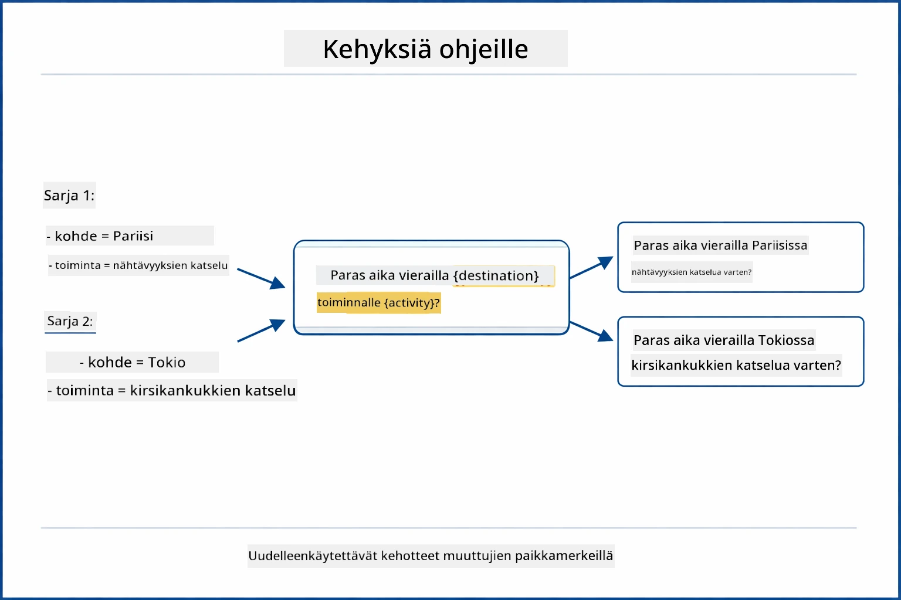
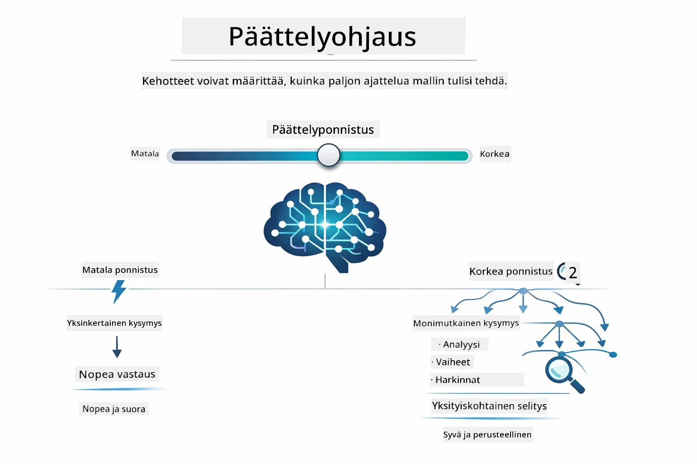

# Moduuli 02: Kehoteinsinööritys GPT-5.2:n kanssa

## Sisällysluettelo

- [Videoesittely](../../../02-prompt-engineering)
- [Mitä opit](../../../02-prompt-engineering)
- [Esivaatimukset](../../../02-prompt-engineering)
- [Kehoteinsinöörityksen ymmärtäminen](../../../02-prompt-engineering)
- [Kehoteinsinöörityksen perusteet](../../../02-prompt-engineering)
  - [Zero-Shot Kehote](../../../02-prompt-engineering)
  - [Few-Shot Kehote](../../../02-prompt-engineering)
  - [Ajatusketju](../../../02-prompt-engineering)
  - [Roolipohjainen kehote](../../../02-prompt-engineering)
  - [Kehotemallit](../../../02-prompt-engineering)
- [Edistyneet mallit](../../../02-prompt-engineering)
- [Olemassa olevien Azure-resurssien käyttö](../../../02-prompt-engineering)
- [Sovelluksen kuvakaappaukset](../../../02-prompt-engineering)
- [Mallien tutkiminen](../../../02-prompt-engineering)
  - [Matalan ja korkean innokkuuden erot](../../../02-prompt-engineering)
  - [Tehtävän suoritus (työkalueleet)](../../../02-prompt-engineering)
  - [Itsereflektoiva koodi](../../../02-prompt-engineering)
  - [Rakenteellinen analyysi](../../../02-prompt-engineering)
  - [Monivaiheinen keskustelu](../../../02-prompt-engineering)
  - [Askel-askeleelta päättely](../../../02-prompt-engineering)
  - [Rajoitettu tulostus](../../../02-prompt-engineering)
- [Mitä todella opit](../../../02-prompt-engineering)
- [Seuraavat askeleet](../../../02-prompt-engineering)

## Videoesittely

Katso tämä live-istunto, joka selittää, kuinka pääset alkuun tämän moduulin kanssa:

<a href="https://www.youtube.com/live/PJ6aBaE6bog?si=LDshyBrTRodP-wke"></a>

## Mitä opit



Edellisessä moduulissa näit, kuinka muisti mahdollistaa keskustelevan tekoälyn ja käytit GitHub-malleja perusvuorovaikutuksessa. Nyt keskitymme siihen, miten esität kysymyksiä — itse kehot — käyttäen Azure OpenAI:n GPT-5.2:ta. Tapa, jolla rakennat kehotteesi, vaikuttaa dramaattisesti saamiisi vastausten laatuun. Aloitamme peruskäyttötekniikoiden kertauksella, ja siirrymme sitten kahdeksaan edistyneeseen malliin, jotka hyödyntävät täysimääräisesti GPT-5.2:n ominaisuuksia.

Käytämme GPT-5.2:ta, koska se tuo mukanaan päättelyn ohjauksen – voit kertoa mallille, kuinka paljon sen tulee ajatella ennen vastaamista. Tämä tekee erilaisista kehotusstrategioista näkyvämpiä ja auttaa sinua ymmärtämään, milloin käyttää kutakin lähestymistapaa. Hyödymme myös Azure:n pienemmistä nopeusrajoista GPT-5.2:lle verrattuna GitHub-malleihin.

## Esivaatimukset

- Moduuli 01 suoritettu (Azure OpenAI -resurssit otettu käyttöön)
- `.env`-tiedosto juurihakemistossa Azure-tunnuksilla (luotu `azd up` -komennolla Moduuli 01:ssa)

> **Huom:** Jos et ole suorittanut Moduulia 01, noudata ensin siellä annettuja käyttöönotto-ohjeita.

## Kehoteinsinöörityksen ymmärtäminen



Kehoteinsinööritys tarkoittaa syötetekstin suunnittelua, joka johdonmukaisesti saa aikaan haluamasi tulokset. Kyse ei ole pelkästään kysymysten esittämisestä – vaan pyynnön rakentamisesta niin, että malli ymmärtää tarkalleen, mitä haluat ja miten se toimitetaan.

Ajattele sitä kuin antaisit ohjeita kollegalle. "Korjaa virhe" on epämääräinen. "Korjaa null pointer -poikkeus UserService.java:n rivillä 45 lisäämällä null-tarkistus" on tarkka. Kielenmallit toimivat samalla tavalla – tarkkuus ja rakenne ovat tärkeitä.



LangChain4j tarjoaa infrastruktuurin — malliyhteydet, muistin ja viestityypit — kun taas kehotemallit ovat vain huolellisesti rakennettua tekstiä, joka kulkee tämän infrastruktuurin kautta. Avainrakennuspalikat ovat `SystemMessage` (joka asettaa tekoälyn käyttäytymisen ja roolin) ja `UserMessage` (joka sisältää varsinaisen pyyntösi).

## Kehoteinsinöörityksen perusteet



Ennen kuin sukellamme tämän moduulin edistyneisiin malleihin, kerrataan viisi peruskäyttötekniikkaa. Nämä ovat rakennuspalikoita, jotka jokaisen kehoteinsinöörin tulisi tuntea. Jos olet jo käynyt läpi [Pika-alustusmoduulin](../00-quick-start/README.md#2-prompt-patterns), olet nähnyt näitä käytännössä — tässä niiden käsitteellinen kehys.

### Zero-Shot Kehote

Yksinkertaisin tapa: anna mallille suora ohje ilman esimerkkejä. Malli luottaa täysin koulutuksensa pohjalta ymmärtämiseen ja tehtävän suorittamiseen. Tämä toimii hyvin suoraviivaisissa pyynnöissä, joissa odotettu käyttäytyminen on ilmeistä.



*Suora ohje ilman esimerkkejä — malli päättelee tehtävän pelkästä ohjeesta*

```java
String prompt = "Classify this sentiment: 'I absolutely loved the movie!'";
String response = model.chat(prompt);
// Vastaus: "Positiivinen"
```

**Milloin käyttää:** Yksinkertaiset luokittelut, suoraviivaiset kysymykset, käännökset tai kaikki tehtävät, joita malli pystyy suorittamaan ilman lisäohjeita.

### Few-Shot Kehote

Anna esimerkkejä, jotka demonstroivat mallille haluamaasi kaavaa. Malli oppii odotetun syöte-lähtö -muodon esimerkeistä ja soveltaa sitä uusiin syötteisiin. Tämä parantaa johdonmukaisuutta merkittävästi tehtävissä, joissa haluttu muoto tai käyttäytyminen ei ole ilmeistä.



*Esimerkeistä oppiminen — malli tunnistaa kaavan ja soveltaa sitä uusiin syötteisiin*

```java
String prompt = """
    Classify the sentiment as positive, negative, or neutral.
    
    Examples:
    Text: "This product exceeded my expectations!" → Positive
    Text: "It's okay, nothing special." → Neutral
    Text: "Waste of money, very disappointed." → Negative
    
    Now classify this:
    Text: "Best purchase I've made all year!"
    """;
String response = model.chat(prompt);
```

**Milloin käyttää:** Mukautetut luokittelut, johdonmukainen muotoilu, toimialakohtaiset tehtävät tai silloin kun zero-shot -tulokset ovat epäjohdonmukaisia.

### Ajatusketju

Pyydä mallia näyttämään päättelynsä askel askeleelta. Sen sijaan, että hyppäisi suoraan vastaukseen, malli purkaa ongelman ja käy läpi jokaisen osan selkeästi. Tämä parantaa tarkkuutta matematiikassa, logiikassa ja monivaiheisissa päättelytehtävissä.



*Askel askeleelta päättely — monimutkaisten ongelmien pilkkominen eksplisiittisiin loogisiin vaiheisiin*

```java
String prompt = """
    Problem: A store has 15 apples. They sell 8 apples and then 
    receive a shipment of 12 more apples. How many apples do they have now?
    
    Let's solve this step-by-step:
    """;
String response = model.chat(prompt);
// Malli näyttää: 15 - 8 = 7, sitten 7 + 12 = 19 omenaa
```

**Milloin käyttää:** Matematiikan ongelmat, logiikkapulmat, vianmääritys tai kaikki tehtävät, joissa päättelyprosessin näyttäminen parantaa tarkkuutta ja luotettavuutta.

### Roolipohjainen kehote

Aseta tekoälylle persoonallisuus tai rooli ennen kysymyksen esittämistä. Tämä antaa kontekstin, joka muokkaa vastauksen sävyä, syvyyttä ja painotusta. "Ohjelmistoarkkitehti" antaa eri neuvot kuin "juniori-kehittäjä" tai "tietoturva-auditööri".



*Kontekstin ja roolin asettaminen — sama kysymys saa erilaisen vastauksen roolista riippuen*

```java
String prompt = """
    You are an experienced software architect reviewing code.
    Provide a brief code review for this function:
    
    def calculate_total(items):
        total = 0
        for item in items:
            total = total + item['price']
        return total
    """;
String response = model.chat(prompt);
```

**Milloin käyttää:** Koodikatselmukset, ohjaus, toimialakohtaiset analyysit tai kun tarvitset vastauksia, jotka on räätälöity tietylle asiantuntija- tai näkökulmatasolle.

### Kehotemallit

Luo uudelleenkäytettäviä kehotteita muuttujapaikoilla. Sen sijaan, että kirjoittaisit uuden kehotteen joka kerta, määrittele malli kerran ja täytä erilaisia arvoja. LangChain4j:n `PromptTemplate`-luokka tekee tämän helpoksi `{{variable}}`-syntaksilla.



*Uudelleenkäytettävät kehoteasettelut muuttujan paikoilla — yksi malli, monta käyttöä*

```java
PromptTemplate template = PromptTemplate.from(
    "What's the best time to visit {{destination}} for {{activity}}?"
);

Prompt prompt = template.apply(Map.of(
    "destination", "Paris",
    "activity", "sightseeing"
));

String response = model.chat(prompt.text());
```

**Milloin käyttää:** Toistuvat kyselyt erilaisilla syötteillä, eräajo, uudelleenkäytettävien AI-työnkulkujen rakentaminen tai tilanteet, joissa kehotteen rakenne pysyy samana mutta data vaihtuu.

---

Nämä viisi perustekniikkaa tarjoavat sinulle vankan työkalupakin useimpiin kehotustehtäviin. Tämän moduulin muu sisältö rakentuu niiden päälle kahdella **kahdeksalla edistyneellä mallilla**, jotka hyödyntävät GPT-5.2:n päättelyohjausta, itsearviointia ja jäsenneltyjä tulosteita.

## Edistyneet mallit

Kun perusteet on käsitelty, siirrytään kahdeksaan edistyneeseen malliin, jotka tekevät tästä moduulista ainutlaatuisen. Kaikki ongelmat eivät vaadi samaa lähestymistapaa. Jotkin kysymykset tarvitsevat nopeita vastauksia, toiset syvällistä ajattelua. Jotkut tarvitsevat näkyvää päättelyä, toiset vain tuloksia. Alla oleva malli on optimoitu eri tilanteisiin — ja GPT-5.2:n päättelyohjaus korostaa näitä eroja entisestään.


*Kahdeksan kehotemallin yleiskatsaus ja käyttötapaukset*



*GPT-5.2:n päättelyohjaus antaa sinun määritellä, kuinka paljon mallin pitää ajatella — nopeista suoraviivaisista vastauksista syvälliseen tutkimukseen*

**Matalan innokkuuden taso (Nopea & Tarkka)** - Yksinkertaisiin kysymyksiin, joissa haluat nopeat, suoraviivaiset vastaukset. Malli käyttää vähän päättelyä – enintään 2 askelta. Käytä tätä laskelmissa, hakuissa tai suoraviivaisissa kysymyksissä.

```java
String prompt = """
    <context_gathering>
    - Search depth: very low
    - Bias strongly towards providing a correct answer as quickly as possible
    - Usually, this means an absolute maximum of 2 reasoning steps
    - If you think you need more time, state what you know and what's uncertain
    </context_gathering>
    
    Problem: What is 15% of 200?
    
    Provide your answer:
    """;

String response = chatModel.chat(prompt);
```

> 💡 **Tutki GitHub Copilotilla:** Avaa [`Gpt5PromptService.java`](../../../02-prompt-engineering/src/main/java/com/example/langchain4j/prompts/service/Gpt5PromptService.java) ja kysy:
> - "Mikä on ero matalan ja korkean innokkuuden kehotemallien välillä?"
> - "Miten XML-tunnisteet kehotteissa auttavat jäsentämään tekoälyn vastausta?"
> - "Milloin käytän itsearviointimalleja vs suoraa ohjeistusta?"

**Korkean innokkuuden taso (Syvällinen & Perusteellinen)** - Monimutkaisiin ongelmiin, joissa haluat kattavan analyysin. Malli tutkii perusteellisesti ja näyttää yksityiskohtaisen päättelyn. Käytä tätä järjestelmäsuunnittelussa, arkkitehtuuripäätöksissä tai monimutkaisessa tutkimuksessa.

```java
String prompt = """
    Analyze this problem thoroughly and provide a comprehensive solution.
    Consider multiple approaches, trade-offs, and important details.
    Show your analysis and reasoning in your response.
    
    Problem: Design a caching strategy for a high-traffic REST API.
    """;

String response = chatModel.chat(prompt);
```

**Tehtävän suoritus (Askel askeleelta edistyminen)** - Monivaiheisiin työnkulkuihin. Malli tarjoaa etukäteissuunnitelman, kertoo jokaisesta vaiheesta työskennellessään ja antaa lopuksi yhteenvedon. Käytä tätä migraatioissa, toteutuksissa tai missä tahansa monivaiheisessa prosessissa.

```java
String prompt = """
    <task_execution>
    1. First, briefly restate the user's goal in a friendly way
    
    2. Create a step-by-step plan:
       - List all steps needed
       - Identify potential challenges
       - Outline success criteria
    
    3. Execute each step:
       - Narrate what you're doing
       - Show progress clearly
       - Handle any issues that arise
    
    4. Summarize:
       - What was completed
       - Any important notes
       - Next steps if applicable
    </task_execution>
    
    <tool_preambles>
    - Always begin by rephrasing the user's goal clearly
    - Outline your plan before executing
    - Narrate each step as you go
    - Finish with a distinct summary
    </tool_preambles>
    
    Task: Create a REST endpoint for user registration
    
    Begin execution:
    """;

String response = chatModel.chat(prompt);
```

Ajatusketju-kehote pyytää mallia näyttämään päättelyprosessinsa, mikä parantaa tarkkuutta monimutkaisissa tehtävissä. Askellus auttaa sekä ihmisiä että tekoälyä ymmärtämään logiikan.

> **🤖 Kokeile [GitHub Copilot](https://github.com/features/copilot) Chatissa:** Kysy tästä mallista:
> - "Kuinka mukauttaisin tehtävän suoritusmallin pitkäkestoisiin operaatioihin?"
> - "Mitkä ovat parhaat käytännöt työkalueleiden jäsentelyssä tuotantosovelluksissa?"
> - "Kuinka voin kaapata ja näyttää kesken olevat etenemispäivitykset käyttöliittymässä?"


*Suunnittele → Suorita → Yhteenveto moniaskelmaisissa tehtävissä*

**Itsereflektoiva koodi** - Tuottaa tuotantolaatuista koodia. Malli generoi koodia, joka noudattaa tuotantostandardeja ja sisältää asianmukaisen virheenkäsittelyn. Käytä tätä uusien ominaisuuksien tai palveluiden rakentamisessa.

```java
String prompt = """
    Generate Java code with production-quality standards: Create an email validation service
    Keep it simple and include basic error handling.
    """;

String response = chatModel.chat(prompt);
```


*Iteratiivinen parannussykli - generoi, arvioi, tunnistaa ongelmat, parantaa, toista*

**Rakenteellinen analyysi** - Johdonmukaiseen arviointiin. Malli tarkastelee koodia kiinteällä viitekehyksellä (oikeellisuus, käytännöt, suorituskyky, turvallisuus, ylläpidettävyys). Käytä tätä koodikatselmuksissa tai laatutarkastuksissa.

```java
String prompt = """
    <analysis_framework>
    You are an expert code reviewer. Analyze the code for:
    
    1. Correctness
       - Does it work as intended?
       - Are there logical errors?
    
    2. Best Practices
       - Follows language conventions?
       - Appropriate design patterns?
    
    3. Performance
       - Any inefficiencies?
       - Scalability concerns?
    
    4. Security
       - Potential vulnerabilities?
       - Input validation?
    
    5. Maintainability
       - Code clarity?
       - Documentation?
    
    <output_format>
    Provide your analysis in this structure:
    - Summary: One-sentence overall assessment
    - Strengths: 2-3 positive points
    - Issues: List any problems found with severity (High/Medium/Low)
    - Recommendations: Specific improvements
    </output_format>
    </analysis_framework>
    
    Code to analyze:
    ```
    public List getUsers() {
        return database.query("SELECT * FROM users");
    }
    ```
    Provide your structured analysis:
    """;

String response = chatModel.chat(prompt);
```

> **🤖 Kokeile [GitHub Copilot](https://github.com/features/copilot) Chatissa:** Kysy rakenteellisesta analyysistä:
> - "Kuinka voin räätälöidä analyysikehystä erilaisiin koodikatselmuksiin?"
> - "Mikä on paras tapa jäsentää ja käsitellä rakenteellista tulostetta ohjelmallisesti?"
> - "Kuinka varmistan johdonmukaiset vakavuustasot eri katselmuskerroilla?"


*Viitekehys johdonmukaisiin koodikatselmuksiin vakavuustasoilla*

**Monivaiheinen keskustelu** - Keskusteluihin, joissa tarvitaan kontekstia. Malli muistaa aiemmat viestit ja rakentaa niiden päälle. Käytä tätä interaktiivisissa tukisessioissa tai monimutkaisissa Q&A-tilanteissa.

```java
ChatMemory memory = MessageWindowChatMemory.withMaxMessages(10);

memory.add(UserMessage.from("What is Spring Boot?"));
AiMessage aiMessage1 = chatModel.chat(memory.messages()).aiMessage();
memory.add(aiMessage1);

memory.add(UserMessage.from("Show me an example"));
AiMessage aiMessage2 = chatModel.chat(memory.messages()).aiMessage();
memory.add(aiMessage2);
```


*Kuinka keskustelukonteksti kertyy useiden vuorojen aikana säiliörajan saavuttamiseksi*

**Askel-askeleelta päättely** - Ongelmissa, jotka vaativat näkyvää logiikkaa. Malli näyttää eksplisiittisen päättelyn jokaisesta vaiheesta. Käytä tätä matematiikan ongelmiin, logiikkapulmiin tai kun haluat ymmärtää ajatteluprosessin.

```java
String prompt = """
    <instruction>Show your reasoning step-by-step</instruction>
    
    If a train travels 120 km in 2 hours, then stops for 30 minutes,
    then travels another 90 km in 1.5 hours, what is the average speed
    for the entire journey including the stop?
    """;

String response = chatModel.chat(prompt);
```


*Ongelmien pilkkominen eksplisiittisiin loogisiin vaiheisiin*

**Rajoitettu tulostus** - Vastauksiin, joilla on tarkat muotoiluvaatimukset. Malli noudattaa tiukasti muotoilu- ja pituussääntöjä. Käytä tätä tiivistelmissä tai kun tarvitset täsmällistä tulostusrakennetta.

```java
String prompt = """
    <constraints>
    - Exactly 100 words
    - Bullet point format
    - Technical terms only
    </constraints>
    
    Summarize the key concepts of machine learning.
    """;

String response = chatModel.chat(prompt);
```


*Erityisten muoto-, pituus- ja rakennevaatimusten toteuttaminen*

## Olemassa olevien Azure-resurssien käyttö

**Varmista käyttöönotto:**

Varmista, että `.env`-tiedosto on juurihakemistossa Azure-tunnuksilla (luotu Moduuli 01:n aikana):
```bash
cat ../.env  # Pitäisi näyttää AZURE_OPENAI_ENDPOINT, API_KEY, DEPLOYMENT
```

**Käynnistä sovellus:**

> **Huom:** Jos olet jo käynnistänyt kaikki sovellukset käyttämällä `./start-all.sh` Moduuli 01:stä, tämä moduuli on jo käynnissä portissa 8083. Voit ohittaa alla olevat käynnistyskomennot ja siirtyä suoraan osoitteeseen http://localhost:8083.
**Vaihtoehto 1: Spring Boot Dashboardin käyttäminen (Suositeltu VS Code -käyttäjille)**

Kehityssäiliö sisältää Spring Boot Dashboard -laajennuksen, joka tarjoaa visuaalisen käyttöliittymän kaikkien Spring Boot -sovellusten hallintaan. Löydät sen VS Coden vasemmalla puolella olevasta Aktiviteettipalkista (etsi Spring Boot -kuvaketta).

Spring Boot Dashboardista voit:
- nähdä kaikki käytettävissä olevat Spring Boot -sovellukset työtilassa
- käynnistää/pysäyttää sovelluksia yhdellä napsautuksella
- tarkastella sovelluslokit reaaliajassa
- seurata sovelluksen tilaa

Klikkaa vain "prompt-engineering" -moduulin vieressä olevaa toistopainiketta käynnistääksesi tämän moduulin tai käynnistä kaikki moduulit kerralla.


**Vaihtoehto 2: Kuoriskriptien käyttäminen**

Käynnistä kaikki web-sovellukset (moduulit 01-04):

**Bash:**
```bash
cd ..  # Juurikansiosta
./start-all.sh
```

**PowerShell:**
```powershell
cd ..  # Juurihakemistosta
.\start-all.ps1
```

Tai käynnistä vain tämä moduuli:

**Bash:**
```bash
cd 02-prompt-engineering
./start.sh
```

**PowerShell:**
```powershell
cd 02-prompt-engineering
.\start.ps1
```

Molemmat skriptit lataavat automaattisesti ympäristömuuttujat juurin `.env`-tiedostosta ja kokoavat JAR-tiedostot, jos niitä ei ole vielä olemassa.

> **Huom:** Jos haluat koota kaikki moduulit manuaalisesti ennen käynnistämistä:
>
> **Bash:**
> ```bash
> cd ..  # Go to root directory
> mvn clean package -DskipTests
> ```
>
> **PowerShell:**
> ```powershell
> cd ..  # Go to root directory
> mvn clean package -DskipTests
> ```

Avaa selaimessasi osoite http://localhost:8083.

**Pysäyttääksesi:**

**Bash:**
```bash
./stop.sh  # Tämä moduuli vain
# Tai
cd .. && ./stop-all.sh  # Kaikki moduulit
```

**PowerShell:**
```powershell
.\stop.ps1  # Vain tämä moduuli
# Tai
cd ..; .\stop-all.ps1  # Kaikki moduulit
```

## Sovelluksen kuvakaappaukset


*Pääkohtaus, joka näyttää kaikki 8 prompt-engineering-kuviota niiden ominaisuuksineen ja käyttötapauksineen*

## Kuvioiden tutkiminen

Verkkokäyttöliittymä antaa sinun kokeilla eri ehdottamisstrategioita. Jokainen kuvio ratkaisee erilaisia ongelmia – kokeile niitä nähdäksesi, milloin kukin lähestymistapa toimii parhaiten.

> **Huom: Suora lähetys vs Ei-suora** — Jokaisella kuviosivulla on kaksi painiketta: **🔴 Stream Response (Live)** ja **Ei-suora** -vaihtoehto. Suora lähetystoiminto käyttää Server-Sent Events (SSE) -tekniikkaa ja näyttää tokenit reaaliajassa, kun malli tuottaa niitä, joten näet etenemisen välittömästi. Ei-suora vaihtoehto odottaa koko vastauksen valmistumista ennen näyttämistä. Syvää päättelyä vaativissa kehote kutsuissa (esim. Korkea innokkuus, Itsearvioiva koodi) ei-suora kutsu voi kestää hyvin pitkään – jopa minuutteja – ilman näkyvää palautetta. **Käytä suoraa lähetystä monimutkaisten kehoteiden kokeiluun**, jotta näet mallin toiminnan ja vältyt vaikutelmalta, että pyyntö on aikakatkaistu.
>
> **Huom: Selaintuki** — Suora lähetystoiminto käyttää Fetch Streams API:ta (`response.body.getReader()`), joka vaatii täyden selaimen (Chrome, Edge, Firefox, Safari). Se ei toimi VS Coden sisäänrakennetussa Simple Browserissa, koska sen webview ei tue ReadableStream-rajapintaa. Jos käytät Simple Browseria, ei-suorat painikkeet toimivat normaalisti — ainoastaan suoratoistopainikkeet eivät. Avaa `http://localhost:8083` ulkoisessa selaimessa saadaksesi täydellisen käyttökokemuksen.

### Matala vs Korkea innokkuus

Kysy yksinkertainen kysymys kuten "Mikä on 15% luvusta 200?" käyttäen Matalaa innokkuutta. Saat välittömän, suoran vastauksen. Kysy sitten jotain monimutkaista kuten "Suunnittele välimuististrategia vilkkaalle API:lle" käyttäen Korkeaa innokkuutta. Klikkaa **🔴 Stream Response (Live)** ja seuraa mallin yksityiskohtaista päättelyä token tokenilta. Sama malli, sama kysymysrakenne – mutta kehotteessa kerrotaan, kuinka paljon mallin tulee ajatella.

### Tehtävän suoritus (Työkalujen alkuosat)

Monivaiheiset työnkulut hyötyvät ennakkosuunnittelusta ja kulun kertomisesta. Malli hahmottelee mitä tekee, kertoo jokaisen vaiheen, ja kokoaa lopuksi yhteenvedon tuloksista.

### Itsearvioiva koodi

Kokeile "Luo sähköpostin validointipalvelu". Sen sijaan, että malli vain luo koodin ja pysähtyy, se luo koodin, arvioi sen laatukriteerien perusteella, tunnistaa heikkoudet ja parantaa. Näet mallin toistavan prosessia, kunnes koodi täyttää tuotantovaatimukset.

### Rakenteellinen analyysi

Koodikatselmukset tarvitsevat johdonmukaiset arviointikehykset. Malli analysoi koodia kiinteiden kategorioiden (oikeellisuus, käytännöt, suorituskyky, turvallisuus) ja vakavuustasojen mukaan.

### Monikierroksinen keskustelu

Kysy "Mikä on Spring Boot?" ja heti perään "Näytä minulle esimerkki". Malli muistaa ensimmäisen kysymyksesi ja antaa sinulle juuri Spring Boot -esimerkin. Ilman muistia toinen kysymys olisi liian epämääräinen.

### Askeltainen päättely

Valitse matemaattinen tehtävä ja kokeile sitä sekä Askeltainen päättely-, että Matala innokkuus -menetelmillä. Matala innokkuus antaa vain vastauksen – nopeasti mutta epäselvästi. Askeltainen näyttää jokaisen laskutoimituksen ja päätöksen.

### Rajoitettu tulos

Kun tarvitset tiettyjä muotoja tai sanamääriä, tämä kuvio pakottaa tiukasti noudattamaan vaatimuksia. Kokeile luoda yhteenveto, jossa on täsmälleen 100 sanaa luettelomuodossa.

## Mitä todella opit

**Päättelypyrkimys muuttaa kaiken**

GPT-5.2 antaa sinun hallita laskennallista työtä kehotteiden kautta. Matala pyrkimys tarkoittaa nopeita vastauksia vähäisellä tutkiskeluilla. Korkea pyrkimys tarkoittaa, että malli käyttää aikaa syvään ajatteluun. Opit sovittamaan pyrkimyksen tehtävän vaativuuteen – älä tuhlaa aikaa yksinkertaisiin kysymyksiin, mutta älä myöskään kiirehdi monimutkaisia päätöksiä.

**Rakenne ohjaa käyttäytymistä**

Huomaatko kehotteissa XML-tageja? Ne eivät ole koristeita. Mallit noudattavat rakenteellisia ohjeita luotettavammin kuin vapaamuotoista tekstiä. Kun tarvitset monivaiheisia prosesseja tai monimutkaista logiikkaa, rakenne auttaa mallia seuraamaan, missä se on menossa ja mitä tulee seuraavaksi.


*Hyvin rakennetun kehoteen anatomia selkeine osioineen ja XML-tyylisine järjestelyineen*

**Laadun varmistus itsearvioinnilla**

Itsearvioivat kuviot toimivat tekemällä laatukriteerit selviksi. Sen sijaan, että toivoisit mallin "tekisi oikein", kerrot sille täsmälleen, mitä "oikein" tarkoittaa: oikea logiikka, virheiden käsittely, suorituskyky, turvallisuus. Malli voi sitten arvioida omaa tuotostaan ja parantaa sitä. Tämä muuttaa koodin generoinnin lotoksi muuttuu järjestelmälliseksi prosessiksi.

**Konteksti on rajallinen**

Monikierroksiset keskustelut toimivat sisällyttämällä viestihistorian jokaiseen pyyntöön. Mutta on olemassa raja – jokaisella mallilla on maksimi token-määrä. Kun keskustelut kasvavat, sinun täytyy käyttöön ottaa strategioita säilyttää olennaiset kontekstit ilman, että ylittyy raja. Tämä moduuli näyttää sinulle, miten muisti toimii; myöhemmin opit, milloin tiivistää, milloin unohtaa ja milloin hakea.

## Seuraavat askeleet

**Seuraava moduuli:** [03-rag - RAG (Retrieval-Augmented Generation)](../03-rag/README.md)

---

**Navigointi:** [← Edellinen: Moduuli 01 - Johdanto](../01-introduction/README.md) | [Takaisin pääsivulle](../README.md) | [Seuraava: Moduuli 03 - RAG →](../03-rag/README.md)

---

<!-- CO-OP TRANSLATOR DISCLAIMER START -->
**Vastuuvapauslauseke**:
Tämä asiakirja on käännetty tekoälypohjaisella käännöspalvelulla [Co-op Translator](https://github.com/Azure/co-op-translator). Pyrimme tarkkuuteen, mutta ota huomioon, että automaattikäännökset saattavat sisältää virheitä tai epätarkkuuksia. Alkuperäinen asiakirja sen alkuperäiskielellä on katsottava viralliseksi lähteeksi. Tärkeiden tietojen osalta suositellaan ammattilaisten tekemää ihmiskäännöstä. Emme ole vastuussa tämän käännöksen käytöstä johtuvista väärinymmärryksistä tai virhetulkinnoista.
<!-- CO-OP TRANSLATOR DISCLAIMER END -->